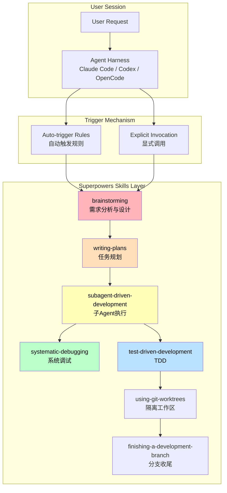
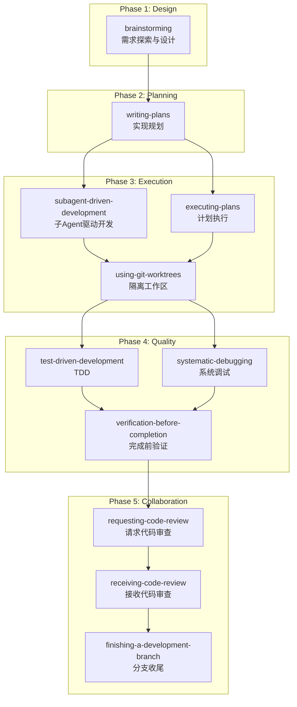
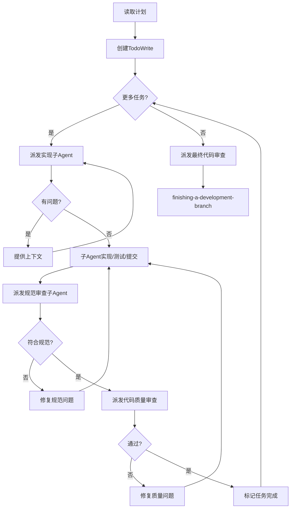
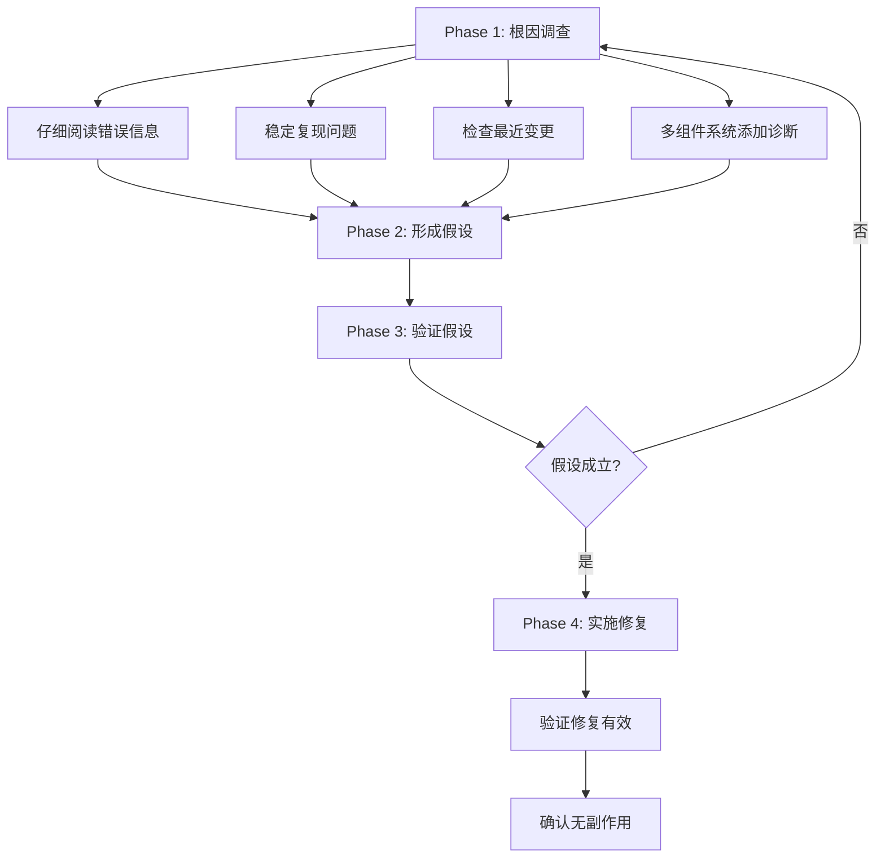
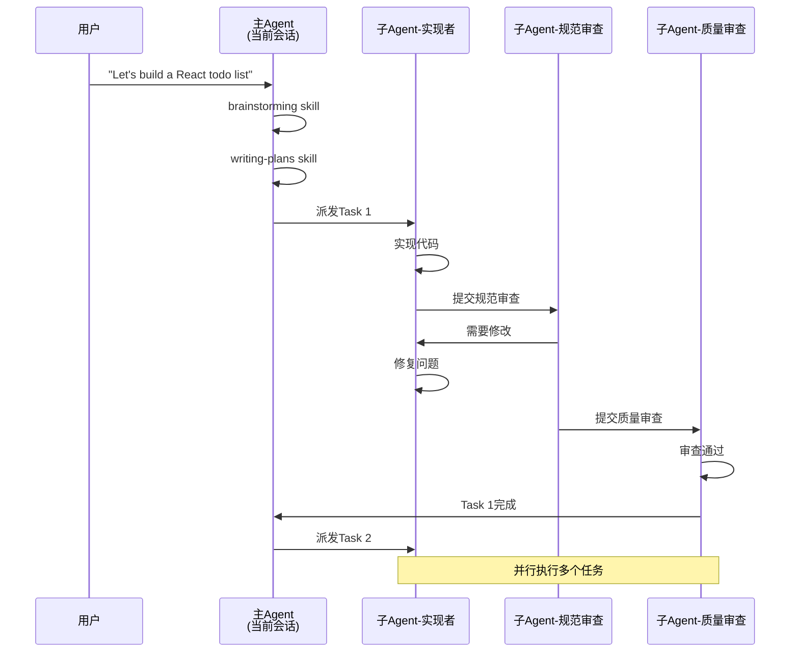
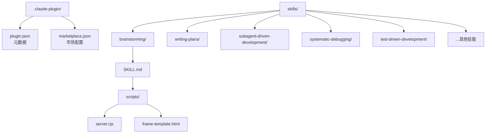

# 【Superpowers】Agentic Skills Framework 核心架构与设计原理深度解析

## 引子

当我第一次在终端里启动 Claude Code 并尝试构建一个 Web 应用时，我习惯性地开始写代码——然后被一个提示拦住了：

> "I'm using the brainstorming skill to understand what we're really building."

这不是我熟悉的 AI 助手行为。大多数 Agent 工具都是「拿到需求就开干」，但 Superpowers 告诉我要先想清楚「做什么」和「为什么做」。

这个看似简单的设计选择，背后是一套完整的 Agent 软件开发方法论。Superpowers 是一个专为 AI Coding Agent 设计的技能框架（Agentic Skills Framework），它通过一组精心设计的技能（Skills）来约束和引导 Agent 的行为，让 AI 从「能写代码」变成「能做好软件工程」。

截至 2026 年 6 月，Superpowers 在 GitHub 上已获得 **21.3 万星**，支持 Claude Code、Codex CLI、OpenCode、Cursor 等主流 Coding Agent，是当前最火的 Agent 技能框架之一。

## 一、项目定位与解决的问题

### 1.1 核心问题

当前 AI Coding Agent 面临三大困境：

1. **过度实现（Over-engineering）**：Agent 拿到需求后往往直接写代码，缺少设计环节，导致代码结构混乱、过度封装
2. **上下文污染（Context Pollution）**：Agent 在长会话中容易受到历史消息影响，产生不一致的代码风格和逻辑
3. **缺乏工程纪律**：TDD、代码审查、细粒度任务分解等软件工程最佳实践往往被跳过

### 1.2 Superpowers 的价值主张

Superpowers 不是一个代码生成工具，而是一套**软件工程方法论的数字化实现**。它将经验证的软件开发最佳实践封装成可自动触发的技能（Skills），让 AI Agent 能够在正确的时间做正确的事。

## 二、核心架构：Skills 驱动的工作流

### 2.1 整体架构



### 2.2 技能触发机制

Superpowers 的核心创新在于**自动触发**。技能通过两种方式激活：

1. **自动触发（Auto-trigger）**：基于规则检测用户意图，自动在关键时刻激活对应技能
2. **显式调用（Explicit Invocation）**：用户通过 `/plugin install superpowers@...` 命令手动触发

每个技能都有 YAML frontmatter 定义的触发条件：

```yaml
---
name: brainstorming
description: "You MUST use this before any creative work - creating features, building components, adding functionality, or modifying behavior. Explores user intent, requirements and design before implementation."
---
```

### 2.3 技能分层



## 三、核心技能详解

### 3.1 brainstorming —— 设计门禁

brainstorming 是整个工作流的**设计门禁（Design Gate）**。它的核心原则是：

> **「NO CODE BEFORE DESIGN」**

**硬门禁规则：**

```yaml
<HARD-GATE>
Do NOT invoke any implementation skill, write any code, scaffold any project, or take any implementation action until you have presented a design and the user has approved it. This applies to EVERY project regardless of perceived simplicity.
</HARD-GATE>
```

**工作流程：**


**设计文档输出位置：**

```bash
docs/superpowers/specs/YYYY-MM-DD-<topic>-design.md
```

### 3.2 writing-plans —— 细粒度任务分解

writing-plans 将设计文档转化为**可执行的任务清单**。它的核心原则是：

- 每个任务 2-5 分钟完成
- 每个任务有明确的文件路径、代码内容、验证步骤
- 假设执行者是一个「有技能但缺乏上下文」的初级工程师

**任务文档格式：**

```markdown
### Task N: [组件名称]

**Files:**
- Create: `exact/path/to/file.py`
- Modify: `exact/path/to/existing.py:123-145`
- Test: `tests/exact/path/to/test.py`

- [ ] **Step 1: Write the failing test**
```python
def test_specific_behavior():
    result = function(input)
    assert result == expected
```

- [ ] **Step 2: Run test to verify it fails**
Run: `pytest tests/path/test.py::test_name -v`
Expected: FAIL with "function not defined"

- [ ] **Step 3: Write minimal implementation**
```python
def function(input):
    return expected
```

- [ ] **Step 4: Run test to verify it passes**
Run: `pytest tests/path/test.py::test_name -v`
Expected: PASS

- [ ] **Step 5: Commit**
```

### 3.3 subagent-driven-development —— 并行子Agent执行

subagent-driven-development 是 Superpowers 的**执行引擎**。它的核心思想是：

> **为每个任务创建独立的子Agent，避免上下文污染**

**执行流程：**



**关键设计：两阶段审查**

1. **规范合规审查（Spec Reviewer）**：确保代码实现了规范要求
2. **代码质量审查（Code Quality Reviewer）**：确保代码符合质量标准

### 3.4 systematic-debugging —— 根因分析优先

systematic-debugging 强制执行**根因分析优先**原则：

```
NO FIXES WITHOUT ROOT CAUSE INVESTIGATION FIRST
```

**调试四阶段：**



## 四、多Agent协作机制

### 4.1 主Agent + 子Agent 模式

Superpowers 采用**主Agent协调 + 子Agent执行**的架构：



### 4.2 上下文隔离

每个子Agent都是**独立上下文**，不继承主Agent的历史：

```python
# 子Agent接收的上下文结构
subagent_context = {
    "task_description": "...",  # 具体任务描述
    "file_paths": [...],         # 涉及的文件
    "spec_excerpt": "...",      # 规范相关部分
    "test_requirements": "...",  # 测试要求
}
```

## 五、插件生态系统

### 5.1 多Harness支持

Superpowers 支持主流 Coding Agent：

| Harness | 安装方式 |
|---------|----------|
| Claude Code | `/plugin install superpowers@claude-plugins-official` |
| Codex CLI | `/plugins` → 搜索 superpowers |
| OpenCode | Fetch from URL |
| Cursor | `/add-plugin superpowers` |
| Gemini CLI | `gemini extensions install` |

### 5.2 插件结构



## 六、与同类项目对比

### 6.1 对比 1：Superpowers vs Deer Flow

| 维度 | Superpowers | Deer Flow |
|------|-------------|-----------|
| **架构定位** | 技能框架 + 开发方法论 | Agent编排 + 多模型协作 |
| **触发机制** | 规则自动触发 + 显式调用 | 配置驱动的Agent链 |
| **核心创新** | TDD + 细粒度任务分解 | 混合Agent + 工具调用优化 |
| **适用场景** | 软件开发全流程 | 复杂研究任务 |

**设计差异：**

- Deer Flow 通过配置定义Agent链，强调「谁来处理」
- Superpowers 通过技能触发控制开发节奏，强调「什么时候做什么」

### 6.2 对比 2：Superpowers vs OpenHands

| 维度 | Superpowers | OpenHands |
|------|-------------|-----------|
| **设计目标** | 约束Agent行为，提升代码质量 | 最大化Agent自主性 |
| **工作流** | 设计→规划→执行（强门禁） | 任务→执行→验证（循环） |
| **上下文管理** | 子Agent隔离，上下文纯净 | 共享上下文，长程记忆 |
| **TDD支持** | 原生内置，强制执行 | 可选集成 |

**核心哲学差异：**

- OpenHands：「让Agent自由发挥，出了问题再修」
- Superpowers：「让Agent按正确方式工作，从一开始就做对」

### 6.3 对比 3：Superpowers vs LangChain Agents

| 维度 | Superpowers | LangChain Agents |
|------|-------------|------------------|
| **抽象层次** | 技能层（行为规范） | 工具层（能力扩展） |
| **触发方式** | 规则自动触发 | 推理引擎选择工具 |
| **代码耦合** | 零依赖，纯技能定义 | 框架依赖 |
| **开发场景** | 专注软件工程 | 通用工作流 |

## 七、优缺点分析

### 7.1 优点

| 维度 | 说明 |
|------|------|
| **架构简洁性** | 零外部依赖，纯文本技能定义，任何Agent都可加载 |
| **扩展性** | 新增技能只需创建目录和SKILL.md文件 |
| **易用性** | 自动触发机制降低用户学习成本 |
| **工程纪律** | 内置TDD、代码审查等最佳实践 |
| **多Harness支持** | 一套技能支持所有主流Coding Agent |
| **子Agent隔离** | 避免上下文污染，保持执行一致性 |

### 7.2 缺点与局限

| 维度 | 说明 |
|------|------|
| **性能开销** | 子Agent创建和两阶段审查增加执行时间 |
| **复杂度** | 对于简单任务，完整流程可能过于繁琐 |
| **维护成本** | 技能数量多，更新传播需要手动同步 |
| **平台锁定** | 依赖特定Agent的插件系统 |

## 八、快速上手

### 8.1 安装（以 Claude Code 为例）

```bash
# 方式1：从官方市场安装
/plugin install superpowers@claude-plugins-official

# 方式2：从自定义市场安装
/plugin marketplace add obra/superpowers-marketplace
/plugin install superpowers@superpowers-marketplace
```

### 8.2 使用示例

```bash
# 1. 启动 Claude Code
claude

# 2. 提出需求（brainstorming 自动触发）
User: Let's make a react todo list

# 3. 等待设计审查完成后，开始规划
# (writing-plans skill 自动触发)

# 4. 执行计划
# (subagent-driven-development skill 自动触发)

# 5. 调试问题
# (systematic-debugging skill 自动触发)
```

### 8.3 核心技能命令

| 技能 | 触发条件 | 命令 |
|------|----------|------|
| `brainstorming` | 任何创建/修改行为前 | 自动触发 |
| `writing-plans` | 设计批准后 | 自动触发 |
| `subagent-driven-development` | 有实现计划时 | 自动触发 |
| `systematic-debugging` | 遇到Bug/失败时 | 自动触发 |
| `test-driven-development` | 进入实现阶段时 | 自动触发 |

## 九、适用场景分析

### 9.1 最佳场景

- **大型复杂项目**：需要设计、规划、多人协作的企业级应用
- **长期维护项目**：需要保持代码一致性和技术债务可控
- **高代码质量要求**：TDD、代码审查是团队标准流程

### 9.2 不适合场景

- **简单脚本任务**：一个简单函数或配置文件不需要完整流程
- **探索性原型**：需要快速迭代验证想法，不适合设计门禁
- **单次数据处理**：一次性数据转换不需要工程化

## 十、趋势与展望

### 10.1 当前趋势

1. **技能生态化**：更多垂直领域技能（安全测试、性能分析）正在涌现
2. **跨Harness标准化**：Skills格式正在成为Agent行为定义的事实标准
3. **评估驱动优化**：通过真实会话评估持续改进技能效果

### 10.2 未来方向

- **技能商店（Skills Marketplace）**：类似App Store的技能发现和分发
- **技能组合（Skills Composition）**：多个技能的自由组合
- **技能评估自动化**：基于任务完成度自动评估技能效果

## 总结

Superpowers 代表了一种重要的范式转变：不是让AI学会更多技能，而是让AI在正确的时机使用正确的技能。它不是替代软件工程师，而是将那些经过验证的软件工程最佳实践数字化，让AI能够可靠地执行。

从某种意义上说，Superpowers 正在做的事情，与20年前极限编程（XP）运动类似——将最佳实践内化为日常行为，只是执行者从人变成了AI。

**核心价值：让AI从「能写代码」变成「能做好软件工程」**

---

**项目信息**

- **GitHub**: https://github.com/obra/superpowers
- **星标**: 213,735+
- **语言**: Shell（技能定义）+ 多语言集成
- **支持Harness**: Claude Code, Codex CLI, OpenCode, Cursor, Gemini CLI, GitHub Copilot CLI
