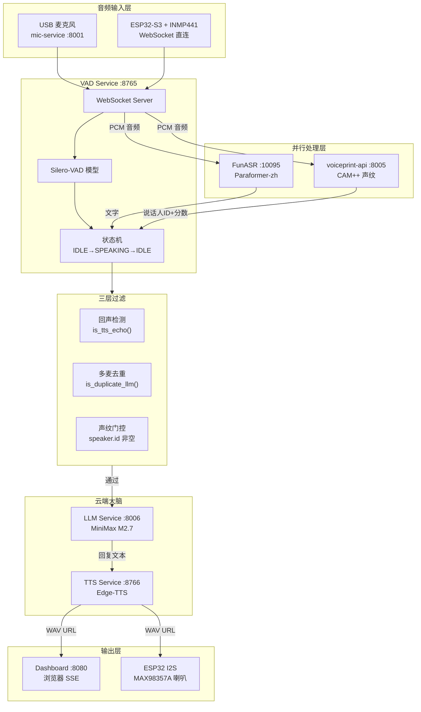

## 引子

做一个能"听"能"说"能"认人"的智能语音助手，听起来需要很复杂——但如果把它拆解成一条数据流水线，每个环节只做一件事，就会清晰很多。

本文深度解析一个开源项目 [voice-pipeline-tutorial](https://github.com/xuqi2024/voice-pipeline-tutorial)，它基于 **Silero-VAD + FunASR + CAM++ 声纹 + MiniMax LLM + Edge-TTS**，构建了一条完整的本地实时语音处理管道，支持 PC 麦克风和 ESP32-S3 两种音频输入，同时服务浏览器和硬件设备。

## 项目简介

### 核心能力

- **语音活动检测（VAD）**：Silero-VAD，实时区分人声和静音，只在人声出现时才触发后续处理
- **语音识别（ASR）**：FunASR Paraformer-zh 模型，中文流式识别
- **声纹识别**：CAM++ / 3D-Speaker 模型，支持多样本加权平均，识别"是谁在说话"
- **大语言模型**：MiniMax M2.7（Anthropic 兼容接口），带对话历史
- **语音合成（TTS）**：Edge-TTS（免费）或 MiniMax Speech-2.8-HD，生成 WAV 音频
- **多端分发**：TTS 结果同时推送给浏览器（Web Audio）和 ESP32（I2S 喇叭）

### 技术选型

| 组件 | 选型 | 理由 |
|------|------|------|
| VAD | Silero-VAD | 轻量、CPU 可用、延迟 <5ms/chunk |
| ASR | FunASR Paraformer | 中文效果优秀，流式输出，比 Whisper 快 4x |
| 声纹 | CAM++ (3D-Speaker) | 192 维嵌入向量，中文场景精度高 |
| LLM | MiniMax M2.7 | Anthropic 兼容，中文效果好 |
| TTS | Edge-TTS（默认）| 微软云免费，端到端延迟 ~2s |

---

## 架构分析

### 整体数据流



### 服务清单

| 服务 | 端口 | 说明 |
|------|------|------|
| mic-service | 8001 | USB 麦克风采集，推 PCM 到 VAD |
| VAD Service | 8765 (WS) | Silero-VAD 检测 + 管道协调枢纽 |
| FunASR | 10095 (WS) | 中文实时语音识别 |
| voiceprint-api | 8005 (HTTP) | CAM++ 声纹注册/识别 |
| MySQL | 3306 | 声纹向量持久化 |
| LLM Service | 8006 (HTTP) | MiniMax 对话 |
| TTS Service | 8766 (HTTP) | Edge-TTS 合成 |
| Dashboard | 8080 (HTTP) | Web 控制台 + SSE 事件流 |

---

## 核心机制

### 1. VAD 状态机

Silero-VAD 以 **32ms**（512 samples）为单位处理音频块，输出概率值 `prob ∈ [0,1]`：

```
prob >= 0.5 持续积累 →  进入 SPEAKING 状态
prob < 0.5 持续 300ms → 退出 SPEAKING，触发语音片段处理
```

状态机设计：
- **IDLE**：等待语音开始
- **SPEAKING**：积累语音块，最大 10 秒超时强制结束
- 语音结束时，`build_wav_bytes()` 将 PCM 片段打包为 WAV，并行发给 ASR 和声纹识别

### 2. 并行 ASR + 声纹

VAD 检测到语音结束后，使用 `asyncio.gather()` **并行**调用两个服务：

```python
asr_task = asyncio.create_task(recognize_with_funasr(wav_bytes))
vp_task  = asyncio.create_task(identify_speaker(wav_bytes))
text, speaker = await asyncio.gather(asr_task, vp_task)
```

总耗时 = `max(ASR耗时, 声纹耗时)`，而非两者之和，节省约 200~300ms。

### 3. 三重防护机制

**问题**：TTS 播放的声音被麦克风拾取 → ASR 识别 → LLM 回复 → 再次 TTS，形成死循环。

| 防护层 | 机制 | 说明 |
|--------|------|------|
| 第一重 | `is_tts_echo()` | 检测是否为 TTS 回声（文本相似度 ≥ 0.5 + 时间窗口 4s） |
| 第二重 | `is_duplicate_llm()` | 多麦克风 5s 内重复发言去重（文本相似度 ≥ 0.6） |
| 第三重 | 声纹门控 | 非注册用户（speaker.id 为空）不触发 LLM |

### 4. 声纹识别：多样本加权平均

单次录音受环境、距离影响，嵌入向量会有偏移。系统支持**累积注册**：

```python
# 数学原理：N 个样本的加权平均
merged = (N × old_emb + new_emb) / (N + 1)
merged = merged / ||merged||  # L2 归一化回单位球面
```

建议录制 3~5 个不同场景样本后，再适当调高阈值（0.60）减少误识。

### 5. 端到端时序

```
t=0ms      麦克风采集 PCM 16kHz
t=0~300ms  VAD 检测语音起止
t=300ms    并行触发 ASR + 声纹
t=~800ms   FunASR 返回文字，voiceprint 返回说话人
t=800ms    三重过滤通过，调用 LLM
t=~1500ms  MiniMax M2.7 返回回复
t=~2300ms  TTS 生成 WAV，分发给浏览器 + ESP32

全程端到端延迟约 2~3 秒（本地网络）
```

---

## 架构优缺点

### 优点

- **模块解耦**：每个服务独立，通过 WebSocket/HTTP 通信，单一服务故障不导致级联崩溃
- **计算节省**：VAD 作为门卫，下游重型模型只在有人声时才触发
- **多端统一**：TTS 结果同时支持浏览器和 ESP32 硬件，无需重复处理
- **三重防护**：有效防止 TTS 回声和多麦重复触发
- **可扩展**：新增服务只需接入 VAD 的事件广播系统

### 缺点与局限

- **LLM 无 Tool 调用**：当前只能纯对话，无法查天气、控制设备
- **无长期记忆**：对话历史在内存中，重启丢失
- **无多 Agent 协作**：单一 LLM 实例，不能分派专业子任务
- **紧耦合**：LLM / TTS / 设备广播在一个文件中
- **无 MCP/A2A 支持**：设备通信是自定义 JSON，协议非标准化

---

## 演进路线

项目文档中已规划了清晰的 v1→v2→v3→v4 路径：

```
v1.0          v2.0              v3.0              v4.0
  │             │                │                 │
  ▼             ▼                ▼                 ▼
当前           Tool 支持        Multi-Agent       端侧 Agent
llm-service  (MCP 工具调用)   (A2A 协作)        (ESP32 本地决策)
  │             │                │                 │
单 LLM       ReAct 规划       专业子 Agent       轻量状态机
无 Tool      天气/搜索/定时   家居/日历/搜索     本地关键词响应
固定 Prompt  三层记忆         向量知识库         边缘推理
```

---

## 对比分析

### 与 xiaozhi-esp32-server

| 方面 | xiaozhi | voice-pipeline |
|------|---------|----------------|
| 音频来源 | ESP32 硬件 | PC 麦克风 + ESP32 |
| VAD | 集成在服务端 | 独立 Docker 服务 |
| 声纹 | 支持 | 支持（相同 voiceprint-api） |
| LLM | 可配置 | MiniMax M2.7 |
| 多设备 | 限 ESP32 生态 | 任意 WebSocket 设备 |

### 与通用语音助手（天猫精灵/小爱）

| 方面 | 天猫精灵 | voice-pipeline |
|------|----------|----------------|
| 部署方式 | 云服务 | 本地私有化 |
| 声纹识别 | 需要厂商 SDK | 开源自建 |
| 定制化 | 受限 | 完全可控 |
| 隐私 | 语音数据上云 | 音频不出本地 |

---

## 快速部署

```bash
git clone https://github.com/xuqi2024/voice-pipeline-tutorial.git
cd voice-pipeline-tutorial

# 修改配置（IP + API Key）
nano services/llm-service/docker-compose.yml

# 创建网络并启动
docker network create voice-pipeline
for svc in funasr-service voiceprint-service tts-service llm-service vad-service dashboard mic-service; do
  cd services/$svc && docker compose up -d --build && cd ../..
  sleep 5
done

# 打开 Dashboard
echo "访问: http://$(hostname -I | awk '{print $1}'):8080"
```

---

## 趋势与思考

实时语音处理管道正在从"云端集中式"向"端云协同"演进：

1. **VAD 前移**：未来 VAD 可能直接跑在 ESP32 或手机 DSP 上，只上传检测到的人声音频，节省带宽
2. **本地 ASR**：Whisper.cpp 等开源模型已经能在树莓派上跑，FunASR 的轻量版本也在发展中
3. **协议标准化**：MCP 连接工具，A2A 连接 Agent，WebSocket 外的设备通信也在向标准化靠拢
4. **声纹 + 大模型**：声纹不仅用于"认出谁在说"，未来可能成为 LLM 的身份记忆锚点

voice-pipeline-tutorial 的价值在于：它用**最小化的工程复杂度**，展示了端到端语音 AI 系统的完整数据流，每个环节都可以独立替换或升级。

**项目地址**：https://github.com/xuqi2024/voice-pipeline-tutorial
