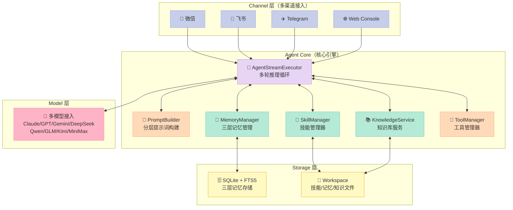
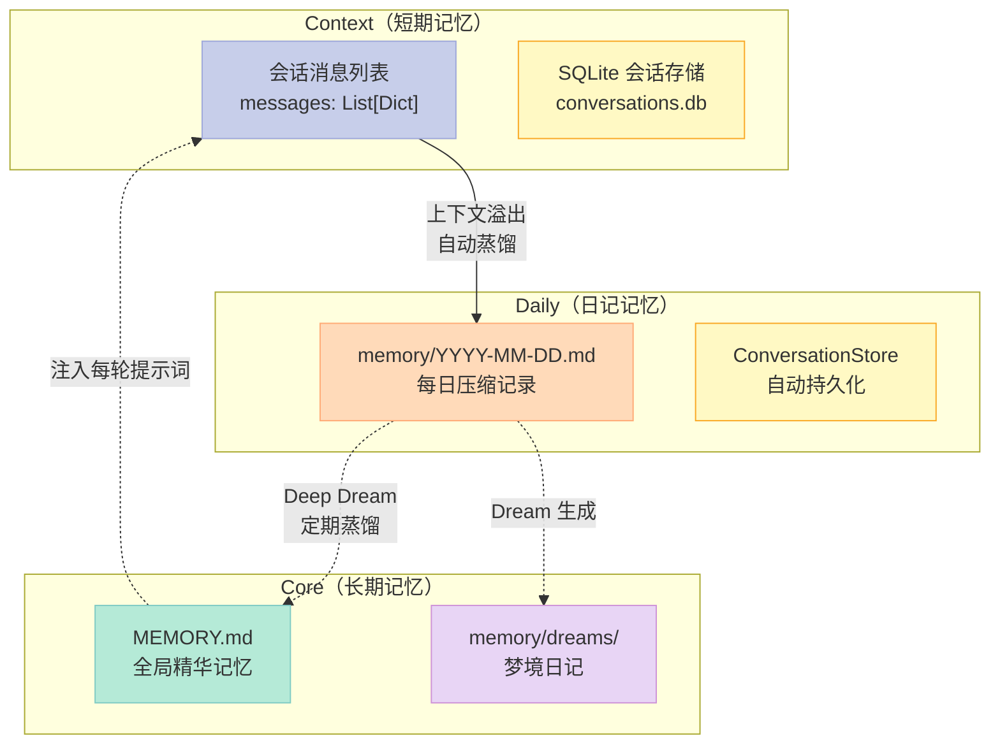
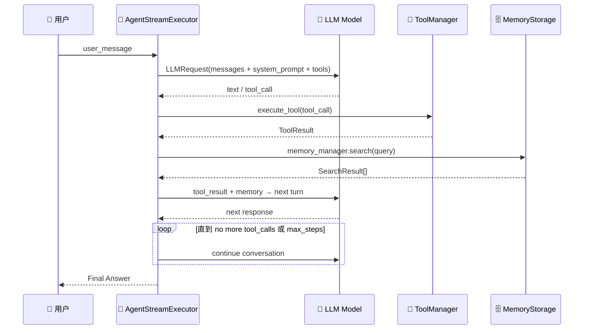

> 一个能 24/7 运行、记住你的一切、持续学习进化的 AI 助手——不是科幻，是 CowAgent 已经在做的事。

---

## 前言

市面上的 AI Agent 框架多如牛毛，但大多数框架做演示漂亮、落地就露怯——要么记忆系统残缺（聊完就忘）、要么技能系统鸡肋（所谓"技能"不过是几个工具的排列组合）、要么架构复杂到维护不动。

**CowAgent** 是一个例外。它在 GitHub 上斩获 **45,000+ Stars**，近期仍在活跃更新（2026-06-01），定位是"超级 AI 助手 & Agent Harness"——不是玩具，是一个可以 one-line 安装、24/7 长期运行的真实产品级 Agent。

本文将深入拆解它的三层记忆体系（Context → Daily → Core）、Deep Dream 记忆蒸馏机制、文件型技能系统，以及 Agent 执行循环的核心实现。读完你会明白：**为什么 CowAgent 的记忆不是简单的 KV 存储，而是一套完整的认知演进系统**。

---

## 一、项目概览

| 维度 | 内容 |
|------|------|
| **项目名** | CowAgent |
| **GitHub** | [zhayujie/CowAgent](https://github.com/zhayujie/CowAgent) ⭐ 45,000+ |
| **语言** | Python |
| **定位** | 超级 AI 助手 · Agent Harness |
| **核心特性** | 多 Channel、多模型、三层记忆、技能系统、知识库 |
| **最近更新** | 2026-06-01（完全活跃） |
| **安装方式** | `bash <(curl -fsSL https://cdn.link-ai.tech/code/cow/run.sh)` |

CowAgent 同时支持 Web、微信、飞书、钉钉、企业微信、QQ、Telegram、Slack 等多渠道接入，一个实例搞定所有平台的 AI 助手需求。

---

## 二、整体架构

CowAgent 的架构可以用一句话概括：**Message in → Agent Core → Memory/Tools/Skills/Knowledge → Model → Response → Channel out**。



**数据流：**

1. **Channel 接收**：用户从任意渠道发送消息
2. **Session 管理**：每个会话独立的 `session_id`，历史消息通过 `messages` 列表持久化
3. **Agent 推理**：`AgentStreamExecutor` 执行多轮 Tool-Call 循环
4. **Prompt 构建**：`PromptBuilder` 在每轮推理前构建完整的分层系统提示词
5. **记忆召回**：通过 `MemoryManager` 搜索三层记忆，注入上下文
6. **技能匹配**：根据用户需求动态匹配技能，读取 SKILL.md 执行
7. **工具执行**：文件读写、终端、浏览器、搜索、MCP 工具等
8. **记忆回写**：对话结束自动触发记忆蒸馏，`MemoryFlushManager` 将上下文压缩为每日记忆

---

## 三、三层记忆架构（核心亮点）

这是 CowAgent 最值得深入分析的部分。大多数 Agent 的"记忆"只是把聊天记录往向量数据库一存，CowAgent 的三层设计则完全不同：

### 3.1 三层职责



| 层级 | 存储形式 | 生命周期 | 召回方式 |
|------|----------|----------|----------|
| **Context** | 内存 `messages[]` + SQLite | 单次会话 | 直接注入 LLM 上下文 |
| **Daily** | `memory/YYYY-MM-DD.md` | 每日 | 关键词 + 向量混合检索 |
| **Core** | `MEMORY.md` + `dreams/` | 永久 | 关键词 + 向量检索 |

**为什么这样分层？**

直接把所有历史都往 LLM 上下文里塞是不现实的（token 成本爆炸），但只有向量检索又不够（无法记住用户偏好、长期决策、重要人物关系）。三层设计的精妙之处在于：**每层解决不同粒度的问题**。

### 3.2 Context 层：会话消息持久化

`ConversationStore` 使用 SQLite 持久化会话历史：

```python
# agent/memory/conversation_store.py
DDL = """
CREATE TABLE IF NOT EXISTS sessions (
    session_id        TEXT    PRIMARY KEY,
    channel_type      TEXT    NOT NULL DEFAULT '',
    title             TEXT    NOT NULL DEFAULT '',
    context_start_seq INTEGER NOT NULL DEFAULT 0,
    created_at        INTEGER NOT NULL,
    last_active       INTEGER NOT NULL,
    msg_count         INTEGER NOT NULL DEFAULT 0
);

CREATE TABLE IF NOT EXISTS messages (
    id           INTEGER PRIMARY KEY AUTOINCREMENT,
    session_id   TEXT    NOT NULL,
    seq          INTEGER NOT NULL,
    role         TEXT    NOT NULL,
    content      TEXT    NOT NULL,
    created_at   INTEGER NOT NULL,
    extras       TEXT    NOT NULL DEFAULT '',
    UNIQUE (session_id, seq)
);
"""
```

关键设计点：
- **append-only**：消息只追加不修改，保证历史完整性
- **session 隔离**：不同 `session_id` 的会话完全独立
- **extras 字段**：JSON 侧载，支持 TTS 音频路径等未来扩展
- **自动老化**：超过 30 天的 session 自动清理

### 3.3 Storage 层：SQLite + FTS5 + Trigram

`MemoryStorage` 是记忆的物理存储引擎，同时支持三种检索能力：

```python
# agent/memory/storage.py
class MemoryStorage:
    def __init__(self, db_path: Path):
        self.conn = sqlite3.connect(str(db_path), check_same_thread=False)
        self.fts5_available = self._check_fts5_support()
        self._create_fts5_objects()  # FTS5 全文索引

        # Trigram FTS5 - CJK/混合语言搜索的关键
        if self.fts5_available:
            self.conn.execute("""
                CREATE VIRTUAL TABLE IF NOT EXISTS chunks_fts_trigram USING fts5(
                    text, id UNINDEXED, user_id UNINDEXED,
                    path UNINDEXED, source UNINDEXED, scope UNINDEXED,
                    content='chunks', content_rowid='rowid',
                    tokenize='trigram case_sensitive 0'
                )
            """)
```

**三层检索机制：**

1. **FTS5 bm25**：英文/标准关键词检索，BM25 排序
2. **Trigram FTS5**：CJK 字符级分词，专门解决"中文词"问题（传统中文分词对 AI Agent 的长文本记忆效果差）
3. **Vector 相似度**：通过 `EmbeddingProvider` 生成向量，`MemoryManager.search()` 合并向量 + 关键词分数

### 3.4 Deep Dream：记忆自动进化

这是 CowAgent 最独特的设计。当每日记忆积累到一定量，系统会触发 **Deep Dream** 蒸馏流程：

```python
# agent/memory/summarizer.py
DREAM_SYSTEM_PROMPT_ZH = """你是一个记忆整理助手，负责定期整理用户的长期记忆。

你将收到两份材料：
1. **当前长期记忆** — MEMORY.md 的全部现有内容
2. **今日日记** — 当天的日常记录

## 任务

### Part 1: 更新后的长期记忆（[MEMORY]）
- **合并提炼**：将含义相近的多条合并为一条高密度表述
- **新增萃取**：从今日日记中提取值得永久记住的新信息
- **冲突更新**：当新信息与旧条目矛盾时，以新信息为准
- **清理无效**：删除临时性记录、空白条目、格式残留
- 目标：控制在 50 条以内

### Part 2: 梦境日记（[DREAM]）
用简洁的叙事风格写一篇短日记，记录这次整理的发现...
"""
```

**Deep Dream 的输出格式：**

```markdown
[MEMORY]
- 用户名是Alice，喜欢喝美式咖啡
- 正在开发一个React项目，使用TypeScript
- 每周五下午有团队会议

[DREAM]
今天整理记忆时发现，用户的Coffee Preference是新增的重要信息。
之前没有记录她的咖啡习惯，今天首次确认了...
```

**为什么这很有价值？**

大多数 Agent 的"记忆"只是机械存储，CowAgent 的 Deep Dream 在做**主动的信息提炼和冲突解决**。它不只是一个 RAG 系统，而是一个**持续优化的记忆进化系统**。

---

## 四、PromptBuilder：分层系统提示词构建

CowAgent 的 Agent 之所以能在每轮对话中准确调用记忆、技能、工具，关键在于 `PromptBuilder` 的分层设计：

```python
def build_agent_system_prompt(...) -> str:
    sections = []

    # 1. 工具系统（最重要，置顶）
    if tools:
        sections.extend(_build_tooling_section(tools, language))

    # 2. 技能系统（仅次于工具）
    if skill_manager:
        sections.extend(_build_skills_section(skill_manager, tools, language))

    # 3. 记忆系统（独立的能力）
    if memory_manager:
        sections.extend(_build_memory_section(memory_manager, tools, language))

    # 3.5 知识库（结构化知识）
    if conf().get("knowledge", True):
        sections.extend(_build_knowledge_section(workspace_dir, language))

    # 4. 工作空间
    sections.extend(_build_workspace_section(workspace_dir, language))

    # 5. 用户身份
    if user_identity:
        sections.extend(_build_user_identity_section(user_identity, language))

    # 6. 上下文文件（AGENT.md / USER.md / RULE.md）
    if context_files:
        sections.extend(_build_context_files_section(context_files, language))

    # 7. 运行时信息
    if runtime_info:
        sections.extend(_build_runtime_section(runtime_info, language))

    return "\n".join(sections)
```

**关键洞察**：工具和技能是分开的两层。很多框架把"技能"当成工具集，但 CowAgent 的技能是**文件型指令集**，通过 `memory_search` 等工具搜索后，Agent 主动读取 SKILL.md 并按指令执行——这是更自然的人机协作方式。

---

## 五、Agent 执行循环：AgentStreamExecutor

Agent 的核心推理循环在 `AgentStreamExecutor` 中实现：



**源码核心逻辑：**

```python
# agent/protocol/agent_stream.py
class AgentStreamExecutor:
    def __init__(self, agent, model, system_prompt, tools,
                 max_turns=50, on_event=None, messages=None,
                 max_context_turns=30, cancel_event=None):
        self.tools = {tool.name: tool for tool in tools}
        self.max_turns = max_turns
        self.messages = messages or []

    def run_stream(self, user_message):
        # 添加用户消息
        self.messages.append({"role": "user", "content": user_message})

        for turn in range(self.max_turns):
            # 构建请求 → LLM 推理
            response = self.model.call_stream(request)

            # 解析 LLM 输出（可能是 text 或 tool_call）
            if response.tool_calls:
                for tc in response.tool_calls:
                    result = self.tools[tc.function.name].execute(tc.function.arguments)
                    self.messages.append({
                        "role": "tool",
                        "tool_call_id": tc.id,
                        "content": result.output
                    })
            else:
                # 最终回复
                return response.text
```

**流式输出 + 事件系统**：每产生一个 token 增量就通过 `on_event` 回调推送给前端，实现实时打字效果。工具执行结果也通过事件系统实时展示。

---

## 六、Skills 技能系统：文件型指令集

CowAgent 的技能不是预定义的工具集，而是**以 Markdown 文件形式存在的指令集**：

```yaml
# skill 示例 frontmatter
---
name: web-fetch
description: 当用户需要获取网页内容时使用此技能
emoji: 🌐
os: [linux, darwin, windows]
requires:
  pip: [requests, beautifulsoup4]
install:
  - kind: pip
    package: requests
---
```

技能发现 → 读取 SKILL.md → 执行指令 → 删除中间文件，这套流程让 Agent 能够**通过自然语言描述动态扩展能力**。

```python
# agent/skills/loader.py
def load_all_skills(self, builtin_dir, custom_dir):
    skills = {}
    # 从 builtin 和 custom 目录扫描所有 .md 文件
    for directory in [builtin_dir, custom_dir]:
        for root, dirs, files in os.walk(directory):
            for file in files:
                if file.endswith('.md') and not file.startswith('.'):
                    skill = self._load_skill_file(full_path)
                    skills[skill.name] = skill
    return skills
```

---

## 七、与同类项目对比

| 维度 | CowAgent | Letta | Mem0 |
|------|----------|-------|------|
| **记忆架构** | 三层（Context/Daily/Core） | 实体关系图 | 简单向量存储 |
| **记忆进化** | Deep Dream 自动蒸馏 | 无 | 无 |
| **技能系统** | 文件型 SKILL.md | 无 | 无 |
| **多渠道** | 8+ 渠道开箱即用 | API only | API only |
| **搜索能力** | FTS5 + Trigram + Vector | 实体检索 | 纯向量 |
| **部署难度** | one-line 安装 | Docker | API 服务 |
| **架构复杂度** | 中（功能全） | 高（实体建模） | 低（仅记忆） |

**CowAgent 的差异化定位**：不是纯记忆库、不是纯 Agent 框架，而是一个**可 24/7 运行的超级助手**。记忆进化 + 多渠道 + 技能系统三者的结合，在同类产品中是独一无二的。

---

## 八、优缺点分析

### ✅ 优点

| 维度 | 说明 |
|------|------|
| **三层记忆设计** | Context → Daily → Core 的分层设计解决了一味塞上下文的 token 成本问题，同时保留长期记忆 |
| **Deep Dream** | 主动的记忆整理和冲突解决，让记忆真正"进化"而非机械堆积 |
| **FTS5 Trigram** | CJK 字符级全文索引，解决了中文 AI Agent 记忆检索的最大痛点 |
| **文件型技能** | 技能以 Markdown 文件存在，可版本控制、可共享，这是比 JSON 配置更优雅的方案 |
| **多渠道统一** | 一个实例覆盖所有主流 IM，降低运维复杂度 |
| **代码质量** | SQLite WAL 模式、FTS5 损坏自检、trigram 回退、JSON 修复等工程细节扎实 |

### ❌ 缺点 / 局限性

| 维度 | 说明 |
|------|------|
| **单 Agent** | 目前架构是单一 Agent，多 Agent 协作能力弱 |
| **记忆压缩依赖 LLM** | Deep Dream 需要每次调用 LLM，有成本和延迟 |
| **技能生态** | 虽有小规模的 Skill Hub，但生态还在早期 |
| **长尾渠道维护** | 微信/QQ 等渠道的接入实现较重，API 变更容易 break |
| **文档英文为主** | 部分高级功能文档缺失，需要读源码 |

---

## 九、总结

CowAgent 最有价值的设计不是任何一个单点功能，而是**三层记忆 × Deep Dream × 文件型技能**三者组合起来形成的**认知进化闭环**：对话产生上下文 → 上下文蒸馏为日记 → 日记进化为长期记忆 → 记忆注入每轮推理。这套闭环让 AI 不是在"查询记忆"，而是在"持续理解和记住用户"。

对于需要**可托管的私人 AI 助手**（而不是要自己搭复杂 AI 平台的开发者），CowAgent 是目前开源领域最接近"一站式解决方案"的项目——one-line 安装、多渠道接入、长期记忆、可进化技能，开箱即用。

**推荐阅读源码**：如果你想学习一个生产级 AI Agent 的工程实践，CowAgent 的记忆系统（`agent/memory/`）和 Agent 执行循环（`agent/protocol/agent_stream.py`）是极佳的参考范本。

---

## 对比分析

CowAgent 的核心差异化是"三层记忆 + Deep Dream 蒸馏 + 24/7 个人助手"的一体化设计。在"长期记忆 / 24/7 助手"赛道里，跟它定位最像、且真正在社区里被讨论的项目是 Mem0、Letta（前身 MemGPT）和 Open Interpreter 的"个人助手模式"。下面对它们做一次横向对比。

### 维度一：记忆架构

| 项目 | 记忆层级 | 存储载体 | 蒸馏/演化机制 |
|------|----------|----------|----------------|
| **CowAgent** | Context → Daily → Core | 本地文件 + 索引 | Deep Dream（睡眠式）周期蒸馏 |
| **Mem0** | 单层抽象 + 可插拔后端 | 向量库（Qdrant/pgvector 等） | LLM 抽取/合并/更新 |
| **Letta (MemGPT)** | Core + Archival + Recall | 关系/向量混合 | 上下文窗口分页 + 工具调用 |
| **MemOS** | MemCube + MemScheduler | 多后端（向量/图/文件） | 调度器主动编排 |

### 维度二：Agent 形态

- **CowAgent**：定位是"24/7 个人助手"，one-line 安装、技能用 Markdown 文件组织
- **Mem0**：定位是"可插拔记忆层 SDK"，要自己选 LLM/工具/前端
- **Letta**：定位是"有持久记忆的 Agent 运行时"，暴露 REST + Python SDK，自带 Web UI
- **MemOS**：定位是"记忆操作系统"，强调跨模态、跨任务、跨用户的"自演化"能力

### 维度三：开箱即用程度

- **CowAgent**：✅ 一行安装 + 多渠道 + 文件型技能；最易上手
- **Mem0**：⚠️ 需要自己组合 LLM/前端/调度
- **Letta**：✅ 自带 Web UI，但默认模型/前端相对固定
- **MemOS**：⚠️ 偏底层 SDK，需要较多工程化集成

**优缺点小结**

- **CowAgent**：把"长期记忆 + 24/7 + 技能文件 + 多渠道"做成一站式，最适合非工程用户；缺点是核心创新（Deep Dream 蒸馏）公开评测较少
- **Mem0**：最像"记忆层的 Stripe"，生态最广；缺点是没有自带 Agent 形态
- **Letta**：学术背景强，理论清晰；缺点是默认 UI/工作流较固定
- **MemOS**：自演化机制 + 多模态最完整；缺点是复杂度高，落地成本大

**何时选 CowAgent**

- 想要"一键启动、24/7、能接入微信/钉钉/飞书的个人/团队助手"
- 喜欢"技能用 Markdown 写"这种低代码方式
- 不希望自己组合一堆 SDK 拼装

**何时不选 CowAgent**

- 你只想做"记忆层"被其它 Agent 调用——选 Mem0
- 你想要"理论可证明的记忆分页"——选 Letta
- 你的业务需要"跨模态、跨用户的强自演化"——选 MemOS

**参考资料**

- CowAgent GitHub：<https://github.com/zhayujie/CowAgent>
- Mem0：<https://github.com/mem0ai/mem0>
- Letta：<https://github.com/letta-ai/letta>
- MemOS 论文：<https://arxiv.org/abs/2507.03724>
- "Long-term Memory for LLM Agents" 综述：<https://arxiv.org/abs/2406.01564>

> 行动建议：想体验的同学可以跑一行命令 `bash <(curl -fsSL https://cdn.link-ai.tech/code/cow/run.sh)` 快速部署，或直接阅读 `agent/memory/` 目录的源码，感受一个真实的分层记忆系统是如何实现的。