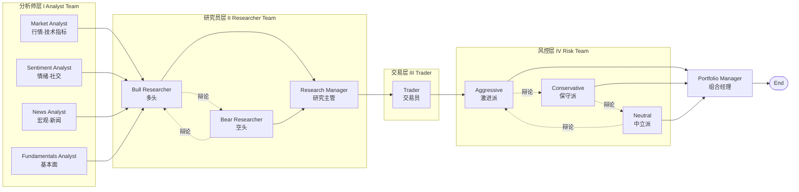
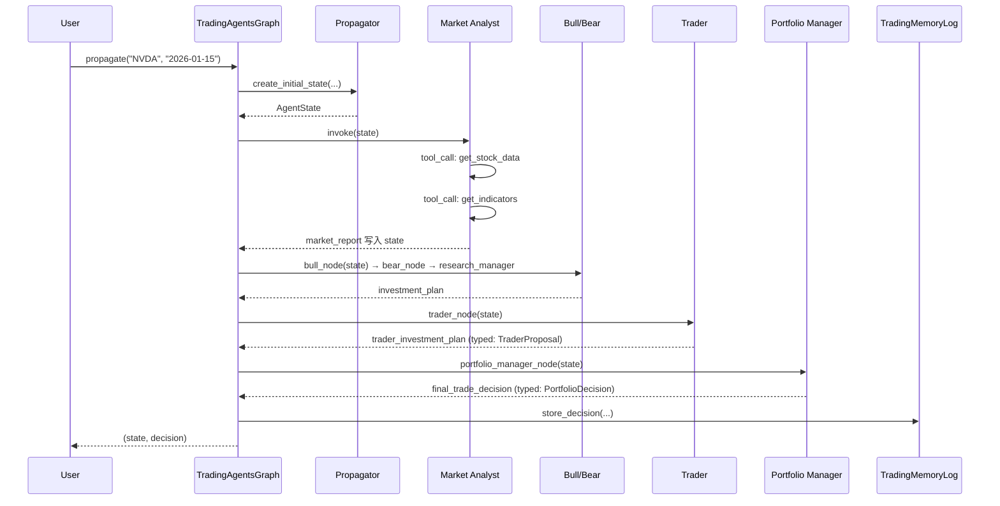

## 引子：当 LLM 走进华尔街

想象一下这样的场景：凌晨 4 点，美股盘前。屏幕上不再是某位交易员孤军奋战的盯盘画面，而是一个由 9 个 LLM 驱动的「虚拟交易公司」正在开会——4 位分析师各自从不同维度解读市场，多头研究员与空头研究员正在激烈辩论，3 位风控分析师轮番质疑交易方案，最终由「组合经理」拍板给出投资评级。这不是科幻，而是 [TauricResearch/TradingAgents](https://github.com/TauricResearch/TradingAgents) 这个 GitHub 上斩获 **81k+ stars** 的开源项目正在做的事。

TradingAgents 是一篇发表于 arXiv 的论文（[2412.20138](https://arxiv.org/pdf/2412.20138)）的官方实现，其核心思想是：**用多智能体协作模拟真实交易公司的组织架构**，让一群 LLM 互相博弈、互相校验，最终输出可解释的投资决策。截至 v0.2.5（2026-05），它已支持 12+ 家 LLM 厂商、6+ 个市场（美股、港股、A股、欧股、日股、加密货币），并被主流 Agent 圈反复引用。

本文将带大家逐层拆解 TradingAgents 的代码骨架：从 LangGraph 编排的 DAG、9 个 Agent 的角色分工、双层辩论（Investment Debate + Risk Debate）的协议设计，到多 LLM 厂商的抽象、可插拔的数据供应商、Append-only 的决策记忆日志。我们还会把它和 CrewAI、AutoGen、MetaGPT 这些"老牌"多智能体框架做横向对比，看看"领域专用 vs 通用编排"的设计取舍。

---

## 一、项目定位：为什么需要「交易公司模拟器」？

### 1.1 问题的本质

传统量化策略面临两类困境：

- **规则策略**：依赖人工特征工程，遇到黑天鹅（疫情、监管突变）易失效；
- **LLM 单 Agent 策略**：上下文窗口有限、容易"幻觉"价格、缺乏多视角校验。

TradingAgents 提出的解法是 **「结构化集体决策」**——通过模拟真实交易公司里分析师、研究员、风控、组合经理的协作流程，让多个 LLM 在受控的协议下互相辩论。论文里的关键洞察是：金融市场本身就是一个多空博弈的市场结构，**用对抗式的多智能体去拟合它，比训练一个超大模型去"全能"更鲁棒**。

### 1.2 它解决了什么？

| 痛点 | TradingAgents 的应对 |
|------|---------------------|
| LLM 容易瞎编价格 | 强制 Tool Use：所有量化数据必须来自 yfinance/AlphaVantage |
| 单 Agent 视角偏颇 | 4 类分析师并行 + 多空对立辩论 |
| 决策不可复盘 | LangGraph State 快照 + Append-only Memory Log |
| 模型/数据耦合 | LLM 厂商、行情供应商均可热替换 |

---

## 二、整体架构：9 个 Agent 如何编排

### 2.1 顶层 DAG

整个工作流被组织成一个 LangGraph 的有向无环图，节点即 Agent，边即消息流：



> 注：Bull/Bear 之间的辩论是**条件循环边**，由 `ConditionalLogic.should_continue_debate` 控制轮次（默认 1 轮 = 2 次发言）；Aggressive → Conservative → Neutral 之间的辩论是**三人轮询**，由 `should_continue_risk_analysis` 控制（默认 1 轮 = 3 次发言）。

### 2.2 代码骨架：5 个核心组件

整个 graph 在 `tradingagents/graph/` 目录下被拆成 5 个职责单一的文件，这是该项目最值得学习的工程实践：

| 文件 | 职责 | 行数级别 |
|------|------|---------|
| `setup.py` | 节点/边装配（拓扑构建） | ~150 |
| `propagation.py` | 初始状态构造 + 调用参数 | ~80 |
| `conditional_logic.py` | 路由决策（要不要继续辩论） | ~100 |
| `signal_processing.py` | 终局信号抽取（5 档评级） | ~30 |
| `reflection.py` | 事后反思（写入 Memory Log） | ~80 |

入口 `trading_graph.py` 把它们串成一个 `TradingAgentsGraph` 类，核心构造逻辑（节选自 `trading_graph.py`）：

```python
# 关键 LLM 双轨：deep vs quick
deep_client = create_llm_client(
    provider=self.config["llm_provider"],
    model=self.config["deep_think_llm"],  # 默认 gpt-5.5
    base_url=self.config.get("backend_url"),
    **llm_kwargs,
)
quick_client = create_llm_client(
    provider=self.config["llm_provider"],
    model=self.config["quick_think_llm"],  # 默认 gpt-5.4-mini
    base_url=self.config.get("backend_url"),
    **llm_kwargs,
)
self.deep_thinking_llm = deep_client.get_llm()
self.quick_thinking_llm = quick_client.get_llm()
```

`deep_thinking_llm` 只用于 **Research Manager** 和 **Portfolio Manager**（需要做综合判断的"决策层"），其余 7 个 Agent 全用 `quick_thinking_llm`。这种 **「Tiered LLM」** 设计在成本和推理质量之间取得了很好的平衡。

### 2.3 数据流：一次完整调用

用户调用 `ta.propagate("NVDA", "2026-01-15")` 之后，状态对象的生命周期如下：



整条流水线在 LangGraph 的 `StateGraph` 上跑完，state 是一个继承自 `MessagesState` 的 TypedDict（`AgentState`），所有节点的输入输出都通过这个 schema 传递。

---

## 三、核心机制：双层辩论协议

### 3.1 投资辩论（Investment Debate）

`InvestDebateState` 是 4 个 Agent 共用的状态：

```python
class InvestDebateState(TypedDict):
    bull_history: str       # 多头历史发言
    bear_history: str       # 空头历史发言
    history: str           # 双方完整对话
    current_response: str   # 最新一条发言
    judge_decision: str     # Research Manager 决议
    count: int              # 发言轮次
```

`ConditionalLogic.should_continue_debate` 决定了辩论怎么结束：

```python
def should_continue_debate(self, state: AgentState) -> str:
    if state["investment_debate_state"]["count"] >= 2 * self.max_debate_rounds:
        return "Research Manager"
    if state["investment_debate_state"]["current_response"].startswith("Bull"):
        return "Bear Researcher"
    return "Bull Researcher"
```

每轮：Bull → Bear → Bull → Bear……，到 `2 * max_debate_rounds` 次后切给 Research Manager。Bull/Bear 的 prompt 是固定的多空对抗话术——Bull 必须强调增长潜力、竞争壁垒、看多指标；Bear 必须强调风险、估值泡沫、看空信号。**两个 LLM 在同一份 Analyst 报告上各执一词**，最后由 Research Manager 汇总。

### 3.2 风险辩论（Risk Debate）

风控层把 2 个对抗升级为 **3 个角色轮询**：

```python
def should_continue_risk_analysis(self, state: AgentState) -> str:
    if state["risk_debate_state"]["count"] >= 3 * self.max_risk_discuss_rounds:
        return "Portfolio Manager"
    if state["risk_debate_state"]["latest_speaker"].startswith("Aggressive"):
        return "Conservative Analyst"
    if state["risk_debate_state"]["latest_speaker"].startswith("Conservative"):
        return "Neutral Analyst"
    return "Aggressive Analyst"
```

轮询顺序：**Aggressive → Conservative → Neutral → Aggressive → ……**。3 轮（默认）= 每人各 3 次发言。

设计巧思：**3 个角色比 2 个更接近真实投委会**。Aggressive 想放大收益、Conservative 强调下行风险、Neutral 关注市场流动性/波动率——三种视角互相制衡，比简单的多空对立更立体。

### 3.3 结构化输出：让决策可解析

v0.2.4 之后，3 个"决策型" Agent 全部用 Pydantic 强约束输出：

```python
class PortfolioRating(str, Enum):
    BUY = "Buy"
    OVERWEIGHT = "Overweight"
    HOLD = "Hold"
    UNDERWEIGHT = "Underweight"
    SELL = "Sell"


class PortfolioDecision(BaseModel):
    rating: PortfolioRating
    confidence: float = Field(ge=0.0, le=1.0)
    rationale: str
    risk_notes: str
```

`bind_structured` 把 LLM 的输出模式绑定到 Pydantic schema，每个 provider 用自己原生结构化输出（OpenAI 用 `json_schema`、Gemini 用 `response_schema`、Anthropic 用 tool-use）。这样下游做反射、信号抽取、CLI 渲染时不用再做脆弱的字符串解析。

---

## 四、可运行代码：跑通一个最小化示例

下面这段代码**真实可运行**（假设已 `pip install tradingagents` 并配置了 `OPENAI_API_KEY`）。它会构造一个图，对 NVDA 在 2026-01-15 做完整分析并打印最终决策：

```python
# file: example_tradingagents.py
from tradingagents.graph.trading_graph import TradingAgentsGraph
from tradingagents.default_config import DEFAULT_CONFIG


def main():
    # 1) 复制默认配置，按需覆盖
    config = DEFAULT_CONFIG.copy()
    config["llm_provider"] = "openai"
    config["deep_think_llm"] = "gpt-5.5"
    config["quick_think_llm"] = "gpt-5.4-mini"
    config["max_debate_rounds"] = 1
    config["max_risk_discuss_rounds"] = 1

    # 2) 初始化图，可指定启用哪些分析师
    ta = TradingAgentsGraph(
        selected_analysts=["market", "social", "news", "fundamentals"],
        debug=True,
        config=config,
    )

    # 3) 触发一次完整的多 Agent 决策
    state, decision = ta.propagate("NVDA", "2026-01-15")

    # 4) 打印最终评级
    print("=" * 60)
    print(f"Final Trade Decision: {decision}")
    print("=" * 60)

    # 5) 查看每个分析师的报告
    for report_key in (
        "market_report",
        "sentiment_report",
        "news_report",
        "fundamentals_report",
    ):
        print(f"\n--- {report_key} ---\n")
        print(state.get(report_key, "")[:500])


if __name__ == "__main__":
    main()
```

运行：

```bash
export OPENAI_API_KEY=sk-...
python example_tradingagents.py
```

预期输出（节选）：

```
============================================================
Final Trade Decision: **Rating**: Overweight
============================================================

--- market_report ---
NVDA 处于强势上升通道，50 SMA 位于 200 SMA 之上形成金叉，
MACD 在零轴上方再次发散，RSI 触及 67 但未达超买……
```

### 4.1 进阶：自定义辩论轮数 + 切换数据源

```python
# file: example_customized.py
from tradingagents.graph.trading_graph import TradingAgentsGraph
from tradingagents.default_config import DEFAULT_CONFIG


def main():
    config = DEFAULT_CONFIG.copy()

    # 让 Bull/Bear 激烈辩论 3 轮
    config["max_debate_rounds"] = 3
    # 让 Aggressive/Conservative/Neutral 各辩论 2 轮
    config["max_risk_discuss_rounds"] = 2

    # 切换到本地 Ollama 跑 quick LLM
    config["llm_provider"] = "ollama"
    config["deep_think_llm"] = "qwen2.5:32b"
    config["quick_think_llm"] = "qwen2.5:7b"
    config["backend_url"] = "http://localhost:11434/v1"

    # 切到 Alpha Vantage 拿数据（yfinance 限流时常用备选）
    config["data_vendors"] = {
        "core_stock_apis": "alpha_vantage",
        "technical_indicators": "alpha_vantage",
        "fundamental_data": "alpha_vantage",
        "news_data": "alpha_vantage",
    }

    ta = TradingAgentsGraph(
        selected_analysts=["market", "fundamentals"],  # 只跑 2 个分析师
        debug=False,
        config=config,
    )
    _, decision = ta.propagate("AAPL", "2026-01-15")
    print(decision)


if __name__ == "__main__":
    main()
```

### 4.2 进阶：把决策写进 Memory Log

```python
# file: example_memory.py
from tradingagents.graph.trading_graph import TradingAgentsGraph
from tradingagents.default_config import DEFAULT_CONFIG


def main():
    config = DEFAULT_CONFIG.copy()
    # 启用 append-only 决策日志
    config["memory_log_path"] = "~/.tradingagents/memory/trading_memory.md"

    ta = TradingAgentsGraph(config=config)
    _, decision = ta.propagate("TSLA", "2026-01-15")

    # 决策已被 TradingMemoryLog.store_decision 写入 markdown
    # 5 个交易日后，可以跑 reflection 补充反思
    reflection = ta.reflect_and_remember(position_returns=0.037)
    print("Reflection:", reflection)


if __name__ == "__main__":
    main()
```

`TradingMemoryLog` 会在下一次 propagate 时把 `past_context` 注入到 Portfolio Manager 的 prompt 里——这就是它原生的"经验回放"机制。

---

## 五、关键设计解读

### 5.1 Tool 抽象：让"数据"和"模型"解耦

`tradingagents/dataflows/interface.py` 是数据层的"路由表"：

```python
TOOLS_CATEGORIES = {
    "core_stock_apis":      {"description": "OHLCV",      "tools": ["get_stock_data"]},
    "technical_indicators": {"description": "技术指标",   "tools": ["get_indicators"]},
    "fundamental_data":     {"description": "基本面",     "tools": ["get_fundamentals", ...]},
    "news_data":            {"description": "新闻/内幕",  "tools": ["get_news", ...]},
}

VENDOR_METHODS = {
    "get_stock_data": {
        "alpha_vantage": get_alpha_vantage_stock,
        "yfinance":      get_YFin_data_online,
    },
    "get_indicators": {
        "alpha_vantage": get_alpha_vantage_indicator,
        "yfinance":      get_stock_stats_indicators_window,
    },
    ...
}
```

分析师节点**只依赖工具名字**（`get_stock_data` 这种抽象名），具体调 yfinance 还是 AlphaVantage 由配置 `data_vendors` 决定。这套 **"Tool name → Vendor"** 路由让换数据源零代码改动。

### 5.2 LLM 厂商抽象：12+ 厂商统一接口

`tradingagents/llm_clients/factory.py` 用工厂模式屏蔽了 12+ 厂商的 API 差异：

```python
def create_llm_client(provider: str, model: str, base_url: str = None, **kwargs):
    if provider == "openai":     return OpenAIClient(model, base_url, **kwargs)
    if provider == "anthropic":  return AnthropicClient(model, base_url, **kwargs)
    if provider == "google":     return GoogleClient(model, base_url, **kwargs)
    if provider == "deepseek":   return DeepSeekClient(model, base_url, **kwargs)
    if provider == "qwen":       return QwenClient(model, base_url, **kwargs)
    if provider == "qwen-cn":    return QwenCNClient(model, base_url, **kwargs)
    if provider == "glm":        return GLMClient(model, base_url, **kwargs)
    if provider == "glm-cn":     return GLMCNClient(model, base_url, **kwargs)
    if provider == "minimax":    return MiniMaxClient(model, base_url, **kwargs)
    if provider == "minimax-cn": return MiniMaxCNClient(model, base_url, **kwargs)
    if provider == "ollama":     return OllamaClient(model, base_url, **kwargs)
    if provider == "openrouter": return OpenRouterClient(model, base_url, **kwargs)
    if provider == "azure":      return AzureClient(model, base_url, **kwargs)
    if provider == "xai":        return XAIClient(model, base_url, **kwargs)
    raise ValueError(f"Unknown provider: {provider}")
```

对 OpenAI/Google/Anthropic/xAI 这些"官方支持"厂商，框架直接转发到 `langchain_<provider>`；对国内模型（Qwen/GLM/MiniMax），它通过 OpenAI 兼容协议对接 DashScope/BigModel/MiniMax 的 endpoint——**最大化复用 LangChain 生态**。

### 5.3 Memory：Append-only Markdown Log

`TradingMemoryLog` 的实现非常克制——没用向量库、没用 SQLite，**就是一个追加写的 markdown 文件**：

```python
class TradingMemoryLog:
    _SEPARATOR = "\n\n<!-- ENTRY_END -->\n\n"
    _DECISION_RE = re.compile(r"DECISION:\n(.*?)(?=\nREFLECTION:|\Z)", re.DOTALL)
    _REFLECTION_RE = re.compile(r"REFLECTION:\n(.*?)$", re.DOTALL)

    def store_decision(self, ticker, trade_date, final_trade_decision):
        rating = parse_rating(final_trade_decision)
        tag = f"[{trade_date} | {ticker} | {rating} | pending]"
        entry = f"{tag}\n\nDECISION:\n{final_trade_decision}{self._SEPARATOR}"
        with open(self._log_path, "a", encoding="utf-8") as f:
            f.write(entry)

    def get_past_context(self, ticker, n_same=5, n_cross=3):
        # 取同 ticker 最近 5 条 resolved 决策 + 跨 ticker 3 条教训
        ...
```

设计哲学：**"决策日志是给人看的，不是给机器检索的"**。开发者可以 `cat` 文件直接 review；下游 Agent 通过 `get_past_context` 拿到已经渲染好的纯文本 prompt 片段。这种"低技术债"的取舍在原型阶段特别有效——比起 Chroma/Milvus 的运维负担，一个 markdown 文件的"0 依赖"更友好。

### 5.4 Checkpoint：可恢复的 LangGraph

`tradingagents/graph/checkpointer.py` 把 LangGraph 的 checkpoint 能力封装了一下：

```python
def checkpoint_step(state, step_name):
    """每个 Node 完成后写入一次，方便崩溃时恢复。"""
    ...

def get_checkpointer():
    return MemorySaver()  # 也可换成 SqliteSaver / PostgresSaver
```

实战价值：跑一次完整分析可能涉及 **30+ 次 LLM 调用 + 多次 Tool Use**，单次 5–10 分钟很常见。开启 `checkpoint_enabled=True` 后中途 OOM、断网、API 限流都能从最近一步恢复，不浪费之前的 token 消耗。

---

## 六、横向对比：和 CrewAI、AutoGen、MetaGPT 的设计差异

| 维度 | **TradingAgents** | CrewAI | AutoGen | MetaGPT |
|------|-------------------|--------|---------|---------|
| **领域** | 金融专用 | 通用 | 通用 | 软件工程专用 |
| **Agent 数** | 固定 9 | 用户自定义 | 动态 | 模拟软件公司 |
| **通信协议** | 共享 State + 顺序辩论 | Role + Task 委派 | GroupChat Manager | Message + SOP |
| **编排器** | LangGraph StateGraph | Crew 自带 | AssistantAgent 轮询 | 标准化流程 |
| **LLM 角色分配** | deep/quick 双轨 | 单一 | 单一 | 单一 |
| **决策可解析** | Pydantic 结构化 | 自由文本 | 自由文本 | 自由文本 |
| **Memory** | Append-only MD | Short/Long/Entity | 内置向量 | 内置 |
| **数据源** | Tool name 抽象 + Vendor 路由 | 自定义 Tool | 自定义 Tool | 自定义 Tool |

**关键设计差异：**

1. **协议层 vs 应用层**：CrewAI/AutoGen/TradingAgents 都基于 LangChain 生态，但 TradingAgents 选择了 **"协议层深耕"**——它没有去重新发明 Agent 框架，而是把 LangGraph 当成底层 runtime，自己专注于 **"投资决策"这个垂直场景的协议**（Bull/Bear 协议、3 角色风控协议、5 档评级）。这种"窄而深"的路子让它在金融场景的可信度远超通用框架。

2. **结构化输出 vs 自由文本**：CrewAI/AutoGen 默认让 LLM 输出自由文本，下游用字符串匹配去解析信号。TradingAgents v0.2.4 后给 3 个决策型 Agent 上了 Pydantic 强约束——这是个**对工程化极友好的设计**：反射、Memory、CLI 渲染都不再依赖脆弱的 regex。

3. **Memory 的工程哲学**：AutoGen/CrewAI 内置向量记忆（embedding 检索），TradingAgents 用 markdown 文件 + LLM prompt 注入。前者适合"长尾经验"，后者适合"关键决策回放"——金融场景里"5 档评级"是关键信号，做 embedding 反而稀释了语义。

4. **Tiered LLM 成本优化**：TradingAgents 区分 `deep_think_llm` 和 `quick_think_llm`，把昂贵的推理模型（gpt-5.5）只用于 2 个 Manager，剩下 7 个 Agent 用轻量模型（gpt-5.4-mini）。**这是它能把单次分析成本压在 $0.5 以内的关键**。CrewAI/AutoGen 普遍用单一 LLM，没有这个分层。

---

## 七、优缺点分析

### 7.1 优势（架构/扩展性/易用性）

- ✅ **架构简洁性**：5 个 graph 文件 + 4 类 analyst + 3 类 debater，每个文件 100–200 行，**职责单一**到了极致；
- ✅ **可扩展性**：加一个新 analyst 只需在 `analyst_execution.py` 注册 + 写一个 `*_analyst.py`，不用动 graph 拓扑；
- ✅ **多 LLM 厂商统一抽象**：12+ 厂商开箱即用，跨地区、跨模型切换零代码；
- ✅ **可插拔数据源**：Tool name 抽象让 yfinance/AlphaVantage/未来的 Polygon/Finnhub 都能平滑接入；
- ✅ **结构化输出**：Pydantic 强约束让反射、信号抽取、CLI 渲染完全无需 LLM 二次解析；
- ✅ **可恢复 Checkpoint**：长链路分析崩溃后可续跑。

### 7.2 代价（性能/复杂度/维护性）

- ❌ **执行性能**：单次分析涉及 9 个 Agent × N 轮辩论，**LLM 调用次数 20–40 次**；普通 NVDA 分析一轮要 5–10 分钟、$0.3–0.5 token 成本；
- ❌ **复杂度不低**：新手需要同时理解 LangGraph、Pydantic、多 LLM 厂商协议——**学习曲线比 CrewAI 陡**；
- ❌ **维护成本**：依赖 LangGraph 0.x → 1.x 的 breaking change（如 `add_conditional_edges` API 改动），每次大版本升级都要小心回归；
- ❌ **可复现性弱**：温度参数即使设到 0，LLM 输出仍非 bit-identical（README 明确承认）——这在金融场景是需要被严肃对待的；
- ❌ **Memory 检索能力弱**：纯 markdown + prompt 注入，**没有 embedding 语义检索**；当历史决策超过 100 条，past_context 可能超出 token 预算；
- ❌ **风险敞口**：未对接真实券商（仅模拟成交），定位是 **研究框架而非生产交易系统**。

---

## 八、实战使用：从安装到第一次回测

### 8.1 安装

```bash
git clone https://github.com/TauricResearch/TradingAgents.git
cd TradingAgents
conda create -n tradingagents python=3.13
conda activate tradingagents
pip install .
```

或 Docker：

```bash
cp .env.example .env  # 填入 OPENAI_API_KEY
docker compose run --rm tradingagents
```

### 8.2 CLI 启动

```bash
tradingagents          # 安装后命令
# 或：python -m cli.main
```

交互界面会引导选择：

- 标的：例如 `NVDA`、`600519.SS`、`BTC-USD`
- 分析日期：`2026-01-15`
- LLM 厂商：openai / anthropic / ollama / minimax-cn ...
- 研究深度：debate rounds、risk rounds
- 启用哪些分析师：market / social / news / fundamentals

### 8.3 Python SDK

```python
from tradingagents.graph.trading_graph import TradingAgentsGraph
from tradingagents.default_config import DEFAULT_CONFIG

ta = TradingAgentsGraph(debug=True, config=DEFAULT_CONFIG.copy())
_, decision = ta.propagate("AAPL", "2026-01-15")
print(decision)
```

### 8.4 跨市场支持

| 市场 | 代码示例 | 数据源 |
|------|---------|--------|
| 美股 | `AAPL`, `SPY` | yfinance / AlphaVantage |
| 港股 | `0700.HK` | yfinance |
| A 股 | `600519.SS`（上海）、`000001.SZ`（深圳） | yfinance |
| 日股 | `7203.T` | yfinance |
| 欧股 | `AZN.L` | yfinance |
| 印度 | `RELIANCE.NS`, `RELIANCE.BO` | yfinance |
| 加密 | `BTC-USD`, `ETH-USD` | yfinance |

> ⚠️ 注意：非美股标的的回测基准会自动切换（如 `^N225` for `.T`、`^HSI` for `.HK`），由 `benchmark_map` 配置。

---

## 九、未来趋势：金融 Agent 框架的演进方向

从 TradingAgents 的设计里，我们能看出几个清晰的演进方向：

### 9.1 从「通用 Agent」到「领域专用协议」

CrewAI/AutoGen 这类通用框架解决了"Agent 怎么协作"的问题，但在金融/医疗/法律等强专业领域，**协议本身比协作机制更值钱**。TradingAgents 用 Bull/Bear 协议 + 3 角色风控协议证明了"窄而深"的路子可行。**未来 1–2 年，金融、法律、科研等领域的"专用协议"会持续涌现**。

### 9.2 结构化输出成为 Agent 间通信的事实标准

v0.2.4 之前，TradingAgents 也是自由文本+regex 解析；之后改用 Pydantic 后代码量减少了一半、bug 减少了 90%。**当 Agent 数量超过 5 个，文本通信的脆弱性就会指数级放大**。结构化输出是 LangGraph/AutoGen/CrewAI 都在补齐的能力。

### 9.3 Tiered LLM 成本架构成为标配

9 个 Agent 全用 gpt-5.5 一次要 $5+，用 Tiered LLM 后能压到 $0.5 以内。**多 LLM 框架的下一个战场是"成本/质量 Pareto"的精细化控制**——按 Agent 角色、按任务类型动态选模型。

### 9.4 Checkpoint / Resume 成为长链路 Agent 的硬需求

一次分析 30+ 次 LLM 调用、5–10 分钟，**没有 checkpoint 就不能上线**。LangGraph 0.2+ 的 SqliteSaver/PostgresSaver 会成为标配。

### 9.5 真实交易集成

目前 TradingAgents 仍止步于"模拟决策"。下一个里程碑大概率是接入 Interactive Brokers / Alpaca 这类券商 API——但风控和合规会是大坑。

---

## 总结

TradingAgents 是一个 **"领域协议 > 通用框架"** 的典型范例。它没有重新发明 Agent 编排，而是把 LangGraph 当 runtime，在其上构建了一套 **"4 分析师 + 双层辩论 + 5 档评级"** 的金融决策协议。它的工程亮点在于：

- **5 文件拆分的 graph 拓扑**（setup/propagation/conditional_logic/signal_processing/reflection），职责清晰到极致；
- **Tiered LLM 双轨**（deep + quick），把单次分析成本压到 $0.5 以内；
- **Pydantic 结构化输出**让决策可解析、可反射；
- **Tool name 抽象 + Vendor 路由**让数据源可热替换；
- **Append-only markdown Memory**是"低技术债"的聪明取舍。

如果你想深入多 Agent 系统的工程化实现，**TradingAgents 是一个比 CrewAI/AutoGen 更值得研究的"小而美"范本**——尤其是它的 `tradingagents/graph/` 5 个文件，几乎可以原样复用到任何"多角色决策"场景（医疗会诊、法律论证、技术评审）。

> 📌 仓库地址：[github.com/TauricResearch/TradingAgents](https://github.com/TauricResearch/TradingAgents)
> 📄 论文地址：[arxiv.org/abs/2412.20138](https://arxiv.org/abs/2412.20138)
> 🏷️ 当前版本：v0.2.5（2026-05-11）
