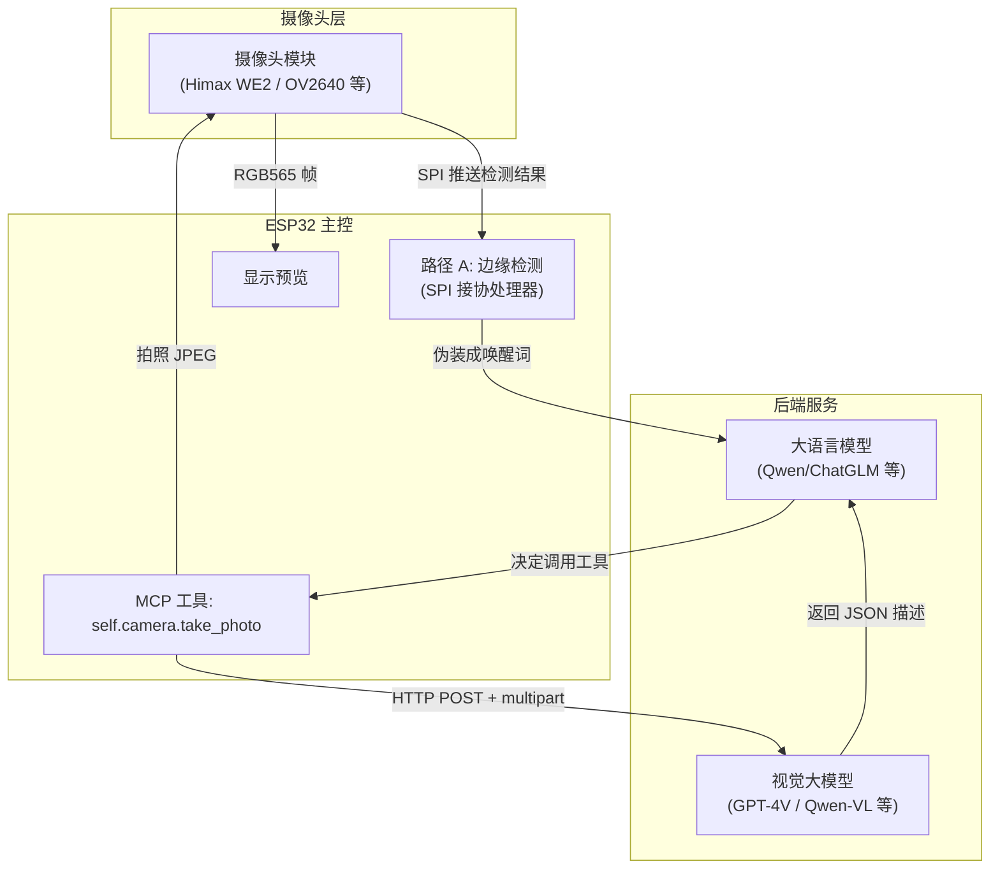
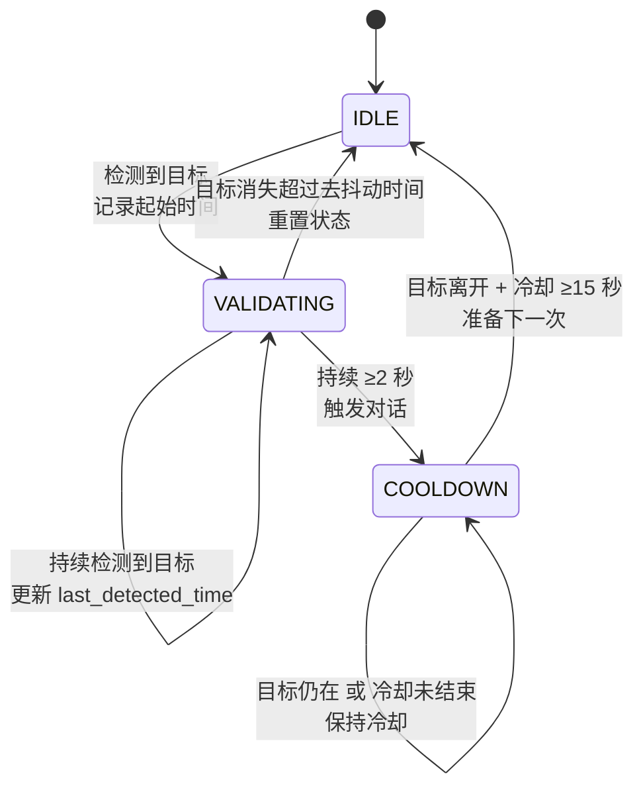
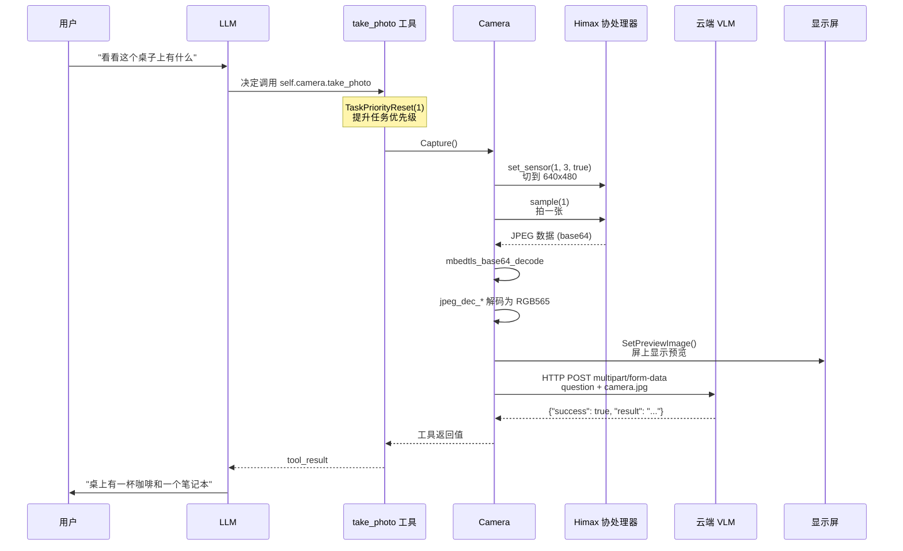

# 【小智 ESP32】一块几美元的芯片是怎么"看见"世界的：双层视觉架构深度拆解

## 引子

ESP32 的主频是 240 MHz，PSRAM 通常 8 MB，没有 NPU。用这块芯片跑一个 YOLOv8 推理一帧需要几十秒——这显然不是"看见"世界，而是"做梦"。

但开源项目 [xiaozhi-esp32](https://github.com/78/xiaozhi-esp32) 偏偏让这块几美元的芯片具备了真正的视觉能力：它能"察觉"到有人进入画面，也能"理解"用户随手拍下来的画面里到底有什么。

这背后的设计哲学其实非常值得借鉴：**在算力极端受限的设备上，AI 能力从来不是靠"在本地跑大模型"实现的，而是靠"分层卸载 + 协议化协作"实现的**。

本文将完整拆解小智 ESP32 的视觉系统：先看整体双层架构，再分别深入"被动边缘检测"和"主动云端解释"两条路径，最后提炼出工程上几个值得参考的设计决策。

## 一、整体设计哲学：算力卸载 + 双路径

小智的视觉系统并不是"把图像丢给本地模型推理"这种朴素思路。它采用了**双路径设计**：

- **路径 A（被动）**：通过协处理器在边缘做轻量目标检测，检测到目标后**伪装成"唤醒词"**注入到大语言模型的输入流里。
- **路径 B（主动）**：用户主动要求"看看"时，ESP32 拍照后通过 HTTP 上传到云端视觉大模型（VLM）进行解释。

两条路径分工明确：路径 A 解决"什么情况下应该主动说话"，路径 B 解决"用户问的时候怎么回答"。前者要求**低延迟、低功耗、本地可运行**；后者允许**高延迟、依赖网络、需要强大理解力**。



这张图值得多看几眼——**ESP32 自己不解释图像，它只做"采集 + 协议 + 调度"**。所有需要"理解"的工作，要么交给协处理器上的小模型，要么交给云端的大模型。这种"小马拉大车"的架构，正是当下 IoT 视觉设备的主流选择。

## 二、路径 A：被动边缘检测——把检测结果伪装成"唤醒词"

路径 A 的实现集中在 `main/boards/sensecap-watcher/sscma_camera.cc`，对应的是 Seeed 公司的 **SenseCAP Watcher** 这块开发板。它有一颗**协处理器 Himax WE2（HX6538）**，专门用来跑轻量级 AI 模型——这正是 ESP32 自己跑不动、又必须本地完成的"发现目标"任务。

### 2.1 硬件连接：ESP32 用 SPI"遥控"协处理器

ESP32 跟 Himax 之间用 SPI 通信，包括一根同步线、一根片选、一根时钟：

```cpp
sscma_client_io_spi_config_t spi_io_config = {0};
spi_io_config.sync_gpio_num = BSP_SSCMA_CLIENT_SPI_SYNC;
spi_io_config.cs_gpio_num   = BSP_SSCMA_CLIENT_SPI_CS;
spi_io_config.pclk_hz       = BSP_SSCMA_CLIENT_SPI_CLK;
spi_io_config.spi_mode      = 0;
spi_io_config.wait_delay    = 10;  // 两个 transfer 间至少延 4ms
spi_io_config.flags.sync_use_expander = BSP_SSCMA_CLIENT_RST_USE_EXPANDER;
```

这段配置本身不起眼，但揭示了一个重要事实：**ESP32 跟协处理器之间是"主-从"关系，Himax 自己只管采集和推理，结果通过 SPI 推回 ESP32**。这跟很多工程师想象的"在 ESP32 上跑模型"完全不是一回事。

### 2.2 启动流程：把模型"请"上来

Himax 协处理器上烧写的是 SenseCraft Model Assistant（SSCMA）固件，模型在固件里。ESP32 启动后要做这几步：

```cpp
// 1. 把传感器切到 640x480（用于拍照）
sscma_client_set_sensor(handle, 1, 3, true);

// 2. 加载预置的检测模型（index 4）
sscma_client_set_model(handle, 4);

// 3. 读出模型的类别列表（人/车/动物/...）
sscma_client_get_model(handle, &model, true);
// 输出示例: Classes: person, bicycle, car, motorcycle, ...

// 4. 启动持续推理
sscma_client_invoke(handle, -1, false, true);
```

注意第 3 步——ESP32 主动把类别名**读到自己内存里**，后面构造唤醒词的时候要用。这是关键细节：**ESP32 需要知道模型能识别什么**，才能把检测结果翻译成 LLM 能理解的自然语言。

### 2.3 核心：状态机防抖

如果你以为路径 A 就是一个"检测到目标 → 唤醒"的简单 if-else，那一定会被现实打脸。人来人往的房间里，**误唤醒**会非常严重——走过一只猫、闪过的影子、稍微动一下的手臂，都会触发 LLM 介入。

小智的做法是用**三态状态机**做防抖：



代码实现 (`sscma_camera.cc:157-198`) 把这个状态机写得很直白：

```cpp
case SscmaCamera::VALIDATING:
    if (is_object_detected) {
        // 还在被检测到，更新最后检测时间
        self->last_detected_time = cur_tm;
        // 关键：必须持续超过 detect_duration_sec 才触发
        if ((cur_tm - self->state_start_time) >= (self->detect_duration_sec * 1000000)) {
            is_need_wake = true;
        }
    } else {
        // 目标消失了一段时间（去抖动时间）
        if (self->last_detected_time > 0 && 
            (cur_tm - self->last_detected_time) >= self->detect_debounce_sec * 1000000LL) {
            self->detection_state = SscmaCamera::IDLE;
        }
    }
    break;
```

三个参数分工明确（默认值）：

| 参数 | 默认值 | 作用 |
|------|-------|------|
| `detect_duration_sec` | 2 秒 | 必须持续看到目标这么久，才认定为"真的有人" |
| `detect_debounce_sec` | 1 秒 | 目标短暂消失不超过这么久，不算"离开" |
| `detect_invoke_interval_sec` | 8 秒 | 触发一次后，冷却多久才允许下一次触发 |

这套机制对应现实场景非常合理：

- 走过一个路人——状态机从 IDLE 切到 VALIDATING，但 2 秒后人已经走远，回到 IDLE，**不触发**。
- 顾客停下来看产品——持续被检测 2 秒以上，触发对话；然后进入 8 秒冷却，期间哪怕继续被检测到也**不再触发**，避免对话被打断。
- 顾客跟小智聊完离开——目标离开 + 8 秒冷却结束，回到 IDLE，**准备迎接下一位**。

这种"短时间多次观察 + 触发后强制冷却"的设计，本质上是用软件机制弥补了模型本身分类置信度的不足。**在算力不够的设备上，工程上的精打细算比算法上的花哨更重要。**

### 2.4 最巧妙的设计：把检测结果伪装成"唤醒词"

状态机确认要触发了，但**怎么告诉 LLM 现在发生了什么**？这才是整条路径最巧妙的地方。

小智没有去"通知" LLM 有目标出现，而是把检测结果**伪装成一个伪唤醒词**，直接塞进 LLM 的输入流：

```cpp
if (is_need_wake) {
    std::string cached_target_name = "object";
    if (self->model != NULL && self->model->classes[self->detect_target] != NULL) {
        cached_target_name = self->model->classes[self->detect_target];  // 真实的类别名
    }
    // 关键：包成 <detect>...</detect> 标签
    wake_word = "<detect>" + std::to_string(obj_cnt) + " " 
              + cached_target_name + " detected </detect>";
    
    Application::GetInstance().WakeWordInvoke(wake_word);
    ...
}
```

举几个具体的唤醒词例子：

- `<detect>1 person detected</detect>`
- `<detect>1 cat detected</detect>`
- `<detect>3 cup detected</detect>`

这种设计的好处太多了：

1. **不需要改 LLM 协议**——直接复用现有的"语音唤醒"通道，零协议改动。
2. **LLM 自然语言处理**——`<detect>` 标签被嵌入到正常的 LLM 输入流里，LLM 看到后可以决定怎么回复（"你好呀！欢迎光临！" 或者 "你是什么品种的猫咪呀？"）。
3. **多模态输入统一**——不管是用户语音唤醒、按键唤醒、还是视觉唤醒，最终都汇入同一条 LLM 对话流。

### 2.5 资源保护：闲时推理，忙时停

如果 ESP32 一直跑视觉推理，会跟语音播放、网络通信抢资源。小智的处理是在主循环里加了一道闸门：

```cpp
if (this_->inference_en && Application::GetInstance().GetDeviceState() == kDeviceStateIdle) {
    if (!is_inference) {
        // 闲时 + 用户开启了推理 → 启动
        sscma_client_invoke(handle, -1, false, true);
        is_inference = true;
    }
} else if (is_inference && (!this_->inference_en || GetDeviceState() != kDeviceStateIdle)) {
    // 用户关闭了 / 系统进入对话状态 → 停止
    sscma_client_break(handle);
    is_inference = false;
}
```

**只有设备处于 IDLE 状态（没有在对话、没有在播放、没有在 OTA）时才跑视觉推理**。一旦用户开口说话或者小智在播放回复，立刻 `sscma_client_break()` 中断推理。

还有个小细节：每 10 秒发一次 AT 心跳给 Himax，3 次失败就 reset 协处理器——这是嵌入式系统里很常见的"看门狗"模式。

## 三、路径 B：主动云端 VLM——通过 MCP 工具调用

路径 A 解决"什么时候主动说话"，但用户说"看看这个桌子上是什么"的时候，**需要的是语义理解能力**，这只能靠云端 VLM（Vision-Language Model）。

### 3.1 MCP 工具：把"拍照 + 解释"封装成 LLM 工具

小智实现了一个 **MCP（Model Context Protocol）工具** `self.camera.take_photo`，让 LLM 在对话过程中能主动调用：

```cpp
// mcp_server.cc:102-120
AddTool("self.camera.take_photo",
    "Always remember you have a camera. If the user asks you to see something, "
    "use this tool to take a photo and then explain it.\n"
    "Args:\n"
    "  `question`: The question that you want to ask about the photo.\n"
    "Return:\n"
    "  A JSON object that provides the photo information.",
    PropertyList({
        Property("question", kPropertyTypeString)
    }),
    [camera](const PropertyList& properties) -> ReturnValue {
        // 拉高任务优先级（拍照不能被打断）
        TaskPriorityReset priority_reset(1);
        if (!camera->Capture()) {
            throw std::runtime_error("Failed to capture photo");
        }
        auto question = properties["question"].value<std::string>();
        return camera->Explain(question);  // 调用 VLM
    });
```

注意工具描述的第一句话：**"Always remember you have a camera."**

这不是客套话，这是 **prompt engineering 的一部分**。LLM 不会"记得"自己有什么能力，只会在每次推理时看一遍工具描述。把 "you have a camera" 这种提示放在工具描述最显眼的位置，等于持续在 LLM 心里种下"我有相机"的种子。

### 3.2 拍照 + 解释的完整调用链



### 3.3 关键的 `Explain()` 实现

`Capture()` 拿到 JPEG 二进制后，调用 `Explain()` 上传到云端 VLM：

```cpp
std::string SscmaCamera::Explain(const std::string& question) {
    if (explain_url_.empty()) {
        return R"({"success": false, "message": "Image explain URL or token is not set"})";
    }
    
    auto network = Board::GetInstance().GetNetwork();
    auto http = network->CreateHttp(3);
    
    // 构造 multipart/form-data 请求体
    std::string boundary = "----ESP32_CAMERA_BOUNDARY";
    std::string question_field = "--" + boundary + "\r\n"
        "Content-Disposition: form-data; name=\"question\"\r\n\r\n"
        + question + "\r\n";
    std::string file_header = "--" + boundary + "\r\n"
        "Content-Disposition: form-data; name=\"file\"; filename=\"camera.jpg\"\r\n"
        "Content-Type: image/jpeg\r\n\r\n";
    std::string footer = "\r\n--" + boundary + "--\r\n";
    
    // 设置请求头
    http->SetHeader("Device-Id", SystemInfo::GetMacAddress().c_str());
    http->SetHeader("Client-Id", Board::GetInstance().GetUuid().c_str());
    if (!explain_token_.empty()) {
        http->SetHeader("Authorization", "Bearer " + explain_token_);
    }
    http->SetHeader("Content-Type", "multipart/form-data; boundary=" + boundary);
    http->SetHeader("Transfer-Encoding", "chunked");
    
    // 分块发送
    http->Open("POST", explain_url_);
    http->Write(question_field.c_str(), question_field.size());
    http->Write(file_header.c_str(), file_header.size());
    http->Write((const char*)jpeg_data_.buf, jpeg_data_.len);
    http->Write(footer.c_str(), footer.size());
    http->Write("", 0);  // 结束块
    
    // 读取响应
    if (http->GetStatusCode() != 200) { /* 错误处理 */ }
    std::string result = http->ReadAll();
    return result;
}
```

几个值得注意的工程细节：

1. **`Transfer-Encoding: chunked`**：JPEG 大小不固定，分块传输避免提前知道 Content-Length。
2. **设备标识 + 鉴权**：`Device-Id`（MAC 地址）+ `Client-Id`（UUID）+ `Authorization: Bearer`，云端可以追溯和鉴权。
3. **`explain_url_` 和 `explain_token_` 由 `SetExplainUrl()` 注入**——这意味着**任何兼容 multipart/form-data 的 VLM 服务都能接入**，不绑定特定厂商。GPT-4V、Qwen-VL、Step-1V 等都能用。

### 3.4 屏上预览：把 JPEG 解码给 LVGL

拍照的同时还要在屏幕上显示预览。ESP-IDF 内置了 JPEG 硬件解码器（esp_jpeg），小智用它把 JPEG 解码成 RGB565：

```cpp
jpeg_dec_config_t config = { .output_type = JPEG_PIXEL_FORMAT_RGB565_LE, .rotate = JPEG_ROTATE_0D };
jpeg_dec_open(&config, &jpeg_dec_);

jpeg_io_->inbuf = jpeg_data_.buf;
jpeg_io_->inbuf_len = jpeg_data_.len;
jpeg_dec_parse_header(jpeg_dec_, jpeg_io_, jpeg_out_);

jpeg_io_->outbuf = (unsigned char*)preview_image_.data;
jpeg_dec_process(jpeg_dec_, jpeg_io_);

// 把 RGB565 数据丢给 LVGL 显示
auto display = dynamic_cast<LvglDisplay*>(Board::GetInstance().GetDisplay());
display->SetPreviewImage(std::make_unique<LvglAllocatedImage>(data, size, w, h, stride, LV_COLOR_FORMAT_RGB565));
```

硬件 JPEG 解码在 ESP32-S3 上基本不占 CPU，几毫秒就能解完一张 640x480 图像。这是 ESP32 系列里少数能"白嫖"的硬件加速能力之一。

## 四、关键设计决策

把这套系统拆解清楚之后，有几个工程上的设计决策值得专门说一下。

### 4.1 为什么一定要用协处理器？

有人会问：ESP32-S3 不是有向量指令吗？为什么不直接在 ESP32 上跑 TFLite Micro？

**核心原因是 NPU（神经网络处理单元）**。ESP32-S3 的向量指令只能加速一些卷积操作，整个推理过程还要协调内存、调度、I/O，对 240 MHz 的 CPU 来说仍然太慢。而 Himax WE2 这种专用协处理器有独立的 NPU，能在几十毫秒内完成一帧推理——这才是"实时"。

更关键的是**功耗**。协处理器推理时 ESP32 主控可以深度睡眠，整体功耗能做到 100mW 以下；如果用 ESP32-S3 自己跑，功耗会到 600mW 以上，电池设备根本撑不住。

### 4.2 为什么是"伪装唤醒词"而不是"事件通知"？

路径 A 也可以设计成"ESP32 检测到目标 → 通过 MQTT/WebSocket 通知后端 → 后端插入上下文"。但这种"事件总线"模式有几个问题：

- 需要后端维护状态机（跟 ESP32 这边的状态机对账）
- 通知的时序跟用户语音流可能冲突
- 新增 LLM 后端都要适配

而"伪装唤醒词"这种做法，把视觉事件**降维成了一段文本**——LLM 完全不需要知道这是从视觉来的，它看到的只是"用户（或系统）说了一句话"。**这是把多模态问题转换成单模态问题**的精彩设计。

### 4.3 为什么用 MCP 而不是 Function Calling？

MCP（Model Context Protocol）是 Anthropic 推动的开放协议，相比各家自有的 Function Calling 有一个重要优势：**工具描述跟模型解耦**。同一份工具描述可以给 Claude、GPT、Qwen、GLM 等所有支持 MCP 的模型用。

小智自己实现了一个轻量 MCP Server（`mcp_server.cc`），所有工具都注册在这里。当 LLM 决定调用某个工具时，ESP32 这边解析调用、执行本地动作、把结果返回。这种设计让小智**不绑定任何特定 LLM**——可以无缝切换云端大脑。

### 4.4 关注度参数化：LLM 能动态调检测目标

`InitializeMcpTools()` 里注册了三个工具：

- `self.model.param_get`：查询当前阈值、冷却时间、检测目标
- `self.model.param_set`：动态调整这些参数
- `self.model.enable`：开关整个推理功能

这意味着 LLM 在对话中可以"自我调优"——比如用户说"以后别看到猫就说话，太烦了"，LLM 可以调用 `self.model.param_set` 把 `target` 改成 `person`；用户说"把灵敏度调低点"，LLM 可以把 `threshold` 调到 90。

**这是把"用户偏好"通过 LLM 翻译成"模型参数"的过程**，是端侧 AI 跟云端 AI 协作的典型范式。

### 4.5 协议化的工程价值

把视觉能力封装成 MCP 工具、`SetExplainUrl()` 注入 VLM 后端、状态机参数全部可调——这些都是**"协议化"**的体现。协议化的好处是：

- **可替换**：Himax 协处理器可以换成 Grove Vision AI V2，云端 VLM 可以从 GPT-4V 换成 Qwen-VL，**主代码不用改**。
- **可观测**：每个环节都有明确输入输出和日志，调试方便。
- **可演进**：今天只做检测，明天加 OCR，后天加姿态估计，都只是新增工具。

## 五、上手改造：怎么扩展视觉能力

如果你想基于小智 ESP32 改造自己的视觉设备，下面是几个常见切入点的指引。

### 5.1 添加新的检测目标

`SscmaCamera::InitializeMcpTools()` 里 `self.model.param_set` 工具的 `target` 参数范围是从 `0` 到 `model_class_cnt - 1`。具体流程：

1. 重新烧写 Himax 固件，加载包含你想要的类别的 YOLO 模型（参考 SSCMA 文档）
2. ESP32 端在 `InitializeMcpTools()` 时 `sscma_client_get_model` 会自动读出新类别
3. `model_class_cnt` 自动更新，`self.model.param_set` 工具的 target 参数范围自动扩大
4. 用户通过对话告诉 LLM "我想检测键盘"，LLM 调用工具把 target 设到对应索引

### 5.2 接入新的云端 VLM

```cpp
// 在你的 board 初始化里：
camera->SetExplainUrl(
    "https://your-vlm-service.com/api/v1/explain",  // 你的 VLM 服务地址
    "your-api-token"                                 // 你的鉴权 token
);
```

只要你的 VLM 服务接受 `multipart/form-data`，字段名是 `question` 和 `file`（文件名是 `camera.jpg`），就能接入。**目前主流的 GPT-4V、Qwen-VL、Step-1V 都有标准 REST 接口**，改改 URL 即可。

### 5.3 实时视频流

现在只有"拍照 + 解释"模式，没有真正的实时视频流。如果要加视频流（比如推流到 WebRTC 服务），需要：

- 用 ESP32-S3 的 MIPI-CSI 接口直连摄像头（绕过 Himax）
- 实现 RTP/WebRTC 推流协议
- 后端接 SFU（媒体服务器）

这个改动量比较大，相当于自己实现一个外置摄像头的固件。

### 5.4 让其他板子（没有协处理器）也支持检测

`xiaozhi-esp32` 的设计是把协处理器能力**抽象成 Camera 类的统一接口**（`Camera::Capture()`、`Camera::Explain()`）。其他板子只要：

1. 实现自己的 Camera 类（通过 `esp_video` 驱动 OV2640/XIAO 等）
2. 把 `Explain()` 对接到云端 VLM（路径 B）
3. 如果需要"被动检测"，自己实现一个本地轻量检测（用 ESP-DL 或者 ESP-WHO）

就能获得类似的视觉能力。

## 结语：边缘 + 云端的"小马拉大车"范式

小智 ESP32 的视觉系统，本质上是一个**"边缘 + 云端"分层 AI**的微型范例：

- **边缘层**（协处理器）：只做"是什么 / 在不在"这种低层次判断，要求**快、省电、本地闭环**。
- **传输层**（ESP32）：只做"采集 + 协议 + 调度"，不解释图像，但保证数据可靠到达。
- **云端层**（VLM + LLM）：做"理解 + 决策 + 表达"，要求**能力强、延迟可以接受**。

这三层之间的协议设计——SPI over Himax、HTTP multipart over VLM、MCP tool calling over LLM——才是整套系统能跑起来的关键。

**在算力极度受限的设备上，"AI 能力"从来不是靠"在本地跑大模型"实现的，而是靠"把对的问题抛给对的地方"实现的**。小智 ESP32 用十几块钱的硬件，证明了这条路的可行性。

如果你正在做 IoT 视觉设备、AI 玩具、智能家居，或者只是想学习嵌入式 + AI 怎么结合，这个项目都值得深读。开源代码就在那里：`https://github.com/78/xiaozhi-esp32`。

---

**参考资料：**

- [xiaozhi-esp32 GitHub 仓库](https://github.com/78/xiaozhi-esp32)
- [SenseCAP Watcher 官方文档](https://wiki.seeedstudio.com/sensecap_watcher/)
- [SSCMA (SenseCraft Model Assistant) 文档](https://github.com/Seeed-Studio/SSCMA)
- [MCP (Model Context Protocol) 规范](https://modelcontextprotocol.io/)
- [ESP-IDF JPEG 解码 API](https://docs.espressif.com/projects/esp-idf/zh_CN/latest/esp32s3/api-reference/peripherals/jpeg.html)

## 对比分析

小智 ESP32 的设计哲学是"算力卸载 + 双路径感知"——边缘做轻量检测，云端做 VLM 解释。在"MCU 级视觉感知"这个细分领域，跟它定位最像的开源项目是 OpenCV 的 OAK-D Lite、Espressif 自己推出的 esp-who，以及 Seeed 的 SenseCAP Watcher 固件。下面对它们做一次横向对比。

### 维度一：硬件与算力

| 项目 | 主控 | 本地推理能力 | 视觉模型 |
|------|------|----------------|----------|
| **小智 ESP32** | ESP32-S3 (240 MHz, 8MB PSRAM) | 轻量检测（人脸/运动） | 边缘 CNN + 云端 VLM |
| **esp-who (Espressif 官方)** | ESP32-S3 / ESP32-P4 | 人脸检测 + 识别 | ESP-DL / 量化模型 |
| **OAK-D Lite (OpenCV)** | Myriad X VPU | 完整 CV pipeline | 多种 YOLO/MobileNet |
| **OpenMV Cam H7** | STM32H7 (480 MHz) | 传统 CV + 小型 CNN | Haar/HOG/简单网络 |

### 维度二：协议与云端协作

- **小智 ESP32**：通过 MCP/WebSocket 把"检测事件"和"截图解释"暴露给云端 Agent
- **esp-who**：本地实时检测为主，云端协作需要自己实现
- **OAK-D Lite**：本地即出检测结果，云端仅做"结果再分析"
- **OpenMV**：本地脚本式处理，无内置云端协议

### 维度三：开发体验

- 小智 ESP32：完整双层架构、官方文档友好、参考实现完整
- esp-who：Espressif 官方，但需要自己写云端集成
- OAK-D Lite：OpenCV 生态整合度高，硬件成本较贵
- OpenMV：MicroPython 脚本式，入门简单但能力受限

**优缺点小结**

- **小智 ESP32**：把"边缘检测 + 云端 VLM"做成端到端参考实现；缺点是只支持 ESP32-S3，模型生态较窄
- **esp-who**：官方原生，稳定性强；缺点是云端集成需要 DIY
- **OAK-D Lite**：算力强、支持复杂模型；缺点是硬件贵（~$100+），体积大
- **OpenMV**：上手简单、MicroPython 友好；缺点是算力有限、不能跑现代 VLM

**何时选小智 ESP32**

- 你在做"电池供电、低成本、需上云的视觉 IoT"产品
- 你的场景是"被动感知 + 用户主动拍图解释"两种混合
- 你想要"端-云协议化协作"参考实现

**何时不选小智 ESP32**

- 需要本地实时做复杂模型推理——OAK-D Lite 更合适
- 只想做纯本地检测、不上云——esp-who 更原生
- 想用 MicroPython 快速原型——OpenMV 体验更顺

**参考资料**

- 小智 ESP32 GitHub：<https://github.com/78/xiaozhi-esp32>
- esp-who：<https://github.com/espressif/esp-who>
- OpenCV OAK-D Lite：<https://docs.luxonis.com/>
- OpenMV Cam：<https://openmv.io/>
- ESP-DL：<https://github.com/espressif/esp-dl>
