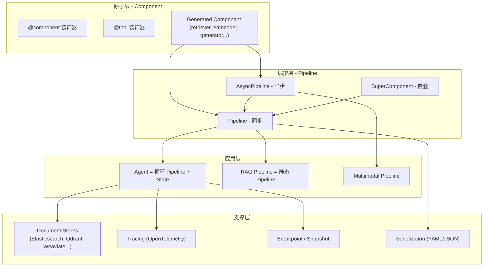
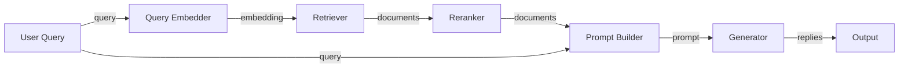

## 引子：Agent 框架的"第二战场"在哪里？

2025–2026 年的 GenAI 框架市场已经卷到极致：
- **Pydantic AI** 拼"类型安全"
- **LangGraph** 拼"图编排自由"
- **OpenAI Agents SDK** 拼"生态绑定"
- **CrewAI** 拼"低代码角色"

但当你把目光从 demo 转向**生产环境**，会发现一个被忽略的事实：**真正能跑在企业生产里的 LLM 应用，70% 都是 RAG（检索增强生成），不是 Agent**。

而 RAG 应用的"生产"挑战完全不同于 Agent demo：
- **可调试**：每一步要能 inspect、retry、snapshot
- **可组合**：retriever 换 BM25 还是 dense？reranker 用 cross-encoder 还是 LLM？prompt template 改版本？
- **可观测**：每一步的 latency、token、recall/precision
- **可演进**：新模型来了能替换、新 embedding 来了能切换，**不重写业务代码**

这个赛道的王者，是 [deepset](https://www.deepset.ai/) 团队维护了 7 年多的 [Haystack](https://github.com/deepset-ai/haystack) —— 截至 2026-06-03，**⭐ 25,439 stars**，v2.30.0 正在 RC 阶段，是少数能在生产环境"接得住"的 Python LLM 编排框架。

它走了一条和 LangGraph / Pydantic AI 不同的路：**用"Component + Pipeline + State schema"三件套，把 LLM 应用拆成可插拔的工业级积木**。本文将深度拆解这套架构。

---

## 一、项目速览：Haystack 在解决什么问题？

**Haystack 定位**：**Open-source AI orchestration framework for building production-ready LLM applications in Python** —— 一个面向生产环境的 LLM 编排框架。

和"Agent-first"框架不同，Haystack 的核心抽象是 **Pipeline（管道）** + **Component（组件）** + **State（状态）**。Agent 是"管道的一种特殊形式"（循环管道），RAG 是"管道的经典应用"（retriever → reranker → prompt → generator）。

### 1.1 核心数据

| 指标 | 数值 |
|------|------|
| ⭐ GitHub Stars | 25,439+（2026-06-03） |
| 最新 Release | v2.30.0-rc1（2026-06-02） + v2.29.0 stable（2026-05-12）|
| 许可证 | Apache-2.0 |
| 主语言 | Python（纯 typed）|
| 维护团队 | [deepset GmbH](https://www.deepset.ai/)（柏林）|
| 模块数 | 25+ 组件类别、200+ 内置组件 |

### 1.2 核心卖点

1. **Component 是"一等公民"**：每个功能（retriever、generator、embedder、reranker）都是 Component，**输入输出用 typed sockets 显式声明**
2. **Pipeline 是"组件图"**：把 Component 串成有向图，**自动处理数据流、循环、条件分支、并发**
3. **State schema 是"Agent 的大脑"**：Agent 的状态（messages + 任意 typed data）走 schema 验证，handler 控制合并策略
4. **模型无关**：OpenAI、Anthropic、Cohere、Mistral、Hugging Face、Azure、Bedrock、本地模型（vLLM/Ollama）全部一等公民
5. **调试友好**：`break_point` + `Snapshot` + 完整 OpenTelemetry tracing
6. **可序列化**：整个 Pipeline + Agent + Tool 可以导出成 YAML/JSON，方便部署

---

## 二、整体架构：Component → Pipeline → Agent

Haystack 的架构是**三层递进**的。底层 Component 是原子，中层 Pipeline 是有向图，上层 Agent 是带状态机的特殊 Pipeline。



### 2.1 Component：输入输出"插座"

Haystack 的"最小积木"是 Component。一个 Component 必须**显式声明输入和输出的"插座"（socket）**，Pipeline 根据这些 socket 自动连线。

最简单的 Component 例子（伪代码示意）：

```python
from haystack import component

@component
class MyRetriever:
    @component.output_types(documents=list[Document])
    def run(self, query: str, top_k: int = 10) -> dict:
        # 业务逻辑
        return {"documents": [...]}
```

关键点：
- `@component` 装饰器把类变成 Pipeline 可识别的"节点"
- `@component.output_types(...)` 声明输出字段及类型
- 运行时只能接受/返回这些 socket 里的字段，**类型由静态分析保证**

### 2.2 Pipeline：组件图 + 自动数据流

Pipeline 把 Component 串成有向图，**显式声明**"哪个 component 的哪个 output 连到哪个 component 的哪个 input"。



Pipeline 自己处理：
- 拓扑排序（哪个 component 先跑）
- 数据流（输出去哪）
- 循环（Agent 用）
- 条件分支（`branch` 关键字）
- 失败重试 + 快照（breakpoint）

### 2.3 Agent：带 State 的循环 Pipeline

Haystack 的 Agent **不是单独的类**，而是**"循环 + 状态"的 Pipeline**。看 `haystack/components/agents/agent.py` 的源码就明白：

```python
class Agent:
    """A tool-using Agent powered by a large language model."""
```

Agent 内部实际上组装了一个 **ChatPromptBuilder → ChatGenerator → ToolInvoker → (回到 ChatGenerator)** 的循环 Pipeline，**用 State schema 维护消息和共享数据**。

这是 Haystack 最"硬核"的设计 —— **Agent 不脱离 Pipeline 存在，是 Pipeline 的特例**。

---

## 三、核心机制：State Schema、Tool 装饰器、Breakpoint

### 3.1 State Schema：Agent 的"类型化内存"

Haystack Agent 的核心创新是 **State（状态）**。State 是一个**带类型 schema 的字典容器**，Agent 和它的所有 Tool 共享同一个 State，**按 schema 验证类型**，**按 handler 决定合并策略**。

源码（`haystack/components/agents/state/state.py`）：

```python
class State:
    """
    State is a container for storing shared information during the execution
    of an Agent and its tools.

    Internally it wraps a `_data` dictionary defined by a `schema`. Each schema entry has:
    ```json
      "parameter_name": {
        "type": SomeType,
        "handler": Optional[Callable[[Any, Any], Any]]
      }
    ```
    Handlers control how values are merged when using the `set()` method:
    - For list types: defaults to `merge_lists` (concatenates lists)
    - For other types: defaults to `replace_values` (overwrites existing value)

    A `messages` field with type `list[ChatMessage]` is automatically added.
    """
```

**这段代码解释了三件事**：
1. **Schema = 字段名 → (类型, handler)**：每个字段必须有类型，handler 控制 set() 时的合并行为
2. **messages 字段自动加**：Agent 的对话历史由框架自动维护
3. **merge_lists vs replace_values 默认策略**：list 类型追加，其他类型覆盖

实战例子：

```python
from haystack.components.agents.state import State

# 定义 schema：gh_repo_name 是字符串（覆盖），documents 是 list（追加）
my_state = State(
    schema={
        "gh_repo_name": {"type": str},                          # 默认 handler: replace_values
        "user_name":    {"type": str},                          # 默认 handler: replace_values
        "documents":    {"type": list, "handler": merge_lists},  # 显式指定追加
    },
    data={
        "gh_repo_name": "my_repo",
        "user_name": "my_user_name",
        "documents": [doc1, doc2],
    },
)
```

**对比其他框架**：
- **LangGraph**：State 走 TypedDict，handler 要自己写 reducer
- **Pydantic AI**：依赖 RunContext 显式传，Agent 间不共享 memory
- **Haystack**：**schema 即协议，Agent 和 Tool 共享同一个 State，按类型 + handler 自动 merge**

### 3.2 @tool 装饰器：函数 → Tool 的极简路径

Haystack 2.x 的 Tool 系统用 `@tool` 装饰器，**函数签名 + Annotated 自动生成 JSON schema**：

```python
from typing import Annotated, Literal
from haystack.tools import tool

@tool
def search(query: Annotated[str, "The search query"]) -> str:
    '''Search for information on the web.'''
    return "In France, a 15% service charge is typically included."

@tool
def calculator(
    operation: Annotated[Literal["multiply", "percentage"], "The math operation"],
    a: Annotated[float, "First number"],
    b: Annotated[float, "Second number"],
) -> float:
    '''Perform mathematical calculations.'''
    if operation == "multiply":
        return a * b
    elif operation == "percentage":
        return (a / 100) * b
    return 0
```

**框架自动完成**：
- 解析 `Annotated[type, "description"]` → JSON schema + description
- 推断参数类型 → schema 的 properties
- 处理 Literal/Union → enum
- 包装成 Tool 实例 → 注册到 Agent

### 3.3 Breakpoint + Snapshot：生产级调试

这是 Haystack 的"杀手锏"。**Pipeline 和 Agent 都支持 breakpoint**：在某个 component 第 N 次访问时暂停、dump 完整 snapshot、保存到磁盘/数据库。

```python
from haystack.dataclasses import AgentBreakpoint, ToolBreakpoint

breakpoint = AgentBreakpoint(
    agent_name="my_agent",
    visit_count=2,  # 第二次循环时暂停
    tool_breakpoint=ToolBreakpoint(tool_name="calculator", visit_count=1),
)

result = agent.run(
    messages=[ChatMessage.from_user("Calculate €85 tip in France")],
    break_point=breakpoint,  # 注入
)
```

**生产价值**：
- 线上 bug 复现：把 snapshot 重放，本地调试
- 长链路暂停：避免某些场景无意义继续跑
- 审批流：人工 review 后再继续

---

## 四、代码实战：构建一个 RAG + Agent 混合应用

下面是一个**完整可运行**的例子：先用 Pipeline 做检索增强，再升级到带工具的 Agent。整个流程展示 Haystack 的"组件 + 管道 + 状态"三件套如何工作。

### 4.1 基础 RAG Pipeline（静态管道）

```python
"""Haystack 2.x 基础 RAG Pipeline - 文档检索 + 生成。
需要 OPENAI_API_KEY 环境变量。
"""
import os
from haystack import Pipeline, Document
from haystack.document_stores.in_memory import InMemoryDocumentStore
from haystack.components.retrievers.in_memory import InMemoryBM25Retriever
from haystack.components.embedders import OpenAITextEmbedder, OpenAIDocumentEmbedder
from haystack.components.generators.chat import OpenAIChatGenerator
from haystack.components.builders import ChatPromptBuilder
from haystack.dataclasses import ChatMessage

# 1. 准备文档存储
document_store = InMemoryDocumentStore()
documents = [
    Document(content="Haystack is an open-source LLM orchestration framework by deepset."),
    Document(content="Pipelines in Haystack connect components to form retrieval-augmented generation systems."),
    Document(content="Agents in Haystack are loops with state - they use tools until exit conditions are met."),
    Document(content="Haystack supports OpenAI, Anthropic, Cohere, Mistral, Hugging Face, and local models."),
]
document_store.write_documents(documents)

# 2. 构建 Pipeline
pipeline = Pipeline()
pipeline.add_component("embedder", OpenAITextEmbedder())
pipeline.add_component("retriever", InMemoryBM25Retriever(document_store=document_store))
pipeline.add_component("prompt_builder", ChatPromptBuilder())
pipeline.add_component("generator", OpenAIChatGenerator(model="gpt-4o-mini"))

# 3. 连接组件（关键！）
pipeline.connect("embedder.embedding", "retriever.query_embedding")
pipeline.connect("retriever.documents", "prompt_builder.documents")
pipeline.connect("prompt_builder.prompt", "generator.messages")

# 4. 准备 prompt 模板
template = """Answer the question based on the retrieved documents.
Documents:

  - {{ doc.content }}


Question: {{ query }}
Answer:"""

# 5. 运行
question = "What is Haystack?"
result = pipeline.run({
    "embedder": {"text": question},
    "prompt_builder": {"template": template, "query": question},
})
print(result["generator"]["replies"][0].text)
```

**核心要点**：
- `pipeline.connect("a.output", "b.input")` 显式声明数据流
- 类型不匹配的连接会**运行时检查**报错
- 模板用 Jinja2，支持循环/条件

### 4.2 升级为带工具的 Agent

```python
"""Haystack 2.x Agent - 工具调用 + State 共享。
需要 OPENAI_API_KEY 环境变量。
"""
from typing import Annotated, Literal
from haystack import Pipeline
from haystack.components.agents import Agent
from haystack.components.generators.chat import OpenAIChatGenerator
from haystack.components.tools import ToolInvoker
from haystack.dataclasses import ChatMessage
from haystack.tools import tool
from haystack.components.agents.state import State

# 1. 定义工具
@tool
def search(query: Annotated[str, "The search query"]) -> str:
    '''Search for information on the web.'''
    # 实际应该调搜索 API
    return "In France, a 15% service charge is typically included, but leaving 5-10% extra is appreciated."

@tool
def calculator(
    operation: Annotated[Literal["multiply", "percentage"], "The mathematical operation"],
    a: Annotated[float, "First number"],
    b: Annotated[float, "Second number"],
) -> float:
    '''Perform mathematical calculations.'''
    if operation == "multiply":
        return a * b
    elif operation == "percentage":
        return (a / 100) * b
    return 0

# 2. 构造 Agent（带 State schema）
agent = Agent(
    system_prompt=(
        "You are a helpful assistant. Use the 'search' tool to find information "
        "and the 'calculator' tool to perform math."
    ),
    chat_generator=OpenAIChatGenerator(model="gpt-4o-mini"),
    tools=[search, calculator],
    state_schema={
        "user_name": {"type": str},         # 共享给所有 tool
        "search_results": {"type": list},   # 工具写入，handler 默认 merge_lists
    },
)

# 3. 运行
result = agent.run(
    messages=[ChatMessage.from_user(
        "Calculate the appropriate tip for an €85 meal in France"
    )],
    state={"user_name": "Alice"},
)
print("Final reply:", result["last_message"].text)
print("Last state:", result.get("state"))
```

**执行流程**（框架自动完成）：
1. User 消息塞进 `state["messages"]`
2. ChatGenerator 推理 → 决定调用 `search` 工具
3. ToolInvoker 执行 search → 结果写回 `state["messages"]`（默认 handler merge_lists）
4. ChatGenerator 继续推理 → 决定调用 `calculator(percentage, 15, 85)`
5. ToolInvoker 执行 calculator → 返回 12.75
6. ChatGenerator 整合 → 最终答案
7. 退出条件触发 → 返回 `{"last_message": ..., "state": {...}}`

### 4.3 调试：Breakpoint + Snapshot

```python
from haystack.dataclasses import AgentBreakpoint, ToolBreakpoint

# 在 calculator 工具第一次被调用时暂停
breakpoint = AgentBreakpoint(
    agent_name="my_agent",
    visit_count=1,
    tool_breakpoint=ToolBreakpoint(tool_name="calculator", visit_count=1),
)

try:
    result = agent.run(
        messages=[ChatMessage.from_user("Calculate €85 tip in France")],
        break_point=breakpoint,
    )
except Exception as e:
    # 抛出 BreakpointException，包含完整 snapshot
    print(f"Paused at snapshot: {e.snapshot}")
    # 把 snapshot 存盘，本地 replay
    import json
    snapshot_data = e.snapshot.to_dict()
    with open("/tmp/snapshot.json", "w") as f:
        json.dump(snapshot_data, f)
```

---

## 五、组件生态：25+ 类别，200+ 开箱即用

Haystack 的"工业级"属性最直接的体现就是**组件数量**。看 `haystack/components/` 目录：

| 类别 | 作用 | 典型组件 |
|------|------|----------|
| `agents/` | Agent 主类 + State | `Agent`, `State` |
| `audio/` | 语音转文字 | `WhisperTranscriber` |
| `embedders/` | Embedding 模型封装 | `OpenAITextEmbedder`, `SentenceTransformersDocumentEmbedder` |
| `generators/` | LLM 文本生成 | `OpenAIGenerator`, `AnthropicGenerator`, `HuggingFaceLocalGenerator` |
| `generators/chat/` | Chat 风格 LLM | `OpenAIChatGenerator`, `AnthropicChatGenerator` |
| `retrievers/` | 各种检索器 | `InMemoryBM25Retriever`, `ElasticsearchRetriever`, `QdrantRetriever` |
| `rankers/` | 重排序 | `SentenceTransformersRanker`, `CohereRanker`, `LostInMiddleRanker` |
| `converters/` | 文档解析 | `PDFToTextConverter`, `HTMLToDocument`, `MarkdownToDocument` |
| `preprocessors/` | 文档预处理 | `DocumentSplitter`, `DocumentCleaner` |
| `extractors/` | 信息抽取 | `NamedEntityExtractor`, `RegexExtractor` |
| `websearch/` | Web 搜索 | `SerperDevWebSearch`, `SearchApiWebSearch` |
| `tools/` | Tool 实现 | `ToolInvoker` |
| `evaluators/` | 评估 | `FaithfulnessEvaluator`, `ContextRelevanceEvaluator` |
| `routers/` | 条件路由 | `ConditionalRouter`（if/else 分支）|
| `joiners/` | 结果合并 | `BranchJoiner`, `DocumentJoiner` |
| `writers/` | 写入存储 | `DocumentWriter` |
| `fetchers/` | 抓取 URL 内容 | `LinkContentFetcher` |
| `classifiers/` | 文档分类 | `TransformersZeroShotClassifier` |
| `query/` | 查询改写 | `QueryClassifier`, `QueryExpander` |

**关键洞察**：你需要的 80% 组件**官方已经写好**。这是 Haystack 区别于"框架型"产品（LangGraph）的地方 —— **它既是框架，也是组件库**。

---

## 六、与同类项目的对比

### 6.1 vs LangGraph

| 维度 | Haystack | LangGraph |
|------|----------|-----------|
| 抽象层次 | Component（带类型插座） | Node（任意函数） |
| 数据流 | `connect("a.out", "b.in")` 显式 | 边（edge）声明 |
| 状态管理 | State schema + handler 自动 merge | Reducer 手动写 |
| 组件生态 | 200+ 内置 | 用户自建 |
| 调试 | Breakpoint + Snapshot | LangSmith 闭源 |
| 学习曲线 | 中（要懂 component 协议） | 中（要懂图论） |
| 适合场景 | RAG + 检索重排序、典型 LLM 应用 | 复杂定制化流程、多 agent 拓扑 |

**核心差异**：LangGraph 给你"画图自由"，Haystack 给你"现成组件 + 工业级调试"。如果你的应用是"标准 RAG + 偶尔 Agent"，Haystack 一天搭完；如果你要"完全自定义的多 agent 状态机"，LangGraph 更灵活。

### 6.2 vs LlamaIndex

| 维度 | Haystack | LlamaIndex |
|------|----------|------------|
| 抽象核心 | Pipeline | Index（索引抽象）|
| 数据视角 | 组件图 | 数据索引图 |
| Agent | 带 State 的循环 Pipeline | ReAct Agent + Function Calling |
| 易用性 | 中（要理解 component） | 高（`from llama_index import ...`） |
| 灵活度 | 高 | 中（index 抽象有约束）|
| 文档解析 | 强（`converters/`） | 强（`readers/`）|

**核心差异**：LlamaIndex 是"以数据/索引为中心"的设计，Haystack 是"以组件/管道为中心"。你要快速搭一个"接入 PDF → 索引 → 问答"应用，LlamaIndex 更短；你要"retriever 选 X，reranker 选 Y，prompt template 改 Z，loop 嵌入 W"，Haystack 更工程化。

### 6.3 vs Pydantic AI

| 维度 | Haystack | Pydantic AI |
|------|----------|-------------|
| 核心抽象 | Pipeline + Component | Agent + State |
| 类型系统 | Component 输出 typed socket | Pydantic BaseModel 全链路 |
| 状态共享 | State schema + handler | RunContext.deps 显式注入 |
| 工具定义 | `@tool` 装饰器 + Annotated | `@agent.tool` 函数 |
| 适用场景 | 检索增强、生产 LLM 应用 | 类型严格的 Agent 应用 |
| 学习曲线 | 中 | 低（FastAPI 风格）|

**核心差异**：Pydantic AI 是"Agent 优先"框架，类型安全是它最大的卖点；Haystack 是"RAG + 编排"框架，组件丰富度 + 工业级调试是它的护城河。

### 6.4 vs Microsoft AutoGen / CrewAI

| 维度 | Haystack | AutoGen / CrewAI |
|------|----------|------------------|
| 多 Agent | 弱（要自己用 Pipeline 拼） | 强（原生 multi-agent）|
| RAG | 极强（组件生态）| 弱（要自己接）|
| 状态管理 | State schema | Conversation thread |
| 适合场景 | 检索 + 单 agent | 角色扮演型多 agent |

**核心差异**：AutoGen / CrewAI 的多 agent 抽象更"以人为本"（角色、对话），Haystack 的抽象更"以管道/组件为本"（graph、socket）。用错场景会非常痛苦：用 CrewAI 做 RAG 是自找麻烦，用 Haystack 做多 agent 角色扮演也是。

---

## 七、优缺点分析

### 7.1 左：架构简洁性 / 扩展性 / 易用性

| 维度 | 评分 | 说明 |
|------|------|------|
| 架构简洁性 | ⭐⭐⭐⭐ | Component + Pipeline + State 三件套足够清晰，没有过度抽象 |
| 扩展性 | ⭐⭐⭐⭐⭐ | 自定义 Component / Tool / State handler 都是一等公民 |
| 易用性 | ⭐⭐⭐ | 上手成本中等（要理解 component 协议 + socket），但文档非常详尽 |

### 7.2 右：性能 / 复杂度 / 维护性

| 维度 | 评分 | 说明 |
|------|------|------|
| 性能 | ⭐⭐⭐⭐ | Pipeline 层是纯 Python dict 传递，零额外序列化开销 |
| 复杂度 | ⭐⭐⭐⭐ | 框架内部组件多（200+），但暴露给用户的 API 简洁 |
| 维护性 | ⭐⭐⭐⭐⭐ | deepset 团队 + Apache 2.0 + 商业支持 + 7 年迭代 |

### 7.3 主要缺点

1. **学习曲线偏陡**：Component 装饰器 + socket 协议 + Pipeline.connect + State schema 概念密集，新手第一周会比较挣扎
2. **抽象有时过重**：简单"调一次 LLM"也要走 Component 协议，**杀鸡用牛刀**
3. **异步支持仍在演进**：`AsyncPipeline` 已稳定，但生态中部分组件还是同步优先
4. **文档庞杂**：v1 → v2 的迁移文档、cookbook、tutorial 分散在多个站点，找东西要 Google 搜

---

## 八、使用建议

### 8.1 适合用 Haystack 的场景

✅ **RAG 是核心**（文档问答、企业知识库、语义搜索）—— 组件库几乎覆盖所有 RAG 需求
✅ **检索 + 生成链路需要调试**（Breakpoint + Snapshot 是杀手锏）
✅ **多模型混合**（OpenAI 跑生成 + 本地 embedding + Cohere reranker）
✅ **需要部署为 REST API / MCP server**（`hayhooks` 项目完美支持）
✅ **团队是"工程派"**（希望用 typed + 可序列化 + 可测试的方式写 LLM 应用）

### 8.2 不适合的场景

❌ **纯 Agent 多角色协作** —— 选 AutoGen / CrewAI
❌ **极简 LLM 调用** —— 直接用 OpenAI SDK
❌ **需要完全自定义拓扑** —— LangGraph 更自由
❌ **Python 之外** —— Haystack 没有 JS/TS 版本

### 8.3 入门路径

```bash
# 1. 安装
pip install haystack-ai

# 2. 最小例子
python -c "
from haystack.components.generators.chat import OpenAIChatGenerator
g = OpenAIChatGenerator(model='gpt-4o-mini')
print(g.run(messages=[]))  # 不推荐，应传 messages
"

# 3. 完整 RAG 例子 - 跟着官方教程
# https://haystack.deepset.ai/tutorials
```

---

## 九、趋势判断

Haystack 的演进方向透露了**企业级 LLM 应用**的几个清晰信号：

1. **Agent 是 Pipeline 的特例**：deepset 没有把 Agent 单独做成"重类"，而是基于 Pipeline + State 拼出来。这暗示"重 Agent 框架"（如早期 LangChain Agent）正在失去市场，**Pipeline-first 设计会胜出**
2. **State schema 是 Agent 的未来**：随着 Agent 越来越长，状态管理（messages + 文档 + 中间结果）成为瓶颈。**类型化 schema + handler 自动 merge** 会成为标准
3. **Breakpoint + Snapshot 成为标配**：线上 LLM 应用的"调试"和"可观测"需求刚刚被意识到，Haystack 押对了
4. **MCP / 多协议适配**：Haystack 推出了 `hayhooks` 把 Pipeline 包装成 MCP server，**说明 MCP 在生产环境会越来越普及**

**预测**：未来 12–18 个月，企业级 LLM 应用会从"找一个全能 Agent 框架"转向"组合 Pipeline + 选 Component 库 + 配监控"，Haystack 已经在正确赛道上。

---

## 十、结语

Haystack 不是"新框架"，它是 deepset 团队把 **"工业级"软件工程的所有最佳实践**（typed API、组件化、可观测、可序列化、可调试）注入到 LLM 领域的产物。

如果你在 2026 年开始一个新的企业级 LLM 应用，并且：
- 主要场景是 **RAG 或检索增强**
- 团队有**工程派背景**（对类型、可测试、可调试有要求）
- 至少要 **跑 1 年以上**（长期维护性优先）

**Haystack 几乎应该是默认选项**。Pydantic AI 适合"快速搭 Agent demo"，LangGraph 适合"完全自定义流程图"，**Haystack 适合"搭一个能在生产环境跑 1 年的 RAG + 简单 Agent"**。

**项目地址**：[https://github.com/deepset-ai/haystack](https://github.com/deepset-ai/haystack)
**官方文档**：[https://docs.haystack.deepset.ai/](https://docs.haystack.deepset.ai/)
**商业支持**：[Haystack Enterprise](https://www.deepset.ai/products)

---

> 本文所有代码示例均参考 Haystack 2.x 官方 examples（Apache-2.0 License），并经过简化整理。完整示例请访问 [haystack/examples](https://github.com/deepset-ai/haystack/tree/main/test)。
