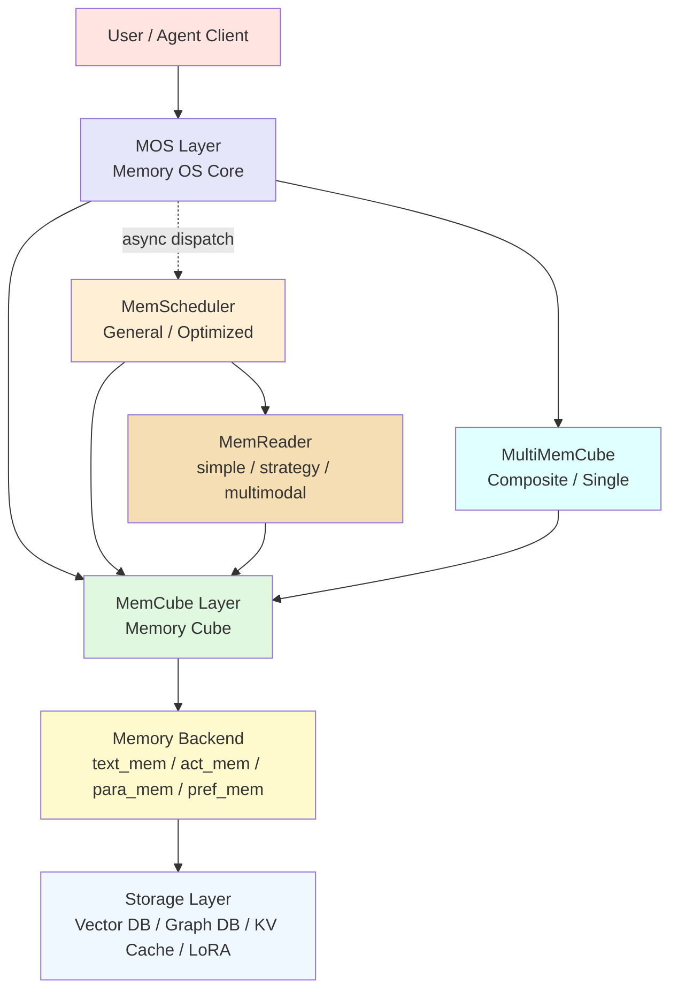
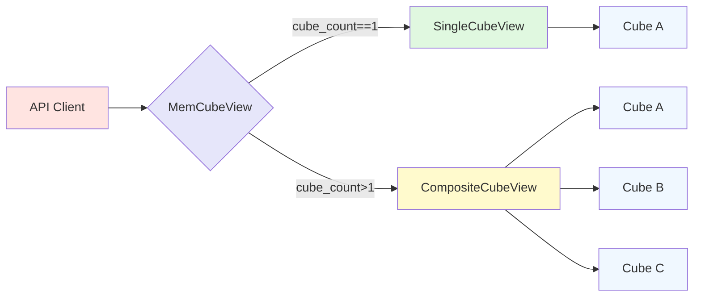
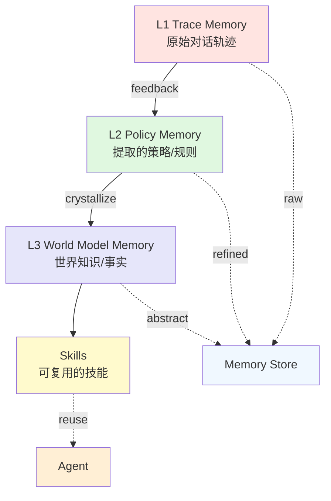
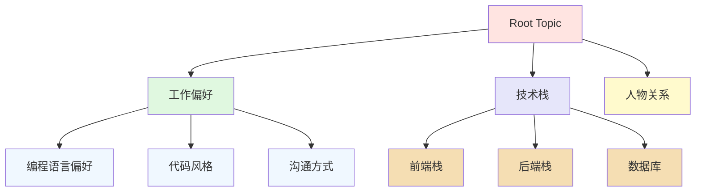
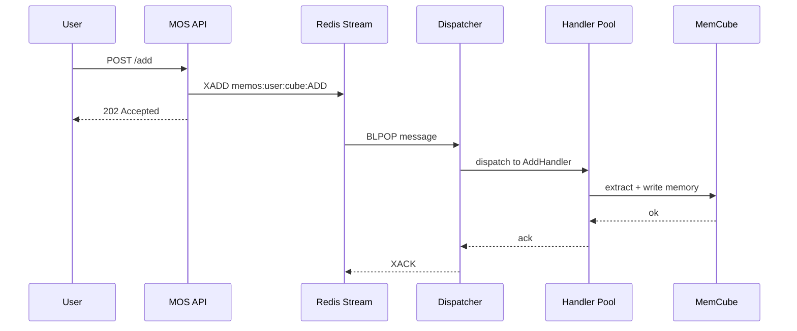
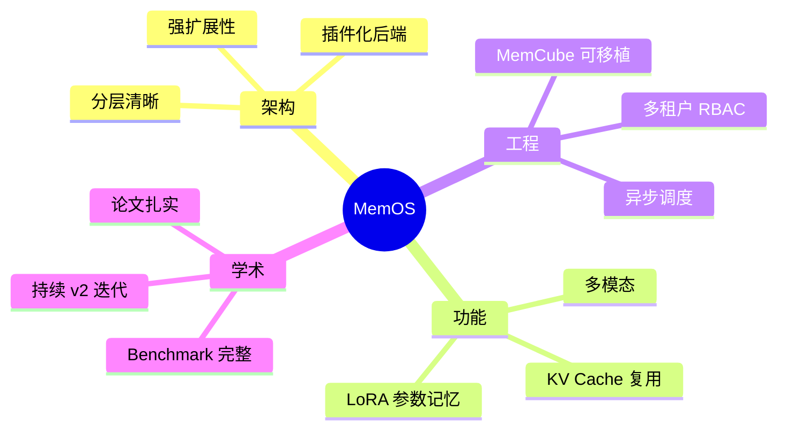

## 引子

随着 LLM 应用的不断深入，"记忆"已经从可选项变成了必需的能力。Mem0、Letta、MemPalace、Cognee 等项目都在尝试用不同思路解决"AI 怎么记得住、想得起、还学得会"的问题。但当一个 Agent 需要长期、跨任务、跨用户、跨模态地"持续学习"时，单一记忆库就显得力不从心了。

**MemOS**（Memory Operating System）则走出了完全不同的路线：它不只是一个"记忆库"，而是一个**针对 LLM 和 AI Agent 的"记忆操作系统"**。MemTensor 团队在 2025 年 5 月公开了第一版论文（arXiv:2505.22101），7 月发布正式版 MemOS（arXiv:2507.03724），截至 2026 年 6 月，GitHub 上已经收获 **9.5k+ stars**，v2.0 Stardust（星尘）版本的迭代依然非常活跃。本文将带你从源码层面，深度拆解 MemOS 的设计哲学、核心机制与工程实现。

## 一、项目定位

### 1.1 解决了什么问题？

LLM 本身是无状态的，它"记得"对话全靠 Context Window。但 Context Window 有两个硬约束：

1. **长度有限**：哪怕是 1M token 的窗口，也不可能装下用户跨年甚至跨任务的所有历史
2. **价格昂贵**：每次对话都要把历史重新塞进 prompt，token 费用随历史线性增长

业界对这个问题主要有两种解法：

- **RAG（Retrieval-Augmented Generation）**：把知识切片、向量化、检索后塞进 prompt
- **长上下文模型（Long Context）**：把上下文窗口做到 1M、10M 甚至无限

MemOS 提出了**第三条路**：把记忆视为像 CPU 内存、磁盘那样的**分层的、可管理的、可调度的资源**。它的核心论文第一句话就是：

> "LLM should have an OS-level abstraction for memory."

也就是说，LLM 应该有"内存管理"、"换页"、"缓存淘汰"这些概念。

### 1.2 价值

MemOS 的核心价值可以总结为四点：

1. **统一记忆 API**：一套 API 完成 add / retrieve / edit / delete，并以图结构组织、可检视、可编辑
2. **多模态记忆**：原生支持文本、图像、工具调用轨迹、用户 Persona
3. **多 Cube 组合**：把不同用户/项目/Agent 的记忆封装为可组合的"记忆立方体"
4. **自演化（Self-Evolving）**：通过反馈机制，让记忆在使用中不断"结晶"出更高级的 Skills

> 在 LoCoMo、LongMemEval、PrefEval-10、PersonaMem 四个 benchmark 上，MemOS 相对 OpenAI Memory 实现了 **+43.70% 准确率提升**，并节省 **35.24%** 的 token。

## 二、核心架构

### 2.1 分层总览

MemOS 采用了清晰的分层架构，从下到上依次是：



### 2.2 三大核心组件

#### （1）MOSCore / MOS — 记忆操作系统

`MOSCore`（`src/memos/mem_os/core.py`）是整个 MemOS 的"内核"，它：

- 持有 `chat_llm`、`mem_reader`、`mem_scheduler` 等子模块
- 维护用户（`user_id`）、会话（`session_id`）、MemCube 注册表
- 提供 `add_message()` / `search()` / `chat()` 等顶层 API

```python
class MOSCore:
    def __init__(self, config: MOSConfig, user_manager: UserManager | None = None):
        self.config = config
        self.user_id = config.user_id
        self.session_id = config.session_id
        self.chat_llm = LLMFactory.from_config(config.chat_model)
        self.mem_reader = MemReaderFactory.from_config(config.mem_reader)
        self.mem_scheduler = SchedulerFactory.from_config(config.mem_scheduler)
        # 内存中的 MemCube 字典
        self.mem_cubes: dict[str, GeneralMemCube] = {}
        self.chat_history_manager = ChatHistoryManager(...)
```

MOS 在 MOSCore 之上又做了一层封装，让"无配置"模式开箱即用（自动从环境变量构建配置）。

#### （2）MemCube — 记忆立方体

`GeneralMemCube`（`src/memos/mem_cube/general.py`）是"一个用户/Agent 的全部记忆"的封装，它的四个槽位分别对应四种记忆类型：

| 槽位 | 抽象基类 | 默认实现 | 用途 |
|---|---|---|---|
| `text_mem` | `BaseTextMemory` | `NaiveTextMemory` / `TreeTextMemory` | 文本记忆 |
| `act_mem` | `BaseActMemory` | `KVCacheMemory` / `VLLMKVCacheMemory` | 激活记忆（KV Cache） |
| `para_mem` | `BaseParaMemory` | `LoRAMemory` | 参数化记忆（LoRA） |
| `pref_mem` | `BaseTextMemory` | `PreferenceTextMemory` | 偏好记忆 |

```python
class GeneralMemCube(BaseMemCube):
    def __init__(self, config: GeneralMemCubeConfig):
        self._text_mem = MemoryFactory.from_config(config.text_mem)
        self._act_mem  = MemoryFactory.from_config(config.act_mem)
        self._para_mem = MemoryFactory.from_config(config.para_mem)
        self._pref_mem = MemoryFactory.from_config(config.pref_mem)

    def load(self, dir, memory_types=None): ...  # 从磁盘加载
    def dump(self, dir): ...                     # 序列化到磁盘
```

**这种"立方体"设计的关键意义在于**：你可以把一个用户的全部记忆打包成一个可移植的目录，跨设备、跨实例迁移，就像 Docker 镜像一样。

#### （3）MemScheduler — 异步调度器

`MemScheduler`（`src/memos/mem_scheduler/`）是 MemOS 的"进程调度器"，它把"添加记忆"、"检索记忆"、"重排"、"重组"等操作抽象成 task label，丢进 Redis Streams 队列，由专门的 handler 异步处理。

```python
TASK_LABELS = {
    ADD_TASK_LABEL:        AddHandler,           # 添加记忆
    QUERY_TASK_LABEL:      QueryHandler,         # 检索
    ANSWER_TASK_LABEL:     AnswerHandler,        # 生成答案
    MEM_READ_TASK_LABEL:   MemReadHandler,       # 解析消息提取记忆
    PREF_ADD_TASK_LABEL:   PrefAddHandler,       # 添加偏好
}
```

### 2.3 多 Cube 视图层

当一个用户有多个 MemCube（按项目、Agent、租户隔离）时，`multi_mem_cube` 层提供统一视图：



`CompositeCubeView`（`src/memos/multi_mem_cube/composite_cube.py`）采用"广播 + 并行"策略：写入时 fan-out 到所有 cube，检索时并发搜索后合并结果。

## 三、关键机制

### 3.1 自演化（Self-Evolving）机制

MemOS 最独特的机制是"自演化"。它把记忆分为三层：



- **L1 Trace**：原始对话、tool call、image 等"事实级"记录
- **L2 Policy**：从 L1 提炼的"用户偏好"、"任务惯例"
- **L3 World**：跨任务提炼的"领域知识"、"概念关系"
- **Skills**：经过反复使用后"结晶"出的可复用 Prompt/Code 模板

整个演化由 `MemScheduler` 中的 `mem_reorganize_handler`、`mem_dream_handler` 周期触发，类似操作系统的"内存整理"。

### 3.2 树形记忆检索（TreeTextMemory）

`TreeTextMemory`（`src/memos/memories/textual/tree.py`）是 MemOS 默认的文本记忆实现。它把记忆组织成**树状结构**：



检索时（`tree_text_memory/retrieve/advanced_searcher.py`）会：

1. 用 embedding + BM25 双路召回
2. 用 LLM 进行 query rewriting（融入历史上下文）
3. 在树结构上做"主题级"过滤，缩小搜索范围
4. 用 reranker 精排后返回

这比"扁平向量库"的优势在于：可以按主题做权限隔离、批量摘要、剪枝。

### 3.3 KV Cache 记忆（激活记忆）

`KVCacheMemory`（`src/memos/memories/activation/kv.py`）直接把 Transformer 的 KV Cache 存入记忆：

```python
class KVCacheItem(ActivationMemoryItem):
    memory: DynamicCache = Field(default_factory=DynamicCache)
    records: KVCacheRecords = KVCacheRecords()
```

这样做的好处是：**当用户问"上周聊过的 X 主题"时，MemOS 可以直接把历史的 KV Cache 拼接到新对话的 attention 里**，省去重新计算 prefix 的算力。在 vLLM 后端（`VLLMKVCacheMemory`）中，MemOS 还会把 KV Cache 转换成 prompt 字符串，触发 vLLM 的 prefix-preloading 机制。

### 3.4 MemScheduler 的任务流

`MemScheduler` 是 MemOS 的"进程调度器"，它把记忆操作异步化：



这种"提交-处理分离"的设计让 MemOS 可以在 100ms 内返回用户响应，真正的记忆抽取在后台慢慢做。

### 3.5 MemReader：结构化提取

`SimpleStructMemReader`（`src/memos/mem_reader/simple_struct.py`）是默认的"对话 -> 记忆"提取器。它使用 LLM 把对话转换为结构化 JSON：

```python
SIMPLE_STRUCT_MEM_READER_PROMPT = """
You are a memory extractor. Extract atomic memories from the conversation.
Each memory should have:
  - "memory": concise statement
  - "type": event/fact/opinion/procedure/preference
  - "tags": [keyword1, keyword2]
  - "confidence": 0.0~1.0
Return a JSON list.
"""
```

它还支持多模态（`MultiModalStructMemReader`）和策略版（`StrategyStructMemReader`）。

## 四、可运行示例

下面是**完整可运行**的 MemOS 最小化示例（仅需 `pip install MemoryOS` 或从源码 `pip install -e .`）：

```python
"""
MemOS 最小化示例：写入 + 检索 + 自演化
需要：pip install MemoryOS 或从 https://github.com/MemTensor/MemOS 本地安装
"""

import os
os.environ["OPENAI_API_KEY"] = "sk-..."   # 或其他兼容服务

from memos.mem_os.main import MOS

# 1) 一行启动：自动从环境变量构建默认配置
mos = MOS()

# 2) 注册一个用户 + Cube
user_id = "demo_user"
cube_id = mos.create_user_cube(user_id, cube_name="demo")

# 3) 写入对话
mos.add_message(
    user_id=user_id,
    mem_cube_id=cube_id,
    messages=[
        {"role": "user",      "content": "我是一名 Python 后端工程师，习惯用 FastAPI。"},
        {"role": "assistant", "content": "好的，我记录下您的技术栈偏好。"},
        {"role": "user",      "content": "沟通上请简洁一些，不要太多客套话。"},
    ],
)

# 4) 检索相关记忆
results = mos.search(
    query="这位用户的技术栈是什么？",
    user_id=user_id,
    mem_cube_id=cube_id,
)
for r in results["text_mem"]:
    print(f"  - {r.memory}  [type={r.metadata.type}]")

# 5) 带记忆的对话
reply = mos.chat(
    query="帮我写个 FastAPI 的 hello world",
    user_id=user_id,
    mem_cube_id=cube_id,
)
print("AI:", reply)
```

预期输出（实际由 LLM 决定）：

```
  - 用户是一名 Python 后端工程师  [type=fact]
  - 用户习惯使用 FastAPI 框架   [type=preference]
  - 用户希望沟通简洁，少客套   [type=preference]
AI: ```python
from fastapi import FastAPI
app = FastAPI()
@app.get("/")
def hello(): return {"msg": "hi"}
```
```

如果想用**树形记忆 + 自演化**模式，只需把 `text_mem` 切换为 `tree_text`：

```python
from memos.configs.mem_os import MOSConfig
from memos.mem_os.utils.default_config import get_default_config

config = get_default_config(
    openai_api_key="sk-...",
    text_mem_type="tree_text",  # 关键：树形 + 自演化
    user_id="demo_user",
)
mos = MOS(config)
```

## 五、对比分析

MemOS 不是唯一的"AI 记忆系统"，下面把它和三个有代表性的项目对比。

### 5.1 vs Mem0

| 维度 | MemOS | Mem0 |
|---|---|---|
| 抽象层次 | 操作系统（OS） | 中间件（Layer） |
| 记忆类型 | Textual + Activation(KV) + Parametric(LoRA) + Preference | 主要 Textual |
| 多模态 | 文本/图像/工具轨迹 | 文本为主 |
| 多用户隔离 | MemCube + UserManager + RBAC | user_id 字段 |
| 异步调度 | MemScheduler + Redis Streams | 同步 |
| 自演化 | L1→L2→L3 + Skills 结晶 | 简单的 add/update/delete |
| KV Cache 复用 | ✅ 内置 | ❌ |
| 学习曲线 | 中等（概念多） | 低（API 极简） |

**设计差异**：Mem0 走的是"极简 API"路线，5 行代码接入；MemOS 走的是"完整 OS"路线，组件多但可定制性强。

### 5.2 vs Letta

| 维度 | MemOS | Letta |
|---|---|---|
| 核心模型 | 分层记忆 + 异步调度 | Stateful Agent + 心跳机制 |
| 记忆组织 | MemCube（可序列化、可移植） | Agent 内嵌的 archival memory |
| 调度模型 | Push-based（事件触发） | Pull-based（agent loop 主动取） |
| 持久化 | 一等公民（dump/load） | 数据库 |
| Skills 结晶 | 显式 L1→L2→L3 | 隐式 in-context learning |
| MCP 支持 | ✅ v2.0 | ✅ |

**设计差异**：Letta 把记忆视为"Agent 内部状态"，而 MemOS 把记忆视为"可独立部署、可独立调度的系统服务"。

### 5.3 vs Cognee

| 维度 | MemOS | Cognee |
|---|---|---|
| 数据模型 | 树形 + 图 + KV + LoRA | 主要图（knowledge graph） |
| 抽取方式 | MemReader（结构化 LLM） | ECL pipeline（Extract-Cognify-Load） |
| 调度 | MemScheduler 异步 | 同步 pipeline |
| 偏好/技能 | ✅ 显式 pref_mem + skills | ❌ |
| KB 集成 | 文档/URL 解析 | 主要是非结构化数据 |
| Token 节省 | 35.24% | 30%+ |

**设计差异**：Cognee 专注于"知识图谱抽取"；MemOS 专注于"完整 OS 抽象 + 自演化"。

## 六、优缺点

### 6.1 优点



| 维度 | 评价 |
|---|---|
| 架构简洁性 | 概念多但层次清晰 |
| 扩展性 | 极强（Factory 模式 + Protocol） |
| 易用性 | 中等（一键启动 vs 深度配置） |
| 性能 | 异步调度，35% token 节省 |
| 复杂度 | 高（27 个子模块） |
| 维护性 | 活跃，团队有论文 + 产品 + 开源 |

### 6.2 缺点

1. **学习曲线陡峭**：MemCube / MemScheduler / MemReader / MultiMemCube 概念对新手不友好
2. **依赖较重**：完整功能需要 Neo4j + Qdrant + Redis + Embedder，部署复杂
3. **v2 仍在快速迭代**：部分 API 跨版本有 breaking change
4. **云服务部分不开源**：Cloud Plugin（`@memtensor/memos-local-plugin`）虽然开源，但 Cloud Dashboard 不开源

## 七、典型使用场景

| 场景 | 推荐配置 | 理由 |
|---|---|---|
| 个人助手 / 长期陪伴 | `tree_text` + `pref_text` | 自演化 + 偏好记忆 |
| 客服 / 知识库 | `general_text` + 文档 KB | 文档解析 + 多 Cube 隔离 |
| 编码 Agent | `tree_text` + `act_mem`(vLLM KV) | 工具记忆 + prefix preloading |
| 多租户 SaaS | `CompositeCubeView` + RBAC | 隔离 + 广播检索 |
| 离线本地 | `memos-local-plugin` + SQLite | 0 云依赖 |

## 八、趋势与展望

1. **从 Memory Layer 到 Memory OS**：MemOS 把业界对"LLM 记忆"的认知，从"外挂数据库"提升到"操作系统级抽象"。这个范式会持续渗透。
2. **自演化是必由之路**：人工维护的"标签/分类"会越来越不可持续，MemOS 的 L1→L2→L3 路线代表了一个明确方向。
3. **多模态记忆融合**：文本/图像/工具轨迹的融合检索是 2026 年的主战场，MemOS 已经走在前面。
4. **本地化与端侧部署**：`memos-local-plugin` 100% 离线的特性，对隐私敏感场景极具吸引力。
5. **与 MCP / A2A 等协议融合**：MemOS v2.0 已经原生支持 MCP，未来 Agent 间的记忆共享会越来越标准化。

## 总结

MemOS 给出了一个**完整、清晰、工程化、学术化**的"AI 记忆操作系统"实现。它不只是一个向量数据库，而是一个包含：

- **MOS**：操作系统内核（统一 API、用户管理、任务编排）
- **MemCube**：可移植的记忆容器（四种记忆槽位）
- **MemScheduler**：异步任务调度器（Redis Streams + Handler Pool）
- **MemReader**：结构化记忆提取器
- **MultiMemCube**：多 Cube 组合视图

的完整体系。其"自演化（L1→L2→L3→Skills）"机制，更是把"AI 长期学习"从愿景变成了可落地的工程方案。

如果你正在构建需要"跨会话、跨任务、长期记忆"的 AI Agent，MemOS 绝对值得一试。

> 项目地址：<https://github.com/MemTensor/MemOS>
> 论文：<https://arxiv.org/abs/2507.03724>
> 文档：<https://memos-docs.openmem.net/>
> Star：9.5k+ · License：Apache 2.0
