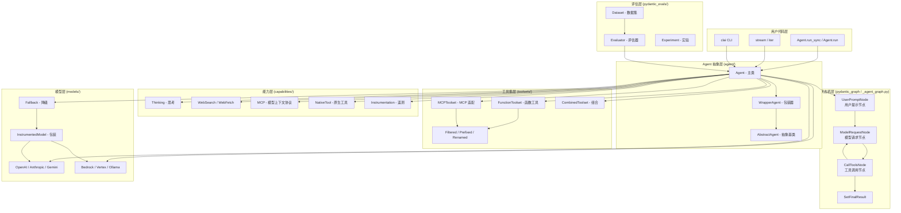
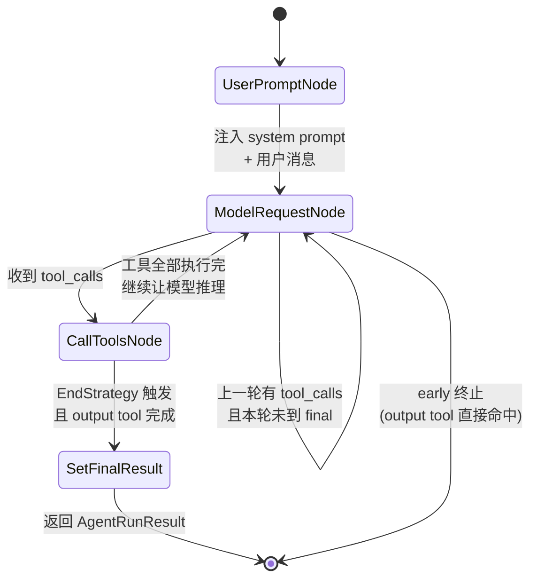

## 引子：从 "LLM wrapper" 到 "生产级框架"，我们缺什么？

在 2024–2025 年的 GenAI 浪潮里，几乎所有 Python Agent 框架都在做同一件事：**用一层薄薄的 API 把 OpenAI/Anthropic SDK 包装起来**。但当你真的把这类 Agent 推到生产环境时，痛苦会如潮水般涌来：

- **类型坍塌**：框架返回 `dict[str, Any]`，下游逻辑全是 `result["choices"][0]["message"]["tool_calls"][0]["function"]["arguments"]` 这种字符串解析噩梦
- **可观测性黑洞**：Agent 在跑，但跑到哪一步、为什么调用某个 Tool、Token 烧了多少，答案全在日志里
- **多 Agent 编排混乱**：sub-agent 状态怎么传？上下文怎么隔离？循环怎么检测？没有统一答案
- **Tool 系统脆弱**：函数签名变了、Schema 漂移了、Tool 返回类型不安全 —— 运行时才报错

Pydantic 团队的答案是：**把 FastAPI 那种"用 Python 类型系统 + 验证层 + 依赖注入构建生产级框架"的设计哲学，原封不动搬到 Agent 领域**。

这就是 [Pydantic AI](https://github.com/pydantic/pydantic-ai) —— 一个 star 数刚突破 **17.4k**、Pydantic 官方出品、v2.0.0 已经在 beta 阶段（截至 2026-06-02），对标 LangGraph/OpenAI Agents SDK 的 Python Agent 框架。

本文将从架构、机制、代码实战三个维度，深度拆解 Pydantic AI 到底"硬核"在哪里。

---

## 一、项目速览：Pydantic AI 在解决什么问题？

**Pydantic AI 定位**：用 Pydantic 类型系统作为底座，构建**生产级**、**类型安全**、**可观测**的 LLM Agent 应用。

官方 README 里有一句话很关键：

> "FastAPI revolutionized web development by offering an innovative and ergonomic design, built on the foundation of Pydantic Validation and modern Python features like type hints."

翻译过来：FastAPI 当年靠 `pydantic.BaseModel` + 类型提示重新定义了 Web 框架，**Pydantic AI 想用同样的方法重新定义 Agent 框架**。

### 1.1 核心数据

| 指标 | 数值 |
|------|------|
| ⭐ GitHub Stars | 17,476+（2026-06-02） |
| 最新 Release | v1.105.0（2026-06-02）+ v2.0.0b5（2026-06-02）|
| 许可证 | MIT |
| 主语言 | Python |
| 维护团队 | Pydantic 官方（Samuel Colvin 领衔）|
| 支持的模型 | OpenAI / Anthropic / Gemini / DeepSeek / Cohere / Mistral / Bedrock / Vertex / Ollama / OpenRouter / Groq ... **30+** provider |

### 1.2 核心卖点

1. **类型安全**：`output_type: BaseModel` 让 LLM 输出直接是合法 Pydantic 实例，下游业务代码拿到的不是 `dict` 而是 `MyModel`
2. **依赖注入**：`deps_type` 泛型 + `RunContext[MyDeps]` 让数据库连接、用户身份、API client 这些"运行时资源"显式注入
3. **状态机驱动**：`pydantic_graph` 子项目把 Agent 的执行流显式建模成节点 + 边的有向图
4. **可观测性原生**：`logfire.instrument_pydantic_ai()` 一行集成 OpenTelemetry
5. **Tool 系统分层**：Toolsets（工具集）→ Capabilities（能力，如 thinking / MCP / web search）→ Tools（具体函数）三层抽象
6. **MCP 原生支持**：`MCPServer` 抽象 + `fastmcp.py` 适配

---

## 二、整体架构：四层抽象 + 一个状态机

Pydantic AI 不是单一文件，而是一套**分层子系统**。下面是完整的架构图：



### 2.1 四个关键层

| 层 | 职责 | 关键类 |
|----|------|--------|
| **Agent 抽象层** | 暴露用户 API（`run`/`run_sync`/`iter`）、组合能力、初始化 Toolset | `Agent`, `WrapperAgent`, `AbstractAgent` |
| **状态机层** | 决定一次 run 走哪些节点、什么时候结束、什么时候调 Tool | `UserPromptNode`, `ModelRequestNode`, `CallToolsNode` |
| **能力层** | 跨切面关注点：thinking、web search、MCP 接入、遥测 | `Thinking`, `WebSearch`, `MCP`, `Instrumentation` |
| **工具集层** | 工具的注册、过滤、组合、MCP 适配、动态加载 | `FunctionToolset`, `MCPToolset`, `CombinedToolset` |
| **模型层** | 30+ provider 适配、模型降级、遥测包装 | `OpenAIModel`, `AnthropicModel`, `FallbackModel`, `InstrumentedModel` |

### 2.2 状态机的执行流

这是 Pydantic AI 最核心的设计 —— 一次 `agent.run(prompt)` 不是"调一次 LLM 就完事"，而是**显式地走过一个有向图**：



**关键设计**：Tool 分两类
- **Function tools**：用户注册的普通函数（如查数据库、调用 API）
- **Output tools**：特殊的"终结型" tool，比如 `output_type=MyModel` 时框架会动态构造一个 `final_result` 工具

`end_strategy` 控制"一旦有 final result 还要不要继续跑 function tool"：
- `early`（默认）：找到 final 就停，function tool 不再执行
- `graceful`：final 后允许 function tool 执行完，但不调新 output tool
- `exhaustive`：把所有 output tool 都跑一遍

---

## 三、核心机制：类型、依赖、工具集

### 3.1 类型驱动的输出：让 LLM 返回 Pydantic 实例

这是 Pydantic AI 最"招牌"的能力。**把 `output_type` 设成 Pydantic 模型，框架会自动**：
1. 把 `BaseModel` 转成 JSON Schema
2. 注入到模型的 system prompt / tool 定义
3. 校验 LLM 返回的 JSON
4. 自动重试（修复 Pydantic ValidationError）
5. 返回**已经验证过的 Pydantic 实例**

官方文档的最小例子（来自 `examples/pydantic_ai_examples/pydantic_model.py`）：

```python
import os
from pydantic import BaseModel
from pydantic_ai import Agent

class MyModel(BaseModel):
    city: str
    country: str

# 指定模型 + 输出类型
agent = Agent('openai:gpt-5.2', output_type=MyModel)

# 同步运行
result = agent.run_sync('The windy city in the US of A.')
print(result.output)  # MyModel(city='Chicago', country='United States')
print(result.usage)   # Usage(input_tokens=..., output_tokens=..., requests=1)
```

**对比其他框架的痛点**：

```python
# LangChain 的"传统"做法
from langchain_core.output_parsers import PydanticOutputParser
parser = PydanticOutputParser(pydantic_object=MyModel)
prompt = ChatPromptTemplate.from_template("Answer.\n{format_instructions}\n{query}")
chain = prompt | llm | parser
result: MyModel = chain.invoke({"query": "..."})  # 运行时才报错
```

Pydantic AI 的做法把"类型 + 验证 + 重试"内化到了 Agent 构造时，**业务代码完全不知道 JSON Schema 存在**。

### 3.2 依赖注入：让运行时资源显式传递

`deps_type` 泛型 + `RunContext[MyDeps]` 是 Pydantic AI 的第二个杀手锏。**业务依赖（数据库连接、用户身份、API client）通过 `deps=` 显式注入，工具函数签名里通过 `RunContext` 类型注解自动接收**。

实战例子（来自 `examples/pydantic_ai_examples/bank_support.py`）：

```python
import sqlite3
from dataclasses import dataclass
from pydantic import BaseModel
from pydantic_ai import Agent, RunContext


@dataclass
class DatabaseConn:
    sqlite_conn: sqlite3.Connection

    async def customer_balance(self, *, id: int) -> float:
        cur = self.sqlite_conn.cursor()
        res = cur.execute('SELECT balance FROM customers WHERE id=?', (id,))
        row = res.fetchone()
        if not row:
            raise ValueError('Customer not found')
        return row[0]


@dataclass
class SupportDependencies:
    customer_id: int
    db: DatabaseConn


class SupportOutput(BaseModel):
    support_advice: str
    block_card: bool
    risk: int


# 1. 声明依赖类型
support_agent = Agent(
    'openai:gpt-5.2',
    deps_type=SupportDependencies,
    output_type=SupportOutput,
    instructions='You are a support agent in our bank, give the customer support.',
)


# 2. 动态 system prompt：能拿到 deps
@support_agent.instructions
async def add_customer_name(ctx: RunContext[SupportDependencies]) -> str:
    name = await ctx.deps.db.customer_name(id=ctx.deps.customer_id)
    return f"The customer's name is {name!r}"


# 3. Tool：自动接收 RunContext
@support_agent.tool
async def customer_balance(ctx: RunContext[SupportDependencies]) -> str:
    """Returns the customer's current account balance."""
    balance = await ctx.deps.db.customer_balance(id=ctx.deps.customer_id)
    return f'${balance:.2f}'


# 4. 运行时注入
if __name__ == '__main__':
    with sqlite3.connect(':memory:') as con:
        cur = con.cursor()
        cur.execute('CREATE TABLE customers(id, name, balance)')
        cur.execute("INSERT INTO customers VALUES (123, 'John', 123.45)")
        con.commit()

        deps = SupportDependencies(customer_id=123, db=DatabaseConn(con))

        result = support_agent.run_sync('What is my balance?', deps=deps)
        print(result.output)
        # SupportOutput(support_advice='...', block_card=False, risk=1)
```

**设计亮点**：
- `@support_agent.instructions` 可以注册**多个函数**，每个函数拿 `RunContext`、返回字符串片段，框架会合并成完整 system prompt
- `@support_agent.tool` 函数签名里**只要有 `RunContext[...]` 注解的**第一个参数会自动注入
- `RunContext.deps` 强类型，IDE 跳转、类型检查、mypy 全部可用

### 3.3 Toolset 抽象：函数工具的组合宇宙

Pydantic AI 把 Tool 设计成了**可组合、可过滤、可重命名、可包装的"工具集"**。看 `toolsets/` 目录就能感受到这种设计哲学：

| Toolset | 作用 |
|---------|------|
| `FunctionToolset` | 把 Python 函数注册成 Tool（带 schema 推断） |
| `MCPToolset` | 通过 MCP 协议加载外部服务器的 tool |
| `CombinedToolset` | 多个 toolset 组合，union 起来 |
| `FilteredToolset` | 按名字过滤掉某些 tool |
| `PrefixedToolset` | 给所有 tool 名字加前缀（多 agent 防冲突） |
| `RenamedToolset` | 重命名 tool |
| `ApprovedRequired` | 需要用户/外部审批才能执行的 tool |
| `DeferredLoading` | 动态懒加载（tool 数量很大时） |
| `SetMetadata` | 给 tool 设置额外元数据（给前端展示用） |

**经典用法：多 agent 防名字冲突**：

```python
from pydantic_ai import Agent
from pydantic_ai.toolsets import PrefixedToolset

math_agent = Agent(...)
research_agent = Agent(...)

triage_agent = Agent(
    'openai:gpt-5.2',
    toolsets=[
        PrefixedToolset(math_agent.toolsets[0], prefix='math_'),
        PrefixedToolset(research_agent.toolsets[0], prefix='research_'),
    ],
)
```

LLM 看到的是 `math_calculate(...)` 和 `research_search_web(...)`，互不干扰。

### 3.4 能力（Capabilities）：跨切面关注点

如果说 Toolsets 是"工具"，那 Capabilities 就是"如何让 Agent 表现更好"的横切关注点。看 `capabilities/` 目录：

- `Thinking`：启用 Claude / Gemini 的 native thinking
- `WebSearch` / `WebFetch` / `XSearch`：内置 web 工具
- `MCP`：把 MCP 接入抽成 capability
- `NativeOrLocal`：优先用模型的 native tool，本地兜底
- `Instrumentation`：OpenTelemetry 埋点
- `Hooks`：生命周期钩子

**Capabilities 的精髓**：用**链式组合**的方式把横切关注点堆叠到 Agent 上，而不是塞到 Agent 类的字段里。

### 3.5 MCP 原生支持

Pydantic AI 对 MCP（Model Context Protocol）的支持非常自然：

```python
from pydantic_ai import Agent
from pydantic_ai.mcp import MCPServerStdio

# 启动一个 stdio MCP server
server = MCPServerStdio('npx', args=['-y', '@modelcontextprotocol/server-filesystem', '/data'])

agent = Agent(
    'openai:gpt-5.2',
    toolsets=[server],  # MCP server 直接当 toolset 用
)

async def main():
    async with agent:
        result = await agent.run('List all .py files in /data')
        print(result.output)
```

`fastmcp.py` 还提供了对 [FastMCP](https://github.com/jlowin/fastmcp) 库的兼容，让"自己部署 MCP server"和"接入 MCP server"用同一套 API。

---

## 四、代码实战：构建一个多 Agent 医疗分诊系统

Pydantic AI 官方的 `medical_agent_delegation.py` 展示了一种优雅的"主 agent + 多个 specialist agent"模式。下面是一个**精简 + 完整可运行**的版本。

```python
"""多 Agent 医疗分诊：主 agent 通过 Tool 把患者转给专科 agent。
注意：此示例仅展示架构，不用于真实医疗决策。
需要 OPENAI_API_KEY 环境变量。
"""
import asyncio
from dataclasses import dataclass
from textwrap import dedent
from enum import Enum
from pydantic import BaseModel, Field
from pydantic_ai import Agent, RunContext

MODEL = 'openai:gpt-5.2'


class Specialty(str, Enum):
    general = 'general'
    cardiology = 'cardiology'
    neurology = 'neurology'


class MedicalReport(BaseModel):
    diagnosis: list[str]
    recommended_tests: list[str]
    immediate_actions: list[str]


class TreatmentPlan(BaseModel):
    plan_summary: str
    refer_to_specialist: Specialty | None = None
    follow_up_days: int


class TriageFinalOutput(BaseModel):
    specialty: Specialty | None = None
    final_report: MedicalReport | None = None
    treatment_plan: TreatmentPlan | None = None
    final_status: str  # 'resolved_by_specialist' 或 'escalated'


@dataclass
class PatientInfo:
    patient_id: str
    age: int
    known_conditions: list[str]


# 三个专科 agent（共享 deps 类型）
gp_agent = Agent(MODEL, output_type=MedicalReport, deps_type=PatientInfo,
                 instructions='You are a general practitioner.')
cardiology_agent = Agent(MODEL, output_type=MedicalReport, deps_type=PatientInfo,
                          instructions='You are a cardiology specialist.')
neurology_agent = Agent(MODEL, output_type=MedicalReport, deps_type=PatientInfo,
                        instructions='You are a neurology specialist.')
senior_doctor_agent = Agent(MODEL, output_type=TreatmentPlan, deps_type=PatientInfo,
                            instructions='You are a senior clinician overseeing complex cases.')

SPECIALIST_MAP = {
    'general': gp_agent,
    'cardiology': cardiology_agent,
    'neurology': neurology_agent,
}


# 主 agent：通过 tool 把患者分诊到不同专科
triage_agent = Agent(
    MODEL,
    output_type=TriageFinalOutput,
    deps_type=PatientInfo,
    instructions=dedent("""
        You are a triage clinician. You can call tools to consult specialists or a senior doctor.
        ESCALATION RULES — call consult_senior_doctor immediately for:
        - "Worst headache of my life"
        - Sudden weakness or paralysis
        - Loss of consciousness
        - Multi-system symptoms
    """),
)


@triage_agent.tool
async def consult_specialist(
    ctx: RunContext[PatientInfo],
    specialty: Specialty,
    question: str,
) -> TriageFinalOutput:
    """Consult a specialist agent for diagnosis."""
    result = await SPECIALIST_MAP[specialty].run(
        question, deps=ctx.deps, message_history=ctx.message_history,
    )
    return TriageFinalOutput(
        specialty=specialty,
        final_report=result.output,
        final_status='resolved_by_specialist',
    )


@triage_agent.tool
async def consult_senior_doctor(
    ctx: RunContext[PatientInfo],
    question: str,
) -> TriageFinalOutput:
    """Escalate to the senior doctor for critical decision-making."""
    result = await senior_doctor_agent.run(
        question, deps=ctx.deps, message_history=ctx.message_history,
    )
    return TriageFinalOutput(
        treatment_plan=result.output,
        final_status='escalated',
    )


async def main():
    patient = PatientInfo(patient_id='P-001', age=58, known_conditions=['hypertension'])
    result = await triage_agent.run(
        'I have sudden chest pain radiating to my left arm',
        deps=patient,
    )
    print(result.output)


if __name__ == '__main__':
    asyncio.run(main())
```

**运行结果预期**（取决于 LLM）：

```
TriageFinalOutput(
  specialty=<Specialty.cardiology: 'cardiology'>,
  final_report=MedicalReport(
    diagnosis=['Possible acute coronary syndrome'],
    recommended_tests=['ECG', 'Troponin', 'Chest X-ray'],
    immediate_actions=['Call emergency services', 'Aspirin 300mg']
  ),
  treatment_plan=None,
  final_status='resolved_by_specialist'
)
```

**这段代码展示的关键能力**：
1. **Agent-as-Tool**：把子 agent 包成主 agent 的 tool，LLM 自己决定何时调用
2. **共享 message_history**：通过 `ctx.message_history` 把对话上下文传给 sub-agent（避免重复 prompt）
3. **类型全链路追踪**：从 `PatientInfo` → `MedicalReport` → `TriageFinalOutput`，每一跳都是 Pydantic 模型

---

## 五、可观测性：Logfire 一行集成

Pydantic AI 的"原生"可观测性通过 [Pydantic Logfire](https://pydantic.dev/logfire) 实现。**只一行就能获得 OpenTelemetry 兼容的完整 trace**：

```python
import logfire
logfire.configure(send_to_logfire='if-token-present')  # 没配 token 也不报错
logfire.instrument_pydantic_ai()                         # 这一行就够了
```

集成后，Logfire UI 会自动捕获：
- 每次 LLM 调用的 prompt、completion、token 消耗
- Tool 调用的入参、返回值、耗时
- 多 Agent 之间的对话历史
- 重试次数、错误信息

**对比**：
- LangGraph：需要自己接 LangSmith
- OpenAI Agents SDK：需要自己接 OpenAI Traces
- CrewAI：需要自己接 CrewAI + 自定义 logger
- Pydantic AI：**默认 OTel 兼容**，任何 OTel 后端（Jaeger / Tempo / Datadog）都能接

---

## 六、与同类项目的对比

Pydantic AI 处在"Python Agent 框架"的红海市场，下面对比三个最直接的竞品。

### 6.1 vs LangGraph（LangChain 团队）

| 维度 | Pydantic AI | LangGraph |
|------|-------------|-----------|
| 状态机抽象 | 内建 `_agent_graph`（节点少、固定） | 完全自定义 Graph + State |
| 类型系统 | 全 Pydantic 驱动 | TypedDict + dataclass |
| Tool 注册 | 函数装饰器 + 自动 schema 推断 | `@tool` 装饰器 + 手动 schema |
| 多 Agent | Agent-as-Tool + 共享 message_history | Graph 节点 + Command |
| 学习曲线 | 低（FastAPI 风格） | 中（要理解图论概念） |
| 可观测性 | OTel 原生 | LangSmith 闭源 |
| 灵活度 | 中（框架驱动流程） | 极高（流程完全用户控制） |

**核心差异**：LangGraph 给你"画图"的能力（PaaS 思维），Pydantic AI 给你"用类型写应用"的能力（Framework 思维）。如果你要 100% 控制流程，选 LangGraph；如果你想"3 行代码跑起来 + 类型安全 + 生产可用"，选 Pydantic AI。

### 6.2 vs OpenAI Agents SDK

| 维度 | Pydantic AI | OpenAI Agents SDK |
|------|-------------|-------------------|
| 模型支持 | 30+ provider | 仅 OpenAI + 几个兼容 endpoint |
| 类型系统 | 全 Pydantic | Pydantic 部分支持 |
| MCP | 内建 | 内建（事实上是 OpenAI 推动的） |
| Handoffs（多 agent） | Agent-as-Tool | 专门的 Handoff 机制 |
| Tracing | OTel 兼容 | OpenAI Traces（闭源） |
| 包大小 | 较大（功能多） | 轻量 |

**核心差异**：OpenAI Agents SDK 是"OpenAI 一站式"方案，绑定深、API 简洁。Pydantic AI 是"模型无关 + 类型严格"的方案。换 provider 的成本 Pydantic AI 接近零（改个字符串即可），OpenAI Agents SDK 要重写。

### 6.3 vs CrewAI

| 维度 | Pydantic AI | CrewAI |
|------|-------------|--------|
| 抽象层次 | Agent + Tools + Capabilities | Agent + Crew + Task + Process |
| 多 Agent 范式 | 主 agent 调 tool | Crew（团队）概念，Process 驱动 |
| 配置风格 | 代码 + 类型 | 大量 YAML / 配置文件 |
| 适合场景 | 业务应用、复杂工具链 | 多 agent 协作 / 角色扮演场景 |
| 类型安全 | 强 | 弱（dict 满天飞） |

**核心差异**：CrewAI 的哲学是"给业务人员用"（YAML 配置、低代码），Pydantic AI 是"给工程师用"（代码 + 类型）。CrewAI 的 Crew 抽象对"角色 + 任务"友好，Pydantic AI 对"复杂工具链 + 类型验证"友好。

---

## 七、优缺点分析

按 skill 要求的对比维度来：

### 7.1 左：架构简洁性 / 扩展性 / 易用性

| 维度 | 评分 | 说明 |
|------|------|------|
| 架构简洁性 | ⭐⭐⭐⭐⭐ | 4 个 Node 类型 + 3 层抽象就涵盖了 80% 场景，认知负担极低 |
| 扩展性 | ⭐⭐⭐⭐ | 30+ 模型、丰富 toolsets/capabilities 组合，MCP / Handoffs 都标准化 |
| 易用性 | ⭐⭐⭐⭐⭐ | FastAPI 风格的 API 设计师上手成本极低，IDE 自动补全到爆 |

### 7.2 右：性能 / 复杂度 / 维护性

| 维度 | 评分 | 说明 |
|------|------|------|
| 性能 | ⭐⭐⭐⭐ | 没有额外序列化开销，Pydantic v2 已经是 Python 生态最快的 validator |
| 复杂度 | ⭐⭐⭐ | 内部实现复杂（107k 行的 `_agent_graph.py`），用户感知不到，但贡献门槛高 |
| 维护性 | ⭐⭐⭐⭐ | 官方团队 + 严格测试 + 完整文档，v2.0 已经在 beta 路线图清晰 |

### 7.3 主要缺点

1. **包大小较大**：`pydantic-ai` 全量安装拉一堆 provider SDK，slim 版本需要手动选
2. **抽象层多**：对只想"调一次 LLM"的人偏重，入门要看懂 `RunContext` / `Deps` / `Toolset` 三件套
3. **Graph 灵活性不及 LangGraph**：想完全自定义流程图，Pydantic AI 不如 LangGraph 自由
4. **v2.0 还在 beta**：API 可能小幅变动，生产用建议 pin 1.105.x

---

## 八、使用建议

### 8.1 适合用 Pydantic AI 的场景

✅ **生产级业务应用**（客服、数据抽取、报表生成）—— 类型安全是刚需
✅ **复杂工具链**（需要 MCP、Toolset 组合、动态 tool 加载）
✅ **多 agent + 工具**（Agent-as-Tool 模式 + 共享 message_history）
✅ **可观测性需求强**（金融、医疗、合规场景）

### 8.2 不适合的场景

❌ **纯 prompt 工程 / 单次 LLM 调用** —— 太重了，直接用 provider SDK
❌ **极复杂自定义流程图** —— LangGraph 更合适
❌ **需要运行在极小体积环境**（如 Lambda 256MB） —— slim 都偏大

### 8.3 入门路径

```bash
# 1. 安装
pip install pydantic-ai

# 2. 最小例子（10 行）
python -c "
import os
from pydantic_ai import Agent
print(Agent('openai:gpt-5.2').run_sync('Say hi').output)
"

# 3. 接 Logfire 观测
pip install logfire
logfire auth
logfire.instrument_pydantic_ai()
```

---

## 九、趋势判断

Pydantic AI 的崛起透露了一个清晰信号：**"框架必须自带类型安全 + 可观测性"** 正在成为 LLM 应用开发的新基线。从以下几个迹象看：

1. **v2.0 在做"Capability 体系重构"**：把现在散落在 Agent 字段上的横切关注点（thinking、MCP、web search、instrumentation）抽成可组合的 capability 链。这说明框架作者意识到"Agent 类的属性会爆炸"
2. **`pydantic_graph` 独立**：从 v1.x 后期开始 `pydantic_graph` 被独立成顶层包，暗示未来要支持"图 + 多 agent + 工具"的更复杂编排
3. **MCP 深度集成**：Pydantic 团队在 MCP 标准化上是积极推动者（FastMCP 库就是同社区的）
4. **OpenAI 跟进**：OpenAI Agents SDK 也开始用 Pydantic（说明类型方案选对了）

**预测**：未来 6–12 个月，"框架"和"框架"之间拼的不再是"能调多少 LLM"，而是：
- 类型系统是否原生
- 可观测性是否 OTel 兼容
- MCP 接入是否丝滑
- 多 Agent 模式是否标准化

Pydantic AI 在前三点都已经领先。

---

## 十、结语

Pydantic AI 不是一个"新框架"，它是 Pydantic 团队把 **FastAPI 当年成功的工程哲学** 注入到 Agent 领域的产物：**类型系统 + 验证层 + 依赖注入 + 可观测性 = 生产级框架**。

如果你在 2026 年开始一个新的 LLM Agent 项目，并且团队里有任何对"代码质量"有要求的人，Pydantic AI 几乎应该是**默认选项** —— 至少在 30+ provider 支持、类型安全、原生 OTel 这三点上，目前没有看到能打的对手。

**项目地址**：[https://github.com/pydantic/pydantic-ai](https://github.com/pydantic/pydantic-ai)
**官方文档**：[https://ai.pydantic.dev/](https://ai.pydantic.dev/)
**v2.0 路线图**：跟踪 [v2.0 milestone](https://github.com/pydantic/pydantic-ai/milestone/2)

---

> 本文所有代码均来自 Pydantic AI 官方 examples（MIT License），并经过简化整理。可在 [pydantic/pydantic-ai/examples](https://github.com/pydantic/pydantic-ai/tree/main/examples/pydantic_ai_examples) 查看完整版本。
