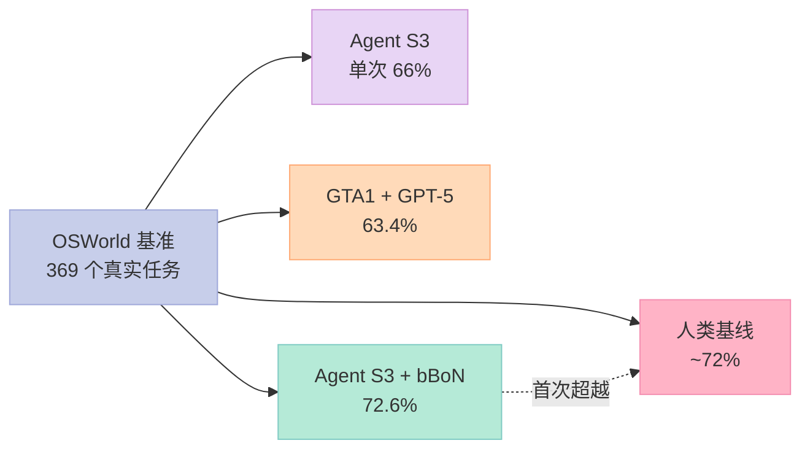
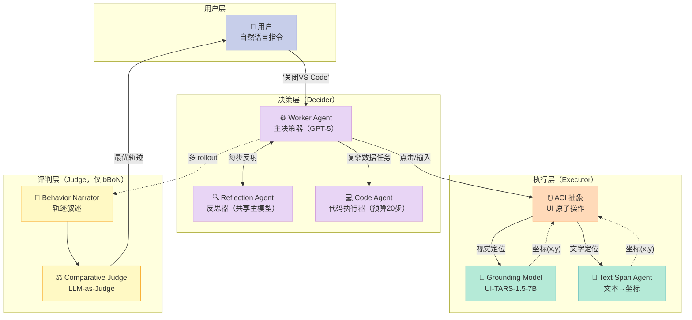
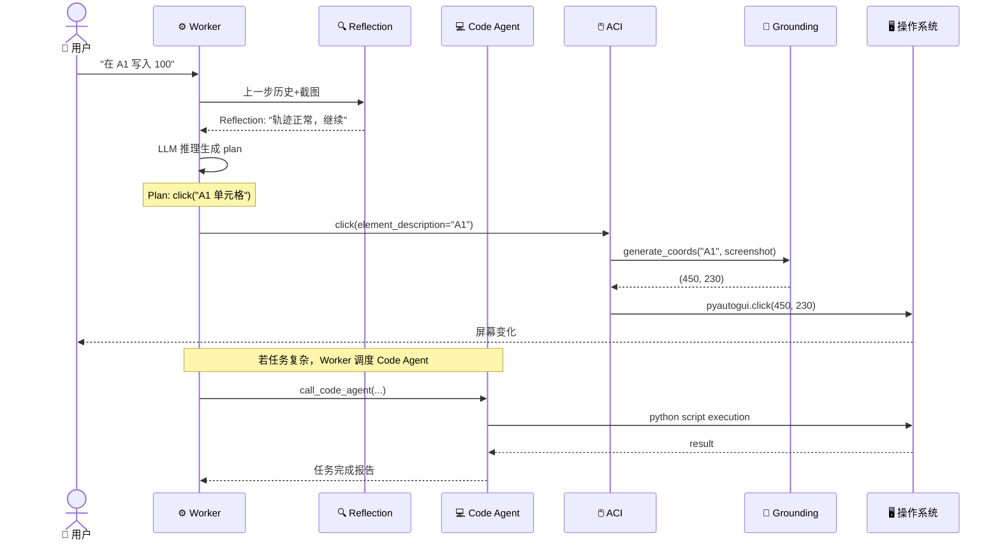
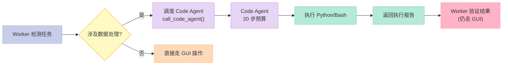
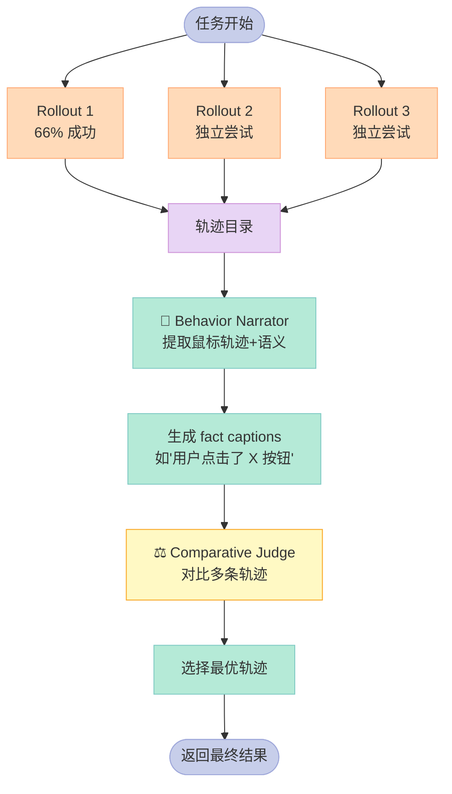

> 当 AI 开始"像人一样"用鼠标键盘操作你的电脑，它究竟是怎么思考的？Agent S3 给出了一个惊艳的答案：72.6% 的 OSWorld 得分，首次超越人类基线。

---

## 前言：GUI Agent 终于"看得见"也"动得准"

过去两年，AI Agent 的战场从文本对话蔓延到了浏览器（browser-use）、操作系统、办公软件。但**真正能让 LLM 像人类一样用鼠标点击、键盘输入的"Computer-Use Agent"（CUA）** 一直是块难啃的骨头：模型看不懂屏幕坐标、操作失败率高、长任务容易陷入循环。

2025 年 12 月，Simular AI 团队的 **Agent S3** 在 [OSWorld](https://os-world.github.io) 基准上拿到 **72.6%** 的成绩——**首次超越人类基线（约 72%）**。比 GPT-5 加持的 GTA1（63.4%）高出近 10 个百分点。

这篇博客会从架构、机制、原理三个层面拆解 Agent S3：

- 它如何把"看屏幕"和"做动作"拆成两个模型？
- Worker + Reflection 双 Agent 如何避免死循环？
- **Behavior Best-of-N**（bBoN）是怎么用 LLM-as-Judge 把单次成功率从 66% 拉到 72.6% 的？
- 和 OpenAI CUA、Anthropic Computer Use、UI-TARS 比起来设计上有何不同？

读完你不仅能理解 Agent S3 的设计精髓，更能把握**当前 Computer-Use Agent 领域的核心方法论**。

---

## 一、Agent S3 是什么？

### 1.1 定位与价值

Agent S 是 Simular AI 团队开源的**通用 GUI Agent 框架**，目标是让 LLM 像人一样**通过观察屏幕截图**、**操作鼠标键盘**来完成任意计算机任务。最新版本 Agent S3 配套论文 *The Unreasonable Effectiveness of Scaling Agents for Computer Use*（arXiv: 2510.02250）发表于 2025 年 10 月。

它的**核心价值**是解决 GUI Agent 的三个老大难问题：

| 痛点 | 传统方案 | Agent S3 的解法 |
|------|----------|------------------|
| **长任务循环** | LLM 单步决策 | Worker + Reflection 双 Agent 协同 |
| **数据处理效率低** | 全靠 GUI 点点点 | 集成 Code Agent，可执行 Python/Bash |
| **单次成功率低** | 单一 rollout | Behavior Best-of-N（bBoN）多轨迹对比 |

### 1.2 OSWorld 基准表现

OSWorld 是当前最具挑战性的 Computer-Use 基准测试，包含 369 个真实任务（文件管理、浏览器操作、办公软件配置等）。



更值得注意的是**跨平台泛化能力**：

| 基准 | 域 | Agent S3 单次 | + bBoN（选 3 轨迹） | 提升 |
|------|----|--------------|--------------------|------|
| OSWorld | Linux 桌面 | 66.0% | **72.6%** | +6.6% |
| WindowsAgentArena | Windows | 50.2% | 56.6% | +6.4% |
| AndroidWorld | Android | 68.1% | 71.6% | +3.5% |

**零样本迁移**意味着 OSWorld 上训练的策略在 Windows、Android 上同样有效——这才是 GUI Agent 走向通用的关键。

---

## 二、核心架构解析

### 2.1 整体架构

Agent S3 采用了**经典的"分层协同"架构**，但比 LangChain、AutoGen 简洁得多。整体分为三层：



### 2.2 核心模块职责

| 模块 | 文件 | 职责 |
|------|------|------|
| **AgentS3** | `agents/agent_s.py` | 顶层入口，封装 Worker + 反思 |
| **Worker** | `agents/worker.py` | 主决策器，输出 pyautogui 代码 |
| **Reflection Agent** | `memory/procedural_memory.py` | 每步评判轨迹是否偏离 |
| **OSWorldACI** | `agents/grounding.py` | UI 原子操作封装（click/type/drag） |
| **Grounding Model** | `core/mllm.py` | 视觉/文本→坐标，独立 7B 模型 |
| **Code Agent** | `agents/code_agent.py` | 复杂数据任务的 Python/Bash 执行 |
| **BehaviorNarrator** | `bbon/behavior_narrator.py` | 把鼠标轨迹"翻译"成自然语言 |
| **ComparativeJudge** | `bbon/comparative_judge.py` | 多 rollout 时的 LLM-as-Judge |

### 2.3 一次完整的"决策—执行"数据流



---

## 三、关键机制深挖

### 3.1 Worker + Reflection：避免"动作循环"

GUI Agent 最常见的问题是**陷入重复动作循环**——比如点错按钮后，模型反复点击同一个位置。Agent S3 的解法是**每步调用 Reflection Agent** 独立评判。

实现位于 `gui_agents/s3/agents/worker.py`：

```python
def _generate_reflection(self, instruction: str, obs: Dict) -> Tuple[str, str]:
    """每步生成一个 Reflection：判断当前轨迹是否走偏"""
    reflection = None
    if self.enable_reflection:
        if self.turn_count == 0:
            # 初始步：只看到初始截图
            self.reflection_agent.add_message(
                text_content="The initial screen is provided...",
                image_content=obs["screenshot"],
                role="user",
            )
        else:
            # 后续步：把 Worker 上一步的 plan 喂给 Reflection
            self.reflection_agent.add_message(
                text_content=self.worker_history[-1],
                image_content=obs["screenshot"],
                role="user",
            )
            full_reflection = call_llm_safe(self.reflection_agent, ...)
            reflection, reflection_thoughts = split_thinking_response(full_reflection)
            self.reflections.append(reflection)
    return reflection, reflection_thoughts
```

**Reflection Agent 的 System Prompt**（`procedural_memory.py`）有三种固定输出：

```text
Case 1. 轨迹偏离计划（动作循环 / 错误操作）→ 提醒修改策略
Case 2. 轨迹正常                          → 简短肯定继续
Case 3. 任务已完成                        → 通知 Worker 结束
```

**精妙之处**：Reflection Agent 与 Worker 共享同一个主 LLM（如 GPT-5），但**系统 prompt 完全独立**——这避免了"自我感觉良好"的偏差。

### 3.2 坐标生成：双模型分工

Agent S3 显式分离了**主决策 LLM**（GPT-5 等）和**Grounding Model**（UI-TARS-1.5-7B）。原因是：

> 让 GPT-5 这样的通用大模型直接输出屏幕坐标，既贵又不准。专用 7B 模型做"看图定点"性价比高 10 倍。

**Grounding 流程**在 `grounding.py`：

```python
def generate_coords(self, ref_expr: str, obs: Dict) -> List[int]:
    """让 UI-TARS 把 'A1 单元格' 这种描述转成 (x, y)"""
    # 重置 grounding model 上下文
    self.grounding_model.reset()
    
    # 关键 prompt：只输出坐标
    prompt = f"Query:{ref_expr}\nOutput only the coordinate of one point in your response.\n"
    self.grounding_model.add_message(
        text_content=prompt, 
        image_content=obs["screenshot"],
        put_text_last=True  # UI-TARS 特殊要求：文本在图片后
    )
    
    # 调用专用 7B 模型
    response = call_llm_safe(self.grounding_model)
    numericals = re.findall(r"\d+", response)
    return [int(numericals[0]), int(numericals[1])]
```

同时**文本定位**走另一条路（OCR + LLM 选词）：

```python
def generate_text_coords(self, phrase: str, obs: Dict) -> List[int]:
    """通过 OCR 提取屏幕所有文字，让 LLM 选词"""
    # 1. pytesseract 提取所有文字 + 位置
    ocr_table, ocr_elements = self.get_ocr_elements(obs["screenshot"])
    
    # 2. LLM 选出与 phrase 最匹配的 word id
    self.text_span_agent.add_message(
        alignment_prompt + "Phrase: " + phrase + "\n" + ocr_table
    )
    
    # 3. 取该 word 的中心坐标
    return [elem["left"] + elem["width"]//2, elem["top"] + elem["height"]//2]
```

这种"**视觉坐标 + 文本坐标**"双轨设计，让 click/type 操作的鲁棒性大幅提升。

### 3.3 Code Agent：用代码代替 GUI 点点点

GUI 操作在数据处理场景下极其低效。比如"求 A1:A10 的和"，用 GUI 输公式要 5 步，用 Python 1 行搞定。Agent S3 集成了**独立的 Code Agent**：



**关键工程细节**（来自 procedural memory 中的 CODE_AGENT_PROMPT）：

- **每步独立**：Code Agent 每步都是独立代码片段，**不会跨步保留变量**
- **预算控制**：默认 20 步，超出返回 BUDGET_EXHAUSTED
- **完成判定**：返回 DONE/FAIL/BUDGET_EXHAUSTED 三种状态
- **GUI 验证**：Code Agent 完成后，Worker **必须**走 GUI 重新验证（不能信任代码结果）

### 3.4 Behavior Best-of-N（bBoN）：把单次成功率拉到极致

这是 Agent S3 的**最大创新点**。当单次 rollout 失败时，**与其训练更好的模型，不如跑多次然后挑最好的**。

#### 核心思想



#### Behavior Narrator 的实现

**难点**：原始轨迹是 `(x, y)` 坐标序列，对 LLM 来说几乎不可读。Behavior Narrator 用图像标注把鼠标轨迹**可视化**：

```python
@staticmethod
def mark_action(mouse_actions: list[str], img: Image):
    """在原始截图上绘制鼠标轨迹"""
    draw = ImageDraw.Draw(img)
    
    for mouse_action in mouse_actions:
        width, height = parse_xy(mouse_action)
        if mouse_action.startswith("pyautogui.click"):
            # 红点 + "Click" 文字
            draw.circle((width, height), radius=3, fill=(255, 0, 0))
            place_text("Click", (255, 0, 0), width, height)
        elif mouse_action.startswith("pyautogui.dragTo"):
            # 绿线 + 起终点
            draw.line([start, end], fill=(0, 255, 0), width=2)
```

然后调用 MLLM 生成**事实性描述**（fact captions）：

```text
"The red circle labeled 'Click' marks the position where the mouse was clicked."
"The blue circle labeled 'MoveTo' marks the position where the mouse was moved to."
```

这些 caption + 初始截图 + 最终截图，喂给 Comparative Judge 进行**多模态对比**。

#### 为什么 bBoN 能从 66% 拉到 72.6%？

| 机制 | 提升原因 |
|------|----------|
| **多 rollout 投票** | 单次失败的 hard 任务，二次/三次尝试可能成功 |
| **轨迹叙述降低 judge 难度** | 直接看坐标序列 LLM 选不准；转成自然语言后挑选准确率提升 |
| **避免重复错误** | 失败的 rollout 会被筛掉，不污染最终结果 |

**计算开销**：3 次 rollout 成本约 3×，但成功率提升 6.6%，对生产环境来说 ROI 极高。

### 3.5 上下文管理：长任务的内存优化

长任务时 Worker 的消息历史会爆炸（每步包含截图 + 文本）。Agent S3 实现了一套**智能 flush 策略**（`worker.py` 中的 `flush_messages`）：

```python
def flush_messages(self):
    """根据模型上下文能力，动态丢弃老截图"""
    engine_type = self.engine_params.get("engine_type", "")
    
    if engine_type in ["anthropic", "openai", "gemini"]:
        # 长上下文模型：保留所有文本，只丢老图片
        max_images = self.max_trajectory_length  # 默认 8 张
        for agent in [self.generator_agent, self.reflection_agent]:
            img_count = 0
            for i in range(len(agent.messages) - 1, -1, -1):
                for j in range(len(agent.messages[i]["content"])):
                    if "image" in agent.messages[i]["content"][j].get("type", ""):
                        img_count += 1
                        if img_count > max_images:
                            del agent.messages[i]["content"][j]  # 直接删
    else:
        # 非长上下文模型：成对丢弃 turn
        if len(self.generator_agent.messages) > 2 * self.max_trajectory_length + 1:
            self.generator_agent.messages.pop(1)
            self.generator_agent.messages.pop(1)
```

**核心原则**：图片是最大的 token 消耗（一张截图约 1000-2000 tokens），**优先保文本、丢图片**。

---

## 四、优缺点分析

### 4.1 架构简洁性 / 扩展性 / 易用性

| 维度 | 评价 | 说明 |
|------|------|------|
| **架构简洁性** | ✅ 优 | 三个 Agent（Worker/Reflection/Code）+ 一个 Judge，结构清晰 |
| **扩展性** | ✅ 优 | 通过 `@agent_action` 装饰器可快速添加新 UI 操作 |
| **易用性** | ⚠️ 中 | 需配置主模型 + Grounding 模型 + OCR，门槛较高 |
| **跨平台支持** | ✅ 优 | Linux/macOS/Windows/Android 均支持 |
| **API 兼容性** | ✅ 优 | 同一 engine 接口支持 OpenAI/Anthropic/Gemini/vLLM/HF |

### 4.2 性能 / 复杂度 / 维护性

| 维度 | 评价 | 说明 |
|------|------|------|
| **任务成功率** | ✅ 优 | OSWorld 72.6% 超越人类 |
| **推理延迟** | ⚠️ 差 | 每步需 Worker + Reflection 两次 LLM 调用 |
| **Token 消耗** | ⚠️ 差 | 每步含完整 screenshot，开销大 |
| **实现复杂度** | ⚠️ 中 | procedural_memory 中 26000+ 字符的 prompt 调优成本高 |
| **安全风险** | ❌ 差 | `--enable_local_env` 可执行任意 Python/Bash，需沙箱 |

### 4.3 与同类项目对比

| 维度 | Agent S3 | OpenAI CUA | Anthropic Computer Use | UI-TARS |
|------|----------|------------|------------------------|---------|
| **定位** | 通用 GUI Agent | 商业 Operator | Claude 内置功能 | 纯 Grounding 模型 |
| **OSWorld 得分** | **72.6%** | 38.1%（早期）| ~35% | 42.5%（仅 grounding）|
| **开源** | ✅ Apache 2.0 | ❌ 闭源 | ❌ 闭源 | ✅ 开源 |
| **Grounding 模型** | UI-TARS 7B（外接）| 内置 o1/o3 | 内置 Claude | 自身 |
| **多 Agent 协同** | Worker + Reflection | 单一链 | 单一链 | 无 |
| **轨迹选择** | bBoN + LLM Judge | 无 | 无 | 无 |
| **代码执行** | 集成 Code Agent | 无 | 无 | 无 |
| **可本地部署** | ✅ | ❌ | ❌ | ✅ |

**关键设计差异**：

1. **OpenAI CUA/Anthropic Computer Use** 是端到端单模型，Agent S3 是**多模型协同**（主决策 + 专用 Grounding）
2. **UI-TARS** 只能输出坐标，Agent S3 在它之上构建了完整 Agent 框架
3. **bBoN + LLM Judge** 是 Agent S3 独有的**测试时计算扩展**机制

---

## 五、快速上手：跑通一个最小示例

### 5.1 安装

```bash
# 安装核心库
pip install gui-agents

# Tesseract OCR（macOS）
brew install tesseract

# 或 Ubuntu
sudo apt-get install tesseract-ocr
```

### 5.2 启动 UI-TARS Grounding 服务

```bash
# 用 HuggingFace TGI 部署 UI-TARS-1.5-7B
# 详见：https://huggingface.co/ByteDance-Seed/UI-TARS-1.5-7B
```

### 5.3 Python SDK 完整示例

```python
import pyautogui
import io
from gui_agents.s3.agents.agent_s import AgentS3
from gui_agents.s3.agents.grounding import OSWorldACI
from gui_agents.s3.utils.local_env import LocalEnv  # 可选：本地代码环境
from dotenv import load_dotenv

load_dotenv()

# 1. 主决策模型配置（GPT-5）
engine_params = {
    "engine_type": "openai",
    "model": "gpt-5-2025-08-07",
    "temperature": 0.0,
}

# 2. Grounding 模型配置（UI-TARS-1.5-7B）
engine_params_for_grounding = {
    "engine_type": "huggingface",
    "model": "ui-tars-1.5-7b",
    "base_url": "http://localhost:8080",
    "grounding_width": 1920,
    "grounding_height": 1080,
}

# 3. 初始化 grounding agent
grounding_agent = OSWorldACI(
    env=None,  # 设为 LocalEnv() 启用代码执行
    platform="linux",
    engine_params_for_generation=engine_params,
    engine_params_for_grounding=engine_params_for_grounding,
    width=1920,
    height=1080,
)

# 4. 初始化 Agent S3
agent = AgentS3(
    engine_params,
    grounding_agent,
    platform="linux",
    max_trajectory_length=8,   # 最多保留 8 张历史截图
    enable_reflection=True,    # 启用 Reflection Agent
)

# 5. 执行任务
screenshot = pyautogui.screenshot()
buffered = io.BytesIO()
screenshot.save(buffered, format="PNG")
obs = {"screenshot": buffered.getvalue()}

instruction = "Close VS Code"
info, action = agent.predict(instruction=instruction, observation=obs)

# 6. 执行生成的 pyautogui 代码
exec(action[0])
```

### 5.4 CLI 方式（最简）

```bash
agent_s \
    --provider openai \
    --model gpt-5-2025-08-07 \
    --ground_provider huggingface \
    --ground_url http://localhost:8080 \
    --ground_model ui-tars-1.5-7b \
    --grounding_width 1920 \
    --grounding_height 1080
```

---

## 六、趋势展望

### 6.1 短期（2026）

- **测试时计算扩展**成为主流：bBoN 类方法会从 Agent S3 扩散到更多框架
- **Grounding 模型小型化**：7B 模型做视觉定位已足够，主决策可换用更便宜的模型
- **多模态 RLHF**：用人类对 rollout 的偏好直接训练 Worker

### 6.2 中期（2027-2028）

- **跨平台统一基座**：Linux/Windows/macOS/Android 共享同一套 Grounding
- **垂直领域 Agent**：办公、设计、开发各一套专用 System Prompt
- **GUI Agent + RAG 融合**：让 Agent 能"看文档"再操作

### 6.3 长期愿景

- **AGI 的"手"**：GUI Agent 是 LLM 与物理世界交互的关键拼图
- **数字员工**：每个知识工作者都可能拥有定制化的 Agent S 实例
- **自主进化**：Agent 自己发现并使用新的 API 完成任务

---

## 七、总结

Agent S3 给 GUI Agent 领域带来的核心启示：

| 启示 | 具体做法 |
|------|----------|
| **分层协同胜过单一大模型** | Worker + Reflection + Grounding 三模型分工 |
| **测试时计算扩展是免费的午餐** | bBoN + LLM Judge 3 次 rollout 提升 6.6% |
| **专用模型做专用事** | UI-TARS 7B 做坐标，GPT-5 做决策 |
| **Code Agent 是 GUI 的捷径** | 数据处理类任务用 Python 替代 GUI 点点点 |
| **轨迹叙述降低判断难度** | 坐标→自然语言让 LLM Judge 更准 |

**如果你是 Agent 开发者**：

- 学习 Agent S3 的**多模型协同**思想，不要试图用一个模型解决所有事
- 一定要实现**Reflection 机制**，哪怕是最简单的"每步让 LLM 复述一下当前状态"
- 关注**Grounding 模型选型**——7B 的 UI-TARS 性价比远超 GPT-4V 自身做定位

**如果你是产品经理**：

- Agent S3 的 72.6% 是 OSWorld 单次**选最优轨迹**后的结果
- 真实场景**首次成功率**约 66%，需要设计**重试和兜底**机制
- 任何涉及"执行代码"的 Agent 都必须运行在**沙箱环境**

> Agent S 论文标题是 *The Unreasonable Effectiveness of Scaling Agents for Computer Use*。它告诉我们：在 LLM 能力接近饱和的今天，**扩展 Agent 本身**（多 rollout、多 Agent 协同）比单纯堆参数更有效。这或许是我们走向 AGI 的关键方法论。

---

## 参考资料

- 📄 Agent S3 论文：<https://arxiv.org/abs/2510.02250>
- 💻 GitHub 仓库：<https://github.com/simular-ai/Agent-S>
- 📊 OSWorld 基准：<https://os-world.github.io>
- 🤖 UI-TARS 模型：<https://huggingface.co/ByteDance-Seed/UI-TARS-1.5-7B>
- 📰 Simular 团队博客：<https://www.simular.ai/articles/agent-s3>
