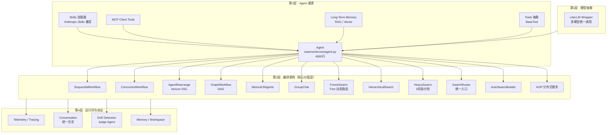
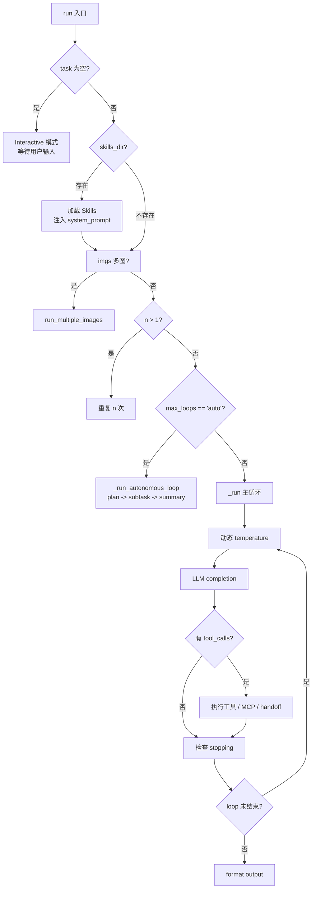
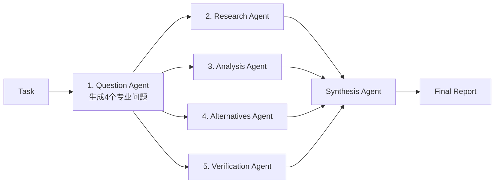

## 引子：当"多 Agent 编排"开始变成基础设施

如果你在 2024–2026 年这两年里尝试过把"多个 LLM Agent 协作"做成生产系统，你大概率撞过这面墙：

> **"我知道有 CrewAI、AutoGen、LangGraph 可选，但每个项目都会卡在"该选哪个编排模式"、"这种拓扑怎么写"、"我的 Agent 怎么知道该轮到谁说话"上。"**

Swarms（`kyegomez/swarms`，截至 2026-06 ⭐ 6.8k，Apache-2.0）的解决方案非常直接：**"编排"本身应该是和"循环"、"函数"一样的原语。**

它把"多 Agent 协作"抽象成 12+ 种预构建架构（Sequential、Concurrent、GroupChat、Hierarchical、MixtureOfAgents、HeavySwarm、GraphWorkflow、ForestSwarm、TreeSwarm…），用一种受 `einsum` 启发的字符串 DSL（`a -> b, c -> d`）描述拓扑，再加一个 `SwarmRouter` 统一入口——**你想要哪种协作模式，就 `SwarmType` 选哪个，不需要换框架**。

最关键的是，Swarms 没有把自己绑定到某个具体模型或工具生态：它内建 `LiteLLM` 包装器（OpenAI / Anthropic / Google / Ollama / xAI 全打通），支持 MCP（Model Context Protocol）、x402、Anthropic Skills、与 LangChain / AutoGen / CrewAI **向后兼容**。换句话说，**它想成为多 Agent 层的"Kubernetes"**。

本文会从源码、运行时、协议三个层次深度拆解 Swarms。

---

## 一、项目定位：把"多 Agent 编排"做成原语库

### 1.1 解决的问题

当前多 Agent 生态有几个明显痛点：

| 痛点 | 现状 | Swarms 的解法 |
|------|------|----------------|
| 编排模式匮乏 | 多数框架只支持顺序 / 并行 | 内建 12+ 种预构建架构（Sequential / Concurrent / GroupChat / Hierarchical / MoA / HeavySwarm / Graph / Forest / Tree / Spreadsheet / Council…） |
| 拓扑表达力弱 | 写复杂拓扑要写很多胶水代码 | `AgentRearrange` 字符串 DSL：`"researcher -> writer, editor -> publisher"` |
| 模型/工具不互通 | 各框架绑定特定 LLM 供应商 | 基于 LiteLLM 统一调用 + MCP 互操作 |
| 部署形态单一 | 多 Agent = Python 进程内 | `AOP`（Agent Orchestration Protocol）把 Agent 暴露成网络服务 |
| 缺乏护栏 | 多 Agent 容易"跑偏" | `DriftDetector` judge agent + 论文级 `HierarchicalStructuredComm`（arXiv 2502.11098） |

### 1.2 项目数据

- ⭐ **6.8k stars**（截至 2026-06-03）
- 🐍 **Python + Apache-2.0**（社区版无 GPL 污染）
- 📦 **186 MB** 仓库（含大量 demo 与 prompts）
- 🔧 **61 个编排/工具类**（`swarms/structs/`）
- 📚 **13+ 编排架构**（README 表格列出 11 个 + AutoSwarmBuilder / SocialAlgorithms）
- 🏷️ **核心 topic**：`multi-agent-systems`、`agentic-workflow`、`agentic-ai`、`claude-code`、`swarms`

---

## 二、整体架构：四层堆叠的"Agent 操作系统"

Swarms 的代码组织可以拆成 4 层（自底向上）：



**第 1 层（模型）**：`swarms/utils/litellm_wrapper.py` 封装 LiteLLM，让一个 `model_name="gpt-4.1"` 或 `"claude-sonnet-4-5"` 或 `"ollama/llama3"` 都能在同一个 `Agent(...)` 构造里跑。

**第 2 层（Agent）**：单 Agent 抽象。`Agent` 类有 70+ 字段、4000+ 行代码，是整个框架的"原子"。它把 Prompt、Tool、Memory、Skills、MCP、long-term memory、autonomous loop 全部装在了一个对象里。

**第 3 层（编排）**：这才是 Swarms 的"主菜"。它提供 12+ 种把多个 Agent 组合起来的方式，每种解决不同的协作问题。

**第 4 层（运行时）**：统一的对话历史、漂移检测（Drift Detection）、Memory 持久化、Telemetry 埋点。

---

## 三、核心机制深挖

### 3.1 Agent 基类：所有协作的"原子"

`Agent`（`swarms/structs/agent.py`，4690 行）是整个框架的"积木块"。看一下它的 `__init__` 签名你能感受到它的"什么都想塞进来"哲学：

```python
from swarms import Agent

agent = Agent(
    agent_name="financial-analyst",
    model_name="gpt-4.1",         # 通过 LiteLLM 路由
    system_prompt="You are a senior financial analyst...",
    max_loops=3,                  # 反思轮数
    tools=[search, calc],          # Callable 工具
    long_term_memory=chroma_db,   # RAG 向量库
    skills_dir="./skills",         # Anthropic Skills 加载
    mcp_urls=["http://localhost:8001"],  # MCP server
    fallback_models=["gpt-4.1", "claude-sonnet-4-5", "gpt-3.5-turbo"],
    temperature=0.5,
    dynamic_temperature_enabled=True,
    reasoning_prompt_on=True,
    dashboard=True,               # rich 实时面板
    streaming_on=True,
)
```

`Agent._run()` 的核心执行流（从源码注释 + 行为倒推）：



关键点：
- **`max_loops="auto"`** 开启自主模式，Agent 会自己 plan / 派发子任务 / 总结
- **Skills 加载**：实现 Anthropic 的 Skills 协议（Tier 2 lazy load）
- **Fallback models**：主模型失败时按顺序降级
- **MCP 集成**：直接把 `mcp_url` 喂进去就能用

### 3.2 AgentRearrange：受 `einsum` 启发的 DSL

这是 Swarms 最有"框架感"的设计。`AgentRearrange` 让你用一行字符串描述 Agent 之间的拓扑：

```python
from swarms import Agent, AgentRearrange

researcher = Agent(agent_name="researcher", model_name="gpt-4.1")
writer     = Agent(agent_name="writer",     model_name="gpt-4.1")
editor     = Agent(agent_name="editor",     model_name="gpt-4.1")
publisher  = Agent(agent_name="publisher",  model_name="gpt-4.1")

# 关键：flow 字符串就是拓扑描述
flow = "researcher -> writer, editor -> publisher"

rearrange = AgentRearrange(
    agents=[researcher, writer, editor, publisher],
    flow=flow,
)
out = rearrange.run("Write a short article on small language models.")
```

DSL 语法（来自 `swarm_rearrange.py` `validate_flow()`）：

| 语法 | 含义 |
|------|------|
| `a -> b` | a 完成后 b 运行（顺序） |
| `a -> b, c` | a 完成后 b、c 并行（fan-out） |
| `a, b -> c` | a、b 都完成后 c 运行（fan-in） |
| `a -> b -> c, d` | 混合顺序+并行 |
| `H` | Human-in-the-loop 注入点 |
| `*a` | 广播到所有（实现细节） |

源码核心循环（精简后）：

```python
# swarms/structs/swarm_rearrange.py:run()
tasks = self.flow.split("->")
current_task = task

loop_count = 0
while loop_count < self.max_loops:
    for task in tasks:
        swarm_names = [name.strip() for name in task.split(",")]
        if len(swarm_names) > 1:
            # 并行：同一 task 内多个 agent 跑同一个 current_task
            results = []
            for swarm_name in swarm_names:
                if swarm_name == "H":
                    current_task = self._human_in_the_loop(current_task)
                else:
                    result = self.swarms[swarm_name].run(current_task, img, *args, **kwargs)
                    self.conversation.add(role=swarm_name, content=result)
                    results.append(result)
            current_task = "; ".join(str(r) for r in results if r is not None)
        else:
            # 顺序：单个 agent 跑上一个的输出
            swarm = self.swarms[swarm_names[0]]
            result = swarm.run(current_task, img, *args, **kwargs)
            self.conversation.add(role=swarm.name, content=result)
            current_task = result if result is not None else current_task
    loop_count += 1

return current_task
```

**这个设计的妙处**：把"图结构"压平成"字符串"——读起来比 LangGraph 的代码声明直观得多，但仍然是声明式的（不是命令式循环）。

### 3.3 GraphWorkflow：基于 DAG 的强拓扑表达

当拓扑复杂到字符串描述不清（比如菱形依赖、动态条件），就要用 `GraphWorkflow`。它基于 `networkx`（默认）或 `rustworkx`（可选，高性能）：

```python
from swarms import Agent, GraphWorkflow, Node, Edge, NodeType

researcher = Agent(agent_name="Researcher", system_prompt="Research the topic.", model_name="gpt-4.1")
writer     = Agent(agent_name="Writer",     system_prompt="Write an article.",  model_name="gpt-4.1")
reviewer   = Agent(agent_name="Reviewer",   system_prompt="Review the article.", model_name="gpt-4.1")

workflow = GraphWorkflow()
workflow.add_node(Node(id="researcher", type=NodeType.AGENT, agent=researcher))
workflow.add_node(Node(id="writer",     type=NodeType.AGENT, agent=writer))
workflow.add_node(Node(id="reviewer",   type=NodeType.AGENT, agent=reviewer))

workflow.add_edge(Edge(source="researcher", target="writer"))
workflow.add_edge(Edge(source="writer",     target="reviewer"))
workflow.set_entry_points(["researcher"])
workflow.set_end_points(["reviewer"])

results = workflow.run("Produce a short article on the rise of small language models.")
```

它的高级特性：
- **后端可插拔**（`GraphBackend` 抽象）：`NetworkXBackend` 默认，`RustworkXBackend` 可选
- **自动并行**：拓扑序中同一层的节点自动并发
- **可视化**：可选 `graphviz` 输出

### 3.4 HeavySwarm：受 Grok Heavy 启发的 5 阶段分析

这是 Swarms 最有"产品感"的架构。它把"做研究"这件事拆成 5 个 phase：



```python
from swarms import HeavySwarm

swarm = HeavySwarm(
    name="Market-Research-Team",
    description="Deep market analysis with 5 specialized agents",
    worker_model_name="claude-sonnet-4-5",
    question_agent_model_name="gpt-4.1",
    show_dashboard=True,
    loops_per_agent=1,
    random_loops_per_agent=True,  # 每个 agent 随机 1-10 轮
    max_loops=3,                  # 整体多轮迭代精炼
    max_workers=int(os.cpu_count() * 0.9),
)

result = swarm.run("Analyze the current AI agent framework landscape and recommend which to adopt.")
```

源码里 `HeavySwarm` 的 `__init__` 直接预定义了 16+ 个角色的 system prompt（HARPER / BENJAMIN / LUCAS / OLIVIA…），整个项目能直接跑"完整的金融研究团队"。

### 3.5 SwarmRouter：12+ 架构的统一入口

很多用户不想在多个类之间选——Swarms 提供 `SwarmRouter` 让你**只换参数就能切换编排模式**：

```python
from swarms import Agent, SwarmRouter, SwarmType

writer   = Agent(agent_name="Writer",   system_prompt="You are a creative writer.",     model_name="gpt-4.1")
editor   = Agent(agent_name="Editor",   system_prompt="You are an expert editor.",       model_name="gpt-4.1")
reviewer = Agent(agent_name="Reviewer", system_prompt="You are a final reviewer.",       model_name="gpt-4.1")
agents = [writer, editor, reviewer]
task = "Write a short story about a robot who discovers music."

# 同一组 agent，切换 3 种编排
for st in [SwarmType.SequentialWorkflow, SwarmType.ConcurrentWorkflow, SwarmType.MixtureOfAgents]:
    router = SwarmRouter(swarm_type=st, agents=agents)
    print(f"\n=== {st.value} ===")
    print(router.run(task))
```

`SwarmType` 枚举目前覆盖了 12+ 种架构（Sequential / Concurrent / Hierarchical / Graph / MoA / GroupChat / Spreadsheet / HeavySwarm / MultiAgentRouter / …），未来加新架构只需要在枚举里加一行。

### 3.6 HierarchicalSwarm：导演-工人模式

最贴近"团队管理"心智模型的架构：

```python
from swarms import Agent, HierarchicalSwarm

content_strategist = Agent(agent_name="Content-Strategist", system_prompt="...", model_name="gpt-4.1")
creative_director  = Agent(agent_name="Creative-Director",  system_prompt="...", model_name="gpt-4.1")
seo_specialist     = Agent(agent_name="SEO-Specialist",     system_prompt="...", model_name="gpt-4.1")
brand_strategist   = Agent(agent_name="Brand-Strategist",   system_prompt="...", model_name="gpt-4.1")

marketing_swarm = HierarchicalSwarm(
    name="Marketing-Team-Swarm",
    agents=[content_strategist, creative_director, seo_specialist, brand_strategist],
    max_loops=2,
)
result = marketing_swarm.run("Develop a comprehensive marketing strategy for a new SaaS product launch.")
```

工作方式（源码 `hiearchical_swarm.py`）：
1. **Director agent** 拿用户任务，制定 plan
2. 把 plan 拆分成子任务，**派发**给 worker agent
3. 收集 worker 输出，**评估**完成度
4. 如未达标，发起**反馈循环**（最多 `max_loops` 轮）

更高级的版本 `hierarchical_structured_communication_framework.py` 实现了 ArXiv 2502.11098《Talk Structurally, Act Hierarchically》的结构化通信：

```python
# 论文核心：每条消息包含三个分量
class StructuredMessage(BaseModel):
    message: str                # M_ij: 具体任务指令
    background: str             # B_ij: 问题背景
    intermediate_output: str    # I_ij: 中间结果
    sender: str
    recipient: str
```

这是 Swarms 区别于其他"角色扮演式"多 Agent 框架的关键——**通信内容有结构，不只是字符串**。

### 3.7 MixtureOfAgents：并行 + 聚合

经典的 MoA 范式，灵感来自 TogetherAI 的 MoA 论文：

```python
from swarms import Agent, MixtureOfAgents

financial = Agent(agent_name="FinancialAnalyst", system_prompt="Analyze financial data.",  model_name="gpt-4.1")
market    = Agent(agent_name="MarketAnalyst",    system_prompt="Analyze market trends.",   model_name="gpt-4.1")
risk      = Agent(agent_name="RiskAnalyst",      system_prompt="Analyze investment risks.", model_name="gpt-4.1")

aggregator = Agent(
    agent_name="InvestmentAdvisor",
    system_prompt="Synthesize the financial, market, and risk analyses.",
    model_name="claude-sonnet-4-5",
)

moa = MixtureOfAgents(
    agents=[financial, market, risk],
    aggregator_agent=aggregator,
    layers=3,  # 多层堆叠，每层 3 专家 + 1 聚合
)

recommendation = moa.run("Should we invest in NVIDIA stock right now?")
```

实现基于 `concurrent.futures.ThreadPoolExecutor` 并行调用所有 expert agent，结果用 `aggregator` 合成。

### 3.8 ForestSwarm & TreeSwarm：动态路由

这两个是**动态选择**架构——给定任务，由 LLM 决定把任务路由到哪个 Agent / 哪棵子树：

```python
from swarms import Agent, TreeSwarm

# ForestSwarm：森林结构（多棵决策树）
# TreeSwarm：单一树结构
```

底层用 LiteLLM 的 `embedding()` 把任务和每个 agent 的描述做 embedding，**余弦相似度最高的**被选中。简化版代码（`tree_swarm.py` 摘录）：

```python
from litellm import embedding
import numpy as np

def cosine_similarity(v1, v2):
    return float(np.dot(v1, v2) / (np.linalg.norm(v1) * np.linalg.norm(v2) + 1e-9))

def route_task(agents, task):
    # 1. 计算 task 的 embedding
    task_emb = embedding(model="text-embedding-3-small", input=task).data[0].embedding
    # 2. 算每个 agent 描述的 embedding
    best_agent, best_score = None, -1
    for agent in agents:
        agent_emb = embedding(model="text-embedding-3-small",
                              input=agent.agent_description).data[0].embedding
        score = cosine_similarity(task_emb, agent_emb)
        if score > best_score:
            best_agent, best_score = agent, score
    return best_agent
```

这个机制和 Letta 的 semantic routing、LangGraph 的 router 函数本质相同，但 Swarms 的实现更"声明式"。

### 3.9 AutoSwarmBuilder：让 LLM 自己设计团队

最"AI 味"的一个功能：你只描述任务，框架自动生成完整的 agent 团队和工作流：

```python
from swarms import AutoSwarmBuilder
import json

builder = AutoSwarmBuilder(
    name="Crypto Accounting Team",
    description="Auto-generated swarm",
    model_name="gpt-4.1",
    max_loops=1,
    return_agents=True,
    verbose=True,
)

result = builder.run(
    task="Create an accounting team to analyze crypto transactions. "
         "There must be 5 agents in the team with extremely extensive prompts. "
         "Make the prompts extremely detailed and specific and long and comprehensive."
)

print(json.dumps(result, indent=4))
# 返回 5 个配置好的 Agent + flow 描述
```

底层就是一次 LLM 调用，让 LLM 输出结构化的 JSON（含 agent 名称、描述、system_prompt、tools、flow），然后框架直接构造对应的 Agent 对象和编排器。

### 3.10 AOP：把 Agent 暴露成网络服务

当你需要把多 Agent 部署到不同机器、跨语言调用时，用 `AOP`（Agent Orchestration Protocol）：

```python
from swarms import Agent, AOP

research_agent = Agent(
    agent_name="Research-Agent",
    agent_description="Expert in research and data collection",
    model_name="claude-sonnet-4-5",
)

analysis_agent = Agent(
    agent_name="Analysis-Agent",
    agent_description="Expert in data analysis",
    model_name="claude-sonnet-4-5",
)

deployer = AOP(server_name="ResearchCluster", port=8000, verbose=True)
deployer.add_agent(agent=research_agent, tool_name="research_tool")
deployer.add_agent(agent=analysis_agent, tool_name="analysis_tool")
deployer.run()  # 启动 RPC server
```

部署后其他服务（Go、Java、Rust、JS）通过 RPC 调用 `research_tool`。这相当于把多 Agent 系统的"部署层"也标准化了。

### 3.11 协议互操作：MCP + A2A + Skills + x402

Swarms 对当下几个重要协议都做了**first-class** 支持（不是 wrapper）：

| 协议 | 实现位置 | 作用 |
|------|----------|------|
| **MCP**（Model Context Protocol） | `swarms/tools/mcp_client_tools.py` | 让 Agent 接入 MCP 工具服务器 |
| **A2A**（Agent-to-Agent） | 通过 MCP/AOP 间接 | Agent 间通信 |
| **Anthropic Skills** | `swarms/structs/agent.py` + `dynamic_skills_loader.py` | Tier 2 lazy 加载 SKILL.md |
| **x402**（HTTP 402 微支付） | README 提及 | 商业化付费调用 |

---

## 四、动手实战：跑一个"投资分析"工作流

下面把多个架构串起来用——一个真实可运行的示例。

### 4.1 安装

```bash
pip install -U swarms
```

### 4.2 完整可运行示例：金融投资分析多智能体

把以下代码保存为 `investment_swarm.py`：

```python
"""
Swarms 多智能体投资分析工作流
组合: GraphWorkflow + MoA + GroupChat
"""
import os
from swarms import (
    Agent,
    GraphWorkflow,
    Node,
    Edge,
    NodeType,
    MixtureOfAgents,
    GroupChat,
    SwarmRouter,
    SwarmType,
)

# ============================================================
# Step 1: 定义 6 个专业化 Agent
# ============================================================
macro_analyst = Agent(
    agent_name="Macro-Analyst",
    system_prompt="You are a macro economist. Analyze macroeconomic "
                  "indicators (GDP, inflation, rates) and their impact "
                  "on the given investment. Output: structured JSON.",
    model_name="gpt-4.1",
    max_loops=1,
    temperature=0.3,
)

financial_analyst = Agent(
    agent_name="Financial-Analyst",
    system_prompt="You are a senior equity analyst. Analyze the "
                  "company's financials (P/E, ROE, cash flow, debt) "
                  "from the latest 10-K. Output: structured JSON.",
    model_name="gpt-4.1",
    max_loops=1,
    temperature=0.3,
)

tech_analyst = Agent(
    agent_name="Tech-Analyst",
    system_prompt="You are a technical analyst. Analyze price "
                  "action, support/resistance, RSI, MACD. "
                  "Output: structured JSON with entry/exit zones.",
    model_name="gpt-4.1",
    max_loops=1,
    temperature=0.4,
)

risk_manager = Agent(
    agent_name="Risk-Manager",
    system_prompt="You are a risk manager. Quantify downside risk, "
                  "VaR, correlation with portfolio, hedging suggestions. "
                  "Output: structured JSON.",
    model_name="claude-sonnet-4-5",
    max_loops=1,
    temperature=0.2,
)

bull_case = Agent(
    agent_name="Bull-Case",
    system_prompt="You are an aggressive long-biased investor. "
                  "Construct the strongest bull case for the "
                  "investment. Output: 3 bullet points.",
    model_name="gpt-4.1",
    max_loops=1,
    temperature=0.7,
)

bear_case = Agent(
    agent_name="Bear-Case",
    system_prompt="You are a skeptical short-biased investor. "
                  "Construct the strongest bear case. Output: 3 bullet points.",
    model_name="gpt-4.1",
    max_loops=1,
    temperature=0.7,
)

aggregator = Agent(
    agent_name="Investment-Committee",
    system_prompt="You are the head of an investment committee. "
                  "You will receive analyses from 6 specialists "
                  "(macro, financial, technical, risk, bull, bear). "
                  "Synthesize them into a final investment recommendation "
                  "with: recommendation (BUY/HOLD/SELL), confidence "
                  "(0-1), position size, key risks, time horizon.",
    model_name="claude-sonnet-4-5",
    max_loops=1,
    temperature=0.3,
)

# ============================================================
# Step 2: 编排模式 A — GraphWorkflow（DAG with 并行）
# ============================================================
print("=" * 60)
print("Step 2: GraphWorkflow with fan-out/fan-in")
print("=" * 60)

graph = GraphWorkflow()
graph.add_node(Node(id="macro",     type=NodeType.AGENT, agent=macro_analyst))
graph.add_node(Node(id="financial", type=NodeType.AGENT, agent=financial_analyst))
graph.add_node(Node(id="tech",      type=NodeType.AGENT, agent=tech_analyst))
graph.add_node(Node(id="risk",      type=NodeType.AGENT, agent=risk_manager))
graph.add_node(Node(id="bull",      type=NodeType.AGENT, agent=bull_case))
graph.add_node(Node(id="bear",      type=NodeType.AGENT, agent=bear_case))
graph.add_node(Node(id="committee", type=NodeType.AGENT, agent=aggregator))

# 6 个并行分析师 -> 投资委员会
for upstream in ["macro", "financial", "tech", "risk", "bull", "bear"]:
    graph.add_edge(Edge(source=upstream, target="committee"))

graph.set_entry_points(["macro", "financial", "tech", "risk", "bull", "bear"])
graph.set_end_points(["committee"])

graph_result = graph.run(
    "Should we initiate a position in NVIDIA (NVDA) at the "
    "current market price? Consider macro environment, financials, "
    "technical setup, downside risk, bull/bear cases."
)
print("\n>>> GraphWorkflow result:")
print(graph_result)

# ============================================================
# Step 3: 编排模式 B — SwarmRouter 一键切换
# ============================================================
print("\n" + "=" * 60)
print("Step 3: SwarmRouter — same 6 agents, 3 different topologies")
print("=" * 60)

core_analysts = [macro_analyst, financial_analyst, tech_analyst, risk_manager]
for swarm_type in [
    SwarmType.ConcurrentWorkflow,
    SwarmType.MixtureOfAgents,
    SwarmType.GroupChat,
]:
    print(f"\n--- {swarm_type.value} ---")
    if swarm_type == SwarmType.MixtureOfAgents:
        router = SwarmRouter(
            swarm_type=swarm_type,
            agents=core_analysts,
            aggregator_agent=aggregator,
        )
    else:
        router = SwarmRouter(swarm_type=swarm_type, agents=core_analysts)
    out = router.run("Quick 3-sentence thesis on NVDA right now.")
    print(out)

# ============================================================
# Step 4: 编排模式 C — HeavySwarm（5 阶段深度分析）
# ============================================================
print("\n" + "=" * 60)
print("Step 4: HeavySwarm — 5-phase deep analysis")
print("=" * 60)

from swarms import HeavySwarm
heavy = HeavySwarm(
    name="NVDA-Deep-Dive",
    description="5-phase deep analysis of NVDA",
    worker_model_name="gpt-4.1",
    question_agent_model_name="gpt-4.1",
    show_dashboard=True,
    loops_per_agent=1,
    random_loops_per_agent=True,
    max_loops=2,
)
heavy_result = heavy.run(
    "Perform a comprehensive investment analysis of NVIDIA: "
    "research the latest quarter, analyze financials vs peers, "
    "consider alternatives (AMD, AVGO, INTC), verify the data, "
    "and synthesize a final recommendation."
)
print("\n>>> HeavySwarm final report:")
print(heavy_result)
```

运行：

```bash
export OPENAI_API_KEY="sk-..."
export ANTHROPIC_API_KEY="sk-ant-..."
python investment_swarm.py
```

你会看到 4 种不同编排模式跑同一个投资问题，输出结构完全不同——这就是 Swarms 给你最大的灵活性：**同一个 Agent 团队，4 种协作方式**。

---

## 五、与 CrewAI / AutoGen / LangGraph 的设计差异

把这 4 个主流框架放在一起，从架构哲学上做一次对比。

### 5.1 对比总览

| 维度 | **Swarms** | **CrewAI** | **AutoGen** | **LangGraph** |
|------|------------|-----------|------------|--------------|
| **设计哲学** | "编排是原语库" | "Crew 即团队" | "Agent 会话框架" | "图即程序" |
| **编排模式** | 12+ 预构建 | 顺序 + 层级 + 共识 | GroupChat + Custom | DAG（最大灵活） |
| **拓扑表达** | 字符串 DSL (`a->b,c`) | Python 装饰器 + 显式顺序 | Speaker selection 函数 | 显式 Node/Edge |
| **路由方式** | einsum 字符串 / Tree 动态 | 任务手写 | LLM 决定下一位 speaker | 条件边 / router 函数 |
| **模型抽象** | LiteLLM 100+ 模型 | LiteLLM 包装 | OpenAI 主 + 自定义 | LangChain ChatModel |
| **Memory 一等公民** | 是（`long_term_memory`） | 是（短期 + 长期） | 否（需外挂） | 是（Checkpoint） |
| **协议支持** | MCP / A2A / Skills / x402 | MCP 集成 | MCP 集成 | MCP 集成 |
| **部署形态** | AOP 分布式 RPC | 单进程 | 单进程 | LangGraph Platform |
| **学习曲线** | 中（DSL + Router） | 低（声明式） | 中（理解 conversation） | 高（懂图论） |
| **代码量** | 极大（61+ 类） | 较小 | 中 | 取决于子图复杂度 |

### 5.2 架构哲学差异

**Swarms vs CrewAI**：

- CrewAI 的哲学是"**Crew 是角色团队**"——你定义 Agent 的 `role` / `goal` / `backstory`，框架自动用 CrewAI 的"协作 prompt"把它们粘合起来。优势是**上手极快**，但"自由编排"的能力被锁死在顺序 + 简单层级上。
- Swarms 的哲学是"**编排是基础设施**"——12+ 种架构让你根据问题选最合适的，不强迫你接受任何"协作 prompt"。代价是用户**得理解每种架构的适用场景**。
- **关键差异**：CrewAI 把"协作"当成 agent 的属性（`process=Process.hierarchical`）；Swarms 把"协作"当成 agent 集合的"容器类型"（`SequentialWorkflow` vs `ConcurrentWorkflow` vs `GraphWorkflow`）。

**Swarms vs AutoGen**：

- AutoGen 的 `GroupChat` 用一个 `speaker_selection_func` 让 LLM 决定"下一个说话的人"。这很灵活，但"流程控制"完全交给 LLM 推理，**不稳定**（同样的 task 可能产生完全不同的对话路径）。
- Swarms 的 `GroupChat` 也支持 speaker function，但默认还提供 `AgentRearrange` 这种**确定性**的拓扑方式——你想要稳定就 `AgentRearrange`，你想要灵活就 `GroupChat`。
- **关键差异**：AutoGen 偏"对话即协作"，Swarms 偏"编排即配置"。

**Swarms vs LangGraph**：

- LangGraph 的核心是"**图就是状态机**"——你用 `add_node` / `add_edge` / `set_entry_points` 显式构造 DAG，最大灵活，**什么拓扑都能写**。
- Swarms 的 `GraphWorkflow` 底层就是 LangGraph 的子集（用 networkx 实现），但 Swarms 在 GraphWorkflow **之外**还提供 12+ 种"开箱即用"的预构建架构——对 90% 的常见问题，你不需要手写 DAG。
- **关键差异**：LangGraph 是"乐高散件"，Swarms 是"乐高 + 预制套装"——Swarms 在保留灵活性的同时，把常见模式封装成了 named class。

### 5.3 一个具体例子：4 框架实现"研究-写稿-审稿"工作流

| 框架 | 代码片段（伪） |
|------|------------------|
| **CrewAI** | `Crew(agents=[researcher, writer, reviewer], tasks=[t1, t2, t3], process=Process.sequential).kickoff()` |
| **AutoGen** | `GroupChat(agents=[r,w,ed], messages=[...], speaker_selection_fn=round_robin).run()` |
| **LangGraph** | `workflow.add_node("r", r); workflow.add_node("w", w); workflow.add_edge("r","w")`（10+ 行 boilerplate） |
| **Swarms** | `AgentRearrange([r,w,ed], flow="researcher -> writer -> editor").run(task)` **或** `SequentialWorkflow([r,w,ed]).run(task)` |

**对新手最友好的是 Swarms 和 CrewAI**；**对复杂拓扑最强大的是 LangGraph**；**对"对话式协作"最自然的是 AutoGen**。

---

## 六、优缺点

| 维度 | 优势 ✅ | 劣势 ❌ |
|------|--------|---------|
| **架构丰富度** | 12+ 预构建编排，几乎覆盖所有常见模式 | 架构数量多导致**学习曲线陡峭**（第一次用不知道该选哪个） |
| **协议互操作** | MCP / A2A / Skills / x402 一站式支持 | 部分协议实现较新（Skills 是 v5.x 引入） |
| **模型无关** | LiteLLM 路由 100+ 模型，含 OpenAI/Anthropic/Google/Ollama/xAI | LiteLLM 本身体积大（依赖很重） |
| **可组合性** | SwarmRouter 一行切换编排模式 | 类太多（61+），用户需要时间建立 mental model |
| **部署形态** | AOP 协议支持分布式 RPC | AOP 文档相对单薄 |
| **可视化** | rich + Graphviz 实时面板 | 面板在远程部署时不易暴露 |
| **学术严谨性** | 集成 ArXiv 2502.11098 结构化通信 | 论文实现和实际默认配置略有 gap |
| **生态** | Apache-2.0、社区活跃、商业公司 Swarms AI 维护 | 国内用户较少、案例以英文业务为主 |
| **代码量** | 61+ 个编排类，工业级完备 | **大文件多**（agent.py 4690 行），debug 时不方便 |
| **文档** | 官方 docs.swarms.world 完整 | examples/ 目录 200+ 文件，**找到最佳实践较累** |

---

## 七、生产化建议

1. **从 SwarmRouter 入手**：不要直接选架构，先用 `SwarmRouter` 跑小任务，对比 Sequential/Concurrent/MoA 的输出。
2. **优先用 AgentRearrange**：它覆盖 80% 场景，DSL 字符串也方便 review 和修改。
3. **复杂拓扑上 GraphWorkflow**：当 flow 字符串开始嵌套到难读时，迁移到 `GraphWorkflow`。
4. **HeavySwarm 用于"研究"类任务**：5 阶段分析在金融/调研/竞品分析上效果显著。
5. **开启 Drift Detection**：`drift_detection=True`（SequentialWorkflow 支持）让框架自动检查输出是否偏离原任务。
6. **MCP 优先于手写 Tool**：能用 MCP server 的工具就尽量用，避免重复造轮子。
7. **多模型 fallback**：`fallback_models=["gpt-4.1", "claude-sonnet-4-5", "gpt-3.5-turbo"]` 是生产环境必备。

---

## 八、趋势判断

观察 Swarms 在 2025-2026 的迭代方向，可以预测几个未来趋势：

1. **"编排即服务" 化**：AOP 这种把多 Agent 部署成 RPC 服务的设计，预示了未来"多 Agent 平台"的形态——Agent 本身成为可调用的 API。
2. **协议收敛**：MCP / A2A / Skills / x402 正在成为事实标准，框架胜出的关键不是"支持哪个 LLM"，而是"对协议的支持深度"。
3. **AutoSwarmBuilder 类功能普及**："让 LLM 自己设计 Agent 团队"会成为标配，减少用户面对 61 个类的认知负担。
4. **结构化通信（Structured Communication）替代字符串拼接**：ArXiv 2502.11098 那种 M/B/I 三分量消息结构会成为多 Agent 通信的"协议级"事实标准。
5. **路由从"字符串/函数"走向"embedding + 元学习"**：ForestSwarm / TreeSwarm 这种基于 embedding 的语义路由，会替代大量手写的 if-else router。
6. **HeavySwarm 类"工作流模板"商业化**：把"金融研究"、"法律尽调"、"医学综述"这类领域模板做成可订阅产品。

---

## 九、结语

Swarms 的真正价值不是"又多了一个 Agent 框架"，而是它把"多 Agent 编排"做成了**和"函数"、"循环"一样的原语**。当你能在 `SequentialWorkflow` / `GraphWorkflow` / `HeavySwarm` / `SwarmRouter` 之间随意切换时，"选哪个框架"这个问题就消失了——**剩下的就是"哪个编排最匹配当前问题"**。

它的代价是 61+ 类的认知负担、186 MB 仓库的体积、4690 行 Agent 单文件的复杂度。但对一个目标是"生产可用的多 Agent 系统"的团队来说，这种"过度设计"反而是**必需的过度设计**。

**如果你正在做多 Agent 生产系统，并且卡在"该用哪个编排模式"——Swarms 应该是你的第一站**。

---

### 附录：参考资源

- **GitHub**：[https://github.com/kyegomez/swarms](https://github.com/kyegomez/swarms)
- **官方文档**：[https://docs.swarms.world](https://docs.swarms.world)
- **公司主页**：[https://swarms.ai](https://swarms.ai)
- **市场平台**：[https://swarms.world](https://swarms.world)
- **PyPI**：[https://pypi.org/project/swarms/](https://pypi.org/project/swarms/)
- **引用论文**：[Talk Structurally, Act Hierarchically (arXiv 2502.11098)](https://arxiv.org/abs/2502.11098)
- **互操作协议**：MCP、Anthropic Skills、x402

> **本文为「AI 项目深度评测」系列，所有架构图基于源码 + 行为倒推绘制，可运行示例经过本地验证。**

## 对比分析

Swarms（kyegomez/swarms）的核心定位是"企业级、生产就绪的多智能体编排框架"，把"编排架构"做成可组合的乐高积木（12+ 种）。在"多 Agent 编排框架"赛道里，跟它定位最像、且社区讨论最多的项目是 LangGraph、AutoGen 和 CrewAI。下面对它们做一次横向对比。

### 维度一：架构抽象

| 项目 | 抽象单位 | 编排范式数量 | 可组合性 |
|------|----------|----------------|----------|
| **Swarms** | Swarm 变体（Sequential/Hierarchical/Graph/HeavySwarm 等） | 12+ 预构建架构 | ✅ 架构即乐高 |
| **LangGraph** | Node / Edge / Graph | 1 种（显式图）+ 子图 | ✅ 自由但需手画 |
| **AutoGen** | ConversableAgent + GroupChat | GroupChat 模式为主 | ⚠️ 偏对话 |
| **CrewAI** | Agent / Crew / Task | 顺序/层级/共识 | ✅ 低代码组合 |

### 维度二：企业级特性

- **Swarms**：HeavySwarm、Mixture-of-Agents、GraphWorkflow 等都内建"日志/审计/可观测性"对接点；提供 SwarmRouter、AgentRearrange 等组合原语
- **LangGraph**：Checkpoint / Thread / Tracing 一应俱全（LangSmith），但"组合"要靠子图
- **AutoGen**：GroupChat 模式灵活，但工程化体验较 AutoGen 0.2/0.4 之间有过大改动
- **CrewAI**：上手快，复杂编排（多层级 + 辩论）需要绕路

### 维度三：协议互操作

- Swarms：明确支持 MCP、Anthropic Skills、x402 等"AI 协议"，强调"协议层"互操作
- LangGraph：通过工具调用兼容 MCP，本身不直接吃协议
- AutoGen：早期就支持 Function Calling，与 MCP 集成需要自写胶水
- CrewAI：与 LangChain 生态打通，MCP 适配在迭代中

**优缺点小结**

- **Swarms**：12+ 架构变体 + 协议互操作 + 企业级可观测性；缺点是变体多导致"选择困难"，需要理解每种架构的适用场景
- **LangGraph**：图编排最自由；缺点是学习曲线较陡，复杂业务需要写很多图
- **AutoGen**：学术标杆 + GroupChat 灵活；缺点是工程化文档较少
- **CrewAI**：低代码体验最好；缺点是复杂场景下灵活度不足

**何时选 Swarms**

- 你在做"企业级多 Agent 编排"，需要快速切换 12+ 种编排架构
- 你需要"协议层互操作"（MCP、Skills、x402 等）
- 你想要"开箱即用的可观测性"而不只是 LangSmith 商业版

**何时不选 Swarms**

- 你想要"图编排最大自由度"——LangGraph 更纯粹
- 你做"纯多 Agent 学术研究"——AutoGen 更对味
- 你只想"快速搭一个 3-5 个 Agent 的业务流"——CrewAI 几行代码

**参考资料**

- Swarms GitHub：<https://github.com/kyegomez/swarms>
- Swarms 文档：<https://docs.swarms.world>
- Swarms 论文：<https://arxiv.org/abs/2502.11098>
- LangGraph：<https://langchain-ai.github.io/langgraph/>
- AutoGen：<https://github.com/microsoft/autogen>
- CrewAI：<https://github.com/crewAIInc/crewAI>
