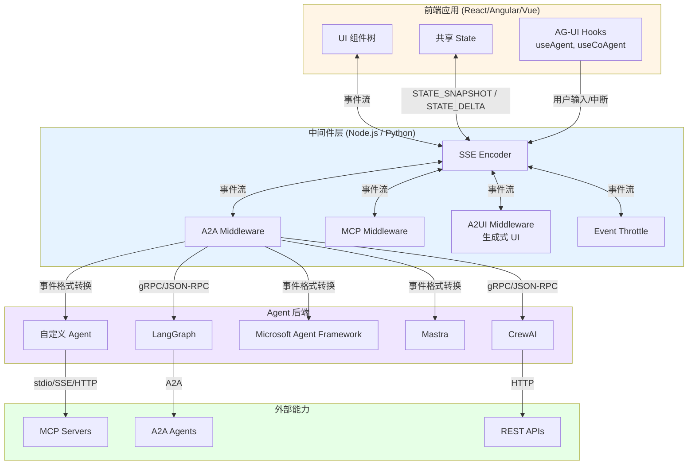
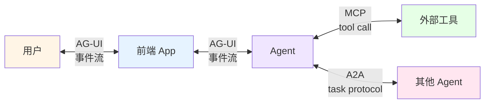

## 引子：当 Agent 想要"开口说话"

2025 年是 LLM Agent 爆发的一年。MCP（Model Context Protocol）解决了"Agent 怎么用工具"的问题，A2A（Agent2Agent）解决了"Agent 之间怎么通信"的问题——但**还有一个关键问题悬而未决：Agent 怎么把执行过程实时、可靠地呈现给最终用户？**

这正是 AG-UI（Agent-User Interaction Protocol）想要回答的问题。

想象一个场景：用户在聊天框里问"帮我订一张明天去上海的高铁票"，Agent 开始调用 12306 工具查询车次，再调用支付接口完成下单。这个过程中，前端需要：
- 看到 Agent **思考过程**（链式推理）
- 看到 **工具调用的逐步参数**（车次、时间、座位）
- 看到 **流式文本输出**（"我为你查到了以下车次..."）
- 看到 **结构化 UI 组件**（车次列表卡片）
- 必要时**打断** Agent 重新指示
- **同步共享状态**（草稿、购物车、已选项）

如果这些都用 LLM 自己拼接 markdown 文本，UX 是灾难性的。AG-UI 就是为这个场景设计的**事件流协议**——把 Agent 执行的每一步抽象成结构化事件，让前端能够精确、可控地渲染整个过程。

本文将深入剖析 AG-UI 的架构、事件模型、状态同步机制和中间件体系，并对比 MCP/A2A 三大协议的设计哲学。

## 项目速览

- **项目名**：AG-UI（Agent-User Interaction Protocol）
- **组织**：CopilotKit（最初为 CopilotKit 的内部协议，现独立治理）
- **GitHub**：https://github.com/ag-ui-protocol/ag-ui
- **Star**：14K+（2026-06）
- **协议仓库**：https://github.com/ag-ui-protocol/ag-ui（含 TypeScript / Python / Go / Java / Kotlin / Rust / Dart 7 个语言 SDK）
- **实现仓库**：https://github.com/CopilotKit/CopilotKit（32K+ Star）
- **License**：MIT
- **官网**：https://ag-ui.com

AG-UI 在协议三件套中明确定位为**"Agent ↔ 用户"**这层：

| 协议 | 解决的问题 | 关注对象 |
|------|-----------|---------|
| **MCP** | Agent 怎么用工具 | Agent ↔ 工具/数据 |
| **A2A** | Agent 怎么互相协作 | Agent ↔ Agent |
| **AG-UI** | Agent 怎么呈现在前端 | Agent ↔ 用户/应用 |

## 一、定位：为什么需要"第三个"协议？

### 1.1 现有方案的痛点

在 AG-UI 出现之前，Agent 前端集成通常有三种做法：

**方案 A：把整个对话塞进 LLM 的 system prompt**。让模型自己输出 markdown，前端用正则解析。问题很直接——格式不稳定、无法流式呈现复杂结构、用户打断困难。

**方案 B：各家框架私有协议**。LangGraph 有自己的事件格式，CrewAI 又是另一套，Autogen 又是第三套。**前端开发者要为每个框架写一套适配器**——这就是 iPhone 出现前手机充电器各家不兼容的乱象。

**方案 C：把工具调用结果直接渲染成组件**。但 Tool Call 的"原语"是 OpenAI Function Calling 那种"调一个函数返回结果"，无法承载"流式思考 + 增量 UI + 状态同步 + 中断恢复"这种复杂交互。

### 1.2 AG-UI 的设计目标

AG-UI 协议规范明确提出几个目标：

1. **轻量**：核心规范只有 ~16 个标准事件类型（TypeScript SDK），不绑定任何特定框架或传输
2. **传输无关**：默认 SSE，但支持 WebSocket、Webhook、二进制 protobuf（HTTP Binary）
3. **格式宽容**：通过中间件层做事件格式的"模糊匹配"，不同 Agent 框架的私有事件可以无损转换
4. **双向状态同步**：Agent 和前端共享一份 State，通过 SNAPSHOT（全量）和 DELTA（增量）两类事件保持一致
5. **支持生成式 UI**：前端可以把组件注册为"工具"，让 Agent 决定何时渲染

这五个目标里，**"传输无关 + 格式宽容"**是 AG-UI 最具匠心的设计——它没有试图"统一世界"，而是提供了一套适配层，让现有的 Agent 框架（LangGraph、CrewAI、Microsoft Agent Framework、Mastra 等）都能以自己的方言"说"AG-UI，前端只听一种语言。

## 二、架构总览



整个 AG-UI 体系分为四层：

1. **前端 SDK 层**：CopilotKit 提供 React/Angular/Vue 组件，订阅事件并自动更新 UI
2. **中间件层**：负责事件编码、限流、跨协议桥接
3. **Agent 层**：任意能"产生事件流"的 LLM 框架
4. **外部能力层**：通过 MCP 调工具、通过 A2A 调其他 Agent

这种分层让 AG-UI 本身**只关心"事件该长什么样"和"状态怎么同步"**，不关心 Agent 怎么思考、用什么模型、调什么工具。

## 三、事件模型：30+ 事件类型的设计哲学

AG-UI 的核心是**事件流**。下面我们直接看 Python SDK 的事件定义（`sdks/python/ag_ui/core/events.py`）：

```python
class EventType(str, Enum):
    """AG-UI 协议定义的事件类型"""
    # 文本消息生命周期
    TEXT_MESSAGE_START = "TEXT_MESSAGE_START"
    TEXT_MESSAGE_CONTENT = "TEXT_MESSAGE_CONTENT"
    TEXT_MESSAGE_END = "TEXT_MESSAGE_END"
    TEXT_MESSAGE_CHUNK = "TEXT_MESSAGE_CHUNK"

    # 思考过程（Chain of Thought）
    THINKING_TEXT_MESSAGE_START = "THINKING_TEXT_MESSAGE_START"
    THINKING_TEXT_MESSAGE_CONTENT = "THINKING_TEXT_MESSAGE_CONTENT"
    THINKING_TEXT_MESSAGE_END = "THINKING_TEXT_MESSAGE_END"

    # 工具调用
    TOOL_CALL_START = "TOOL_CALL_START"
    TOOL_CALL_ARGS = "TOOL_CALL_ARGS"
    TOOL_CALL_END = "TOOL_CALL_END"
    TOOL_CALL_CHUNK = "TOOL_CALL_CHUNK"
    TOOL_CALL_RESULT = "TOOL_CALL_RESULT"

    # 思考状态（多步骤推理的边界）
    THINKING_START = "THINKING_START"
    THINKING_END = "THINKING_END"

    # 状态同步（核心创新）
    STATE_SNAPSHOT = "STATE_SNAPSHOT"
    STATE_DELTA = "STATE_DELTA"
    MESSAGES_SNAPSHOT = "MESSAGES_SNAPSHOT"

    # 活动进度（tool progress）
    ACTIVITY_SNAPSHOT = "ACTIVITY_SNAPSHOT"
    ACTIVITY_DELTA = "ACTIVITY_DELTA"

    # 运行控制
    RUN_STARTED = "RUN_STARTED"
    RUN_FINISHED = "RUN_FINISHED"
    RUN_ERROR = "RUN_ERROR"
    STEP_STARTED = "STEP_STARTED"
    STEP_FINISHED = "STEP_FINISHED"

    # 透传事件
    RAW = "RAW"
    CUSTOM = "CUSTOM"

    # 推理内容（reasoning 模型专用）
    REASONING_START = "REASONING_START"
    REASONING_MESSAGE_START = "REASONING_MESSAGE_START"
    REASONING_MESSAGE_CONTENT = "REASONING_MESSAGE_CONTENT"
    REASONING_MESSAGE_END = "REASONING_MESSAGE_END"
    REASONING_MESSAGE_CHUNK = "REASONING_MESSAGE_CHUNK"
    REASONING_END = "REASONING_END"
```

### 3.1 事件分类的内在逻辑

把上面 30+ 事件按"语义层"划分，可以看出 AG-UI 的设计思路：

| 类别 | 事件 | 设计意图 |
|------|------|---------|
| **生命周期** | `*_START` / `*_END` | 让前端知道"一段内容开始了"和"一段内容结束了"，避免流式拼接出错 |
| **增量内容** | `*_CONTENT` / `*_CHUNK` | 真正流式传输的 payload，前端 append 到当前正在累积的内容上 |
| **状态同步** | `STATE_SNAPSHOT` / `STATE_DELTA` | 共享状态，前端可以直接绑定到响应式变量 |
| **控制信号** | `RUN_*` / `STEP_*` | 整个执行流的边界，错误恢复、断点续传的关键 |
| **透传兜底** | `RAW` / `CUSTOM` | 协议升级时老客户端不丢失事件 |

最值得品的是 `STATE_SNAPSHOT` 和 `STATE_DELTA` 的设计。

### 3.2 状态同步：SNAPSHOT vs DELTA

**SNAPSHOT** 是"全量替换"——前端收到后直接 `state = newState`。**DELTA** 是"增量修改"——使用 [JSON Patch (RFC 6902)](https://datatracker.ietf.org/doc/html/rfc6902) 描述变化。两者结合的好处：

- 首次连接发 SNAPSHOT 让前端快速 warmup
- 之后只发 DELTA，省带宽
- 任意时刻重连都可以用最新 SNAPSHOT 重新同步

`ActivitySnapshot` 和 `ActivityDelta` 同理——这给了 Agent 一种"汇报进行中任务"的能力，比如"正在为你搜索航班... 已搜索 12/50 个机场"。

### 3.3 一段真实的可运行代码

下面用 `ag-ui-protocol` Python 包演示事件流如何编码（`sdks/python/ag_ui/encoder/encoder.py`）：

```python
# 安装: pip install ag-ui-protocol

from ag_ui.core import (
    TextMessageStartEvent,
    TextMessageContentEvent,
    TextMessageEndEvent,
    ToolCallStartEvent,
    ToolCallArgsEvent,
    ToolCallEndEvent,
    ToolCallResultEvent,
    StateSnapshotEvent,
    RunStartedEvent,
    RunFinishedEvent,
    EventType,
)
from ag_ui.encoder import EventEncoder

encoder = EventEncoder()

# 模拟 Agent 一次完整执行的事件流
events = [
    # 1. Run 启动
    RunStartedEvent(
        type=EventType.RUN_STARTED,
        thread_id="thread_001",
        run_id="run_abc",
    ),

    # 2. 发送初始状态（snapshot）
    StateSnapshotEvent(
        type=EventType.STATE_SNAPSHOT,
        snapshot={
            "messages": [],
            "context": {"selected_train": None, "passengers": []},
        },
    ),

    # 3. 开始流式输出文本
    TextMessageStartEvent(
        type=EventType.TEXT_MESSAGE_START,
        message_id="msg_001",
        role="assistant",
    ),

    # 4. 流式追加文本（多次增量）
    TextMessageContentEvent(
        type=EventType.TEXT_MESSAGE_CONTENT,
        message_id="msg_001",
        delta="我来帮你",
    ),
    TextMessageContentEvent(
        type=EventType.TEXT_MESSAGE_CONTENT,
        message_id="msg_001",
        delta="查询明天去上海的高铁票。",
    ),

    # 5. 文本结束
    TextMessageEndEvent(
        type=EventType.TEXT_MESSAGE_END,
        message_id="msg_001",
    ),

    # 6. 工具调用：搜索车次
    ToolCallStartEvent(
        type=EventType.TOOL_CALL_START,
        tool_call_id="tc_001",
        tool_call_name="search_train_tickets",
    ),
    ToolCallArgsEvent(
        type=EventType.TOOL_CALL_ARGS,
        tool_call_id="tc_001",
        delta='{"from": "北京", "to": "上海", "date": "2026-06-06"}',
    ),
    ToolCallEndEvent(
        type=EventType.TOOL_CALL_END,
        tool_call_id="tc_001",
    ),

    # 7. 工具执行结果
    ToolCallResultEvent(
        type=EventType.TOOL_CALL_RESULT,
        tool_call_id="tc_001",
        content='[{"train": "G1", "depart": "08:00", "price": 553}]',
    ),

    # 8. Run 结束
    RunFinishedEvent(
        type=EventType.RUN_FINISHED,
        thread_id="thread_001",
        run_id="run_abc",
    ),
]

# 编码为 SSE 字符串
sse_stream = "".join(encoder.encode(e) for e in events)
print(sse_stream[:500])
# 输出形如:
# data: {"type":"RUN_STARTED","threadId":"thread_001","runId":"run_abc"}
# data: {"type":"STATE_SNAPSHOT","snapshot":{"messages":[],"context":...}}
# data: {"type":"TEXT_MESSAGE_START","messageId":"msg_001","role":"assistant"}
# data: {"type":"TEXT_MESSAGE_CONTENT","messageId":"msg_001","delta":"我来帮你"}
# ...
```

注意几个细节：

1. **Pydantic 自动 camelCase**：`message_id` 序列化为 `messageId`，`thread_id` → `threadId`。这避免 Python 后端和 JS 前端的字段命名风格冲突。
2. **`exclude_none=True`**：可空字段为 None 时不输出，减小 payload。
3. **SSE 格式**：`data: ...\n\n` 是 Server-Sent Events 的标准格式，任何支持 EventSource 的浏览器/SDK 都能直接消费。

### 3.4 一个完整可运行的 FastAPI Server

下面是一个真正可运行的 AG-UI Agent 服务端骨架（需要 `pip install ag-ui-protocol fastapi uvicorn`）：

```python
# ag_ui_server.py
import asyncio
import json
from typing import AsyncIterator

from fastapi import FastAPI
from fastapi.responses import StreamingResponse
from ag_ui.core import (
    EventType,
    RunAgentInput,
    TextMessageStartEvent,
    TextMessageContentEvent,
    TextMessageEndEvent,
    RunStartedEvent,
    RunFinishedEvent,
)
from ag_ui.encoder import EventEncoder

app = FastAPI()
encoder = EventEncoder()


async def run_agent(input_data: RunAgentInput) -> AsyncIterator[str]:
    """模拟一个简单的 echo agent"""
    # 取出用户最后一条消息
    user_msg = next(
        (m for m in reversed(input_data.messages) if m.role == "user"),
        None,
    )
    user_text = ""
    if user_msg:
        if isinstance(user_msg.content, str):
            user_text = user_msg.content
        else:
            # 多模态：只取文本部分
            user_text = " ".join(
                p.text for p in user_msg.content if p.type == "text"
            )

    # 1. 发出 RUN_STARTED
    yield encoder.encode(RunStartedEvent(
        type=EventType.RUN_STARTED,
        thread_id=input_data.thread_id,
        run_id=input_data.run_id,
    ))

    # 2. 模拟流式输出（逐字 push）
    response_text = f"你说的是：{user_text}"
    msg_id = f"msg_{input_data.run_id}"

    yield encoder.encode(TextMessageStartEvent(
        type=EventType.TEXT_MESSAGE_START,
        message_id=msg_id,
        role="assistant",
    ))

    for char in response_text:
        yield encoder.encode(TextMessageContentEvent(
            type=EventType.TEXT_MESSAGE_CONTENT,
            message_id=msg_id,
            delta=char,
        ))
        await asyncio.sleep(0.02)  # 模拟 LLM 生成间隔

    yield encoder.encode(TextMessageEndEvent(
        type=EventType.TEXT_MESSAGE_END,
        message_id=msg_id,
    ))

    # 3. 发出 RUN_FINISHED
    yield encoder.encode(RunFinishedEvent(
        type=EventType.RUN_FINISHED,
        thread_id=input_data.thread_id,
        run_id=input_data.run_id,
    ))


@app.post("/agent")
async def agent_endpoint(input_data: RunAgentInput):
    return StreamingResponse(
        run_agent(input_data),
        media_type="text/event-stream",
    )


# 启动: uvicorn ag_ui_server:app --host 0.0.0.0 --port 8000
```

前端只要用 EventSource（浏览器原生）或 `@ag-ui/client`（npm 包）连上 `/agent`，就能收到完整的事件流。

## 四、能力声明：协议级"特性广告"

AG-UI 的另一个精妙设计是 **Capabilities（能力声明）**。Agent 启动时可以告诉前端"我能做什么"——`sdks/python/ag_ui/core/capabilities.py` 定义了 9 大类能力：

```python
class AgentCapabilities(ConfiguredBaseModel):
    """Agent 的能力描述"""
    identity: Optional[IdentityCapabilities] = None
    transport: Optional[TransportCapabilities] = None
    tools: Optional[ToolsCapabilities] = None
    output: Optional[OutputCapabilities] = None
    state: Optional[StateCapabilities] = None
    multi_agent: Optional[MultiAgentCapabilities] = None
    reasoning: Optional[ReasoningCapabilities] = None
    multimodal: Optional[MultimodalCapabilities] = None
    execution: Optional[ExecutionCapabilities] = None
```

每类能力都是 `Optional` 字段，Agent 选择性声明。摘录几个关键字段（`capabilities.py` 实际源码）：

```python
class TransportCapabilities(ConfiguredBaseModel):
    """声明 agent 支持的传输方式"""
    streaming: Optional[bool] = None         # 是否支持 SSE
    websocket: Optional[bool] = None        # 是否支持 WebSocket
    http_binary: Optional[bool] = None      # 是否支持 protobuf
    push_notifications: Optional[bool] = None  # 是否支持 webhook
    resumable: Optional[bool] = None        # 是否支持断点续传


class ToolsCapabilities(ConfiguredBaseModel):
    """工具调用能力"""
    supported: Optional[bool] = None
    items: Optional[List[Tool]] = None       # Agent 自己的工具
    parallel_calls: Optional[bool] = None   # 是否支持并发
    client_provided: Optional[bool] = None  # 是否接受前端传入的工具


class MultimodalInputCapabilities(ConfiguredBaseModel):
    """多模态输入能力"""
    image: Optional[bool] = None
    audio: Optional[bool] = None
    video: Optional[bool] = None
    pdf: Optional[bool] = None
    file: Optional[bool] = None
```

这段设计的妙处：

- **前端可自适应**：前端 SDK 收到能力声明后，能动态决定"显示文件上传按钮"、"显示语音按钮"、"启用实时调试面板"
- **Agent 市场和路由**：当你有 10 个 Agent，前端可以根据 `description` 和 `type` 字段做出"我应该把这个任务派给谁"的 UI
- **调试友好**：开发联调时能直接看到"这个 Agent 说自己支持流式但实际没流"，极大降低踩坑成本

## 五、中间件体系：协议"胶水层"

AG-UI 把"事件编解码"和"事件路由"解耦得相当彻底。仓库的 `middlewares/` 目录提供了 6 类现成中间件：

```
middlewares/
├── a2a-middleware/             # AG-UI <-> A2A 桥接
├── a2ui-middleware/             # AG-UI <-> A2UI（生成式 UI 协议）
├── event-throttle-middleware/  # 事件限流（防止 LLM 太快把前端冲垮）
├── mcp-apps-middleware/         # AG-UI <-> MCP Apps
├── mcp-middleware/              # 把 MCP tool result 转换为 AG-UI 事件
└── middleware-starter/          # 中间件开发脚手架
```

### 5.1 MCP Middleware：把工具结果转成可视化

这是最实用的中间件。当 Agent 通过 MCP 调用一个返回 100 行 JSON 的工具时，前端不需要"我看到一大坨 JSON"——MCP Middleware 会把工具结果拆成 `TOOL_CALL_RESULT` 事件，前端再按自己的模板渲染（比如表格、卡片、图表）。

### 5.2 Event Throttle Middleware：防抖 + 限流

LLM 推理时一秒钟可能产出几十个 token。如果前端每个 token 都触发一次 React 状态更新，会导致**渲染抖动**。Throttle Middleware 在后端做合批：

```typescript
// 概念示意（throttle-middleware 内部）
class EventThrottle {
  private buffer: BaseEvent[] = [];
  private flushInterval = 50;  // ms

  push(event: BaseEvent) {
    // TEXT_MESSAGE_CONTENT 这类高频事件累积
    if (isHighFrequency(event)) {
      this.buffer.push(event);
    } else {
      this.flush();  // 先冲掉 buffer
      this.emit(event);  // 低频事件立即发送
    }
  }

  private flush() {
    if (this.buffer.length > 0) {
      this.emit(mergeEvents(this.buffer));
      this.buffer = [];
    }
  }
}
```

这种"高频合批 + 低频直发"的策略，让前端能稳定地 60fps 渲染，不会被 LLM 的速度牵着走。

## 六、对比分析：AG-UI vs MCP vs A2A

这三个协议经常被一起讨论，但解决的问题完全不同。让我从**设计维度**横向对比：

| 维度 | MCP | A2A | AG-UI |
|------|-----|-----|-------|
| **核心抽象** | Tool（函数调用） | Agent Card（能力清单） | Event（事件流） |
| **传输** | stdio / SSE / HTTP | JSON-RPC over HTTP/SSE | SSE / WebSocket / HTTP Binary |
| **消息方向** | 双向 request-response | 双向 JSON-RPC 调用 | 服务端单向 push + 客户端 control |
| **状态模型** | 无状态（每次调用独立） | Task 生命周期（submitted → working → completed） | 流式共享 State（snapshot + delta） |
| **发现机制** | 静态声明（`tools/list`） | Agent Card（`.well-known/agent.json`） | Capabilities（运行时协商） |
| **多模态** | 仅文本/结构化数据 | 文本 + Part（文件/数据） | 原生 image/audio/video/pdf/file |
| **主要服务对象** | 工具开发者 | Agent 平台方 | 前端开发者 |

### 6.1 设计哲学差异

**MCP** 是"Unix 哲学"的协议化：把工具调用抽象成 stdin/stdout，让 LLM 像使用管道一样组合工具。**它的设计目标是让一个 Agent 拥有 100 个工具时还能正常工作**。

**A2A** 是"微服务"思路：每个 Agent 是一个独立服务，通过 Agent Card 自描述能力，通过 Task 协议协作。**它的设计目标是让 10 个团队各自开发的 Agent 能组成工作流**。

**AG-UI** 是"实时双向数据流"思路：前端不是被动消费 API，而是和 Agent 共享一个响应式 State。**它的设计目标是让 Agent 的"思考过程"对用户透明、可控、可中断**。

打个比方：
- MCP = 操作系统调用（Agent 调工具）
- A2A = RPC / 微服务通信（Agent 调 Agent）
- AG-UI = WebSocket + GraphQL Subscriptions（应用层实时数据流）

### 6.2 互补关系

三者实际上是**栈式互补**的：



一个典型的"AI 旅行助手"可能会：
- 用 **AG-UI** 把"我帮你查到了 X 个航班，请选择"的过程实时呈现给用户
- 用 **MCP** 调用 Amadeus API 查航班
- 用 **A2A** 协调"签证 Agent"和"保险 Agent"同时出方案

这种"三协议分工"的栈式设计，让每一层都只解决自己最擅长的问题，是 AG-UI 团队选择"做第三个协议"而不是"统一一切"的根本原因。

## 七、优缺点分析

### 7.1 优势

| 维度 | 评价 |
|------|------|
| **协议简洁性** | ⭐⭐⭐⭐⭐ 16 个核心事件类型，1 小时内可读完规范 |
| **扩展性** | ⭐⭐⭐⭐⭐ RAW/CUSTOM 事件 + 中间件机制，新需求无需改协议 |
| **易用性** | ⭐⭐⭐⭐ Pydantic 强类型 + camelCase 自动转换，Python/TS 双端零摩擦 |
| **多框架兼容** | ⭐⭐⭐⭐⭐ LangGraph/CrewAI/MAF/Mastra 都有官方 integration |
| **状态同步能力** | ⭐⭐⭐⭐⭐ JSON Patch 增量是行业最佳实践 |
| **可观测性** | ⭐⭐⭐⭐⭐ 事件流天然适合 trace 工具（Langfuse、LangSmith） |

### 7.2 不足

| 维度 | 评价 | 原因 |
|------|------|------|
| **生态成熟度** | ⭐⭐ | 2025 才发布，参考实现还不够丰富 |
| **协议碎片化** | ⭐⭐ | TypeScript 和 Python SDK 在部分边缘事件上实现进度不一致 |
| **二进制性能** | ⭐⭐⭐ | HTTP Binary 还在草案阶段，protobuf schema 未稳定 |
| **服务端开发体验** | ⭐⭐ | 没有类似 LangServe 那种"几行代码起一个 Agent server"的开箱即用 |
| **背书风险** | ⭐⭐⭐ | 治理结构还在演化中（CopilotKit 主控），社区担心被某家公司把控 |

## 八、实战示例：用 CopilotKit 集成 AG-UI

最完整的 AG-UI 实战其实是 CopilotKit 自身。下面是一个 React 端订阅 AG-UI 事件流并自动渲染聊天 UI 的最小例子（来自 `CopilotKit/packages/react-core`）：

```tsx
// App.tsx
import { CopilotKit } from "@copilotkit/react-core";
import { CopilotChat } from "@copilotkit/react-ui";

function App() {
  return (
    <CopilotKit runtimeUrl="/api/copilotkit">
      {/* AG-UI 事件流由 CopilotKit runtime 中转 */}
      <CopilotChat
        labels={{
          title: "AI 旅行助手",
          initial: "你好！想去哪里旅行？",
        }}
      />
    </CopilotKit>
  );
}
```

其中 `runtimeUrl` 指向一个 Node.js / Python 后端，后端把 LangGraph / CrewAI / Mastra 的私有事件**翻译成 AG-UI 事件**后转发给前端。这种"前端零感知、后端可替换"的特性，是 AG-UI 协议最大的商业价值——**今天用 LangGraph，明天想换 CrewAI，前端代码一行不用改**。

## 九、使用建议

### 什么时候选 AG-UI？

✅ **适合**：
- 你在做面向终端用户的 AI 产品（聊天助手、Agent 工具、IDE 插件）
- 你想让用户**看到** Agent 的思考过程和工具调用
- 你需要**人机协作**（Human-in-the-loop），用户能在中途改主意
- 你的前端是 SPA（React/Vue/Angular），希望状态双向同步

❌ **不适合**：
- 纯后台批处理 Agent（无前端）
- 单次简单问答（直接用 OpenAI API 流式就行）
- Agent 之间通信（应该用 A2A）
- Agent 调用工具（应该用 MCP）

### 入门路径

1. **快速体验**：跑 `npx create-ag-ui-app my-app`，5 分钟得到一个 Hello World
2. **协议层学习**：读 `docs/concepts/architecture`，把 16 个事件类型过一遍
3. **Python 实践**：`pip install ag-ui-protocol`，写一个 echo agent server
4. **集成现有框架**：看你用 LangGraph 还是 CrewAI，对应 integration 仓库有完整示例
5. **生产化**：加上 Langfuse 观测、OAuth 鉴权、Rate Limit 中间件

## 十、趋势展望

AG-UI 团队在 2025-2026 的路线图透露了三个方向：

1. **A2UI（Agent-to-UI）协议**：把 AG-UI 的事件模型扩展到 UI 组件描述语言，让 Agent 不仅能"调用前端组件"，还能"生成新组件"
2. **加密 reasoning**：`REASONING_ENCRYPTED_VALUE` 事件已经为"零数据保留"模式预留——满足企业级合规需求
3. **多模态协议升级**：图像/音视频/PDF 的标准化输入输出，结合 `IMAGE_GENERATION` 等新型能力事件

可以预见，2026-2027 年"AI 应用"和"普通 Web 应用"的边界会越来越模糊——而 AG-UI 正是这种融合背后的**协议基础设施**。

## 写在最后

AG-UI 不是要"取代"MCP 或 A2A，而是补完了 Agent 协议栈的最后一块拼图。它把"Agent 执行过程"这件事从 LLM 的自由文本输出，提升到了**结构化、类型化、可观测、可中断**的事件流协议。

对于想深耕 AI 应用层的开发者来说，理解 AG-UI 的事件模型和状态同步机制，几乎会成为 2026 年以后的"必修课"——就像 2015 年的 REST、2020 年的 GraphQL 一样，一个好的抽象会定义下一个十年的开发范式。

> **GitHub 仓库**：[ag-ui-protocol/ag-ui](https://github.com/ag-ui-protocol/ag-ui)
> **参考实现**：[CopilotKit/CopilotKit](https://github.com/CopilotKit/CopilotKit)
> **官方文档**：https://docs.ag-ui.com
> **互动 Demo**：https://dojo.ag-ui.com
