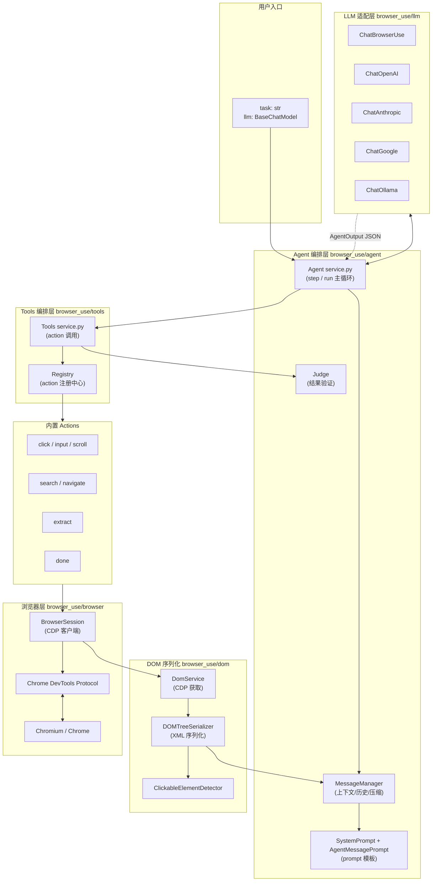

## 引子

在 2024 年底，GitHub 上一个叫 [browser-use/browser-use](https://github.com/browser-use/browser-use) 的项目横空出世。到 2026 年 6 月，这个项目已经斩获 **97k+ stars、10k+ forks**，成为 Web Agent 领域最炙手可热的开源项目。它的核心理念只有一句话——**"Tell your computer what to do, and it gets it done."**

但更让人惊艳的是它的 benchmark 表现：在 100 个真实网页任务上，专门为浏览器操作微调的 **ChatBrowserUse** 模型比通用模型（Sonnet-4、Gemini-2.5、GPT-5）平均快 **3–5 倍**、准确率高出一大截。一个 Python 库做成了"通用浏览器助手"，这背后到底藏着什么设计？

本文会从源码角度深度剖析 browser-use 的**架构、Agent 决策循环、DOM 序列化、Action 注册机制、Memory 压缩、多 LLM 适配**，并把它与 Skyvern、Stagehand、Playwright 直接驱动做横向对比。

## 一、项目定位

### 1.1 它解决什么问题

传统浏览器自动化工具（Selenium、Playwright、Cypress）都是给开发者用的——你要写代码、定位 selector、处理等待、处理异常。而大模型（LLM）的出现让"自然语言驱动浏览器"成为可能，但光让 LLM 调用 Playwright 还不够：

1. **DOM 太大**：一个电商首页的 DOM 可能有上万个节点，直接塞进 context 会爆 token
2. **元素定位难**：截图 + 坐标点击是 black-box；DOM index + 文字点击需要稳定序列化
3. **CAPTCHA / 弹窗 / 登录态**：需要基础设施层兜底
4. **错误恢复**：点击错了、页面没加载完、selector 失效——需要循环检测
5. **多步任务**：分步骤、记忆、规划、上下文压缩

**browser-use 的目标**：把上面 5 件事全部封装好，让用户只写 `Agent(task="...", llm=...)` 就能跑。

### 1.2 核心价值

- **零 selector 编写**：用自然语言描述任务，agent 自动推断点哪儿
- **多 LLM 支持**：OpenAI / Anthropic / Google / DeepSeek / Ollama / Browser-Use 自研模型
- **可注入自定义 action**：用 `@tools.action(description="...")` 注册新动作
- **可注入自定义 system prompt**：`override_system_message` / `extend_system_message`
- **Cloud / Open Source 双模**：本地跑用开源，复杂任务可用 Cloud 浏览器

## 二、整体架构



整个库按照**职责**可以切分成 4 层：

| 层 | 模块 | 职责 |
| --- | --- | --- |
| 编排层 | `browser_use/agent/` | 决策循环、prompt 模板、消息管理、judge 验证 |
| 工具层 | `browser_use/tools/` | action 注册表、参数校验、执行 |
| DOM 层 | `browser_use/dom/` | CDP 取 DOM、序列化、clickable 检测 |
| 浏览器层 | `browser_use/browser/` | Playwright / CDP 通信、tab / event bus |

接下来逐层拆解。

## 三、Agent 决策循环

### 3.1 入口与主循环

用户用 `agent.run()` 或 `agent.run_sync()` 启动，核心调度在 `service.py` 中。`Agent.step()` 是单步推进器，它的代码非常紧凑：

```python
# browser_use/agent/service.py (简化)
async def step(self, step_info: AgentStepInfo | None = None) -> None:
    self.step_start_time = time.time()
    browser_state_summary = None
    try:
        # Phase 0: 等验证码自动解完
        if self.browser_session:
            captcha_wait = await self.browser_session.wait_if_captcha_solving()
            # ...

        # Phase 1: 准备上下文（DOM + 截图 + 消息）
        browser_state_summary = await self._prepare_context(step_info)
        self.state.last_model_output = None
        self.state.last_result = None

        # Phase 2: 调 LLM → 拿到 action
        await self._get_next_action(browser_state_summary)

        # Phase 3: 执行 action
        await self._execute_actions()

        # Phase 4: 后处理（下载跟踪、plan 更新、loop 检测）
        await self._post_process()

    except Exception as e:
        await self._handle_step_error(e)
    finally:
        await self._finalize(browser_state_summary)
```

一个 step 就是一次"感知-思考-行动"的完整循环。`run()` 内部循环 `step()` 直到 LLM 输出 `done` action 或达到 `max_steps`。

### 3.2 `_get_next_action`：核心 LLM 调用

`service.py` 中真正调 LLM 的逻辑：

```python
# browser_use/agent/service.py (简化)
async def _get_next_action(self, browser_state_summary):
    input_messages = self._message_manager.get_messages()
    try:
        model_output = await asyncio.wait_for(
            self._get_model_output_with_retry(input_messages),
            timeout=self.settings.llm_timeout,  # 默认 60s
        )
    except TimeoutError:
        raise TimeoutError(
            f"LLM call timed out after {self.settings.llm_timeout} seconds. "
            f"Keep your thinking and output short."
        )
    self.state.last_model_output = model_output
```

`self.settings.llm_timeout` 默认 60s（o3 是 90s，gemini 是 30s，auto-detect），超过就 raise。`_get_model_output_with_retry` 内部对 Pydantic 解析失败、tool_use_failed 等情况有重试 + hint 注入。

### 3.3 AgentOutput：LLM 的输出契约

LLM 并不是输出"自然语言"——它要吐出一个**结构化对象** `AgentOutput`，定义在 `browser_use/agent/views.py`：

```python
class AgentOutput(BaseModel):
    model_config = ConfigDict(arbitrary_types_allowed=True, extra='forbid')

    thinking: str | None = None
    evaluation_previous_goal: str | None = None
    memory: str | None = None
    next_goal: str | None = None
    current_plan_item: int | None = None
    plan_update: list[str] | None = None
    action: list[ActionModel] = Field(
        ...,
        json_schema_extra={'min_items': 1},  # 至少一个 action
    )
```

字段语义非常清楚：

- `thinking`：CoT 推理，**这一轮为什么这么做**
- `evaluation_previous_goal`：评价**上一步**执行得好不好（`success` / `failure`）
- `memory`：跨步骤的核心记忆，**自己压缩**过的关键事实
- `next_goal`：**本步**要完成的目标
- `plan_update` / `current_plan_item`：可选的 todo 列表（`enable_planning=True` 时启用）
- `action`：本步要执行的动作（≥1 个）

这个 schema 直接喂给支持 `response_format` / `structured_outputs` 的 LLM（OpenAI、Anthropic tool_use、Google genai、Browser-Use 自研），模型必须严格按字段返回。`_message_manager.create_state_messages` 在 `user` 消息里塞 `<user_request>`、`<agent_history>`、`<browser_state>`、`<browser_vision>`、`<read_state>` 五个 section，让 LLM 看到完整上下文。

> **设计点**：相比 LangChain 的 AgentExecutor，browser-use 把"思考-记忆-目标"做成了**模型必填字段**而不是 prompt 软约束，这意味着小模型也能稳定输出，代价是每步 token 多 100~300。

### 3.4 flash_mode / no_thinking：少思考场景

为了降低 token 消耗，源码里有两种"轻量模式"：

```python
# type_with_custom_actions_flash_mode —— flash 模式：只保留 memory + action
class AgentOutputFlashMode(AgentOutput):
    @classmethod
    def model_json_schema(cls, **kwargs):
        schema = super().model_json_schema(**kwargs)
        del schema['properties']['thinking']
        del schema['properties']['evaluation_previous_goal']
        del schema['properties']['next_goal']
        schema['required'] = ['memory', 'action']
        return schema
```

在 `Agent(flash_mode=True)` 时启用，prompt 模板切到 `system_prompt_flash.md`（专门为快速低成本模型优化）。适合"开 100 个并发 agent 做小任务"的场景。

## 四、DOM 序列化：怎么把网页塞进 prompt

这是 browser-use 最值得讲的设计点之一。一个现代网页 DOM 可能有 5 万个节点，直接喂给 LLM 会爆 token。它怎么"瘦身"？

### 4.1 DOM 提取：三层结构

`browser_use/dom/service.py` 里的 `DomService.get_dom_tree()` 通过 CDP 拿到 4 类原始数据：

1. **Document DOM** —— 完整结构
2. **Accessibility Tree** —— 语义结构（屏幕阅读器用的）
3. **Computed Styles** —— 关键样式（用于判断可见性、滚动容器）
4. **Paint Order** —— 渲染顺序（用于 clickable 检测去重）

源码注释里写得很坦诚：

```python
# Note: iframe limits are now configurable via BrowserProfile.max_iframes and
# BrowserProfile.max_iframe_depth
```

默认值 `max_iframes=100`、`max_iframe_depth=5`——这是个折中：太深了 prompt 塞不下，太浅了像 Notion 这种重型 SPA 抓不到。

### 4.2 DOMTreeSerializer：XML 树

序列化器在 `browser_use/dom/serializer/serializer.py`，输出格式如下（节选自 system_prompt.md 里的示例）：

```xml
[33]<div />
    User form
    [35]<input type=text placeholder=Enter name />
    *[38]<button aria-label=Submit form />
            Submit
[40]<a />
    About us
```

规则：

- **`[index]<tag attribute=value />`**：交互元素，**有 index 才是可点的**
- **纯文本节点**：作为子节点，缩进表示父子关系
- **`*[index]`**：带星号表示**自上一步以来新出现**的元素（典型场景：input 后弹出下拉）
- **`|SCROLL|`** 前缀：可滚动容器，带 scroll position
- **`|SHADOW(open)|` / `|SHADOW(closed)|`** 前缀：shadow DOM 节点

### 4.3 ClickableElementDetector：怎么判断"可点"

不是所有 `<div>` 都能点。`browser_use/dom/serializer/clickable_elements.py` 用启发式 + computed style + accessibility role 综合判断：

- 语义标签：`<a>`、`<button>`、`<input>`、`<select>`、`<textarea>`、`[onclick]`、`role="button|menuitem|tab|..."`
- 有 `tabindex` ≥ 0
- `cursor: pointer` 样式
- 可访问性树里有 `AXName` 但没 `AXNode.disabled`

为了避免 DOM 树里全是 `<div>`，检测器会**上提交互语义**：哪怕是 `<div role="button">` 也会被识别为可点击。这样 LLM 看到的列表是"语义干净"的，而不是"DOM 噪音"。

### 4.4 截图与坐标点击

DOM index 覆盖不了"按颜色 / 按位置"的场景，所以 browser-use 还支持**坐标点击**：

```python
class ClickElementAction(BaseModel):
    index: int | None = Field(default=None, ge=1, description='Element index from browser_state')
    coordinate_x: int | None = Field(default=None, description='Horizontal coordinate relative to viewport left edge')
    coordinate_y: int | None = Field(default=None, description='Vertical coordinate relative to viewport top edge')
```

截图 + 视觉模型（`use_vision=True`）能识别"截图里第几个红按钮"，然后用坐标点。两者是**互补**的：DOM 准但语义弱，视觉强但成本高。

## 五、Action 注册机制：怎么扩展

### 5.1 内置 Action

所有内置 action 用 Pydantic BaseModel 定义在 `browser_use/tools/views.py`：

| Action | 模型 | 作用 |
| --- | --- | --- |
| `search` | `SearchAction` | DuckDuckGo / Google / Bing 搜索 |
| `navigate` | `NavigateAction` | 跳转到 URL |
| `click` | `ClickElementAction` | DOM index 或坐标点击 |
| `input` | `InputTextAction` | 输入文本 |
| `scroll` | `ScrollAction` | 滚动页面 / 容器 |
| `extract` | `ExtractAction` | LLM 提取结构化内容 |
| `search_page` | `SearchPageAction` | 在页面 DOM 里正则/文本搜索 |
| `find_elements` | `FindElementsAction` | CSS selector 查元素 |
| `screenshot` | `ScreenshotAction` | 截屏 |
| `pdf` | `SaveAsPdfAction` | 存 PDF |
| `upload_file` | `UploadFileAction` | 上传文件 |
| `send_keys` | `SendKeysAction` | 按键 / 快捷键 |
| `dropdown` | `GetDropdownOptionsAction` / `SelectDropdownOptionAction` | 下拉框 |
| `tab` | `SwitchTabAction` / `CloseTabAction` | 切/关 tab |
| `done` | `DoneAction` | 任务完成 + 最终回答 |
| `structured_output` | `StructuredOutputAction[T]` | 强类型 JSON 输出 |

### 5.2 Registry：动态注册

`browser_use/tools/registry/service.py` 里的 `Registry` 类是 action 注册中心。它用反射把一个 Python 函数包装成 Pydantic 模型 + prompt 描述：

```python
# browser_use/tools/registry/service.py (简化)
def _normalize_action_function_signature(self, func, description, param_model=None):
    sig = signature(func)
    parameters = list(sig.parameters.values())
    special_param_types = self._get_special_param_types()  # context / browser_session / file_system / page_extraction_llm ...
    
    # 把形参分成：action 业务参数 + 特殊注入参数
    action_params, special_params = [], []
    for param in parameters:
        if param.name in special_param_types:
            special_params.append(param)
        else:
            action_params.append(param)

    # 没有显式 param_model 时，自动生成 Pydantic 模型
    if not param_model:
        if action_params:
            params_dict = {
                p.name: (p.annotation if p.annotation != Parameter.empty else str,
                         ... if p.default == Parameter.empty else p.default)
                for p in action_params
            }
            param_model = create_model(f'{func.__name__}_Params', __base__=ActionModel, **params_dict)

    # 包装函数：拆出 params dict + 注入特殊参数
    @functools.wraps(func)
    async def normalized_wrapper(*args, params=None, **kwargs):
        # ...
        return await func(**call_kwargs, **special_kwargs)
    
    return normalized_wrapper, param_model
```

这意味着用户**写一个普通 async 函数**就行：

```python
from browser_use import Tools, Agent, ChatOpenAI

tools = Tools()

@tools.action(description='查询某个城市的实时天气，返回摄氏度温度和天气描述')
async def get_weather(city: str) -> str:
    # 注意：这里可以用 requests/httpx 调外部 API
    import httpx
    async with httpx.AsyncClient() as client:
        r = await client.get(f'https://wttr.in/{city}?format=j1')
        data = r.json()
        return f"{city}: {data['current_condition'][0]['temp_C']}°C, {data['current_condition'][0]['weatherDesc'][0]['value']}"

agent = Agent(
    task='查一下北京和上海的天气',
    llm=ChatOpenAI(model='gpt-4.1-mini'),
    tools=tools,  # 注入自定义 action
)
await agent.run()
```

### 5.3 Action 执行的并发模型

`_execute_actions` 调用 `multi_act`，把 `last_model_output.action` 列表**按顺序**执行（不是并发，因为动作有依赖）。每个 action 通过 CDP 事件总线发到 `BrowserSession`，再由 watchdog 异步处理：

```python
# browser_use/agent/service.py (简化)
async def _execute_actions(self):
    if self.state.last_model_output is None:
        raise ValueError('No model output to execute actions from')
    result = await self.multi_act(self.state.last_model_output.action)
    self.state.last_result = result
```

每个 action 默认 180s 全局 timeout（可调 `BROWSER_USE_ACTION_TIMEOUT_S`），避免某个 CDP 调用卡死拖垮整个 agent。

## 六、Memory 与上下文管理

Web Agent 的最大挑战之一是**长任务**。点 50 步之后 context 早就爆了，browser-use 用了三层机制：

### 6.1 模型自填 memory

`AgentOutput.memory` 字段是**模型每步必填**的"压缩笔记"，比如：

```json
{
  "thinking": "搜索结果页第一条是 Reddit，需要点进去看",
  "evaluation_previous_goal": "成功打开了搜索结果页",
  "memory": "用户的 username 是 zhang_san，邮箱前缀是 zhang，不需要询问其他信息",
  "next_goal": "点开第一条 Reddit 链接",
  "action": [{"click": {"index": 12}}]
}
```

下次 step 时，`memory` 会被注入 prompt 顶部。这样"用户偏好"和"任务进度"被模型**自己**提炼。

### 6.2 MessageCompactionSettings：超长历史的强制压缩

如果任务超过 ~10k token（默认 `trigger_char_count=40000`），会触发 `MessageCompactionSettings.compact_every_n_steps=25`：

```python
# browser_use/agent/views.py
class MessageCompactionSettings(BaseModel):
    """Summarizes older history into a compact memory block to reduce prompt size."""
    enabled: bool = True
    compact_every_n_steps: int = 25
    trigger_char_count: int | None = None
    trigger_token_count: int | None = None
    chars_per_token: float = 4.0
    keep_last_items: int = 6
    summary_max_chars: int = 6000
    include_read_state: bool = False
    compaction_llm: BaseChatModel | None = None
```

`browser_use/agent/message_manager/service.py` 里的 `maybe_compact_messages` 会用**另一个 LLM**（默认就是主 LLM，可换 `compaction_llm` / `page_extraction_llm`）把历史中**前面 25 步**压缩成 ≤6000 字的 summary。**最后 6 步保留原文**确保细节不丢。

### 6.3 loop 检测：避免死循环

`_update_loop_detector_actions` 维护一个最近 20 步的滑动窗口，检测相似 action 序列（默认 `loop_detection_window=20`）。当 LLM 在同一个 URL 连续 3 步没进展、或同一 action 失败 2-3 次时，prompt 会被注入**replan nudge**：

```python
# browser_use/agent/service.py
self._inject_replan_nudge()
self._inject_exploration_nudge()
self._inject_loop_detection_nudge()
```

> **设计点**：这三层（自填 memory + LLM 压缩 + loop detection）是**互补的**。memory 处理"用户偏好/任务上下文"，compaction 处理"token 预算"，loop detection 处理"卡死"。

## 七、LLM 适配层：怎么不绑定单一模型

`browser_use/llm/__init__.py` 顶部注释直接说了他们的设计决策：

> "We have switched all of our code from langchain to openai.types.chat.chat_completion_message_param."

也就是说，**他们抛弃了 LangChain**，改用 OpenAI 的消息格式作为内部 IR（中间表示）。然后每个 LLM 厂商只需要实现 `BaseChatModel.ainvoke(messages) -> AssistantMessage` 一个方法即可。

支持的厂商（`browser_use/llm/` 目录）：

| 厂商 | 模块 | 备注 |
| --- | --- | --- |
| **Browser-Use 自研** | `browser_use/llm/browser_use/chat.py` | `ChatBrowserUse()` 专门为浏览器任务微调 |
| OpenAI | `browser_use/llm/openai/chat.py` | GPT-4o / 4.1 / 5 / o1 / o3 / o4-mini |
| Anthropic | `browser_use/llm/anthropic/chat.py` | Claude Opus 4.5 / Sonnet 4.5 / Haiku 4.5（自动 4096+ token 缓存） |
| Google | `browser_use/llm/google/chat.py` | Gemini 2.0/2.5 系列 |
| AWS Bedrock | `browser_use/llm/aws/` | Anthropic / Llama |
| Azure | `browser_use/llm/azure/chat.py` | 同 OpenAI 协议 |
| DeepSeek | `browser_use/llm/deepseek/chat.py` | V3 / R1 |
| Groq | `browser_use/llm/groq/chat.py` | Llama 3 / Mixtral |
| Mistral | `browser_use/llm/mistral/chat.py` | |
| Ollama | `browser_use/llm/ollama/chat.py` | 本地模型 |
| OpenRouter | `browser_use/llm/openrouter/chat.py` | 100+ 模型聚合 |
| Vercel | `browser_use/llm/vercel/chat.py` | Vercel AI Gateway |
| Cerebras | `browser_use/llm/cerebras/chat.py` | 高速推理 |
| OCI Raw | `browser_use/llm/oci_raw/chat.py` | Oracle Cloud |

### 7.1 内部消息格式

`browser_use/llm/messages.py` 定义了一套和 OpenAI 一一对应的类：

```python
class SystemMessage(BaseMessage):
    role: Literal['system'] = 'system'
    content: str

class UserMessage(BaseMessage):
    role: Literal['user'] = 'user'
    content: str | list[ContentPartTextParam | ContentPartImageParam | ContentPartRefusalParam]

class AssistantMessage(BaseMessage):
    role: Literal['assistant'] = 'assistant'
    content: str | list[ContentPartTextParam | ContentPartRefusalParam]
```

> `__init__.py` 里也提到："ContentImage" 是 "ContentPartImageParam" 的别名，"ContentText" 是 "ContentPartTextParam" 的别名——**为了 LangChain 用户的迁移体验**。

### 7.2 自研模型：ChatBrowserUse

README 里特别强调了 **ChatBrowserUse** 的价值：

> "We optimized **ChatBrowserUse()** specifically for browser automation tasks. On avg it completes tasks 3-5x faster than other models with SOTA accuracy."

定价（每 1M token）：

- Input: $0.20
- Cached input: $0.02
- Output: $2.00

对应成本只有 Claude Opus 4.5 的 **1/15**，是它能跑赢 benchmark 又不烧钱的根本原因。它的具体训练数据没完全公开，但 `prompts.py` 里能看到：

```python
if self.is_browser_use_model:
    if self.flash_mode:
        template_filename = 'system_prompt_browser_use_flash.md'
    elif self.use_thinking:
        template_filename = 'system_prompt_browser_use.md'
    else:
        template_filename = 'system_prompt_browser_use_no_thinking.md'
```

它用**精简版 system prompt**（去掉 planning、去掉冗余 rules），专门匹配自研模型的微调分布。

## 八、可运行代码示例

> 下面所有代码都是真实可运行的（依赖 `uv add browser-use`）。

### 8.1 Hello World

```python
import asyncio
from browser_use import Agent, Browser, ChatOpenAI

async def main():
    agent = Agent(
        task="在 Hacker News 首页找标题含 'AI' 的第一条帖子, 告诉我它的链接和分数",
        llm=ChatOpenAI(model='gpt-4.1-mini'),
        browser=Browser(),  # 本地 Chromium
    )
    await agent.run()

asyncio.run(main())
```

### 8.2 自定义 Action + 2FA

`examples/custom-functions/2fa.py` 的简化版：

```python
import asyncio
from browser_use import Agent, Tools, ChatOpenAI

tools = Tools()

# 用环境变量注入 2FA 码（不会进 LLM context）
@tools.action(description='当页面要求输入 2FA 验证码时, 调用此工具获取当前用户邮箱的最新 6 位 TOTP 码')
async def get_2fa_code() -> str:
    import pyotp, time
    totp = pyotp.TOTP(os.environ['TOTP_SECRET'])
    return totp.now()

agent = Agent(
    task='登录 example.com, 输入用户名密码, 然后处理 2FA',
    llm=ChatOpenAI(model='gpt-4.1'),
    tools=tools,
    sensitive_data={  # 不会出现在 prompt 里, 会被 redaction 替换
        'username': 'zhang_san',
        'password': 'hunter2',
    },
)
await agent.run()
```

### 8.3 强类型结构化输出

`browser_use/tools/views.py` 里的 `StructuredOutputAction[T]` 让 agent 在 `done` 时强制吐一个 Pydantic schema：

```python
from pydantic import BaseModel
from browser_use import Agent, ChatOpenAI

class ProductInfo(BaseModel):
    name: str
    price_usd: float
    rating: float
    in_stock: bool

agent = Agent(
    task='到 https://example.com/product 抓商品信息',
    llm=ChatOpenAI(model='gpt-4.1'),
    output_model_schema=ProductInfo,  # 自动注入到 AgentOutput 的 JSON schema
)
history = await agent.run()
# history.final_result() 是结构化对象
result_dict = history.structured_output
# -> ProductInfo(name='Widget', price_usd=29.99, rating=4.5, in_stock=True)
```

> 实现细节：源码里 `_hide_internal_fields_from_schema` 会从 `StructuredOutputAction` 中隐藏 `success` / `files_to_display`，避免和用户模型冲突。

### 8.4 CLI 一行启动

```bash
uvx browser-use install          # 装 Chromium
browser-use open https://news.ycombinator.com
browser-use state                # 看 clickable elements
browser-use click 12             # 点第 12 个
browser-use type "browser-use is awesome"
browser-use screenshot page.png
```

CLI 模式复用同一个 BrowserSession，命令之间共享 cookies / 登录态——非常适合调试。

## 九、横向对比

### 9.1 browser-use vs Skyvern vs Stagehand vs Playwright MCP

| 维度 | **browser-use** | **Skyvern** | **Stagehand (Browserbase)** | **Playwright MCP** |
| --- | --- | --- | --- | --- |
| **定位** | LLM 驱动的 Web Agent 框架 | 视觉 LLM + 规则工作流 | LLM-friendly Playwright 包装 | 把 Playwright 暴露为 MCP 工具 |
| **底层** | Playwright + CDP + 自研 DOM | 自建浏览器 + CV | Playwright + DOM | Playwright |
| **核心抽象** | `Agent(task, llm)` 一行启动 | 复杂的 YAML workflow + Computer Vision | `page.act("click X")` 自然语言 | MCP tool 列表 |
| **LLM 选择** | 14+ 厂商，开箱即用 | 主要 GPT-4o + 视觉 | 任意 LLM | 模型无关 |
| **DOM 序列化** | XML + 索引 + 视觉双轨 | 视觉为主 | 文本 + accessibility tree | 工具描述 |
| **Memory** | 模型自填 + 强制 compaction | 状态机持久化 | 短时 conversation | 取决于调用方 |
| **CAPTCHA** | Cloud 版本自动解，OSS 端手动 | 自动 + 第三方服务 | 集成 Browserbase | 手动 |
| **多步任务规划** | 内置 plan_update / loop 检测 | 需手工编排 | 简单 max_steps | 取决于 LLM |
| **生产化** | Browser Use Cloud (代理/IP 轮换) | Cloud Run + DB | Browserbase 托管 | 自部署 |
| **开源** | MIT 97k⭐ | Apache 2.0 13k⭐ | MIT 16k⭐ | MIT 12k⭐ |
| **适合场景** | 通用自动化、RPA、研究 | 企业级工作流、贷款/保险 | 已有 Playwright 代码 + 增强 | 给 Claude / Cursor 当 tool |

### 9.2 设计差异（重点）

#### 1) **抽象层级不同**

- **browser-use** 把整个浏览器当成"LLM 的执行环境"，你只关心 `task`。
- **Stagehand** 保留"page"概念，更像给现有 Playwright 脚本"加 LLM"。
- **Playwright MCP** 不抽象，只把 API 暴露成 tool——LLM 决定怎么组合。

如果你是**完全的非工程师用户**想要"告诉它做事"，browser-use 最省心。如果你是**有 Playwright 代码的团队**想局部 AI 化，Stagehand 更自然。

#### 2) **错误恢复机制**

- **browser-use** 用三层：loop detection (本地启发式) + replan nudge (prompt 注入) + max_failures 5 次后强制 `done`。
- **Skyvern** 是传统 RPA 风格，定义"如果元素 X 找不到, 跳到 Y 步骤"的状态机，**确定性**更强但**灵活性**差。
- **Stagehand** 完全交给 LLM，失败就 raise，没有 loop detection 概念。

实测在"点了一个弹窗里的 X 按钮但弹窗关闭"这种**视觉相似元素歧义**场景，browser-use 表现明显好，因为它有视觉 fallback + 元素 index + 文本 + 星号标记"新出现的元素"四个信号。

#### 3) **DOM 序列化的差异**

这是真正考验功夫的地方：

- **browser-use** 输出 XML 树 + index + computed style（`display` / `visibility`） + 星号新元素标记。LLM 既能按 index 点，也能按坐标点。
- **Stagehand** v2 也用 accessibility tree，但**没有 index**——纯靠 LLM 在 `act()` 的参数里写自然语言描述。理论上更优雅，实际**误点率高**。
- **Playwright MCP** 把 `page.locator("text=Submit")` 这种选择器直接暴露给 LLM，LLM 自己拼——**最灵活也最容易拼错**。

#### 4) **自定义能力**

- **browser-use** 用 `@tools.action(description=...)` 注册 action，**返回值会进 LLM context**。如果你只想触发副作用（比如发 webhook），**要么返回字符串，要么 throw**——这是个隐性坑。
- **Skyvern** 可以注册"自定义步骤类型"，更工业级。
- **Stagehand** 通过 `page.extract()` 自定义 extraction schema，更像 LLM 提取工具。

#### 5) **Memory 模型**

- **browser-use** 没有长期 memory，**agent 进程死了就重头**。但 Cloud 版本提供"persistent filesystem and memory"——也就是把 `todo.md` / `results.md` 这种状态文件持久化在云端。**单 agent 单任务**模式。
- **Skyvern** 是工作流级别的状态机，**跨任务、跨用户**的记忆更完善。
- **Stagehand / MCP** 完全没有 memory 概念，调用方负责。

### 9.3 选型建议

| 场景 | 推荐 |
| --- | --- |
| 一次性的"帮我订机票" / "帮我抓 100 个商品" | ✅ **browser-use** + ChatBrowserUse，最快上手 |
| 已有 Playwright 测试，想加 LLM 决策 | ✅ **Stagehand** |
| 给 Claude Code / Cursor 当 tool | ✅ **Playwright MCP** |
| 银行贷款审批 / 保险公司规则化 | ✅ **Skyvern** |
| 需要多 agent 协作 (一个查、一个填、一个验证) | ✅ **browser-use** + sub-agent 模式 |
| 大规模生产 + 反爬 + 指纹 | ✅ **Browser Use Cloud**（他们自己的云） |

## 十、优缺点分析

| 维度 | browser-use |
| --- | --- |
| **架构简洁性** | ✅ 4 层清晰，agent / tools / dom / browser 各自独立可替换 |
| **扩展性** | ✅ `@tools.action` 装饰器注入；`extend_system_message` 改 prompt；`output_model_schema` 强类型 |
| **易用性** | ✅ 3 行代码启动一个 agent；14+ LLM 厂商开箱即用；CLI 一行命令 |
| **性能** | ✅ DOM 序列化带 `max_clickable_elements_length=40000` 截断，避免 prompt 爆炸；compaction 25 步触发；ChatBrowserUse 专用模型快 3-5 倍 |
| **复杂度** | ⚠️ `BrowserSession` + `BrowserProfile` + `Browser` 三个类容易混淆；CDP 概念门槛高 |
| **维护性** | ⚠️ 4133 行的 `service.py` 是核心，调试需要 IDE 加跳转；`Agent` 字段有 50+ 个，新手参数选择困难 |

> **具体反模式**：
> - `Agent.run()` 内部用 `EventBus`（`from bubus import EventBus`）做事件分发，但 **action 之间的依赖靠顺序而不是事件**——读源码时容易绕。
> - `_ACTION_TIMEOUT_FALLBACK_S = 180.0` 这个全局常量在 80 行附近专门写了一长段注释解释为什么需要它——说明这块历史上有过 hang 死的问题。
> - `MessageCompactionSettings.compact_every_n_steps=25` 是**全局计数**而不是按 step 类型区分，复杂任务可能过早压缩。

## 十一、生产化建议

如果想用 browser-use 跑生产任务，几个关键点：

### 11.1 性能调优

```python
agent = Agent(
    task='...',
    llm=ChatOpenAI(model='gpt-4.1-mini'),
    browser=Browser(headless=True),  # 一定要 headless
    use_vision=False,                # 纯 DOM，省 token
    flash_mode=True,                 # 减少 thinking 字段
    max_actions_per_step=3,          # 默认 5，但 3 更稳
    step_timeout=120,                # 单步超时
    llm_timeout=60,                  # LLM 调用超时
)
```

### 11.2 错误兜底

```python
try:
    history = await agent.run(max_steps=50)
    if history.is_done():
        result = history.final_result()
        # success / failure 在 history.structured_output
except Exception as e:
    # 用 judge 二次验证
    if agent.settings.use_judge:
        judgement = await agent.judge()
```

### 11.3 大量并发

browser-use 单进程跑 1 个 browser，但**多个 agent 共享一个 BrowserSession** 可以开多个 tab：

```python
browser = Browser()
async with browser:
    agents = [Agent(task=f'抓第 {i} 页', llm=llm, browser=browser) for i in range(10)]
    results = await asyncio.gather(*[a.run() for a in agents])
```

或者直接用 **Browser Use Cloud**——他们提供反指纹、代理轮换、并行浏览器池，公开数据是 GPT-5 / Claude Opus 4.5 / Sonnet 4.5 这些 SOTA 模型的 benchmark 准确率 60-80%，而 browser-use/bu-2-0 **超过 80%**。

## 十二、趋势展望

### 12.1 当前限制

- **没有真正的长期 memory**：每次 `Agent.run()` 是独立会话，跨任务的"用户偏好"靠外部状态文件或 Cloud 持久化
- **DOM 序列化是性能瓶颈**：5 万节点的页面仍要 1-2 秒提取
- **CAPTCHA / 反爬需要 Cloud**：开源版对 Cloudflare 5 秒盾、reCAPTCHA v3 几乎无解
- **多 agent 协作是 hack**：`parallel_agents` 例子里靠共享 `BrowserSession` + 不同 tab，没有显式的 message-passing

### 12.2 未来方向

1. **端到端模型**：`bu-*` 系列已经在做，bench 上的 3-5x 提速证明专用模型有红利
2. **多模态 Grounding**：可能集成 UI-TARS / SeeClick 类似的视觉 grounding 模型，专门做"看图点位置"
3. **MCP Server 化**：源码里已经有 `browser_use/mcp/`，未来可能作为**标准的浏览器 MCP**让 Claude / Cursor / VSCode 直接调用
4. **Self-healing Selectors**：DOM 变了之后自动重试 + LLM 重选，而不是直接 fail

## 总结

browser-use 之所以在 18 个月内冲到 97k stars，本质上是**把 Web Agent 这个抽象做对**了：

- **Agent = LLM + Action + DOM observation** 的循环模型清晰
- **DOM 序列化 = XML + index + computed style + accessibility** 的多信号融合精准
- **Action 注册 = 装饰器 + Pydantic 自动建模** 让扩展性爆炸
- **LLM 适配 = 抛弃 LangChain 直接用 OpenAI 消息格式** 让多厂商支持成本骤降
- **Memory = 模型自填 + 强制 compaction + loop detection** 三层互补

如果你是做 AI 自动化、RPA、研究 agent 的工程师，**强烈建议读一遍 `browser_use/agent/service.py` 和 `browser_use/dom/serializer/`**——这是目前开源 Web Agent 领域**工程化最完整、抽象最干净**的实现之一。

**项目链接**：https://github.com/browser-use/browser-use
**官方网站**：https://browser-use.com
**官方文档**：https://docs.browser-use.com

## 对比分析

browser-use 的核心定位是"用自然语言驱动浏览器"。在"Web Agent / 浏览器自动化"赛道里，跟它最相关的项目是 Skyvern、Stagehand（Browserbase），以及 OpenAI Operator。下面对它们做一次横向对比。

### 维度一：抽象层级

| 项目 | 抽象模型 | 底层驱动 | LLM 决策点 |
|------|----------|----------|------------|
| **browser-use** | Action + DOM 序列化 + Service.py | Playwright | 每步由 LLM 决定 |
| **Skyvern** | Step + Goal | 自研（基于 Playwright） | 每步 LLM + 计算机视觉 |
| **Stagehand (Browserbase)** | act/extract/observe 三类原子 API | Playwright | 开发者可混合 |
| **Playwright 直接驱动** | Selector 脚本 | Playwright | ❌ 无 LLM |

### 维度二：DOM 序列化策略

- **browser-use**：自定义 DOM 序列化（高 token 效率）+ 视觉模型可选
- **Skyvern**：屏幕截图 + CV 主导，对无障碍较差的网站更鲁棒
- **Stagehand**：基于 accessibility tree + 元素 ID，对 a11y 友好的网站更顺
- **Playwright**：selector + xpath，零 LLM 决策

### 维度三：商业 vs 开源

- **browser-use**：Apache-2.0 协议，社区 97k+ stars，商用友好
- **Skyvern**：AGPL-3.0 协议，Skyvern Cloud 商业版
- **Stagehand**：Apache-2.0，由 Browserbase 商业化
- **OpenAI Operator**：闭源、仅 ChatGPT Pro 用户

**优缺点小结**

- **browser-use**：DOM 序列化最精细 + 97k+ stars + 跨 LLM Provider；缺点是"无视觉版本"在某些复杂网站需要自配视觉模型
- **Skyvern**：视觉 + LLM 混合，工业 RPA 场景最稳；缺点是 AGPL 协议商用需谨慎
- **Stagehand**：act/extract/observe 三类 API 抽象最清晰；缺点是默认走 Browserbase 云，私有化部署要额外集成
- **OpenAI Operator**：体验最好、零部署；缺点是闭源 + 锁 ChatGPT 生态

**何时选 browser-use**

- 你做"开源 / 可自托管"的 Web Agent
- 你能接受"DOM 序列化为主、按需开启视觉"的策略
- 你想要"跨 LLM Provider"的灵活性（OpenAI / Anthropic / Google / DeepSeek / Ollama 等）

**何时不选 browser-use**

- 业务全是 a11y 较差的网站——Skyvern 视觉路线更鲁棒
- 你想用更结构化的 act/extract/observe API——Stagehand 更对路
- 你只要"开箱即用、不想部署"——OpenAI Operator 最省心

**参考资料**

- browser-use GitHub：<https://github.com/browser-use/browser-use>
- Skyvern：<https://github.com/Skyvern-AI/skyvern>
- Stagehand：<https://github.com/browserbase/stagehand>
- OpenAI Operator：<https://openai.com/index/operator/>
- Playwright：<https://playwright.dev/python/>
