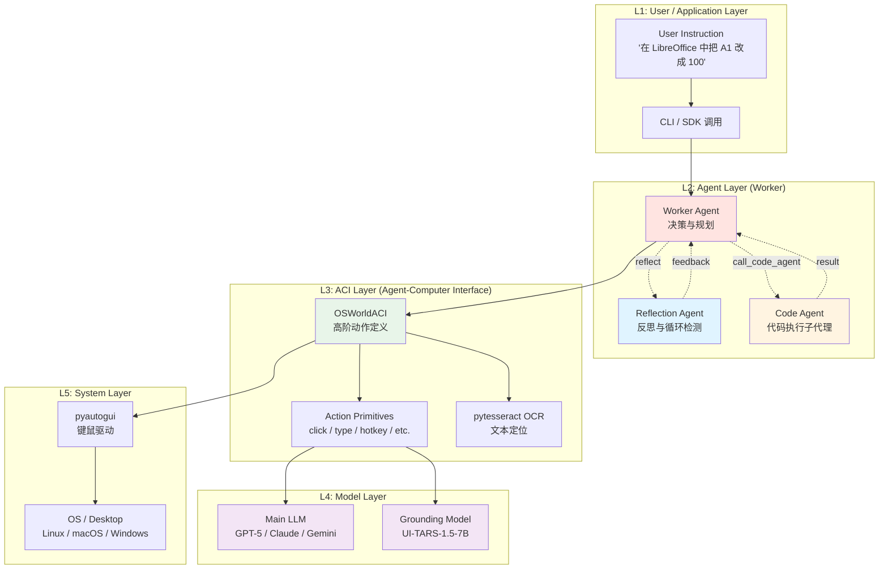
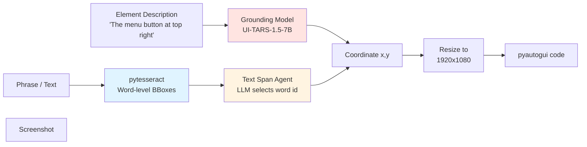
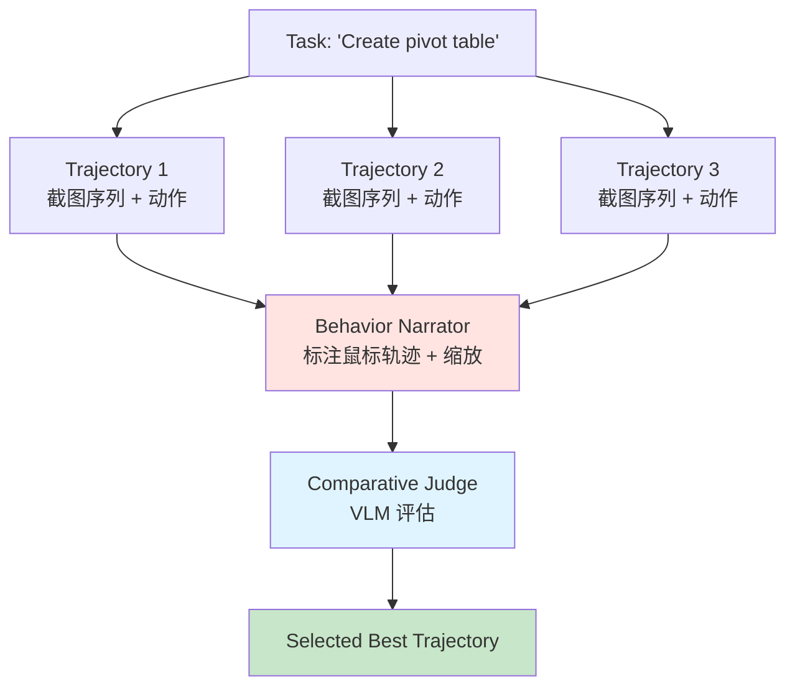

## 一、引子：当 LLM 开始"像人一样"操作电脑

2024 年底，Anthropic 和 OpenAI 相继发布 Computer-Use 功能，让大模型直接通过屏幕截图操作电脑成为现实。但它们都是闭源服务，价格昂贵、无法定制，也难以复现。开源社区急需一个**透明、可定制、效果可媲美商业方案**的替代品。

**Simular AI 推出的 Agent-S** 正是这一赛道的代表作。2025 年 10 月，Agent S3 以 **69.9%** 刷新 OSWorld 榜单 SOTA；2025 年 12 月，配合 Behavior Best-of-N（bBoN）策略后达到 **72.6%**——**首次超越人类约 72% 的水平**。该论文 `The Unreasonable Effectiveness of Scaling Agents for Computer Use`（arXiv: 2510.02250）已被社区广泛关注。

更关键的是，Agent-S 提供了一个**通用的 Agent-Computer Interface (ACI)**，把"自然语言 → 屏幕坐标"这个核心难题做了完整封装。本文将逐层拆解它的架构设计、过程记忆机制、ACI 接口规范以及 Behavior Best-of-N 创新点。

## 二、项目概览：Agent-S 是什么

### 2.1 基本信息

| 项目 | 详情 |
|------|------|
| 仓库 | https://github.com/simular-ai/Agent-S |
| 协议 | Apache License 2.0 |
| 主语言 | Python |
| ⭐ Stars | 11.7k+ |
| 论文 | S1 (ICLR 2025)、S2 (COLM 2025)、S3 (arXiv:2510.02250) |
| 核心包名 | `gui-agents`（已发布到 PyPI） |
| 支持平台 | Linux / macOS / Windows |
| 评估基准 | OSWorld、WindowsAgentArena、AndroidWorld |

### 2.2 进化路线

Agent-S 已经迭代到第三代，每一代都对应一个核心架构转变：

| 版本 | 架构核心 | OSWorld 成绩 | 论文/发表 |
|------|---------|-------------|-----------|
| **S1** | Manager-Worker 双层 + DAG 任务分解 + 经验检索 | 20.58% | ICLR 2025 |
| **S2** | 通用-专家组合框架（Compositional Generalist-Specialist）| 48.8% | COLM 2025 |
| **S2.5** | 简化整合 | 50.7% | - |
| **S3** | 单 Worker + Reflection 反思 + 可选 Code Agent | 69.9% | arXiv 2510.02250 |
| **S3 + bBoN** | Behavior Best-of-N 多轨迹选择 | **72.6%**（超人类）| 同上 |

> **核心洞察**：从 S1 到 S3，作者发现"少即是多"——当 Worker 直接面对屏幕、少一层 Manager 时，配合"反思 + 经验检索"反而能拿到更高分。这与 LangGraph、AutoGen 等动辄多 Agent 编排的潮流形成鲜明对比。

## 三、核心架构：四层结构

整个框架（以 S3 为例）可以分为四层：



### 3.1 Worker：扁平化决策核心

S3 的 Worker 是整个系统的"大脑"，但与 S1/S2 显著不同——**它没有 Manager 上层调度**。这是 S3 的核心架构选择。

**核心代码**（`gui_agents/s3/agents/worker.py`）：

```python
class Worker(BaseModule):
    def __init__(self, worker_engine_params, grounding_agent,
                 platform="ubuntu", max_trajectory_length=8,
                 enable_reflection=True):
        super().__init__(worker_engine_params, platform)
        self.grounding_agent = grounding_agent
        self.max_trajectory_length = max_trajectory_length
        self.enable_reflection = enable_reflection
        # 支持 Claude 系列的 thinking 模式
        self.use_thinking = worker_engine_params.get("model", "") in [
            "claude-opus-4-20250514", "claude-sonnet-4-20250514",
            "claude-3-7-sonnet-20250219", "claude-sonnet-4-5-20250929",
            "claude-opus-4-5-20251101",
        ]
        self.reset()

    def generate_next_action(self, instruction, obs):
        self.grounding_agent.assign_screenshot(obs)
        self.grounding_agent.set_task_instruction(instruction)

        # 1. 生成反思（基于上一步）
        reflection, reflection_thoughts = self._generate_reflection(instruction, obs)

        # 2. 拼装 generator 消息：反思 + 当前 Text Buffer + 上次 Code Agent 结果
        generator_message = ""
        if reflection:
            generator_message += f"REFLECTION: ...{reflection}...\n"
        generator_message += f"Current Text Buffer = [{','.join(self.grounding_agent.notes)}]\n"

        # 3. 调用 LLM 生成下一步动作
        format_checkers = [
            SINGLE_ACTION_FORMATTER,
            partial(CODE_VALID_FORMATTER, self.grounding_agent, obs),
        ]
        plan = call_llm_formatted(
            self.generator_agent, format_checkers,
            temperature=self.temperature, use_thinking=self.use_thinking
        )

        # 4. 解析并生成可执行代码
        plan_code = parse_code_from_string(plan)
        exec_code = create_pyautogui_code(self.grounding_agent, plan_code, obs)
        return executor_info, [exec_code]
```

**关键设计**：
- **扁平化结构**：没有 Manager-Worker 层次，Worker 直接消费截图、生成动作；
- **Context 截断策略**（`flush_messages`）：长上下文模型保留所有文字但只保留最近 N 张图，节省 token；
- **三种角色共存**：Worker 主决策 + Reflection 反思 + Code Agent 兜底数据处理。

### 3.2 Reflection Agent：循环检测与反思

Reflection 是个**轻量但效果显著**的设计。它独立于 Worker，使用同一组多模态 LLM，但专注判断：

1. **是否在死循环**（Case 1）：重复点击同一个按钮、反复重开同一个菜单等
2. **是否按计划推进**（Case 2）：轨迹正常，鼓励继续
3. **是否任务已完成**（Case 3）：直接告诉 Worker 可以收工

对应的提示词（`gui_agents/s3/memory/procedural_memory.py`）：

```python
REFLECTION_ON_TRAJECTORY = textwrap.dedent("""
You are an expert computer use agent designed to reflect on the trajectory of a task
and provide feedback on what has happened so far.

Your task is to generate a reflection. Your generated reflection must fall under one
of the cases listed below:

Case 1. The trajectory is not going according to plan. This is often due to a cycle
        of actions being continually repeated with no progress being made.
Case 2. The trajectory is going according to plan.
Case 3. You believe the current task has been completed.

To be successful, you must follow the rules below:
- **Your output MUST be based on one of the case options above**.
- DO NOT suggest any specific future plans or actions.
- Any response that falls under Case 1 should explain why the trajectory is not going
  according to plan. You should especially lookout for cycles of actions that are
  continually repeated with no progress.
- IMPORTANT: Do not assume file modifications or application restarts are errors -
  they may be legitimate code agent actions
""")
```

**为什么 Reflection 有效？** 经验上 GUI Agent 经常陷入"打开文件→关掉→又打开→又关掉"这种死循环。一个独立的反思视角能稳定打破这种循环，而不需要修改主 Worker 的策略。

### 3.3 Code Agent：GUI 之外的"数据处理后门"

S3 的另一大创新是引入 **Code Agent**——一个可调用的 Python/Bash 执行子代理。当任务涉及"批量数据处理、计算、文件修改"时，Worker 可以让位给 Code Agent 跑代码，比一格格点 GUI 效率高数十倍。

**关键代码**（`gui_agents/s3/agents/code_agent.py`）：

```python
class CodeAgent:
    """A dedicated agent for executing code with a budget of steps."""

    def __init__(self, engine_params, budget=20):
        self.engine_params = engine_params
        self.budget = budget
        self.reset()

    def execute(self, task_instruction, screenshot, env_controller):
        # 重置状态、装入任务
        self.reset()
        self.agent.add_message(
            f"Task: {task_instruction}",
            image_content=screenshot, role="user"
        )

        step_count = 0
        execution_history = []

        while step_count < self.budget:
            # 获取 LLM 响应
            response = call_llm_safe(self.agent, temperature=1)

            # DONE / FAIL / BUDGET_EXHAUSTED 终止条件
            action, thoughts = split_thinking_response(response)
            execution_history.append({"step": step_count+1, "action": action, ...})

            if action.upper() == "DONE":
                return {"completion_reason": "DONE", ...}
            elif action.upper() == "FAIL":
                return {"completion_reason": "FAIL", ...}

            # 提取代码块并执行
            code_type, code = extract_code_block(action)
            result = execute_code(code_type, code, env_controller)
            # 把执行结果反馈给 LLM
            self.agent.add_message(format_result(result, step_count), role="user")
            step_count += 1

        return {"completion_reason": "BUDGET_EXHAUSTED", ...}
```

**典型分工**：
- 打开 LibreOffice Calc → **GUI Agent**
- 批量填充/计算单元格 → **Code Agent**（`openpyxl` 一行解决）
- 保存并关闭文件 → **GUI Agent**（确认视觉效果）

**给 Worker 的提示**（过程记忆片段）：

```text
### Code Agent
You have access to a code agent that can execute Python/Bash code for complex tasks.

Use code agent for:
- **ALL spreadsheet calculations**: sums, totals, averages, formulas, data filling
- **ALL data manipulation tasks**: calculations, processing (filtering, sorting,
  replacing, cleanup), bulk operations, formatting changes, large-scale data entry

- **Full Task**: Use `agent.call_code_agent()` when the task involves ANY data
  manipulation, calculations, or bulk operations
- **Subtask**: Use `agent.call_code_agent("specific subtask")` for focused data tasks
- **CRITICAL**: If calling the code agent for the full task, pass the original task
  instruction without rewording or modification
```

## 四、关键机制：过程记忆（Procedural Memory）

### 4.1 什么是过程记忆

传统 RAG 把"事实"塞进向量库，但 Agent-S 反其道而行——把**操作系统的"操作字典"**直接拼进 System Prompt。这些过程记忆是**经实验调优的固定文本**，不是从经验里检索。

**位置**：`gui_agents/s3/memory/procedural_memory.py`

### 4.2 Worker 的过程记忆

```python
@staticmethod
def construct_simple_worker_procedural_memory(agent_class, skipped_actions):
    procedural_memory = textwrap.dedent("""\
    You are an expert in graphical user interfaces and Python code. You are
    responsible for executing the task: `TASK_DESCRIPTION`. You are working in CURRENT_OS.

    # GUIDELINES
    ## Agent Usage Guidelines
    ...

    You are provided with:
    1. A screenshot of the current time step.
    2. The history of your previous interactions with the UI.
    3. Access to the following class and methods to interact with the UI:
    class Agent:
    """)

    # 动态反射 ACI 类的方法签名（核心创新点）
    for attr_name in dir(agent_class):
        if attr_name in skipped_actions:
            continue
        attr = getattr(agent_class, attr_name)
        if callable(attr) and hasattr(attr, "is_agent_action"):
            signature = inspect.signature(attr)
            procedural_memory += f"""
    def {attr_name}{signature}:
    '''{attr.__doc__}'''
    """

    # 输出格式约束
    procedural_memory += """
    Your response should be formatted like this:
    (Previous action verification)
    (Screenshot Analysis)
    (Next Action)
    (Grounded Action)
    ```python
    agent.click(...)
    ```
    """

    return procedural_memory.strip()
```

**精妙之处**：用 `inspect.signature` 反射 ACI 类的所有 `@agent_action` 装饰的方法，把方法签名 + docstring **动态拼成** LLM 看到的 API 文档。这等于让"代码即文档"——你给 ACI 加新动作，过程记忆自动更新。

### 4.3 经验检索（仅 S1/S2 有，S3 简化为反思）

S1/S2 中 Manager 会从本地 KB 检索历史经验：

```python
# s1/core/Knowledge.py 关键逻辑
self.episodic_memory_path = os.path.join(local_kb_path, platform, "episodic_memory.json")
self.narrative_memory_path = os.path.join(local_kb_path, platform, "narrative_memory.json")
self.embeddings_path = os.path.join(local_kb_path, platform, "embeddings.pkl")

# 用 OpenAI Embedding 计算相似度
most_similar_task, retrieved_experience = self.knowledge_base.retrieve_narrative_experience(
    instruction
)
```

**S3 简化**：作者发现 S3 在没有知识库的情况下反而表现更好（"less is more"），所以 S3 直接砍掉了 KB，改为靠 Reflection 兜底。

## 五、Agent-Computer Interface (ACI) 设计

### 5.1 设计哲学

ACI 是 Agent-S 最具复用价值的部分。它**把"自然语言意图"和"具体屏幕坐标"解耦**：

- **意图层**：Worker 输出 `agent.click("The menu button at the top right of the window", 1, "left")`
- **坐标层**：ACI 内部调用 Grounding Model，把"top right of the window" 翻译成 `[1820, 45]`
- **执行层**：再用 pyautogui 在真实屏幕上点击

### 5.2 核心动作

`gui_agents/s3/agents/grounding.py` 定义的高阶动作（节选）：

```python
@agent_action
def click(self, element_description: str, num_clicks: int = 1,
          button_type: str = "left", hold_keys: List = []):
    """Click on the element
    Args:
        element_description: str, a detailed descriptions of which element to click on.
        num_clicks: int, number of times to click the element
        button_type: str, which mouse button to press can be "left", "middle", or "right"
        hold_keys: List, list of keys to hold while clicking
    """
    coords1 = self.generate_coords(element_description, self.obs)
    x, y = self.resize_coordinates(coords1)
    command = "import pyautogui; "
    for k in hold_keys:
        command += f"pyautogui.keyDown({repr(k)}); "
    command += f"pyautogui.click({x}, {y}, clicks={num_clicks}, button={repr(button_type)}); "
    for k in hold_keys:
        command += f"pyautogui.keyUp({repr(k)}); "
    return command

@agent_action
def switch_applications(self, app_code: str):
    """Switch to a different application that is already open"""
    if self.platform == "darwin":
        return f"import pyautogui; import time; pyautogui.hotkey('command', 'space', ...)"
    elif self.platform == "linux":
        return UBUNTU_APP_SETUP.replace("APP_NAME", app_code)
    elif self.platform == "windows":
        return f"import pyautogui; import time; pyautogui.hotkey('win', 'd', ...); pyautogui.typewrite({repr(app_code)}); ..."
```

**跨平台分发的优雅方式**：用同一个 `switch_applications` 方法，根据 `self.platform` 返回不同平台的 pyautogui 代码字符串，**避免子类化**。

### 5.3 双路 Grounding：UI-TARS + OCR

坐标生成是 ACI 的核心难题。Agent-S 用**两个互补的 grounding 通道**：



**通道一：UI-TARS Grounding（视觉）**

```python
def generate_coords(self, ref_expr: str, obs: Dict) -> List[int]:
    self.grounding_model.reset()
    prompt = f"Query:{ref_expr}\nOutput only the coordinate of one point in your response.\n"
    self.grounding_model.add_message(
        text_content=prompt, image_content=obs["screenshot"], put_text_last=True
    )
    response = call_llm_safe(self.grounding_model)
    numericals = re.findall(r"\d+", response)
    assert len(numericals) >= 2
    return [int(numericals[0]), int(numericals[1])]
```

UI-TARS 是 ByteDance 专门为 UI grounding 训练的多模态模型，输入截图 + 自然语言描述，**直接输出 (x, y) 坐标**。

**通道二：OCR 文本对齐（精确）**

```python
def get_ocr_elements(self, b64_image_data: str) -> Tuple[str, List]:
    image = Image.open(BytesIO(b64_image_data))
    image_data = pytesseract.image_to_data(image, output_type=Output.DICT)
    # 构造 id -> text 的表格
    ocr_table = "Text Table:\nWord id\tText\n"
    for i, word in enumerate(image_data["text"]):
        if word:
            ocr_elements.append({
                "id": ocr_id, "text": word,
                "left": ..., "top": ..., "width": ..., "height": ...
            })
            ocr_table += f"{ocr_id}\t{word}\n"
            ocr_id += 1
    return ocr_table, ocr_elements
```

对**纯文本按钮**（如菜单、Tab 名），用 OCR 找词位置更准；对**图标、控件**用 UI-TARS 更好。两条通道互补。

**坐标归一化**：

```python
def resize_coordinates(self, coordinates: List[int]) -> List[int]:
    grounding_width = self.engine_params_for_grounding["grounding_width"]
    grounding_height = self.engine_params_for_grounding["grounding_height"]
    return [
        round(coordinates[0] * self.width / grounding_width),
        round(coordinates[1] * self.height / grounding_height),
    ]
```

UI-TARS 默认输出 1920x1080 坐标系。如果你的屏幕是 2560x1440，要做线性缩放。

## 六、Behavior Best-of-N (bBoN) —— 超越人类的最后一公里

S3 论文最惊艳的发现：**用 Behavior Narrator + Comparative Judge 在多轨迹里选最好的，准确率从 69.9% 提升到 72.6%，首次超过人类**。

### 6.1 整体流程



### 6.2 Behavior Narrator：让 VLM 看见"鼠标轨迹"

GUI Agent 失败时，**仅看最终截图**很难判断是哪里错了——可能 N 步之前就走偏了。Behavior Narrator 把鼠标动作在截图上**可视化标记**：

```python
@staticmethod
def mark_action(mouse_actions: list[str], img: Image):
    draw = ImageDraw.Draw(img)
    font = ImageFont.load_default(25)
    
    for mouse_action in mouse_actions:
        width, height = parse_coords(mouse_action)  # 解析 (x, y)
        # 边界裁剪
        width = max(0, min(img.width - 1, width))
        height = max(0, min(img.height - 1, height))
        
        if mouse_action.startswith("pyautogui.click"):
            draw.circle((width, height), radius=3, fill=(255, 0, 0))
            draw.text((width, height), "Click", fill=(255, 0, 0), font=font)
        elif mouse_action.startswith("pyautogui.moveTo"):
            draw.circle((width, height), radius=3, fill=(0, 0, 255))
        elif mouse_action.startswith("pyautogui.dragTo"):
            draw.line([(start_x, start_y), (width, height)], fill=(0, 255, 0), width=2)
            draw.circle((width, height), radius=3, fill=(0, 255, 0))
```

**红圈=Click、蓝圈=MoveTo、绿线=Drag**。Judge 模型一看就知道"哦原来第 5 步点错地方了"。

另外 Narrator 还会对**关键坐标周围做局部放大**（默认 300×300 裁剪 + 4× 上采样），让 VLM 看清小图标：

```python
@staticmethod
def get_zoomed_image(image_bytes, x, y, width=300, height=300,
                     upscaling=True, scale=4):
    """Returns a zoomed image centered around (x, y) coordinates."""
    # 裁剪 + 上采样到 (300*4, 300*4)
    ...
```

### 6.3 Comparative Judge：N 选 1

```python
class ComparativeJudge:
    def __init__(self, engine_params):
        self.judge_agent = LMMAgent(engine_params=engine_params)

    def judge(self, task_description, task, result_dirs, all_fact_captions):
        # 1. 装入 VLM_EVALUATOR_PROMPT_COMPARATIVE_BASELINE
        # 2. 把每条轨迹的 initial_screenshot + final_screenshot 拼成 messages
        # 3. 把 Behavior Narrator 标注的 fact_captions 一并塞入
        # 4. 让 Judge 输出 1~N 的整数
        response = call_llm_formatted(self.judge_agent, [], messages=messages)
        judge_choice = int(response)
        return result_dirs[judge_choice - 1]
```

**关键**：Judge 不是简单看"最终截图谁更正确"，而是看**初始截图 + 最终截图 + 鼠标标注轨迹**三件套联合判断，因此能稳定挑出"过程也合理"的最佳轨迹。

**实测效果**（论文数据）：

| 设置 | OSWorld | WindowsAgentArena | AndroidWorld |
|------|---------|-------------------|--------------|
| S3 only | 66% | 50.2% | 68.1% |
| S3 + bBoN (3 candidates) | 72.6% | 56.6% | 71.6% |
| 人类水平 | ~72% | - | - |

## 七、可运行代码示例

下面是端到端使用 Agent S3 的最小可运行示例（需先 `pip install gui-agents pyautogui pytesseract`）：

```python
"""
最小可运行示例：让 Agent S3 关闭当前打开的 VS Code
依赖：pip install gui-agents pyautogui pillow python-dotenv
"""
import os
import io
import pyautogui
from dotenv import load_dotenv

# 0. 加载 API Key
load_dotenv()  # 或者直接 os.environ["OPENAI_API_KEY"] = "sk-..."

# 1. 配置主决策模型
engine_params = {
    "engine_type": "openai",
    "model": "gpt-5-2025-08-07",
    "temperature": 0.0,
}

# 2. 配置 Grounding 模型（需要自己部署 UI-TARS-1.5-7B）
engine_params_for_grounding = {
    "engine_type": "huggingface",
    "model": "ui-tars-1.5-7b",
    "base_url": "http://localhost:8080",  # 你的 TGI/vLLM endpoint
    "grounding_width": 1920,
    "grounding_height": 1080,
}

# 3. 初始化 ACI 和 Agent
from gui_agents.s3.agents.grounding import OSWorldACI
from gui_agents.s3.agents.agent_s import AgentS3

current_platform = "linux"  # 或 "darwin" / "windows"
grounding_agent = OSWorldACI(
    env=None,  # 不启用本地代码执行
    platform=current_platform,
    engine_params_for_generation=engine_params,
    engine_params_for_grounding=engine_params_for_grounding,
)

agent = AgentS3(
    engine_params,
    grounding_agent,
    platform=current_platform,
    max_trajectory_length=8,
    enable_reflection=True,
)

# 4. 截图 + 推理循环
instruction = "Close VS Code"

for step in range(15):
    screenshot = pyautogui.screenshot()
    buffered = io.BytesIO()
    screenshot.save(buffered, format="PNG")
    obs = {"screenshot": buffered.getvalue()}

    info, action = agent.predict(instruction=instruction, observation=obs)
    print(f"[Step {step+1}] Action: {action[0][:120]}...")

    if "done" in action[0].lower() or "fail" in action[0].lower():
        print("✓ 任务完成")
        break

    # 真实执行 pyautogui 代码
    exec(action[0])
    import time; time.sleep(1.0)
```

**启动 UI-TARS 端点**（用 vLLM 一行）：

```bash
vllm serve ByteDance-Seed/UI-TARS-1.5-7B \
  --port 8080 \
  --max-model-len 8192 \
  --trust-remote-code
```

**或者用 HuggingFace Inference Endpoints** 部署（README 推荐），零代码。

## 八、对比：Agent-S vs 同类项目

### 8.1 vs browser-use（2026-06-05 已写过）

| 维度 | Agent-S | browser-use |
|------|---------|-------------|
| 目标 | 全桌面 OS（Linux/macOS/Windows + Android）| 仅浏览器 |
| 交互方式 | 截图 + 键鼠 | DOM 操作 + 浏览器自动化 |
| 平台支持 | 多 OS | 跨浏览器 |
| OSWorld 成绩 | **72.6%**（超人类）| 浏览器场景，无法直接对比 |
| 核心创新 | bBoN 多轨迹选优、Code Agent 兜底 | DOM-aware 的 browser 自动化 |
| 模型要求 | 主 LLM + Grounding Model | 仅主 LLM |

**关键差异**：Agent-S 是"真·全栈桌面 Agent"——能操作 LibreOffice、VS Code、Files、Settings 等任意桌面应用。browser-use 只在浏览器里玩。

### 8.2 vs OpenAI Operator / Anthropic Computer-Use

| 维度 | Agent-S | OpenAI CUA / Anthropic CU |
|------|---------|--------------------------|
| 开源 | ✅ Apache 2.0 | ❌ 闭源 |
| 可定制 | ✅ 完全可改 | ❌ 只能调参 |
| 自我部署 | ✅ 本地跑 | ❌ 必须用云 |
| 价格 | 自付 LLM API 费用 | 按调用收费（昂贵）|
| OSWorld 成绩 | **72.6%** | 38.1%（CUA）|

Agent-S 唯一短板是**配置门槛**（要自己部署 Grounding Model），但换来的是完全可控 + 极致性能。

### 8.3 vs OpenHands（已写过）

| 维度 | Agent-S | OpenHands |
|------|---------|-----------|
| 目标 | 通用桌面 GUI 操作 | 软件工程任务（Code/Shell）|
| 工具 | pyautogui 键鼠 | Docker 沙箱 + Bash |
| 评估 | OSWorld | SWE-bench |
| 多 Agent | 单 Worker + Reflection | 复杂多 Agent 编排 |

定位完全不同——Agent-S 是"屏幕模拟器"，OpenHands 是"开发环境模拟器"。

## 九、优缺点分析

### 9.1 架构维度

| 优点 ⬆ | 缺点 ⬇ |
|--------|---------|
| **扁平化设计**：S3 砍掉 Manager，结构清晰易理解 | **配置复杂**：要部署主 LLM + Grounding Model 两套 |
| **ACI 抽象**：把 GUI 操作封装为可调用的方法，Worker 输出的是"伪 Python 代码" | **Grounding 依赖**：UI-TARS 闭源权重，自己部署要 GPU |
| **过程记忆动态生成**：ACI 改了方法签名，prompt 自动同步 | **过程记忆巨大**：每条方法都注入 prompt，token 消耗可观 |
| **跨平台分发**：用 platform 字符串切换 pyautogui 代码，不用子类化 | **单屏限制**：README 明确写"designed for single monitor" |
| **Code Agent 兜底**：数据处理任务能跑 Python，比 GUI 强 10x+ | **本地代码风险**：Code Agent 跑的是无 sandbox Python |
| **bBoN 性能炸裂**：72.6% 首次超人类 | **多次推理成本**：bBoN 跑 3 次 = 3× token |

### 9.2 工程维度

| 优点 ⬆ | 缺点 ⬇ |
|--------|---------|
| **Apache 2.0**：可商用、可魔改 | **依赖重**：pytesseract、pyautogui、PIL 跨平台坑多 |
| **CLI + SDK 双入口**：开发者友好 | **日志爆炸**：DEBUG 模式每个 prompt 都写盘 |
| **多模型支持**：OpenAI / Anthropic / Gemini / vLLM / Ollama / DeepSeek / Qwen 全覆盖 | **缺乏 TypeScript 版本**：前端集成要自己包 |
| **PyPI 包**：一行 `pip install gui-agents` | **测试薄弱**：tests 目录只有 2 个文件 |

## 十、使用场景与趋势

### 10.1 当前适用场景

1. **OSWorld 自动化评测**：直接 clone，跑 Agent S3 当 baseline
2. **桌面 RPA（机器人流程自动化）**：发票录入、Excel 批量处理、跨应用操作
3. **Accessibility 辅助**：给视障用户提供 GUI 描述
4. **学术研究**：Computer-Use Agent 是个活跃研究领域，Agent-S 的代码非常适合做 ablate

### 10.2 不适用的场景

- **需要亚秒级响应**：每步 LLM 调用 2-5s，15 步任务 1-2 分钟起步
- **高安全性要求**：Code Agent 跑无沙盒代码，**绝对不能**用于不可信任务
- **复杂业务逻辑**：S3 还不擅长多分支条件判断、长链推理

### 10.3 未来趋势

- **Grounding 模型开源化**：UI-TARS 目前最大只到 72B，社区在等更小（< 3B）版本；
- **OSWorld 趋近饱和**：72.6% 距离 100% 还很远，下一步是**多模态 + 工具调用 + 持续学习**的结合；
- **多模态记忆**：把视频帧、UI 控件的"语义记忆"沉淀到向量库，让 Agent 跨任务复用经验；
- **手机端部署**：AndroidWorld 71.6% 还有大空间，未来会出现 ARM 优化的端侧 GUI Agent。

## 十一、总结

Agent-S 给我们最大的启示不是某个具体技术，而是**"Less is More"** 的架构哲学：
- S1 → S2 → S3，每代都在砍东西（Manager、DAG 分解、KB 检索）
- S3 只剩一个 Worker + Reflection + 可选 Code Agent，反而拿到 SOTA
- **加一个 bBoN 选优策略**，直接超人类

**给想用 Agent-S 的人的建议**：
1. 先用 `pip install gui-agents` 跑通最小例子；
2. 主 LLM 推荐 GPT-5 或 Claude Sonnet 4.5；
3. Grounding Model 必选 UI-TARS-1.5-7B + 1920×1080 配置；
4. 生产环境务必开 `enable_reflection`，能砍掉 30% 的死循环；
5. bBoN 选优适合离线评测，不适合实时场景（成本太高）。

**给想改 Agent-S 的人的建议**：
- 想加新动作？直接在 `OSWorldACI` 里加一个 `@agent_action` 装饰的方法，过程记忆会自动 pick up；
- 想换 Grounding 模型？实现 `generate_coords` 接口即可（输入描述+截图，输出 (x, y)）；
- 想做领域适配？把 Code Agent 的 `CODE_AGENT_PROMPT` 改成你的领域知识。

**仓库地址**：https://github.com/simular-ai/Agent-S
**论文**：S3 [arXiv:2510.02250](https://arxiv.org/abs/2510.02250) · S2 [arXiv:2504.00906](https://arxiv.org/abs/2504.00906) · S1 [arXiv:2410.08164](https://arxiv.org/abs/2410.08164)
**官网**：https://www.simular.ai

> 如果你正在做 GUI Agent、桌面 RPA、Computer-Use 相关项目，Agent-S 是 2026 年绕不开的基线。
