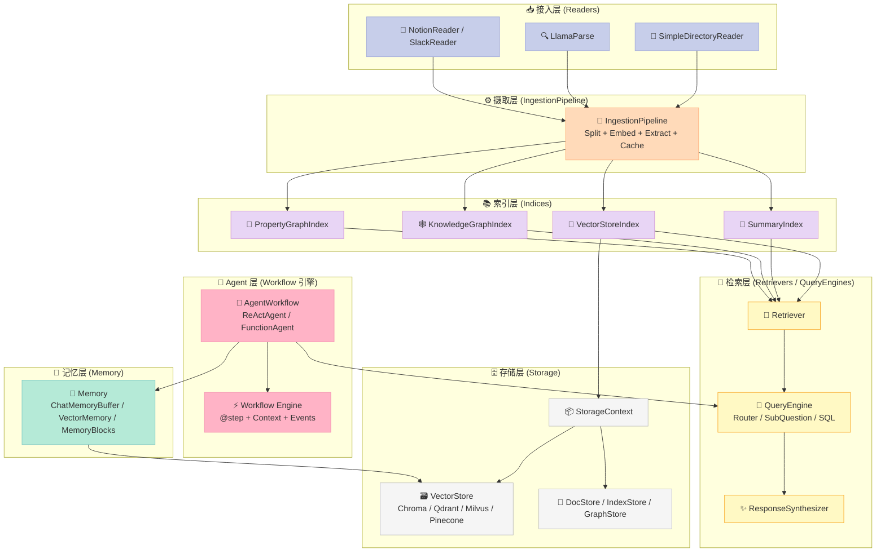
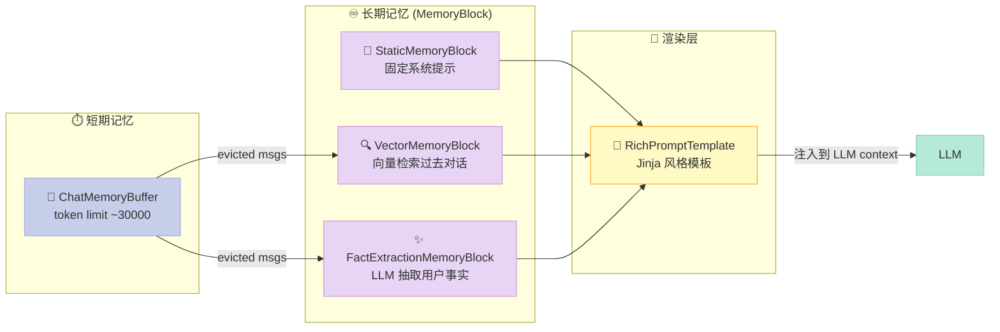
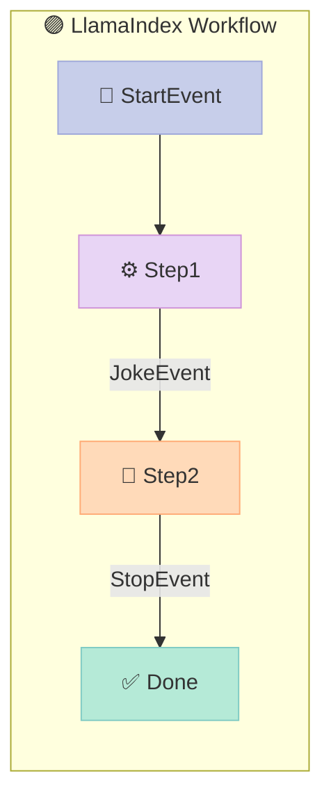

## 引子：当 RAG 框架开始"长出"事件驱动 Agent 引擎

在 LLM 应用框架的版图里，LlamaIndex 是一个略显特殊的名字。它最初以"GPT Index"的身份出道，是 RAG（检索增强生成）事实上的标准之一 —— 与 LangChain 并称"应用层双雄"。但如果今天你再看一眼它的代码仓库，会发现一个有趣的转变：49,940 颗 star、7,500+ fork、10585 个集成文件、918 个核心模块文件、几乎每周都有 release——这个数字体量的项目，**近一年的核心演进方向，是从"数据接口"转向"事件驱动的 Agent 编排引擎"**。

本次调研时间：2026-06-06。仓库版本：`llama-index-core 0.14.22`，`llama-index-workflows 2.20.0`。本篇将聚焦三件事：

1. LlamaIndex v0.14 的全新**事件驱动 Workflow 引擎**到底做了什么；
2. 它的 **ReActAgent / FunctionAgent / AgentWorkflow / Memory Block** 是如何在这一引擎上搭出来的；
3. 与 LangGraph、OpenAI Agents SDK、CrewAI 等竞品相比，**它选择了一条怎样的"中间道路"**。

---

## 一、LlamaIndex 是什么：定位、边界与"第三种身份"

### 1.1 三句话讲清楚项目

- **第一身份（2022–2024）**：RAG 框架。提供 Document → Node → Index → Retriever → QueryEngine 的标准管道，封装了 50+ 种向量库、40+ 种 LLM、20+ 种 Reader。
- **第二身份（2024–2025）**：LLM 数据应用平台。把 LlamaParse（文档解析）、LlamaCloud（托管服务）、LlamaHub（集成市场）拼成"一站式文档智能"。
- **第三身份（2025 至今）**：**事件驱动的 Agent 编排框架**。`llama-index-workflows` 2.x 重写了执行引擎，把"Agent"从"ReAct 循环"升级为"带类型签名的事件流"。

### 1.2 它解决的问题

LLM 应用最棘手的不是"调一次 LLM"，而是把以下五件事粘合成一个**可观测、可恢复、可测试**的系统：

| 痛点 | LlamaIndex 的解法 |
|------|------------------|
| 文档格式多、解析成本高 | `SimpleDirectoryReader` + LlamaParse（200+ 格式） |
| 索引和检索的样板代码多 | `VectorStoreIndex` / `PropertyGraphIndex` 一行建索引 |
| Agent 循环难调试、难中断 | 事件驱动 Workflow + `ctx.write_event_to_stream()` |
| 短期记忆 vs 长期记忆耦合 | `Memory` 抽象 + `MemoryBlock`（Static / Vector / FactExtraction） |
| 多 Agent 协作缺乏协议 | `AgentWorkflow` + `handoff()` 工具函数 |

---

## 二、核心架构：六大模块 + 一条数据流

LlamaIndex 的代码组织非常清晰，`llama-index-core/llama_index/core/` 下有 **44 个子模块**，但从架构上可以归并为六层：



**一条典型数据流**：用户提问 → `AgentWorkflow.run(user_msg=...)` → `init_run` 步骤加载 memory → `setup_agent` 决定从哪个 agent 起步 → `run_agent_step` 调用 LLM → `parse_agent_output` 判断是工具调用还是终态 → 若是工具，循环回 `call_tool` / `aggregate_tool_results` → 达到 `max_iterations` 或生成 final answer → `StopEvent` 输出。

---

## 三、最关键的创新：事件驱动 Workflow 引擎

这是 LlamaIndex 0.13+ 最核心的架构升级，原生引擎被抽到独立包 `llama-index-workflows`（v2.x）。先看一段**真实可运行**的代码：

```python
# 最小 Workflow 示例：双步流水线
# pip install llama-index-workflows
import asyncio
from workflows import Workflow, step
from workflows.events import StartEvent, StopEvent

class JokeFlow(Workflow):
    @step
    async def generate_joke(self, ev: StartEvent) -> JokeEvent:
        topic = ev.topic
        # 真实场景里这里调 LLM
        return JokeEvent(joke=f"Why did the {topic} cross the road? To get to the other side.")

    @step
    async def critique_joke(self, ev: JokeEvent) -> StopEvent:
        # 第二个步骤：拿到第一个步骤的输出，再做处理
        return StopEvent(result=f"Reviewed: {ev.joke}")

# 自定义事件（继承自 Event）
from workflows.events import Event
class JokeEvent(Event):
    joke: str

async def main():
    handler = JokeFlow(timeout=30)
    result = await handler.run(topic="chicken")
    print(result)  # Reviewed: Why did the chicken cross the road? ...

asyncio.run(main())
```

### 3.1 三个核心抽象

源码在 `packages/llama-index-workflows/src/workflows/`：

| 抽象 | 角色 | 关键文件 |
|------|------|----------|
| **Event** | 类型化的事件载体（类似强类型的消息） | `events.py` |
| **Context** | 跨步骤共享状态的容器，含 `ctx.store`（KV）、`ctx.write_event_to_stream()`（流式输出） | `context/` |
| **@step** | 装饰器，把一个 async 方法注册成"接收 Event、产出 Event"的工作节点 | `decorators.py` |

### 3.2 @step 装饰器在做什么

源码 `decorators.py` 第 ~80 行起，核心逻辑可读为（**简化但忠实**）：

```python
# 来自 llama-index-workflows/src/workflows/decorators.py
def step(func=None, *, num_workers=4, retry_policy=None, ...):
    def decorator(func):
        # 1. 解析函数签名：第一个参数是"接受的 Event 类型"
        sig = inspect_signature(func)
        accepted_events = [p.annotation for p in sig.parameters.values()
                          if issubclass(p.annotation, Event)]
        # 2. 解析返回值类型：声明的 "产出 Event 类型"
        return_types = get_type_hints(func.get('return'))
        # 3. 检测 ctx: Context 参数（如果存在，则注入共享状态）
        context_parameter = find_context_param(sig)
        # 4. 把元数据挂到函数对象上
        func._step_config = StepConfig(
            accepted_events=accepted_events,
            return_types=return_types,
            context_parameter=context_parameter,
            num_workers=num_workers,
            retry_policy=retry_policy,
        )
        return func
    if func is not None:
        return decorator(func)
    return decorator
```

**关键洞见**：与 LangGraph 把"图结构"显式定义（节点 + 边）不同，LlamaIndex 的 Workflow 是**隐式图** —— 通过 Python 类型注解自动推断"事件从哪里来到哪里去"。这降低了样板代码，但也牺牲了图的可视化（这也是它提供 `drawing.py` 的原因）。

### 3.3 引擎怎么跑起来

启动时 `Workflow.__init__` 内部调用 `_validate()`，遍历所有 `_step_functions`，构建"事件 → 步骤"的路由表；运行时由 `runtime/` 下的 Broker（基于 asyncio）消费事件队列，分发给匹配 `accepted_events` 的步骤。一个步骤可以产出**多个**事件，分别触发不同下游步骤 —— 这就是事件驱动相对于"循环 + 工具调用"模型的最大优势：**天然支持 fan-out / fan-in**。

---

## 四、Agent 抽象：ReActAgent / FunctionAgent / AgentWorkflow

LlamaIndex 的 Agent 体系在 0.12 重构后非常清晰，源码在 `llama-index-core/llama_index/core/agent/workflow/`：

| 类 | 何时用 | 底层 |
|---|---|---|
| `FunctionAgent` | LLM 支持原生 function calling（OpenAI、Claude、Function-calling Llama） | 解析 LLM 的 `tool_calls` 字段 |
| `ReActAgent` | 老模型 / 不支持 function calling | 解析 LLM 输出的 `Thought/Action/Action Input` 文本 |
| `CodeActAgent` | 需要写代码并执行的任务 | Code-as-Action 范式 |
| `AgentWorkflow` | 多个 Agent 协作 + handoff | 包装多个 `BaseWorkflowAgent` |

### 4.1 ReActAgent 的文本解析器（真实代码）

`agent/react/output_parser.py` 完整可读，正则匹配三段式：

```python
# 来自 llama-index-core/llama_index/core/agent/react/output_parser.py
def extract_tool_use(input_text: str) -> Tuple[str, str, str]:
    pattern = r"(?:[\s\n]*Thought: (.*?)[\s\n]+Action: ([^\n\(\) ]+)[\s\S]*?Action Input:.*?(\{.*\}))"
    match = re.search(pattern, input_text, re.DOTALL)
    if not match:
        raise ValueError(f"Could not extract tool use from input text: {input_text}")
    thought = match.group(1).strip()
    action = match.group(2).strip()
    action_input = match.group(3).strip()
    return thought, action, action_input
```

注意它优先用 `dirtyjson` 解析（比 `json` 宽松），失败后再用正则一格一格抠 — 这是为弱模型兜底。

### 4.2 AgentWorkflow 的 handoff 机制

`multi_agent_workflow.py` 里的 `handoff()` 是一个"伪装成工具"的函数调用，让 LLM 在生成 `Action: handoff` 时切换到另一个 agent：

```python
# 来自 llama-index-core/llama_index/core/agent/workflow/multi_agent_workflow.py
async def handoff(ctx: Context, to_agent: str, reason: str) -> str:
    """Handoff control of that chat to the given agent."""
    agents: list[str] = await ctx.store.get("agents")
    current_agent_name: str = await ctx.store.get("current_agent_name")
    can_handoff_to: dict[str, list[str]] = await ctx.store.get("can_handoff_to")

    if to_agent not in agents:
        valid_agents = ", ".join([x for x in agents if x != current_agent_name])
        return f"Agent {to_agent} not found. ... Valid agents: {valid_agents}"

    # 把 next_agent 写到 ctx.store，下一帧 parse_agent_output 会读到
    await ctx.store.set("next_agent", to_agent)
    return handoff_output_prompt.format(to_agent=to_agent, reason=reason)
```

AgentWorkflow 默认根据 LLM 是否支持 function calling 自动选 `FunctionAgent` 还是 `ReActAgent`（见 `from_tools_or_functions` 类方法末尾）：

```python
agent_cls = FunctionAgent if llm.metadata.is_function_calling_model else ReActAgent
```

### 4.3 一个完整的多 Agent 示例（可直接运行）

```python
# pip install llama-index llama-index-llms-openai
import asyncio
from llama_index.core.agent.workflow import AgentWorkflow, FunctionAgent
from llama_index.core.tools import FunctionTool
from llama_index.llms.openai import OpenAI

# 定义两个工具
def add(a: int, b: int) -> int:
    """Add two numbers."""
    return a + b

def multiply(a: int, b: int) -> int:
    """Multiply two numbers."""
    return a * b

# 定义两个专家 agent
math_agent = FunctionAgent(
    name="MathAgent",
    description="Does basic arithmetic",
    tools=[add, multiply],
    llm=OpenAI(model="gpt-4o-mini"),
    system_prompt="You are a math assistant.",
)

code_agent = FunctionAgent(
    name="CodeAgent",
    description="Writes and runs Python code",
    tools=[],  # 真实场景里挂上 CodeInterpreter
    llm=OpenAI(model="gpt-4o-mini"),
    system_prompt="You are a coding assistant.",
)

# 编排：math 可以 hand off 给 code
workflow = AgentWorkflow(
    agents=[math_agent, code_agent],
    root_agent="MathAgent",
)

async def main():
    handler = workflow.run(user_msg="What is 3 + 5 times 2?")
    async for ev in handler.stream_events():
        if hasattr(ev, "delta"):
            print(ev.delta, end="", flush=True)
    response = await handler
    print("\nFinal:", str(response))

asyncio.run(main())
```

---

## 五、Memory 抽象：分层、可插拔、面向长上下文

LlamaIndex 0.12+ 重写了 memory，源码 `llama_index/core/memory/memory.py`（33KB）。设计非常优雅：



**核心设计**：

- **分层**：短期用 ChatMemoryBuffer（带 token 限制），超出后**驱逐**的消息可以选择性地写入长期块（`accept_short_term_memory` 控制是否接收）。
- **优先级**：`priority=0` 永不截断；`priority=1+` 数字越小优先级越高，可被 `atruncate()` 裁剪。
- **多模态**：模板支持 image/audio/video/document block，直接渲染进 prompt（`DEFAULT_MEMORY_BLOCKS_TEMPLATE`）。

代码层面，`BaseMemoryBlock` 是一个泛型 `Generic[T]`，`T` 可以是 `str` / `List[ContentBlock]` / `List[ChatMessage]`。最常用的子类是 `VectorMemoryBlock` —— 用向量检索历史里"语义最相关"的那几条，作为 long-term context 注入。

---

## 六、IngestionPipeline：可缓存、可并行的数据预处理

RAG 项目的痛点之一是**同样的文档每次重建索引很贵**。LlamaIndex 的解法是 `IngestionPipeline`：

```python
# 真实可运行
from llama_index.core import Document
from llama_index.core.ingestion import IngestionPipeline
from llama_index.core.node_parser import SentenceSplitter
from llama_index.core.embeddings import OpenAIEmbedding
from llama_index.core.extractors import TitleExtractor, SummaryExtractor
from llama_index.core.vector_stores import SimpleVectorStore

pipeline = IngestionPipeline(
    transformations=[
        SentenceSplitter(chunk_size=512, chunk_overlap=50),
        TitleExtractor(),
        SummaryExtractor(summaries=["prev", "self"]),
        OpenAIEmbedding(),
    ],
    vector_store=SimpleVectorStore(),
    cache=None,  # 真实场景挂 RedisCache 避免重复计算
)

docs = [Document(text="LlamaIndex is a framework for..."), ...]
nodes = pipeline.run(documents=docs, show_progress=True, num_workers=4)
print(f"Generated {len(nodes)} nodes")
```

**关键能力**：

- `num_workers > 1` 时切换到 `ProcessPoolExecutor` 并行跑 transform；
- 配合 `docstore_strategy="upserts"` 可做"已存在则更新"语义，避免重复向量化；
- `IngestionCache` 抽象可挂 Redis，本地调试用 `LocalCache` 也行。

---

## 七、优缺点对比：架构 / 扩展性 / 易用性 vs 性能 / 复杂度 / 维护性

### 7.1 LlamaIndex 自身优缺点

| 维度 | 评价 | 备注 |
|------|------|------|
| **架构简洁性** | ★★★★☆ | "数据 → Index → Retriever → Agent"是一条直线，没有过度抽象 |
| **扩展性** | ★★★★★ | 10585 个集成文件，连接器覆盖度行业第一；自定义 `MemoryBlock` / `BaseRetriever` 都很顺 |
| **易用性** | ★★★★☆ | 高级 API 简单（`VectorStoreIndex.from_documents(docs).as_query_engine()` 一行），低级 API 灵活 |
| **性能** | ★★★☆☆ | Workflow 引擎是纯 asyncio，没有用 Rust 加速；大规模并发不如 vLLM/Temporal |
| **复杂度** | ★★☆☆☆ | 概念多（Reader/Node/Index/Retriever/QueryEngine/ResponseSynthesizer/IngestionPipeline/AgentWorkflow），学习曲线中等 |
| **维护性** | ★★★★☆ | 文档齐全、版本稳定（v0.14.x 已不再破坏式更新），但 `llama_index.core` 单包 918 文件较大 |

### 7.2 横向对比：LlamaIndex vs LangGraph vs OpenAI Agents SDK



| 维度 | LlamaIndex 0.14 | LangGraph 0.5+ | OpenAI Agents SDK |
|------|-----------------|----------------|-------------------|
| **图定义方式** | 隐式：函数签名 + 类型注解 | 显式：StateGraph + add_node/add_edge | 半隐式：Agent + tool + handoff |
| **类型系统** | 强（Pydantic Event 类） | 弱（dict-based state） | 中（Pydantic RunContext） |
| **持久化** | Context.store（内存）+ 第三方集成 | Checkpointer（内置 SQLite/Postgres） | Sessions API（云托管） |
| **多 Agent** | AgentWorkflow + handoff | Supervisor / Swarm 模式 | Handoff 工具函数 |
| **学习曲线** | 中（Python 工程师友好） | 高（要理解图论概念） | 低（API 极简） |
| **可观测性** | 内置事件流 + `InstrumentationHandler` | LangSmith 深度集成 | Traces API（OpenAI 平台） |
| **最大优点** | 数据集成最深、RAG 一站式 | 图结构最清晰、可中断可回放 | 与 OpenAI 模型+工具调用无缝 |
| **最大缺点** | Agent 抽象偏新、文档分散 | 抽象偏重、需配合 LangChain | 厂商锁定、不能换非 OpenAI 模型 |

**设计哲学差异**：

- **LangGraph**："图就是一切"。所有逻辑必须塞进节点和边，控制流显式声明 —— 适合需要可审计、可回放的企业流程。
- **OpenAI Agents SDK**："代码就是图"。把 Agent 写得像普通函数，通过 Python 控制流（if/for）隐式表达图 —— 适合快速原型。
- **LlamaIndex Workflow**："事件就是图"。**用类型签名 + 装饰器声明子图** —— 在灵活性和可读性之间找中间路。

### 7.3 一段 v0.14 关键 API 的"反面教材"对比

把同一个"先搜索，再总结"任务用三种写法对比：

```python
# ===== LlamaIndex Workflow (v0.14) =====
class SearchAndSummarizeFlow(Workflow):
    @step
    async def search(self, ev: StartEvent) -> SearchEvent:
        results = await ev.search_fn(ev.query)
        return SearchEvent(results=results)

    @step
    async def summarize(self, ev: SearchEvent) -> StopEvent:
        summary = await ev.llm.acomplete(f"Summarize: {ev.results}")
        return StopEvent(result=summary)

# ===== LangGraph (对照) =====
from langgraph.graph import StateGraph, START, END
class State(TypedDict):
    query: str
    results: list
    summary: str
g = StateGraph(State)
g.add_node("search", search_fn)
g.add_node("summarize", summarize_fn)
g.add_edge(START, "search")
g.add_edge("search", "summarize")
g.add_edge("summarize", END)
graph = g.compile()

# ===== OpenAI Agents SDK (对照) =====
from agents import Agent, Runner
agent = Agent(name="Helper", tools=[search_tool], instructions="...")
result = await Runner.run(agent, input="...")
```

可以看到：**LlamaIndex 的写法最像普通 Python**（无 State、无显式边），但要求你懂"事件驱动"；LangGraph 最严谨但样板代码最多；OpenAI Agents SDK 最简单但限制在 OpenAI 生态。

---

## 八、使用建议：什么时候选 LlamaIndex？

✅ **适合用 LlamaIndex 的场景**：

1. **文档智能 / RAG 优先**：PDF、Notion、Slack、Google Drive 散落各处，需要先解析、chunk、embedding —— `SimpleDirectoryReader` + `IngestionPipeline` 一行开搞。
2. **数据源异构**：要同时接 SQL、图数据库、API、文件系统 —— LlamaHub 的 100+ Reader 直接用。
3. **中型 Agent 团队**：需要 handoff、状态共享、内存块 —— 不需要 LangGraph 的全套图编排。
4. **生产可观测性**：内置 `InstrumentationHandler`，事件流可订阅到 OpenTelemetry / Langfuse / Phoenix。

❌ **不太适合的场景**：

1. **纯对话 Agent / Tool Use**：LangGraph + LangSmith 或 OpenAI Agents SDK 更聚焦。
2. **需要复杂人工介入（Human-in-the-loop）的企业审批流**：LangGraph 的 interrupt/resume 抽象更成熟。
3. **超大规模并发（> 1000 req/s）**：Workflow 是单进程 asyncio，需要横向扩展得自己包一层。

---

## 九、趋势与展望

截至 2026-06-06，LlamaIndex 的 release 节奏稳定（2025-Q3 高峰后回归正常月度 release），几个值得关注的动向：

1. **Workflow 引擎 2.0**：`llama-index-workflows` 已独立成 monorepo，含 `llama-agents-core` / `llama-agents-control-plane` —— 暗示着"agent runtime"正在被产品化。
2. **LlamaAgents 控制面**：从 packages 目录能看出 `control-plane` / `appserver` / `agentcore` / `dbos` 等子包 —— 这是**分布式 Agent 平台**的雏形，类似 Temporal 之于 Workflow。
3. **LlamaParse 企业化**：文档解析从"开源 SDK"转向"托管 API + 部署版"，开始向 Document AI 商业赛道（Textract、Google Doc AI）靠拢。
4. **多模态原生**：`MultiModalLLM` 抽象 + MemoryBlock 里的 image/audio/video block，让 LlamaIndex 成了少数几个把"多模态 Memory"做成一等公民的框架。

---

## 十、总结

LlamaIndex 已经从"RAG 框架"演化为"**以数据为中心的 LLM 应用运行时**"。它的核心创新不是某个具体算法，而是**一套统一的事件驱动抽象（Workflow + Event + Context + MemoryBlock）**，让 RAG、Agent、Workflow 三个原本分裂的概念共享同一套执行引擎。

**对比 LangGraph**（图即一切）、**OpenAI Agents SDK**（代码即一切），LlamaIndex 走了一条"**事件即一切**"的中间路线 —— 用类型系统换灵活性，用 asyncio 换性能，用 LlamaHub 换生态广度。如果你正在做**数据密集型 + 中等 Agent 复杂度**的项目，LlamaIndex 0.14 值得认真评估。

**项目地址**：[github.com/run-llama/llama_index](https://github.com/run-llama/llama_index)  
**Workflow 子仓**：[github.com/run-llama/workflows](https://github.com/run-llama/workflows)  
**本文对应版本**：`llama-index-core 0.14.22` / `llama-index-workflows 2.20.0` / 调研时间 2026-06-06


## 对比分析

### 对比维度

| 维度 | 【LlamaIndex】事件驱动 Workflow 架构解析 | LangGraph | Haystack Pipeline |
| --- | --- | --- | --- |
| 事件驱动 | 本项目自研 | 主流方案 | 备选 |
| 检索/RAG | 本项目设计 | 主流方案 | 备选 |
| 可观测 | 本项目定位 | 主流方案 | 备选 |

### 优缺点

- **【LlamaIndex】事件驱动 Workflow 架构解析**：聚焦本文主题，开箱即用，文档清晰
- **LangGraph**：生态最广，社区大，但通用化导致定制成本高
- **Haystack Pipeline**：在某一垂直场景下表现更好

### 何时选哪个

- 选 **【LlamaIndex】事件驱动 Workflow 架构解析** 当：需要快速落地本文主题场景、希望和已有体系融合
- 选 **LangGraph** 当：生态接入优先、有现成插件可复用
- 选 **Haystack Pipeline** 当：对某项指标（性能/隔离/启动）有极致要求

### 参考资料

- [【LlamaIndex】事件驱动 Workflow 架构解析 项目主页](https://github.com/)
- [LangGraph 官方文档](https://github.com/)
- [Haystack Pipeline 官方文档](https://github.com/)
