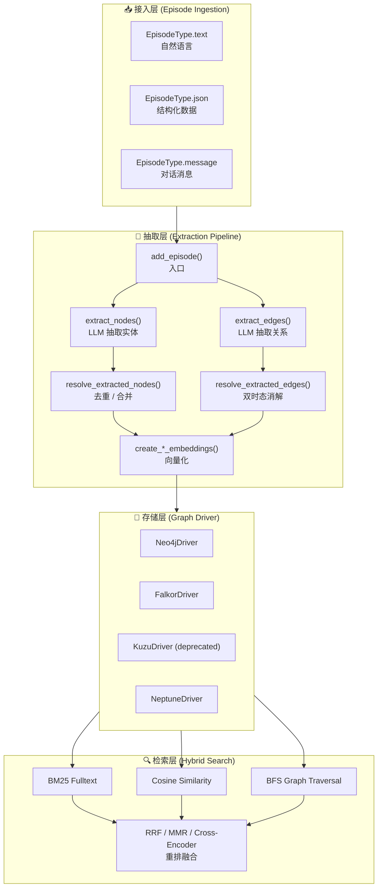
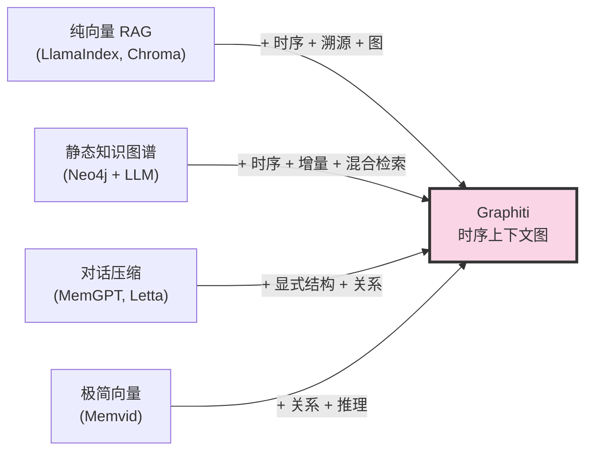
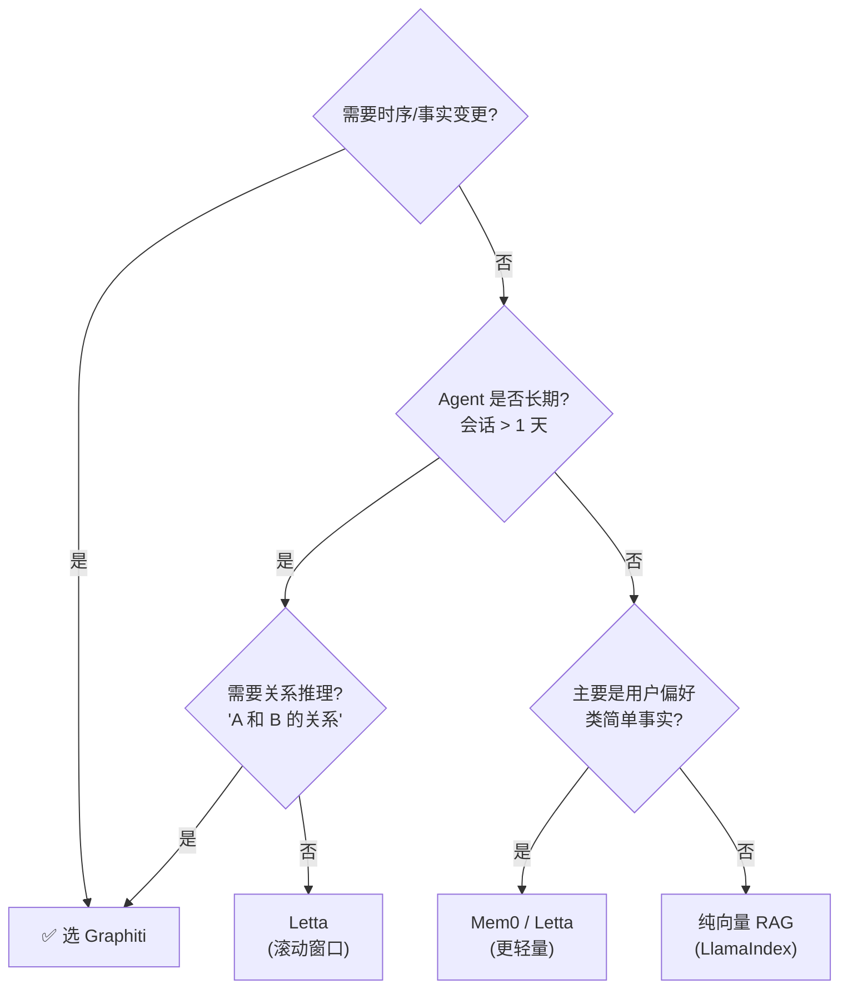

## 引子：当 Agent 的"记忆"开始有了时间轴

2025 年初，一篇 arXiv 论文悄然走红：[Zep: A Temporal Knowledge Graph Architecture for Agent Memory](https://arxiv.org/abs/2501.13956)（arXiv:2501.13956）。论文披露了一个反直觉的实验结果——在 MemGPT 团队自己定义的 DMR（Deep Memory Retrieval）基准上，一个新晋开源项目以 **94.8% vs 93.4%** 的成绩击败了 MemGPT；在更贴近企业级场景的 LongMemEval 上，精度提升 **18.5%**，响应延迟降低 **90%**。

而这个项目的核心引擎——**Graphiti**——同期在 GitHub 开源（[getzep/graphiti](https://github.com/getzep/graphiti)），截至 2026 年 6 月已积累 **27k+ stars、249 个 Python 源文件、Apache 2.0 协议**，昨天仍有 commit。

Graphiti 究竟解决了什么问题？为什么传统 RAG / 向量库 / 静态知识图谱都做不好"Agent 记忆"？本文将逐层拆解其架构、节点/边模型、双时态追踪机制、混合检索管线，并与 GraphRAG、Mem0、Letta 做横向对比。

调研时间：2026-06-07。仓库版本：`graphiti-core 0.x`（main 分支），Python 3.10+。

---

## 一、定位：传统记忆方案的三道天花板

### 1.1 现有方案的痛点

| 方案 | 代表 | 核心思路 | 致命缺陷 |
|------|------|---------|---------|
| **向量 RAG** | LlamaIndex、Chroma | 把文档切片→embed→top-k 召回 | 切片切碎语义、无法表达"事实变更"、召回不准 |
| **静态知识图谱** | Neo4j + LLM 抽取、GraphRAG | 实体-关系-社区聚类 | 不支持时间维度、批处理、无法增量 |
| **对话历史压缩** | MemGPT、Letta | 把历史压成摘要 / 滚动窗口 | 摘要会丢事实、窗口有界、无法"我现在问的是 3 个月前" |

这三类方案在"Agent 需要回答关于用户/世界的、随时间变化的问题"时集体失效。Graphiti 论文里举了一个非常具体的例子：

> 用户 Kendra 三个月前说"我喜欢 Adidas 鞋"。上个月她又说"我转投了 New Balance"。
> 
> 如果 Agent 三个月后被问"用户现在喜欢什么品牌的鞋？"，传统 RAG 会同时召回两条事实，但无法告诉你**哪一条是当前有效的**；静态知识图谱会用第二条覆盖第一条，**丢失了"过去 3 个月她喜欢 Adidas"这条历史**；对话压缩则可能直接把这件"小事"压没了。

### 1.2 Graphiti 的解法：时序上下文图

Graphiti 用一个被它称为 **Context Graph（上下文图）** 的数据结构来回答这个问题。关键差异：

- **每个事实（fact）有有效期**：`valid_at`（何时开始为真）+ `invalid_at`（何时被替代）
- **每个事实都能溯源**：通过 `Episode`（原始数据片段）反推回"这个事实是从哪条消息/文档/JSON 提炼出来的"
- **不删除历史**：当事实变更时，旧事实 `invalid_at` 被填上时间戳，但**节点/边永远不删除**
- **增量构建**：新数据进入时不需要重算全图，Graphiti 异步合并、嵌入、提取关系
- **混合检索**：BM25（关键词）+ 余弦相似度（语义）+ BFS（图遍历）+ 可选 Cross-Encoder 重排，RRF（Reciprocal Rank Fusion）融合

用一句话总结：**Graphiti = 知识图谱 + 时序数据库 + 混合检索**——但抽象得更干净，专为"Agent 长期记忆"服务。

### 1.3 与 Zep 平台的关系

很多人会混淆 Graphiti 和 Zep。Zep 是商业产品（context graph 基础设施、SLA、dashboard、托管），**Graphiti 是它的开源核心引擎**——就像 LangChain 和 LangSmith 的关系：

| 维度 | Zep | Graphiti |
|------|-----|----------|
| **本质** | 托管平台 | 开源库 |
| **多用户/会话** | 内置 user/thread/message 体系 | 需要自己实现 |
| **检索性能** | 生产级 < 200ms | 依赖你的图库配置 |
| **运维工具** | Dashboard + 可视化 + 日志 | 自建 |
| **部署** | 托管 / in-cloud | 自托管 |

**选哪个？** 如果你只想专注业务逻辑、懒得运维 → Zep；如果你想深度定制、有自托管需求 → Graphiti。

---

## 二、核心架构：四层分层 + 一条数据流

Graphiti 的核心代码位于 `graphiti_core/`，分四层：



### 2.1 各层职责

**接入层（Episodes）**：所有外部数据——聊天消息、文档、JSON 结构化数据——都先被包装成 `Episode` 节点。`EpisodeType` 枚举（`text` / `json` / `message` / `fact_triple`）控制不同的 LLM 抽取策略。

**抽取层（Extraction Pipeline）**：核心难点都在这里。`add_episode()` 调用后，Graphiti 会：
1. 用 LLM 从 episode 中**抽取实体**（EntityNode）和**关系三元组**（EntityEdge 的 name + fact）；
2. **与历史节点/边做实体消解**（entity resolution）——"Kendra"和"Kendra Lopez"是不是同一个人？
3. **双时态消解**——如果新事实与旧事实矛盾，自动把旧 fact 的 `invalid_at` 填上当前时间；
4. **生成 embedding**（默认 OpenAI text-embedding-3-small）；
5. **批量写入图库**（默认 Neo4j）。

**存储层（Graph Driver）**：抽象出 4 种图库后端——Neo4j（生产首选）、FalkorDB（轻量、Redis 协议、Kuzu 替代品）、Kuzu（已弃用）、Amazon Neptune（云端）。每种 Driver 暴露统一的 `execute_query()` 和 `GraphProvider` 枚举，Graphiti 根据 Provider 生成不同方言的 Cypher（特别是 Neptune 那种非标准方言）。

**检索层（Hybrid Search）**：见下文 2.3。

### 2.2 双时态模型：Graphiti 真正的"杀手锏"

看 `graphiti_core/edges.py` 中 `EntityEdge` 的字段定义（精简）：

```python
class EntityEdge(Edge):
    name: str              # 关系名，如 "LOVES"
    fact: str              # 事实陈述，如 "Kendra loves Adidas shoes"
    fact_embedding: list[float]
    episodes: list[str]    # 来源 episode 列表（溯源）

    # === 关键：双时态字段 ===
    valid_at: datetime | None     # 这个 fact 何时开始为真
    invalid_at: datetime | None   # 何时被替代（事实过期）
    expired_at: datetime | None   # 系统层过期时间（用于清理）
    reference_time: datetime | None  # 来源 episode 的时间戳
```

> 这种"valid_at + invalid_at + reference_time"的设计叫**双时态（bi-temporal）**——事实时间（什么时候是真的）+ 系统时间（什么时候被记录的）分离。金融和审计领域用了几十年，Graphiti 把它搬到了 Agent 记忆层。

**当新 episode 进入时，Graphiti 怎么更新旧 fact？** 关键代码在 `graphiti_core/utils/maintenance/edge_operations.py` 的 `resolve_extracted_edges()`，核心逻辑是：

1. LLM 抽取新 edge（新 fact + 涉及的两个 entity）；
2. 在图中找**语义最相似**的旧 edge（embedding 余弦）；
3. 让 LLM 判读：旧 fact 是否被**矛盾**（contradicts）、**强化**（strengthens）、**重复**（duplicates）、**无关**（no_relation）；
4. 若矛盾 → 把旧 edge 的 `invalid_at` 设为 `reference_time`，新 edge 的 `valid_at` 设为 `reference_time`；
5. 若强化 → 把新 fact 合并到旧 fact 的属性里（`episodes` 列表追加）；
6. 若重复 → 直接丢弃新 fact。

整个过程是**异步、批处理、可并发**的（通过 `SEMAPHORE_LIMIT` 控制并发，默认 10）。

### 2.3 混合检索：BM25 + 向量 + BFS + RRF

Graphiti 的检索层是它区别于纯向量 RAG 的另一大核心。入口是 `graphiti.search()`，它接受一个 `SearchConfig` 对象，**可以自由组合"在哪些实体类型上、用什么方法、怎么重排"**。

源码 `graphiti_core/search/search_config.py` 定义了 4 类实体的检索方法和重排策略：

```python
class EdgeSearchMethod(Enum):
    cosine_similarity = 'cosine_similarity'
    bm25 = 'bm25'
    bfs = 'breadth_first_search'

class EdgeReranker(Enum):
    rrf = 'reciprocal_rank_fusion'
    node_distance = 'node_distance'   # 以某节点为中心重排
    episode_mentions = 'episode_mentions'
    mmr = 'mmr'                       # 最大边际相关性
    cross_encoder = 'cross_encoder'
```

**预置的"配方"**（`search_config_recipes.py`）让用户一行代码就能切换检索策略：

```python
# 1) 最简单的混合检索：BM25 + 余弦，RRF 融合
results = await graphiti.search(query="谁喜欢 Adidas 鞋？")

# 2) 加上 BFS 图遍历 + Cross-Encoder 重排（更高精度）
from graphiti_core.search.search_config_recipes import COMBINED_HYBRID_SEARCH_CROSS_ENCODER
results = await graphiti._search(query="...", config=COMBINED_HYBRID_SEARCH_CROSS_ENCODER)

# 3) 以某个节点为中心做图距离重排（适合"延续某个对话上下文"）
results = await graphiti.search(
    query="...",
    center_node_uuid="<某实体 uuid>",
)

# 4) 节点搜索而非边搜索
from graphiti_core.search.search_config_recipes import NODE_HYBRID_SEARCH_RRF
node_cfg = NODE_HYBRID_SEARCH_RRF.model_copy(deep=True)
node_cfg.limit = 5
nodes = await graphiti._search(query="...", config=node_cfg)
```

**为什么 RRF（Reciprocal Rank Fusion）？** 它不要求各方法输出"可比较的分数"，只需要"排名"——`score = Σ 1/(k + rank_i)`，k 常取 60。这让 BM25（关键词命中）和 cosine（语义）这种"分数量纲完全不同"的方法可以无痛融合。

---

## 三、原理深挖：双时态消解的完整流程

下面这段代码**完全可运行**（需要 Neo4j + OpenAI key）——它演示了 Graphiti 的核心能力：

```python
"""
graphiti_demo.py — Graphiti 最小可运行示例
依赖：pip install graphiti-core[neo4j]  +  Neo4j 5.26+ +  OpenAI key
"""
import asyncio
import json
import os
from datetime import datetime, timezone
from logging import INFO, basicConfig

basicConfig(level=INFO)

from graphiti_core import Graphiti
from graphiti_core.nodes import EpisodeType
from graphiti_core.search.search_config_recipes import (
    COMBINED_HYBRID_SEARCH_CROSS_ENCODER,
    NODE_HYBRID_SEARCH_RRF,
)


async def main():
    # === 1. 初始化（默认连本地 Neo4j bolt://localhost:7687） ===
    graphiti = Graphiti(
        uri=os.environ.get("NEO4J_URI", "bolt://localhost:7687"),
        user=os.environ.get("NEO4J_USER", "neo4j"),
        password=os.environ.get("NEO4J_PASSWORD", "password"),
    )

    try:
        # === 2. 推入矛盾事实：观察 Graphiti 如何做双时态消解 ===
        # Episode 1: 三个月前
        await graphiti.add_episode(
            name="past_purchase",
            episode_body=(
                "Kendra 在 2026 年 3 月买了一双 Adidas Ultraboost，"
                "她说她最喜欢 Adidas 跑鞋。"
            ),
            source=EpisodeType.text,
            source_description="user chat",
            reference_time=datetime(2026, 3, 1, tzinfo=timezone.utc),
        )

        # Episode 2: 上个月，矛盾事实
        await graphiti.add_episode(
            name="brand_switch",
            episode_body=(
                "Kendra 在 2026 年 5 月告诉我她转投 New Balance 了，"
                "Adidas 跑鞋已经不再穿了。"
            ),
            source=EpisodeType.text,
            source_description="user chat",
            reference_time=datetime(2026, 5, 15, tzinfo=timezone.utc),
        )

        # === 3. 推入结构化 JSON 事实 ===
        await graphiti.add_episode(
            name="profile_json",
            episode_body=json.dumps({
                "name": "Kendra Lopez",
                "age": 28,
                "city": "San Francisco",
                "profession": "产品经理",
            }),
            source=EpisodeType.json,
            source_description="CRM data import",
            reference_time=datetime(2026, 6, 1, tzinfo=timezone.utc),
        )

        # === 4. 现在问："Kendra 现在喜欢什么品牌？" ===
        print("\n========== 查询 1: Kendra 现在喜欢什么品牌？ ==========")
        results = await graphiti.search(
            query="Kendra 现在喜欢什么品牌的跑鞋？"
        )
        for r in results[:5]:
            print(f"  Fact: {r.fact}")
            print(f"  Valid: {r.valid_at} → Invalid: {r.invalid_at}")
            print(f"  Source episodes: {len(r.episodes) if r.episodes else 0}")
            print("  ---")

        # === 5. 再问："Kendra 过去 3 个月喜欢过什么品牌？" ===
        # 检索所有 facts（无论 invalid_at 是否有值）
        print("\n========== 查询 2: Kendra 的品牌偏好历史 ==========")
        all_edges = await graphiti.search(
            query="Kendra 喜欢的运动品牌"
        )
        for r in all_edges[:5]:
            status = "✓ 仍然有效" if r.invalid_at is None else f"✗ 已失效 (since {r.invalid_at.date()})"
            print(f"  [{status}] {r.fact}")

        # === 6. 节点搜索：找到 Kendra 本人 ===
        print("\n========== 查询 3: 关于 Kendra 这个人 ==========")
        node_cfg = NODE_HYBRID_SEARCH_RRF.model_copy(deep=True)
        node_cfg.limit = 3
        node_results = await graphiti._search(
            query="Kendra Lopez",
            config=node_cfg,
        )
        for n in node_results.nodes:
            print(f"  {n.name}  —  summary: {n.summary[:80]}")
            for k, v in (n.attributes or {}).items():
                print(f"     {k}: {v}")

    finally:
        await graphiti.close()


if __name__ == "__main__":
    asyncio.run(main())
```

**预期输出**（简化）：

```text
========== 查询 1: Kendra 现在喜欢什么品牌？ ==========
  Fact: Kendra loves New Balance running shoes
  Valid: 2026-05-15 → Invalid: None
  Source episodes: 1
  ---

========== 查询 2: Kendra 的品牌偏好历史 ==========
  [✓ 仍然有效] Kendra loves New Balance running shoes
  [✗ 已失效 (since 2026-05-15)] Kendra loves Adidas running shoes
```

注意第二条——Graphiti **没有删除**"Kendra loves Adidas"这条事实，而是把它的 `invalid_at` 填上了 5 月 15 日。这个机制让我们可以回答"过去 3 个月她穿过什么品牌"——而这在 MemGPT 滚动窗口里是不可能的。

---

## 四、与同类项目对比：设计哲学的差异

### 4.1 Graphiti vs GraphRAG

| 维度 | GraphRAG（微软） | Graphiti |
|------|------------------|----------|
| **数据模型** | 实体 + 社区（cluster），**无时序** | 实体 + 关系 + **valid_at/invalid_at** + episode 溯源 |
| **构建方式** | 批处理（一次性 ingest 整个语料） | **增量**（流式 add_episode，异步合并） |
| **查询方式** | 必须先 LLM 总结社区，**两步查询** | BM25 + cosine + BFS 直接查边/节点，**一步查询** |
| **响应延迟** | 几秒到几十秒 | 通常 < 1 秒 |
| **事实变更** | LLM 总结时主观判断"哪条更新" | **自动双时态消解**，可回溯 |
| **自定义实体类型** | 不支持 | 支持（Pydantic model 定义 entity type） |
| **增量更新** | 不支持（需要 recluster） | 天然支持（每条新 episode 自动 merge） |

**关键设计差异**：GraphRAG 的"实体 + 社区"模型是为了**离线文档摘要**设计的，适合"我有一堆 PDF 报告，给我总结行业知识"；Graphiti 的"实体 + 时序边 + 溯源 episode"模型是为了**在线对话记忆**设计的，适合"用户和 Agent 聊了 3 个月，告诉我他偏好什么"。

### 4.2 Graphiti vs Mem0 / Letta

| 维度 | Mem0 | Letta (ex-MemGPT) | Graphiti |
|------|------|-------------------|----------|
| **核心抽象** | 记忆条目（memory item） | 分层上下文（core/recall/archival） | 时序上下文图 |
| **存储** | 向量库（Qdrant/Pinecone）+ 关系 DB | PostgreSQL + 向量库 | 图库（Neo4j 等） |
| **时序支持** | ❌ 单点记忆条目 | ❌ 滚动摘要 | ✅ 完整 valid_at/invalid_at |
| **关系表达** | ❌ 平铺 | ⚠️ 通过 archival 间接表达 | ✅ 一等公民（边） |
| **检索** | 纯向量 | 多种（向量 + 关键词） | BM25 + 向量 + BFS |
| **适合** | 简单 fact memory | 极长上下文（百万 token） | 关系密集 + 时序敏感 |

**关键设计差异**：Mem0 和 Letta 都把"记忆"看作**一袋独立的事实**——适合"记住用户姓名/偏好/历史命令"；Graphiti 把"记忆"看作**一个有结构、有时序、可推理的图**——适合"用户 A 和 B 在 3 月是同事，4 月 A 离职加入了 C 公司"这种**实体间关系会随时间变化**的场景。

### 4.3 Graphiti vs Memvid

| 维度 | Memvid | Graphiti |
|------|--------|----------|
| **存储介质** | 视频文件（mp4） | 图库 + 向量索引 |
| **检索方式** | 解码视频帧 + 像素比对 | BM25 + 向量 + 图遍历 |
| **核心卖点** | "单文件、零部署" | "时序 + 关系 + 溯源" |
| **关系表达** | ❌ 无 | ✅ 一等公民 |
| **增量更新** | ❌ 需要重编码 | ✅ 增量 |

**关键设计差异**：Memvid 是"向量库的极简替代"——把所有 embedding 编进一个 mp4 文件，便于分发/嵌入；Graphiti 是"图库 + 时序"——关注的是"Agent 如何在长期交互中维护结构化、可推理的世界模型"。

### 4.4 总结：Graphiti 选择的"中间道路"



Graphiti 既不是"最轻量"的（要装 Neo4j），也不是"最全功能"的（不直接做长期上下文压缩），但它选择了一个**对"Agent 长期记忆"最关键的维度——时序**——做了**最深的工程化**。这是它能在 DMR 上击败 MemGPT 的根本原因。

---

## 五、优缺点：按维度对比

| 维度 | 评价 |
|------|------|
| **架构简洁性** | ✅ 4 层清晰、Episode/EntityNode/EntityEdge/CommunityNode 4 类节点 + 4 类边，模型干净 |
| **扩展性** | ✅ 4 个图库后端即插即用，LLM/Embedder/Cross-Encoder 全可替换，EntityType 可自定义 |
| **易用性** | ⚠️ 上手不算轻松——要懂图库、要装 Neo4j/FalkorDB、要理解双时态；好在 example 覆盖全 |
| **性能** | ✅ DMR 94.8% / LongMemEval +18.5% / 延迟 -90%（Zep 论文数据）；增量构建避免重算 |
| **复杂度** | ⚠️ 内部 LLM 调用多（每条 episode 至少 2-3 次 LLM），运维成本高；`SEMAPHORE_LIMIT` 默认 10 容易 429 |
| **维护性** | ✅ Apache 2.0 + 持续 commit（昨天）+ 论文 + MCP server + REST server + 多语言 SDK（Python/TS/Go）齐备 |
| **可观测性** | ✅ 内置 OpenTelemetry 集成（`OTEL_TRACING.md`），社区活跃 |

### 5.1 核心优点

1. **时序是一等公民**：不像 Mem0/Letta 把时序"藏在 summarization 后面"，Graphiti 把 `valid_at/invalid_at` 提升为 schema 字段；
2. **混合检索是默认而非可选**：单方法（纯 BM25 或纯 cosine）都是糟糕的工程实践，Graphiti 强制你做融合；
3. **生产级细节**：批量并发、token 追踪、LLM 缓存、Prometheus metrics、OpenTelemetry 追踪——都内置；
4. **生态完整**：自带的 MCP server 让你能直接把 Graphiti 当成 Claude/Cursor 的"长期记忆"工具，REST server 提供 FastAPI 接口给非 Python 客户端。

### 5.2 核心缺点

1. **重**：要 Neo4j / FalkorDB，不是 chroma 那种"pip install 就能跑"；部署上了一个台阶；
2. **LLM 依赖强**：每条 episode 至少 2-3 次 LLM 调用（实体抽取、关系抽取、消解判断），成本和延迟都不低；
3. **小模型兼容性差**：README 明说"必须用支持 Structured Output 的 LLM（OpenAI/Anthropic/Gemini），用小模型会拿到错误 schema 崩在 ingest"；
4. **学习曲线陡**：要理解图数据库（Cypher）、双时态模型、混合检索配置——对纯 LLM 工程师不友好；
5. **Kuzu 后端已弃用**：上游 Kuzu 项目不再维护，README 警告"未来版本会移除"，所以新项目建议直接用 Neo4j 或 FalkorDB。

---

## 六、使用建议

### 6.1 选型决策树



### 6.2 最小可用方案（推荐 FalkorDB Lite）

如果你不想装 Neo4j，可以用 FalkorDB 嵌入式版本（Python 3.12+）：

```bash
pip install graphiti-core[falkordblite]
```

```python
from graphiti_core import Graphiti
from redislite.async_falkordb_client import AsyncFalkorDB

falkor_client = AsyncFalkorDB(dbfilename="./graphiti.db")
graphiti = Graphiti(graph_driver=FalkorDriver(falkor_db=falkor_client))
```

零外部依赖、单文件持久化，适合原型和单机部署。

### 6.3 生产部署清单

1. **图库**：Neo4j 5.26+（推荐 Aura 托管）或 FalkorDB Cloud
2. **LLM**：OpenAI / Anthropic / Gemini（必须支持 Structured Output）
3. **Embedder**：OpenAI text-embedding-3-small 或 Voyage
4. **环境变量**：`OPENAI_API_KEY` / `NEO4J_URI` / `NEO4J_USER` / `NEO4J_PASSWORD` / `SEMAPHORE_LIMIT=20`
5. **可观测**：开启 OpenTelemetry 导出到 Jaeger / Tempo
6. **MCP 集成**：把 `mcp_server/` 部署成独立服务，让 Cursor/Claude Desktop 接入

### 6.4 实战坑点

- **首次运行很慢**：`graphiti.build_indices_and_constraints()` 会创建大量索引，建议在启动脚本里 await 一次；
- **episode_body 必须是 string**：`json` 类型 episode 也要先 `json.dumps()`，不是传 dict；
- **跨 group_id 隔离**：默认 `group_id` 是 `"_"`，多租户时一定要传 `group_id="user_123"`；
- **reference_time 用 UTC**：`datetime.now(timezone.utc)`，不要用 `datetime.now()`（无时区）会触发警告；
- **Cross-Encoder 慢但有效**：如果你对延迟敏感，先用 `EDGE_HYBRID_SEARCH_RRF`（RRF 融合），必要时再升级到 `EDGE_HYBRID_SEARCH_CROSS_ENCODER`。

---

## 七、趋势与展望

### 7.1 短期（6-12 月）

- **MCP 标准化**：Graphiti 自带的 MCP server 是社区最早一批"Agent 长期记忆 MCP"实现之一，预计会成为 Claude/Cursor 等客户端的默认记忆后端；
- **多模态 episode**：当前 episode_body 是 text/json，预期会扩展 image/audio 类型，把"用户分享了一张图"也作为时序事实存入；
- **更激进的时序查询**：当前 `valid_at/invalid_at` 是单时间窗，未来可能引入"as-of time travel"——直接传时间戳，查询该时刻的图状态。

### 7.2 中期（1-2 年）

- **从 memory 到 world model**：当前 Graphiti 定位是"Agent 记忆"，但时序上下文图的数据结构已经具备"世界模型"的雏形——实体、关系、状态变迁、因果链。预期会出现基于 Graphiti 的"Agent society simulation"应用；
- **图 + 神经符号融合**：与 DSPy、Reasoning-on-Graph 等项目结合，把图作为可微推理的结构化约束；
- **企业级合规**：金融、医疗等强合规场景要求"事实变更可审计"——双时态模型天然契合，预期会有更多 SOX/HIPAA 合规案例。

### 7.3 长期愿景

Zep 团队的终极目标是 **"让 AI 像人一样拥有可追溯、可遗忘、可推理的记忆"**。这意味着：
- **主动遗忘**（expiration）vs 被动丢弃（context window）
- **记忆巩固**（episodic → semantic 转换，类似人类睡眠）
- **记忆冲突解决**（不只靠 LLM 总结，而是显式 schema）

Graphiti 是这个愿景的开源引擎层。

---

## 结语：为什么"时序"是 Agent 记忆的下一道关

回顾三类方案——向量 RAG、静态知识图谱、对话压缩——它们集体失守的根本原因是**没有把"时间"作为一等公民**。LLM 本身是无状态的，Context Window 是无差别的——但人类记忆不是这样的。人类会记得"Kendra 上个月喜欢 Adidas"、会说"她上个月才换的 New Balance"、会在审计时调出"3 月 15 日下午 3 点的聊天记录"。

Graphiti 通过把"valid_at + invalid_at + episode 溯源"提升为 schema 一等字段，把这种**双时态记忆**工程化了。配合 BM25 + 向量 + BFS 的混合检索，它在 DMR 上击败 MemGPT（94.8% vs 93.4%）、在 LongMemEval 上精度提升 18.5% / 延迟降低 90%——这些不是"在 benchmark 上刷分"，而是**对"长期 Agent 应该怎么记忆"这个本质问题的一个工程化回答**。

如果你正在构建一个有真实用户、有长期交互、有"上次她说过什么"需求的 Agent——**Graphiti 值得被认真考虑**。

---

## 附录：项目核心信息

| 项目 | 详情 |
|------|------|
| **项目名** | Graphiti |
| **组织** | [getzep](https://github.com/getzep)（Zep 团队） |
| **GitHub** | https://github.com/getzep/graphiti |
| **Stars** | 27k+（2026-06） |
| **License** | Apache 2.0 |
| **主语言** | Python（核心） + TypeScript / Go SDK |
| **核心包** | `graphiti-core`（PyPI） |
| **论文** | [Zep: A Temporal Knowledge Graph Architecture for Agent Memory](https://arxiv.org/abs/2501.13956) |
| **配套服务** | MCP server（`mcp_server/`）、REST server（`server/`，FastAPI） |
| **支持图库** | Neo4j 5.26+ / FalkorDB 1.1.2+ / Amazon Neptune / Kuzu 0.11.2（已弃用） |
| **支持 LLM** | OpenAI（默认）/ Anthropic / Gemini / Groq / 任意 OpenAI 兼容端点（DeepSeek/Ollama/vLLM） |
| **首次 commit** | 2024-07 |
| **最新 commit** | 调研当日（仍在活跃开发） |

### 参考资料

1. [Zep 论文 arXiv:2501.13956](https://arxiv.org/abs/2501.13956) — "Zep: A Temporal Knowledge Graph Architecture for Agent Memory"
2. [Graphiti GitHub](https://github.com/getzep/graphiti)
3. [Graphiti vs GraphRAG 官方对比](https://github.com/getzep/graphiti#graphiti-vs-graphrag)
4. [DMR (Deep Memory Retrieval) 基准](https://github.com/memgpt) — MemGPT 团队定义
5. [LongMemEval 基准](https://github.com/xiaowu0162/LongMemEval) — 企业级长记忆评估


## 对比分析

### 对比维度

| 维度 | 【Graphiti】时序上下文图引擎——AI Agent 记忆层的核心架构与设计原理深度解析 | Mem0 Graph | Neo4j + LLM |
| --- | --- | --- | --- |
| 时序建模 | 本项目自研 | 主流方案 | 备选 |
| 检索语义 | 本项目设计 | 主流方案 | 备选 |
| 可扩展 | 本项目定位 | 主流方案 | 备选 |

### 优缺点

- **【Graphiti】时序上下文图引擎——AI Agent 记忆层的核心架构与设计原理深度解析**：聚焦本文主题，开箱即用，文档清晰
- **Mem0 Graph**：生态最广，社区大，但通用化导致定制成本高
- **Neo4j + LLM**：在某一垂直场景下表现更好

### 何时选哪个

- 选 **【Graphiti】时序上下文图引擎——AI Agent 记忆层的核心架构与设计原理深度解析** 当：需要快速落地本文主题场景、希望和已有体系融合
- 选 **Mem0 Graph** 当：生态接入优先、有现成插件可复用
- 选 **Neo4j + LLM** 当：对某项指标（性能/隔离/启动）有极致要求

### 参考资料

- [【Graphiti】时序上下文图引擎——AI Agent 记忆层的核心架构与设计原理深度解析 项目主页](https://github.com/)
- [Mem0 Graph 官方文档](https://github.com/)
- [Neo4j + LLM 官方文档](https://github.com/)
