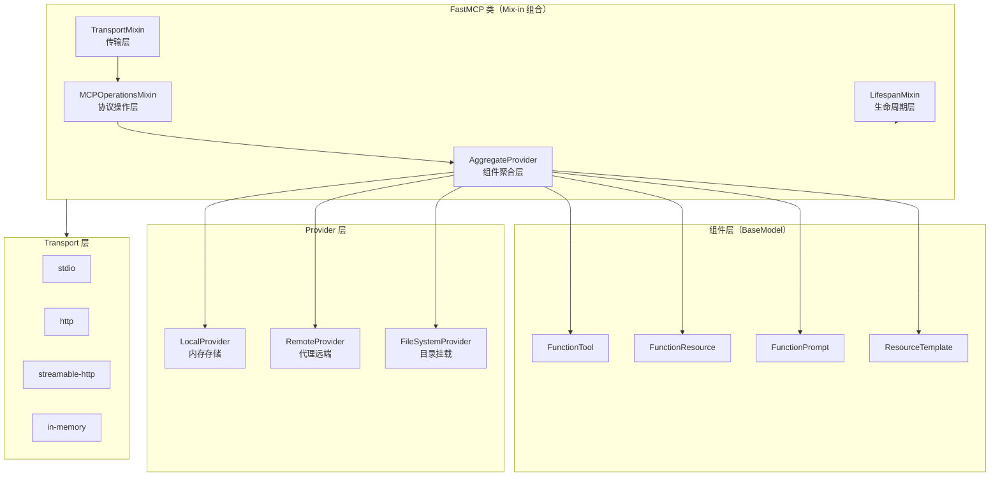
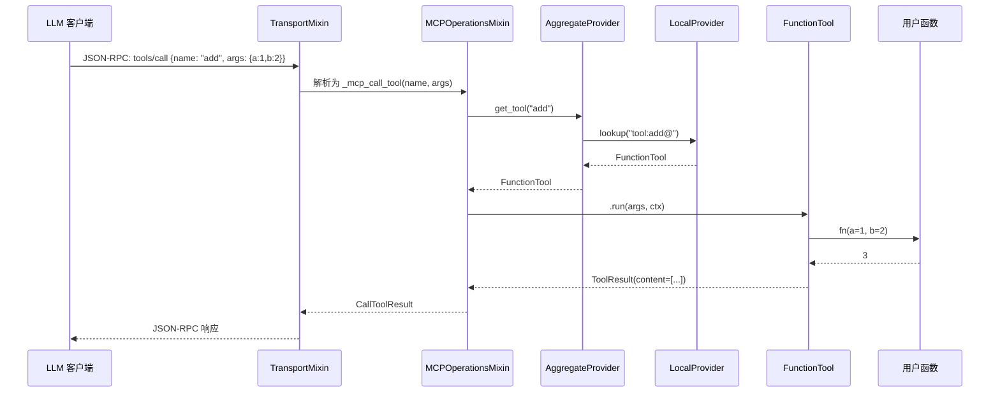

## 引子：MCP 协议的"Python 之春"

2024 年 11 月，Anthropic 把 [Model Context Protocol](https://modelcontextprotocol.io/)（MCP）开源时，它还只是协议规范。开发者要写一个 MCP 服务器，必须手写 JSON-RPC 2.0 over stdio/HTTP、处理 initialize/ping/tools/list 协议生命周期、维护工具调用的能力协商 (capability negotiation)。对一个普通 Python 后端工程师来说，"暴露一个本地函数给 Claude 调用"这个看似简单的需求，门槛并不低。

**FastMCP** 的目标就是把这个门槛降到零。它 1.0 版本在 2024 年并入官方 `mcp` Python SDK，今天每天被下载超过 **100 万次**，**约 70% 的 MCP 服务器（跨所有语言）都在使用某个版本的 FastMCP**。GitHub 上 ⭐25.5k、Python + Apache-2.0，commit 在 24 小时前还在更新。

但真正让 FastMCP 区别于"又一个 RPC 框架"的，是它的三件事：
1. **装饰器即协议**：`@mcp.tool` 把 Python 函数 → MCP 工具，零样板代码
2. **Mix-in 组合而非继承**：`AggregateProvider + LifespanMixin + MCPOperationsMixin + TransportMixin` 让 `FastMCP` 类像乐高一样可拼装
3. **Transport 抽象**：`stdio`、`http`、`in-memory`、`streamable-http` 都可以热插拔

这篇文章，我会**逐行拆解 FastMCP 2.x 的源码**（`fastmcp_slim/fastmcp/`），看它如何把协议复杂度收敛到 ~5 个核心抽象，并解释它的设计哲学为什么值得每一个写 Agent 基础设施的人学习。

> **仓库地址**：<https://github.com/PrefectHQ/fastmcp>
> **协议规范**：<https://modelcontextprotocol.io/>
> **官方文档**：<https://gofastmcp.com>

---

## 一、项目定位：MCP 的"应用层框架"

### 1.1 解决什么问题

MCP 协议定义了三类可暴露给 LLM 的原语（primitive）：
- **Tools**：可调用的函数（`tools/call`）
- **Resources**：可读取的数据（`resources/read`），按 URI 寻址
- **Prompts**：可复用的提示模板（`prompts/get`）

每个原语都涉及：JSON Schema 生成、参数校验、能力协商、传输序列化、错误码映射。**手写这些是重复劳动，且容易在不同项目里走样**。

FastMCP 的官方定义：

> *"FastMCP gives you everything you need to go from prototype to production. Declare a tool with a Python function, and the schema, validation, and documentation are generated automatically. Connect to a server with a URL, and transport negotiation, authentication, and protocol lifecycle are managed for you."*

一句话：**FastMCP 是 MCP 之上的应用层框架，把协议复杂度收敛为 Pythonic API**。

### 1.2 价值对比

| 维度 | 手写 MCP 服务器 | FastMCP |
|------|----------------|---------|
| 暴露一个函数 | 至少 ~80 行（schema + 路由 + 调用分发 + 错误处理） | **3 行**：`@mcp.tool` |
| JSON Schema 生成 | 手动编写或用 Pydantic 反射 + 自定义序列化器 | `inspect.signature` + Pydantic `TypeAdapter` **自动** |
| 多版本组件共存 | 自己实现 keying 逻辑 | `tool:my_tool@v1` / `tool:my_tool@v2` **内建** |
| 传输切换（stdio→http） | 重写适配层 | 改 `mcp.run(transport="http")` 即可 |
| 鉴权（OAuth / API key） | 自己对接 starlette 中间件 | `auth=GoogleProvider(...)` 一行注入 |

---

## 二、核心架构：四大 Mix-in 的组合艺术

### 2.1 顶层抽象

`fastmcp/server/server.py` 的核心类只有 99KB，但它的精髓浓缩在这个签名里：

```python
class FastMCP(
    AggregateProvider,        # 组件聚合：tools/resources/prompts 的统一存储
    LifespanMixin,            # 生命周期：server startup/shutdown 钩子
    MCPOperationsMixin,       # 协议操作：list_tools/call_tool/read_resource 的实现
    TransportMixin,           # 传输：stdio/http/streamable-http 的统一入口
    Generic[LifespanResultT], # 类型泛型：lifespan 上下文的类型安全
):
```



### 2.2 数据流：从用户调用到协议响应



整个调用链 **最多 6 跳**，每跳职责单一，这是 Mix-in 架构相比单一 God Class 的最大收益。

### 2.3 目录结构

`fastmcp_slim/fastmcp/` 的组织体现了"按职责分目录"的原则：

```
fastmcp_slim/fastmcp/
├── server/                # 服务端（核心）
│   ├── server.py          # FastMCP 主类（99KB）
│   ├── context.py         # 请求上下文（55KB）
│   ├── dependencies.py    # 依赖注入（48KB）
│   ├── http.py            # HTTP 路由
│   ├── low_level.py       # 协议低层封装
│   ├── lifespan.py        # 生命周期
│   ├── elicitation.py     # 用户询问（双向通信）
│   └── auth/              # 鉴权提供者
├── client/                # 客户端
│   ├── client.py          # Client 类（35KB）
│   ├── tasks.py           # 异步任务
│   ├── oauth_callback.py  # OAuth 回调
│   └── ... (logging/progress/roots)
├── tools/                 # Tool 原语
│   ├── base.py            # Tool 基类
│   ├── function_tool.py   # @tool 装饰器 + FunctionTool
│   ├── function_parsing.py# 签名解析 → JSON Schema
│   └── tool_transform.py  # Tool 转换（改 schema/包装）
├── resources/             # Resource 原语
│   ├── base.py
│   ├── function_resource.py
│   ├── template.py        # URI 模板（26KB，含 RFC 6570）
│   └── types.py
├── prompts/               # Prompt 原语
│   ├── base.py
│   └── function_prompt.py
├── apps/                  # 交互式 UI 原语（v2 新增）
│   ├── app.py             # FastMCP App 容器
│   ├── form.py            # 表单
│   ├── file_upload.py
│   ├── approval.py        # 用户审批
│   ├── choice.py          # 单选/多选
│   └── generative.py      # LLM 生成 UI
├── cli/                   # 命令行（`fastmcp run` / `dev`）
├── mcp_config.py          # MCPConfig：多服务器客户端配置
├── settings.py            # 全局配置（环境变量 + .env）
└── utilities/             # 通用工具
    ├── components.py      # FastMCPComponent 基类
    ├── json_schema.py     # Schema 压缩/补全
    ├── types.py           # get_cached_typeadapter 等
    └── ...
```

**结构观察**：
- 协议原语（tools/resources/prompts）和平行存在，**没有"Base"超类把它们绑死**——三者各自有 `base.py` + `function_*.py` 的对应关系
- `apps/` 是一组新原语（v2 引入），是 MCP 协议本身没有的 FastMCP 扩展
- `client/` 和 `server/` 严格分离，客户端代码不依赖服务端实现
- `utilities/` 把通用 Pydantic、JSON Schema、类型适配下沉

---

## 三、核心机制：装饰器如何把函数变成协议

### 3.1 装饰器协议：`__fastmcp__` 协议对象

FastMCP 的设计哲学之一是 **"装饰器不立即执行"**。`@mcp.tool` 不是立刻把函数注册到服务器，而是先把元数据挂在函数对象上，等服务器**显式** `add_tool()` 时再实例化 `FunctionTool`。

```python
# fastmcp_slim/fastmcp/tools/function_tool.py

@runtime_checkable
class DecoratedTool(Protocol):
    """Protocol for functions decorated with @tool."""
    __fastmcp__: ToolMeta
    def __call__(self, *args: Any, **kwargs: Any) -> Any: ...


@dataclass(frozen=True, kw_only=True)
class ToolMeta:
    """Metadata attached to functions by the @tool decorator."""
    type: Literal["tool"] = field(default="tool", init=False)
    name: str | None = None
    version: str | int | None = None
    title: str | None = None
    description: str | None = None
    icons: list[Icon] | None = None
    tags: set[str] | None = None
    output_schema: dict[str, Any] | NotSetT | None = NotSet
    annotations: ToolAnnotations | None = None
    meta: dict[str, Any] | None = None
    app: Any = None
    task: bool | TaskConfig | None = None
    exclude_args: list[str] | None = None
    serializer: Any | None = None
    timeout: float | None = None
    auth: AuthCheck | list[AuthCheck] | None = None
    enabled: bool = True
    run_in_thread: bool = True
```

**为什么这样做？** 解耦——你可以在多个 server 之间复用同一个函数：

```python
@tool(name="add", description="Add two numbers")
def add(a: int, b: int) -> int:
    return a + b

mcp1 = FastMCP("Server1")
m2 = FastMCP("Server2")

mcp1.add_tool(add)  # 注册到 server1
m2.add_tool(add)    # 同一个函数，注册到 server2
```

`add.__fastmcp__` 携带所有元数据，**不污染函数本身的行为**——加完装饰器函数照样能直接调用 `add(1, 2)`。

### 3.2 签名 → JSON Schema 的转换链

`function_parsing.py` 是 FastMCP 的"魔法中心"：

```python
# fastmcp_slim/fastmcp/tools/function_parsing.py

class ParsedFunction:
    fn: Callable[..., Any]
    name: str
    description: str | None
    input_schema: dict[str, Any]
    output_schema: dict[str, Any] | None
    return_type: Any = None

    @classmethod
    def from_function(cls, fn, exclude_args=None, validate=True, ...):
        if validate:
            sig = inspect.signature(fn)
            # 1. 拒绝 *args / **kwargs（无法生成确定 schema）
            for param in sig.parameters.values():
                if param.kind == inspect.Parameter.VAR_POSITIONAL:
                    raise ValueError("Functions with *args are not supported as tools")
                if param.kind == inspect.Parameter.VAR_KEYWORD:
                    raise ValueError("Functions with **kwargs are not supported as tools")

        # 2. 解析 docstring（Google/NumPy/Sphinx 风格）
        fn_name = getattr(fn, "__name__", None) or fn.__class__.__name__
        outer_docstring = parse_docstring(fn)

        # 3. 用 Pydantic 反射 wrapper 函数 → TypeAdapter → json_schema()
        input_type_adapter = get_cached_typeadapter(wrapper_fn)
        input_schema = input_type_adapter.json_schema()

        # 4. 压缩 schema（移除 title 等冗余字段）
        input_schema = compress_schema(input_schema, prune_params=prune_params, prune_titles=True)

        # 5. 把 docstring 里的参数描述注入到 schema
        if parsed_docstring.parameters:
            properties = input_schema.get("properties", {})
            for param_name, param_desc in parsed_docstring.parameters.items():
                if param_name in properties and "description" not in properties[param_name]:
                    properties[param_name]["description"] = param_desc
```

**关键技术点**：
1. **`get_cached_typeadapter`**：FastMCP 把 `wrapper_fn → TypeAdapter` 做了**全局 LRU 缓存**（`utilities/types.py`），避免每次请求都重新建 Pydantic 模型
2. **Docstring 注入**：用户写 Google-style docstring，FastMCP 自动把 `Args:` 段落里的描述填进 JSON Schema 的 `properties[name].description`，LLM 在工具选择时能看到
3. **显式拒绝 `*args`/`**kwargs`**：宁可报错也不接受动态参数，因为 JSON Schema 必须能确定输入形状

### 3.3 客户端的 Transport 抽象

`client/client.py` 展示了**策略模式**的经典实现——把"连接管理"和"协议逻辑"完全解耦：

```python
class ClientSessionState:
    """Holds all session-related state for a Client instance.
    Configuration is copied, session state is fresh for each instance."""
    session: ClientSession | None = None
    nesting_counter: int = 0
    lock: anyio.Lock = field(default_factory=anyio.Lock)
    session_task: asyncio.Task | None = None
    ready_event: anyio.Event = field(default_factory=anyio.Event)
    stop_event: anyio.Event = field(default_factory=anyio.Event)
    initialize_result: mcp.types.InitializeResult | None = None


class Client(
    Generic[ClientTransportT],
    ClientResourcesMixin,
    ClientPromptsMixin,
    ClientToolsMixin,
    ClientTaskManagementMixin,
):
    """MCP client that delegates connection management to a Transport instance.
    
    The Client class is responsible for MCP protocol logic, while the Transport
    handles connection establishment and management."""
```

**关键设计**：
- **Reference counting** 解决 reentrant context manager 问题：多个 `async with client:` 嵌套时，`nesting_counter` 累加，只在最后一次退出时关闭 session
- **Background task pattern**：`session_task` 在后台维护心跳，调用方通过 `ready_event` / `stop_event` 协调，避免每次调用都重连
- **Mix-in 拆分能力**：`ClientResourcesMixin` / `ClientPromptsMixin` / `ClientToolsMixin` 把 `list_resources()` / `get_prompt()` / `call_tool()` 等方法分散到不同 mixin，避免单个 `Client` 类超过 1000 行

### 3.4 组件基类的 Keying 协议

`utilities/components.py` 定义了所有原语共享的寻址协议：

```python
class FastMCPComponent(FastMCPBaseModel):
    """Base class for FastMCP tools, prompts, resources, and resource templates."""
    KEY_PREFIX: ClassVar[str] = ""

    def __init_subclass__(cls, **kwargs):
        super().__init_subclass__(**kwargs)
        # 子类必须定义 KEY_PREFIX，否则警告
        if not cls.KEY_PREFIX:
            warnings.warn(f"{cls.__name__} does not define KEY_PREFIX...")

    @classmethod
    def make_key(cls, identifier: str) -> str:
        """构造全局唯一 key，格式：{prefix}:{identifier}@{version}"""
        if cls.KEY_PREFIX:
            return f"{cls.KEY_PREFIX}:{identifier}"
        return identifier

    @property
    def key(self) -> str:
        """例如：tool:my_tool@v2、resource:file://x.txt@"""
        version = self.version or ""
        return f"{self.make_key(self.identifier)}@{version}"
```

**为什么 key 总是带 `@` 后缀？** 这是个细节但很关键——URIs 里可能包含 `@` 字符（比如 `mailto:user@example.com`），所以用 `@` 作为 key 内的版本分隔符，**`@` 永远存在以便无歧义解析**。这种"防御性设计"在分布式协议里非常常见。

---

## 四、运行原理：从一段代码看完整调用链

下面这段代码会在 5 步内完成"暴露 → 启动 → 远程调用"完整流程：

```python
# example.py
from fastmcp import FastMCP, tool
from fastmcp.client import Client

# 步骤 1：定义 + 装饰
@tool(description="Add two numbers and return the sum")
def add(a: int, b: int) -> int:
    """Add two numbers.

    Args:
        a: First number to add
        b: Second number to add
    """
    return a + b

# 步骤 2：实例化 server
mcp = FastMCP("Demo 🚀", instructions="This is a demo MCP server")

# 步骤 3：注册
mcp.add_tool(add)

# 步骤 4：启动（异步，stdio 传输）
if __name__ == "__main__":
    mcp.run()  # 默认 transport="stdio"

# 步骤 5：客户端调用
async def use_server():
    client = Client("server.py")  # 自动启动子进程，连接 stdio
    async with client:
        result = await client.call_tool("add", {"a": 1, "b": 2})
        print(result.data)  # 3
        # 实际 JSON-RPC 调用：
        # {"jsonrpc":"2.0","id":1,"method":"tools/call",
        #  "params":{"name":"add","arguments":{"a":1,"b":2}}}
```

**对应源码路径**：

| 步骤 | 触发 | 关键代码 |
|------|------|---------|
| 1 | `@tool` | `function_tool.py::tool()` → 挂 `__fastmcp__: ToolMeta` |
| 2 | `FastMCP("Demo")` | `server.py::FastMCP.__init__` → 初始化 `LocalProvider` + 各种 mixin |
| 3 | `mcp.add_tool(add)` | `server.py::add_tool` → 调 `LocalProvider.add_tool` → `FunctionTool.from_function(add, metadata=add.__fastmcp__)` |
| 4 | `mcp.run()` | `TransportMixin::run` → 选 `StdioTransport` → 启动事件循环 |
| 5 | `client.call_tool("add", ...)` | `ClientToolsMixin.call_tool` → JSON-RPC 编码 → transport 写出 |

### 4.1 FunctionTool.from_function 完整流程

```python
# function_tool.py
@classmethod
def from_function(cls, fn, *, metadata=None, name=None, ...):
    # 1. 互斥校验：metadata 和独立参数不能同时给
    if metadata is not None and individual_params_provided:
        raise TypeError("Cannot pass both 'metadata' and individual parameters...")

    # 2. 如果没传 metadata，从函数 __fastmcp__ 读
    if metadata is None and not individual_params_provided:
        fmeta = get_fastmcp_meta(fn)  # 读 __fastmcp__ 属性
        if isinstance(fmeta, ToolMeta):
            metadata = fmeta

    # 3. 解析函数签名
    parsed = ParsedFunction.from_function(fn, exclude_args=metadata.exclude_args)

    # 4. 构造 FunctionTool（包含 schema、参数描述、async 包装等）
    return cls(
        fn=fn,
        name=metadata.name or parsed.name,
        description=metadata.description or parsed.description,
        parameters=parsed.input_schema,
        output_schema=metadata.output_schema or parsed.output_schema,
        ...
    )
```

**亮点**：第 2 步是"魔法"——你既可以写 `@mcp.tool` 也可以写 `@tool()` 然后 `mcp.add_tool(fn)`，两种写法**元数据流自动合并**。

---

## 五、与同类项目对比

### 5.1 FastMCP vs 官方 mcp SDK

| 维度 | 官方 mcp SDK | FastMCP |
|------|-------------|---------|
| 抽象层级 | 协议低层（JSON-RPC + 传输） | **应用层**（Pythonic API） |
| 一句话写一个工具 | 至少 30 行 | **3 行**（`@mcp.tool`） |
| JSON Schema 生成 | 需手动写或自己集成 Pydantic | **自动**（`inspect` + Pydantic） |
| Transport 切换 | 重写适配层 | `mcp.run(transport="http")` |
| 鉴权 | 需自行对接 starlette | 内建 `GoogleProvider` / `Auth0Provider` |
| 适用场景 | 协议实现/嵌入其他语言 SDK | **Python 业务开发 90% 场景** |

**关系**：FastMCP 1.0 已并入官方 SDK。FastMCP 2.x 是独立维护的上层封装，**官方推荐用 FastMCP 来写 Python MCP 服务器**。

### 5.2 FastMCP vs LangChain Tools

| 维度 | LangChain `@tool` | FastMCP `@tool` |
|------|-------------------|-----------------|
| 协议 | 私有（LangChain 内部） | **标准 MCP**（跨厂商） |
| 客户端 | 必须 LangChain Agent | 任何支持 MCP 的客户端（Claude Desktop、Cursor、Continue 等） |
| 远程调用 | 需用 `langserve`（HTTP） | **原生产级支持**（stdio/http/streamable-http） |
| 调试 | 依赖 LangChain 生态 | `fastmcp dev` 启动 inspector（`@modelcontextprotocol/inspector`） |
| 上下文/状态 | `RunnableConfig` 显式传 | `Context` 注入（依赖注入风格） |

**最关键差异**：LangChain Tool 是**进程内函数**，FastMCP Tool 是**网络可达的资源**。FastMCP 暴露的工具可以**被 Claude Desktop、Cursor、其他 MCP 客户端直接消费**——这是 LangChain 做不到的。

### 5.3 FastMCP vs Google ADK / CrewAI

`google-adk` / `crewai` 是**多 Agent 编排框架**，FastMCP 是**单原语暴露框架**——它们是**正交**的，不是竞争关系：

| 维度 | Google ADK | FastMCP |
|------|-----------|---------|
| 抽象 | Agent + Task + Tool | Tool + Resource + Prompt |
| 通信 | Agent 间消息（私有） | JSON-RPC 2.0（标准） |
| 协议 | 闭源 | **MCP**（开放规范） |
| 典型用法 | 多 Agent 协作 | 暴露能力给 LLM |

**实际项目里两者经常组合**：用 FastMCP 暴露业务工具（数据库、API），用 ADK/CrewAI 调度多个 Agent 调用这些工具。**这是 FastMCP 真正的生态价值**——它是 Agent 生态的"能力供给侧"。

---

## 六、优缺点：架构 × 性能双轴分析

### 6.1 架构侧（简洁性 / 扩展性 / 易用性）

**优点**：
- ✅ **Mix-in 组合**：4 个 mixin 替代单一 God Class，新功能通过 mixin 注入（如 `ClientTaskManagementMixin`），不影响核心
- ✅ **装饰器协议**（`__fastmcp__: ToolMeta`）：不污染原函数，函数可注册到多个 server
- ✅ **`@overload` 装饰器重载**：`@tool` 同时支持 `@tool` / `@tool()` / `@tool("name")` 三种调用风格，类型提示完整
- ✅ **Provider 模型**：组件可来自内存（`LocalProvider`）、远端（`RemoteProvider`）、文件系统（`FileSystemProvider`）——同一套 `get_tool()` API
- ✅ **TypeAdapter 缓存**：`get_cached_typeadapter` 用 `functools.lru_cache` 全局缓存 Pydantic 适配器，重复注册不重算

**缺点**：
- ⚠️ **学习曲线较陡**：要理解 `Context` / `Provider` / `Transport` / `Middleware` / `Transform` 五个概念才用得顺手
- ⚠️ **类型注解的间接性**：Pydantic `TypeAdapter` 反射生成 schema，**调试时**栈追踪长，对 Python 反射不熟的开发者不友好
- ⚠️ **静态类型不完美**：`wrapper_fn` 把 `*args/**kwargs` 排除后类型签名重写，IDE 跳转偶尔会"迷路"

### 6.2 性能/工程侧（性能 / 复杂度 / 维护性）

**优点**：
- ✅ **生产级性能**：async-first + `anyio` + 传输层独立进程（stdio）或连接池（http）
- ✅ **Pydantic v2**：校验速度比 v1 快 5-50x，schema 生成无开销
- ✅ **测试覆盖**：仓库内 425 个测试文件 + 单元/集成/端到端三层
- ✅ **官方维护活跃**：24 小时内有 commit，v2 路线图清晰（`v3-notes/` 目录已就位）

**缺点**：
- ⚠️ **同步函数默认 `run_in_thread=True`**：阻塞 IO 会派发到线程池，**增加 ~100µs 调度开销**。需要 `run_in_thread=False` 内联，但失去取消检查点
- ⚠️ **`__future__ annotations` 兼容负担**：要 `get_type_hints(fn, include_extras=True)` 解析字符串注解，每次注册都有反射开销
- ⚠️ **依赖较多**：核心依赖 `pydantic`、`mcp`、`anyio`、`starlette`、`httpx`、`key_value`——部署到 AWS Lambda 等受限环境需要瘦身（`fastmcp_slim` 提供）

### 6.3 适用场景

| 场景 | 推荐度 | 理由 |
|------|-------|------|
| **Python 业务团队**暴露内部 API/DB 给 Claude/Cursor | ⭐⭐⭐⭐⭐ | 零样板，OAuth/auth 内建 |
| 多 Agent 系统（ADK/CrewAI）的能力供给 | ⭐⭐⭐⭐⭐ | 标准 MCP 协议跨 Agent 复用 |
| 高 QPS 在线推理 | ⭐⭐⭐ | 可用，但需自己加缓存/限流 |
| 嵌入式设备/边缘 | ⭐⭐ | 依赖较重，可考虑裸 `mcp` SDK |

---

## 七、生态与发展趋势

### 7.1 生态现状

- **官方 MCP 服务器**（AWS、GitHub、Slack、Notion、Postgres 等）大多用 FastMCP 编写
- **客户端集成**：Claude Desktop、Cursor、Continue.dev、Zed、Cline 全部支持
- **派生项目**：`fastmcp-cloud`、`fastmcp-agents`、`fastmcp-contrib` 等

### 7.2 2026 路线图（v3 笔记）

仓库 `v3-notes/` 目录已就位，可观察到的方向：
1. **Apps 原语完善**：把 `apps/` 目录的 `Form` / `Approval` / `FileUpload` / `Generative` 标准化，纳入 MCP 协议草案
2. **OAuth 2.1 全面支持**：当前 `oauth_callback.py` 已 7.8KB，v3 会抽象为 `AuthProvider` 基类
3. **更强类型系统**：`Generic[LifespanResultT]` 进一步推导 lifespan 上下文类型
4. **Task System 标准化**（SEP-1686）：`TaskConfig` 已在 `FunctionTool` 里，v3 会把"长时任务"做成协议级原语

### 7.3 对 Agent 基础设施的启示

FastMCP 证明了 **"标准协议 + 框架封装"** 是 Agent 工具生态的正确路径：
- **协议层**：MCP（开放规范）
- **框架层**：FastMCP（Pythonic 封装）
- **客户端**：Claude/Cursor/Continue（消费侧）

这套分层让"写工具"和"用工具"完全解耦。**这是 Web 时代 HTTP + Flask/FastAPI + Chrome 三层分化的 Agent 时代重演**。

---

## 八、总结

FastMCP 的成功不靠花哨的 AI 算法，而靠**扎实的工程抽象**：

1. **Mix-in 组合**让 `FastMCP` 类不变成 God Class
2. **装饰器协议**（`__fastmcp__: ToolMeta`）让函数既可调用也可注册
3. **TypeAdapter 缓存**让 schema 生成几乎零开销
4. **Provider 抽象**让组件来源可插拔
5. **Transport 抽象**让协议和连接解耦

**如果你正考虑"如何让我的 Python 函数被 LLM 客户端调用"——FastMCP 应该是你的第一选择**。它不试图做所有事（不编排 Agent、不管理 Memory），但**把"暴露能力"这一件事做到极致**。

> GitHub：<https://github.com/PrefectHQ/fastmcp> · ⭐25.5k · Python + Apache-2.0 · 每日下载 100 万次
