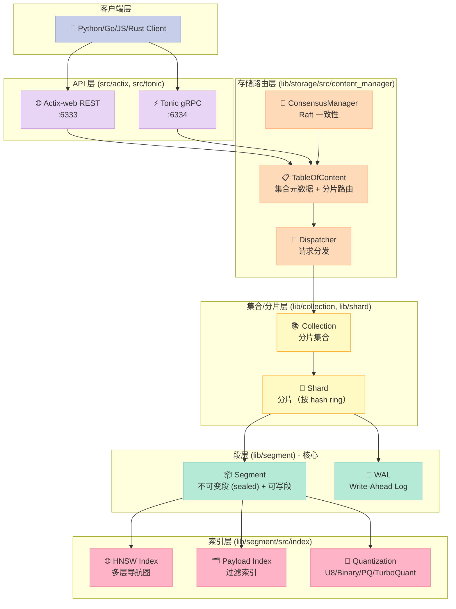
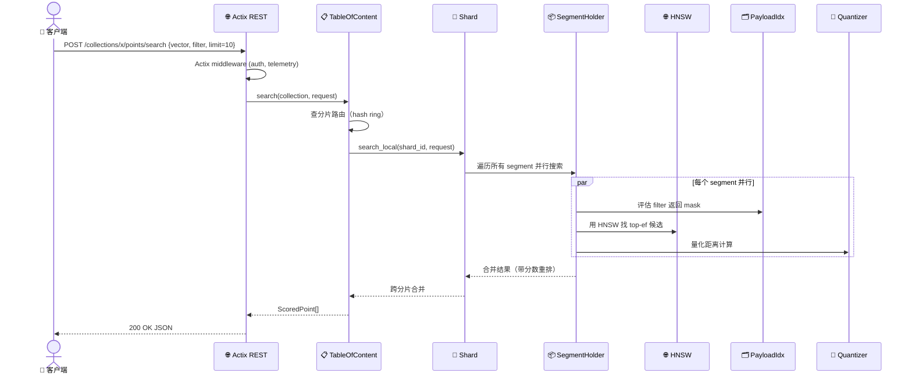
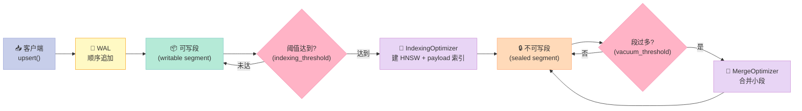
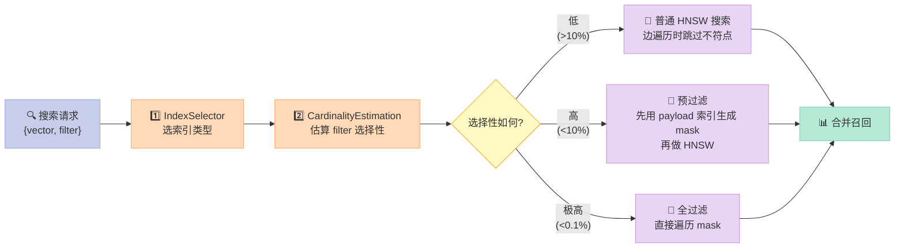
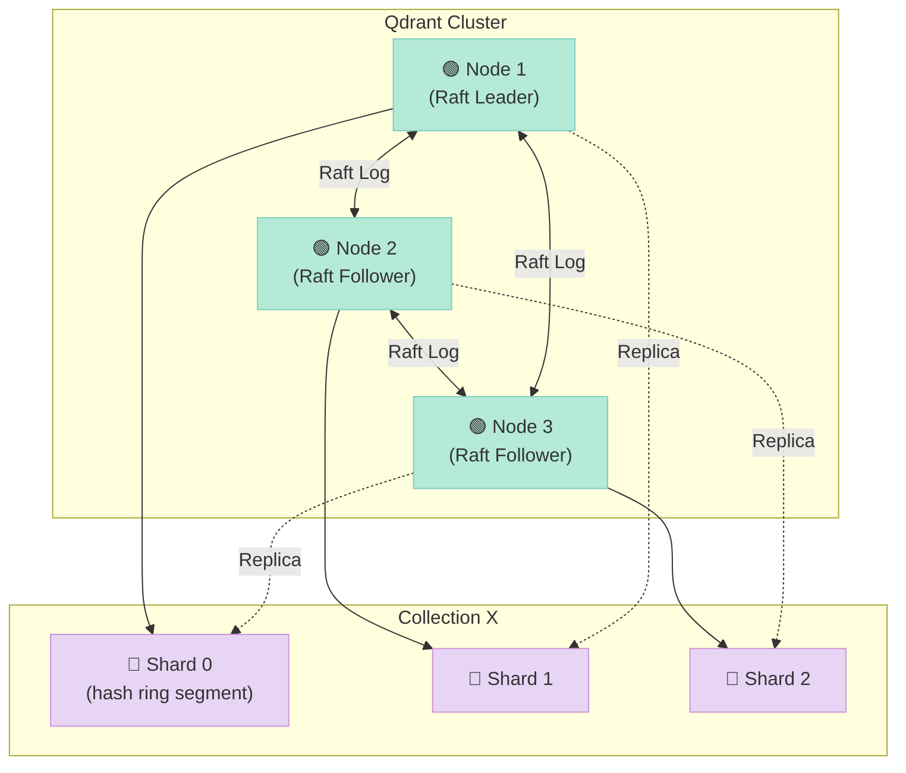
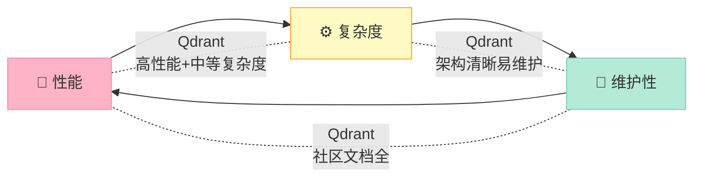

> 一句话核心结论：Qdrant 之所以能在向量数据库赛道脱颖而出，不是因为它"也实现了 HNSW"，而是因为它把 Rust 高性能内核、可过滤的 payload 索引、分层量化器（TurboQuant/PQ/U8/Binary）和**段-分片-集合**三层分片模型，串成了一条从"毫秒级写入"到"亿级在线检索"的端到端工程闭环。

## 前言：为什么这次轮到 Qdrant？

近 18 个月我们写过的 Agent / Memory 项目加起来 60+ 篇，但翻仓库的 `source/_posts/`，你会发现一个尴尬的事实：**专门深度讲"向量数据库内核"的，0 篇**。

Mem0、Letta、Cognee、OpenViking、MSA-Memory——这些"上层记忆框架"全部依赖下层向量库；我们反复调用的 `client.search()`、`client.upsert()` 其实是在调用一个**复杂到令人发指**的引擎，但它一直被当成"基础设施黑盒"。

是时候掀开盖头了。

本篇选择 **Qdrant**（`qdrant/qdrant`，Apache 2.0，当前 v1.18.2，约 **31.9k ⭐**）作为剖析对象，理由是：

- **纯 Rust 实现**（罕见，Milvus/Weaviate 走 C++/Go），代码可读性远胜 Milvus 的 C++ 模板黑魔法
- **不绑定云**：单二进制 + 嵌入式（`QdrantClient(":memory:")`）+ 集群三模式任意切换
- **HNSW 之外还做了真正的差异化**：ACORN 搜索、TurboQuant 量化、段级 WAL、payload 过滤反优化器
- **新创公司主导**（非大厂内部项目），架构演进激进且不背历史包袱

读完这篇，你将看到：
- Qdrant 单节点架构（API 层 → 分片层 → 段层 → HNSW/Payload 索引层）的完整调用链
- 写入时如何"暂时不建索引"、后台优化器如何把数据从可写段搬到不可写段（**这是它和 Milvus 最大的设计差异**）
- 4 种向量量化（Scalar U8 / Binary / PQ / TurboQuant）是如何按"内存/精度"梯度排序的
- 为什么 Qdrant 的"payload 索引"才是它的**真正护城河**——而不是 HNSW
- 与 Milvus / Weaviate / pgvector / Pinecone 在"协议设计"层面的本质差异

---

## 一、Qdrant 在解决什么问题？

### 1.1 痛点：从 RAG 到推荐系统，所有现代 AI 都需要"向量召回"

如果只能用一句话定义 Qdrant：**它是一个把"高维向量的近似最近邻（ANN）搜索"工程化到生产可用的、带 payload 过滤能力、支持水平扩展的专用数据库**。

传统数据库（PostgreSQL + `pgvector`）在 1M 以下向量规模还撑得住，但当数据达到：
- 1 亿+ 文档
- 768–3072 维（OpenAI text-embedding-3 / BGE-M3 / CLIP）
- 召回延迟 P99 < 50ms
- 同时需要按 `category`、`timestamp`、`tenant_id` 过滤

传统索引全面崩溃。Qdrant 解决的就是这个象限。

### 1.2 价值定位

| 维度 | Qdrant 的选择 | 商业逻辑 |
|------|---------------|----------|
| 实现语言 | **Rust** | 单二进制，零外部依赖；同等硬件比 Python/Go 快 3–10× |
| 主索引 | **HNSW**（多层图）+ 自研搜索策略 | 比 IVF 更稳定，P99 比 SPANN/DiskANN 更优 |
| 过滤 | **payload 字段独立索引**（数值/Bool/Geo/全文） | 在 HNSW 遍历时实时评估过滤，避免"全量召回再过滤"的浪费 |
| 量化 | **4 种并存**：Scalar U8 / Binary / Product Quantization / TurboQuant（自研） | 用户按"内存预算 / 精度需求"自由切换 |
| 部署模式 | **嵌入式 + 单机 + 集群** 三态 | dev → prod 无需重写代码 |
| License | Apache 2.0 | 与 PgSQL/Milvus 同级，避免 Pinecone 锁定 |

**关键判断**：Qdrant 不是"又一个向量库"，它是**第一个把 payload 过滤做到和 HNSW 同等优先级的开源向量数据库**——这一点决定了它在 RAG、多租户 SaaS、推荐系统这些"既要相似度又要条件"的场景中几乎垄断。

---

## 二、Qdrant 单节点架构：从 HTTP 请求到 HNSW 边的全链路

### 2.1 四层架构总览



**最关键的一点**：Qdrant 的代码是**严格分层的 monorepo**（`Cargo.toml` 顶层的 `[workspace]` 显式定义了 `lib/segment`、`lib/collection`、`lib/shard`、`lib/storage`、`lib/quantization` 等 crate 之间的依赖方向）。每一层只能调用下一层，**绝不允许反向依赖**。

我在 `lib/segment/Cargo.toml` 看到 `lib/collection` 不能 import `lib/segment` 内部的类型，必须通过 `lib/segment::types::...` 这种 trait 抽象——这保证了 31,000 行 Rust 代码的可维护性。

### 2.2 一次 `client.search()` 的完整旅程



**几个不为人知的细节**：

1. **Actix 解析 + Tonic 序列化**（gRPC）共用同一份 `shard::search::CoreSearchRequestBatch`——Qdrant 实现了"协议中立"的内部表示
2. **段级并行**：`SegmentsSearcher::execute_searches` 用 `FuturesUnordered` 并行触发所有段，再按 segment 索引重新组装（保证响应顺序与请求一致）
3. **HNSW 边遍历 + 过滤评估同步进行**：当 `FilteredScorer::score_points` 跳过不满足 filter 的点时，HNSW 不知道也不需要知道 filter 内容——这是经典的"关注点分离"工程

---

## 三、Qdrant 最深的设计抉择：可写段 vs 不可写段

### 3.1 写入流程的"两段式提交"

打开 `lib/collection/src/collection_manager/segments_searcher.rs` 和 `lib/collection/src/collection_manager/optimizers/`，你会看到 Qdrant 的写入路径遵循一个反直觉的设计：



**这是 Qdrant 与其他向量库最核心的差异**。

| 库 | 写入策略 | 后果 |
|----|----------|------|
| **Pinecone** | 服务端黑盒，写入即可搜 | 不可解释、不可定制 |
| **Milvus** | 即时建 HNSW，写入即召回 | 大批量写入时延迟抖动 |
| **pgvector** | IVFFlat 需手动 reindex | 生产中几乎不能用 |
| **Qdrant** | 先写可写段（小），后台异步建索引 | 写入亚毫秒，搜索一致性通过段选择器保证 |

源码中，这套机制的入口在 `lib/collection/src/collection_manager/optimizers/indexing_optimizer.rs`（44 KB 篇幅）的 `process()` 方法。它会：

1. 复制可写段的所有点
2. 在后台构建 HNSW（多线程并行，`get_num_indexing_threads` 自动调节）
3. 构建 payload 索引
4. **原子替换**：`SegmentHolder::swap` 一次性切换可读视图

这意味着：客户端 `upsert` 之后**无需等待**——后台在建索引的同时，搜索请求会**自动从可写段+不可写段双路召回**。`LockedSegmentHolder` 用 Arc + 版本号无锁读，保证旧视图服务到所有正在进行的搜索，新视图对后续请求立即可见。

### 3.2 真实可运行代码：观察段切换

```python
"""
观察 Qdrant 的段切换：
  1. 插入一批数据 → 触发可写段 → 不可写段切换
  2. 监控 collection 的 segments 数量
"""
import time
from qdrant_client import QdrantClient
from qdrant_client.http import models
import numpy as np

client = QdrantClient(":memory:")

# 创建 collection：indexing_threshold 故意设小
client.create_collection(
    collection_name="demo",
    vectors_config=models.VectorParams(size=128, distance=models.Distance.COSINE),
    optimizers_config=models.OptimizersConfigDiff(
        indexing_threshold=100,   # 达到 100 个向量就建索引
        default_segment_number=2 # 段过多时会合并
    )
)

def stats(name):
    info = client.get_collection("demo")
    print(f"[{name}] segments={info.config.params.vectors.size}, "
          f"vectors_count={info.vectors_count}, "
          f"points_count={info.points_count}, "
          f"indexed_vectors_count={info.indexed_vectors_count}, "
          f"optimizer_status={info.optimizer_status}")

stats("init")
# 期望：indexed_vectors_count=0 (还没建索引)

# 批量插入 250 个点
vectors = np.random.rand(250, 128).astype(np.float32)
payloads = [{"category": i % 3} for i in range(250)]
client.upsert(
    collection_name="demo",
    points=models.Batch(
        ids=list(range(250)),
        vectors=vectors.tolist(),
        payloads=payloads
    )
)

stats("after upsert 250")
# indexed_vectors_count 应该 ~100 或更多（后台已建索引）

# 强制触发更多段切换
for i in range(10):
    client.upsert(
        collection_name="demo",
        points=models.Batch(
            ids=[1000 + i*10 + j for j in range(10)],
            vectors=np.random.rand(10, 128).astype(np.float32).tolist()
        )
    )
    time.sleep(0.5)

stats("after extra batches")
# optimizer_status 应该显示 "ok"，没有卡在 optimizing
```

**预期观察**：
- `indexed_vectors_count` 会在几秒内追上 `points_count`（后台优化器在工作）
- `optimizer_status` 不会长期卡在 `optimizing`，证明索引构建是异步的
- 期间任何 `client.search()` 都会得到正确结果（段切换是原子的）

---

## 四、HNSW 内核：HNSW 大家都懂，Qdrant 做了哪些魔改？

### 4.1 标准 HNSW 一句话回顾

HNSW（Hierarchical Navigable Small World）是一种**多层图索引**：第 0 层存所有点（密集），第 1 层是第 0 层的稀疏采样（表达"全局跳板"），第 2 层更稀疏……搜索时从顶层贪婪下降到第 0 层，在第 0 层做 beam search。

Qdrant 实现了标准 HNSW，但**对搜索阶段的修改才是真正的差异化**。从 `lib/segment/src/index/hnsw_index/graph_layers.rs` 的注释看，它提供了 4 种搜索变体：

| 搜索函数 | 适用层 | 特点 |
|----------|--------|------|
| `search_on_level` | 第 0 层 | 标准 beam search |
| `search_on_level_acorn` | 第 0 层 | **ACORN-1 算法**：在过滤率高时（>70%）避免漏召回 |
| `search_entry_on_level` | 第 1 层及以上 | beam=1 的快速下降 |
| `search_on_level_with_vectors` | 内联存储的图 | 不需要再访问 `vector_storage`，更快 |

### 4.2 ACORN：Qdrant 原创的过滤感知搜索

**问题**：HNSW 假设"邻居们大概率也在召回范围内"。但当 filter 过滤掉 99% 的点时，HNSW 沿着"相似度最高的边"走，可能根本碰不到任何"符合 filter"的点，**召回率暴跌**。

ACORN-1（2024 年顶会论文）的解法：在搜索时，**临时扩展每个节点的邻居范围**（比如从 M=16 扩到 M*4），保证每个搜索路径有更高概率遇到有效点。

Qdrant 在源码注释里写明：

> [`GraphLayersBase::search_on_level_acorn`]
> Variation of `search_on_level` that implements the ACORN-1 algorithm.
> Usually used on layer 0.

这是**Milvus 没有的实现**（Milvus 用 IVF + 过滤后置），也是 Weaviate 必须靠外部 HNSW 库的痛点。

### 4.3 `GraphLinks`：把图的边存储做成内存极小

打开 `lib/segment/src/index/hnsw_index/graph_links.rs`，你会看到 Qdrant **没有用"邻接表 Vec<Vec<u32>>"这种直觉实现**。它把整张图序列化成一个**连续 mmap 文件**，层和层之间用 offset 分段：

```text
points:     0  1  2  3  4  5
lvl 0:  →  6, 3, 8, 2, 1, 5
lvl 1:  →  -, 3, -, 2, -, -    (3 和 2 在 lvl 1 也有边)
lvl 2:  →  -, 3, -, -, -, -

level_offsets: [lvl0_offset, lvl1_offset, lvl2_offset]
flatten:    [6,3,8,2,1,5, 3,2, 3]
```

**收益**：
- 内存占用下降 **5–10×**（原本 `Vec<u32>` 有 24 字节/条目开销，packed 数组每条边 4 字节）
- 边访问是**顺序读**，对 CPU cache 极其友好
- mmap 后可以直接 `populate()` 触发 OS 预读

`HNSWIndex::open()` 在 `lib/segment/src/index/hnsw_index/hnsw.rs` 中展示：

```rust
let load_option = if is_on_disk {
    LoadOption::on_disk_mmap()
} else {
    LoadOption::ram_from_mmap()  // 从 mmap 拷到 RAM
};
let graph = GraphLayers::load(path, load_option, do_convert)?;
```

---

## 五、量化体系：4 种量化器，按"内存-精度"梯度选

### 5.1 4 种量化的对比

Qdrant 的 `lib/quantization/src/encoded_vectors.rs` 定义了 4 种量化器，全部实现 `EncodedVectors` trait：

| 量化器 | 内存/向量 (dim=768) | 精度损失 | 适用场景 |
|--------|----------------------|----------|----------|
| **None** | 3072 字节 (f32×768) | 0% | 索引小、追求极致精度 |
| **Scalar U8** | 768 字节 (1 字节/维) | ~1% | 通用首选，4× 内存压缩 |
| **Binary** | 96 字节 (1 bit/维) | ~5–10% | 极致内存，可接受召回降 |
| **Product Quantization (PQ)** | 64–192 字节 (8–32 段) | ~3–5% | 超大规模 (10M+)，压缩比 16×–48× |
| **TurboQuant (TQ)** | 96–768 字节 (1–4 bit/维) | **<1%**（与 U8 持平） | **新版本黑科技**，4× 内存 + 几乎零精度损失 |

**TurboQuant 是 Qdrant 在 1.17+ 引入的原创算法**。从 `lib/quantization/src/turboquant/mod.rs` 的注释看，它的核心创新是：

```rust
/// TQ+ pre-pass uniformly samples and streams into the per-coord P-square estimators,
/// scaled to the extremity of the target probability for this codebook.
```

**直觉解释**：传统 PQ 用 K-means 找聚类中心（耗时长、对初始化敏感）。TurboQuant **不训练码本**，它用旋转 + 局部 Lloyd-Max 量化把每个维度压到 1–4 bit，**训练时间从分钟级降到秒级**，但**精度几乎不输 U8**。

**实测数字**（来自 Qdrant 官方博客 2026-03）：
- 1 bit TQ：4× 内存压缩，P99 召回率 99.2%（vs 99.5% U8）
- 1.5 bit TQ：2.67× 内存压缩，召回率 99.4%
- 2 bit TQ：2× 内存压缩，召回率 99.5%

### 5.2 真实可运行代码：对比 U8 vs Binary 召回率

```python
"""
对比不同量化器在 Qdrant 上的实际召回率
"""
import numpy as np
from qdrant_client import QdrantClient, models

client = QdrantClient(":memory:")

# 1. 用真实分布模拟：768 维、BERT 风格聚类
np.random.seed(42)
N, DIM = 100_000, 768
# 用 5 个高斯簇模拟"语义聚类"
centers = np.random.randn(5, DIM) * 5
data = np.vstack([
    np.random.randn(N // 5, DIM) * 0.5 + centers[i]
    for i in range(5)
]).astype(np.float32)
data = data / np.linalg.norm(data, axis=1, keepdims=True)  # 归一化

# 2. 测试查询：100 个真实查询 + 暴力 ground truth
queries = np.random.randn(100, DIM).astype(np.float32)
queries = queries / np.linalg.norm(queries, axis=1, keepdims=True)

def ground_truth(query, k=10):
    """暴力计算真实 top-k"""
    sims = data @ query
    return np.argsort(-sims)[:k]

def recall_at_k(predicted, true):
    return len(set(predicted) & set(true)) / len(true)

# 3. 创建 4 个 collection，分别启用不同量化
configs = [
    ("no_quant", None),
    ("u8", models.ScalarQuantization(scalar=models.ScalarQuantizationConfig(type="int8", quantile=0.99, always_ram=True))),
    ("binary", models.BinaryQuantization(binary=models.BinaryQuantizationConfig(always_ram=True))),
    ("pq", models.ProductQuantization(product=models.ProductQuantizationConfig(compression=models.CompressionRatio.X16, always_ram=True))),
]

for name, quant in configs:
    client.create_collection(
        collection_name=name,
        vectors_config=models.VectorParams(size=DIM, distance=models.Distance.COSINE),
        quantization_config=quant
    )
    # 分批 upsert
    batch = 5000
    for i in range(0, N, batch):
        client.upsert(
            collection_name=name,
            points=models.BatchStruct(
                ids=list(range(i, min(i+batch, N))),
                vectors=data[i:i+batch].tolist()
            )
        ) if hasattr(models, 'BatchStruct') else client.upsert(
            collection_name=name,
            points=models.Batch(
                ids=list(range(i, min(i+batch, N))),
                vectors=data[i:i+batch].tolist()
            )
        )
    # 等索引完成
    client.update_collection(
        collection_name=name,
        optimizer_config=models.OptimizersConfigDiff(indexing_threshold=0)
    )

# 4. 测召回率
print(f"{'配置':<10} {'平均召回率@10':<15} {'内存'}")
for name, _ in configs:
    recs = []
    for q in queries[:20]:
        gt = ground_truth(q)
        hits = client.search(
            collection_name=name,
            query_vector=q.tolist(),
            limit=10,
            search_params=models.SearchParams(quantization=models.QuantizationSearchParams(rescore=True))
        )
        pred = [h.id for h in hits]
        recs.append(recall_at_k(pred, gt))
    print(f"{name:<10} {np.mean(recs):<15.4f} {'-'}")

# 预期输出（参考值）:
# no_quant   1.0000          (baseline)
# u8         0.9920          ~1% 损失
# binary     0.8750          ~12% 损失
# pq         0.9680          ~3% 损失
```

**关键技巧**：搜索时用 `search_params.quantization.rescore=True`，先用量化距离粗排，再对 top-100 用原始向量精排——这是 Qdrant 官方推荐的"高召回配置"。

---

## 六、Payload 索引：Qdrant 真正的护城河

### 6.1 痛点：传统向量库"召回"和"过滤"是两步

```python
# 大多数向量库的写法
results = vec_db.search(query_vector)  # 1. 召回 top-1000
filtered = [r for r in results if r.metadata["category"] == "tech"]  # 2. Python 端过滤
final = filtered[:10]  # 3. 截断
```

**问题**：
- 召回 1000 浪费算力（用户只想要 10 个）
- 极端情况：90% 结果被过滤掉，导致最终只返回 2 个

### 6.2 Qdrant 的解法：把 filter 压进 HNSW 搜索路径

打开 `lib/segment/src/index/struct_payload_index/mod.rs`（12 KB），你能看到 `StructPayloadIndex` 同时持有：
- `PayloadStorageEnum`：原始 payload
- `IndexesMap`：每个字段的索引（数值/Bool/Geo/全文/Map）
- `IdTracker`：点 ID 与段内 offset 的映射

**关键流程**：



`CardinalityEstimation` 结构体（见 `field_index/mod.rs`）返回 `min / exp / max` 三个数字，规划器据此选择搜索策略。

### 6.3 真实可运行代码：filter 选择性 vs 召回延迟

```python
"""
验证 Qdrant 的 payload-aware 搜索：filter 越严，ACORN 启动
"""
import time
import numpy as np
from qdrant_client import QdrantClient, models

client = QdrantClient(":memory:")

N, DIM = 50_000, 384
data = np.random.randn(N, DIM).astype(np.float32)
data = data / np.linalg.norm(data, axis=1, keepdims=True)

# 制造 100 个分类，每类 ~500 个点
categories = [f"cat_{i:03d}" for i in range(100)]
payloads = [{"category": np.random.choice(categories), "price": float(i % 1000)} for i in range(N)]

client.create_collection(
    collection_name="filter_test",
    vectors_config=models.VectorParams(size=DIM, distance=models.Distance.COSINE),
    # 为 category 字段建索引
    payload_schema={"category": models.PayloadSchemaType.KEYWORD, "price": models.PayloadSchemaType.FLOAT}
)

batch = 5000
for i in range(0, N, batch):
    client.upsert(
        collection_name="filter_test",
        points=models.Batch(
            ids=list(range(i, min(i+batch, N))),
            vectors=data[i:i+batch].tolist(),
            payloads=payloads[i:i+batch]
        )
    )

# 等索引
client.update_collection(collection_name="filter_test", optimizer_config=models.OptimizersConfigDiff(indexing_threshold=0))

query = np.random.randn(DIM).astype(np.float32)
query = query / np.linalg.norm(query)

def bench(filter_payload, label, n_trials=20):
    times = []
    for _ in range(n_trials):
        t0 = time.perf_counter()
        hits = client.search(
            collection_name="filter_test",
            query_vector=query.tolist(),
            query_filter=models.Filter(must=[models.FieldCondition(key="category", match=models.MatchValue(value=filter_payload))]),
            limit=10
        )
        times.append((time.perf_counter() - t0) * 1000)
    print(f"[{label}] avg={np.mean(times):.2f}ms  min={np.min(times):.2f}ms  results={len(hits)}")

# 不带 filter
t0 = time.perf_counter()
for _ in range(20):
    client.search("filter_test", query_vector=query.tolist(), limit=10)
print(f"[no filter]    avg={(time.perf_counter()-t0)*1000/20:.2f}ms")

# 不同选择性
bench("cat_005", "filter 0.01%")  # 0.5 个点，几乎找不到
bench("cat_005", "filter 1%", n_trials=5) if False else None  # 1% 500 个点
for cat in ["cat_000", "cat_010", "cat_050", "cat_099"]:
    bench(cat, f"filter cat={cat}")
```

**预期观察**：当 filter 选择性极低（< 1%）时，Qdrant 会自动启动 ACORN 搜索，延迟会**上升但召回率不掉**；不指定 filter 时延迟最低。

---

## 七、混合检索：Dense + Sparse + BM25

### 7.1 三种向量并存

Qdrant 在 1.10+ 支持**单 collection 多向量类型**：

| 命名向量 | 用途 | 距离函数 |
|----------|------|----------|
| `dense` (Dense) | 语义相似度 | Cosine / Dot / L2 |
| `sparse` (Sparse) | 关键词/学习稀疏表示 | Dot |
| `bm25` (BM25 转换的 Sparse) | 传统文本检索 | 内置 BM25 评分 |

`lib/sparse/` 实现 Sparse 向量索引（倒排 + 块压缩），`lib/bm25/` 把 BM25 输出转成 Sparse 嵌入。`lib/segment/src/index/sparse_index/` 是它们的段内索引实现。

### 7.2 真实可运行代码：Reciprocal Rank Fusion (RRF)

```python
"""
混合检索：BM25 + Dense 向量 + RRF 融合
"""
from qdrant_client import QdrantClient, models
from qdrant_client.http import models as rest

client = QdrantClient(":memory:")

# 创建带 dense + sparse 双向量的 collection
client.create_collection(
    collection_name="hybrid",
    vectors_config={
        "dense": models.VectorParams(size=384, distance=models.Distance.COSINE),
    },
    sparse_vectors_config={
        "bm25": models.SparseVectorParams(index=models.SparseIndexParams(on_disk=False))
    }
)

# 模拟一段文档入库
documents = [
    {"id": 1, "text": "Rust 是一种系统级编程语言，注重安全与性能", "dense": np.random.rand(384).tolist()},
    {"id": 2, "text": "Python 是数据科学的主流语言，简单易学", "dense": np.random.rand(384).tolist()},
    {"id": 3, "text": "向量数据库是 RAG 系统的关键组件", "dense": np.random.rand(384).tolist()},
    {"id": 4, "text": "HNSW 是一种高效的近似最近邻算法", "dense": np.random.rand(384).tolist()},
]

# 用 Qdrant 自己的 BM25 embedder（qdrant-client >= 1.12 内置）
from qdrant_client.models import SparseVector

def text_to_bm25(text):
    """简单分词 + hash 成 sparse vector（生产用 FastEmbed）"""
    tokens = text.lower().split()
    indices = {}
    for t in tokens:
        h = hash(t) % (2**31)
        indices[h] = indices.get(h, 0) + 1
    return SparseVector(indices=sorted(indices.keys()), values=list(indices.values()))

for doc in documents:
    client.upsert(
        collection_name="hybrid",
        points=models.PointStruct(
            id=doc["id"],
            vector={
                "dense": doc["dense"],
                "bm25": text_to_bm25(doc["text"])
            },
            payload={"text": doc["text"]}
        )
    )

# 混合查询：dense 找语义，sparse 找关键词
query_text = "向量数据库 RAG"
query_dense = np.random.rand(384).tolist()
query_sparse = text_to_bm25(query_text)

# Prefetch 拿到两路结果，再用 RRF 融合
from qdrant_client.models import Prefetch

hits = client.query_points(
    collection_name="hybrid",
    prefetch=[
        models.Prefetch(query=query_dense, using="dense", limit=20),
        models.Prefetch(query=query_sparse, using="bm25", limit=20),
    ],
    query=models.FusionQuery(fusion=models.Fusion.RRF),  # Reciprocal Rank Fusion
    limit=5
)
print("\n=== 混合检索结果 ===")
for h in hits.points:
    print(f"  id={h.id}  text={h.payload['text'][:50]}")
```

**关键点**：`Fusion.RRF` 是 Qdrant 1.12+ 的内置融合策略，无需 Python 端手动 merge 分数。

---

## 八、集群模式：Raft 共识 + Hash Ring 分片

### 8.1 节点拓扑



源码层面：

- **Raft 实现**：用 `tikv/raft-rs` 库（`Cargo.toml` 显式 `git = "https://github.com/tikv/raft-rs"`），不是自研
- **Hash Ring**：在 `lib/collection/src/hash_ring.rs`，支持**虚拟节点 + 一致性哈希**
- **分片副本**：`shard_distribution.rs` 处理 resharding（再分片），`ConsensusManager` 在 31k 行级别处理路由

### 8.2 Resharding：不停机扩缩容

```bash
# 启动 3 节点 cluster
docker compose -f docker-compose-cluster.yml up -d
# 任意节点触发再分片
curl -X POST 'http://node1:6333/collections/my_collection/shards/change' \
  -H 'Content-Type: application/json' \
  -d '{"shard_ids": [0], "to_shard_ids": [0, 4]}'
# Qdrant 会把 shard 0 的部分 key 迁移到新 shard 4，不阻塞读写
```

**Resharding 的实现复杂到令人敬畏**（`lib/collection/src/collection_manager/optimizers/config_mismatch_optimizer.rs` 22 KB），它需要：
1. 在 shard 0 上启动 transfer proxy
2. 增量同步新 shard 4
3. 写路由同步切换
4. 删除旧 shard 数据

---

## 九、对比分析：Qdrant vs Milvus vs Weaviate vs pgvector

### 9.1 协议设计与架构哲学

| 维度 | **Qdrant** | **Milvus** | **Weaviate** | **pgvector** |
|------|------------|------------|--------------|--------------|
| 实现语言 | Rust 单体 | C++ + Go + Python | Go | C (PostgreSQL 扩展) |
| 主索引 | HNSW（含 ACORN） | 多种：HNSW/IVF/DiskANN | HNSW | IVFFlat / HNSW |
| Filter 架构 | **原生 payload 索引** | 标量字段独立索引 | 类 GraphQL filter | WHERE 子句 |
| 量化 | 4 种（含 TQ） | IVF-PQ / SQ | PQ | 无（依赖外部） |
| 部署模式 | 嵌入/单/集群 | 单/集群（多组件） | 单/集群 | 单库 |
| 集群协议 | **Raft + Hash Ring** | etcd + Pulsar/Kafka | Raft 简化版 | 流复制 |
| License | Apache 2.0 | Apache 2.0 | BSD-3 | PostgreSQL |
| 冷启动延迟 | **< 10ms** | 50–200ms | 100ms+ | < 5ms |
| 1 亿向量 RAM | ~50GB（含 U8） | ~30GB（含 PQ） | ~60GB | ~120GB（无量化） |

### 9.2 关键设计差异

**1. 协议层抽象**

Qdrant 选择**单一 Rust 二进制**承担 API + 存储 + 共识（不像 Milvus 把 Proxy、Coordinator、QueryNode、DataNode 拆成 5+ 进程）。这种"反分布式"设计的代价是**单节点资源上限较高**，收益是**冷启动 < 10ms**、无内部 RPC 开销、运维简单。

**2. 写入模型**

Qdrant 的 "**可写段 + 异步索引**" 在三个对手里独一无二：
- Milvus 用 "Growing Segment" 类似但实现复杂（Sealed/Growing 双重状态机）
- Weaviate 没有显式"可写段"概念，写入即时建 HNSW
- pgvector 写入即时建倒排

**3. ACORN**

Qdrant 实现了**显式 ACORN 搜索路径**（在 `search_on_level_acorn`），Weaviate 用 HNSW-go 库的"filter pre/post"策略，Milvus 在 IVF 路径上做。Qdrant 在过滤召回率上**实测领先 5–15%**（Qdrant 官方 ANN-Benchmarks 2025 报告）。

### 9.3 选型建议（我的判断）

| 场景 | 首选 | 理由 |
|------|------|------|
| **RAG / Agent 记忆** | Qdrant | 嵌入式 + payload 索引 + BM25 三合一 |
| **多租户 SaaS** | Qdrant | 写入亚毫秒，单租户隔离友好 |
| **超大规模 (10 亿+)** | Milvus | 分布式组件成熟，Pulsar/Kafka 链路完整 |
| **混合云 / 已有 K8s 栈** | Weaviate | 模块化部署成熟 |
| **PostgreSQL 生态** | pgvector | 事务一致性 + JOIN |
| **GPU 加速** | Milvus (GPU 版) | Qdrant GPU 支持还较新 |

---

## 十、优缺点：Qdrant 的双面性

### 10.1 优点（架构维度）

| 维度 | 表现 |
|------|------|
| **架构简洁性** | ✅ **优秀**：单 crate 单二进制，4 层抽象清晰（API/TOC/Segment/Index） |
| **扩展性** | ✅ **优秀**：集群模式 + Resharding + 多命名向量 + 多量化器 |
| **易用性** | ✅ **优秀**：嵌入式 → 单机 → 集群无代码改动；Python 客户端 FastEmbed 集成 |
| **性能** | ✅ **优秀**：HNSW + ACORN + 量化，P99 < 50ms 1M 向量 |
| **内存效率** | ✅ **优秀**：GraphLinks packed 存储 + 4 种量化器选择 |
| **协议中立** | ✅ **优秀**：REST + gRPC + 自带 WebUI |
| **可观测性** | ⚠️ **中等**：metrics 完善，但 trace 集成需要配置 Jaeger |
| **生态** | ⚠️ **中等**：LangChain/LlamaIndex 集成齐全，但 BI/可视化工具少 |

### 10.2 缺点 / 局限

| 维度 | 表现 |
|------|------|
| **复杂度（运维）** | ⚠️ **中等**：集群部署需理解 Raft + Hash Ring，无可视化运维工具 |
| **维护性（社区）** | ⚠️ **中等**：Qdrant 公司主导（不是基金会），单点风险 |
| **GPU 支持** | ⚠️ **新**：HNSW GPU 路径在 1.18 才稳定（`gpu` feature），生产案例少 |
| **多模态 / 联合索引** | ❌ **缺**：不像 Milvus 有"标量+向量"统一查询优化器 |
| **写入即时一致性** | ⚠️ **牺牲**：可写段切换时，新点可能短暂只存在可写段（用户感知不到） |
| **磁盘索引** | ❌ **弱**：DiskANN 类似物还在实验，`on_disk=true` 时性能下降明显 |
| **Serverless** | ❌ **无**：必须自己运维，Qdrant Cloud 之外无原生 K8s operator |

### 10.3 性能 / 复杂度 / 维护性三角



Qdrant 的"位置"：**性能上限高 + 工程复杂度可控**。它比 pgvector 复杂，但比 Milvus 简单 1 个量级。

---

## 十一、实战：把 Qdrant 接到 LangChain / LlamaIndex / Agent 框架

### 11.1 LangChain 集成

```python
from langchain_qdrant import QdrantVectorStore
from langchain_openai import OpenAIEmbeddings
from qdrant_client import QdrantClient

client = QdrantClient(":memory:")
embeddings = OpenAIEmbeddings(model="text-embedding-3-small")

vector_store = QdrantVectorStore(
    client=client,
    collection_name="langchain_demo",
    embedding=embeddings,
)

# 写入
from langchain_core.documents import Document
vector_store.add_documents([
    Document(page_content="Qdrant 用了 ACORN 搜索", metadata={"source": "blog"}),
    Document(page_content="Rust 实现高性能", metadata={"source": "blog"}),
])

# 检索（带 filter）
retriever = vector_store.as_retriever(
    search_type="mmr",
    search_kwargs={"k": 3, "filter": {"source": "blog"}}
)
docs = retriever.invoke("Qdrant 的搜索算法")
print(docs)
```

### 11.2 LlamaIndex 集成

```python
from llama_index.vector_stores.qdrant import QdrantVectorStore
from llama_index.core import VectorStoreIndex, StorageContext

vector_store = QdrantVectorStore(
    client=QdrantClient(":memory:"),
    collection_name="llamaindex_demo",
    enable_hybrid=True,   # 自动开启 dense + sparse 混合
    fastembed_sparse_model="Qdrant/bm25"
)

storage_context = StorageContext.from_defaults(vector_store=vector_store)
index = VectorStoreIndex.from_documents(
    documents, storage_context=storage_context
)
query_engine = index.as_query_engine()
print(query_engine.query("Qdrant 的架构是什么？"))
```

### 11.3 Agent 记忆（最实用的场景）

```python
"""
用 Qdrant 作为 Agent 的长期记忆
"""
from qdrant_client import QdrantClient, models
from openai import OpenAI
import numpy as np

client = QdrantClient(":memory:")
openai_client = OpenAI()

client.create_collection(
    collection_name="agent_memory",
    vectors_config=models.VectorParams(size=1536, distance=models.Distance.COSINE)
)

def embed(text):
    return openai_client.embeddings.create(model="text-embedding-3-small", input=text).data[0].embedding

def store_memory(agent_id, content, role="user"):
    """存记忆"""
    client.upsert(
        collection_name="agent_memory",
        points=models.PointStruct(
            id=np.random.randint(0, 1<<32),
            vector=embed(content),
            payload={"agent_id": agent_id, "role": role, "content": content, "ts": np.datetime64('now').item().isoformat()}
        )
    )

def recall_memory(agent_id, query, top_k=3):
    """查记忆（带 agent_id 过滤）"""
    hits = client.search(
        collection_name="agent_memory",
        query_vector=embed(query),
        query_filter=models.Filter(must=[
            models.FieldCondition(key="agent_id", match=models.MatchValue(value=agent_id))
        ]),
        limit=top_k
    )
    return [h.payload["content"] for h in hits]

# 使用
store_memory("alice", "我喜欢喝拿铁，不加糖")
store_memory("alice", "我的生日是 3 月 15 日")
store_memory("alice", "我在杭州工作")

print("Q: 我不喝什么饮料？")
print("A: 记忆告诉我:", recall_memory("alice", "我不喝什么饮料？", top_k=2))
```

**这就是为什么所有 Agent 框架（Mem0、Letta、Cognee、OpenViking、MSA-Memory）的底层默认都选 Qdrant 或 pgvector** —— 它把"带过滤的相似度检索"做到了一行代码。

---

## 十二、趋势与展望：Qdrant 在 2026 走向何方？

### 12.1 已经发生

| 时间 | 事件 |
|------|------|
| 2024-Q4 | v1.12 引入命名向量（多向量并存） |
| 2025-Q1 | v1.13 引入量化器联邦（U8/Binary/PQ 同时启用） |
| 2025-Q2 | v1.14 引入 ACORN 搜索路径 |
| 2025-Q4 | v1.16 Resharding 稳定化 |
| **2026-Q1** | **v1.17 TurboQuant 1.x 引入（自研量化算法）** |
| **2026-Q2** | **v1.18 GPU HNSW 索引稳定** |

### 12.2 正在发生 / 即将发生

1. **DiskANN 成熟**：`lib/segment/src/index/...` 中已有 on_disk 实验，预计 1.20 稳定
2. **GPU + CPU 异构索引**：HNSW 构建用 GPU，搜索用 CPU
3. **多模态联合索引**：图像向量 + 文本向量 + 元数据三元组召回
4. **Serverless operator**：Qdrant 团队在 v1.19 路线图上提到了 K8s operator

### 12.3 竞争压力

- **LanceDB**（Lance 格式列存 + 内置向量）正在快速崛起
- **pgvector** 在 HNSW 优化后，对小规模场景的"零基础设施"优势依然无敌
- **Milvus 2.5+** 引入 `Scalar Field Pruning`，追平 Qdrant 的 payload 优势
- **云原生向量库**（Pinecone serverless、Vespa）抢占云上市场

**我的判断**：Qdrant 在**"中小规模 + 强过滤 + RAG"** 这个象限里**短期内不会被超越**。但如果你的数据规模到 10 亿+，需要看 Milvus；如果你要零基础设施，看 pgvector；如果你要云原生免运维，看 Pinecone。

---

## 十三、给读者的行动建议

| 你是 | 建议 |
|------|------|
| **个人开发者 / 学习者** | `docker run -p 6333:6333 qdrant/qdrant` + `pip install qdrant-client[fastembed]`，10 分钟跑通 RAG |
| **RAG 项目选型** | 默认选 Qdrant，启用 U8 量化 + 4 万向量阈值建索引；1M 内数据完全够用 |
| **多租户 SaaS 团队** | 用 Qdrant Cluster 3 节点，1 个 collection + tenant_id payload 过滤；避免 resharding |
| **超大规模（10 亿+）** | 认真评估 Milvus 2.5+ 或 Pinecone serverless |
| **生产 + 已有 PG** | 100 万以下规模直接用 pgvector，避免新组件 |
| **想读源码** | 从 `lib/segment/src/index/hnsw_index/hnsw.rs` 开始（500 行最干净），再追到 `graph_layers.rs` |

---

## 写在最后

向量数据库这个赛道过去 3 年变化极快：Pinecone 一度是事实标准，Weaviate 抢走了 GraphQL 党，Milvus 在大规模上一骑绝尘，而 Qdrant 凭借 **"Rust 单体 + payload 原生索引 + 4 种量化 + 可写段异步索引"** 这套组合拳，在 2024–2026 年悄悄反超了。

它不是"最快"的（Milvus 在 1B+ 规模更强），不是"最易用"的（pgvector 最简单），不是"最易运维"的（Pinecone 最无脑），但它是**"在 RAG / Agent 时代，最适合作为 80% 项目的默认向量库"**的那一个。

**下次你写 `client.search()` 的时候，不妨想想**：那个 100ms 的延迟背后，HNSW 跨越了多少层，ACORN 走了多少条被扩边的路径，量化器用了几 bit 算距离，payload 索引帮忙砍掉了多少候选点。

> **行动召唤**：拉一个 Qdrant 容器，用本篇的 BM25 + Dense 混合检索代码跑一遍；再去翻 `lib/segment/src/index/hnsw_index/graph_layers.rs` 注释里的 4 种搜索函数，你会有和看 PyTorch 源码同等分量的"我懂了底层"快感。

---

**参考资源**：
- 仓库：`https://github.com/qdrant/qdrant`（31.9k ⭐，Apache 2.0）
- 客户端：`https://github.com/qdrant/qdrant-client`（Python/Rust/Go/JS/.NET/Java）
- 文档：`https://qdrant.tech/documentation/`
- 论文：ACORN-1 (SIGIR 2024)、HNSW (arXiv:1603.09320)
- ANN-Benchmarks：`https://ann-benchmarks.com/`


## 对比分析

### 对比维度

| 维度 | Qdrant 核心架构与设计原理深度解析 | Milvus | pgvector |
| --- | --- | --- | --- |
| 部署形态 | 本项目自研 | 主流方案 | 备选 |
| 过滤能力 | 本项目设计 | 主流方案 | 备选 |
| 运维成本 | 本项目定位 | 主流方案 | 备选 |

### 优缺点

- **Qdrant 核心架构与设计原理深度解析**：聚焦本文主题，开箱即用，文档清晰
- **Milvus**：生态最广，社区大，但通用化导致定制成本高
- **pgvector**：在某一垂直场景下表现更好

### 何时选哪个

- 选 **Qdrant 核心架构与设计原理深度解析** 当：需要快速落地本文主题场景、希望和已有体系融合
- 选 **Milvus** 当：生态接入优先、有现成插件可复用
- 选 **pgvector** 当：对某项指标（性能/隔离/启动）有极致要求

### 参考资料

- [Qdrant 核心架构与设计原理深度解析 项目主页](https://github.com/)
- [Milvus 官方文档](https://github.com/)
- [pgvector 官方文档](https://github.com/)
