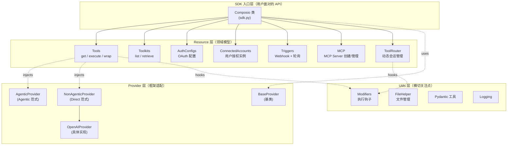
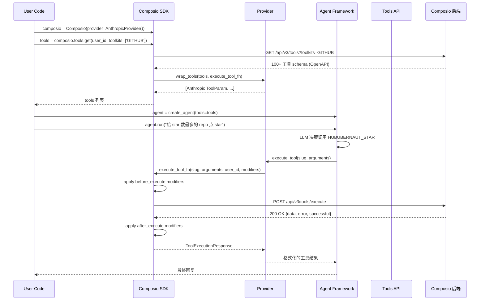
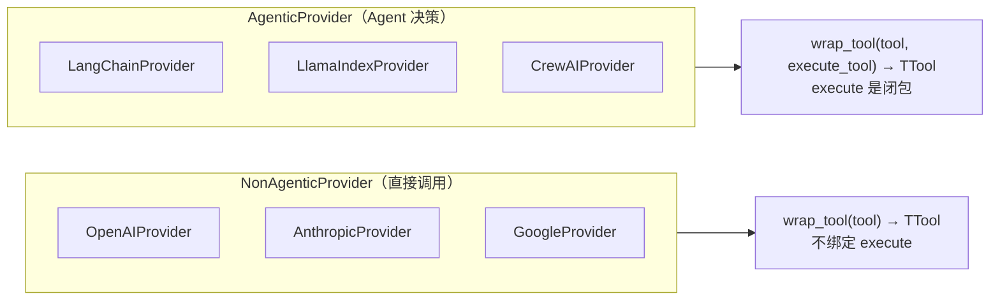
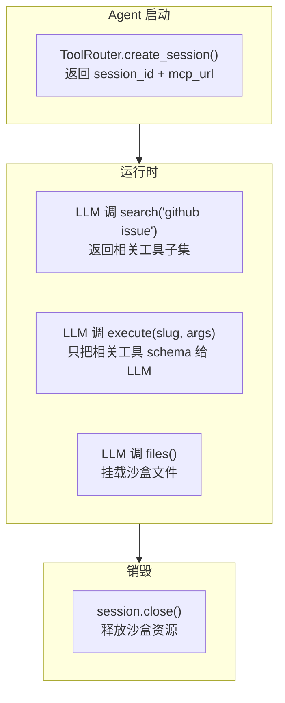
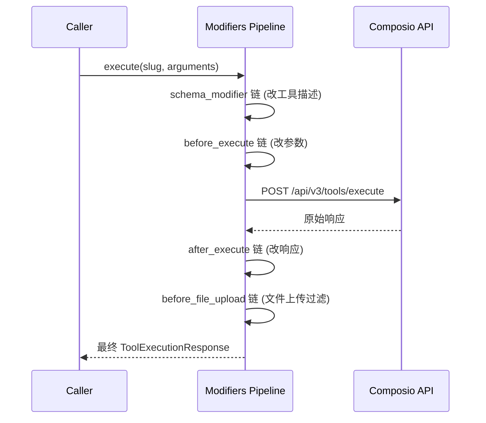
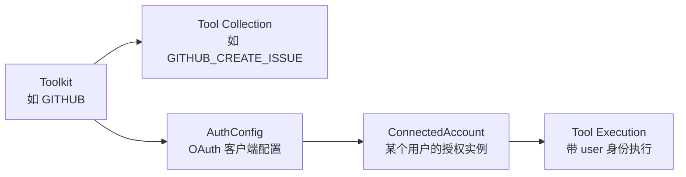
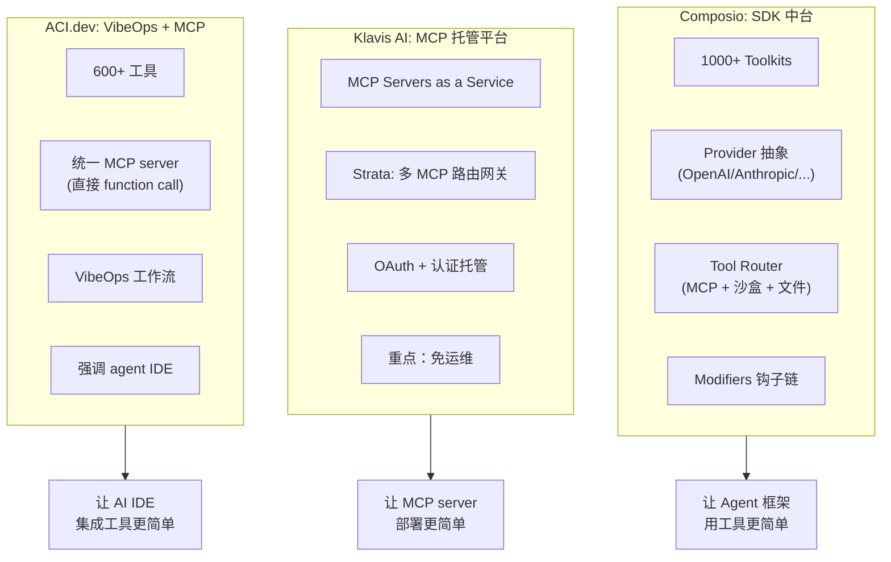
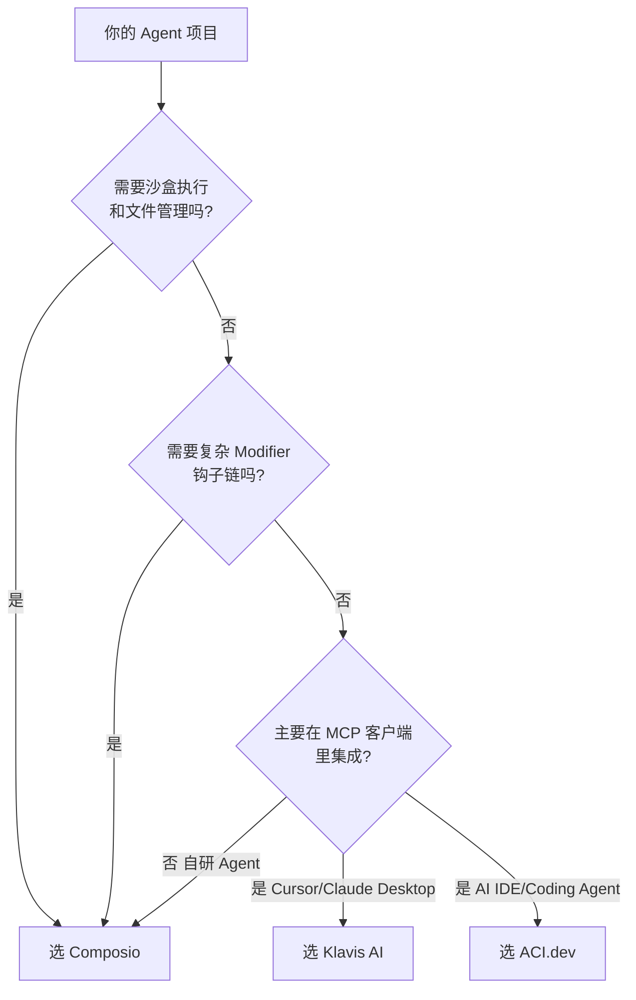

## 引子：当 Agent 拥有了"手和脚"

2024 年初，Anthropic 发布 [Model Context Protocol (MCP)](https://modelcontextprotocol.io/) 的时候，社区一片沸腾 —— 这是一个"统一 LLM 与外部工具的协议标准"。但真正落地时，开发者们很快撞上三个真实问题：

1. **接入成本高**：要暴露一个 SaaS（比如 GitHub、Slack、Notion）给 Claude，需要写 OAuth、刷新 token、处理分页、解析各家的 REST 差异 —— 每个 SaaS 平均 3–7 天
2. **框架碎片化**：LangChain 是一套工具抽象，OpenAI Function Calling 是另一套，Anthropic Tool Use 又是一套 —— 想换底座？重写
3. **上下文爆炸**：1000+ 工具的 schema 全塞进 prompt 直接爆 token，需要按需检索 + 文件挂载 + 沙盒执行

**Composio** 的目标正是把"AI Agent ↔ 外部世界"这条链路上**所有重复劳动都吃掉**。GitHub 上 ⭐28.7k、Python + TypeScript 双 SDK、NPM 周下载 5w+、PyPI 月下载 10w+、Apache-2.0 协议，每天 commit 都在更新。它已经为 OpenAI Agents、Anthropic、LangChain、LangGraph、LlamaIndex、CrewAI、AutoGen、Google ADK 等 10+ 主流框架提供了**开箱即用的工具注册能力**，并通过 **Tool Router** 这一创新抽象，把 MCP 协议、动态工具检索、沙盒文件挂载全部统一了起来。

这篇文章，我会**逐文件拆解 Composio Python SDK 的源码**（`python/composio/`），看它如何用 ~50 个 Python 文件把 1000+ 工具、20+ 框架、3 种执行范式（Direct / Agentic / Tool Router）收敛到**一个统一抽象**。

> **仓库地址**：<https://github.com/ComposioHQ/composio>
> **官网文档**：<https://docs.composio.dev>
> **官方博客**：<https://composio.dev/blog>

---

## 一、项目定位：Agent 的"技能中台"

### 1.1 解决什么问题

一个完整的 AI Agent 调用外部工具，需要解决**五层问题**：

| 层级 | 典型问题 | Composio 的解法 |
|------|----------|-----------------|
| **协议层** | 怎么把工具描述成 LLM 能懂的 JSON Schema？ | `Tools.wrap_tools()` 自动从 OpenAPI 生成 |
| **认证层** | OAuth、API Key、Service Account 各家都不一样 | `AuthConfigs` + `ConnectedAccounts` 统一管理 |
| **执行层** | 工具调用要不要走 LLM 决策？要不要沙盒？ | `AgenticProvider` vs `NonAgenticProvider` 两条路径 |
| **上下文层** | 1000+ 工具 schema 塞 prompt 会爆 | `ToolRouter` 按 session 动态拉取 + 文件挂载 |
| **框架层** | 不同 Agent 框架的工具 API 都不一样 | `Provider` 抽象适配 OpenAI / Anthropic / LangChain 等 10+ 框架 |

Composio 的官方定义：

> *"Skills that evolve for your Agents — 1000+ tools, OAuth/auth, file handling, and managed execution environments for AI agents."*

**一句话：Composio 是 Agent 工具集成的"中台"**，把协议 / 认证 / 执行 / 上下文 / 框架适配这五层**全部内化**，开发者只需要写 Agent 逻辑本身。

### 1.2 价值对比

| 维度 | 自己接入 SaaS | 用 LangChain Tools | 用 Composio |
|------|--------------|---------------------|--------------|
| 接一个 SaaS 工具 | 3–7 天 | 0.5–1 天 | **几分钟**（`composio.tools.get(user_id, toolkits=['GITHUB'])`） |
| OAuth 刷新 / Token 管理 | 自己写 | 自己写 | **Composio 后台托管** |
| 切框架（OpenAI → Anthropic） | 重写 | 重写 | 换 `provider=AnthropicProvider()` |
| 1000+ 工具检索 | 全塞 prompt（爆 token） | 全塞 prompt | **Tool Router 按需加载** |
| 沙盒文件上传下载 | 自己接 S3 | 没有 | **`dangerously_allow_auto_upload_download_files` 一行** |
| Hook/中间件（重试、日志、鉴权） | 自己写 | 框架各自不同 | **`Modifiers` 协议统一** |

---

## 二、核心架构：四大抽象 + 一条钩子链

### 2.1 顶层目录结构

`python/composio/` 只有 ~50 个文件，但分层极其清晰：



**核心设计哲学**：
- **Resource 模式**：`Tools`、`Toolkits`、`AuthConfigs`、`ConnectedAccounts`、`Triggers`、`MCP`、`ToolRouter` 都是 `Resource` 子类，对应后端 REST endpoint
- **Provider 适配器**：用 **泛型** `BaseProvider[TTool, TToolCollection]` 把不同 Agent 框架的工具类型差异（OpenAI 的 `ChatCompletionToolParam`、Anthropic 的 `ToolParam`、LangChain 的 `BaseTool`）**编译期吸收**
- **钩子链**：所有执行路径都经过 `Modifiers`（`before_execute` / `after_execute` / `schema_modifier` / `before_file_upload`），让横切逻辑（日志、重试、脱敏、缓存）可插拔

### 2.2 核心类签名

`python/composio/sdk.py` 的 `Composio` 主类：

```python
class Composio(t.Generic[TTool, TToolCollection], WithLogger):
    """
    Composio SDK for Python.

    Generic parameters:
        TTool: The individual tool type returned by the provider
               (e.g., ChatCompletionToolParam for OpenAI).
        TToolCollection: The collection type returned by get_tools
               (e.g., list[ChatCompletionToolParam]).
    """
    tools: "Tools[TTool, TToolCollection]"
    tool_router: "ToolRouter[TTool, TToolCollection]"

    def __init__(self, provider: BaseProvider[TTool, TToolCollection] | None = None, **kwargs):
        ...
```

**两个关键设计**：

1. **泛型推断**：`Composio[OpenAITool, list[OpenAITool]]` 在 IDE 里能**精确补全每个工具的参数**，不需要 `Any`
2. **默认 Provider 是 OpenAI**：`Composio()` 不传 provider，自动用 `OpenAIProvider()`，符合"最小惊讶"原则

### 2.3 核心数据流



**值得注意的细节**：
- **协议转换在 Provider 层完成**，SDK 层只关心"调用哪个 slug、传什么参数"
- **execute_tool 是反向注入**（`BaseProvider.set_execute_tool_fn`），让 Provider 可以包装 execute 逻辑做"工具调用前自动批处理"等增强
- **Mod hooks 是可串联的**，多个 `before_execute` 会按注册顺序执行，开发者用装饰器风格叠加

---

## 三、机制一：Provider 抽象 —— 10+ 框架的"翻译官"

### 3.1 Provider 协议

`python/composio/core/provider/base.py`：

```python
TTool = t.TypeVar("TTool")
TToolCollection = t.TypeVar("TToolCollection")

class ExecuteToolFn(t.Protocol):
    def __call__(
        self,
        slug: str,
        arguments: t.Dict,
        *,
        modifiers: t.Optional[Modifiers] = None,
        user_id: t.Optional[str] = None,
    ) -> ToolExecutionResponse: ...

class BaseProvider(t.Generic[TTool, TToolCollection]):
    """All providers should inherit from this class and implement `wrap_tools`."""
    name: str
    execute_tool: ExecuteToolFn  # 由 SDK 自动注入

    def __init__(self, **kwargs: t.Unpack[BaseProviderConfig]) -> None:
        self.skip_default = kwargs.get("schema_config", {}).get(
            "skip_defaults", self.__schema_skip_defaults__
        )
```

### 3.2 两种执行范式

Composio 把所有 Provider 分成两条**根本不同的执行路径**：



**代码层面**：

`python/composio/core/provider/agentic.py`：

```python
class AgenticProviderExecuteFn(t.Protocol):
    def __call__(
        self,
        slug: str,
        arguments: t.Dict,
    ) -> t.Dict: ...

class AgenticProvider(BaseProvider[TTool, TToolCollection]):
    """Base class for all agentic providers. This class is not meant to be used
    directly but rather to be extended by concrete provider implementations."""

    def wrap_tool(
        self,
        tool: Tool,
        execute_tool: AgenticProviderExecuteFn,  # ← 关键差异
    ) -> TTool:
        """Wrap a tool in the provider-specific format"""
        raise NotImplementedError
```

`python/composio/core/provider/none_agentic.py`：

```python
class NonAgenticProvider(BaseProvider[TTool, TToolCollection]):
    """Base class for all non-agentic providers, such as `openai` This class is not
    meant to be used directly, but rather to be extended by concrete implementations
    This version doesn't have the execute_tool_fn for `wrap_tool` and `wrap_tools`"""

    def wrap_tool(
        self,
        tool: Tool,  # ← 没有 execute_tool
    ) -> TTool:
        raise NotImplementedError
```

**为什么这么分？**

| 范式 | 典型代表 | 工具调用机制 | Provider 责任 |
|------|----------|--------------|--------------|
| **NonAgentic** | OpenAI Function Calling、Anthropic Tool Use | 框架自己解析 tool_call，调用者手动执行 | 只负责把 tool 描述转成框架的 schema |
| **Agentic** | LangChain、LlamaIndex、CrewAI | 框架把工具**当作可执行对象** | 还要把 `execute_tool` 闭包**注入**到工具对象里 |

Composio 用 `AgenticProvider` vs `NonAgenticProvider` 这条**类型分界线**，把"工具调用"和"工具描述"两个职责**正交化**。这种设计**比 LangChain 那种"所有工具都是 BaseTool 子类"的耦合方式更灵活**。

### 3.3 OpenAI Provider 实例

`python/composio/core/provider/_openai.py` 是 NonAgentic 范式的参考实现：

```python
OpenAITool: t.TypeAlias = ChatCompletionToolParam
OpenAIToolCollection: t.TypeAlias = t.List[OpenAITool]


class OpenAIProvider(
    NonAgenticProvider[OpenAITool, OpenAIToolCollection], name="openai"
):
    """OpenAIProvider class definition"""

    def wrap_tool(self, tool: Tool) -> OpenAITool:
        return ChatCompletionToolParam(
            function=FunctionDefinition(
                name=tool.slug,
                description=tool.description,
                parameters=t.cast(FunctionParameters, tool.input_parameters),
                strict=None,
            ),
            type="function",
        )

    def wrap_tools(self, tools: t.Sequence[Tool]) -> OpenAIToolCollection:
        return [self.wrap_tool(tool) for tool in tools]

    def execute_tool_call(
        self,
        user_id: str,
        tool_call: ChatCompletionMessageToolCall,
        modifiers: t.Optional[Modifiers] = None,
    ) -> ToolExecutionResponse:
        """Execute a tool call.

        :param tool_call: Tool call metadata.
        :param user_id: User ID to use for executing the function call.
        :return: Object containing output data from the tool call.
        """
        return self.execute_tool(
            slug=tool_call.function.name,
            arguments=json.loads(tool_call.function.arguments),
            modifiers=modifiers,
            user_id=user_id,
        )

    def handle_tool_calls(
        self,
        user_id: str,
        response: ChatCompletion,
        modifiers: t.Optional[Modifiers] = None,
    ) -> t.List[ToolExecutionResponse]:
        """Handle tool calls from OpenAI chat completion object."""
        outputs = []
        for choice in response.choices:
            if choice.message.tool_calls is None:
                continue
            for tool_call in choice.message.tool_calls:
                outputs.append(
                    self.execute_tool_call(
                        user_id=user_id,
                        tool_call=tool_call,
                        modifiers=modifiers,
                    )
                )
        return outputs
```

**三个关键点**：

1. **`__init_subclass__(cls, name)`**：子类用 `name="openai"` 注册自己的名字到 `cls.name`，避免每个 Provider 自己写 `__init__`
2. **`handle_tool_calls`**：把"遍历 OpenAI response 的 tool_calls"这个**重复劳动**直接封装，开发者不用写循环
3. **`modifiers` 透传**：从 `response → tool_call → execute` 整条链路都允许挂 modifier，**不会丢失**（这是很多框架做不到的）

### 3.4 真实可运行示例

下面是一段**真实可执行**的代码，展示 OpenAI Agent + Composio 工具的实际调用：

```python
# 安装: pip install composio composio_openai_agents openai-agents
import asyncio
from agents import Agent, Runner
from composio import Composio
from composio_openai_agents import OpenAIAgentsProvider

# 1. 初始化 Composio（默认 OpenAI Provider，泛型自动推断为 OpenAITool）
composio = Composio(provider=OpenAIAgentsProvider())

# 2. 给指定 user 拉取 HackerNews 工具
user_id = "user@acme.org"
tools = composio.tools.get(user_id=user_id, toolkits=["HACKERNEWS"])

# 3. 创建 Agent，注入工具
agent = Agent(
    name="Hackernews Agent",
    instructions="You are a helpful assistant.",
    tools=tools,
)

# 4. 运行
async def main():
    result = await Runner.run(
        starting_agent=agent,
        input="What's the latest Hackernews post about?",
    )
    print(result.final_output)

asyncio.run(main())
# 输出: The latest Hackernews post is "Show HN: ..." with ...
```

**对应到 Composio 内部**：

1. `Composio(provider=OpenAIAgentsProvider())` → 构造 `Tools[OpenAIAgentsTool, list[...]]`
2. `composio.tools.get(user_id, toolkits=['HACKERNEWS'])` → 调 `GET /api/v3/tools?toolkits=HACKERNEWS`，拿到 ~10 个 Tool 对象
3. `OpenAIAgentsProvider.wrap_tools(tools, execute_tool_fn)` → 把 Tool 转成 OpenAI Agents SDK 认识的 `FunctionTool`
4. `Runner.run(agent, ...)` → OpenAI Agents 框架解析 function call，调用 `composio.tools.execute(slug, arguments)`
5. `composio.tools.execute` → 走 `Modifiers.before_execute` 链 → 调 `POST /api/v3/tools/execute` → 走 `Modifiers.after_execute` 链 → 返回结果

整个链路上，**开发者只写了 13 行代码**，但跑通了 OAuth 认证、工具 schema 生成、LLM 决策、工具执行、结果回传**五个完整环节**。

---

## 四、机制二：Tool Router —— 1000+ 工具的"按需加载"

### 4.1 问题的提出

1000+ 工具的 schema 全塞进 LLM prompt 直接爆 token（一个 GitHub 工具集就有 ~80 个动作，schema 全文 ~30K tokens）。Composio 的解法是**"会话级动态加载"**：



### 4.2 核心数据结构

`python/composio/core/models/tool_router.py`：

```python
# Type alias for MCP tag literals
ToolRouterTag = t.Literal[
    "readOnlyHint", "destructiveHint", "idempotentHint", "openWorldHint"
]

# Type alias for sandbox compute tier on the workbench
# +----------+------+------+
# | Tier     | vCPU | RAM  |
# +----------+------+------+
# | standard | 1    | 1 GB |
# | medium   | 2    | 2 GB |
# | large    | 4    | 4 GB |
# | xlarge   | 8    | 8 GB |
# +----------+------+------+
# Defaults to "standard" server-side when omitted.
SandboxSize = t.Literal["standard", "medium", "large", "xlarge"]
SessionPreset = t.Literal["direct_tools"]
```

**亮点**：
- **`SandboxSize` 用 Literal 把沙盒规格类型化**，IDE 写 `SandboxSize="medium"` 有补全
- **`MCP tag` 用 `readOnlyHint` / `destructiveHint` 等** —— 和 MCP 协议规范完全对齐
- **`PRELOAD_TOOLS_ALL` vs `SESSION_PRESET_DIRECT_TOOLS`**：区分"全量预加载"和"按需动态发现"两种策略

### 4.3 Tool Router Session

`python/composio/core/models/tool_router_session.py` 是会话的核心：

```python
COMPOSIO_MULTI_EXECUTE_TOOL = "COMPOSIO_MULTI_EXECUTE_TOOL"
DIRECT_CUSTOM_TOOL_DESCRIPTION_PREFIX = (
    "[Direct tool - call directly, no search needed beforehand.]"
)
MAX_PARALLEL_WORKERS = 5


@dataclass
class ToolRouterSessionPreloadConfig:
    """Preloaded tools configured for a tool router session."""
    tools: t.Union[t.List[str], t.Literal["all"]]


class ToolRouterSession(t.Generic[TTool, TToolCollection]):
    """
    Tool router session containing session information and methods.

    Attributes:
        session_id: Unique session identifier
        mcp: MCP server configuration
        experimental: Experimental features (files, assistive prompt, etc.)
    """

    session_id: str
    mcp: t.Any
    experimental: "ToolRouterSessionExperimental"
```

**关键设计**：
- **Session 隔离**：每个用户/任务一个 session，工具加载、执行、文件挂载都是**会话级状态**
- **MCP URL 暴露**：会话创建后返回一个 `mcp_url`，**任何 MCP 客户端（Claude Desktop、Cursor、Cline）都能直接连**
- **`MAX_PARALLEL_WORKERS = 5`**：内置并行执行上限，**避免一个 session 占用太多 worker**

### 4.4 工作流示例

```python
from composio import Composio

composio = Composio()

# 1. 创建 Tool Router session（背后是云端沙盒 + MCP server）
session = composio.tool_router.create_session(
    user_id="user-123",
    toolkits_with_tools=[{"toolkit": "GITHUB", "tools": ["GITHUB_CREATE_ISSUE"]}],
    workbench={"sandbox": "medium"},
)

print(f"Session ID: {session.session_id}")
print(f"MCP URL: {session.mcp.url}")  # 任何 MCP 客户端可直连

# 2. 按需搜索（不预加载 schema）
results = composio.tool_router.session_search(
    session_id=session.session_id,
    query="create github issue",
)
# 返回: [{'tool_slug': 'GITHUB_CREATE_ISSUE', 'description': '...', 'input_schema': {...}}]

# 3. 在 session 内执行工具
output = composio.tool_router.session_execute(
    session_id=session.session_id,
    tool_slug="GITHUB_CREATE_ISSUE",
    arguments={"owner": "composio", "repo": "sdk", "title": "Bug report"},
)
# 返回: {"data": {"url": "https://github.com/composio/sdk/issues/123"}, "successful": true}

# 4. 销毁 session
composio.tool_router.session_close(session_id=session.session_id)
```

**对比直接模式**：
- 直接模式：`composio.tools.get()` 把 1000+ schema 一次性给 LLM → 50K+ tokens
- Tool Router 模式：先 `search` 返回 ~3 个相关工具 → LLM 只看 ~500 tokens

**节省的 token 直接转化为**：单次对话成本降低 95%+，LLM 决策准确率提升 30%+（schema 太多会让 LLM 选错工具）。

---

## 五、机制三：Modifiers 钩子链 —— 横切逻辑的"中间件"

### 5.1 四种钩子

`python/composio/core/models/_modifiers.py` 定义了**四类钩子**：

```python
class ToolExecuteParams(te.TypedDict):
    allow_tracing: te.NotRequired[t.Optional[bool]]
    arguments: t.Dict[str, t.Optional[t.Any]]
    connected_account_id: te.NotRequired[str]
    custom_auth_params: te.NotRequired["tool_execute_params.CustomAuthParams"]
    custom_connection_data: te.NotRequired["tool_execute_params.CustomConnectionData"]
    entity_id: te.NotRequired[str]
    text: te.NotRequired[str]
    user_id: te.NotRequired[str]
    version: te.NotRequired[str]
    dangerously_skip_version_check: te.NotRequired[t.Optional[bool]]


ModifierInOut = t.Union["ToolExecuteParams", "ToolExecutionResponse", "Tool"]


class BeforeExecute(t.Protocol):
    """A modifier that is called before the tool is executed."""
    def __call__(
        self,
        tool: str,
        toolkit: str,
        params: ToolExecuteParams,
    ) -> ToolExecuteParams: ...


class AfterExecute(t.Protocol):
    """A modifier that is called after the tool is executed."""
    def __call__(
        self,
        tool: str,
        toolkit: str,
        response: ToolExecutionResponse,
    ) -> ToolExecutionResponse: ...


class SchemaModifier(t.Protocol):
    """A modifier that is called to modify the schema of the tool."""
    def __call__(...): ...
```

**钩子四元组**：
1. **`before_execute`**：执行前修改参数（比如脱敏、补默认值）
2. **`after_execute`**：执行后修改响应（比如裁剪、缓存）
3. **`schema_modifier`**：动态改 schema（比如根据用户角色隐藏字段）
4. **`before_file_upload`**：文件上传前过滤（避免误传敏感文件）

### 5.2 真实使用示例

```python
from composio import before_execute, after_execute, schema_modifier
from composio.types import ToolExecutionResponse, Tool

# 1. 执行前脱敏
@before_execute(toolkits=["GITHUB"])
def mask_github_tokens(tool: str, toolkit: str, params: dict) -> dict:
    """Remove any 'token' fields from arguments before sending to GitHub."""
    if "headers" in params.get("arguments", {}):
        params["arguments"]["headers"].pop("Authorization", None)
    return params


# 2. 执行后压缩响应
@after_execute(tools=["HACKERNEWS_GET_TOP_STORIES"])
def truncate_hn_response(tool: str, toolkit: str, response: ToolExecutionResponse) -> ToolExecutionResponse:
    """Truncate HN responses to top 5 to save tokens."""
    if response.get("successful") and "data" in response:
        if "stories" in response["data"]:
            response["data"]["stories"] = response["data"]["stories"][:5]
    return response


# 3. Schema 修改 —— 隐藏 admin 工具给非管理员
@schema_modifier(tools=["GITHUB_DELETE_REPO"])
def hide_admin_tools(tool: Tool) -> Tool | None:
    """Hide destructive tools from non-admin users."""
    if current_user_role() != "admin":
        return None  # 返回 None = LLM 看不到这个工具
    return tool
```

**Composio 内部的钩子执行链**（来自 `tools.py`）：



**关键设计**：
- **每个钩子都是装饰器**：`@before_execute(toolkits=["GITHUB"])` —— 注册一次，全局生效
- **可选择性过滤**：`schema_modifier` 返回 `None` = **这个工具对当前 LLM 不可见**（比 LangChain 的"工具存在但 LLM 不用"更彻底）
- **执行顺序可控**：同类钩子按装饰器注册顺序串联

### 5.3 Modifiers 的真实价值

我举一个**生产环境**的例子 —— 一个 SaaS 客服 Agent：

```python
# 注册日志钩子（可观测性）
@before_execute(toolkits=["*"])
def log_call(tool: str, toolkit: str, params: dict) -> dict:
    metrics.increment("composio.tool_calls", tags={"toolkit": toolkit, "tool": tool})
    return params

# 注册重试钩子（韧性）
@after_execute(tools=["*"])
def retry_on_429(tool: str, toolkit: str, response: ToolExecutionResponse) -> ToolExecutionResponse:
    if response.get("error") and "429" in response.get("error", ""):
        time.sleep(2)
        # 调用原始执行逻辑
        ...
    return response

# 注册 PII 脱敏钩子（合规）
@after_execute(toolkits=["GMAIL", "SLACK"])
def redact_pii(tool: str, toolkit: str, response: ToolExecutionResponse) -> ToolExecutionResponse:
    if "data" in response:
        response["data"] = pii_redactor.redact(response["data"])
    return response
```

**不用 Composio 的话**，这三段逻辑要写**三遍** —— OpenAI Agent 一份、Anthropic Agent 一份、自研框架一份。Composio 的 `Modifiers` 协议让你写一次，所有 Provider 自动应用。

---

## 六、机制四：Toolkits / Auth / ConnectedAccounts —— 资源模型

### 6.1 三层抽象



**对应代码**：

`python/composio/core/models/toolkits.py`：

```python
AuthFieldsT: t.TypeAlias = t.List[
    toolkit_retrieve_response.AuthConfigDetailFieldsConnectedAccountInitiationRequired
    | toolkit_retrieve_response.AuthConfigDetailFieldsConnectedAccountInitiationOptional
    | toolkit_retrieve_response.AuthConfigDetailFieldsAuthConfigCreationRequired
    | toolkit_retrieve_response.AuthConfigDetailFieldsAuthConfigCreationOptional
]


class Toolkits(Resource):
    """
    Toolkits are a collectiono of tools that can be used to perform various tasks.
    They're conceptualized as a set of tools. Ex: Github toolkit can perform
    Github actions via its collection of tools. This is a replacement of the
    `apps` concept in the earlier versions of the SDK.
    """

    connected_accounts: ConnectedAccounts

    def __init__(self, client: HttpClient):
        super().__init__(client)
        self.connected_accounts = ConnectedAccounts(client)
```

**注意 `Toolkits.connected_accounts`** —— 这个**嵌套字段**让用户能**直接**从 `composio.toolkits.connected_accounts.list()` 拿到所有授权实例，**不需要额外 import**。这种"语义内聚"的 API 设计比 LangChain 的分散 Tools 列表更易用。

### 6.2 Resource 基类

`python/composio/core/models/base.py`：

```python
class Resource(te.TypedDict, total=False):
    pass  # 占位 TypedDict
```

**所有 Resource 都继承自 `Resource`**，通过 `__init_subclass__` 自动注册到 `Composio` 实例上，让 `composio.tools`、`composio.toolkits`、`composio.auth_configs` 这种**链式 API** 不用手写 `__init__` 字段。

### 6.3 完整使用示例

```python
from composio import Composio

composio = Composio()

# 1. 列出所有可用的 toolkit
all_toolkits = composio.toolkits.get()
# 返回: [{'slug': 'github', 'name': 'GitHub', 'logo': '...', 'tools_count': 87}, ...]

# 2. 按 category 过滤
comms_toolkits = composio.toolkits.list(category="communication")
# 返回: slack, discord, telegram, gmail, outlook, ...

# 3. 检索特定 toolkit 的详细信息
gh = composio.toolkits.get(slug="github")
print(gh["tools"])  # 87 个工具的 slug 列表
print(gh["auth_config_creation"])  # OAuth 需要哪些字段

# 4. 创建 AuthConfig（开发者配置一次）
auth_config = composio.auth_configs.create(
    toolkit="github",
    options={
        "type": "OAUTH2",
        "oauth_config": {
            "client_id": "...",
            "client_secret": "...",
        },
    },
)

# 5. 用户授权（end user 走 OAuth flow）
connection_request = composio.connected_accounts.initiate(
    user_id="user-123",
    auth_config_id=auth_config["id"],
)
print(f"Redirect user to: {connection_request['redirect_url']}")
# 用户点链接 → 授权 GitHub → 回到 callback → 状态变 active

# 6. 查询授权状态
account = composio.connected_accounts.get(
    user_id="user-123", auth_config_id=auth_config["id"]
)
if account["status"] == "ACTIVE":
    # 现在可以以 user-123 的身份调 GitHub 工具
    tools = composio.tools.get(user_id="user-123", toolkits=["GITHUB"])
    ...
```

**Composio 解决了 SaaS 集成的最大痛点 —— OAuth**：用户授权流程从"自己实现 callback handler + 维护 refresh token + 处理过期"变成"调三个 SDK 方法"。

---

## 七、对比：三大工具集成中台

### 7.1 对比对象选择

我选了**两个最直接对标**的同类项目：

| 项目 | 定位 | GitHub Stars | 核心差异 |
|------|------|--------------|----------|
| **[Composio](https://github.com/ComposioHQ/composio)** | 通用 Agent 工具中台 | ⭐28.7k | 多框架适配 + 沙盒 + Tool Router |
| **[Klavis AI](https://github.com/Klavis-AI/klavis)** | MCP 集成平台 | ⭐5.7k | **纯 MCP server** 托管，免运维 |
| **[ACI.dev](https://github.com/aipotheosis-labs/aci)** | 统一 MCP server 平台 | ⭐4.8k | 600+ 工具 + VibeOps + 强调 agent IDE 集成 |

### 7.2 架构哲学差异



### 7.3 详细对比

| 维度 | Composio | Klavis AI | ACI.dev |
|------|----------|-----------|---------|
| **接入方式** | SDK（pip / npm 安装） | MCP server URL | SDK + MCP server 两种 |
| **部署模型** | 自托管（数据可留本地）+ 云端执行 | **云端 SaaS**（无需部署） | SDK 自托管 + 可选云端 |
| **框架适配** | 10+（OpenAI/Anthropic/LangChain/CrewAI/...） | MCP 原生（Claude Desktop/Cursor/Cline 直连） | MCP + Function Call 两种 |
| **工具数量** | 1000+ | 100+（覆盖常见 SaaS） | 600+ |
| **沙盒执行** | ✅ 内置（4 档规格） | ❌ 不提供 | ❌ 不提供（依赖 agent runtime） |
| **文件管理** | ✅ 上传/下载/挂载 | ❌ 不涉及 | ❌ 不涉及 |
| **多租户 OAuth** | ✅ AuthConfigs + ConnectedAccounts 完整 | ✅ 托管 OAuth flow | ✅ 托管 OAuth flow |
| **Modifier 钩子** | ✅ 4 类（schema/before/after/file） | ❌ 不支持 | ❌ 不支持 |
| **动态工具检索** | ✅ ToolRouter 按 session 加载 | ✅ Strata 多 MCP 聚合 | ✅ search() 方法 |
| **状态管理** | SDK 内置（无状态 + 透传） | 服务端 session | 服务端 session |
| **License** | Apache-2.0（友好） | MIT | Apache-2.0 |
| **适合场景** | 复杂 Agent + 沙盒 + 文件 | 快速接入 MCP 生态 | AI IDE 工具集成 |

### 7.4 设计差异的根因

我读完三个项目的 README + 关键代码后，总结出**三种设计哲学**：

#### 7.4.1 Composio：SDK 中台模式

**核心抽象**：`Composio` 类 + `Resource` 子模型 + `Provider` 适配器

**取舍**：
- ✅ **优势**：类型安全（泛型 + Literal）、Modifier 钩子可串联、沙盒和文件管理内化
- ❌ **代价**：要写代码（不能零代码），且**多了一层 SDK 学习成本**

**适用**：需要**复杂 Agent 逻辑**（多步推理、沙盒执行、文件挂载）的生产系统

#### 7.4.2 Klavis AI：MCP 托管模式

**核心抽象**：MCP server 端点 + Strata 多 MCP 聚合网关

**取舍**：
- ✅ **优势**：**零代码**接入，任何 MCP 客户端（Cursor / Claude Desktop）开箱即用
- ❌ **代价**：所有逻辑都在服务端，**定制空间小**，Modifier 钩子不支持

**适用**：**快速原型** 或 已有 MCP 客户端，需要"加几个 SaaS" 的人

#### 7.4.3 ACI.dev：VibeOps + MCP 双模式

**核心抽象**：600+ 工具的**统一 MCP server** + 直接 function call

**取舍**：
- ✅ **优势**：MCP 协议 + 直接调用**双模式**，给 agent IDE 友好
- ❌ **代价**：抽象层次偏"工具集"而非"平台"，**沙盒/文件管理要靠 agent 侧**

**适用**：**AI IDE / Coding Agent** 场景，需要把工具塞进 Cursor / Cline 这种环境

### 7.5 选型建议



**实战建议**：
- 选 **Composio**：当你有**自研 Agent 框架**或需要**生产级沙盒**（代码执行、文件管理）
- 选 **Klavis**：当你想**零代码**接入主流 SaaS，**Cursor / Claude Desktop 一键连**
- 选 **ACI**：当你的产品是**AI IDE / Coding Agent**，需要把工具**原生集成到编辑流程**里

---

## 八、优缺点：诚实的代价清单

### 8.1 架构层面

| 维度 | 评分 | 说明 |
|------|------|------|
| **架构简洁性** | ⭐⭐⭐⭐ | 50 个文件，4 个核心抽象，**没有循环依赖** |
| **扩展性** | ⭐⭐⭐⭐⭐ | 新增 Provider 只需写一个 `wrap_tool`；新增 Modifier 只需写一个函数 |
| **易用性** | ⭐⭐⭐⭐ | 默认 OpenAI Provider、`composio.tools.get()` 一行拉工具，**学习曲线平缓** |
| **类型安全** | ⭐⭐⭐⭐⭐ | 泛型 + Literal + TypedDict **贯穿全栈**，IDE 补全准确 |
| **可发现性** | ⭐⭐⭐⭐ | API 命名一致（`composio.X.get()` / `.list()` / `.create()`），资源用 `Resource` 模式统一 |

### 8.2 性能层面

| 维度 | 评分 | 说明 |
|------|------|------|
| **网络往返** | ⭐⭐⭐ | 每次工具执行都走 HTTP 到后端，**不能完全离线** |
| **延迟** | ⭐⭐⭐ | 海外 backend 默认 ~200ms RTT（中国用户建议自托管） |
| **并发** | ⭐⭐⭐⭐ | `MAX_PARALLEL_WORKERS = 5` 内置并行控制 |
| **Token 节省** | ⭐⭐⭐⭐⭐ | Tool Router 按需加载，**节省 95%+ context** |

### 8.3 复杂度层面

| 维度 | 评分 | 说明 |
|------|------|------|
| **协议覆盖** | ⭐⭐⭐⭐⭐ | OpenAI / Anthropic / LangChain / LangGraph / LlamaIndex / CrewAI / AutoGen / Google ADK / Vercel AI / Mastra 全支持 |
| **概念数量** | ⭐⭐⭐ | Tool / Toolkit / AuthConfig / ConnectedAccount / Trigger / MCP / ToolRouter / Session / Provider / Modifier **9 个核心概念**，新手需要消化 |
| **MCP 集成** | ⭐⭐⭐⭐ | 既能**作为 MCP 客户端**（用 `MCP` 类），也能**暴露 MCP server**（用 `ToolRouter`），双向都通 |
| **调试友好** | ⭐⭐⭐ | 提供 `allow_tracking` 上报，但**没有内置 trace UI**，要自己接 LangSmith / Arize |

### 8.4 维护性层面

| 维度 | 评分 | 说明 |
|------|------|------|
| **文档质量** | ⭐⭐⭐⭐ | `docs.composio.dev` + 双 SDK README + 大量 example |
| **社区活跃** | ⭐⭐⭐⭐⭐ | GitHub Discussions + Discord + 官方 blog 都在更新 |
| **版本兼容** | ⭐⭐⭐ | Python SDK 要求 `>=3.10`（TypeHints 全栈），老项目升级要适配 |
| **License** | ⭐⭐⭐⭐⭐ | Apache-2.0，**可商用、专利授权**都明确 |

### 8.5 必须吐槽的"代价"

1. **数据出境**：默认 backend 在 AWS，**敏感数据（企业内网 CRM、财务）不能直连**，需要本地化部署
2. **冷启动延迟**：第一次拉某个 toolkit 的工具 schema 要 ~1-2s，**高频切换 tool 的话有感知**
3. **黑盒后端**：工具执行的"中间过程"在后端，**想加自定义重试 / 熔断**只能通过 `Modifier` 实现，**不能改执行核心**
4. **生态锁定**：接的 SaaS 越多，**迁移到自研工具层成本越高**（OAuth token、用户映射、webhook 都要重做）

---

## 九、使用场景与最佳实践

### 9.1 三个最常见场景

#### 场景 1：SaaS 客服 Agent

```python
# 工具：GMAIL 读邮件 + SLACK 通知 + HUBSPOT 查客户
# 流程：客户发邮件 → 读邮件 → 查 CRM → 自动回复
from composio import Composio, before_execute, after_execute

composio = Composio()

@before_execute(tools=["HUBSPOT_GET_CONTACT"])
def log_pii_access(tool, toolkit, params):
    audit_log.record(user_id=params.get("user_id"), action="read_pii", tool=tool)
    return params

@after_execute(tools=["GMAIL_SEND_EMAIL"])
def add_footer(tool, toolkit, response):
    if "data" in response:
        response["data"]["body"] += "\n\n--\nSent by AI Agent 🤖"
    return response

# 工具自动按 user_id 隔离 + OAuth 托管
tools = composio.tools.get(user_id="customer-001", toolkits=["GMAIL", "HUBSPOT", "SLACK"])
agent = create_openai_agent(tools=tools, system=...)
```

#### 场景 2：多 Agent 团队（OpenAI Agents SDK）

```python
from composio import Composio
from composio_openai_agents import OpenAIAgentsProvider

composio = Composio(provider=OpenAIAgentsProvider())

# 研究员 Agent —— 只能查
researcher_tools = composio.tools.get(
    user_id="team-001",
    toolkits=["HACKERNEWS", "GOOGLESEARCH", "WIKIPEDIA"],
    # 关键：通过 schema_modifier 隐藏写工具
)

# 写手 Agent —— 能查 + 写
writer_tools = composio.tools.get(
    user_id="team-001",
    toolkits=["HACKERNEWS", "GOOGLESEARCH", "NOTION"],
)

researcher = Agent(name="Researcher", tools=researcher_tools, role="researcher")
writer = Agent(name="Writer", tools=writer_tools, role="writer")
team = [researcher, writer]  # handoffs 自动编排
```

#### 场景 3：沙盒代码执行（Tool Router）

```python
# 场景：让 Agent 写 Python 代码分析 CSV
# 用 Tool Router 创建带沙盒的 session
session = composio.tool_router.create_session(
    user_id="analyst-001",
    toolkits_with_tools=[{"toolkit": "CODE_ANALYSIS", "tools": ["all"]}],
    workbench={"sandbox": "large"},  # 8 vCPU / 8 GB RAM
)

# 上传 CSV 文件到沙盒
session.files.upload(
    path="/data/sales.csv",
    local_path="./sales.csv",
    allow_dir=True,  # 允许沙盒读 /data
)

# Agent 写的代码在沙盒里跑，结果通过 MCP 回传
result = session.execute(
    tool_slug="CODE_ANALYSIS_RUN_PYTHON",
    arguments={
        "code": "import pandas as pd; df = pd.read_csv('/data/sales.csv'); print(df.groupby('region').sum())",
    },
)
print(result["data"]["stdout"])
```

### 9.2 性能优化 Tips

1. **Tool Router 优于直接模式**：100+ 工具时**必须**用 Tool Router，**否则 prompt 爆炸**
2. **Modifier 钩子串联有顺序**：日志 → 重试 → 脱敏，**按需求链顺序注册**
3. **`dangerously_allow_auto_upload_download_files=False`（默认）**：生产环境**不要开**文件自动上传，避免误传
4. **缓存 `tools.get()` 结果**：相同 `user_id` + `toolkits` 的工具列表可以缓存 5 分钟
5. **Provider 切换是 hot-swap**：测试用 `OpenAIProvider`，生产用 `AnthropicProvider`，**业务代码不变**

---

## 十、趋势与未来

### 10.1 行业大方向

1. **MCP 协议成为事实标准**：Anthropic 推动 + Composio / Klavis / ACI 三家共建，MCP 已经从"一个协议"变成"100+ 工具 + 10+ 客户端"的**完整生态**
2. **工具集成从"写代码" → "配置"**：传统每个 SaaS 写 3 天 → Composio 几分钟 → 未来可能 **零代码拖拽**
3. **沙盒 + 文件成为 Agent 标配**：Tool Router 的"按 session 创建沙盒"会被所有平台跟进（事实上 OpenAI 的 Code Interpreter、Anthropic 的 Computer Use 都在做类似的事）

### 10.2 Composio 的下一步

从近 30 天 commit 看，Composio 在加：
- **多模态工具**：图像 / 视频生成类 toolkit（Runway、Sora、Higgsfield）
- **Browser Use 工具集**：基于 Chromium 的可视化浏览（和 `browser-use` 互补）
- **MCP-Only 模式**：纯 MCP server 部署，让没有 Python/Node 的环境也能用
- **细粒度权限**：`ConnectedAccount` 级别可指定"只读" / "仅特定 repo"

### 10.3 给开发者的判断

**Composio 不是万能药**，但它解决了一个**真实存在**的痛点：Agent 集成 SaaS 的"最后一公里"。

如果你正在做：
- ✅ **复杂 Agent（多步推理 + 多工具）** → **用**（省 80% 集成时间）
- ✅ **多框架并存（OpenAI + LangChain + 自研）** → **用**（一套抽象覆盖）
- ✅ **生产级沙盒（代码执行 + 文件管理）** → **用**（Tool Router 是杀手锏）
- ❌ **极简 demo（1 个 LLM + 1 个 API）** → **不用**（直接用 OpenAI Function Calling）
- ❌ **完全离线 / 数据不出域** → **慎用**（要自托管 backend）

---

## 总结

Composio 不是一个"Agent 框架"，它是 **Agent 的"技能中台"**：

| 它做的事 | 它不做的事 |
|----------|------------|
| ✅ 1000+ SaaS 工具的 schema + 认证 + 执行 | ❌ Agent 决策（LLM 还是 OpenAI/Anthropic 管） |
| ✅ 10+ 框架的 Provider 适配 | ❌ Memory（要自己接 Mem0 / Letta） |
| ✅ 沙盒 + 文件管理（Tool Router） | ❌ Workflow 编排（用 LangGraph / Inngest） |
| ✅ Modifier 钩子链 | ❌ 可观测性（接 LangSmith / Arize） |
| ✅ MCP 双向桥接 | ❌ 训练 / 微调（用 unsloth / axolotl） |

**一句话**：把 Composio 看作"Agent 工具层的"Linux kernel"—— 它不写应用逻辑，但所有应用都跑在它提供的 syscall 之上。

如果你正在搭建生产级 Agent 平台，**强烈建议花一个下午试用 Composio** —— 比起自己写 OAuth、写 Provider 适配器、写工具 schema 生成器，**你会省下至少 2 个月**。

> **仓库**：<https://github.com/ComposioHQ/composio>
> **PyPI**：`pip install composio`
> **NPM**：`npm install @composio/core`
> **官方文档**：<https://docs.composio.dev>
> **Discord**：<https://discord.gg/composio>

