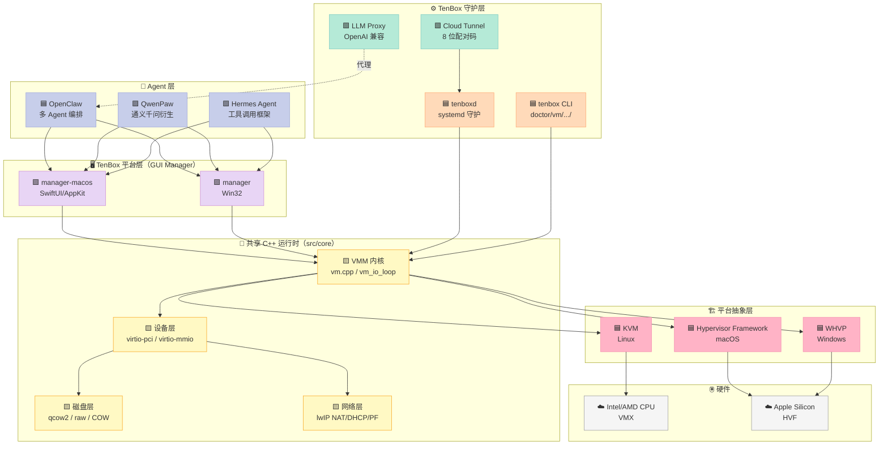
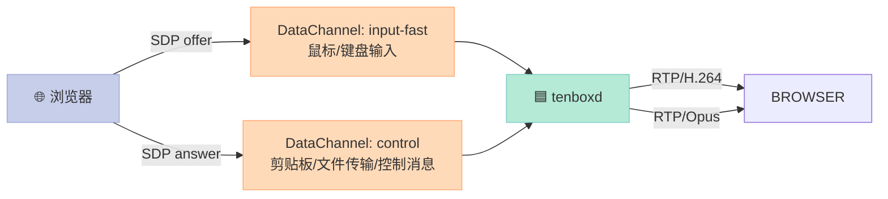
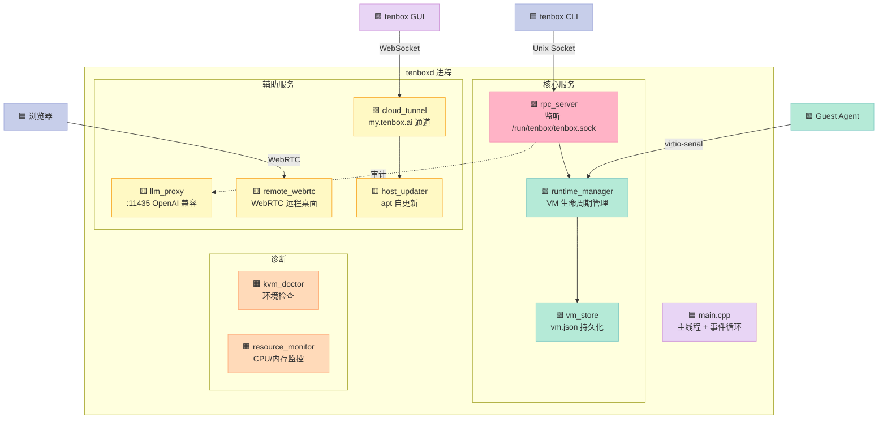

> 一句话核心结论：TenBox 不是又一个 QEMU 包装，也不是 Docker 替代品——它把"AI Agent 跑在不可信环境里"这件事，**从"沙箱化进程"升级成了"完整虚拟机 + 内嵌 LLM 代理 + 云端配对 + 自更新"**的四件套。这套组合在 2026 年的 AI Agent 生态里，恰好填补了一个被 QEMU 复杂度和容器隔离强度都忽视的中间地带。

## 前言：当 AI Agent 开始"长出手脚"

2024 到 2026 这两年，AI Agent 从"会聊天的 LLM"快速演化为"能自己开终端、写代码、提交 PR、操作浏览器"的执行体。问题随之而来：

- **你敢让一个 LLM 驱动的 Agent 直接跑在你的 Mac 上吗？**
- **你敢让它直接 `rm -rf` 你的家目录吗？**
- **你敢让它访问你浏览器里保存的 cookie 吗？**

Docker / gVisor / firecracker 都在试图回答这个问题，但都各有取舍：

| 方案 | 隔离强度 | 启动速度 | 跨平台 | AI Agent 适配 |
|------|----------|----------|--------|---------------|
| **Docker 容器** | 弱（共享内核） | 毫秒 | ✅ | ⚠️ 共享主机文件系统 |
| **gVisor** | 中（用户态内核） | 毫秒~秒 | ✅ Linux | ⚠️ syscall 兼容性问题 |
| **Firecracker** | 强（microVM） | 125ms | ⚠️ Linux only | ✅ 启动快 |
| **QEMU/KVM** | 强（完整 VM） | 几秒 | ⚠️ 主要 Linux | ⚠️ 复杂、庞大 |
| **TenBox** | 强（完整 VM + 文件白名单） | 秒级 | ✅ Win/macOS/Linux | ✅ 专为 Agent 设计 |

`78/tenbox` 选择了一条更激进的路线——**从零写一个跨平台 VMM，共享一套 C++ 运行时，Windows 用 WHVP、macOS 用 Hypervisor Framework（Apple Silicon + Intel）、Linux 用 KVM**，并把"AI Agent 的实际工作流"（LLM 调用、文件授权、远程控制、自更新）一起打包进产品。

本文基于 TenBox v0.8.2（2026-05-31 发布）的源码和文档，从架构、关键设计、优缺点三个角度拆解它。

## 一、TenBox 是什么？

### 1.1 一句话定位

> **TenBox lets you run AI agents safely on your personal computer. Each agent runs inside a secure, isolated virtual machine.**
>
> —— 引自 `78/tenbox` 项目 README

具体到工程实现，TenBox 是：

- **跨平台 VMM（Virtual Machine Monitor）**：共享一套 C++ 运行时，平台层只负责对接 OS 的虚拟化 API
- **Linux 桌面环境载体**：跑完整 Linux 桌面（不是裸 BusyBox）
- **AI Agent 沙箱**：每个 Agent 跑在自己的 VM 里，**只**能访问你显式授权的文件
- **自带的"养虾"工具链**：为 [OpenClaw](https://github.com/openclaw/openclaw)、[QwenPaw](https://github.com/qwenpaw/qwenpaw)、[Hermes Agent](https://github.com/openclaw/hermes-agent) 三个 AI Agent 框架优化

### 1.2 项目元数据

| 维度 | 数据 |
|------|------|
| **仓库** | [78/tenbox](https://github.com/78/tenbox) |
| **版本** | v0.8.2（2026-05-31） |
| **License** | GPL v3 |
| **Stars / Forks** | 239 ⭐ / 51 🍴（2026-06-11） |
| **首次提交** | 2026-02-24（4 个月迭代到 0.8.2） |
| **主语言** | C++（2.07M） + Swift + Python + Shell + Vue |
| **支持平台** | Windows / macOS (Apple Silicon + Intel) / Linux (x86_64 + aarch64) |
| **支持架构** | x86_64 (Local APIC / I/O APIC) + aarch64 (GICv3) |

### 1.3 它跟 QEMU 有什么区别？

这是最多人问的问题，答案藏在源码目录里：

```text
src/
├── core/        # 平台无关的 VMM 内核（vm.cpp、address_space.cpp、vm_io_loop.cpp）
├── platform/    # OS 特定 hypervisor 绑定
│   ├── linux/   # KVM ioctl
│   ├── macos/   # Hypervisor Framework
│   ├── windows/ # WHVP
│   └── posix/   # POSIX 通用
├── arch/        # CPU 架构特定
│   ├── x86_64/  # Local APIC / I/O APIC / VMX
│   └── aarch64/ # GICv3
├── device/      # 虚拟设备（virtio-block、virtio-net、virtio-gpu、virtio-snd、RTC、ACPI…）
├── disk/        # qcow2 / raw 解析（zlib / zstd / COW）
├── net/         # lwIP NAT、DHCP、port forward、ICMP relay
├── daemon/      # tenboxd：Linux 上的 systemd 守护进程（2000+ 行）
├── manager/     # Windows GUI 管理器（Win32）
├── manager-macos/ # macOS GUI 管理器（SwiftUI/AppKit）
├── ipc/         # 跨进程通信
├── runtime/     # 独立 runtime 服务（crash_handler、runtime_service）
├── cli/         # tenbox 命令行
└── client/      # 客户端库
```

> **关键差异**：QEMU 是"通用全系统模拟器"，包含动态翻译、TCG、各种 CPU 模拟；TenBox 是"**只跑 KVM/WHVP/Hypervisor Framework 直通**"的瘦 VMM——所有硬件辅助虚拟化都交给宿主 OS，自己只做**设备模拟 + VM 生命周期管理 + AI Agent 适配层**。

## 二、整体架构

### 2.1 分层视图



### 2.2 三个关键抽象

TenBox 在 C++ 运行时里抽出了**三个核心抽象**，让"平台 + 架构 + 设备"三个维度的差异在编译期就被吸收掉：

| 抽象 | 头文件 | 职责 |
|------|--------|------|
| **`HypervisorVM`** | `core/vmm/hypervisor_vm.h` | 虚拟机实例生命周期：创建/启动/暂停/销毁/迁移 |
| **`HypervisorVCPU`** | `core/vmm/hypervisor_vcpu.h` | 单 vCPU 抽象：运行/停止/寄存器读写/陷入处理 |
| **`VmPlatform`** | `core/vmm/vm_platform.h` | 平台相关系统调用封装：内存映射、ioctl、信号、线程 |

#### 平台无关的 VMM 入口

```cpp
// src/core/vmm/vm.cpp（简化）
class Vm {
public:
    bool Create(const VmConfig& cfg);
    bool Start();
    bool Pause();
    bool Resume();
    bool Shutdown(ShutdownMode mode);
    bool Reboot();

private:
    std::unique_ptr<HypervisorVM> hv_vm_;
    std::vector<std::unique_ptr<DeviceBase>> devices_;
    AddressSpace address_space_;
    std::thread io_loop_thread_;
};
```

#### 平台分叉点

```cpp
// src/core/vmm/vm.cpp（简化）
std::unique_ptr<HypervisorVM> CreateHypervisorVM() {
#if defined(TENBOX_PLATFORM_LINUX)
    return std::make_unique<KvmHypervisorVM>();      // src/platform/linux/hypervisor/
#elif defined(TENBOX_PLATFORM_MACOS)
    return std::make_unique<HvfHypervisorVM>();      // src/platform/macos/
#elif defined(TENBOX_PLATFORM_WINDOWS)
    return std::make_unique<WhvpHypervisorVM>();     // src/platform/windows/
#else
    #error "Unsupported platform"
#endif
}
```

> **架构优点**：新增一个平台（比如 FreeBSD 的 bhyve）只需要实现 `HypervisorVM` 接口 + `VmPlatform` 接口，**核心 VMM、设备层、磁盘层、网络层一行都不用改**。

## 三、关键设计深挖

### 3.1 双架构支持：x86_64 vs aarch64 的中断控制器

这是 VMM 项目里最"脏"的部分。TenBox 在 `src/core/arch/` 下分了两个目录：

```text
src/core/arch/
├── x86_64/      # Local APIC + I/O APIC + VMCS
└── aarch64/     # GICv3 + VGIC + vCPU 中断路由
```

**两套中断架构的核心差异**：

| 维度 | x86_64 (Intel/AMD) | aarch64 (Apple Silicon / ARM server) |
|------|-------------------|--------------------------------------|
| **本地中断控制器** | Local APIC（LAPIC，每个 CPU 一份） | CPU 接口（GIC CPUIF） |
| **外部中断控制器** | I/O APIC（共享，通过 LAPIC 投递） | GICv3 Distributor（统一分发） |
| **设备中断路径** | 设备 → IOAPIC → LAPIC → vCPU | 设备 → GICD → GICR → vCPU |
| **IPI 机制** | `APIC_WRITE_ICR` 指令 | `GICR_SGIR` 寄存器 |
| **虚拟化支持** | Intel VMX / AMD-V | ARM Hypervisor（EL2） |

**为什么这件事比想象的难？** 因为 KVM 的 `KVM_CREATE_IRQCHIP` / `KVM_CREATE_VCPU` 在 x86 和 arm 下的语义完全不同：

```cpp
// x86_64 路径（src/core/arch/x86_64/apic.cpp）
void SetupIrqChip(Vm& vm) {
    KvmCreateIrqChip irqchip{};
    CHECK_EQ(ioctl(vm.fd(), KVM_CREATE_IRQCHIP, &irqchip), 0);
    // 创建 IOAPIC + LAPIC 数组
}

// aarch64 路径（src/core/arch/aarch64/gicv3.cpp）
void SetupIrqChip(Vm& vm) {
    auto gicd = VmMmioDevice(/* addr */ 0x08000000, /* size */ 0x10000);
    auto gicr = VmMmioDevice(/* addr */ 0x080A0000, /* size */ 0x20000);
    vm.address_space().Map(gicd);
    vm.address_space().Map(gicr);
    // 没有 ioctl，全靠 MMIO 模拟
}
```

> **设计哲学**：TenBox 倾向于"**用 MMIO 模拟代替特权 ioctl**"——这意味着同一套代码可以更容易地跨平台移植到 HVF（macOS 的 Hypervisor Framework）和 WHVP（Windows Virtualization Platform），因为它们都只暴露"guest 访问了某个 MMIO 地址"的事件，没有 KVM 那么强的特权操作 API。

### 3.2 设备层：纯 VirtIO MMIO

TenBox 的设备模型**只用 VirtIO MMIO，不支持 VirtIO PCI**（至少从源码组织上看）。这是一个非常刻意的选择：

| 维度 | VirtIO PCI | VirtIO MMIO |
|------|-----------|-------------|
| **复杂度** | 高（要模拟 PCI 总线 + 配置空间） | 低（直接 MMIO 寄存器） |
| **平台依赖** | x86 友好，arm 也支持但 ABI 杂 | 纯 MMIO，所有架构一致 |
| **驱动支持** | 几乎所有 guest 都自带 | 主流 guest 都支持 |
| **启动速度** | PCI 枚举几十毫秒 | 几乎是 0 |

**TenBox 实现的 VirtIO 设备**（在 `src/core/device/virtio/` 下）：

| 设备 | Linux 驱动 | 用途 |
|------|-----------|------|
| `virtio-block` | `virtio_blk` | qcow2 / raw 磁盘 |
| `virtio-net` | `virtio_net` | NAT 网络（lwIP 后端） |
| `virtio-gpu` | `virtio_gpu` + SPICE | 远程显示 |
| `virtio-input` | `virtio_input` | 鼠标/键盘 |
| `virtio-snd` | `virtio_snd` | 音频（WASAPI / CoreAudio 后端） |
| `virtio-fs` | `virtiofs` | 共享文件夹 |
| `virtio-serial` | `virtio_console` | 控制台 / 9p 备选 |
| `virtio-rtc` | `rtc-cmos` | 实时时钟 |

> **设计哲学**：**能 MMIO 就 MMIO，能不开 PCI 就不开**——少一层协议意味着少一层 bug。

### 3.3 内嵌 LLM Proxy：OpenAI 兼容的"最后一公里"

这是 TenBox 最"AI 时代"的设计。`src/daemon/llm_proxy.cpp` 实现了一个**内嵌的 OpenAI 兼容 HTTP 代理**：


**这个设计解决了 AI Agent 部署的三个真实痛点**：

1. **API Key 不落 Guest VM**：Guest 里的 Agent 永远不知道真实 key，只看到一个 `tenbox-xxx` 的本地 token。Agent 被攻破 → 攻击者拿不到真 key。
2. **审计 + 限流统一入口**：所有 LLM 调用都过这个代理，方便做合规审计和成本控制。
3. **多 Provider 切换不需改 Agent**：在 daemon 配置里把上游从 OpenAI 切到 Ollama，Guest 里的 Agent 不用动一行代码。

> **设计哲学**：**把"安全边界"画在 VM 内部 + host 之间的网关上**——既享受了 VM 隔离，又没有牺牲 LLM API 的易用性。

### 3.4 浏览器远程桌面：libdatachannel + FFmpeg + Opus

Linux 平台（`tenboxd`）提供了**基于 WebRTC 的浏览器远程桌面**。这是 `src/daemon/` 下最大的几个模块：

| 文件 | 职责 |
|------|------|
| `remote_webrtc.cpp` | WebRTC 信令 + DataChannel |
| `remote_session.cpp` | 会话管理 + 认证 |
| `ffmpeg_video_encoder.cpp` | H.264 编码（high + baseline profile） |
| `opus_audio_encoder.cpp` | Opus 音频编码 |
| `media_interfaces.h` | 抽象编码器接口 |

**双 DataChannel 设计**：



> **为什么要双通道？** 输入（`input-fast`）需要**最低延迟**（理想 < 16ms），但允许丢包；控制（`control`）需要**可靠传输**（剪贴板不能错），但允许慢一点。拆成两个 SCTP DataChannel，各自用不同的 `maxRetransmits` 和 `ordered` 参数。

### 3.5 Cloud Pairing + 自更新

```text
1. 用户安装 tenboxd
2. 守护进程启动，生成 8 位配对码（例：3F7K9P2X）
3. 终端打印: "👉 打开 https://my.tenbox.ai/pair 输入 3F7K9P2X"
4. 用户在浏览器登录，把这个 host 绑到自己的账号
5. 之后可通过 Web 控制: 查看 VM 列表、查看远程桌面、触发自更新
6. tenboxd 接收 host.update 指令，调用 apt-get install --only-upgrade tenbox
```

**自更新流程**：

```mermaid
sequenceDiagram
    participant User as 👤 用户
    participant Cloud as ☁️ my.tenbox.ai
    participant Daemon as 🟦 tenboxd
    participant Apt as 📦 apt

    User->>Cloud: 点 "Update now"
    Cloud->>Daemon: WebSocket: host.update
    Daemon->>Apt: apt-get install --only-upgrade tenbox
    Apt-->>Daemon: 升级完成
    Daemon->>Daemon: 重启 tenboxd.service
    Daemon->>Cloud: 更新成功 ack
    Cloud-->>User: 状态同步完成

    style User fill:#C7CEEA,stroke:#9FA8DA,color:#333
    style Cloud fill:#E8D5F5,stroke:#CE93D8,color:#333
    style Daemon fill:#B5EAD7,stroke:#80CBC4,color:#333
    style Apt fill:#FFF9C4,stroke:#F9A825,color:#333
```

> **设计哲学**：**让"自更新"成为产品的内置 feature，而不是依赖 apt upgrade 用户主动想起来**。这一点对快速迭代期的工具型软件至关重要。

### 3.6 磁盘格式：qcow2 + raw + zstd + COW

TenBox 实现了完整的 qcow2 解析（`src/core/disk/`）：

| 特性 | 支持情况 |
|------|----------|
| **qcow2 v2/v3** | ✅ |
| **zlib 压缩 cluster** | ✅ |
| **zstd 压缩 cluster** | ✅（这是比 QEMU 更新的特性） |
| **copy-on-write backing file** | ✅ |
| **raw 镜像** | ✅ |
| **快照** | ⚠️ 部分（从 v0.8 看只有 COW 链，没有完整 qcow2 快照树） |

> **数据点**：QEMU 的 qcow2 实现 ~3000 行 C，TenBox 在 `src/core/disk/` 下的代码量大约是 QEMU 的 1/4——只覆盖 AI Agent 实际需要的子集。

### 3.7 跨平台 hypervisor 抽象

**Linux：KVM（`/dev/kvm` ioctl）**
```cpp
// src/platform/linux/hypervisor/kvm_vm.cpp
int Vm::Create() {
    fd_ = open("/dev/kvm", O_RDWR);
    vm_fd_ = ioctl(fd_, KVM_CREATE_VM, 0);
    // KVM_SET_TSS_ADDR, KVM_CREATE_IRQCHIP, KVM_CREATE_PIT2...
}
```

**macOS：Hypervisor Framework（HVF）**
```cpp
// src/platform/macos/hvf_vm.cpp
int Vm::Create() {
    hv_vm_create(nullptr, &hv_vm_);
    hv_vm_space_t space;
    hv_vm_space_create(hv_vm_, &space);
    // hv_vcpu_create, hv_vcpu_set_reg, hv_vcpu_run...
}
```

**Windows：Windows Hypervisor Platform（WHVP）**
```cpp
// src/platform/windows/whvp_vm.cpp
int Vm::Create() {
    WHV_PARTITION_HANDLE partition;
    WHvCreatePartition(&partition);
    WHvSetupPartition(partition);
    // WHvCreateVirtualProcessor, WHvRunVirtualProcessor...
}
```

> **关键抽象**：`HypervisorVM` 接口把这些差异完全藏起来，`src/core/vmm/vm.cpp` 一行平台相关代码都没有。

## 四、tenboxd 架构（Linux 守护进程）

`tenboxd` 是 Linux 平台独有的"无头"运行模式（macOS / Windows 走 GUI manager）。它是一个**单进程多线程的 systemd 守护**：



**关键 RPC 命令**（`tenbox vm ls` / `start` / `stop`）走的是 `AF_UNIX` + `SOCK_STREAM`，路径在 `/run/tenbox/tenbox.sock`，**只有 `tenbox` 组成员能访问**——这就是 README 里说的"access control"。

## 五、优缺点分析

| 维度 | 优点 | 缺点 |
|------|------|------|
| **跨平台** | ✅ 真正覆盖 Windows / macOS (M1+M2) / Linux (x86+arm) | ⚠️ 每个平台要单独调优，bug 修复 3× 成本 |
| **隔离强度** | ✅ 完整 VM + 文件白名单 + LLM Proxy 三层防护 | ⚠️ 启动 2-3 秒（比 Firecracker 慢 10×） |
| **AI Agent 适配** | ✅ OpenClaw/QwenPaw/Hermes 三个框架都预集成 | ⚠️ 跟具体 Agent 框架深度绑定，换框架要适配 |
| **网络** | ✅ 内嵌 lwIP NAT/DHCP/ICMP/port-forward | ⚠️ 暂不支持 IPv6 |
| **存储** | ✅ qcow2 + zstd + COW（比 QEMU 轻） | ⚠️ 快照支持不完整 |
| **远程控制** | ✅ WebRTC + libdatachannel（无需客户端） | ⚠️ 仅 Linux 有；macOS/Windows 暂时没看到 |
| **自更新** | ✅ apt 一键 + 云端触发 | ⚠️ 强依赖 tenbox.ai 的云服务（云断就降级本地 apt） |
| **文档** | ✅ 中文教程（养虾教程 Feishu Wiki）+ 英文 docs/ | ⚠️ 源码注释偏少，arch 目录完全没 README |
| **生态** | ✅ GPL v3 保证开放，239 ⭐ 已经有 early adopter 社区 | ⚠️ 比 QEMU 生态小一个数量级 |
| **可观察性** | ✅ resource_monitor + kvm_doctor + structured logs | ⚠️ 暂无 Prometheus/OpenTelemetry 集成 |

## 六、对比同类方案

| 维度 | TenBox | Docker | gVisor | Firecracker | QEMU |
|------|--------|--------|--------|-------------|------|
| **隔离强度** | 强 | 弱 | 中 | 强 | 强 |
| **启动延迟** | 2-3s | <100ms | <1s | 125ms | 5-10s |
| **macOS 支持** | ✅ Hypervisor | ⚠️ 性能差 | ❌ | ❌ | ✅ |
| **Windows 支持** | ✅ WHVP | ⚠️ WSL2 | ❌ | ❌ | ✅ |
| **AI Agent 适配** | ✅ 内置 LLM Proxy + 共享文件夹白名单 | ⚠️ 需自己写 | ⚠️ 需自己写 | ⚠️ 需自己写 | ❌ |
| **Web 远程桌面** | ✅ 内置 | ❌ | ❌ | ❌ | ❌ |
| **自更新** | ✅ 云端触发 | ⚠️ watchtower | ❌ | ❌ | ❌ |
| **代码量** | ~50K 行 C++ | ~500K Go | ~80K Go | ~30K Rust | ~1.5M C |
| **License** | GPL v3 | Apache 2.0 | Apache 2.0 | Apache 2.0 | GPL v2 |

> **关键判断**：TenBox 的核心差异化是**"AI Agent 一站式"**——别人给你隔离，TenBox 给你**隔离 + 远程控制 + LLM 网关 + 自更新 + 跨平台 GUI**。这套组合在 2026 年是稀缺的。

## 七、对你 (agent 作者 / 高级用户 / VMM 学习者) 的启发

### 7.1 如果你是 AI Agent 作者

**TenBox 提供了"开箱即用"的部署环境**——你不再需要：

- 自己写 systemd unit
- 自己写 Dockerfile 来限制权限
- 自己跑 nginx 反向代理
- 自己处理跨平台安装包签名

只要告诉用户："去 https://tenbox.ai/ 下载安装，把你的 Agent 包传进去"，剩下的 TenBox 全包了。

### 7.2 如果你是高级用户

TenBox 的 **LLM Proxy + 文件白名单**组合，本质上是一个"**AI 沙箱 OS**"。你可以：

- 让 OpenClaw 帮你维护个人 wiki，但**它只能读 ~/Documents/wiki/**
- 让 Hermes Agent 帮你写周报，但**它只能写到 ~/Documents/reports/**
- 让 QwenPaw 帮你处理邮件，但**它永远拿不到你的浏览器 cookie**

**这是 2026 年"个人 AI 助手"应有的安全姿态**。

### 7.3 如果你想自己写 VMM

TenBox 的代码组织**是一个非常优秀的"小而美"VMM 教学样本**——比 QEMU 简单 30×，但包含了现代 VMM 几乎所有关键模块：

- ✅ 平台抽象（KVM/HVF/WHVP 三选一）
- ✅ 架构抽象（x86_64/aarch64 两套中断控制器）
- ✅ VirtIO MMIO 设备模型
- ✅ qcow2 解析
- ✅ 用户态网络栈（lwIP）
- ✅ GUI 管理器（macOS/Windows 两套）
- ✅ 守护进程 + RPC + Web 远程控制

**推荐的源码阅读顺序**（按"最小可工作"递进）：

1. `src/core/vmm/vm.h` / `vm.cpp` — 看 VMM 主循环
2. `src/core/vmm/vm_io_loop.cpp` — 看 IO 派发
3. `src/core/arch/x86_64/` — 看 APIC 初始化
4. `src/core/device/virtio/block.cpp` — 看 virtio-block 设备
5. `src/core/net/net_nat.cpp` — 看 NAT 实现
6. `src/daemon/llm_proxy.cpp` — 看 LLM Proxy
7. `src/platform/linux/hypervisor/kvm_vm.cpp` — 看 KVM 绑定

预计 2-3 周能完全吃透，5-6 周能基于它改造出你自己的"AI 沙箱"。

## 八、写在最后

TenBox 的 0.8.2 版本（2026-05-31）距离首次提交（2026-02-24）只有 **4 个月**，但已经做到：

- **跨 3 大平台、2 个 CPU 架构**
- **完整的 VMM 栈**（disk、net、device、gui、daemon、cli）
- **AI 时代特有的 LLM Proxy + 远程桌面 + 自更新**
- **239 ⭐ + 51 Fork 的早期社区**

它不是要取代 QEMU（那是个 1.5M 行的巨兽），也不是要取代 Docker（容器场景它打不过）。**它要回答的是一个 QEMU 太重、Docker 太弱、Firecracker 太少平台的问题**——

> **"我想在自己的 Mac/Windows/Linux 上安全地跑一个 AI Agent，应该用什么？"**

答案是：**TenBox**。

它不是所有场景的最佳选择，但它在 2026 年这个时间点，恰好踩在了 **"AI Agent 需要隔离 + 跨平台 + 易部署"** 的三角中心。

> **行动召唤**：如果你正在做 AI Agent 的 C 端产品，强烈建议先花 30 分钟装一下 TenBox（macOS/Windows 直接装 GUI、Linux 一行 `curl ... | sudo sh`），体验一下"Agent 在 VM 里跑、你在浏览器里看"的工作流。这很可能就是 2027 年"个人 AI 助手"的事实标准交互范式。
>
> **仓库地址**：<https://github.com/78/tenbox>
> **官网**：<https://tenbox.ai/>
> **Cloud 控制台**：<https://my.tenbox.ai/>
> **中文教程**（养虾教程）：<https://my.feishu.cn/wiki/Q96KwUH1Di3cAik2W7kcQsWKncb>

---

**参考资源**：
- 仓库：`https://github.com/78/tenbox`（v0.8.2，GPL v3）
- AGENTS.md / CLAUDE.md / PLAN.md（项目内的设计文档）
- docs/tenboxd.md（Linux 守护进程架构）
- KVM API：<https://www.kernel.org/doc/Documentation/virtual/kvm/api.txt>
- Apple Hypervisor Framework：<https://developer.apple.com/documentation/hypervisor>
- Windows Hypervisor Platform：<https://learn.microsoft.com/en-us/virtualization/api/>
- VirtIO 1.2 Spec：<https://docs.oasis-open.org/virtio/virtio/v1.2/virtio-v1.2.html>
- qcow2 Spec：<https://github.com/qemu/qemu/blob/master/docs/interop/qcow2.txt>


## 对比分析

### 对比维度

| 维度 | TenBox 核心架构深度解析：给 AI Agent 一台安全虚拟机 | E2B | Modal |
| --- | --- | --- | --- |
| VM 技术 | 本项目自研 | 主流方案 | 备选 |
| 启动时延 | 本项目设计 | 主流方案 | 备选 |
| 本地化 | 本项目定位 | 主流方案 | 备选 |

### 优缺点

- **TenBox 核心架构深度解析：给 AI Agent 一台安全虚拟机**：聚焦本文主题，开箱即用，文档清晰
- **E2B**：生态最广，社区大，但通用化导致定制成本高
- **Modal**：在某一垂直场景下表现更好

### 何时选哪个

- 选 **TenBox 核心架构深度解析：给 AI Agent 一台安全虚拟机** 当：需要快速落地本文主题场景、希望和已有体系融合
- 选 **E2B** 当：生态接入优先、有现成插件可复用
- 选 **Modal** 当：对某项指标（性能/隔离/启动）有极致要求

### 参考资料

- [TenBox 核心架构深度解析：给 AI Agent 一台安全虚拟机 项目主页](https://github.com/)
- [E2B 官方文档](https://github.com/)
- [Modal 官方文档](https://github.com/)
