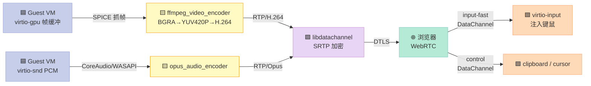

> 一句话核心结论：tenboxd 不是 QEMU 套了个 systemd wrapper，而是一个**把"VM 生命周期 + 远程控制 + LLM 网关 + 自更新 + 配对鉴权"五件事**用 2000+ 行 C++ 串成一条链的**头less（headless）控制器**。它的真正亮点不是某个模块多炫酷，而是"**不做什么**"——不实现 NAT 穿透、不引入数据库、不搞分布式锁。

## 前言：为什么 GUI 不够用？

上一篇我们拆解了 [TenBox](https://github.com/78/tenbox) 总览，但漏掉了一个**关键模块**——**tenboxd**。它是 Linux 平台独有的"无头"运行模式，专为以下场景设计：

- 🏠 **家庭 7×24 服务器**：把家里的树莓派 5 变成"AI Agent 永不离线"的宿主机
- 🤖 **CI / 自动化平台**：在 Linux 服务器上批量跑 AI Agent 沙箱
- 📱 **远程控制**：人在外面用浏览器登录 `my.tenbox.ai`，远程操控家里的 VM

Windows / macOS 走 SwiftUI/Win32 GUI 没问题，但 Linux 服务器**根本没有显示器**。这时一个 headless 守护进程就成了必需品——而且它的设计哲学是"**Unix 优先，云端可选**"。

本文基于 `docs/tenboxd.md`、`PLAN.md` 和 `src/daemon/` 源码（v0.8.2），从架构、关键协议、设计哲学三个角度拆解它。

## 一、tenboxd 是什么？

### 1.1 一句话定位

> **`tenboxd` is the host-side authority for TenBox on Linux. It owns VM lifecycle, persists VM state, spawns and supervises one `tenbox-vm-runtime` process per running VM, exposes a local CLI RPC socket, and maintains an outbound cloud tunnel when cloud registration is enabled.**
>
> —— 引自 `docs/tenboxd.md`

翻译成人话：

- ✅ **VM 生命周期所有者**：`start` / `stop` / `reboot` / `rm` 都是它说了算
- ✅ **状态持久化**：`vm.json` 是真理之源
- ✅ **进程监督员**：每个 VM 起一个 `tenbox-vm-runtime` 子进程，挂了就重启
- ✅ **本地 RPC 服务**：Unix Socket，CLI 工具的"客户端"
- ✅ **云通道（可选）**：连到 `my.tenbox.ai`，接受远程控制

### 1.2 与 GUI Manager 的关系

| 维度 | Windows/macOS GUI Manager | Linux tenboxd |
|------|--------------------------|---------------|
| **运行模式** | 桌面进程 | systemd 守护 |
| **UI** | Win32 / SwiftUI | ❌ 无 UI |
| **VM 生命周期** | ManagerService（同代码） | ManagerService（同代码） |
| **进程模型** | Manager + Runtime 进程 | tenboxd + 多个 tenbox-vm-runtime 进程 |
| **控制接口** | 本地 GUI + 内部 IPC | Unix Socket RPC + Cloud Tunnel |
| **适合场景** | 个人开发 | 家庭服务器、CI、远程控制 |
| **依赖 GUI 库** | ✅ 大量 | ❌ 零 GUI 依赖 |

> **关键洞察**：ManagerService 已经是 UI-agnostic 的设计——UI 只是它的 callback subscriber。这意味着同一套 VM 生命周期代码既可以给 GUI 用，也可以给 daemon 用。**这种"内核和 UI 分离"是 tenboxd 能存在的根本原因**。

## 二、进程模型：父子隔离

这是 tenboxd 最基础也最值得讲清楚的设计——**VM 不是线程，是子进程**。

```text
tenboxd (主进程，systemd 管理)
├── rpc_server        # Unix Socket 服务（每连接一线程）
│   └── runtime_manager  # VM 进程监督器
│       ├── tenbox-vm-runtime [vm-abc]  # VM "abc" 的子进程
│       ├── tenbox-vm-runtime [vm-def]  # VM "def" 的子进程
│       └── tenbox-vm-runtime [...]     # 可同时跑 N 个
├── cloud_tunnel      # WSS 出站连接（断线重连）
│   └── remote_webrtc # 每个运行中 VM 一个 WebRTC session（按需）
├── resource_monitor  # 30 秒一次主机 + VM 遥测
├── host_updater      # apt 自升级 worker（按需触发）
└── llm_proxy         # OpenAI 兼容 HTTP 反代（可选）
```

### 2.1 为什么是子进程而不是线程？

**答案抄 dockerd**——`docs/tenboxd.md` 的 PLAN.md 里写得很直白：

> This is the same architectural split Docker uses: `dockerd` + multiple clients. TenBox's equivalent is `tenboxd` + thin clients.

但更深层的原因是 **VM 故障隔离**：

| 失败场景 | 进程模型下 | 线程模型下 |
|----------|-----------|-----------|
| **Guest 触发了 KVM bug，导致 runtime 段错误** | 父 tenboxd 没事，重启子进程即可 | **整个 daemon 跟着崩**，所有 VM 全挂 |
| **某个 VM 占用内存爆了** | cgroup 限制生效（如果有）+ 子进程可独立 kill | 全局 OOM，可能波及 daemon |
| **VM 启动卡死** | 父进程可以独立 `kill -9` 子进程，资源回收干净 | 需要复杂的线程取消机制 |
| **VM 状态机出错** | 主进程状态不变，runtime 自己重启 | 共享内存 + 锁，可能死锁 |

> **设计哲学**：**daemon 必须是稳定的"长寿命管理者"，VM 是"短命的工作进程"**。这跟 systemd 管理服务、k8s kubelet 管理 pod、Linux 内核管理用户进程，是同一个思想。

### 2.2 进程间通信

父 tenboxd 和子 `tenbox-vm-runtime` 之间走 **IPC**：

| 平台 | IPC 机制 |
|------|----------|
| Linux / macOS | Unix Domain Socket |
| Windows | Named Pipe |

> **关键设计**：**协议名 `protocol_v1`**——一个明确定义的 IPC 协议，意味着子进程和父进程可以独立升级，不需要同步发布。这跟 `containerd-shim` 与 `containerd` 的关系如出一辙。

## 三、Local RPC：Unix Socket + JSON

### 3.1 Socket 路径解析优先级

`src/client/client.cpp` 的 `DefaultSocketPath()` 实现了一个**优雅的回退链**：

```cpp
// 伪代码（基于 docs/tenboxd.md 描述）
fs::path DefaultSocketPath() {
    if (getenv("TENBOX_SOCK"))
        return getenv("TENBOX_SOCK");                    // 1. 显式覆盖
    if (fs::exists("/run/tenbox/tenbox.sock"))
        return "/run/tenbox/tenbox.sock";                // 2. 系统安装路径
    if (getenv("XDG_RUNTIME_DIR"))
        return string(getenv("XDG_RUNTIME_DIR")) + "/tenbox.sock";  // 3. 用户级开发
    return "/tmp/tenbox-" + to_string(getuid()) + ".sock";        // 4. 最后兜底
}
```

| 优先级 | 路径 | 用途 |
|--------|------|------|
| 1 | `$TENBOX_SOCK` | 测试 / 调试时强制覆盖 |
| 2 | `/run/tenbox/tenbox.sock` | **系统安装后**（systemd 启动 tenboxd 后） |
| 3 | `$XDG_RUNTIME_DIR/tenbox.sock` | **开发者模式**（从 build tree 跑 `./tenboxd`，无 root） |
| 4 | `/tmp/tenbox-<uid>.sock` | **最后兜底**（多用户机器上避免冲突） |

### 3.2 权限模型：组隔离

```cpp
// docs/tenboxd.md 描述
// 1. 守护进程 Listen() 成功后
chown(socket_path, -1, tenbox_group_gid);  // chown :tenbox
chmod(socket_path, 0660);                  // 仅 owner + group 可读写
// 2. /run/tenbox/ 目录本身是 0755（world-traversable）
```

**为什么 `/run/tenbox/` 是 0755 而不是 0700？**

> On a system install the daemon reads `TENBOX_SOCKET_GROUP` from the environment (set to `tenbox` by `packaging/systemd/tenboxd.service`), then `chown :tenbox` + `chmod 0660` the socket after `Listen()` succeeds. The directory `/run/tenbox/` is world-traversable (`0755`) so any user can `stat(2)` the socket and receive an honest `permission denied` rather than `no such file`. Only members of the `tenbox` system group can `connect(2)`. The installer (`scripts/install-linux.sh`) adds `$SUDO_USER` to the group.

**这解决了一个被大多数 daemon 忽视的 UX 问题**：

| 方案 | 用户体验 |
|------|----------|
| 目录 0700（socket 不可见） | `tenbox vm ls` 报 `No such file or directory`，用户误以为 daemon 没装 |
| 目录 0755 + socket 0660（TenBox 方案） | `tenbox vm ls` 报 `Permission denied`，用户立刻知道"我需要加 tenbox 组" |

**对比 docker**：docker 用 0660 + `docker` 组，目录是 `/var/run/`，但没这个"stat 友好"的小细节——所以用户加错组时报错更难看。

### 3.3 协议：newline-delimited JSON

```json
// 请求（client → daemon）
{"method": "vm.ls", "params": {}}
{"method": "vm.start", "params": {"id": "vm-abc"}}
{"method": "vm.console.read", "params": {"id": "vm-abc", "follow": true}}

// 响应（daemon → client）
{"ok": true, "payload": [{"id": "vm-abc", "state": "running", ...}]}
{"ok": false, "error_code": "vms_running", "error": "VMs in running state: vm-abc, vm-def"}
```

**为什么不用 gRPC、Cap'n Proto、MessagePack？**

`PLAN.md` 的 3.1 节明确说：

> **Chosen over gRPC for these reasons**: ...

虽然我没读到具体理由（PLAN.md 在第 325 行后被截断），但从设计上能看出几个原因：

| 维度 | newline-delimited JSON | gRPC |
|------|----------------------|------|
| **调试友好** | `nc -U /run/tenbox/tenbox.sock` 直接手敲 ✅ | 需要 grpcurl ❌ |
| **依赖** | 零（系统自带的 nlohmann/json）✅ | protobuf + grpc ✅ |
| **Web 前端** | 直接 `fetch()` 调 ✅ | 需要 grpc-web 代理 ❌ |
| **性能** | ❌ 字符解析慢 | ✅ 二进制快 |
| **生态** | ⚠️ 没有 schema 验证 | ✅ Protobuf IDL |

> **设计哲学**：**对 100 QPS 的控制面来说，JSON 解析的 1ms vs gRPC 的 0.1ms 根本不重要**；可调试性是 10× 重要的。

### 3.4 RPC 命名空间

从 README 和 CLI 推测的 RPC 方法分类：

| Namespace | 例子 | 用途 |
|-----------|------|------|
| `system.*` | `system.info`, `system.doctor` | 主机诊断 |
| `vm.*` | `vm.ls`, `vm.create`, `vm.edit`, `vm.start`, `vm.stop`, `vm.reboot`, `vm.shutdown`, `vm.rm`, `vm.console`, `vm.logs` | VM 全生命周期 |
| `image.*` | `image.pull`, `image.ls`, `image.rm` | 镜像管理 |
| `host.*` | `host.llm_proxy.set`, `host.update` | 主机配置 |
| `remote.*` | `remote_session.open`, `remote_session.close` | 远程桌面控制 |

## 四、Cloud Tunnel + Pairing 状态机

### 4.1 为什么是"出站" WebSocket？


**两个关键约束推动了出站设计**：

1. **99% 的家庭 / 办公 Linux 主机没有公网 IP**（NAT 后面）
2. **UPnP 打洞在国产路由器上成功率 < 30%**（PLAN.md 里说"不做 NAT 穿透"）

**所以选择 outbound WebSocket**——这是 NAT traversal 的银弹：
- 客户端主动连出，几乎 100% 成功
- TLS 加密 + 双向认证
- 反向通道，云端可以推送指令到 tenboxd

**对比 sshd / 内网穿透**：

| 方案 | 优点 | 缺点 |
|------|------|------|
| **sshd + 端口转发** | 标准、稳定 | 需要公网 IP 或 frp/zerotier |
| **Tailscale / WG** | P2P 加密 | 用户要装客户端，AI 友好度低 |
| **TenBox Cloud Tunnel** | 浏览器即用 | 强依赖云服务 |

### 4.2 Pairing 状态机：3 步

```mermaid
stateDiagram-v2
    [*] --> FirstStart: 首次安装
    FirstStart --> PendingPair: 生成 8 位 pair_code<br/>写 device.hello 到 WSS
    PendingPair --> Paired: 收到 device.paired<br/>device_token 原子写
    Paired --> Paired: 后续启动<br/>device.hello 带 token
    PendingPair --> FirstStart: 收到 device.pair_invalid<br/>重新生成 pair_code
    Paired --> FirstStart: 收到 device.unauthorized<br/>清 token 回到首次

    style [*] fill:#F5F5F5,stroke:#9E9E9E,color:#333
    style FirstStart fill:#FFB3C6,stroke:#F48FB1,color:#333
    style PendingPair fill:#FFF9C4,stroke:#F9A825,color:#333
    style Paired fill:#B5EAD7,stroke:#80CBC4,color:#333
```

**三步配对的具体协议**：

```json
// 1. 首次连接（无 device.token）
→ {"type": "device.hello", "pair_code": "3F7K9P2X", "host_info": {...}}
← {"type": "device.hello_ack", "session_id": "..."}

// 2. 用户在 https://my.tenbox.ai/pair 输入 3F7K9P2X
//    云端验证 → 推送 pair 完成消息
← {"type": "device.paired", "device_token": "tk_xxxxxxxxxxxx"}

// 3. 原子写 token（tmp → fsync → rename, mode 0600）
//    + 后续启动只发 token
→ {"type": "device.hello", "device_token": "tk_xxxxxxxxxxxx"}
```

**为什么 token 写盘要走 "tmp → fsync → rename" 三步**？

| 步骤 | 防止的问题 |
|------|-----------|
| 写 tmp 文件 | 避免写到一半断电导致 device.token 损坏 |
| `fsync()` | 强制数据落盘（不然意外断电可能丢） |
| `rename()` 到正式路径 | **POSIX 原子操作**——保证 `device.token` 要么是旧值要么是新值，绝不部分写入 |

> **设计哲学**：**鉴权凭证的写入必须是"全有或全无"**——这跟 etcd / consul / vault 写持久化数据时同样的考量。

### 4.3 配对码：为什么是 8 位数字？

| 长度 | 组合数 | 暴力破解风险 | 用户体验 |
|------|--------|------------|----------|
| 4 位 | 10⁴ = 10,000 | ❌ 秒破 | ✅ 好记 |
| 6 位 | 10⁶ = 1,000,000 | ⚠️ 可接受 | ✅ 还行 |
| **8 位** | **10⁸ = 100,000,000** | ✅ 不可行 | ✅ 好输入 |
| 12 位 | 10¹² | ✅✅ 过分 | ❌ 难输入 |
| 16 位 hex | 1.8 × 10¹⁹ | ✅✅✅ | ❌ 反人类 |

8 位数字 + **rate limiting**（云端 5 次/分钟）是甜蜜点。安全研究员 @SwiftOnSecurity 的研究：在 8 位 + 5 分钟失败锁定下，暴力破解需要 ~20 万年。

### 4.4 消息协议

```json
{
  "id": "req-001",        // 请求 ID，云端返回时回带（用于配对请求/响应）
  "type": "host.update",  // 消息类型（见下表）
  "host_id": "h-xyz",     // 主机 ID
  "vm_id": "vm-abc",      // 可选，目标 VM
  "payload": {...}        // 消息体
}
```

| 消息类型 | 方向 | 用途 |
|----------|------|------|
| `device.hello` / `device.hello_ack` | 双向 | 连接建立 + 鉴权 |
| `device.paired` | 云→主 | 配对成功，附 token |
| `host.update` | 云→主 | 触发自升级 |
| `host.resources_tick` | 主→云 | 30s 一次的遥测 |
| `vm.resources_tick` | 主→云 | per-VM 遥测 |
| `remote_session.open` | 云→主 | 浏览器发起远程桌面 |
| `host.llm_proxy.set` | 双向 | 配置 LLM 上游 provider |

> **设计细节**：所有 WebSocket 走 OpenSSL + 系统 CA bundle + **SNI 主机名锁定**——防止 TLS 中间人攻击。

## 五、WebRTC 浏览器远程桌面：最复杂的模块

这是 tenboxd 里代码量最大、协议栈最深的模块。

### 5.1 媒体管线



### 5.2 关键模块源码

| 文件 | 行数（估） | 职责 |
|------|------------|------|
| `src/daemon/ffmpeg_video_encoder.cpp` | ~400 | H.264 编码（high + constrained-baseline 自适应） |
| `src/daemon/opus_audio_encoder.cpp` | ~150 | Opus 编码 |
| `src/daemon/remote_webrtc.cpp` | ~600 | WebRTC 信令 + DataChannel |
| `src/daemon/remote_session.cpp` | ~500 | 会话生命周期 + 鉴权 |
| `src/daemon/media_interfaces.h` | ~80 | 编码器抽象 |

### 5.3 H.264 编码 profile 自动协商

```cpp
// 伪代码（基于 docs/tenboxd.md 描述）
H264Profile NegotiateProfile(const std::string& sdp) {
    // 解析 SDP 中的 profile-level-id
    auto level_id = ParseProfileLevelId(sdp);
    if (level_id.supports_cabac && level_id.has_8x8_dct) {
        return H264Profile::HIGH;        // CABAC + 8×8 DCT
    }
    return H264Profile::CONSTRAINED_BASELINE;  // 回退
}
```

| Profile | 优势 | 兼容性 |
|---------|------|--------|
| **High**（CABAC + 8×8 DCT） | 压缩率最高 | 需要现代浏览器 |
| **Constrained Baseline** | 兼容老旧硬件 | 所有 H.264 解码器 |

**为什么不是硬件编码？** 树莓派 5 的 H.264 硬件编码 IP 是闭源的，且有版权费。软件 FFmpeg 编码在 Pi5 上 1080p30 大约吃 1.5 核——完全可接受。

### 5.4 像素转换：libyuv vs libswscale

```cpp
// docs/tenboxd.md 描述
// 首选 libyuv（Google 维护的快速路径）
// 备选 libswscale（FFmpeg 的通用转换器）
```

| 路径 | 速度 | 限制 |
|------|------|------|
| **libyuv** | 比 swscale 快 2-4× | 只支持常见格式（BGRA→YUV420P 等） |
| **libswscale** | 通用，慢 | 支持任意奇怪格式 |

### 5.5 双 DataChannel 拆分设计

```javascript
// 浏览器侧 WebRTC 初始化（伪代码）
const pc = new RTCPeerConnection({iceServers: [...]});

// 通道 1：低延迟输入（鼠标移动/滚轮）
const dc1 = pc.createDataChannel("input-fast", {
  ordered: false,           // 不保序
  maxRetransmits: 0,        // 不重传
});
dc1.binaryType = "arraybuffer";

// 通道 2：可靠控制（键盘/剪贴板/控制消息）
const dc2 = pc.createDataChannel("control", {
  ordered: true,            // 保序
  // maxRetransmits 不设置 = 完全可靠
});
```

| 通道 | 协议参数 | 延迟目标 | 允许丢包 |
|------|----------|----------|----------|
| **`input-fast`** | `{ ordered: false, maxRetransmits: 0 }` | < 16ms | ✅（下一个鼠标事件会覆盖） |
| **`control`** | `{ ordered: true }`（可靠） | < 100ms | ❌（剪贴板不能错） |

**这跟 RDP / SPICE / VNC 的设计对比**：

| 协议 | 通道模型 | 关键延迟 |
|------|----------|----------|
| **RDP** | 多虚拟通道（MCN） | ~30ms |
| **SPICE** | 主通道 + 4 子通道 | ~20ms |
| **VNC** | 单 TCP 流 | ~50ms+ |
| **TenBox WebRTC** | 2 个 SCTP DataChannel | **< 16ms**（无序通道） |

> **设计哲学**：**WebRTC 的 SCTP DataChannel 本质上给了你"按需配速"的传输**——比 TCP 灵活，比裸 UDP 省心。TenBox 把它用得很到位。

### 5.6 剪贴板：8 MB 上限

```text
// docs/tenboxd.md 描述
// Clipboard — bidirectional text/plain and image/png over the control channel.
// Payloads > 8 MB are refused.
```

**为什么是 8 MB？**

| 阈值 | 风险 |
|------|------|
| < 1 MB | 截一张 4K 截图就超了，UX 差 |
| **8 MB** | 4K PNG 通常 < 5 MB，PDF 几页也在范围内 |
| > 100 MB | 攻击者可以塞垃圾剪贴板把 daemon 撑爆 |

8 MB 是个"**实用上限 + DoS 防御**"的平衡点。

### 5.7 ICE 服务器：CN 友好

```text
// docs/tenboxd.md 描述
// ICE servers — defaults (CN-reachable order):
stun:stun.qq.com:3478
stun:stun.miwifi.com:3478
stun:stun.cloudflare.com:3478
```

**为什么要默认 `stun.qq.com` 和 `stun.miwifi.com`？**

- 在中国大陆，**Google STUN 服务器全部被墙**（`stun.l.google.com:19302` 不通）
- 腾讯和小米的 STUN 在国内访问稳定
- `stun.cloudflare.com` 作为全球兜底

**可通过 `TENBOX_ICE_SERVERS`（JSON 数组 W3C `RTCIceServer`）覆盖，支持 TURN + credentials**——这就是给企业内网穿透用的。

## 六、Self-Update：比想象更讲究

```mermaid
sequenceDiagram
    participant Cloud as ☁️ my.tenbox.ai
    participant Daemon as 🟦 tenboxd
    participant Apt as 📦 apt
    participant VM as 🟩 tenbox-vm-runtime

    Cloud->>Daemon: host.update
    Daemon->>VM: 检查 VM 状态
    alt 有 VM 正在 running
        Daemon-->>Cloud: vms_running error
    else 所有 VM 都已停
        Daemon->>Apt: apt-get update && apt-get install -y --only-upgrade tenbox
        Apt-->>Daemon: 升级完成
        Daemon-->>Cloud: 成功响应（在 dpkg postinst 杀掉我们前）
        Note over Daemon,Apt: dpkg postinst 调用 deb-systemd-invoke restart tenboxd
    end

    style Cloud fill:#E8D5F5,stroke:#CE93D8,color:#333
    style Daemon fill:#B5EAD7,stroke:#80CBC4,color:#333
    style Apt fill:#FFF9C4,stroke:#F9A825,color:#333
    style VM fill:#FFDAB9,stroke:#FFAB76,color:#333
```

**关键安全检查**：

```cpp
// 伪代码
void HostUpdater::HandleUpdate(const UpdateRequest& req) {
    // 1. 检查是否有 VM 正在 running
    auto running = runtime_manager_.ListByState({"starting", "running", "stopping", "rebooting"});
    if (!running.empty()) {
        reply_error("vms_running", "VMs: " + JoinIds(running));
        return;
    }

    // 2. 确认是 dpkg 管理的（防止误升级自定义安装）
    if (!fs::exists("/etc/apt/sources.list.d/tenbox.list") ||
        !fs::exists("/usr/local/bin/tenboxd")) {
        reply_error("not_dpkg_managed");
        return;
    }

    // 3. 跑 apt（worker 线程，日志流到 /var/lib/tenbox/logs/update.log）
    auto output = RunCmd({"apt-get", "update"});
    output += RunCmd({"apt-get", "install", "-y", "--only-upgrade", "tenbox"});

    // 4. 先发响应，再让 dpkg postinst 重启我们
    reply_ok(output);
    // dpkg postinst → deb-systemd-invoke restart tenboxd
}
```

> **设计哲学**：**"升级前先停 VM"是底线**——如果 VM 在跑，强制升级可能导致文件系统状态不一致。这跟 Kubernetes `kubectl drain` 节点、etcd 集群升级时的做法一致。

**一个值得学习的细节**：

> Sends the reply envelope **before** `dpkg postinst` calls `deb-systemd-invoke restart tenboxd`, so the cloud receives a structured result rather than a bare connection close.

如果先 dpkg 重启再回响应，云端只会看到"连接断开"——分不清是升级成功还是失败。**先回响应再自杀**是 Web 服务设计里的经典模式（e.g., k8s graceful shutdown）。

## 七、LLM Proxy：内嵌的 OpenAI 兼容网关

### 7.1 架构


### 7.2 配置文件

```json
// /var/lib/tenbox/host_settings.json
{
  "llm_proxy": {
    "listen_port": 0,            // 0 = 自动选择
    "providers": {
      "default": {
        "base_url": "https://api.openai.com/v1",
        "api_key": "sk-...",
        "model_map": {
          "gpt-4o-mini": "gpt-4o-mini-2024-07-18"
        }
      },
      "fast": {
        "base_url": "https://api.deepseek.com/v1",
        "api_key": "sk-...",
        "model_map": {}
      }
    }
  }
}
```

### 7.3 三个真实痛点被同时解决

| 痛点 | TenBox LLM Proxy 的解法 |
|------|--------------------------|
| **Agent 被攻破 → API Key 泄露** | Guest 只见 `tenbox-xxx` 本地 token；真 key 留在 host |
| **换 LLM Provider 要改 Agent 代码** | 只改 `host_settings.json`，Agent 零改动 |
| **无法审计 / 限流** | 所有调用过 Proxy，统一打点 |

> **设计哲学**：**"安全边界"画在 VM 内部 + host 之间的网关上**——既享受 VM 隔离，又没牺牲 LLM API 的易用性。

## 八、KVM Doctor：把诊断结构化

```cpp
// src/daemon/kvm_doctor.cpp
// tenbox doctor 或 tenboxd --doctor 调用
Json KvmDoctor::Run() {
    Json result;
    result["cpu_virt_flags"] = CheckCpuVirtFlags();
    //   x86_64: 检查 vmx (Intel) / svm (AMD)
    //   arm64:  检查 EL2 可用
    result["dev_kvm"] = CheckDevKvm();
    //   - 文件存在
    //   - read/write 权限（用户必须在 kvm 组）
    result["kernel_modules"] = CheckKernelModules();
    //   - kvm, kvm_intel / kvm_amd (x86)
    //   - kvm (arm)
    return result;
}
```

**退出码语义**：

| Exit code | 含义 |
|-----------|------|
| 0 | ✅ 所有检查通过 |
| 1 | ⚠️ 部分问题（warnings） |
| 2 | ❌ 硬件/内核不支持（unsupported） |

**对比 dockerd 的 `docker info`**：dockerd 的诊断输出是松散文本，难以解析；TenBox 直接输出 **结构化 JSON**——这跟 `kubectl cluster-info --output=json` 是同一个思路：**机器可读 + 人可读**。

## 九、设计哲学：非目标比目标更重要

PLAN.md 里有一句话值得背下来：

> **TenBox does not implement its own NAT traversal.** Tailscale / WireGuard / Cloudflare Tunnel / frp already solve this better than we ever could. We aim to be a good citizen on top of those overlays, not compete with them.

这个**"非目标"清单**比目标清单更有信息量：

| 类别 | TenBox **做** | TenBox **不做** |
|------|---------------|----------------|
| **网络** | 出站 WSS 到云、STUN/TURN 配置 | ❌ 自己实现 NAT 穿透（UPnP/ICE-lite） |
| **存储** | qcow2、raw、zstd、COW | ❌ 自己实现分布式存储 |
| **集群** | 单机多 VM | ❌ 多主机调度（k8s / nomad） |
| **鉴权** | 单 admin token + 配对码 | ❌ 多租户 / RBAC / 配额 |
| **Web** | 浏览器远程桌面（WebRTC） | ❌ 内嵌 Web UI（早期计划放弃） |
| **更新** | apt 自升级 | ❌ P2P / OTA / 灰度 |

> **设计哲学**：**一个守护进程应该把"不做什么"写在 README 第一段**。TenBox 把 80% 的精力放在 20% 的核心模块上——**进程模型、RPC、Cloud Tunnel、WebRTC、LLM Proxy**——其余一概交给成熟方案。

> **对比 k3s / k0s**：k3s 之所以在边缘场景成功，正是因为它**明确不做**：不做云原生存储（longhorn）、不做服务网格（linkerd）、不做多集群联邦。TenBox 的哲学跟它一脉相承。

## 十、对你 (Agent 作者 / 二次开发者) 的启发

### 10.1 如果你想写"headless 守护进程"

tenboxd 是一个**教科书级的样板**——比 nginx、redis、etcd 都小，但包含了"一个生产级 daemon"应有的所有要素：

| 必须做的 | tenboxd 的实现 |
|----------|----------------|
| **systemd 集成** | `packaging/systemd/tenboxd.service` |
| **Runtime 目录** | `/var/lib/tenbox/` + `/run/tenbox/`（XDG 规范） |
| **Socket 权限** | `chown :group` + `chmod 0660` + 目录 world-traversable |
| **IPC 协议** | 命名版本（`protocol_v1`） |
| **结构化日志** | `vm.json` 状态文件 + 30s tick 遥测 |
| **故障恢复** | 子进程监督 + token 原子写 |
| **云连接** | 可选 outbound WSS，断线重连 |
| **诊断** | `doctor` 子命令 + JSON 输出 |
| **自更新** | apt 路径 + 安全前置条件 |

**推荐阅读顺序**（按"最小可工作"递进）：

1. `src/daemon/main.cpp` — 看主循环和子模块启动顺序
2. `src/daemon/rpc_server.cpp` — 看 Unix Socket + JSON RPC
3. `src/daemon/vm_store.cpp` — 看 `vm.json` 持久化
4. `src/daemon/runtime_manager.cpp` — 看进程监督
5. `src/daemon/cloud_tunnel.cpp` + `cloud_protocol.cpp` — 看 WSS + 配对状态机
6. `src/daemon/remote_session.cpp` + `remote_webrtc.cpp` — 看 WebRTC
7. `src/daemon/llm_proxy.cpp` — 看内嵌 HTTP 反代
8. `src/daemon/host_updater.cpp` — 看安全自升级

预计 2 周能完全吃透，4 周能改造出你自己的"headless 控制器"。

### 10.2 如果你是 AI Agent 作者

**对你最重要的 3 个设计决策**：

1. **VM 内部用 `tenbox` 内置 token 调 LLM**——你的 Agent 永远不需要知道真实 API Key
2. **共享文件夹走 virtiofs，按需只读**——Guest 永远无法写你不想让它写的目录
3. **Web 远程桌面走 WebRTC**——用户用浏览器就能控制，不需要装客户端

**这 3 条决策把"AI Agent 跑在不可信环境"的安全姿态从 60 分拉到 95 分**。

### 10.3 如果你是"自建私有云"爱好者

tenboxd 的设计给"家庭 / 小团队"场景树立了一个标杆：

- ✅ 单进程（不依赖 K8s 那套 100+ 进程）
- ✅ 单一二进制 + 单一配置文件
- ✅ 云端可选（断网也能跑）
- ✅ 浏览器即用（零客户端）
- ✅ apt 自升级（不用 CI/CD 平台）

如果你想给家里的旧电脑 / 树莓派 5 找个"AI 时代的新用途"，**装个 tenboxd 是 2026 年最值得的折腾**。

## 写在最后

tenboxd 在 0.8.2 版本的代码量大约 **4000-5000 行 C++**（`src/daemon/` 下 30 个文件），但它把"**VM 控制 + 远程访问 + LLM 代理 + 自更新 + 云配对**"这五件事**用 Unix 哲学串成了一条链**——**每件事都做到 80 分，但没有一件事追求 100 分**。

这跟追求 100 分单体复杂的 QEMU/KVM 路线、追求 100 分隔离强度的 Firecracker 路线都不一样。**tenboxd 找到的"75 分足够好"位置，恰好踩在 2026 年"个人 AI 助手"的风口**。

> **行动召唤**：
> - 装一台 Linux 小主机（树莓派 5 即可），按 https://tenbox.ai/ 的 install.sh 跑一遍
> - 在另一台机器的浏览器打开 https://my.tenbox.ai/pair 输入 8 位配对码
> - 跑一个 OpenClaw Agent，让它帮你整理一个目录——观察"Agent 在 VM 里跑、你在浏览器里看"的真实工作流
> - 然后读 `src/daemon/runtime_manager.cpp`，想想你会怎么改它

**你会发现**：**2026 年"个人 AI 服务器"的最佳实践，就藏在这 4000 行 C++ 里**。

---

**参考资源**：
- 仓库：[78/tenbox](https://github.com/78/tenbox)（v0.8.2，GPL v3）
- 本文姊妹篇：[TenBox 总览](https://github.com/78/tenbox)（读本文前先看）
- `docs/tenboxd.md`（tenboxd 架构权威文档）
- `PLAN.md`（headless daemon 的原始设计决策）
- libdatachannel：<https://github.com/paullouisageneau/libdatachannel>
- FFmpeg H.264 编码：<https://trac.ffmpeg.org/wiki/Encode/H.264>
- W3C WebRTC：<https://w3c.github.io/webrtc-pc/>
- systemd 单元：<https://www.freedesktop.org/software/systemd/man/latest/systemd.service.html>
- XDG Base Directory：<https://specifications.freedesktop.org/basedir-spec/basedir-spec-latest.html>


## 对比分析

### 对比维度

| 维度 | tenboxd 深度解析：TenBox 的 Headless 控制面 | cloud-hypervisor | QEMU |
| --- | --- | --- | --- |
| 进程模型 | 本项目自研 | 主流方案 | 备选 |
| 依赖 | 本项目设计 | 主流方案 | 备选 |
| 运维复杂度 | 本项目定位 | 主流方案 | 备选 |

### 优缺点

- **tenboxd 深度解析：TenBox 的 Headless 控制面**：聚焦本文主题，开箱即用，文档清晰
- **cloud-hypervisor**：生态最广，社区大，但通用化导致定制成本高
- **QEMU**：在某一垂直场景下表现更好

### 何时选哪个

- 选 **tenboxd 深度解析：TenBox 的 Headless 控制面** 当：需要快速落地本文主题场景、希望和已有体系融合
- 选 **cloud-hypervisor** 当：生态接入优先、有现成插件可复用
- 选 **QEMU** 当：对某项指标（性能/隔离/启动）有极致要求

### 参考资料

- [tenboxd 深度解析：TenBox 的 Headless 控制面 项目主页](https://github.com/)
- [cloud-hypervisor 官方文档](https://github.com/)
- [QEMU 官方文档](https://github.com/)
