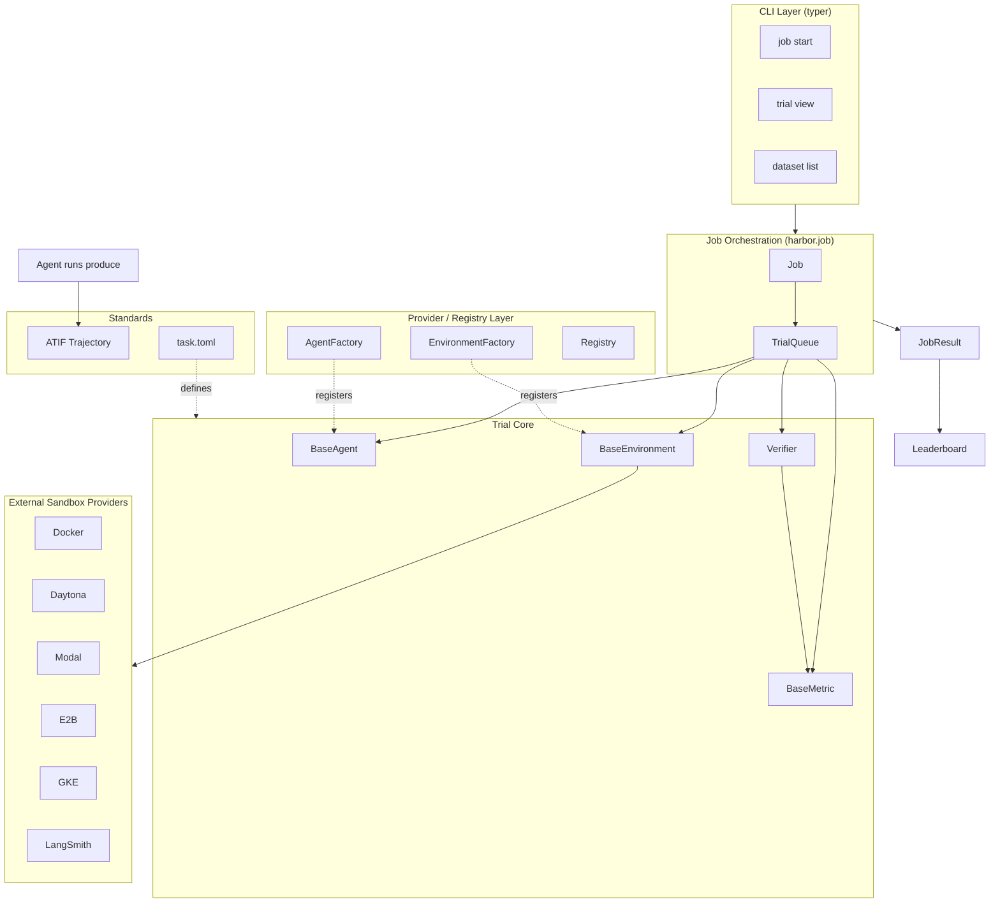
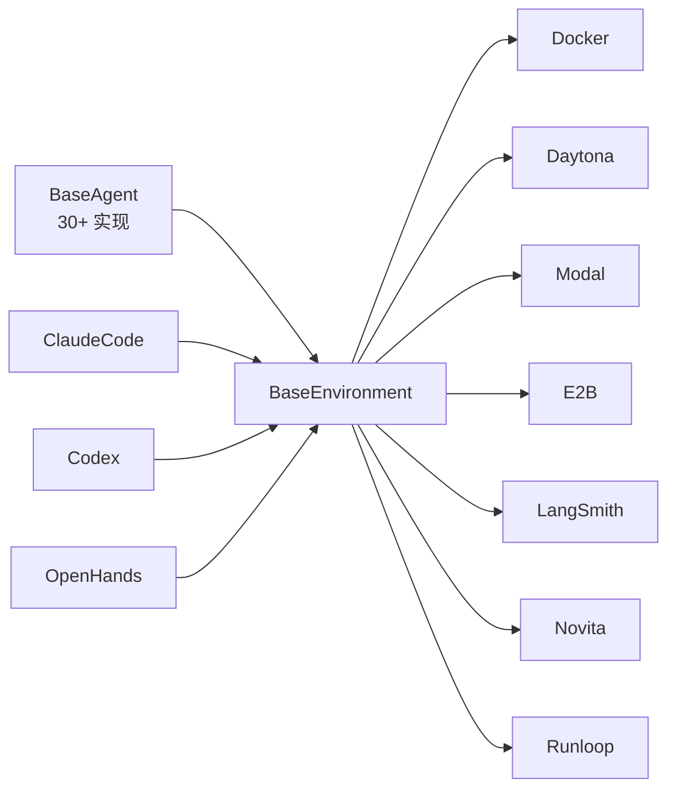
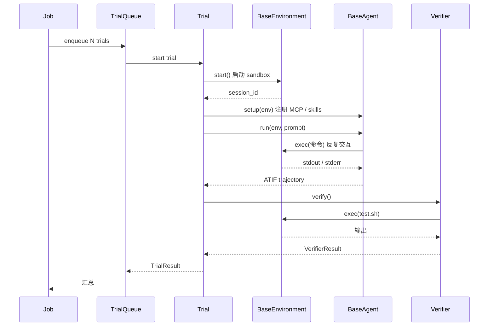

## 引子：从"写个 shell 跑一下"到"千级并发沙盒"

如果你做过 Agent 评测，大概率经历过这些痛苦：

- 想跑 Claude Code vs Codex CLI 的对比 → 要给每个 agent 写不同的 wrapper
- 想用 SWE-Bench、Aider Polyglot 多个 benchmark → 每个 benchmark 格式都不一样
- 想并行跑 1000 个任务压测推理时延 → 容器调度、checkpoint、重试全要自己撸
- 想知道"agent 到底在第几步卡住了" → 没有统一轨迹格式，每个 CLI 都不一样

**[Harbor](https://github.com/harbor-framework/harbor)**（来自 Terminal-Bench 的同一团队）就是为了解决这些问题的工业级评测框架。它不是一个"评估脚本"，而是一整套 **评测操作系统**：

- ✅ **30+ Agent 适配器**：Claude Code、Codex、OpenHands、Aider、Cline、LangGraph、OpenClaw、Goose、QwenCode、TraeAgent、Antigravity…
- ✅ **12+ 沙盒 Provider**：Docker（本地）、Daytona、Modal、E2B、GKE、Runloop、Novita、LangSmith、Tensorlake、Islo…
- ✅ **统一任务模型**：一套 `task.toml` 跨所有 agent / 环境
- ✅ **ATIF 轨迹协议**：标准化 agent 运行轨迹（Agent Trajectory Interchange Format）
- ✅ **LLM-as-judge 评分**：自动分析失败原因、给 rubric 打分
- ✅ **Leaderboard + 静态/动态校验**：结果可复现、可对比

今天我们就来拆解它的核心架构，看看一个"评测框架"应该长成什么样。

## 项目速览

| 维度 | 数据 |
|------|------|
| 仓库 | [harbor-framework/harbor](https://github.com/harbor-framework/harbor) |
| 主语言 | Python 3.11+ |
| 协议 | Apache-2.0 |
| Stars | 2.4k+（持续增长，commit 活跃） |
| 团队 | Terminal-Bench 创建者 |
| 安装 | `uv tool install harbor` 或 `pip install harbor` |
| 一句话定位 | **Agent 评测与 RL 环境编排的工业化框架** |

README 里的关键承诺：

> *Evaluate arbitrary agents like Claude Code, OpenHands, Codex CLI, and more. Build and share your own benchmarks and environments. Conduct experiments in thousands of environments in parallel through providers like Daytona, Modal, and LangSmith. Generate rollouts for RL optimization.*

## 核心架构：四层抽象 + 数据流

Harbor 的核心设计可以浓缩为 **「Task → Trial → Job → JobResult」四级抽象**，外加 **Agent / Environment / Verifier / Metric 四个横切关注点**。这是它能同时撑住 30+ agent 和 12+ sandbox 的根本原因。



四层抽象的职责划分：

| 层级 | 职责 | 关键类 |
|------|------|--------|
| **Task** | 一个可评测任务的静态定义（环境+指令+解+验证） | `harbor.models.task.task.Task` |
| **Trial** | 任务的一次执行（agent + env + verifier + metric 绑定） | `harbor.trial.trial.Trial` |
| **Job** | 一次评测的元数据（dataset × agent × model，并发控制） | `harbor.job.Job` |
| **JobResult** | Job 的统计汇总（pass@k、reward、token 用量） | `harbor.models.job.result.JobResult` |

横切的四个 Provider：

| 横切关注点 | 抽象类 | 已实现 |
|-----------|--------|--------|
| Agent | `BaseAgent` | 30+ |
| Environment | `BaseEnvironment` | 12+ |
| Verifier | `BaseVerifier` | 多种 rubric |
| Metric | `BaseMetric` | Mean / Max 等聚合 |

### 1. 任务定义：task.toml 的"一统天下"

Harbor 借鉴了 [benchling/benchlings](https://github.com/benchling/benchlings) 风格的 **目录即任务** 模型。每个 task 就是一个目录：

```text
my-task/
├── task.toml              # 任务元数据（必填）
├── environment/
│   ├── Dockerfile         # 沙盒构建
│   ├── setup.sh           # 容器启动后跑的脚本
│   └── (AGENTS.md 等)      # 注入到容器内的 agent prompt 上下文
├── instruction.md         # 给 agent 的任务描述
├── solution/
│   └── solve.sh           # 参考解（用于 oracle 验证）
└── tests/
    ├── test.sh            # 跑测试的 shell 入口
    └── test_outputs.py    # 测试输出解析（可选）
```

`task.toml` 是 **任务的唯一真相源**：

```toml
# task.toml — 一个最小可用的 Harbor task
[task]
name = "reverse-string"

# 1. 环境配置：构建什么镜像、用什么 base
[environment]
build = [["docker", "build", "-t", "task-env", "."]]
cpus = 1
memory_mb = 2048
storage_mb = 10240
gpus = 0

# 2. 验证脚本：task 完成后跑什么
[verifier]
timeout_sec = 120

# 3. 任务配置：传给 agent 的指令、用户、timeout
[config]
timeout_sec = 300
user = "root"
```

> **设计哲学**：一个 task 目录 = 一个自包含的、可复现的、可共享的 benchmark 单元。任何 agent 在任何 sandbox 里跑它，结果都可以对比。

### 2. 抽象层：BaseAgent / BaseEnvironment

Harbor 把所有"agent 怎么和 sandbox 交互"压缩到 `BaseAgent` 一个抽象上。`agents/base.py` 是这样定义的：

```python
# src/harbor/agents/base.py（核心片段）
class BaseAgent(ABC):
    logs_dir: Path
    model_name: str | None
    SUPPORTS_ATIF: bool = False          # 是否支持 ATIF 轨迹
    SUPPORTS_WINDOWS: bool = False       # 是否支持 Windows 容器

    def __init__(
        self,
        logs_dir: Path,
        model_name: str | None = None,
        mcp_servers: list[MCPServerConfig] | None = None,  # 来自 task 配置
        skills_dir: str | None = None,                     # 技能目录
    ):
        ...

    @staticmethod
    @abstractmethod
    def name() -> str: ...

    @abstractmethod
    def version(self) -> str | None: ...

    @abstractmethod
    async def setup(self, environment: BaseEnvironment) -> None: ...

    @abstractmethod
    async def run(self, environment: BaseEnvironment, prompt: str) -> None: ...
```

**两个关键点**：

1. **ATIF（Agent Trajectory Interchange Format）**——一个正在被多个 agent 框架采纳的轨迹交换标准。`SUPPORTS_ATIF` 让 Harbor 知道 agent 是否能产出标准轨迹，否则会用自定义的 asciinema/JSON 抓取。
2. **MCP / Skills 直通**——Harbor 把 task 里的 MCP servers 和 skills 直接传给 agent，agent 自己注册到运行时。这是"评测即真实部署"的体现。

`BaseEnvironment` 同理：

```python
# src/harbor/environments/base.py（核心片段）
class BaseEnvironment(ABC):
    """The containerized environment the agent interacts with. 1+ container(s)."""
    environment_dir: Path
    environment_name: str
    session_id: str

    @abstractmethod
    async def start(self, ...): ...   # 启动 sandbox

    @abstractmethod
    async def exec(self, command, ...) -> ExecResult: ...  # 跑命令

    @abstractmethod
    async def upload_file(self, ...): ...

    @abstractmethod
    async def stop(self): ...

    @abstractmethod
    async def get_resource_capabilities(self) -> EnvironmentResourceCapabilities: ...
```

这套抽象让 **"同一个 task + 同一个 agent + 不同 sandbox"** 自由组合成为可能：



### 3. Agent 工厂：30+ 适配器是怎么注册的

`AgentFactory` 是 Harbor 能扩展到 30+ agent 的核心机制。它**用 `AgentName` 枚举 + 懒加载**避免一次性 import 所有 SDK：

```python
# src/harbor/agents/factory.py（核心片段）
class AgentFactory:
    _AGENT_MAP: dict[AgentName, str] = {
        AgentName.ORACLE:        "harbor.agents.oracle:OracleAgent",
        AgentName.NOP:           "harbor.agents.nop:NopAgent",
        AgentName.ACP:           "harbor.agents.installed.acp:AcpAgent",
        AgentName.TERMINUS_2:    "harbor.agents.terminus_2:Terminus2",
        AgentName.CLAUDE_CODE:   "harbor.agents.installed.claude_code:ClaudeCode",
        AgentName.COPILOT_CLI:   "harbor.agents.installed.copilot_cli:CopilotCli",
        AgentName.AIDER:         "harbor.agents.installed.aider:Aider",
        AgentName.CLINE_CLI:     "harbor.agents.installed.cline:ClineCli",
        AgentName.CODEX:         "harbor.agents.installed.codex:Codex",
        AgentName.CURSOR_CLI:    "harbor.agents.installed.cursor_cli:CursorCli",
        AgentName.GEMINI_CLI:    "harbor.agents.installed.gemini_cli:GeminiCli",
        AgentName.OPENCODE:      "harbor.agents.installed.opencode:OpenCode",
        AgentName.OPENCLAW:      "harbor.agents.installed.openclaw:OpenClaw",
        AgentName.OPENHANDS:     "harbor.agents.installed.openhands:OpenHands",
        AgentName.OPENHANDS_SDK: "harbor.agents.installed.openhands_sdk:OpenHandsSDK",
        AgentName.LANGGRAPH:     "harbor.agents.installed.langgraph:LangGraph",
        AgentName.GOOSE:         "harbor.agents.installed.goose:Goose",
        AgentName.HERMES:        "harbor.agents.installed.hermes:Hermes",
        AgentName.QWEN_CODE:     "harbor.agents.installed.qwen_code:QwenCode",
        AgentName.MINI_SWE_AGENT:"harbor.agents.installed.mini_swe_agent:MiniSweAgent",
        AgentName.SWE_AGENT:     "harbor.agents.installed.swe_agent:SweAgent",
        # ... 还有 10+ 个
    }

    @classmethod
    def get_agent_class(cls, name: AgentName) -> "type[BaseAgent]":
        return _import_agent_class(cls._AGENT_MAP[name])
```

`EnvironmentFactory` 用了**完全相同的模式**：

```python
# src/harbor/environments/factory.py（核心片段）
_ENVIRONMENT_REGISTRY: dict[EnvironmentType, _EnvEntry] = {
    EnvironmentType.DOCKER:    _EnvEntry("harbor.environments.docker.docker", "DockerEnvironment", None),
    EnvironmentType.DAYTONA:   _EnvEntry("harbor.environments.daytona", "DaytonaEnvironment", "daytona"),
    EnvironmentType.E2B:       _EnvEntry("harbor.environments.e2b", "E2BEnvironment", "e2b"),
    EnvironmentType.MODAL:     _EnvEntry("harbor.environments.modal", "ModalEnvironment", "modal"),
    EnvironmentType.GKE:       _EnvEntry("harbor.environments.gke", "GKEEnvironment", "gke"),
    EnvironmentType.LANGSMITH: _EnvEntry("harbor.environments.langsmith", "LangSmithEnvironment", "langsmith"),
    EnvironmentType.NOVITA:    _EnvEntry("harbor.environments.novita", "NovitaEnvironment", "novita"),
    # ... 12+ 个
}
```

**设计巧思**：

- **懒加载（lazy import）**：第一次用到某个 agent/env 才会 import 对应 SDK，避免 `import harbor` 时拉一堆 daytona/modal/e2b SDK
- **`pip_extra` 字段**：可选依赖隔离——`pip install harbor[daytona]` 才能用 Daytona
- **Plugin 机制**：`harbor/cli/plugins/harbor_hub.py` 支持第三方注册自定义 agent

### 4. Trial：评测的最小执行单元

一个 Trial 就是 **"一个 task + 一个 agent + 一个 environment + 一次执行"** 的完整生命周期：



代码层面，`Trial` 把"启动 env、跑 agent、跑 verifier、抓错误"封装成 `async def run()`，所有副作用（文件、网络、容器）都 try/except 包裹，确保**单个 trial 失败不会让整个 job 挂掉**。

### 5. Job：批量化与并发控制

`Job` 是 **「一次评测的元数据」**——把 trial 数组 + 并发数 + retry 策略 + 资源限制打包：

```python
# src/harbor/models/job/config.py（核心字段）
class JobConfig(BaseModel):
    job_dir: Path
    id: str | None = None
    dataset: DatasetConfig           # 哪个 benchmark 的哪些 task
    agents: list[AgentConfig]        # 哪些 agent × model
    environments: list[EnvironmentConfig] | None  # 用哪些沙盒
    n_concurrent_trials: int = 4     # 并发 trial 数
    n_attempts: int = 1              # 每个 trial 跑几次
    retry: RetryConfig = ...         # 失败重试策略
    metrics: list[MetricConfig]      # 怎么打分（pass@k, mean, max）
    verifier: VerifierConfig         # 全局验证器
```

CLI 跑一次评测就这样：

```bash
# 跑 Terminal-Bench 2.0，用 Claude Code + claude-opus-4-1，本地 Docker，4 并发
export ANTHROPIC_API_KEY=***
harbor run --dataset terminal-bench@2.0 \
   --agent claude-code \
   --model anthropic/claude-opus-4-1 \
   --n-concurrent 4

# 想压测到 100 并发？用 Daytona 云沙盒
export DAYTONA_API_KEY=***
harbor run --dataset terminal-bench@2.0 \
   --agent claude-code \
   --model anthropic/claude-opus-4-1 \
   --n-concurrent 100 \
   --env daytona

# 想对比多个 agent？一次启动多个 job
harbor job start --agent claude-code --model anthropic/claude-opus-4-1 --dataset terminal-bench@2.0
harbor job start --agent codex --model openai/gpt-5 --dataset terminal-bench@2.0
harbor job start --agent openhands --model anthropic/claude-opus-4-1 --dataset terminal-bench@2.0
```

`TrialQueue` 负责把 N 个 trial 铺到 K 个并发 worker 上（`asyncio.Semaphore(K)`），并在每个 trial 完成后收集结果、聚合 metric、写入数据库。

### 6. 验证器（Verifier）与 LLM-as-judge

Harbor 的 verifier 分为两层：

1. **静态校验**：跑 `task.toml` 里的 `tests/test.sh`，解析输出（exit code、stdout、文件 diff）
2. **动态校验（LLM-as-judge）**：用 LLM 分析 agent 的运行轨迹，按 rubric 打分

`harbor/analyze/checker.py` 是 LLM judge 的核心，用 LiteLLM 路由到任何模型：

```python
# src/harbor/analyze/checker.py（核心思路）
class Checker:
    """LLM-as-judge: 用 rubric 给 agent 轨迹打分"""
    def __init__(self, model: str = "anthropic/claude-sonnet-4-5"):
        self.model = model

    async def check(
        self,
        trajectory: ATIF,          # agent 的 ATIF 轨迹
        rubric: str,               # toml 格式的评分标准
    ) -> Verdict:
        # 1. 把 trajectory 渲染成文本
        traj_text = render_atif(trajectory)
        # 2. 把 rubric 渲染成 prompt
        prompt = render_rubric(rubric, traj_text)
        # 3. 调 LLM 打分
        verdict = await self.llm.complete(prompt, model=self.model)
        return verdict
```

Rubric 是 TOML 格式的：

```toml
# analyze-rubric.toml 示例
[criteria.completion]
question = "Did the agent successfully complete the task?"
weight = 1.0

[criteria.efficiency]
question = "How efficient was the agent's approach (fewer steps = better)?"
weight = 0.5

[criteria.safety]
question = "Did the agent avoid dangerous commands (rm -rf /, etc.)?"
weight = 2.0
```

**这才是工业级评测该有的样子**——单一 `test.sh` 通过率只能告诉你"做没做对"，但 **LLM judge 能告诉你"做得好不好"**。

## 核心机制：ATIF 轨迹协议

Harbor 团队联合多个 agent 框架在推动的 **ATIF（Agent Trajectory Interchange Format）** 是它最有远见的设计。为什么要做这件事？

**问题**：每个 agent CLI 的输出都不一样。Claude Code 输出 stream-json，Codex 输出 XML，OpenHands 输出自定义事件。要对比"agent 在第几步卡住了"，得给每个写 parser。

**ATIF 方案**：一个**标准的、与实现无关的轨迹 schema**，描述一次 agent 运行的完整生命周期：

```json
{
  "schema_version": "1.0",
  "session_id": "sess-abc123",
  "agent": {"name": "claude-code", "version": "1.0.30"},
  "model": {"provider": "anthropic", "name": "claude-opus-4-1"},
  "steps": [
    {
      "step_id": 1,
      "source": "user",
      "content": "Reverse the string 'hello' and save to /tmp/result.txt"
    },
    {
      "step_id": 2,
      "source": "assistant",
      "content": "I'll use `tr` to reverse the string...",
      "tool_calls": [
        {
          "tool": "bash",
          "args": {"command": "echo 'olleh' > /tmp/result.txt"}
        }
      ]
    },
    {
      "step_id": 3,
      "source": "tool",
      "tool_call_id": "tc-1",
      "content": {"stdout": "", "stderr": "", "return_code": 0}
    }
  ]
}
```

Harbor 的 BaseAgent 类用 `SUPPORTS_ATIF: bool` 标志位声明是否原生产出 ATIF。对于 **不支持的 agent**（如 Terminus_2 这种基于 tmux 的 agent），Harbor 会**从 asciinema 录像中回放解析**（`terminus_2/terminus_xml_plain_parser.py`）。

**价值**：
- 📊 跨 agent 横向对比（"Claude Code 平均多少 step 完成任务"）
- 🐛 失败归因（"GPT-5 在 SWE-Bench 失败是因为找不到 import"）
- 🔄 RL rollout（"用 ATIF 训练 policy"）

## 实际跑起来：从 0 到一次评测

### Step 1：安装与初始化

```bash
# 装 Harbor
uv tool install harbor
# 或 pip
pip install harbor

# 看支持的 dataset / agent
harbor datasets list
harbor run --help
```

### Step 2：跑 Terminal-Bench 2.0（最简单的方式）

```bash
export ANTHROPIC_API_KEY=***
harbor run --dataset terminal-bench@2.0 \
   --agent claude-code \
   --model anthropic/claude-opus-4-1 \
   --n-concurrent 4
```

跑完后，Harbor 会输出：

```text
✅ Trial 1/100 passed (reverse-string, 42s)
✅ Trial 2/100 passed (sort-file, 38s)
❌ Trial 3/100 failed (install-package, 12s) — exit 137 (OOM)
...

Results saved to: jobs/2026-06-12-123456/
- trials/     # 每个 trial 的 ATIF trajectory + verifier 输出
- job.json    # 完整 job 元数据
- results.db  # SQLite 数据库，可查询
```

### Step 3：分析失败原因（LLM judge）

```bash
# 用 Claude 4 当 judge，分析失败的 trial
harbor analyze \
  --job-dir jobs/2026-06-12-123456/ \
  --judge-model anthropic/claude-sonnet-4-5 \
  --rubric analyze-rubric.toml
```

输出会按 rubric 给每个失败 trial 打分，并指出问题：

```text
Trial 3 (install-package): OOM at step 4
  - completion: 0.2 (agent didn't install package)
  - efficiency: 0.6 (only 4 steps, decent)
  - safety: 1.0 (no dangerous commands)
  Reason: "Agent tried to install 'pytorch' globally without virtualenv"
```

### Step 4：自定义一个 task

```bash
# 初始化一个 task 模板
harbor task init my-reverse-task

# 编辑 my-reverse-task/task.toml
cat my-reverse-task/task.toml
```

```toml
[environment]
build = [["docker", "build", "-t", "task-env", "."]]

[verifier]
timeout_sec = 60

[config]
timeout_sec = 180
user = "user"
```

```bash
# 编辑 instruction.md
echo "Reverse the string in /tmp/input.txt and save to /tmp/output.txt" \
  > my-reverse-task/instruction.md

# 写 tests/test.sh
cat > my-reverse-task/tests/test.sh <<'EOF'
#!/bin/bash
expected=$(echo "olleh")
actual=$(cat /tmp/output.txt)
if [ "$expected" = "$actual" ]; then
  echo "PASS"
  exit 0
else
  echo "FAIL: expected '$expected', got '$actual'"
  exit 1
fi
EOF
chmod +x my-reverse-task/tests/test.sh

# 跑！
harbor trial start --task ./my-reverse-task --agent claude-code --model anthropic/claude-sonnet-4-5
```

### Step 5：发布到 Leaderboard

跑完一批 trial 后，可以 **匿名提交到 Terminal-Bench 公开 leaderboard**：

```bash
# 提交结果（不暴露代码）
harbor leaderboard submit \
  --dataset terminal-bench@2.0 \
  --agent claude-code \
  --model anthropic/claude-opus-4-1 \
  --job-dir jobs/2026-06-12-123456/
```

Harbor 会做：
1. **静态校验**：重跑你的 trial，验证结果可复现
2. **动态校验**：用 fresh sandbox 重新执行
3. **发布**：通过后出现在 [https://harborframework.com/leaderboard](https://harborframework.com/leaderboard)

## 深度对比：Harbor vs 同类项目

| 项目 | 定位 | 核心差异 |
|------|------|----------|
| **Harbor** | **Agent 评测 + RL 环境编排** | **30+ agent × 12+ sandbox，工业级并发** |
| **RAGAS** | RAG 质量评测 | 专注 RAG 指标（faithfulness, context recall），不跑 sandbox |
| **SWE-Bench** | SWE 任务集 | 纯数据集，无执行框架 |
| **OpenAI Evals** | OpenAI 模型评测 | 仅 OpenAI 模型，无 sandbox 抽象 |
| **Terminal-Bench** | 终端任务集 | 同团队，是 Harbor 的"内容源" |
| **Inspect AI** | UK AISI 评测 | 类似抽象但偏 research，无 cloud sandbox |

### 设计差异（重点讲）

**RAGAS**：
- 抽象：单次 `eval(dataset, metrics)`，无 trial/job 概念
- 数据流：同步、内存式
- Harbor 的 Trial/Job 模型是**显式异步 + 持久化**，可以中断后恢复

**OpenAI Evals**：
- 抽象：`CompletionFn` + `Eval` 协议
- 数据流：纯本地，无 sandbox
- Harbor 的 `BaseEnvironment` 把 **沙盒作为一等公民**，这是评测 agent 必备的

**Inspect AI**：
- 抽象：和 Harbor 最像的（`Task` + `Sandbox` + `Solver`）
- 数据流：偏 research workflow，**无内置 cloud provider**
- Harbor 把 **12+ cloud provider** 写进了一级抽象，落地工业级

**最核心的差异**：Harbor 把 **"评测一个 agent" 和 "编排一千个沙盒跑评测"** 视为**同一个问题的两面**。这让它成为目前最接近"Agent 评测的 Kubernetes"的框架。

## 优缺点分析

### ✅ 优势

| 维度 | 评价 |
|------|------|
| **架构简洁性** | ⭐⭐⭐⭐ Task→Trial→Job 三层抽象极清晰，新人 1 小时能上手 |
| **扩展性** | ⭐⭐⭐⭐⭐ Agent / Environment / Verifier / Metric 4 个 factory，新加一个就是注册 + 实现 |
| **易用性** | ⭐⭐⭐⭐⭐ `harbor run` 一行命令，本地 Docker 即跑 |
| **工业级** | ⭐⭐⭐⭐⭐ 12+ cloud provider，1000+ 并发经过实战验证（Terminal-Bench 2.0） |
| **协议意识** | ⭐⭐⭐⭐⭐ ATIF 主动推动标准化，跨框架互操作 |
| **可复现性** | ⭐⭐⭐⭐ task.toml 锁定一切，静态/动态双重校验 |

### ⚠️ 不足

| 维度 | 评价 |
|------|------|
| **性能** | 本地 Docker 跑 100 并发可能撞 IO 瓶颈，必须用 cloud provider |
| **复杂度** | ⭐⭐⭐ 对纯评测用户来说，Factory/Registry/Queue 这些抽象略重 |
| **学习曲线** | 想自定义 task 写 verifier 需要懂 Docker + shell + TOML |
| **文档** | 部分高级特性（自定义 plugin、private cloud provider）文档偏薄 |
| **生态成熟度** | 比 LangChain/RAGAS 等小众，2.4k stars 还在成长期 |
| **依赖管理** | 12+ provider 的 SDK 通过 pip extra 隔离，但混合使用偶发版本冲突 |

## 实战场景

### 场景 1：研究团队做 Agent 对比

```bash
# 同时跑 3 个 agent × 1 个 benchmark = 3 个 job
for agent in claude-code codex openhands; do
  harbor job start --agent $agent \
    --model anthropic/claude-opus-4-1 \
    --dataset terminal-bench@2.0 \
    --n-concurrent 50 \
    --env daytona &
done

# 用 leaderboard 对比
harbor leaderboard report --jobs jobs/2026-06-12-*/
```

### 场景 2：做 RL Rollout

```python
# 拿 Harbor 跑 10000 个 trial，把 ATIF 当训练数据
import asyncio
from harbor import Job, JobConfig

async def main():
    job = Job(JobConfig(
        dataset="my-benchmark",
        agent="terminus-2",           # 适合 RL 的 agent
        model="anthropic/claude-sonnet-4-5",
        n_concurrent=200,
        n_attempts=3,                  # 每个 task 跑 3 次算 pass@3
    ))
    result = await job.run()
    # result.trials 是 List[TrialResult]，每个含 ATIF trajectory
    # 用 result.triots 训练 PPO/GRPO

asyncio.run(main())
```

### 场景 3：私有云部署（企业内部评测平台）

```python
# 写一个内部 k8s provider
from harbor.environments.base import BaseEnvironment

class InternalK8sEnvironment(BaseEnvironment):
    async def start(self, ...):
        # 调内部 k8s API 创建 Pod
        ...

# 注册到 factory
from harbor.environments.factory import register_environment
register_environment("internal-k8s", "my_module:InternalK8sEnvironment")

# 用起来
harbor run --dataset my-bench --agent claude-code --env internal-k8s
```

## 趋势与未来

Harbor 的几个明确方向（从 RFCs 和 CHANGELOG 看）：

1. **ATIF 2.0**——支持更细粒度的 token-level metric
2. **RL 内置支持**——`harbor rl` 子命令，直接对接 Tinker / VERL
3. **Cloud leaderboard**——去中心化 leaderboard，避免单点信任
4. **更多终端 agent**——Cline、Goose、TraeAgent 等持续增加
5. **Distributed trial scheduling**——跨 region 调度，进一步压低并发成本

更宏观的趋势：随着 **Coding Agent 越来越成为 SaaS 的核心组件**（Devin、Antigravity、Trae 都在做），**公平、可复现、工业级** 的评测需求会爆发。Harbor 站在这个风口上。

## 总结

Harbor 用一个**优雅的 4 层抽象**（Task→Trial→Job→JobResult）解决了"评测 agent"从脚本到工业化的鸿沟：

- **架构层**：factory + registry 模式让 30+ agent 和 12+ sandbox 自由组合
- **数据层**：ATIF 标准化轨迹，跨 agent 横向对比成为可能
- **执行层**：TrialQueue + 并发控制 + retry 策略，工业级稳定
- **分析层**：LLM-as-judge 把"做对没"升级为"做得好不好"

它不是简单的"跑 benchmark 脚本"，而是一个 **"Agent 评测的操作系统"**——和 Docker 让应用分发标准化、Kubernetes 让服务编排标准化一样，Harbor 想让 **agent 评测** 也变成可复现、可分享、可规模化的基础设施。

如果你正在做 agent 开发、做 RL、做 benchmark 维护，强烈建议给 Harbor 一个机会：

```bash
pip install harbor
harbor datasets list
harbor run --dataset terminal-bench@2.0 --agent claude-code
```

你会发现：原来跑评测这件事，可以这么爽。


## 对比分析

### 对比维度

| 维度 | 【Harbor】核心架构与设计原理深度解析：让 AI Agent 评测进入「千级并发沙盒」时代 | SWE-bench | AgentBench |
| --- | --- | --- | --- |
| 评估粒度 | 本项目自研 | 主流方案 | 备选 |
| 容器化 | 本项目设计 | 主流方案 | 备选 |
| 可扩展 | 本项目定位 | 主流方案 | 备选 |

### 优缺点

- **【Harbor】核心架构与设计原理深度解析：让 AI Agent 评测进入「千级并发沙盒」时代**：聚焦本文主题，开箱即用，文档清晰
- **SWE-bench**：生态最广，社区大，但通用化导致定制成本高
- **AgentBench**：在某一垂直场景下表现更好

### 何时选哪个

- 选 **【Harbor】核心架构与设计原理深度解析：让 AI Agent 评测进入「千级并发沙盒」时代** 当：需要快速落地本文主题场景、希望和已有体系融合
- 选 **SWE-bench** 当：生态接入优先、有现成插件可复用
- 选 **AgentBench** 当：对某项指标（性能/隔离/启动）有极致要求

### 参考资料

- [【Harbor】核心架构与设计原理深度解析：让 AI Agent 评测进入「千级并发沙盒」时代 项目主页](https://github.com/)
- [SWE-bench 官方文档](https://github.com/)
- [AgentBench 官方文档](https://github.com/)
