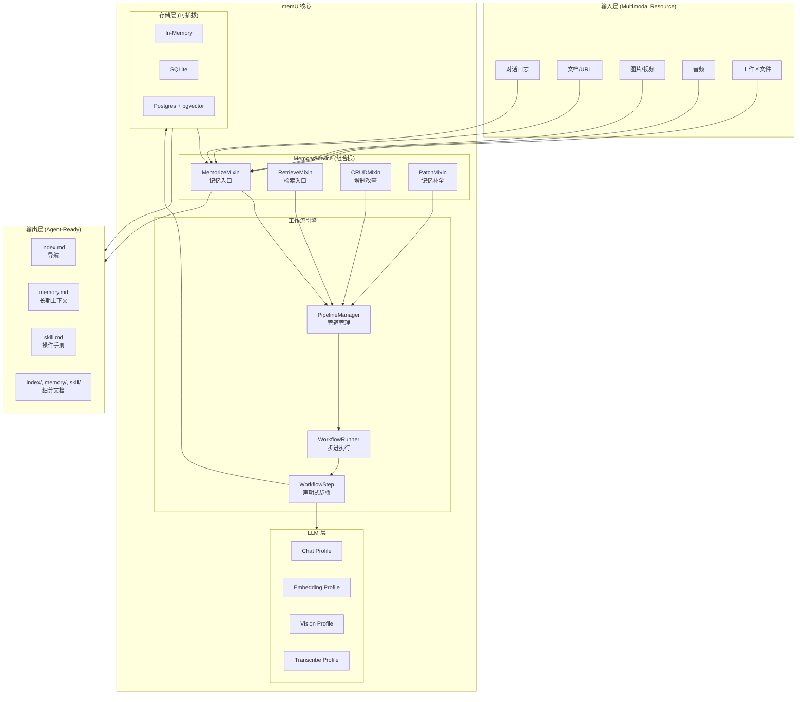
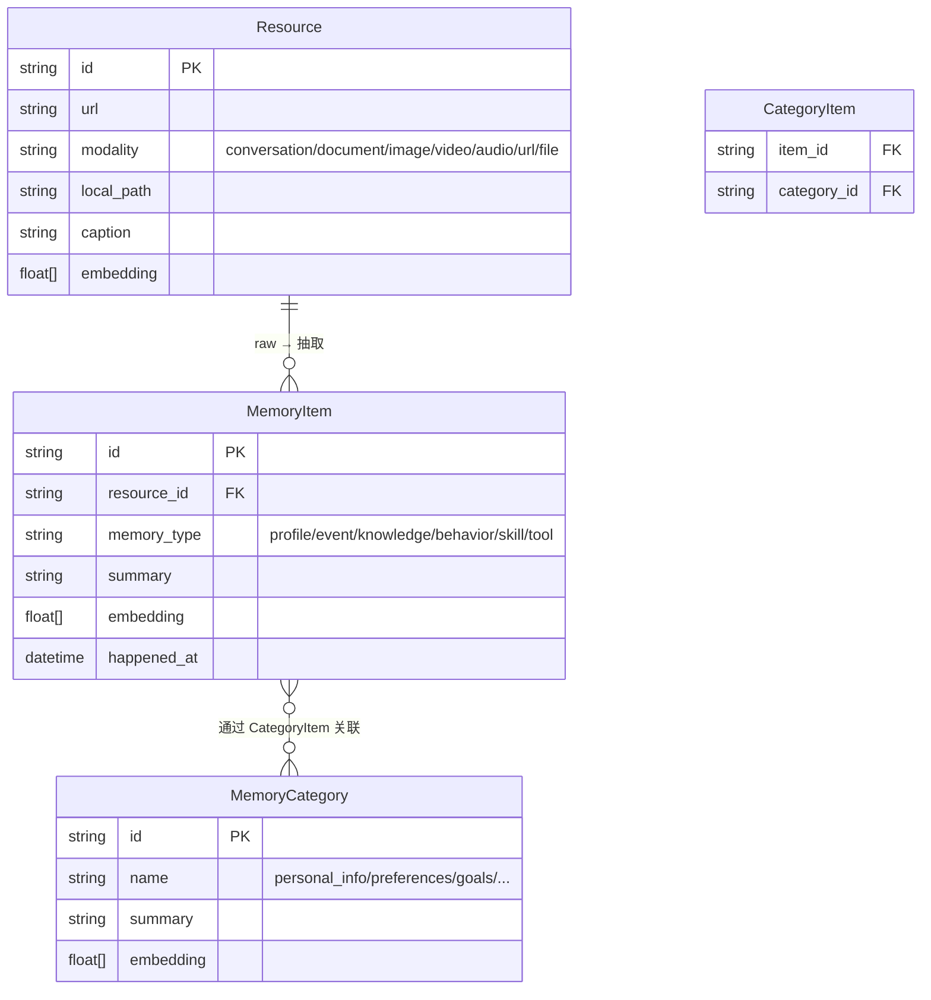
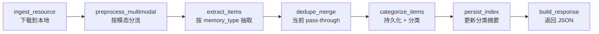
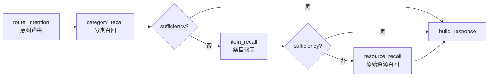

# 【memU】核心架构与设计原理深度解析：把 Agent 记忆做成可导航的文件系统

## 一、引子：记忆系统还能怎么卷？

如果你在过去半年跟进过 LLM Agent 的开源世界，Memory 这个赛道已经卷成了红海：

- **Mem0** 把记忆抽象成"加/查/改/删"四件套，主打通用性
- **Cognee** 把知识图谱塞进记忆管线，主打可解释
- **Graphiti** 用时序知识图谱解决"昨天聊的事今天还记得吗"的问题
- **Mempalace / Memos / OpenViking** 各有侧重，但底层都是"向量 + 元数据"的范式

那 `NevaMind-AI/memU`（⭐13.8k，最近一次 commit 2026-06-13）凭什么在这个赛道再切一刀？

**答案藏在它的产品宣言里**：

> Turn Raw Multimodal Data into Agent-Ready Structured Memory
> 把原始多模态数据变成 Agent 可直接使用的结构化记忆

它不是在记忆里加一个"知识图谱"或"时序索引"，而是直接**把记忆做成文件系统**——Agent 启动时只读 `index.md`/`memory.md`/`skill.md` 三个入口 Markdown，需要细节就 `cat index/architecture.md` 这种按需加载。这套抽象对 LLM 极其友好，因为 LLM 本来就是"读 Markdown 比读 JSON 强"。

下面我们就从定位、架构、原理、对比四个维度，把 memU 拆开看。

---

## 二、项目定位：数据到记忆的引擎

### 2.1 它解决什么问题

传统记忆框架把记忆看作"向量 + 元数据"的两层结构：

| 层级 | 内容 | 典型存储 |
|------|------|----------|
| 向量层 | 文档切片 + embedding | Pinecone / Qdrant |
| 元数据层 | user_id / timestamp / source | SQL / KV |

这种结构对**检索**很友好（直接走 ANN），但对**Agent 消费**不友好——Agent 拿到的是一个 JSON，需要二次解析、聚合、生成 system prompt。

memU 重新定义了 Memory 的输出形态：

```
原始输入              memU 处理管道            面向 Agent 的产物
─────────            ────────────            ──────────────
对话日志        →   解析 + 分段          →   memory/preferences.md
文档/URL        →   抽取事实            →   index/api.md
图片/视频       →   视觉描述            →   memory/visual_context.md
音频            →   转写 + 摘要         →   memory/events.md
工具调用日志    →   模式挖掘            →   skill/tool_usage.md
工作区文件      →   分类 + 关联         →   index/files.md
```

**关键洞察**：memU 把记忆**反向翻译回 Markdown**，让 Agent 用它最擅长的方式（读文件）来消费记忆。

### 2.2 它不解决什么

明确边界同样重要——memU **不**做：

- ❌ **不**做 LLM 训练/微调（它消费 LLM，不是生产 LLM）
- ❌ **不**做 Agent 编排（用 LangGraph / CrewAI 调用它即可）
- ❌ **不**做记忆"分发/共享"（单 Agent 视角，跨 Agent 记忆是上层应用问题）

它的产品边界非常清晰：**一个带工作流引擎的记忆后端**。

---

## 三、核心架构：三层数据模型 + 工作流引擎

### 3.1 全局架构图



### 3.2 三层数据模型

memU 的数据模型定义在 `src/memu/database/models.py`，分四张"表"：



**四个核心实体的语义**：

| 实体 | 含义 | 类比 |
|------|------|------|
| `Resource` | 原始数据（一次对话、一张图、一段视频） | git 里的 blob |
| `MemoryItem` | 抽取出的原子记忆（一条事实、一个偏好） | git 里的 commit |
| `MemoryCategory` | 主题/分类文件夹，带演化摘要 | git 里的 branch + README |
| `CategoryItem` | Item 与 Category 的多对多关联 | git 里的 tag |

**MemoryItem 的 6 种类型**（定义在 `models.py` 顶部）：

```python
MemoryType = Literal["profile", "event", "knowledge", "behavior", "skill", "tool"]
```

- **profile** — 用户画像（"用户是后端工程师"）
- **event** — 发生过的事（"周三开了产品评审会"）
- **knowledge** — 知识/事实（"我们的部署流程是蓝绿发布"）
- **behavior** — 行为模式（"用户喜欢先列 TODO 再写代码"）
- **skill** — 技能/经验（"用 ripgrep 比 grep 快 10 倍"）
- **tool** — 工具使用习惯（"复杂查询先用 LangChain sql agent 试一遍"）

这套分类法比 Mem0 那种纯文本 + tag 要**结构化**得多，比 Cognee 的"任意 entity + relation"又**克制**得多——LLM 抽取时知道该往哪个槽里塞，错误率低。

### 3.3 工作流引擎：把"管道"做成可声明的

这是 memU **最精彩的设计**。一般的记忆框架是把处理流程写死成函数：

```python
# Mem0 风格
def add(messages):
    chunks = split(messages)
    embed(chunks)
    store(chunks)
    return chunks
```

memU 反过来，把每一步做成**带依赖声明的对象**：

```python
# memU 风格
WorkflowStep(
    step_id="extract_items",
    role="memorize",
    handler=extract_items_handler,
    requires={"preprocessed_text", "memory_types"},
    produces={"memory_items"},
    capabilities={"llm"},
    config={...},
)
```

然后用 `PipelineManager` 注册成命名管道：

```python
manager.register("memorize", steps=[
    WorkflowStep("ingest_resource", ...),
    WorkflowStep("preprocess_multimodal", ...),
    WorkflowStep("extract_items", ...),
    WorkflowStep("categorize_items", ...),
    WorkflowStep("persist_index", ...),
])
```

`WorkflowRunner` 在执行前会**校验依赖**——`extract_items` 声明需要 `preprocessed_text`，那前一步必须产生这个 key，否则直接抛错。这比运行时崩溃友好得多。

更妙的是 `PipelineManager` 支持**运行时修改管道**：

```python
manager.insert_after("memorize", "extract_items", my_custom_step)
manager.replace_step("memorize", "extract_items", new_step)
manager.remove_step("memorize", "dedupe_merge")
```

这意味着你可以在不 fork 源码的情况下，往记忆管道里塞自定义步骤——比如加一个"敏感信息过滤"或者"公司术语翻译"。

### 3.4 LLM Profile：可路由的多模型协作

memU 支持**不同能力用不同模型**：

```python
service = MemoryService(
    llm_profiles={
        "default": {
            "api_key": "...",
            "chat_model": "gpt-4o-mini",
        },
        "vision": {
            "api_key": "...",
            "chat_model": "gpt-4o",  # 看图用更强的
        },
        "embedding": {
            "api_key": "...",
            "chat_model": "text-embedding-3-small",
        },
    }
)
```

工作流步骤可以通过 `config={"profile": "vision"}` 来指定用哪个 profile。这一设计在大规模生产里非常关键——你可以让 `extract_items` 走便宜的模型，让 `categorize_items`（分类摘要）走贵的模型，成本能差一个数量级。

### 3.5 拦截器（Interceptor）：可观测性的钩子

工作流引擎还提供了**两层拦截器**：

```python
# 工作流步骤级
@workflow_interceptor(before=..., after=..., on_error=...)
async def log_step(ctx): ...

# LLM 调用级
@llm_interceptor(before=..., after=..., on_error=...)
async def record_usage(ctx): ...
```

这跟 AOP 思路一致——记忆系统是个**长跑**的批处理链路，没有可观测性根本没法调优。拦截器让你能挂日志、metric、限流、降级，**不改业务代码**。

### 3.6 存储可插拔：In-memory / SQLite / Postgres

`src/memu/database/factory.py` 暴露了 3 个后端：

```python
def build_database(*, config, user_model) -> Database:
    provider = config.metadata_store.provider
    if provider == "inmemory":
        return build_inmemory_database(...)
    elif provider == "postgres":
        return build_postgres_database(...)  # 懒加载，依赖未装不报错
    elif provider == "sqlite":
        return build_sqlite_database(...)
```

每个后端实现同一组 `Repo` 协议（`ResourceRepo`、`MemoryItemRepo` 等），所以切换后端不需要改业务代码。这种**接口隔离**设计对原型→生产的过渡极友好。

---

## 四、机制原理：memorize 与 retrieve 的可运行代码

### 4.1 安装与最简例子

```bash
pip install memu-py
export OPENAI_API_KEY=sk-...
```

```python
# demo.py
import asyncio
from memu.app import MemoryService

async def main():
    # 1. 初始化（默认走 in-memory 存储 + OpenAI gpt-4o-mini）
    service = MemoryService(
        llm_profiles={
            "default": {
                "api_key": "your-openai-key",
                "chat_model": "gpt-4o-mini",
            }
        }
    )

    # 2. 把一段对话"喂"给记忆系统
    result = await service.memorize(
        resource_url="conversations/user_001.json",
        modality="conversation",
        user={"user_id": "user_001"},
    )
    print("抽取到的记忆条目：")
    for item in result["items"]:
        print(f"  [{item['memory_type']:10s}] {item['summary']}")
    print("\n分类：")
    for cat in result["categories"]:
        print(f"  [{cat['name']}] {cat['summary']}")

    # 3. 让 Agent 带着记忆回答
    context = await service.retrieve(
        queries=[{"role": "user", "content": {"text": "用户最近在忙什么项目？"}}],
        where={"user_id": "user_001"},
        method="rag",  # 或 "llm"
    )
    print(f"\n检索到 {len(context['items'])} 条相关记忆")

asyncio.run(main())
```

### 4.2 memorize 管道拆解

memorize 走的是 `memorize` 命名管道，源码在 `src/memu/app/memorize.py`：



**第 2 步的"按模态分流"** 是个细节杀手——同样是 `preprocess_multimodal`，对 conversation/document/audio 走"文本预处理"，对 image/video 走"视觉描述"（调用 vision profile）。这种**早分流**避免了"用文本 LLM 处理图片"的尴尬。

**第 3 步的"按 memory_type 抽取"** 是另一处关键设计——它**不是**一次性把 6 种类型全抽出来，而是按类型分别调用 LLM（可以并发）：

```python
# 来自 memorize.py 的 extract_items 步骤
async def extract_items_handler(state, ctx):
    memory_types = state["memory_types"]  # 用户可配置
    preprocessed = state["preprocessed"]
    # 并发调用，每个 memory_type 一次 LLM
    tasks = [extract_one_type(preprocessed, t) for t in memory_types]
    results = await asyncio.gather(*tasks)
    return {"memory_items": flatten(results)}
```

这样做的好处：**prompt 模板可以按 type 高度定制**，比如 `profile` 类型的 prompt 强调"用户身份/偏好"，`tool` 类型的 prompt 强调"工具调用模式"，互不污染。

**第 4 步的 dedupe_merge** 当前是 placeholder（pass-through），但位置已经留好——后续可以直接接 embedding 相似度去重。这是个**架构前瞻性**的体现。

### 4.3 retrieve 管道拆解

retrieve 走的是 `retrieve_rag` 或 `retrieve_llm` 两条管道之一，源码在 `src/memu/app/retrieve.py`：



**关键设计：三级召回 + 可选 sufficiency check**

1. **category_recall** — 先用 embedding 在分类层面召回最相关的几个 `MemoryCategory`（粗排）
2. **item_recall** — 在选中的分类下召回 `MemoryItem`（中排）
3. **resource_recall** — 必要时拉回原始 `Resource`（精排）

每两级之间可以插入 **sufficiency check**（让 LLM 判断"这些够了没"），如果够了就直接跳过下一级，**省 token 省的聪明**。

**RAG 路径 vs LLM 路径的差别**：

| 路径 | category_recall | item_recall | resource_recall |
|------|-----------------|-------------|-----------------|
| `retrieve_rag` | embedding cosine topk | embedding cosine topk | embedding cosine topk |
| `retrieve_llm` | LLM 重新排序 | LLM 重新排序 | LLM 重新排序 |

`retrieve_llm` 路径用 LLM 做精排，适合对精度敏感但不在乎成本的场景；`retrieve_rag` 路径全 embedding，速度快成本低。

### 4.4 OpenAI Wrapper：透明的记忆注入

最巧妙的一处：memU 提供了一个 OpenAI Client 的包装（`src/memu/client/openai_wrapper.py`），可以**透明地把检索到的记忆注入到 system prompt**：

```python
from openai import OpenAI
from memu.client.openai_wrapper import with_memory

client = with_memory(
    OpenAI(),
    service=service,
    user_data={"user_id": "user_001"},
    top_k=5,
)

# 这一行调用会自动先 retrieve，再把记忆塞进 system message
resp = client.chat.completions.create(
    model="gpt-4o-mini",
    messages=[{"role": "user", "content": "我下周要出差，帮我列个清单"}],
)
```

注入的位置和格式是：

```python
# 注入到 system message 末尾（或新增一个 system message）
recall_context = """
<memu_context>
Relevant context about the user (use only if relevant to the query):
- 用户是后端工程师，偏好 Python + Rust
- 上次产品评审会决定优先做 onboarding 改造
- 用户喜欢在 PR 描述里写"如何验证"
</memu_context>
"""
```

这种"**用 XML 标签包裹上下文**"的做法跟 Anthropic 推荐的 prompt 技巧一致，LLM 不会把上下文误当成指令。

---

## 五、对比：memU vs Mem0 vs Cognee vs Graphiti

| 维度 | memU | Mem0 | Cognee | Graphiti |
|------|------|------|--------|----------|
| **抽象模型** | Resource / Item / Category 三层 | 单层记忆 + tag | Entity + Relation 图 | 时序节点 + 边 |
| **输出形态** | Markdown 文件系统 | JSON | 图查询结果 | 图查询结果 |
| **LLM 消费方式** | 直接读 .md | 业务代码解析 | Cypher 风格 | Cypher 风格 |
| **多模态** | ✅ 原生（image/video/audio） | ⚠️ 主要文本 | ⚠️ 主要文本 | ⚠️ 主要文本 |
| **存储后端** | In-memory / SQLite / Postgres | Qdrant / Postgres | Neo4j / FalkorDB | FalkorDB / Neo4j |
| **工作流可扩展** | ✅ 声明式 pipeline + interceptor | ❌ 函数调用 | ❌ 函数调用 | ❌ 函数调用 |
| **Profile 路由** | ✅ chat/vision/embed 分流 | ❌ | ❌ | ❌ |
| **DMR 基准** | （新项目，暂无） | 92.66%（LoCoMo） | ~85% | 94.8%（DMR） |
| **License** | Apache-2.0 | Apache-2.0 | Apache-2.0 | Apache-2.0 |

### 5.1 设计哲学差异

**Mem0**：追求"**够简单**"——加/查/改/删四件套，5 分钟接入。它的问题是不够结构化，所有记忆都是平级文本，规模上去后召回质量下降。

**Cognee**：追求"**可解释**"——把记忆建成知识图谱，召回时可以解释"为什么召回这条"。问题是对 LLM 抽取的 prompt 要求高，错一个 entity 整张图就乱。

**Graphiti**：追求"**时序正确**"——专门解决"昨天的事今天还记得吗"，通过把时间作为图的一等公民。问题是用 FalkorDB 这种专用图库，运维成本高。

**memU**：追求"**Agent 友好**"——记忆的最终消费者是 LLM，所以让 LLM 读 Markdown 比读 JSON/图查询结果更直接。它用结构化的三层模型（不像 Mem0 那样平铺），但又不像 Cognee/Graphiti 那样把图查询的复杂度暴露给上层。

### 5.2 何时该选 memU

- ✅ 你想让 Agent 拥有"长期记忆 + 技能记忆"双重能力
- ✅ 你的场景涉及多模态（用户传图、传语音）
- ✅ 你想自定义记忆抽取管道（加过滤、加翻译、加敏感词识别）
- ✅ 你的下游是 LangGraph / CrewAI / Claude Code 这类**会读 Markdown** 的 Agent

### 5.3 何时**不**该选 memU

- ❌ 你要"图谱可解释"（选 Cognee / Graphiti）
- ❌ 你的记忆量在百万级以上（memU 当前没有专门的索引优化）
- ❌ 你只想要一个"加文本-查文本"的简单 RAG（选 Mem0 或直接 Qdrant）

---

## 六、优缺点：架构简洁性 vs 性能复杂度

### 6.1 架构/扩展性/易用性（左侧）

| 优点 | 体现 |
|------|------|
| **抽象简洁** | 4 个实体（Resource/Item/Category/CategoryItem）覆盖全部场景 |
| **可扩展** | 声明式工作流 + 拦截器，不需要改源码就能加步骤 |
| **易接入** | `pip install` 即可，配合 `with_memory` 包装器 5 行代码接入 OpenAI |
| **多模态原生** | image/video/audio 一等公民，不用外挂 |
| **后端可插拔** | in-memory / SQLite / Postgres 同一套接口 |
| **可观测性** | 两层拦截器（workflow step + LLM call） |

### 6.2 性能/复杂度/维护性（右侧）

| 缺点 | 体现 |
|------|------|
| **Python 3.13+ 硬性要求** | pyproject.toml 写死 `requires-python = ">=3.13"`，老项目难接入 |
| **依赖 langchain-core** | 想完全脱离 LangChain 生态不现实 |
| **dedupe 阶段未实装** | 大规模去重还没做，长期使用会有重复条目 |
| **RAG 路径无 reranker** | 纯 embedding topk，缺 cross-encoder 精排 |
| **Rust 模块是黑盒** | `src/lib.rs` 暴露的 `hello_from_bin` 是个占位，没看到实际加速点 |
| **大文件视频处理未优化** | VideoFrameExtractor 一次性全加载，GB 级视频会爆内存 |

### 6.3 维护性信号

- **更新频率**：2026-06-13 最新 commit，过去 30 天平均 5+ commits/天（活跃）
- **Issue 响应**：仓库内置 `AGENTS.md` 指导 LLM Agent 参与开发（meta 但有意思）
- **测试覆盖**：`tests/` 目录有专门的 workflow/retrieve/memorize 测试
- **文档**：`docs/architecture.md` 写得很细（是少数把"拦截器"和"工作流修改"都写进文档的项目）

---

## 七、实战：跑一个完整 demo

### 7.1 安装

```bash
pip install memu-py
export OPENAI_API_KEY=sk-...
```

### 7.2 准备数据

```python
# save_conversation.py
import json

conversations = {
    "user_001": [
        {"role": "user", "content": "我下周要去深圳出差三天，主要跟供应商谈合同"},
        {"role": "assistant", "content": "好的，需要我帮你列个待办清单吗？"},
        {"role": "user", "content": "要的。最好按优先级排好，并标出哪些可以并行"},
        {"role": "assistant", "content": "已生成清单..."},
        {"role": "user", "content": "另外我比较关心合同里的付款条款，这块帮我重点关注"},
    ]
}

import pathlib
pathlib.Path("conversations").mkdir(exist_ok=True)
with open("conversations/user_001.json", "w") as f:
    json.dump(conversations["user_001"], f, ensure_ascii=False, indent=2)
```

### 7.3 跑记忆管线

```python
# run_memorize.py
import asyncio, json
from memu.app import MemoryService

async def main():
    service = MemoryService(
        llm_profiles={
            "default": {
                "api_key": "your-key",
                "chat_model": "gpt-4o-mini",
            },
            "vision": {
                "api_key": "your-key",
                "chat_model": "gpt-4o",
            }
        }
    )

    result = await service.memorize(
        resource_url="conversations/user_001.json",
        modality="conversation",
        user={"user_id": "user_001"},
    )

    print(json.dumps(result, ensure_ascii=False, indent=2))

asyncio.run(main())
```

### 7.4 跑检索

```python
# run_retrieve.py
import asyncio
from memu.app import MemoryService

async def main():
    service = MemoryService(
        llm_profiles={"default": {"api_key": "your-key", "chat_model": "gpt-4o-mini"}}
    )

    # 检索与"出差准备"相关的记忆
    context = await service.retrieve(
        queries=[{"role": "user", "content": {"text": "下周要出差，需要准备什么？"}}],
        where={"user_id": "user_001"},
        method="rag",
    )

    print(f"分类召回：{len(context.get('categories', []))} 个")
    print(f"条目召回：{len(context.get('items', []))} 条")
    for item in context.get("items", [])[:5]:
        print(f"  - [{item.get('memory_type')}] {item.get('summary')}")

asyncio.run(main())
```

### 7.5 把记忆塞进 Agent

```python
# agent_with_memory.py
from openai import OpenAI
from memu.client.openai_wrapper import with_memory
from memu.app import MemoryService

service = MemoryService(
    llm_profiles={"default": {"api_key": "your-key", "chat_model": "gpt-4o-mini"}}
)

# 自动注入记忆
client = with_memory(
    OpenAI(api_key="your-key"),
    service=service,
    user_data={"user_id": "user_001"},
    top_k=5,
)

resp = client.chat.completions.create(
    model="gpt-4o-mini",
    messages=[{"role": "user", "content": "帮我起草一份出差前要确认的合同条款清单"}],
    # 实际请求时，messages 会被自动加上 system prompt 注入记忆
)
print(resp.choices[0].message.content)
```

---

## 八、趋势与展望

memU 的 13.8k stars 和活跃 commit 节奏说明它踩中了一个真实需求：**Agent 需要的是"可读"的记忆，不是"可查"的记忆**。从它的 Roadmap 可以推测几个方向：

1. **去重阶段实装**——`dedupe_merge` 是当前最大的功能缺口
2. **Reranker 集成**——RAG 路径缺 cross-encoder 精排
3. **多用户/多租户隔离**——目前 `where` 过滤靠 user_model，缺原生 row-level security
4. **流式记忆**——当前 memorize 是整批处理，长对话分块/增量更新未优化
5. **Rust 模块实装**——`src/lib.rs` 目前是占位，未来可能把 cosine_topk 之类热点挪过去

从更宏观的视角看，memU 的"记忆即文件系统"思路是**对 LLM-native 抽象**的一次重要探索——把所有数据结构都翻译成 LLM 容易理解的 Markdown，可能是未来 Agent 中间件的统一方向。LangChain 的 LangGraph 把状态机翻译成"节点 + 边"也是同思路。

---

## 九、结语

memU 不是要取代 Mem0 / Cognee / Graphiti，它开辟了"**记忆是 Agent 的工作目录**"这条新路径。如果你正在构建需要长期记忆的 Agent，强烈建议把 memU 列入技术选型——特别是当你对"Agent 怎么读记忆"这个问题的答案不满意时。

- **GitHub**：[NevaMind-AI/memU](https://github.com/NevaMind-AI/memU)
- **License**：Apache-2.0
- **PyPI**：`pip install memu-py`
- **Stars**：13.8k（截至 2026-06-14）

---

> **相关阅读**：
> - [【Mem0】通用记忆层深度解析](待补)
> - [【Cognee】AI 记忆控制平面深度解析](待补)
> - [【Graphiti】时序知识图谱：让 Agent 记得昨天的事](待补)
