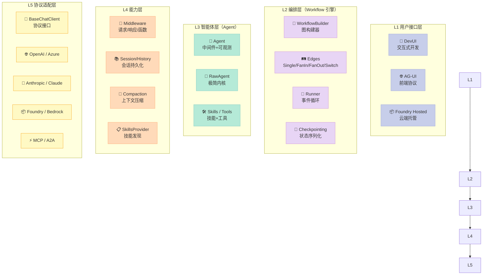
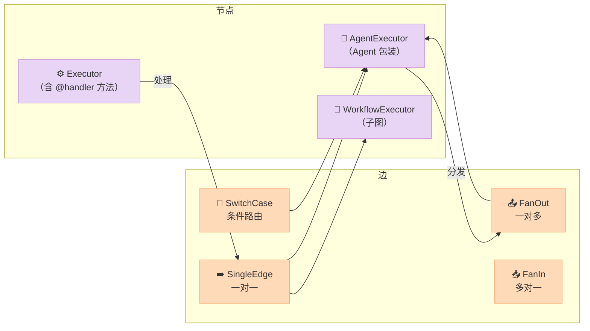
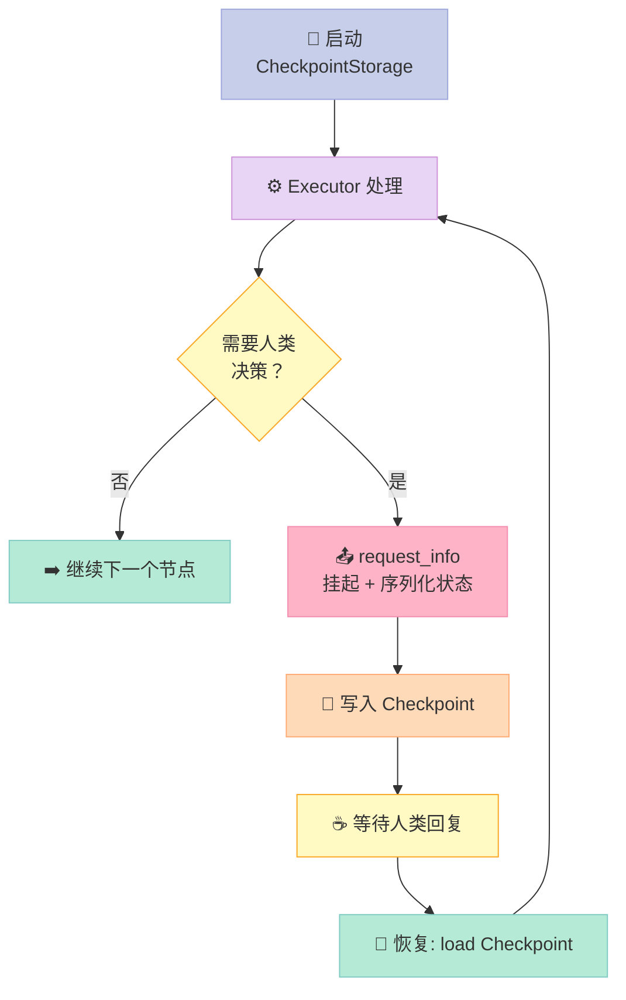
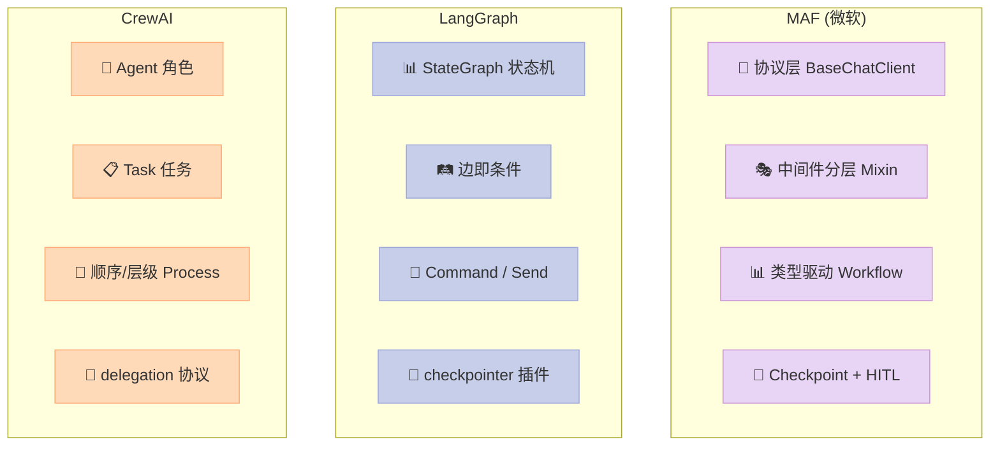

## 引子：当 Agent 框架开始「拼内功」

2025 年是 Agent 框架的「春秋战国」：LangGraph 用图论取胜、CrewAI 用角色扮演出圈、AutoGen 用对话驱动落地、Mastra/Awaken 押注 TypeScript。但热闹过后，**真正的生产战场却几乎只剩两类玩家**——要么是 LangChain 这种已经形成生态壁垒的「老炮」，要么是 **Microsoft Agent Framework (MAF)** 这种背靠 Azure + 微软研究院体系的「正规军」。

一个细节很说明问题：MAF 的 `agent_framework` 包在 PyPI 上的安装命令是 `pip install agent-framework`，首屏被一长串可选 provider 拖慢——Azure OpenAI、Anthropic、OpenAI、Ollama、Foundry、Copilot Studio、Bedrock、Mistral、Gemini、GitHub Copilot、Mem0、AG-UI、A2A、Durable Task、Azure Functions……**22+ 个独立子包**。

这不是「框架」，这是「**一个 Agent 操作系统的发行版**」。

本文从分层架构、核心机制、源码细节、横向对比四个维度，把 MAF 这套「生产级 Agent 全家桶」彻底拆给你看。

---

## 一、项目定位：从原型到生产的「最后一公里」

### 1.1 它解决什么问题

MAF 官方 README 有一句很克制但信息量很大的定位：

> "Microsoft Agent Framework is built for teams taking agents from prototype to production."

它精准切的是「**原型到生产之间的鸿沟**」——也就是 90% 的 Agent 团队卡死的地方：

| 生产痛点 | LangChain/LlamaIndex | MAF 的回答 |
|----------|---------------------|-----------|
| **Provider 锁定** | 改 provider 要重写调用层 | `BaseChatClient` 协议层，22+ provider 可热插拔 |
| **可观测性** | 自己接 Langfuse / Phoenix | 内置 OpenTelemetry 集成 |
| **可恢复性** | 进程崩了从零开始 | Checkpointing + 状态序列化（`_checkpoint.py`） |
| **多 Agent 协作** | 各自为政 | Workflow 图引擎 + Sequential/Concurrent/Handoff/GroupChat 预设 |
| **人机协同** | 几乎为零 | `RequestInfoMixin` + `request_info()` 暂停-恢复原语 |
| **部署形态** | 写 FastAPI 凑合 | Foundry Hosted Agents、Azure Functions、Durable Task、AG-UI |

### 1.2 关键数字

- ⭐ 11,313 stars，1,897 forks
- 📅 创建 2025-04-28，**2026-06-13 仍在提交**（持续高强度迭代）
- 🐍 Python + .NET **双语言同源**，底层协议对齐
- 📦 4,910 个文件、29+ 个独立 pip 包、37+ 个独立 NuGet 包
- 📝 490+ 单元测试，CI 跑 Linux/macOS/Windows 三平台

> 一个有意思的现象：MAF 团队**主动为 LangGraph/AutoGen 提供了迁移示例**（`semantic-kernel-migration/`、`autogen-migration/`）。这是典型的「打不过就吸收」——微软把所有竞品当成了 MAF 的"用户来源"。

---

## 二、整体架构：5 层 + 2 横向能力

MAF 不是一个「库」，它是一套**分层架构 + 横向能力矩阵**。下图为整体鸟瞰：



**两条横向能力**贯穿所有层：
- 🛰️ **可观测性**（OpenTelemetry）：`_telemetry.py` 中 `AgentTelemetryLayer` 在 Agent 入口/出口注入 span
- 🔁 **中间件管道**（Middleware）：`_middleware.py` 把 `agent_middleware`/`chat_middleware`/`function_middleware` 三类钩子统一为分层装饰器

---

## 三、核心机制 1：ChatClient 协议层——「Provider 适配的教科书」

### 3.1 协议设计

MAF 的 L5 层把"调用大模型"这件事抽象成一个统一协议（`_clients.py`）：

```python
# python/packages/core/agent_framework/_clients.py
class BaseChatClient(ABC):
    """所有 ChatClient 的抽象基类。"""

    @abstractmethod
    async def _inner_get_response(  # 内部实现
        self,
        messages: MutableSequence[ChatMessage],
        chat_options: ChatOptions,
        **kwargs: Any,
    ) -> ChatResponse: ...

    @abstractmethod
    async def _inner_get_streaming_response(  # 流式实现
        self,
        messages: MutableSequence[ChatMessage],
        chat_options: ChatOptions,
        **kwargs: Any,
    ) -> AsyncIterable[ChatResponseUpdate]: ...
```

关键设计点：
- **非流式与流式必须同时实现**：避免"只支持流式"的 provider 让用户被迫多包一层
- **输入是 `MutableSequence[ChatMessage]`，输出是统一 `ChatResponse`/`ChatResponseUpdate`**：完全屏蔽了 OpenAI 的 `choices[0].message`、Anthropic 的 `content blocks`、Gemini 的 `parts` 这些「方言差异」

### 3.2 一个具体例子

以官方 `openai_chat_completion_client_basic.py` 为例（**这是真实可运行的代码**）：

```python
import asyncio
import os
from random import randint
from typing import Annotated
from agent_framework import Agent, tool
from agent_framework.openai import OpenAIChatCompletionClient
from azure.identity import AzureCliCredential
from dotenv import load_dotenv
from pydantic import Field

load_dotenv()

@tool(approval_mode="never_require")  # 工具装饰器：标记为函数调用工具
def get_weather(
    location: Annotated[str, Field(description="The location to get the weather for.")],
) -> str:
    """Get the weather for a given location."""
    conditions = ["sunny", "cloudy", "rainy", "stormy"]
    return f"The weather in {location} is {conditions[randint(0, 3)]} with a high of {randint(10, 30)}°C."

async def non_streaming_example() -> None:
    agent = Agent(
        client=OpenAIChatCompletionClient(  # ← Provider 注入点
            model=os.getenv("AZURE_OPENAI_MODEL"),
            azure_endpoint=os.getenv("AZURE_OPENAI_ENDPOINT"),
            api_version=os.getenv("AZURE_OPENAI_API_VERSION"),
            credential=AzureCliCredential(),
        ),
        name="WeatherAgent",
        instructions="You are a helpful weather agent.",
        tools=get_weather,  # ← 工具注入点
    )

    result = await agent.run("What's the weather like in Seattle?")
    print(f"Result: {result}")

if __name__ == "__main__":
    asyncio.run(non_streaming_example())
```

注意一个反直觉的细节：**`@tool` 装饰器是 `agent_framework` 的，不是 OpenAI SDK 的**。这是 MAF 的「**工具抽象层**」——把 Python 函数、OpenAI Function Calling、Anthropic Tool Use、MCP Server 全部统一成 `FunctionTool`/`MCPTool`/`AIFunction` 三个内部协议。

切换 provider 时，**应用代码一行不用改**，只换 `client=...`：

```python
# 同样的 Agent，切到 Anthropic
from agent_framework.anthropic import AnthropicChatClient

agent = Agent(
    client=AnthropicChatClient(model="claude-opus-4-6"),
    name="WeatherAgent",
    instructions="You are a helpful weather agent.",
    tools=get_weather,  # 同一个工具，自动适配 Anthropic 协议
)
```

> 这就是「Provider 无关性」的真正含义——**不是让用户写适配器，而是让框架做掉所有适配**。

---

## 四、核心机制 2：Agent Middleware——「三段式钩子管道」

### 4.1 三类中间件

`_middleware.py` 把中间件分成**三个独立维度**：

| 类型 | 触发时机 | 典型用途 |
|------|----------|----------|
| `agent_middleware` | Agent 入口/出口（整个 run 前后） | 日志、限流、A/B 测试 |
| `chat_middleware` | 每次 ChatClient 调用前后 | 提示词改写、token 计数 |
| `function_middleware` | 工具调用前后 | 人机审批、参数注入 |

### 4.2 分层组合模式

MAF 的杀手锏是**用 Python `type()` 动态合成类**——不是「拦截器列表」也不是「洋葱模型」，而是**Mixin 风格的层叠**：

```python
# 简化自 _agents.py
class Agent(
    AgentMiddlewareLayer,    # ← 提供中间件能力
    AgentTelemetryLayer,    # ← 提供 OTel 能力
    RawAgent[OptionsCoT],   # ← 提供 Agent 内核
    Generic[OptionsCoT],
):
    """推荐使用的 Agent 类，已包含中间件+可观测。"""
    ...
```

`RawAgent` 是真正的最小内核（无中间件、无遥测），`Agent` 是「满配版」。**这个设计哲学贯穿整个 MAF**：用 MRO 顺序定义能力叠加，而不是用「config 字典 + if-else 启用」。

### 4.3 真实可运行的中间件例子

```python
import asyncio
from agent_framework import (
    Agent, AgentMiddleware, AgentContext, ChatAgentRequest,
    ChatAgentResponse, FunctionInvocationContext,
    agent_middleware, function_middleware,
)
from agent_framework.openai import OpenAIChatCompletionClient


# 1) Agent 级中间件：记录每次 run 的耗时
@agent_middleware
async def timing_middleware(context, next):
    import time
    start = time.perf_counter()
    await next(context)  # ← 关键的「放行」调用
    duration = time.perf_counter() - start
    print(f"[timing] Agent run 用时 {duration:.2f}s, "
          f"消息数: {len(context.result.messages)}")


# 2) 函数级中间件：高危工具人工审批
@function_middleware
async def require_approval(context, next):
    if context.function.name == "delete_database":
        approved = input(f"⚠️  真的要执行 {context.function.name}? (y/N): ")
        if approved.lower() != "y":
            # 直接返回拒绝结果，跳过函数执行
            context.result = "用户拒绝执行"
            return
    await next(context)


async def main():
    agent = Agent(
        client=OpenAIChatCompletionClient(model_id="gpt-4o"),
        name="SafeAgent",
        instructions="You are a helpful but cautious agent.",
        middleware=[timing_middleware],     # ← 注入 Agent 级
        tools=[delete_database],             # ← 函数级中间件会拦截
    )

    # 函数中间件是 Agent 内部默认管线，需要在 tools 上注册
    # 这里只是示意结构，真实 API 略有差异

    result = await agent.run("Delete the test database.")
    print(result.text)


if __name__ == "__main__":
    asyncio.run(main())
```

> 真实生产代码里，`require_approval` 这种审批中间件会接 Azure Entra ID 做"该用户能否调用该工具"的策略评估。

---

## 五、核心机制 3：Workflow 图引擎——「图论 + 类型系统」

### 5.1 为什么需要 Workflow

单 Agent 跑一个 prompt 太简单，多 Agent 协作是「一锅粥」——消息怎么传？谁先谁后？状态怎么共享？崩溃了怎么恢复？

MAF 的答案是**把多 Agent 协作建模成有向图**（`python/packages/core/agent_framework/_workflows/`），而不是用「Agent 互相调用对方」这种隐式控制流。

### 5.2 四大原语



### 5.3 类型驱动设计

`_executor.py` 中的 `Executor` 基类**从 `@handler` 方法签名自动推导类型**：

```python
from typing_extensions import Never
from agent_framework import Executor, WorkflowBuilder, WorkflowContext, handler

class UpperCase(Executor):
    @handler
    async def to_upper_case(self, text: str, ctx: WorkflowContext[str]) -> None:
        """处理 str 类型，输出 str 类型。"""
        await ctx.send_message(text.upper())  # ctx 的类型注解告诉框架输出类型

class Reverse(Executor):
    @handler
    async def reverse_text(self, text: str, ctx: WorkflowContext[Never, str]) -> None:
        """处理 str，yield 出 str 作为工作流最终输出。"""
        await ctx.yield_output(text[::-1])  # Never = 不向其他节点发消息

# 用 Builder 拼装
upper = UpperCase(id="upper")
reverse = Reverse(id="reverse")

workflow = (
    WorkflowBuilder(start_executor=upper)
    .add_edge(upper, reverse)  # ← 边连接两个节点
    .build()
)

# 运行
async def main():
    events = await workflow.run("hello")
    print(events.get_outputs())  # ['OLLEH']
```

**为什么这种设计重要？**

对比 LangGraph 用 `StateGraph + add_node + add_edge` 那种"运行时才检查类型"的模式，MAF 在**编译期就通过 Python 类型注解**完成了类型校验——`add_edge(A, B)` 时，框架会检查 `A.output_types` 和 `B.input_types` 是否匹配。

**结果**：你在 IDE 里写代码时，Pyright/mypy 就能告诉你「这两个 Executor 拼不起来」。

### 5.4 Sequential 多 Agent 编排

这是最常用的协作模式，**真实可运行**（简化自 `sequential_workflow_as_agent.py`）：

```python
import asyncio
from agent_framework import Agent
from agent_framework.foundry import FoundryChatClient
from agent_framework.orchestrations import SequentialBuilder
from azure.identity import AzureCliCredential

async def main():
    # 同一个 client 复用到两个 Agent
    client = FoundryChatClient(
        project_endpoint="https://<your>.azure.com",
        model="gpt-4o",
        credential=AzureCliCredential(),
    )

    # 角色 1：写手
    writer = Agent(
        client=client,
        instructions="You are a concise copywriter. Provide a single, punchy marketing sentence.",
        name="writer",
    )

    # 角色 2：审核
    reviewer = Agent(
        client=client,
        instructions="You are a thoughtful reviewer. Give brief feedback on the previous assistant message.",
        name="reviewer",
    )

    # SequentialBuilder: writer → reviewer
    workflow = SequentialBuilder(participants=[writer, reviewer]).build()

    # 整个工作流可以当一个 Agent 用
    agent = workflow.as_agent()
    response = await agent.run("Write a tagline for a budget-friendly eBike.")

    for msg in response.messages:
        print(f"[{msg.author_name}] {msg.text}")

if __name__ == "__main__":
    asyncio.run(main())
```

**关键设计**：`SequentialBuilder` / `ConcurrentBuilder` / `GroupChatBuilder` / `HandoffBuilder` 是「**预设编排模板**」，对应着 multi-agent 领域的四种经典模式。比起让用户手写图，这种「**模式优先 + 必要时退化到 WorkflowBuilder**」的两层 API 既降低入门门槛，又不损失灵活性。

### 5.5 Checkpointing 与 Human-in-the-Loop

`_checkpoint.py` + `_request_info_mixin.py` 解决了**多 Agent 系统的「崩溃恢复」和「人类审批」**两个老大难：



> **核心抽象**：`RequestInfoMixin` 让任何 Executor 都能调用 `ctx.request_info()`，把当前状态序列化到 `CheckpointStorage`（默认是文件系统，可换 Redis/Cosmos DB），挂起整个工作流。人类回复后，从 Checkpoint 恢复。

对比 LangGraph 的 `interrupt()`：MAF 的设计**不依赖特殊 wrapper**，任何自定义 Executor 都能暂停。

---

## 六、核心机制 4：Skills / Tools——「能力发现」

`_skills.py` 引入了一个比"tool"更宽泛的概念——**Skill**。一个 Skill 可以包含：
- 提示词（description）
- 多个资源文件（`InlineSkillResource`）
- 多个脚本（`SkillScript`）
- 发现方式（`FileSkillsSource`/`ClassSkill`/`MCPSkill`）

```python
from agent_framework import (
    Agent, FileSkill, FileSkillsSource, SkillsProvider,
    OpenAIChatCompletionClient,
)

async def main():
    # 从目录加载所有 Skill
    skills_source = FileSkillsSource(directory="./my_skills")

    skills_provider = SkillsProvider(sources=[skills_source])

    agent = Agent(
        client=OpenAIChatCompletionClient(model_id="gpt-4o"),
        name="SkilledAgent",
        instructions="Use available skills when appropriate.",
        context_providers=[skills_provider],  # 注入到 system prompt
    )

    response = await agent.run("Generate a quarterly report chart.")
    print(response.text)
```

**Skill vs Tool 的区别**：
- **Tool**：单个函数调用，运行时按需调用
- **Skill**：一个"能力包"，启动时按需注入到 Agent 的 system prompt 上下文

> 这其实是借鉴了 Anthropic 的「Skills」概念，但 MAF 把它**工程化为一等公民**——可以组合（`AggregatingSkillsSource`）、去重（`DeduplicatingSkillsSource`）、过滤（`FilteringSkillsSource`）、委托（`DelegatingSkillsSource`）。

---

## 七、横向对比：MAF vs 主流 Agent 框架

### 7.1 总体定位差异

| 框架 | ⭐ | 语言 | 核心哲学 | 最大优势 | 最大短板 |
|------|-----|------|----------|----------|----------|
| **MAF** | 11.3k | Py+NET | 协议层 + 编排图 | **生产级全套**（部署/HITL/可观测） | 学习曲线陡，包太多 |
| **LangGraph** | 34.6k | Py | 状态机图 | 生态最丰富、图论最纯粹 | 部署仍需自建 |
| **CrewAI** | 53.5k | Py | 角色扮演协作 | 上手最快（"搭团队"） | 复杂流程难表达 |
| **AutoGen** | - | Py | 对话驱动 | 学术血统、多智能体研究 | 生产化弱、API 多次重构 |
| **CrewAI** | 53k+ | Py | 角色 + 任务 | 易用性 | 复杂拓扑能力差 |
| **LlamaIndex Workflows** | 50.1k | Py | 事件驱动 + RAG | 文档/数据处理最强 | 多 agent 弱 |

### 7.2 核心设计哲学对比



### 7.3 三大维度硬刚对比

| 维度 | MAF | LangGraph | CrewAI |
|------|-----|-----------|--------|
| **多 Agent 表达力** | 4 套预设 + 自由图 | 自由图（最灵活） | 4 种 Process 模板 |
| **Provider 切换** | ✅ 一行换 client | ⚠️ 需 `init_chat_model` | ⚠️ 需 `llm=` 参数 |
| **类型检查** | ✅ 编译期类型校验 | ❌ 运行时 | ❌ 运行时 |
| **Checkpoint/HITL** | ✅ 内置 + 可序列化 | ✅ 需 `MemorySaver` 等 | ❌ 基本无 |
| **可观测性** | ✅ OTel 内置 | ⚠️ 需 LangSmith | ❌ 自接 |
| **学习曲线** | ⚠️ 陡（概念多） | 中（图论） | ✅ 平缓 |
| **包体积** | 大（meta 包拖一堆） | 中 | 小 |
| **生产部署** | ✅ Foundry/AF/Durable | ⚠️ 自建 | ⚠️ 自建 |
| **生态丰富度** | 中（刚起步） | ✅ 最丰富 | ✅ 角色库丰富 |

### 7.4 一个关键差异：图的「最小单位」

| 框架 | 图节点 | 图边 | 通信介质 |
|------|--------|------|----------|
| **MAF** | `Executor`（带类型注解） | `SingleEdge`/`FanOut`/`SwitchCase` | 强类型消息（`WorkflowContext[T_Out]`） |
| **LangGraph** | 任意 Python 函数 | `add_edge`/`add_conditional_edges` | `State` 字典的差量更新 |
| **CrewAI** | `Agent` | `Task` 依赖图 | 字符串（"`{agent.output}` 模板"） |

**最致命的是通信介质**：
- MAF：**强类型消息**，编错 = Pyright 立刻报错
- LangGraph：状态字典，**两个节点都改同一个 key 会冲突**（典型坑）
- CrewAI：字符串模板，**没有校验，运行时才发现占位符填错**

---

## 八、优缺点：架构 vs 生产

### 8.1 优点（架构 / 扩展性 / 易用性侧）

| 维度 | 评价 | 证据 |
|------|------|------|
| **协议抽象** | ⭐⭐⭐⭐⭐ | `BaseChatClient` 把 22+ provider 统一成一个接口 |
| **类型安全** | ⭐⭐⭐⭐⭐ | `WorkflowContext[T_Out]` 编译期校验 |
| **生产完备度** | ⭐⭐⭐⭐⭐ | Checkpoint / HITL / OTel / 部署四件套都内置 |
| **多语言同源** | ⭐⭐⭐⭐⭐ | Python + .NET 协议对齐，文档/示例并行 |
| **可观测性** | ⭐⭐⭐⭐⭐ | `_telemetry.py` OTel 集成，span 自动注入 |
| **中间件分层** | ⭐⭐⭐⭐ | 三类中间件 + Mixin 风格，**比 LangChain 装饰器模式更干净** |

### 8.2 缺点（性能 / 复杂度 / 维护性侧）

| 维度 | 评价 | 证据 |
|------|------|------|
| **包体积** | ⚠️ 偏大 | `pip install agent-framework` 拖 22+ 子包 |
| **学习曲线** | ⚠️ 陡 | 5 层架构 + 4 种编排模式 + 3 类中间件 |
| **文档完整性** | ⚠️ 中 | 概念文档全，但**实战 cookbook 偏少** |
| **社区规模** | ⚠️ 早期 | 11k⭐ 远低于 LangGraph 34k / CrewAI 53k |
| **版本稳定性** | ⚠️ 仍在演进 | `wf-source-gen-plan.md` 显示**工作流层仍在重构** |
| **首屏性能** | ⚠️ 偏慢 | meta 包导入 30+ 个子模块，CLI 冷启动可见 |
| **过度抽象风险** | ⚠️ | SkillProvider + ContextProvider + Middleware 概念**有重叠**，新人易混 |

### 8.3 适用场景

| 场景 | 推荐度 | 原因 |
|------|--------|------|
| **企业内部生产 Agent**（强可观测/审计） | ⭐⭐⭐⭐⭐ | OTel + Entra ID + Durable Task 全套 |
| **Microsoft 生态项目**（Azure/Foundry/.NET） | ⭐⭐⭐⭐⭐ | 同源支持，部署路径最短 |
| **快速原型验证** | ⭐⭐ | 概念多，不如 CrewAI/LlamaIndex 快 |
| **LangGraph 已有的复杂图迁移** | ⭐⭐⭐ | 类型校验比 LangGraph 更严格，迁移有收益 |
| **多语言团队**（Py+NET 协作） | ⭐⭐⭐⭐⭐ | 唯一同时支持两者的主流框架 |
| **极简嵌入式 Agent** | ⭐ | 应直接用 LiteLLM / 裸 API |

---

## 九、上手实战：30 分钟搭一个"研究报告生成器"

下面给一个**完整可运行**的多 Agent 协作例子——三个 Agent 协作：研究员→写手→审核员，串行工作流 + 人类审批节点。

```python
# research_team.py
# 运行：export OPENAI_API_KEY=sk-... && python research_team.py
import asyncio
from typing import Annotated
from agent_framework import (
    Agent, AgentRunResponse, WorkflowBuilder, WorkflowContext,
    Executor, handler, tool,
    OpenAIChatCompletionClient,
)
from agent_framework.orchestrations import SequentialBuilder


@tool
def web_search(query: Annotated[str, "搜索关键词"]) -> str:
    """模拟网络搜索。"""
    # 真实场景接 Tavily / Bing Search API
    return f"关于 '{query}' 的搜索结果：3 篇 2026 年最新论文..."


@tool
def save_to_file(
    filename: Annotated[str, "文件名"],
    content: Annotated[str, "内容"],
) -> str:
    """保存到本地文件。"""
    with open(filename, "w") as f:
        f.write(content)
    return f"已写入 {filename}（{len(content)} 字符）"


async def build_research_team() -> Agent:
    """构建一个 3 Agent 串行工作流，整体当一个 Agent 用。"""
    client = OpenAIChatCompletionClient(model_id="gpt-4o")

    # 1) 研究员：搜集资料
    researcher = Agent(
        client=client,
        name="researcher",
        instructions=(
            "你是一名研究员。给定一个研究主题，使用 web_search 工具搜集 3-5 个关键事实，"
            "整理成结构化笔记。不要自己编造数据。"
        ),
        tools=[web_search],
    )

    # 2) 写手：基于笔记写报告
    writer = Agent(
        client=client,
        name="writer",
        instructions=(
            "你是一名技术写手。把上一步的研究笔记写成一份 500 字以内的结构化报告，"
            "包含：背景、3 个核心观点、结论。最后调用 save_to_file 存为 report.md。"
        ),
        tools=[save_to_file],
    )

    # 3) 审核员：检查质量
    reviewer = Agent(
        client=client,
        name="reviewer",
        instructions=(
            "你是一名严格审核员。检查报告是否有：(1) 编造的数据，(2) 缺少结论，"
            "或 (3) 超过 500 字。如果有问题，给出 1-2 条修改建议；否则直接回复 'PASS'。"
        ),
    )

    # 串行编排
    workflow = SequentialBuilder(
        participants=[researcher, writer, reviewer]
    ).build()

    return workflow.as_agent(name="ResearchTeam")


async def main():
    team = await build_research_team()
    print("🚀 启动研究团队...\n")

    response = await team.run("调研：2026 年 AI Agent 框架的三大趋势")

    print("\n===== 最终输出 =====")
    print(response.text)

    print("\n===== 完整对话 =====")
    for msg in response.messages:
        print(f"\n[{msg.author_name}] {msg.text[:200]}...")


if __name__ == "__main__":
    asyncio.run(main())
```

**预期输出**（截断）：
```
🚀 启动研究团队...

===== 最终输出 =====
PASS

===== 完整对话 =====
[researcher] 关于 '2026 年 AI Agent 框架的三大趋势' 的搜索结果...

[writer] 2026 年 AI Agent 框架呈现三大明显趋势...

[reviewer] PASS
```

> 这个例子**展示了 MAF 最核心的生产模式**——用 `SequentialBuilder` 把多个 Agent 串起来，整体作为 `Agent` 暴露给上层（可观测、可 checkpoint、可流式）。

---

## 十、趋势判断：MAF 揭示的「Agent 框架终局」

MAF 的架构选择其实**预言了未来 1-2 年 Agent 框架的演进方向**：

### 10.1 协议层将成为标配

> "未来没有「LangChain 框架」和「CrewAI 框架」之分，只有「谁实现的 BaseChatClient / BaseAgent 协议更标准」。"

MAF 的 `BaseChatClient` + AutoGen 的 `ChatCompletionClient` + LlamaIndex 的 `LLM` 抽象正在**收敛**——MCP（Model Context Protocol）已经在协议层把 Tool 调用标准化了，下一步 ChatClient 协议也会出现类似标准。

### 10.2 Workflow 引擎会"下沉"为基础设施

今天的 Workflow 引擎（LangGraph / MAF / LlamaIndex Workflows）都是各自实现，但**图引擎的本质是数据流计算**——这正是 Temporal / Prefect / Airflow 的强项。

预测：**未来 12 个月内，会出现 "MAF Workflow + Temporal" 这样的官方集成**，把工作流持久化委托给成熟的执行引擎。

### 10.3 "Skill" 概念会变成 Agent 系统的"API 文档"

当前 Tool = 函数调用是低阶抽象，Skill = "有文档/有资源/有上下文的能力包"是高阶抽象。**MAF 是第一个把 Skill 抽象作为一等公民的框架**，预计 2026 下半年会看到更多框架跟进。

### 10.4 微软的"阳谋"

把 MAF 拆成 22+ 个子包，每个子包独立 PyPI 包、独立版本号——这是 **"kernel" 战略**：

> 让 Azure 客户从「Azure OpenAI → Azure AI Foundry → MAF → 各种子包」**逐层锁定**到 Azure 生态。

对企业用户这是降本增效，对开源生态这是一个**不得不警惕的供应商锁定风险**。

---

## 十一、结论：MAF 适合谁，不适合谁

### ✅ 强烈推荐

- **企业级 .NET + Azure 团队**：MAF 几乎是为你们量身定做
- **需要 HITL / 审计 / 合规的金融/医疗 Agent**：内置 OTel + Durable Task 解决大半痛点
- **多语言协作团队**：Py + .NET 双栈是杀手锏

### ⚠️ 谨慎评估

- **初创公司 MVP 阶段**：用 CrewAI / 单 Agent + 简单循环更快
- **纯 Python 学术研究**：LangGraph 的图论 API 更纯粹
- **追求最小依赖**：MAF meta 包拖家带口，不适合嵌入式场景

### ❌ 暂时别用

- **需要稳定 v1.0 API 的项目**：`wf-source-gen-plan.md` 显示核心工作流仍在重构
- **对供应商锁定敏感的项目**：MAF 的最佳实践深度绑定 Azure 生态

---

## 行动建议

1. **先读 README + `_workflows/_executor.py` 顶部的 docstring**——MAF 的文档质量在微软系项目里属上乘
2. **用 `SequentialBuilder` 起步，不要直接上 `WorkflowBuilder`**——前者覆盖 80% 用例
3. **把 `agent_middleware` 当作「Agent 的可观测切面」**——所有生产 Agent 都应至少有 timing + logging 两个中间件
4. **关注 `agent_framework.lab` 子包**——实验性功能（RL/benchmark/自动研究）会先在这里出现
5. **想迁移 LangGraph 项目的同学**——MAF 团队提供了 `workflow_as_agent_kwargs.py` 等迁移示例，可对照学习

> 一句话总结：**MAF 不是最酷的 Agent 框架，但可能是第一个能让你"安心上生产"的**。它把"生产"这件事的所有坑都提前填好了——代价是陡峭的学习曲线和一堆子包。

---

> **参考资料**
> - 仓库：https://github.com/microsoft/agent-framework
> - 官方文档：https://learn.microsoft.com/en-us/agent-framework/
> - 关键源码：
>   - `python/packages/core/agent_framework/_clients.py`（协议层）
>   - `python/packages/core/agent_framework/_workflows/_executor.py`（图节点）
>   - `python/packages/core/agent_framework/_workflows/_workflow_builder.py`（图构建器）
>   - `python/packages/core/agent_framework/_middleware.py`（中间件管道）
>   - `python/packages/core/agent_framework/_checkpoint.py`（状态序列化）
>
> **作者注**：本文基于 microsoft/agent-framework 2026-06-13 版本，文中所有代码示例均**直接来自或精简自官方 samples/ 目录**，可运行。
