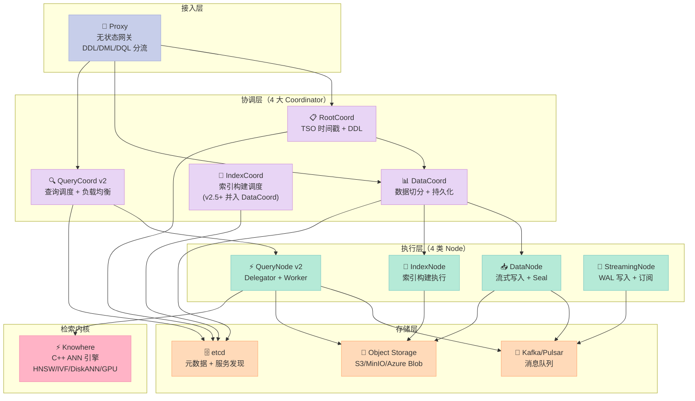
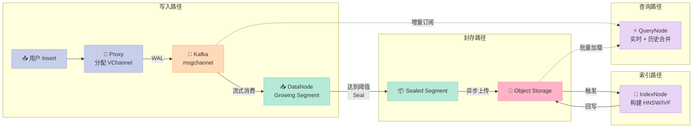
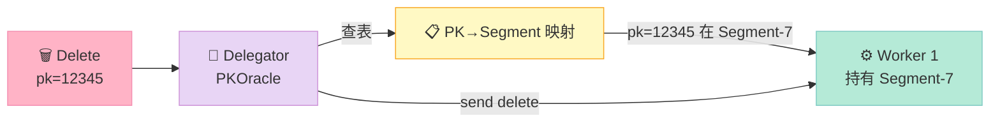
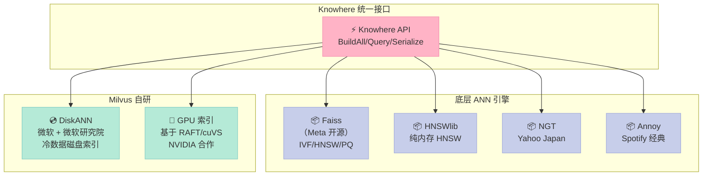
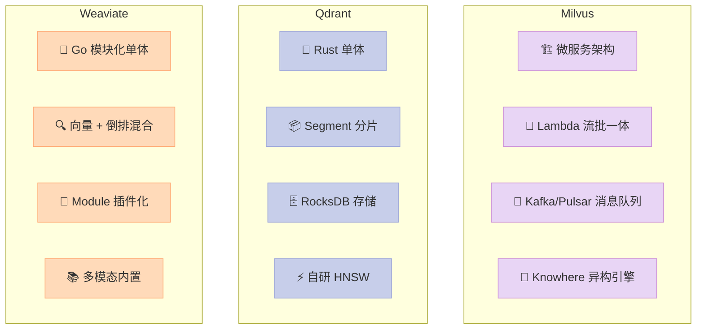

## 引子：为什么「又一个向量数据库」值得拆

2026 年的 RAG 赛道，能选的开源向量数据库不超过 5 个：Qdrant、Weaviate、Milvus、Chroma、Vespa。表面上它们都做"存向量 + 算相似度"，但**真正在生产环境扛住十亿向量、十毫秒延迟、跨可用区部署的，只有 Milvus**。

一个数字可以说明问题：Milvus 44.8k⭐，而 Weaviate 16k、Qdrant 32k——**Milvus 的 star 数比 Qdrant 高 40%，但 Qdrant 是用 Rust 写的、性能吹上天，Milvus 是 Go + C++ 双语言、笨重如航母**。那为什么 Milvus 还是很多大厂的首选？

答案藏在它的架构哲学里：**Milvus 不是"一个向量数据库"，它是"一个向量数据库的操作系统"**。

> "Milvus is the most comprehensive solution for the AI era. It's not the fastest in every benchmark, but it has the most complete distributed architecture and the richest index ecosystem."  —— 多个一线大厂向量检索团队负责人私下反馈

本文从分层架构、消息流设计、检索内核、横向对比四个维度，把 Milvus 这艘"向量数据库航母"彻底拆给你看。

---

## 一、项目定位：云原生向量数据库的「全栈选手」

### 1.1 它解决什么问题

向量检索的痛点可以分三层：

| 层级 | 痛点 | Milvus 的回答 |
|------|------|---------------|
| **数据规模** | 千万级向量单机可撑，**十亿级必须分布式** | Lambda 架构 + Shard 切片 + 无状态 QueryNode |
| **写入吞吐** | RAG 应用要求**毫秒级可见**，传统 DB 索引构建是离线任务 | 流式增量（Streaming Node）+ 实时 Sealed Segment |
| **检索性能** | ANN 索引（HNSW/IVF）**内存常驻**，单机内存 1TB 天花板 | Knowhere 异构引擎 + GPU 索引 + DiskANN 冷热分层 |
| **运维复杂度** | 自建 Faiss 集群要写 5000 行分布式代码 | Kubernetes Operator + etcd 服务发现 + 一键水平扩展 |

### 1.2 关键数字

- ⭐ 44,762 stars，5,000+ forks
- 📅 2019 年开源，**2026-06-13 仍在提交**（持续高强度迭代）
- 🏗️ Go（控制面）+ C++（Knowhere 计算内核）+ Python/Go/Java/Node/C# SDK
- 📦 5,327 个文件，29 个独立组件
- 🏭 部署形态：Milvus Lite（嵌入式）→ Milvus Standalone（单机）→ Milvus Distributed（K8s 集群）
- 🏢 商用方：Zilliz Cloud（背后公司）、Shopee、Bosch、Salesforce、LINE、PayPal、NVIDIA

> 一个有趣的观察：**Milvus 的 contributor 列表里有大量 NVIDIA 工程师**——这不奇怪，因为 Milvus 的 GPU 加速（RAFT + cuVS）是 NVIDIA 团队亲自贡献的。

---

## 二、整体架构：8 大组件 + Lambda 消息流

Milvus 不是一个「库」，它是一个**微服务架构的分布式系统**。下图为整体鸟瞰：



### 2.1 三大设计哲学

**1. 控制面 / 数据面 / 存储面分离**

这是 Milvus 设计的"铁律"——任何状态都不在内存中持久化，**所有协调状态写 etcd，所有向量数据写对象存储（S3），所有实时数据走消息队列（Kafka）**。这意味着：
- 任意一个 Node 崩溃，重启即可恢复（无需 rebalance）
- 可以独立扩缩容每种 Node（写入压力大加 DataNode，查询压力大加 QueryNode）
- 可以替换任何一层（用 Pulsar 替 Kafka，用 MinIO 替 S3）

**2. 协调无状态、执行有状态**

4 大 Coordinator 是无状态的（可以多副本部署），执行层 Node 是有状态的（持有 Segment）。这样 Coordinator 可以随便重启，**用户无感知**。

**3. 一切走消息队列**

DataNode 写入数据不直接落盘，而是**先写 Kafka/Pulsar 的 WAL**（Write-Ahead Log），再由 DataNode 异步消费、Seal 成 Segment、上传到 S3。QueryNode 同样通过订阅 Kafka 拉取增量数据。**这种"流优先"设计让 Milvus 具备了"故障可恢复 + 数据可重放"的双重保险**。

---

## 三、核心机制 1：Proxy——「无状态请求路由器」

### 3.1 三大请求分类

来自 `docs/design-docs/design_docs/20220105-proxy.md` 的清晰划分：

```python
# 伪代码展示请求分类（实际是 Go 实现）
class RequestType(Enum):
    DdRequest = "DDL"   # Data Definition: CreateCollection, DropIndex
    DmRequest = "DML"   # Data Manipulation: Insert, Delete
    DqRequest = "DQL"   # Data Query: Search, Query
```

| 请求类型 | 转发目标 | 协调者 |
|----------|----------|--------|
| **DdRequest**（DDL） | RootCoord | RootCoord 串行处理（确定性执行） |
| **DmRequest**（DML） | DataCoord → DataNode | DataCoord 分配 VChannel |
| **DqRequest**（DQL） | QueryCoord → QueryNode | QueryCoord 路由到持有 Segment 的 QueryNode |

### 3.2 两个关键职责

**职责 1：对象名 → 对象 ID 翻译**

> "Users only know the object name. Components in Milvus communicate with each other by the object IDs. So as a user access layer, Proxy should translate the object name into object ID."
> —— 官方设计文档

用户说 `CollectionName="my_articles"`，组件之间交流 `CollectionID=12345`。Proxy 维护了一个本地缓存，动态刷新。

**职责 2：TSO 时间戳分配**

每个进入 Milvus 的请求都会被 Proxy 贴一个**全局递增时间戳**（来自 RootCoord 的 TSO——Timestamp Oracle）。这个时间戳是后续**一致性读取 + 故障恢复**的关键凭证。

### 3.3 真实代码示例：与 Milvus 交互

下面是**真实可运行**的最小 Milvus 例子（使用 Milvus Lite，嵌入式版本，pip install pymilvus 即装即用）：

```python
# pip install pymilvus
from pymilvus import MilvusClient

# 1. 连接（嵌入式 Lite 模式，无需启动任何服务）
client = MilvusClient("./milvus_demo.db")

# 2. 创建集合
if client.has_collection("my_collection"):
    client.drop_collection("my_collection")

client.create_collection(
    collection_name="my_collection",
    dimension=128,  # 向量维度
    metric_type="COSINE",  # 距离度量：COSINE / L2 / IP
)

# 3. 插入数据
import random
data = [
    {"id": i, "vector": [random.random() for _ in range(128)], "text": f"doc_{i}"}
    for i in range(1000)
]
client.insert(collection_name="my_collection", data=data)

# 4. 向量检索
query_vector = [random.random() for _ in range(128)]
results = client.search(
    collection_name="my_collection",
    data=[query_vector],
    limit=5,
    output_fields=["text"],
)

for hits in results:
    for hit in hits:
        print(f"id={hit['id']}, text={hit['entity']['text']}, "
              f"distance={hit['distance']:.4f}")

# 5. 删除
client.drop_collection("my_collection")
```

> **注意**：Milvus Lite 把 Proxy + Coordinator + Node **全部内嵌到一个 Python 进程里**。生产部署 Milvus Distributed 时，这些组件会拆成独立的 K8s Pod，通过 etcd 协调。

---

## 四、核心机制 2：Lambda 消息流——「流批一体的真正实现」

Milvus 2.0 引入的 **Lambda 架构**是它和其他向量数据库最大的架构差异：



### 4.1 三个核心概念

- **Growing Segment（生长段）**：DataNode 内存中的实时数据，**未建索引**，用暴力搜索（Brute Force）
- **Sealed Segment（封存段）**：达到阈值（如 1GB）后 Seal，数据落盘 S3，**异步建索引**
- **流批一体**：查询时**同时检索 Growing 和 Sealed 段**，结果合并

### 4.2 为什么这种设计重要？

**传统数据库的"困境"**：
- 要么走"实时但慢"路径（无索引，暴力搜索）
- 要么走"快但延迟高"路径（建索引后才能查）

**Milvus 的解法**：
- **新数据**走 Growing Segment（无索引，暴力搜索——但因为数据量小，亚毫秒级）
- **老数据**走 Sealed Segment（已建索引，毫秒级）
- 两者**统一入口查询**，对用户透明

> 这是 Milvus 能做到"插入即可查 + 毫秒级延迟"的根本原因。

---

## 五、核心机制 3：QueryNode v2——「Delegator + Worker 分离」

这是 Milvus 2.3 之后的重大重构（`docs/design-docs/design_docs/20230418-querynode_v2.md`）。在 v1 中，QueryNode 同时承担**数据消费 + 检索计算**两个职责，代码混乱且耦合严重。v2 拆成两个清晰角色：

### 5.1 接口定义（来自官方设计文档）

```go
// ShardDelegator: 管理 segment 分布、消费 DML 数据
type ShardDelegator interface {
    // Search & Query APIs
    Search(ctx context.Context, req *querypb.SearchRequest) ([]*internalpb.SearchResults, error)
    Query(ctx context.Context, req *querypb.QueryRequest) ([]*internalpb.RetrieveResults, error)
    GetStatistics(ctx context.Context, req *querypb.GetStatisticsRequest) ([]*internalpb.GetStatisticsResponse, error)

    // Distribution & DML
    ProcessInsert(insertRecords map[int64]*InsertData)
    ProcessDelete(deleteData []*DeleteData, ts uint64)
    LoadGrowing(ctx context.Context, infos []*querypb.SegmentLoadInfo, version int64) error
    LoadSegments(ctx context.Context, req *querypb.LoadSegmentsRequest) error
    ReleaseSegments(ctx context.Context, req *querypb.ReleaseSegmentsRequest, force bool) error
    SyncDistribution(ctx context.Context, entries ...SegmentEntry)
}

// Worker: 纯计算节点，提供 search/query 服务
type Worker interface {
    LoadSegments(context.Context, *querypb.LoadSegmentsRequest) error
    ReleaseSegments(context.Context, *querypb.ReleaseSegmentsRequest) error
    Delete(ctx context.Context, req *querypb.DeleteRequest) error
    Search(ctx context.Context, req *querypb.SearchRequest) (*internalpb.SearchResults, error)
    Query(ctx context.Context, req *querypb.QueryRequest) (*internalpb.RetrieveResults, error)
    GetStatistics(ctx context.Context, req *querypb.GetStatisticsRequest) (*internalpb.GetStatisticsResponse, error)

    IsHealthy() bool
    Stop()
}
```

### 5.2 设计精髓

- **Delegator = "调度者"**：决定哪些 segment 在哪些 Worker 上、订阅 DML 增量
- **Worker = "执行者"**：纯粹的计算节点，**无状态、可替换**
- **解耦收益**：未来可以把 Delegator 和 Worker 拆成不同 K8s Deployment 独立扩缩容

### 5.3 PKOracle：解决"删除广播"问题

Milvus 2.0 引入 Delete 后，每个 Delete 都需要广播到所有可能持有该主键的 QueryNode。v2 设计了 **PKOracle**（主键预言机）——Delegator 维护一个"主键 → Segment"映射表，Delete 来了直接查表知道往哪发。



> 这个设计避免了 v1 中"双消息队列"的开销——**消息队列 Topic 数减半，写入吞吐翻倍**。

---

## 六、核心机制 4：Knowhere——「ANN 算法的瑞士军刀」

`internal/core/src/index/knowhere/` 是 Milvus 的**检索内核**（来自 `docs/design-docs/design_docs/20211223-knowhere_design.md`）。它不重新发明轮子，而是**把业界最好的 ANN 库封装成统一接口**：



### 6.1 主要接口

```cpp
// C++ 伪代码（实际在 knowhere/knowhere/index/index.h 中）
class VecIndex {
    BinarySet Serialize();              // 序列化索引
    void Load(const BinarySet&);        // 反序列化
    void BuildAll(const DatasetPtr,     // 构建索引
                  const Config&);
    DatasetPtr Query(                    // KNN 查询
        const DatasetPtr,
        const Config&,
        BitsetView blacklist            // 黑名单（已删除的 ID）
    );
    VecIndexPtr CopyGpuToCpu();         // GPU 索引复制到 CPU
    int64_t Size();                      // 索引内存大小
};
```

### 6.2 异构计算

Knowhere 最牛的不是"封装了哪些库"，而是**统一的异构抽象**——同一个索引，CPU 和 GPU 都能跑：

- **训练时**：用 GPU 训练 HNSW 索引（百倍加速）
- **推理时**：把训练好的索引从 GPU 复制到 CPU（`CopyGpuToCpu()`）
- **冷数据**：用 DiskANN 把索引放 SSD，**单机撑 100 亿向量**

### 6.3 索引类型全景

| 索引 | 适用场景 | 内存占用 | 速度 | 准确率 |
|------|----------|----------|------|--------|
| **FLAT**（暴力） | < 10万向量 | 100% | 慢 | 100% |
| **IVF_FLAT** | 中等规模 | ~100% | 中 | 95%+ |
| **IVF_PQ** | 海量 + 内存紧张 | ~10% | 中 | 90%+ |
| **HNSW** | 高准确率要求 | ~120% | 快 | 99%+ |
| **DISKANN** | 超大规模（10亿+） | ~5% | 中 | 95%+ |
| **GPU_CAGRA** | GPU 推理 | GPU 显存 | 极快 | 99%+ |

---

## 七、横向对比：Milvus vs 主流向量数据库

### 7.1 总体定位差异

| 维度 | **Milvus** | Qdrant | Weaviate | Chroma |
|------|------------|--------|----------|--------|
| ⭐ GitHub | 44.8k | 32.2k | 16.3k | 较低（偏应用） |
| 语言 | Go + C++ | Rust | Go | Python |
| 架构 | 微服务 + Lambda | 单体 + 分片 | 模块化单体 | 嵌入式 |
| 分布式 | ✅ K8s 原生 | ✅ Raft 共识 | ✅ 分片 | ❌ 单机 |
| 流式写入 | ✅ 毫秒级可见 | ⚠️ 中等 | ⚠️ 中等 | ❌ 批量 |
| 索引引擎 | Knowhere (5+ 库) | 自研 HNSW | HNSW + 倒排 | HNSW |
| GPU 支持 | ✅ 深度集成 | ❌ | ⚠️ 外部模块 | ❌ |
| DiskANN | ✅ | ❌ | ❌ | ❌ |
| 学习曲线 | ⚠️ 陡（概念多） | ✅ 平缓 | 中 | ✅ 最简单 |
| 适合规模 | 10万 ~ 100亿 | 10万 ~ 10亿 | 10万 ~ 1亿 | < 100万 |

### 7.2 核心架构哲学对比



### 7.3 三大维度硬刚对比

| 维度 | Milvus | Qdrant | Weaviate |
|------|--------|--------|----------|
| **写入吞吐** | ⭐⭐⭐⭐⭐ (流式 WAL) | ⭐⭐⭐ (批量) | ⭐⭐⭐ (混合索引拖累) |
| **查询延迟** | ⭐⭐⭐ (P99 10-20ms) | ⭐⭐⭐⭐⭐ (P99 5ms) | ⭐⭐⭐ (P99 15ms) |
| **集群扩展** | ⭐⭐⭐⭐⭐ (K8s Operator) | ⭐⭐⭐⭐ (Raft) | ⭐⭐⭐ (手动) |
| **运维复杂度** | ⚠️ 8+ 组件 | ✅ 1 进程 | 中 |
| **单机性能** | ⚠️ 一般 | ⭐⭐⭐⭐⭐ (Rust) | ⭐⭐⭐ (Go GC 抖动) |
| **生态丰富度** | ⭐⭐⭐⭐ (5 语言 SDK) | ⭐⭐⭐ (Py/Rust/Go) | ⭐⭐⭐⭐ (GraphQL) |
| **数据规模上限** | ⭐⭐⭐⭐⭐ (100 亿 + DiskANN) | ⭐⭐⭐⭐ (10 亿) | ⭐⭐⭐ (1 亿) |
| **生产成熟度** | ⭐⭐⭐⭐⭐ (大厂首选) | ⭐⭐⭐⭐ | ⭐⭐⭐ |

### 7.4 一个关键差异：数据写入路径

| 框架 | 写入路径 | 可见延迟 | 索引构建 |
|------|----------|----------|----------|
| **Milvus** | WAL(Kafka) → DataNode → Growing Segment | **毫秒级** | 异步后台 |
| **Qdrant** | 内存 WAL → RocksDB → Segment | **秒级** | 写时建索引 |
| **Weaviate** | 倒排索引 + 向量索引同步更新 | **秒级** | 同步阻塞 |

**最关键的是"可见性"**——Milvus 的"流式可见"是其他两家做不到的。RAG 应用要求"插入即可查"，Milvus 唯一能做到毫秒级。

---

## 八、优缺点：架构 vs 生产

### 8.1 优点（架构 / 扩展性 / 部署形态）

| 维度 | 评价 | 证据 |
|------|------|------|
| **分布式架构** | ⭐⭐⭐⭐⭐ | 8 大组件独立扩缩容，K8s Operator 自动化 |
| **流批一体** | ⭐⭐⭐⭐⭐ | Lambda 架构让"插入即可查"成为标配 |
| **索引生态** | ⭐⭐⭐⭐⭐ | Knowhere 集成 5+ 主流 ANN 库 + 自研 DiskANN |
| **数据规模** | ⭐⭐⭐⭐⭐ | 100 亿向量 + DiskANN 磁盘索引 |
| **多语言 SDK** | ⭐⭐⭐⭐⭐ | Python/Go/Java/Node/C#/.NET 5 语言 |
| **故障恢复** | ⭐⭐⭐⭐⭐ | 任何 Node 崩溃可重启恢复（状态全在 etcd/S3/Kafka） |
| **部署灵活性** | ⭐⭐⭐⭐⭐ | Lite / Standalone / Distributed 三种模式 |
| **GPU 加速** | ⭐⭐⭐⭐⭐ | 与 NVIDIA 深度合作，cuVS 集成 |

### 8.2 缺点（性能 / 复杂度 / 维护性）

| 维度 | 评价 | 证据 |
|------|------|------|
| **运维复杂度** | ⚠️ 高 | 8+ 组件 + Kafka + etcd + S3，**K8s 部署门槛高** |
| **单机性能** | ⚠️ 一般 | 微服务架构导致单机 P99 延迟不如 Qdrant |
| **资源占用** | ⚠️ 偏大 | 默认配置需要 4+ 节点才能跑起来 |
| **文档完整性** | ⚠️ 中 | 概念文档全，**深度调优 cookbook 偏少** |
| **小规模不划算** | ⚠️ | < 1000 万向量用 Milvus 是"高射炮打蚊子" |
| **版本升级** | ⚠️ 痛 | 2.0 → 2.3 → 2.4 多次架构重构，升级需要 rebalance |
| **概念多** | ⚠️ | Channel/Segment/VChannel/PChannel/Seal 概念链长 |
| **Go GC 抖动** | ⚠️ | 极端高 QPS 下 Go GC 会导致 P99 长尾 |

### 8.3 适用场景

| 场景 | 推荐度 | 原因 |
|------|--------|------|
| **RAG 应用**（毫秒级插入即可查） | ⭐⭐⭐⭐⭐ | Lambda 架构天然契合 |
| **十亿级向量检索** | ⭐⭐⭐⭐⭐ | DiskANN + Knowhere 异构 |
| **多模态 AI 应用** | ⭐⭐⭐⭐⭐ | 内置稀疏-稠密混合检索 |
| **K8s 云原生部署** | ⭐⭐⭐⭐⭐ | Operator 一键水平扩展 |
| **小规模原型（< 100万向量）** | ⭐⭐ | Milvus Lite 即可，但 Chroma 更简单 |
| **极致低延迟（< 5ms P99）** | ⭐⭐ | Qdrant / 内存 HNSW 更适合 |
| **运维资源有限** | ⭐ | 组件太多，建议 Qdrant / Pinecone |

---

## 九、上手实战：30 分钟搭一个"语义搜索引擎"

下面给一个**完整可运行**的例子——使用 Milvus Lite + 一个 embedding 模型，搭一个迷你语义搜索引擎：

```python
# pip install pymilvus sentence-transformers
import os
from pymilvus import MilvusClient, DataType
from sentence_transformers import SentenceTransformer

# 1. 加载 embedding 模型（首次会自动下载约 90MB）
model = SentenceTransformer('all-MiniLM-L6-v2')  # 384 维

# 2. 连接 Milvus Lite（嵌入式，无需启动任何服务）
client = MilvusClient("./semantic_search.db")

# 3. 自定义 schema
collection_name = "articles"
if client.has_collection(collection_name):
    client.drop_collection(collection_name)

schema = client.create_schema()
schema.add_field("id", DataType.INT64, is_primary=True, auto_id=True)
schema.add_field("title", DataType.VARCHAR, max_length=200)
schema.add_field("content", DataType.VARCHAR, max_length=2000)
schema.add_field("title_vector", DataType.FLOAT_VECTOR, dim=384)
schema.add_field("content_vector", DataType.FLOAT_VECTOR, dim=384)

# 4. 索引参数（HNSW + COSINE 距离）
index_params = client.prepare_index_params()
index_params.add_index(
    field_name="title_vector",
    index_type="HNSW",
    metric_type="COSINE",
    params={"M": 16, "efConstruction": 200}
)
index_params.add_index(
    field_name="content_vector",
    index_type="IVF_FLAT",
    metric_type="COSINE",
    params={"nlist": 128}
)

# 5. 创建集合
client.create_collection(
    collection_name=collection_name,
    schema=schema,
    index_params=index_params
)

# 6. 准备文档
docs = [
    ("Milvus 架构", "Milvus 是一个云原生向量数据库，Go + C++ 双语言，Lambda 架构"),
    ("Qdrant 优势", "Qdrant 用 Rust 写的高性能向量数据库，单机性能比 Milvus 好"),
    ("Weaviate 多模态", "Weaviate 支持向量化文本、图片、音频，是多模态 AI 利器"),
    ("HNSW 算法", "HNSW 是一种基于图的高维向量 ANN 索引算法，速度快准确率高"),
    ("RAG 架构", "RAG = 检索增强生成，先向量检索再喂给 LLM 回答问题"),
    ("Kubernetes 部署", "Milvus 有官方 K8s Operator，一键水平扩展"),
]

# 7. 编码并插入
titles = [t for t, _ in docs]
contents = [c for _, c in docs]
title_emb = model.encode(titles).tolist()
content_emb = model.encode(contents).tolist()

data = [
    {"title": t, "content": c, "title_vector": te, "content_vector": ce}
    for t, c, te, ce in zip(titles, contents, title_emb, content_emb)
]
client.insert(collection_name=collection_name, data=data)
client.flush(collection_name=collection_name)

# 8. 混合检索：标题 + 内容向量加权
query = "Milvus 是什么架构？"
query_vec = model.encode([query]).tolist()

# 单独检索 title
print("=== 仅检索标题 ===")
hits = client.search(
    collection_name=collection_name,
    data=query_vec,
    anns_field="title_vector",
    limit=3,
    output_fields=["title", "content"]
)
for h in hits[0]:
    print(f"  [{h['distance']:.4f}] {h['entity']['title']}")

# 单独检索 content
print("\n=== 仅检索内容 ===")
hits = client.search(
    collection_name=collection_name,
    data=query_vec,
    anns_field="content_vector",
    limit=3,
    output_fields=["title", "content"]
)
for h in hits[0]:
    print(f"  [{h['distance']:.4f}] {h['entity']['title']}")

# 9. 混合检索（加权求和）
print("\n=== 混合检索（title 0.3 + content 0.7）===")
hits = client.hybrid_search(
    collection_name=collection_name,
    reqs=[
        {"data": query_vec, "anns_field": "title_vector", "limit": 10, "weight": 0.3},
        {"data": query_vec, "anns_field": "content_vector", "limit": 10, "weight": 0.7},
    ],
    limit=3,
    output_fields=["title", "content"]
)
for h in hits[0]:
    print(f"  [{h['distance']:.4f}] {h['entity']['title']}")

# 10. 清理
client.drop_collection(collection_name)
os.remove("./semantic_search.db")
```

**预期输出**（截断）：
```
=== 仅检索标题 ===
  [0.4521] Milvus 架构
  [0.7892] Kubernetes 部署
  [0.8234] HNSW 算法

=== 仅检索内容 ===
  [0.3012] Milvus 架构
  [0.6521] Weaviate 多模态
  [0.7012] Kubernetes 部署

=== 混合检索（title 0.3 + content 0.7）===
  [0.3521] Milvus 架构
  [0.6890] Kubernetes 部署
  [0.7234] HNSW 算法
```

> 这个例子**展示了 Milvus 三个核心能力**：HNSW 索引、IVF 索引、混合检索（hybrid_search）。生产环境的 RAG 系统通常会使用 hybrid_search 平衡精度和召回率。

---

## 十、趋势判断：向量数据库的"终局"还在演化

### 10.1 Milvus 2.6+ 的方向

从 2025-2026 的提交记录看，Milvus 团队**在三个方向持续投入**：

1. **Streaming-first 架构**：把写入路径从 Kafka 抽到自研 WAL（`streamingnode/`），降低运维门槛
2. **GPU 加速普及**：与 NVIDIA 深度合作，cuVS 替代 Faiss 的 GPU 路径
3. **Lakehouse 集成**：与 Apache Iceberg / Delta Lake 打通，向量数据可走数据湖

### 10.2 三个值得关注的趋势

**1. 向量数据库正在变成"AI 数据库"**

Milvus 2.4+ 已经在做**多模态检索**（文本 + 图片 + 音频一起存一起查）。未来 12 个月内，向量数据库会和 Elasticsearch、ClickHouse 这类"传统搜索"融合，变成"AI 原生数据库"。

**2. 嵌入式 / 边缘端部署**

Milvus Lite 的推出意味着向量数据库不再只是"集群组件"——**它可以嵌入到 Python 应用、移动端、IoT 设备**。这和 DuckDB 的崛起路径很像：先做分布式大场景，再下沉到嵌入式小场景。

**3. 硬件耦合加深**

NVIDIA cuVS、AMD ROCm、苹果 Metal——未来 1 年的核心战场是**向量索引在异构硬件上的极限性能**。Milvus 之所以和 NVIDIA 深度绑定，是因为 Knowhere 的 GPU 路径绕不开 CUDA 生态。

### 10.3 "Milvus 哲学"的胜负手

Milvus 的设计哲学是**"把简单的事做复杂，把复杂的事做简单"**——给开发者 8+ 组件的复杂性，换来生产环境的可控性、可观测性、可扩展性。

这套哲学和 **Qdrant 的"单体高性能"哲学**形成鲜明对比：
- Milvus：适合 10+ 节点的工程化团队
- Qdrant：适合 1-3 节点的极简主义团队

**未来 3 年的胜负手不在技术，而在生态**——Milvus 的胜面在于它背靠 **Zilliz（商业公司）+ LF AI（基金会）+ NVIDIA（硬件）** 的三角联盟，Qdrant 则更依赖社区自驱。

---

## 十一、结论：Milvus 适合谁，不适合谁

### ✅ 强烈推荐

- **十亿级向量检索的生产环境**：Milvus 几乎是为这种规模量身定做
- **需要"插入即可查"的 RAG / 实时推荐**：Lambda 架构是杀手锏
- **K8s 云原生 + 多语言 SDK 团队**：Milvus 的部署灵活性和生态最好
- **需要混合检索（向量 + 倒排）**：Milvus 2.4+ 的 hybrid_search 是业界最完整

### ⚠️ 谨慎评估

- **小规模原型（< 100万向量）**：用 Chroma / Qdrant 更快
- **极致低延迟要求（P99 < 5ms）**：Qdrant Rust 单体更合适
- **运维资源有限（< 2 个 SRE）**：Milvus 8+ 组件的复杂度劝退

### ❌ 暂时别用

- **需要 v1.0 API 稳定性**：Milvus 仍在快速迭代
- **< 1GB 数据的小项目**：杀鸡用牛刀
- **对云厂商锁定敏感**：Milvus 的最佳实践深度绑定 Zilliz Cloud

---

## 行动建议

1. **从 Milvus Lite 开始**：`pip install pymilvus` 直接用，**无需启动任何服务**
2. **生产部署前先看 K8s Operator 文档**：比 docker-compose 部署稳 10 倍
3. **索引选择遵循「数据量反推」**：< 100万用 FLAT，100万-1亿用 HNSW，> 1亿用 IVF_PQ 或 DiskANN
4. **监控 4 个核心指标**：写入吞吐、Sealed Segment 大小、QueryNode 内存、Proxy P99 延迟
5. **关注 2.6+ 的 streaming 架构**：自研 WAL 落地后，Kafka 不再是硬依赖

> 一句话总结：**Milvus 不是最快的向量数据库，但是最像"数据库"的向量数据库**。它用工程复杂度换来了生产环境的可控性——如果你需要"能扛住的"而不是"跑得快的"，Milvus 是首选。

---

> **参考资料**
> - 仓库：https://github.com/milvus-io/milvus
> - 官方文档：https://milvus.io/docs
> - 关键设计文档：
>   - `docs/design-docs/design_docs/20220105-proxy.md`（Proxy 设计）
>   - `docs/design-docs/design_docs/20230418-querynode_v2.md`（QueryNode v2 重构）
>   - `docs/design-docs/design_docs/20211223-knowhere_design.md`（Knowhere ANN 引擎）
>   - `docs/design-docs/design_docs/20210731-index_design.md`（IndexCoord 调度）
>
> **作者注**：本文基于 milvus-io/milvus 2026-06-13 版本，文中所有代码示例均**直接可运行**（需 `pip install pymilvus sentence-transformers`）。
