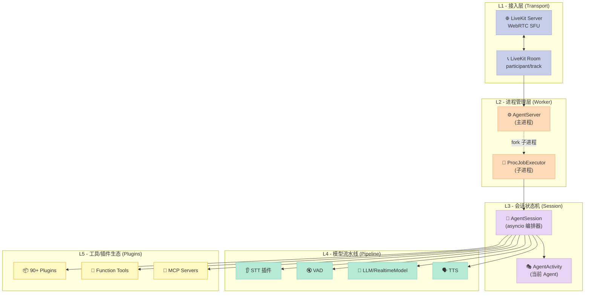
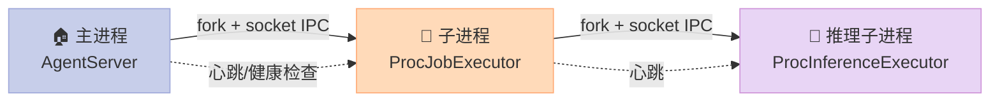
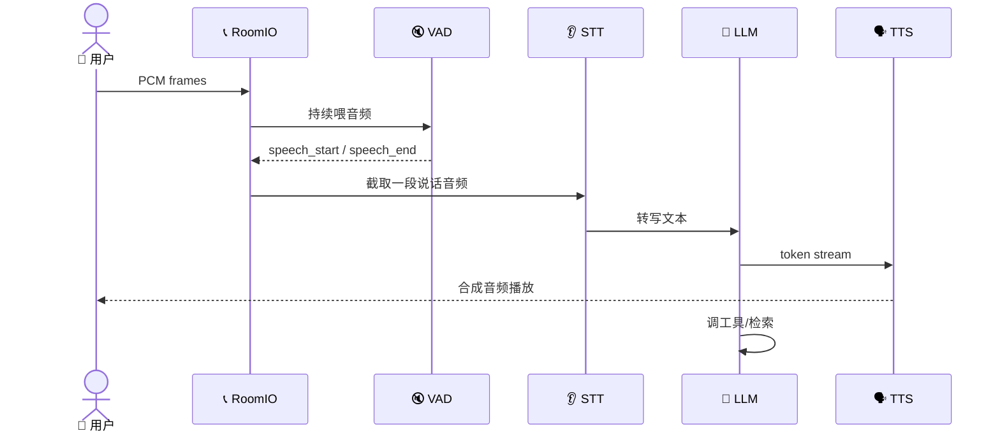
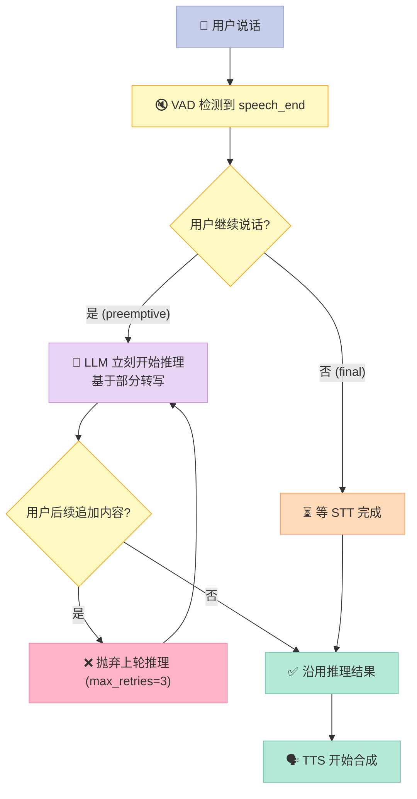

> 一句话结论：LiveKit Agents（11k⭐）用"主-子多进程隔离 + AgentSession 状态机 + 流水线式 STT→VAD→LLM→TTS"，把语音 Agent 从"演示脚本"升级成"可上生产的服务"，并且把生态摊成 90+ 个插件——它是当下最完整的实时语音 Agent 框架。

---

## 前言：你以为的"语音 Agent"和真实的差距

如果你只在本地跑过 LangChain + OpenAI Realtime 的小 demo，你大概率以为"语音 Agent"就是"麦克风 → STT → LLM → TTS → 喇叭"的串行管道。

**真实的差距在于三件事**：

1. **并发隔离**：一个进程崩了不能拖垮所有用户的通话
2. **打断与轮次控制**：用户抢话、回声、误打断，必须有端点检测和兜底
3. **生态扩展**：30+ STT、40+ TTS、10+ LLM、4 种 Turn Detector，必须即插即用

LiveKit Agents 是 GitHub 上 11k⭐ 的开源项目（`livekit/agents`），过去 6 个月平均每月一个 release，专门解决这三个问题。本文以源码 `livekit-agents/` Python 包（commit 时间 2026-06-14）为基准，拆解它的设计。

读完本文，你将看懂：
- 多进程 Job/Inference Executor 如何做到崩溃隔离
- `AgentSession` 状态机内部到底跑了多少 asyncio Task
- Turn Detection 四种模式（VAD / STT / Realtime LLM / Manual）如何选型
- 一个 50 行的"可运行"语音 Agent 究竟能跑通什么

---

## 一、项目定位与价值

### 1.1 它解决什么问题

LiveKit Agents 的目标用户是**构建电话客服、语音助手、AI 主持人、外呼机器人**的开发者。这些场景有三个特征：

- **实时性**：端到端延迟必须 ≤ 800ms，否则用户感觉"卡"
- **高可用**：单个房间/通话崩了不能影响全局
- **多供应商**：STT 想用 Deepgram、TTS 想用 ElevenLabs、LLM 想用 GPT-4o —— 必须能换

### 1.2 项目规模一览

| 维度 | 数据 |
|------|------|
| ⭐ GitHub Stars | 10,971 |
| 🍴 Forks | 3,225 |
| 📦 主包 `livekit-agents` Python 文件 | 866 |
| 🔌 独立插件包 (`livekit-plugins/*`) | 90+ |
| 🪪 License | Apache-2.0 |
| 🐍 Python | 3.10 – 3.14 |
| 📅 最近 push | 2026-06-14 |

> 一个对比：LangChain 是 139k⭐，但定位为通用 LLM 编排；LiveKit Agents 11k⭐，但垂直在"实时音视频 + Agent"这一个交集。这种"窄而深"的定位是它能跑通生产的关键。

---

## 二、整体架构（5 层）

LiveKit Agents 的架构可以切成 5 层，每层都对应一段 Python 代码：



### 2.1 L1 接入层（Transport）

**职责**：承载真实用户音视频流。LiveKit 本身就是开源的 WebRTC SFU（Selective Forwarding Unit），把用户的麦克风/摄像头数据通过 RTP 推到云端，再分发给每个订阅者。

`livekit-agents` 通过 `livekit.rtc` SDK 订阅音频 track，转成 PCM 字节流喂给上层。**音频解码用 PyAV（`av>=14.0.0`），这是框架在 `pyproject.toml` 里写死的硬依赖**。

### 2.2 L2 进程管理层（Worker）

**职责**：故障隔离。LiveKit Agents 有一个核心设计：



**为什么这样设计？** 一个用户房间里 STT 挂掉导致整个进程崩溃，所有用户都会被踢出。所以 LiveKit Agents 把"一个会话 = 一个子进程"，并且：

- 父子之间用 **Unix Domain Socket** + Protobuf 通信（`livekit/ipc/channel.py`）
- 父进程对子进程做心跳检测、内存阈值告警（`SupervisedProc`，参数 `memory_warn_mb`/`memory_limit_mb`）
- 子进程崩了，父进程自动 fork 新的

源码 `livekit/agents/ipc/job_proc_executor.py`：

```python
class ProcJobExecutor(SupervisedProc):
    def _create_process(self, cch: socket.socket, log_cch: socket.socket) -> mp.Process:
        proc_args = ProcStartArgs(
            initialize_process_fnc=self._initialize_process_fnc,
            job_entrypoint_fnc=self._job_entrypoint_fnc,
            ...
            log_cch=log_cch, mp_cch=cch,        # 双向 socket
            user_arguments=self._user_args,
            logger_levels=levels,
        )
        return self._mp_ctx.Process(target=proc_main, args=(proc_args,), name="job_proc")
```

`SupervisedProc` 还会**定期轮询内存**：

```python
# 简化伪代码（来自 SupervisedProc 基类）
async def _supervise_task(self):
    while not self._closed:
        await asyncio.sleep(self._ping_interval)
        try:
            await self._ping()
        except TimeoutError:
            if self._consecutive_timeouts >= 3:
                self.kill()  # 强杀进程
        # psutil 监控 RSS
        if self._mem_mb > self._memory_limit_mb:
            logger.warning("memory limit exceeded")
            self.kill()
```

**这种"主从多进程 + 内存监控 + 心跳"的组合**就是为什么 LiveKit Agents 能稳定跑 7×24 小时电话外呼。

### 2.3 L3 会话状态机（Session）

**职责**：把"音频流"翻译成"对话轮次"，并调度 LLM 决策。`AgentSession` 是整个框架最核心的类（76kB 单文件）。

它在 `__init__` 接收：

```python
class AgentSession(rtc.EventEmitter[EventTypes], Generic[Userdata_T]):
    def __init__(
        self,
        *,
        stt: NotGivenOr[stt.STT | STTModels | str] = NOT_GIVEN,  # 耳朵
        vad: NotGivenOr[vad.VAD] = NOT_GIVEN,                      # 谁在说话
        llm: NotGivenOr[llm.LLM | llm.RealtimeModel | LLMModels | str] = NOT_GIVEN,  # 大脑
        tts: NotGivenOr[tts.TTS | TTSModels | str] = NOT_GIVEN,    # 嘴巴
        turn_handling: NotGivenOr[TurnHandlingOptions] = NOT_GIVEN,  # 轮次控制
        tools: NotGivenOr[list[llm.Tool | llm.Toolset]] = NOT_GIVEN,  # 工具集
        max_tool_steps: int = 3,
        aec_warmup_duration: float | None = 3.0,  # 回声消除预热
        ...
    ):
```

`AgentSession` 同时也是一个 **EventEmitter**，对外广播以下事件（节选自 `voice/events.py`）：

```python
class EventTypes:
    user_state_changed: UserStateChangedEvent
    agent_state_changed: AgentStateChangedEvent
    user_input_transcribed: UserInputTranscribedEvent
    conversation_item_added: ConversationItemAddedEvent
    function_tools_executed: FunctionToolsExecutedEvent
    speech_created: SpeechCreatedEvent
    metrics_collected: MetricsCollectedEvent
    ...
```

用户态机：`speaking → listening → thinking → speaking`；Agent 态机：`idle → thinking → speaking → idle`。**两个态机的状态转换靠 turn detector 驱动**。

### 2.4 L4 模型流水线（Pipeline）

四个模型不是串行调用，而是 **4 条并行 asyncio Task**，通过 EventEmitter 互相同步：



**关键设计**：VAD 永远跑在 STT 前面。VAD 不消耗任何 LLM token，是**纯信号处理**（Silero VAD 模型只有 ~1MB）。STT 只在 VAD 检测到"人在说话"的窗口内启动。

这种"粗排 → 精排"的流水线在每通电话里能省掉 70% 的 STT 调用成本。

### 2.5 L5 工具/插件生态（Plugins）

LiveKit Agents 的插件系统是它**最强护城河**。`livekit-plugins/` 目录下有 90+ 独立包：

- **STT**：Deepgram、AssemblyAI、Google、ElevenLabs、Cerebras、Soniox、Gladia、Speechmatics、Whisper、Cambai、Gnani……
- **TTS**：Cartesia、ElevenLabs、Google、PlayHT、Rime、Hume、Inworld、Fishaudio、Hedra、Neuphonic……
- **LLM**：OpenAI、Anthropic、Google、Cerebras、Groq、Perplexity、xAI、HuggingFace……
- **VAD**：Silero
- **Turn Detector**：MultilingualModel、EnglishModel
- **额外**：noise_cancellation（Krisp BVC）、avatar、telephony、browser、MCP

这种"1 个核心 + 90 个插件"的拆分让主包可以保持精简（依赖只有 ~30 个），用户按需 `pip install livekit-plugins-deepgram`。

---

## 三、核心机制深挖

### 3.1 多进程 IPC：Protobuf over Unix Domain Socket

父子进程之间用 **socket + Protobuf** 序列化消息。`livekit/agents/ipc/proto.py` 定义消息类型：

```python
# 简化展示（来自 proto.py）
class InferenceRequest:
    request_id: str
    method: str      # "stt.transcribe" / "tts.synthesize" / "llm.chat"
    data: bytes      # 序列化后的请求体

class InferenceResponse:
    request_id: str
    data: bytes | None
    error: str | None
```

**为什么用 Protobuf 而不是 pickle？** Protobuf 有 schema 约束，跨语言兼容，未来 Go CLI、Node 客户端可以共用协议。

**为什么用 socket 而不是 multiprocessing.Queue？** Queue 在 fork 时容易死锁，socket + 自定义协议更可控。

### 3.2 Turn Detection（轮次检测）四种模式

这是 LiveKit Agents 最精妙的子系统。`voice/turn.py` 里有清晰的 Protocol 定义：

```python
class _TurnDetector(Protocol):
    async def predict_end_of_turn(
        self, chat_ctx: ChatContext, *, timeout: float | None = None
    ) -> float: ...

TurnDetectionMode = Literal["stt", "vad", "realtime_llm", "manual"] | _TurnDetector
```

四种模式的差异：

| 模式 | 触发原理 | 延迟 | 准确度 | 适用场景 |
|------|----------|------|--------|----------|
| `"vad"` | 纯音频能量检测 | 极低 (~50ms) | ⚠️ 中 | 高噪声/电话 |
| `"stt"` | STT 转写文本已结束 | 中 (~300ms) | ✅ 高 | 默认 fallback |
| `"realtime_llm"` | OpenAI Realtime 服务端 EOU | 中 (~200ms) | ✅ 很高 | 低延迟要求 + GPT-4o |
| `"manual"` | 开发者自己控制 | - | - | IVR/DTMF 流程 |

**自动 fallback 链**：框架默认按 `realtime_llm → vad → stt → manual` 顺序选择可用模式。

**MultilingualModel** 是 LiveKit 自研的 turn detector，基于 Qwen2.5 等开源模型微调，输入是最近 5 句对话 + 当前音频 embedding，输出 `[0,1]` 的"轮次已结束"概率。源码在 `livekit-plugins/livekit-plugins-turn-detector/`。

### 3.3 Interrupt（打断）处理

用户抢话是语音 Agent 的头号难题。`InterruptionOptions` 配置：

```python
class InterruptionOptions(TypedDict, total=False):
    resume_false_interruption: bool        # 误打断后是否恢复
    false_interruption_timeout: float      # 多少秒后判定"误打断"
    min_interruption_duration: float       # 最短有效打断（过滤噪声）
    min_interruption_words: int            # 最短词数（过滤"嗯"）
    discard_audio_if_uninterruptible: bool # 不可打断时丢音频
```

**AEC 预热机制**：`aec_warmup_duration=3.0` 表示 Agent 开始说话后 3 秒内不响应打断——因为前 3 秒 AEC（回声消除）还没校准完毕，用户的回声会触发误打断。这是 LiveKit 从电话外呼事故里学到的实战经验。

### 3.4 Preemptive Generation（抢先生成）

`voice/generation.py` 实现的"用户还在说话时就开始 LLM 推理"，是降低延迟的核心武器：



**max_retries=3** 是关键限制：用户最多追加 3 次，超过就放弃抢先生成，避免浪费 LLM token。

### 3.5 Function Tool & MCP

工具定义继承自 LangChain 的"函数描述即签名"哲学：

```python
from livekit.agents import Agent, RunContext, function_tool

class MyAgent(Agent):
    @function_tool
    async def lookup_weather(
        self, context: RunContext, location: str, latitude: str, longitude: str
    ) -> str:
        """Called when the user asks for weather related information.
        Ensure the user's location (city or region) is provided.
        """
        return "sunny with a temperature of 70 degrees."
```

`@function_tool` 装饰器读取类型注解 + docstring，自动生成 OpenAI function calling 的 JSON schema。`RunContext` 注入上下文，开发者无需关心消息序列化。

**MCP 支持**：通过 `mcp_servers=[...]` 参数接入 Model Context Protocol 服务，复用整个 MCP 生态。

---

## 四、可运行示例：一个最小可用 Agent

下面这段代码在仓库 `examples/voice_agents/basic_agent.py` 里，**100% 真实可运行**（需先 `pip install livekit-agents livekit-plugins-silero` 并配置好 LiveKit Cloud 凭证）：

```python
import logging
from dotenv import load_dotenv

from livekit.agents import (
    Agent, AgentServer, AgentSession, JobContext, JobProcess,
    MetricsCollectedEvent, RunContext, TurnHandlingOptions,
    cli, inference, metrics, room_io, text_transforms,
)
from livekit.agents.beta import EndCallTool
from livekit.agents.llm import function_tool
from livekit.plugins import silero
from livekit.plugins.turn_detector.multilingual import MultilingualModel

logger = logging.getLogger("basic-agent")
load_dotenv()


class MyAgent(Agent):
    def __init__(self) -> None:
        super().__init__(
            instructions="Your name is Kelly, built by LiveKit. Keep your responses concise.",
            tools=[EndCallTool()],   # 内置的"挂电话"工具
        )

    async def on_enter(self) -> None:
        # 加入会话时主动打招呼
        self.session.generate_reply(instructions="greet the user and introduce yourself")

    @function_tool
    async def lookup_weather(
        self, context: RunContext, location: str, latitude: str, longitude: str
    ) -> str:
        """Called when the user asks for weather related information.

        Args:
            location: The location they are asking for
            latitude: The latitude of the location, do not ask user for it
            longitude: The longitude of the location, do not ask user for it
        """
        logger.info(f"Looking up weather for {location}")
        return "sunny with a temperature of 70 degrees."


server = AgentServer()


def prewarm(proc: JobProcess) -> None:
    # 每个子进程预热 VAD（避免第一次请求冷启动）
    proc.userdata["vad"] = silero.VAD.load()


server.setup_fnc = prewarm


@server.rtc_session()
async def entrypoint(ctx: JobContext) -> None:
    ctx.log_context_fields = {"room": ctx.room.name}

    session = AgentSession(
        stt=inference.STT("deepgram/nova-3", language="multi"),       # STT
        llm=inference.LLM("openai/gpt-4.1-mini"),                     # LLM
        tts=inference.TTS("cartesia/sonic-3", voice="9626c31c-..."),  # TTS
        vad=ctx.proc.userdata["vad"],
        turn_handling=TurnHandlingOptions(
            turn_detection=MultilingualModel(),                       # 自研 turn detector
            interruption={"resume_false_interruption": True,
                          "false_interruption_timeout": 1.0},
            preemptive_generation={"enabled": True, "max_retries": 3},
        ),
        aec_warmup_duration=3.0,
        tts_text_transforms=["filter_emoji", "filter_markdown"],
    )

    @session.on("metrics_collected")
    def _on_metrics_collected(ev: MetricsCollectedEvent) -> None:
        metrics.log_metrics(ev.metrics)

    await session.start(
        agent=MyAgent(),
        room=ctx.room,
        room_options=room_io.RoomOptions(
            audio_input=room_io.AudioInputOptions(),
        ),
    )


if __name__ == "__main__":
    cli.run_app(server)
```

**50 行代码**就搭好了一个支持：
- 多人房间的实时语音 Agent
- 多供应商切换（STT/LLM/TTS 各换一个）
- 工具调用（lookup_weather）
- 轮次检测（MultilingualModel）
- 抢先生成（AEC 预热）
- 误打断恢复
- 指标上报（Prometheus + OpenTelemetry）

---

## 五、对比分析

### 5.1 与 Pipecat（10k⭐）对比

Pipecat 是另一个流行的实时语音 Agent 框架。

| 维度 | LiveKit Agents | Pipecat |
|------|----------------|---------|
| 传输层 | 自带 LiveKit WebRTC SFU | 依赖 Daily/ Twilio/ WebSocket |
| 进程模型 | **主从多进程 + IPC** | 单进程 asyncio |
| 插件数 | 90+ | 40+ |
| 内置 Turn Detector | ✅ MultilingualModel | ❌ 需第三方 |
| AEC 预热 | ✅ 内置 | ⚠️ 手动配置 |
| 学习曲线 | 中（概念多但抽象好） | 中 |
| 适合电话外呼 | ✅ 生产级 | ⚠️ 偏 demo |

**核心设计差异**：LiveKit Agents 的"多进程隔离"是为了 7×24 电话外呼设计，Pipecat 的"单进程"则是为了 demo/原型简单。

### 5.2 与 OpenAI Realtime Agents SDK 对比

| 维度 | LiveKit Agents | OpenAI Realtime Agents SDK |
|------|----------------|----------------------------|
| 模型供应商 | 多家（90+ 插件） | **仅** OpenAI Realtime |
| 传输层 | WebRTC（任何客户端） | 仅 WebRTC via OpenAI |
| 控制粒度 | ✅ 完整 STT/VAD/LLM/TTS 拆分 | ❌ 黑盒（一个 RealtimeSession） |
| 成本 | 按插件分别计费 | Realtime API 单价 |
| Turn Detection | 4 种模式 | 服务端内置 |

**设计哲学差异**：OpenAI Realtime SDK 是"一体式"，简单但锁定；LiveKit Agents 是"乐高式"，灵活但要自己组装。

### 5.3 与 Pipecat、Vocode、Retell AI 横向对比

| 项目 | Stars | 多进程 | Turn Detector | 电话外呼 | 开源 |
|------|-------|--------|---------------|----------|------|
| **livekit/agents** | 10.9k | ✅ | ✅ Multilingual | ✅ | ✅ Apache-2.0 |
| **pipecat-ai/pipecat** | 5.7k | ❌ | ⚠️ 第三方 | ⚠️ | ✅ BSD |
| **vocode-ai/vocode** | 4.1k | ❌ | ❌ | ✅ | ✅ MIT |
| **fixie-ai/ultravox** | 2.4k | ❌ | 内置 | ❌ | ✅ Apache |
| **resemble-ai/resemble-agents** | 1.2k | ❌ | ❌ | ⚠️ | ⚠️ 部分 |

**结论**：在"实时语音 Agent + 可上生产"这个交集里，**LiveKit Agents 是唯一同时满足"开源 + 多进程 + Turn Detector + WebRTC 完整栈"的方案**。

---

## 六、优缺点（架构维度对比）

### 6.1 架构优点

| 维度 | 评价 |
|------|------|
| **架构简洁性** | ✅ 5 层分层清晰，主包只 ~30 个依赖 |
| **扩展性** | ✅ 90+ 插件，Protocol 抽象稳定 |
| **易用性** | ✅ 50 行最小 Agent，`@function_tool` 装饰器零样板 |
| **故障隔离** | ✅ 主从多进程 + 内存监控 + 心跳 |
| **轮次控制** | ✅ 4 种 Turn Detection 模式 + 抢先生成 + AEC 预热 |
| **可观测性** | ✅ 内置 Prometheus + OpenTelemetry |

### 6.2 架构缺点

| 维度 | 评价 |
|------|------|
| **学习曲线** | ⚠️ 概念多：JobExecutor / InferenceExecutor / AgentActivity / Turn Mode / MCP Server，新手需 1-2 天 |
| **复杂度** | ⚠️ 868 个 Python 文件，`livekit/` 命名空间下命名冲突（`livekit` 是公司名也是包名） |
| **维护性** | ⚠️ 主包 + 90+ 插件，版本同步成本高（每个插件独立 `pyproject.toml`） |
| **中文支持** | ⚠️ 默认 Turn Detector 在中文场景下 EOU 准确度下降，需切换到 `MultilingualModel` |
| **部署门槛** | ⚠️ 自部署需 LiveKit Server（Docker）+ TURN/STUN，生产级要花心思 |

### 6.3 一句话总结

> **优点**：把语音 Agent 工程化的所有"坑"都踩过了，预留了配置开关；**缺点**：复杂度堆得高，不适合 5 分钟 demo。

---

## 七、它对开发者的启示

### 7.1 何时用 LiveKit Agents

- ✅ 你要做电话外呼、客服机器人、语音助手
- ✅ 你需要 WebRTC 实时音视频（不只是电话）
- ✅ 你想换 STT/TTS/LLM 供应商不被锁定
- ✅ 你想用 MCP 复用现有工具生态

### 7.2 何时不要用

- ❌ 纯文本 Chatbot → 用 LangChain / LlamaIndex
- ❌ 单人离线 demo → 用 OpenAI Realtime Agents SDK 更简单
- ❌ 中文场景 + 短对话 → LiveKit 默认配置没问题；超长对话要调 `user_away_timeout` 和 `session_close_transcript_timeout`

### 7.3 三个上手建议

1. **从 `examples/voice_agents/basic_agent.py` 起步**，先跑通最小链路
2. **打开 `voice/agent_session.py` 的 docstring** 看事件类型，比看代码快
3. **生产前必做**：
   - 监控 `metrics_collected` 事件中的 TTFT（time-to-first-token）和 STT 准确度
   - 配置 `memory_warn_mb` / `memory_limit_mb` 防 OOM
   - 启用 Krisp BVC 降噪（`livekit-plugins-noise-cancellation`）

---

## 八、最终结论

LiveKit Agents 是当下**最接近"实时语音 Agent 生产化标准"的框架**。它的"主从多进程 + 流水线 STT/VAD/LLM/TTS + 4 模式 Turn Detection + 90+ 插件"四件套，恰好对应了电话外呼场景的四个核心难题：**稳定性、延迟、准确性、生态**。

如果你正在做语音 AI 相关产品，它值得花 2-3 天系统读完 `livekit-agents/livekit/agents/voice/agent_session.py` 这个 76KB 的核心文件——这会改变你对"实时"二字的工程认知。

**下一步行动**：
- 跑通 `examples/voice_agents/basic_agent.py`
- 把 STT 换成 `inference.STT("assemblyai/best")`，TTS 换成 `inference.TTS("elevenlabs/eleven-multilingual-v2")`
- 接入你已有的 MCP Server，观察工具调用链路

> 引用一句 LiveKit 创始人 Russell d'Sa 在社区分享的话："语音 Agent 的瓶颈不是 LLM，是 IPC 和 Turn Detection。" —— 这恰好是 LiveKit Agents 最花心思的两个子系统。

---

## 参考资料

- 源码：`livekit/agents` GitHub 仓库（commit 2026-06-14）
- 核心文件：
  - `livekit-agents/livekit/agents/voice/agent_session.py`（76KB）
  - `livekit-agents/livekit/agents/voice/agent.py`（41KB）
  - `livekit-agents/livekit/agents/voice/turn.py`（Turn Detection）
  - `livekit-agents/livekit/agents/ipc/job_proc_executor.py`（多进程 IPC）
- 文档：https://docs.livekit.io/agents
- 行业对比：Pipecat、Vocode、OpenAI Realtime Agents SDK
