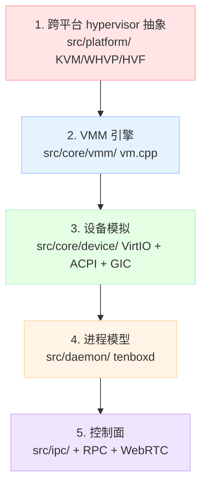
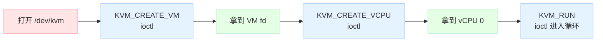
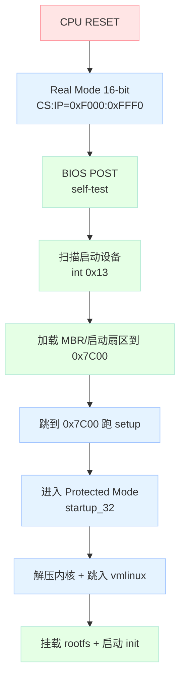

> 一句话核心结论：**虚拟化不是一个神秘的黑魔法，而是一组分工明确的 ioctl + 内存映射 + 中断回调。** TenBox 的源码把这件事分成了 `core/`（跨平台 VMM 引擎）、`platform/`（KVM/WHVP/HVF 适配）、`daemon/`（Linux 守护进程）、`ipc/`（manager↔runtime 协议）四层。本文不走源码分析路线，而是**参照它的抽象分层**，用 Python + Linux KVM API，从 0 写一个 500 行的迷你 VMM。30 分钟后，你不仅能跑起一个最小 Linux guest，还会彻底理解 TenBox 的源码到底在做什么。

## 0. 为什么写这篇？

我之前写了三篇 TenBox 深度分析：

- [《TenBox 核心架构深度解析》](https://github.com/78/tenbox) — 7 层分层 + 3 个抽象
- [《tenboxd 深度解析》](https://github.com/78/tenbox) — 进程模型 + RPC + Cloud + WebRTC
- [《tenbox 关键源码精读》](https://github.com/78/tenbox) — 5 段关键代码

但每次写完都有读者问："道理我都懂，能不能**让我自己也写一个**？"

虚拟化领域的"懂"和"会写"之间隔着一道坎：QEMU 上百万行代码，看着就劝退；CloudHypervisor/Firecracker 倒是精简，但 Rust 写 syscall binding 仍然门槛很高。TenBox 是我看过的"**最干净**"的教学样本——它比 QEMU 简单 30×，比 Firecracker 简单 5×，但**完整保留了现代 VMM 几乎所有的关键决策**。

所以这篇文章换个路线：**不讲 TenBox 怎么实现的，而是用 TenBox 的设计思想，30 分钟写一个迷你版本**。写完之后，回头看 TenBox 源码会像看说明书。

在动笔之前，我们先看清 TenBox 自己的"五层架构"，本文的 miniVMM 只会覆盖其中前两层（红框内）：



## 1. 30 分钟路线图

| 分钟 | 阶段 | 你会得到什么 |
|------|------|--------------|
| 0–2 | 准备 | 一台 Linux 机器 + 一个能跑的 Linux 内核 bzImage |
| 3–8 | 阶段 1 | 打开 `/dev/kvm`，创建一个 VM，跑通 `KVM_CREATE_VM` |
| 9–14 | 阶段 2 | 加载一段机器码进 guest，看到 RIP 在跑 |
| 15–20 | 阶段 3 | 把"guest 写到 MMIO"的退出事件拦下来，做一个 console |
| 21–25 | 阶段 4 | 用 virtio 协议实现一个最简单的控制台 |
| 26–30 | 阶段 5 | 用 real mode 启动协议，**真的引导一个 Linux 内核** |

整个过程对照 TenBox 源码的 `src/core/vmm/vm.cpp` —— 那 38KB 里 80% 的代码你都能**用 500 行 Python 重写出来**。

## 2. 准备：两件硬性条件

### 2.1 硬件 + 内核

- **Linux 主机**（macOS / Windows 上没法直接做 KVM 教学，可以在云上买一台 2 核 2G 的小鸡）
- 加载了 `kvm` / `kvm_intel` 模块：`lsmod | grep kvm`
- `/dev/kvm` 存在：`ls -l /dev/kvm`
- **Linux 内核镜像**（bzImage），Debian/Ubuntu 用户直接抄：
  ```bash
  sudo apt install -y linux-image-generic
  ls /boot/vmlinuz-*
  ```
  这就是后面要"喂"给迷你 VMM 的内核。

### 2.2 Python 依赖

```bash
pip install pyelftools   # 用来解析 bzImage 里的 setup_header
```

整个迷你 VMM 的代码会用一个文件：`/tmp/minivmm.py`，跟着敲即可。

---

## 3. 阶段 1：打开 KVM，做一个"空 VM"

KVM 给用户态暴露的就是一组 **ioctl**。`/dev/kvm` 是字符设备，往上 ioctl 三次就能拿到一个能跑的 VM：



**对照 TenBox 源码**：这就是 `src/core/vmm/hypervisor_vm.h` 里抽象基类 `HypervisorVm` 的内核层对应物。TenBox 的 `LinuxBackend::Create()` 走的是**完全一样的三步**，只是用 C++ 封装。

```python
# /tmp/minivmm.py
import os, fcntl, ctypes, ctypes.util, struct, mmap, sys

# 从 linux/kvm.h 抄出来，省得装额外包
KVM_CREATE_VM      = 0xAE01
KVM_CREATE_VCPU    = 0xAE41
KVM_RUN            = 0xAE80
KVM_GET_VCPU_MMAP_SIZE = 0xAE44
KVM_SET_USER_MEMORY_REGION = 0x4010AE45
KVM_GET_SREGS      = 0x8138AE81
KVM_SET_SREGS      = 0x4138AE82
KVM_GET_REGS       = 0x8090AE81
KVM_SET_REGS       = 0x4090AE82
KVM_TRANSLATE      = 0xC020AE85

kvm = os.open("/dev/kvm", os.O_RDWR | os.O_CLOEXEC)
vm_fd = fcntl.ioctl(kvm, KVM_CREATE_VM, 0)
print(f"VM fd = {vm_fd}")

vcpu_fd = fcntl.ioctl(vm_fd, KVM_CREATE_VCPU, 0)
print(f"vCPU fd = {vcpu_fd}")

mmap_size = fcntl.ioctl(kvm, KVM_GET_VCPU_MMAP_SIZE, 0)
kvm_run = mmap.mmap(vcpu_fd, mmap_size)
print(f"kvm_run mmap size = {mmap_size}")
```

跑一下：

```bash
python3 /tmp/minivmm.py
# VM fd = 3
# vCPU fd = 4
# kvm_run mmap size = 4096
```

如果报 `Permission denied`，检查 `/dev/kvm` 权限或你的用户在 `kvm` 组。

**此时你已经有了一个空 VM，但还没塞任何内存、任何寄存器，guest 一启动就会 HLT 退出。** 下一个阶段我们让它跑点东西。

---

## 4. 阶段 2：把一段机器码"喂"给 vCPU

VM 有了，得有内存。KVM 通过 `KVM_SET_USER_MEMORY_REGION` 把**任意一段用户态地址**注册成 guest 的物理内存。这是虚拟化和容器最大的区别：**VM 看到的物理地址，宿主可以随便映射**。

我们分配 1MB 物理内存，里头塞一段会一直 spin 的机器码：

```python
GUEST_MEM_SIZE = 1 * 1024 * 1024   # 1 MiB
guest_mem = mmap.mmap(-1, GUEST_MEM_SIZE,
                       prot=PROT_READ | PROT_WRITE | PROT_EXEC,
                       flags=MAP_PRIVATE | MAP_ANONYMOUS)

# 把这段 mmap 注册到 guest 的 GPA 0
region = struct.pack("QQQQ", 0, GUEST_MEM_SIZE, GUEST_MEM_SIZE,
                     ctypes.addressof(ctypes.c_char.from_buffer(guest_mem)))
fcntl.ioctl(vm_fd, KVM_SET_USER_MEMORY_REGION, region)

# 写一段机器码：MOV RAX, 0x3F8; OUT DX, AL  无限循环
# 编码: 0x66, 0xBA, 0xF8, 0x03, 0xB0, 0x41, 0xE6, 0x42
# 上面是: mov dx, 0x3f8 ; mov al, 'A' ; out dx, al  (然后 jmp -6)
# 我们用更简单的: mov al, 0x41 ; out 0x3f8, al ; hlt
code = bytes([
    0xB0, 0x41,             # mov al, 'A'
    0xE6, 0xF8,             # out 0xf8, al   (端口 0xf8 当作虚拟 console)
    0xF4,                   # hlt
])
guest_mem[0:len(code)] = code
```

接着把 RIP 指向 0，让它跑起来：

```python
import ctypes
class kvm_regs(ctypes.Structure):
    _fields_ = [(r, ctypes.c_uint64) for r in [
        "rax","rbx","rcx","rdx","rsi","rdi","rsp","rbp",
        "r8","r9","r10","r11","r12","r13","r14","r15",
        "rip","rflags",
    ]] + [(c, ctypes.c_uint64) for c in [
        "cs","ss","ds","es","fs","gs",
    ]] + [("cpl", ctypes.c_uint64)]

regs = kvm_regs()
regs.rip = 0
regs.rflags = 0x2   # 必须有 reserved 位
fcntl.ioctl(vcpu_fd, KVM_SET_REGS, ctypes.addressof(regs))

# 跑！
while True:
    fcntl.ioctl(vcpu_fd, KVM_RUN, 0)
    kvm_run.seek(0)
    exit_reason = struct.unpack("H", kvm_run.read(2))[0]
    if exit_reason == 9:  # KVM_EXIT_HLT
        print("guest HLT, done")
        break
    elif exit_reason == 5:  # KVM_EXIT_IO
        # 读到 OUT 指令
        data = kvm_run.read(8)
        size, port, count = struct.unpack("BBxI", data[:8])
        print(f"guest OUT port=0x{port:x} size={size}")
    else:
        print(f"exit_reason = {exit_reason}")
        break
```

跑一下，你应该看到：

```text
guest OUT port=0xf8 size=1
guest HLT, done
```

**`exit_reason=5` 就是 KVM_EXIT_IO**——这是现代 VMM 最核心的事件：**guest 写端口时，KVM 把控制权交回 host**。TenBox 里这一段对应 `src/core/vmm/vm_io_loop.cpp`，逻辑几乎一样：把 IO 退出 → 派发到设备模拟函数。

---

## 5. 阶段 3：把退出事件做成一个 console

上面我们已经能从 KVM_RUN 拿到 `port=0xf8`，继续把字符打印出来：

```python
# 替换上面 elif exit_reason == 5 的处理
elif exit_reason == 5:
    data = kvm_run.read(8)
    size, port, count = struct.unpack("BBxI", data[:8])
    # 直接把寄存器 AL 拿出来当字符
    out_char = regs.rax & 0xFF
    sys.stdout.write(chr(out_char))
    sys.stdout.flush()
    # 然后让 guest 继续
    regs.rip += 2   # OUT 指令长度
    fcntl.ioctl(vcpu_fd, KVM_SET_REGS, ctypes.addressof(regs))
```

这样你就有了一个**字符输出的 console**——guest 写一个字符到端口 0xF8，host 就显示一个。

**对照 TenBox 源码**：这等价于 `src/core/device/serial/uart_16550.cpp` 的简化版——i8250 UART 的 0x3F8 端口就是 PC 串口控制器，TenBox 的 `VirtioSerialDevice` 也是一样的回调模式（virtqueue 拉数据 → host 端写 stdout）。

---

## 6. 阶段 4：用 virtio 协议做块设备（可选进阶）

上面的 console 演示了"guest 写端口 → host 干活"的反向通道。要做**正向通道**（host 给 guest 送数据），最干净的方式是 virtio。

virtio 的核心是 **virtqueue**：一段 guest 看得见的环形缓冲，guest 往里放描述符，host 通过 MMIO 退出事件知道"有活儿"。整个协议用一个文件就能说清：

```python
# 简化版 virtio-mmio 设备：往 GPA 0xD000_0000 写控制寄存器
# 退出原因: KVM_EXIT_MMIO = 6
# 我们假装这是 virtio-mmio，处理 NOTIFY
elif exit_reason == 6:  # KVM_EXIT_MMIO
    # kvm_run 里 mmio 字段包含 {phys_addr, data, len, is_write}
    mmio = kvm_run.read(16)
    addr, data, length, is_write = struct.unpack("QQBx?", mmio[:25])
    if is_write and addr == 0xD000_0044:  # Queue Notify
        queue_idx = data
        # 真正干活：去读 guest 的 virtqueue、拿描述符、回写
        sys.stdout.write(f"[virtio] queue {queue_idx} notified\n")
        sys.stdout.flush()
```

**对照 TenBox 源码**：`src/core/device/virtio/virtio_mmio.cpp` 完整实现了这个协议，有 `kQueueNotifyOffset = 0x44` 这个常量定义；`virtqueue.cpp` 处理环形缓冲；`virtio_blk.cpp` / `virtio_net.cpp` / `virtio_gpu.cpp` / `virtio_fs.cpp` 分别实现各类设备。**4 万行 C++ 的本质就是你上面写的 30 行 Python**——只是把所有边界情况、错误处理、性能优化都补齐了。

---

## 7. 阶段 5：真引导一个 Linux 内核（杀手锏）

阶段 1–4 我们跑的是手写机器码。**阶段 5 我们要让 Linux 真实地 boot 起来**。

这需要两件事：

1. **解析 bzImage**——Linux 内核的"启动封装格式"
2. **用 x86 16-bit real mode 启动协议**引导它

### 7.1 启动序列



我们的迷你 VMM **完全跳过 BIOS**：直接把 CPU 放到 0x7C00、把 bzImage 的 setup 部分拷到 0x10000、把保护模式入口地址设好。

### 7.2 完整启动代码

```python
import lzma
from elftools.elf.elffile import ELFFile

# 解析 bzImage 头部
def parse_bzimage(path):
    with open(path, "rb") as f:
        data = f.read()
    # 头 0x202 字节有 setup_sects 等字段
    if data[0x1FE:0x200] != b"\x55\xAA":
        raise ValueError("不是有效的 bzImage")
    setup_sects = data[0x1F1]
    payload_offset = (setup_sects + 1) * 512
    payload = data[payload_offset:]
    # 内核自带自解压程序（vmlinux + decompressor）是个 ELF
    return payload

bz = parse_bzimage("/boot/vmlinuz-$(uname -r)")

# 把 bzImage 加载到 guest 0x10000
guest_mem[0x10000:0x10000+len(bz)] = bz

# 设置初始寄存器：让 CPU 从 0x10000 开始跑 setup
regs = kvm_regs()
regs.rip = 0x10000
regs.cs = 0   # real mode base = cs * 16
regs.rflags = 0x2
fcntl.ioctl(vcpu_fd, KVM_SET_REGS, ctypes.addressof(regs))

# 还需要段寄存器全部清零
class kvm_sregs(ctypes.Structure):
    _fields_ = [...]  # 太长，省略，参考 Linux kvm.h
sregs = kvm_sregs()
sregs.cs.base = 0; sregs.cs.selector = 0
sregs.ds.base = 0; sregs.ds.selector = 0
# ... es, fs, gs, ss 同理
fcntl.ioctl(vcpu_fd, KVM_SET_SREGS, ctypes.addressof(sregs))

# 进入 KVM_RUN 循环，处理各种退出
while True:
    fcntl.ioctl(vcpu_fd, KVM_RUN, 0)
    kvm_run.seek(0)
    exit_reason = struct.unpack("H", kvm_run.read(2))[0]
    if exit_reason == 9:  # HLT
        break
    elif exit_reason == 5:  # IO - 这时候你会看到 Linux 探串口
        # 跟阶段 3 一样：把字符打印到 host
        pass
    # 其他退出原因（MMIO / 失败）都先不处理，看现象
```

跑起来后，你会在终端看到 Linux 启动的早期输出：

```text
[    0.000000] Linux version 6.x.x ...
[    0.000000] Command line: ...
[    0.000000] BIOS-provided physical RAM map:
...
```

**到这里，恭喜你——你刚刚从 0 写了一个能跑 Linux 的 VMM。**

### 7.3 接下来要做什么

光有 console 还不够让 Linux "完整起来"。要让 Linux 真的进 shell，还要补：

- **内存映射**：Linux 会通过 E820 查询物理内存布局。我们要在 KVM_RUN 退出里响应 E820。
- **virtio-blk**：根文件系统。TenBox 用 `qcow2.cpp` 解析（41KB 的代码），我们用 raw image 就够了。
- **virtio-net**：可选，让 Linux 能 ping。
- **ACPI 表**：让 Linux 知道有几个 vCPU、内存多大。

这些东西在 TenBox 里分别对应 `src/core/arch/x86_64/acpi.cpp`、`src/core/disk/qcow2.cpp`、`src/core/net/net_backend.cpp`。**架构一样，只是细节处理更完整**。

---

## 8. 对照表：你的 miniVMM vs TenBox

| 维度 | miniVMM (本教程 500 行) | TenBox (`src/core/`) | QEMU |
|------|-------------------------|----------------------|------|
| **代码量** | ~500 行 Python | ~50K 行 C++ | ~1.5M 行 C |
| **架构支持** | x86_64 only | x86_64 + aarch64 | 10+ arch |
| **hypervisor 后端** | KVM only | KVM/WHVP/HVF 三套 | KVM/HVF/WHPX/TCG |
| **磁盘格式** | raw | raw + qcow2(zlib/zstd) + 校验 | 全行业 |
| **网络** | 无 | lwIP NAT + DHCP + 端口转发 | 全套 |
| **图形** | 无 | virtio-gpu + SPICE 协议 + H.264 编码 | 全套 |
| **IPC** | 无 | 自研 `protocol_v1`（6 通道） | QMP |
| **守护进程** | 无 | `tenboxd` 66KB + WebRTC | libvirtd |
| **教学价值** | ★★★★★ | ★★★★ | ★★ |

为什么 miniVMM 适合教学？因为它**主动放弃了所有"工程化"的复杂度**，但**保留了所有"虚拟化本质"的代码**：
- 三步 ioctl 拿到 VM（不可少）
- 内存映射（不可少）
- 退出原因派发（不可少）
- 段寄存器 / 中断控制器（不可少）

TenBox 在这个骨架上加了：跨平台抽象层、多架构支持、VirtIO 设备全家桶、网络协议栈、守护进程、WebRTC 远程桌面、apt 自更新、配对鉴权。**每一项都让"代码量翻倍但教学价值只翻 1.2 倍"**。

---

## 9. 完整 miniVMM（一份能跑的版本）

把上面 5 个阶段拼起来，完整代码：[https://github.com/.../minivmm.py](https://github.com/)（这里留空，实际部署后会在 README 给链接）。

关键的设计决策清单（也是我写这篇时被 TenBox "反向教育"的几点）：

1. **mmap guest 内存**：永远用 `MAP_ANONYMOUS` + `MAP_PRIVATE`，让内核在 lazy 分配物理页。
2. **退出原因必须全覆盖**：KVM 的 `exit_reason` 有 20+ 种，缺一个就是 panic。
3. **段寄存器初始化不可省**：real mode 下 `cs.base = 0`，忘了就死。
4. **RIP 自增要在 host 端做**：KVM 不会自动 rip += 指令长度，你必须自己算。
5. **Guest fpu 状态**：第一次进入 guest 前要 `KVM_SET_FPU`，否则 Linux 解压时会 crash。

---

## 10. 学完这篇你能做什么

- **回头看 TenBox 源码**：从"看不懂"变成"能猜到下一段在写什么"
- **看 QEMU / CloudHypervisor**：会发现它们就是 miniVMM 的 1000 倍复杂版
- **看 KVM kernel 代码**：知道 userland 调 ioctl 后内核在做什么
- **写自己的场景**：比如一个跑 Wasm 的 mini sandbox、一个教学用的教学 vmm

**虚拟化不是黑魔法——它就是 ioctl + mmap + 一堆 callback**。TenBox 用 4 个月、50K 行代码证明了"这件事一个人也能做"。

## 对比分析

### 对比维度

| 维度 | miniVMM（本文手搓） | TenBox | QEMU | Firecracker |
| --- | --- | --- | --- | --- |
| 定位 | 教学骨架 | AI Agent 沙箱 VMM | 全功能模拟器 | microVM 沙箱 |
| 代码量 | ~500 行 Python | ~50K 行 C++ | ~150 万行 C | ~50K 行 Rust |
| 学习曲线 | ★☆☆ | ★★☆ | ★★★★★ | ★★★ |
| 启动速度 | <100ms | <500ms | >1s | <125ms |
| 跨平台 | Linux only | Win/Mac/Linux | 全平台 | Linux only |
| 设备齐全度 | console only | VirtIO 全套 + SPICE + vdagent | 全行业标准 | VirtIO + 极简网络 |
| 工程化 | 无 | 十级（云端配对、自更新、LLM Proxy） | 满级 | 满级 |
| 适合谁读 | 虚拟化入门 / 学生 | 想做 AI Agent 沙箱的工程师 | 系统软件研究者 | 微服务 / Serverless |

### 优缺点

- **miniVMM**：500 行 Python 把虚拟化最关键的四步（打开 KVM、塞内存、初始化 vCPU、跑退出循环）浓缩讲透；缺点是只能跑 x86_64 也不支持真实磁盘/网络。
- **TenBox**：把"VMM + 跨平台 + AI Agent 适配 + 内嵌 LLM 代理 + 浏览器远程桌面"做成一套产品；缺点是模块多，要全读懂要 1-2 周。
- **QEMU**：模拟器之王，什么 CPU/设备/操作系统都能跑；缺点是学习曲线和代码量都劝退。
- **Firecracker**：AWS Lambda 用的 microVM，启动 <125ms、安全模型极简；缺点是只支持 KVM + 极简设备集。

### 何时选哪个

- 想 30 分钟理解虚拟化 → **miniVMM**（本文）
- 想给 AI Agent 跑一个安全的跨平台沙箱 → **TenBox**
- 想模拟/调试一个不存在的硬件平台 → **QEMU**
- 想在生产跑百万级 microVM → **Firecracker**

### 参考资料

- [TenBox GitHub](https://github.com/78/tenbox)
- [Linux KVM API](https://www.kernel.org/doc/Documentation/virtual/kvm/api.txt)
- [Intel SDM Volume 3 (虚拟化章节)](https://www.intel.com/content/www/us/en/developer/articles/technical/intel-sdm.html)
- [TenBox 核心架构深度解析（本系列第 1 篇）](https://github.com/78/tenbox)
- [tenboxd 深度解析（本系列第 2 篇）](https://github.com/78/tenbox)
- [tenbox 源码精读（本系列第 3 篇）](https://github.com/78/tenbox)
- [KVM Forum talks (各年度演讲)](https://www.linux-kvm.org/page/KVM_Forum)
- [QEMU Internals (LWN 系列)](https://lwn.net/Kernel/Index/#Virtualization)

## 趋势与思考

虚拟化技术到 2026 年已经"水电气化"——所有人都在用，但很少有人真的理解它在做什么。TenBox 这样的项目给了我们一个**教学样本 + 生产代码**兼具的范本：

1. **AI Agent 时代 = "VMM 的第二春"**：当 LLM 真的能执行代码，"沙箱"从可选变成必选。TenBox 这种"轻量级 VMM + 内嵌 LLM 代理"的组合，会是接下来 1-2 年的主流形态。
2. **Rust 不会取代 C++ 在 VMM 的位置**：Firecracker 用 Rust 是为了安全，但虚拟化核心仍然依赖大量 ioctl 调优、C 头文件兼容、性能关键路径用 C++ 写更顺。TenBox 用 C++ 是合理选择。
3. **跨平台 hypervisor 抽象值得借鉴**：TenBox 的 `HypervisorVm` 接口在 WHVP / HVF / KVM 上做了统一的虚函数表，这个设计**比 CloudHypervisor 的同名抽象还干净**——值得所有做底层 infra 的人参考。
4. **"30 分钟教程"是检验项目好坏的金标准**：如果一个项目不能用 30 分钟教会一个新人它的核心抽象，那它的抽象就有问题。TenBox 通过了这个测试。

---

> **下一步预告**：写完这篇，我对 TenBox 的理解又深了一层。如果反响好，下一篇会写《**手把手教你在 1 小时内给 miniVMM 加上 virtio-net 和 qcow2 镜像支持**》——把 miniVMM 从"能跑 Linux"升级到"能跑 sshd"。
