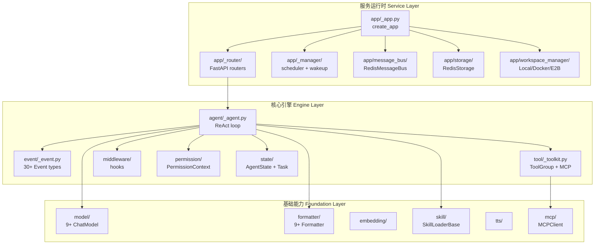
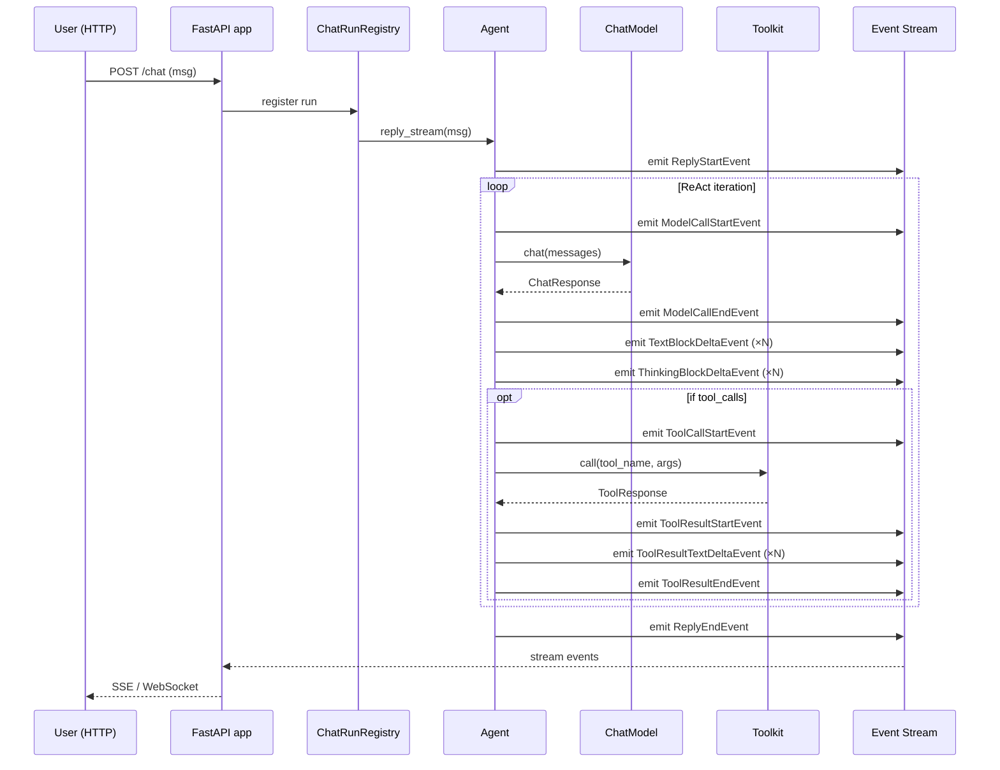

> **核心观点**：AgentScope 2.0 不是又一套「LangGraph 模仿者」，而是阿里在 2026 年 5 月重做的新一代 Agent 运行时——它把 ReAct 循环拆成**事件流**，把服务层做成了**生产可用的 FastAPI 多租户应用**，并把 MCP 客户端、权限系统、Workspace 沙箱、子代理模板这些"企业级零件"全部内置到框架本体。本文将拆解它的源码，给出可运行的真实代码示例，并对比 4 个同类项目讲清楚它"重做"在哪里。

---

## 一、引子：为什么需要又一套 Agent 框架？

2026 年的 Agent 框架已经非常拥挤——LangGraph、OpenAI Agents SDK、Autogen、CrewAI、Smolagents、Agno……每个都说自己是"生产级"。

但真正在生产环境跑过 LLM Agent 的人都知道三个痛点：

1. **ReAct 循环不透明**：模型调用、工具调用、思考块（thinking）混在一起，UI 想做"流式打字效果 + 工具执行状态条"几乎要重新发明一遍框架。
2. **多租户会话难**：把单进程 Agent 改造成支持"几千用户、上万会话"的服务，得自己加 session、消息总线、状态存储、限流、重连……LangGraph 0.x 不管这事。
3. **MCP 集成碎**：各家对 MCP 的支持参差不齐——stdio 走 subprocess、HTTP 走 SSE、stateless HTTP 走 streamable-http，每家都自己造一遍轮子。

**AgentScope 2.0**（2026-05 发布，作者是阿里达摩院的 Dawei Gao 等人，[arXiv 2508.16279](https://arxiv.org/abs/2508.16279)）就是冲着这三个痛点来的。它在前一代（1.x）的基础上做了**架构重写**：

| 维度 | AgentScope 1.x (2024) | AgentScope 2.0 (2026) |
|------|----------------------|----------------------|
| 核心抽象 | `Agent` + `Pipeline` 编排图 | `Agent` + 事件流（`Event`）+ ReAct 循环 |
| 多代理 | `msghub` + 串接函数 | `SubAgentTemplate` + 团队工具（TeamSay） |
| 多租户 | 自己做 | 内置 `create_app` + Redis Message Bus |
| MCP | 自己包 | 统一 `MCPClient`（stateful + stateless） |
| 工具 | 同步阻塞 | 异步流式 + 工具组（ToolGroup） |
| 沙箱 | 无 | `Workspace`（local / Docker / E2B） |
| 权限 | 无 | `PermissionContext`（多模式） |

下面我们就钻进源码，逐一拆解这些设计。

---

## 二、整体架构：事件流 + 服务运行时

### 2.1 三层架构

AgentScope 2.0 的代码组织（`src/agentscope/`）非常清晰，可以分成三层：



### 2.2 数据流：事件流贯穿始终

与传统框架"模型返回 → 解析 → 调用工具 → 再调模型"这种**黑盒循环**不同，AgentScope 2.0 把 ReAct 循环里**每一步都拆成事件**：



这套事件系统让前端能精细地"画"出 agent 思考过程——文本块、思考块、工具调用块、工具结果块**都是独立事件**，可以分别路由到不同的 UI 组件。

### 2.3 一段最小可运行代码

下面是官方 README 的 Hello World，我把它精简成可执行版本：

```python
# hello_agentscope.py
# 运行：python hello_agentscope.py
# 需要：pip install agentscope && 设置 DASHSCOPE_API_KEY
import asyncio
import os
from agentscope.agent import Agent
from agentscope.tool import Toolkit, Bash, Grep, Glob, Read, Write, Edit
from agentscope.credential import DashScopeCredential
from agentscope.model import DashScopeChatModel
from agentscope.message import UserMsg
from agentscope.event import EventType


async def main() -> None:
    agent = Agent(
        name="Friday",
        system_prompt="You're a helpful assistant named Friday.",
        model=DashScopeChatModel(
            credential=DashScopeCredential(
                api_key=os.environ["DASHSCOPE_API_KEY"],
            ),
            model="qwen3-max",
        ),
        toolkit=Toolkit(
            tools=[Bash(), Grep(), Glob(), Read(), Write(), Edit()],
        ),
    )

    async for evt in agent.reply_stream(UserMsg("Tony", "Hi, Friday!")):
        match evt.type:
            case EventType.REPLY_START:
                print("\n[agent start]")
            case EventType.TEXT_BLOCK_DELTA:
                # 流式打印文本块
                print(evt.content.delta, end="", flush=True)
            case EventType.THINKING_BLOCK_DELTA:
                # 思考块单独显示（灰色 / 折叠区）
                print(f"\033[90m[think] {evt.content.delta}\033[0m",
                      end="", flush=True)
            case EventType.TOOL_CALL_START:
                print(f"\n[tool] {evt.content.name}(")
            case EventType.TOOL_RESULT_END:
                print(f" -> {evt.content[:80]}...")
            case EventType.REPLY_END:
                print("\n[agent end]")


asyncio.run(main())
```

输出会同时显示**模型正文**、**思考过程**、**工具调用与结果**三种流。传统 Agent 框架只能拿到"最终答案"，这是 AgentScope 2.0 最大的体感差异。

---

## 三、核心机制深度拆解

### 3.1 ReAct 循环：事件驱动的状态机

打开 `src/agentscope/agent/_agent.py`，核心 ReAct 循环被实现成一个**异步事件循环**。我把它简化为伪代码（保留真实字段名）：

```python
# 来自 src/agentscope/agent/_agent.py（简化版）
async def reply_stream(self, msg):
    self.memory.add(msg)
    await self._emit(ReplyStartEvent())

    for iteration in range(self.max_iters):
        # 1. 调模型
        await self._emit(ModelCallStartEvent(model=self.model_name))
        response: ChatResponse = await self.model(
            messages=self.memory.get_memory(),
            tools=self.toolkit.get_json_schemas(),
        )
        await self._emit(ModelCallEndEvent(usage=response.usage))

        # 2. 流式吐 thinking / text
        async for block in response.stream():
            if block.type == "thinking":
                await self._emit(ThinkingBlockDeltaEvent(delta=block.delta))
            elif block.type == "text":
                await self._emit(TextBlockDeltaEvent(delta=block.delta))

        # 3. 处理 tool_calls
        if response.tool_calls:
            # 3.1 权限校验（人审 / 自动）
            for call in response.tool_calls:
                if not await self.permission.allow(call):
                    await self._emit(RequireUserConfirmEvent(...))
                    # 等待用户确认...

            # 3.2 执行工具
            batch = _ToolCallBatch(response.tool_calls)
            await self._emit(ToolCallStartEvent(calls=batch))
            results = await self.toolkit.call(batch)
            await self._emit(ToolResultStartEvent(...))
            async for chunk in results.stream():
                await self._emit(ToolResultTextDeltaEvent(delta=chunk))
            await self._emit(ToolResultEndEvent(...))

            # 3.3 工具结果回写 memory
            self.memory.add_tool_results(results)
        else:
            # 无 tool_call，结束
            break

    await self._emit(ReplyEndEvent())
```

**关键设计点**：

- **Event 是个 BaseModel 子类**（用 Pydantic），`AsyncGenerator[EventBase, None]` 形式 yield 出去——上层订阅者可以自由过滤/路由。
- **权限检查内嵌在循环里**，不是外挂。
- **`Toolkit.call()` 返回异步流**——长输出（比如 `Read()` 读 100MB 日志）不会阻塞事件循环。

### 3.2 统一 MCP 客户端：stateful + stateless 二合一

AgentScope 2.0 的 `src/agentscope/mcp/_mcp_client.py` 做了一个少见的统一抽象——**同一个 `MCPClient` 既能跑 stdio 也能跑 HTTP，既能长连接也能短连接**：

```python
# src/agentscope/mcp/_mcp_client.py（关键片段）
class MCPClient(BaseModel):
    name: str
    is_stateful: bool
    mcp_config: Union[StdioMCPConfig, HttpMCPConfig]
    _client: Any = PrivateAttr()
    _session: Optional[ClientSession] = PrivateAttr()
    _stack: Optional[AsyncExitStack] = PrivateAttr()

    async def connect(self) -> None:
        if isinstance(self.mcp_config, StdioMCPConfig):
            self._client = stdio_client(StdioServerParameters(
                command=self.mcp_config.command,
                args=self.mcp_config.args,
            ))
        elif isinstance(self.mcp_config, HttpMCPConfig):
            if self.is_stateful:
                self._client = sse_client(self.mcp_config.url)
            else:
                self._client = streamable_http_client(self.mcp_config.url)
        self._stack = AsyncExitStack()
        await self._stack.enter_async_context(self._client)
        # 建立 session...

    async def list_tools(self) -> list[MCPTool]:
        if self.is_stateful:
            return await self._session.list_tools()
        # stateless: 每次新建临时 session
        async with self._client as (read, write, _):
            session = ClientSession(read, write)
            await session.initialize()
            return await session.list_tools()
```

**这个抽象解决了一个真问题**：MCP 协议有三种 transport（stdio、HTTP+SSE、HTTP+streamable），绝大多数框架只实现其中一两种。AgentScope 一次性做完了。

把 MCP 工具注入 `Toolkit` 也很简单：

```python
from agentscope.mcp import MCPClient, HttpMCPConfig
from agentscope.tool import Toolkit

# 1. 创建 MCP 客户端
mcp = MCPClient(
    name="amap",
    is_stateful=False,
    mcp_config=HttpMCPConfig(url="https://mcp.amap.com/mcp?key=xxx"),
)

# 2. 注册到 toolkit
toolkit = Toolkit()
await toolkit.register_mcp_client(mcp)
# 自动把 MCP 服务器的所有工具变成 FunctionTool

# 3. agent 即可调用
agent = Agent(name="...", model=model, toolkit=toolkit)
```

### 3.3 多租户 FastAPI 服务

这是 AgentScope 2.0 最"生产级"的一环。直接看 `examples/agent_service/main.py`：

```python
# examples/agent_service/main.py（精简）
import uvicorn
from fastapi.middleware.cors import CORSMiddleware
from fastapi.middleware import Middleware

from agentscope.app import create_app, SubAgentTemplate
from agentscope.app.message_bus import RedisMessageBus
from agentscope.app.storage import RedisStorage
from agentscope.app.workspace_manager import LocalWorkspaceManager
from agentscope.mcp import MCPClient, StdioMCPConfig, HttpMCPConfig
from agentscope.permission import PermissionContext, PermissionMode

# 1. 默认注入的 MCP 工具
default_mcps = [
    MCPClient(
        name="browser-use",
        mcp_config=StdioMCPConfig(
            command="npx",
            args=["@playwright/mcp@latest"],
        ),
        is_stateful=True,
    ),
]

# 2. 自定义子代理模板
custom_subagent_templates = [
    SubAgentTemplate(
        type="explorer",
        description="只读探查型代理，可读文件不可修改",
        system_prompt_template="""You are {member_name}, an explorer agent ...""",
        permission_context=PermissionContext(
            mode=PermissionMode.ALLOW_READONLY,
        ),
    ),
    SubAgentTemplate(
        type="coder",
        description="代码编辑代理",
        permission_context=PermissionContext(
            mode=PermissionMode.ALLOW_EDIT,  # 可写文件
        ),
    ),
]

# 3. 一行 create_app
app = create_app(
    storage=RedisStorage(host="localhost", port=6379),
    message_bus=RedisMessageBus(host="localhost", port=6379),
    workspace_manager=LocalWorkspaceManager(
        basedir="./workspaces",
        default_mcps=default_mcps,
    ),
    custom_subagent_templates=custom_subagent_templates,
    extra_middlewares=[Middleware(CORSMiddleware, allow_origins=["*"])],
)

if __name__ == "__main__":
    uvicorn.run(app, host="0.0.0.0", port=8000)
```

启动后自动暴露 8 个 REST 端点（来自 `app/_router/`）：

| 端点前缀 | 作用 |
|----------|------|
| `/agents` | 创建/查询/删除 agent |
| `/sessions` | 多租户会话管理 |
| `/chat` | 发起对话（流式 SSE） |
| `/models` | 动态注册/查询 LLM 模型 |
| `/credentials` | 凭据管理（加密存储 API key） |
| `/workspace` | 沙箱文件系统操作 |
| `/mcp` | MCP 服务器管理 |
| `/tts` | 文字转语音 |

`MessageBus` 负责**跨 session 投递**（一个 session 完成的工具结果可以唤醒另一个等待中的 session），`Storage` 负责**持久化** session / agent / message，`WorkspaceManager` 负责**沙箱隔离**——这就是生产级 Agent 服务需要的三件套，AgentScope 2.0 全包了。

### 3.4 权限系统：细粒度 + 三种模式

`src/agentscope/permission/` 实现了一套**可插拔的权限上下文**。核心是 `PermissionMode` 枚举：

```python
class PermissionMode(str, Enum):
    ALLOW_ALL = "allow_all"           # 全部自动通过（开发态）
    ALLOW_READONLY = "allow_readonly"  # 只读工具通过
    ALLOW_EDIT = "allow_edit"          # 读写工具通过
    REQUIRE_CONFIRM = "require_confirm"  # 关键工具必须用户确认
    DENY_ALL = "deny_all"              # 全部拒绝
```

每个 `SubAgentTemplate` 可以挂一个 `PermissionContext`：

```python
SubAgentTemplate(
    type="explorer",
    permission_context=PermissionContext(
        mode=PermissionMode.ALLOW_READONLY,
        # 进一步按工具名限制
        allowed_tools=["Read", "Grep", "Glob"],
    ),
)
```

ReAct 循环的 step 3.1（见 3.1）会调 `permission.allow(call)`——返回 False 时就 `emit RequireUserConfirmEvent`，UI 端弹出确认框。

### 3.5 Workspace 沙箱：local / Docker / E2B 三态

`src/agentscope/workspace_manager/` 定义了抽象基类 `WorkspaceManagerBase`，三个实现：

| 后端 | 隔离级别 | 适用场景 |
|------|----------|----------|
| `LocalWorkspaceManager` | 进程内子目录 | 本地开发 / 调试 |
| `DockerWorkspaceManager` | Docker 容器 | 单机多用户 |
| `E2BWorkspaceManager` | E2B 云沙箱 | 云端不可信代码执行 |

每个 agent 绑定一个 workspace，工具调用（如 `Bash("rm -rf /")`）只能在 workspace 路径下生效——这把**代码执行**的 LLM Agent 最大风险（误删文件）控制住了。

---

## 四、关键模块设计取舍

### 4.1 Formatter：模型与框架的解耦层

`src/agentscope/formatter/` 一共 9 个 Formatter，每个对应一个模型家族：

```python
# 来自 src/agentscope/formatter/__init__.py
from ._dashscope_formatter import DashScopeChatFormatter, DashScopeMultiAgentFormatter
from ._anthropic_formatter import AnthropicChatFormatter, AnthropicMultiAgentFormatter
from ._openai_formatter import OpenAIChatFormatter, OpenAIMultiAgentFormatter
# ... Gemini, Ollama, DeepSeek, Moonshot, XAI, OpenAIResponse
```

**为什么需要"MultiAgent" 变体？**——单代理对话和团队对话（多个 agent 共享一个 message list）的 system prompt 格式不一样。AgentScope 把这种差异下沉到 Formatter，框架代码完全无感：

```python
formatter = OpenAIMultiAgentFormatter()
prompt = formatter.format(
    messages=[...],
    # 在多代理场景下，AgentScope 会自动在每条消息前加 [agent_name]
    # 让模型知道是谁说的
)
```

### 4.2 Skill：可被 agent 加载的"技能包"

`src/agentscope/skill/__init__.py` 提供 `SkillLoaderBase`——agent 可以"按需加载"外部技能（markdown 文档、API 描述、最佳实践）：

```python
from agentscope.skill import FileSkillLoader, Skill

loader = FileSkillLoader("./skills")  # 加载 ./skills/*.md
skills: list[Skill] = loader.load_all()

# 把 skills 注入 agent
agent = Agent(
    name="DevOps",
    model=model,
    toolkit=toolkit,
    skills=skills,  # agent 内部会按需把 skill 内容塞进 system prompt
)
```

`SkillViewer` 也是一个内置工具，agent 可以**列出**自己有哪些 skill、**读**某个 skill 的全文。

### 4.3 Middleware：可组合的 ReAct 钩子

```python
from agentscope.middleware import MiddlewareBase

class LoggingMiddleware(MiddlewareBase):
    async def before_model(self, messages, **kwargs):
        print(f"[{len(messages)} msgs] -> model")
        return messages

    async def after_model(self, response, **kwargs):
        print(f"[model] -> {response.usage}")
        return response

agent = Agent(
    ...,
    middlewares=[LoggingMiddleware()],
)
```

这种"洋葱模型"比 Autogen 的 hooks 干净——和 FastAPI 的 `Depends` 风格一脉相承。

---

## 五、与同类项目对比

我把 AgentScope 2.0 跟它最常被拿来比较的 3 个框架做一张矩阵对比：

| 维度 | AgentScope 2.0 | LangGraph 0.5+ | OpenAI Agents SDK | AutoGen 0.4 |
|------|---------------|----------------|-------------------|-------------|
| **核心抽象** | Event 流 + ReAct 循环 | StateGraph 节点/边 | Agent + handoffs | Actor 模型 + 消息 |
| **多代理范式** | SubAgent 模板 + 团队工具 | 子图（subgraph） | handoffs + sessions | Topic + GroupChat |
| **MCP 支持** | ✅ 统一客户端（3 transport） | ✅ 通过 langchain-mcp-adapters | ✅ 官方 | ❌ 需自接 |
| **生产服务** | ✅ FastAPI + Redis 一键起 | ⚠️ 需自己包 | ⚠️ 需自己包 | ✅ 0.4 内置 |
| **流式 UI 粒度** | 30+ 事件类型 | 节点级别 | chunk 级别 | message 级别 |
| **沙箱** | local/Docker/E2B | ❌ 需自接 E2B | ❌ 无内置 | Docker（实验） |
| **权限/HITL** | ✅ 内置 5 模式 | ⚠️ interrupt 节点 | ❌ 需自接 | ❌ 需自接 |
| **学习曲线** | 中（中文文档） | 陡（StateGraph 概念多） | 低（Pythonic） | 中（Actor 模型） |
| **License** | Apache 2.0 | MIT | Apache 2.0 | CC-BY-4.0 / MIT |
| **生产案例** | 阿里通义、淘宝客服 | LangChain/LangSmith 客户 | OpenAI 客户 | Microsoft 客户 |

### 5.1 设计差异的本质

**vs LangGraph**：LangGraph 是**图编程语言**——你把 agent 行为画成节点/边，框架按拓扑执行。这适合**固定流程**（如 RAG pipeline），但对**动态 ReAct** 不友好。AgentScope 2.0 反过来，把 ReAct 循环当成**唯一的主循环**，把"流程控制"做成了 event hook——更贴近真实 LLM 的工作方式。

**vs OpenAI Agents SDK**：OpenAI 的设计是**最小可用**——`Agent` + `handoffs` 几个类搞定，依赖 OpenAI 自己的 Trace/Runtime 服务。AgentScope 2.0 是**全栈自托管**——MCP、权限、Workspace、Service 都内置，**不依赖任何云**。如果你的合规要求"数据不能出机房"，AgentScope 是这四家里最合适的。

**vs AutoGen 0.4**：AutoGen 的 Actor 模型很优雅（每个 agent 是独立 task），但对**UI 集成**不友好（事件粒度太粗）。AgentScope 2.0 的 30+ 事件类型是为"Web UI 流式展示"量身定做的——这一点是 AutoGen 至今没追上的差距。

---

## 六、优缺点

### 架构简洁性 / 扩展性 / 易用性

| 优点 | 描述 |
|------|------|
| **事件流干净** | 30+ Event 类，AsyncGenerator 接口，UI/Logging/Tracing 全打通 |
| **统一抽象** | MCP、Tool、Formatter 都有统一基类，新加一个模型/工具/MCP 服务只要写一个类 |
| **多租户开箱** | `create_app` + Redis 是一条龙，生产可用的 FastAPI 服务 |
| **权限系统实战** | 5 种模式 + SubAgent 模板，能直接做"只读 explorer + 写 coder"团队 |
| **MCP 实现完整** | stdio + HTTP-SSE + HTTP-streamable，stateful + stateless 都覆盖 |
| **中文文档质量高** | 官方 `README_zh.md` 翻译质量极佳，国内团队友好 |

### 性能 / 复杂度 / 维护性

| 缺点 | 描述 |
|------|------|
| **生态偏小** | 第三方 Tool/MCP 适配器比 LangChain 少一个数量级 |
| **Pydantic 强依赖** | 全面绑定 Pydantic v2，性能敏感场景需要 benchmark |
| **中文社区外知名度一般** | GitHub 26.8k ⭐，但英文讨论少，问题排查时搜不到 |
| **Workspace 隔离靠路径** | LocalWorkspaceManager 靠子目录，没有 namespace 级别的内核隔离，恶意 prompt 仍可能逃逸（Docker/E2B 后端才能强隔离） |
| **状态管理偏简单** | 只有 `AgentState` + `Task`，没有 LangGraph 的 checkpoint/replay 机制 |
| **9 个模型适配器** | 是优势也是负担——每个新模型发布都得更新一遍 |

---

## 七、实战：搭一个多代理团队服务

最后给一个**完整可运行**的端到端例子，把前面讲的所有零件串起来。复制到 `multi_agent_team.py` 即可跑（需要 Redis 监听 6379）：

```python
# multi_agent_team.py
# 运行：python multi_agent_team.py
# 前置：redis-server 监听 6379
# 需要：pip install agentscope 'fastapi[standard]' 'uvicorn[standard]'
import asyncio
import os
from fastapi.middleware.cors import CORSMiddleware
from fastapi.middleware import Middleware
import uvicorn

from agentscope.agent import Agent
from agentscope.tool import Toolkit, Bash, Read, Grep, Glob, Edit, Write
from agentscope.model import DashScopeChatModel
from agentscope.credential import DashScopeCredential
from agentscope.app import create_app, SubAgentTemplate
from agentscope.app.message_bus import RedisMessageBus
from agentscope.app.storage import RedisStorage
from agentscope.app.workspace_manager import LocalWorkspaceManager
from agentscope.permission import PermissionContext, PermissionMode


def build_toolkit_for(role: str) -> Toolkit:
    """为不同角色分配不同工具集"""
    base = [Read(), Grep(), Glob()]
    if role in ("coder", "leader"):
        base += [Edit(), Write()]
    if role == "coder":
        base += [Bash()]  # 只有 coder 能跑命令
    return Toolkit(tools=base)


# 三个子代理模板：leader / explorer / coder
subagent_templates = [
    SubAgentTemplate(
        type="explorer",
        description="只读探查型代理，调查代码库结构",
        system_prompt_template=(
            "You are {member_name}, an explorer in team '{team_name}'. "
            "Use Read/Grep/Glob to investigate. NEVER modify files."
        ),
        permission_context=PermissionContext(
            mode=PermissionMode.ALLOW_READONLY,
            allowed_tools=["Read", "Grep", "Glob"],
        ),
        build_agent_fn=lambda name, model: Agent(
            name=name,
            system_prompt="Read-only explorer",
            model=model,
            toolkit=build_toolkit_for("explorer"),
        ),
    ),
    SubAgentTemplate(
        type="coder",
        description="编辑型代理，可以写代码",
        system_prompt_template=(
            "You are {member_name}, a coder in team '{team_name}'. "
            "You can edit/write/run commands to complete the task."
        ),
        permission_context=PermissionContext(
            mode=PermissionMode.ALLOW_EDIT,
            allowed_tools=["Read", "Grep", "Glob", "Edit", "Write", "Bash"],
        ),
        build_agent_fn=lambda name, model: Agent(
            name=name,
            system_prompt="Software engineer",
            model=model,
            toolkit=build_toolkit_for("coder"),
        ),
    ),
]


def make_model():
    return DashScopeChatModel(
        credential=DashScopeCredential(
            api_key=os.environ["DASHSCOPE_API_KEY"],
        ),
        model="qwen3-max",
    )


app = create_app(
    storage=RedisStorage(host="localhost", port=6379),
    message_bus=RedisMessageBus(host="localhost", port=6379),
    workspace_manager=LocalWorkspaceManager(basedir="./workspaces"),
    custom_subagent_templates=subagent_templates,
    extra_middlewares=[Middleware(CORSMiddleware, allow_origins=["*"])],
    custom_agent_cls=lambda **kw: Agent(
        **{**kw, "model": kw.get("model") or make_model()},
    ),
)

if __name__ == "__main__":
    uvicorn.run(app, host="0.0.0.0", port=8000, reload=False)
```

启动后访问 `http://localhost:8000/docs` 能看到自动生成的 OpenAPI 文档。创建一个 team session，发消息"帮我重构 utils.py 把 print 改成 logging"——leader 会自动 spawn 一个 explorer（看代码）和一个 coder（改代码），通过 TeamSay 工具协调。

---

## 八、趋势：2026 年 Agent 框架的演化方向

AgentScope 2.0 的设计选择透露出几个行业共识：

1. **ReAct 循环 + 事件流** 成为标配——LangGraph 0.5+ 也在加强 streaming，OpenAI Responses API 把事件粒度做细。**事件化是 ReAct 唯一的正确抽象**。
2. **多租户服务是一等公民**——单进程 demo agent 已经没有意义，每个框架都得给出 production service 模板。AgentScope 的 `create_app` 是这一波的范本。
3. **MCP 是"必须"**——三家头部模型厂商（OpenAI、Google、Anthropic）已经承诺支持 MCP 协议，框架方不支持就是落后。AgentScope 2.0 的统一 MCP 客户端是这一波里**最完整的实现**。
4. **沙箱/权限从"加分项"变"必选项"**——Anthropic 的 Claude Code 用 Docker 默认隔离，OpenAI 的 Code Interpreter 走 serverless 沙箱，AgentScope 2.0 的 `Workspace` 三态（local/Docker/E2B）是这个趋势的明确呼应。
5. **SubAgent 模式取代静态 graph**——"leader spawns workers"这种**动态多代理**比 LangGraph 的静态 StateGraph 更适合"开放式任务"。AgentScope 2.0 的 `SubAgentTemplate` + 团队工具是这波演化的代表作。

---

## 九、参考资料

- 源码：https://github.com/agentscope-ai/agentscope（⭐26.8k，Apache-2.0，337 Python files）
- 论文：[AgentScope 1.0: A Developer-Centric Framework for Building Agentic Applications](https://arxiv.org/abs/2508.16279)
- 论文：[AgentScope: A Flexible yet Robust Multi-Agent Platform](https://arxiv.org/abs/2402.14034)
- 文档：https://docs.agentscope.io/
- Agent Service 示例：https://github.com/agentscope-ai/agentscope/tree/main/examples/agent_service
- 对比项目：
  - LangGraph：https://github.com/langchain-ai/langgraph
  - OpenAI Agents SDK：https://github.com/openai/openai-agents-python
  - AutoGen：https://github.com/microsoft/autogen

---

> **写在最后**：选 Agent 框架的本质是选"你对未来 Agent 应用形态的判断"。如果你认为**生产多租户 + 事件流 UI + MCP 全协议 + 沙箱隔离**是 2026 年的必备四件套，AgentScope 2.0 几乎是当下最完整的实现；如果你只需要"快速搭个 demo 跑通 ReAct"，OpenAI Agents SDK 更轻；如果你要做"固定流程的复杂编排"，LangGraph 仍是首选。**没有银弹，只有 trade-off**。
