> **指针和引用到底有什么区别？面试 100% 会问，但 90% 的人答不全。**
>
> 答得浅的人说："引用是别名，指针是地址"——这是及格线。答得深的人能从**汇编层**、**符号表**、**内存布局**、**编译器实现**四个角度展开。本文目标：让你成为那 10% 的人。

## 前言：为什么指针和引用是 C++ 面试的"生死题"？

C++ 这门语言从 Bjarne Stroustrup 设计之初，就在 C 的"贴近机器"和"安全易用"之间反复横跳。**指针（Pointer）** 是 C 留给 C++ 的"遗产"，它强大、灵活，但稍有不慎就是野指针、内存泄漏、段错误。**引用（Reference）** 是 C++ 给出的"补丁"，它在语法层面屏蔽了指针的丑陋，让"按引用传递"变得像 Python 传对象一样自然。

理解指针和引用的区别，**不是为了应付面试官**，而是为了真正读懂：

- 为什么 `std::vector` 的 `operator[]` 返回引用而不是指针？
- 为什么 C++ 标准库大量用 `const T&` 而不是 `const T*`？
- 为什么 `for (auto& x : container)` 比 `for (auto x : container)` 性能更好？
- 为什么函数参数"能引用就别指针"是 C++ 界的政治正确？

读完本文，你将掌握：

| 你将获得 | 对应章节 |
|:--|:--|
| 9 个维度的完整对比 | § 1 |
| 引用本质上是"语法糖指针"的证据 | § 2（汇编层验证） |
| 指针参数 vs 引用参数的内存真相 | § 3 |
| 形参 vs 实参的本质区别 | § 4 |
| 50+ 实战代码片段 | 全文 |
| 函数指针的完整用法 | § 5 |
| 数组 vs 指针：退化（decay）规则 | § 6 |
| 引用作为参数的 4 大特点 | § 7 |
| "指针还是引用"的选择策略 | § 8 |

---

## 一、引用和指针的区别？（9 个维度完整对比）

### 1.1 思维导图：9 个维度

```mermaid
graph TB
    P["指针 vs 引用"]
    P --> D1["1. 本质定义"]
    P --> D2["2. 内存分配"]
    P --> D3["3. 初始化"]
    P --> D4["4. 可修改性"]
    P --> D5["5. 多级性"]
    P --> D6["6. 自增语义"]
    P --> D7["7. sizeof"]
    P --> D8["8. 访问方式"]
    P --> D9["9. 安全性"]

    D1 --> R1["指针：实体变量<br/>存地址"]
    D1 --> R2["引用：别名<br/>不存地址（编译器优化）"]
    D2 --> R3["指针：4/8 字节"]
    D2 --> R4["引用：通常 0 字节（编译器实现）"]
    D3 --> R5["指针：可空、可后赋值"]
    D3 --> R6["引用：必须初始化、不可为空"]
    D4 --> R7["指针：可改指向"]
    D4 --> R8["引用：不可改绑定"]
    D5 --> R9["指针：多级 (* ** ***)"]
    D5 --> R10["引用：仅一级"]
    D6 --> R11["指针：+1 跳类型"]
    D6 --> R12["引用：+1 = 原值+1"]
    D7 --> R13["指针：sizeof = 地址宽度"]
    D7 --> R14["引用：sizeof = 引用目标"]
    D8 --> R15["指针：间接访问 (*p)"]
    D8 --> R16["引用：直接访问"]
    D9 --> R17["指针：需防野指针"]
    D9 --> R18["引用：相对安全"]

    style P fill:#C7CEEA,stroke:#9FA8DA,color:#333
    style D1 fill:#E8D5F5,stroke:#CE93D8,color:#333
    style D2 fill:#E8D5F5,stroke:#CE93D8,color:#333
    style D3 fill:#E8D5F5,stroke:#CE93D8,color:#333
    style D4 fill:#E8D5F5,stroke:#CE93D8,color:#333
    style D5 fill:#E8D5F5,stroke:#CE93D8,color:#333
    style D6 fill:#E8D5F5,stroke:#CE93D8,color:#333
    style D7 fill:#E8D5F5,stroke:#CE93D8,color:#333
    style D8 fill:#E8D5F5,stroke:#CE93D8,color:#333
    style D9 fill:#E8D5F5,stroke:#CE93D8,color:#333
    style R1 fill:#FFDAB9,stroke:#FFAB76,color:#333
    style R2 fill:#B5EAD7,stroke:#80CBC4,color:#333
    style R3 fill:#FFDAB9,stroke:#FFAB76,color:#333
    style R4 fill:#B5EAD7,stroke:#80CBC4,color:#333
    style R5 fill:#FFDAB9,stroke:#FFAB76,color:#333
    style R6 fill:#B5EAD7,stroke:#80CBC4,color:#333
    style R7 fill:#FFDAB9,stroke:#FFAB76,color:#333
    style R8 fill:#B5EAD7,stroke:#80CBC4,color:#333
    style R9 fill:#FFDAB9,stroke:#FFAB76,color:#333
    style R10 fill:#B5EAD7,stroke:#80CBC4,color:#333
    style R11 fill:#FFDAB9,stroke:#FFAB76,color:#333
    style R12 fill:#B5EAD7,stroke:#80CBC4,color:#333
    style R13 fill:#FFDAB9,stroke:#FFAB76,color:#333
    style R14 fill:#B5EAD7,stroke:#80CBC4,color:#333
    style R15 fill:#FFDAB9,stroke:#FFAB76,color:#333
    style R16 fill:#B5EAD7,stroke:#80CBC4,color:#333
    style R17 fill:#FFDAB9,stroke:#FFAB76,color:#333
    style R18 fill:#B5EAD7,stroke:#80CBC4,color:#333
```

### 1.2 维度 1：本质定义

```cpp:demo_01_definition.cpp
#include <iostream>
using namespace std;

int main() {
    int x = 10;

    // 指针：是一个变量，存储另一个变量的地址
    int* p = &x;  // p 本身有自己的内存（4/8 字节）

    // 引用：是 x 的别名，二者共用同一块内存
    int& r = x;   // r 和 x 共享地址

    cout << "&x = " << &x << endl;
    cout << "&r = " << &r << endl;  // 和 &x 相同！
    cout << "&p = " << &p << endl;  // 和 &x 不同

    return 0;
}
```

**对比表：**

| 特性 | 指针（Pointer） | 引用（Reference） |
|:--|:--|:--|
| 语法本质 | 实体变量 | 变量别名 |
| 存储内容 | 目标地址 | （编译器实现下存地址） |
| 是否独立占用内存 | ✅ 是（4/8 字节） | ⚠️ 编译器优化时可能为 0 字节 |
| 是否可独立存在 | ✅ 是 | ❌ 必须绑定到某个变量 |

### 1.3 维度 2：内存分配

```cpp:demo_02_memory.cpp
#include <iostream>
using namespace std;

struct S { int a; };

int main() {
    S s;
    S* ps = &s;  // ps 占 8 字节（在 64 位系统）
    S& rs = s;   // rs 在编译器优化时占 0 字节

    cout << "sizeof(S)    = " << sizeof(S) << endl;  // 4
    cout << "sizeof(ps)   = " << sizeof(ps) << endl; // 8（64位系统）
    cout << "sizeof(rs)   = " << sizeof(rs) << endl; // 4 = sizeof(S)
    cout << "&s = " << &s << endl;
    cout << "&rs = " << &rs << endl;  // 编译器报错？no，正常输出，与 &s 相同

    return 0;
}
```

**关键事实：**

- 指针 `ps` 占用 **8 字节**（64 位系统），存的是 `s` 的地址
- 引用 `rs` 的 `sizeof` 等于被引用对象的大小（编译器把引用实现为常量指针）
- 从汇编层看，引用本质是**指针常量**（参见 §2）

### 1.4 维度 3：初始化

```cpp:demo_03_init.cpp
#include <iostream>
using namespace std;

int main() {
    int x = 10, y = 20;

    // 指针：可以不初始化（不推荐），可以指向 nullptr
    int* p;       // ⚠️ 未初始化，野指针
    int* p2 = nullptr;  // ✅ 推荐
    p2 = &x;      // 可以后赋值

    // 引用：必须在定义时初始化
    int& r = x;   // ✅ 必须在声明时绑定
    // int& r2;   // ❌ 编译错误：references must be initialized

    // 引用一旦绑定，不能再绑定到其他变量
    // r = y;  // 这是赋值操作，不是重新绑定！

    return 0;
}
```

**对比表：**

| 特性 | 指针 | 引用 |
|:--|:--|:--|
| 定义时必须初始化 | ❌ 不必须 | ✅ 必须 |
| 可为 NULL/nullptr | ✅ 可以 | ❌ 不可以（必须绑定有效对象） |
| 后期可重新指向 | ✅ 可以 | ❌ 不可以 |

### 1.5 维度 4：可修改性

```cpp:demo_04_modify.cpp
#include <iostream>
using namespace std;

int main() {
    int x = 10, y = 20;

    // 指针：可以改变指向
    int* p = &x;
    cout << "*p = " << *p << endl;  // 10
    p = &y;  // ✅ 改变指向
    cout << "*p = " << *p << endl;  // 20

    // 引用：不能改变绑定
    int& r = x;
    cout << "r = " << r << endl;     // 10
    r = y;  // ⚠️ 这是把 y 的值赋给 x，不是改变 r 的绑定！
    cout << "r = " << r << endl;     // 20
    cout << "x = " << x << endl;     // 20（x 被改了）

    return 0;
}
```

**关键陷阱：** 引用 `r = y` 看起来像重新绑定，**实际上是赋值**——把 `y` 的值赋给 `r` 所引用的对象（即 `x`）。这是初学者最容易踩的坑。

### 1.6 维度 5：多级性

```cpp:demo_05_multilevel.cpp
#include <iostream>
using namespace std;

int main() {
    int x = 10;

    // 多级指针：可以无限套娃
    int* p = &x;
    int** pp = &p;   // 指向指针的指针
    int*** ppp = &pp; // 指向指针的指针的指针

    cout << "x = " << x << endl;          // 10
    cout << "*p = " << *p << endl;        // 10
    cout << "**pp = " << **pp << endl;    // 10
    cout << "***ppp = " << ***ppp << endl; // 10

    // 引用：只有一级，不存在"引用的引用"
    int& r = x;
    // int&& rr = r;  // 这是右值引用，不是引用的引用

    return 0;
}
```

**对比表：**

| 特性 | 指针 | 引用 |
|:--|:--|:--|
| 多级（* ** ***） | ✅ 支持任意层级 | ❌ 仅一级 |
| 常见层级 | 1-2 级 | 1 级 |
| 用途 | 链表、树等数据结构 | 函数参数、返回值 |

### 1.7 维度 6：自增运算

```cpp:demo_06_increment.cpp
#include <iostream>
using namespace std;

int main() {
    int arr[5] = {10, 20, 30, 40, 50};
    int* p = arr;       // p 指向 arr[0]

    // 指针自增：移动到下一个元素
    cout << "*p = " << *p << endl;     // 10
    p++;
    cout << "*p = " << *p << endl;     // 20（移动了 sizeof(int)=4 字节）

    // 引用自增：所引用对象的值 +1
    int& r = arr[0];
    cout << "r = " << r << endl;       // 10
    r++;
    cout << "r = " << r << endl;       // 11
    cout << "arr[0] = " << arr[0] << endl; // 11（也变了！）

    return 0;
}
```

**对比表：**

| 表达式 | 指针版本 | 引用版本 |
|:--|:--|:--|
| `p++` | p 指向下一个元素（地址 += sizeof(T)） | 不适用 |
| `(*p)++` | p 所指对象的值 +1 | 不适用 |
| `r++` | 不适用 | r 所引用对象的值 +1 |
| 物理含义 | 地址偏移 | 数据加一 |

### 1.8 维度 7：sizeof

```cpp:demo_07_sizeof.cpp
#include <iostream>
using namespace std;

struct BigStruct {
    int data[100];  // 400 字节
};

int main() {
    int x = 10;
    int* p = &x;
    int& r = x;

    BigStruct bs;
    BigStruct* ps = &bs;
    BigStruct& rs = bs;

    cout << "sizeof(x) = " << sizeof(x) << endl;  // 4
    cout << "sizeof(p) = " << sizeof(p) << endl;  // 8（64位）
    cout << "sizeof(r) = " << sizeof(r) << endl;  // 4 = sizeof(x)

    cout << "sizeof(bs)  = " << sizeof(bs) << endl;  // 400
    cout << "sizeof(ps)  = " << sizeof(ps) << endl;  // 8
    cout << "sizeof(rs)  = " << sizeof(rs) << endl;  // 400 = sizeof(bs)

    return 0;
}
```

**核心规则：**

| 对象 | sizeof 结果 | 含义 |
|:--|:--|:--|
| 指针 `T*` | 8 字节（64 位）/ 4 字节（32 位） | 地址宽度 |
| 引用 `T&` | sizeof(T) | 等于被引用对象的大小 |

**为什么引用和指针的 sizeof 不同？** 编译器把引用实现为"指针常量" + "自动解引用"，所以引用永远会被解引用到目标对象，sizeof 算的是目标。

### 1.9 维度 8：访问方式

```cpp:demo_08_access.cpp
#include <iostream>
using namespace std;

int main() {
    int x = 10;

    int* p = &x;
    int& r = x;

    // 指针：需要先解引用（间接访问）
    cout << "*p = " << *p << endl;  // 多一步

    // 引用：直接访问
    cout << "r = " << r << endl;    // 编译器自动处理

    return 0;
}
```

汇编层面（x86）的差异：

```asm:asm_access.asm
; 指针访问
mov  eax, DWORD PTR [rbp-8]   ; p 自身在栈上
mov  edx, DWORD PTR [eax]     ; 间接寻址：先取 p 的值（地址），再访问目标

; 引用访问
mov  eax, DWORD PTR [rbp-4]   ; 编译器知道 r 就是 x
; 直接通过 r 的地址访问
```

**对比表：**

| 特性 | 指针 | 引用 |
|:--|:--|:--|
| 语法访问 | `*p`（解引用） | `r`（直接） |
| 取地址 | `&p`（指针变量自己的地址） | `&r`（目标对象的地址） |
| 汇编实现 | 间接寻址 | 直接寻址（编译器优化） |

### 1.10 维度 9：安全性

```cpp:demo_09_safety.cpp
#include <iostream>
using namespace std;

int main() {
    int* p1;          // ⚠️ 野指针：未初始化
    // cout << *p1;   // 💥 未定义行为

    int* p2 = nullptr;
    // cout << *p2;   // 💥 段错误
    if (p2) cout << *p2;  // ✅ 必须检查

    // 引用：编译器帮你确保安全性
    // int& r;       // ❌ 编译错误：必须初始化
    int x = 10;
    int& r = x;      // ✅ 编译期保证 r 绑定到有效对象
    cout << r;       // ✅ 一定安全

    return 0;
}
```

**对比表：**

| 特性 | 指针 | 引用 |
|:--|:--|:--|
| 野指针风险 | ⚠️ 高 | ✅ 几乎无（编译器保证） |
| 需手动检查 NULL | ✅ 需要 | ❌ 不需要 |
| 编译期检查 | ❌ 弱 | ✅ 强（必须初始化） |
| 适合场景 | 系统编程、嵌入式 | 应用层、API 设计 |

### 1.11 9 维度完整对比表（必背）

| # | 维度 | 指针（Pointer） | 引用（Reference） |
|:--|:--|:--|:--|
| 1 | 本质 | 实体变量，存地址 | 变量别名 |
| 2 | 内存占用 | ✅ 4/8 字节 | ⚠️ 编译器实现，sizeof 算目标 |
| 3 | 初始化 | 可不初始化、可为 nullptr | 必须初始化、不可为 null |
| 4 | 可修改性 | 可改变指向、*p 可改 | 不可改绑定、r 是直接修改目标 |
| 5 | 多级 | ✅ 一级/多级 | ❌ 仅一级 |
| 6 | 自增语义 | p++ 移到下个元素 | r++ 目标值加 1 |
| 7 | sizeof | 地址宽度（4/8 字节） | sizeof(目标) |
| 8 | 访问方式 | 间接（*p） | 直接 |
| 9 | 安全性 | ⚠️ 需防野指针 | ✅ 编译器保证 |
| - | 用途 | 数据结构、系统编程 | 函数参数、运算符重载 |
| - | 底层实现 | 存地址 | 编译器实现为指针常量 |

---

## 二、从汇编层去解释一下引用（最硬核的一节）

> **"Talk is cheap, show me the assembly."** —— Linus Torvalds

### 2.1 一个完整的 C++ 例子

```cpp:demo_asm.cpp
int main() {
    int x = 1;     // 原始变量
    int& b = x;    // b 是 x 的引用
    return 0;
}
```

### 2.2 对应的汇编代码（x86，VC6 风格）

```asm:asm_reference.asm
9:           int x = 1;
00401048    mov         dword ptr [ebp-4], 1        ; x = 1，地址 ebp-4

10:          int &b = x;
0040104F    lea         eax, [ebp-4]                ; 取 x 的地址到 eax
00401052    mov         dword ptr [ebp-8], eax      ; eax 存入 b 的地址 ebp-8
```

### 2.3 汇编逐行解读

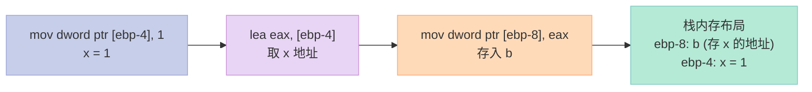

| 汇编指令 | 作用 | 对应高级语言 |
|:--|:--|:--|
| `mov dword ptr [ebp-4], 1` | 把立即数 1 写入栈地址 `ebp-4` | `int x = 1;` |
| `lea eax, [ebp-4]` | 把 `ebp-4` 这个地址本身（不是值）装入 eax 寄存器 | `&x`（取地址） |
| `mov dword ptr [ebp-8], eax` | 把 eax 中的地址写入 `ebp-8` | `int& b = x;`（b 中存 x 的地址） |

### 2.4 栈内存布局图

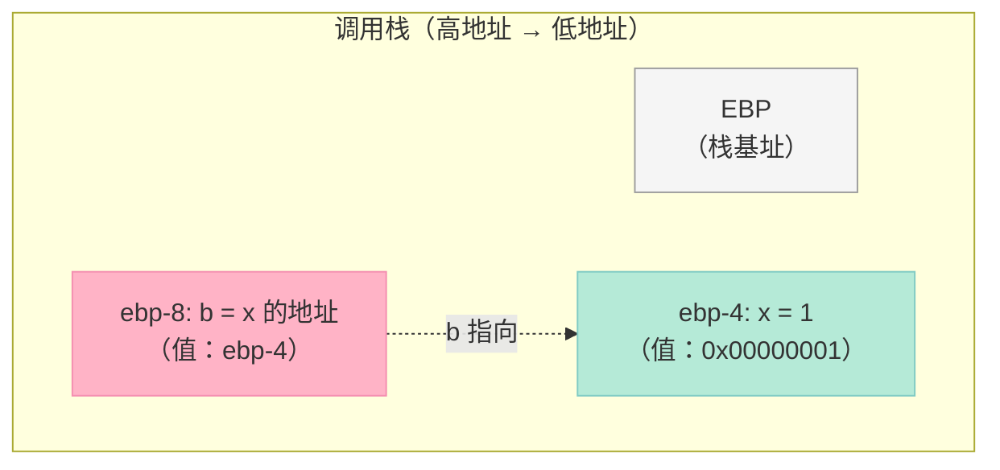

### 2.5 关键结论：引用 = 指针 + 自动解引用 + 不可重绑定

**对比指针的汇编：**

```cpp:demo_pointer.cpp
int main() {
    int x = 1;
    int* b = &x;  // b 是指针
    return 0;
}
```

```asm:asm_pointer.asm
9:           int x = 1;
00401048    mov         dword ptr [ebp-4], 1        ; x = 1

10:          int* b = &x;
0040104F    lea         eax, [ebp-4]                ; 取 x 地址
00401052    mov         dword ptr [ebp-8], eax      ; 存入 b
```

**汇编代码和引用版本完全相同！** 这就是**铁证**：编译器把引用实现为**指针常量**。

### 2.6 修改引用和指针的汇编对比

```cpp:demo_modify.cpp
int main() {
    int x = 1, y = 2;
    int& r = x;
    r = y;  // 期望：x = 2
    return 0;
}
```

汇编（关键部分）：

```asm:asm_ref_modify.asm
; r = y;  // 这不是重新绑定，是把 y 的值赋给 r 引用的对象
mov     eax, DWORD PTR [ebp-8]      ; 取 r（存的是 x 的地址）
mov     DWORD PTR [eax], 2          ; 间接寻址，把 x 改成 2
```

对比指针：

```cpp:demo_ptr_modify.cpp
int main() {
    int x = 1, y = 2;
    int* p = &x;
    *p = y;  // 把 y 的值赋给 p 指向的对象
    return 0;
}
```

```asm:asm_ptr_modify.asm
mov     eax, DWORD PTR [ebp-8]      ; 取 p（存的是 x 的地址）
mov     DWORD PTR [eax], 2          ; 间接寻址，*p = y
```

**两者汇编完全一致。** 这就是为什么"引用是常指针 + 自动解引用"的简化模型能工作。

### 2.7 现代编译器（GCC/Clang）下汇编更精简

```cpp:demo_modern.cpp
int main() {
    int x = 1;
    int& r = x;
    r = 42;
    return 0;
}
```

GCC -O2 编译后：

```asm:asm_gcc.asm
main:
    push    rbp
    mov     rbp, rsp
    mov     DWORD PTR [rbp-4], 1     ; x = 1
    mov     DWORD PTR [rbp-4], 42    ; r = 42 被优化为 x = 42
    xor     eax, eax
    pop     rbp
    ret
```

**优化后连引用变量都不见了！** 编译器直接把 `r = 42` 优化为 `x = 42`，因为它知道 `r` 就是 `x`。

### 2.8 9 维度的汇编证据汇总

| 维度 | 汇编证据 | 结论 |
|:--|:--|:--|
| 本质 | 引用变量存储目标地址 | 引用 = 指针常量 |
| sizeof | 引用 sizeof = sizeof(目标) | 编译器自动解引用 |
| 不可重绑定 | `r = y` 编译为 `*ptr = y` | 没有"重绑定"指令 |
| 多级 | 编译器禁止 `int&&` 作为"引用的引用" | 语法层面阻断 |
| 自增 | `r++` 编译为 `(*ptr)++` | 自动解引用 |

---

## 三、C++ 中的指针参数传递和引用参数传递

### 3.1 思维导图：三种参数传递方式

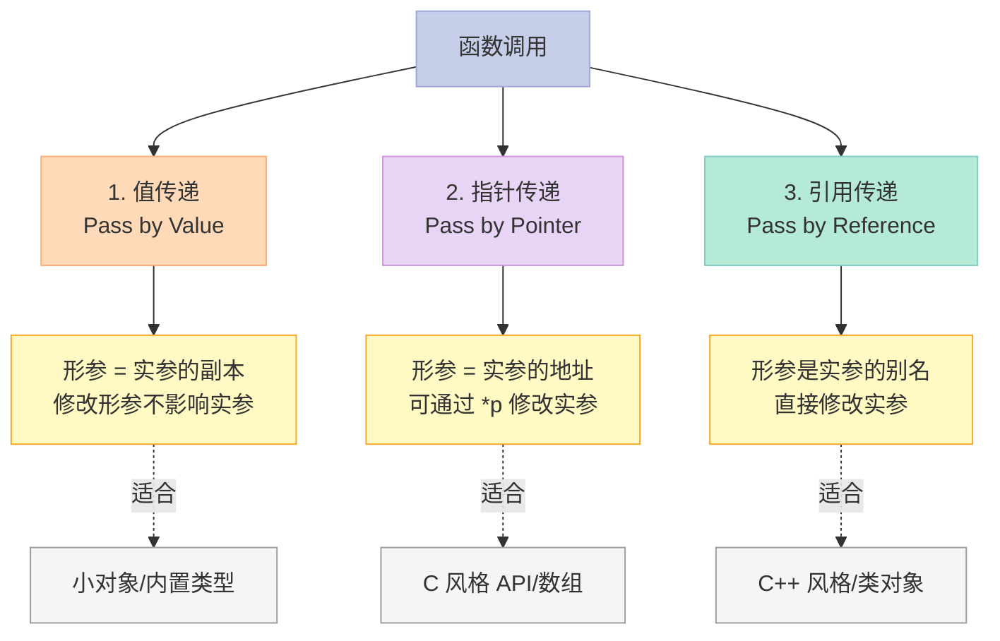

### 3.2 值传递：拷贝一切

```cpp:demo_pass_value.cpp
#include <iostream>
using namespace std;

void modify(int x) {  // x 是实参的副本
    x = 100;          // 修改的是副本
}

int main() {
    int a = 10;
    modify(a);
    cout << "a = " << a << endl;  // 还是 10
    return 0;
}
```

**内存图：**

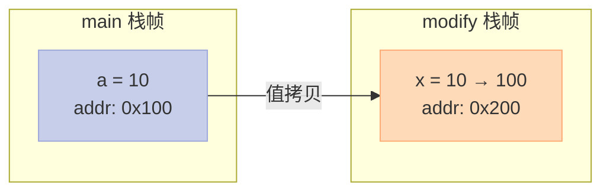

### 3.3 指针传递：传地址

```cpp:demo_pass_pointer.cpp
#include <iostream>
using namespace std;

void modify(int* p) {  // p 是实参地址的副本
    *p = 100;          // 通过地址修改实参
    // p = nullptr;    // ⚠️ 这只改副本，不影响实参
}

int main() {
    int a = 10;
    int* pa = &a;
    modify(pa);
    cout << "a = " << a << endl;  // 100，被改了
    return 0;
}
```

**关键事实：**

- 指针传递**本质上是值传递**——传的是地址值（4/8 字节）
- 在被调函数中，`p` 是形参（栈上的副本），`*p` 才是实参
- 如果 `p = nullptr`，改的是形参，实参指针不变

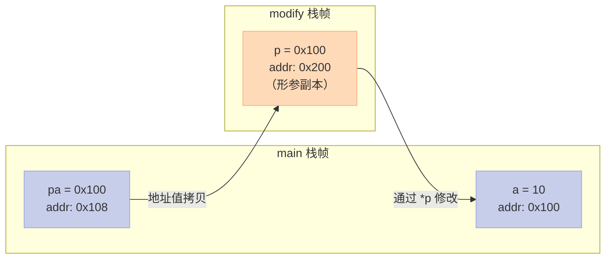

### 3.4 引用传递：直接操作实参

```cpp:demo_pass_reference.cpp
#include <iostream>
using namespace std;

void modify(int& r) {  // r 是 a 的别名
    r = 100;           // 直接修改 a
}

int main() {
    int a = 10;
    modify(a);
    cout << "a = " << a << endl;  // 100，被改了
    return 0;
}
```

**汇编层面：** 和指针传递几乎一样，区别在于编译器**自动帮你解引用**：

```asm:asm_ref_param.asm
; 引用参数 r
mov     eax, DWORD PTR [rbp+8]      ; 取 r（存的是 a 的地址）
mov     DWORD PTR [eax], 100        ; 间接写：a = 100
```

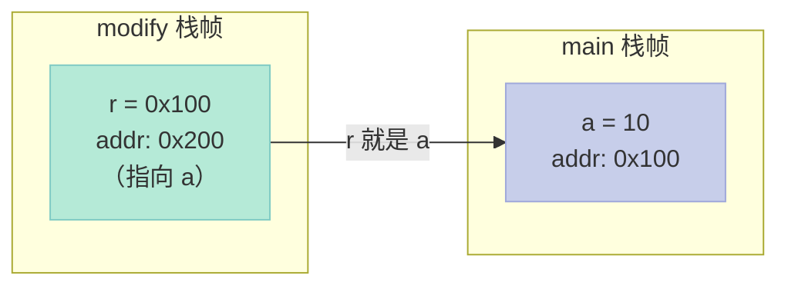

### 3.5 指针 vs 引用参数的本质区别

```cpp:demo_ptr_vs_ref.cpp
#include <iostream>
using namespace std;

void ptrFunc(int* p) {
    p = nullptr;  // 改的是形参，实参不变
}

void refFunc(int& r) {
    // 没有"r = 其他引用"的语法
    // 任何对 r 的操作都是对实参的操作
}

int main() {
    int a = 10;
    int* pa = &a;

    ptrFunc(pa);
    cout << "pa = " << pa << endl;  // 还是 a 的地址
    return 0;
}
```

| 场景 | 指针参数 | 引用参数 |
|:--|:--|:--|
| 改变形参指向 | 只改副本，实参不变 | 无此操作（语法禁止） |
| 通过形参改实参 | `*p = x` | `r = x` |
| 语法层"防呆" | ❌ 容易写错 | ✅ 编译器强制 |
| 适用 | C 兼容、可选参数 | C++ 推荐方式 |

### 3.6 想"改变指针本身"怎么办？—— 指向指针的指针 / 指针引用

```cpp:demo_change_ptr.cpp
#include <iostream>
using namespace std;

// 方案 1：二级指针
void changePtr1(int** pp) {
    static int b = 200;
    *pp = &b;  // 改变指针的指向
}

// 方案 2：指针的引用（更优雅）
void changePtr2(int*& rp) {
    static int c = 300;
    rp = &c;  // 改变指针的指向
}

int main() {
    int a = 100;
    int* p = &a;

    changePtr1(&p);
    cout << "*p = " << *p << endl;  // 200

    int a2 = 100;
    int* p2 = &a2;
    changePtr2(p2);
    cout << "*p2 = " << *p2 << endl; // 300

    return 0;
}
```

**对比表：**

| 方法 | 语法 | 可读性 | 推荐度 |
|:--|:--|:--|:--|
| 二级指针 `int**` | `*pp = &b;` | ⚠️ 中等 | ⭐⭐ |
| 指针引用 `int*&` | `rp = &b;` | ✅ 高 | ⭐⭐⭐⭐ |
| 返回新指针 | `int* func()` | ✅ 高 | ⭐⭐⭐⭐⭐ |

### 3.7 编译视角：符号表记录

C++ 编译器为指针和引用建立**不同的符号表项**：

| 变量类型 | 符号表项（简化） | 行为 |
|:--|:--|:--|
| `int* p;` | 名字 `p` → 栈地址 `0x100`（存 int 的地址） | 可改 `p`、可改 `*p` |
| `int& r = a;` | 名字 `r` → 栈地址 `0x100`（指向 a 的地址） | 不可改绑定、自动解引用 |

**关键事实：** 符号表生成后不再修改，所以引用一旦绑定就"终身"。

### 3.8 性能对比

```cpp:demo_perf.cpp
#include <chrono>
#include <iostream>
using namespace std;

struct Big {
    int data[1000];  // 4KB
};

// 值传递：拷贝 4KB
void byValue(Big b) {
    b.data[0] = 1;
}

// 引用传递：传 8 字节地址
void byRef(Big& b) {
    b.data[0] = 1;
}

// const 引用：传 8 字节，不修改
void byConstRef(const Big& b) {
    // b.data[0] = 1;  // 编译错误
    cout << b.data[0];
}

int main() {
    Big b;

    auto t1 = chrono::high_resolution_clock::now();
    for (int i = 0; i < 1000000; i++) byValue(b);
    auto t2 = chrono::high_resolution_clock::now();
    auto dur1 = chrono::duration_cast<chrono::microseconds>(t2 - t1).count();

    auto t3 = chrono::high_resolution_clock::now();
    for (int i = 0; i < 1000000; i++) byRef(b);
    auto t4 = chrono::high_resolution_clock::now();
    auto dur2 = chrono::duration_cast<chrono::microseconds>(t4 - t3).count();

    cout << "By value: " << dur1 << " us" << endl;
    cout << "By ref:   " << dur2 << " us" << endl;
    // 通常 by ref 快 5-10 倍
    return 0;
}
```

**性能对比表：**

| 传递方式 | 拷贝大小 | 速度 | 推荐 |
|:--|:--|:--|:--|
| 值传递（小对象） | 几个字节 | ✅ 快 | 内置类型 |
| 值传递（大对象） | 整个对象 | ❌ 慢 | 不推荐 |
| 指针传递 | 8 字节 | ✅ 快 | C 风格 |
| 引用传递 | 8 字节 | ✅ 快 | C++ 风格 |
| const 引用 | 8 字节 | ✅ 快 + 安全 | 只读大对象 |

---

## 四、形参与实参的区别？

### 4.1 概念定义

| 概念 | 定义 | 出现时机 | 内存 |
|:--|:--|:--|:--|
| 形参（Parameter） | 函数定义时声明的参数 | 函数定义时 | 调用时分配 |
| 实参（Argument） | 函数调用时传入的值 | 函数调用时 | 调用前已存在 |

### 4.2 一个完整的例子

```cpp:demo_formal_actual.cpp
#include <iostream>
using namespace std;

// x, y 是形参（formal parameters）
int add(int x, int y) {
    return x + y;
}

int main() {
    int a = 3, b = 5;
    // a, b 是实参（actual arguments）
    int result = add(a, b);
    cout << result << endl;  // 8
    return 0;
}
```

### 4.3 形参的 5 大特性

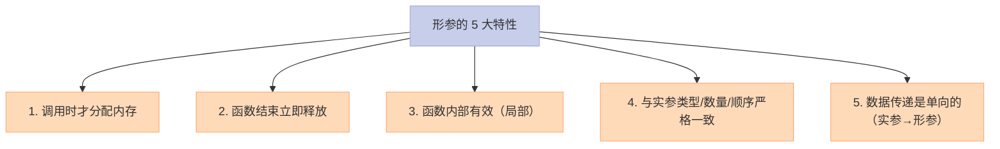

### 4.4 形参的内存生命周期

```cpp:demo_lifetime.cpp
#include <iostream>
using namespace std;

void func(int x) {
    cout << "形参 x 的地址: " << &x << endl;
    // x 在 func 调用结束后就销毁了
}

int main() {
    int a = 10;
    cout << "实参 a 的地址: " << &a << endl;
    func(a);
    // 此后不能再访问形参 x
    return 0;
}
```

**栈帧变化图：**

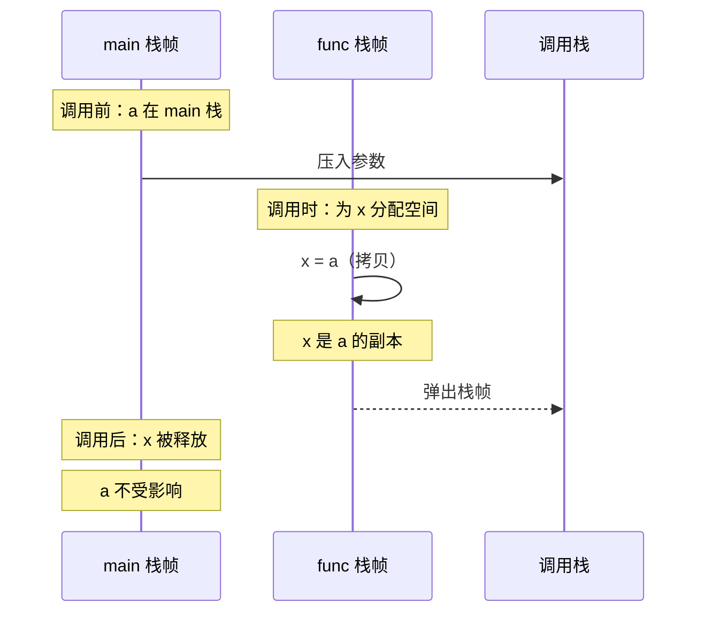

### 4.5 实参的 4 大要求

```cpp:demo_actual_arg.cpp
#include <iostream>
using namespace std;

int square(int x) { return x * x; }

int main() {
    // 实参可以是：常量、变量、表达式、函数返回值
    cout << square(5) << endl;             // ✅ 常量
    int a = 3;
    cout << square(a) << endl;             // ✅ 变量
    cout << square(a + 2) << endl;         // ✅ 表达式
    cout << square(square(2)) << endl;     // ✅ 函数返回值

    return 0;
}
```

| 实参类型 | 示例 | 是否合法 |
|:--|:--|:--|
| 常量 | `func(5)` | ✅ |
| 变量 | `func(a)` | ✅ |
| 表达式 | `func(a + 2)` | ✅ |
| 函数调用 | `func(square(2))` | ✅ |
| 类型不匹配 | `func("hello")` 传给 int 参数 | ❌ 编译错误 |

### 4.6 单向数据传递（关键陷阱）

```cpp:demo_one_way.cpp
#include <iostream>
using namespace std;

void swap(int x, int y) {
    int temp = x;
    x = y;       // 改的是形参
    y = temp;    // 改的是形参
    // 实参 a, b 完全没动！
}

int main() {
    int a = 3, b = 5;
    swap(a, b);
    cout << "a = " << a << ", b = " << b << endl;  // a=3, b=5
    return 0;
}
```

**解决方法：使用指针或引用**

```cpp:demo_swap_correct.cpp
#include <iostream>
using namespace std;

// 指针版
void swapPtr(int* x, int* y) {
    int temp = *x;
    *x = *y;
    *y = temp;
}

// 引用版（C++ 推荐）
void swapRef(int& x, int& y) {
    int temp = x;
    x = y;
    y = temp;
}

int main() {
    int a = 3, b = 5;

    swapPtr(&a, &b);
    cout << "a = " << a << ", b = " << b << endl;  // 5, 3

    int c = 3, d = 5;
    swapRef(c, d);
    cout << "c = " << c << ", d = " << d << endl;  // 5, 3
    return 0;
}
```

### 4.7 形参 vs 实参：完整对比

| 维度 | 形参（Parameter） | 实参（Argument） |
|:--|:--|:--|
| 出现时机 | 函数定义时 | 函数调用时 |
| 内存分配 | 调用时分配，结束释放 | 调用前已存在 |
| 作用域 | 函数内部 | 所在作用域（如 main） |
| 数量 | 固定（由函数签名决定） | 与形参匹配 |
| 类型 | 声明时指定 | 必须兼容（可隐式转换） |
| 名称 | 在函数内有效 | 调用时给出 |
| 数据流向 | 接收方 | 发送方 |
| 能否被函数修改 | 是 | 取决于传递方式 |

### 4.8 三种参数传递的本质总结

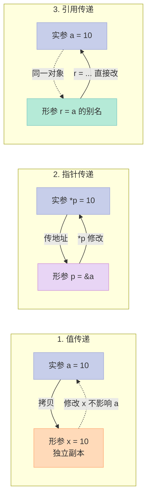

### 4.9 形参不一定是变量——可以是引用、数组、函数指针

```cpp:demo_complex_param.cpp
#include <iostream>
using namespace std;

// 引用形参
void f1(int& x) { x++; }

// 数组形参（退化为指针）
void f2(int arr[], int n) {
    for (int i = 0; i < n; i++) arr[i] *= 2;
}

// 函数指针形参
void f3(int (*op)(int, int), int a, int b) {
    cout << "result = " << op(a, b) << endl;
}

int add(int a, int b) { return a + b; }

int main() {
    int a = 10;
    f1(a);
    cout << "a = " << a << endl;  // 11

    int arr[3] = {1, 2, 3};
    f2(arr, 3);
    cout << arr[1] << endl;  // 4

    f3(add, 3, 5);  // 8
    return 0;
}
```

---

## 五、函数指针

### 5.1 什么是函数指针？

> 函数也有地址。函数名（不加调用括号）就是函数的入口地址。

```cpp:demo_func_ptr_basic.cpp
#include <iostream>
using namespace std;

int add(int a, int b) { return a + b; }

int main() {
    // 方式 1：pf = 函数名
    int (*pf)(int, int) = add;

    // 方式 2：pf = &函数名
    int (*pf2)(int, int) = &add;

    // 调用
    cout << pf(3, 5) << endl;   // 8
    cout << (*pf)(3, 5) << endl; // 8

    return 0;
}
```

### 5.2 函数指针的声明语法

```cpp:demo_func_ptr_decl.cpp
// 正确：pf 是函数指针，指向"返回 int、接受两个 const int& 参数"的函数
int (*pf)(const int&, const int&);

// 错误：pf 是函数，签名是"返回 int*、接受两个 const int& 参数"
// int *pf(const int&, const int&);  // 这是函数声明
```

**口诀：** `(*指针名)` 必须有括号，否则就是函数声明。

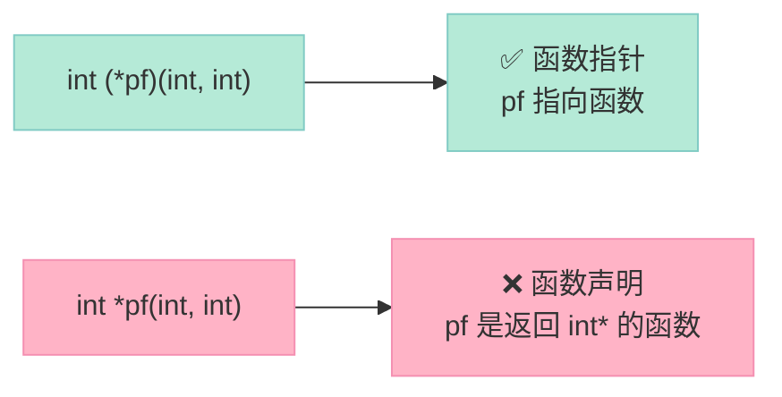

### 5.3 typedef 简化函数指针

```cpp:demo_typedef.cpp
#include <iostream>
using namespace std;

int add(int a, int b) { return a + b; }
int sub(int a, int b) { return a - b; }

// 用 typedef 定义"函数指针类型"
typedef int (*BinaryOp)(int, int);

int main() {
    BinaryOp op = add;
    cout << op(10, 5) << endl;  // 15

    op = sub;
    cout << op(10, 5) << endl;  // 5
    return 0;
}
```

### 5.4 函数指针的用途：回调函数

```cpp:demo_callback.cpp
#include <iostream>
#include <vector>
using namespace std;

// 通用遍历函数
void forEach(const vector<int>& v, void (*callback)(int)) {
    for (int x : v) callback(x);
}

// 三个不同的回调
void printSquare(int x) { cout << x * x << " "; }
void printCube(int x)   { cout << x * x * x << " "; }
void printDouble(int x) { cout << x * 2 << " "; }

int main() {
    vector<int> v = {1, 2, 3, 4, 5};

    cout << "Square: ";
    forEach(v, printSquare);  // 1 4 9 16 25
    cout << endl;

    cout << "Cube: ";
    forEach(v, printCube);    // 1 8 27 64 125
    cout << endl;

    cout << "Double: ";
    forEach(v, printDouble);  // 2 4 6 8 10
    cout << endl;

    return 0;
}
```

### 5.5 函数指针 vs 函数对象 vs lambda

```cpp:demo_modern_alternative.cpp
#include <iostream>
#include <vector>
#include <algorithm>
#include <functional>
using namespace std;

int main() {
    vector<int> v = {1, 2, 3, 4, 5};

    // 方式 1：函数指针
    auto print = [](int x) { cout << x << " "; };
    for_each(v.begin(), v.end(), print);

    // 方式 2：lambda（C++11）
    for_each(v.begin(), v.end(), [](int x) {
        cout << x * 2 << " ";
    });

    // 方式 3：std::function（更通用）
    function<void(int)> f = [](int x) { cout << x * 3 << " "; };
    for_each(v.begin(), v.end(), f);

    return 0;
}
```

| 方式 | 优点 | 缺点 |
|:--|:--|:--|
| 函数指针 | 简单、C 兼容 | 不能捕获状态 |
| 函数对象（functor） | 可携带状态 | 需定义类 |
| lambda | 简洁、可捕获 | 需 C++11+ |
| `std::function` | 通用封装 | 略有性能开销 |

### 5.6 函数指针数组：实现"命令分发器"

```cpp:demo_func_ptr_array.cpp
#include <iostream>
using namespace std;

int add(int a, int b) { return a + b; }
int sub(int a, int b) { return a - b; }
int mul(int a, int b) { return a * b; }
int divi(int a, int b) { return b != 0 ? a / b : 0; }

int main() {
    // 函数指针数组
    int (*ops[])(int, int) = {add, sub, mul, divi};
    const char* names[] = {"add", "sub", "mul", "div"};

    int a = 10, b = 5;
    for (int i = 0; i < 4; i++) {
        cout << names[i] << "(" << a << ", " << b << ") = "
             << ops[i](a, b) << endl;
    }
    return 0;
}
```

**输出：**

```
add(10, 5) = 15
sub(10, 5) = 5
mul(10, 5) = 50
div(10, 5) = 2
```

### 5.7 字符串库函数速查（部分内容，详细见字符串专题）

```cpp:demo_string_funcs.cpp
#include <cstring>
#include <iostream>
using namespace std;

int main() {
    // strcpy：拷贝字符串，遇 '\0' 停止
    char src[] = "hello";
    char dst[10];
    strcpy(dst, src);  // ⚠️ 不安全，可能溢出

    // strncpy：拷贝前 n 个字符
    char dst2[10];
    strncpy(dst2, src, sizeof(dst2) - 1);
    dst2[sizeof(dst2) - 1] = '\0';

    // strcat：连接字符串
    char s1[20] = "hello, ";
    char s2[] = "world";
    strcat(s1, s2);  // "hello, world"

    // memset：按字节填充
    int arr[10];
    memset(arr, 0, sizeof(arr));

    // memcpy：按字节拷贝
    int src_arr[5] = {1, 2, 3, 4, 5};
    int dst_arr[5];
    memcpy(dst_arr, src_arr, sizeof(src_arr));

    return 0;
}
```

| 函数 | 用途 | 终止条件 | 安全性 |
|:--|:--|:--|:--|
| `strcpy` | 拷贝字符串 | `'\0'` | ⚠️ 不安全 |
| `strncpy` | 拷贝 n 字节 | n 字节 | ⚠️ 不会自动加 `'\0'` |
| `strcat` | 拼接字符串 | `'\0'` | ⚠️ 不安全 |
| `memset` | 按字节填充 | n 字节 | ✅ 安全（按字节） |
| `memcpy` | 按字节拷贝 | n 字节 | ✅ 高效 |

**int 转字符串 / 字符串转 int（标准库方法）：**

```cpp:demo_to_string.cpp
#include <string>
#include <iostream>
using namespace std;

int main() {
    // int 转 string（C++11）
    string s1 = to_string(42);
    cout << s1 << endl;  // "42"

    double d = 3.14;
    string s2 = to_string(d);
    cout << s2 << endl;  // "3.140000"

    // string 转 int
    int x = stoi("123");
    cout << x << endl;  // 123

    // string 转 double
    double y = stod("3.14");
    cout << y << endl;  // 3.14

    return 0;
}
```

---

## 六、数组和指针的区别？

### 6.1 本质差异

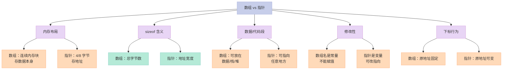

### 6.2 sizeof 的本质差异

```cpp:demo_array_vs_ptr_sizeof.cpp
#include <iostream>
using namespace std;

int main() {
    int arr[10] = {0};
    int* p = arr;

    cout << "sizeof(arr) = " << sizeof(arr) << endl;  // 40（10*4）
    cout << "sizeof(p)   = " << sizeof(p) << endl;    // 8（64位）

    // 数组大小
    int n = sizeof(arr) / sizeof(arr[0]);  // 10
    cout << "n = " << n << endl;

    return 0;
}
```

**核心区别：**

| 对象 | sizeof | 含义 |
|:--|:--|:--|
| `int arr[10]` | 40 | 整个数组的字节数 |
| `int* p` | 8 | 指针宽度 |

### 6.3 数组名是常量指针

```cpp:demo_array_name_const.cpp
#include <iostream>
using namespace std;

int main() {
    int arr[5] = {1, 2, 3, 4, 5};

    // 数组名 arr 在大多数表达式中等价于 &arr[0]
    cout << "arr = " << arr << endl;      // 地址
    cout << "&arr[0] = " << &arr[0] << endl;  // 相同地址

    // 数组名是常量，不能赋值
    int* p = arr;       // ✅
    // arr = p;         // ❌ 编译错误：数组名不能赋值

    // 但 &arr 的类型是 int(*)[5]
    cout << "&arr = " << &arr << endl;    // 和 arr 值相同，类型不同
    cout << "&arr + 1 = " << (&arr + 1) << endl;  // 跳过整个数组

    return 0;
}
```

**关键陷阱：**

| 表达式 | 类型 | 步长 |
|:--|:--|:--|
| `arr` | `int*` | sizeof(int) = 4 |
| `&arr` | `int(*)[5]` | sizeof(int[5]) = 20 |
| `arr + 1` | 跳 4 字节 | 下一个 int |
| `&arr + 1` | 跳 20 字节 | 跳到数组末尾之后 |

### 6.4 数组退化为指针（数组的"一生之敌"）

> **"在 C/C++ 中，数组在大多数情况下会自动退化为指向首元素的指针。"**

```cpp:demo_array_decay.cpp
#include <iostream>
using namespace std;

// 形参里的 int arr[] 实际是 int* arr
void printSize(int arr[]) {
    cout << "sizeof(arr) = " << sizeof(arr) << endl;  // 8，不是 40
}

int main() {
    int arr[10] = {0};
    cout << "sizeof(arr) = " << sizeof(arr) << endl;  // 40

    printSize(arr);  // 退化为指针
    return 0;
}
```

**退化规则：**

| 场景 | 是否退化 |
|:--|:--|
| `arr` 作为右值 | ✅ 退化为 `int*` |
| `arr` 作为 `&` 操作符 | ❌ 不退，类型 `int(*)[10]` |
| `arr` 作为 `sizeof` 操作数 | ❌ 不退，返回数组大小 |
| `arr` 作为函数形参 | ✅ 退化为 `int*` |
| 字符串字面量 `"hello"` | ✅ 退化为 `const char*` |

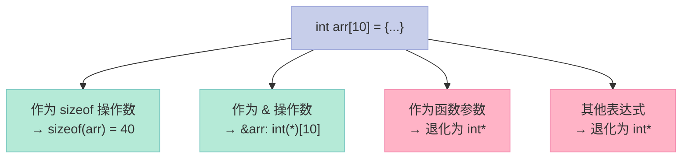

### 6.5 下标的等价性

```cpp:demo_subscript.cpp
#include <iostream>
using namespace std;

int main() {
    int arr[5] = {10, 20, 30, 40, 50};
    int* p = arr;

    // 数组下标和指针运算等价
    cout << arr[0] << endl;     // 10
    cout << *(arr + 0) << endl; // 10
    cout << p[0] << endl;       // 10
    cout << *(p + 0) << endl;   // 10

    // 神奇的反向：0[arr] 也是合法的！
    cout << 0[arr] << endl;     // 10（不推荐用）

    return 0;
}
```

**本质：** `a[i]` 编译器都会翻译为 `*(a + i)`，所以数组和指针在下标运算上完全等价。

### 6.6 数组 vs 指针：完整对比

| 维度 | 数组 | 指针 |
|:--|:--|:--|
| 本质 | 一块连续内存 | 一个存地址的变量 |
| 存储内容 | 元素本身 | 第一个元素的地址 |
| sizeof | 整个数组大小 | 地址宽度（4/8 字节） |
| 名字 | 常量，不能赋值 | 变量，可改指向 |
| 取地址 | `&arr` 类型是数组指针 | `&p` 类型是二级指针 |
| 下标运算 | 等价于 `*(arr + i)` | 等价于 `*(p + i)` |
| 字符串字面量 | `"hello"` 类型 `const char[6]` | 退化为 `const char*` |
| 分配方式 | 静态/栈/堆 | 任意位置 |
| 用途 | 存储批量数据 | 灵活引用、链表等 |

### 6.7 一个综合的内存布局实验

```cpp:demo_array_memory.cpp
#include <iostream>
using namespace std;

int main() {
    int arr[5] = {1, 2, 3, 4, 5};
    int* p = arr;

    cout << "arr 地址:  " << arr << endl;
    cout << "&arr[0]:  " << &arr[0] << endl;
    cout << "&arr:     " << &arr << endl;        // 和 arr 数值相同
    cout << "p:        " << p << endl;
    cout << "&p:       " << &p << endl;          // 不同的地址（指针自己）

    cout << "arr+1:    " << (arr + 1) << endl;   // +4
    cout << "&arr+1:   " << (&arr + 1) << endl;  // +20
    cout << "p+1:      " << (p + 1) << endl;     // +4

    return 0;
}
```

**典型输出（64 位系统）：**

```
arr 地址:  0x7fff5fbff8a0
&arr[0]:  0x7fff5fbff8a0
&arr:     0x7fff5fbff8a0
p:        0x7fff5fbff8a0
&p:       0x7fff5fbff8a8     ← 不同
arr+1:    0x7fff5fbff8a4     ← +4
&arr+1:   0x7fff5fbff8b4     ← +20
p+1:      0x7fff5fbff8a4     ← +4
```

---

## 七、将"引用"作为函数参数有哪些特点？

### 7.1 引用参数的 4 大特点

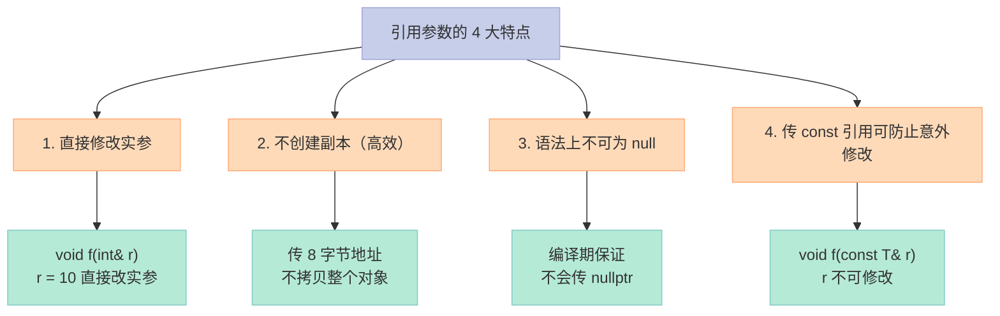

### 7.2 特点 1：能直接修改实参

```cpp:demo_ref_modify.cpp
#include <iostream>
using namespace std;

// 用引用实现 swap
void swap(int& a, int& b) {
    int temp = a;
    a = b;
    b = temp;
}

int main() {
    int x = 3, y = 5;
    swap(x, y);
    cout << "x = " << x << ", y = " << y << endl;  // 5, 3
    return 0;
}
```

### 7.3 特点 2：避免拷贝，提高效率

```cpp:demo_ref_efficient.cpp
#include <iostream>
#include <string>
using namespace std;

struct BigData {
    char data[1024];  // 1KB
};

// 值传递：每次调用都拷贝 1KB
void processByValue(BigData d) { /* ... */ }

// 引用传递：只传 8 字节
void processByRef(BigData& d) { /* ... */ }

// const 引用传递：只读，安全且高效
void processByConstRef(const BigData& d) { /* ... */ }

int main() {
    BigData big;
    processByRef(big);          // ✅ 推荐
    processByConstRef(big);     // ✅ 只读场景最佳
    return 0;
}
```

**性能对比表：**

| 方式 | 拷贝量 | 速度 | 是否能修改 |
|:--|:--|:--|:--|
| 值传递 | 1KB | ❌ 慢 | 改副本 |
| 指针传递 | 8 字节 | ✅ 快 | 通过 *p 改 |
| 引用传递 | 8 字节 | ✅ 快 | 直接改 |
| const 引用 | 8 字节 | ✅ 快 | 不可改（最安全） |

### 7.4 特点 3：语法上保证不为 null

```cpp:demo_ref_safety.cpp
#include <iostream>
using namespace std;

void process(int& r) {
    cout << r << endl;  // 不需要 null 检查
}

int main() {
    int x = 10;
    process(x);  // ✅ 必须传有效对象
    // process(nullptr);  // ❌ 编译错误
    // process(5);        // ❌ 不能传字面量（非常量引用）
    return 0;
}
```

**对比指针：**

```cpp:demo_ptr_safety.cpp
void process(int* p) {
    if (p == nullptr) return;  // 必须检查
    cout << *p << endl;
}
```

### 7.5 特点 4：const 引用可实现"高效 + 只读"

```cpp:demo_const_ref.cpp
#include <iostream>
#include <string>
using namespace std;

// 完美：传 const 引用，既高效又不会修改实参
void printString(const string& s) {
    cout << s << endl;
    // s[0] = 'A';  // ❌ 编译错误：const 引用不能改
}

int main() {
    string s = "Hello";
    printString(s);  // ✅ 不拷贝

    // 神奇：可以传字面量！
    printString("World");  // ✅ const 引用可以绑右值

    return 0;
}
```

### 7.6 引用参数 vs 指针参数：决策表

| 场景 | 推荐 | 原因 |
|:--|:--|:--|
| 必须修改实参 | `T&` 或 `T*` | 都能改 |
| 读取大对象 | `const T&` | 高效、只读 |
| 读取小对象（int、double） | 值传递 | 避免间接访问 |
| 可选参数 | `T*`（可为 nullptr） | 引用不能为 null |
| C 接口兼容 | `T*` | C 没有引用 |
| 数组 | `T*`（数组天然退化为指针） | 习惯用法 |
| 链式调用 | `T&` 返回值 | 重载 `<<`、`=` |

### 7.7 实战：实现一个 max 函数

```cpp:demo_max_variants.cpp
#include <iostream>
using namespace std;

// 方案 1：值传递（小类型）
int max1(int a, int b) { return a > b ? a : b; }

// 方案 2：指针（不推荐）
int max2(const int* a, const int* b) {
    return *a > *b ? *a : *b;
}

// 方案 3：const 引用（推荐）
int max3(const int& a, const int& b) {
    return a > b ? a : b;
}

int main() {
    int x = 3, y = 5;
    cout << max1(x, y) << endl;  // 5
    cout << max3(x, y) << endl;  // 5
    return 0;
}
```

### 7.8 引用作为参数的局限

```cpp:demo_ref_limits.cpp
#include <iostream>
using namespace std;

// 1. 不能重载"只有顶层 const"的函数
void f(int& x) { cout << "non-const ref" << endl; }
// void f(const int& x) { }  // ✅ 这是另一个重载

// 2. 引用形参不能绑定到右值（除了 const 引用）
void g(int& x) { }
// g(5);          // ❌ 编译错误
// g(x + 1);      // ❌ 编译错误

void h(const int& x) { }
// h(5);          // ✅ const 引用可以绑右值
// h(x + 1);      // ✅

// 3. 不能给引用形参赋 nullptr
// int& r = nullptr;  // ❌ 编译错误
```

---

## 八、什么情况用指针当参数，什么时候用引用，为什么？

### 8.1 决策流程图

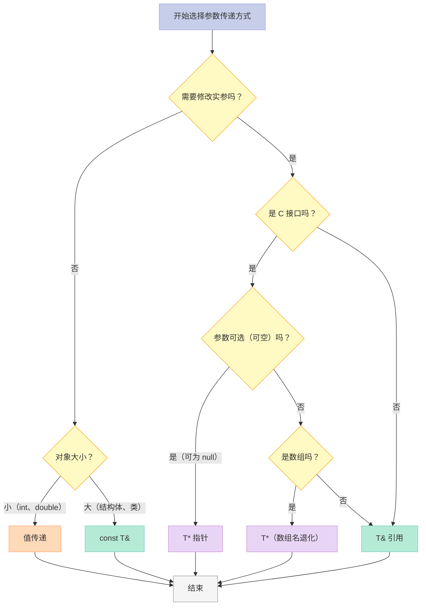

### 8.2 决策原则（来自《Effective C++》）

| 数据对象类型 | 是否修改 | 推荐方式 |
|:--|:--|:--|
| 内置类型（小） | 不修改 | **值传递** |
| 内置类型（小） | 修改 | **指针** `T*` |
| 数组（任何情况） | / | **指针**（唯一选择） |
| 结构体（大） | 不修改 | **const 指针** 或 **const 引用** |
| 结构体（大） | 修改 | **指针** 或 **引用** |
| 类对象 | 不修改 | **const 引用**（C++ 标准） |
| 类对象 | 修改 | **引用** `T&` |
| 可选参数（可空） | / | **指针** `T*`（可为 null） |

### 8.3 为什么"能引用就别指针"？

```cpp:demo_why_ref.cpp
#include <iostream>
using namespace std;

// 指针版：调用者必须传地址
void setValuePtr(int* p) {
    if (p) *p = 100;  // 调用者可能传 null
}

// 引用版：调用者必须传有效对象
void setValueRef(int& r) {
    r = 100;  // 不需要 null 检查
}

int main() {
    int x = 0;
    setValuePtr(&x);      // 调用方语法负担
    setValueRef(x);       // 调用方更简洁

    setValuePtr(nullptr); // 可以传 null
    // setValueRef(nullptr);  // ❌ 编译错误，更安全
    return 0;
}
```

**核心原因：**

1. **语法更简洁**：不用 `&x`，不用 `nullptr` 检查
2. **类型更安全**：引用必绑定有效对象，编译期保证
3. **意图更明确**：`T&` 就是"我要改它"，`const T&` 就是"我只要读它"
4. **不损失性能**：底层实现和指针一样

### 8.4 必须用指针的场景

```cpp:demo_must_use_ptr.cpp
#include <iostream>
using namespace std;

// 场景 1：可选参数
void printValue(int* p) {
    if (p) cout << *p << endl;
    else  cout << "no value" << endl;
}

// 场景 2：C 兼容接口
extern "C" void cFunction(int* p);  // C 没有引用

// 场景 3：数组参数
void processArray(int* arr, int n) {
    for (int i = 0; i < n; i++) arr[i] *= 2;
}

// 场景 4：动态分配
int* createArray(int n) {
    return new int[n];  // 指针是唯一选择
}

int main() {
    printValue(nullptr);   // 合法
    // printValue(0);     // 也可以
    int arr[3] = {1, 2, 3};
    processArray(arr, 3);
    return 0;
}
```

### 8.5 实战对比

```cpp:demo_full_comparison.cpp
#include <iostream>
#include <string>
using namespace std;

// ❌ 反面：滥用指针
bool findUser1(const char* target, User** outUser) {
    // 调用方：User* u; findUser1("alice", &u);
    // 多重指针、可空、不可空混淆
}

// ✅ 推荐：引用 + 返回值
User* findUser2(const string& target) {
    // 调用方：User* u = findUser2("alice");
    // 简单清晰，null 表示"没找到"
}

// ✅ 最佳：optional（C++17）
optional<User> findUser3(const string& target) {
    // 调用方：if (auto u = findUser3("alice")) ...
}
```

### 8.6 总结：参数传递"圣战"

| 流派 | 主张 | 适用 |
|:--|:--|:--|
| **C 派** | 全部用指针 | 系统编程、嵌入式 |
| **C++ 派** | 能引用就引用，必须用指针才用 | 应用层、库设计 |
| **现代 C++** | `T&` 改、`const T&` 读、可选用 `optional<T>` | 14/17/20 项目 |

**结论：** 99% 的情况下，**`T&`（改）或 `const T&`（读）** 是最佳选择；只有少数场景（C 接口、可选、动态内存）才必须用指针。

---

## 九、面试踩坑指南（10 个常见误区）

### 9.1 误区 1：引用是 const 指针

```cpp
// 错误：把引用当成"const 指针"使用
int x = 10;
int& r = x;
// int& r2 = 5;  // ❌ 不能绑右值（除非 const）
const int& r3 = 5;  // ✅ const 引用可以
```

### 9.2 误区 2：引用可以为 null

```cpp
int* p = nullptr;  // ✅ 合法
// int& r = nullptr;  // ❌ 编译错误
```

### 9.3 误区 3：数组名就是指针

```cpp
int arr[5] = {0};
// arr 是数组，退化为指针
// 但 sizeof(arr) ≠ sizeof(int*)
cout << sizeof(arr) << endl;  // 20
```

### 9.4 误区 4：引用可以重新绑定

```cpp
int x = 10, y = 20;
int& r = x;
r = y;  // ❌ 不是重新绑定，是赋值
// 实际效果：x = 20
```

### 9.5 误区 5：指针引用就是二级指针

```cpp
int x = 10;
int* p = &x;
int*& rp = p;  // rp 是 p 的引用，不是二级指针
// 两者用途类似，但语义不同
```

### 9.6 误区 6：函数指针难记

```cpp
int (*pf)(int, int);  // 正确：pf 是函数指针
int* pf(int, int);    // 错误：pf 是返回 int* 的函数
```

**口诀：** 看 `*` 旁边有没有括号。

### 9.7 误区 7：传 const 引用就能改实参

```cpp
void f(const int& r) {
    // r = 10;  // ❌ 编译错误
    const_cast<int&>(r) = 10;  // ⚠️ 强行去掉 const，原实参真被改了
}
```

### 9.8 误区 8：数组退化和 sizeof 一起用

```cpp
void f(int arr[]) {
    cout << sizeof(arr) << endl;  // 8，不是数组大小
}
// 想保留数组大小，传递时加上长度
void f2(int arr[], int n) { /* ... */ }
```

### 9.9 误区 9：字符串字面量是 string

```cpp
const char* p = "hello";      // p 指向常量区
char arr[] = "hello";         // arr 是栈上数组，可修改
// arr[0] = 'H';  // ✅
// p[0] = 'H';    // ❌ 段错误
```

### 9.10 误区 10：忽略野指针

```cpp
int* p = new int(10);
delete p;
// *p = 20;  // ❌ 野指针
p = nullptr;  // ✅ delete 后置 null
```

### 9.11 10 个误区速查表

| # | 误区 | 正确做法 |
|:--|:--|:--|
| 1 | 引用 = const 指针 | 引用有自己的类型规则 |
| 2 | 引用可为 null | 引用必须绑有效对象 |
| 3 | 数组名 = 指针 | sizeof、& 不同 |
| 4 | 引用可重绑定 | `r = y` 是赋值 |
| 5 | 指针引用 = 二级指针 | 语法不同 |
| 6 | 函数指针难记 | 看括号 |
| 7 | const 引用可改实参 | const_cast 强行改是 UB 风险 |
| 8 | 函数内 sizeof(arr) | 已退化为指针 |
| 9 | 字符串字面量是 string | 是 const char[] |
| 10 | 忽略野指针 | delete 后置 null |

---

## 十、本章总结与下章预告

### 10.1 关键概念图谱

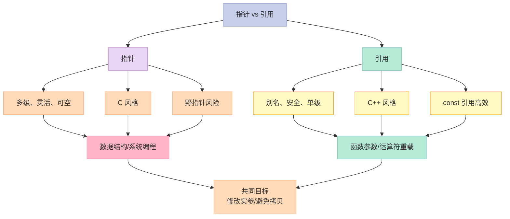

### 10.2 9 大维度一图流

| # | 维度 | 指针 | 引用 | 一句话记忆 |
|:--|:--|:--|:--|:--|
| 1 | 本质 | 存地址的变量 | 变量的别名 | 一个是盒子，一个是指向盒子的标签 |
| 2 | 内存 | 4/8 字节 | 编译器实现 | 引用是"零开销"抽象 |
| 3 | 初始化 | 可空、可后赋 | 必须初始化 | 引用是"一生绑定" |
| 4 | 可改指向 | ✅ | ❌ | 引用一旦绑定终身 |
| 5 | 多级 | ✅ | ❌ | 没有"引用的引用" |
| 6 | 自增 | 跳类型 | 值加 1 | 指针动位置，引用动数值 |
| 7 | sizeof | 地址宽度 | 目标大小 | 引用自动解引用 |
| 8 | 访问 | `*p` | `r` | 引用就是"语法糖指针" |
| 9 | 安全 | 需检查 | 编译保证 | 引用少踩坑 |

### 10.3 行动建议

**给 C++ 初学者：**

1. **背诵 9 维度对比表**——面试必问
2. **亲手编译 2 个汇编例子**——`g++ -S file.cpp`，亲眼看 `lea` 和 `mov`
3. **写一个函数指针计算器**——理解回调机制
4. **对比 3 种 swap 实现**——感受引用的优雅

**给面试候选人：**

1. **永远先答定义**（引用是别名），再答 **9 维度**
2. **能加汇编就加汇编**——面试官想看到你的深度
3. **提到 const 引用**——展示现代 C++ 素养
4. **举例 STL 的应用**——`vector::operator[]` 返回引用，说明理解

**给项目负责人：**

1. **统一代码规范**——能引用别指针，强制使用 `const T&`
2. **禁止裸指针**——用 `unique_ptr`、`shared_ptr` 替代
3. **慎用二级指针**——可读性差，考虑返回值或指针引用
4. **静态分析工具**——clang-tidy 有 `cppcoreguidelines-*` 检查

### 10.4 思考题（面试常考）

1. **为什么 C++ 要设计引用？只留指针不行吗？**
   <details>
   <summary>参考答案</summary>
   引用是"语法糖"，提供：① 类型安全（不能为 null）② 运算符重载支持（`<<`、`=`）③ 拷贝构造/赋值的必要语法。指针的灵活性反而成了负担。
   </details>

2. **如果编译器把引用实现为指针，那 `int&&`（右值引用）是什么？**
   <details>
   <summary>参考答案</summary>
   `T&&` 是右值引用（C++11），用于**移动语义**和**完美转发**。它和"引用的引用"毫无关系，是独立的新类型。
   </details>

3. **为什么 `sizeof(std::string)` 是 32 而不是 strlen("hello")+1？**
   <details>
   <summary>参考答案</summary>
   `std::string` 在栈上只有 32 字节的"小型字符串优化"缓冲区（或指针 + 容量），真正的字符存在堆上。指针和栈数据结构是两套体系。
   </details>

4. **如何让函数同时支持"传值"和"传引用"？**
   <details>
   <summary>参考答案</summary>
   用**函数模板 + 万能引用**：`template<typename T> void f(T&& t)`，再结合 `std::forward` 实现完美转发。
   </details>

5. **数组和指针什么时候完全等价？什么时候不等价？**
   <details>
   <summary>参考答案</summary>
   等价：作为右值、参与算术运算（+1）、下标访问。**不等价**：作为 sizeof 操作数、作为 & 操作数、作为字符串字面量初始化（类型不同）。
   </details>

### 10.5 下章预告：第 2 篇 —— `const` 关键字全解

下篇我们会深入：

- `const` 在指针/引用/成员函数中的 11 种用法
- `const` 修饰的 4 种位置（顶层 const、底层 const、constexpr、consteval）
- `mutable` 关键字的"灰色地带"
- 为什么 `const` 是 C++ "代码自文档化"的精髓

---

## 📚 C++ 面试题集锦 系列导航

> 本文是《C++ 面试题集锦》系列第 **1/16** 篇。

| 方向 | 章节 |
|:--|:--|
| 上一篇 ◀ | [系列总览](/2026/06/16/cpp-interview-00-series-index/) |
| 下一篇 ▶ | [第 2 篇：const 关键字全解](/2026/06/16/cpp-interview-02-const-keyword/) |

<details>
<summary>📖 全部 16 篇目录（点击展开）</summary>

0. [系列总览](/2026/06/16/cpp-interview-00-series-index/) 🆕
1. [第 1 篇：指针 vs 引用——9 个维度一次说透](/2026/06/16/cpp-interview-01-pointers-references/) **← 当前**
2. [第 2 篇：const 关键字全解](/2026/06/16/cpp-interview-02-const-keyword/)
3. [第 3 篇：static 关键字全解](/2026/06/16/cpp-interview-03-static-keyword/)
4. [第 4 篇：C/C++ 内存管理：栈、堆、静态区、常量区](/2026/06/16/cpp-interview-04-memory-management/)
5. [第 5 篇：sizeof 运算符深度剖析](/2026/06/16/cpp-interview-05-sizeof/)
6. [第 6 篇：C++ 字符串处理：std::string 与 C 字符串](/2026/06/16/cpp-interview-06-strings/)
7. [第 7 篇：预处理、编译、链接全过程](/2026/06/16/cpp-interview-07-preprocessing/)
8. [第 8 篇：宏定义 #define 进阶与陷阱](/2026/06/16/cpp-interview-08-macros/)
9. [第 9 篇：函数重载、隐藏、覆盖（C++ 多态基石）](/2026/06/16/cpp-interview-09-overload-override/)
10. [第 10 篇：面向对象三大特性：封装、继承、多态](/2026/06/16/cpp-interview-10-oop-three-pillars/)
11. [第 11 篇：构造函数、析构函数、拷贝控制](/2026/06/16/cpp-interview-11-constructors/)
12. [第 12 篇：智能指针：unique_ptr、shared_ptr、weak_ptr](/2026/06/16/cpp-interview-12-smart-pointers/)
13. [第 13 篇：STL 容器与算法：vector、map、unordered_map](/2026/06/16/cpp-interview-13-stl/)
14. [第 14 篇：模板元编程入门：函数模板、类模板](/2026/06/16/cpp-interview-14-templates/)
15. [第 15 篇：现代 C++ 新特性：auto、lambda、右值引用](/2026/06/16/cpp-interview-15-modern-cpp/)
16. [第 16 篇：C++ 综合面试题精选与解析](/2026/06/16/cpp-interview-16-comprehensive/)

</details>

---

> **最后的话**：指针和引用是 C++ 之门的两把钥匙。一把生锈（指针，灵活但危险），一把光滑（引用，安全但受限）。**掌握它们，才算真正踏入 C++ 的世界。**
