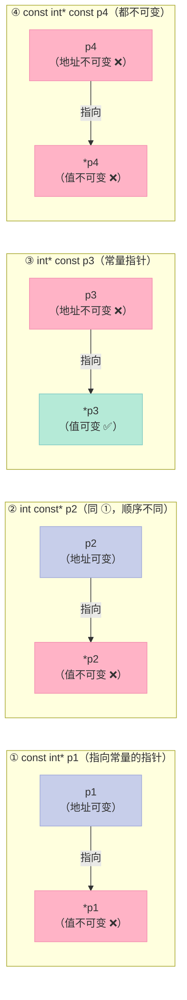
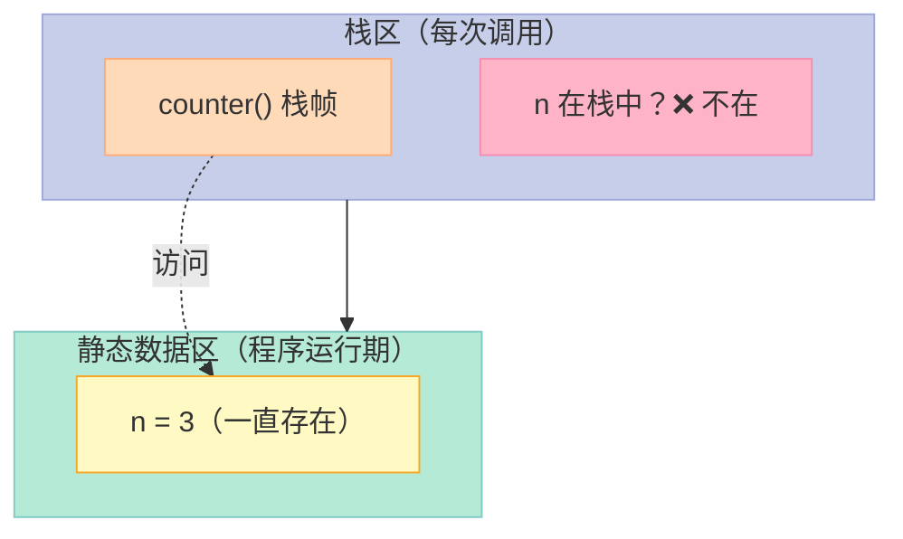
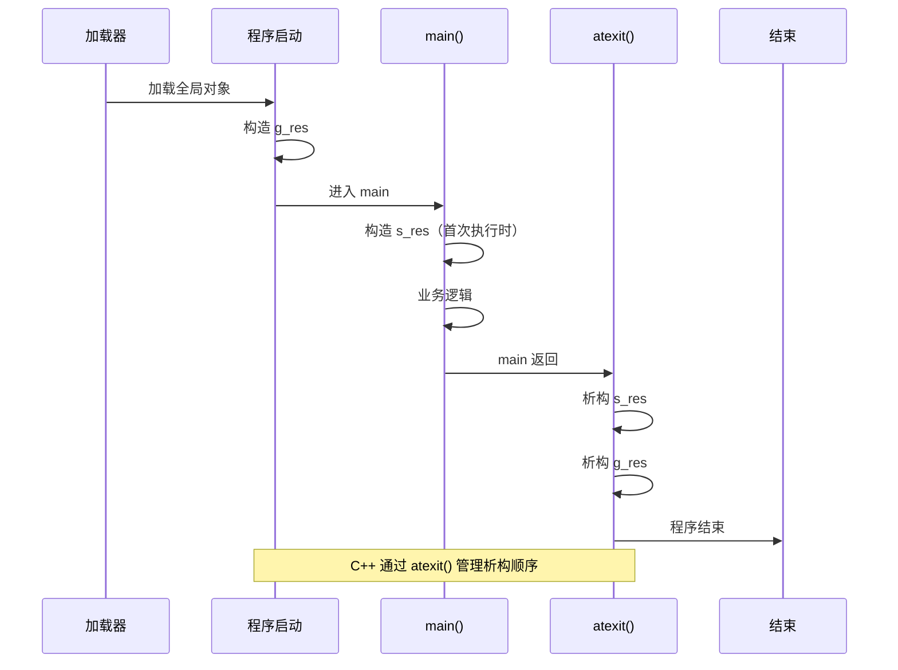
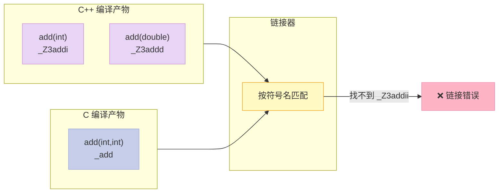

> 一句话核心结论：**const 保护数据，static 控制生命周期与作用域，extern 解决跨文件符号，volatile 解决内存可见性**——这 4 个关键字是 C++ 面试中出现频率最高、坑也最多的一组基本功。

---

## 一、开篇钩子：你以为你懂，其实你不会

**const 竟然有 11 种用法？static 也有 8 种？** 是不是有种"我学了 3 年 C++，但你告诉我这俩关键字还能有这么多花样"的错觉？

我第一次看到"const 修饰 const 成员函数返回 const 引用"的时候也懵了——**这 const 都快绕成贪吃蛇了**。但等你真正理解之后会发现：const 的本质只有一个，就是"**承诺不修改**"，所有的复杂用法都是这个承诺在不同语境下的具体化。

而 **volatile** 呢？很多初学者以为它"啥也没干"，但当你在多线程 / 中断 / 硬件寄存器里翻车时，才会意识到这个关键字的份量。

今天这篇文章，我们把 **const / static / extern / volatile** 这 4 件套**逐个拆开**，把每一种用法都配上代码示例和内存图，争取让"看完就忘"变成"看完就用"。

读完你能得到：
- const 的 **11 种用法** 和 4 种指针修饰的内存图
- static 的 **4 大本质** + **8 种用法** + 单例模式最佳实践
- extern 在 C/C++ 混编中的关键作用
- volatile 与 atomic 的**本质区别**（面试高频追问）
- 一张涵盖 4 个关键字的**终极对比表**

---

## 二、const：从基础到 11 种用法

### 2.1 const 是什么？

`const` 是 **constant（常量）** 的缩写，是 C++ 中的**类型修饰符**。它告诉编译器："**这个值承诺不会改变**"。

```cpp
const int MAX_SIZE = 100;  // 声明一个整型常量
MAX_SIZE = 200;             // 编译错误！不能修改 const 变量
```

**核心思想**：**把"不可变"这件事写进类型系统**。编译器帮你看着，比你写在注释里靠谱一万倍。

### 2.2 const 的 11 种用法全景表

| 编号 | 修饰对象 | 示例 | 核心作用 |
|------|---------|------|---------|
| 1 | 普通变量 | `const int x = 10;` | 不可修改的局部/全局变量 |
| 2 | 指针（指向常量） | `const int *p` | 不能通过 p 改所指内容 |
| 3 | 常量指针（指针本身） | `int *const p` | p 不能指向别的地址 |
| 4 | 指向常量的常量指针 | `const int *const p` | 指针和所指都不可变 |
| 5 | 函数参数 | `void f(const T& x)` | 防止函数内部修改入参 |
| 6 | 函数返回值 | `const T foo()` | 防止返回值被修改 |
| 7 | 类的数据成员 | `class A { const int n; };` | 成员变量不可修改 |
| 8 | 类的成员函数 | `void foo() const` | 承诺不修改对象状态 |
| 9 | 类对象（常对象） | `const MyClass obj;` | 只能调用 const 成员函数 |
| 10 | 引用参数 | `void f(const T& x)` | 引用 + const = 最高效的只读传参 |
| 11 | constexpr（C++11） | `constexpr int N = 10;` | 编译期常量（const 升级版） |

### 2.3 const 修饰指针的 4 种组合（重点中的重点）

> **口诀**：**const 在 `*` 左侧 → 修饰所指数据；在 `*` 右侧 → 修饰指针本身**。

#### 2.3.1 4 种组合的内存示意



#### 2.3.2 4 种组合的代码实战

```cpp
int a = 10;
int b = 20;

// ① const int* p1：指向常量的指针
const int* p1 = &a;
// *p1 = 30;   // 错误！不能通过 p1 改 a 的值
p1 = &b;        // 正确！p1 可以指向别的地址

// ② int const* p2：与 ① 完全等价（const 在 * 左侧）
int const* p2 = &a;
// *p2 = 30;   // 错误
p2 = &b;        // 正确

// ③ int* const p3：常量指针（指针本身是常量）
int* const p3 = &a;
*p3 = 30;        // 正确！可以通过 p3 改 a 的值
// p3 = &b;    // 错误！p3 不能指向别的地址

// ④ const int* const p4：指向常量的常量指针
const int* const p4 = &a;
// *p4 = 30;   // 错误
// p4 = &b;    // 错误
```

#### 2.3.3 区分技巧：一句话看懂

| 写法 | 谁不能变？ | 通俗解释 |
|------|----------|---------|
| `const int *p` / `int const *p` | `*p`（所指数据） | 你能换指向，但不能改值 |
| `int *const p` | `p`（指针本身） | 你能改值，但不能换指向 |
| `const int *const p` | 都不可变 | 既不能换指向，也不能改值 |

> **记忆诀窍**：把 const 想象成一个"锁"，const 出现在哪，**那一侧就被锁死**。

### 2.4 const 修饰函数参数

```cpp
// 场景 1：传值 + const（基本没用，因为传值本身就是副本）
void f1(const int x) { /* 函数内不能改 x，但改 x 不影响调用方 */ }

// 场景 2：传指针 + const（防止函数内修改所指内容）
void f2(const int* p) {
    // *p = 100;   // 错误！承诺不改所指内容
}

// 场景 3：传引用 + const（C++ 最高效的只读传参方式）
void f3(const std::string& s) {
    // s[0] = 'X';  // 错误！承诺不改 s
    std::cout << s.size(); // 可以读取
}
```

**为什么传 const 引用最好？**

| 传参方式 | 拷贝开销 | 可修改入参 | 推荐场景 |
|---------|---------|-----------|---------|
| 值传递 `T x` | 有 | 是 | 小类型（int、double） |
| 引用传递 `T& x` | 无 | 是 | 需要修改入参 |
| const 引用 `const T& x` | 无 | 否 | **大对象只读（首选）** |

### 2.5 const 修饰函数返回值

```cpp
// 1. 返回 const 值：防止把返回值当左值
const int foo() { return 42; }
foo() = 10;  // 错误！不能给返回值赋值

// 2. 返回 const 引用：常用于返回成员或全局
class MyString {
    std::string data_;
public:
    // 返回 const 引用，链式调用安全
    const std::string& get() const { return data_; }
};

// 3. 返回 const 指针：保护内部状态
const int* bar() {
    static int v = 100;  // 见 static 章节
    return &v;
}
```

### 2.6 const 成员函数（类的核心契约）

```cpp
class Stock {
private:
    std::string name_;
    double price_;

public:
    // const 成员函数：承诺不修改对象
    double getPrice() const {
        // price_ = 0;  // 错误！const 成员函数不能改非 mutable 成员
        return price_;
    }

    // 非 const 成员函数：可以修改对象
    void setPrice(double p) {
        price_ = p;  // 正确
    }

    // const 成员函数可以重载非 const 版本
    char& operator[](size_t i)       { return data_[i]; }  // 可写
    const char& operator[](size_t i) const { return data_[i]; }  // 只读
};
```

**const 成员函数的本质**：**编译器在调用时隐式传入一个 const 指针（`this`）**。所以 const 成员函数：
- ✅ 可以读取所有成员
- ✅ 可以修改 `mutable` 成员（见 §6）
- ❌ 不能修改非 mutable 成员
- ❌ 不能调用非 const 成员函数

### 2.7 const 对象（常对象）

```cpp
const Stock s1("Apple", 150.0);
s1.getPrice();   // 正确：const 对象只能调用 const 成员函数
s1.setPrice(200); // 错误：不能调用非 const 成员函数
```

**关键规则**：
- const 对象**只能调用 const 成员函数**
- 非 const 对象**优先调用非 const 版本**（重载时），也可以调用 const 版本

```cpp
MyString s2;          // 非 const
s2[0] = 'X';          // 调用非 const operator[]
const MyString s3;    // const
char c = s3[0];       // 调用 const operator[]
```

### 2.8 const 成员函数重载决议

```cpp
class TextBlock {
    std::string text_;
public:
    // 非 const 版本：可以写
    char& operator[](std::size_t pos) {
        return text_[pos];
    }

    // const 版本：只读
    const char& operator[](std::size_t pos) const {
        return text_[pos];
    }
};

TextBlock tb("Hello");
tb[0] = 'J';          // 调非 const 版本

const TextBlock ctb("World");
ctb[0] = 'J';         // 错误！只能调 const 版本
char c = ctb[0];      // 正确
```

> **Scott Meyers 的建议**：**尽量让成员函数支持 const 重载**，避免 const 对象"该有的功能用不了"。

---

## 三、const 成员函数的应用场景

### 3.1 函数签名中的 3 个 const

> **这是面试官最爱问的"三 const"问题**：

```cpp
class Stock {
public:
    // ① 返回 const 引用
    // ② 参数是 const 引用
    // ③ 本身是 const 成员函数
    const Stock& topval(const Stock& s) const;
};
```

| 位置 | 含义 |
|------|------|
| ① `const Stock&`（返回类型） | 返回的对象不能被修改（不能 `=` 给它） |
| ② `const Stock& s`（参数） | 函数内部不能修改参数 s |
| ③ `const`（函数末尾） | 函数内部不能修改 `this` 指向的对象 |

**实战示例**：

```cpp
class Stock {
    std::string name_;
    double price_;

public:
    Stock(const std::string& n, double p) : name_(n), price_(p) {}

    // 三 const 齐备：函数级"只读"契约
    const Stock& topval(const Stock& s) const {
        return (this->price_ > s.price_) ? *this : s;
    }

    double getPrice() const { return price_; }
    void   setPrice(double p) { price_ = p; }
};
```

### 3.2 何时必须返回 const 类型？

> 当函数返回的是**对象本身**（引用或对象），且你**不希望它被当作左值修改**时。

```cpp
// 场景：返回类型为内置类型时，加 const 没意义
int foo() { return 42; }            // const int foo() 多余

// 场景：返回用户自定义类型时，加 const 防止 (a + b) = c
class BigInt {
    int val_;
public:
    BigInt(int v) : val_(v) {}

    // 不加 const：(a + b) = c;  // 编译通过，逻辑诡异
    // 加 const 后：(a + b) = c;  // 错误！
    const BigInt operator+(const BigInt& rhs) const {
        return BigInt(val_ + rhs.val_);
    }
};
```

### 3.3 const 成员函数的访问权限详解

```cpp
class Access {
    int a_;        // 普通成员
    int b_;        // 普通成员
    mutable int c_; // mutable 成员

public:
    void test() const {
        a_ = 1;   // ❌ 错误
        b_ = 2;   // ❌ 错误
        c_ = 3;   // ✅ 正确（mutable 修饰）
    }
};
```

**完整访问规则**：

| 函数类型 | 可访问 const 对象 | 可访问非 const 对象 | 可修改非 mutable 成员 | 可调用非 const 成员函数 |
|---------|----------------|------------------|--------------------|----------------------|
| const 成员函数 | ✅ | ✅ | ❌ | ❌ |
| 非 const 成员函数 | ❌ | ✅ | ✅ | ✅ |

---

## 四、static：4 大本质 + 8 种用法

### 4.1 static 是什么？

`static` 是 **static storage duration（静态存储期）** 的缩写。在 C 语言中它**控制作用域 + 存储期**，在 C++ 中**进一步控制类成员的归属**。

**static 的 4 大本质**：

| 本质 | 含义 | 体现 |
|------|------|------|
| **隐藏** | 限制符号的可见性 | 文件作用域 static |
| **持久** | 存储在全局数据区，生命周期 = 程序 | 静态变量 |
| **默认初始化 0** | BSS 段默认填充 0 | 静态变量 |
| **类共享** | 不属于某个对象，属于类 | 类内 static 成员 |

### 4.2 static 8 种用法全景表

| 编号 | 用法 | 作用域 | 生命周期 | 所属 |
|------|------|-------|---------|------|
| 1 | 文件内 static 全局变量 | 当前文件 | 程序运行期 | 全局 |
| 2 | 文件内 static 函数 | 当前文件 | 程序运行期 | 全局 |
| 3 | 函数内 static 局部变量 | 函数体内 | 程序运行期 | 全局 |
| 4 | 类内 static 成员变量 | 类作用域 | 程序运行期 | 类 |
| 5 | 类内 static 成员函数 | 类作用域 | - | 类 |
| 6 | 类内 static 常量 | 类作用域 | 程序运行期 | 类 |
| 7 | static 修饰类对象 | 同所在域 | 程序运行期 | - |
| 8 | 模板中的 static 变量 | 模板实例化 | 程序运行期 | 模板实例 |

### 4.3 用法 1-3：基于"文件 + 函数"层面的 static

#### 用法 1：文件作用域 static 全局变量

```cpp
// file1.cpp
static int counter = 0;  // 静态全局变量：仅 file1.cpp 可见

void increment() {
    counter++;
}
```

```cpp
// file2.cpp
extern int counter;  // 错误！file1.cpp 中 counter 是 static，file2 看不到
```

**对比实验**：

```cpp
// 方式 1：不加 static（全局可见）
int g_var = 10;

// 方式 2：加 static（仅本文件可见）
static int s_var = 10;
```

> **隐藏的本质**：static 改变了符号的**链接属性**（从 external 变为 internal）。

#### 用法 2：文件作用域 static 函数

```cpp
// utils.cpp
static int helper(int x) {
    return x * 2;  // 内部函数：仅本文件可用
}

int process(int x) {
    return helper(x) + 1;
}
```

```cpp
// main.cpp
extern int helper(int);  // 错误！helper 是 static，main.cpp 看不到
```

> **应用场景**：在 `.cpp` 文件中写"模块内部 helper 函数"，避免污染全局符号表，**减少命名冲突**。

#### 用法 3：函数内 static 局部变量

```cpp
void counter() {
    static int n = 0;  // 静态局部变量：只初始化一次，跨调用保持值
    n++;
    std::cout << "call " << n << " times\n";
}

int main() {
    counter();  // call 1 times
    counter();  // call 2 times
    counter();  // call 3 times
}
```

**内存示意**：



**静态局部变量 vs 普通局部变量**：

| 维度 | 普通局部变量 | 静态局部变量 |
|------|------------|------------|
| 存储位置 | 栈 | 全局数据区 |
| 初始化时机 | 每次进入作用域 | 第一次进入作用域 |
| 生命周期 | 离开作用域即销毁 | 程序运行期 |
| 默认值 | 随机 | 0 |

> **关键特性**："记忆功能"。**函数退出后变量不销毁，下次调用继续使用**。

### 4.4 用法 4-7：类内的 static

#### 用法 4：类内 static 成员变量

```cpp
class Player {
private:
    std::string name_;
    static int total_count_;  // 声明（属于类，不属于对象）

public:
    Player(const std::string& n) : name_(n) { total_count_++; }
    ~Player() { total_count_--; }

    static int getCount() { return total_count_; }
};

// 类外初始化（必须，且只能初始化一次）
int Player::total_count_ = 0;
```

**关键规则**：
- 类内**只是声明**，**必须**在类外**定义**（C++17 inline static 除外）
- **所有对象共享一份**
- 必须在使用前定义（不能用未初始化的类内 static）

**C++17 简化写法**：

```cpp
class Player {
    inline static int total_count_ = 0;  // C++17：类内直接定义
};
```

#### 用法 5：类内 static 成员函数

```cpp
class Math {
public:
    static int add(int a, int b) { return a + b; }
    // static int getPi() { return pi_; }  // ❌ 错误！不能访问非 static 成员
};

int main() {
    std::cout << Math::add(3, 4);  // 直接通过类名调用
    Math m;
    std::cout << m.add(3, 4);      // 也可以通过对象调用
}
```

**static 成员函数特点**：
- 没有 `this` 指针
- 只能访问 static 成员
- 不能是 `virtual`（虚函数依赖 vptr，vptr 依赖 this）
- 不能是 `const`（const 修饰 this）

#### 用法 6：static 单例模式（Meyers Singleton）

```cpp
class Logger {
public:
    static Logger& getInstance() {
        static Logger instance;  // C++11 起线程安全
        return instance;
    }

    void log(const std::string& msg) {
        std::cout << "[LOG] " << msg << '\n';
    }

    // 禁用拷贝和移动
    Logger(const Logger&) = delete;
    Logger& operator=(const Logger&) = delete;

private:
    Logger() = default;
    ~Logger() = default;
};

int main() {
    Logger::getInstance().log("hello");
    Logger::getInstance().log("world");
    // 两次 getInstance() 返回的是同一个对象
}
```

> **为什么 Meyers 单例是线程安全的？** C++11 标准规定：函数内的 static 变量初始化是**线程安全**的（编译器内部加锁）。

#### 用法 7：static 修饰类对象

```cpp
void foo() {
    static MyClass obj;  // 静态对象：只构造一次，程序结束时析构
}
```

**实际应用**：缓存、配置对象、logger 等"全局唯一且需要析构"的对象。

#### 用法 8：模板中的 static 变量（每个实例化独立）

```cpp
template<typename T>
class Counter {
    static int count_;  // 每个模板实例都有自己独立的 count_
public:
    Counter() { count_++; }
    static int get() { return count_; }
};

template<typename T> int Counter<T>::count_ = 0;

Counter<int> a, b;       // 共享 Counter<int>::count_
Counter<double> c, d;    // 共享 Counter<double>::count_，与 int 独立
std::cout << Counter<int>::get();     // 输出 2
std::cout << Counter<double>::get();  // 输出 2
```

### 4.5 static 总结对比

| 用法 | 作用域 | 生命周期 | 默认初始化 | 主要作用 |
|------|-------|---------|----------|---------|
| 文件 static 全局变量 | 当前文件 | 程序运行期 | 0 | **隐藏** |
| 文件 static 函数 | 当前文件 | - | - | **隐藏** |
| 函数内 static 变量 | 函数体 | 程序运行期 | 0 | **记忆** |
| 类内 static 成员变量 | 类作用域 | 程序运行期 | 0 | **类共享** |
| 类内 static 成员函数 | 类作用域 | - | - | **类共享工具** |
| 类内 static 对象 | 所在域 | 程序运行期 | 0 | **单例/缓存** |

---

## 五、静态变量什么时候初始化？（C vs C++ 区别）

### 5.1 核心答案

> **C**：编译期初始化；**C++**：**首次使用时构造**，并由 `atexit()` 管理析构。

### 5.2 C 语言中的静态变量

```c
// C 语言：编译阶段就完成初始化
#include <stdio.h>

void foo() {
    static int n = 100;  // 编译期分配内存 + 初始化
    n++;
    printf("%d\n", n);
}

int main() {
    foo();  // 101
    foo();  // 102
}
```

**关键点**：
- 内存分配在编译期就完成
- 初始化也在程序启动前完成
- **C 中不允许用变量给静态局部变量赋初值**（如 `static int n = some_func();` 编译会失败或警告）

### 5.3 C++ 中的静态变量

```cpp
// C++：首次执行到声明处时才构造
#include <iostream>

int getInitValue() {
    std::cout << "init\n";
    return 42;
}

void foo() {
    static int n = getInitValue();  // C++ 中合法！
    n++;
    std::cout << n << '\n';
}

int main() {
    std::cout << "before foo\n";
    foo();  // 输出 "init" "43"
    foo();  // 输出 "44"（不再 init）
}
```

**为什么 C++ 改变了规则？** 因为 C++ 引入了**构造函数**和**析构函数**——初始化一个对象要执行任意代码，必须延迟到运行时。

### 5.4 C++ 全局/静态对象的构造与析构

```cpp
class Resource {
public:
    Resource()  { std::cout << "ctor\n"; }
    ~Resource() { std::cout << "dtor\n"; }
};

Resource g_res;  // 1. 全局对象：main 之前构造

int main() {
    std::cout << "main start\n";
    static Resource s_res;  // 2. 函数内 static：第一次执行到时构造
    std::cout << "main end\n";
}  // 3. main 返回后，atexit 调度：s_res 先析构，g_res 后析构（反序）
```

**构造析构顺序**：



### 5.5 C vs C++ 静态变量对比

| 维度 | C | C++ |
|------|---|-----|
| 内存分配 | 编译期 | 编译期 |
| 初始化时机 | 程序启动前（编译期常量） | **首次使用时** |
| 初始化器 | 必须编译期常量 | 可以是任意表达式 |
| 析构 | 无 | **atexit() 管理反序析构** |
| 构造函数 | 无 | ✅ 有 |
| 析构函数 | 无 | ✅ 有 |

---

## 六、mutable：const 成员函数中的"逃生舱"

### 6.1 什么是 mutable？

`mutable` 是 C++ 中的**类型修饰符**，它的字面意思是"可变的"。它的唯一作用就是：**打破 const 限制**——即使在 const 成员函数里，被 mutable 修饰的成员变量**也能被修改**。

### 6.2 什么时候需要 mutable？

> **核心场景**：在逻辑上"不算改变对象状态"的成员（比如缓存、计数器、互斥锁），但语法上需要修改。

```cpp
class BigData {
    std::vector<int> data_;
    mutable std::vector<int> cache_;  // 缓存：mutable 允许在 const 函数中修改
    mutable bool cache_valid_ = false;

public:
    BigData(std::vector<int> d) : data_(std::move(d)) {}

    // const 成员函数：逻辑上不改变对象"状态"，只是填充缓存
    int sum() const {
        if (!cache_valid_) {
            cache_.resize(data_.size());
            int s = 0;
            for (int v : data_) s += v;
            cache_.push_back(s);  // 修改 mutable 成员：合法
            cache_valid_ = true;
        }
        return cache_.back();
    }
};
```

### 6.3 mutable 实战：线程安全的 const getter

```cpp
class SafeData {
    mutable std::mutex mtx_;
    int value_ = 0;

public:
    // const 成员函数也能加锁：mtx_ 必须是 mutable
    int get() const {
        std::lock_guard<std::mutex> lock(mtx_);
        return value_;
    }

    void set(int v) {
        std::lock_guard<std::mutex> lock(mtx_);
        value_ = v;
    }
};
```

### 6.4 mutable vs const_cast

| 方式 | 安全性 | 推荐度 |
|------|-------|-------|
| mutable | 编译期合法，类型安全 | ✅ 推荐 |
| `const_cast<T&>` 去掉 const | 绕过类型系统，行为未定义 | ❌ 不推荐 |

```cpp
// const_cast 是"后门"：严格 UB 风险
class Bad {
    int x_ = 10;
public:
    void bad_set() const {
        const_cast<Bad*>(this)->x_ = 20;  // 能编译，但污染了 const 契约
    }
};
```

> **结论**：能用 mutable 就不要 const_cast，前者设计意图清晰，后者是 hack。

### 6.5 何时不需要 mutable？

> **Scott Meyers 的观点**：在 C++11 引入 `std::atomic` 和多线程原语之前，mutable 主要是给"lazy 缓存"和"mutex"用的。但 C++11 后，**能用 const_cast 解决的，就不要用 mutable 引入隐性可变状态**——因为破坏了 const 的"承诺"。

> 不过在实际工程中，**mutex / cache 仍普遍用 mutable**，面试回答时"业务缓存 + 互斥锁"是标准答案。

---

## 七、extern：跨文件链接的关键字

### 7.1 extern 是什么？

`extern` 是 **external linkage（外部链接）** 的缩写。它**声明**一个符号（变量/函数）在**别的编译单元中定义**，告诉编译器"链接的时候去找"。

> **关键**：extern 是**声明**而不是**定义**。

### 7.2 extern 三大用法

#### 用法 1：extern 声明变量

```cpp
// globals.cpp（定义）
int g_counter = 0;
```

```cpp
// main.cpp（使用）
extern int g_counter;  // 声明：告诉编译器 g_counter 在别的文件定义

int main() {
    g_counter = 100;     // 合法
    std::cout << g_counter;  // 100
}
```

#### 用法 2：extern 声明函数

```cpp
// utils.cpp
int add(int a, int b) {
    return a + b;
}
```

```cpp
// main.cpp
extern int add(int a, int b);  // 显式声明（可省略，函数声明默认 extern）

int main() {
    std::cout << add(3, 4);  // 7
}
```

> **注意**：函数声明默认就是 extern，所以 `extern` 在函数声明上写不写都行。

#### 用法 3：extern "C"——C/C++ 混编的关键

```cpp
// C 库头文件：mylib.h
#ifdef __cplusplus
extern "C" {
#endif

void hello();
int  add(int a, int b);

#ifdef __cplusplus
}
#endif
```

```c
// C 库实现：mylib.c
#include "mylib.h"
#include <stdio.h>

void hello() { printf("Hello from C\n"); }
int add(int a, int b) { return a + b; }
```

```cpp
// C++ 文件使用
#include "mylib.h"

int main() {
    hello();         // OK
    std::cout << add(3, 4);  // 7
}
```

### 7.3 为什么需要 extern "C"？

C++ 支持**函数重载**，编译器在生成目标文件时会做 **name mangling（名字修饰）**：

```cpp
// C++ 中两个 add 编译后的符号：
void add(int);          // _Z3addi
void add(double);       // _Z3addd

// C 中的 add 编译后的符号：
void add(int a, int b); // _add（无修饰）
```

**链接过程示意**：



**extern "C" 的作用**：告诉 C++ 编译器，**这些符号用 C 的命名规范**（无 mangling），让链接器能正确找到 C 库。

### 7.4 extern 完整示例：多文件工程

```cpp
// ===== config.h =====
#pragma once
extern int  g_version;        // 全局变量声明
extern void print_version();  // 函数声明
```

```cpp
// ===== config.cpp =====
#include "config.h"
#include <iostream>

int g_version = 42;           // 全局变量定义

void print_version() {        // 函数定义
    std::cout << "version: " << g_version << '\n';
}
```

```cpp
// ===== main.cpp =====
#include "config.h"
#include "other.h"

int main() {
    g_version = 100;          // 跨文件修改全局变量
    print_version();          // version: 100
    other_module_func();
}
```

```cpp
// ===== other.h =====
#pragma once
void other_module_func();
```

```cpp
// ===== other.cpp =====
#include "other.h"
#include "config.h"
#include <iostream>

void other_module_func() {
    std::cout << "other sees version: " << g_version << '\n';
}
```

### 7.5 extern 使用规则总结

| 用法 | 语法 | 作用 |
|------|------|------|
| 声明外部变量 | `extern T var;` | 告诉编译器 var 在别处定义 |
| 声明外部函数 | `extern T func(...);` | 同上（可省略） |
| C/C++ 混编 | `extern "C" T func(...);` | 禁止 C++ name mangling |
| 包裹 C 头 | `extern "C" { ... }` | 整个头文件用 C 链接规范 |
| 模板显式实例化 | `extern template class X<int>;` | 告诉编译器不要在当前 TU 实例化 |

### 7.6 extern 与头文件引用全局变量的区别

| 方式 | 错误检测时机 | 风险 |
|------|------------|------|
| `#include "global.h"` 引用声明 | 编译期 | 早发现，**推荐** |
| `extern int g;` 单独声明 | 链接期 | 晚发现，名字写错只在链接时报错 |

> **最佳实践**：在头文件中写 `extern` 声明，让 `#include` 头文件的用户都能在编译期发现错误。

---

## 八、define / const / typedef / inline 的本质区别

> 这是面试中"4 大关键字"对比的经典题。看似都"定义别名或常量"，**但作用层次完全不同**。

### 8.1 四者速览

| 关键字 | 类型 | 作用阶段 | 类型检查 | 作用域 |
|--------|------|---------|---------|-------|
| `#define` | 宏 | 预处理 | ❌ 无 | 无（从定义到文件尾/取消） |
| `const` | 修饰符 | 编译 + 链接 | ✅ 有 | 遵守 C++ 作用域 |
| `typedef` | 类型别名 | 编译 | ✅ 有 | 遵守 C++ 作用域 |
| `inline` | 函数修饰符 | 编译 | ✅ 有 | 遵守 C++ 作用域 |

### 8.2 const vs #define

```cpp
// #define：预处理期文本替换，无类型
#define PI 3.14159
#define MAX 100

// const：编译期常量，有类型
const double PI = 3.14159;
const int    MAX = 100;
```

**const 与 #define 的 6 大区别**：

| 维度 | `#define` | `const` |
|------|-----------|---------|
| 处理阶段 | 预处理器（编译前） | 编译器 + 链接器 |
| 类型 | 无类型（纯文本替换） | 有类型，编译器检查 |
| 调试 | 符号被替换，调试器看不到 | 符号保留，可调试 |
| 存储空间 | 代码段（每个使用点都展开） | 数据段（一份，符号引用） |
| 重定义 | `#undef` 取消后可重定义 | 不能重定义（同一作用域） |
| 特殊用途 | 头文件防重复包含 | 真正的类型化常量 |

```cpp
// 调试性差异演示
#define DEBUG_MODE  // 调试时能看到

const bool kDebugMode = true;  // 调试时也能看到，且能取地址
```

### 8.3 typedef vs #define

```cpp
// typedef：给类型起别名，编译期生效
typedef unsigned long ulong;
typedef std::vector<int> IntVec;

// #define：宏替换，不限于类型
#define ulong unsigned long
#define IntVec std::vector<int>
#define LOOP for(;;)
```

**typedef 与 #define 的 3 大区别**：

| 维度 | `typedef` | `#define` |
|------|-----------|-----------|
| 处理阶段 | 编译期 | 预处理器 |
| 类型检查 | ✅ 有 | ❌ 无 |
| 作用域 | 遵守 C++ 作用域 | 无作用域概念（文件级生效） |
| 指针别名 | `typedef int* iptr;` 是**指针类型** | `#define iptr int*` 是**宏替换** |

**指针类型别名陷阱**：

```cpp
// typedef 版本：p1、p2 都是 int*
typedef int* iptr;
iptr p1, p2;  // p1、p2 都是 int*

// #define 版本：p3 是 int*，p4 是 int（陷阱！）
#define iptr int*
iptr p3, p4;  // p3 是 int*，p4 是 int！
```

### 8.4 inline vs #define（函数级对比）

```cpp
// #define 宏函数：预处理期文本替换，无类型检查，危险
#define SQUARE(x) ((x) * (x))
int a = SQUARE(3 + 1);  // 展开为 ((3+1)*(3+1)) = 16 ✅
int b = SQUARE(x++);    // 展开为 ((x++)*(x++))，x 自增两次！❌

// inline 函数：编译期展开，有类型检查
inline int square(int x) { return x * x; }
square(3 + 1);  // 4 ✅
square(x++);    // 编译期 x++ 一次 ✅
```

**inline 与 #define 的 3 大区别**：

| 维度 | `#define` 宏函数 | `inline` 函数 |
|------|----------------|--------------|
| 阶段 | 预处理器 | 编译器 |
| 类型检查 | ❌ | ✅ |
| 调试 | 看不到宏（已展开） | 可调试 |
| 副作用参数 | ❌ 多次求值（危险） | ✅ 一次求值 |
| 递归/条件 | ❌ 不支持 | ✅ 支持 |

### 8.5 四者综合对比表

| 维度 | `#define` | `const` | `typedef` | `inline` |
|------|-----------|---------|-----------|----------|
| 本质 | 预处理器文本替换 | 编译期类型化常量 | 编译期类型别名 | 编译期函数展开 |
| 处理阶段 | 预处理 | 编译 + 链接 | 编译 | 编译 |
| 类型安全 | ❌ | ✅ | ✅ | ✅ |
| 调试支持 | ❌ | ✅ | ✅ | ✅ |
| 作用域 | 无 | C++ 作用域 | C++ 作用域 | C++ 作用域 |
| 可重定义 | ✅（#undef） | ❌ | ❌ | ❌ |
| 适用对象 | 任意文本 | 变量 | 类型 | 函数 |

### 8.6 实战建议

| 场景 | 推荐 |
|------|------|
| 数值常量 | `const` / `constexpr` |
| 字符串常量 | `const char*` / `constexpr std::string_view` |
| 类型别名 | `using`（C++11）优于 `typedef` |
| 短小函数 | `inline` / 头文件中直接定义 |
| 头文件防重复 | `#pragma once` 或 `#ifndef` 宏（define 的独门用途） |
| 平台适配宏 | `#define`（如 `#ifdef _WIN32`） |

> **C++11 之后**：能 `const` 就别 `#define`，能 `using` 就别 `typedef`，能 `inline` 就别写宏函数。

---

## 九、volatile：内存可见性的守护者

### 9.1 volatile 是什么？

`volatile` 是 **variable that may change unexpectedly（可能被意外改变的变量）** 的缩写。它告诉编译器：

> **不要对这个变量进行优化，每次使用都要从内存重新读取，每次写入都要立刻写回内存。**

### 9.2 为什么需要 volatile？

```cpp
// 一个看似"应该被优化掉"的代码
int main() {
    int x = 10;
    x = 20;
    x = 30;
    std::cout << x;  // 编译器：x = 30，输出 30
}
```

**编译器优化**：把 x 放在寄存器里，最后一次写就是 30。

但是！**如果 x 被其他线程 / 中断服务程序 / 硬件寄存器修改了呢？** 编译器不知道这件事，它以为 x 只在当前线程被改，于是做出错误的优化。

### 9.3 volatile 的核心作用

```cpp
volatile int v = 10;  // 告诉编译器：v 随时可能被外部改变
int main() {
    int a = v;   // 从内存读 v
    int b = v;   // 再次从内存读 v（不优化为寄存器缓存）
    std::cout << a << " " << b;  // 可能输出 10 20（外部改了 v）
}
```

**编译器生成的代码对比**：

| 优化 | 无 volatile | 有 volatile |
|------|------------|------------|
| 读 x | 只读一次（缓存到寄存器） | **每次都从内存读** |
| 写 x | 多次写可能被合并 | **每次写都立即刷回内存** |
| 死循环检测 | `while(flag);` 可能被优化为死循环 | 每次重新读 flag |

### 9.4 volatile 的 3 大典型使用场景

#### 场景 1：中断服务程序（ISR）与主循环共享变量

```cpp
// 硬件：串口接收到数据时触发中断
volatile bool data_ready = false;

void USART_IRQHandler() {  // 中断服务程序
    data_ready = true;     // 设置标志
}

int main() {
    while (!data_ready) {
        // 等待数据；volatile 保证每次都从内存读
    }
    process_data();
}
```

#### 场景 2：多任务（线程）间共享的标志

```cpp
volatile bool stop_flag = false;

void worker() {
    while (!stop_flag) {  // volatile 保证看到其他线程的修改
        do_work();
    }
}

void controller() {
    sleep(10);
    stop_flag = true;  // 通知 worker 退出
}
```

#### 场景 3：存储器映射的硬件寄存器

```cpp
// 嵌入式：硬件寄存器地址
#define STATUS_REG (*(volatile uint32_t*)0x40000000)

uint32_t status = STATUS_REG;  // 每次都从硬件寄存器读最新值
```

### 9.5 volatile vs atomic（重点对比）

> **面试高频问题**：volatile 和 atomic 有什么区别？能用 volatile 替代 atomic 吗？

```cpp
// 多线程共享计数器
volatile int counter = 0;

void increment() {
    counter++;  // 不是原子的！分为读、加、写三步
}
```

**volatile 不能保证原子性**。`counter++` 实际是 3 条指令：read → add → write，两个线程同时执行可能导致丢失更新。

```cpp
// 正确做法：std::atomic
#include <atomic>
std::atomic<int> counter{0};

void increment() {
    counter.fetch_add(1, std::memory_order_relaxed);  // 原子操作
}
```

**volatile vs atomic 完整对比**：

| 维度 | `volatile` | `std::atomic` |
|------|------------|---------------|
| 内存可见性 | ✅ 强制读写内存 | ✅ 强制读写内存 |
| 原子性 | ❌ 不保证 | ✅ 保证（基于 CAS 等） |
| 编译器优化 | ✅ 禁止优化 | ✅ 禁止优化 |
| CPU 内存屏障 | ❌ 不保证跨 CPU 可见 | ✅ 配 memory_order 强制屏障 |
| 适用场景 | 中断、硬件寄存器、sig handler | 多线程同步 |
| 可用于多线程 | ❌ 不够 | ✅ 推荐 |
| 可用于单线程优化提示 | ✅ 偶尔用 | ❌ |

> **结论**：**多线程同步必须用 atomic，volatile 只是"内存可见"不保证"操作原子"**。

### 9.6 volatile 多线程示例（错误示范）

```cpp
// 错误：volatile 不是同步原语
volatile int flag = 0;
int data = 0;

// 线程 A
void producer() {
    data = 42;       // ① 写 data
    flag = 1;        // ② 写 flag（volatile 立即刷内存）
}

// 线程 B
void consumer() {
    while (flag != 1);  // ③ 等 flag（volatile 每次读内存）
    std::cout << data;  // ④ 不一定是 42！data 可能不在内存中最新
}
```

**为什么？** 因为 volatile 只保证 flag 本身可见，**不保证 data 的写入对 consumer 可见**（CPU 可能乱序执行，编译器也可能重排）。

**正确做法**：

```cpp
#include <atomic>
std::atomic<int> flag{0};
int data = 0;

void producer() {
    data = 42;
    flag.store(1, std::memory_order_release);  // 释放语义
}

void consumer() {
    while (flag.load(std::memory_order_acquire) != 1);  // 获取语义
    std::cout << data;  // 一定是 42
}
```

---

## 十、volatile 的内存可见性图解

```mermaid
graph LR
    subgraph CPU1["CPU 1 核心"]
        R1["寄存器\n（缓存值）"]
    end
    subgraph CPU2["CPU 2 核心"]
        R2["寄存器\n（缓存值）"]
    end
    subgraph Cache["CPU 缓存"]
        L1["L1 Cache"]
        L2["L2 Cache"]
    end
    subgraph RAM["主内存"]
        M["变量 x = 1"]
    end

    R1 -.->|"无 volatile\n优化缓存"| L1
    L1 -.-> L2
    L2 -.-> M
    R2 -.->|"无 volatile\n优化缓存"| L1

    R1 ==>"有 volatile\n绕过缓存"| M
    R2 ==>"有 volatile\n绕过缓存"| M

    style CPU1 fill:#C7CEEA,stroke:#9FA8DA,color:#333
    style CPU2 fill:#C7CEEA,stroke:#9FA8DA,color:#333
    style R1 fill:#FFDAB9,stroke:#FFAB76,color:#333
    style R2 fill:#FFDAB9,stroke:#FFAB76,color:#333
    style Cache fill:#E8D5F5,stroke:#CE93D8,color:#333
    style L1 fill:#FFF9C4,stroke:#F9A825,color:#333
    style L2 fill:#FFF9C4,stroke:#F9A825,color:#333
    style RAM fill:#B5EAD7,stroke:#80CBC4,color:#333
    style M fill:#FFB3C6,stroke:#F48FB1,color:#333
```

**关键点**：
- **无 volatile**：CPU1 写 x 后可能只更新到 L1/L2 Cache，CPU2 看不到
- **有 volatile**：每次都直接读写主内存，**绕过缓存**

---

## 十一、4 关键字终极对比表

### 11.1 一句话总结

| 关键字 | 一句话本质 |
|--------|-----------|
| **const** | 承诺不变（编译期约束） |
| **static** | 控制生命周期与作用域（链接属性） |
| **extern** | 跨文件链接（声明外部符号） |
| **volatile** | 告诉编译器"别优化，每次都从内存读" |

### 11.2 完整对比矩阵

| 维度 | const | static | extern | volatile |
|------|-------|--------|--------|----------|
| 作用层次 | 编译期约束 | 链接期/存储期 | 链接期 | 编译期 + 运行时 |
| 修饰对象 | 变量、指针、函数、对象 | 变量、函数、类成员 | 变量、函数 | 变量 |
| 主要作用 | 防止修改 | 隐藏 + 持久 + 类共享 | 跨文件引用 | 内存可见性 |
| 类型安全 | ✅ | ✅ | ✅ | ✅ |
| 调试支持 | ✅ | ✅ | ✅ | ✅ |
| 可重定义 | ❌ | ❌ | ✅（声明） | ❌ |
| C 语言也有 | ✅ | ✅ | ✅ | ✅ |

### 11.3 4 关键字典型场景对照

| 场景 | 用什么？ |
|------|---------|
| 防止变量被改 | const |
| 函数返回值防止被改 | const |
| 全局变量仅本文件可见 | static |
| 跨文件共享全局变量 | extern |
| 类的所有对象共享计数器 | static 成员 |
| 单例模式 | static 局部变量 |
| 头文件防止重复包含 | #define（搭配 #ifndef） |
| C/C++ 混编 | extern "C" |
| 嵌入式硬件寄存器 | volatile |
| 多线程计数器 | std::atomic（非 volatile） |

### 11.4 易错点清单

| 错误写法 | 正确写法 | 原因 |
|---------|---------|------|
| `const int*` 当 const 指针 | `int* const` | 顺序搞反 |
| `const` 成员函数修改成员 | 加 `mutable` | const 限制 |
| C 中 `static int n = func();` | C++ 中才行 | C 编译期常量 |
| 多线程同步用 `volatile` | 用 `std::atomic` | volatile 无原子性 |
| C++ 调 C 函数不加 `extern "C"` | 头文件加 `extern "C"` | 名字修饰不一致 |
| 头文件直接定义全局变量 | `extern` 声明 + `.cpp` 定义 | 多重定义链接错误 |
| `const char*` 指向临时对象 | `std::string_view` | 生命周期问题 |

---

## 十二、实战踩坑：常见错误案例

### 12.1 坑 1：const 指针顺序写反

```cpp
int x = 10;

// 想表达：指针不能改（常量指针）
int* const p1 = &x;  // ✅ 正确：p1 不能指向别的地址
// const int* p1 = &x;  // ❌ 实际效果：p1 可以指向别处，但 *p1 不能改
```

### 12.2 坑 2：const 成员函数中误改成员

```cpp
class Widget {
    int cached_;
public:
    void compute() const {
        cached_ = 100;  // ❌ 编译错误
    }
};
```

**修复 1**：声明 `mutable int cached_;`
**修复 2**：去掉 const（如果确实要改）

### 12.3 坑 3：C++ 调 C 库漏写 extern "C"

```cpp
// 错误：链接报 undefined reference
#include "mylib.h"   // 头文件没有 extern "C" 包裹
int main() { hello(); }
```

**修复**：

```cpp
// 正确：手动包裹
extern "C" {
    #include "mylib.h"
}
```

**或修改头文件**：

```cpp
// mylib.h
#ifdef __cplusplus
extern "C" {
#endif
void hello();
#ifdef __cplusplus
}
#endif
```

### 12.4 坑 4：static 局部变量在多线程下的双重构造风险

```cpp
// 旧标准（C++03）下不保证线程安全
Singleton& getInstance() {
    static Singleton instance;  // C++11 前可能双重构造
    return instance;
}
```

**修复**：C++11 起编译器保证线程安全；旧标准可加锁。

### 12.5 坑 5：volatile 当同步原语

```cpp
// 错误：用 volatile 做多线程同步
volatile bool ready = false;

// 线程 A
data = 42;
ready = true;  // volatile 立即刷内存，但 data 不一定对 B 可见

// 线程 B
while (!ready);
std::cout << data;  // 不一定是 42
```

**修复**：

```cpp
std::atomic<bool> ready{false};
// 线程 A
data = 42;
ready.store(true, std::memory_order_release);

// 线程 B
while (!ready.load(std::memory_order_acquire));
std::cout << data;  // 一定是 42
```

### 12.6 坑 6：typedef vs #define 指针陷阱

```cpp
// 陷阱
#define iptr int*
iptr a, b;  // a 是 int*，b 是 int！

// 正确
typedef int* iptr;
iptr a, b;  // a 和 b 都是 int*
```

### 12.7 坑 7：const_cast 滥用

```cpp
// 反模式：用 const_cast 强行改 const 成员
class Bad {
    int x_;
public:
    void bad() const {
        const_cast<Bad*>(this)->x_ = 100;  // 绕过 const 契约
    }
};
```

**修复**：把 `x_` 声明为 `mutable`，或重新设计 API。

### 12.8 坑 8：头文件中定义全局变量

```cpp
// global.h（错误）
int g_count = 0;  // ❌ 多个 .cpp 包含会导致多重定义
```

**修复**：

```cpp
// global.h
extern int g_count;  // 仅声明

// global.cpp
int g_count = 0;     // 仅一处定义
```

### 12.9 坑 9：函数内 static 变量隐藏的内存泄漏

```cpp
void process(const std::string& input) {
    static std::string cache = input;  // 第一次调用时构造，永不释放
    // ... 大量使用 cache ...
}
```

> **不是真内存泄漏**（程序结束时析构），但如果是大对象且函数被调用一次后不再用，**资源长期占用**。

### 12.10 坑 10：static 成员变量忘了类外初始化

```cpp
class Foo {
    static int x_;  // 声明
};
// 忘记在 .cpp 中写：int Foo::x_ = 0;
// 链接错误：undefined reference to Foo::x_
```

---

## 十三、面试追问与思考题

### 13.1 经典面试追问

| 序号 | 追问问题 | 参考答案 |
|------|---------|---------|
| 1 | const 修饰的变量一定不能改吗？ | 否，`const_cast` 可以去掉 const（C++ 设计如此） |
| 2 | const 引用能绑定到临时变量吗？ | 可以（const 引用延长临时对象生命周期） |
| 3 | `const int*` 和 `int* const` 的区别？ | 前者锁值，后者锁指针 |
| 4 | static 全局变量和普通全局变量的区别？ | static 限制为本文件可见（链接属性） |
| 5 | static 函数可以访问非 static 成员吗？ | 可以（但要通过对象或指针） |
| 6 | static 成员函数能是 virtual 吗？ | 不能（virtual 依赖 this） |
| 7 | extern 能否修饰定义？ | extern 是声明，不能修饰定义（定义默认就是 extern） |
| 8 | extern "C" 修饰的函数能重载吗？ | 不能（没有 name mangling，重载会冲突） |
| 9 | volatile 变量一定是线程安全的吗？ | 否，volatile 不保证原子性，不保证内存顺序 |
| 10 | volatile 和 const 能同时用吗？ | 能，表示"一个被外部修改的常量值"（如只读硬件寄存器） |

### 13.2 思考题（动手试试）

> **思考题 1**：下面代码能编译通过吗？为什么？

```cpp
const int i = 10;
int* p = (int*)&i;  // 强制类型转换
*p = 20;
std::cout << i << " " << *p;  // 输出什么？
```

> **思考题 2**：下面的 `getInstance()` 在多线程下安全吗？

```cpp
class Singleton {
public:
    static Singleton* getInstance() {
        if (!instance_) {
            instance_ = new Singleton();
        }
        return instance_;
    }
private:
    static Singleton* instance_;
};
Singleton* Singleton::instance_ = nullptr;
```

> **思考题 3**：为什么 `volatile` 关键字在 Java 和 C# 中的语义和 C++ 不同？（提示：从内存模型角度思考）

> **思考题 4**：用 `constexpr` 替代 `const` 和 `#define` 各有什么优缺点？

> **思考题 5**：下面代码中，const 引用绑定临时对象后，临时对象的生命周期如何？

```cpp
std::string getName() { return "Alice"; }

const std::string& name = getName();
std::cout << name;  // 一定能输出 "Alice" 吗？
```

### 13.3 答案提示

- **思考题 1**：`i` 是 const，可能输出 `10 20`（编译器把 i 优化为常量）或 `20 20`（未优化），**行为未定义**，是经典的 UB 案例。
- **思考题 2**：**线程不安全**！多个线程可能同时进入 if 分支，多次 new。正确做法是 Meyers Singleton（函数内 static）。
- **思考题 3**：Java/C# 的 volatile 有**强内存屏障语义**，近似于 `std::atomic` + `acquire/release`；C++ 的 volatile 只是"防优化"。
- **思考题 4**：`constexpr` 比 `const` 更严格（编译期常量），比 `#define` 更类型安全，但**不能用于所有场景**（如运行时才能确定的值）。
- **思考题 5**：能。"const 引用绑定临时对象时会延长临时对象生命周期到引用作用域结束"。

---

## 十四、结尾：金句 + 行动建议

> **const 是"道德约束"，volatile 是"实时同步"，static 是"作用域控制"，extern 是"跨文件协议"**——掌握了这 4 件套，你就已经超越了 80% 的 C++ 候选人。

### 14.1 行动建议

1. **代码 review 时强制自己用 const**：能加 const 就加 const，包括成员函数、参数、变量。
2. **单例模式首选 Meyers Singleton**：用函数内 static 变量，比双检锁简洁且线程安全。
3. **多线程同步用 `std::atomic` 而不是 `volatile`**：这是 C++ 高频面试题，也是工程实践的必备知识。
4. **C/C++ 混编时，所有 C 头文件必须用 `extern "C"` 包裹**：可以写一个统一头文件包装宏。
5. **不要在头文件中定义全局变量**：用 `extern` 声明 + `.cpp` 定义。

### 14.2 进阶学习路径

| 阶段 | 内容 | 资源 |
|------|------|------|
| 入门 | 4 关键字基本用法 | 《C++ Primer》第 2-7 章 |
| 进阶 | const 成员函数重载、static 单例 | Effective C++ Item 3、Scott Meyers |
| 高级 | 内存模型、std::atomic 内存序 | C++ Concurrency in Action |
| 实战 | 大型项目中的关键字规范 | Google C++ Style Guide、LLVM 编码规范 |

### 14.3 一道送命题

> **面试官可能问**：`const volatile int* p;` 是什么意思？什么时候用？

**参考答案**：
- `const volatile int* p` 声明了一个**指向"易变但只读"数据的指针**
- **const**：不能通过 p 修改所指数据
- **volatile**：所指数据可能被外部修改（如硬件寄存器、共享内存）
- **典型场景**：嵌入式系统中的只读硬件寄存器（如状态寄存器）——程序只能读，但硬件会随时改

```cpp
// 嵌入式示例：状态寄存器
const volatile uint32_t* status_reg = (uint32_t*)0x40000000;
// 不能写（const），但每次读都是最新值（volatile）
uint32_t s = *status_reg;
```

---

## 十五、系列导航

> 「C++ 面试题集锦」系列共 16 篇，系统梳理 C++ 面试高频考点。本文是第 2 篇。

| 序号 | 主题 | 链接 |
|------|------|------|
| 1 | C++ 基础语法与面向对象 | `/2026/06/15/cpp-interview-01-basics/` |
| 2 | **const / static / extern / volatile（本文）** | `/2026/06/16/cpp-interview-02-keywords/` |
| 3 | 指针与引用专题 | `/2026/06/17/cpp-interview-03-pointers-references/` |
| 4 | 内存管理与 new/delete | `/2026/06/18/cpp-interview-04-memory/` |
| 5 | 继承与多态 | `/2026/06/19/cpp-interview-05-inheritance-polymorphism/` |
| 6 | 虚函数与 vtable | `/2026/06/20/cpp-interview-06-virtual-vtable/` |
| 7 | 模板与泛型编程 | `/2026/06/21/cpp-interview-07-templates/` |
| 8 | STL 容器与算法 | `/2026/06/22/cpp-interview-08-stl/` |
| 9 | 智能指针专题 | `/2026/06/23/cpp-interview-09-smart-pointers/` |
| 10 | 移动语义与右值引用 | `/2026/06/24/cpp-interview-10-move-rvalue/` |
| 11 | lambda 表达式 | `/2026/06/25/cpp-interview-11-lambda/` |
| 12 | 多线程编程 | `/2026/06/26/cpp-interview-12-multithreading/` |
| 13 | 原子操作与内存模型 | `/2026/06/27/cpp-interview-13-atomic-memory-model/` |
| 14 | C++11/14/17 新特性 | `/2026/06/28/cpp-interview-14-modern-cpp/` |
| 15 | 编译、链接与 ABI | `/2026/06/29/cpp-interview-15-compile-link/` |
| 16 | 综合面试题与设计模式 | `/2026/06/30/cpp-interview-16-design-patterns/` |

> **下一篇预告（第 3 篇）**：指针与引用专题——**指针运算、数组退化为指针、函数指针、引用折叠、完美转发**一次讲透。

---

*最后更新：2026-06-16 | 作者：Xu Qi | 系列：C++ 面试题集锦*
