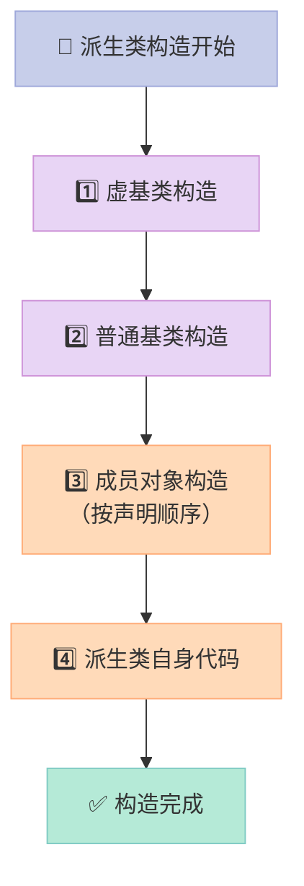
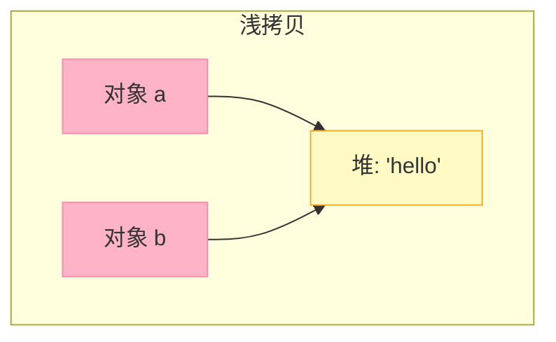
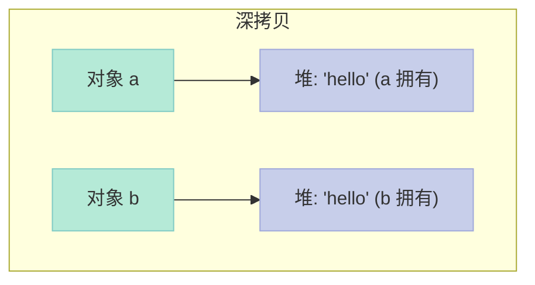
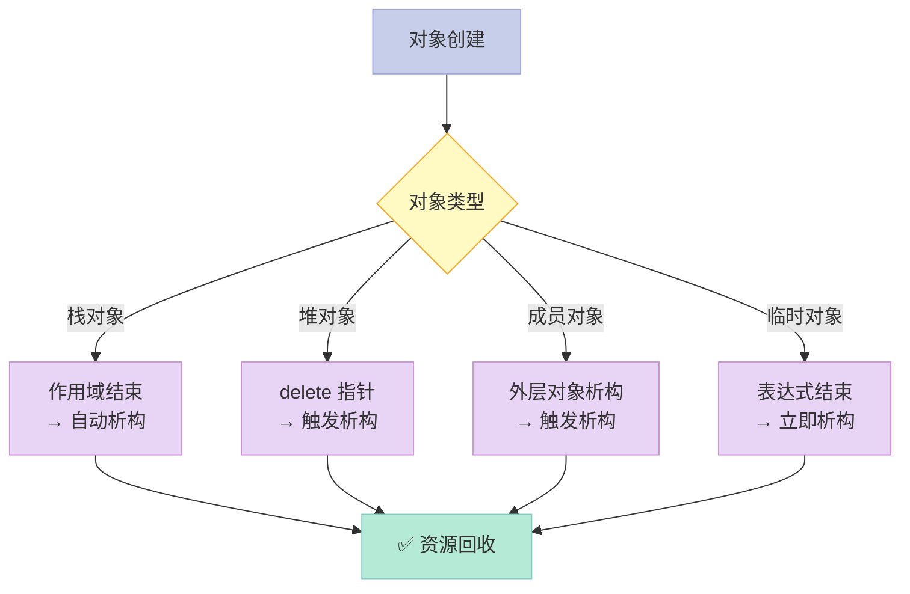
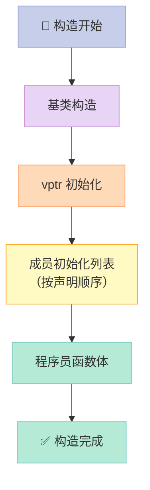
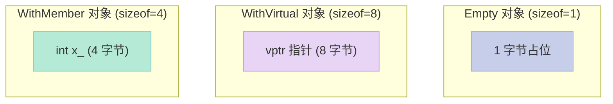
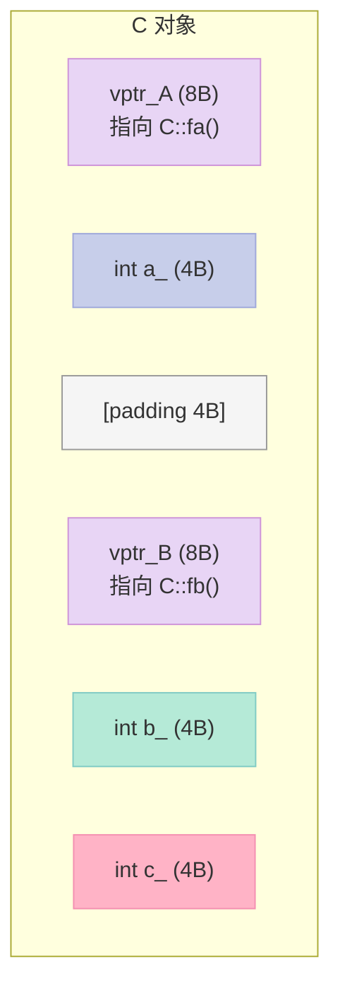

> **核心结论**：C++ 的"类与对象"模块是面试中区分初级与中高级工程师的**第一道分水岭**。拷贝构造函数为什么必须传引用、虚析构函数为什么不能省、空类为什么不是 0 字节、构造/析构函数中能不能调用虚函数——**这 4 道题答错率几乎 100%**。本文用 28 道真题 + 50+ 代码示例 + 30+ 对比表格 + 5 张马卡龙架构图，把这些坑一次性讲透。

---

## 前言：为什么这一篇值得你收藏？

很多候选人能答出"多态"和"虚函数表"，却在**类与对象**这个最基础的话题上翻车。原因很简单：**C++ 的类机制不是"设计"出来的，而是历史包袱层层叠加出来的**。拷贝构造、成员初始化列表、虚析构、this 指针、空类大小……每一项都对应着一段"当年为了兼容 C、为了效率、为了 RAII 而不得不做的妥协"。

读完本文你能得到：

- **理解** 构造函数、析构函数、拷贝构造、赋值运算符的**执行顺序**与**编译器扩展规则**
- **避免** `delete this`、拷贝递归、对象切片、二次释放等**实战深坑**
- **掌握** 成员初始化列表、虚析构、空类大小、this 指针本质等**面试高频考点**
- **看懂** C++ 对象模型（虚表指针位置、内存布局、空基类优化）

下面直接开讲。

---

## 一、构造与析构：执行顺序、虚析构、构造中调用虚函数

### 1.1 构造函数的执行顺序（题 22）

> 一句话总结：**先基类、后成员、再自己；先虚拟基类、后普通基类**。

```cpp
class A { public: A() { cout << "A "; } };
class B { public: B() { cout << "B "; } };
class C : public A {           // A 是基类
    B b_;                       // B 是成员对象
public:
    C() { cout << "C "; }
};

int main() {
    C c;   // 输出：A B C
}
```

输出顺序：`A B C`。**严格按"基类 → 成员对象 → 派生类自身"的顺序**。

#### 完整规则表

| 顺序 | 构造类型 | 说明 |
|------|----------|------|
| 1 | 虚基类构造函数 | 多个虚基类按**继承顺序**（左到右） |
| 2 | 普通基类构造函数 | 多个基类按**继承顺序** |
| 3 | 成员类对象构造函数 | 多个成员按**类内声明顺序**（与初始化列表无关！） |
| 4 | 派生类自身构造函数 | 最后执行 |

#### 一个反直觉的陷阱

```cpp
class C {
    string a_;  // 声明顺序：第 1 个
    string b_;  // 声明顺序：第 2 个
public:
    C() : b_("second"), a_("first") {}   // 初始化列表顺序无关！
};
```

**编译器按声明顺序初始化** `a_` 再 `b_`，**不是按初始化列表的书写顺序**。如果你在 `a_` 的初始化里偷偷依赖 `b_` 已经初始化，就会读到未定义的值。



### 1.2 析构函数的执行顺序（题 22）

> **析构顺序与构造严格相反**："自己 → 成员 → 基类"。

```cpp
class A { public: ~A() { cout << "~A "; } };
class B { public: ~B() { cout << "~B "; } };
class C : public A {
    B b_;
public:
    ~C() { cout << "~C "; }
};

int main() {
    C c;  // 输出：~C ~B ~A
}
```

| 阶段 | 析构顺序 |
|------|----------|
| 1 | 派生类自身析构函数体 |
| 2 | 成员类对象析构（**声明相反顺序**） |
| 3 | 普通基类析构（**继承相反顺序**） |
| 4 | 虚基类析构 |

#### 为什么要"反过来"？

因为派生类可能在自己的析构里**访问基类的成员**（如 `cout`），如果基类先析构，派生类析构体里访问基类成员就**踩空指针**。所以"先构造的后析构"是**栈式生命周期管理**的必然要求。

### 1.3 构造函数内部到底干了什么？（题 137、138）

编译器为**程序员编写的构造函数**默默插入 4 段代码，顺序严格如下：

```cpp
// 程序员写的
Derived::Derived(int x) : base_(x), member_(x * 2) {
    body_code_ = x;
}

// 编译器扩展后（伪代码）
Derived::Derived(int x) {
    // ① 虚基类构造
    VirtualBase::VirtualBase();

    // ② 上层基类构造
    Base::Base(x);

    // ③ vptr 初始化（指向 Derived 的 vtable）
    vptr_Derived = &Derived::vtable;

    // ④ 成员初始化列表（按声明顺序，不是按列表顺序）
    member_.Member(x * 2);  // 注意：先于 base_，但 base_ 在列表中更靠前

    // ⑤ 程序员写的函数体
    body_code_ = x;
}
```

> **关键点**：vptr 的设置**先于**用户代码，这样在构造函数体里调用虚函数时，虚表已经是当前类的（这是 C++ 的硬性规定，避免调用未构造的子类成员）。

### 1.4 析构函数被扩展的过程（题 136）

```cpp
// 程序员写的
Derived::~Derived() {
    free_resources();
}

// 编译器扩展后
Derived::~Derived() {
    // ① 程序员析构函数体
    free_resources();

    // ② 成员类对象析构（声明相反顺序）
    member_.~Member();

    // ③ vptr 重新设置（指向当前类的 vtable）
    vptr_Derived = &Derived::vtable;

    // ④ 直接非虚基类析构
    Base::~Base();

    // ⑤ 虚基类析构
    VirtualBase::~VirtualBase();
}
```

### 1.5 为什么构造函数不能是虚函数？（题 19）

**5 个独立理由，每条都成立**：

| # | 理由 | 详细说明 |
|---|------|----------|
| 1 | **vptr 还不存在** | vptr 是在构造函数中初始化的；构造函数自身未执行完，vptr 未设置，无法查 vtable |
| 2 | **类型必须确定** | 创建对象时必须明确类型（`new Derived`），根本不需要动态分派 |
| 3 | **没意义** | 虚函数是为了"用基类指针调用子类行为"，但创建对象时已经知道具体类型 |
| 4 | **vtbl 在构造后才建立** | 编译时编译器只为"当前类"生成 vtable，构造期间不知道后面是否有继承者 |
| 5 | **构造函数只执行一次** | 虚函数用于对象的"动态行为"，构造函数不是动态行为 |

```cpp
class Base {
public:
    virtual Base() {}  // ❌ 编译错误：构造函数不能是虚函数
};
```

### 1.6 析构函数为什么要虚函数？（题 19、23）

```cpp
// ❌ 错误：基类析构不是虚函数
class Base {
public:
    ~Base() { cout << "~Base "; }   // 没写 virtual
    virtual void fun() {}
};
class Derived : public Base {
    char* buf_;
public:
    Derived() { buf_ = new char[100]; }
    ~Derived() { delete[] buf_; cout << "~Derived "; }
};

int main() {
    Base* p = new Derived();
    delete p;   // ❌ 只调用 ~Base，~Derived 不会被调用，buf_ 泄漏！
}
```

输出：`~Base`（**`~Derived` 没了，100 字节泄漏**）。

```cpp
// ✅ 正确：基类析构声明为 virtual
class Base {
public:
    virtual ~Base() { cout << "~Base "; }
};
// delete p; 输出：~Derived ~Base
```

#### 虚析构函数的作用

| 场景 | 基类析构非虚 | 基类析构虚 |
|------|--------------|------------|
| `Base* p = new Derived(); delete p;` | ❌ 只调用 `~Base`，**子类资源泄漏** | ✅ 调用 `~Derived` 再 `~Base` |
| 普通栈对象 | 不影响 | 不影响 |
| 没有继承 | 不影响 | 略增一个 vptr 开销 |

> **黄金规则**：**任何用作多态基类的类，析构函数必须为 `virtual`**。

#### 纯虚析构函数也要实现

```cpp
class AbstractBase {
public:
    virtual ~AbstractBase() = 0;   // 纯虚析构
};
// ❌ 链接错误：纯虚析构函数必须提供定义
AbstractBase::~AbstractBase() {}   // ✅ 必须实现

// 原因：派生类析构函数会被编译器"扩展"，静态调用每一层基类的析构函数
// 缺一个会导致链接失败
```

### 1.7 构造函数、析构函数中可以调用虚函数吗？（题 21、24）

> **可以调用，但不发生动态绑定。** 调用的是"当前类"（构造时是基类、析构时也是基类）的版本。

```cpp
class Base {
public:
    Base() { fun(); }                  // 构造时调用
    virtual void fun() { cout << "Base "; }
    virtual ~Base() { fun(); }         // 析构时调用
};
class Derived : public Base {
public:
    Derived() { fun(); }               // 构造时调用
    void fun() override { cout << "Derived "; }
    ~Derived() { fun(); }              // 析构时调用
};

int main() {
    Derived d;
    // 输出：Base Base Derived Base
}
```

| 阶段 | 调用的版本 | 原因 |
|------|------------|------|
| 构造基类时 | `Base::fun` | 子类还没构造，vptr 指向 `Base` vtable |
| 构造子类时 | `Derived::fun` | 子类 vptr 已就位 |
| 析构子类时 | `Derived::fun` | 子类部分还没析构 |
| 析构基类时 | `Base::fun` | vptr 已被重设为 `Base` vtable |


> **最佳实践**：**永远不要**在构造/析构中调用虚函数。**用 `non-virtual` 命名（如 `Init` / `Cleanup`）** 让派生类显式覆盖。

### 1.8 构造函数、析构函数可否抛出异常？（题 25）

> **C++ 不禁止，但强烈不建议**。

#### 构造函数抛异常的"半成品"问题

```cpp
class Derived : public Base {
    char* buf_;
    A* a_;
    B* b_;
public:
    Derived() {
        a_ = new A();         // ✅ 已分配
        buf_ = new char[100]; // ✅ 已分配
        b_ = new B();         // ❌ 抛异常！
        // 控制权转出构造函数
    }
    // ❌ ~Derived 永远不会被调用！
    // ❌ a_、buf_ 泄漏！
};
```

**关键点**：

| 抛出异常的时机 | 行为 |
|----------------|------|
| 基类构造抛异常 | **不会**调用派生类析构、**不会**调用本类析构 |
| 成员对象构造抛异常 | **不会**调用本类析构 |
| 自身构造体抛异常 | 之前已构造的成员对象**会**被析构（栈展开） |

> **黄金规则**：构造函数抛异常时，**C++ 只析构"已经完成构造的子对象"**。所有裸指针、文件句柄、socket 都需要 RAII 包装（`std::unique_ptr` 等）来保证异常安全。

#### 析构函数抛异常的双重异常

```cpp
~Derived() {
    throw runtime_error("oops");  // ❌ 析构抛异常
}

int main() {
    Derived d;
    throw runtime_error("first");  // 栈展开时调用 ~Derived
    // 此时已有异常在飞，再抛一个 → terminate()！
}
```

**C++ 标准**：如果控制权基于异常离开析构函数，且**已有另一个异常在作用状态**，C++ 调用 `terminate()` 终止程序。

> **最佳实践**：**析构函数绝不抛异常**，用 `noexcept` 标记。

```cpp
~Derived() noexcept {       // ✅ 显式声明不抛异常
    try {
        cleanup();
    } catch (...) {
        // 吞掉异常或写入日志
    }
}
```

### 1.9 父类析构函数是否要设置为虚函数？（题 23 续）

| 场景 | 是否需要虚析构 | 原因 |
|------|----------------|------|
| 用作多态基类 | ✅ **必须** | 防止子类资源泄漏 |
| 不用作多态基类 | ❌ **不必** | 节省 vptr 空间 |
| `final` 类（无派生） | ❌ **不必** | 没有派生类 |
| 含纯虚函数的抽象基类 | ✅ **必须** | 派生类需要通过基类指针释放 |

---

## 二、拷贝控制：拷贝构造、深浅拷贝、delete this

### 2.1 浅拷贝 vs 深拷贝（题 13）

> **核心区别**：浅拷贝**拷贝指针的值**（两个对象指向同一块内存），深拷贝**拷贝指针指向的数据**（两个对象拥有独立内存）。

```cpp
// 浅拷贝（默认行为）
class ShallowString {
    char* data_;
    size_t len_;
public:
    ShallowString(const char* s) {
        len_ = strlen(s);
        data_ = new char[len_ + 1];
        memcpy(data_, s, len_ + 1);
    }
    // ❌ 没有自定义拷贝构造，编译器合成默认的
    // ShallowString(const ShallowString& other)
    //     : data_(other.data_), len_(other.len_) {}   // 浅拷贝！
    ~ShallowString() { delete[] data_; }
};

int main() {
    ShallowString a("hello");
    ShallowString b = a;   // 浅拷贝：b.data_ == a.data_
    // a.~ShallowString() 释放 data_
    // b.~ShallowString() 重复释放！💥 二次释放（double free）
}
```





#### 完整的深拷贝实现

```cpp
class DeepString {
    char* data_;
    size_t len_;
public:
    DeepString(const char* s) : len_(strlen(s)) {
        data_ = new char[len_ + 1];
        memcpy(data_, s, len_ + 1);
    }
    // ✅ 拷贝构造：深拷贝
    DeepString(const DeepString& other) : len_(other.len_) {
        data_ = new char[len_ + 1];                       // 申请新内存
        memcpy(data_, other.data_, len_ + 1);            // 拷贝内容
    }
    // ✅ 拷贝赋值：先释放旧资源
    DeepString& operator=(const DeepString& other) {
        if (this != &other) {                             // 自赋值检查
            char* new_data = new char[other.len_ + 1];    // 先申请新内存
            memcpy(new_data, other.data_, other.len_ + 1);
            delete[] data_;                               // 再释放旧内存
            data_ = new_data;
            len_ = other.len_;
        }
        return *this;
    }
    ~DeepString() { delete[] data_; }
};
```

#### 浅拷贝 vs 深拷贝对比

| 维度 | 浅拷贝 | 深拷贝 |
|------|--------|--------|
| **行为** | 拷贝指针值 | 拷贝指针指向的数据 |
| **共享内存** | ✅ 是 | ❌ 否 |
| **性能** | ⚡ 快（仅复制地址） | 🐢 慢（需分配+复制） |
| **修改独立性** | ❌ 一改全改 | ✅ 完全独立 |
| **析构风险** | 💥 二次释放 | ✅ 安全 |
| **适用场景** | 简单值类型（int、struct 内无指针） | 含指针成员、文件句柄、socket |
| **默认行为** | ✅ 编译器默认 | ❌ 需手动实现 |

#### 3 种特殊拷贝技术

| 技术 | 原理 | 适用场景 |
|------|------|----------|
| **写时复制（COW, Copy-On-Write）** | 浅拷贝共享内存，**第一次写时才真正复制** | 读多写少的字符串（`std::string` 早期实现） |
| **引用计数（Reference Counting）** | 多个对象共享内存，计数器为 0 时释放 | `std::shared_ptr` 早期实现 |
| **移动语义（Move Semantics）** | 转移所有权，不复制 | C++11 起的 `std::move` |

#### 写时复制示例

```cpp
class CowString {
    struct Rep {
        char* data_;
        int   ref_count_;
        Rep(const char* s) : ref_count_(1) {
            data_ = new char[strlen(s) + 1];
            strcpy(data_, s);
        }
        ~Rep() { delete[] data_; }
    };
    Rep* rep_;
public:
    CowString(const char* s) : rep_(new Rep(s)) {}
    CowString(const CowString& other) : rep_(other.rep_) {
        rep_->ref_count_++;                   // 共享同一份 Rep
    }
    ~CowString() {
        if (--rep_->ref_count_ == 0) delete rep_;
    }
    // 写时复制
    char& operator[](size_t i) {
        if (rep_->ref_count_ > 1) {           // 多个引用
            Rep* new_rep = new Rep(rep_->data_);  // 复制
            --rep_->ref_count_;
            rep_ = new_rep;
        }
        return rep_->data_[i];
    }
};
```

### 2.2 拷贝构造函数必须传引用（题 120）

> **答错率 100% 的经典题**。原因：**传值会引发无限递归**。

```cpp
class Foo {
    int x_;
public:
    // ❌ 错误：传值
    Foo(Foo f) : x_(f.x_) {                  // 形参 f 需要拷贝构造
    }                                          // 拷贝构造 Foo f 需要调用 Foo(Foo f)
};                                             // 无限递归！编译失败
```

**过程**：

1. 调用 `Foo b = a;`
2. 实参 `a` 传给形参 `f` → 调用拷贝构造 `Foo(Foo f)` 创建 `f`
3. 步骤 2 又需要创建形参 `f` → 再次调用拷贝构造
4. **无限递归**，栈溢出

```cpp
// ✅ 正确：传引用
class Foo {
    int x_;
public:
    Foo(const Foo& f) : x_(f.x_) {}           // 引用是别名，不创建新对象
    //        ↑ const 是为了防止修改原对象，也是惯例
};
```

#### 传值、传引用、传指针对比

| 传递方式 | 内置类型 | 类类型 | 拷贝构造调用 |
|----------|----------|--------|--------------|
| **值传递** `Foo f` | 直接拷贝 | 调拷贝构造创建形参 | ✅ 会调用（递归风险） |
| **引用传递** `Foo& f` | 传地址（4/8 字节） | 传地址，无新对象 | ❌ 不调用 |
| **指针传递** `Foo* f` | 传地址 | 传地址 | ❌ 不调用 |
| **const 引用** `const Foo& f` | 传地址 | 传地址，且禁止修改 | ❌ 不调用（**最佳实践**） |

### 2.3 拷贝构造函数 vs 赋值运算符

| 维度 | 拷贝构造 | 赋值运算 |
|------|----------|----------|
| **触发场景** | 用已有对象**初始化**新对象 | 用已有对象给**已存在**对象赋值 |
| **C++ 形式** | `Foo b = a;` / `Foo b(a);` | `b = a;`（b 已存在） |
| **函数签名** | `Foo(const Foo&)` | `Foo& operator=(const Foo&)` |
| **返回值** | 无 | `Foo&`（支持链式赋值） |
| **自赋值检查** | 不需要 | ✅ 必须（`if (this == &other)`） |
| **资源处理** | 直接申请新资源 | 必须先释放旧资源 |

```cpp
Foo a("hello");
Foo b = a;          // 拷贝构造
Foo c(a);           // 拷贝构造
b = a;              // 赋值运算（b 已存在）
```

### 2.4 `delete this` 的陷阱（题 103）

> **核心警告**：`delete this` 后，对象内存并未立即归还系统（可能仍可访问），但**任何访问 this 指针的操作都是未定义行为**。

```cpp
class SelfKiller {
    int* p_;
public:
    SelfKiller() { p_ = new int(42); }
    void kill() { delete this; }                 // 危险！
    void access() { cout << *p_ << endl; }       // UB！
};

int main() {
    SelfKiller* s = new SelfKiller();
    s->kill();                                   // 释放对象
    s->access();                                 // ❌ 访问已释放内存：UB
    // cout << *p_ → 段错误或随机值
}
```

#### 3 大问题

| # | 问题 | 解释 |
|---|------|------|
| 1 | **UB 行为** | 释放后访问数据成员/虚函数 → 不可预期 |
| 2 | **析构函数中 delete this → 无限递归** | `delete this` 调 `~SelfKiller`，析构又 `delete this` |
| 3 | **不可控的内存状态** | 操作系统不会立即回收，访问可能得到"看似正常"的脏数据 |

```cpp
// ❌ 析构中 delete this
~SelfKiller() {
    delete this;     // → 调用 ~SelfKiller() → 又 delete this → 栈溢出
}
```

#### 唯一合法场景：`placement new`

```cpp
// 引用计数模式：最后一个引用消失时自杀
class RefCounted {
    std::atomic<int> ref_count_;
public:
    void add_ref() { ref_count_++; }
    void release() {
        if (--ref_count_ == 0) {
            delete this;        // ✅ 合法的"自杀"
        }
    }
protected:
    virtual ~RefCounted() = default;  // 必须有虚析构
};
```

> **黄金规则**：
> 1. 析构函数中**绝不**调用 `delete this`（无限递归）
> 2. `delete this` 后**绝不**访问任何成员
> 3. 业务代码中**尽量避免** `delete this`（用 `std::shared_ptr` 替代）

### 2.5 什么情况会自动生成默认构造函数？（题 28）

> **默认构造函数不是"没有构造函数"时生成**，而是"**需要的时候才合成**"。

#### 4 种触发编译器合成默认构造函数的情况

| # | 情况 | 编译器行为 | 示例 |
|---|------|------------|------|
| 1 | 成员对象有默认构造 | 合成，调用成员的默认构造 | `class A { string s_; };` |
| 2 | 基类有默认构造 | 合成，调用基类的默认构造 | `class B : public Base {};` |
| 3 | 类有虚函数 | 合成，初始化 vptr | `class C { virtual void f(); };` |
| 4 | 类有虚基类 | 合成，处理虚基类偏移 | `class D : virtual Base {};` |

```cpp
// 情况 1：成员有默认构造
class StringHolder {
    string s_;   // string 有默认构造
    // ❌ 编译器自动合成 StringHolder()
    //     它内部调用 s_.string()
};

// 情况 2：基类有默认构造
class AnimalHolder : public Animal {
    // Animal 有默认构造 → 编译器合成 AnimalHolder()
};

// 情况 3：有虚函数
class Polymorphic {
    virtual void speak();   // 需要初始化 vptr → 合成默认构造
};

// 情况 4：有虚基类
class Diamond : virtual public Base {
    // 需要处理虚基类偏移 → 合成默认构造
};
```

> **关键陷阱**：合成的默认构造函数**只初始化基类子对象和成员类对象**，**其他非静态数据成员不会被初始化**（值不确定）。

```cpp
class Mixed {
    string s_;   // ✅ 被初始化（默认构造）
    int x_;      // ❌ 不被初始化（值不确定）
};
```

#### 5 种不会合成默认构造的情况

| 情况 | 结果 |
|------|------|
| 类已有任何构造函数 | ❌ 不会合成 |
| 没有任何成员、基类、虚函数 | ❌ 不会合成（但可调用 `T()` 不报错吗？） |
| 只有 POD 成员 | ❌ 不会合成 |
| 成员没有默认构造 | ❌ 不会合成（编译会报错，提示"无默认构造"） |
| 基类没有默认构造 | ❌ 不会合成（编译会报错） |

### 2.6 类什么时候会析构？（题 32）

> **3 个时机，缺一不可地触发析构**。

| 触发时机 | 示例 |
|----------|------|
| 1. 栈对象生命周期结束 | `Foo f;` 离开作用域时 |
| 2. `delete` 指向对象的指针 | `delete p;` / `delete[] arr;` |
| 3. 成员对象随外部对象析构 | `outer.member` 随 `outer` 析构 |

```cpp
{
    Foo f;              // 构造
}                       // 离开作用域 → ~Foo()

Foo* p = new Foo();
delete p;               // → ~Foo()

Container c;
c.member.foo();         // c 析构时 c.member.~Foo() 也会被调用
```



### 2.7 友元函数为什么必须在类内部声明？（题 33）

> **核心原因**：C++ 的访问控制模型要求**所有能访问私有成员的实体，必须在类的声明中显式列出**。

```cpp
class Matrix {
    friend std::ostream& operator<<(std::ostream&, const Matrix&);
    // ↑ 必须在此声明 friend
private:
    int data_[3][3];
};

// 类外定义（仍是 Matrix 的友元）
std::ostream& operator<<(std::ostream& os, const Matrix& m) {
    for (int i = 0; i < 3; i++) {
        for (int j = 0; j < 3; j++) os << m.data_[i][j] << " ";  // ✅ 可访问
        os << "\n";
    }
    return os;
}
```

#### 友元的 5 条规则

| # | 规则 |
|---|------|
| 1 | 友元**不是**类的成员函数 |
| 2 | 友元**不能**被继承 |
| 3 | 友元**不能**被传递（A 是 B 友元、B 是 C 友元 → A 不是 C 友元） |
| 4 | 友元关系是**单向**的 |
| 5 | 友元的访问范围**不受 public/private 限制** |

---

## 三、成员初始化列表 vs 函数体内赋值（题 17、18、135）

### 3.1 两种初始化方式

```cpp
class Widget {
    int   a_;
    const int b_;            // const 成员
    string& ref_;            // 引用成员
    Base   base_;            // 基类
    Member member_;          // 成员对象
public:
    // 方式 1：函数体内赋值
    Widget(int a, Base& b, Member& m) {
        a_ = a;
        b_ = 42;             // ❌ 编译错误：const 必须在初始化列表
        ref_ = b;            // ❌ 编译错误：引用必须在初始化列表
        base_ = b;           // ❌ 错误：先默认构造，再赋值
        member_ = m;         // ❌ 错误：先默认构造，再赋值
    }

    // 方式 2：成员初始化列表 ✅
    Widget(int a, Base& b, Member& m)
        : a_(a), b_(42), ref_(b), base_(b), member_(m) {
        // 函数体可以为空
    }
};
```

### 3.2 必须使用初始化列表的 4 种情况

| # | 情况 | 原因 |
|---|------|------|
| 1 | 初始化**引用**成员 | 引用必须在创建时绑定 |
| 2 | 初始化**const**成员 | const 必须在创建时初始化 |
| 3 | 调用**基类带参数的构造** | 基类没有默认构造时必须显式调用 |
| 4 | 调用**成员类带参数的构造** | 成员没有默认构造时必须显式调用 |

### 3.3 效率对比

```cpp
// 函数体内赋值（先默认构造，再赋值）—— 2 步
Widget() {
    member_ = Member(42);    // ① 默认构造 ② 赋值
}

// 初始化列表（直接构造）—— 1 步
Widget() : member_(42) {    // 直接用 42 构造
}
```

| 初始化方式 | 步骤数 | 性能 | 适用场景 |
|------------|--------|------|----------|
| 函数体内赋值 | 默认构造 + 赋值 | 🐢 **多一次临时对象** | 逻辑复杂、需要条件判断 |
| 成员初始化列表 | 直接构造 | ⚡ **更高效** | **绝大多数情况** |

> **最佳实践**：**永远优先使用成员初始化列表**。即使没有性能差异，代码也更清晰。

### 3.4 成员初始化列表的执行顺序

> **核心规则**：**按类中成员声明的顺序，不是按初始化列表的书写顺序**。

```cpp
class Tricky {
    string a_;
    string b_;
public:
    // ⚠️ 列表中 b_ 在前，但 a_ 先声明
    Tricky() : b_("second"), a_("b_+1") {  // 实际顺序：a_(b_+1), b_("second")
    }
};
```

#### 初始化列表的内部执行步骤

```cpp
// 程序员写的
Widget(int x) : base_(x), member_(x * 2), a_(x) {
    body_code_;
}

// 编译器扩展后
Widget(int x) {
    // ① 按声明顺序处理初始化列表
    base_.Base(x);              // 第一步
    member_.Member(x * 2);      // 第二步（注意：是 x*2，不是 base_ 之后才计算）
    a_ = x;                     // 第三步

    // ② 程序员函数体
    body_code_;
}
```



> **最佳实践**：**把初始化列表的书写顺序与声明顺序保持一致**，避免出现"前后依赖"导致的未定义行为。

---

## 四、this 指针：本质、栈变化、空类大小

### 4.1 this 指针的本质

> **this 是编译器隐式传递给非静态成员函数的"指向当前对象的指针"**。

```cpp
class Widget {
    int x_;
public:
    void set(int x) {
        this->x_ = x;          // 显式使用
    }
    // 编译器实际生成的代码
    // void set(Widget* this, int x) {
    //     this->x_ = x;
    // }
};
```

#### this 指针的 5 个特性

| # | 特性 | 说明 |
|---|------|------|
| 1 | **类型** | `T* const`（指向非常对象的常量指针） |
| 2 | **作用域** | 类的非静态成员函数内部 |
| 3 | **不能赋值** | `this = nullptr;` ❌ 编译错误 |
| 4 | **静态函数无 this** | 静态成员函数属于类，不属于对象 |
| 5 | **来源** | 由调用方（`obj.func()`）通过寄存器/栈传递 |

### 4.2 this 指针调用成员变量时堆栈变化（题 126）

```cpp
class Point {
    int x_, y_;
public:
    void set(int a, int b) {  // 编译后: void set(Point* this, int a, int b)
        x_ = a;                // this->x_ = a
        y_ = b;                // this->y_ = b
    }
};

int main() {
    Point p;
    p.set(10, 20);
}
```

#### 栈帧布局（x86 32 位）

```
高地址
+-----------------------+
| 返回地址              |
+-----------------------+
| this 指针             |  ← 调用方压入
+-----------------------+
| 参数 b = 20           |
+-----------------------+
| 参数 a = 10           |
+-----------------------+
| 旧栈帧（main 的）     |
低地址
```

#### 汇编验证

```bash
g++ -S -O0 point.cpp -o point.s
```

```asm
; p.set(10, 20) 调用
mov eax, [ebp-4]       ; 加载 p 的地址
push 20                ; 参数 b = 20
push 10                ; 参数 a = 10
push eax               ; this = &p
call _ZN5Point3setEi  ; call Point::set
```

> **结论**：`this` 第一个入栈，然后成员函数的参数从**右向左**入栈，最后是返回地址。

#### 成员变量访问过程

```cpp
void set(int a, int b) {
    x_ = a;   // 等价于: this->x_ = a
    // 编译为:
    // mov eax, [ebp+8]      ; eax = a
    // mov ecx, [ebp+12]     ; ecx = this
    // mov [ecx], eax         ; this->x_ = a
}
```

### 4.3 空类会默认添加哪些东西？（题 116）

> **空类并非"空空如也"**，编译器会悄悄塞 4 个特殊成员函数。

```cpp
class Empty {};    // 看似空，实际编译器合成了 4 个函数
```

| # | 函数 | 签名 | 默认实现 |
|---|------|------|----------|
| 1 | 默认构造 | `Empty();` | 空函数体 |
| 2 | 拷贝构造 | `Empty(const Empty&);` | 逐字节拷贝 |
| 3 | 析构函数 | `~Empty();` | 空函数体 |
| 4 | 拷贝赋值 | `Empty& operator=(const Empty&);` | 逐字节拷贝 |

#### 完整写法（等价于空类）

```cpp
class Empty {
public:
    Empty() {}                              // 默认构造
    Empty(const Empty& other) {}            // 拷贝构造
    ~Empty() {}                             // 析构函数
    Empty& operator=(const Empty& other) {
        return *this;                       // 拷贝赋值
    }
};
```

#### C++11 还可能添加的 2 个移动函数

| # | 函数 | 触发条件 |
|---|------|----------|
| 5 | 移动构造 | 用户没声明拷贝构造、拷贝赋值、移动赋值、析构 |
| 6 | 移动赋值 | 同上 |

### 4.4 空类的大小是多少？为什么？（题 121）

> **空类的大小 = 1 字节**（多数编译器）。**不是 0**。

```cpp
class Empty {};
sizeof(Empty);   // 1（VS、g++、clang）
sizeof(Empty[10]); // 10
```

#### 为什么不能是 0？

**C++ 标准规定**：**不同对象必须具有不同的地址**。如果 `sizeof(Empty) == 0`，那么 `Empty e1, e2;` 的地址相同，违反标准。

```cpp
Empty e1, e2;
assert(&e1 != &e2);   // 标准要求地址不同
```

#### 各种"空类变体"的大小

```cpp
class Empty {};                      // 1
class WithVirtual { virtual void f(); };  // 8（32位）/ 8（64位）：vptr
class WithMember { int x_; };        // 4
class WithStatic { static int x_; }; // 1（静态成员不占对象空间）
class WithInherit : public Empty {}; // 1（空基类优化 EBO）
class WithTwo : public Empty, public Empty2 {};  // 1（EBO 适用）
```

| 类类型 | `sizeof` | 原因 |
|--------|----------|------|
| `Empty` | 1 | 唯一地址 |
| `WithVirtual` | 8 | vptr 指针 |
| `WithMember { int x_; }` | 4 | 一个 int |
| `WithStatic { static int x_; }` | 1 | 静态成员不占对象空间 |
| `Derived : public Empty` | 1 | **空基类优化（EBO）** |



#### 4 大影响对象大小的因素（题 131）

| # | 因素 | 说明 |
|---|------|------|
| 1 | 非静态成员变量 | 静态成员不占空间 |
| 2 | 内存对齐 | 编译器按 4/8 字节对齐 |
| 3 | 虚函数 | 添加 vptr 指针 |
| 4 | 继承的基类 | 基类成员也占空间（EBO 例外） |

### 4.5 虚表指针（vptr）的位置

> **vptr 位于对象内存的起始位置**（多数编译器；Itanium ABI 标准）。

```cpp
class Base {
    int a_;
    virtual void fun();
};
class Derived : public Base {
    int b_;
    void fun() override;
};
```

#### 对象内存布局


#### 多继承 + 虚基类的复杂布局

```cpp
class A { virtual void fa(); int a_; };
class B { virtual void fb(); int b_; };
class C : public A, public B {
    int c_;
    void fa() override;
    void fb() override;
};
```

`C` 对象内存布局：

```
[vptr_A] [a_] [vptr_B] [b_] [c_]   (32 字节，含 padding)
```

> 每个有虚函数的基类贡献一个 vptr。

---

## 五、禁止类被实例化、禁止拷贝（题 147、148）

### 5.1 阻止类被实例化的 3 种方法（题 147）

| # | 方法 | 实现 | 适用场景 |
|---|------|------|----------|
| 1 | **抽象基类** | 包含纯虚函数 | 需要派生类实现的接口 |
| 2 | **private 构造函数** | 构造函数声明为 `private` | **静态工厂方法**模式 |
| 3 | **protected 构造函数** | 构造函数声明为 `protected` | **基类禁止直接实例化** |

#### 方法 1：抽象基类

```cpp
class AbstractBase {
public:
    virtual void func() = 0;      // 纯虚函数
    virtual ~AbstractBase() {}
};

// AbstractBase a;  // ❌ 编译错误：不能实例化抽象类
class Derived : public AbstractBase {
public:
    void func() override {}
};
Derived d;                        // ✅ 合法
```

#### 方法 2：private 构造函数（静态分配场景）

```cpp
class OnlyStatic {
    OnlyStatic() = default;
public:
    // ❌ 错误：new 创建
    // OnlyStatic* p = new OnlyStatic();
    // ✅ 正确：栈对象
    static OnlyStatic create() {
        return OnlyStatic();      // 静态方法可访问 private 构造
    }
};
```

#### 方法 3：protected 构造函数（基类禁止实例化）

```cpp
class NonInstantiable {
protected:
    NonInstantiable() = default;
public:
    virtual void init() = 0;       // 派生类必须实现
};

// NonInstantiable n;  // ❌ 错误：构造函数 protected
class Real : public NonInstantiable {
public:
    Real() : NonInstantiable() {}  // 派生类可访问 protected 构造
    void init() override {}
};
```

#### 何时把构造函数声明为 private？

| 场景 | 原因 |
|------|------|
| **单例模式** | 防止外部 `new`，由静态方法控制唯一实例 |
| **静态工厂** | 用静态方法封装构造逻辑 |
| **禁止拷贝** | 同时声明 `拷贝构造 = delete` |
| **命名空间式工具类** | 只提供静态方法，不应有实例 |

### 5.2 禁止自动生成拷贝构造函数的 3 种方法（题 148）

| # | 方法 | 实现 | 优缺点 |
|---|------|------|--------|
| 1 | **`= delete`** | `Foo(const Foo&) = delete;` | ✅ C++11 最佳实践 |
| 2 | **声明为 private** | `private: Foo(const Foo&);` | 友元仍可访问 |
| 3 | **基类继承** | 私有基类的拷贝构造 | 阻止派生类合成 |

#### 方法 1：`= delete`（C++11 推荐）

```cpp
class NonCopyable {
public:
    NonCopyable() = default;
    NonCopyable(const NonCopyable&) = delete;              // 禁止拷贝构造
    NonCopyable& operator=(const NonCopyable&) = delete;   // 禁止拷贝赋值
};

// NonCopyable a, b;
// NonCopyable c = a;   // ❌ 编译错误
// b = a;               // ❌ 编译错误
```

#### 方法 2：private 声明（兼容 C++03）

```cpp
class NonCopyable {
private:
    NonCopyable(const NonCopyable&);              // 只声明不定义
    NonCopyable& operator=(const NonCopyable&);
public:
    NonCopyable() = default;
};
// 外部调用 → 编译错误
// 成员/友元调用 → 链接错误（未定义）
```

#### 方法 3：基类技巧

```cpp
class Uncopyable {
private:
    Uncopyable(const Uncopyable&);
    Uncopyable& operator=(const Uncopyable&);
protected:
    Uncopyable() = default;
    ~Uncopyable() = default;
};
// 派生类不再合成拷贝构造（基类的 private 拷贝构造不可访问）
class MyClass : private Uncopyable {
    // ❌ MyClass 不会有合成的拷贝构造
    // ❌ MyClass 也不能拷贝
};
```

#### 完整禁止拷贝工具类

```cpp
class NonCopyable {
protected:
    constexpr NonCopyable() = default;
    ~NonCopyable() = default;
public:
    NonCopyable(const NonCopyable&) = delete;
    NonCopyable& operator=(const NonCopyable&) = delete;
    NonCopyable(NonCopyable&&) = delete;             // 禁止移动（C++11）
    NonCopyable& operator=(NonCopyable&&) = delete;
};
```

> **最佳实践**：C++11 后**直接用 `= delete`**，比 private 技巧更清晰、更安全。

---

## 六、类作为基类：定义 vs 声明（题 27）

> **核心规则**：**如果类要作为基类，必须提供完整的定义，不能仅前向声明**。

```cpp
class Base;             // ❌ 前向声明
class Derived : public Base {};  // ❌ 编译错误

class Base {            // ✅ 必须有完整定义
    void func() {}
};
class Derived : public Base {};  // ✅ 合法
```

#### 原因

| # | 原因 | 详细说明 |
|---|------|----------|
| 1 | **派生类要访问基类成员** | 必须知道基类有哪些成员（数据布局、方法签名） |
| 2 | **计算对象大小** | 派生类大小 = 基类大小 + 自己的成员 |
| 3 | **构造/析构顺序** | 编译器需要生成基类构造/析构的调用代码 |
| 4 | **虚表继承** | 派生类 vtable 需要合并基类的虚函数 |

#### 例外：使用 PIMPL / 抽象接口

```cpp
// Interface.h
class IInterface {
public:
    virtual ~IInterface() = 0;
    virtual void func() = 0;
};

// Impl.h（实现类的头文件才需要包含完整定义）
class Impl;  // 只能在前向声明中使用指针
void use(IInterface* p);  // ✅ 合法：基类接口完整定义
```

---

## 七、C++ 对象模型深度解析

### 7.1 编译器为类默认生成的"Big 4"（或"Big 5"）

| # | 函数 | C++98 合成条件 | C++11 额外补充 |
|---|------|----------------|----------------|
| 1 | 默认构造 | 用户没声明任何构造 | — |
| 2 | 析构函数 | 用户没声明析构 | — |
| 3 | 拷贝构造 | 用户没声明拷贝构造 | — |
| 4 | 拷贝赋值 | 用户没声明拷贝赋值 | — |
| 5 | 移动构造 | 用户没声明 拷贝构造/拷贝赋值/移动构造/移动赋值/析构 | C++11 新增 |
| 6 | 移动赋值 | 同上 | C++11 新增 |

> **Rule of Zero**：如果你的类不需要自定义析构/拷贝/移动，**就让编译器合成**。

> **Rule of Three**：如果你自定义了**析构、拷贝构造、拷贝赋值**中的任何一个，**通常要同时自定义其他两个**。

> **Rule of Five**：C++11 加上**移动构造、移动赋值**。

### 7.2 派生类的内存布局（多重继承）

```cpp
class A { int a_; virtual void fa(); };
class B { int b_; virtual void fb(); };
class C : public A, public B {
    int c_;
    void fa() override;
    void fb() override;
};
```



### 7.3 this 指针调整（多继承时）

```cpp
class A { int a_; };
class B { int b_; };
class C : public A, public B {};

B* p = new C();   // this 指针要调整！&C != (B*)&C
// p 实际指向 C 对象中 B 子对象的起始地址
```

### 7.4 虚继承（菱形继承）的复杂性

```cpp
class A { int a_; };
class B : virtual public A { int b_; };
class C : virtual public A { int c_; };
class D : public B, public C { int d_; };
```

`D` 对象布局：

```
[vptr_B] [b_] [vptr_C] [c_] [vptr_A] [a_] [d_]
```

> 虚继承通过 **虚基类表（vbtable）** 解决菱形问题，性能有损耗。

---

## 八、完整对比表汇总

### 8.1 构造函数 vs 析构函数

| 维度 | 构造函数 | 析构函数 |
|------|----------|----------|
| 触发时机 | 对象创建 | 对象销毁 |
| 函数名 | 类名 | `~类名` |
| 能否重载 | ✅ 可重载（多种构造方式） | ❌ 只能有一个 |
| 能否为虚 | ❌ 不能 | ✅ **多态基类必须为虚** |
| 能否抛异常 | ⚠️ 可能导致半成品对象 | ❌ 禁止（双重异常 → terminate） |
| 能否调用虚函数 | ⚠️ 不发生动态绑定 | ⚠️ 不发生动态绑定 |
| 默认生成 | 用户无构造时（4 种情况） | 用户无析构时 |
| 主要工作 | 初始化成员、设置 vptr | 释放资源、重设 vptr |

### 8.2 拷贝构造 vs 赋值运算

| 维度 | 拷贝构造 | 赋值运算 |
|------|----------|----------|
| 函数签名 | `T(const T&)` | `T& operator=(const T&)` |
| 触发场景 | 初始化新对象 | 给已存在对象赋值 |
| 自赋值检查 | 不需要 | ✅ 必须 |
| 资源处理 | 直接申请新资源 | 先释放旧资源 |
| 返回值 | 无 | `T&`（支持链式） |

### 8.3 浅拷贝 vs 深拷贝 vs 移动语义

| 维度 | 浅拷贝 | 深拷贝 | 移动语义 |
|------|--------|--------|----------|
| 内存共享 | ✅ | ❌ | ❌ |
| 性能 | ⚡ 最快 | 🐢 慢 | ⚡ 几乎零成本 |
| 源对象 | 保持有效 | 保持有效 | **置空**（所有权转移） |
| 多次析构 | ❌ 危险 | ✅ 安全 | ✅ 安全 |
| 适用 | 值类型 POD | 拥有资源 | 临时对象、独占资源 |

### 8.4 4 种对象存储区域

| 区域 | 分配方式 | 生命周期 | 释放方式 |
|------|----------|----------|----------|
| **栈** | `Foo f;` | 作用域结束 | 自动 |
| **堆** | `new Foo();` | 手动控制 | `delete` |
| **全局/静态** | `static Foo f;` | 程序结束 | 自动 |
| **线程局部** | `thread_local Foo f;` | 线程结束 | 自动 |

### 8.5 5 种特殊成员函数

| 函数 | 默认行为 | 何时需要自定义 |
|------|----------|----------------|
| 默认构造 | 调用成员/基类的默认构造 | 成员需要特殊初始化 |
| 拷贝构造 | 浅拷贝 | 含指针/资源时需深拷贝 |
| 拷贝赋值 | 浅拷贝 | 同上 |
| 移动构造 | 移动（C++11） | 含资源且想优化 |
| 移动赋值 | 移动（C++11） | 同上 |
| 析构函数 | 释放自身 | 含资源时需手动释放 |

### 8.6 禁止类被实例化的 3 种方法

| 方法 | 实现 | 限制 |
|------|------|------|
| 抽象基类 | 纯虚函数 | 仍可被继承后实例化 |
| private 构造 | `private: Foo();` | 友元仍可访问 |
| protected 构造 | `protected: Foo();` | 派生类可访问 |

### 8.7 禁止拷贝的 3 种方法

| 方法 | C++ 版本 | 推荐度 |
|------|----------|--------|
| `= delete` | C++11 | ⭐⭐⭐⭐⭐ |
| private 不定义 | C++98 | ⭐⭐⭐ |
| 基类 private | 兼容 C++98 | ⭐⭐ |

### 8.8 编译器会合成默认构造的 4 种情况

| # | 触发条件 | 编译器行为 |
|---|----------|------------|
| 1 | 成员有默认构造 | 调用成员默认构造 |
| 2 | 基类有默认构造 | 调用基类默认构造 |
| 3 | 类有虚函数 | 初始化 vptr |
| 4 | 类有虚基类 | 处理虚基类偏移 |

### 8.9 构造/析构中调虚函数对比

| 阶段 | vptr 指向 | 调用版本 |
|------|-----------|----------|
| 基类构造中 | Base vtable | Base::fun |
| 派生类构造中 | Derived vtable | Derived::fun |
| 派生类析构中 | Derived vtable | Derived::fun |
| 基类析构中 | Base vtable | Base::fun |

### 8.10 各种类的大小对比

| 类 | 成员 | 虚函数 | sizeof |
|----|------|--------|--------|
| `Empty` | 无 | 无 | 1 |
| `WithInt` | `int` | 无 | 4 |
| `WithVirtual` | 无 | 有 | 8（vptr） |
| `WithTwoInts` | `int, int` | 无 | 8 |
| `Derived : Empty` | 无 | 无 | 1（EBO） |
| `Derived : WithVirtual` | `int` | 有 | 16（vptr + int + padding） |

---

## 九、实战踩坑：7 大常见 Bug

### 9.1 Bug 1：忘记虚析构导致内存泄漏

```cpp
class Base {
public:
    ~Base() { cout << "~Base\n"; }       // ❌ 非虚
};
class Derived : public Base {
    char* buf_;
public:
    Derived() { buf_ = new char[100]; }
    ~Derived() { delete[] buf_; }
};
Base* p = new Derived();
delete p;                                 // ❌ 泄漏 100 字节
```

**修复**：

```cpp
class Base {
public:
    virtual ~Base() { cout << "~Base\n"; }   // ✅ 虚析构
};
```

### 9.2 Bug 2：拷贝构造传值导致编译失败

```cpp
class Widget {
    int x_;
public:
    Widget(Widget w) : x_(w.x_) {}        // ❌ 无限递归
};
Widget a;
Widget b(a);                              // ❌ 编译错误
```

**修复**：

```cpp
Widget(const Widget& w) : x_(w.x_) {}   // ✅ 传引用
```

### 9.3 Bug 3：成员初始化顺序错误

```cpp
class Tricky {
    int a_;
    int b_;
public:
    Tricky() : b_(10), a_(b_) {}          // ❌ a_ 依赖 b_ 时 b_ 未初始化
};
```

**修复**：

```cpp
Tricky() : a_(0), b_(10) {}              // ✅ 显式初始化 a_
```

或调整声明顺序。

### 9.4 Bug 4：构造函数抛异常导致资源泄漏

```cpp
class Widget {
    int* p1_;
    int* p2_;
public:
    Widget() {
        p1_ = new int(1);
        p2_ = new int(2);                 // ❌ 假设这里抛异常
        // p1_ 永远不会被释放
    }
};
```

**修复（用 RAII）**：

```cpp
class Widget {
    std::unique_ptr<int> p1_;
    std::unique_ptr<int> p2_;
public:
    Widget() : p1_(new int(1)), p2_(new int(2)) {}
    // 异常时 unique_ptr 自动释放
};
```

### 9.5 Bug 5：析构函数中调用 `delete this`

```cpp
~Widget() {
    delete this;                          // ❌ 无限递归
}
```

**修复**：用 `std::shared_ptr` 或 `std::unique_ptr`。

### 9.6 Bug 6：基类析构是纯虚函数但未实现

```cpp
class Base {
public:
    virtual ~Base() = 0;                  // 纯虚
};
// 链接错误：未实现 ~Base()
```

**修复**：

```cpp
class Base {
public:
    virtual ~Base() = 0;
};
inline Base::~Base() {}                   // ✅ 必须有定义
```

### 9.7 Bug 7：浅拷贝导致 double free

```cpp
class String {
    char* data_;
public:
    String(const char* s) {
        data_ = new char[strlen(s) + 1];
        strcpy(data_, s);
    }
    // ❌ 没有自定义拷贝构造
    ~String() { delete[] data_; }
};
String a("hello");
String b = a;                             // 浅拷贝
// a.~String() 释放 data_
// b.~String() 重复释放 💥
```

**修复**：实现深拷贝的拷贝构造（或用 `std::string`）。

---

## 十、面试实战：10 道高频追问

### Q1：构造/析构中调用虚函数到底调到哪一版？

**答**：调到"当前正在构造/析构的类"的版本（vptr 在构造时被设置为当前类的 vtable，析构时被重设）。

### Q2：拷贝构造函数的形参能不能去掉 `const`？

**答**：能，但**强烈不建议**。`const` 是为了：
- 防止意外修改源对象
- 支持 const 对象作为实参
- 表达"这是只读拷贝"的语义

### Q3：析构函数能不能重载？

**答**：**不能**。析构函数无参数，每个类只能有一个。

### Q4：哪些函数不能是虚函数？

| 函数 | 原因 |
|------|------|
| 构造函数 | vptr 还不存在 |
| 静态函数 | 无 this 指针 |
| 内联函数 | 编译期替换 vs 运行期绑定 |
| 友元函数 | 不属于类成员 |
| 普通函数 | 不属于类成员 |

### Q5：基类的构造函数能被继承吗？

**答**：**不能被继承**，但**派生类构造函数会调用基类构造函数**。C++11 的 `using Base::Base;` 可以让派生类"继承"基类构造函数（实际上是为派生类生成对应的转发构造函数）。

### Q6：移动构造和拷贝构造的区别？

| 维度 | 拷贝构造 | 移动构造 |
|------|----------|----------|
| 参数 | `const T&` | `T&&` |
| 源对象 | 保持有效 | **置空**（所有权转移） |
| 性能 | 深拷贝，慢 | 几乎零成本 |
| 触发 | 左值初始化 | 临时对象（右值） |

### Q7：空类数组的大小？

```cpp
Empty arr[10];
sizeof(arr);    // 10（10 * 1）
```

### Q8：基类没有默认构造，派生类必须做什么？

**答**：派生类构造函数必须**显式调用基类的带参构造**：

```cpp
class Base {
public:
    Base(int x) {}
};
class Derived : public Base {
public:
    Derived() : Base(42) {}      // ✅ 必须显式调用
};
```

### Q9：虚基类的作用？

**答**：解决**菱形继承**中的二义性：

```cpp
class A { int a_; };
class B : virtual public A {};       // 虚继承
class C : virtual public A {};
class D : public B, public C {};     // D 中只有一份 A
```

### Q10：如何实现"只能在栈上"或"只能在堆上"的对象？

**只在栈上**：把 `operator new` 声明为 `private`。

**只在堆上**：把构造/析构函数声明为 `protected`（防止栈上构造）。

---

## 十一、思考题（自测掌握度）

1. **下题的输出是什么？**

   ```cpp
   struct A { A() { cout << "A"; } ~A() { cout << "~A"; } };
   struct B : A { B() { cout << "B"; } ~B() { cout << "~B"; } };
   int main() { B b; }
   ```

2. **下题有什么问题？**

   ```cpp
   class Base {
   public:
       Base(int x) : x_(x) {}
   private:
       int x_;
   };
   class Derived : public Base {
       int y_;
   public:
       Derived() : y_(0) {}                  // 编译是否通过？
   };
   ```

3. **解释空基类优化（EBO）：为什么 `sizeof(Derived) == 1`？**

4. **为什么拷贝构造函数的形参推荐是 `const T&` 而不是 `T&`？**

5. **`std::vector` 的 `push_back` 在容量不足时，会"移动"还是"拷贝"已有元素？**

---

## 十二、参考资源

- 《C++ Primer》 第 5 版，13-15 章
- 《Effective C++》 第 3 版，Item 5、6、7、8、17、18
- 《深度探索 C++ 对象模型》（Inside the C++ Object Model）—— Stanley B. Lippman
- [cppreference: Special member functions](https://en.cppreference.com/w/cpp/language/classes)
- [Itanium C++ ABI](https://itanium-cxx-abi.github.io/cxx-abi/abi.html)

---

## 系列导航

> 「C++ 面试题集锦」系列共 16 篇，覆盖 C++ 核心知识、面向对象、模板、内存管理、STL、并发、系统编程等所有高频考点。

| 篇数 | 标题 | 链接 |
|------|------|------|
| 第 1 篇 | 基础语法与编译原理 | [cpp-interview-01-basics.md](#) |
| 第 2 篇 | 关键字与控制流 | [cpp-interview-02-keywords.md](#) |
| **第 3 篇** | **类与对象：构造、析构、拷贝与 this 指针的 28 个坑** | **本文** |
| 第 4 篇 | 继承与多态：虚函数、虚表、对象切片 | [cpp-interview-04-inheritance.md](#) |
| 第 5 篇 | 运算符重载与类型转换 | [cpp-interview-05-operator.md](#) |
| 第 6 篇 | 模板与泛型编程 | [cpp-interview-06-template.md](#) |
| 第 7 篇 | 内存管理与智能指针 | [cpp-interview-07-memory.md](#) |
| 第 8 篇 | 移动语义与完美转发 | [cpp-interview-08-move.md](#) |
| 第 9 篇 | STL 容器与算法 | [cpp-interview-09-stl.md](#) |
| 第 10 篇 | 异常处理与错误码 | [cpp-interview-10-exception.md](#) |
| 第 11 篇 | 并发编程：线程、锁、原子操作 | [cpp-interview-11-concurrency.md](#) |
| 第 12 篇 | C++11/14/17/20 新特性 | [cpp-interview-12-modern.md](#) |
| 第 13 篇 | 编译链接与 ABI | [cpp-interview-13-compile.md](#) |
| 第 14 篇 | 性能优化与调试 | [cpp-interview-14-performance.md](#) |
| 第 15 篇 | Linux 系统编程 | [cpp-interview-15-linux.md](#) |
| 第 16 篇 | 综合面试题与 Offer 复盘 | [cpp-interview-16-offer.md](#) |

---

> **最后一句话**：类与对象是 C++ 的"地基层"。构造函数/析构函数的执行顺序、虚析构的必要性、拷贝构造的传引用本质——这些**不是"知识点"，而是"踩过的坑"**。把它们讲清楚，比把模板元编程背下来值钱得多。

> **行动建议**：
> 1. 立即用本文给的 `Empty e1, e2;` 在你的编译器上跑一下 `sizeof`，验证空类大小
> 2. 翻出你项目里的基类，检查析构函数是否标了 `virtual`
> 3. 给 `delete this` 这样的危险代码加 `static_assert` 或注释警告
