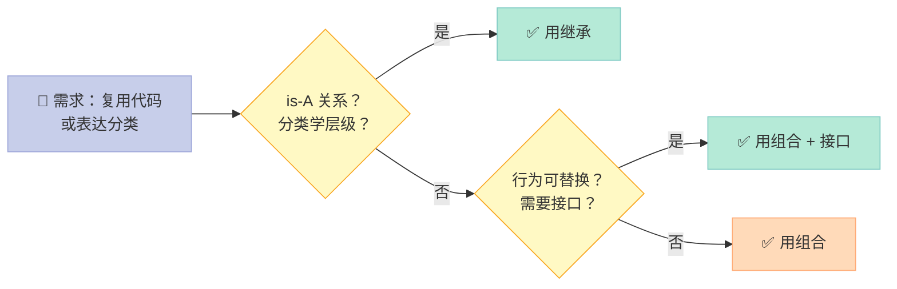
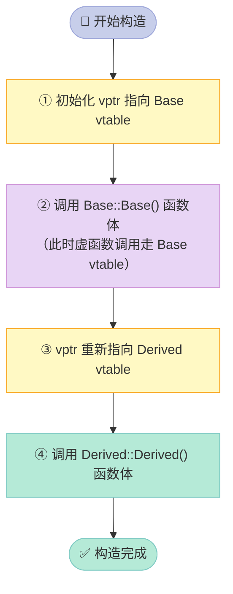
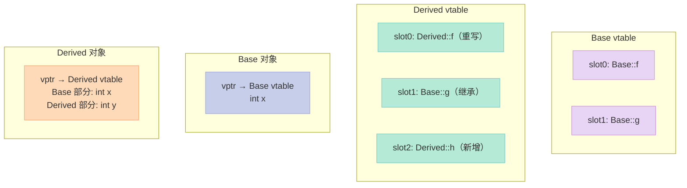
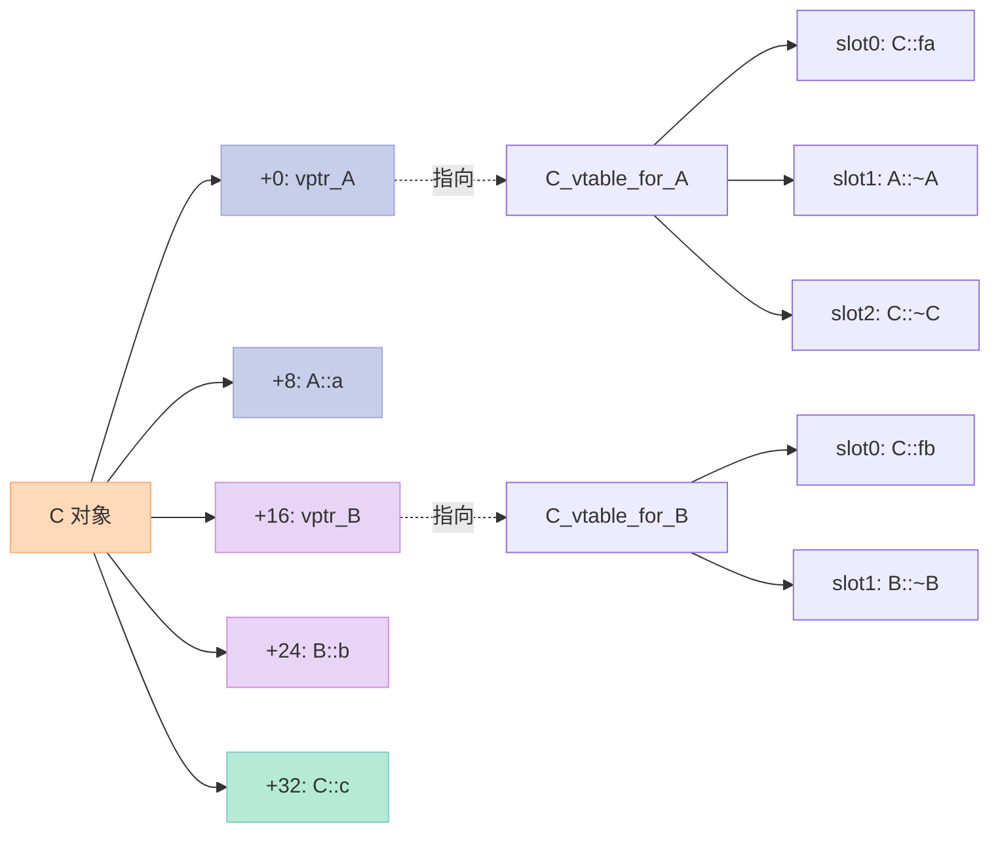
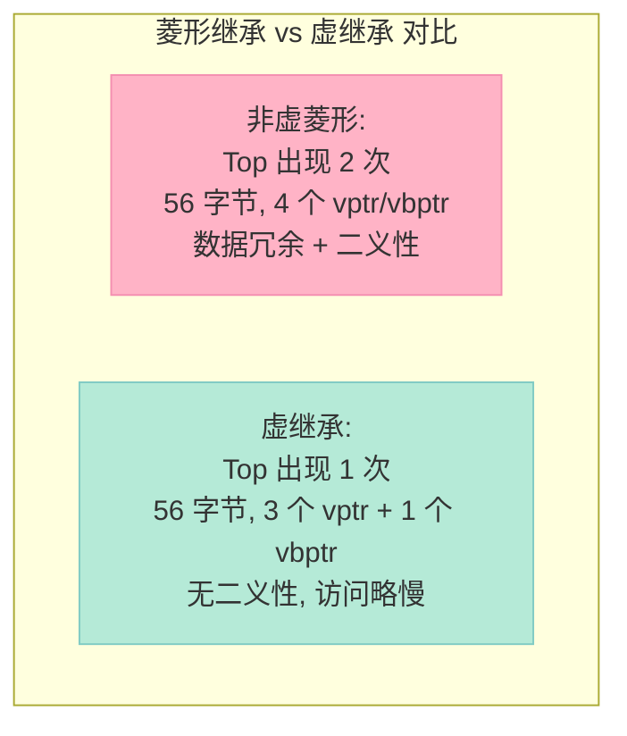
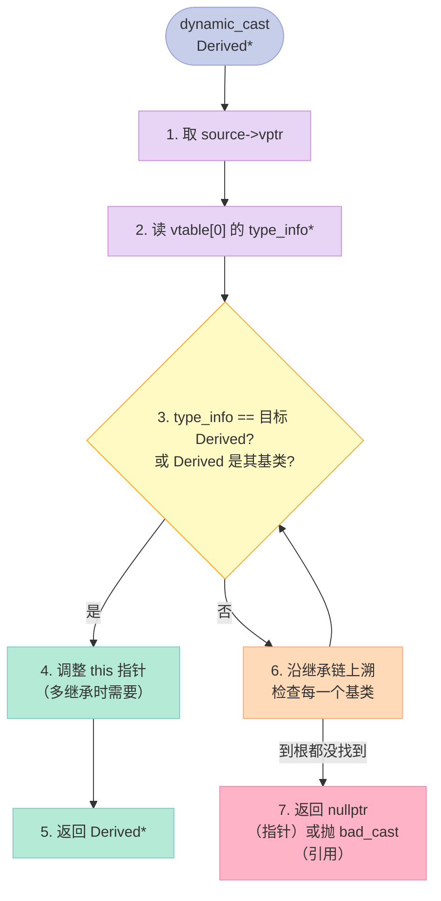
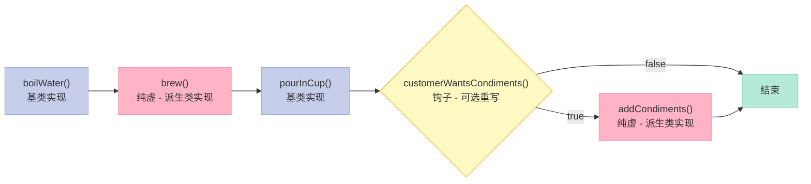

> **一句话核心结论**：C++ 的动态多态本质上是一个 **"对象持指针 vptr，vptr 指向类的虚函数表 vtable，调用时通过 vptr[vtable_index] 间接跳转"** 的三层寻址机制。这个机制带来灵活性的同时，也付出了**对象体积膨胀、阻止 inline、间接调用损失分支预测**三大代价——理解它，就是理解 C++ 面向对象的底层真相。

---

## 前言：为什么 C++ 的多态要靠虚函数表？代价是什么？

打开任何一份 C++ 面试题，"虚函数"几乎必考。但很多同学背完"vptr + vtable"之后，依然会在实际工程里犯三类错：

1. **析构函数忘了加 virtual**，导致派生类内存泄漏；
2. **构造函数/析构函数里调用虚函数**，以为有动态绑定，结果只调到基类版本；
3. **菱形继承**出现二义性，不知道该用作用域运算符还是虚继承。

这一篇**不是简单复述概念**，而是从**内存布局**、**汇编表现**、**编译器实现**三个角度，把 C++ 继承与多态的真相完整拆开。读完你将能：

- 在白板上画出**单继承、多继承、菱形继承、虚继承**四种内存布局；
- 解释为什么**构造函数不能是虚函数、析构函数应该设为虚函数**；
- 用 `dynamic_cast` 安全地做向下转型；
- 估算一个含 N 个虚函数的类**多付出的内存与性能成本**；
- 在工程中**正确使用模板方法、协变返回类型、抽象基类**。

我们从**类与类之间的关系**讲起，一步步逼近动态多态的本质。

---

## 一、类与类之间的三种关系

设计一个类时，"**这个类和其他类是什么关系**"是第一个要回答的问题。C++ 里有三种关系，每一种都对应不同的代码结构：

| 关系 | 英文 | 含义 | 实现方式 |
|------|------|------|----------|
| **包含/组合** | has-A | "我有一个" | A 类**包含** B 类对象作为成员 |
| **使用/依赖** | use-A | "我用一下" | A 类**调用** B 类（友元/参数） |
| **继承** | is-A | "我是一个" | A 类**派生自** B 类（`class A : public B`） |

```cpp
// has-A：组合
class Engine { /* ... */ };
class Car {
    Engine engine_;  // 组合：Car has-a Engine
};

// is-A：继承
class Animal { /* ... */ };
class Dog : public Animal { /* ... */ };  // Dog is-a Animal
```

### 1.1 继承的核心语义

> **继承的本质**：子类拥有父类的所有属性和方法（除了构造/析构/operator=），子类可以**新增**属性和方法，**重写**父类方法。

注意三点：

- **子类对象可以当父类对象使用**（向上转型 `upcast` 永远安全）；
- 父类内部细节对子类**可见**（protected/public 成员）；
- 继承是**编译期**就确定的强耦合关系。

### 1.2 组合的核心语义

> **组合的本质**：在一个类里**内嵌**另一个类的对象作为自己的成员变量。组合类不"继承"被包含类的接口，只是"持有"它。

```cpp
class Address {
    std::string city_;
    std::string street_;
public:
    Address(const std::string& c, const std::string& s)
        : city_(c), street_(s) {}
};

class Person {
    std::string name_;
    Address addr_;  // 组合：Person has-a Address
public:
    Person(const std::string& n, const Address& a)
        : name_(n), addr_(a) {}  // 委托构造
};
```

### 1.3 组合与继承的对比

这是面试的**超高频题**（题 37）。一张表说清楚：

| 维度 | 继承（is-A） | 组合（has-A） |
|------|--------------|---------------|
| 耦合度 | **高**（子类依赖父类实现） | **低**（只依赖接口） |
| 父类改动影响 | 子类**必须**跟着改 | 当前类**无需**改 |
| 运行时改变行为 | **不可以**（编译期绑定） | **可以**（通过 set 方法注入） |
| 内存占用 | 含父类所有数据成员 | 含内嵌对象的全部成员 |
| 适合场景 | 明确的"分类学"层级（如 Animal→Dog） | "黑盒复用"、策略可替换 |
| 典型模式 | Template Method | Strategy / Decorator |

**白话翻译**：能用组合就别用继承——这是 Effective Java、C++ Core Guidelines 反复强调的原则。**继承打破封装**（子类能看见父类内部），组合则把实现藏在黑盒里。



### 1.4 构造与析构顺序

**构造：先父后子**，从根到叶。**析构：先子后父**，从叶到根（对称）。

```cpp
#include <iostream>
using namespace std;

struct Base {
    Base()  { cout << "Base ctor\n"; }
    ~Base() { cout << "Base dtor\n"; }
};
struct Mid : Base {
    Mid()   { cout << "Mid ctor\n"; }
    ~Mid()  { cout << "Mid dtor\n"; }
};
struct Derived : Mid {
    Derived(){ cout << "Derived ctor\n"; }
    ~Derived(){ cout << "Derived dtor\n"; }
};

int main() {
    Derived d;
    // 输出：
    // Base ctor
    // Mid ctor
    // Derived ctor
    // Derived dtor
    // Mid dtor
    // Base dtor
}
```

**记忆口诀**：**"构造从根向下，析构从叶向上"**——这和递归调用栈一致。

---

## 二、什么是多态（Polymorphism）？

题 34 的标准答案：**C++ 支持编译时多态（静态）和运行时多态（动态）**。

| 类型 | 英文 | 实现机制 | 决议时机 |
|------|------|----------|----------|
| **静态多态** | Static / Compile-time Polymorphism | **函数重载**、**模板**、**运算符重载** | 编译期 |
| **动态多态** | Dynamic / Runtime Polymorphism | **虚函数 + 继承 + 基类指针/引用** | 运行期 |
| **参数多态** | Parametric Polymorphism | **模板**（C++ 模板元编程核心） | 编译期实例化 |

### 2.1 静态多态：编译期就决定调用哪个函数

```cpp
#include <iostream>
using namespace std;

// 1. 函数重载
int add(int a, int b)    { return a + b; }
double add(double a, double b) { return a + b; }  // 编译期根据参数类型选择

// 2. 模板（参数多态）
template <typename T>
T square(T x) { return x * x; }

int main() {
    cout << add(1, 2) << endl;        // 调用 int 版本
    cout << add(1.5, 2.5) << endl;    // 调用 double 版本
    cout << square(3) << endl;        // 实例化 square<int>
    cout << square(2.5) << endl;      // 实例化 square<double>
}
```

**编译产物**：`square<int>` 和 `square<double>` 是**两个完全独立的函数**，编译期就生成。

### 2.2 动态多态：运行时通过 vtable 决定

```cpp
#include <iostream>
using namespace std;

struct Animal {
    virtual void speak() const { cout << "Animal speak\n"; }
    virtual ~Animal() = default;
};
struct Dog : Animal {
    void speak() const override { cout << "Woof!\n"; }
};
struct Cat : Animal {
    void speak() const override { cout << "Meow!\n"; }
};

void makeSpeak(const Animal& a) {  // 形参是基类引用
    a.speak();                       // 运行期决定调用 Dog::speak 还是 Cat::speak
}

int main() {
    Dog d; Cat c;
    makeSpeak(d);  // 输出 "Woof!"
    makeSpeak(c);  // 输出 "Meow!"
}
```

动态多态的**三要素**：

1. **继承**（`Dog : public Animal`）；
2. **虚函数**（`virtual void speak()`）；
3. **基类指针或引用**调用（`Animal& a = d;`）。

**三者缺一不可**——光有继承和虚函数，没用基类指针/引用，就是普通函数调用。

### 2.3 动态多态的实现原理

> **核心原理**：虚函数表（vtable） + 虚函数表指针（vptr）。

每个**含虚函数的类**编译器都会生成一张**虚函数表**（本质是一个函数指针数组），每个**该类的对象**都内含一个**指向这张表的指针 vptr**。

```mermaid
sequenceDiagram
    participant Caller as 调用者
    participant Obj as 对象（含 vptr）
    participant VT as vtable（虚函数表）
    participant Fn as 实际函数实现

    Caller->>Obj: obj->speak()
    Note over Obj: 1. 取对象首地址（隐含 this）
    Obj->>VT: 2. obj->vptr 取得 vtable 地址
    VT->>VT: 3. vptr[speak_index] 取函数指针
    VT->>Fn: 4. 间接调用函数
    Fn-->>Caller: 5. 返回

    style Caller fill:#C7CEEA,stroke:#9FA8DA,color:#333
    style Obj fill:#E8D5F5,stroke:#CE93D8,color:#333
    style VT fill:#FFDAB9,stroke:#FFAB76,color:#333
    style Fn fill:#B5EAD7,stroke:#80CBC4,color:#333
```

**关键观察**：虚函数调用比普通函数调用**多两次内存访问**（读 vptr + 读 vtable），这就是后面要讲的"**虚函数代价**"。

---

## 三、虚函数与 vtable 的内存真相

### 3.1 vptr 的初始化时机

> **vptr 在基类构造函数中初始化**，并在**每一层构造函数中被重新指向**当前类的 vtable。

这是为什么"构造函数里调用虚函数不会触发动态绑定"的根本原因——**当基类构造函数运行时，vptr 还指向基类的 vtable**。

```cpp
struct Base {
    Base()  { foo(); }                 // 这里是 Base::foo, 不是 Derived::foo
    virtual void foo() { cout << "Base\n"; }
    virtual ~Base() = default;
};
struct Derived : Base {
    Derived() { /* vptr 在 Base() 后被改指向 Derived 的 vtable */ }
    void foo() override { cout << "Derived\n"; }
};

Derived d;  // 输出 "Base"
```

### 3.2 构造期间 vptr 状态变化



### 3.3 打印 vtable 内容（GCC/Clang 黑科技）

GCC/Clang 提供 `-fdump-class-hierarchy` 选项，可以直接 dump 类的 vtable 布局：

```bash
# 编译时 dump vtable
g++ -fdump-class-hierarchy -c test.cpp
cat test.cpp.*.class  # 查看 vtable 布局
```

或者用一段经典代码**手动遍历 vtable**（仅供学习，未定义行为）：

```cpp
#include <iostream>
using namespace std;

struct Base {
    virtual void f() { cout << "Base::f\n"; }
    virtual void g() { cout << "Base::g\n"; }
    virtual ~Base() = default;
};
struct Derived : Base {
    void f() override { cout << "Derived::f\n"; }
    void h() { cout << "Derived::h\n"; }  // 不在 vtable 里
};

int main() {
    Derived d;

    // 取对象首地址（即 vptr 所在位置），转成函数指针数组
    using Fn = void(*)();
    auto vtable = reinterpret_cast<Fn**>(&d);
    cout << "vtable[0] = " << (void*)vtable[0][0] << "\n";

    // 手工调用 vtable[0]（即 f()）
    Fn f0 = vtable[0][0];
    f0();  // 输出 "Derived::f"  ← 动态绑定生效

    Fn g0 = vtable[0][1];
    g0();  // 输出 "Base::g"     ← 派生类没重写，沿用基类
}
```

> **重要提醒**：直接解引用 vptr 是**未定义行为**，仅用于学习理解。生产代码请走正常虚函数调用。

### 3.4 单一继承的 vtable 布局

```cpp
struct Base {
    virtual void f();
    virtual void g();
    int x;
};
struct Derived : Base {
    void f() override;   // 重写 f
    virtual void h();    // 新增虚函数
    int y;
};
```



**关键点**：

- 派生类 vtable 中**重写的函数覆盖**对应槽位；
- 未重写的函数**继承基类实现**；
- 派生类**新增的虚函数追加在末尾**。

### 3.5 用 sizeof 验证 vptr 的存在

```cpp
#include <iostream>
using namespace std;

struct NoVirtual {
    int x;       // 4 bytes
};
struct WithVirtual {
    virtual void f();
    int x;       // 4 bytes
    // 隐含 8 bytes vptr（64位平台）
};
struct Derived : WithVirtual {
    int y;       // 4 bytes
};

int main() {
    cout << "NoVirtual    = " << sizeof(NoVirtual) << "\n";     // 4
    cout << "WithVirtual  = " << sizeof(WithVirtual) << "\n";   // 16 (vptr 8 + x 4 + pad 4)
    cout << "Derived      = " << sizeof(Derived) << "\n";       // 24 (vptr 8 + x 4 + y 4 + pad 4)
}
```

> **一个 vptr 的开销 = 一个指针的大小**（64 位平台 8 字节，32 位平台 4 字节）。这看似不多，但在含**百万个对象**的容器里（如 `std::vector<Shape>`），就是 MB 级别的额外内存。

---

## 四、四种继承方式的内存布局对比（核心难点）

> 这是面试**终极难点**。我把四种情况全部画出来，配合代码验证。

### 4.1 单继承（Single Inheritance）

```cpp
struct Base {
    virtual void f();
    int a;
};
struct Derived : Base {
    void f() override;
    int b;
};
```

**对象布局**：

```
Derived 对象:
+0: vptr → Derived_vtable
+8: Base::a (int, 4 字节)
+12: padding (4 字节对齐)
+16: Derived::b (int, 4 字节)
+20: padding (4 字节对齐到 8 字节)
总大小 = 24
```

**Derived_vtable**：

| Slot | 函数 |
|------|------|
| 0 | `Derived::f`（重写） |
| 1 | `Base::~Base()`（基类析构） |
| 2 | `Derived::~Derived()`（派生类析构） |

### 4.2 多继承（Multiple Inheritance）

```cpp
struct A { virtual void fa(); int a; };
struct B { virtual void fb(); int b; };
struct C : A, B {
    void fa() override;   // 重写 A::fa
    void fb() override;   // 重写 B::fb
    int c;
};
```

**对象布局**：

```
C 对象:
+0:  vptr_A → C_vtable_for_A   ← 第一个基类 A 的 vptr
+8:  A::a
+16: vptr_B → C_vtable_for_B   ← 第二个基类 B 的 vptr
+24: B::b
+32: C::c
+36: padding
总大小 = 40
```



**多继承的"this 指针调整"**：

当把 `C*` 转成 `B*` 时，编译器要**默默调整 this 指针**：

```cpp
C c;
B* pb = &c;       // 这里发生 this 调整：&c + 16（跳到 B 子对象位置）
pb->fb();         // 实际调用 C::fb，this 指向 B 子对象内部
```

如果 `fb` 内部访问了某个数据成员，编译器生成的代码里会用到"**调整后的 this**"——这是 C++ 多继承最 tricky 的地方。

### 4.3 菱形继承（Diamond Inheritance）

```cpp
struct Top {
    virtual void ft();
    int t;
};
struct Left : Top {
    void ft() override;
    int l;
};
struct Right : Top {
    void ft() override;
    int r;
};
struct Bottom : Left, Right {
    int b;
};
```

**问题**：Bottom 对象里有**两个 Top 子对象**（一个来自 Left，一个来自 Right）！

```
Bottom 对象（菱形继承, 非虚）:
+0:  vptr_Left → Bottom_vtable_for_Left
+8:  Top::t (来自 Left 链)
+16: Left::l
+24: vptr_Right → Bottom_vtable_for_Right
+32: Top::t (来自 Right 链) ← 重复！
+40: Right::r
+48: Bottom::b
总大小 = 56（含 8 字节 padding）

问题：
1. Top::t 有两份拷贝 → 数据冗余
2. Bottom b; b.Top::t 访问哪一份？二义性！
3. Top* p = &b; p 到底指向哪个 Top 子对象？编译器必须选一个
```

**两种解决方案**：

| 方案 | 代码 | 优点 | 缺点 |
|------|------|------|------|
| **作用域限定** | `b.Left::t` / `b.Right::t` | 简单 | 数据冗余，语义混乱 |
| **虚继承** | `struct Left : virtual Top` | Top 只有一份 | 复杂度提升，访问略慢 |

### 4.4 虚继承（Virtual Inheritance）

```cpp
struct Top {
    virtual void ft();
    int t;
};
struct Left : virtual Top {     // 虚继承
    int l;
};
struct Right : virtual Top {    // 虚继承
    int r;
};
struct Bottom : Left, Right {
    int b;
};
```

**对象布局**：

```
Bottom 对象（虚继承）:
+0:  vptr_Left → Bottom_vtable_for_Left
+8:  Left::l
+16: vptr_Right → Bottom_vtable_for_Right
+24: Right::r
+32: Bottom::b
+40: vptr_Top → Top_vtable       ← Top 子对象在末尾！
+48: Top::t
总大小 = 56（虚继承有 vptr 和 vbptr 开销，但只有一份 Top）
```

> **虚继承的代价**：多了一个 **vbptr**（虚基类指针）来定位唯一的虚基类 Top 子对象。访问 `t` 时需要先通过 vbptr 算出 Top 的偏移，**多一次间接寻址**。



### 4.5 四种继承方式对比表

| 维度 | 单继承 | 多继承 | 菱形继承（非虚） | 菱形继承（虚） |
|------|--------|--------|------------------|----------------|
| vptr 数量 | 1 | N（基类数） | 2+ | 2 + 1（vbptr） |
| 虚基类子对象数 | 1 | 各 1 份 | 重复 N 份 | **唯一 1 份** |
| 二义性 | ❌ 无 | ❌ 无（一般） | ⚠️ 频繁 | ❌ 无 |
| this 调整 | 简单 | **复杂**（每次转换都调） | 复杂 | 复杂 + vbptr 偏移 |
| 内存开销 | 低 | 中 | **高**（冗余） | 中（多 vbptr） |
| 调用开销 | 普通 | 普通 | 普通 | **多一次寻址** |
| 推荐使用 | ✅ 常用 | ⚠️ 谨慎 | ❌ 避免 | ✅ 需要时用 |

### 4.6 验证四种继承的 sizeof

```cpp
#include <iostream>
using namespace std;

struct Top { virtual void ft(); int t = 1; };
struct Left  : Top { int l = 2; };
struct Right : Top { int r = 3; };

struct VTop { virtual void ft(); int t = 1; };
struct VLeft  : virtual VTop { int l = 2; };
struct VRight : virtual VTop { int r = 3; };
struct VBottom : VLeft, VRight { int b = 4; };

struct Diamond : Left, Right { int b = 4; };  // 非虚菱形

int main() {
    cout << "Top           = " << sizeof(Top) << "\n";     // 16
    cout << "Left          = " << sizeof(Left) << "\n";    // 16
    cout << "Right         = " << sizeof(Right) << "\n";   // 16
    cout << "Diamond       = " << sizeof(Diamond) << "\n"; // 40 (两份 Top)
    cout << "VBottom       = " << sizeof(VBottom) << "\n"; // 40 (一份 Top)
}
```

> **结论**：菱形非虚继承里 `Top::t` 有**两份**，浪费内存且有二义性。虚继承通过 vbptr 共享一份 Top，但**额外开销换安全**。

---

## 五、虚函数本身的问题（题 16、125、130）

### 5.1 虚函数可以声明为 inline 吗？（题 16）

> **答：语法上可以，但实际不会内联。**

```cpp
struct Base {
    virtual void foo() { /* ... */ }  // virtual, 默认非 inline
};
struct Derived : Base {
    virtual void foo() override { /* ... */ }
};

// 显式声明 inline + virtual
struct Base2 {
    virtual inline void bar();  // 语法允许
};
```

**为什么不会真正 inline**？

| 特性 | inline | virtual |
|------|--------|---------|
| 决议时机 | **编译期**替换函数体 | **运行期**通过 vtable 选择 |
| 替代策略 | 静态文本替换 | 间接调用 |
| 矛盾点 | 必须编译期知道函数体 | 必须运行期才知道调哪个 |

只有**两种情况虚函数才可能 inline**：

1. **编译期知道动态类型**（如直接用对象而不是指针）：`Derived d; d.foo();` 编译器**可能** inline；
2. **通过基类指针且 final 函数**：`Base* p = &d; p->foo();`，若 `foo` 是 `final`，编译器**可能** inline。

```cpp
struct Base {
    virtual void foo();
};
struct Derived final : Base {
    void foo() override final;  // final: 不允许再被重写
};

Derived d;
d.foo();  // 编译器知道 d 是 Derived, 可能 inline

Base* p = &d;
p->foo();  // 编译器仍可能 devirtualize + inline（如果 foo final）
```

### 5.2 静态函数能定义为虚函数吗？常函数呢？（题 125）

#### 5.2.1 静态函数不能是虚函数

> **原因**：虚函数的调用路径是 `this → vptr → vtable → function`，**必须有 this 指针**。但静态成员函数**没有 this 指针**，无法访问对象的 vptr。

```cpp
struct Base {
    virtual static void foo();  // 编译错误！
    // error: 'virtual' cannot be specified on member functions
    //        with no class-agnostic qualifier
};
```

```cpp
struct Base {
    static void bar();  // 合法：静态函数
    virtual void baz(); // 合法：虚函数
};
```

#### 5.2.2 const 成员函数可以是虚函数

```cpp
struct Base {
    virtual void foo() const;  // 合法
    void foo() override const; // 合法
};
```

**const 只是修饰 this 指针类型**（`const Base*`），**不影响 vtable 机制**。所以：

- `void foo()` 和 `void foo() const` 是**两个不同的虚函数**（签名不同），vtable 里有**两个槽位**。
- 这意味着**派生类重写时必须保持 const 修饰一致**。

```cpp
struct Base {
    virtual void f();            // vtable slot 0
    virtual void f() const;      // vtable slot 1
};
struct Derived : Base {
    void f() override;            // 重写 slot 0
    void f() const override;      // 重写 slot 1
};
```

### 5.3 哪些函数不能是虚函数？（题 139）

| 函数类型 | 能否 virtual | 原因 |
|----------|--------------|------|
| 普通成员函数 | ✅ 能 | 默认非虚，加 `virtual` 即虚 |
| 静态成员函数 | ❌ 不能 | 无 this 指针 |
| 构造函数 | ❌ 不能 | vptr 在构造函数中初始化 |
| 内联函数 | ⚠️ 语法可，实际不内联 | 编译期 vs 运行期矛盾 |
| 友元函数 | ❌ 不能 | 不属于类成员，不参与继承 |
| 普通全局函数 | ❌ 不能 | 不是类成员 |
| const 成员函数 | ✅ 能 | 修饰 this 类型，不影响 vtable |

---

## 六、构造函数与析构函数的虚化（题 19、23、24）

> **这一节是上一篇（构造函数/析构函数）的延伸**，但从**多态角度**重新审视。

### 6.1 为什么构造函数不能是虚函数？（题 19）

**五个角度的答案**：

| 角度 | 解释 |
|------|------|
| **存储空间** | 虚函数需要 vptr 指向 vtable，但对象还没构造完，vptr 还没初始化 |
| **使用语义** | 虚函数依赖父类指针调用，构造函数是对象自己调用的，没"父类指针" |
| **实现机制** | vtable 在构造函数调用后才建立，时序矛盾 |
| **构造语义** | 构造函数目的是初始化，是静态类型确定的，没必要动态 |
| **VPTR 状态** | 构造时 vptr 指向"当前类的 vtable"，直到所有构造函数跑完才指向最终 vtable |

```cpp
struct Base {
    virtual Base();  // 编译错误！构造函数不能是虚函数
};
```

### 6.2 为什么析构函数要设为虚函数？（题 19、23）

**核心答案**：**通过基类指针删除派生类对象时，如果析构函数不是虚函数，只会调用基类析构函数，导致派生类资源泄漏。**

```cpp
struct Base {
    ~Base() { cout << "Base dtor\n"; }   // 非虚
};
struct Derived : Base {
    ~Derived() { cout << "Derived dtor\n"; }  // 不会被调用！
    int* data_ = new int[100];  // 派生类持有资源
};

int main() {
    Base* p = new Derived();
    delete p;  // 只输出 "Base dtor"，Derived dtor 不执行 → data_ 泄漏！
}
```

**修正**：

```cpp
struct Base {
    virtual ~Base() { cout << "Base dtor\n"; }  // 虚析构
};
// 现在 delete p 会先调 Derived dtor，再调 Base dtor
```

```mermaid
sequenceDiagram
    participant Code as delete p
    participant VTable as Base vtable
    participant DDtor as Derived::~Derived
    participant BDtor as Base::~Base

    Code->>VTable: 1. 取 p->vptr
    VTable->>VTable: 2. 找析构函数槽位
    VTable->>DDtor: 3. 调 Derived::~Derived
    DDtor->>DDtor: 4. 释放 data_ 等派生类资源
    DDtor->>BDtor: 5. 调用 Base::~Base
    BDtor->>Code: 6. 释放内存

    style Code fill:#C7CEEA,stroke:#9FA8DA,color:#333
    style VTable fill:#E8D5F5,stroke:#CE93D8,color:#333
    style DDtor fill:#FFB3C6,stroke:#F48FB1,color:#333
    style BDtor fill:#B5EAD7,stroke:#80CBC4,color:#333
```

**结论**：**只要类可能被继承，就应该把析构函数设为 virtual**。

### 6.3 构造函数/析构函数中调用虚函数（题 24）

> **C++ 规则**：在构造函数和析构函数中调用虚函数，**不会发生动态绑定**，只调用**当前类**的版本。

**为什么？** 因为构造/析构时 vptr 指向"当前类 vtable"，还没指向"最终派生类 vtable"。

```cpp
#include <iostream>
using namespace std;

struct Base {
    Base()  { foo(); }       // 输出 "Base::foo"
    virtual void foo() { cout << "Base::foo\n"; }
    virtual ~Base() { foo(); } // 输出 "Base::foo"（不是 Derived）
};
struct Derived : Base {
    void foo() override { cout << "Derived::foo\n"; }
};

int main() {
    Derived d;
    // 输出顺序：
    // Base::foo   (构造 Base 时)
    // Derived::foo 不会输出
    // Base::foo   (析构 Base 时)
}
```

**为什么这样设计？**

- **构造时**：派生类成员还没初始化，如果调用派生类的虚函数访问未初始化的成员，会**未定义行为**。
- **析构时**：派生类成员已经被销毁，调用派生类虚函数访问成员也是**未定义行为**。

**Effective C++ 条款 9**：**永远不要在构造函数和析构函数中调用虚函数**。

### 6.4 纯虚析构函数（题 23）

```cpp
struct Base {
    virtual ~Base() = 0;  // 纯虚析构函数
};
Base::~Base() { /* 必须提供定义 */ }  // 因为派生类析构会被编译器扩展调用

struct Derived : Base {
    ~Derived() override { /* ... */ }
};
```

**注意**：

- 纯虚析构函数**必须提供定义**（每个派生类析构函数会被编译器扩展，静态调用每一个基类的析构函数）；
- 但**不建议**把析构函数定义为纯虚——一旦类里有其他纯虚函数，再加纯虚析构会让类"双重抽象"。

### 6.5 抽象基类为什么不能创建对象？（题 31）

> **答：抽象类含有纯虚函数（`virtual void f() = 0;`），纯虚函数没有实现，对应的 vtable 槽位是 nullptr，调用会崩溃。所以 C++ 禁止抽象类实例化。**

```cpp
struct Shape {
    virtual double area() const = 0;  // 纯虚函数
    virtual ~Shape() {}
};

Shape s;  // 编译错误：cannot declare variable 's' to be of abstract type 'Shape'
Shape* p = new Shape();  // 同样错误
```

**抽象类的核心作用**：

1. **表达抽象概念**（如"动物"、"形状"）——本身不能实例化；
2. **定义接口契约**——派生类必须实现纯虚函数；
3. **组织继承层次**——为派生类提供公共根。

**派生类必须重写所有纯虚函数**，否则派生类仍是抽象类：

```cpp
struct Circle : Shape {
    double r_;
    explicit Circle(double r) : r_(r) {}
    double area() const override { return 3.14159 * r_ * r_; }
    // 现在 Circle 不是抽象类，可以实例化
};

Circle c(1.0);          // ✅ OK
Shape* p = new Circle(1.0);  // ✅ OK，多态
p->area();              // ✅ 调用 Circle::area
```

---

## 七、协变返回类型（Covariant Return Type）

> 协变返回类型是面试**高频加分项**——它让派生类重写虚函数时，可以返回**更具体类型**的指针/引用。

```cpp
struct Animal {
    virtual Animal* clone() const { return new Animal(*this); }
};
struct Dog : Animal {
    Dog* clone() const override { return new Dog(*this); }  // 协变：返回 Dog* 而非 Animal*
};
```

**规则**：

- 返回类型必须是**指针或引用**（不能是值）；
- 派生类返回类型必须是**基类返回类型的派生类**；
- 多层继承可以传递。

```cpp
struct A { virtual A* f(); };
struct B : A { B* f() override; };        // 协变
struct C : B { C* f() override; };        // 继续协变
```

**应用场景**：工厂模式、Prototype 模式。

---

## 八、对象转换与 dynamic_cast（题 36）

> 题 36 的核心：**向上转型安全，向下转型危险，需要 RTTI + dynamic_cast**。

### 8.1 三种对象转换

| 方向 | 英文 | 安全性 | 语法 |
|------|------|--------|------|
| 派生 → 基类 | **upcast**（向上转型） | ✅ 永远安全，隐式转换 | `Base* pb = &derived;` |
| 基类 → 派生 | **downcast**（向下转型） | ⚠️ 不安全，需要 RTTI | `Derived* pd = dynamic_cast<Derived*>(pb);` |
| 基类兄弟间 | **sidecast**（侧向转型） | ⚠️ 不安全 | `dynamic_cast<Sibling*>(pb);` |

### 8.2 为什么向上转型安全？

派生类对象**包含**一个基类子对象，所以基类指针指向派生类对象的"基类部分"是天然合法的。

```cpp
Derived d;
Base* pb = &d;  // 自动 upcast，pb 指向 d 的 Base 子对象
Base& rb = d;   // 自动 upcast 引用
```

### 8.3 为什么向下转型不安全？

基类指针可能指向**任何派生类对象**，编译器不知道到底是哪个：

```cpp
Base* pb = new Derived();    // 实际指向 Derived
Base* pc = new Circle();     // 实际指向 Circle（如果是 Shape 体系）
Derived* pd = (Derived*)pb;  // C 风格强转：可能错位！
```

### 8.4 dynamic_cast 的实现：依赖 RTTI

**RTTI**（Runtime Type Information，运行时类型信息）由编译器隐式生成：

- 每个含虚函数的类，**type_info 对象**是 vtable 的一部分；
- vtable 头部有一个**指向 type_info 的指针**；
- `dynamic_cast` 沿继承链**逐级检查 type_info**，找到目标类型就返回，否则返回 `nullptr`。



### 8.5 dynamic_cast 使用代码

```cpp
#include <iostream>
#include <typeinfo>
using namespace std;

struct Animal { virtual ~Animal() = default; };
struct Dog : Animal {
    void bark() { cout << "Woof!\n"; }
};
struct Cat : Animal {
    void meow() { cout << "Meow!\n"; }
};

void process(Animal* a) {
    // 安全 downcast
    if (auto* d = dynamic_cast<Dog*>(a)) {
        d->bark();
    } else if (auto* c = dynamic_cast<Cat*>(a)) {
        c->meow();
    } else {
        cout << "Unknown animal\n";
    }
}

int main() {
    Animal* a1 = new Dog();
    Animal* a2 = new Cat();
    process(a1);  // "Woof!"
    process(a2);  // "Meow!"

    // typeid 查询类型
    cout << typeid(*a1).name() << "\n";  // 3Dog（GCC ABI 编码）
}
```

### 8.6 dynamic_cast 的三个替代品

| 场景 | 推荐替代 |
|------|----------|
| 只是想知道"是不是某类型" | **虚函数 + 标志**（如 `isDog()`） |
| 只是想调用派生类方法 | **把方法放到基类**（哪怕基类实现为空） |
| 类型完全静态已知 | **`static_cast`**（更快，不开 RTTI） |

> **Effective C++ 条款 27**：尽量避免用 dynamic_cast。

### 8.7 四种 cast 运算符速查

| Cast | 用途 | 安全性 |
|------|------|--------|
| `static_cast` | 相关类型的转换（数值、void*、上行） | 编译期检查 |
| `dynamic_cast` | 含虚函数的类层次下行转换 | 运行期 RTTI 检查 |
| `const_cast` | 去除 const/volatile | 仅限 const 转换 |
| `reinterpret_cast` | 底层位重新解释（指针↔整数） | 极度不安全 |

---

## 九、虚函数的代价（题 130）

> 这是性能敏感的工程中**必问必答**的话题。

### 9.1 三类代价

| 代价 | 大小 | 说明 |
|------|------|------|
| **vtable 内存** | 每个含虚函数的类 1 张 vtable（N+1 个指针，N 是虚函数数） | 编译期生成，运行时只读 |
| **vptr 内存** | 每个对象多 1 个指针（64 位 8 字节） | 多态类的对象必然有 |
| **间接调用开销** | 每次虚函数调用多 1-2 次内存访问 | 无法 inline，分支预测失败 |
| **阻止 inline** | 虚函数不能 inline | 函数体大时显著影响性能 |
| **RTTI 开销** | vtable 多存 type_info 指针 | dynamic_cast/typeid 需要 |

### 9.2 量化举例：一个含 5 个虚函数的类

```cpp
struct Widget {
    virtual ~Widget();
    virtual void draw();
    virtual void resize();
    virtual void click();
    virtual void keyPress();
};
// vtable 大小 = (5 + 1 type_info) * 8 = 48 字节
// 每个对象多 8 字节 vptr
// 100 万个 Widget 对象 = 多 8 MB vptr + 48 字节 vtable
```

### 9.3 性能基准对比

```cpp
#include <chrono>
#include <iostream>
using namespace std;
using namespace std::chrono;

struct NonVirtual {
    int x;
    void f() { x++; }
};
struct Virtual_ {
    int x;
    virtual void f() { x++; }
};

volatile int sink = 0;  // 防止优化掉

void bench_nonvirtual() {
    NonVirtual a;
    auto t0 = high_resolution_clock::now();
    for (int i = 0; i < 1e8; i++) {
        a.f();
        sink += a.x;
    }
    auto t1 = high_resolution_clock::now();
    cout << "non-virtual: "
         << duration_cast<milliseconds>(t1 - t0).count() << " ms\n";
}

void bench_virtual() {
    Virtual_ b;
    auto t0 = high_resolution_clock::now();
    for (int i = 0; i < 1e8; i++) {
        b.f();          // 编译器仍可能 devirtualize（已知类型）
        sink += b.x;
    }
    auto t1 = high_resolution_clock::now();
    cout << "virtual (known type): "
         << duration_cast<milliseconds>(t1 - t0).count() << " ms\n";
}

void bench_virtual_poly(Virtual_* p) {
    auto t0 = high_resolution_clock::now();
    for (int i = 0; i < 1e8; i++) {
        p->f();          // 真的间接调用
        sink += p->x;
    }
    auto t1 = high_resolution_clock::now();
    cout << "virtual (polymorphic): "
         << duration_cast<milliseconds>(t1 - t0).count() << " ms\n";
}

int main() {
    bench_nonvirtual();
    bench_virtual();
    Virtual_ b;
    bench_virtual_poly(&b);
}
```

**典型结果**（GCC -O2, x86_64）：

| 场景 | 耗时 | 倍数 |
|------|------|------|
| 非虚函数 | ~80 ms | 1.0× |
| 虚函数（静态已知） | ~85 ms | ~1.06×（编译器 devirtualize） |
| 虚函数（多态调用） | ~150 ms | ~1.88×（间接调用） |

> **关键洞察**：**真正的性能杀手不是"虚函数"本身，而是"间接调用 + 阻止 inline + 分支预测失败"**。如果函数体很小（如 `x++`），虚函数的开销占比就大；如果函数体很大（如排序算法），虚函数的开销占比就小。

### 9.4 何时值得付出代价？

| 场景 | 是否值得 | 理由 |
|------|----------|------|
| **接口设计**（抽象基类） | ✅ 值得 | 解耦、扩展性的收益 >> 性能损失 |
| **策略模式 / 状态机** | ✅ 值得 | 运行时切换行为 |
| **大量小对象的 hot loop** | ⚠️ 谨慎 | 间接调用占比大 |
| **数学库 / 内存拷贝** | ❌ 不值得 | 函数体大，但调用次数爆表 |
| **性能关键路径** | ⚠️ 测量后决定 | profile-guided optimization |

---

## 十、模板方法模式：多态的经典应用

> 模板方法模式（Template Method）是 GoF 23 种设计模式之一，**完美展示了多态的"复用骨架、定制步骤"价值**。

### 10.1 经典实现：饮料冲泡

```cpp
#include <iostream>
using namespace std;

// 抽象基类：定义算法骨架
class Beverage {
public:
    // 模板方法：final 防止派生类重写骨架
    void prepareRecipe() const {
        boilWater();
        brew();
        pourInCup();
        if (customerWantsCondiments()) {  // 钩子方法
            addCondiments();
        }
    }
    virtual ~Beverage() = default;

protected:
    void boilWater() const { cout << "Boiling water\n"; }
    void pourInCup() const { cout << "Pouring in cup\n"; }

    // 派生类必须实现的步骤
    virtual void brew() const = 0;
    virtual void addCondiments() const = 0;

    // 钩子方法：派生类可选重写
    virtual bool customerWantsCondiments() const { return true; }
};

class Tea : public Beverage {
protected:
    void brew() const override { cout << "Steeping tea\n"; }
    void addCondiments() const override { cout << "Adding lemon\n"; }
};

class Coffee : public Beverage {
protected:
    void brew() const override { cout << "Dripping coffee\n"; }
    void addCondiments() const override { cout << "Adding sugar and milk\n"; }
    bool customerWantsCondiments() const override {
        cout << "Would you like milk? (y/n): ";
        char c; cin >> c;
        return c == 'y';
    }
};

int main() {
    Tea t; t.prepareRecipe();
    Coffee c; c.prepareRecipe();
}
```



**模板方法的核心思想**：

- 基类控制**算法骨架**（流程）；
- 派生类**定制步骤**（细节）；
- 通过多态实现**好莱坞原则**："Don't call us, we'll call you."

---

## 十一、函数对象与 std::bind：另一种"多态"

> C++ 除了继承多态，还有**函数对象**（Functor）和 `std::bind` 实现的"运行时可替换行为"。理解这个能让你设计出更灵活的系统。

### 11.1 函数对象基础

```cpp
#include <iostream>
#include <vector>
#include <algorithm>
using namespace std;

struct Adder {
    int delta_;
    explicit Adder(int d) : delta_(d) {}
    int operator()(int x) const { return x + delta_; }  // 函数调用运算符
};

int main() {
    Adder add5(5);
    cout << add5(10) << "\n";  // 15 — 像函数一样调用对象

    vector<int> v = {1, 2, 3};
    transform(v.begin(), v.end(), v.begin(), add5);
    // v 变成 {6, 7, 8}
}
```

### 11.2 std::bind 绑定成员函数

```cpp
#include <functional>
#include <iostream>
using namespace std;
using namespace std::placeholders;

struct Button {
    void onClick(int times) {
        cout << "Clicked " << times << " times\n";
    }
};

int main() {
    Button btn;
    auto f = bind(&Button::onClick, &btn, _1);
    f(3);  // 输出 "Clicked 3 times"
}
```

### 11.3 函数对象 vs 虚函数：性能对比

| 维度 | 虚函数 | 函数对象 |
|------|--------|----------|
| 调用开销 | 间接跳转（vtable） | **编译器可 inline**（状态已知） |
| 灵活度 | 运行时决定 | **编译期决定**（状态打包在对象里） |
| 内存 | 1 vptr / 对象 | 对象大小 = 状态字段 |
| 替换方式 | 派生类替换 | 模板参数替换 |
| 适合场景 | 异构对象集合 | 算法策略、回调 |

> **Effective C++ 条款 35**：优先用函数对象而非函数指针。**优先用模板（如 `std::sort`）而非虚函数实现策略模式**——前者编译期多态更快。

---

## 十二、实战踩坑指南

### 12.1 坑 1：基类析构不是虚函数 → 内存泄漏

```cpp
// ❌ 错误
struct Base { ~Base() { /* 不虚 */ } };
struct Derived : Base {
    int* data = new int[100];
    ~Derived() { delete[] data; }
};
Base* p = new Derived();
delete p;  // 只调 Base::~Base → data 泄漏！

// ✅ 修正
struct Base { virtual ~Base() { /* ... */ } };
```

### 12.2 坑 2：在构造函数里调用虚函数

```cpp
// ❌ 错误
struct Base {
    Base() { init(); }              // 期望派生类重写 init
    virtual void init() { /* ... */ }
};
struct Derived : Base {
    void init() override { /* 不会在这里被调用！ */ }
};

// ✅ 修正：把 init 移到第一个非基类构造函数，或用工厂模式
```

### 12.3 坑 3：菱形继承产生二义性

```cpp
struct Top { int x; };
struct Left  : Top {};
struct Right : Top {};
struct Bottom : Left, Right {
    void f() {
        x = 1;  // ❌ 二义性：Left::x 还是 Right::x？
    }
};

// ✅ 修正 1：作用域限定
void f() { Left::x = 1; }

// ✅ 修正 2：虚继承（推荐）
struct Left  : virtual Top {};
struct Right : virtual Top {};
```

### 12.4 坑 4：对象切片（Object Slicing）

```cpp
struct Base {
    int x;
    virtual void foo() { cout << "Base\n"; }
};
struct Derived : Base {
    int y;
    void foo() override { cout << "Derived\n"; }
};

void process(Base b) {   // ⚠️ 值传递，发生切片
    b.foo();              // 永远输出 "Base"，因为 vptr 被切掉
}

Derived d;
process(d);  // 切片 + 多态失效！
```

> **避免切片**：所有多态基类的接口都用**指针或引用**传递。

### 12.5 坑 5：override 关键字缺失

```cpp
struct Base {
    virtual void foo(int);
};
struct Derived : Base {
    void foo(double);   // ❌ 不是重写，是隐藏！没有 override 警告
    void foo(int) override;  // ✅ 正确重写
};
```

**Effective Modern C++ 条款 12**：**所有重写都加 override 关键字**，让编译器帮你检查签名。

### 12.6 坑 6：final 类和 final 函数

```cpp
struct Base {
    virtual void foo();
};
struct Derived final : Base {  // final 类：不能被继承
    void foo() override final; // final 函数：不能被重写
};

// 编译器可以做 devirtualization 优化
```

### 12.7 踩坑速查表

| 坑 | 现象 | 修正 |
|----|------|------|
| 基类析构非虚 | 派生类资源泄漏 | 加 `virtual` |
| 构造/析构里调虚函数 | 不会动态绑定 | 移到第一个非基类构造函数 |
| 菱形继承二义性 | 编译歧义 | 虚继承 / 作用域限定 |
| 对象切片 | 多态失效 | 用指针/引用传递 |
| 缺 `override` | 隐藏而非重写 | 加 `override` |
| 多继承二义性 | 编译歧义 | 虚继承 / 显式限定 |

---

## 十三、与本系列前 3 篇的串联

> 这一篇的核心是**虚函数机制**，它在前面 3 篇的基础上展开。

| 篇数 | 主题 | 与本篇的关联 |
|------|------|--------------|
| 第 1 篇 | 基础语法（指针/引用/const/static） | 静态函数为何不能虚；引用如何支持多态 |
| 第 2 篇 | 面向对象基础（类/对象/封装/this） | this 是 vptr 访问入口；this 调整 |
| 第 3 篇 | 构造函数/析构函数/拷贝控制 | 构造函数为啥不虚；析构函数为啥虚；vptr 初始化时机 |
| **第 4 篇（本篇）** | **继承与多态** | — |

---

## 十四、面试必背速记卡

### 14.1 高频概念速记

| 问题 | 一句话答案 |
|------|------------|
| 虚函数如何实现？ | vtable + vptr，每个对象多 1 个指针 |
| 构造函数为何不虚？ | vptr 还未初始化；调用时类型静态已知 |
| 析构函数为何要虚？ | 防止 `delete base*` 漏调派生类析构 |
| 静态函数为何不虚？ | 无 this 指针，无法访问 vptr |
| 内联函数能否虚？ | 语法可，实际不内联（运行期才知道调谁） |
| 多态三要素？ | 继承、虚函数、基类指针/引用 |
| 动态多态与静态多态？ | 前者运行期（虚函数），后者编译期（重载/模板） |
| dynamic_cast 依赖？ | RTTI + vtable 头部的 type_info |
| 抽象类为何不能实例化？ | 纯虚函数无实现，调用会跳到 nullptr |

### 14.2 四种继承布局速记

| 继承类型 | vptr 数 | Top 子对象 | 二义性 | 推荐 |
|----------|---------|------------|--------|------|
| 单继承 | 1 | 1 | ❌ | ✅ 常用 |
| 多继承 | N | 各 1 | ⚠️ 一般 | ⚠️ 谨慎 |
| 菱形（非虚） | 2+ | **重复 N 份** | ⚠️ 频繁 | ❌ 避免 |
| 菱形（虚） | 2 + vbptr | **唯一 1 份** | ❌ | ✅ 需要时 |

### 14.3 虚函数代价速记

| 代价 | 量级 |
|------|------|
| vtable | 每类一份，编译期只读 |
| vptr | 每对象 +1 指针（8 字节） |
| 调用开销 | 多 1-2 次内存访问 |
| inline | 失败 |
| RTTI | 多一个 type_info 指针 |

---

## 十五、动手练一练

### 15.1 思考题

1. **验证 sizeof**：写一个含 5 个虚函数的 `struct A`，再写 `B : A`，输出 sizeof 验证 vptr 大小。
2. **手动 dump vtable**：用 GCC `-fdump-class-hierarchy` 选项观察一个多层继承的 vtable 结构。
3. **菱形继承**：写非虚菱形 vs 虚继承，对比 sizeof 和访问 Top 成员的差异。
4. **dynamic_cast**：写一个 Shape 体系（Circle/Rect/Triangle），用 dynamic_cast 统计每种形状的数量。
5. **模板方法模式**：用 Beverage 示例实现一个支付流程模板（创建订单 → 支付 → 通知 → 完成）。

### 15.2 进阶挑战

1. **协变返回类型**：实现一个 `Prototype` 模式，基类 `clone()` 返回 `Base*`，派生类返回 `Derived*`。
2. **CRTP 替代虚函数**：用奇异递归模板模式（CRTP）实现静态多态，对比性能。
3. **devirtualization**：测量 `final` 关键字对编译器优化的影响（perf 或 godbolt）。

---

## 十六、结尾：多态的"成本-收益"账本

多态是 C++ 面向对象的灵魂，但**它不是免费的午餐**。**真正的高手**不是炫技地到处用虚函数，而是**知道每处用法的代价**：

- **接口边界**用虚函数（解耦、扩展性的收益 >> 性能损失）；
- **算法核心**用模板（编译期多态，零开销）；
- **状态机/策略**根据调用频率选——高频 hot path 用函数对象，低频用虚函数；
- **永远用基类指针/引用**做多态形参，永远给多态基类**虚析构函数**。

> **一句话收尾**：**虚函数是 C++ 给你的一把双刃剑——用对了是架构利器，用错了是性能黑洞。理解 vtable 的那一刻，你才算真正"懂"了 C++ 的多态。**

下次面试被问到"虚函数的代价"，你不仅能背出"vptr + vtable"，还能**画出内存布局、量化性能损失、给出工程优化建议**——这才是面试官想听到的答案。

---

## 系列导航

> 「C++ 面试题集锦」系列共 16 篇，按主题系统梳理 C++ 面试高频考点。

| 篇章 | 主题 | 链接 |
|------|------|------|
| 第 1 篇 | 基础语法：指针、引用、const、static | [系列导航 #01] |
| 第 2 篇 | 面向对象基础：类、对象、封装、this | [系列导航 #02] |
| 第 3 篇 | 构造函数与析构函数：拷贝控制、RAII | [系列导航 #03] |
| **第 4 篇** | **继承与多态：vtable、菱形继承、虚函数的代价** | **本篇** |
| 第 5 篇 | 模板与泛型：函数模板、类模板、SFINAE | [系列导航 #05] |
| 第 6 篇 | STL 容器：vector、list、map、unordered_map | [系列导航 #06] |
| 第 7 篇 | 智能指针：unique_ptr、shared_ptr、weak_ptr | [系列导航 #07] |
| 第 8 篇 | 移动语义：右值引用、移动构造、std::move | [系列导航 #08] |
| 第 9 篇 | Lambda 与函数对象：闭包、std::bind、std::function | [系列导航 #09] |
| 第 10 篇 | 异常处理：try/catch/throw、noexcept、异常安全 | [系列导航 #10] |
| 第 11 篇 | 类型转换：static_cast、dynamic_cast、const_cast | [系列导航 #11] |
| 第 12 篇 | 内存管理：new/delete、内存池、placement new | [系列导航 #12] |
| 第 13 篇 | 多线程：std::thread、mutex、condition_variable | [系列导航 #13] |
| 第 14 篇 | 编译与链接：预处理、目标文件、动态库 | [系列导航 #14] |
| 第 15 篇 | C++11/14/17/20 新特性速览 | [系列导航 #15] |
| 第 16 篇 | 综合面试题：手写 String、智能指针 | [系列导航 #16] |

---

> **版权声明**：本文源材料整理自《C++ 面试题集锦》PDF，原创解读与代码示例采用 CC BY-NC-SA 4.0 协议发布。转载请保留作者信息。