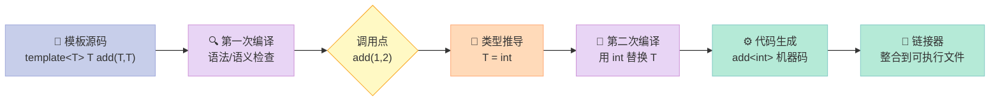
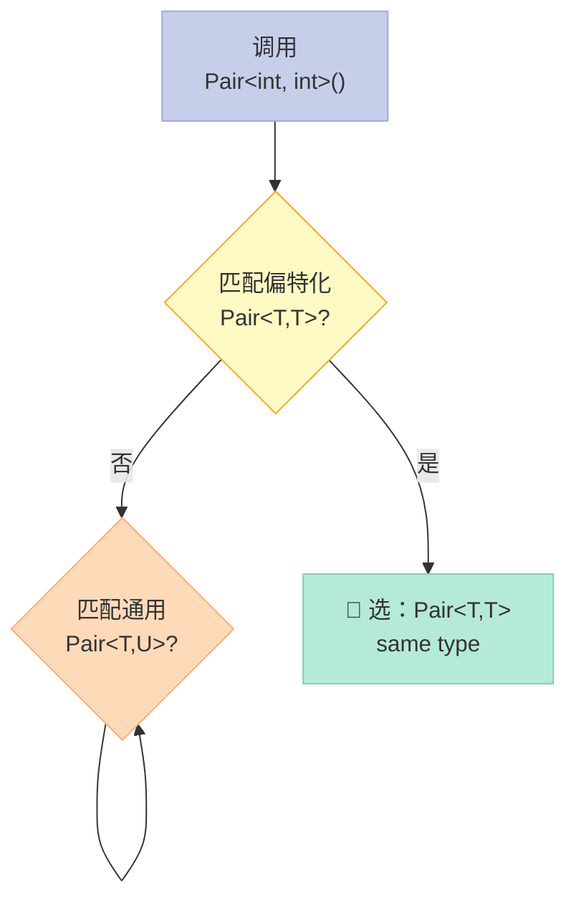
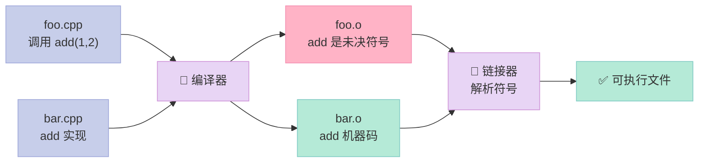
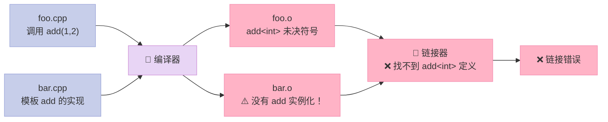
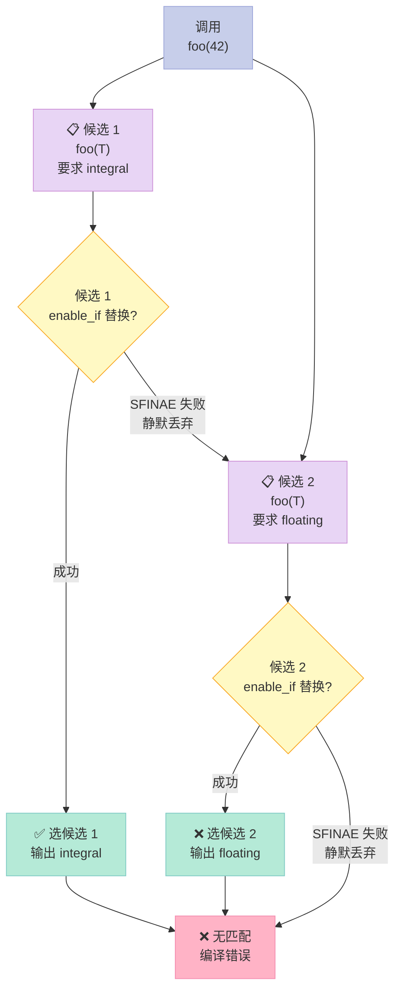
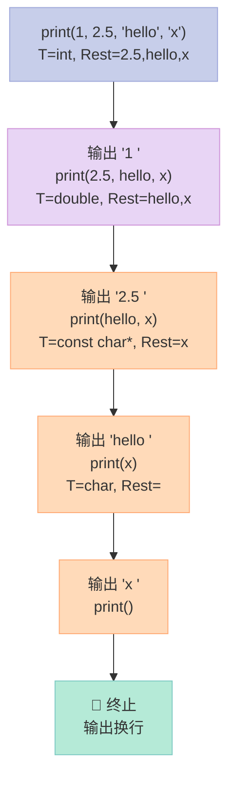
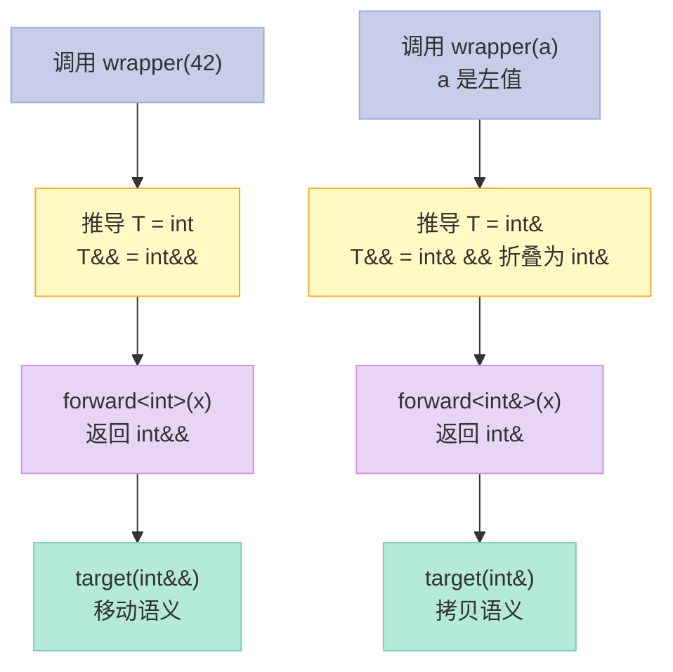
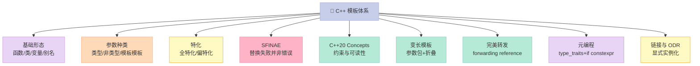

> 一句话核心结论：**C++ 模板（Template）是编译期的"代码生成器"——它让一份源码在不同的类型上展开成多份真正可执行的代码；而 SFINAE、Concepts、变长模板（Variadic Template）、完美转发（Perfect Forwarding）等现代特性，本质上都是在解决"如何让编译器更聪明地挑选、约束、传递参数"这一核心问题。**

---

## 开篇：为什么模板声明和实现必须放在同一个文件里？

很多 C++ 初学者都被这个反直觉的规则"教育"过：

> "把模板的声明放在 `.h`，实现放在 `.cpp`——抱歉，链接会报错。"

为什么？**普通函数**可以声明和实现分离，**模板**却不行。这背后藏着 C++ 模板最核心的实现机制：**两次编译 + 隐式实例化**。

本文就围绕这一个问题，把 C++ 模板的全景展开：

- 模板**是什么**、底层怎么**实例化（Instantiation）**
- 函数模板 vs 类模板 vs 变量模板 vs 别名模板
- 模板参数的三种类型、模板**特化（Specialization）**
- **SFINAE**（Substitution Failure Is Not An Error）
- C++20 **Concepts**（概念约束）
- 变长模板与完美转发
- 模板元编程（Template Metaprogramming）与 `type_traits`
- 模板的链接问题与 ODR

读完你应该能：

1. 读懂几乎所有模板相关的编译错误
2. 手写 SFINAE 表达式，理解 `enable_if` 的本质
3. 用 Concepts 替代 SFINAE
4. 解释为什么 `std::forward` 能"完美转发"
5. 区分"编译期多态"和"运行时多态"

---

## 一、模板是什么？—— 编译期的"代码生成器"

### 1.1 官方定义

**模板（Template）** 是 C++ 的一种**泛型（Generic Programming）**机制：**一种与类型无关的代码蓝图（Blueprint）**，只有在被具体的类型或值**实例化（Instantiation）** 后才会生成真正的代码。

```cpp
// 一个最简单的函数模板
template <typename T>
T add(T a, T b) {
    return a + b;
}

// 编译器在调用处"按需生成"两个不同的函数
int    r1 = add(1, 2);       // 实例化出 add<int>(int, int)
double r2 = add(1.0, 2.0);   // 实例化出 add<double>(double, double)
```

### 1.2 底层到底做了什么？

面试原题（**第 14 题**）的标准答案：

> 编译器并不是把函数模板处理成能够处理任意类型的函数；编译器从函数模板**通过具体类型产生不同的函数**；编译器会对函数模板进行**两次编译**：在声明的地方对模板代码本身进行编译，在调用的地方对参数替换后的代码进行编译。

我把这层含义拆成三点：

| 阶段 | 触发时机 | 编译器动作 |
|------|---------|----------|
| **第一次编译** | 模板声明处（如 `.h` 文件被包含） | 语法检查、模板参数合法性检查、生成模板的"内部表示" |
| **第二次编译** | 模板调用处（实例化时） | 用具体类型**替换** `T`，对生成的"伪代码"再做一次完整编译 |
| **代码生成** | 替换成功后 | 生成真正的机器码 |

用一张流程图展示这个过程：



### 1.3 一个直观的反证实验

让我们用一个例子证明"模板是真的生成了多份代码"：

```cpp
template <typename T>
void print_type() {
    // __PRETTY_FUNCTION__ 是 GCC/Clang 的扩展，会显示模板实例化后的完整签名
    std::cout << __PRETTY_FUNCTION__ << std::endl;
}

int main() {
    print_type<int>();        // void print_type() [T = int]
    print_type<double>();     // void print_type() [T = double]
    print_type<std::string>(); // void print_type() [T = std::string]
}
```

**输出**：

```
void print_type() [T = int]
void print_type() [T = double]
void print_type() [T = std::string]
```

看到了吗？**编译器真的生成了三份独立的函数**。模板不是"运行时类型擦除"，而是**编译期的代码复制**。

### 1.4 这意味着什么？

| 特性 | 影响 |
|------|------|
| **零运行时开销** | 没有虚函数表、没有类型擦除的间接调用，模板代码与手写代码一样快 |
| **代码膨胀（Code Bloat）** | 模板被 100 种类型实例化，生成 100 份代码——二进制体积可能膨胀 |
| **编译时间变长** | 每个实例化都要编译一次，模板越多，编译越慢 |
| **错误信息爆炸** | 错误发生在第二次编译，模板套模板时错误信息能堆成"天书" |

---

## 二、模板的四种形态

### 2.1 全景对比

C++ 模板不是只有"函数模板"和"类模板"。完整的分类：

| 模板种类 | C++ 标准引入版本 | 用途 | 例子 |
|---------|----------------|------|------|
| **函数模板（Function Template）** | C++98 | 写与类型无关的函数 | `std::max<T>(a, b)` |
| **类模板（Class Template）** | C++98 | 写与类型无关的类 | `std::vector<T>` |
| **变量模板（Variable Template）** | C++14 | 编译期常量 | `std::numeric_limits<T>::max` |
| **别名模板（Alias Template）** | C++11 | 给复杂类型起别名 | `using StringVec = std::vector<std::string>` |
| **概念（Concepts）** | C++20 | 模板参数的"接口约束" | `std::integral<T>` |

### 2.2 函数模板（Function Template）

```cpp
// 最经典的函数模板
template <typename T>
T my_max(T a, T b) {
    return (a > b) ? a : b;
}

// 使用时编译器做"实参推导（Template Argument Deduction）"
my_max(3, 5);         // T 推导为 int
my_max(3.14, 2.71);   // T 推导为 double
my_max<int>(3, 5);    // 显式指定 T 为 int
```

两个细节：

- **类型推导**（`T = int`）是编译器自动完成的，**不需要**写 `<int>`
- 显式指定 `<int>` 可以**强制**推导结果，常用于推导失败或多参数的歧义场景

### 2.3 类模板（Class Template）

```cpp
template <typename T, std::size_t N>
class Array {
public:
    T& operator[](std::size_t i) { return data_[i]; }
    constexpr std::size_t size() const { return N; }

private:
    T data_[N];  // 大小在编译期就确定
};

Array<int, 10> a1;          // T=int,  N=10
Array<double, 100> a2;      // T=double, N=100
```

类模板的**实例化必须显式指定**所有模板参数：

```cpp
Array<int> a3;  // ❌ 错误！N 没有默认值时，必须显式提供
```

但**可以给默认值**：

```cpp
template <typename T = int, std::size_t N = 100>
class Array { /* ... */ };

Array<> a4;            // T=int, N=100
Array<double> a5;      // T=double, N=100
```

### 2.4 变量模板（Variable Template, C++14）

```cpp
template <typename T>
constexpr T pi = T(3.1415926535897932385L);

double  a = pi<double>;   // 3.14159...
float   b = pi<float>;    // 3.14159...
int     c = pi<int>;      // 3
```

典型用途：**编译期数值常量**、**类型相关的标志位**。

```cpp
// 标准库用法：std::numeric_limits<T>::max 是变量模板吗？
// 在 C++14 后可以直接写 std::numeric_limits_v<T>，这是变量模板的包装
template <typename T>
inline constexpr bool is_integral_v = is_integral<T>::value;
```

### 2.5 别名模板（Alias Template）

```cpp
// 给"std::map<std::string, std::vector<int>>"起个短名字
template <typename Key, typename Value>
using StringMap = std::map<std::string, Value>;

// 配合标准容器
template <typename T>
using Vec = std::vector<T, MyAllocator<T>>;  // 自定义分配器

StringMap<int>  m1;   // std::map<std::string, int>
Vec<double>     v1;   // std::vector<double, MyAllocator<double>>
```

**别名模板 vs typedef**：

| 特性 | `typedef` | `using` 别名模板 |
|------|----------|----------------|
| 可以接受模板参数 | ❌ 需要套模板 | ✅ 直接接受 |
| 语法清晰度 | 一般 | **更清晰** |
| C++11 起推荐 | ❌ 已不推荐 | ✅ **推荐** |

---

## 三、模板参数的三种形态

### 3.1 全景对比

| 参数类型 | 写法 | 可接受值 | 出现版本 |
|---------|------|---------|---------|
| **类型参数（Type Parameter）** | `template <typename T>` | 任意类型 | C++98 |
| **非类型参数（Non-type Parameter）** | `template <int N>` | 整数/枚举/指针/引用/`std::nullptr_t` | C++98 |
| **非类型参数（扩展）** | `template <auto N>` | 由编译器推导 | C++17 |
| **非类型参数（浮点/字符串字面量）** | `template <double D>` | 浮点、字符串字面量类 | C++20 |
| **模板模板参数（Template Template Parameter）** | `template <template<class> class C>` | 一个模板 | C++98 |

### 3.2 类型参数（最常用）

```cpp
template <typename T>           // 等价于 template <class T>
T identity(T x) { return x; }
```

`typename` 和 `class` **在模板参数位置完全等价**（但 `typename` 更能表达语义）。

### 3.3 非类型参数

```cpp
template <int N>                  // C++98: 仅整数/枚举
struct FixedArray {
    int data[N];
};

FixedArray<10> a;  // N = 10，编译期常量
```

**C++17 扩展**：`auto` 让非类型参数支持任意可推导类型：

```cpp
template <auto N>
struct Wrapper {};

Wrapper<10>      w1;  // N = int(10)
Wrapper<'A'>     w2;  // N = char('A')
Wrapper<3.14>    w3;  // ❌ C++17 不支持浮点
Wrapper<&some_func> w4; // N 是函数指针
```

**C++20 进一步扩展**：支持浮点和字符串字面量类：

```cpp
template <double D>      // C++20
struct FloatConst {};

FloatConst<3.14> f;

template <std::basic_fixed_string S>  // C++20 提案（P0732R2 类）
class Name {};
```

### 3.4 模板模板参数

就是把"模板本身"作为另一个模板的参数：

```cpp
// 一个模板，它接受另一个"接收一个类型参数"的模板
template <template <typename> class Container, typename T>
void print(const Container<T>& c) {
    for (const auto& x : c) std::cout << x << " ";
    std::cout << "\n";
}

std::vector<int> v = {1, 2, 3};
print(v);  // 实例化 print<std::vector, int>
```

经典实战场景：**自定义容器适配器**：

```cpp
template <template <typename> class Adapter, typename T>
class Stack {
    Adapter<T> data_;
public:
    void push(T x) { data_.push_back(x); }
    T  top()       { return data_.back(); }
};

Stack<std::vector, int> s1;  // 用 vector 实现
// Stack<std::list, int>   s2; // 用 list 实现（但 list 是 template<class,class>，参数数量不匹配）
```

注意：**参数数量必须严格匹配**（`std::vector` 是一个参数，`std::list` 是两个），这是模板模板参数的常见痛点。

---

## 四、模板特化（Specialization）

### 4.1 全特化 vs 偏特化

| 类型 | 别称 | 模板参数 | 适用对象 | 示例 |
|------|------|---------|---------|------|
| **全特化（Full Specialization）** | 显式特化 | 全部指定 | 函数模板、类模板 | `template<> class Stack<int> { ... }` |
| **偏特化（Partial Specialization）** | 部分特化 | 部分指定 | **仅类模板** | `template<typename T> class Stack<T*> { ... }` |

### 4.2 函数模板的全特化（实际上是重载）

```cpp
// 通用版本
template <typename T>
bool equal(T a, T b) { return a == b; }

// 全特化版本：处理 const char*
template <>
bool equal<const char*>(const char* a, const char* b) {
    return std::strcmp(a, b) == 0;
}

// 调用
equal(1, 2);                // 通用版本
equal("hello", "world");    // 全特化版本（避免指针比较地址！）
```

⚠️ 注意：**函数模板不能偏特化**，只能**重载**：

```cpp
// ❌ 错误：函数模板不支持偏特化
template <typename T>
bool equal<T*>(T* a, T* b);

// ✅ 正确：改用函数重载
template <typename T>
bool equal(T* a, T* b) { return *a == *b; }
```

### 4.3 类模板的全特化

```cpp
template <typename T>
class Storage {
public:
    Storage(T v) : v_(v) { std::cout << "generic\n"; }
private:
    T v_;
};

// 全特化：bool 类型单独处理
template <>
class Storage<bool> {
public:
    Storage(bool v) : v_(v) { std::cout << "bool specialization\n"; }
private:
    unsigned char v_;  // 节省空间：1 bit
};

Storage<int>  s1(42);   // 输出：generic
Storage<bool> s2(true); // 输出：bool specialization
```

### 4.4 类模板的偏特化（类的特权）

```cpp
// 通用版本
template <typename T, typename U>
class Pair {
public:
    void who() { std::cout << "generic\n"; }
};

// 偏特化 1：当两个类型相同时
template <typename T>
class Pair<T, T> {
public:
    void who() { std::cout << "same type\n"; }
};

// 偏特化 2：当第二个类型是指针时
template <typename T, typename U>
class Pair<T, U*> {
public:
    void who() { std::cout << "second is pointer\n"; }
};

Pair<int, double> p1;  p1.who();  // generic
Pair<int, int>    p2;  p2.who();  // same type
Pair<int, double*> p3; p3.who();  // second is pointer
```

编译器按**特化程度从高到低**匹配。

### 4.5 特化匹配优先级



---

## 五、面试题 86：模板类和模板函数的区别

### 5.1 标准答案

> 函数模板的实例化是由编译程序在处理函数调用时自动完成的，而类模板的实例化必须由程序员在程序中**显式地指定**。即函数模板允许隐式调用和显式调用，而类模板只能显式调用。在使用时类模板必须加 `<T>`，而函数模板不必。

### 5.2 拆解对比

| 维度 | 函数模板 | 类模板 |
|------|---------|--------|
| 实例化触发 | 编译器在**调用点**自动推导 | 必须**显式**写 `<T>` |
| 调用语法 | `max(3, 5)` 或 `max<int>(3, 5)` | `Stack<int>` |
| 偏特化 | ❌ 不支持（用重载代替） | ✅ 支持 |
| 默认参数 | ✅ C++11 起支持 | ✅ 支持 |
| 类型推导 | ✅ 自动 | ❌ 早期不支持（C++17 起 CTAD 部分改善） |

### 5.3 C++17 的 CTAD（Class Template Argument Deduction）

C++17 后，类模板也能"类型推导"了，但**必须显式提供推导指引（Deduction Guide）**：

```cpp
template <typename T>
class Wrapper {
public:
    Wrapper(T v) : v_(v) {}
private:
    T v_;
};

// 推导指引
Wrapper(int) -> Wrapper<int>;
Wrapper(double) -> Wrapper<double>;

Wrapper w1(42);     // ✅ 自动推导为 Wrapper<int>
Wrapper w2(3.14);   // ✅ 自动推导为 Wrapper<double>
```

### 5.4 为什么类模板必须显式指定？

最根本的原因：**类模板没有"调用实参"可供推导**。

```cpp
template <typename T>
class Box {
    T v_;
};

// Box b;       // ❌ 编译器怎么知道 T 是什么？
// Box b(10);   // ❌ 构造函数也是模板，构造函数也得先知道 T 才能编译
// Box<int> b;  // ✅ 先告诉编译器 T=int，再实例化构造函数
```

类模板的实例化必须发生在**任何成员被使用之前**，否则编译器连构造函数都生成不出来，更别说用构造函数推导 T 了。

---

## 六、面试题 102：模板和实现可不可以不写在一个文件里？

### 6.1 简短答案

> **理论上可以，但实践中强烈不建议**。如果一定要分离，需要在 `.cpp` 中写**显式实例化（Explicit Instantiation）**，并且列出**所有要用的类型**。

### 6.2 完整原因（来自《C++编程思想》第 15 章）

> 模板定义很特殊。由 `template<…>` 处理的任何东西都意味着编译器在当时不为它分配存储空间，它一直处于等待状态直到被一个模板实例告知。在编译器和连接器的某一处，有一机制能去掉指定模板的多重定义。**所以为了容易使用，几乎总是在头文件中放置全部的模板声明和定义**。

### 6.3 详细拆解：分离式编译在模板上为什么"失灵"？

正常的分离式编译流程：



对**普通函数**完美：链接器在 `foo.o` 里看到 `add` 未决符号，去 `bar.o` 找，找到就解析。

对**模板函数**就出问题了：



**核心问题**：

1. `foo.cpp` 看到 `add<int>` 调用 → **编译器要实例化** `add<int>`，但 `foo.cpp` 只有声明，没有实现
2. `bar.cpp` 看到 `add` 模板定义，但**没有任何调用** → 编译器**懒得实例化**任何具体类型
3. 结果：**两个 `.o` 文件里都没有 `add<int>` 的机器码** → 链接器哭晕

### 6.4 实验：复现这个错误

**`add.h`**：

```cpp
#pragma once
template <typename T>
T add(T a, T b);
```

**`add.cpp`**：

```cpp
#include "add.h"
template <typename T>
T add(T a, T b) { return a + b; }
```

**`main.cpp`**：

```cpp
#include "add.h"
int main() {
    return add(1, 2);  // 期望返回 3
}
```

**编译**：

```bash
g++ -c add.cpp -o add.o
g++ -c main.cpp -o main.o
g++ add.o main.o -o main
```

**结果**：

```
undefined reference to `int add<int>(int, int)'
collect2: error: ld returned 1 exit status
```

完美复现了"为什么模板要放一起"。

### 6.5 解决方案 1：把实现挪到头文件（最常见）

```cpp
// add.h —— 把声明和实现放在一起
#pragma once
template <typename T>
T add(T a, T b) { return a + b; }
```

代价：**每个 `.cpp` 包含 `add.h` 都会触发一次实例化**，编译器自动去重。

### 6.6 解决方案 2：显式实例化（Explicit Instantiation）

如果一定要分离（出于编译时间、隐藏实现、二进制大小等考虑），可以用**显式实例化**：

**`add.h`**：

```cpp
#pragma once
template <typename T>
T add(T a, T b);  // 仅声明

// 显式实例化声明：告诉编译器"在别处会实例化这些"
extern template int add<int>(int, int);
extern template double add<double>(double, double);
```

**`add.cpp`**：

```cpp
#include "add.h"
template <typename T>
T add(T a, T b) { return a + b; }

// 显式实例化定义：真正生成机器码
template int add<int>(int, int);
template double add<double>(double, double);
```

**`main.cpp`**：

```cpp
#include "add.h"
int main() { return add(1, 2); }
```

这样所有 `.cpp` 都**不需要自己实例化** `add<int>`，链接时统一从 `add.o` 找。

⚠️ 缺点：**必须列举所有用到的类型**——一旦你新加了一个 `add<long>` 调用，又忘了在 `add.cpp` 里加显式实例化，又会回到链接错误。

### 6.7 解决方案 3：模板的显式实例化作为"分文件"的现代化替代

C++11 后还有两种替代方案：

**（a）C++ Module（C++20）**：

```cpp
// add.ixx
export module add;
export template <typename T>
T add(T a, T b) { return a + b; }
```

Module 是现代 C++ 的官方"模板分文件"方案。

**（b）显式实例化 + 工厂函数（工厂模式）**：

```cpp
// add.h
#pragma once
class Adder {
public:
    template <typename T>
    static T add(T a, T b) { return a + b; }
};
```

但这其实是把模板挪到了类的静态成员函数里——本质没变，只是把"显式实例化"封装成了"工厂"。

### 6.8 各种方案对比

| 方案 | 编译时间 | 二进制大小 | 实现隐藏 | 维护性 | 推荐度 |
|------|---------|----------|---------|--------|--------|
| **头文件全放** | ❌ 慢 | ⚠️ 可能膨胀 | ❌ 公开 | ✅ 高 | ⭐⭐⭐⭐ |
| **显式实例化** | ✅ 快 | ✅ 可控 | ✅ 可隐藏 | ❌ 列举所有类型 | ⭐⭐⭐ |
| **C++20 Module** | ✅ 最优 | ✅ 最优 | ✅ 最优 | ✅ 优 | ⭐⭐⭐⭐⭐ |
| **模板工厂类** | ⚠️ 一般 | ⚠️ 一般 | ⚠️ 公开 | ✅ 优 | ⭐⭐ |

**结论**：能放头文件就放头文件；如果项目大，迁 C++20 Module。

---

## 七、SFINAE：替换失败并非错误

### 7.1 SFINAE 是什么？

**SFINAE（Substitution Failure Is Not An Error，替换失败并非错误）** 是 C++ 模板推导中一条至关重要的规则：

> 在模板**实参推导**阶段，如果某个**重载/特化**的模板参数替换失败，编译器**不会报错**，而是**静默丢弃**这个候选，继续尝试其他候选。

只有当**所有候选都失败**时，才报"无匹配"错误。

### 7.2 一个直观的例子

```cpp
#include <iostream>
#include <type_traits>

// 候选 1：仅当 T 是整数时合法
template <typename T>
auto foo(T x) -> typename std::enable_if<std::is_integral<T>::value, void>::type {
    std::cout << "integral: " << x << "\n";
}

// 候选 2：仅当 T 是浮点时合法
template <typename T>
auto foo(T x) -> typename std::enable_if<std::is_floating_point<T>::value, void>::type {
    std::cout << "floating: " << x << "\n";
}

int main() {
    foo(42);     // 输出 integral: 42
    foo(3.14);   // 输出 floating: 3.14
}
```

`enable_if` 的"enable"成功 → 函数可见；否则替换失败 → SFINAE 丢弃候选。

### 7.3 SFINAE 替换流程图



### 7.4 SFINAE 的本质：为什么它叫"并非错误"？

如果**没有 SFINAE**，`enable_if` 写错一次就会让整个函数模板"硬错误"，编译器直接罢工，连其他候选都不看了。**SFINAE 把这种"语法层面的不匹配"软化成了"自动放弃"**。

```cpp
template <typename T>
typename T::value_type  // SFINAE 上下文
get_value(T x);

get_value(42);  // T = int，int::value_type 不存在 → SFINAE 失败，不是错误
```

### 7.5 `std::enable_if` 详解

`enable_if<bool B, typename T = void>`：

- 如果 `B == true`：`type = T`
- 如果 `B == false`：**没有 `type` 成员**（导致 SFINAE 替换失败）

```cpp
template <bool B, typename T = void>
struct enable_if {};

template <typename T>
struct enable_if<true, T> { using type = T; };
```

**C++14 起**有变量模板版本，更简洁：

```cpp
template <bool B, typename T = void>
using enable_if_t = typename enable_if<B, T>::type;
```

### 7.6 经典 SFINAE 应用：检测类型成员

```cpp
// 通用版本（兜底）
template <typename T, typename = void>
struct has_value_type : std::false_type {};

// 特化版本：仅当 T::value_type 合法时启用
template <typename T>
struct has_value_type<T, std::void_t<typename T::value_type>>
    : std::true_type {};

// 测试
struct WithVT  { using value_type = int; };
struct WithoutVT {};

static_assert( has_value_type<WithVT>::value);
static_assert(!has_value_type<WithoutVT>::value);
```

`std::void_t<...>` 是 C++17 引入的"吸收任何类型"的工具——如果里面的类型不存在，替换失败 → SFINAE → 走兜底版本。

### 7.7 SFINAE 的"适用范围"

| 位置 | 是否 SFINAE 上下文 |
|------|------------------|
| **函数返回类型** | ✅ 是 |
| **函数参数类型** | ✅ 是 |
| **模板参数列表中的默认参数** | ✅ 是 |
| **函数体内的类型错误** | ❌ 否（这是"硬错误"，会导致整个程序报错） |

**经验法则**：**SFINAE 只能用于"声明"的位置**，不能用在函数体里。

```cpp
template <typename T>
auto foo(T x) -> decltype(x.bar()) {  // ✅ SFINAE
    return x.bar();
}

template <typename T>
auto foo(T x) {
    return x.bar();  // ❌ 硬错误，不是 SFINAE
}
```

---

## 八、C++20 Concepts：SFINAE 的优雅替代

### 8.1 SFINAE 太丑了

SFINAE 能解决问题，但代码可读性极差：

```cpp
// SFINAE 风格
template <typename T,
          typename = std::enable_if_t<std::is_integral_v<T>>>
void process(T x) { /* ... */ }
```

新手看到 `enable_if` 完全懵——"这玩意儿到底想筛选什么类型？"

### 8.2 Concepts：用"自然语言"约束模板

C++20 引入了 **Concepts（概念）**：

```cpp
#include <concepts>

// 定义一个 concept
template <typename T>
concept Integral = std::is_integral_v<T>;

// 使用方式 1：直接约束模板参数
template <Integral T>
void process(T x) { /* ... */ }

// 使用方式 2：requires 子句
template <typename T>
requires Integral<T>
void process2(T x) { /* ... */ }

// 使用方式 3：尾随 requires（C++20 常用）
template <typename T>
void process3(T x) requires Integral<T> { /* ... */ }

process(42);     // ✅ T=int，Integral 满足
process(3.14);   // ❌ T=double，编译错误：constraint not satisfied
```

### 8.3 Concepts 定义语法

```cpp
// 简单 concept
template <typename T>
concept Signed = std::is_signed_v<T>;

// 复合 concept
template <typename T>
concept Number = std::is_integral_v<T> || std::is_floating_point_v<T>;

// 带 requires 表达式的 concept
template <typename T>
concept Addable = requires(T a, T b) {
    a + b;                  // 必须支持 +
    a += b;                 // 必须支持 +=
    { a + b } -> std::same_as<T>;  // a+b 必须返回 T 类型
};

// 用 concept 组合
template <typename T>
concept SignedNumber = Signed<T> && Number<T>;
```

### 8.4 标准库内置 Concepts（C++20）

| Concept | 含义 |
|---------|------|
| `std::same_as<T, U>` | T 和 U 是同一类型 |
| `std::integral<T>` | T 是整数类型 |
| `std::floating_point<T>` | T 是浮点类型 |
| `std::signed_integral<T>` | T 是有符号整数 |
| `std::unsigned_integral<T>` | T 是无符号整数 |
| `std::convertible_to<From, To>` | From 能隐式转换为 To |
| `std::derived_from<Derived, Base>` | Derived 派生自 Base |
| `std::default_initializable<T>` | T 可默认构造 |
| `std::movable<T>` | T 可移动 |
| `std::copyable<T>` | T 可拷贝 |
| `std::regular<T>` | T 满足"可拷贝 + 相等比较"（数学上的"正则"概念） |
| `std::totally_ordered<T>` | T 支持全序比较（<, <=, >, >=） |

### 8.5 Concepts vs SFINAE 对比

| 维度 | SFINAE | Concepts |
|------|--------|---------|
| 语法可读性 | ❌ 极其晦涩 | ✅ 类英语自然语言 |
| 错误信息 | ❌ 几百行模板栈 | ✅ 简洁指向 constraint |
| 表达能力 | ⚠️ 强但难写 | ✅ 强且直观 |
| 重载优先级 | ❌ 复杂 | ✅ 显式 partition |
| C++ 标准 | C++98 | **C++20** |
| 编译器支持 | 全平台 | GCC 10+ / Clang 16+ / MSVC 16.10+ |

### 8.6 重载优先级：Concepts 让"更特殊"的重载胜出

```cpp
#include <concepts>

template <typename T>
void describe(T x) {
    std::cout << "generic\n";
}

// 更特殊的概念：仅对整数
template <std::integral T>
void describe(T x) {
    std::cout << "integral\n";
}

describe(3.14);  // 输出 generic
describe(42);    // 输出 integral
```

编译器**自动选择"约束最强"** 的候选——比 SFINAE 的歧义匹配简单太多。

### 8.7 实战示例：用 Concept 重写 detect_value_type

```cpp
// SFINAE 风格（13 行，难懂）
template <typename T, typename = void>
struct has_value_type : std::false_type {};
template <typename T>
struct has_value_type<T, std::void_t<typename T::value_type>>
    : std::true_type {};

// Concepts 风格（5 行，直白）
template <typename T>
concept has_value_type = requires { typename T::value_type; };

static_assert( has_value_type<std::vector<int>>);
static_assert(!has_value_type<int>);
```

**Concepts 不只是语法糖——它把模板元编程从"玄学"拉回了"工程学"**。

---

## 九、变长模板（Variadic Template）

### 9.1 什么是变长模板？

**变长模板（Variadic Template）** 是 C++11 引入的特性：**模板参数可以接受任意数量的参数**。

```cpp
// 任意数量、任意类型的参数
template <typename... Args>
void print(Args... args) {
    // Args 是一个"类型包（type pack）"
    // args 是一个"值包（value pack）"
}
```

`...` 是变长的标志，叫 **Parameter Pack**（参数包）。

### 9.2 参数包展开

参数包**不能直接使用**，必须**展开（Expansion）**：

```cpp
// 错误：参数包不能直接当参数
template <typename... Args>
void print(Args... args) {
    std::cout << args...;  // ❌ 不合法
}

// 正确：用递归或折叠表达式展开
```

### 9.3 经典实现：递归展开

```cpp
// 终止函数：无参版本
void print() { std::cout << "\n"; }

// 递归版本：每次剥出第一个参数
template <typename T, typename... Rest>
void print(T first, Rest... rest) {
    std::cout << first << " ";
    print(rest...);  // 递归
}

int main() {
    print(1, 2.5, "hello", 'x');  // 输出 1 2.5 hello x
}
```

**递归流程图**：



### 9.4 C++17 折叠表达式：递归不再是唯一选择

C++17 引入**折叠表达式（Fold Expressions）**，让变长模板变得极其简洁：

```cpp
template <typename... Args>
auto sum(Args... args) {
    return (... + args);  // 一元左折叠: ((arg1 + arg2) + arg3) + ...
}

sum(1, 2, 3, 4, 5);     // 15
sum(1.5, 2.5, 3.0);     // 7.0
```

**四种折叠形式**：

| 形式 | 展开 | 说明 |
|------|------|------|
| 一元右折叠 `(args + ...)` | `arg1 + (arg2 + (arg3 + arg4))` | 默认右结合 |
| 一元左折叠 `(... + args)` | `((arg1 + arg2) + arg3) + arg4` | 左结合 |
| 二元右折叠 `(args + ... + 0)` | `arg1 + (arg2 + (arg3 + 0))` | 带初值（空包合法） |
| 二元左折叠 `(0 + ... + args)` | `((0 + arg1) + arg2) + arg3` | 带初值 |

```cpp
// 二元折叠：处理空参数包
template <typename... Args>
auto sum_safe(Args... args) {
    return (args + ... + 0);  // 空包返回 0
}

sum_safe();           // 0
sum_safe(1, 2, 3);    // 6
```

### 9.5 实战：通用 `format` 风格 print

```cpp
#include <iostream>
#include <sstream>

// 通用版本
template <typename T>
std::string to_str(const T& x) {
    std::ostringstream oss;
    oss << x;
    return oss.str();
}

// 递归 print
void print_all() {
    std::cout << "\n";
}

template <typename First, typename... Rest>
void print_all(const First& f, const Rest&... rest) {
    std::cout << "[" << to_str(f) << "] ";
    print_all(rest...);
}

print_all(1, 3.14, "hello", std::string("world"));
// 输出 [1] [3.14] [hello] [world]
```

### 9.6 参数包的其他玩法

```cpp
// 计算参数包大小
template <typename... Args>
constexpr std::size_t count_args(Args... args) {
    return sizeof...(args);  // sizeof... 是包的关键操作
}

static_assert(count_args(1, 2.0, "x", 'a') == 4);

// 获取第 N 个类型
template <std::size_t I, typename T, typename... Rest>
struct NthType { using type = typename NthType<I-1, Rest...>::type; };

template <typename T, typename... Rest>
struct NthType<0, T, Rest...> { using type = T; };

using T = typename NthType<2, int, double, char, bool>::type;  // T = char

// 转发所有参数（结合完美转发）
template <typename... Args>
void wrapper(Args&&... args) {
    target(std::forward<Args>(args)...);  // 完美转发
}
```

---

## 十、完美转发（Perfect Forwarding）

### 10.1 什么是"完美转发"？

**完美转发（Perfect Forwarding）**：在函数模板中，将参数以**原始的值类别（value category，左值/右值）和类型**传递给另一个函数。**目标是"零拷贝、零类型转换"**。

### 10.2 为什么需要完美转发？

```cpp
// 一个包装函数：把参数透传给 target
template <typename T>
void wrapper(T x) {
    target(x);  // ❌ 问题：x 是左值，即使传进来的是右值，也变成左值
}

wrapper(42);          // 传右值，但 x 是左值
wrapper(std::move(a)); // 传右值，但 x 仍是左值
```

### 10.3 万能引用（Forwarding Reference）

万能引用 = **带 `&&` 且模板参数需要推导的引用**。

```cpp
template <typename T>
void f(T&& x) {  // T&& 是万能引用，不是右值引用！
    // ...
}

int a = 10;
f(a);             // T = int&，      T&& = int& &&
f(42);            // T = int，       T&& = int&&
f(std::move(a));  // T = int，       T&& = int&&
```

`T&&` 在**模板参数需要推导**时是万能引用；在**已知类型**时是普通右值引用：

```cpp
void f(int&& x) { }  // 普通右值引用，不是万能引用
```

### 10.4 引用折叠（Reference Collapsing）

C++11 起规定**引用的引用会折叠**：

| 原始类型 | 折叠后 |
|---------|--------|
| `T& &` | `T&` |
| `T& &&` | `T&` |
| `T&& &` | `T&` |
| `T&& &&` | `T&&` |

这就是为什么 `T&&` 既能绑定左值又能绑定右值——**编译器会根据实参推导 T 时，得到 `T&` 还是 `T`，然后通过引用折叠产生正确的引用类型**。

### 10.5 `std::forward` 的实现

```cpp
template <typename T>
T&& forward(typename std::remove_reference<T>::type& x) {
    return static_cast<T&&>(x);  // 再用一次引用折叠
}

// C++14 简化为：
template <typename T>
constexpr T&& forward(std::remove_reference_t<T>& x) {
    return static_cast<T&&>(x);
}
```

**核心**：根据 `T` 的"原貌"（是否带 `&`），决定 `static_cast` 成左值还是右值。

### 10.6 完美转发的完整流程图



### 10.7 实战：实现一个 `make_unique`（C++14 之前）

```cpp
template <typename T, typename... Args>
std::unique_ptr<T> make_unique(Args&&... args) {
    return std::unique_ptr<T>(new T(std::forward<Args>(args)...));
    //                          ^^^^^^^^^^^^^^^^^^^^^^^^^^
    //               完美转发：保持 args 的左值/右值属性
}

struct Point { Point(int x, int y) : x_(x), y_(y) {} int x_, y_; };

auto p1 = make_unique<Point>(1, 2);     // 移动构造
int a = 10, b = 20;
auto p2 = make_unique<Point>(a, b);     // 拷贝构造
```

### 10.8 完美转发的"陷阱"

```cpp
template <typename T>
void wrapper(T&& x) {
    // ❌ 不要在这里对 x 做左值操作（会破坏原属性）
    auto y = x;          // y 是左值拷贝

    // ✅ 正确：转发到下一层
    target(std::forward<T>(x));
}
```

---

## 十一、模板元编程（Template Metaprogramming, TMP）

### 11.1 什么是模板元编程？

**模板元编程（TMP）**：**把计算放到编译期**——用模板实例化机制写"运行在编译器里的程序"。

```cpp
// 编译期计算阶乘
template <int N>
struct Factorial {
    static constexpr int value = N * Factorial<N-1>::value;
};

template <>
struct Factorial<0> {
    static constexpr int value = 1;
};

static_assert(Factorial<5>::value == 120);  // 编译期算出来
```

**这就是 TMP 的本质**：模板实例化 = 递归函数 + 类型推导 + 编译期求值。

### 11.2 `type_traits`：模板元编程的"工具箱"

`<type_traits>` 提供了一整套**在编译期操作类型**的工具：

| 类型 trait | 含义 | 示例 |
|----------|------|------|
| `std::is_integral<T>` | T 是否整数 | `is_integral<int>::value == true` |
| `std::is_floating_point<T>` | T 是否浮点 | `is_floating_point<double>::value == true` |
| `std::is_same<T, U>` | T 和 U 同类型 | `is_same<int, int>::value == true` |
| `std::is_base_of<Base, Derived>` | Base 是 Derived 基类 | `is_base_of<A, B>::value` |
| `std::is_convertible<From, To>` | From 能否隐式转 To | |
| `std::is_pointer<T>` | T 是否指针 | |
| `std::is_class<T>` | T 是否类类型 | |
| `std::remove_const<T>` | 去掉 const | `remove_const<const int>::type == int` |
| `std::remove_reference<T>` | 去掉引用 | `remove_reference<int&>::type == int` |
| `std::add_pointer<T>` | 加指针 | `add_pointer<int>::type == int*` |
| `std::decay<T>` | 数组/函数退化 | `decay<int[5]>::type == int*` |
| `std::common_type<T...>` | 共同类型 | `common_type<int, double>::type == double` |
| `std::conditional<B, T, F>` | 编译期三元 | `conditional<true, int, double>::type == int` |
| `std::enable_if<B>` | 条件启用 | |
| `std::void_t<...>` | 吸收任意类型 | C++17 |

C++17 起，每个 trait 都有 `_v` 变量模板版本（`is_integral_v<T>`），`_t` 别名模板版本（`remove_const_t<T>`）。

### 11.3 实战：用 TMP 写一个"类型选择器"

```cpp
// 编译期条件选择
template <bool B, typename T, typename F>
struct conditional { using type = T; };

template <typename T, typename F>
struct conditional<false, T, F> { using type = F; };

// C++14 起直接用
template <bool B, typename T, typename F>
using conditional_t = typename conditional<B, T, F>::type;

using T = conditional_t<(sizeof(int) > 2), long, int>;  // 通常是 long
```

### 11.4 实战：用 TMP 检测成员函数是否存在

```cpp
#include <iostream>
#include <type_traits>

// 用 SFINAE 检测 T 是否有 .clone() 成员
template <typename T, typename = void>
struct has_clone : std::false_type {};

template <typename T>
struct has_clone<T, std::void_t<decltype(std::declval<T>().clone())>>
    : std::true_type {};

struct WithClone  { int clone() const { return 0; } };
struct WithoutClone {};

int main() {
    static_assert( has_clone<WithClone>::value);
    static_assert(!has_clone<WithoutClone>::value);
    std::cout << "All asserts passed!\n";
}
```

### 11.5 `if constexpr`（C++17）：TMP 的简化

C++17 引入的 **`if constexpr`** 让编译期分支不再依赖模板特化：

```cpp
// 老式 TMP（递归特化）
template <typename T>
auto get_value(T x) -> typename std::enable_if<std::is_integral<T>::value, int>::type {
    return x * 2;
}

template <typename T>
auto get_value(T x) -> typename std::enable_if<std::is_floating_point<T>::value, double>::type {
    return x * 1.5;
}

// C++17 if constexpr
template <typename T>
auto get_value(T x) {
    if constexpr (std::is_integral_v<T>) {
        return x * 2;       // 编译期选择此分支
    } else if constexpr (std::is_floating_point_v<T>) {
        return x * 1.5;
    } else {
        return x;
    }
}
```

**优势**：单函数体，逻辑更清晰；**废弃的分支在编译期被丢弃**，不会触发里面的错误。

### 11.6 编译期多态 vs 运行时多态

| 维度 | 编译期多态（模板） | 运行时多态（虚函数） |
|------|-----------------|-------------------|
| 实现机制 | 模板实例化 | 虚函数表 (vtable) |
| 决定时机 | **编译期** | **运行期** |
| 运行时开销 | **零** | 一次间接调用 + 可能的 cache miss |
| 类型耦合 | **强耦合**（必须暴露完整类型） | 弱耦合（通过抽象基类） |
| 二进制大小 | ⚠️ 可能膨胀 | ✅ 一份代码 |
| 编译时间 | ❌ 慢 | ✅ 快 |
| 接口稳定性 | ❌ 改动影响所有调用方 | ✅ 只改虚函数签名影响可控 |
| 适用场景 | **性能关键、类型已知** | **运行时类型未知、需要解耦** |

```cpp
// 编译期多态：模板
template <typename Shape>
double area(const Shape& s) {
    return s.area();  // 编译器为每种 Shape 生成一份代码
}

// 运行时多态：虚函数
struct Shape {
    virtual double area() const = 0;
    virtual ~Shape() = default;
};
struct Circle : Shape {
    double r_;
    double area() const override { return 3.14 * r_ * r_; }
};

std::vector<std::unique_ptr<Shape>> shapes;  // 运行时多态
```

**经验法则**：
- **库内部**用模板（性能优先）
- **插件系统**用虚函数（解耦优先）

---

## 十二、模板的链接问题与 ODR

### 12.1 ODR 是什么？

**ODR（One Definition Rule，单一定义规则）**：C++ 规定每个**非内联函数、变量、类**在整个程序中**只能有一个定义**。

### 12.2 模板违反 ODR 吗？

**不违反**——但模板有特殊的"弱化 ODR"：

| 实体 | ODR 规则 |
|------|---------|
| **模板定义**（非实例化） | ✅ **可以在多个 `.cpp` 出现**（编译器/链接器会去重） |
| **模板实例化产物** | ✅ 同一种类型实例化**全局只能有一份** |

### 12.3 显式实例化与 ODR

```cpp
// a.h
template <typename T>
T square(T x) { return x * x; }

// a.cpp：显式实例化定义
template int square<int>(int);  // 显式实例化定义，生成机器码
template       square<double>(double);

// b.cpp：显式实例化声明（不生成机器码，期望链接时找）
extern template int square<int>(int);
```

**`extern template` 是 ODR 的关键工具**：告诉编译器"这里不要实例化，到别处找"。

### 12.4 `inline` 模板：ODR 的另一种解决

```cpp
template <typename T>
inline T square(T x) { return x * x; }
```

`inline` 模板允许在多个编译单元中存在**相同的定义**，链接器会去重，**且行为等价于"显式实例化 + 自动合并"**。

### 12.5 链接错误实战

**场景**：`add<int>` 在两个 `.cpp` 中各实例化一份，链接器会报错。

**修复**：在头文件中加 `inline` 或 `extern template`。

```cpp
// 头文件
#pragma once
template <typename T>
inline T add(T a, T b) { return a + b; }  // inline 去重

// 或者
template <typename T>
T add(T a, T b) { return a + b; }
extern template int add<int>(int, int);  // 告诉其他 .cpp 不要重复实例化
```

---

## 十三、实战踩坑：编译错误如何读懂

### 13.1 错误信息太长？教你"砍头去尾"

典型的 SFINAE 错误：

```
error: no matching function for call to 'foo(double)'
note: candidate: 'template<class T> typename std::enable_if<std::is_integral<_Tp>::value, void>::type foo(T)'
note:   template argument deduction/substitution failed:
note:   'std::is_integral<double>::value' is false
```

**正确读法**：

1. **头**：看 `error:` 后的**实参类型**（这里是 `double`）
2. **中**：看 `candidate:` 后的**函数模板签名**
3. **尾**：看 `note:` 后的**为什么不行**（`is_integral<double>` 是 false）

### 13.2 常见错误类型速查

| 错误 | 原因 | 解决 |
|------|------|------|
| `undefined reference to Foo<int>::Foo()` | 模板实现未包含 | 把实现挪到头文件 |
| `error: no type named 'value_type' in 'int'` | SFINAE 检测失败 | 检查概念定义 |
| `error: ambiguous template instantiation` | 偏特化有多个匹配 | 调整特化优先级 |
| `error: template argument list size mismatch` | 模板模板参数数量不匹配 | 加默认参数 |
| `error: expected primary-expression before '>'` | C++17 前用了 `>>` | 加空格 `> >` |

### 13.3 调试工具：Concepts 让错误信息"秒懂"

```cpp
template <typename T>
concept Integral = std::is_integral_v<T>;

template <Integral T>
void process(T x) { /* ... */ }

process(3.14);
```

**错误信息**：

```
error: no matching function for call to 'process(double)'
note: constraints not satisfied
note: concept 'Integral<double>' evaluated to false
```

比 SFINAE 时代的"100 行嵌套模板栈"好太多。

---

## 十四、模板特性演进表

| 特性 | C++98 | C++11 | C++14 | C++17 | C++20 | C++23 |
|------|-------|-------|-------|-------|-------|-------|
| 函数/类模板 | ✅ | ✅ | ✅ | ✅ | ✅ | ✅ |
| 模板默认参数 | ❌ | ✅ | ✅ | ✅ | ✅ | ✅ |
| 变量模板 | ❌ | ❌ | ✅ | ✅ | ✅ | ✅ |
| 别名模板 | ❌ | ✅ | ✅ | ✅ | ✅ | ✅ |
| 变长模板 | ❌ | ✅ | ✅ | ✅ | ✅ | ✅ |
| 完美转发 | ❌ | ✅ | ✅ | ✅ | ✅ | ✅ |
| SFINAE 表达式 | ⚠️ 弱 | ✅ | ✅ | ✅ | ✅ | ✅ |
| `std::void_t` | ❌ | ❌ | ❌ | ✅ | ✅ | ✅ |
| 折叠表达式 | ❌ | ❌ | ❌ | ✅ | ✅ | ✅ |
| `if constexpr` | ❌ | ❌ | ❌ | ✅ | ✅ | ✅ |
| 类模板参数推导 (CTAD) | ❌ | ❌ | ❌ | ✅ | ✅ | ✅ |
| Concepts | ❌ | ❌ | ❌ | ❌ | ✅ | ✅ |
| 非类型模板参数扩展 | 整数 | `nullptr_t` | - | `auto` | 浮点、类字面量 | - |
| 模板 Lambda (deducing this) | ❌ | ❌ | ❌ | ❌ | ❌ | ✅ |

---

## 十五、面试题答题模板

### 15.1 第 14 题标准答案

**Q：C++ 模板是什么，底层怎么实现的？**

> 1. **定义**：模板是与类型无关的代码蓝图，只有在被具体类型实例化后才生成真正的代码。
> 2. **实现机制**：编译器从函数模板通过具体类型产生不同的函数；编译器会对函数模板进行**两次编译**——在声明处对模板代码本身进行编译，在调用处对参数替换后的代码进行编译。
> 3. **原因**：模板要被实例化后才能成为真正的函数。在分离编译环境下，编译器无法跨编译单元实例化模板，所以**模板的声明和实现必须放在同一文件**。

### 15.2 第 86 题标准答案

**Q：模板类和模板函数的区别是什么？**

> 1. 函数模板可以**隐式调用**（编译器自动推导类型），类模板必须**显式指定**类型参数。
> 2. 函数模板可以使用**重载**模拟"特化"，类模板支持**全特化和偏特化**。
> 3. 函数模板不必写 `<T>`，类模板必须写 `<T>`（C++17 CTAD 例外）。

### 15.3 第 102 题标准答案

**Q：模板和实现可不可以不写在一个文件里面？为什么？**

> 1. **理论上可以**，但需要**显式实例化**（`template` 关键字）并枚举所有类型。
> 2. **不建议**：因为模板在编译期才生成代码，编译器看到声明时不会实例化；看到实现时若无调用也不会实例化——结果链接器找不到任何实例的二进制代码。
> 3. **现代替代**：C++20 Module 提供原生"模板分文件"方案。

---

## 十六、常见面试追问

### 16.1 "模板会无限递归吗？"

会的。比如 `Factorial<-1>::value` 会无限递归直到栈溢出。**用 `static_assert` 限制边界**：

```cpp
template <int N>
struct Factorial {
    static_assert(N >= 0, "Factorial requires non-negative N");
    static constexpr int value = N * Factorial<N-1>::value;
};
```

### 16.2 "模板的偏特化和函数重载冲突时谁优先？"

**函数重载优先**——编译器先按重载解析，再考虑模板特化。

### 16.3 "为什么 `std::vector<bool>` 要特化？"

因为 `bool` 在底层用 1 bit 存储，需要特殊处理。但**特化导致接口不一致**（不能返回 `bool&`），争议很大。

### 16.4 "Concepts 会不会取代 SFINAE？"

会逐步取代。**新代码推荐 Concepts**，老代码维护期会长期共存。

---

## 十七、结尾思考题

### 思考题 1：亲手跑一次 SFINAE 失败

把第 7.2 节的 `foo` 函数加上第三个重载，专门处理字符串：

```cpp
template <typename T>
auto foo(T x) -> typename std::enable_if<
    std::is_same<T, std::string>::value, void>::type {
    std::cout << "string: " << x << "\n";
}
```

然后调用 `foo(std::string("hi"))`、`foo("hi")`、`foo(42)`——观察哪个走哪个重载。**重点**：为什么 `foo("hi")` 会走 `integral` 而不是 `string`？

### 思考题 2：实现一个 `Tuple` 类模板

```cpp
template <typename... Ts>
class Tuple;

// 用变长模板 + 递归继承实现一个简易 Tuple
// 支持 Tuple<int, double, std::string> t(1, 2.5, "hello");
// 以及 std::get<0>(t) 返回 int&
```

提示：递归继承 + 参数包展开。

### 思考题 3：用 Concepts 重写你的"类型特征检测库"

把项目里所有 `enable_if` 风格的代码改写成 Concepts，感受可读性的提升。

---

## 十八、总结与行动建议

### 18.1 一图回顾模板知识体系



### 18.2 学习路径建议

| 阶段 | 学习内容 | 推荐资源 |
|------|---------|---------|
| **入门** | 函数模板、类模板、显式实例化 | 《C++ Primer》第 16 章 |
| **进阶** | 模板特化、SFINAE、type_traits | 《Effective C++》item 41-48 |
| **高级** | 变长模板、完美转发、TMP | 《C++ Templates》第 2 版 |
| **现代** | C++17/20 Concepts、Modules、if constexpr | cppreference.com |
| **实战** | 读 STL 源码（`std::optional`、`std::variant`） | LLVM libcxx 源码 |

### 18.3 面试高频考点 Top 10

1. **两次编译 + 隐式实例化**（为什么模板要放头文件）
2. **函数模板 vs 类模板**（自动推导 vs 显式指定）
3. **偏特化 vs 重载**（类支持，函数不支持）
4. **SFINAE 是什么**（替换失败并非错误）
5. **`enable_if` 和 `is_same` 的用法**
6. **变长模板 + 参数包展开**
7. **完美转发 + 万能引用 + 引用折叠**
8. **C++20 Concepts 的基本语法**
9. **编译期多态 vs 运行时多态**
10. **模板的链接错误如何排查**

### 18.4 行动建议

1. **立刻动手**：把本文所有代码块敲一遍，光看不会写
2. **读 STL 源码**：`std::optional`（变长模板 + if constexpr）、`std::variant`（变长模板 + 折叠）
3. **项目改造**：找一段 SFINAE 代码改写成 Concepts，亲身体会可读性差异
4. **面试准备**：把第 15 节的三道标准答案背下来，能讲出"为什么"比"是什么"更重要
5. **避坑指南**：模板错误信息要学会"砍头去尾"——只看头（实参类型）、中（函数签名）、尾（为什么不行）

---

## 附录：系列导航

「C++ 面试题集锦」系列共 16 篇，覆盖 C++ 核心知识点 + 现代特性 + 实战踩坑：

| 篇数 | 标题 | 主题 |
|------|------|------|
| 第 1 篇 | [基础类型与类型转换](./2026-05-01-cpp-interview-01-basics.html) | 整数/浮点/字符、隐式转换、字面量 |
| 第 2 篇 | [const、volatile 与 mutable](./2026-05-10-cpp-interview-02-const-volatile.html) | 常量正确性、CV 限定符、mutable 例外 |
| 第 3 篇 | [引用与指针](./2026-05-20-cpp-interview-03-references-pointers.html) | 左值/右值引用、`*` 与 `&` 的语义 |
| 第 4 篇 | [面向对象：继承、多态、虚函数](./2026-06-05-cpp-interview-04-oop.html) | vtable、动态绑定、抽象类 |
| **第 5 篇** | **模板与泛型（本篇）** | **SFINAE、Concepts、变长模板、元编程** |
| 第 6 篇 | [智能指针与内存管理](./2026-06-25-cpp-interview-06-smart-pointers.html) | unique_ptr / shared_ptr / weak_ptr |
| 第 7 篇 | [移动语义与完美转发](./2026-07-05-cpp-interview-07-move-semantics.html) | std::move、std::forward、右值引用 |
| 第 8 篇 | [STL 容器与迭代器](./2026-07-15-cpp-interview-08-stl-containers.html) | vector / map / unordered_map |
| 第 9 篇 | [算法与函数对象](./2026-07-25-cpp-interview-09-algorithms.html) | sort / find、lambda、function |
| 第 10 篇 | [异常处理与错误码](./2026-08-05-cpp-interview-10-exceptions.html) | try/catch、noexcept、expected |
| 第 11 篇 | [多线程与并发](./2026-08-15-cpp-interview-11-concurrency.html) | thread / mutex / atomic / async |
| 第 12 篇 | [C++11/14 新特性](./2026-08-25-cpp-interview-12-cpp11-14.html) | lambda、auto、decltype |
| 第 13 篇 | [C++17 新特性](./2026-09-05-cpp-interview-13-cpp17.html) | if constexpr、structured bindings |
| 第 14 篇 | [C++20 新特性](./2026-09-15-cpp-interview-14-cpp20.html) | Concepts、coroutines、modules |
| 第 15 篇 | [性能优化与 profiling](./2026-09-25-cpp-interview-15-performance.html) | 缓存、内存对齐、Benchmark |
| 第 16 篇 | [设计模式与最佳实践](./2026-10-05-cpp-interview-16-design-patterns.html) | RAII、PIMPL、CRTP、SFINAE 模式 |

---

> **结尾金句**：模板是 C++ 的"灵魂"，也是 C++ 难学的"罪魁祸首"。但只要抓住"**编译器在帮你做什么**"这一根主线，模板就不再是黑魔法——而是看得见、摸得着的工程工具。

---

*本文收录于「C++ 面试题集锦」系列，遵循 [CC BY-SA 4.0](https://creativecommons.org/licenses/by-sa/4.0/) 协议。如有疏漏，欢迎指正。*
