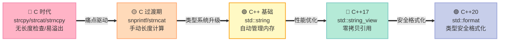
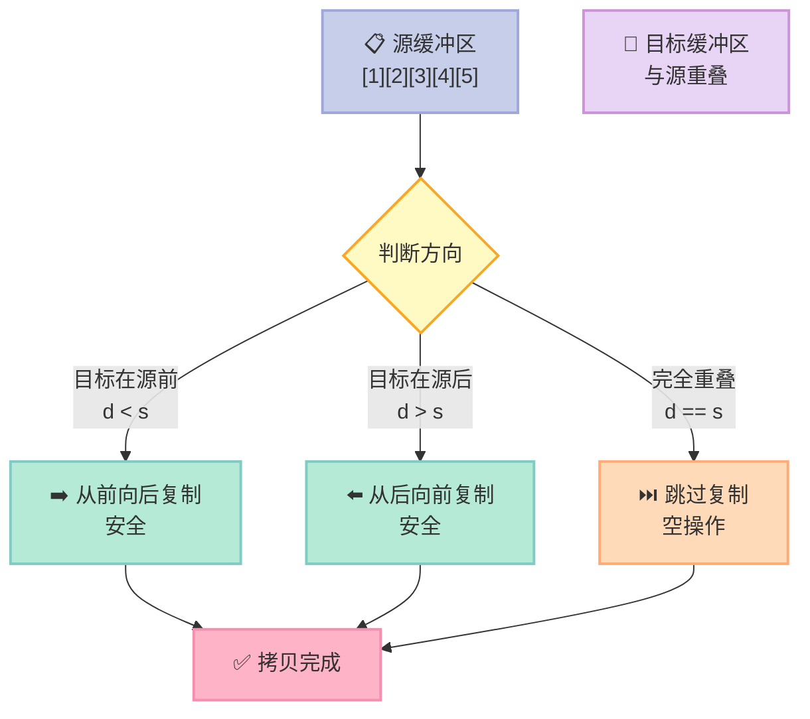
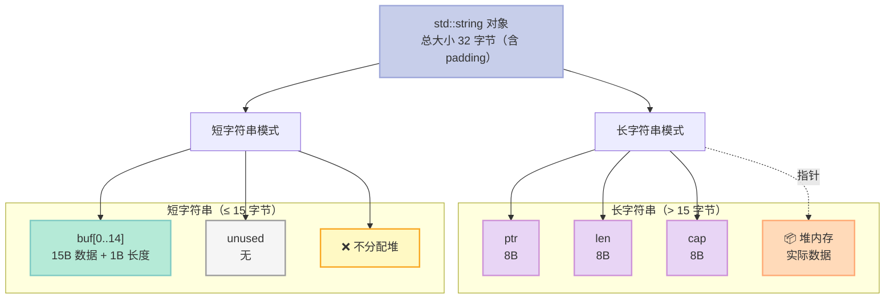
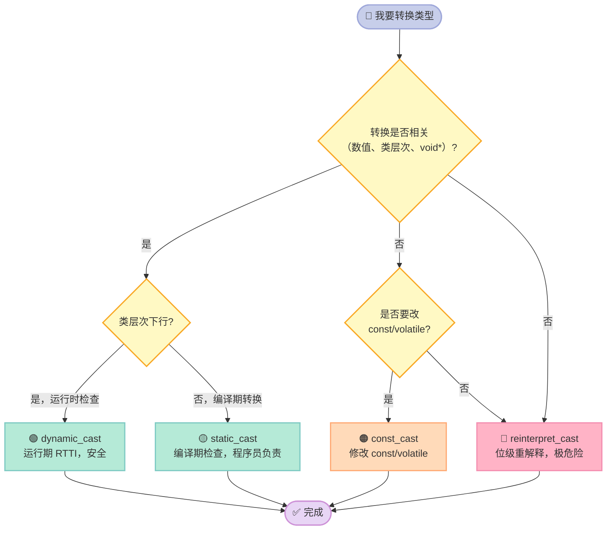

> 一句话核心结论：**strcpy 是不安全的，strncpy 也不完全安全，std::string + std::string_view 才是 C++ 的正解；4 种 C++ 类型转换各有分工，static_cast 不是 C 风格转换的"替代品"，而是更精准的工具。**

---

## 前言

如果你问一个 C++ 程序员："`strcpy` 危不危险？"，他会说"危险"。但如果你追问"`strncpy` 安全吗？"，能立刻答出"**strncpy 也不安全**"的，可能就只剩一半了。

字符串与内存，是 C/C++ 面试中**最古老、也最容易被忽视**的题目。从 `strcpy` 到 `std::string_view`，从 `malloc` 到 `new`，从 C 风格强制转换到 `static_cast`——这些 API 看起来人畜无害，实际上**每一个都暗藏陷阱**。

读完这一篇，你能彻底搞懂：

- **`strcpy` / `strncpy` / `strcat` / `memcpy` 的真实安全性差异**
- **`std::string` 内部到底怎么存数据？SSO 是什么？**
- **`std::string_view` 为什么是 C++17 最重要的字符串类型？**
- **4 种 C++ 类型转换分别怎么用？什么时候必须用 `dynamic_cast`？**
- **如何写一个不会出错的字符串工具类？**

---

## 一、开篇三连问

### 1.1 `strcpy` 为什么危险？

```c
// 经典缓冲区溢出
void unsafe_copy(const char* src) {
    char buf[8];                          // 只分配了 8 字节
    strcpy(buf, src);                     // 但 src 可能远超 8 字节
}
```

`strcpy` 会**无脑复制到 `'\0'` 结束符为止**，完全不看目标缓冲区有多大。这就是 **缓冲区溢出（Buffer Overflow）** 的典型成因——也是 Heartbleed、Shellshock 等著名漏洞的元凶。

### 1.2 `strncpy` 就安全吗？

```c
char buf[8];
strncpy(buf, "hello world", sizeof(buf));
buf[sizeof(buf) - 1] = '\0';             // 还要手动补 '\0'，烦不烦？
```

`strncpy` 的"安全"是**假象**：

- 如果 `src` 长度 ≥ `n`，它**不会补 `'\0'`**！这是个惊天大坑。
- 如果 `src` 长度 < `n`，它会把 `'\0'` 一直填充到 `n` 个字节（**性能浪费**）。
- 所以 `strncpy` 既不是边界检查版本，也不是安全版本——它是一个**古老、蹩脚的临时方案**。

### 1.3 `static_cast` 到底在 cast 什么？

```cpp
double d = 3.14;
int i = static_cast<int>(d);             // 编译期转换，安全可控
Base* b = new Derived();
Derived* d = static_cast<Derived*>(b);   // 下行转换，编译期通过，运行期可能炸
```

`static_cast` **没有运行时检查**——它相信程序员。如果你写了不安全的转换，编译器会**放行**，出问题你自己负责。

下面我们逐个击破。

---

## 二、字符串字面量、`char*`、`char[]`、`std::string` 的本质区别

在写 `strcpy` 之前，必须先搞懂字符串在 C/C++ 中到底有几种存在形式。

### 2.1 四种字符串载体对比表

| 特性 | 字符串字面量 | `char*` | `char[]` | `std::string` |
|------|-------------|---------|----------|---------------|
| **存储位置** | 只读数据段（.rodata） | 指针本身在栈/堆，指向任意位置 | 栈或全局内存 | 栈/堆（SSO 或堆） |
| **可写性** | ❌ 不可写（UB） | ⚠️ 取决于指向 | ✅ 可写 | ✅ 可写 |
| **大小** | 编译期固定 | 4/8 字节（指针） | 编译期或运行时 | 动态（SSO 通常 15 字节内） |
| **生命周期** | 进程整个生命周期 | 由指向位置决定 | 作用域结束或全局 | 作用域结束或显式析构 |
| **类型** | `const char[N]` | `char*` | `char[N]` | `std::basic_string<char>` |
| **C++ 推荐** | ❌ | ❌ | ⚠️ 偶尔 | ✅ 强烈推荐 |
| **C 推荐** | ✅ | ✅ | ✅ | ❌（无 C++ 标准库） |

### 2.2 字符串字面量不可写：经典 UB 案例

```cpp
// ❌ 典型未定义行为
char* p = "hello";                       // C++11 前能编译，C++11 后是 const char*
p[0] = 'H';                              // 写入只读段，UB！可能段错误，也可能"成功"
std::cout << p << std::endl;
```

```cpp
// ✅ 正确写法
const char* p1 = "hello";                // 明确不可写
char p2[] = "hello";                     // 数组形式，内容可写
p2[0] = 'H';                             // ✅ OK
std::cout << p2 << std::endl;            // 输出 "Hello"
```

### 2.3 `const char*` 与 `std::string` 的关系

题目 118 问的就是这个。**`const char*` 是 C 风格字符串（带 `'\0'` 结尾的字符数组），`std::string` 是 C++ 风格字符串（带长度信息的对象）。**

```cpp
#include <string>
#include <cstring>

// a) string → const char*（无需拷贝，开销低）
std::string s = "abc";
const char* c_s = s.c_str();             // 返回内部缓冲区的只读指针

// b) const char* → string（隐式转换，有一次堆分配）
const char* c_s = "abc";
std::string s(c_s);                      // 构造时拷贝
// std::string s = c_s;                  // 也能这样写

// c) string → char*（必须拷贝，原 string 不知道 char* 的生命周期）
std::string s = "abc";
const int len = s.length();
char* c = new char[len + 1];             // 留 '\0' 位置
strcpy(c, s.c_str());                    // 安全版 strcpy，strcpy 本身不检查长度
// ... 使用 c ...
delete[] c;                              // 必须自己释放

// d) char* → string（隐式转换）
char* c = "abc";                         // 字面量赋值给 char* 是 C 遗留问题
std::string s(c);
```

> 注意：`s.c_str()` 返回的指针，**生命周期与 `s` 绑定**。`s` 析构或被修改后，指针立即失效。**千万不要把 `c_str()` 返回的指针存起来长期用**。

### 2.4 函数参数传递建议表

| 参数语义 | 推荐类型 | 原因 |
|----------|----------|------|
| **只读输入** | `std::string_view` (C++17) | 零拷贝，不强制构造 std::string |
| **只读输入（C 兼容）** | `const char*` | 与 C API 互通 |
| **需要修改但不修改长度** | `std::string&` | 避免拷贝 |
| **需要修改且要传出所有权** | `std::string`（按值传） | 走移动语义，零拷贝 |
| **C 风格缓冲区** | `char* buf, size_t len` | 显式长度 |

```cpp
// ❌ 旧风格：可能产生不必要拷贝
void print_name(const std::string& name);    // 传 string 引用 OK，但调用方可能要构造临时 string

// ✅ 现代风格：零拷贝
void print_name(std::string_view name);       // 接受 string、字面量、char* 都行
```

---

## 三、C 字符串函数族：危险等级一览

### 3.1 常见字符串函数安全性对比表

| 函数 | 功能 | 安全性 | 替代方案 |
|------|------|--------|----------|
| `strcpy(dest, src)` | 复制字符串 | ❌ 极危险，无长度检查 | `std::string`、`strlcpy` |
| `strcat(dest, src)` | 追加字符串 | ❌ 极危险，无长度检查 | `std::string::append` |
| `strncpy(dest, src, n)` | 复制 n 字节 | ⚠️ 不补 `'\0'`，易踩坑 | `snprintf` 或 `std::string` |
| `strncat(dest, src, n)` | 追加 n 字节 | ⚠️ 参数是追加长度，不是总长度 | `std::string::append` |
| `strcmp(s1, s2)` | 比较 | ✅ 安全 | `std::string::compare` |
| `strlen(s)` | 取长度 | ⚠️ 不含 `'\0'`，需 O(n) | `std::string::size()` |
| `sprintf(buf, fmt, ...)` | 格式化 | ❌ 无长度检查 | `snprintf` |
| `snprintf(buf, n, fmt, ...)` | 格式化 | ✅ 有长度检查 | `std::format` (C++20) |
| `memcpy(dst, src, n)` | 复制内存 | ⚠️ 不处理重叠 | `memmove` |
| `memmove(dst, src, n)` | 复制内存 | ✅ 处理重叠 | - |
| `memset(buf, val, n)` | 填充字节 | ⚠️ 不能用于非 trivially 复制类型 | `std::fill_n` |

### 3.2 `strcpy` 内部实现原理

```c
// 简化版 strcpy 实现（glibc 风格）
char* strcpy(char* dest, const char* src) {
    char* d = dest;
    // 经典写法：先把 *src 赋给 *d，然后两者都自增
    // 用 (赋值结果 != '\0') 作为循环条件，一举两得
    while ((*d++ = *src++) != '\0') {
        // 空循环体，所有逻辑都在条件里
    }
    return dest;                          // 返回 dest 便于链式调用
}
```

**为什么有返回值？** 为了支持链式表达式：

```c
char buf[100];
strcpy(buf, strcpy(buf + 50, "hello"));   // 嵌套调用，把 dest 指针返回出来
```

这是**典型的"接口设计冗余"**——大多数场景用不上，但少数场景很方便。

### 3.3 `strcat` 内部实现

```c
char* strcat(char* dest, const char* src) {
    char* d = dest + strlen(dest);        // 先找到 dest 末尾的 '\0'
    while ((*d++ = *src++) != '\0') {     // 经典 strcpy 内循环
        // 继续追加
    }
    return dest;
}
```

**双重 O(n) 开销**——既要扫一遍 `dest` 找末尾，又要扫一遍 `src` 复制。`std::string::append` 在已知长度时是 O(1)。

### 3.4 `strncpy` 的三大坑

```c
char* strncpy(char* dest, const char* src, size_t n) {
    size_t i;
    for (i = 0; i < n && src[i] != '\0'; i++) {
        dest[i] = src[i];                 // 复制 src 的字符
    }
    for (; i < n; i++) {
        dest[i] = '\0';                   // 用 '\0' 填充剩余位置
    }
    return dest;
}
```

**坑点 1：不保证 `'\0'` 结尾**

```c
char buf[8];
strncpy(buf, "abcdefghijklmn", 8);       // src 长度 > n
// buf 内容是 "abcdefgh"（8 个字符），但 buf[8] 越界访问！
// 没有任何 '\0' 终止符，printf(buf) 会读到栈上随机数据
```

**坑点 2：`src` 长度 < `n` 时强制填充 `'\0'`**

```c
char buf[100];
strncpy(buf, "hi", 100);                 // 实际上要写 100 个字节（"hi" + 98 个 '\0'）
// 性能浪费，且如果是磁盘 I/O 场景，零字节也要写入
```

**坑点 3：参数含义在不同函数间不一致**

- `strncpy(dest, src, n)` 中 `n` 是**目标最大长度**
- `strncat(dest, src, n)` 中 `n` 是**追加字符数**（不是总长度！）

```c
char buf[10] = "abc";
strncat(buf, "defghij", 5);              // 追加 5 个字符："abcdefghij"
// buf 总长度变为 10（含 '\0'），刚好填满！
// 如果传 6，会溢出
```

### 3.5 `strcpy` 缓冲区溢出实战

```cpp
#include <cstring>
#include <iostream>

void vulnerable_function(const char* input) {
    char buf[16];
    strcpy(buf, input);                   // ❌ 经典漏洞：CVE-2014-0160 Heartbleed 就是这类
    std::cout << "buf = " << buf << std::endl;
}

int main() {
    const char* attacker = "AAAAAAAABBBBBBBBCCCCCCCCDDDDDDDD"
                           "EEEEEEEEFFFFFFFFGGGGGGGGHHHHHHHH";
    vulnerable_function(attacker);       // 越界写，破坏栈帧，可能执行任意代码
    return 0;
}
```

**防御方案对比表**

| 方案 | 代码 | 优缺点 |
|------|------|--------|
| **`strncpy` + 手动补 `'\0'`** | `strncpy(buf, src, sizeof(buf)-1); buf[sizeof(buf)-1]='\0';` | ⚠️ 易遗漏 |
| **`snprintf`** | `snprintf(buf, sizeof(buf), "%s", src);` | ✅ 永远安全 |
| **`std::string`** | `std::string s = src;` | ✅ 自动扩容 |
| **C11 Annex K `strcpy_s`** | `strcpy_s(buf, sizeof(buf), src);` | ✅ 安全但**非标准**（Windows 才有） |
| **BSD `strlcpy`** | `strlcpy(buf, src, sizeof(buf));` | ✅ 安全，Linux/macOS 有，**Windows 无** |

### 3.6 推荐：现代 C++ 字符串处理范式

```cpp
#include <string>
#include <string_view>
#include <format>                         // C++20

// ✅ 构造用 std::string
std::string s = "hello";
s += " world";                           // 无溢出风险，自动扩容
s.append(10, '!');                       // 追加 10 个 '!'

// ✅ 只读场景用 std::string_view（C++17）
void process(std::string_view sv) {
    // sv 可能是 std::string、字面量、char*，零拷贝
    if (sv.find("error") != std::string_view::npos) {
        // ...
    }
}

// ✅ 格式化用 std::format（C++20）
std::string msg = std::format("Hello, {}! You are {} years old.", name, age);

// ✅ 输出到 C 风格缓冲区
char buf[100];
std::format_to_n(buf, sizeof(buf), "x = {}, y = {}", x, y);  // 不会溢出
```

### 3.7 字符串安全演进路线图



---

## 四、内存操作三剑客：`memset` / `memcpy` / `memmove`

### 4.1 三大函数对比表

| 特性 | `memset` | `memcpy` | `memmove` |
|------|----------|----------|-----------|
| **功能** | 按字节填充 | 内存拷贝 | 内存拷贝 |
| **支持重叠** | N/A | ❌ 不支持 | ✅ 支持 |
| **用途** | 初始化、清零 | 块拷贝 | 块拷贝（可能重叠） |
| **典型实现** | 循环写字节 | `rep movsb` 或循环 | 智能判断方向 |
| **复杂度** | O(n) | O(n) | O(n) |
| **性能** | 极快（SIMD） | 极快（SIMD） | 略慢（分支判断） |

### 4.2 `memset`：按字节填充

```c
void* memset(void* s, int c, size_t n) {
    unsigned char* p = (unsigned char*)s;
    for (size_t i = 0; i < n; i++) {
        p[i] = (unsigned char)c;          // 注意：c 被截断为 unsigned char
    }
    return s;
}
```

**坑点：只能用于 trivially copyable 类型**

```cpp
#include <cstring>

struct Point {
    double x, y, z;                       // 24 字节 trivially copyable
};

Point p;
memset(&p, 0, sizeof(p));                // ✅ OK，把 Point 全部清零

struct String {
    char* data;
    size_t len;
    // 不是 trivially copyable（有指针，需要深拷贝）
};

String s;
memset(&s, 0, sizeof(s));                // ❌ 把 data 指针清零了，但 length 没了，析构时会 double free
```

### 4.3 `memcpy`：高速内存拷贝

```c
void* memcpy(void* dest, const void* src, size_t n) {
    unsigned char* d = (unsigned char*)dest;
    const unsigned char* s = (const unsigned char*)src;
    for (size_t i = 0; i < n; i++) {
        d[i] = s[i];
    }
    return dest;
}
```

**现代实现**：编译器会自动用 `rep movsb`（x86）或 `ldm/stm`（ARM）等 SIMD 指令优化，速度可达 10GB/s+。

**坑点：不能处理重叠内存**

```cpp
char buf[] = "1234567890";
// 想把 buf[0..4] 拷贝到 buf[2..6]（向右移 2 位）
memcpy(buf + 2, buf, 5);
// ❌ UB！结果可能是 "1212121212" 或 "1212121290"，完全不确定
```

### 4.4 `memmove`：处理重叠的安全拷贝

```c
void* memmove(void* dest, const void* src, size_t n) {
    unsigned char* d = (unsigned char*)dest;
    const unsigned char* s = (const unsigned char*)src;
    
    if (d < s) {
        // 目标在源左边：从前往后复制（不会覆盖还没读的 src）
        for (size_t i = 0; i < n; i++) {
            d[i] = s[i];
        }
    } else if (d > s) {
        // 目标在源右边：从后往前复制（不会覆盖还没读的 src）
        for (size_t i = n; i > 0; i--) {
            d[i-1] = s[i-1];
        }
    }
    // d == s：什么都不做
    return dest;
}
```

### 4.5 内存重叠拷贝流程图



### 4.6 实战：`memmove` 处理 `std::string` 内部重叠

```cpp
// 简化版 std::string 的 erase 实现
void string_erase(char* data, size_t pos, size_t len, size_t total_len) {
    // 假设要删除 [pos, pos+len) 区间
    // 也就是把 [pos+len, total_len) 区间向前移动 len 字节
    memmove(data + pos,                   // 目标：pos
            data + pos + len,             // 源：pos+len
            total_len - pos - len);       // 长度：剩余部分
    // 这里 memmove 必须处理 [pos, pos+len) 与 [pos+len, total_len) 的重叠
}
```

**为什么 `std::string::erase` 用 `memmove` 而不是 `memcpy`？** 因为源区间和目标区间在**同一个缓冲区**里，**必然重叠**。

### 4.7 `memset` 的典型应用与误区

```cpp
#include <cstring>

// ✅ 正确用法 1：清零原始内存
char buffer[1024];
memset(buffer, 0, sizeof(buffer));       // 初始化为全 0

// ✅ 正确用法 2：把 int 数组初始化为 0
int arr[100];
memset(arr, 0, sizeof(arr));             // 全部清零（int 通常 4 字节，全 0 就是数值 0）

// ❌ 错误用法 1：把 int 数组初始化为 1
int arr[100];
memset(arr, 1, sizeof(arr));             // 每个字节都设为 0x01，结果是 0x01010101 = 16843009

// ❌ 错误用法 2：清零含有 std::string 的结构体
struct User {
    std::string name;
    int age;
};
User u;
memset(&u, 0, sizeof(u));                // ❌ name 的指针被清零，但 name 之前可能在堆上分配了内存
                                          // 析构时 u.name 不知道要 delete，泄漏！
                                          // 而且 u.name 的 SSO 缓冲区如果被破坏，可能 crash

// ❌ 错误用法 3：清零含有虚函数表指针的对象
struct Base { virtual void foo(); };
struct Derived : Base { int x; };
Derived d;
memset(&d, 0, sizeof(d));                // ❌ 虚函数表指针 vptr 被清零，后续虚函数调用 crash
```

### 4.8 `memset(this, 0, sizeof(*this))` 真的能用吗？——题目 158

**能用，但不是万能。** 看以下场景：

| 场景 | 能否 `memset(this, 0, sizeof(*this))` |
|------|--------------------------------------|
| 全是 POD 成员（int、char、struct） | ✅ 可以 |
| 含 `std::string` 成员 | ❌ 会破坏 SSO 或堆指针 |
| 含 `std::vector` 成员 | ❌ 会破坏堆指针和析构逻辑 |
| 含虚函数 | ❌ 会破坏 vptr（虚表指针） |
| 父类有虚函数 | ❌ 同上 |
| 想用 `placement new` 重新构造 | ⚠️ 析构顺序会很奇怪 |

```cpp
// ❌ 典型错误：清零 this
class Widget {
    std::string name_;                   // 含 std::string
    int value_;
public:
    Widget() {
        memset(this, 0, sizeof(*this));  // ❌ 破坏 name_ 的内部状态
    }
    ~Widget() {
        // name_ 析构时会读 SSO/堆指针，但已被清零 → 段错误
    }
};

// ✅ 正确做法
class Widget {
    std::string name_;
    int value_ = 0;                      // 成员初始化
public:
    Widget() = default;                  // 自动调用成员的默认构造
    Widget(const char* n, int v) : name_(n), value_(v) {}
};
```

---

## 五、`std::string` 的内部实现：SSO、COW 与现代演进

### 5.1 历史：COW（Copy-On-Write）已被废弃

早期 GCC 的 libstdc++ 和 MSVC 都曾实现过 **COW 字符串**：多个 `std::string` 对象共享同一个底层缓冲区，**只在第一次写入时才拷贝**。

```cpp
// COW 时代的"零拷贝"
std::string a = "hello, world, this is a long string";
std::string b = a;                       // 不拷贝！共享底层 buffer，引用计数 +1
b[0] = 'H';                              // 写时才拷贝（COW 触发）
```

**为什么 COW 被废弃了？**

| 优点 | 致命缺点 |
|------|----------|
| ✅ 拷贝"零成本" | ❌ 引用计数原子操作，比想象中贵 |
| ✅ 适合大量共享场景 | ❌ 多线程下原子操作严重拖慢性能 |
| | ❌ 与 C++11 移动语义冲突（移动应该零开销） |
| | ❌ 迭代器失效规则变得诡异 |
| | ❌ `operator[]` 引用要偷偷做 COW 检查，破坏 `constexpr` |

C++11 标准明确要求 `std::string` **不再是 COW 实现**。GCC 5+ 已经切换到 SSO 模式。

### 5.2 现代主流：SSO（Small String Optimization）

**SSO 思想**：**短字符串直接存在 `std::string` 对象内部**（栈上），不分配堆内存。

```cpp
class string_sso {
private:
    union {
        struct {
            char* ptr;                   // 长字符串：指向堆内存
            size_t len;
            size_t cap;
        } long_str;
        struct {
            char buf[sizeof(long_str)];  // 短字符串：直接存这里
            uint8_t small_size;          // 短字符串长度（藏在 union 末尾）
        } short_str;
    };
};
```

**不同标准库的 SSO 阈值**

| 标准库 | SSO 最大长度 | 说明 |
|--------|--------------|------|
| **libstdc++ (GCC)** | 15 字节 | 主流选择 |
| **libc++ (Clang/LLVM)** | 22 字节 | 略大 |
| **MSVC** | 15 字节 | 与 GCC 相同 |
| **EASTL** | 可配置 | 游戏引擎常用 |

> 注意：是**字节数**（不含 `'\0'`），不是字符数。UTF-8 字符串每个字符 1-4 字节不等。

### 5.3 SSO 内存布局图



### 5.4 SSO 实战验证

```cpp
#include <string>
#include <iostream>
#include <iomanip>

template <typename T>
void print_bytes(const T& obj, const char* label) {
    const unsigned char* p = reinterpret_cast<const unsigned char*>(&obj);
    std::cout << label << " (" << sizeof(T) << " bytes): ";
    for (size_t i = 0; i < sizeof(T); i++) {
        std::cout << std::hex << std::setw(2) << std::setfill('0')
                  << (int)p[i] << " ";
    }
    std::cout << std::dec << std::endl;
}

int main() {
    std::string short_str = "hi";        // 2 字符，触发 SSO
    std::string long_str  = "this is a long string, definitely not in SSO!";

    print_bytes(short_str, "short");
    print_bytes(long_str,  "long");

    // 验证：取地址，看短字符串是否在 std::string 对象内部
    const char* short_data = short_str.data();
    const char* long_data  = long_str.data();
    const std::string* obj_ptr = &short_str;

    std::cout << "short_str.data() in this object: "
              << (short_data >= (const char*)obj_ptr &&
                  short_data < (const char*)obj_ptr + sizeof(std::string)
                  ? "YES (SSO)" : "NO (heap)")
              << std::endl;

    std::cout << "long_str.data() in this object:  "
              << (long_data >= (const char*)obj_ptr &&
                  long_data < (const char*)obj_ptr + sizeof(std::string)
                  ? "YES (SSO)" : "NO (heap)")
              << std::endl;

    return 0;
}
```

**典型输出（GCC 11, x86-64）**：

```
short (32 bytes): 68 69 00 00 00 00 00 00 00 00 00 00 00 00 00 00 02 00 00 00 00 00 00 00 00 00 00 00 00 00 00 00
long  (32 bytes): 78 55 6f 55 d9 55 00 00 2b 00 00 00 2b 00 00 00 ...
short_str.data() in this object: YES (SSO)
long_str.data() in this object:  NO (heap)
```

> 可以看到 `short` 字符串的 `68 69 00...` 就是 `"hi\0"`，直接存在对象内部。

### 5.5 SSO 的性能影响

```cpp
#include <chrono>
#include <string>
#include <vector>

void bench() {
    constexpr int N = 1'000'000;
    std::vector<std::string> v;
    v.reserve(N);

    auto start = std::chrono::high_resolution_clock::now();
    for (int i = 0; i < N; i++) {
        v.emplace_back("hi");            // 短字符串，触发 SSO
    }
    auto end = std::chrono::high_resolution_clock::now();

    auto us = std::chrono::duration_cast<std::chrono::microseconds>(end - start).count();
    std::cout << N << " short strings: " << us << " us\n";
    // 典型输出：1000000 short strings: 25000 us (25 ms)
    // 也就是 25ns 一次，主要是 vector 扩容开销
}
```

> **没有 SSO 的话**，每次 `emplace_back` 都要 `malloc` + `memcpy`，性能会差 10-50 倍。

### 5.6 SSO 适用场景判断表

| 字符串长度 | 是否触发 SSO | 性能特征 |
|------------|--------------|----------|
| 0-15 字节 | ✅ 是 | 零堆分配，极快 |
| 16-22 字节 | ⚠️ 取决于实现 | libc++ 可能 SSO |
| > 22 字节 | ❌ 否 | 一次堆分配 |
| 多次 `append` | ⚠️ 可能溢出到堆 | 即使初始 SSO 也会转换 |

---

## 六、`std::string_view`：C++17 的零拷贝引用

### 6.1 什么是 `string_view`

`std::string_view` 是**对一段连续字符序列的非拥有引用**——它不拷贝数据，不管理生命周期，只是一个"窗口"。

```cpp
#include <string_view>
#include <string>
#include <iostream>

void print(std::string_view sv) {
    std::cout << "[" << sv << "], length = " << sv.length() << "\n";
}

int main() {
    std::string s = "hello world";
    const char* c = "literal";
    char arr[] = {'H', 'i', '\0'};

    print(s);                             // ✅ std::string → string_view（隐式转换）
    print(c);                             // ✅ const char* → string_view
    print("raw literal");                 // ✅ 字面量 → string_view
    print(arr);                           // ✅ char[] → string_view
    print(std::string_view(arr, 2));      // ✅ 显式构造（不要求 '\0' 结尾）

    // 切片操作
    print(std::string_view(s).substr(6));  // "world"
    print(std::string_view(s).substr(0, 5)); // "hello"
}
```

### 6.2 `string_view` vs `const std::string&` vs `const char*`

| 特性 | `std::string_view` | `const std::string&` | `const char*` |
|------|---------------------|----------------------|---------------|
| **接受字面量** | ✅ 零开销 | ❌ 需要构造 `std::string` | ✅ 零开销 |
| **接受 `char*`** | ✅ 零开销 | ❌ 需要构造 `std::string` | ✅ 直接 |
| **接受 `std::string`** | ✅ 零开销 | ✅ 零开销 | ❌ 需要 `c_str()` |
| **存储长度** | ✅ O(1) | ✅ O(1) | ❌ 需要 `strlen` |
| **要求 `'\0'` 结尾** | ❌ 不要求 | N/A | ✅ 要求 |
| **C++ 标准** | C++17 | C++98 | C89 |

**结论**：`std::string_view` 是**最通用、最高效的只读字符串参数类型**。

### 6.3 `string_view` 内部结构

```cpp
// 简化版 string_view
class string_view {
private:
    const char* data_;                    // 指向字符序列
    size_t size_;                         // 字符数量（不含 '\0'）
};
```

**大小**：通常 16 字节（一个指针 + 一个 size_t），**比 `std::string` 小一倍**。

### 6.4 致命陷阱：悬挂引用（Dangling）

`string_view` **不拥有数据**——如果底层数据被销毁，`string_view` 立即失效。

```cpp
// ❌ 经典悬挂引用：返回 string_view 指向局部 std::string
std::string_view get_name() {
    std::string name = "Alice";
    return name;                          // name 在函数结束时析构
}                                         // 返回的 string_view 指向已释放内存！

int main() {
    auto name = get_name();
    std::cout << name << std::endl;       // ❌ UB：可能输出 "Alice"，也可能是乱码
    std::cout << name.length() << std::endl;  // 长度可能也是错的
}
```

```cpp
// ❌ 另一个陷阱：string_view 指向 vector 的元素，vector 扩容后失效
std::vector<char> buf = {'h', 'i'};
std::string_view sv(buf.data(), buf.size());
buf.push_back('!');                      // 可能触发 vector 扩容，buf.data() 指向新地址
std::cout << sv << std::endl;            // ❌ UB：sv 还指向旧地址
```

```cpp
// ❌ 隐藏陷阱：隐式转换的生命周期
void log(std::string_view sv);

log(std::string("temp") + "literal");     // ❌ 临时 std::string 立即析构
                                           // sv 指向已销毁的 string，UB！

// ✅ 正确做法
std::string s = std::string("temp") + "literal";
log(s);                                  // s 拥有数据，活到 log 返回后
```

### 6.5 何时使用 `string_view`

| 场景 | 推荐类型 |
|------|----------|
| 函数参数（只读、零拷贝） | ✅ `std::string_view` |
| 函数返回值（指向已存在数据） | ⚠️ 谨慎，必须保证数据生命周期 |
| 成员变量（长期存储） | ❌ **绝对不要**！用 `std::string` |
| 局部变量（短生命周期） | ✅ 可以，但别传出作用域 |
| 全局静态数据 | ✅ 可以指向字面量 |
| 字符串字面量 | ✅ `constexpr std::string_view sv = "hello";` |

### 6.6 `string_view` 实战优化

```cpp
// ❌ 旧代码：每次调用都可能分配堆
bool contains_keyword(const std::string& s, const std::string& keyword) {
    return s.find(keyword) != std::string::npos;
}
contains_keyword("user input", "admin");  // 构造 2 个临时 string

// ✅ 优化：零分配
bool contains_keyword(std::string_view s, std::string_view keyword) {
    return s.find(keyword) != std::string_view::npos;
}
contains_keyword("user input", "admin");  // 零堆分配

// ✅ 字面量查找：编译期完成
constexpr std::string_view HELLO = "Hello, World!";
static_assert(HELLO.size() == 13);
static_assert(HELLO.substr(0, 5) == "Hello");
```

---

## 七、`malloc` / `free` vs `new` / `delete` 详解

### 7.1 C 与 C++ 内存管理对比表

| 特性 | `malloc` / `free` | `new` / `delete` |
|------|-------------------|------------------|
| **来源** | C 标准库 | C++ 运算符 |
| **构造/析构** | ❌ 不调用 | ✅ 自动调用 |
| **类型安全** | ❌ 返回 `void*`，需强转 | ✅ 返回具体类型 |
| **失败处理** | 返回 `NULL`（或 `nullptr`） | 抛 `std::bad_alloc` |
| **数组支持** | `malloc(n * sizeof(T))` | `new T[n]`（调用 n 次构造） |
| **可重载** | ❌ 不可以 | ✅ 可以（`operator new`） |
| **重载时机** | N/A | 编译期 |
| **C++ 推荐** | ❌（除非与 C 库互操作） | ✅ 强烈推荐 |

### 7.2 底层关系

```cpp
// new 的三步分解
// 1. operator new：申请内存（通常调用 malloc）
// 2. placement new：在内存上构造对象
// 3. 返回类型化指针

// delete 的两步分解
// 1. 调用析构函数
// 2. operator delete：释放内存（通常调用 free）
```

### 7.3 实战：`new` vs `malloc`

```cpp
#include <new>
#include <cstdlib>
#include <cstring>
#include <iostream>

class Widget {
    int* data_;
    size_t size_;
public:
    Widget(size_t n) : size_(n), data_(new int[n]) {
        std::cout << "ctor Widget(" << n << ")\n";
    }
    ~Widget() {
        std::cout << "dtor Widget\n";
        delete[] data_;
    }
};

int main() {
    // ✅ 方式 1：new/delete（推荐，自动调用构造/析构）
    Widget* w1 = new Widget(10);
    // 使用 w1
    delete w1;                            // 自动调用 ~Widget()，然后 free 内存

    // ❌ 方式 2：malloc/free（不会调用构造/析构，泄漏或崩溃）
    Widget* w2 = (Widget*)malloc(sizeof(Widget));
    // 不会输出 "ctor Widget(10)"
    free(w2);                             // 不会调用 ~Widget()，data_ 泄漏！

    return 0;
}
```

**输出**：

```
ctor Widget(10)
dtor Widget
（无 Widget 输出，因为 malloc 不调构造）
```

### 7.4 placement new：在指定内存上构造

```cpp
#include <new>
#include <cstdlib>
#include <cstring>

int main() {
    // 1. 申请原始内存
    void* buffer = std::malloc(sizeof(Widget));
    if (!buffer) return 1;

    // 2. placement new：在 buffer 上构造 Widget
    Widget* w = new (buffer) Widget(20);  // 不会分配新内存

    // 3. 显式调用析构
    w->~Widget();

    // 4. 释放内存
    std::free(buffer);

    return 0;
}
```

**典型用途**：

- **内存池**：预分配大块内存，按需构造对象
- **嵌入式系统**：裸机环境手动管理内存
- **`std::vector` 的 `reserve`**：预分配容量，构造时用 placement new
- **`std::optional` / `std::variant`**：内部存储用 placement new

### 7.5 数组形式：`new[]` / `delete[]`

```cpp
int* arr = new int[100];                 // 调用 100 次 int 构造（对 int 是空操作）
// 使用 arr
delete[] arr;                            // 调用 100 次 int 析构，然后释放内存

// ❌ 错误：new[] 必须配对 delete[]
int* p = new int[10];
delete p;                                // ❌ UB！只调用 1 次析构，泄漏 9 个元素
```

**为什么必须有 `delete[]`？** 因为编译器会在数组前存储元素个数（cookie），`delete[]` 据此调用对应次数的析构函数。

```cpp
// 简化版：编译器在 new[] 时偷偷做的事
void* allocate_with_cookie(size_t n, size_t elem_size) {
    size_t* cookie = (size_t*)malloc(sizeof(size_t) + n * elem_size);
    *cookie = n;                          // 在数组头部存元素个数
    return cookie + 1;                    // 返回可用内存
}
```

### 7.6 内存管理"十诫"

| 编号 | 戒律 | 违反后果 |
|------|------|----------|
| 1 | `new` 配 `delete`，`new[]` 配 `delete[]` | 内存泄漏或崩溃 |
| 2 | `malloc` 配 `free`，别混用 `new`/`free` | UB |
| 3 | 一个指针只能 `delete` 一次 | double free |
| 4 | 不要 `delete` 同一块栈内存 | UB |
| 5 | `delete` 后立即置 `nullptr` | 防止悬挂 |
| 6 | 优先用智能指针（`unique_ptr`/`shared_ptr`） | 自动管理 |
| 7 | 自定义类禁用拷贝时要禁用拷贝构造/赋值 | 防止浅拷贝灾难 |
| 8 | 不要在构造函数里 `new` 后抛出异常 | 内存泄漏（用 RAII） |
| 9 | 基类析构函数必须 `virtual` | 派生类析构不调用 |
| 10 | 大对象用 `std::move` 转移所有权 | 避免不必要拷贝 |

---

## 八、4 种 C++ 类型转换详解（题目 93、157）

C 风格的强制转换 `(T)expr` 在 C++ 中**仍然可用**，但 C++ 提供了**4 种更精准的转换运算符**。理解它们的分工，是写出**类型安全、易于维护**代码的基础。

### 8.1 总览表

| 转换 | 用途 | 编译期/运行期 | 安全性 |
|------|------|---------------|--------|
| `static_cast` | 基础类型、类层次上行/下行、`void*` 反向 | 编译期 | ⚠️ 中（程序员负责） |
| `dynamic_cast` | 类层次下行转换（带类型检查） | 运行期（RTTI） | ✅ 高 |
| `const_cast` | 添加/移除 `const` 或 `volatile` | 编译期 | ⚠️ 低（破坏常量性） |
| `reinterpret_cast` | 指针与整数互转、不相关类型指针 | 编译期 | ❌ 极低（接近裸操作） |

### 8.2 `static_cast`：编译期静态转换

**用途 1：基本类型之间**

```cpp
int i = 42;
double d = static_cast<double>(i);       // int → double
char c = static_cast<char>(i);           // int → char（可能截断）

double pi = 3.14159;
int truncated = static_cast<int>(pi);     // 3（向 0 取整，非四舍五入）
```

**用途 2：类层次上行转换（安全）**

```cpp
class Base { virtual void foo() {} };
class Derived : public Base { void bar() {} };

Derived d;
Base* b = static_cast<Base*>(&d);        // ✅ Derived* → Base*（上行，安全）
Derived* d2 = static_cast<Derived*>(b);  // ⚠️ Base* → Derived*（下行，不检查）
```

**用途 3：枚举与整数互转**

```cpp
enum class Color { Red, Green, Blue };
int c = static_cast<int>(Color::Red);    // 0
Color col = static_cast<Color>(2);       // Color::Blue
```

**用途 4：`void*` 反向转换**

```cpp
void* buf = malloc(sizeof(int));
int* p = static_cast<int*>(buf);          // void* → int*
// ⚠️ 必须保证 buf 原本就是 int*，否则 UB
```

**用途 5：任何类型 → `void`**

```cpp
int x = 42;
static_cast<void>(x);                    // 显式丢弃值（通常用于压制 [[nodiscard]] 警告）
```

### 8.3 `dynamic_cast`：安全的下行转换

**核心特性**：依赖 RTTI（Run-Time Type Information），**运行期检查类型**，失败返回 `nullptr`（指针）或抛 `bad_cast`（引用）。

```cpp
#include <typeinfo>

class Shape { virtual void draw() {} };  // 必须是多态类型（含虚函数）
class Circle : public Shape { public: void area() {} };
class Square : public Shape { public: void area() {} };

void process(Shape* s) {
    // ❌ 错误：static_cast 不检查类型
    // Circle* c = static_cast<Circle*>(s);  // 如果 s 实际是 Square，c 指针指向错误对象

    // ✅ 正确：dynamic_cast 安全下行
    if (auto* c = dynamic_cast<Circle*>(s)) {
        c->area();                        // 确认是 Circle 才调用
    } else if (auto* sq = dynamic_cast<Square*>(s)) {
        sq->area();
    }
}

int main() {
    Circle c;
    process(&c);                          // 输出 "Circle area"

    Square sq;
    process(&sq);                         // 输出 "Square area"
    return 0;
}
```

**引用版本：失败抛异常**

```cpp
void process_ref(Shape& s) {
    try {
        Circle& c = dynamic_cast<Circle&>(s);
        c.area();
    } catch (const std::bad_cast& e) {
        std::cerr << "cast failed: " << e.what() << "\n";
    }
}
```

### 8.4 `const_cast`：添加/移除 const/volatile

```cpp
// 用途 1：去掉 const
const int x = 42;
int* p = const_cast<int*>(&x);            // ⚠️ 危险！写入 *p 是 UB
*p = 100;                                 // ❌ UB：x 是 const，编译器可能优化到寄存器

// 用途 2：函数重载歧义消除
void process(char* str);                  // 旧 API
void process(const char* str);            // 新 API

const char* s = "literal";
process(const_cast<char*>(s));            // 强制调用非 const 版本
```

**典型应用场景**：与 C 库互操作

```cpp
// C 库签名：int some_c_function(void* ptr);
// 但我们的指针是 const 的
const Data* data = get_data();
some_c_function(const_cast<Data*>(data)); // 去掉 const，假装可写
                                          // ⚠️ C 库不应真的写这块内存
```

### 8.5 `reinterpret_cast`：底层位级重解释

**最危险的转换**——直接重新解释内存，不做任何检查。

```cpp
// 用途 1：指针 ↔ 整数（用于哈希、序列化等）
int* p = new int(42);
uintptr_t addr = reinterpret_cast<uintptr_t>(p);   // 指针 → 整数
int* p2 = reinterpret_cast<int*>(addr);            // 整数 → 指针

// 用途 2：不相关类型指针之间
struct A { int x; };
struct B { double y; };

A a;
B* b = reinterpret_cast<B*>(&a);         // ⚠️ 极危险，a 的内存被当成 B 解读
b->y = 3.14;                              // 破坏 a 的二进制表示，UB（严格别名规则）

// 用途 3：函数指针转换
using FuncPtr = void(*)();
void foo() {}
FuncPtr fp = reinterpret_cast<FuncPtr>(&foo);  // 极少见，仅在回调注册时使用
```

**严格别名规则（Strict Aliasing）**：C++ 标准规定，**不同类型的指针不能指向同一块内存**。`reinterpret_cast` 是绕开这个规则的工具，但**后果自负**。

### 8.6 4 种 cast 决策流程图



### 8.7 4 种 C++ 类型转换 vs C 风格转换对比表

| 维度 | C++ 4 种 cast | C 风格 `(T)expr` |
|------|---------------|------------------|
| **可读性** | ✅ 一眼看出转换意图 | ❌ 无法区分 |
| **类型安全** | ✅ 编译期拒绝非法转换 | ❌ 几乎无所不能 |
| **可搜索性** | ✅ `grep "static_cast"` 找出所有 | ❌ 强转散布各处 |
| **误用难度** | ⚠️ 中等（reinterpret_cast 也危险） | ❌ 太容易误用 |
| **C 兼容** | ❌ C 没有 | ✅ 通用 |
| **编译速度** | 略慢（更多解析） | 略快 |
| **性能** | 完全相同（都是编译期指令） | 完全相同 |

**题目 157 标准答案**：

> 1. 更加安全：编译期能拒绝明显错误的转换（如 `static_cast` 不能去掉 `const`，必须用 `const_cast`）
> 2. 更直接明显：一眼看出是什么类型转什么类型
> 3. 可读性更好：能体现程序员的意图
> 4. 可搜索性：方便在大型代码库中审计

### 8.8 实战：综合运用 4 种 cast

```cpp
#include <iostream>
#include <vector>
#include <memory>
#include <typeinfo>

// 假设这是 C 库 API（无法修改签名）
extern "C" int process_raw_data(void* data, size_t size);

class DataProcessor {
    std::vector<uint8_t> buffer_;
public:
    DataProcessor(std::vector<uint8_t> buf) : buffer_(std::move(buf)) {}

    int send_to_c_library() {
        // 1. static_cast：void* → uint8_t*（已知类型）
        uint8_t* ptr = static_cast<uint8_t*>(buffer_.data());

        // 2. reinterpret_cast：uint8_t* → void*（传给 C 库）
        void* c_ptr = reinterpret_cast<void*>(ptr);

        // 3. 调用 C 库
        return process_raw_data(c_ptr, buffer_.size());
    }
};

class Base { virtual void serialize() {} };
class Derived : public Base {
    int value_ = 42;
public:
    void serialize() override { /* ... */ }
    int get_value() const { return value_; }
};

void polymorphic_processor(Base* base) {
    // 1. dynamic_cast：安全下行
    if (auto* d = dynamic_cast<Derived*>(base)) {
        std::cout << "Derived value: " << d->get_value() << "\n";
    }

    // 2. 如果确认类型正确，可用 static_cast 节省 RTTI 开销
    // Derived* d2 = static_cast<Derived*>(base);  // 程序员保证正确性
}

int main() {
    std::vector<uint8_t> data = {1, 2, 3, 4, 5};
    DataProcessor proc(std::move(data));
    int result = proc.send_to_c_library();
    std::cout << "C result: " << result << "\n";

    Derived d;
    polymorphic_processor(&d);

    return 0;
}
```

### 8.9 4 种 cast 的常见反模式

```cpp
// ❌ 反模式 1：用 static_cast 去掉 const
const int x = 10;
int* p = static_cast<int*>(&x);          // ❌ 编译错误！static_cast 不能去 const

// ❌ 反模式 2：用 reinterpret_cast 做 dynamic_cast 的事
Base* b = new Derived();
Derived* d = reinterpret_cast<Derived*>(b);  // ❌ 无类型检查，纯靠运气

// ❌ 反模式 3：用 const_cast 强制修改真正常量
const int true_const = 42;
int* p = const_cast<int*>(&true_const);
*p = 100;                                 // ❌ UB，编译器可能把 true_const 优化到寄存器

// ❌ 反模式 4：链式 cast
int* p = static_cast<int*>(static_cast<void*>(&some_double));
                                        // 应该用一行 reinterpret_cast，链式 cast 难以调试
```

### 8.10 何时**不要**用 4 种 cast

| 场景 | 推荐做法 | 原因 |
|------|----------|------|
| 数值类型转换 | **不用 cast** | 隐式转换即可，或用 `std::byte` 显式 |
| 算术类型 → 布尔 | `static_cast<bool>` 或 `!!` | 隐式转换可能丢信息 |
| 整数 → 枚举 | `static_cast<EnumType>` | OK |
| 派生类指针 → 基类指针 | **隐式转换**（不用 cast） | 上行永远安全 |
| 修改设计避免转换 | 重新设计类型系统 | 釜底抽薪 |

---

## 九、现代 C++ 字符串格式化：`std::format` 与 `fmt` 库

### 9.1 三种格式化方式对比表

| 方式 | 标准 | 安全性 | 类型安全 | 可读性 | 性能 |
|------|------|--------|----------|--------|------|
| `sprintf` | C89 | ❌ | ❌ | ⚠️ | 快 |
| `snprintf` | C99 | ✅ | ❌ | ⚠️ | 快 |
| `std::stringstream` | C++98 | ✅ | ✅ | ❌ | 慢 |
| `fmt::format` | 第三方 | ✅ | ✅ | ✅ | 极快 |
| `std::format` | C++20 | ✅ | ✅ | ✅ | 极快 |

### 9.2 `std::format` 实战（C++20）

```cpp
#include <format>
#include <string>
#include <iostream>

int main() {
    std::string name = "Alice";
    int age = 30;

    // ✅ 基本用法
    std::string s1 = std::format("Hello, {}!", name);
    // s1 = "Hello, Alice!"

    // ✅ 位置参数
    std::string s2 = std::format("{1} is {0} years old", age, name);
    // s2 = "Alice is 30 years old"

    // ✅ 格式说明
    std::string s3 = std::format("pi = {:.4f}", 3.141592653);
    // s3 = "pi = 3.1416"

    // ✅ 进制
    std::string s4 = std::format("hex: {:#x}, oct: {:#o}, bin: {:#b}", 255, 255, 255);
    // s4 = "hex: 0xff, oct: 0o377, bin: 0b11111111"

    // ✅ 宽度和对齐
    std::string s5 = std::format("[{:>10}]", "hi");      // "[        hi]"
    std::string s6 = std::format("[{:<10}]", "hi");      // "[hi        ]"
    std::string s7 = std::format("[{:^10}]", "hi");      // "[    hi    ]"
    std::string s8 = std::format("[{:*^10}]", "hi");     // "[****hi****]"

    // ✅ 填充字符
    std::string s9 = std::format("{:*=10}", 42);          // "********42"

    std::cout << s1 << "\n" << s2 << "\n" << s3 << "\n"
              << s4 << "\n" << s5 << "\n" << s6 << "\n"
              << s7 << "\n" << s8 << "\n" << s9 << "\n";

    return 0;
}
```

### 9.3 `std::format_to_n`：输出到固定大小缓冲区

```cpp
#include <format>

void safe_format(char* buf, size_t buf_size) {
    // ✅ 不会溢出，多余内容被截断
    auto result = std::format_to_n(buf, buf_size - 1, "x={} y={} z={}", 1, 2, 3);
    buf[result.size] = '\0';              // 手动补 '\0'
}
```

### 9.4 自定义类型的格式化支持

```cpp
#include <format>

struct Point {
    int x, y;
};

// ✅ C++20：定义 formatter 特化
template <>
struct std::formatter<Point> {
    constexpr auto parse(std::format_parse_context& ctx) {
        return ctx.begin();
    }
    auto format(const Point& p, std::format_context& ctx) const {
        return std::format_to(ctx.out(), "({}, {})", p.x, p.y);
    }
};

int main() {
    Point p{3, 4};
    std::string s = std::format("point = {}", p);  // "point = (3, 4)"
}
```

---

## 十、实战：写一个安全的字符串工具类

### 10.1 安全字符串复制函数

```cpp
#include <cstring>
#include <string>
#include <string_view>
#include <stdexcept>

// 方案 1：用 snprintf
std::string safe_copy_v1(const char* src) {
    if (!src) throw std::invalid_argument("null src");
    size_t len = std::strlen(src);
    char* buf = new char[len + 1];
    std::snprintf(buf, len + 1, "%s", src);
    std::string result(buf);
    delete[] buf;
    return result;
}

// 方案 2：用 std::string（C++ 推荐）
std::string safe_copy_v2(const char* src) {
    if (!src) throw std::invalid_argument("null src");
    return std::string(src);              // 自动管理内存，自动补 '\0'
}

// 方案 3：用 std::string_view（最灵活）
std::string safe_copy_v3(std::string_view src) {
    return std::string(src);              // 接受任何字符串类型
}
```

### 10.2 安全的字符串拼接

```cpp
// ❌ 危险
char buf[100];
strcat(buf, "hello");
strcat(buf, " world");
// buf 可能在某次 strcat 中溢出

// ✅ 安全
std::string s = "hello";
s += " world";                           // 自动扩容
s.append(10, '!');
```

### 10.3 自定义"安全字符串"包装类

```cpp
class SafeString {
    std::string data_;
public:
    SafeString() = default;
    explicit SafeString(const char* s) : data_(s ? s : "") {}

    // ✅ 禁止隐式构造 const char*，避免悬挂
    // （std::string 也能转 const char*，但生命周期由 std::string 管理，相对安全）

    // ✅ 安全的拼接
    SafeString& append(std::string_view sv) {
        data_.append(sv);
        return *this;
    }

    // ✅ 受控的 C 接口暴露
    const char* c_str() const { return data_.c_str(); }
    size_t size() const { return data_.size(); }

    // ✅ 子串操作（不分配，仅返回视图）
    std::string_view substr(size_t pos, size_t count = std::string_view::npos) const {
        return std::string_view(*this).substr(pos, count);
    }

    operator std::string_view() const { return data_; }
};
```

### 10.4 内存拷贝辅助函数

```cpp
#include <cstring>
#include <type_traits>
#include <stdexcept>

// ✅ 安全的 POD 类型数组拷贝
template <typename T>
typename std::enable_if<std::is_trivially_copyable<T>::value, void>::type
safe_copy(T* dest, const T* src, size_t n) {
    if (!dest || !src) throw std::invalid_argument("null pointer");
    // 用 memmove 处理重叠
    std::memmove(dest, src, n * sizeof(T));
}

// ✅ 安全的数组清零
template <typename T>
typename std::enable_if<std::is_trivially_copyable<T>::value, void>::type
safe_zero(T* arr, size_t n) {
    if (!arr) throw std::invalid_argument("null pointer");
    std::memset(arr, 0, n * sizeof(T));
}
```

---

## 十一、面试题集中答疑

### 11.1 题目 12 完整答案

> **int 转字符串、字符串转 int？strcat、strcpy、strncpy、memset、memcpy 的区别？**

**int ↔ string 转换**：

```cpp
// C++11 标准方式（推荐）
std::string s = std::to_string(42);      // int → string
int i = std::stoi("42");                 // string → int
long l = std::stol("1234567890");
double d = std::stod("3.14");

// ❌ 旧 C 方式（不推荐）
char buf[20];
sprintf(buf, "%d", 42);                  // 易溢出
int j = atoi("42");                      // 错误处理弱
```

**字符串函数对比表**

| 函数 | 功能 | 关键区别 | 安全性 |
|------|------|----------|--------|
| `strcpy` | 复制整个字符串 | 无长度检查，依赖 `'\0'` | ❌ 极危险 |
| `strncpy` | 复制 n 字节 | 不保证 `'\0'` 结尾 | ⚠️ 易踩坑 |
| `strcat` | 追加整个字符串 | 无长度检查 | ❌ 极危险 |
| `strncat` | 追加最多 n 字节 | `n` 是追加字符数（非总长） | ⚠️ 易混淆 |
| `memset` | 按字节填充 | 与具体类型无关 | ⚠️ 仅适合 POD |
| `memcpy` | 内存块复制 | 高速，不处理重叠 | ⚠️ 重叠时 UB |
| `memmove` | 内存块复制 | 处理重叠 | ✅ 安全 |

**替代方案**：

```cpp
// 用 std::string 彻底告别 strcpy/strcat
std::string s1 = "hello";
std::string s2 = s1;                     // 替代 strcpy
s1 += " world";                          // 替代 strcat

// 用 std::memmove 替代 memcpy（除非你确定不重叠）
std::memmove(dest, src, n);
```

### 11.2 题目 118 完整答案

> **const char* 与 string 之间的关系，传递参数问题？**

参见 §2.3，核心是：

- `std::string` 拥有数据，`const char*` 只是观察者
- `c_str()` 返回的指针生命周期与 `std::string` 绑定
- 函数参数推荐 `std::string_view`（C++17）或 `const std::string&`（C++11/14）

### 11.3 题目 156 完整答案

> **strcpy 函数和 strncpy 函数的区别？哪个函数更安全？**

**函数原型**：

```c
char* strcpy(char* dest, const char* src);
char* strncpy(char* dest, const char* src, size_t n);
```

**核心区别**：

| 维度 | `strcpy` | `strncpy` |
|------|----------|-----------|
| 复制长度 | 整个字符串（到 `'\0'`） | 最多 n 字节 |
| 目标要求 | 任意大小（**危险**） | 必须有 n 字节空间 |
| 结尾保证 | 总是补 `'\0'` | **不保证补 `'\0'`**（src ≥ n 时） |
| 源 src > n | 溢出 `dest` | 截断，不补 `'\0'` |
| 源 src < n | 正常 | 末尾用 `'\0'` 填充到 n 字节 |
| src 与 dest 重叠 | UB | UB |

**谁更安全？**

**两个都不完全安全**：

- `strcpy` 完全无长度检查——`strcpy` 升级版的 `strcpy_s`（C11 Annex K）才安全
- `strncpy` 不保证 `'\0'` 结尾，是典型的"看起来安全实际不安全"

**真正安全的做法**：

```c
// BSD/Linux/macOS 推荐
size_t strlcpy(char* dest, const char* src, size_t dest_size);

// Windows 推荐（C11 Annex K，MS 有）
errno_t strcpy_s(char* dest, rsize_t dest_size, const char* src);

// 跨平台推荐（C++）
std::string dest = src;                  // 让 C++ 标准库管
```

### 11.4 题目 157 完整答案

> **为什么要用 static_cast 转换而不用 c 语言中的转换？**

1. **更安全**：编译期拒绝明显错误的转换
   - `static_cast` 不能去掉 `const`（必须用 `const_cast`）
   - `static_cast` 不能做不相关类型指针转换（必须用 `reinterpret_cast`）

2. **更清晰**：一眼看出转换意图

   ```cpp
   int i = static_cast<int>(d);           // 数值转换
   int* p = const_cast<int*>(&x);         // 去除 const
   long addr = reinterpret_cast<long>(p); // 位级重解释
   ```

3. **可读性更好**：能体现程序员的意图和风险等级

4. **可搜索性**：方便代码审计（`grep "static_cast"` vs 散落的 `(T)`）

5. **与 C++ 类型系统协同**：能配合模板、智能指针等现代特性

---

## 十二、字符串与内存知识点速查表

### 12.1 字符串操作速查

| 操作 | C 风格 | C++ 推荐 | 安全性 |
|------|--------|----------|--------|
| 复制 | `strcpy(dst, src)` | `std::string s = src;` | C++ ✅ |
| 追加 | `strcat(dst, src)` | `s += src;` 或 `s.append(src);` | C++ ✅ |
| 取长度 | `strlen(s)` | `s.size()` 或 `s.length()` | C++ ✅ |
| 比较 | `strcmp(s1, s2)` | `s1 == s2` 或 `s1.compare(s2)` | C++ ✅ |
| 切片 | `substr + copy` | `string_view` | C++17 ✅ |
| 格式化 | `sprintf(buf, ...)` | `std::format(...)` | C++20 ✅ |
| 搜索 | `strstr(haystack, needle)` | `haystack.find(needle)` | C++ ✅ |
| 分割 | `strtok`（破坏原串） | 范围 for + find | C++ ✅ |

### 12.2 内存操作速查

| 操作 | 函数 | 注意事项 |
|------|------|----------|
| 填充字节 | `memset(buf, val, n)` | 仅 POD 类型 |
| 块拷贝（不重叠） | `memcpy(dst, src, n)` | 性能最高 |
| 块拷贝（可重叠） | `memmove(dst, src, n)` | 略慢但安全 |
| 申请内存 | `malloc(n)` / `new T` | C++ 用 new |
| 释放内存 | `free(p)` / `delete p` | C++ 用 delete |
| 数组分配 | `new T[n]` / `delete[] p` | 配对使用 |
| 预分配 | `std::vector::reserve` | 避免多次扩容 |
| 智能指针 | `std::unique_ptr<T>` | 自动释放 |

### 12.3 类型转换速查

| 场景 | 推荐 cast | 备选 |
|------|-----------|------|
| `int` ↔ `double` | `static_cast` | - |
| `Derived*` → `Base*`（上行） | 隐式转换 | - |
| `Base*` → `Derived*`（下行，安全优先） | `dynamic_cast` | `static_cast`（如果确认类型） |
| 去除 `const` | `const_cast` | - |
| 指针 ↔ 整数 | `reinterpret_cast` | - |
| `void*` → 具体类型 | `static_cast` | - |
| 枚举 ↔ 整数 | `static_cast` | - |

---

## 十三、字符串与内存常见面试追问

### 13.1 Q: `strlen` 时间复杂度？`std::string::size()` 呢？

| 函数 | 复杂度 | 原因 |
|------|--------|------|
| `strlen(s)` | O(n) | 必须遍历到 `'\0'` |
| `std::string::size()` | O(1) | `std::string` 内部存储长度 |

### 13.2 Q: `std::string` 的 `c_str()` 和 `data()` 有什么区别？

| 函数 | 返回类型 | C++11 起的保证 |
|------|----------|----------------|
| `c_str()` | `const char*` | 以 `'\0'` 结尾 |
| `data()` | `const char*` | C++11 前不一定以 `'\0'` 结尾，C++11 后保证 |

**现代 C++ 中两者几乎等价**。`data()` 是更通用的"获取底层数据"接口，`c_str()` 强调"C 字符串兼容"。

### 13.3 Q: `std::string::operator[]` 和 `at()` 区别？

```cpp
std::string s = "hello";
char c1 = s[10];                         // ❌ UB，越界不检查
char c2 = s.at(10);                      // ✅ 抛 std::out_of_range
```

`operator[]` 追求性能，**不做边界检查**；`at()` 安全，**有性能开销**。

### 13.4 Q: `std::string` 在不同 STL 实现下大小一样吗？

不一样，参见 §5.2。

### 13.5 Q: `memset(arr, 1, sizeof(arr))` 把 `int arr[10]` 初始化成什么了？

**每个字节都是 0x01**，所以整型值是 `0x01010101 = 16843009`，**不是 1**。

### 13.6 Q: `reinterpret_cast` 和 C 风格 `(void*)p` 有什么区别？

- 编译期检查：`reinterpret_cast` 不允许把指针转成更小的整数（某些编译器）
- 可读性：搜索 `reinterpret_cast` 一目了然
- 行为完全相同

### 13.7 Q: 为什么 `dynamic_cast` 要求基类有虚函数？

因为 `dynamic_cast` 用 RTTI（运行期类型信息）检查类型，RTTI 信息存储在**虚函数表（vtable）**中。没有虚函数就没有 vtable，就没有 RTTI。

```cpp
class Base {};                            // 无虚函数
class Derived : public Base {};

Base* b = new Derived();
Derived* d = dynamic_cast<Derived*>(b);  // ❌ 编译错误：Base 不是多态类型
```

### 13.8 Q: `std::move` 之后还能用对象吗？

`std::move` 本身**不做任何事**——它只是把对象转为右值引用，**实际移动由对应的移动构造/赋值函数完成**。

```cpp
std::string s = "hello";
std::string s2 = std::move(s);
// s 现在处于"有效但未指定"状态
// 对 s 重新赋值是安全的
// 但读取 s 的值是 UB（除了以下情况：保证有效的状态）
s = "world";                             // ✅ OK，重新赋值
std::cout << s << std::endl;             // ❌ UB，不要这样用
```

---

## 十四、避坑清单：字符串与内存十大陷阱

| 编号 | 陷阱 | 后果 | 防御 |
|------|------|------|------|
| 1 | `strcpy` 缓冲区溢出 | 栈破坏、任意代码执行 | 用 `std::string` 或 `snprintf` |
| 2 | 修改字符串字面量 | 段错误或静默数据破坏 | 用 `char[]` 而非 `char*` |
| 3 | `strncpy` 忘记补 `'\0'` | 字符串越界读取 | 用 `snprintf` 或 `std::string` |
| 4 | `memset(this, 0, sizeof(*this))` 破坏 vptr | 虚函数调用崩溃 | 用成员初始化 |
| 5 | `memcpy` 拷贝重叠内存 | 数据损坏 | 用 `memmove` |
| 6 | `delete[]` 配 `new`，`delete` 配 `new[]` | 内存泄漏或崩溃 | 严格配对 |
| 7 | `string_view` 指向已销毁的 `std::string` | 悬挂引用 | 不要把 `string_view` 长期存储 |
| 8 | `const_cast` 修改真正常量 | UB | 仅用于与 C 库互操作 |
| 9 | `reinterpret_cast` 破坏严格别名规则 | UB，编译器优化错乱 | 仅在序列化等明确场景用 |
| 10 | `dynamic_cast` 性能开销 | 多态类型转换慢 | 确认类型时用 `static_cast` |

---

## 十五、思考延伸

### 15.1 给初学者的建议

1. **告别 C 风格字符串函数**：新代码一律 `std::string` + `std::string_view` + `std::format`
2. **理解 SSO**：知道短字符串为什么快，长字符串为什么会触发堆分配
3. **记住 4 种 cast 的分工**：看到代码一眼能判断用了哪种、是否安全
4. **谨慎使用 `string_view`**：它**不拥有数据**，生命周期是它的致命弱点
5. **内存管理三原则**：配对使用、避免悬挂、智能指针优先

### 15.2 给资深开发者的建议

1. **手写 `string_view` 检查器**：在 CI 中用 `clang-tidy` 检测 `string_view` 跨线程/跨异步任务的悬挂
2. **定制 `std::string` 的 SSO 阈值**：游戏/嵌入式可以用 `EASTL` 等替代实现
3. **研究 `std::format` 的实现**：`fmt` 库的 type-erased formatter 是泛型编程的典范
4. **对比 `std::string` 的 SSO vs `std::string_view` 的权衡**：根据业务选择
5. **写自己的内存池 + placement new**：理解 `std::vector`、`std::string` 内部的内存管理

### 15.3 开放问题（可深入研究）

- **Q1**: `std::string` 在 `shrink_to_fit()` 后一定会释放多余内存吗？（**答案：不一定**）
- **Q2**: `std::format` 的编译期格式字符串检查（`std::format_string`）是如何实现的？
- **Q3**: 为什么 `std::string_view` 的 `remove_prefix` 是 O(1) 而 `std::string::erase` 是 O(n)？
- **Q4**: 编译器如何优化 `memcpy(dst, src, 4)` 到单条 `mov` 指令？
- **Q5**: 4 种 cast 中，**有没有一种是"运行时安全且零开销"的？**

---

## 十六、系列导航

> 「C++ 面试题集锦」系列共 16 篇，从基础到高级系统梳理 C++ 核心知识点。

| 序号 | 篇名 | 链接 | 核心内容 |
|------|------|------|----------|
| 1 | 第 1 篇：基础语法与面向对象 | [待发布] | 指针、引用、const、static、class vs struct |
| 2 | 第 2 篇：内存管理与 RAII | [待发布] | 栈/堆、`new`/`delete`、智能指针、内存泄漏 |
| 3 | 第 3 篇：模板与泛型编程 | [待发布] | 函数模板、类模板、SFINAE、概念（C++20） |
| 4 | 第 4 篇：STL 容器与迭代器 | [待发布] | vector、map、unordered_map、迭代器失效 |
| 5 | 第 5 篇：继承、多态与虚函数 | [待发布] | vtable、虚析构、抽象类、接口设计 |
| **6** | **第 6 篇：字符串、内存与类型转换** | **本文** | **strcpy/SSO/4 种 cast** |
| 7 | 第 7 篇：多线程与并发编程 | [待发布] | std::thread、mutex、atomic、内存序 |
| 8 | 第 8 篇：异常处理与错误码 | [待发布] | try/catch、noexcept、RAII 异常安全 |
| 9 | 第 9 篇：移动语义与完美转发 | [待发布] | 右值引用、std::move、引用折叠 |
| 10 | 第 10 篇：Lambda 与函数对象 | [待发布] | 闭包、捕获、std::function、std::bind |
| 11 | 第 11 篇：智能指针深入 | [待发布] | unique_ptr、shared_ptr、weak_ptr、enable_shared_from_this |
| 12 | 第 12 篇：C++17/20 新特性 | [待发布] | std::optional、std::variant、std::format、concept |
| 13 | 第 13 篇：编译期编程 | [待发布] | constexpr、模板元编程、if constexpr |
| 14 | 第 14 篇：性能优化与 profiling | [待发布] | cache line、false sharing、SIMD、内联 |
| 15 | 第 15 篇：常见面试手撕题 | [待发布] | LRU、智能指针实现、string 类 |
| 16 | 第 16 篇：综合复习与面经 | [待发布] | 高频考点、面试技巧、避坑总结 |

---

## 十七、写在最后

字符串、内存、类型转换——这是 C/C++ 的"三大基本功"。

**字符串**：从 `strcpy` 的危险，到 `std::string` 的安全，再到 `std::string_view` 的高效，本质是**C 风格裸指针 → C++ 资源管理 → C++17 零拷贝引用**的演进。

**内存**：`memset` / `memcpy` / `memmove` 看似简单，但**重叠、未初始化、类型不当**任何一个坑都会让程序崩溃。理解它们，才能理解 `std::vector`、`std::string` 的内部实现。

**类型转换**：C 风格的 `(T)expr` 是"瑞士军刀"，C++ 的 4 种 cast 是"专业工具箱"。**用对场景、用对类型**，代码的可读性、安全性、可维护性都会显著提升。

> **行动建议**：
> 1. **立刻**审查你项目中的 `strcpy` / `strcat` / `sprintf`，替换为 `std::string` / `snprintf` / `std::format`
> 2. **立刻**给所有函数参数（只读字符串）改为 `std::string_view`，对比性能
> 3. **理解** 4 种 cast 的分工，在 Code Review 中明确指出误用
> 4. **学习** `clang-tidy` 的 `bugprone-*` 系列，自动化检测字符串漏洞

**思考延伸**：

- 你所在的团队，还在用 C 风格字符串 API 吗？迁移到 C++ 标准的 ROI 如何评估？
- 如果让你设计一个 `std::string` 的替代品，你会怎么取舍（SSO 阈值、COW、移动语义）？
- 4 种 cast 中，你觉得最被滥用的是哪一个？为什么？

---

*本文是「C++ 面试题集锦」系列第 6 篇，共 16 篇。*
*最后更新：2026-06-16 | 维护者：Xu Qi*
