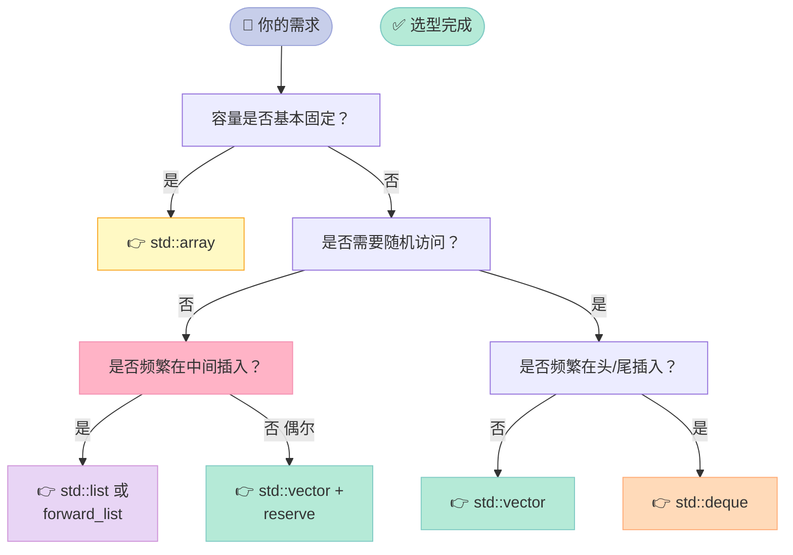
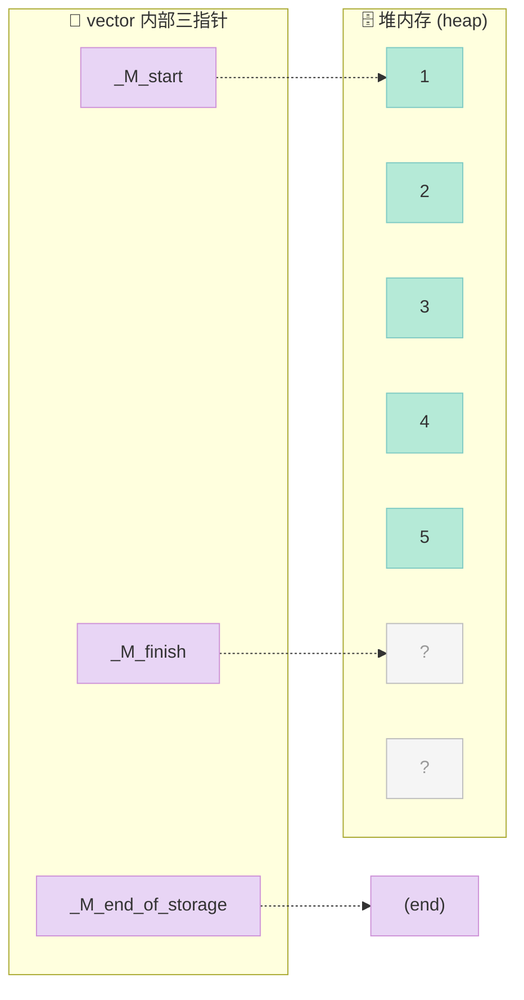
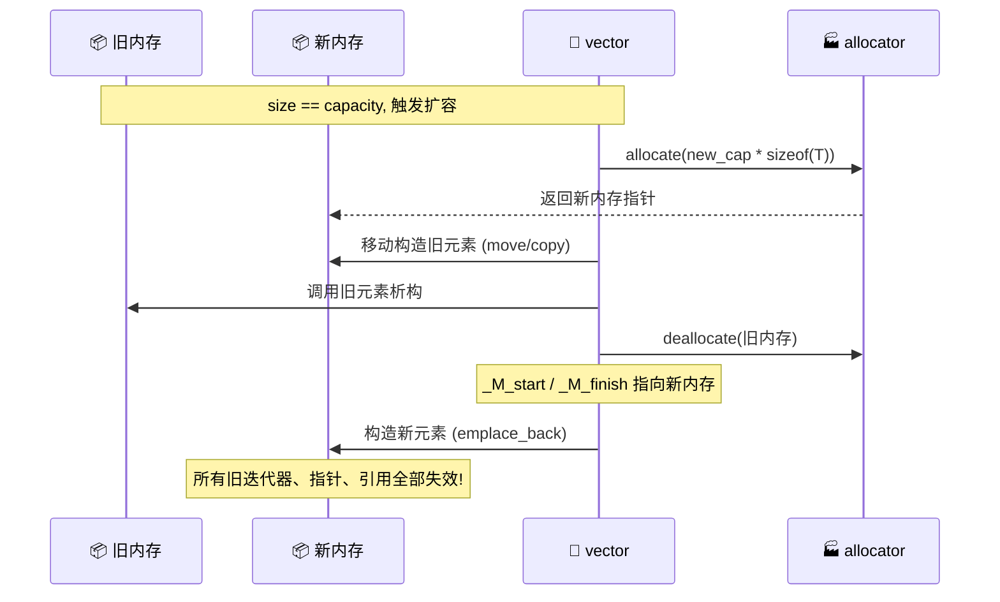
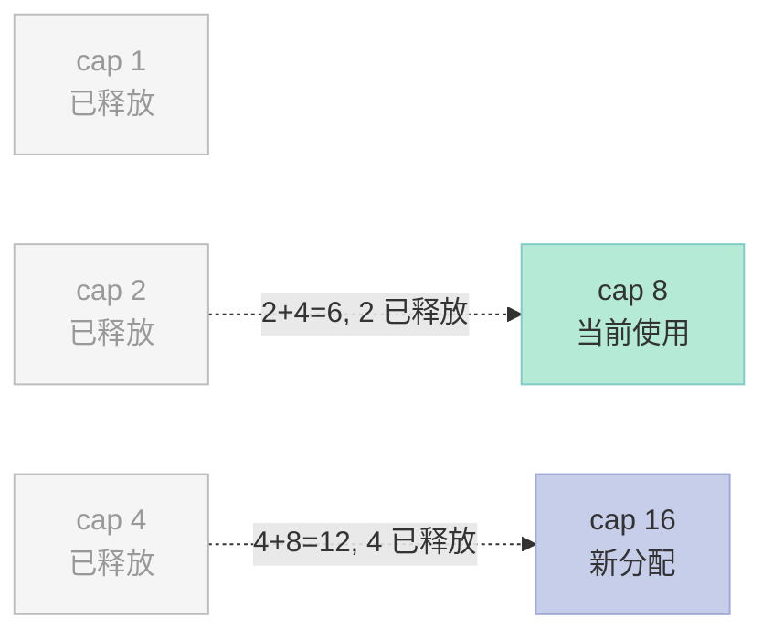
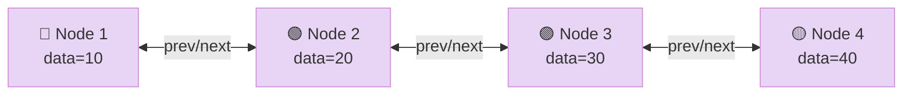
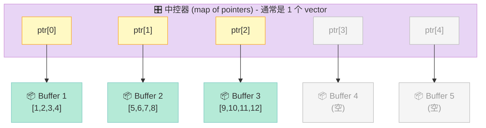
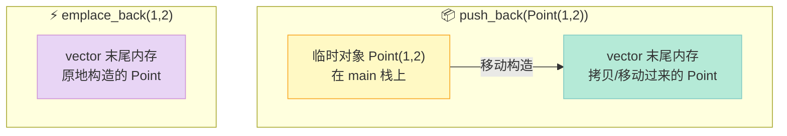

> **核心结论**：STL 顺序容器中，**vector 扩容倍数的本质是空间换时间的权衡**——GCC 选 2 倍追求常数摊还复杂度，VS 选 1.5 倍追求更好的缓存局部性，Facebook folly 选 1.5 倍 + 紧凑布局回收碎片。**迭代器失效的根源在于容器内部内存模型**：连续内存（vector/deque）失效剧烈，节点内存（list/map）几乎不失效。

---

## 一、开篇：三个灵魂拷问

在 C++ 面试中，STL 顺序容器是**出场频率最高**的话题之一，几乎每隔两场技术面就会被问到。下面这三个问题，足以让 80% 的候选人卡壳：

1. **为什么 vector 扩容是 1.5 倍或 2 倍？为什么不是 3 倍、1.1 倍？**
2. **vector 删除中间元素后，原来的迭代器还能用吗？list 呢？**
3. **emplace_back 比 push_back 快在哪里？什么情况下完全一样？**

这三个问题看似独立，其实都指向同一个底层逻辑——**容器的内存模型**。本文会从内存布局、扩容算法、迭代器失效规则三个维度，把 STL 顺序容器一次性讲透。

读完本文，你将获得：
- 画出 `vector` 的三指针内存布局
- 推导 `vector` 1.5 倍 vs 2 倍扩容的**摊还复杂度公式**
- 熟记 4 大顺序容器的**迭代器失效规则表**
- 手写一个 100 行的 `mini_vector`
- 区分 `push_back` / `emplace_back` / `reserve` / `resize` 的语义差异

---

## 二、STL 顺序容器全景图

C++ STL 把容器分成了三大类：**顺序容器（Sequence Containers）**、**关联容器（Associative Containers）**、**无序容器（Unordered Containers）**。本文聚焦于**顺序容器**，它们管理着一组**线性排列**的元素。

### 2.1 六大顺序容器一览

| 容器 | 内存模型 | 随机访问 | 头/尾插入 | 中间插入 | 迭代器失效 |
|------|----------|----------|----------|----------|------------|
| `vector<T>` | 连续数组 | ✅ O(1) | ⚠️ 尾 O(1) 摊还 | ❌ O(n) | 扩容/中间删除后全失效 |
| `deque<T>` | 分段连续 + 中控数组 | ✅ O(1) | ✅ O(1) | ❌ O(n) | 中间插入失效，**头尾插入不失效** |
| `list<T>` | 双向链表 | ❌ O(n) | ✅ O(1) | ✅ O(1) | **只失效被删元素** |
| `forward_list<T>` | 单向链表 | ❌ O(n) | ✅ O(1) | ✅ O(1) | **只失效被删元素** |
| `array<T, N>` | 栈上固定数组 | ✅ O(1) | ❌ 不支持 | ❌ 不支持 | ❌ 不失效（无增删） |
| `string` | 连续字符数组 | ✅ O(1) | ⚠️ 尾 O(1) 摊还 | ❌ O(n) | 扩容后全失效 |

### 2.2 容器选择决策树

面对一个具体场景，到底该选谁？请按下图决策：



**经验法则**：80% 的场景下，`std::vector` 是最优解；只有**头插频繁**选 `deque`，**中间插入极多且不在乎内存**才考虑 `list`。

---

## 三、vector 内部实现：三指针模型

### 3.1 三个指针的内存布局

`std::vector<T>` 内部其实只有 **3 个指针**（T* 模板特化除外）：

```cpp
template <typename T>
class vector {
private:
    T*  _M_start;            // 指向首元素
    T*  _M_finish;           // 指向最后一个元素的**下一个位置**
    T*  _M_end_of_storage;   // 指向分配的内存末尾
public:
    size_t size()     const { return _M_finish - _M_start; }
    size_t capacity() const { return _M_end_of_storage - _M_start; }
    bool   empty()    const { return _M_finish == _M_start; }
    // ...
};
```

下面这张图展示了 `[1, 2, 3, 4, 5, 0, 0]` 状态下的内存布局（`size=5`，`capacity=7`）：



**关键理解**：
- `[_M_start, _M_finish)` 之间是**有效元素**（`size = finish - start`）
- `[_M_finish, _M_end_of_storage)` 之间是**已分配但未使用的容量**（`capacity - size`）
- 当 `size == capacity` 时再插入元素，**触发扩容**

### 3.2 验证 size 与 capacity 的关系

```cpp
#include <iostream>
#include <vector>

int main() {
    std::vector<int> v;                    // 空 vector

    std::cout << "v.size()     = " << v.size()     << '\n';   // 0
    std::cout << "v.capacity() = " << v.capacity() << '\n';   // 0
    std::cout << "v.empty()    = " << v.empty()    << '\n';   // 1

    v.push_back(1);
    std::cout << "after 1 push: size=" << v.size()
              << ", cap=" << v.capacity() << '\n';            // GCC: 1, 1

    return 0;
}
```

> **⚠️ 关键点**：**空的 vector 对象，`size()` 和 `capacity()` 都为 0**。这个细节在面试时经常被问到——很多人误以为 `capacity()` 会有一个默认初始值。

### 3.3 扩容全过程解剖

当 `size == capacity` 时再插入元素，会触发 **3 步操作**：



**为什么这么贵？因为拷贝/移动旧元素 + 析构 + 释放，旧 vector 越大扩容越慢。** 这也是为什么面试官会反复强调：**如果你知道大概要装多少元素，调用 `reserve()` 一次性预分配**。

---

## 四、扩容策略深度剖析

### 4.1 GCC vs VS：1.5 倍 vs 2 倍之争

这是面试最常被追问的细节。直接上代码验证 GCC 的策略：

```cpp
#include <iostream>
#include <vector>

void print_cap(const std::vector<int>& v) {
    std::cout << "size=" << v.size()
              << ", cap=" << v.capacity() << '\n';
}

int main() {
    std::vector<int> v;
    int prev_cap = 0;
    for (int i = 0; i < 60; ++i) {
        v.push_back(i);
        if (v.capacity() != prev_cap) {
            print_cap(v);
            prev_cap = v.capacity();
        }
    }
    return 0;
}
```

**GCC 输出**（典型的 2 倍增长）：

```text
size=1, cap=1
size=2, cap=2
size=3, cap=4
size=5, cap=8
size=9, cap=16
size=17, cap=32
size=33, cap=64
```

**Visual Studio 输出**（典型的 1.5 倍增长）：

```text
size=1, cap=1
size=2, cap=2
size=3, cap=3
size=4, cap=4
size=6, cap=6
size=7, cap=9
size=10, cap=13
size=14, cap=19
size=20, cap=28
size=29, cap=42
```

| 编译器 | 增长因子 | 容量序列 |
|--------|----------|----------|
| GCC libstdc++ | **2 倍** | 0 → 1 → 2 → 4 → 8 → 16 → 32 → 64 |
| MSVC STL | **1.5 倍** | 0 → 1 → 2 → 3 → 4 → 6 → 9 → 13 → 19 → 28 → 42 |
| Clang libc++ | **2 倍** | 同 GCC |
| Facebook folly | **1.5 倍** | 同 VS（同时回收碎片） |

### 4.2 数学推导：为什么 1.5 倍 vs 2 倍

**问题模型**：把容量为 `C` 的 vector 填满需要 `C` 次 push_back，期间触发扩容，每次扩容会把 `C` 增加到 `k*C`，然后把旧元素全部搬迁到新内存。

#### 4.2.1 摊还复杂度公式

设增长因子为 `k > 1`。从容量 1 开始填到容量 `N`，总共触发扩容 `log_k(N)` 次。第 `i` 次扩容的代价是把 `k^i` 个元素搬到新内存。

```
总搬迁成本 = Σ (k^i)  for i=0 to log_k(N)
         = (k^(log_k(N)+1) - 1) / (k - 1)
         ≈ k * N / (k - 1)
```

每次 `push_back` 的**摊还成本** = 总成本 / `N` = `k / (k - 1)`。

| 增长因子 k | 摊还成本 | 含义 |
|-----------|----------|------|
| 2.0 | **2** | 每次 push_back 平均做 2 次操作 |
| 1.5 | **3** | 每次 push_back 平均做 3 次操作 |
| 1.25 | **5** | 每次 push_back 平均做 5 次操作 |
| 1.1 | **11** | 每次 push_back 平均做 11 次操作 |

**结论**：**k 越大，摊还越接近 1，但浪费越严重**。所以 GCC 选 2 倍追求理论最优，VS 选 1.5 倍追求实际缓存友好。

#### 4.2.2 k=2 的"内存浪费陷阱"

**k=2 的致命问题**：每次扩容后，新分配的内存**不可能被复用**。举例：

```text
cap 1 → 分配 1, 满了, 扩容
cap 2 → 分配 2, 满了, 扩容
cap 4 → 分配 4 (含旧 2), 此时总占用 4+2=6, 浪费 2
cap 8 → 分配 8 (含旧 4), 此时总占用 8+4+2+1=15, 浪费 7
cap 16 → 总占用 31, 浪费 15
```

**总浪费量** = 1 + 2 + 4 + ... + N/2 = N - 1。也就是说，**k=2 时，被回收的旧内存永远不会被任何后续 vector 复用**（因为每次新尺寸都大于历史总和）。



**k=1.5 的精妙之处**：扩容序列存在**复用窗口**。当 `cap=4` 扩容到 `cap=6` 时，旧 4 释放，新分配 6，旧 4 又被新的 vector 申请为 6 时复用。

```cpp
// 数学验证：k=1.5 时，相邻两次扩容的大小关系
// cap=4 -> 新 6 (1.5 * 4)
// cap=6 -> 新 9 (1.5 * 6)
// 此时已分配的 4 和 6 (总和 10) 与新分配的 9 接近
// 9 < 10, 可以复用旧 4 块内存
```

**为什么 1.5 优于 2？本质是给"复用"留出空间**。这也是 Facebook folly 选 1.5 倍的原因。

### 4.3 reserve() 与扩容的关系

```cpp
std::vector<int> v;
v.reserve(1000);                 // 一次性分配 >= 1000 的容量
for (int i = 0; i < 1000; ++i) {
    v.push_back(i);              // 这次循环不会触发任何扩容
}
```

**关键规则**：
- **`reserve(n)`**：仅当 `n > capacity()` 时才分配新内存；**只改变 `capacity`，不改变 `size`**。
- **`reserve(n)` 当 `n <= capacity()`**：什么都不做。
- **`resize(n)`**：改变 `size`（可能新增默认构造的元素，也可能删除尾部元素）。
- **`resize(n, val)`**：新增元素用 `val` 初始化。
- **`shrink_to_fit()` (C++11)**：请求把 capacity 缩到 size，但**仅仅是请求**，编译器可能拒绝。

```cpp
std::vector<int> v = {1, 2, 3, 4, 5};
std::cout << v.size();     // 5
std::cout << v.capacity(); // 5

v.reserve(10);
std::cout << v.size();     // 5 (size 不变)
std::cout << v.capacity(); // 10 (capacity 变大)

v.resize(8);
std::cout << v.size();     // 8 (size 变大, 新元素 = 0)
std::cout << v.capacity(); // 10 (capacity 不变)

v.resize(3);
std::cout << v.size();     // 3 (size 变小, 尾部 2 个元素被析构)
std::cout << v.capacity(); // 10 (capacity 不变)
```

### 4.4 释放 vector 内存的"坑"

`vector` 的内存占用**只增不减**，即使 `clear()` 也不会释放。这是个非常常见的面试陷阱：

```cpp
std::vector<int> v(10000, 1);     // 分配 10000 个 int 的内存
v.erase(v.begin(), v.begin() + 9999);  // 只剩 1 个元素
std::cout << v.size();     // 1
std::cout << v.capacity(); // 10000  ← 内存没释放!
v.clear();                 // size = 0
std::cout << v.capacity(); // 10000  ← 还是没释放!
```

**两种释放技巧**：

```cpp
// 方法 1: swap 缩容技巧 (C++11 前常用)
std::vector<int>().swap(v);     // 用空 vector 交换, 然后让临时对象析构释放内存
// 或者: std::vector<int>(v).swap(v);  // 保留 v 但缩到刚好

// 方法 2: shrink_to_fit (C++11)
v.shrink_to_fit();              // 请求释放, 不保证一定成功
```

> **⚠️ 警告**：不要在循环里反复 `shrink_to_fit`，这会触发**反复 realloc**，性能崩塌。

---

## 五、vector<bool> 的坑：它不是真正的 vector

`std::vector<bool>` 是 C++ 历史遗留的**位压缩**特化。它把每个 `bool` 存成一个 **bit**，8 个 bool 占 1 字节。听起来很美好，但实际工程中几乎不被推荐使用。

### 5.1 问题演示

```cpp
#include <vector>
#include <iostream>

int main() {
    std::vector<bool> v = {true, false, true, true};
    std::cout << sizeof(bool) << '\n';   // 1 字节
    std::cout << sizeof(v) << '\n';      // 24 字节 (3 指针 + bitset)

    auto ref = v[0];        // 期望 bool&, 实际是 std::vector<bool>::reference
    ref = false;            // 通过代理引用修改位
    std::cout << v[0];      // 0 (false)
    return 0;
}
```

**坑点清单**：

| 坑 | 说明 |
|----|------|
| `&v[0]` 编译失败 | `vector<bool>` 不保证元素地址连续 |
| 代理引用 | `v[i]` 返回的不是 `bool&` 而是代理类型，`auto&` 会拷贝 |
| 与 `vector<T*>` 不兼容 | 用 `T**` 遍历 `vector<bool>` 无法编译 |
| 多线程不安全 | 位操作不是原子的 |

**正确做法**：

```cpp
// 推荐 1: 用 std::deque<bool>
std::deque<bool> d = {true, false, true};   // 每个 bool 仍是 1 字节

// 推荐 2: 用 std::vector<char> 或 std::vector<uint8_t>
std::vector<char> v = {1, 0, 1, 1};

// 推荐 3: 用 boost::container::vector<bool> 或 bitset (定长)
```

---

## 六、list 双向链表：插入 O(1) 但遍历慢

### 6.1 节点结构

`std::list<T>` 是**双向循环链表**（GCC 实现中，末尾节点的 next 指向哨兵节点）。每个节点长这样：

```cpp
template <typename T>
struct __list_node {
    void* _M_prev;          // 指向 prev 节点
    void* _M_next;          // 指向 next 节点
    T     _M_data;          // 元素值
};
```



### 6.2 找倒数第二个元素：反向迭代器

list **不提供下标访问**，只能用迭代器。要找倒数第二个：

```cpp
#include <list>
#include <iostream>
#include <iterator>

int main() {
    std::list<int> lst = {10, 20, 30, 40, 50};

    // 方法 1: 反向迭代器 (推荐)
    auto rit = lst.rbegin();
    ++rit;                                     // rbegin 是末尾, ++ 指向倒数第二
    std::cout << *rit << '\n';                 // 40

    // 方法 2: 正向迭代器走两次 (复杂度 O(n))
    auto it = lst.begin();
    std::advance(it, lst.size() - 2);
    std::cout << *it << '\n';                  // 40

    return 0;
}
```

### 6.3 vector 找倒数第二：随机访问

vector 可以直接用下标，`at()` 带边界检查：

```cpp
std::vector<int> vec = {10, 20, 30, 40, 50};
// 方法 1: 直接下标 (不检查)
int second_last = vec[vec.size() - 2];
// 方法 2: at() (运行时检查, 越界抛 std::out_of_range)
int second_last2 = vec.at(vec.size() - 2);
// 输出都是 40
```

### 6.4 vector vs list 终极对比

| 维度 | `vector` | `list` |
|------|----------|--------|
| 内存模型 | 连续数组 | 双向链表（节点离散） |
| 随机访问 `v[i]` | ✅ O(1) | ❌ O(n) |
| 头部插入 | ❌ O(n) | ✅ O(1) |
| 尾部插入 | ✅ O(1) 摊还 | ✅ O(1) |
| 中间插入 | ❌ O(n) | ✅ O(1)（已知位置） |
| 中间删除 | ❌ O(n) | ✅ O(1) |
| 迭代器失效 | 剧烈 | **几乎不失效** |
| 内存开销 | 仅 3 指针 | 每节点 2 指针 + 数据 |
| 缓存友好 | ✅ 优秀 | ❌ 差（节点跳跃） |
| 适用场景 | 默认选择 | 频繁中间增删 + 大对象 |

**性能实测**（遍历 100 万元素 1000 次）：

```cpp
#include <chrono>
#include <iostream>
#include <vector>
#include <list>

int main() {
    std::vector<int> vec(1'000'000, 0);
    std::list<int>   lst(1'000'000, 0);

    auto t1 = std::chrono::high_resolution_clock::now();
    long sum = 0;
    for (int i = 0; i < 1000; ++i)
        for (auto x : vec) sum += x;
    auto t2 = std::chrono::high_resolution_clock::now();
    std::cout << "vector: " << std::chrono::duration_cast<std::chrono::milliseconds>(t2 - t1).count() << " ms\n";

    auto t3 = std::chrono::high_resolution_clock::now();
    sum = 0;
    for (int i = 0; i < 1000; ++i)
        for (auto x : lst) sum += x;
    auto t4 = std::chrono::high_resolution_clock::now();
    std::cout << "list  : " << std::chrono::duration_cast<std::chrono::milliseconds>(t4 - t3).count() << " ms\n";

    return 0;
}
```

**典型输出**：

```text
vector: 850 ms
list  : 5200 ms   ← 慢了 6 倍!
```

**原因**：list 节点离散，每次 `++` 都要到内存里"跳"，**缓存命中率极低**。

---

## 七、deque：分段连续的中控器

`std::deque<T>` 是"**看似连续，实则分段**"的怪物。它结合了 vector 的随机访问和 list 的双端插入能力。

### 7.1 deque 的内存模型



### 7.2 deque 的核心特性

| 特性 | 说明 |
|------|------|
| 头/尾插入 | ✅ O(1)，**不会**使现有迭代器失效 |
| 中间插入 | ❌ O(n)，会使所有迭代器失效 |
| 随机访问 | ✅ O(1)，但比 vector 慢（要先算 buffer 偏移） |
| `capacity()` | ❌ deque 没有 `capacity()` 概念——它按需添加/移除 buffer |
| 内部结构 | 中控器（`T**`）+ N 个固定大小缓冲区（通常是 512 字节） |

### 7.3 deque 与 vector 的本质差异

```cpp
std::vector<int> v(1000000);
v.push_back(1);
// → 如果 capacity 不够, 整块内存搬迁, 旧迭代器全部失效

std::deque<int> d(1000000);
d.push_back(1);                          // 新建一个 buffer, 旧迭代器全部不失效
d.push_front(1);                         // 在前端 buffer 插入, 旧迭代器也不失效
```

**实战场景**：**消息队列、滑动窗口、双端 BFS**——这些"既要头插又要随机访问"的场景，deque 是最优解。

---

## 八、forward_list 与 array：两个边缘选手

### 8.1 std::forward_list（C++11）

**单链表**，比 `list` 更省内存（每节点 1 个指针），但**只能往前走**：

```cpp
#include <forward_list>

std::forward_list<int> fl = {1, 2, 3, 4, 5};
// 没有 push_back / size / rbegin!
fl.push_front(0);                        // 头插 O(1)
// 找倒数第二: 必须遍历整个 list, O(n)
```

**适用场景**：内存极度紧张的嵌入式系统、图的邻接表。

### 8.2 std::array（C++11）

**栈上固定数组**，没有动态分配，是真正替代 C 风格数组的方案：

```cpp
#include <array>

std::array<int, 5> arr = {1, 2, 3, 4, 5};
std::cout << arr.size();        // 5 (编译期常量!)
std::cout << arr[0];            // 1 (无边界检查)
std::cout << arr.at(0);         // 1 (有边界检查, 越界抛异常)

// 还能用在 C 接口中
void legacy_api(int* p, int n);
legacy_api(arr.data(), arr.size());
```

| 特性 | `array` vs `vector` |
|------|---------------------|
| 内存位置 | **栈**上（默认） | **堆**上 |
| 大小 | 编译期固定 | 运行时可变 |
| 性能 | 略快（无堆分配） | 略慢 |
| 接口 | `size()` 是 `constexpr` | `size()` 是运行时 |

---

## 九、迭代器失效完整规则表

这是 STL 面试的**终极 Boss 题**。每个容器、每种操作，对迭代器的影响都不同。**记住一句话**：**连续内存容器失效剧烈，节点内存容器失效温和**。

### 9.1 vector 的迭代器失效

```cpp
std::vector<int> v = {1, 2, 3, 4, 5};

// 场景 1: push_back 可能触发扩容
auto it = v.begin();                     // 指向 1
v.push_back(6);                          // 如果触发扩容, it 失效!
std::cout << *it;                        // 未定义行为 (UB)

// 场景 2: insert 可能触发扩容
auto it2 = v.begin() + 2;                // 指向 3
v.insert(v.begin(), 0);                  // 触发扩容, it2 失效

// 场景 3: erase 删除元素
auto it3 = v.begin() + 2;                // 指向 3
v.erase(it3);                            // it3 失效, 但 erase 返回下一个有效迭代器
auto next = v.erase(it3);                // ✅ 正确写法

// 场景 4: pop_back 通常安全
auto it4 = v.end() - 1;                  // 指向 5
v.pop_back();                            // it4 失效
```

**vector 失效规则汇总**：

| 操作 | 失效的迭代器/引用/指针 |
|------|------------------------|
| `push_back`（未触发扩容） | end() 失效 |
| `push_back`（触发扩容） | **全部失效** |
| `insert`（未触发扩容） | 插入点及之后全部失效 |
| `insert`（触发扩容） | **全部失效** |
| `erase` | **被删及之后全部失效** |
| `pop_back` | 被删元素及 end() 失效 |
| `clear` | **全部失效** |
| `resize` (增大) | end() 及之后失效，可能全失效 |
| `resize` (减小) | 被删及之后失效 |

### 9.2 deque 的迭代器失效

```cpp
std::deque<int> d = {1, 2, 3, 4, 5};

// ✅ 头/尾插入不失效!
auto it = d.begin() + 2;                // 指向 3
d.push_front(0);                         // ✅ it 仍然有效!
d.push_back(6);                          // ✅ it 仍然有效!

// ❌ 中间插入全失效
d.insert(d.begin() + 2, 99);             // ❌ it 失效

// 中间删除: 被删及之后失效
auto it2 = d.begin() + 2;
d.erase(it2);                            // it2 失效, 但 it2 之前的迭代器仍有效
```

**deque 失效规则汇总**：

| 操作 | 失效的迭代器/引用/指针 |
|------|------------------------|
| `push_back` / `push_front` | ✅ **全部不失效** |
| `insert` 在头/尾 | ✅ 全部不失效 |
| `insert` 在中间 | ❌ **全部失效** |
| `erase` 在头/尾 | 被删及 end() 失效 |
| `erase` 在中间 | ❌ 被删及之后失效 |
| `clear` | **全部失效** |

### 9.3 list 的迭代器失效

```cpp
std::list<int> lst = {1, 2, 3, 4, 5};

// ✅ 任何位置插入都不失效!
auto it = lst.begin();                   // 指向 1
lst.insert(lst.begin(), 0);              // ✅ it 仍然有效, 仍指向 1
lst.push_back(6);                        // ✅ it 仍然有效
lst.erase(it);                           // ✅ 其他迭代器全部仍然有效
```

**list 失效规则汇总**：

| 操作 | 失效的迭代器/引用/指针 |
|------|------------------------|
| `push_back` / `push_front` | ✅ **全部不失效** |
| `insert` 任何位置 | ✅ **全部不失效** |
| `erase` | ⚠️ **仅被删元素失效** |
| `pop_back` / `pop_front` | ⚠️ 仅被删元素失效 |
| `clear` | **全部失效** |
| `splice` (链表拼接) | ✅ 全部不失效 |
| `remove` / `remove_if` | ⚠️ 仅被删元素失效 |
| `sort` / `merge` / `unique` / `reverse` | ⚠️ 全部**可能**失效（实现定义） |

### 9.4 map / set 的迭代器失效

```cpp
std::map<int, int> m = {{1,10}, {2,20}, {3,30}};

// ✅ insert 不失效!
auto it = m.find(2);
m.insert({4, 40});                       // ✅ it 仍然指向 {2,20}

// ❌ erase 仅被删失效
m.erase(it);                             // ✅ 其他迭代器全部有效

// ⚠️ erase 区间
auto it1 = m.find(2), it2 = m.find(3);
m.erase(it1, it2);                       // ⚠️ it1, it2 失效, 其他有效
```

**map/set 失效规则汇总**：

| 操作 | 失效的迭代器/引用/指针 |
|------|------------------------|
| `insert` / `emplace` | ✅ **全部不失效** |
| `erase` | ⚠️ **仅被删元素失效** |
| `clear` | **全部失效** |
| `operator[]` | 可能触发插入, ⚠️ 可能全失效（红黑树 rebalance） |

### 9.5 unordered_map / unordered_set 的迭代器失效

```cpp
std::unordered_map<int, int> um = {{1,10}, {2,20}, {3,30}};

// ❌ insert 可能触发 rehash
auto it = um.find(2);
um.insert({4, 40});                       // ⚠️ rehash 后 it 可能失效
```

**unordered 失效规则汇总**：

| 操作 | 失效的迭代器/引用/指针 |
|------|------------------------|
| `insert` / `emplace`（未 rehash） | ✅ 不失效 |
| `insert` / `emplace`（触发 rehash） | ❌ **全部失效** |
| `erase` | ⚠️ 仅被删元素失效 |
| `clear` | **全部失效** |
| `bucket 操作` (无) | ✅ 不失效 |
| `rehash` / `reserve` | ❌ **全部失效** |

### 9.6 五大容器迭代器失效全景图

| 操作 | vector | deque | list | map/set | unordered |
|------|--------|-------|------|---------|-----------|
| push_back / push_front | 视情况 | ✅ | ✅ | ✅ | 视情况 |
| insert 中间 | ❌ 全失效 | ❌ 全失效 | ✅ | ✅ | 视情况 |
| erase 单个 | ⚠️ 之后失效 | ⚠️ 视位置 | ⚠️ 仅被删 | ⚠️ 仅被删 | ⚠️ 仅被删 |
| erase 区间 | ⚠️ 之后失效 | ⚠️ 之后失效 | ⚠️ 仅被删区间 | ⚠️ 仅被删区间 | ⚠️ 仅被删区间 |
| clear | ❌ 全失效 | ❌ 全失效 | ❌ 全失效 | ❌ 全失效 | ❌ 全失效 |
| resize | 视情况 | 视情况 | ✅ | ✅ | 视情况 |

> **图例**：✅ 不失效 / ⚠️ 部分失效 / ❌ 全失效 / 视情况 看是否触发 realloc/rehash

### 9.7 经典反例：erase(it++) 错在哪？

```cpp
// ❌ 错误写法 (vector)
std::vector<int> v = {1, 2, 3, 4, 5};
for (auto it = v.begin(); it != v.end(); ++it) {
    if (*it % 2 == 0) {
        v.erase(it);         // it 已经失效, ++it 是 UB!
    }
}

// ✅ 正确写法 1: erase 返回下一个
for (auto it = v.begin(); it != v.end(); ) {
    if (*it % 2 == 0) {
        it = v.erase(it);    // 接收返回值
    } else {
        ++it;
    }
}

// ✅ 正确写法 2: erase-remove 惯用法 (C++20 前最优雅)
v.erase(std::remove_if(v.begin(), v.end(),
        [](int x) { return x % 2 == 0; }), v.end());

// ✅ 正确写法 3: C++20 ranges
std::erase_if(v, [](int x) { return x % 2 == 0; });
```

**但是 `erase(it++)` 对 list/map 是合法的**：

```cpp
// ✅ list 可以这样写
std::list<int> lst = {1, 2, 3, 4, 5};
for (auto it = lst.begin(); it != lst.end(); ) {
    if (*it % 2 == 0) {
        lst.erase(it++);     // ✅ 后置递增, 旧 it 已传给 erase, ++ 拿下一个
    } else {
        ++it;
    }
}
```

**区别本质**：`list::erase(it++)` 中 `it++` 先返回旧 it，再递增到下一个（**前置副作用在参数求值后生效**），而 vector `erase(it++)` 中 `it` 已经指向失效内存，`++it` 是 UB。

---

## 十、emplace_back vs push_back：少一次拷贝的奥秘

### 10.1 两者差异

```cpp
#include <vector>
#include <string>

struct Point {
    int x, y;
    Point(int a, int b) : x(a), y(b) { std::cout << "ctor\n"; }
    Point(const Point&)            { std::cout << "copy\n"; }
    Point(Point&&)                 { std::cout << "move\n"; }
};

int main() {
    std::vector<Point> v;
    v.reserve(3);

    std::cout << "--- push_back(Point(1,2)) ---\n";
    v.push_back(Point(1, 2));   // 1 个临时对象构造 + 1 个移动 (C++11 后)

    std::cout << "--- emplace_back(1,2) ---\n";
    v.emplace_back(1, 2);        // 直接在 vector 内存里原地构造!
    return 0;
}
```

**输出**：

```text
--- push_back(Point(1,2)) ---
ctor       (临时 Point 构造)
move       (临时对象移动到 vector 末尾)
--- emplace_back(1,2) ---
ctor       (直接在 vector 末尾构造)
```

**关键差异**：
- `push_back(Point(1, 2))`：**构造 + 移动**（2 次操作）
- `emplace_back(1, 2)`：**直接构造**（1 次操作）

### 10.2 内存对比图



### 10.3 性能差异

| 场景 | push_back | emplace_back | 差异 |
|------|-----------|--------------|------|
| 传右值（`Point(1,2)`） | 1 构造 + 1 移动 | 1 构造 | emplace 省 1 次移动 |
| 传左值（`Point p; push_back(p)`） | 1 拷贝 | — | emplace 不可用, 必须 push_back |
| 传多个参数（`emplace_back(1,2)`） | 需要先构造 Point 再传 | 直接构造 | emplace 省 1 次构造 + 1 次移动 |
| 不可移动类型 | ❌ 不能 push_back | ✅ 可以 emplace_back | emplace 唯一选择 |

### 10.4 反例：emplace 不一定更快

```cpp
std::string s = "hello";
v.push_back(s);                     // 1 次拷贝
v.emplace_back(s);                  // 1 次构造 + 内部移动, 反而更慢!

// 正确: 想传左值用 push_back, 想传参数包用 emplace_back
v.push_back(std::move(s));          // 1 次移动, 最优
v.emplace_back("hello");            // 1 次构造, 最优
```

**经验法则**：
- 传**右值或参数包** → 用 `emplace_back`
- 传**已存在的左值** → 用 `push_back`
- 想**最优化** → `push_back(std::move(x))`

---

## 十一、reserve / resize / shrink_to_fit 全对比

这三个函数经常被搞混，下面用一张表彻底厘清：

| 函数 | 改变 size | 改变 capacity | 触发扩容 | 触发搬迁 | 触发析构 |
|------|-----------|---------------|----------|----------|----------|
| `reserve(n)` | ❌ | ✅ 当 `n > cap` | ✅ | ✅ | ❌（只搬不改 size） |
| `reserve(n)` n≤cap | ❌ | ❌ | ❌ | ❌ | ❌ |
| `resize(n)` n>size | ✅ | ❌（cap 不够会**隐式扩容**） | 可能 | 可能 | ❌ |
| `resize(n)` n<size | ✅ | ❌ | ❌ | ❌ | ✅ 析构尾部 |
| `resize(n, val)` | ✅ | ❌ | 可能 | 可能 | ❌/✅ 视 n |
| `shrink_to_fit()` | ❌ | ✅ 请求缩到 size | ✅ | ✅ | ❌ |
| `clear()` | ✅ | ❌ | ❌ | ❌ | ✅ 析构全部 |

**陷阱示例**：

```cpp
std::vector<int> v;
v.resize(10);              // size=10, capacity=10, 元素全 0
v.reserve(100);            // size=10, capacity=100, 中间 90 个是"野内存"!
std::cout << v[50];        // ⚠️ UB! 不能用 [] 访问, size 只有 10
// v[50] = 5;             // ⚠️ UB! 不能用 [] 写
// 必须用 resize, 或者 push_back 后才能访问
v.resize(100);             // ✅ 正确: 把 size 扩到 100, 此时 v[50] 合法
```

---

## 十二、API 速查表

### 12.1 vector 常用 API

| API | 时间复杂度 | 说明 |
|-----|-----------|------|
| `push_back(val)` | 均摊 O(1) | 尾插 |
| `emplace_back(args...)` | 均摊 O(1) | 原地构造 |
| `pop_back()` | O(1) | 尾删 |
| `insert(pos, val)` | O(n) | 中间插 |
| `emplace(pos, args...)` | O(n) | 中间原地构造 |
| `erase(pos)` | O(n) | 单删，返回下一个 |
| `erase(first, last)` | O(n) | 区间删 |
| `clear()` | O(n) | 清空 |
| `reserve(n)` | O(n) (一次) | 预分配 |
| `resize(n)` | O(n) | 改 size |
| `shrink_to_fit()` | O(n) | 请求缩容 |
| `swap(other)` | O(1) | 交换 |
| `front()` / `back()` | O(1) | 首尾元素 |
| `at(i)` | O(1) | 带边界检查 |
| `operator[]` | O(1) | 无边界检查 |
| `data()` | O(1) | 返回底层指针 |
| `size()` / `capacity()` / `empty()` | O(1) | 容量查询 |

### 12.2 list 常用 API（与 vector 不同的部分）

| API | 时间复杂度 | 说明 |
|-----|-----------|------|
| `push_front(val)` | O(1) | 头插 |
| `emplace_front(args...)` | O(1) | 原地头插 |
| `pop_front()` | O(1) | 头删 |
| `splice(pos, other)` | O(1) | 链表拼接，不拷贝元素 |
| `remove(val)` | O(n) | 移除所有等于 val |
| `remove_if(pred)` | O(n) | 按条件移除 |
| `unique()` | O(n) | 移除连续重复 |
| `merge(other)` | O(n) | 归并两个有序链表 |
| `sort()` | O(n log n) | 链表排序（比 std::sort 快） |
| `reverse()` | O(n) | 反转 |

### 12.3 deque 常用 API（独有部分）

| API | 时间复杂度 | 说明 |
|-----|-----------|------|
| `push_front(val)` | O(1) | 头插 |
| `pop_front()` | O(1) | 头删 |
| `emplace_front(args...)` | O(1) | 原地头插 |
| **无** `capacity()` | — | deque 没有容量概念 |

---

## 十三、实战：手写一个 mini_vector

为了彻底吃透 `vector` 内部机制，我们用 100 行代码实现一个简化版 `mini_vector`：

```cpp
#include <cstddef>
#include <iostream>
#include <memory>
#include <stdexcept>

template <typename T>
class mini_vector {
private:
    T* _data = nullptr;
    std::size_t _size = 0;
    std::size_t _cap  = 0;

    // 扩容策略: 2 倍增长
    void reallocate(std::size_t new_cap) {
        T* new_data = static_cast<T*>(::operator new(new_cap * sizeof(T)));
        // 移动构造旧元素
        for (std::size_t i = 0; i < _size; ++i) {
            new (&new_data[i]) T(std::move(_data[i]));
        }
        // 析构旧元素
        for (std::size_t i = 0; i < _size; ++i) {
            _data[i].~T();
        }
        ::operator delete(_data);
        _data = new_data;
        _cap  = new_cap;
    }

public:
    mini_vector() = default;

    ~mini_vector() {
        for (std::size_t i = 0; i < _size; ++i) _data[i].~T();
        ::operator delete(_data);
    }

    // 拷贝构造
    mini_vector(const mini_vector& other)
        : _data(static_cast<T*>(::operator new(other._cap * sizeof(T))))
        , _size(other._size), _cap(other._cap) {
        for (std::size_t i = 0; i < _size; ++i) {
            new (&_data[i]) T(other._data[i]);   // 拷贝构造
        }
    }

    // 移动构造
    mini_vector(mini_vector&& other) noexcept
        : _data(other._data), _size(other._size), _cap(other._cap) {
        other._data = nullptr;
        other._size = 0;
        other._cap  = 0;
    }

    void reserve(std::size_t n) {
        if (n > _cap) reallocate(n);
    }

    void push_back(const T& val) {
        if (_size == _cap) reserve(_cap == 0 ? 1 : _cap * 2);
        new (&_data[_size++]) T(val);
    }

    void push_back(T&& val) {
        if (_size == _cap) reserve(_cap == 0 ? 1 : _cap * 2);
        new (&_data[_size++]) T(std::move(val));
    }

    template <typename... Args>
    void emplace_back(Args&&... args) {
        if (_size == _cap) reserve(_cap == 0 ? 1 : _cap * 2);
        new (&_data[_size++]) T(std::forward<Args>(args)...);  // 原地构造
    }

    void pop_back() {
        if (_size == 0) throw std::out_of_range("pop_back on empty");
        _data[--_size].~T();
    }

    T& operator[](std::size_t i) { return _data[i]; }
    const T& operator[](std::size_t i) const { return _data[i]; }

    std::size_t size()     const { return _size; }
    std::size_t capacity() const { return _cap; }
    bool        empty()    const { return _size == 0; }
};
```

**关键实现细节解析**：

```cpp
// 1. placement new: 在指定内存上构造
new (&_data[_size++]) T(val);
//  ↑ 这行做了 2 件事:
//    - placement new 在 _data[_size] 处构造 T
//    - ++ 在构造之后, 所以构造时 _size 还是旧值

// 2. 显式析构
_data[i].~T();
// 不能 delete, 因为内存是 operator new 分配的, 没有构造函数配套

// 3. placement new 配合 std::forward 实现完美转发
template <typename... Args>
void emplace_back(Args&&... args) {
    // std::forward 把参数的左右值属性完美转发给 T 的构造函数
    new (&_data[_size++]) T(std::forward<Args>(args)...);
}
```

**测试一下**：

```cpp
struct Point {
    int x, y;
    Point(int a, int b) : x(a), y(b) {
        std::cout << "ctor(" << a << "," << b << ") ";
    }
    Point(const Point& o) : x(o.x), y(o.y) {
        std::cout << "copy ctor ";
    }
};

int main() {
    mini_vector<Point> v;
    std::cout << "cap=" << v.capacity() << " size=" << v.size() << '\n';
    v.emplace_back(1, 2);    // 直接构造, 不会拷贝
    v.emplace_back(3, 4);
    v.emplace_back(5, 6);
    v.emplace_back(7, 8);    // 触发扩容
    std::cout << "\ncap=" << v.capacity() << " size=" << v.size() << '\n';
    return 0;
}
```

**输出**：

```text
cap=0 size=0
ctor(1,2) ctor(3,4) ctor(5,6) ctor(7,8)
cap=4 size=4
```

可以看到，`emplace_back` 完美避免了拷贝/移动。

---

## 十四、面试真题精讲

### 14.1 真题 1：vector 与 list 的区别与应用？怎么找倒数第二元素？

**题目来源**：C++ 面试题集锦第 41 题

**参考答案**：

```cpp
// vector 与 list 区别速记表
struct Diff {
    bool random_access;       // vector: true, list: false
    bool mid_insert;          // vector: O(n), list: O(1)
    bool memory_layout;       // vector: 连续, list: 离散
    bool iter_invalidation;   // vector: 剧烈, list: 仅被删失效
};

// 找 vector 倒数第二
int vec_second_last(const std::vector<int>& v) {
    if (v.size() < 2) throw std::out_of_range("too small");
    return v.at(v.size() - 2);                    // at 越界抛异常
}

// 找 list 倒数第二 (反向迭代器法)
int list_second_last(const std::list<int>& lst) {
    if (lst.size() < 2) throw std::out_of_range("too small");
    auto rit = lst.rbegin();                       // 反向迭代器, 指向末尾
    ++rit;                                         // 指向倒数第二
    return *rit;
}

// 找 list 倒数第二 (advance 法)
int list_second_last_v2(const std::list<int>& lst) {
    auto it = lst.begin();
    std::advance(it, lst.size() - 2);
    return *it;
}
```

### 14.2 真题 2：为什么 vector 扩容是 1.5 倍或 2 倍？

**参考答案要点**：

1. **空 vector 的 size 和 capacity 都是 0**
2. **扩容原因**：`size == capacity` 时插入新元素，需要新内存
3. **1.5 倍 vs 2 倍的来源**：
   - **GCC（libstdc++）选 2 倍**：追求最优的摊还复杂度（k=2 时摊还=2）
   - **VS（MSVC）选 1.5 倍**：1.5 倍能复用旧内存，节省内存
4. **k=2 的缺陷**：每次新容量 > 历史总和，旧内存永远无法复用
5. **k=1.5 的精妙**：相邻两次扩容的容量总和 ≥ 新容量，旧内存可复用
6. **建议**：`reserve()` 预分配，避免多次扩容

### 14.3 真题 3：vector 越界访问下标，map 越界访问下标？

**题目来源**：C++ 面试题集锦第 51 题

**vector 越界**：

```cpp
std::vector<int> v = {1, 2, 3};
int x = v[10];         // ⚠️ 不抛异常, UB! (operator[] 无检查)
int y = v.at(10);      // ✅ 抛 std::out_of_range 异常
```

**map 越界**：

```cpp
std::map<std::string, int> m = {{"a", 1}};
int x = m["b"];        // ⚠️ 不抛异常, 而是把 {"b", 0} 插入 map!
                       // 这不是越界, 而是"自动插入默认值"
                       // 经常导致 bug: 本想读, 实际却写了

// 安全的查找
auto it = m.find("b");
if (it != m.end()) {
    use(it->second);
}
// 或者
int y = m.at("b");     // 抛异常 (C++11 后)
```

### 14.4 真题 4：vector 删除元素会发生什么？

**答案**：

```cpp
std::vector<int> v = {1, 2, 3, 4, 5};

// 1. erase 删除: size 减少, capacity 不变, 后续元素前移
v.erase(v.begin() + 2);     // 删除 3, v = {1,2,4,5}, size=4, cap=5
// 复杂度: O(n), 因为要搬移后续元素

// 2. clear: size=0, capacity 不变
v.clear();                  // size=0, cap=5, 内存未释放

// 3. 删除不会释放内存! 要释放用 swap 技巧
std::vector<int>().swap(v); // size=0, cap=0

// 4. erase 迭代器失效: 被删及之后全部失效
auto it = v.begin() + 2;
v.erase(it);                // it 失效, 后续迭代器也失效
// 但 erase 返回下一个有效迭代器
auto next_it = v.erase(it); // ✅
```

---

## 十五、常见面试追问

### 15.1 追问：vector 频繁 push_back 如何优化？

**答案**：

```cpp
// 优化 1: 预分配 (推荐)
std::vector<int> v;
v.reserve(10000);
for (int i = 0; i < 10000; ++i) v.push_back(i);

// 优化 2: resize + operator[]
v.resize(10000);
for (int i = 0; i < 10000; ++i) v[i] = i;

// 优化 3: 用 deque 避免扩容复制
std::deque<int> d;
for (int i = 0; i < 10000; ++i) d.push_back(i);   // 不需要 reserve
```

### 15.2 追问：vector 和 array 的区别？

**答案**：

| 维度 | `vector` | `array` |
|------|----------|---------|
| 内存位置 | 堆 | **栈**（默认） |
| 大小 | 运行时 | **编译期** |
| 性能 | 有堆分配开销 | 更快 |
| 越界 | `at()` 检查 | `at()` 检查 |
| 适用 | 动态集合 | 固定大小集合 |

### 15.3 追问：emplace_back 一定比 push_back 快吗？

**答案**：**不一定**。

```cpp
std::vector<std::string> v;

// 传左值
std::string s = "hello";
v.push_back(s);                  // 1 次拷贝
v.emplace_back(s);               // 1 次构造 + 1 次内部 move (反而可能更慢)

// 传右值/参数包
v.push_back(std::string("hi"));  // 1 构造 + 1 move
v.emplace_back("hi");            // 1 构造, 最优
```

### 15.4 追问：list 是单向的还是双向的？

**答案**：**双向循环链表**。每个节点有 prev 和 next 两个指针，GCC 实现中末尾节点的 next 指向一个**哨兵节点**（不存数据）。

### 15.5 追问：为什么 list 插入 O(1) 但遍历慢？

**答案**：

- **插入 O(1)**：只改 4 个指针（prev/next），不搬移元素
- **遍历慢**：节点离散分布，CPU 缓存命中率极低（每跳一个节点可能要刷一行缓存）

### 15.6 追问：deque 是怎么实现随机访问的？

**答案**：deque 通过**中控器（map of pointers）** + **多个缓冲区**实现。`operator[](i)` 内部计算：
1. `i / buffer_size` 得到中控器索引
2. `i % buffer_size` 得到缓冲区偏移
3. 两次解引用拿到元素

---

## 十六、容器选择 Check List

最后给出一份**实战选型清单**：

| 场景 | 首选 | 原因 |
|------|------|------|
| 不知道选啥 | `vector` | 性能最好, 缓存友好 |
| 频繁在头/尾插入 | `deque` | 双端 O(1), 迭代器不失效 |
| 大量中间插入/删除 | `list` | O(1) 插入, 但要权衡缓存 |
| 容量固定 | `array` | 栈上, 零分配 |
| 内存极度紧张的单向遍历 | `forward_list` | 省一个指针 |
| 字符串处理 | `string` | 字符特化 |
| 元素是 bool | `deque<bool>` 或 `vector<char>` | 避免 `vector<bool>` 坑 |

---

## 十七、结尾：行动建议与思考延伸

### 17.1 给你面试前的清单

1. **能默写 vector 三指针结构图** ✅
2. **能推导 1.5 倍 vs 2 倍的摊还公式** ✅
3. **能说出 list 遍历比 vector 慢 5-10 倍的原因** ✅
4. **能默写 4 大容器的迭代器失效规则表** ✅
5. **能区分 emplace_back / push_back / reserve / resize** ✅
6. **能说出 deque 的内存模型（中控器+缓冲区）** ✅
7. **能避开 vector<bool> 的位压缩坑** ✅

### 17.2 给你的实战建议

- **默认用 vector**：除非有明确理由，否则别用 list
- **写循环前 reserve**：能预估容量就 reserve
- **删除元素用 erase-remove 惯用法**：避免手写出错
- **不要用 vector<bool>**：用 `deque<bool>` 或 `vector<char>`
- **拷贝前想想能不能 move**：`push_back(std::move(x))` 比拷贝快

### 17.3 三个值得继续思考的问题

1. **Q：如果 vector 扩容因子改成 1.1 倍，会发生什么？**
   A：扩容次数暴涨，搬迁总成本接近 O(n²)，单次 push_back 的摊还复杂度变成 11。

2. **Q：std::vector 和 std::dynarray（C++14 被否决）有什么区别？**
   A：dynarray 是栈分配且固定大小，介于 vector 和 array 之间。

3. **Q：Google 的 Abseil 库提供了 `absl::InlinedVector`，它解决什么问题？**
   A：小容量时栈上 inline 存储，避免堆分配；大容量时退化为 vector。

---

## 系列导航

「C++ 面试题集锦」系列共 16 篇，覆盖 C++ 核心语法、面向对象、模板、STL、内存管理等高频考点。

| 篇数 | 标题 | 核心主题 |
|------|------|----------|
| 第 1 篇 | [C++ 基础语法面试题](./2026-06-10-cpp-interview-01-basics.md) | 数据类型、运算符、流程控制 |
| 第 2 篇 | [面向对象面试题](./2026-06-11-cpp-interview-02-oop.md) | 封装、继承、多态、虚函数 |
| 第 3 篇 | [C++ 内存管理面试题](./2026-06-12-cpp-interview-03-memory.md) | new/delete、智能指针、内存泄漏 |
| 第 4 篇 | [C++ 模板与泛型编程面试题](./2026-06-13-cpp-interview-04-templates.md) | 函数模板、类模板、SFINAE |
| 第 5 篇 | [C++11/14/17 新特性面试题](./2026-06-14-cpp-interview-05-modern-cpp.md) | auto、lambda、右值引用 |
| 第 6 篇 | [C++ 多线程面试题](./2026-06-15-cpp-interview-06-multithreading.md) | thread、mutex、atomic、future |
| **第 7 篇** | **STL 顺序容器**（本文） | **vector、list、deque、array** |
| 第 8 篇 | [STL 关联容器与无序容器](./2026-06-17-cpp-interview-08-associative.md) | map、set、unordered_map |
| 第 9 篇 | [STL 迭代器与算法](./2026-06-18-cpp-interview-09-iterators.md) | 迭代器分类、sort、find |
| 第 10 篇 | [C++ 异常处理面试题](./2026-06-19-cpp-interview-10-exceptions.md) | try/catch、noexcept、异常安全 |
| 第 11 篇 | [C++ 类型转换面试题](./2026-06-20-cpp-interview-11-casts.md) | static_cast、dynamic_cast |
| 第 12 篇 | [C++ 关键字深度剖析](./2026-06-21-cpp-interview-12-keywords.md) | const、volatile、explicit |
| 第 13 篇 | [C++ 编译与链接面试题](./2026-06-22-cpp-interview-13-compilation.md) | 预处理、编译、链接、动态库 |
| 第 14 篇 | [C++11/14/17/20 进阶](./2026-06-23-cpp-interview-14-modern-advanced.md) | coroutine、concept、ranges |
| 第 15 篇 | [C++ 性能优化面试题](./2026-06-24-cpp-interview-15-performance.md) | 移动语义、缓存、profile |
| 第 16 篇 | [C++ 实战编码题](./2026-06-25-cpp-interview-16-coding.md) | 手写 string、智能指针 |

---

## 参考资料

1. **《STL 源码剖析》侯捷著**——vector 内部实现的最经典参考资料
2. **CppReference** [https://en.cppreference.com/w/cpp/container/vector](https://en.cppreference.com/w/cpp/container/vector)
3. **GCC libstdc++ 源码** [https://gcc.gnu.org/onlinedocs/libstdc++/](https://gcc.gnu.org/onlinedocs/libstdc++/)
4. **Effective Modern C++ Item 42**——emplace 与 insert 的选择
5. **Facebook folly FBVector** [https://github.com/facebook/folly/blob/main/folly/container/FBVector.h](https://github.com/facebook/folly/blob/main/folly/container/FBVector.h)
6. **C++ 标准库实现对比**：[https://github.com/gcc-mirror/gcc/tree/master/libstdc++-v3/include/bits/stl_vector.h](https://github.com/gcc-mirror/gcc/tree/master/libstdc++-v3/include/bits/stl_vector.h)

---

> **下篇预告**：第 8 篇《STL 关联容器与无序容器》——为什么 map 用红黑树而不是 AVL？unordered_map 扩容的 bucket 数量为什么是素数？load_factor 调到 1.0 还是 0.75？敬请期待。

*如果你觉得本文对你有帮助，欢迎点赞、收藏、转发！有任何疑问，请在评论区留言。*
