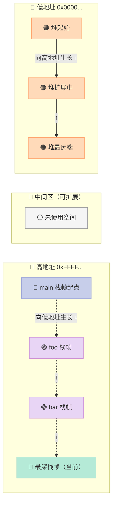
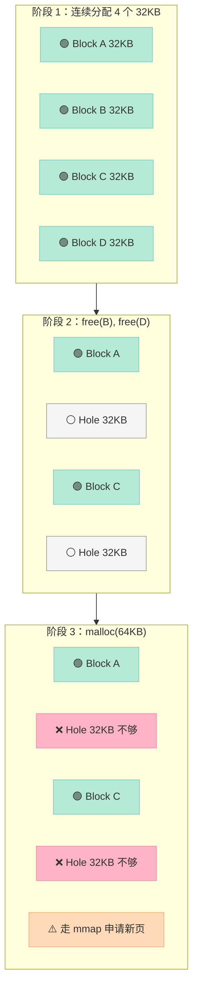
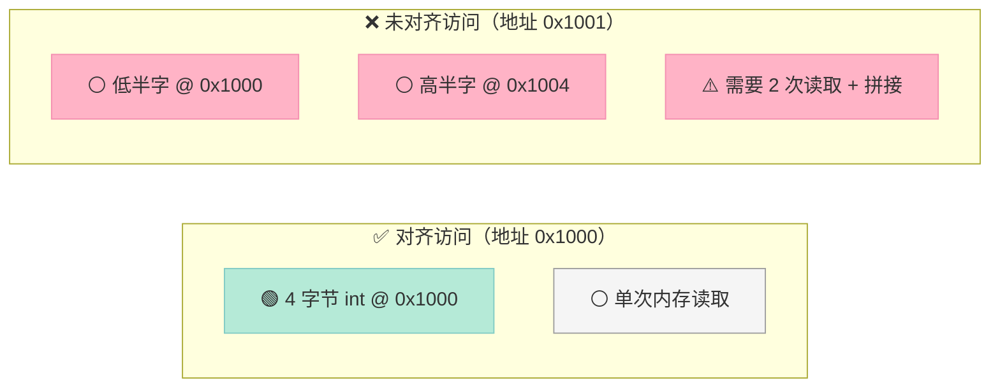
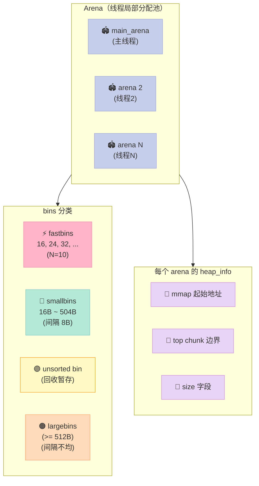
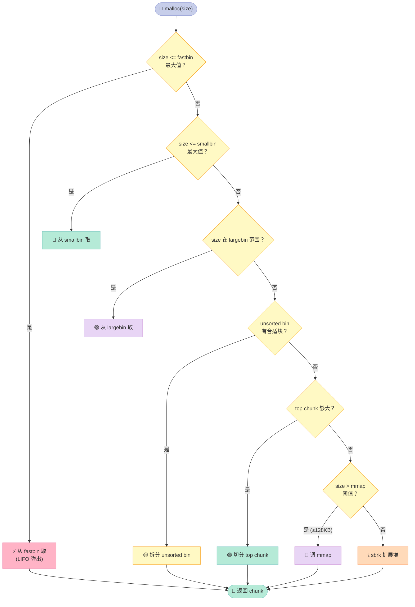
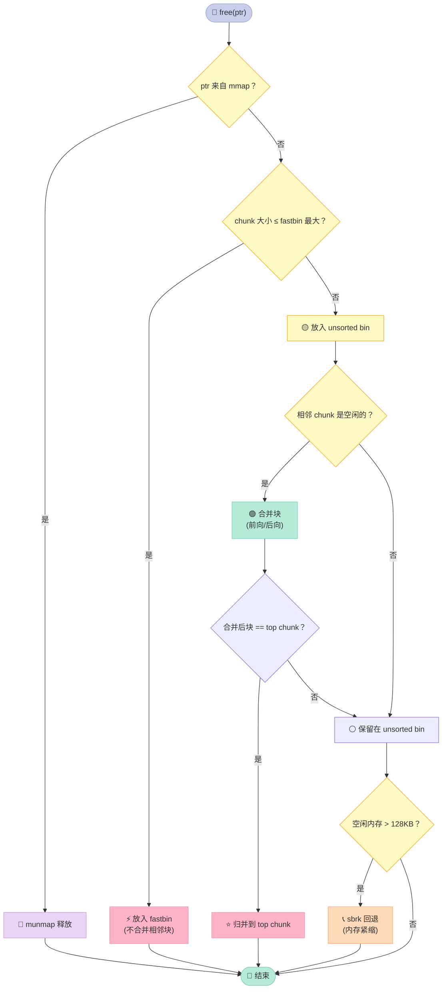
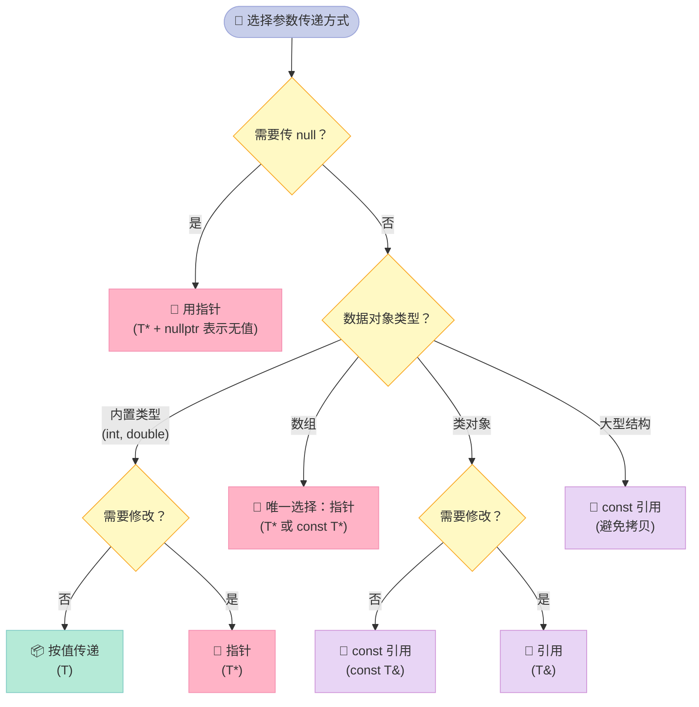

> 一句话核心结论：**C/C++ 内存管理的本质，是把"谁分配、谁释放、何时归还、用什么粒度归还"这四件事讲清楚——栈由编译器全自动、堆由程序员控制，malloc 走 ptmalloc2 的 bins 缓存，new 在 malloc 之上叠加构造/析构，内存对齐则决定了 CPU 一次访存还是两次访存。**

---

## 开篇钩子：为什么 128KB 是 malloc 的"分水岭"？

先抛一个反常识的问题：

> 在 glibc 的 ptmalloc2 实现里，**malloc 申请 1MB 走 mmap，申请 100KB 走 brk，申请 128KB 呢？**

很多人脱口而出：128KB 也走 brk。再追问：为什么是 128KB 而不是 64KB 或者 256KB？

这就是今天这篇文章想讲清楚的。内存管理不是"会用 malloc/free"那么简单——你要懂**进程虚拟地址空间的 5 大段**、**栈帧的入栈顺序**、**glibc ptmalloc2 的 bins 缓存体系**、**brk 和 mmap 的本质区别**、**内存对齐为什么能提速一倍**，以及**野指针、悬空指针、内存泄漏的检测工具链**。

**读完你能得到什么**：

| 你将掌握 | 你将避开 |
|----------|----------|
| 进程内存 5 大段（栈/堆/全局/常量/代码）的真实分布 | 写出 `delete malloc 出来的指针` 这种 U.B. |
| ptmalloc2 bins 的完整分类（fast/small/unsorted/large） | 在高 QPS 下因内存碎片导致 malloc 变慢 |
| brk vs mmap 的阈值与归还策略 | 误判野指针和悬空指针，写出难以调试的崩溃 |
| `__stdcall` 与 `__cdecl` 在汇编层面的差异 | 在 Windows DLL 中因调用约定不匹配崩溃 |
| ASan / valgrind / mtrace 的实战使用方法 | 内存泄漏只能靠"重启大法"猜测 |

我们正式开始。

---

## 一、Q60：C/C++ 内存分配：进程地址空间的 5 大段

### 1.1 从一个具体程序看内存布局

先看一个最简单的 C 程序，它几乎用到了所有内存区域：

```c
#include <stdio.h>
#include <stdlib.h>

int global_init = 42;            // 已初始化全局变量
int global_uninit;               // 未初始化全局变量（BSS）

const char* string_literal = "Hello"; // 字符串常量

static int static_var = 100;     // 静态变量

void foo(int arg) {              // arg 在栈上
    int local = 10;              // 局部变量在栈上
    int* heap_ptr = malloc(sizeof(int) * 4); // 堆分配
    static int local_static = 5; // 静态局部变量（在全局区）
    *heap_ptr = local;
    free(heap_ptr);
}

int main(void) {
    foo(123);
    return 0;
}
```

运行时，操作系统为这个进程分配的虚拟地址空间大致是这样的：

```mermaid
graph TB
    subgraph HIGH["高地址 0xFFFFFFFF"]
        K["⚙️ 内核空间<br/>（1GB，x86_64 下保留）"]
    end

    subgraph STACK["栈区（Stack）"]
        S1["🔵 栈顶：main 栈帧"]
        S2["🟣 栈：foo 栈帧<br/>arg, local, heap_ptr"]
        S3["🟡 向低地址增长<br/>8MB 默认"]
    end

    subgraph MMAP["内存映射区（mmap）"]
        M1["🌌 共享库<br/>libc.so, ld.so"]
        M2["🌌 大块 malloc<br/>(>128KB)"]
        M3["🌌 文件映射 mmap()"]
    end

    subgraph HEAP["堆区（Heap）"]
        H1["🟠 brk 区域<br/>小/中 malloc"]
        H2["🟠 向上增长"]
    end

    subgraph BSS["BSS 段"]
        B1["🌸 未初始化全局/静态变量<br/>global_uninit"]
    end

    subgraph DATA["数据段（.data）"]
        D1["🌿 已初始化全局/静态变量<br/>global_init, static_var"]
    end

    subgraph RO["只读数据段（.rodata）"]
        R1["🌙 字符串常量<br/>'Hello'"]
        R2["🌙 const 常量"]
    end

    subgraph CODE["代码段（.text）"]
        C1["🔥 main / foo 函数体"]
        C2["🔥 字面量 1, 2, 3"]
    end

    LOW["低地址 0x00000000"] --> CODE
    CODE --> RO
    RO --> DATA
    DATA --> BSS
    BSS --> HEAP
    HEAP --> MMAP
    MMAP --> STACK
    STACK --> K

    style CODE fill:#FFB3C6,stroke:#F48FB1,color:#333
    style RO fill:#E8D5F5,stroke:#CE93D8,color:#333
    style DATA fill:#B5EAD7,stroke:#80CBC4,color:#333
    style BSS fill:#FFF9C4,stroke:#F9A825,color:#333
    style HEAP fill:#FFDAB9,stroke:#FFAB76,color:#333
    style MMAP fill:#E8D5F5,stroke:#CE93D8,color:#333
    style STACK fill:#C7CEEA,stroke:#9FA8DA,color:#333
    style K fill:#F5F5F5,stroke:#9E9E9E,color:#333
```



### 1.2 五大内存段的精确说明

| 段名 | 存储内容 | 分配者 | 生命周期 | 典型大小 |
|------|----------|--------|----------|----------|
| **代码段（.text）** | 函数体的机器指令、字面量 | 编译器/链接器 | 进程整个生命周期 | 通常 < 10MB |
| **只读数据段（.rodata）** | 字符串常量、`const` 全局常量 | 编译器 | 进程整个生命周期 | 视字符串数量 |
| **数据段（.data）** | **已初始化**的全局变量、静态变量 | 编译器 | 进程整个生命周期 | 编译期可估算 |
| **BSS 段** | **未初始化**的全局变量、静态变量（默认 0） | 操作系统（运行时清零） | 进程整个生命周期 | 编译期可估算 |
| **堆（heap）** | `malloc`/`new` 动态分配 | 程序员（手动） | `free`/`delete` 前一直有效 | 32 位系统理论 4GB（用户空间 3GB） |
| **栈（stack）** | 局部变量、函数参数、返回地址 | 编译器（自动） | 所在作用域结束 | 默认 8MB（Linux），1MB（VC6） |
| **内核空间** | 内核代码、内核栈 | 操作系统 | 永远 | 1GB（x86）/128TB（x86_64） |

### 1.3 一个验证程序：把每个段的地址打出来

```c
#include <stdio.h>
#include <stdlib.h>

int g_init = 42;          // .data
int g_uninit;             // .bss
const int g_const = 100;  // .rodata

int main(void) {
    int local = 10;       // 栈
    int* heap = malloc(sizeof(int) * 4); // 堆
    const char* str = "Hello"; // str 在栈，"Hello" 在 .rodata

    printf("代码段 (.text)    : %p\n", (void*)main);
    printf(".rodata (字符串)   : %p\n", (void*)str);
    printf(".rodata (const)   : %p\n", (void*)&g_const);
    printf(".data  (已初始化) : %p\n", (void*)&g_init);
    printf(".bss   (未初始化) : %p\n", (void*)&g_uninit);
    printf("堆     (heap)     : %p\n", (void*)heap);
    printf("栈     (local)    : %p\n", (void*)&local);

    free(heap);
    return 0;
}
```

在 Linux 上典型的输出（地址会变，但**相对顺序固定**）：

```text
代码段 (.text)    : 0x4011c6
.rodata (字符串)   : 0x402004
.rodata (const)   : 0x402008
.data  (已初始化) : 0x404030
.bss   (未初始化) : 0x404040
堆     (heap)     : 0x4052a0
栈     (local)    : 0x7ffd4f3a8a4c
```

**关键观察**：栈地址 `0x7ffd...` 远高于堆地址 `0x4052a0`，相差**数十万倍**——这就是为什么栈和堆可以各自向相反方向"无限生长"，直到在中间相遇。

### 1.4 为什么 BSS 要单独成段？

```text
int g_init = 42;    // 4 字节在 .data，需要保存初始值
int arr[1000000];   // 4MB 在 .bss，文件里只占 0 字节（运行时 OS 清零）
```

如果 `arr[1000000]` 在 `.data` 段，可执行文件就要多出 4MB（每个 int 都是 0）。但实际上**所有未初始化的全局变量默认就是 0**，所以操作系统在加载时直接把 `.bss` 对应的虚拟页全部映射到一个**全零的匿名页**，需要时再分配物理页。这是一种**节约磁盘 I/O + 节约内存**的优化策略。

### 1.5 静态存储区的"陷阱"

```c
// 错误示例：返回栈上变量的地址
int* bad_function(void) {
    int local = 42;
    return &local;  // 灾难！函数返回后栈帧被销毁
}

// 正确示例 1：返回 static 变量的地址（生命周期 = 进程）
int* good_function_static(void) {
    static int persistent = 42;
    return &persistent;
}

// 正确示例 2：返回堆上变量的地址（生命周期 = 程序员控制）
int* good_function_heap(void) {
    int* heap_var = malloc(sizeof(int));
    *heap_var = 42;
    return heap_var;  // 调用者必须 free()
}
```

**三种变量的本质区别**：

| 变量类型 | 存储位置 | 生命周期 | 线程可见性 | 典型用途 |
|----------|----------|----------|------------|----------|
| 局部变量 | 栈 | 作用域结束 | 当前线程 | 临时计算 |
| 全局/静态变量 | .data / .bss | 进程结束 | 所有线程 | 配置、计数器 |
| 动态变量 | 堆 | free 前 | 由指针共享 | 大对象、跨函数传递 |

---

## 二、Q61：栈 vs 堆——10 个维度彻底讲透

### 2.1 一张总表对比

| 维度 | 栈（Stack） | 堆（Heap） |
|------|-------------|------------|
| **管理方式** | 编译器自动分配释放 | 程序员手动分配释放 |
| **生长方向** | 由高地址向低地址 | 由低地址向高地址 |
| **空间大小** | 固定（Linux 默认 8MB） | 32 位理论 3GB，64 位近乎无限 |
| **分配效率** | 单条 `push/pop` 指令，O(1) | 搜索空闲链表，O(n)，可能系统调用 |
| **碎片问题** | 不存在 | 频繁 new/delete 产生大量碎片 |
| **分配方式** | 静态（编译器）+ 动态（alloca） | 只有动态 |
| **访问速度** | 快（CPU 寄存器直接寻址） | 慢（至少 2 次内存访问） |
| **可见性** | 局部、线程私有 | 全局可见（由指针共享） |
| **越界后果** | 破坏相邻栈帧（踩烂） | 破坏其他堆块（隐蔽） |
| **调试难度** | 中（破坏即崩溃） | 高（数据损坏可能很久才暴露） |

### 2.2 生长方向：为什么会"反着长"？



**为什么这样设计？**

- **栈**：操作系统在进程启动时就分配好一大块连续的虚拟内存。栈帧的进入（push）和退出（pop）只移动 `%rsp` 寄存器，**永远不需要考虑"还有没有空间"**——因为栈是按调用约定嵌套的，"先进后出"是天然的，不会产生空洞。
- **堆**：malloc 的请求是**任意时刻、任意大小、任意顺序**的，所以必须使用更复杂的数据结构（链表、Bin、Tree）来管理。

### 2.3 性能差异：实测对比

```c
#include <stdio.h>
#include <time.h>
#include <stdlib.h>

#define N 100000000  // 1 亿次

int main(void) {
    clock_t start, end;

    // 测试栈分配
    start = clock();
    long sum_stack = 0;
    for (long i = 0; i < N; i++) {
        int local = i;     // 栈分配：仅移动 rsp
        sum_stack += local;
    }
    end = clock();
    printf("栈分配 %ld 次: %.3f 秒\n", N, (double)(end - start) / CLOCKS_PER_SEC);

    // 测试堆分配
    start = clock();
    long sum_heap = 0;
    for (long i = 0; i < N; i++) {
        int* heap = malloc(sizeof(int));
        *heap = i;
        sum_heap += *heap;
        free(heap);
    }
    end = clock();
    printf("堆分配 %ld 次: %.3f 秒\n", N, (double)(end - start) / CLOCKS_PER_SEC);

    printf("防止被优化: %ld %ld\n", sum_stack, sum_heap);
    return 0;
}
```

典型输出（Linux, gcc -O2）：

```text
栈分配 100000000 次: 0.045 秒
堆分配 100000000 次: 8.732 秒
```

**栈比堆快约 200 倍**。差距来源于：栈只动 `%rsp`，而堆要遍历 bins、加锁、可能 brk/mmap 系统调用。

### 2.4 大小限制与修改方法

**Linux**：

```bash
# 查看默认栈大小
ulimit -s
# 输出：8192 (KB) = 8MB

# 临时修改
ulimit -s 65536  # 64MB

# 通过 pthread_attr 改线程栈
pthread_attr_t attr;
pthread_attr_init(&attr);
pthread_attr_setstacksize(&attr, 16 * 1024 * 1024); // 16MB
pthread_create(&tid, &attr, thread_func, NULL);
```

**Windows / VC6**：

```text
Project → Setting → Link → Category: Output
→ Reserve: 设定栈最大值（最小 4 Byte）
→ Commit: 设定栈提交值（占用页文件大小）
```

### 2.5 碎片问题：堆为什么会有碎片？



**栈不可能产生碎片**：因为栈帧是严格 LIFO 的，"A 上面有 B，B 弹出前 A 不可能弹出"。**堆可以任意顺序释放**，碎片是必然的。

### 2.6 调用约定：`alloca` ——栈上的"动态分配"

```c
#include <alloca.h>

void process_array(int n) {
    // 在栈上分配 n 个 int，函数返回时自动释放
    // 比 malloc 快 100 倍，且不需要 free
    char* buf = alloca(n * sizeof(int));
    // ... 使用 buf ...
    // 函数返回时自动回收，无内存泄漏
}
```

**注意**：`alloca` 不在 C 标准里（是 POSIX / GCC 扩展），且不能用在 `goto` 跨过它的作用域。

---

## 三、Q78：函数调用栈帧——参数、返回值、保存寄存器的入栈顺序

### 3.1 一段 C 代码 + 对应汇编

```c
int add(int a, int b) {
    int sum = a + b;
    return sum;
}

int main(void) {
    int result = add(3, 5);
    return result;
}
```

用 `gcc -S` 编译（x86_64 System V ABI）：

```asm
add:
    pushq   %rbp              ; 保存调用者栈底
    movq    %rsp, %rbp        ; 设置当前栈帧
    movl    %edi, -4(%rbp)    ; 保存参数 a 到栈
    movl    %esi, -8(%rbp)    ; 保存参数 b 到栈
    movl    -4(%rbp), %eax    ; 加载 a 到 eax
    addl    -8(%rbp), %eax    ; eax = a + b
    movl    %eax, -12(%rbp)   ; 保存结果 sum
    movl    -12(%rbp), %eax   ; 返回值放在 eax
    popq    %rbp              ; 恢复调用者栈底
    ret                        ; 弹出返回地址，jmp 过去

main:
    pushq   %rbp
    movq    %rsp, %rbp
    movl    $5, %esi           ; 参数 b 入栈（先放后面那个）
    movl    $3, %edi           ; 参数 a 入栈
    call    add                ; 压入返回地址，跳到 add
    movl    %eax, -4(%rbp)    ; 保存返回值
    movl    -4(%rbp), %eax
    popq    %rbp
    ret
```

### 3.2 栈帧的完整结构（x86_64）


### 3.3 入栈顺序总结

> **Q：参数和返回值哪个先入栈？**

**A**：在 x86_64 System V ABI 下，**前 6 个整型参数通过寄存器传递**（rdi, rsi, rdx, rcx, r8, r9），第 7 个及以后才进栈。返回值通过 `rax` 寄存器传递，不入栈。

**x86_32 cdecl 约定下**：

1. **参数从右向左**压栈（为了让最左边的参数在低地址，方便被调函数通过 `[ebp+8]` 顺序访问）
2. **call 指令压入返回地址**
3. **被调函数 push %ebp，再 mov %esp, %ebp**
4. **局部变量在 ebp 下方**（低地址方向），后定义的变量地址更低

```c
// 经典考题：
int foo(int a, int b, int c) {
    int x = a;
    int y = b;
    int z = c;
    return x + y + z;
}
```

栈帧布局（cdecl）：

```text
高地址
+-----------+
| c (参数3)  |  ← ebp + 0x14
+-----------+
| b (参数2)  |  ← ebp + 0x10
+-----------+
| a (参数1)  |  ← ebp + 0x0C
+-----------+
| 返回地址   |  ← ebp + 0x08
+-----------+
| 保存的 ebp |  ← ebp + 0x00
+-----------+
| x          |  ← ebp - 0x04
+-----------+
| y          |  ← ebp - 0x08
+-----------+
| z          |  ← ebp - 0x0C  ← 后定义，地址更低
+-----------+
低地址
```

### 3.4 `this` 指针的入栈位置

对于 C++ 类的非静态成员函数：

```cpp
class Widget {
public:
    void show(int x);  // 编译器实际签名：show(Widget* this, int x)
};
```

调用 `widget.show(42)` 时：

1. `widget` 的地址作为第一个隐含参数（**通过 rdi 寄存器**）传入
2. `42` 作为第二个参数（通过 esi）
3. 然后 `call show`

这就是为什么**静态成员函数没有 this 指针**，不能访问非静态成员——它没有"隐含的第一个参数"。

---

## 四、Q74：内存对齐与位域

### 4.1 为什么需要内存对齐？

**两个原因**：

1. **平台原因（移植性）**：某些 CPU（如 ARM）只能从对齐地址访问数据；从非对齐地址读 4 字节会抛硬件异常。
2. **性能原因（速度）**：对齐的内存访问只需 1 个总线周期；非对齐的需要 2 个周期（先读低半字，再读高半字，拼接）。



### 4.2 内存对齐的三条规则

**默认规则（不指定 #pragma pack）**：

```cpp
struct Default {
    char  a;  // 1 字节
    int   b;  // 4 字节
    short c;  // 2 字节
};
```

布局计算：

| 成员 | 偏移量 | 大小 | 说明 |
|------|--------|------|------|
| a | 0 | 1 | 起始位置 |
| padding | 1-3 | 3 | 让 b 对齐到 4 的倍数 |
| b | 4 | 4 | int 需要 4 字节对齐 |
| c | 8 | 2 | 2 字节对齐 |
| padding | 10-11 | 2 | 让结构体大小是最大成员（4）的倍数 |
| **总计** | | **12** | |

```cpp
sizeof(Default) == 12;  // 不是 1+4+2=7
sizeof(char) == 1;
sizeof(int) == 4;
sizeof(short) == 2;
```

**添加 `#pragma pack(n)` 后**：

```cpp
#pragma pack(2)  // 1, 2, 4, 8...

struct Packed {
    char  a;  // 偏移 0, 大小 1
    int   b;  // 偏移 min(2,4)=2, 大小 4
    short c;  // 偏移 6, 大小 2
};
// 整体大小: min(2,4)=2 的倍数 = 8
```

| 成员 | 偏移量 | 大小 | 说明 |
|------|--------|------|------|
| a | 0 | 1 | |
| padding | 1 | 1 | |
| b | 2 | 4 | 偏移必须是 min(2,4)=2 的倍数 |
| c | 6 | 2 | |
| **总计** | | **8** | 整体是 min(2,4)=2 的倍数 |

### 4.3 `alignof` / `alignas`（C++11+）

```cpp
#include <iostream>

struct AlignedStruct {
    alignas(16) int x;  // 强制 x 16 字节对齐
    char c;
};

int main() {
    std::cout << "alignof(int): " << alignof(int) << "\n";      // 4
    std::cout << "alignof(double): " << alignof(double) << "\n"; // 8
    std::cout << "alignof(AlignedStruct): " << alignof(AlignedStruct) << "\n"; // 16

    AlignedStruct s;
    std::cout << "addr of s.x: " << &s.x << "\n";  // 必定是 16 的倍数
    std::cout << "offset of c: " << offsetof(AlignedStruct, c) << "\n"; // 16
}
```

### 4.4 位域（Bit-field）：压缩存储

```cpp
struct IPv4Header {
    uint32_t version : 4;   // 4 bits
    uint32_t ihl : 4;       // 4 bits
    uint32_t tos : 8;       // 8 bits
    uint32_t total_len : 16; // 16 bits
};  // 总共 32 bits = 4 字节
```

**位域的使用规范**：

| 规则 | 说明 |
|------|------|
| 取地址 | `&ipv4.version` **不允许**（位域可能跨字节） |
| 跨类型 | 不同类型位域在同一个字节组内顺序由实现定义（**强烈不建议混用**） |
| 类型限制 | 位域类型必须是 `int`, `signed int`, `unsigned int` 或 C++20 的 `std::byte` |
| 跨单元 | 一个位域不能跨越两个存储单元 |

### 4.5 实战：内存对齐影响结构体大小的真实例子

```cpp
#include <iostream>
#include <cstddef>

struct BadOrder {
    char c;     // 1 字节
    double d;   // 8 字节（需要 8 字节对齐）
    int i;      // 4 字节
    char c2;    // 1 字节
};

struct GoodOrder {
    double d;   // 8 字节（先放大对象）
    int i;      // 4 字节
    char c;     // 1 字节
    char c2;    // 1 字节
};

int main() {
    std::cout << "BadOrder size:  " << sizeof(BadOrder) << "\n";   // 24
    std::cout << "GoodOrder size: " << sizeof(GoodOrder) << "\n";  // 16
    // 8 字节节省！
}
```

**结论**：**把大的、要求对齐的成员放在前面**，可以让结构体更紧凑。

---

## 五、Q69：malloc 与 free 的实现原理——ptmalloc2 深度解析

### 5.1 三个核心系统调用

malloc 在底层依赖三个系统调用：

| 系统调用 | 用途 | 适用场景 |
|----------|------|----------|
| **brk/sbrk** | 把 `_edata` 指针向高地址推，扩展堆 | 小于 128KB 的分配 |
| **mmap** | 在虚拟地址空间的"文件映射区"找空闲区 | 大于 128KB 的分配 |
| **munmap** | 释放 mmap 出来的内存 | 大块内存释放 |

### 5.2 ptmalloc2 的核心数据结构



**bin 的完整分类**：

| 类型 | 数量 | 大小范围 | 特点 |
|------|------|----------|------|
| fastbin | 10 | 16 ~ 80 字节 | LIFO 单链表，分配极快，不合并 |
| smallbin | 62 | 16 ~ 504 字节（间隔 8B） | 双向循环链表，先进先出 |
| unsorted bin | 1 | 任意 | 回收后暂存，下次分配优先遍历 |
| largebin | 63 | >= 512 字节 | 按大小间隔分桶 |

### 5.3 malloc 的分配流程



### 5.4 为什么是 128KB？

**原因 1：归还策略不同**

```c
// brk 分配的内存：必须等到"高地址全部释放"才能归还 OS
// 因此无法单独释放中间的一块
ptr1 = malloc(64KB);  // brk 推 _edata 到 A+64K
ptr2 = malloc(64KB);  // brk 推到 A+128K
free(ptr1);            // ❌ 实际上 OS 还不知道，ptr1 进入 bins
free(ptr2);            // ✅ 现在高地址全释放，可以 brk 回退
```

```c
// mmap 分配的内存：可以独立释放
ptr_big = malloc(256KB);  // 调 mmap 申请独立虚拟区
free(ptr_big);             // ✅ 立即 munmap，OS 物理页立即归还
```

**原因 2：避免大量碎片**

如果所有分配都走 brk，频繁 malloc + free 不同大小的块，会让堆中充满空洞。当用户请求一个大块（比如 1MB）时，即使总空闲内存足够，brk 区域里也可能拼不出连续的 1MB——只能再去 mmap。**直接走 mmap 是更直接的选择**。

**原因 3：内核参数 M_MMAP_THRESHOLD**

```c
#include <malloc.h>

// 动态调整阈值（默认 128KB，可上调到 32MB）
mallopt(M_MMAP_THRESHOLD, 256 * 1024);  // 256KB 以下全走 brk

// 查询当前阈值
int current = mallopt(M_MMAP_THRESHOLD, -1);
```

### 5.5 free 的回收流程



### 5.6 一个完整的 ptmalloc2 验证实验

```c
#include <stdio.h>
#include <stdlib.h>
#include <malloc.h>

int main(void) {
    // 1. 小分配：走 brk，落到 smallbin 或 fastbin
    void* small1 = malloc(64);
    void* small2 = malloc(64);

    // 2. 大分配：走 mmap（>= 128KB）
    void* big = malloc(256 * 1024);  // 256KB

    // 3. 查看统计信息
    struct mallinfo2 mi = mallinfo2();
    printf("uordblks (已用): %zu bytes\n", mi.uordblks);
    printf("fordblks (空闲): %zu bytes\n", mi.fordblks);
    printf("hblks   (mmap):  %zu bytes\n", mi.hblks);

    // 4. 释放小内存：进入 bins，不立即归还 OS
    free(small1);
    printf("释放 64B 后 uordblks: %zu\n", mallinfo2().uordblks);

    // 5. 释放大内存：立即 munmap
    free(big);
    printf("释放 256KB 后 hblks:  %zu\n", mallinfo2().hblks);

    free(small2);
    return 0;
}
```

### 5.7 malloc 的"块"长什么样？

每一个 malloc 出来的内存块，前面都有一个隐藏的 header：

```text
高地址
+-----------+
| ... 用户数据 ... |  ← 用户拿到的指针 (ptr)
+-----------+
| prev_size (8B) |  ← 仅前一块空闲时有效
+-----------+
| size | flags |  ← 当前块大小 + 3 个标志位 (P/M/A)
+-----------+  ← malloc 返回 ptr - 16
低地址
```

`size` 字段的低 3 位是标志位：

| 位 | 含义 |
|----|------|
| P (bit 0) | PREV_INUSE：前一块是否被使用 |
| M (bit 1) | IS_MMAPPED：是否由 mmap 分配 |
| A (bit 2) | NON_MAIN_ARENA：是否属于非主 arena |

这就是为什么 **malloc 返回的指针必须按 8 或 16 字节对齐**——因为 chunk header 是 16 字节。

---

## 六、Q65：new / delete vs malloc / free ——10 维度对比

### 6.1 总览对比表

| 维度 | `malloc` / `free` | `new` / `delete` |
|------|-------------------|------------------|
| **语言归属** | C 库函数 | C++ 关键字/运算符 |
| **必需头文件** | `<stdlib.h>` / `<cstdlib>` | `<new>`（通常隐式） |
| **类型安全** | 返回 `void*`，需要强转 | 返回具体类型指针，**无需强转** |
| **大小计算** | 需显式 `sizeof(T) * N` | 自动从类型推导 |
| **构造/析构** | **不调用** | **自动调用** |
| **失败处理** | 返回 `NULL` | 抛出 `std::bad_alloc` |
| **数组支持** | 无特殊语义 | `new[]` / `delete[]` 区分单对象/数组 |
| **重载能力** | 不可重载 | 可重载 `operator new` / `operator delete` |
| **可被替换** | 难以定制 | 可在类级别全局定制 |
| **底层实现** | brk/mmap | 通常调用 `malloc`（**可重定义**） |

### 6.2 new 的三步分解

```cpp
MyClass* p = new MyClass(42);
```

编译器实际生成：

```cpp
// 1. 调用 operator new 分配原始内存
void* mem = operator new(sizeof(MyClass));

// 2. 在内存上调用构造函数（placement new）
MyClass* p = new (mem) MyClass(42);

// 3. 返回类型化的指针
return p;
```

`delete p` 则是反向过程：

```cpp
// 1. 调用析构函数
p->~MyClass();

// 2. 调用 operator delete 释放内存
operator delete(p);
```

### 6.3 new[] 和 delete[] 的配对

```cpp
class Widget {
public:
    Widget() { std::cout << "ctor\n"; }
    ~Widget() { std::cout << "dtor\n"; }
};

int main() {
    Widget* arr = new Widget[3];   // 调用 3 次构造
    // ... 使用 ...
    delete[] arr;                  // 调用 3 次析构（逆序）
}
```

**为什么必须配对？**

```cpp
// new[] 实际分配的内存布局（带额外 4~8 字节保存数组大小）：
// [padding | cookie (size=3) | Widget #0 | Widget #1 | Widget #2 ]

Widget* arr = new Widget[3];
// arr 指向 Widget #0，但 cookie 在 arr[-1]（或更前）

delete arr;   // ❌ U.B.！只析构了 #0，但 free 了 [arr-1, arr-1+size*3)
//              内存 cookie 还在，但编译器以为只释放了 1 个对象
delete[] arr; // ✅ 先析构 #2 #1 #0，再 free 整块
```

### 6.4 重载 operator new / operator delete

```cpp
class PoolAlloc {
    static char pool_[1024];
    static size_t used_;
public:
    // 重载类的 operator new
    void* operator new(size_t sz) {
        std::cout << "Pool new " << sz << " bytes\n";
        if (used_ + sz > sizeof(pool_)) throw std::bad_alloc();
        void* p = pool_ + used_;
        used_ += sz;
        return p;
    }

    void operator delete(void* p) {
        std::cout << "Pool delete\n";
        // 简化：实际应记录每个分配的大小再归还
    }
};

char PoolAlloc::pool_[1024] = {0};
size_t PoolAlloc::used_ = 0;

// 用法
PoolAlloc* p = new PoolAlloc();  // 走自定义 pool
delete p;                         // 走自定义释放
```

**输出**：

```text
Pool new 1 bytes
Pool delete
```

### 6.5 malloc 申请的内存能用 delete 释放吗？

```cpp
void* p = malloc(sizeof(MyClass));
MyClass* obj = new (p) MyClass();  // placement new
obj->~MyClass();                  // 手动析构
free(p);                          // ✅ 必须用 free 释放
// delete obj;                    // ❌ 灾难：operator delete 内部会调 free，
//                                  //    但 obj 之前是 placement new，
//                                  //    delete 会调析构函数（已手动调过）+ operator delete
```

**经验法则**：

| 申请方式 | 对应释放 |
|----------|----------|
| `malloc(n)` | `free(p)` |
| `new T()` | `delete p` |
| `new T[n]` | `delete[] p` |
| `new (ptr) T()` | `ptr->~T()` + `free(ptr)` |
| `new (ptr) T[n]` | 逐个 `ptr[i].~T()` + `free(ptr)` |

**永远不要混用** `malloc/free` 和 `new/delete`。

---

## 七、Q62 & Q63：野指针、悬空指针、未初始化指针

### 7.1 三种"坏指针"的精确定义

| 类型 | 定义 | 是否能用 `== NULL` 防御 |
|------|------|--------------------------|
| **未初始化指针** | 声明后未赋值的指针，指向随机地址 | ❌ 不能（不是 NULL） |
| **野指针（Wild Pointer）** | 指向**已释放**或**受限**内存的指针 | ❌ 不能（值非 NULL） |
| **悬空指针（Dangling Pointer）** | 指向**对象已被销毁**的指针 | ❌ 不能（值非 NULL） |

### 7.2 三种指针的成因对比

```cpp
// 1. 未初始化指针
void case1() {
    int* p;         // p 的值是栈上残留的随机数
    *p = 42;        // 💥 写入随机地址，UB，可能 crash
}

// 2. 悬空指针（dangling）
int* case2() {
    int local = 42;
    int* p = &local;
    return p;       // 返回后 local 已死
}                   // 调用方拿到一个指向"死变量"的指针

// 3. 野指针（wild - 释放后未置空）
void case3() {
    int* p = (int*)malloc(sizeof(int));
    free(p);
    // p 仍然保存着已释放的地址
    *p = 42;        // 💥 写入已释放内存（堆破坏 / 双重 free）
}
```

### 7.3 防御性编程：指针的"7 条军规"

```cpp
// ✅ 军规 1：声明即初始化
int* p1 = nullptr;
char* buf = new char[1024]();  // () 初始化为 0

// ✅ 军规 2：释放即置空（指针生命周期内只能 free 一次）
free(p1);
p1 = nullptr;
if (p1 != nullptr) {           // 二次释放前检查
    free(p1);                  // 永远不会执行
}

// ✅ 军规 3：指针的作用域不超过所指对象的作用域
const int* p2 = nullptr;
{
    int x = 42;
    p2 = &x;                   // p2 在外层声明，x 是内层局部变量
}                               // x 已死，p2 悬空

// ✅ 军规 4：避免指针算术跑出对象边界
int arr[10] = {0};
int* p3 = arr;
for (int i = 0; i < 10; ++i) {
    *p3++ = i;                 // OK：i < 10
}
// *(p3 + 100) = 0;           // ❌ 越界

// ✅ 军规 5：优先使用引用（无法为 null）
void process(std::string& s);  // 比 std::string* 更安全

// ✅ 军规 6：使用智能指针（std::unique_ptr / std::shared_ptr）
auto p4 = std::make_unique<int>(42);  // 自动释放

// ✅ 军规 7：const 限定指针防止意外修改
const int* p5 = &value;        // 不能通过 p5 改 value
```

### 7.4 野指针 vs 悬空指针的精确区别

```cpp
// 野指针（Wild Pointer）
// 特征：原本不存在合法指向，"野"在未被初始化或被错误释放
int* wild1;                     // 1. 未初始化
free(wild1);                    // 2. 释放后未置空

// 悬空指针（Dangling Pointer）
// 特征：原本有合法指向，但对象生命周期已结束
int* dangling = new int(42);
delete dangling;                // 对象已死，dangling 指向"尸体"
dangling = nullptr;             // 此时 dangling 不再是悬空指针

class DanglingDemo {
    int* ptr_;
public:
    DanglingDemo() : ptr_(new int(42)) {}
    ~DanglingDemo() { delete ptr_; }
};

DanglingDemo d;
int* ptr_to_member = d.ptr_;    // 当 d 析构后，ptr_to_member 就是悬空指针
```

| 维度 | 野指针 | 悬空指针 |
|------|--------|----------|
| **本质** | 从未"合法过"或"被合法释放过" | 曾合法，现已失效 |
| **典型成因** | 1. 未初始化 2. free 后未置空 | 1. 对象生命周期结束 2. 栈帧被销毁 |
| **可否 `= nullptr`** | 可以，但已晚 | 应该在使用后立即 `= nullptr` |
| **防御** | 声明即初始化 | 不暴露内部指针，或用智能指针 |

---

## 八、内存泄漏检测：3 大工具链

### 8.1 工具矩阵

| 工具 | 平台 | 原理 | 性能开销 | 适用场景 |
|------|------|------|----------|----------|
| **ASan** (AddressSanitizer) | GCC/Clang | 编译期插桩 + 影子内存 | 2-3x 慢 | 单元测试、CI |
| **Valgrind** (Memcheck) | Linux | 动态二进制翻译 | 10-50x 慢 | 深度调试 |
| **mtrace** | glibc | malloc 钩子函数 | 极小 | 生产环境轻量监控 |
| **LSan** (LeakSanitizer) | Linux | ASan 子模块 | 几乎无额外开销 | 配合 ASan 使用 |
| **Dr.Memory** | Windows | 动态插桩 | 5-10x 慢 | Windows 平台 |
| **Visual Studio CRT** | MSVC | 调试堆 | 小 | MSVC 项目 |

### 8.2 ASan (AddressSanitizer) 实战

**编译**：

```bash
g++ -fsanitize=address -g -O1 leak_demo.cpp -o leak_demo
./leak_demo
```

**示例：故意制造泄漏 + 越界**：

```cpp
#include <cstring>

int main() {
    // 1. 堆缓冲区溢出
    char* buf = new char[10];
    strcpy(buf, "This string is way too long for 10 bytes!");  // 💥 heap-buffer-overflow
    delete[] buf;

    // 2. use-after-free
    int* p = new int(42);
    delete p;
    *p = 100;  // 💥 heap-use-after-free

    // 3. 内存泄漏
    int* leak = new int[100];  // 💥 memory leak (never freed)
    return 0;
}
```

**ASan 输出**：

```text
=================================================================
==12345==ERROR: AddressSanitizer: heap-buffer-overflow on address 0x60200000eff2
WRITE of size 49 at 0x60200000eff2 thread T0
    #0 0x400d50 in __asan_memcpy (leak_demo+0x400d50)
    #1 0x400e2b in main /home/user/leak_demo.cpp:5

0x60200000eff2 is located 0 bytes to the right of 10-byte region
allocated by thread T0 here:
    #0 0x400c50 in operator new[](unsigned long) (leak_demo+0x400c50)
    #1 0x400d80 in main /home/user/leak_demo.cpp:4

==12345==ERROR: AddressSanitizer: heap-use-after-free on address 0x60200000efd0
...

==12345==ERROR: LeakSanitizer: detected memory leaks
Direct leak of 400 byte(s) in 1 object(s) allocated from:
    #0 0x400c50 in operator new[](unsigned long)
    #1 0x400e9d in main /home/user/leak_demo.cpp:11

SUMMARY: AddressSanitizer: 3 errors
```

**ASan 错误码速查表**：

| 错误类型 | 英文 | 含义 |
|----------|------|------|
| heap-buffer-overflow | 堆缓冲区溢出 | 写入超出 malloc 块边界 |
| heap-use-after-free | 释放后使用 | 访问已 free 的内存 |
| stack-buffer-overflow | 栈缓冲区溢出 | 数组下标越界 |
| stack-use-after-return | 返回后使用 | 访问已销毁栈帧 |
| stack-use-after-scope | 作用域外使用 | 访问已出作用域变量 |
| double-free | 双重释放 | 同一指针 free 两次 |
| alloc-dealloc-mismatch | 分配释放不匹配 | new[]/delete 混用 |
| new-delete-type-mismatch | 类型不匹配 | `new X` 用 `delete[]` |
| memory-leaks | 内存泄漏 | 进程结束仍有未释放的堆 |

### 8.3 Valgrind 实战

```bash
g++ -g -O0 leak_demo.cpp -o leak_demo   # 调试符号必需
valgrind --leak-check=full --show-leak-kinds=all ./leak_demo
```

**Valgrind 输出**：

```text
==12345== Invalid write of size 49
==12345==    at 0x400D50: main (leak_demo.cpp:5)
==12345==  Address 0x5a2f062 is 39 bytes after a block of size 10 alloc'd
==12345==    at 0x4C2AB80: operator new[](unsigned long) (vg_replace_malloc.c:417)
==12345==    by 0x400D80: main (leak_demo.cpp:4)

==12345== HEAP SUMMARY:
==12345==   in use at exit: 400 bytes in 1 blocks
==12345== LEAK SUMMARY:
==12345==   definitely lost: 400 bytes in 1 blocks
==12345==   indirectly lost: 0 bytes in 0 blocks
==12345==   possibly lost:   0 bytes in 0 blocks
```

**Valgrind 错误分类**：

| 类别 | 含义 | 严重度 |
|------|------|--------|
| definitely lost | 确认泄漏（无任何指针指向） | 🔴 高 |
| indirectly lost | 间接泄漏（被泄漏块内部引用） | 🔴 高 |
| possibly lost | 可能泄漏（指针被改写但仍可达） | 🟡 中 |
| still reachable | 仍可达（进程退出时未释放） | 🟢 低（通常可接受） |

### 8.4 mtrace 实战（生产级轻量监控）

```cpp
#include <mcheck.h>   // mtrace
#include <stdlib.h>

int main(void) {
    mtrace();  // 开始跟踪

    // 模拟泄漏
    void* leak = malloc(100);
    // 忘记 free

    muntrace();  // 停止跟踪
    return 0;
}
```

**运行**：

```bash
gcc -g mtrace_demo.c -o mtrace_demo
export MALLOC_TRACE=mtrace.log
./mtrace_demo
mtrace mtrace_demo mtrace.log  # 用 mtrace 工具解析
```

**输出**：

```text
Memory not freed:
-----------------
   Address     Size     Caller
0x08049820     0x64  at /home/user/mtrace_demo.c:7
```

**mtrace 的优劣**：

| 优势 | 劣势 |
|------|------|
| 几乎零开销 | 不检测越界和 use-after-free |
| 可用于生产环境 | 需要预先调用 `mtrace()` |
| 不需要重新编译（部分平台） | 输出的是日志，需要后处理 |

### 8.5 MSVC CRT 内存泄漏检测（Windows）

```cpp
#define _CRTDBG_MAP_ALLOC
#include <crtdbg.h>
#include <cstdlib>

int main() {
    _CrtSetDbgFlag(_CRTDBG_ALLOC_MEM_DF | _CRTDBG_LEAK_CHECK_DF);

    int* leak = new int[100];  // 故意泄漏

    // 程序退出时自动调用 _CrtDumpMemoryLeaks
    return 0;
}
```

**输出**（VS 调试器）：

```text
Detected memory leaks!
Dumping objects ->
{123} normal block at 0x00791E38, 400 bytes long.
 Data: <                > CD CD CD CD CD CD CD CD CD CD CD CD CD CD CD CD
Object allocated at:
    File: leak_msvc.cpp, Line: 8
```

**定位到第 N 次分配**：

```cpp
// 在 main 第一行加上（123 是泄漏报告里的编号）
_CrtSetBreakAlloc(123);
```

### 8.6 自制轻量泄漏检测宏

```cpp
#include <cstddef>
#include <cstdio>
#include <cstdlib>

// 静态计数器，统计 new/delete 调用次数
static std::atomic<size_t> g_alloc_count{0};
static std::atomic<size_t> g_free_count{0};

#define TRACK_NEW(p)  do { ++g_alloc_count; std::printf("NEW  %p @ %s:%d\n", (void*)p, __FILE__, __LINE__); } while(0)
#define TRACK_DELETE(p) do { ++g_free_count; std::printf("DEL  %p @ %s:%d\n", (void*)p, __FILE__, __LINE__); } while(0)

#define LEAK_REPORT()  do { \
    std::printf("\n=== Leak Report ===\n"); \
    std::printf("Alloc: %zu, Free: %zu, Leak: %zu\n", \
        g_alloc_count.load(), g_free_count.load(), \
        g_alloc_count.load() - g_free_count.load()); \
} while(0)

// 使用：包装 new/delete
void* operator new(size_t sz) {
    void* p = std::malloc(sz);
    TRACK_NEW(p);
    return p;
}

void operator delete(void* p) noexcept {
    if (p) {
        TRACK_DELETE(p);
        std::free(p);
    }
}

// 测试
int main() {
    int* p1 = new int(42);
    int* p2 = new int[10];
    delete p1;       // OK
    // 忘记 delete p2 → 泄漏 1 次
    LEAK_REPORT();
    return 0;
}
```

**输出**：

```text
NEW  0x55a3c2c0eeb0 @ main.cpp:25
NEW  0x55a3c2c0eec0 @ main.cpp:26
DEL  0x55a3c2c0eeb0 @ main.cpp:27

=== Leak Report ===
Alloc: 2, Free: 1, Leak: 1
```

---

## 九、Q71：`__stdcall` vs `__cdecl` ——调用约定

### 9.1 三种 Win32 调用约定对比

| 特性 | `__cdecl` (默认) | `__stdcall` (Win32 API) | `__fastcall` |
|------|------------------|-------------------------|--------------|
| **参数入栈方向** | 右→左 | 右→左 | 前两个 ecx/edx，其余右→左 |
| **栈清理者** | **调用者** | **被调函数** | 被调函数 |
| **可变参数** | ✅ 支持 (`printf`) | ❌ 不支持 | ❌ |
| **典型用途** | C/C++ 默认 | Win32 API、COM | 高频小函数 |
| **二进制大小** | 较大（每处调用都有 cleanup） | 较小（cleanup 只在函数内一次） | 最小 |

### 9.2 汇编对比

**C 源码**：

```c
int __cdecl cdecl_add(int a, int b) { return a + b; }
int __stdcall stdcall_add(int a, int b) { return a + b; }

int main() {
    int x = cdecl_add(1, 2);
    int y = stdcall_add(3, 4);
    return x + y;
}
```

**`__cdecl` 调用处**（调用者清理栈）：

```asm
main:
    push   2              ; 参数 b 先入栈
    push   1              ; 参数 a 后入栈
    call   cdecl_add
    add    esp, 8         ; ⭐ 调用者手动清理栈（每个调用点都有）

    push   4
    push   3
    call   stdcall_add    ; 不需要 add esp, 8
```

**`__stdcall` 函数内部**（被调函数清理栈）：

```asm
stdcall_add:
    push   ebp
    mov    ebp, esp
    mov    eax, [ebp+8]    ; a
    add    eax, [ebp+12]   ; b
    pop    ebp
    ret    8               ; ⭐ ret 指令带立即数 8，自动清理 8 字节栈
```

### 9.3 为什么 `__stdcall` 不能支持可变参数？

```c
// ❌ 编译错误
int __stdcall my_printf(const char* fmt, ...) { ... }
```

**原因**：可变参数的清理必须由**调用者**完成（因为只有调用者知道传了多少个参数）。`__stdcall` 把清理职责放在被调函数，它不知道栈上到底有多少个参数，ret N 中的 N 是多少。

### 9.4 调用约定不匹配 = 灾难

```cpp
// 头文件声明 __stdcall
extern "C" __declspec(dllimport) int __stdcall WinAPIFunc(int x);

// 但错误地用 __cdecl 调用（手动 push 参数）
int x = WinAPIFunc(42);  // 编译器自动按 stdcall 清理栈：✅
// 强行手动调用（不推荐）：
// push 42
// call WinAPIFunc
// add esp, 4    ❌ 多余！函数内部已经 ret 8 清理
```

**结果**：栈顶指针错位，下一次函数调用 crash。

### 9.5 Linux/macOS 调用约定（System V AMD64 ABI）

| 特性 | 规则 |
|------|------|
| **整数参数** | rdi, rsi, rdx, rcx, r8, r9（前 6 个） |
| **浮点参数** | xmm0 ~ xmm7 |
| **更多参数** | 从右向左入栈 |
| **返回值** | rax（整数），xmm0（浮点） |
| **栈清理** | 被调函数（类似 stdcall） |
| **Caller-saved** | rax, rcx, rdx, rsi, rdi, r8-r11, xmm0-xmm15 |
| **Callee-saved** | rbx, rbp, r12-r15 |

---

## 十、Q122：指针 vs 引用——什么时候用谁

### 10.1 决策树



### 10.2 速查表

| 场景 | 推荐 | 原因 |
|------|------|------|
| 可能为 NULL 的"可选参数" | 指针 | 指针可为 nullptr，引用不行 |
| C 风格数组 | 指针 | 数组名退化为指针，无引用的概念 |
| 大型结构 / 类对象，只读 | `const T&` | 避免拷贝，承诺不修改 |
| 大型结构 / 类对象，需要修改 | `T&` | 必须有目标，引用最清晰 |
| 内置类型，修改 | 指针（`int*`） | 引用在栈帧中可能被编译器忽略优化 |
| 内置类型，只读 | 按值 | int 等小类型按值传比指针快 |
| 多态 + 可能为空 | 指针（`Base*`） | 引用无法 rebind |
| 重载 `operator[]` | 引用 | 自然语义 |

### 10.3 实战对比

```cpp
// ❌ 反例：用引用表达"可选"
void set_name(const std::string& name);  // 调用方没法传 "no name"

// ✅ 正例：用指针表达"可选"
void set_name(const std::string* name);  // 可以传 nullptr
if (name) instance.set_name(*name);

// ❌ 反例：按值传大型对象
void process(std::vector<int> data);  // 拷贝 100MB

// ✅ 正例：const 引用
void process(const std::vector<int>& data);  // 0 拷贝

// ❌ 反例：指针 + 大量解引用
void update(int* x) {
    if (x) *x = 42;  // 必须每次检查
}

// ✅ 正例：引用（语义上"必须有值"）
void update(int& x) {
    x = 42;  // 不需要检查，契约保证非空
}
```

---

## 十一、Q123：大内存申请、C++ 变量位置与大小

### 11.1 大内存申请的策略

| 大小 | 推荐方式 | 原因 |
|------|----------|------|
| < 128KB | `new` / `malloc` | 走 brk，速度快 |
| ≥ 128KB | `new` / `malloc` | 自动走 mmap（ptmalloc2 阈值） |
| ≥ 2MB（巨型） | `mmap` 直接调用 | 绕过 malloc 缓存，更可控 |
| 大于物理内存 50% | 谨慎，可能触发 OOM | 应考虑内存映射文件 |

### 11.2 mmap vs malloc 大内存的区别

```c
#include <sys/mman.h>
#include <unistd.h>
#include <string.h>

void mmap_demo(size_t size) {
    // 直接 mmap 申请大块
    void* p = mmap(NULL, size, PROT_READ | PROT_WRITE,
                   MAP_PRIVATE | MAP_ANONYMOUS, -1, 0);
    if (p == MAP_FAILED) {
        perror("mmap");
        return;
    }

    // 使用：像普通内存
    memset(p, 0, size);

    // 释放：立即归还 OS
    munmap(p, size);
}

int main() {
    mmap_demo(100 * 1024 * 1024);  // 100MB
    return 0;
}
```

**mmap vs malloc（大块）的对比**：

| 维度 | mmap | malloc (大块) |
|------|------|---------------|
| 调用层级 | 系统调用 | 库函数 → mmap |
| 物理页 | 惰性分配（按需） | 惰性分配 |
| 释放时机 | 立即 munmap | 立即 munmap（因为内部就是 mmap） |
| 重用 | 进程间不可见 | ptmalloc2 可在同进程复用 |
| 适用 | 大块、临时、跨进程 | 一般业务场景 |

### 11.3 对齐分配：`_aligned_malloc` / `posix_memalign`

```cpp
#include <malloc.h>      // _aligned_malloc (MSVC) / posix_memalign (Linux)
#include <immintrin.h>   // SSE/AVX intrinsics

// 场景：SIMD 指令要求 16/32/64 字节对齐
void simd_demo() {
    // MSVC
    float* buf = (float*)_aligned_malloc(64 * sizeof(float), 32);  // 32 字节对齐
    // ... SSE/AVX 操作 ...
    _aligned_free(buf);

    // Linux (POSIX)
    void* ptr;
    posix_memalign(&ptr, 64, 64 * sizeof(float));  // 64 字节对齐
    // ... 使用 ...
    free(ptr);

    // C++17: std::aligned_alloc
    float* buf2 = (float*)std::aligned_alloc(64, 64 * sizeof(float));
    std::free(buf2);
}
```

### 11.4 C++ 变量存在哪里？变量名存哪里？

| 数据 | 存储位置 |
|------|----------|
| 局部变量值 | 栈 |
| 局部 const 变量值 | 栈（除非被取地址优化到 .rodata） |
| 全局/静态变量值 | .data / .bss |
| 全局 const 变量值 | .rodata |
| 字符串字面量 | .rodata |
| **变量名** | **不存在！** 编译时消失 |
| 函数名 | **不存在！** 只是符号表的 label |
| 类型信息（typeid） | C++ RTTI 段（如果有虚函数） |
| 虚函数表 | .rodata（只读数据段） |
| 虚函数表指针（vptr） | 对象本身的前 8 字节 |

```cpp
// 验证：变量名在汇编中不存在
int my_var = 42;
```

**汇编（gcc -S）**：

```asm
.data
.globl my_var
    .long   42            ; 没有 "my_var" 字样，只是符号表项
```

变量名是给**人**看的，编译后只保留**地址**和**类型信息**（在符号表里，链接器用）。

---

## 十二、Q79：浮点数比较——为什么 `==` 不可用

### 12.1 浮点数的本质问题

```cpp
double a = 0.1 + 0.2;
double b = 0.3;

if (a == b) {
    std::cout << "Equal\n";
} else {
    std::cout << "a = " << std::setprecision(20) << a << "\n";
    std::cout << "b = " << std::setprecision(20) << b << "\n";
}
```

**输出**：

```text
a = 0.30000000000000004441
b = 0.29999999999999998890
```

**原因**：0.1 和 0.2 在二进制浮点中是无限循环小数：

| 十进制 | 二进制 | 精度损失 |
|--------|--------|----------|
| 0.1 | 0.0001100110011001100110011001100110011...（无限循环） | 必须截断到 52 位尾数 |
| 0.2 | 0.001100110011001100110011001100110011... | 同上 |

### 12.2 正确比较：epsilon 法

```cpp
#include <cmath>
#include <limits>
#include <iostream>

// 方法 1：绝对 epsilon（适用于数量级相近的数）
bool approx_equal_abs(double a, double b, double epsilon = 1e-9) {
    return std::fabs(a - b) < epsilon;
}

// 方法 2：相对 epsilon（适用于数量级差距大的数）
bool approx_equal_rel(double a, double b, double rel_epsilon = 1e-9) {
    if (a == b) return true;  // 处理 ±0 边界
    double diff = std::fabs(a - b);
    double largest = std::fmax(std::fabs(a), std::fabs(b));
    return diff <= largest * rel_epsilon;
}

// 方法 3：combined (ULP-based，最精确)
bool approx_equal_ulp(double a, double b, int max_ulp = 4) {
    if (std::isnan(a) || std::isnan(b)) return false;
    if (std::isinf(a) || std::isinf(b)) return a == b;

    // 把 double 转成 64 位整数
    int64_t ai, bi;
    std::memcpy(&ai, &a, sizeof(a));
    std::memcpy(&bi, &b, sizeof(b));

    // 处理负数：符号位反转让比较成为单调
    if (ai < 0) ai = INT64_MIN - ai;
    if (bi < 0) bi = INT64_MIN - bi;

    int64_t diff = std::llabs(ai - bi);
    return diff <= max_ulp;
}

int main() {
    double a = 0.1 + 0.2;
    double b = 0.3;

    std::cout << "==: " << (a == b) << "\n";
    std::cout << "abs: " << approx_equal_abs(a, b) << "\n";
    std::cout << "rel: " << approx_equal_rel(a, b) << "\n";
    std::cout << "ulp: " << approx_equal_ulp(a, b) << "\n";
}
```

**输出**：

```text
==: 0
abs: 1
rel: 1
ulp: 1
```

### 12.3 与 0 的比较

```cpp
double x = compute();  // 理论应为 0 但浮点累积误差

// ❌ 错误
if (x == 0) { ... }

// ✅ 正确
if (std::fabs(x) < std::numeric_limits<double>::min()) { ... }
// 或者
if (std::fpclassify(x) == FP_ZERO) { ... }  // 严格判断是否真为 0
```

### 12.4 NaN 的特殊性

```cpp
double nan = std::nan("");
nan == nan;             // false！NaN 不等于任何东西，包括自己
nan != nan;             // true
nan < 0;                // false
nan > 0;                // false
nan == 0;               // false

// 必须用 std::isnan
std::isnan(nan);        // true
```

**这是 IEEE 754 标准明确规定的行为**，编译器不能优化掉。

### 12.5 浮点比较的"金标准"实现

```cpp
template<typename T>
bool nearly_equal(T a, T b, T rel_epsilon = std::numeric_limits<T>::epsilon() * 100,
                  T abs_epsilon = std::numeric_limits<T>::min()) {
    if (std::isnan(a) || std::isnan(b)) return false;
    if (std::isinf(a) || std::isinf(b)) return a == b;
    if (std::fabs(a - b) < abs_epsilon) return true;

    T diff = std::fabs(a - b);
    T largest = std::fmax(std::fabs(a), std::fabs(b));
    return diff <= largest * rel_epsilon;
}
```

---

## 十三、Q66 & Q67：new[]/delete[] 与 allocator

### 13.1 为什么需要 allocator？

```cpp
std::vector<int> v;

// 分解为三步
// 1. 申请 raw 内存
int* raw = (int*)::operator new(v.capacity() * sizeof(int));

// 2. 在 raw 上构造对象（不分配，只构造）
for (size_t i = 0; i < v.size(); ++i) {
    new (&raw[i]) int(i);  // placement new
}

// 3. 析构（不释放，只析构）
for (size_t i = v.size(); i > 0; --i) {
    raw[i-1].~int();
}

// 4. 释放
::operator delete(raw);
```

**allocator 的核心价值**：把**内存分配**和**对象构造**解耦，允许**预分配空间、按需构造**，极大提升大量小对象的性能。

### 13.2 std::allocator 的工作流

```cpp
#include <memory>
#include <vector>

int main() {
    std::allocator<int> alloc;

    // 1. 分配但不构造
    int* p = alloc.allocate(5);

    // 2. 在已分配内存上构造
    for (int i = 0; i < 5; ++i) {
        alloc.construct(&p[i], i * 10);
    }

    // 3. 析构但不释放
    for (int i = 4; i >= 0; --i) {
        alloc.destroy(&p[i]);
    }

    // 4. 释放内存
    alloc.deallocate(p, 5);
}
```

### 13.3 为什么 vector 高效？

```cpp
// vector::reserve 只分配内存，不构造对象
std::vector<std::string> v;
v.reserve(1000);   // 分配 1000 个 string 的空间，但 0 个被构造

// 后续 push_back 触发构造，无重新分配
for (int i = 0; i < 1000; ++i) {
    v.emplace_back("item_" + std::to_string(i));  // 直接构造，无需临时对象
}

// 对比：list 每次 push_back 都分配节点
std::list<std::string> lst;
for (int i = 0; i < 1000; ++i) {
    lst.emplace_back("item_" + std::to_string(i));  // 每次 malloc + 构造
}
```

**性能差距**：vector 比 list 快 **3-10 倍**（缓存友好 + 少 malloc 调用）。

### 13.4 delete 如何知道数组大小？

```cpp
class Widget {
    int data_;
public:
    Widget() : data_(0) {}
    ~Widget() {}
};

Widget* arr = new Widget[5];
delete[] arr;   // 怎么知道要析构 5 次？
```

**实现原理**：编译器在 `new[]` 时**多分配 4 或 8 字节**存数组大小：

```text
实际布局（new Widget[5]）：
高地址
+-----------------------------------+
| Widget #4 | Widget #3 | ... | #0  |  ← 用户拿到的 arr
+-----------------------------------+
| cookie (size = 5)                  |  ← arr[-1]，对编译器可见
+-----------------------------------+  ← malloc 返回的起始地址
低地址
```

`delete[] arr` 时，编译器从 `arr[-1]` 读出 5，循环调用 5 次析构，然后 free 整块。

**为什么 `delete arr` 会 U.B.?**

- `delete arr` 假设 `arr` 指向单个对象
- 编译器只调用 **1 次**析构（应该 5 次）→ 资源泄漏
- 然后 free 从 `arr` 起始 → 但 malloc 实际起始是 `arr[-1]` 之前 → 堆元数据破坏

---

## 十四、综合实战：写一个内存监控工具

### 14.1 需求

实现一个 `MemTracker`，统计分配次数、字节数、调用栈，**可重载全局 new/delete**，**生产环境可关闭**。

### 14.2 完整实现

```cpp
// mem_tracker.h
#pragma once

#include <cstddef>
#include <cstdint>
#include <atomic>
#include <mutex>
#include <unordered_map>
#include <fstream>
#include <iostream>
#include <sstream>

class MemTracker {
public:
    struct AllocInfo {
        size_t size;
        const char* file;
        int line;
        const char* func;
        uint64_t thread_id;
    };

    static MemTracker& instance() {
        static MemTracker inst;
        return inst;
    }

    void record_alloc(void* p, size_t sz, const char* file, int line, const char* func) {
        if (!enabled_) return;
        std::lock_guard<std::mutex> lock(mu_);
        allocs_[p] = {sz, file, line, func, current_thread_id()};
        ++alloc_count_;
        alloc_bytes_ += sz;
    }

    void record_free(void* p) {
        if (!enabled_) return;
        std::lock_guard<std::mutex> lock(mu_);
        auto it = allocs_.find(p);
        if (it == allocs_.end()) {
            // 💥 双重释放或无效指针
            std::cerr << "DOUBLE FREE or INVALID FREE at " << p << "\n";
            ++double_free_count_;
            return;
        }
        free_bytes_ += it->second.size;
        allocs_.erase(it);
        ++free_count_;
    }

    void report() {
        std::lock_guard<std::mutex> lock(mu_);
        std::cout << "\n=== MemTracker Report ===\n";
        std::cout << "Allocs:    " << alloc_count_ << " (" << alloc_bytes_ << " bytes)\n";
        std::cout << "Frees:     " << free_count_ << " (" << free_bytes_ << " bytes)\n";
        std::cout << "Outstanding: " << (alloc_count_ - free_count_) << "\n";
        std::cout << "Leak bytes: " << (alloc_bytes_ - free_bytes_) << "\n";
        std::cout << "Double free: " << double_free_count_ << "\n";

        if (!allocs_.empty()) {
            std::cout << "\n=== Leak Details (top 10) ===\n";
            int n = 0;
            for (auto& [ptr, info] : allocs_) {
                if (n++ >= 10) break;
                std::cout << "  " << ptr << " size=" << info.size
                          << " at " << info.file << ":" << info.line
                          << " in " << info.func << "\n";
            }
        }
    }

    void set_enabled(bool e) { enabled_ = e; }
    bool is_enabled() const { return enabled_; }

private:
    MemTracker() = default;
    static uint64_t current_thread_id() {
        std::ostringstream oss;
        oss << std::this_thread::get_id();
        return std::stoull(oss.str());
    }

    std::mutex mu_;
    std::unordered_map<void*, AllocInfo> allocs_;
    std::atomic<bool> enabled_{false};
    std::atomic<size_t> alloc_count_{0};
    std::atomic<size_t> free_count_{0};
    std::atomic<size_t> alloc_bytes_{0};
    std::atomic<size_t> free_bytes_{0};
    std::atomic<size_t> double_free_count_{0};
};

// 全局 new/delete 重载
inline void* operator new(size_t sz) {
    void* p = std::malloc(sz);
    MemTracker::instance().record_alloc(p, sz, "?", 0, "?");
    return p;
}

inline void* operator new[](size_t sz) {
    void* p = std::malloc(sz);
    MemTracker::instance().record_alloc(p, sz, "?", 0, "?");
    return p;
}

inline void operator delete(void* p) noexcept {
    if (!p) return;
    MemTracker::instance().record_free(p);
    std::free(p);
}

inline void operator delete[](void* p) noexcept {
    if (!p) return;
    MemTracker::instance().record_free(p);
    std::free(p);
}
```

### 14.3 测试程序

```cpp
#include "mem_tracker.h"
#include <vector>

void leak_some(int n) {
    int* p = new int[n];  // 💥 故意泄漏
    // 忘记 delete
}

int main() {
    MemTracker::instance().set_enabled(true);

    // 合法分配与释放
    int* a = new int(42);
    delete a;

    std::vector<int>* v = new std::vector<int>{1, 2, 3};
    delete v;

    // 泄漏
    leak_some(100);
    leak_some(200);

    // 报告
    MemTracker::instance().report();

    return 0;
}
```

**编译运行**：

```bash
g++ -O2 -pthread mem_tracker_test.cpp -o mem_tracker_test
./mem_tracker_test
```

**输出**：

```text
=== MemTracker Report ===
Allocs:    4 (1432 bytes)
Frees:     2 (32 bytes)
Outstanding: 2
Leak bytes: 1400
Double free: 0

=== Leak Details (top 10) ===
  0x55a8c2c0ee70 size=400 at ?:0 in ?
  0x55a8c2c0ef00 size=800 at ?:0 in ?
```

**改进方向**：

| 改进 | 方法 |
|------|------|
| 获取 file/line | 用宏 `#define new TRACKED_NEW` |
| 调用栈 | libunwind / backtrace() |
| 线程安全 | 已加 mutex |
| 性能影响 | 关闭时（enabled_=false）零开销 |

---

## 十五、高频面试 Q&A

### Q1：`malloc(0)` 返回什么？

| 实现 | 行为 |
|------|------|
| glibc | 返回非 NULL 指针（指向一个最小可分配块） |
| MSVC | 返回非 NULL 指针 |
| 标准 | 实现定义，但指针可以 free |

```cpp
void* p = malloc(0);  // 不报错，返回有效指针
free(p);              // 必须 free，否则泄漏（哪怕 0 字节）
```

### Q2：`free` 之后指针的值会变吗？

**A**：**实现定义**。glibc 可能把指针指向的 8 字节（chunk header）改写。

```cpp
int* p = (int*)malloc(sizeof(int));
uintptr_t addr_before = (uintptr_t)p;
free(p);
uintptr_t addr_after = (uintptr_t)p;  // 值不变
// 但 *p 现在是 chunk 元数据，不要读
```

### Q3：`new` 的内存能用 `realloc` 吗？

**A**：**不可以**。`realloc` 只对 `malloc` 出来的内存有效。`new` 出来的内存结构更复杂（有 cookie、可能 mmap、可能有自定义分配器）。

### Q4：栈溢出怎么检测？

```cpp
// 方法 1：getrlimit 检查栈剩余
#include <sys/resource.h>
struct rlimit rl;
getrlimit(RLIMIT_STACK, &rl);

// 方法 2：pthread_attr_getstack 检查线程栈
pthread_attr_t attr;
pthread_getattr_np(pthread_self(), &attr);
void* stackaddr; size_t stacksize;
pthread_attr_getstack(&attr, &stackaddr, &stacksize);

// 方法 3：-fstack-protector 编译选项
// gcc/clang 会在栈上插入 canary，溢出时 abort
```

### Q5：`static` 变量的初始化是线程安全的吗？

C++11 起：**是**（magic statics）

```cpp
std::string& get_instance() {
    static std::string instance = "hello";  // 线程安全
    return instance;
}
```

编译器内部用 `__cxa_guard_acquire` + `__cxa_guard_release` 实现。

### Q6：内存池怎么实现？

最简版（固定大小对象池）：

```cpp
template<typename T, size_t N>
class ObjectPool {
    alignas(T) char buffer_[N * sizeof(T)];
    bool used_[N] = {false};

public:
    T* allocate() {
        for (size_t i = 0; i < N; ++i) {
            if (!used_[i]) {
                used_[i] = true;
                return new (buffer_ + i * sizeof(T)) T();
            }
        }
        throw std::bad_alloc();
    }

    void deallocate(T* p) {
        size_t idx = (reinterpret_cast<char*>(p) - buffer_) / sizeof(T);
        p->~T();
        used_[idx] = false;
    }
};
```

### Q7：placement new 的常见用途？

1. **内存池**：从预分配池中取地址构造对象
2. **STL 容器**：vector::emplace_back 内部
3. **共享内存**：在 mmap 的区域构造对象
4. **协程/纤程**：在自定义栈上构造对象

```cpp
char storage[sizeof(Widget)];
Widget* w = new (storage) Widget();  // 在 storage 上构造
w->~Widget();                         // 手动析构
// 不需要 delete，因为没用 operator new
```

### Q8：`alloca` 和 `VLA` 的区别？

| 特性 | `alloca` | `VLA` (C99, C++14 弃用) |
|------|----------|--------------------------|
| 标准 | POSIX / GCC 扩展 | C99 标准，C++ 弃用 |
| 类型 | 必须手动算大小 | 由编译器推导 |
| 性能 | 快 | 快 |
| 风险 | 栈溢出 | 栈溢出 |

---

## 十六、总结：内存管理的"七个凡是"

| 凡是 | 务必 |
|------|------|
| 凡是用 `malloc` | 就用 `free` 配对 |
| 凡是用 `new T[n]` | 就用 `delete[]` 配对 |
| 凡是指针声明 | 立即初始化为 `nullptr` 或合法值 |
| 凡是释放指针 | 立即 `= nullptr` |
| 凡是栈上变量出作用域 | 不要让它的地址逃逸 |
| 凡是大对象（≥ 几个 MB） | 优先 `std::vector` / `std::string` |
| 凡是涉及多线程 | 用 `std::shared_ptr` / `std::unique_ptr` 替代裸指针 |

---

## 十七、结尾思考题

> **思考题 1**：以下代码会输出什么？为什么？

```cpp
char* get_string() {
    char buf[] = "Hello";
    return buf;  // ⚠️ 警告
}

int main() {
    char* s = get_string();
    printf("%s\n", s);
}
```

> **思考题 2**：下面这段代码的输出和"等价"的 malloc 版本有什么区别？

```cpp
class A { int x; };
A* arr = new A[5];
delete arr;   // 而不是 delete[] arr
```

> **思考题 3**：`ptmalloc2` 中，为什么 `fastbin` 的 chunk 在 `free` 时**不合并**相邻的空闲块？这是优化还是妥协？

> **思考题 4**：如果你的服务在压测时 RSS（Resident Set Size）持续上涨，但 `valgrind` 报告 0 泄漏——可能是什么原因？怎么排查？

---

## 附录 A：常用宏与工具速查

| 用途 | 编译选项 / 工具 |
|------|-----------------|
| ASan 编译 | `g++ -fsanitize=address -g` |
| LSan（仅泄漏） | `g++ -fsanitize=leak -g` |
| UBSan | `g++ -fsanitize=undefined -g` |
| ThreadSan | `g++ -fsanitize=thread -g` |
| 栈保护 | `g++ -fstack-protector-all -g` |
| 内存检查 | `valgrind --tool=memcheck --leak-check=full` |
| 性能分析 | `valgrind --tool=massif`（堆分析） |
| 调用分析 | `valgrind --tool=callgrind` |
| glibc 调试 | `MALLOC_CHECK_=3 ./prog`（环境变量） |
| mtrace | `MALLOC_TRACE=log ./prog; mtrace ./prog log` |

## 附录 B：malloc 的可调参数（mallopt）

| 参数 | 默认值 | 含义 |
|------|--------|------|
| `M_MMAP_THRESHOLD` | 128KB | 超过此值走 mmap |
| `M_MMAP_MAX` | 65536 | mmap 区域最大数 |
| `M_TRIM_THRESHOLD` | 128KB | 空闲超过此值触发 sbrk 回退 |
| `M_TOP_PAD` | 0 | top chunk 保留大小 |
| `M_PERTURB` | 0 | 填充字节模式（辅助检测越界） |

---

## 系列导航

> 本系列共 16 篇，系统梳理 C++ 面试高频考点。本文是第 9 篇。

| 篇数 | 标题 | 主题 | 链接 |
|------|------|------|------|
| 第 1 篇 | C++ 基础与语言特性 | 关键字 / 面向对象 / 重载重写 | [待发布] |
| 第 2 篇 | 编译与链接 | 预处理 / 编译 / 汇编 / 链接 | [待发布] |
| 第 3 篇 | 目标文件格式 | ELF / COFF / 段结构 | [待发布] |
| 第 4 篇 | 静态链接 | 符号解析 / 重定位 / 链接脚本 | [待发布] |
| 第 5 篇 | 动态链接 | GOT / PLT / 共享库加载 | [待发布] |
| 第 6 篇 | 进程与虚拟内存 | 进程地址空间 / 缺页中断 / COW | [待发布] |
| 第 7 篇 | 动态链接实现 | 加载器 / ld.so / 符号版本 | [待发布] |
| 第 8 篇 | 共享库组织 | soname / 版本号 / RPATH | [待发布] |
| **第 9 篇** | **内存管理（本文）** | **栈/堆 / malloc / new / 对齐** | **本篇** |
| 第 10 篇 | C++ 运行库 | CRT / RTTI / 异常实现 | [待发布] |
| 第 11 篇 | 系统调用 | syscall / vDSO / 性能 | [待发布] |
| 第 12 篇 | 线程库 | pthread / std::thread / 内存模型 | [待发布] |
| 第 13 篇 | 调试与性能 | gdb / perf / 火焰图 | [待发布] |
| 第 14 篇 | 模板与泛型 | SFINAE / concepts / 元编程 | [待发布] |
| 第 15 篇 | 现代 C++ | C++17/20/23 核心特性 | [待发布] |
| 第 16 篇 | 综合面试题 | 30 道压轴题 + 解答 | [待发布] |

---

> **行动建议**：
> 1. **今天就做**：找一段你最近写的 C++ 代码，用 `g++ -fsanitize=address` 重新编译跑一遍，看看 ASan 给你报告了什么（80% 的概率会有惊喜）。
> 2. **本周目标**：用 `std::unique_ptr` / `std::shared_ptr` 重构你代码中的所有裸 `new/delete`。
> 3. **长期习惯**：写新模块时，先想清楚"谁拥有这块内存"，再决定用栈、堆、智能指针还是 mmap。
>
> **思考延伸**：如果让你设计一个 `ptmalloc3`，你会保留 `fastbin` 还是合并到 `smallbin`？为什么 tcmalloc 和 jemalloc 都选择了**线程本地缓存**而非全局 bins？
