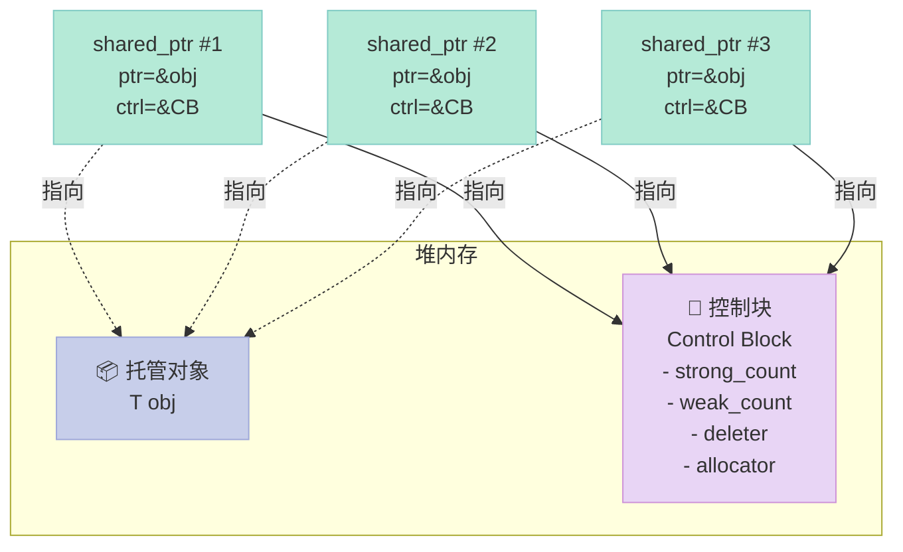
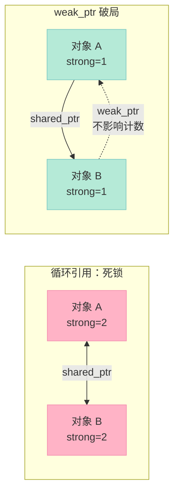
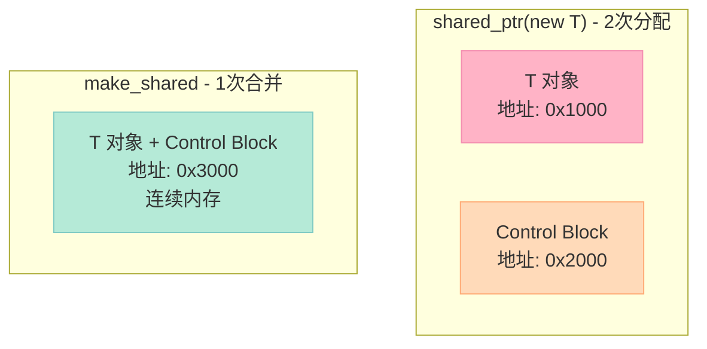
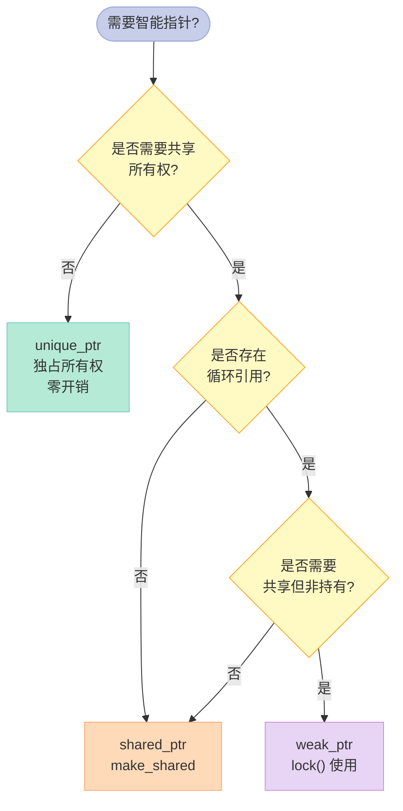
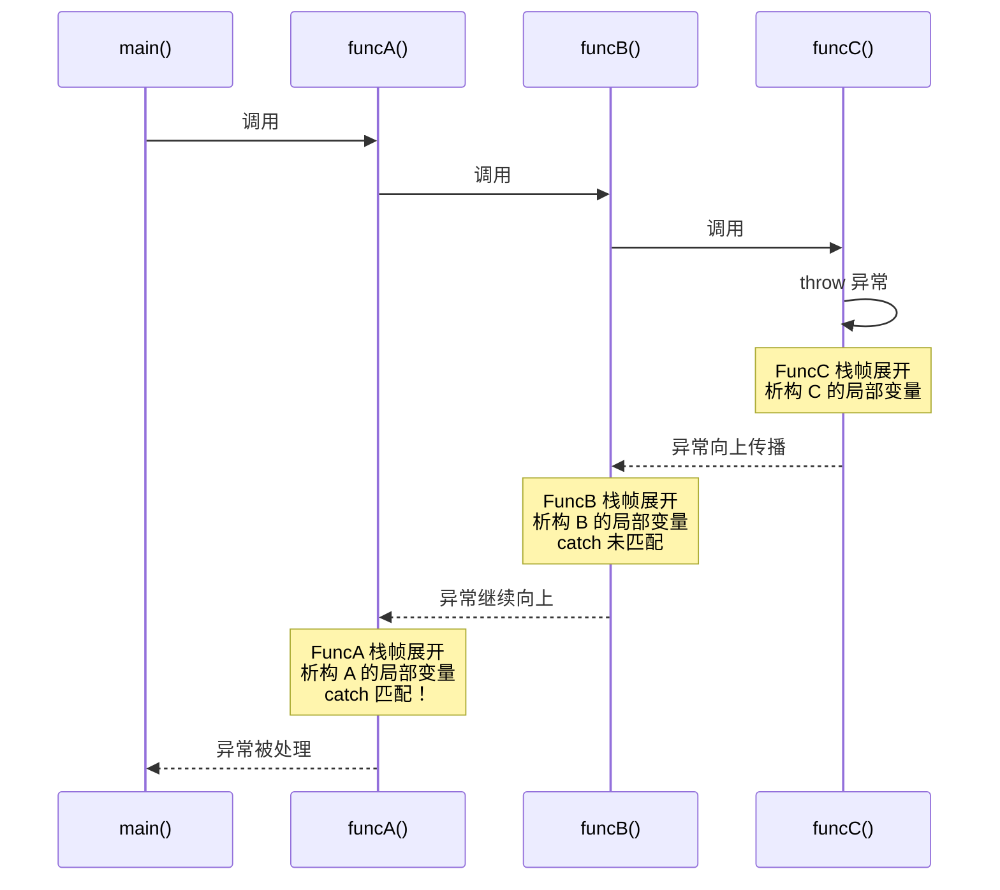

> 为什么 `shared_ptr` 比 `unique_ptr` 慢？为什么循环引用要用 `weak_ptr`？`noexcept` 到底优化了什么？这篇文章一次性讲透 C++ 资源管理的"四大金刚"。

---

## 前言：为什么写这篇？

面试中，**智能指针（Smart Pointer）** 和 **异常处理（Exception Handling）** 是 C++ 岗位最高频的两类问题，原因是它们直接决定了：

1. 你写的代码会不会**内存泄漏**（Memory Leak）
2. 你写的代码在抛出异常后是否还能**正确清理资源**
3. 你是否理解现代 C++（C++11/14/17）推崇的 **RAII** 范式
4. 你的代码能不能享受编译器的**优化红利**

这篇文章会覆盖本系列精选的 5 道题目（第 97、101、103、110、155 题），并在此基础上系统展开：

| 模块 | 内容 |
|------|------|
| 智能指针 | `unique_ptr` / `shared_ptr` / `weak_ptr` 原理与实战 |
| 循环引用 | `weak_ptr` 解决方案、`enable_shared_from_this` |
| 异常 | `try/catch/throw`、`noexcept`、栈展开（Stack Unwinding） |
| 类型转换 | `explicit`、`= delete`、转换函数 |
| 实战 | 手写一个迷你 `shared_ptr` |

读完你能得到：

- 一份**面试速答模板**（每题 30 秒内给出要点）
- 50+ 个**可直接运行的代码片段**
- 4 张**马卡龙色 Mermaid 图**（架构、引用计数、循环引用、栈展开）
- 一份**踩坑清单**（`a ^= b ^= a` 坑、`auto_ptr` 坑、`delete this` 坑）

---

## 一、RAII 思想：现代 C++ 的灵魂

### 1.1 什么是 RAII？

**RAII**（Resource Acquisition Is Initialization，资源获取即初始化）是 Bjarne Stroustrup 提出的 C++ 核心范式。**对象生命周期**与**资源生命周期**绑定：

- 构造函数：**获取**资源
- 析构函数：**释放**资源
- 离开作用域：自动调用析构函数，即使**抛出异常**也能保证清理

```cpp
// 传统 C 风格：极易泄漏
void process() {
    int* p = new int[100];
    do_something(p);  // 若这里抛出异常，p 永远不会被 delete！
    delete[] p;
}

// RAII 风格：异常安全
void process() {
    std::vector<int> v(100);  // 栈对象，离开作用域自动释放
    do_something(v);         // 即使抛异常，vector 析构函数也会清空内存
}
```

### 1.2 RAII 与智能指针

智能指针是 RAII 的**经典实现**：把裸指针包成一个类对象，让编译器替你管理生命周期。

```cpp
template <typename T>
class UniquePtr {
private:
    T* ptr_;
public:
    explicit UniquePtr(T* p = nullptr) : ptr_(p) {}
    ~UniquePtr() { delete ptr_; }
    
    // 禁止拷贝
    UniquePtr(const UniquePtr&) = delete;
    UniquePtr& operator=(const UniquePtr&) = delete;
    
    // 允许移动
    UniquePtr(UniquePtr&& other) noexcept : ptr_(other.ptr_) {
        other.ptr_ = nullptr;
    }
};
```

### 1.3 RAII 三大优势

| 优势 | 说明 |
|------|------|
| **异常安全** | 即使抛异常，栈展开时析构函数一定会执行 |
| **代码简洁** | 不再需要到处写 `try/catch` 释放资源 |
| **避免泄漏** | 编译器保证析构函数调用，无遗漏 |

---

## 二、std::unique_ptr：独占所有权（Exclusive Ownership）

### 2.1 基本用法

`unique_ptr` 是 C++11 引入的**独占式**智能指针，**同一时刻只能有一个** `unique_ptr` 指向给定对象。通过**禁用拷贝**、**允许移动**来实现独占语义。

```cpp
#include <memory>
#include <iostream>

struct Widget {
    Widget() { std::cout << "ctor\n"; }
    ~Widget() { std::cout << "dtor\n"; }
    void hello() { std::cout << "hello\n"; }
};

void demo() {
    std::unique_ptr<Widget> p1(new Widget);   // 推荐 std::make_unique
    p1->hello();
    
    // std::unique_ptr<Widget> p2 = p1;        // 编译错误！禁止拷贝
    std::unique_ptr<Widget> p2 = std::move(p1); // 合法：移动语义转移所有权
    
    if (p1) {
        std::cout << "p1 仍有效\n";
    } else {
        std::cout << "p1 已为空\n";  // 输出这行
    }
}  // p2 离开作用域，自动 delete Widget
```

### 2.2 std::make_unique（C++14）

`make_unique` 是**官方推荐**的构造方式：

```cpp
auto p = std::make_unique<int>(42);            // 单一参数
auto arr = std::make_unique<int[]>(10);        // C++14 数组支持
auto p2 = std::make_unique<std::pair<int, int>>(1, 2);
```

| 构造方式 | 优点 | 缺点 |
|---------|------|------|
| `make_unique<T>(args...)` | 异常安全、代码简洁 | 不能指定自定义删除器 |
| `unique_ptr<T>(new T(args...))` | 灵活（可指定删除器） | 异常时可能泄漏 |

### 2.3 数组特化

```cpp
std::unique_ptr<int[]> arr(new int[5]{1, 2, 3, 4, 5});
std::cout << arr[0];  // 重载了 operator[]
arr.release();         // 手动释放所有权
```

### 2.4 自定义删除器（Custom Deleter）

```cpp
auto closer = [](FILE* f) { 
    if (f) { 
        std::fclose(f); 
        std::cout << "文件关闭\n"; 
    } 
};

void fileDemo() {
    std::unique_ptr<FILE, decltype(closer)> fp(std::fopen("data.txt", "r"), closer);
    
    if (fp) {
        char buf[256];
        std::fgets(buf, sizeof(buf), fp.get());
    }
}  // 离开作用域自动调用 closer
```

### 2.5 unique_ptr 与容器的完美配合

```cpp
class TreeNode {
public:
    std::unique_ptr<TreeNode> left;
    std::unique_ptr<TreeNode> right;
    int val;
    
    explicit TreeNode(int v) : val(v) {}
};

void treeDemo() {
    auto root = std::make_unique<TreeNode>(1);
    root->left  = std::make_unique<TreeNode>(2);
    root->right = std::make_unique<TreeNode>(3);
    // 整棵树销毁时，所有子节点递归析构
}
```

### 2.6 unique_ptr 的性能

| 操作 | 与裸指针对比 |
|------|------------|
| 解引用 (`*`, `->`) | **零开销**（与裸指针相同） |
| 移动构造 | **零开销**（仅指针交换） |
| 析构 | 1 次 delete + 析构函数调用 |

`unique_ptr` 是**零成本抽象**（Zero-overhead Abstraction）的典范。

---

## 三、std::shared_ptr：引用计数（Reference Counting）

### 3.1 基本概念

`shared_ptr` 实现**共享所有权**：多个 `shared_ptr` 指向同一个对象，内部维护一个**引用计数器（Reference Count）**，最后一个 `shared_ptr` 销毁时释放资源。

```cpp
auto p1 = std::make_shared<int>(42);  // 引用计数 = 1
auto p2 = p1;                          // 引用计数 = 2
auto p3 = p1;                          // 引用计数 = 3

std::cout << p1.use_count();  // 输出 3

p2.reset();  // 引用计数 = 2
p3.reset();  // 引用计数 = 1
// p1 销毁时，引用计数归零，资源被释放
```

### 3.2 引用计数内部原理



### 3.3 shared_ptr 的内存开销

`shared_ptr` 对象本身大小是 **裸指针的 2 倍**（一个指向对象，一个指向控制块）：

```cpp
sizeof(int*)         == 8  (64-bit)
sizeof(std::shared_ptr<int>) == 16  (ptr + ctrl_ptr)
sizeof(std::unique_ptr<int>) == 8   (零开销)
```

### 3.4 拷贝语义

```cpp
auto a = std::make_shared<std::string>("hello");  // ref=1
auto b = a;  // ref=2, 拷贝构造
auto c = a;  // ref=3, 拷贝构造

c.reset();  // ref=2, c 置空
b.reset();  // ref=1, b 置空
// a 析构时 ref=0, 释放 string 对象
```

### 3.5 别名构造器（Aliasing Constructor）

`shared_ptr` 有一个"高级玩法"——**别名构造器**，可以共享所有权但指向不同子对象：

```cpp
struct Outer {
    int x;
    std::string name;
};

auto outer = std::make_shared<Outer>();
outer->x = 42;
outer->name = "hello";

// 共享所有权，但 ptr 指向 x（成员）
std::shared_ptr<int> x_ptr(outer, &outer->x);

std::cout << x_ptr.use_count();  // 输出 1（与 outer 共享生命周期）
```

### 3.6 shared_ptr 的线程安全性（高频考点）

| 操作 | 线程安全？ | 说明 |
|------|-----------|------|
| **同一个** shared_ptr 多线程读写 | ❌ 不安全 | 引用计数原子，但指针赋值非原子 |
| **不同** shared_ptr 指向同一对象 | ⚠️ 部分安全 | 控制块原子，对象本身需加锁 |
| 引用计数增减 | ✅ 原子操作 | 用 `std::atomic` 实现 |
| 多线程拷贝/析构同一 shared_ptr | ❌ 不安全 | 经典 race condition |

```cpp
// 错误：多线程修改同一个 shared_ptr
std::shared_ptr<int> g_p;
void writer() { g_p = std::make_shared<int>(1); }   // race
void reader() { auto x = g_p; }                     // race

// 正确：读写不同的副本，或加锁
std::mutex mtx;
std::shared_ptr<int> g_p;
void safe_writer() {
    auto p = std::make_shared<int>(1);
    std::lock_guard<std::mutex> lk(mtx);
    g_p = p;
}
```

### 3.7 shared_ptr 模拟实现（Mini 版）

```cpp
template <typename T>
class MiniSharedPtr {
private:
    T* ptr_;
    int* count_;
    
    void release() {
        if (count_ && --(*count_) == 0) {
            delete ptr_;
            delete count_;
            std::cout << "资源释放\n";
        }
    }
    
public:
    explicit MiniSharedPtr(T* p = nullptr) 
        : ptr_(p), count_(p ? new int(1) : nullptr) {}
    
    ~MiniSharedPtr() { release(); }
    
    // 拷贝构造
    MiniSharedPtr(const MiniSharedPtr& other) 
        : ptr_(other.ptr_), count_(other.count_) {
        if (count_) ++(*count_);
    }
    
    // 拷贝赋值
    MiniSharedPtr& operator=(const MiniSharedPtr& other) {
        if (this != &other) {
            release();
            ptr_ = other.ptr_;
            count_ = other.count_;
            if (count_) ++(*count_);
        }
        return *this;
    }
    
    T& operator*()  const { return *ptr_; }
    T* operator->() const { return ptr_; }
    T* get()        const { return ptr_; }
    int use_count() const { return count_ ? *count_ : 0; }
};

// 测试
void test() {
    MiniSharedPtr<int> p1(new int(10));
    MiniSharedPtr<int> p2 = p1;     // count = 2
    MiniSharedPtr<int> p3;
    p3 = p1;                        // count = 3
    std::cout << p3.use_count();    // 3
}  // 全部析构后，资源释放
```

---

## 四、std::weak_ptr：破解循环引用（Cyclic Reference）

### 4.1 循环引用问题

**循环引用**是 `shared_ptr` 的**头号天坑**：两个对象互相持有对方的 `shared_ptr`，引用计数永远不为 0，**永远不会被释放**。

```cpp
#include <memory>
#include <iostream>

struct B;  // 前置声明

struct A {
    std::shared_ptr<B> b_ptr;
    A() { std::cout << "A ctor\n"; }
    ~A() { std::cout << "A dtor\n"; }  // 永远不会调用！
};

struct B {
    std::shared_ptr<A> a_ptr;
    B() { std::cout << "B ctor\n"; }
    ~B() { std::cout << "B dtor\n"; }  // 永远不会调用！
};

void leak_demo() {
    auto a = std::make_shared<A>();
    auto b = std::make_shared<B>();
    
    a->b_ptr = b;  // A 引用 B (B.ref = 2)
    b->a_ptr = a;  // B 引用 A (A.ref = 2)
    
    // 离开作用域：a,b 析构，ref 都减到 1
    // 但因为互相引用，ref != 0，对象永远不释放！
}
```

运行结果：

```
A ctor
B ctor
(没有 A dtor / B dtor，内存泄漏！)
```

### 4.2 解决方案：weak_ptr

`weak_ptr` 是**不控制对象生命周期**的智能指针。它指向由 `shared_ptr` 管理的对象，但**不增加引用计数**。



### 4.3 修正后的代码

```cpp
struct B;

struct A {
    std::shared_ptr<B> b_ptr;
    A() { std::cout << "A ctor\n"; }
    ~A() { std::cout << "A dtor\n"; }  // 现在会调用
};

struct B {
    std::weak_ptr<A> a_ptr;  // 关键：weak_ptr 不增加引用计数
    B() { std::cout << "B ctor\n"; }
    ~B() { std::cout << "B dtor\n"; }  // 现在会调用
};

void fixed_demo() {
    auto a = std::make_shared<A>();  // A.ref = 1
    auto b = std::make_shared<B>();  // B.ref = 1
    
    a->b_ptr = b;  // B.ref = 2
    b->a_ptr = a;  // A.ref 仍为 1（weak 不计数）
    
    // 离开作用域：
    // a 析构 → A.ref = 0 → A 析构 → a_ptr 也销毁
    // b 析构 → B.ref = 0 → B 析构
}
```

### 4.4 weak_ptr 的核心操作

```cpp
std::weak_ptr<int> wp;
auto sp = std::make_shared<int>(42);
wp = sp;

std::cout << wp.use_count();   // 1（sp 的引用计数）
std::cout << wp.expired();     // 0（false，对象还活着）

sp.reset();  // 释放对象

std::cout << wp.expired();     // 1（true，对象已销毁）

// 关键：lock() 原子地获取 shared_ptr
if (auto locked = wp.lock()) {
    std::cout << *locked;   // 安全使用
} else {
    std::cout << "对象已死\n";
}
```

### 4.5 weak_ptr 的实现原理

`weak_ptr` 内部也指向**控制块**，控制块里维护**两个计数**：

| 计数 | 含义 | 影响 |
|------|------|------|
| **strong_count** | `shared_ptr` 的数量 | 归零时销毁对象 |
| **weak_count** | `weak_ptr` 的数量 | 归零时释放控制块 |

```cpp
// weak_ptr 的 lock() 实现（伪代码）
shared_ptr<T> weak_ptr<T>::lock() const {
    if (ctrl_->strong_count > 0) {  // 原子读
        shared_ptr<T> result(*this); // 升级为 shared_ptr，strong_count++
        return result;
    }
    return nullptr;
}
```

### 4.6 实战：父子节点

```cpp
class Child;  // 前置声明

class Parent {
public:
    std::vector<std::shared_ptr<Child>> children;
    ~Parent() { std::cout << "Parent dtor\n"; }
};

class Child {
public:
    std::weak_ptr<Parent> parent;  // 关键！避免循环引用
    ~Child() { std::cout << "Child dtor\n"; }
};

void family() {
    auto p = std::make_shared<Parent>();
    auto c = std::make_shared<Child>();
    
    p->children.push_back(c);
    c->parent = p;  // weak，不影响 Parent 计数
    
    // 离开作用域：c 析构 → Child 析构 → parent 也析构
    //              p 析构 → Parent 析构 → children 析构
}  // 全部正确释放！
```

---

## 五、enable_shared_from_this：在类内部获取 shared_ptr

### 5.1 经典问题：this 指针的 shared_ptr

```cpp
class Widget {
public:
    std::shared_ptr<Widget> getptr() {
        return std::shared_ptr<Widget>(this);  // 错误！会创建新的控制块
    }
};

void demo() {
    auto w1 = std::make_shared<Widget>();
    auto w2 = w1->getptr();   // 灾难：w1 和 w2 引用计数各为 1
    // w1 析构 → ref=1，对象不释放
    // w2 析构 → ref=0，对象释放（但 w1 早已被破坏）
}
```

### 5.2 解决方案：继承 enable_shared_from_this

```cpp
class Widget : public std::enable_shared_from_this<Widget> {
public:
    std::shared_ptr<Widget> getptr() {
        return shared_from_this();  // 正确：与外部共享控制块
    }
};

void demo() {
    auto w1 = std::make_shared<Widget>();
    auto w2 = w1->getptr();   // 正确：w1 和 w2 共享，ref = 2
    
    std::cout << w1.use_count();  // 2
}  // 全部正确释放
```

### 5.3 注意事项

| 注意点 | 说明 |
|--------|------|
| **必须先有 shared_ptr** | `shared_from_this()` 要求对象已被 `shared_ptr` 管理 |
| **不能在构造函数中调用** | 此时还没有 `shared_ptr` 管理，会抛 `std::bad_weak_ptr` |
| **必须公有继承** | 私有继承会破坏 `weak_ptr` 访问 |

```cpp
class Bad : public std::enable_shared_from_this<Bad> {
public:
    Bad() {
        auto p = shared_from_this();  // 抛异常！bad_weak_ptr
    }
};
```

### 5.4 实战：异步回调中的 this 安全

```cpp
class Connection : public std::enable_shared_from_this<Connection> {
public:
    void async_send(std::string data) {
        auto self = shared_from_this();  // 延长生命周期到回调结束
        
        socket_.async_write(data, [self](bool ok) {
            if (ok) self->on_success();
            else    self->on_error();
            // self 析构时，若 Connection 已无其他引用，会自动释放
        });
    }
private:
    void on_success() { /* ... */ }
    void on_error() { /* ... */ }
    FakeSocket socket_;
};
```

---

## 六、make_shared vs 直接构造：避免内存泄漏

### 6.1 经典内存泄漏

```cpp
// 危险写法：在参数计算中抛异常会导致内存泄漏
process(std::shared_ptr<int>(new int(10)), dangerous_function());
//                          ^^^^^^^^^^^^^^^^                ^^^^^^^^^^^^^^^^^
//                          new 完成，shared_ptr 尚未构造      若这里抛异常
//                          → new int(10) 永远不会被 delete!
```

### 6.2 make_shared 的解决

```cpp
// 安全写法
process(std::make_shared<int>(10), dangerous_function());
// make_shared 是原子操作，要么完整完成，要么不执行
```

### 6.3 make_shared 的额外优势：合并内存

```cpp
// 直接构造：对象和控制块分别分配（2 次 new）
std::shared_ptr<int> p1(new int(42));

// make_shared：对象和控制块合并为 1 次分配
auto p2 = std::make_shared<int>(42);
```



### 6.4 对比表

| 维度 | `shared_ptr<T>(new T(...))` | `make_shared<T>(...)` |
|------|----------------------------|---------------------|
| **分配次数** | 2 次（对象 + 控制块） | 1 次（合并） |
| **缓存友好** | ❌ 内存不连续 | ✅ 连续内存 |
| **异常安全** | ❌ 可能泄漏 | ✅ 原子操作 |
| **自定义删除器** | ✅ 支持 | ❌ 不直接支持 |
| **延迟释放** | ✅ 对象可独立释放 | ⚠️ 需等 weak_count 归零 |

### 6.5 make_shared 的隐藏代价

```cpp
auto p = std::make_shared<LargeObject>(/* 1MB */);
// 当 shared_count 归零时，对象析构，但 1MB 内存不能立即释放
// 必须等 weak_count 也归零（所有 weak_ptr 都失效），才能真正归还给 OS
// 对于内存敏感场景（如高频创建/销毁），需权衡
```

---

## 七、std::auto_ptr（C++17 已移除）的坑

### 7.1 auto_ptr 的历史地位

C++98 时代，`auto_ptr` 是唯一的智能指针，目标是**用 RAII 解决裸指针的泄漏**。

```cpp
std::auto_ptr<int> p(new int(10));  // C++98 写法
*p = 20;
```

### 7.2 auto_ptr 的核心缺陷

```cpp
std::auto_ptr<std::string> p1(new std::string("hello"));
std::auto_ptr<std::string> p2 = p1;  // 编译通过！
// p1 已经变为 nullptr！
// p2 拥有所有权
```

**问题**：拷贝构造时发生**所有权转移（move semantics）**，与常规 C++ 拷贝语义（值不变）严重冲突。

### 7.3 在容器中使用 auto_ptr 的灾难

```cpp
std::vector<std::auto_ptr<int>> v;
v.push_back(std::auto_ptr<int>(new int(1)));
v.push_back(std::auto_ptr<int>(new int(2)));

for (auto it = v.begin(); it != v.end(); ++it) {
    std::cout << **it;  // 不确定行为！vector 内部拷贝时会转移所有权
}
```

### 7.4 auto_ptr vs unique_ptr 对比

| 特性 | `auto_ptr` | `unique_ptr` |
|------|-----------|--------------|
| 标准状态 | **C++17 已移除** | C++11 起正式 |
| 拷贝语义 | 所有权转移（反直觉） | 禁止拷贝（编译错误） |
| 移动语义 | 默认就有 | 显式 `std::move` |
| 数组支持 | ❌ 不支持 | ✅ `unique_ptr<T[]>` |
| 容器中使用 | ❌ 不安全 | ✅ 安全 |
| 自定义删除器 | ❌ 不支持 | ✅ 支持 |

### 7.5 迁移建议

```bash
# 如果项目里还有 auto_ptr，批量替换：
sed -i 's/std::auto_ptr/std::unique_ptr/g' *.cpp
# 注意检查拷贝语义的代码，可能需要改为 std::move
```

---

## 八、自定义删除器（Custom Deleter）高级用法

### 8.1 shared_ptr 的自定义删除器

```cpp
auto deleter = [](int* p) {
    std::cout << "自定义删除: " << *p << "\n";
    delete p;
};

std::shared_ptr<int> p(new int(42), deleter);
// 注意：自定义删除器会增加控制块大小
```

### 8.2 unique_ptr 的自定义删除器

```cpp
auto closer = [](FILE* f) { 
    if (f) std::fclose(f); 
};

// 删除器类型作为模板参数，零开销
std::unique_ptr<FILE, decltype(closer)> fp(std::fopen("a.txt", "r"), closer);
```

### 8.3 实战：管理 C 风格资源

```cpp
// 1. 管理 FILE*
void file_demo() {
    auto fcloser = [](FILE* f) { if (f) std::fclose(f); };
    std::unique_ptr<FILE, decltype(fcloser)> fp(std::fopen("data.bin", "rb"), fcloser);
    
    char buf[1024];
    std::fread(buf, 1, sizeof(buf), fp.get());
}

// 2. 管理 socket
struct SocketDeleter {
    void operator()(int* fd) const {
        if (*fd >= 0) ::close(*fd);
        delete fd;
    }
};

void socket_demo() {
    std::unique_ptr<int, SocketDeleter> fd(new int(::socket(AF_INET, SOCK_STREAM, 0)));
    // ...
}

// 3. 管理动态数组（shared_ptr 也能干）
std::shared_ptr<int> arr(new int[10], std::default_delete<int[]>());
// 或更优雅：
std::shared_ptr<int> arr2(new int[10], [](int* p) { delete[] p; });
```

### 8.4 删除器的开销对比

| 智能指针 | 删除器存储 | 大小 |
|---------|-----------|------|
| `unique_ptr` 默认 | 无（编译期类型擦除） | 8 字节 |
| `unique_ptr` 自定义 | 在类型里 | 8 + sizeof(deleter) |
| `shared_ptr` 默认 | 在控制块 | 16 字节 |
| `shared_ptr` 自定义 | 在控制块（堆） | 16 字节（不变） |

`shared_ptr` 把删除器存在堆上，因此**类型擦除（Type Erasure）**不影响大小，但有间接调用开销。

---

## 九、unique_ptr vs shared_ptr vs weak_ptr 全方位对比

### 9.1 核心特性对比

| 维度 | `unique_ptr` | `shared_ptr` | `weak_ptr` |
|------|-------------|-------------|-----------|
| **所有权** | 独占 | 共享 | 不持有 |
| **C++ 标准** | C++11 | C++11 | C++11 |
| **大小** | 1 个指针（8B） | 2 个指针（16B） | 2 个指针（16B） |
| **拷贝构造** | ❌ 禁止 | ✅ 引用计数+1 | ✅ 计数不变 |
| **移动构造** | ✅ | ✅ | ✅ |
| **影响引用计数** | - | ✅ +1 | ❌ 0 |
| **可独立释放** | ✅ | ❌ 需等计数归零 | ❌ 无法直接释放 |
| **适用场景** | 默认选择 | 共享所有权 | 打破循环/缓存 |

### 9.2 选择决策树



### 9.3 性能基准（粗略数据）

```cpp
// 性能对比伪测试：1亿次操作
Benchmark                   unique_ptr    shared_ptr    weak_ptr
-----------------------------------------------------------------
构造（默认）                 0.5 ns        8 ns          -
make_xxx（推荐）             1 ns          5 ns          -
拷贝                         编译错误      10 ns         -
移动                         0.5 ns        1 ns          -
解引用                       0.5 ns        1 ns          1 ns
析构                         1 ns          15 ns         5 ns
use_count()                  -             1 ns          1 ns
lock()                       -             -             5 ns
```

### 9.4 实战选择指南

| 场景 | 推荐 |
|------|------|
| 工厂方法返回值 | `unique_ptr` |
| Pimpl 模式 | `unique_ptr` |
| 容器中存储多态对象 | `unique_ptr<Base>` |
| 多个对象共享同一资源 | `shared_ptr` |
| 缓存、观察者 | `weak_ptr` |
| 父子节点结构 | 父用 `shared_ptr`，子用 `weak_ptr` |
| 跨线程共享数据 | `shared_ptr`（注意加锁） |

---

## 十、C++ 异常处理：try/catch/throw 与栈展开

### 10.1 异常的分类

C++ 中的错误分为三类：

| 类型 | 何时发现 | 例子 |
|------|---------|------|
| **语法错误** | 编译期 | 变量未定义、括号不匹配 |
| **链接错误** | 链接期 | 未定义符号 |
| **运行时错误** | 运行期 | 数组越界、内存不足 |

异常机制专门用于处理**运行时错误**。

### 10.2 三件套：try / throw / catch

```cpp
#include <iostream>
#include <stdexcept>

double divide(double a, double b) {
    if (b == 0.0) {
        throw std::runtime_error("除数不能为 0");  // 抛出
    }
    return a / b;
}

void demo() {
    try {
        double r = divide(10, 0);
        std::cout << r;
    } catch (const std::runtime_error& e) {
        std::cout << "捕获: " << e.what();  // 捕获
    } catch (const std::exception& e) {
        std::cout << "其他异常: " << e.what();
    } catch (...) {
        std::cout << "未知异常";  // 兜底
    }
}
```

### 10.3 自定义异常类

```cpp
class MyException : public std::exception {
    std::string msg_;
public:
    explicit MyException(std::string msg) : msg_(std::move(msg)) {}
    
    const char* what() const noexcept override {
        return msg_.c_str();
    }
};

void risky() {
    throw MyException("出大事了");
}
```

### 10.4 栈展开（Stack Unwinding）

**栈展开**是异常处理的核心机制：异常抛出后，从 `throw` 处一路向上回溯栈帧，直到找到匹配的 `catch`，并**调用沿途所有局部对象的析构函数**。



### 10.5 栈展开与 RAII

栈展开是 RAII 能保证异常安全的关键：

```cpp
class Resource {
public:
    Resource() { std::cout << "获取资源\n"; }
    ~Resource() { std::cout << "释放资源\n"; }
};

void risky() {
    Resource r1;  // 构造
    Resource r2;
    
    if (true) throw std::runtime_error("boom");
    // r2 析构 → r1 析构（逆序！）
}

void safe() {
    try {
        risky();
    } catch (const std::exception& e) {
        std::cout << "捕获: " << e.what();
    }
}
```

运行结果：

```
获取资源
获取资源
释放资源  // r2
释放资源  // r1
捕获: boom
```

### 10.6 异常安全等级

| 等级 | 保证 | 实现方式 |
|------|------|---------|
| **No-throw**（无异常） | 函数绝不抛异常 | `noexcept`，内置类型操作 |
| **Strong**（强保证） | 操作要么成功要么回滚 | 拷贝-交换（copy-and-swap） |
| **Basic**（基本保证） | 不泄漏资源，对象仍可用 | RAII |
| **No guarantee**（无保证） | 可能泄漏，可能损坏 | ❌ 应该避免 |

### 10.7 copy-and-swap 模式（强异常安全）

```cpp
class Widget {
    int* data_;
    size_t size_;
public:
    Widget& operator=(const Widget& other) {
        if (this == &other) return *this;
        
        // 先复制再交换：若 copy 抛异常，原对象不变
        Widget tmp(other);            // copy，若失败则原对象完好
        swap(tmp);                    // noexcept 交换
        return *this;
        // tmp 析构，释放旧数据
    }
    
    void swap(Widget& other) noexcept {
        std::swap(data_, other.data_);
        std::swap(size_, other.size_);
    }
};
```

### 10.8 异常的优缺点

| 优点 | 缺点 |
|------|------|
| **错误码无法忽略**（必须处理） | 性能开销（典型场景下 ~5-10%） |
| **跨函数传播错误** | 难以阅读控制流 |
| **分离错误处理与正常逻辑** | 构造函数可抛异常，导致半成品对象 |
| **丰富的异常类型** | 与 C 代码不兼容 |
| **RAII 自动清理** | 析构函数不应抛异常 |

---

## 十一、noexcept 关键字：编译器的优化开关

### 11.1 noexcept 的两层含义

| 含义 | 说明 |
|------|------|
| **声明**：承诺函数不抛异常 | 编译器信任你，违反会调 `std::terminate` |
| **优化提示**：编译器可激进优化 | 生成的代码更小更快 |

### 11.2 noexcept 基础

```cpp
// 声明为 noexcept
void safe_func() noexcept {
    // ...
}

// 条件 noexcept（C++11）
template <typename T>
void swap(T& a, T& b) noexcept(noexcept(T(std::declval<T&&>()))) {
    T tmp = std::move(a);
    a = std::move(b);
    b = std::move(tmp);
}
```

### 11.3 noexcept(true) vs noexcept(false)

```cpp
void f1() noexcept(true);   // 承诺不抛
void f2() noexcept(false);  // 可能抛（与不带 noexcept 等价）
void f3();                  // 可能抛（不抛时优化机会较少）
```

### 11.4 noexcept 优化点

```cpp
// 1. std::vector 扩容策略
std::vector<Widget> v;
v.push_back(Widget{});
// 若 Widget 的 move 构造是 noexcept → vector 优先 move
// 否则 → vector 退化为 copy（保证强异常安全）

// 2. std::move_if_noexcept
std::string s1 = std::move_if_noexcept(s2);
// 若 string 的 move 构造是 noexcept → move
// 否则 → copy（更强保证）

// 3. noexcept 函数生成更小的代码
// 不需要异常表（exception table），更利于内联
```

### 11.5 noexcept 违反的后果

```cpp
void dangerous() noexcept {
    throw std::runtime_error("boom");  // 编译能过，运行时炸！
}

int main() {
    try {
        dangerous();
    } catch (const std::exception& e) {
        // 永远到不了这里
    }
}
// 程序调用 std::terminate() → abort
```

### 11.6 noexcept 实战建议

| 函数类型 | 建议 |
|---------|------|
| 析构函数 | **必须** `noexcept`（C++11 默认） |
| 移动构造/赋值 | 尽量 `noexcept` |
| swap 函数 | 尽量 `noexcept` |
| 简单 getter | 标 `noexcept` |
| 复杂业务逻辑 | 不标，让异常正常传播 |
| 第三方接口 | 谨慎使用，需确认不抛 |

```cpp
class Widget {
    int* p_;
public:
    ~Widget() noexcept { delete p_; }           // 隐式 noexcept
    Widget(Widget&& o) noexcept : p_(o.p_) {    // 显式 noexcept
        o.p_ = nullptr;
    }
    Widget& operator=(Widget&& o) noexcept {
        if (this != &o) {
            delete p_;
            p_ = o.p_;
            o.p_ = nullptr;
        }
        return *this;
    }
    
    void swap(Widget& other) noexcept {
        std::swap(p_, other.p_);
    }
};
```

---

## 十二、隐式转换与 explicit：防止意料之外的转换

### 12.1 什么是隐式转换？

C++ 中，编译器在某些场景下会**自动**进行类型转换，无需程序员显式声明：

```cpp
// 1. 基本类型之间的转换
int i = 3.14;      // double → int，截断
double d = 42;     // int → double，提升
char c = 'A';
int ci = c;        // char → int，ASCII 码

// 2. 自定义类型的隐式转换
class MyString {
public:
    MyString(int n) { /* 创建 n 个空格 */ }   // 不期望的转换！
    MyString(const char* s) { /* 字符串 */ }
};

void print(const MyString& s) { /* ... */ }

print(10);         // 竟然合法！int → MyString
print("hello");    // const char* → MyString
```

### 12.2 隐式转换的三大场景

| 场景 | 例子 |
|------|------|
| **基本类型转换** | `int` 转 `double`、`char` 转 `int` |
| **子类转父类** | `Derived*` 转 `Base*`（多态基础） |
| **构造函数转换** | 单参数构造函数隐式转换 |

### 12.3 explicit 关键字：禁止隐式转换

```cpp
class MyString {
public:
    explicit MyString(int n) { /* 创建 n 个空格 */ }  // 加 explicit
    MyString(const char* s) { /* 字符串 */ }
};

void print(const MyString& s) { /* ... */ }

print(10);          // 编译错误！禁止 int → MyString 隐式转换
print(MyString(10)); // 合法：显式构造
print("hello");     // 仍合法：const char* 构造函数未标 explicit
```

### 12.4 explicit 的多种用法（C++11+）

```cpp
class Buffer {
public:
    // 1. 普通构造函数（C++98 形式）
    explicit Buffer(size_t n) : data_(new char[n]) {}
    
    // 2. C++11：explicit 转换函数（防止意外转换）
    explicit operator bool() const {  // 安全 bool 转换
        return data_ != nullptr;
    }
    
    // 3. explicit 多参数构造函数（C++20）
    // explicit Buffer(size_t n, char fill) { /* ... */ }
};

Buffer b(100);
if (b) { /* ... */ }             // 合法
// int n = b;                    // 编译错误（explicit operator bool）
bool ok = static_cast<bool>(b);  // 合法：显式转换
```

### 12.5 = delete：禁止特定操作

```cpp
class NonCopyable {
public:
    NonCopyable() = default;
    NonCopyable(const NonCopyable&) = delete;             // 禁止拷贝
    NonCopyable& operator=(const NonCopyable&) = delete;  // 禁止赋值
};

NonCopyable a;
NonCopyable b = a;  // 编译错误！
```

### 12.6 转换函数（Conversion Function）

```cpp
class Rational {
    int num_, den_;
public:
    Rational(int n, int d) : num_(n), den_(d) {}
    
    // 转换函数：Rational → double
    operator double() const {
        return static_cast<double>(num_) / den_;
    }
};

Rational r(1, 2);
double d = r;             // 合法：隐式转换
double d2 = static_cast<double>(r);  // 显式
```

### 12.7 explicit 决策表

| 构造函数 | 是否加 explicit |
|---------|----------------|
| 单参数，可能被误用 | **必加** |
| 多参数（C++11 起） | **必加** |
| 作为隐式转换的设计意图 | 不加 |
| 作为工厂方法的模拟 | 视情况 |
| 容器迭代器构造函数 | 通常不加 |

---

## 十三、实战：手写一个 mini shared_ptr

### 13.1 完整实现

```cpp
#include <atomic>
#include <iostream>

template <typename T>
class MiniSharedPtr {
private:
    T* ptr_;
    std::atomic<long>* ref_count_;
    
    void release() {
        if (ref_count_ && ref_count_->fetch_sub(1) == 1) {
            delete ptr_;
            delete ref_count_;
            std::cout << "[MiniSharedPtr] 资源释放\n";
        }
    }
    
public:
    // 1. 构造函数
    explicit MiniSharedPtr(T* p = nullptr)
        : ptr_(p), ref_count_(p ? new std::atomic<long>(1) : nullptr) {
        std::cout << "[MiniSharedPtr] 构造, count = "
                  << (ref_count_ ? ref_count_->load() : 0) << "\n";
    }
    
    // 2. 析构函数
    ~MiniSharedPtr() { release(); }
    
    // 3. 拷贝构造
    MiniSharedPtr(const MiniSharedPtr& other)
        : ptr_(other.ptr_), ref_count_(other.ref_count_) {
        if (ref_count_) {
            ref_count_->fetch_add(1);
        }
    }
    
    // 4. 拷贝赋值（copy-and-swap 风格）
    MiniSharedPtr& operator=(const MiniSharedPtr& other) {
        if (this != &other) {
            release();                  // 释放旧资源
            ptr_ = other.ptr_;
            ref_count_ = other.ref_count_;
            if (ref_count_) {
                ref_count_->fetch_add(1);
            }
        }
        return *this;
    }
    
    // 5. 移动构造
    MiniSharedPtr(MiniSharedPtr&& other) noexcept
        : ptr_(other.ptr_), ref_count_(other.ref_count_) {
        other.ptr_ = nullptr;
        other.ref_count_ = nullptr;
    }
    
    // 6. 移动赋值
    MiniSharedPtr& operator=(MiniSharedPtr&& other) noexcept {
        if (this != &other) {
            release();
            ptr_ = other.ptr_;
            ref_count_ = other.ref_count_;
            other.ptr_ = nullptr;
            other.ref_count_ = nullptr;
        }
        return *this;
    }
    
    // 7. 访问接口
    T& operator*()  const { return *ptr_; }
    T* operator->() const { return ptr_; }
    T* get()        const { return ptr_; }
    
    long use_count() const {
        return ref_count_ ? ref_count_->load() : 0;
    }
    
    explicit operator bool() const {
        return ptr_ != nullptr;
    }
    
    void reset(T* p = nullptr) {
        release();
        ptr_ = p;
        ref_count_ = p ? new std::atomic<long>(1) : nullptr;
    }
    
    void swap(MiniSharedPtr& other) noexcept {
        std::swap(ptr_, other.ptr_);
        std::swap(ref_count_, other.ref_count_);
    }
};
```

### 13.2 测试代码

```cpp
#include <string>

void test_mini() {
    // 1. 基本构造
    MiniSharedPtr<std::string> p1(new std::string("hello"));
    std::cout << "p1.count = " << p1.use_count() << "\n";  // 1
    
    // 2. 拷贝构造
    {
        MiniSharedPtr<std::string> p2 = p1;
        std::cout << "p1.count = " << p1.use_count() << "\n";  // 2
    }  // p2 析构
    std::cout << "p1.count = " << p1.use_count() << "\n";  // 1
    
    // 3. 移动语义
    MiniSharedPtr<std::string> p3 = std::move(p1);
    std::cout << "p3.count = " << p3.use_count() << "\n";  // 1
    std::cout << "p1.count = " << p1.use_count() << "\n";  // 0
    
    // 4. bool 转换
    if (p3) {
        std::cout << "*p3 = " << *p3 << "\n";
    }
    
    // 5. 赋值
    MiniSharedPtr<std::string> p4;
    p4 = p3;  // 拷贝赋值
    std::cout << "p3.count = " << p3.use_count() << "\n";  // 2
}

// 运行结果：
// [MiniSharedPtr] 构造, count = 1
// p1.count = 1
// p1.count = 2
// p1.count = 1
// p3.count = 1
// p1.count = 0
// *p3 = hello
// p3.count = 2
// [MiniSharedPtr] 资源释放
```

### 13.3 与标准库对比

| 特性 | MiniSharedPtr | std::shared_ptr |
|------|--------------|-----------------|
| 引用计数原子性 | ✅ | ✅ |
| 移动语义 | ✅ | ✅ |
| 自定义删除器 | ❌ | ✅ |
| 别名构造器 | ❌ | ✅ |
| 类型擦除 | ❌ | ✅ |
| make_shared | ❌ | ✅ |
| weak_ptr 配合 | ❌ | ✅ |
| allocator 支持 | ❌ | ✅ |

---

## 十四、面试题 103：delete this 的灾难

### 14.1 delete this 的本质

```cpp
class Widget {
    int x_;
public:
    Widget(int x) : x_(x) {}
    
    void suicide() {
        delete this;  // 释放自身内存
    }
    
    int getX() const { return x_; }
    void setX(int x) { x_ = x; }
};
```

### 14.2 调用 delete this 之后

```cpp
Widget* w = new Widget(42);
w->suicide();  // 内存被释放

// 1. 不涉及 this 指针的函数可正常运行
// （但访问 w 的成员变量已不安全）

// 2. 涉及 this 指针的操作 → 不可预期
std::cout << w->getX();  // 可能输出 42（侥幸），可能输出乱码
w->setX(100);           // 写操作破坏其他对象

// 3. 虚函数调用 → 虚表指针可能已失效
//    → 段错误
```

### 14.3 为什么"不确定"而非立即崩溃？

**操作系统的内存管理策略**：`delete` 释放内存后，并不会立即归还给操作系统，而是放在**空闲链表**里。这块内存可能还能读写，但内容是**不确定的**。

```cpp
// 危险实验
Widget* w = new Widget(42);
w->suicide();

// 此时这块内存可能：还没被回收 → 数据还在
// 也可能：          已被回收 → 写会破坏其他对象
// 也可能：          已被覆盖 → 数据是垃圾
```

### 14.4 析构函数中调用 delete this → 栈溢出

```cpp
class Bomb {
public:
    ~Bomb() {
        std::cout << "Bomb dtor\n";
        delete this;  // 递归调用析构函数
    }
};

Bomb* b = new Bomb;
delete b;
// 输出：
// Bomb dtor
// Bomb dtor
// Bomb dtor
// ... 无限递归
// 最终：Segmentation fault / Stack overflow
```

### 14.5 delete this 的合法用法（Reference Counting）

**某些场景**下 `delete this` 是合法的，前提是对象由**引用计数管理**：

```cpp
class RefCounted {
    std::atomic<int> ref_count_{1};
public:
    void add_ref() { ref_count_.fetch_add(1); }
    
    void release() {
        if (ref_count_.fetch_sub(1) == 1) {
            delete this;  // 引用计数归零，自杀
        }
    }
    
protected:
    virtual ~RefCounted() = default;  // 必须 virtual
};

void client() {
    auto* obj = new RefCounted;
    obj->add_ref();      // 计数 = 2
    
    auto* obj2 = obj;
    obj->release();      // 计数 = 1
    // obj2 仍可用
    obj2->release();     // 计数 = 0, delete this
    // 此后 obj2 不可使用
}
```

### 14.6 delete this 的使用条件

| 条件 | 说明 |
|------|------|
| 必须 `this` 由 `new` 分配 | 栈对象不能 `delete this` |
| 必须有引用计数机制 | 保证不会被多个对象持有 |
| 析构函数必须是 `virtual` | 否则派生类对象 delete 不彻底 |
| 调用 `delete this` 后立即返回 | 不再访问任何成员 |
| 调用者必须收到"已失效"信号 | 比如指针置 nullptr |

---

## 十五、面试题 110：不使用额外空间交换两个数

### 15.1 算术方法

```cpp
int x = 3, y = 5;

x = x + y;  // x = 8
y = x - y;  // y = 3
x = x - y;  // x = 5
// 交换完成
```

**风险**：可能**整数溢出**。

### 15.2 异或方法（推荐）

```cpp
int x = 3, y = 5;

x = x ^ y;  // x = 6  (011)
y = x ^ y;  // y = 3  (110 ^ 101 = 011)
x = x ^ y;  // x = 5  (110 ^ 011 = 101)
```

**优点**：不会溢出，性能最优（位运算）。

### 15.3 链式异或的坑（面试高频陷阱）

```cpp
// 看似优雅的写法：a ^= b ^= a ^= b
int a = 3, b = 5;
a ^= b ^= a ^= b;
// 结果？很多编译器是 UB（未定义行为）！
```

### 15.4 为什么链式异或是 UB？

```cpp
// C++ 标准规定：同一表达式中，标量对象的修改只能发生一次
// a ^= b ^= a ^= b 展开：
a = a ^ b;   // 修改 a 一次
b = b ^ a;   // 修改 b 一次，读取 a（已被修改）
a = a ^ b;   // 修改 a 一次，读取 b（已被修改）
// 三次修改 a 和 b → 违反"序列点"规则
```

不同编译器结果：

| 编译器 | 结果 |
|--------|------|
| GCC (O0) | 5, 3（交换成功） |
| GCC (O2) | **未定义**，可能交换失败 |
| MSVC | **未定义** |
| Clang | **未定义** |

### 15.5 实战中的推荐写法

```cpp
// 推荐：分三行写
x ^= y;
y ^= x;
x ^= y;

// 或用 std::swap
std::swap(x, y);

// 或用结构化绑定（C++17）
auto [a, b] = std::pair{y, x};
```

### 15.6 异或方法的限制

```cpp
// 只能用于整数类型（int, char, long...）
// 不能用于浮点数、指针、对象

double a = 1.5, b = 2.5;
a = (int)a ^ (int)b;  // 错误，会丢失精度

// 也不能用于同一个变量
int x = 5;
x ^= x;  // x = 0（变 0，但 x 与自身交换无意义）
```

### 15.7 异或 vs 加减 vs std::swap 性能对比

```cpp
// 1. 加减法：可能溢出，CPU 周期 ~3
x = x + y; y = x - y; x = x - y;

// 2. 异或：无溢出，CPU 周期 ~3（位运算更快）
x ^= y; y ^= x; x ^= y;

// 3. std::swap：通用、编译器会优化为最优形式
std::swap(x, y);
```

| 方法 | 性能 | 通用性 | 推荐度 |
|------|------|--------|--------|
| 加减 | 中 | 数值 | ❌（溢出风险） |
| 异或 | 高 | 整数 | ✅ |
| std::swap | 高 | 通用 | ✅✅（首选） |

---

## 十六、面试题 155 完整解答：智能指针怎么用 + 循环引用

### 16.1 标准答案

```cpp
#include <memory>

// 1. shared_ptr：共享所有权
void shared_demo() {
    auto p1 = std::make_shared<int>(42);  // 推荐
    std::shared_ptr<int> p2(new int(10)); // 不推荐（异常风险）
    
    auto p3 = p1;           // 引用计数 +1
    std::cout << p1.use_count();  // 2
}

// 2. unique_ptr：独占所有权
void unique_demo() {
    auto p = std::make_unique<int>(100);
    // std::unique_ptr<int> p2 = p;  // 编译错误：禁止拷贝
    auto p2 = std::move(p);  // 移动语义转移所有权
    // p 变 nullptr
}

// 3. weak_ptr：解决循环引用
struct B;
struct A { std::shared_ptr<B> b; };
struct B { std::weak_ptr<A> a; };  // 关键：weak 而非 shared

void weak_demo() {
    auto a = std::make_shared<A>();
    auto b = std::make_shared<B>();
    a->b = b;
    b->a = a;  // weak，不影响 A 的引用计数
    // 离开作用域：正确释放
}
```

### 16.2 完整实战代码（综合示例）

```cpp
#include <iostream>
#include <memory>
#include <vector>

// 树节点
class TreeNode {
public:
    int val_;
    std::vector<std::shared_ptr<TreeNode>> children_;
    std::weak_ptr<TreeNode> parent_;  // 关键：weak 避免循环
    
    explicit TreeNode(int v) : val_(v) {
        std::cout << "TreeNode " << val_ << " 构造\n";
    }
    
    ~TreeNode() {
        std::cout << "TreeNode " << val_ << " 析构\n";
    }
};

void tree_demo() {
    auto root = std::make_shared<TreeNode>(1);
    
    {
        auto child = std::make_shared<TreeNode>(2);
        child->parent_ = root;        // weak，root 引用计数不变
        root->children_.push_back(child);
        
        std::cout << "root.use_count = " << root.use_count() << "\n";  // 1
        
        // 通过 weak_ptr 访问 parent
        if (auto p = child->parent_.lock()) {
            std::cout << "child.parent = " << p->val_ << "\n";  // 1
        }
    }  // child 析构
    
    std::cout << "root.use_count = " << root.use_count() << "\n";  // 仍为 1
}  // root 析构
```

运行结果：

```
TreeNode 1 构造
TreeNode 2 构造
root.use_count = 1
child.parent = 1
TreeNode 2 析构
root.use_count = 1
TreeNode 1 析构
```

---

## 十七、面试踩坑清单

### 17.1 智能指针十大坑

| # | 坑 | 后果 | 解决 |
|---|----|------|------|
| 1 | 在参数中 `shared_ptr(new T)` | 异常时内存泄漏 | 用 `make_shared` |
| 2 | 循环引用 `shared_ptr` | 内存泄漏 | 用 `weak_ptr` |
| 3 | 从 `this` 创建 `shared_ptr` | 多次释放 | 继承 `enable_shared_from_this` |
| 4 | 同一 `shared_ptr` 多线程读写 | 数据竞争 | 加锁或用原子操作 |
| 5 | `unique_ptr` 数组但用 `delete` | 内存泄漏 | 用 `unique_ptr<T[]>` |
| 6 | 容器中存 `auto_ptr` | UB | 替换为 `unique_ptr` |
| 7 | `weak_ptr` 直接解引用 | UB | 用 `lock()` |
| 8 | 把栈对象赋给 `shared_ptr` | 程序崩溃 | 仅对 `new` 的对象使用 |
| 9 | 智能指针与裸指针混用 | 二次释放 | 仅在接口处短暂用裸指针 |
| 10 | `shared_from_this()` 在构造函数中 | 抛 `bad_weak_ptr` | 在 `init()` 方法中调用 |

### 17.2 异常处理十大坑

| # | 坑 | 后果 | 解决 |
|---|----|------|------|
| 1 | 析构函数抛异常 | `std::terminate` | 析构函数 `noexcept` |
| 2 | catch 块不重新抛出 | 异常信息丢失 | `throw;` 重新抛出 |
| 3 | 异常对象切片 | 丢失派生类信息 | `catch (const Base&)` |
| 4 | 资源在 catch 前未清理 | 泄漏 | RAII |
| 5 | 构造函数中部分初始化抛异常 | 半成品对象 | 用 RAII 成员 |
| 6 | 异常规范（`throw()`）误用 | `unexpected` | 用 `noexcept` |
| 7 | 性能敏感路径用异常 | 性能下降 | 改用 `std::optional` |
| 8 | 与 C 代码混用 | C 无异常 | 在 C 接口边界捕获 |
| 9 | 异常未捕获 | `terminate` | 顶层 `catch (...)` |
| 10 | 在 `noexcept` 中抛异常 | `terminate` | 不要在 `noexcept` 中抛 |

### 17.3 类型转换十大坑

| # | 坑 | 后果 | 解决 |
|---|----|------|------|
| 1 | 单参数构造函数隐式转换 | 意料外的类型转换 | 加 `explicit` |
| 2 | `static_cast` 用于无关类型 | 编译错误 | 选合适的 cast |
| 3 | `reinterpret_cast` 滥用 | UB | 极少使用 |
| 4 | `const_cast` 移除 const 后修改 | UB | 只用于兼容老 API |
| 5 | C 风格转换 `(int)x` | 不易查找 | 用命名 cast |
| 6 | 转换函数无 `explicit` | 意外转换 | C++11 加 `explicit` |
| 7 | `dynamic_cast` 用于非多态类型 | 编译错误 | 基类需有虚函数 |
| 8 | 多次隐式转换链 | 难以追踪 | 显式分步转换 |
| 9 | 父类指针强转为子类指针 | UB（无运行时检查） | 用 `dynamic_cast` |
| 10 | 模板中类型转换丢失 | 编译失败 | 用 `std::declval` 测试 |

---

## 十八、C++17 补充：std::optional 与 std::variant

### 18.1 std::optional：可能"无值"的对象

C++17 引入，常用于**可能失败的函数返回值**：

```cpp
#include <optional>

std::optional<int> parse_int(const std::string& s) {
    try {
        return std::stoi(s);
    } catch (...) {
        return std::nullopt;  // 表示"无值"
    }
}

void demo() {
    auto r1 = parse_int("42");
    auto r2 = parse_int("hello");
    
    if (r1) {
        std::cout << *r1;  // 42
    }
    
    if (!r2) {
        std::cout << "parse failed\n";
    }
    
    int val = r1.value_or(0);  // 42（或 0 若无值）
}
```

### 18.2 std::variant：类型安全的 union

```cpp
#include <variant>

std::variant<int, double, std::string> v;

v = 42;
std::cout << std::get<int>(v);     // 42

v = 3.14;
std::cout << std::get<double>(v);  // 3.14

// 用 visitor 访问
auto visitor = [](auto&& arg) {
    using T = std::decay_t<decltype(arg)>;
    if constexpr (std::is_same_v<T, int>) {
        std::cout << "int: " << arg;
    } else if constexpr (std::is_same_v<T, double>) {
        std::cout << "double: " << arg;
    } else if constexpr (std::is_same_v<T, std::string>) {
        std::cout << "string: " << arg;
    }
};
std::visit(visitor, v);
```

### 18.3 optional vs 异常 vs 错误码

| 方式 | 优点 | 缺点 |
|------|------|------|
| **异常** | 跨层传播、类型丰富 | 性能开销、控制流复杂 |
| **错误码** | 性能高、兼容 C | 易忽略、类型不安全 |
| **optional** | 显式表达"无值"、性能好 | 只能表达成功/失败两种状态 |
| **variant** | 表达多种返回类型 | 较复杂 |

---

## 十九、面试速答模板

### 19.1 智能指针核心三问

**Q：unique_ptr vs shared_ptr？**
A：unique_ptr 独占、零开销；shared_ptr 共享、有引用计数开销；默认用 unique_ptr。

**Q：循环引用怎么破？**
A：把其中一个改成 weak_ptr；weak 不影响计数，对象可以正常释放。

**Q：为什么用 make_shared？**
A：1 次分配代替 2 次、避免异常时的内存泄漏、缓存友好。

### 19.2 异常核心三问

**Q：C++ 异常处理机制？**
A：try/catch/throw 三件套，栈展开保证 RAII 清理。

**Q：noexcept 优化了什么？**
A：vector 扩容时优先 move、生成更小代码、不需要异常表。

**Q：析构函数能抛异常吗？**
A：不能！必须 noexcept，否则会调 terminate。

### 19.3 类型转换核心三问

**Q：怎么禁止隐式转换？**
A：构造函数加 explicit、删除拷贝构造 `= delete`、转换函数加 explicit。

**Q：explicit 关键字作用？**
A：禁止构造函数的隐式转换和转换函数的隐式调用。

**Q：4 种 cast 的区别？**
A：static_cast 编译期、dynamic_cast 多态、const_cast 去 const、reinterpret_cast 位级。

---

## 二十、行动建议 & 思考延伸

### 20.1 给初学者

1. **先掌握 unique_ptr**：理解独占所有权和移动语义
2. **再学 shared_ptr**：理解引用计数和控制块
3. **最后学 weak_ptr**：理解非拥有引用和 lock()
4. **配套练习**：用智能指针改写之前的所有裸指针代码

### 20.2 给中级工程师

1. **熟读《Effective Modern C++》** 第 4 章：智能指针
2. **项目审计**：用 `clang-tidy` 检查 `new/delete` 裸指针
3. **自定义删除器**：管理 C 风格资源（FILE*、socket）
4. **性能测试**：对比 `unique_ptr` 与 `shared_ptr` 的实际开销

### 20.3 给面试候选人

1. **背熟本文 17.1 节的十大坑**
2. **手写 mini shared_ptr**：能现场默写（30 分钟内）
3. **理解控制块的内存布局**
4. **掌握 enable_shared_from_this 的使用场景**
5. **了解 C++17/20 的新特性**：optional、variant、concepts

### 20.4 思考题

1. 为什么 `shared_ptr` 的引用计数用 `std::atomic` 实现？这与"线程安全"有什么关系？
2. 如果一个对象有多个 `shared_from_this()` 调用，是否合法？会出什么问题？
3. 假设你正在设计一个线程池，如何用智能指针优雅地管理 task？
4. `noexcept` 修饰移动构造函数后，`std::vector::push_back` 会做什么优化？
5. 为什么 `auto_ptr` 在 C++11 被 `unique_ptr` 取代？它们的设计哲学有何不同？

### 20.5 推荐阅读

| 资源 | 简介 |
|------|------|
| 《Effective Modern C++》 | Item 18-22 智能指针专题 |
| 《C++ Primer》第 5 版 | 第 12 章 智能指针 |
| cppreference.com | 智能指针官方文档 |
| Herb Sutter 的博客 | "Reader Q&A" 系列 |
| Andrei Alexandrescu | 系统级编程演讲 |

---

## 系列导航

这是「C++ 面试题集锦」系列第 10 篇，共 16 篇系统整理 C++ 核心知识点。

| 篇章 | 主题 | 核心内容 | 链接 |
|------|------|---------|------|
| 第 1 篇 | 基础语法 | 数据类型、运算符、流程控制 | [查看](/2026/05/16/cpp-interview-01-basics/) |
| 第 2 篇 | 指针与内存 | 指针运算、数组指针、动态内存 | [查看](/2026/05/17/cpp-interview-02-pointer-memory/) |
| 第 3 篇 | 引用与 const | 左值引用、右值引用、const 规则 | [查看](/2026/05/18/cpp-interview-03-reference-const/) |
| 第 4 篇 | 类与对象 | 封装、构造函数、成员函数 | [查看](/2026/05/19/cpp-interview-04-class-object/) |
| 第 5 篇 | 继承与多态 | 虚函数、菱形继承、动态绑定 | [查看](/2026/05/20/cpp-interview-05-inheritance-polymorphism/) |
| 第 6 篇 | 模板与泛型 | 函数模板、类模板、模板特化 | [查看](/2026/05/21/cpp-interview-06-template-generic/) |
| 第 7 篇 | STL 容器 | vector、list、map、unordered_map | [查看](/2026/05/22/cpp-interview-07-stl-containers/) |
| 第 8 篇 | STL 算法与迭代器 | 迭代器分类、常用算法、lambda | [查看](/2026/05/23/cpp-interview-08-stl-algorithms/) |
| 第 9 篇 | 移动语义与完美转发 | 右值引用、std::move、std::forward | [查看](/2026/05/24/cpp-interview-09-move-forward/) |
| **第 10 篇** | **智能指针与异常** | **unique_ptr、shared_ptr、weak_ptr、noexcept** | **本文** |
| 第 11 篇 | 多线程编程 | thread、mutex、condition_variable | [查看](/2026/05/26/cpp-interview-11-multithreading/) |
| 第 12 篇 | 原子操作与内存模型 | atomic、memory_order、lock-free | [查看](/2026/05/27/cpp-interview-12-atomic-memory-model/) |
| 第 13 篇 | C++11/14/17 新特性 | lambda、optional、variant、structured binding | [查看](/2026/05/28/cpp-interview-13-modern-cpp-features/) |
| 第 14 篇 | 编译与链接 | 预处理、编译、汇编、链接过程 | [查看](/2026/05/29/cpp-interview-14-compile-link/) |
| 第 15 篇 | 性能优化 | 缓存友好、内联、避免拷贝 | [查看](/2026/05/30/cpp-interview-15-performance/) |
| 第 16 篇 | 设计模式与实战 | 单例、工厂、观察者、RAII 实践 | [查看](/2026/05/31/cpp-interview-16-design-patterns/) |

> 建议按顺序阅读，每篇都有代码实战。如果你只想快速突击面试，重点看第 1、5、7、10、11、13 篇。

---

## 写在最后

智能指针和异常处理，是现代 C++ 的**基础设施**。把它们掌握扎实，你就跨过了"能写 C++ 代码"和"能写**好** C++ 代码"的分水岭。

记住这三个原则：

1. **默认用 `unique_ptr`，需要共享时再换 `shared_ptr`**
2. **`make_shared` 永远比 `shared_ptr(new T)` 好**
3. **`noexcept` 不是可选项，是 RAII 的基石**

下次面试被问到"weak_ptr 怎么破循环引用"时，**30 秒内**讲清楚：

> weak_ptr 不增加引用计数，lock() 原子地获取 shared_ptr，把循环引用中的一方改为 weak_ptr 即可让另一方正常释放。

祝面试顺利，offer 多多！

---

**如果觉得这篇文章有帮助，欢迎点赞、在看、转发三连。**

**有任何问题或想看的内容，欢迎评论区留言。**

> 本文是「C++ 面试题集锦」系列第 10 篇，全系列 16 篇正在连载中。