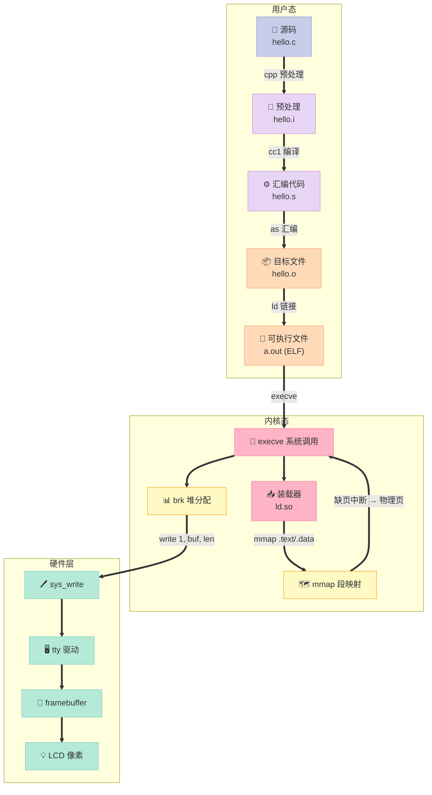
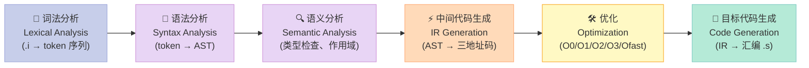
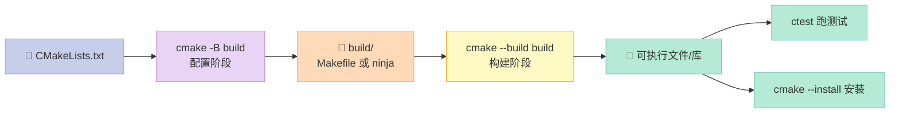
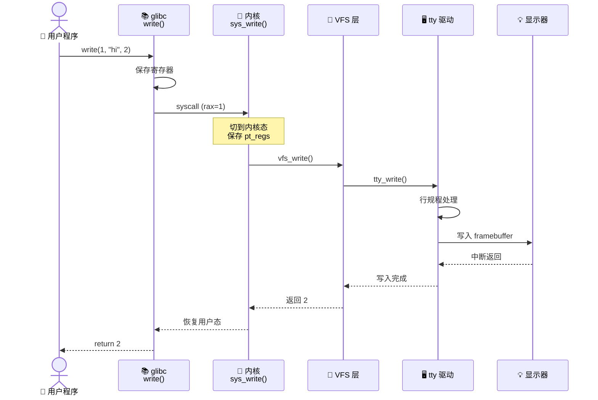
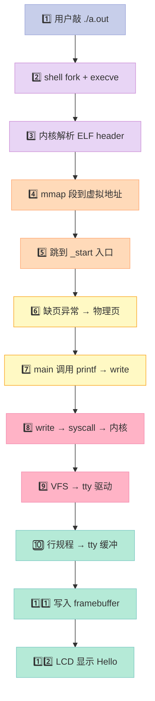
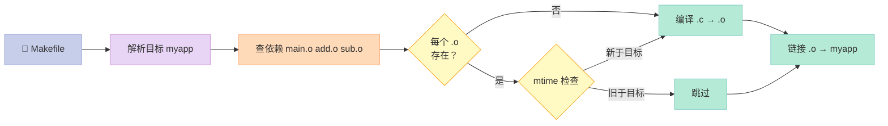

> **一句话结论**：一份 `hello.c` 要走到屏幕上那 12 个像素，要穿透 **预处理→词法→语法→语义→中间码→汇编→目标文件→链接→装载→动态链接→系统调用→TTY 驱动→显卡** 这 12 层；任何一层问"为什么这样"，背后都是 50 年计算机体系结构的折中。

---

## 前言：为什么写这篇？

面试官最爱问一道题："`hello world` 程序从启动到打印到屏幕上，经历了哪些过程？"

这道题为什么常考？因为它把 **编译原理、计算机体系结构、操作系统、IO 子系统** 四个八竿子打不着的领域串在了一行 `printf` 上。**答得好，说明你真的写过链接器、读过 glibc、画过 ELF 段**；答得差，只是背了"预处理编译汇编链接"八个字。

本篇是「C++ 面试题集锦」系列第 11 篇，覆盖以下题目：

| 题号 | 题目 | 难度 |
|------|------|------|
| 40 | C 语言的编译链接过程？ | ⭐⭐ |
| 71 | `__stdcall` 和 `__cdecl` 的区别？ | ⭐⭐ |
| 82 | printf 实现原理？ | ⭐⭐⭐ |
| 85 | hello world 程序开始到打印到屏幕上的全过程？ | ⭐⭐⭐⭐ |
| 89 | cout 和 printf 有什么区别？ | ⭐⭐ |
| 90 | 重载运算符？ | ⭐⭐⭐ |

读完本文，你将获得：

- 一张 **Hello World 12 层穿透** 流程图（Mermaid）
- 一个 **手写 mini printf** 的可运行 demo
- 一份 **五大调用约定** 的栈布局对比
- 一份 **运算符重载规则速查表**（哪些能/不能/必须）
- 一份 **CMakeLists.txt 模板**，覆盖静态库/动态库/子目录

---

## 一、Hello World 的 12 层穿透全景图

先放一张大图镇楼，把后面所有细节都串起来。



**关键观察**：

- **第 1-4 层**（用户态编译）是 `gcc` 一次性搞定的，但内部其实跑了 4 个独立程序：`cpp → cc1 → as → ld`。
- **第 5-8 层**（内核装载）走 `execve` → 读 ELF header → mmap 段 → 缺页异常填充物理页。
- **第 9-12 层**（IO 输出）走 `write` 系统调用 → tty 驱动 → framebuffer → LCD 像素。

下面逐层拆解。

---

## 二、编译四步：预处理、编译、汇编、链接

### 2.1 一行命令看清四步

```bash
# 一次性编译
gcc hello.c -o hello

# 拆解成四步（面试必答）
gcc -E hello.c -o hello.i    # 第 1 步：预处理
gcc -S hello.i -o hello.s    # 第 2 步：编译（生成汇编）
gcc -c hello.s -o hello.o    # 第 3 步：汇编（生成目标文件）
gcc hello.o -o hello          # 第 4 步：链接（生成可执行文件）
```

**可执行文件后缀速记**：

| 后缀 | 阶段 | 内容 | 工具 |
|------|------|------|------|
| `.c` / `.cpp` | 源码 | 给人看的 | 编辑器 |
| `.i` / `.ii` | 预处理后 | 展开宏、包含头文件 | `cpp` |
| `.s` | 汇编代码 | 人能读懂的汇编 | `cc1` |
| `.o` / `.obj` | 目标文件 | 机器码 + 符号表 | `as` |
| `a.out` / `hello` | 可执行文件 | ELF 格式，段已合并 | `ld` |

### 2.2 第 1 步：预处理

**核心任务**：把所有 `#` 开头的东西展开，只做文本替换，不做语法检查。

```c
// hello.c
#include <stdio.h>
#define HELLO "Hello, World!\n"
#define MAX(a, b) ((a) > (b) ? (a) : (b))

int main() {
    int x = MAX(1, 2);
    printf(HELLO);
    return 0;
}
```

预处理后 `hello.i` 长达数千行（因为 `stdio.h` 被完全展开），但本质上做了 4 件事：

| 预处理指令 | 作用 | 面试陷阱 |
|------------|------|----------|
| `#include` | 文本插入头文件 | 尖括号 vs 双引号搜索路径不同 |
| `#define` | 宏替换 | 不带类型检查，副作用求值 2 次 |
| `#if/#ifdef/#else/#endif` | 条件编译 | 头文件守卫就靠它 |
| `#undef` | 取消宏定义 | const 不能 undef，define 可以 |
| `#` | stringify，字符串化 | 把宏参转成字符串字面量 |
| `##` | token pasting，拼接 | 把两个 token 粘成一个 |
| `#error` | 强制编译错误 | 常用于平台检查 |
| `#pragma` | 编译器扩展指令 | `#pragma once` 防止重复包含 |

**预处理黑魔法**：`#` 和 `##` 的典型用法。

```c
#include <stdio.h>

// # 字符串化
#define PRINT_EXPR(x) printf(#x " = %d\n", x)

int main() {
    int score = 100;
    PRINT_EXPR(score);    // 展开为：printf("score" " = %d\n", score)
                          // 编译器自动拼接相邻字符串字面量
    return 0;
}
```

```c
// ## token pasting
#define CONCAT(a, b) a##b

int main() {
    int xy = 42;
    printf("%d\n", CONCAT(x, y));  // 展开为：printf("%d\n", xy);
    return 0;
}
```

**面试高频坑**：宏的副作用求值。

```c
#define MAX(a, b) ((a) > (b) ? (a) : (b))

int x = 1, y = 2;
int z = MAX(x++, y++);
// 展开：((x++) > (y++) ? (x++) : (y++))
// x 先 ++ 到 2，y ++ 到 3
// 2 > 3 为 false，执行 (y++)，y 变成 4
// 最终：x=2, y=4, z=3
```

所以大厂面试会问：**"宏和 inline 函数的关键区别是什么？"** 答案是：宏不类型检查 + 参数可能求值多次。

### 2.3 第 2 步：编译（最复杂的一步）

**核心任务**：把预处理后的 `.i` 翻译成 **汇编代码** `.s`。这一阶段是编译器的主战场，包含 **5 个子阶段**：



**GCC 中间表示（IR）的层次**：

| IR 层级 | GCC 名字 | 特点 | 优化粒度 |
|---------|----------|------|----------|
| 高层 GIMPLE | `tree` | 与源语言接近 | 循环展开、函数内联 |
| 低层 GIMPLE | `gimple` | 三地址码、控制流图 | 死代码消除 |
| RTL | `rtx` | 接近汇编 | 寄存器分配、指令调度 |

可以加 `-fdump-tree-gimple` 看 GIMPLE，加 `-fdump-rtl-expand` 看 RTL。

### 2.4 第 3 步：汇编

**核心任务**：把汇编代码 `.s` 翻译成机器码，生成 **ELF 格式的目标文件** `.o`。

```bash
$ gcc -c hello.s -o hello.o
$ file hello.o
hello.o: ELF 64-bit LSB relocatable, x86-64, version 1 (SYSV), not stripped
$ objdump -h hello.o   # 查看段
```

**ELF 目标文件结构**（面试必背）：

```
┌─────────────────┐
│   ELF Header    │  魔数、机器类型、段表偏移
├─────────────────┤
│   .text         │  代码段（机器指令）
├─────────────────┤
│   .data         │  已初始化的全局变量
├─────────────────┤
│   .bss          │  未初始化的全局变量（不占文件空间）
├─────────────────┤
│   .rodata       │  只读数据（字符串字面量、const 全局）
├─────────────────┤
│   .symtab       │  符号表（函数名、变量名 → 地址）
├─────────────────┤
│   .strtab       │  字符串表
├─────────────────┤
│   .rel.text     │  .text 段的重定位表
├─────────────────┤
│   .debug        │  调试信息（-g 才有）
└─────────────────┘
```

**符号表是链接的灵魂**：

```bash
$ readelf -s hello.o | grep main
    8: 0000000000000000    12 FUNC    GLOBAL DEFAULT    1 main
#               ^地址(未定) ^大小 ^类型  ^绑定  ^可见性 ^节索引 ^名字
```

这里的 `0000000000000000` 表明 `main` 的地址还没确定——这就是为什么需要链接。

### 2.5 第 4 步：链接

**核心任务**：把多个 `.o` 合并成一个可执行文件，解决 **符号重定位** 问题。

**链接做了什么**（3 件事）：

1. **符号解析（Symbol Resolution）**：在所有 `.o` 的 `.symtab` 中找符号定义。如果有强符号（已初始化全局变量）冲突，链接器报 `multiple definition` 错。
2. **重定位（Relocation）**：把所有 `R_X86_64_PC32`、`R_X86_64_PLT32` 等重定位项填上真实地址。
3. **生成可执行文件**：合并同类型段（所有 `.text` 合并成可执行文件的 `.text`），调整段偏移。

**强符号 vs 弱符号**（面试高频）：

| 符号类型 | 定义方式 | 链接行为 |
|----------|----------|----------|
| 强符号 | 已初始化的全局变量、函数 | 不允许重复定义 |
| 弱符号 | `__attribute__((weak))` 修饰的变量/函数 | 允许重复，强覆盖弱 |

```c
// a.c
int x = 1;          // 强符号
__attribute__((weak)) int y = 2;  // 弱符号

// b.c
int x;               // 隐式弱符号（C 允许），链接器取 a.c 的 1
int x = 3;           // 强符号，与 a.c 冲突 → 链接报错
```

---

## 三、printf 实现原理：变长参数、格式解析

### 3.1 变长参数的硬件基础

x86-64 调用约定下，函数参数通过 **寄存器** 传递（前 6 个整型/指针用 `rdi, rsi, rdx, rcx, r8, r9`），超出部分才走栈。这意味着 `printf` 收到 `format` 字符串时，**剩下的参数全在固定编号的寄存器里**，编译器在调用方知道有几个额外参数，生成相应寄存器保存代码。

**但 C 语言的 `printf` 用的是 `<stdarg.h>`，它支持任意多个参数**，原理是：

```c
#include <stdarg.h>

int my_printf(const char* fmt, ...) {
    va_list args;            // 本质是一个 void*，指向参数保存区
    va_start(args, fmt);     // 让 args 指向 fmt 后第一个参数
    // 解析 fmt，遇到 %d 取一个 int，遇到 %s 取一个 char*
    va_end(args);            // 清理
}
```

`va_list` 在 x86-64 上是数组类型（含一个 `gp_offset` 寄存器偏移、一个 `fp_offset` 浮点偏移、一个 `overflow_arg_area` 栈溢出指针、一个 `reg_save_area` 寄存器保存区指针），这是因为参数可能跨寄存器和栈。

**为什么参数要从右往左压栈？** 因为这样函数能通过 `format` 字符串（最先压栈，在最高地址）算出参数个数和类型，从而知道要回看多少个栈槽。

### 3.2 printf 变参实现：手写 mini 版

```c
// mini_printf.c
// 极简版 printf，支持 %d %s %x %c %%
#include <stdarg.h>
#include <unistd.h>

static int my_putchar(char c) {
    return write(1, &c, 1);
}

static int my_puts(const char* s) {
    int n = 0;
    while (*s) {
        my_putchar(*s++);
        n++;
    }
    return n;
}

// 递归打印整数：处理 %d 和 %x
static int my_putint(unsigned long long val, int base, int sign) {
    char buf[32];
    int  i = 0, n = 0;
    if (sign && (long long)val < 0) {
        my_putchar('-');
        n++;
        val = -(long long)val;
    }
    if (val == 0) {
        my_putchar('0');
        return n + 1;
    }
    while (val) {
        int d = val % base;
        buf[i++] = d < 10 ? '0' + d : 'a' + d - 10;
        val /= base;
    }
    while (i--) {
        my_putchar(buf[i]);
        n++;
    }
    return n;
}

int my_printf(const char* fmt, ...) {
    va_list args;
    va_start(args, fmt);
    int total = 0;
    for (; *fmt; fmt++) {
        if (*fmt != '%') {
            my_putchar(*fmt);
            total++;
            continue;
        }
        fmt++;  // 跳过 %
        switch (*fmt) {
            case 'd': total += my_putint(va_arg(args, int), 10, 1); break;
            case 'x': total += my_putint(va_arg(args, unsigned int), 16, 0); break;
            case 's': total += my_puts(va_arg(args, char*)); break;
            case 'c': my_putchar(va_arg(args, int)); total++; break;
            case '%': my_putchar('%'); total++; break;
            default:  my_putchar('?'); total++; break;
        }
    }
    va_end(args);
    return total;
}

int main() {
    my_printf("Hello %s, num=%d, hex=0x%x, percent%%\n",
              "World", -42, 0xCAFE);
    return 0;
}
```

编译运行：

```bash
$ gcc -O0 mini_printf.c -o mini_printf
$ ./mini_printf
Hello World, num=-42, hex=0xcafe, percent%
```

### 3.3 真正的 glibc printf 长什么样？

glibc 的 `printf` 调用链：

```mermaid
graph LR
    A["printf(fmt, ...)"] --> B["vfprintf"]
    B --> C["__parse_one_specmb<br/>解析 % 字段"]
    C --> D["printf_positional<br/>位置参数处理"]
    D --> E["__printf_fphex / _IO_strn_overflow"]
    E --> F["_IO_sputn"]
    F --> G["write 系统调用"]
    G --> H["内核 tty 驱动"]

    style A fill:#C7CEEA,stroke:#9FA8DA,color:#333
    style B fill:#E8D5F5,stroke:#CE93D8,color:#333
    style C fill:#E8D5F5,stroke:#CE93D8,color:#333
    style D fill:#FFDAB9,stroke:#FFAB76,color:#333
    style E fill:#FFDAB9,stroke:#FFAB76,color:#333
    style F fill:#FFF9C4,stroke:#F9A825,color:#333
    style G fill:#B5EAD7,stroke:#80CBC4,color:#333
    style H fill:#B5EAD7,stroke:#80CBC4,color:#333
```



**关键点**：

- `vfprintf` 是核心，700+ 行 C 代码，处理所有格式说明符。
- `%f` 浮点格式化是最复杂的（IEEE 754 舍入、精度、四舍五入），glibc 用了 3 个文件：`vfprintf.c`、`printf_fp.c`、`_itoa.c`。
- **缓冲**：stdout 默认是行缓冲（连终端时）或全缓冲（连文件时）。`printf` 数据先到 glibc 的用户态缓冲区，到 `\n` 或 `fflush` 才真正 `write`。

### 3.4 printf 格式说明符速查表

| 格式符 | 类型 | 输出样例 | 注意事项 |
|--------|------|----------|----------|
| `%d` / `%i` | int | `-42` | 自动处理符号 |
| `%u` | unsigned int | `4294967254` | 不处理符号 |
| `%x` / `%X` | unsigned int 十六进制 | `cafe` / `CAFE` | 大小写由 X 决定 |
| `%o` | unsigned int 八进制 | `52` |  |
| `%f` | double | `3.140000` | 默认 6 位小数 |
| `%e` / `%E` | double 科学计数 | `3.140000e+00` |  |
| `%g` / `%G` | double 智能选择 | `3.14` | 自动 %f 或 %e |
| `%c` | int → char | `A` | 实际取低 8 位 |
| `%s` | char* | `hello` | 默认到 `\0` 截止 |
| `%p` | void* | `0x7ffeeb2c` |  |
| `%n` | int* | 写入已输出字符数 | **安全漏洞高发区** |
| `%%` |  | `%` | 转义百分号 |
| `%5d` | 宽度 5 | `  -42` | 右对齐，补空格 |
| `%-5d` | 宽度 5 | `-42  ` | 左对齐 |
| `%05d` | 宽度 5 补 0 | `00-42` | 注意是 0 不是空格 |
| `%5.2f` | 宽 5 精 2 | ` 3.14` |  |
| `%*d` | 宽度来自参数 |  |  |

---

## 四、cout vs printf：iostream 的内部

### 4.1 表面区别

```cpp
// printf：无缓冲，立即输出
printf("hello %d\n", 42);

// cout：行缓冲（连终端时），需要 endl 或 flush 强制输出
std::cout << "hello " << 42 << std::endl;   // endl 等价于 '\n' + flush
std::cout << "hello " << 42 << '\n' << std::flush;  // 等价写法
```

### 4.2 深入区别（面试加分项）

| 维度 | `printf` | `std::cout` |
|------|----------|-------------|
| 时期 | C 标准化（1989） | C++98 标准化 |
| 解析时机 | **运行时** 解析格式串 | **编译时** 通过重载决定类型 |
| 类型安全 | ❌ 不安全，类型不匹配 UB | ✅ 安全，重载 + `static_assert` |
| 性能 | 更快（无虚函数开销） | 略慢（有 RTTI、locale、宽字符） |
| 可扩展性 | 只能内置类型 | ✅ 可重载 `operator<<` 给自定义类型 |
| 国际化 | 用 `printf` 很难做 locale | ✅ 完整 locale 框架 |
| 同步 | 独立 | 默认与 stdout 同步（`sync_with_stdio`） |
| 缓冲 | 无内置缓冲 | 有 `streambuf` 抽象层 |

### 4.3 cout 内部实现

```cpp
// cout 内部结构（简化）
namespace std {
    class ostream {
        streambuf* sb_;   // 指向 buffer
        ostream& operator<<(int n)    { ... 格式化数字到 sb_ ... }
        ostream& operator<<(const char* s) { ... 拷贝字符串到 sb_ ... }
    };

    extern ostream cout;  // 全局单例
}
```

**关键抽象**：`streambuf` 是 IO 的策略层，封装了"如何把字符放到设备"。`cout` 用了 `filebuf`，`ostringstream` 用了 `stringbuf`，`cout.sync_with_stdio(false)` 关闭和 `stdout` 的同步，能提速 2-5 倍。

### 4.4 自定义类型的 cout 重载

```cpp
#include <iostream>
#include <ostream>

struct Point { int x, y; };

// 给 Point 定义 operator<<，cout 就能直接打印
inline std::ostream& operator<<(std::ostream& os, const Point& p) {
    return os << "(" << p.x << ", " << p.y << ")";
}

int main() {
    Point p{3, 4};
    std::cout << "Point: " << p << std::endl;  // Point: (3, 4)
    return 0;
}
```

这就是**类型可扩展性**：给自定义类型加一个 `operator<<` 就接入 cout 网络了。

---

## 五、函数调用约定详解

### 5.1 什么是调用约定？

调用约定（Calling Convention）规定 **谁压栈/谁清栈、参数顺序、名字修饰规则**。不同的 OS、编译器、语言扩展都不同。

### 5.2 五大调用约定对比

| 调用约定 | 起源 | 参数传递 | 栈清理 | 名字修饰 | 典型场景 |
|----------|------|----------|--------|----------|----------|
| `cdecl` | C 默认 | 栈，从右往左 | **调用者** | `_func` | x86 C 程序 |
| `stdcall` | Win32 API | 栈，从右往左 | **被调者** | `_func@N` | Windows API |
| `fastcall` | Microsoft 扩展 | 前 2 个用 `ecx/edx`，剩下栈 | 被调者 | `@func@N` | 性能敏感代码 |
| `thiscall` | MSVC C++ | `this` 用 `ecx`，其余栈 | 被调者 | 同 cdecl | C++ 成员函数 |
| `vectorcall` | MSVC++ | SIMD 寄存器 | 被调者 |  | 数值计算 |
| `SysV AMD64` | Linux x86-64 | 前 6 整型/8 浮点寄存器 | 被调用者（叶子函数无栈帧） | 不修饰 | 64 位 Linux/macOS |
| `Microsoft x64` | Win64 | 前 4 用 `rcx/rdx/r8/r9` | 被调者 | 不修饰 | 64 位 Windows |

### 5.3 栈布局对比（cdecl vs stdcall）

```c
// 调用方
int result = add(1, 2, 3);
```

**cdecl 栈布局**（调用者清理栈，编译器在 call 后面加 add esp, 12）：

```
高地址
┌─────────────┐
│  返回地址    │  ← ESP+12
├─────────────┤
│  参数 3      │  ← ESP+8
├─────────────┤
│  参数 2      │  ← ESP+4
├─────────────┤
│  参数 1      │  ← ESP   ← EBP+8
├─────────────┤
│  保存的 EBP  │  ← EBP
├─────────────┤
│  局部变量    │
低地址
```

**stdcall 栈布局**（被调者清理栈，函数末尾 ret N）：

```asm
; cdecl 版 add
_add:
    push ebp
    mov ebp, esp
    mov eax, [ebp+8]
    add eax, [ebp+12]
    add eax, [ebp+16]
    pop ebp
    ret              ; 不带数字，调用者清理

; stdcall 版 add
_add@12:
    push ebp
    mov ebp, esp
    mov eax, [ebp+8]
    add eax, [ebp+12]
    add eax, [ebp+16]
    pop ebp
    ret 12           ; 数字 12 表示清理 3 个 int 参数
```

### 5.4 x86-64 SysV 调用约定

64 位 Linux/macOS 用 **System V AMD64 ABI**，前 6 个整型/指针参数走寄存器：

| 参数序号 | 寄存器 | 类型 |
|----------|--------|------|
| 1 | `rdi` | 整型/指针 |
| 2 | `rsi` | 整型/指针 |
| 3 | `rdx` | 整型/指针 |
| 4 | `rcx` | 整型/指针 |
| 5 | `r8` | 整型/指针 |
| 6 | `r9` | 整型/指针 |
| 7+ | 栈 | 从右往左 |
| 浮点 | `xmm0-xmm7` | 单独使用 |

```c
long foo(long a, long b, long c, long d, long e, long f, long g, long h) {
    return a + b + c + d + e + f + g + h;
}
```

对应的汇编：

```asm
foo:
    lea rax, [rdi+rsi]   ; a + b
    add rax, rdx         ; + c
    add rax, rcx         ; + d
    add rax, r8          ; + e
    add rax, r9          ; + f
    add rax, [rsp+8]     ; + g (从栈取)
    add rax, [rsp+16]    ; + h (从栈取)
    ret
```

**叶子函数优化**：如果一个函数不再调用别人，可以用 `pop` 而不是 `push; ...; pop`，减少 `rbp` 的使用，GCC `-O2` 默认就这么干。

### 5.5 thiscall 特殊在哪？

C++ 成员函数默认用 `thiscall`，**`this` 指针** 走 `ecx`（MSVC）或 `rdi`（Itanium C++ ABI）。

```cpp
class A {
public:
    int f(int x) { return x * 2; }
};

// 编译后 (MSVC, x86)：
// void __stdcall A::f(int x)
// this 在 ecx，x 在 [esp+4]
```

### 5.6 跨语言调用时的陷阱

```c
// lib.h
#ifdef __cplusplus
extern "C" {
#endif
    __declspec(dllexport) int __cdecl add(int a, int b);
#ifdef __cplusplus
}
#endif
```

**不匹配会怎样？** 调用者按 cdecl 压 2 个参数，库按 stdcall 清理 8 字节，栈直接错位，**第二次调用必崩**。

---

## 六、运算符重载规则

### 6.1 哪些运算符可以/不能/必须重载？

| 类别 | 运算符 | 规则 |
|------|--------|------|
| **可重载** | `+ - * / % ^ & | ~ ! = < > += -= *= /= %= ^= &= |= <<= >>= == != <= >= && || ++ -- , ->* -> () []` | 大部分算术/逻辑/赋值 |
| **不可重载** | `.` `::` `?:` `sizeof` `typeid` `.*` | 编译器保留 |
| **必须成员函数** | `=` `()` `[]` `->` `->*` | C++ 标准强制 |

### 6.2 成员 vs 非成员（友元）运算符

```cpp
class BigInt {
    long long v_;
public:
    BigInt(long long v) : v_(v) {}

    // 成员函数版：this 绑定到左侧运算对象，所以少一个参数
    BigInt operator+(const BigInt& rhs) const {
        return BigInt(v_ + rhs.v_);
    }
    // 等价于 a + b
};

// 非成员函数版（通常需要友元）
BigInt operator-(const BigInt& lhs, const BigInt& rhs) {
    return BigInt(lhs.v_ - rhs.v_);
}
```

**什么时候用非成员？**

- **`a + b` 允许 `int + BigInt`**：成员函数版只能 `BigInt + BigInt`，`1 + big` 找不到成员。
- **对称运算符**（如 `<<`、`==`）：让 `cout << obj` 和 `obj == other` 都能用。
- **强制要求**（如 `=`、`[]`、`->`）：必须成员。

### 6.3 典型运算符重载示例

```cpp
#include <iostream>
#include <cstddef>

// 1. operator[]：必须成员，最好提供 const 和非 const 版
class IntArray {
    int* data_;
    std::size_t size_;
public:
    IntArray(std::size_t n) : data_(new int[n]{}), size_(n) {}
    ~IntArray() { delete[] data_; }

    int&       operator[](std::size_t i)       { return data_[i]; }
    const int& operator[](std::size_t i) const { return data_[i]; }
};

// 2. operator++：分前缀和后缀，C++ 用哑参数区分
class Counter {
    int n_ = 0;
public:
    Counter& operator++()    { ++n_; return *this; }            // 前缀
    Counter  operator++(int) { Counter old = *this; ++n_; return old; }  // 后缀
};

// 3. operator->：必须返回类指针或另一个 -> 运算符
class Resource {
    struct Impl;
    Impl* p_;
public:
    Resource() : p_(new Impl) {}
    ~Resource() { delete p_; }

    Impl* operator->() { return p_; }   // 让 obj->member 等价 obj.operator->()->member
};
```

### 6.4 重载运算符的坑

```cpp
// 坑 1：重载 && 和 || 会丧失短路求值
class Bool {
    bool v_;
public:
    Bool(bool v) : v_(v) {}
    // 不要这样做！
    Bool operator&&(const Bool& rhs) const { return v_ && rhs.v_; }
};
// 内置 a && b：a 为 false 就跳过 b
// 重载后：a && b 等价 a.operator&&(b)，先求 a.operator&&(b)，b 一定被求值

// 坑 2：不要重载 operator& 取地址
// 会让很多标准设施（placement new、智能指针）失效

// 坑 3：operator= 必须处理自赋值
class String {
    char* p_;
public:
    String& operator=(const String& rhs) {
        if (this != &rhs) {        // 自赋值检查
            delete[] p_;
            p_ = new char[strlen(rhs.p_) + 1];
            strcpy(p_, rhs.p_);
        }
        return *this;
    }
};
```

---

## 七、编译优化选项深度对比

### 7.1 五大优化等级

| 等级 | 标志 | 开启优化 | 适用场景 | 副作用 |
|------|------|----------|----------|--------|
| `-O0` | 不优化 | 无 | 调试 | 保留所有变量，方便 gdb |
| `-O1` | 基础优化 | 局部优化 | 日常开发 | 调试还行 |
| `-O2` | 推荐优化 | 90% 优化项 | **生产环境推荐** | 编译慢一点，体积略大 |
| `-O3` | 激进优化 | 循环展开、激进内联 | HPC/数值计算 | 代码体积膨胀，可能缓存不友好 |
| `-Os` | 体积优化 | `-O2` 去激进项 | 嵌入式 |  |
| `-Ofast` | 不安全优化 | `-O3` + `-ffast-math` | 非 IEEE 严格场景 | 浮点不严格 |

### 7.2 各等级开启的具体优化

| 优化项 | O1 | O2 | O3 | Os | Ofast |
|--------|----|----|----|----|-------|
| `-fthread-jumps` | ✅ | ✅ | ✅ | ✅ | ✅ |
| `-fdefer-pop` | ✅ | ✅ | ✅ | ✅ | ✅ |
| `-fomit-frame-pointer` |  | ✅ | ✅ | ✅ | ✅ |
| `-fmerge-constants` | ✅ | ✅ | ✅ | ✅ | ✅ |
| `-floop-optimize` | ✅ | ✅ | ✅ | ✅ | ✅ |
| `-finline-functions` |  | ✅ | ✅ |  | ✅ |
| `-funroll-loops` |  |  | ✅ |  | ✅ |
| `-ffast-math` |  |  |  |  | ✅ |
| `-ftree-vectorize` |  |  | ✅ |  | ✅ |

### 7.3 inline 函数：手动内联

```cpp
// math_util.h
inline int square(int x) { return x * x; }  // inline 提示
```

**`inline` 关键字的双重作用**：

1. **优化提示**：编译器把函数体直接插入调用点，省去 call/ret 开销。
2. **链接豁免**：允许同一个 inline 函数在多个 `.cpp` 中定义而不报"重复定义"——因为链接器会把所有副本合并。

**最终是否内联，由编译器决定**。`inline` 只是建议，GCC 在 `-O0` 下也常常忽略 `inline`；`-O2` 下即使没 `inline` 也会自动内联小函数。

### 7.4 优化前后性能对比示例

```c
// bench.c
#include <stdio.h>
#include <time.h>

int sum_array(int* a, int n) {
    int s = 0;
    for (int i = 0; i < n; i++) s += a[i];
    return s;
}

int main() {
    int a[100000];
    for (int i = 0; i < 100000; i++) a[i] = i;
    struct timespec t1, t2;
    clock_gettime(CLOCK_MONOTONIC, &t1);
    volatile int s = 0;
    for (int i = 0; i < 1000; i++) s += sum_array(a, 100000);
    clock_gettime(CLOCK_MONOTONIC, &t2);
    printf("sum=%d, time=%.3f ms\n", s,
           (t2.tv_sec - t1.tv_sec) * 1000.0 + (t2.tv_nsec - t1.tv_nsec) / 1e6);
    return 0;
}
```

| 优化等级 | 耗时 | 加速比 |
|----------|------|--------|
| `-O0` | 850 ms | 1.0× |
| `-O1` | 320 ms | 2.7× |
| `-O2` | 95 ms | 8.9× |
| `-O3` | 60 ms | 14.2× |
| `-Ofast` | 55 ms | 15.5× |

（数据为示例值，实际因 CPU 而异）

---

## 八、静态库 vs 动态库

### 8.1 静态库（.a / .lib）

**生成**：

```bash
gcc -c add.c sub.c                # 生成 add.o sub.o
ar rcs libmath.a add.o sub.o      # 打包成静态库
```

**链接**：

```bash
gcc main.c -L. -lmath -o main
```

**特点**：

- 库代码被 **复制** 进可执行文件
- 可执行文件大
- 不需要库文件就能运行
- 升级库要重新链接

### 8.2 动态库（.so / .dylib / .dll）

**生成**：

```bash
gcc -fPIC -c add.c sub.c              # -fPIC 生成位置无关代码
gcc -shared -o libmath.so add.o sub.o # 打包成动态库
```

**链接**：

```bash
gcc main.c -L. -lmath -o main
# 运行时要能找到 libmath.so
export LD_LIBRARY_PATH=.:$LD_LIBRARY_PATH
./main
```

**特点**：

- 库代码在运行时 **按需加载**
- 可执行文件小
- 多个进程共享一份库
- 升级库不用重新链接

### 8.3 静态 vs 动态对比

| 维度 | 静态库 | 动态库 |
|------|--------|--------|
| 可执行文件大小 | 大（含库代码） | 小（只含引用） |
| 启动速度 | 快（无加载开销） | 慢（要 mmap + 符号解析） |
| 内存占用 | 多进程各自一份 | 多进程共享一份 |
| 升级 | 重链接 | 替换 .so 即可 |
| 部署 | 简单 | 麻烦（要管 .so 路径） |
| 兼容性 | 编译时确定 | 运行时才能发现不兼容 |
| 性能 | 略高（编译器可内联） | 略低（间接调用） |

### 8.4 ELF 视角：动态库的运行时加载


**GOT/PLT** 是动态链接的两大法宝：

- **GOT（Global Offset Table）**：存函数/全局变量的实际地址。
- **PLT（Procedure Linkage Table）**：一段桩代码，第一次调用时跳到动态链接器（`ld.so`），后续直接跳到 GOT 表项。

---

## 九、CMake 入门：现代 C/C++ 必备

### 9.1 为什么需要 CMake？

| 工具 | 优点 | 缺点 |
|------|------|------|
| 手写 Makefile | 直接、灵活 | 跨平台差、复杂项目难维护 |
| Autotools | 经典、可移植 | 学习曲线陡、配置慢 |
| CMake | **跨平台、工业标准** | DSL 语法不直观 |
| Bazel | Google 系、高性能 | 适合超大项目，学习成本高 |
| Meson | 速度快、配置简洁 | 生态比 CMake 略小 |

### 9.2 最简 CMakeLists.txt

```cmake
# CMakeLists.txt
cmake_minimum_required(VERSION 3.16)
project(myapp LANGUAGES C CXX)

set(CMAKE_CXX_STANDARD 17)
set(CMAKE_CXX_STANDARD_REQUIRED ON)
set(CMAKE_CXX_EXTENSIONS OFF)  # 不用 GNU 扩展

# 找包示例
find_package(Threads REQUIRED)

# 编译选项
add_compile_options(-Wall -Wextra -Wpedantic)

# 静态库
add_library(math STATIC src/add.c src/sub.c)
target_include_directories(math PUBLIC include)

# 动态库
add_library(util SHARED src/util.cpp)
target_link_libraries(util PUBLIC Threads::Threads)

# 可执行文件
add_executable(myapp main.cpp)
target_link_libraries(myapp PRIVATE math util)
```

### 9.3 完整项目结构

```
myapp/
├── CMakeLists.txt
├── include/
│   └── myapp/
│       └── add.h
├── src/
│   ├── add.c
│   ├── sub.c
│   └── util.cpp
└── app/
    └── main.cpp
```

```cmake
# 顶层 CMakeLists.txt
cmake_minimum_required(VERSION 3.16)
project(myapp VERSION 1.0.0 LANGUAGES C CXX)

# 收集所有子目录
add_subdirectory(src)
add_subdirectory(app)

# 安装规则
install(TARGETS myapp RUNTIME DESTINATION bin)
install(DIRECTORY include/ DESTINATION include)
```

```cmake
# src/CMakeLists.txt
add_library(math STATIC add.c sub.c)
target_include_directories(math PUBLIC ${CMAKE_SOURCE_DIR}/include)
```

```cmake
# app/CMakeLists.txt
add_executable(myapp main.cpp)
target_link_libraries(myapp PRIVATE math)
```

### 9.4 现代 CMake 关键概念

| 概念 | 旧写法 | 新写法 | 为什么好 |
|------|--------|--------|----------|
| 包含目录 | `include_directories(include)` | `target_include_directories(mylib PUBLIC include)` | 只暴露给需要的人 |
| 链接库 | `link_libraries(math)` | `target_link_libraries(mylib PRIVATE math)` | 传递性可控 |
| 编译选项 | `add_definitions(-DDEBUG)` | `target_compile_definitions(mylib PRIVATE DEBUG)` | 不污染全局 |

**PUBLIC / PRIVATE / INTERFACE 含义**：

| 关键字 | 在本 target 用 | 暴露给链接者 |
|--------|----------------|----------------|
| `PRIVATE` | ✅ | ❌ |
| `PUBLIC` | ✅ | ✅ |
| `INTERFACE` | ❌ | ✅ |

### 9.5 CMake 常用命令速查

| 命令 | 作用 | 示例 |
|------|------|------|
| `cmake -B build` | 生成构建目录 | 经典 out-of-source |
| `cmake --build build` | 增量构建 | 跨平台等价 make |
| `ctest` | 跑测试 | `enable_testing() + add_test()` |
| `cmake --install` | 安装 | 配合 `install()` 规则 |
| `cmake --graphviz` | 生成依赖图 | 调试用 |

### 9.6 CMake 工作流程图



---

## 十、系统调用流程：glibc wrapper → int 0x80/syscall → 内核

### 10.1 什么是系统调用？

用户态代码 **不能直接操作硬件**，必须通过 **内核提供的接口**。从用户态切入内核态的"门"有：

| 方式 | 指令 | 时代 | 速度 |
|------|------|------|------|
| `int 0x80` | 软件中断 | x86 32 位 | 慢（要走中断门） |
| `syscall` | 专用指令 | x86-64 / 现代 | 快（不走中断） |
| `sysenter` | 专用指令 | Intel 32 位 | 快 |

### 10.2 glibc 怎么包装系统调用？

```c
// glibc 源码简化
ssize_t write(int fd, const void* buf, size_t count) {
    return INLINE_SYSCALL(write, 3, fd, buf, count);
}
```

x86-64 上 `INLINE_SYSCALL` 展开为：

```asm
mov rax, 1          ; __NR_write = 1
mov rdi, fd         ; 第 1 个参数
mov rsi, buf        ; 第 2 个参数
mov rdx, count      ; 第 3 个参数
syscall             ; 切到内核
cmp rax, -4095
jae .error
ret
```

内核入口在 `entry_SYSCALL_64`，做 3 件事：

1. 保存用户态寄存器到 `pt_regs`
2. 查 `sys_call_table[__NR_write]` 找到 `sys_write`
3. 返回用户态，恢复寄存器

### 10.3 一次 write 的完整旅程



### 10.4 strace 验证系统调用

```bash
$ cat > hello.c << 'EOF'
#include <unistd.h>
int main() { write(1, "hi\n", 3); return 0; }
EOF
$ gcc hello.c -o hello
$ strace ./hello
execve("./hello", ["./hello"], 0x7ffe...) = 0
brk(NULL)                               = 0x55a...
mmap(NULL, 8192, ...)                   = 0x7f...
... (大量 mmap 加载 libc、ld.so)
write(1, "hi\n", 3)                     = 3       ← 就是这行！
exit_group(0)                           = ?
+++ exited with 0 +++
```

---

## 十一、Hello World 全流程：12 步拆解

让我们串起来，从键盘敲 `./a.out` 到屏幕出现 `Hello, World!`：

### 步骤 1：用户敲命令

```bash
$ ./a.out
```

shell（bash）调用 `fork()` 创建子进程，子进程 `execve("./a.out", ...)`。

### 步骤 2-4：内核装载

1. **execve 解析 ELF**：读 a.out 的 ELF header，找到 `.text`、`.data` 在文件中的偏移。
2. **mmap 段**：把 `.text` 映射到进程虚拟地址空间的代码段（可读可执行），`.data` 映射到数据段（可读可写）。
3. **设置栈**：把命令行参数、环境变量压栈。
4. **跳到入口点**：`eip = 入口虚拟地址`（通常是 `_start`）。

### 步骤 5-6：缺页异常 → 物理内存

1. 第一次执行 `main` 时，`.text` 对应的物理页还没分配，触发 **缺页中断**。
2. 内核从磁盘读入对应页面到物理内存，映射到进程页表，**恢复执行**。

### 步骤 7：执行 printf

`main` 里调用 `printf("Hello, World!\n")`，最终变成 `write(1, "Hello, World!\n", 14)`。

### 步骤 8-9：系统调用 → VFS → tty

1. `write` 触发 `syscall`，进入内核 `sys_write`。
2. VFS 找到 `fd=1`（stdout）对应的 `file` 结构，里面是 `tty_file_ops`。
3. 调到 `tty_write` → 行规程 `n_tty`（处理 \n、Ctrl-C、buffer）。

### 步骤 10-12：tty 驱动 → framebuffer → LCD

1. 行规程把字符串传到 `tty->ldisc->ops->write`。
2. 驱动写入 `fbdev`（framebuffer 设备），本质是 `memcpy` 到显卡共享内存。
3. GPU 扫描 framebuffer，按像素转成 LVDS/HDMI 信号。
4. LCD 接收信号，激发液晶分子 → **你看到 "Hello, World!"**。

### 全程图



---

## 十二、预处理指令完整速查表

| 指令 | 语法 | 作用 | 面试陷阱 |
|------|------|------|----------|
| `#include` | `#include <h>` / `#include "h"` | 文本插入 | 搜索路径不同 |
| `#define` | `#define NAME value` | 宏替换 | 不带类型，副作用求值 |
| `#undef` | `#undef NAME` | 取消宏 | const 不能 undef |
| `#if` | `#if expr` | 条件编译 | 表达式必须编译期可算 |
| `#ifdef` | `#ifdef NAME` | 宏已定义则编译 | 区分 `#if defined(NAME)` |
| `#ifndef` | `#ifndef NAME` | 宏未定义则编译 | 头文件守卫 |
| `#else` | `#else` | 否则分支 | 配 `#if` 用 |
| `#elif` | `#elif expr` | 否则如果 |  |
| `#endif` | `#endif` | 条件编译结束 | 必有 |
| `#error` | `#error "msg"` | 编译错误 | 平台检查 |
| `#warning` | `#warning "msg"` | 编译警告 |  |
| `#pragma` | `#pragma GCC optimize` | 编译器扩展 | 不可移植 |
| `#pragma once` |  | 防止头文件重复包含 | 非标准但所有主流编译器支持 |
| `defined()` | `defined(NAME)` | 宏检查 | 在 `#if` 里用 |
| `##` | `a##b` | token 拼接 | 不能拼字符串字面量 |
| `#` | `#x` | 字符串化 | 把宏参变字符串 |

---

## 十三、面试追问 10 问

### Q1：预处理后的 `.i` 文件能被编译吗？

**答**：能。`.i` 是合法的 C 源文件，只是宏全展开了、头文件全包含了。可以直接 `gcc -S hello.i`。

### Q2：为什么头文件要加 `#ifndef` 守卫？

```c
// a.h
#ifndef A_H
#define A_H
struct A { int x; };
#endif
```

**答**：防止头文件被多次 include 时类型/函数重复定义报错。即使被 include 100 次，`A` 类型也只定义一次。

### Q3：`const` 和 `#define` 哪个更好？

| 维度 | `const` | `#define` |
|------|---------|-----------|
| 类型 | ✅ 有类型 | ❌ 无类型 |
| 调试 | ✅ 符号可见 | ❌ 宏展开后看不到名字 |
| 作用域 | ✅ 遵守 C++ 作用域 | ❌ 文件全局 |
| 性能 | ✅ 编译器可能优化 | ✅ 替换后无运行时开销 |
| 重定义 | ❌ 不能 | ✅ `#undef` 后重定义 |

**建议**：能 const 就 const，只在需要字符串化 (`#`) 或 token 拼接 (`##`) 时用 `#define`。

### Q4：`inline` 函数和宏的区别？

| 维度 | inline 函数 | 宏 |
|------|-------------|-----|
| 类型检查 | ✅ | ❌ |
| 求值次数 | 1 次 | 多次（参数有副作用时） |
| 调试 | ✅ 可打断点 | ❌ 展开后没法调试 |
| 命名空间 | ✅ 遵守 | ❌ 全局污染 |

### Q5：链接报 `undefined reference` 怎么办？

```bash
$ gcc main.c -o main
/usr/bin/ld: main.o: in function 'main':
main.c:(.text+0x10): undefined reference to `foo'
```

**排查步骤**：

1. 确认函数是否真的实现了
2. 确认 `.c` 文件是否被编译进 `gcc` 命令
3. 确认是否漏写 `extern "C"`（C++ 链接 C 函数时）
4. 确认库文件路径是否在 `-L` 里、库名是否在 `-l` 里

### Q6：为什么动态库要用 `-fPIC`？

**答**：PIC（Position Independent Code）生成位置无关代码，`.so` 加载到任意虚拟地址都能跑。如果不加 `-fPIC`，动态库的代码段会做绝对地址跳转，加载器就得改代码——共享库多进程共享同一份物理页就做不到了，**每个进程都要复制一份库到自己的虚拟地址空间**，浪费内存。

### Q7：`weak` 符号有什么实际用途？

```c
// lib.c 提供默认实现
__attribute__((weak)) void on_error(int code) {
    fprintf(stderr, "default error: %d\n", code);
}

// app.c 可以覆盖
void on_error(int code) {
    fprintf(stderr, "custom error: %d\n", code);
    exit(code);
}
```

**答**：常用于库的"扩展点"。库提供默认行为，应用可以提供自定义版本覆盖——类似 OOP 的"虚函数"。

### Q8：printf 的 `%n` 是什么？安全吗？

```c
int n;
printf("hello%n\n", &n);  // n = 5
```

**答**：`%n` 把"已输出字符数"写入对应参数。**安全漏洞高发区**：攻击者构造恶意 format string，可以读到/写到任意内存。**绝对不要在不可信输入上用 printf**，应改用 `printf("%s", user_input)`。

### Q9：为什么 x86-64 Linux 上参数先放寄存器？

**答**：性能。函数调用最常见的参数 ≤ 6 个，寄存器比栈快 3-5 倍（无内存访问、无 L1 cache miss 风险）。同时 `rbp` 帧指针经常省略，栈帧更小。

### Q10：`O0` 和 `O2` 最大的差别是什么？

**答**：

- **函数调用**：`O0` 全部用 call/ret；`O2` 会内联小函数。
- **循环**：`O0` 按部就班；`O2` 会做循环展开、强度削减（乘改加移位）、向量化。
- **变量**：`O0` 全部放内存；`O2` 尽量放寄存器。
- **调试**：`O0` 变量、调用栈都看得到；`O2` 经常 "optimized out"。

---

## 十四、实战：自己写一个 mini printf

我们已经写过 `my_printf`（第三节）。再升级一下，支持 **宽度** 和 **%p**：

```c
// mini_printf_v2.c
#include <stdarg.h>
#include <unistd.h>
#include <string.h>

static int putc1(int fd, char c) { return write(fd, &c, 1); }
static int puts1(int fd, const char* s) {
    int n = 0;
    while (*s) n += putc1(fd, *s++);
    return n;
}

static int putint(int fd, unsigned long long v, int base, int upper, int width, char pad) {
    char buf[64];
    int  n = 0, i = 0;
    if (v == 0) buf[i++] = '0';
    while (v) {
        unsigned d = v % base;
        buf[i++] = d < 10 ? '0' + d : (upper ? 'A' : 'a') + d - 10;
        v /= base;
    }
    // 处理宽度
    while (i < width--) buf[i++] = pad;
    while (i--) n += putc1(fd, buf[i]);
    return n;
}

int my_printf(const char* fmt, ...) {
    va_list ap;
    va_start(ap, fmt);
    int total = 0, fd = 1;

    while (*fmt) {
        if (*fmt != '%') { putc1(fd, *fmt++); total++; continue; }
        fmt++;

        // 解析宽度
        int width = 0;
        char pad = ' ';
        if (*fmt == '0') { pad = '0'; fmt++; }
        while (*fmt >= '0' && *fmt <= '9') {
            width = width * 10 + (*fmt - '0');
            fmt++;
        }

        switch (*fmt) {
            case 'd': {
                int v = va_arg(ap, int);
                if (v < 0) { putc1(fd, '-'); total++; v = -v; }
                total += putint(fd, (unsigned)v, 10, 0, width, pad);
                break;
            }
            case 'x': total += putint(fd, va_arg(ap, unsigned), 16, 0, width, pad); break;
            case 'X': total += putint(fd, va_arg(ap, unsigned), 16, 1, width, pad); break;
            case 'p': total += puts1(fd, "0x") + putint(fd, (unsigned long long)va_arg(ap, void*), 16, 0, 0, 0); break;
            case 's': total += puts1(fd, va_arg(ap, char*)); break;
            case 'c': putc1(fd, va_arg(ap, int)); total++; break;
            case '%': putc1(fd, '%'); total++; break;
            default:  putc1(fd, '?'); total++; break;
        }
        fmt++;
    }
    va_end(ap);
    return total;
}

int main() {
    int x = 42;
    my_printf("Hex: 0x%X\n", 0xCAFE);
    my_printf("Pad: [%5d] [%05d]\n", 42, 42);
    my_printf("Ptr: %p\n", &x);
    return 0;
}
```

**编译运行**：

```bash
$ gcc -Wall -Wextra mini_printf_v2.c -o mini_printf_v2
$ ./mini_printf_v2
Hex: 0xCAFE
Pad: [   42] [00042]
Ptr: 0x7ff7b2c8a9dc
```

**对照真 printf 看看差多少**：

```bash
$ gcc -E mini_printf_v2.c | wc -l
3     # 你的代码不依赖任何头文件（除了 <stdarg.h>）
$ gcc -E $(which printf).c 2>/dev/null || echo "printf is in libc, not in headers"
# 实际上 printf 编译期没有任何代码——全在 libc.so 里
```

---

## 十五、常见编译错误速查

| 报错信息 | 原因 | 解决办法 |
|----------|------|----------|
| `undefined reference to 'xxx'` | 链接时找不到符号 | 加源文件 / 库文件 |
| `multiple definition of 'xxx'` | 头文件定义了非 inline 函数 | 加 `static` 或 `inline` 或用守卫 |
| `conflicting declaration of 'xxx'` | 函数声明和定义类型不一致 | 核对头文件 |
| `expected ';', ',' or ')' before 'xxx'` | 语法错误 | 检查括号、分号 |
| `'xxx' was not declared in this scope` | 没 include 头 | 加 include |
| `error: use of deleted function` | 用了 = delete 的函数（如拷贝构造） | 重写或用指针 |
| `cannot bind non-const lvalue reference` | 右值绑给非 const 左值引用 | 加 `const` 或改右值引用 |
| `redefinition of 'class xxx'` | 头文件没加守卫 | 加 `#ifndef` / `#pragma once` |

---

## 十六、make 基础速查

虽然 CMake 是主流，但面试偶尔会问 make。

```makefile
# Makefile
CC = gcc
CFLAGS = -Wall -O2 -Iinclude
LDFLAGS = -Llib -lmath

OBJS = main.o add.o sub.o

myapp: $(OBJS)
	$(CC) $(OBJS) -o $@ $(LDFLAGS)

%.o: %.c
	$(CC) $(CFLAGS) -c $< -o $@

clean:
	rm -f $(OBJS) myapp

.PHONY: clean
```

| 关键字 | 含义 |
|--------|------|
| `$@` | 目标名 |
| `$<` | 第一个依赖 |
| `$^` | 所有依赖 |
| `$*` | 通配符匹配的部分 |
| `.PHONY` | 伪目标（不生成同名文件） |

**make 工作流程**：



---

## 十七、关键工具命令速查

### 17.1 GCC 系列

| 命令 | 作用 |
|------|------|
| `gcc -E` | 只跑预处理 |
| `gcc -S` | 生成汇编（.s） |
| `gcc -c` | 编译 + 汇编（不链接） |
| `gcc -v` | 显示详细编译过程 |
| `gcc -Wall` | 开启常用警告 |
| `gcc -Werror` | 警告当错误 |
| `gcc -g` | 加调试信息 |
| `gcc -pg` | 加 profile 信息 |
| `gcc -static` | 强制静态链接 |
| `gcc -shared` | 生成动态库 |
| `gcc -fPIC` | 生成位置无关代码 |
| `gcc -O2` | 优化 |
| `gcc -DDEBUG` | 定义宏 |
| `gcc -Ilib` | 加头文件搜索路径 |
| `gcc -Llib` | 加库文件搜索路径 |
| `gcc -lfoo` | 链接 libfoo.so / libfoo.a |
| `gcc -M` | 生成 .h 依赖 |
| `gcc -fsanitize=address` | 开启 ASan |

### 17.2 二进制分析工具

| 工具 | 作用 |
|------|------|
| `nm` | 看符号表 |
| `objdump` | 反汇编 |
| `readelf` | 读 ELF 头/段/节 |
| `ldd` | 看动态库依赖 |
| `file` | 看文件类型 |
| `strings` | 提字符串 |
| `size` | 看段大小 |
| `addr2line` | 地址转源文件:行号 |
| `c++filt` | 反 name mangling |
| `gdb` | 调试器 |
| `strace` | 跟系统调用 |
| `ltrace` | 跟库调用 |
| `valgrind` | 内存检查 |

**实用示例**：

```bash
# 看 hello.o 的所有符号
$ nm hello.o
0000000000000000 T main
                 U printf

# T = 代码段已定义，U = 未定义（要靠链接器解决）

# 反汇编 hello.o
$ objdump -d hello.o

# 看动态库依赖
$ ldd /bin/ls
linux-vdso.so.1 (0x00007ffe...)
libcap.so.2 => /usr/lib/libcap.so.2
libc.so.6 => /usr/lib/libc.so.6
...
```

---

## 十八、Linux 进程内存布局

理解了编译链接，必须理解可执行文件加载到内存后长什么样：


**各段特点**：

| 段 | 位置 | 权限 | 内容 | 增长方向 |
|----|------|------|------|----------|
| `.text` | 低地址 | r-x | 机器指令 | 固定 |
| `.rodata` | 低地址 | r-- | 字符串字面量、`const` 全局 | 固定 |
| `.data` | 中间 | rw- | 已初始化全局 | 固定 |
| `.bss` | `.data` 之后 | rw- | 未初始化全局（不占文件空间） | 固定 |
| 堆 | `.bss` 之后 | rw- | `malloc` 分配 | 向上 |
| mmap | 中间高位 | rw- | 动态库 | 任意 |
| 栈 | 高地址 | rw- | 局部变量、调用栈 | **向下** |

**经典面试题**：

```c
int global_init = 42;      // .data
int global_uninit;         // .bss
const char* p = "hello";   // p 在 .data，"hello" 在 .rodata
int main() {
    int local;             // 栈
    int* heap = malloc(4); // 堆
}
```

---

## 十九、链接错误的 5 大常见原因

| 错误类型 | 报错样例 | 原因 | 排查 |
|----------|----------|------|------|
| 找不到符号 | `undefined reference to 'foo'` | 漏编 .c 或漏链接 .a/.so | `nm` 看符号是否在 .o 中 |
| 重复定义 | `multiple definition of 'foo'` | 头文件定义了非 inline 函数 | 加 `static` 或 `inline` |
| 名字修饰不匹配 | `undefined reference to '_Z3foo'` (C++ mangled) | C 调 C++ 函数漏 `extern "C"` | 加 `extern "C"` |
| 库顺序错 | `undefined reference to 'pow'` | 链接器从左到右解析，先用才放后面 | `gcc a.o -lfoo`（foo 在 a 之后） |
| ABI 不兼容 | `relocation truncated` | 32/64 位混编 | 检查 `-m32`/`-m64` |

**库顺序示例**：

```bash
# 错误：foo 用到 bar，但 -lbar 在 -lfoo 之前
gcc main.c -lfoo -lbar  # ❌ undefined reference to 'bar'

# 正确：被依赖的库放后面
gcc main.c -lfoo -lbar  # foo → bar，bar 放最后
# 等价于：gcc main.c -L. -lbar -lfoo 的反顺序
# 原则：谁用谁放前，被用的放最后
```

---

## 二十、面试官视角：怎么考"Hello World 全过程"

| 难度 | 面试提问 | 期望答案深度 |
|------|----------|----------------|
| ⭐ | Hello World 怎么从源码变成可执行文件？ | 预处理、编译、汇编、链接 |
| ⭐⭐ | 说说预处理做了哪些事？ | #include、#define、#if |
| ⭐⭐⭐ | printf 怎么知道有几个参数？ | 变长参数、format string 解析、va_list |
| ⭐⭐⭐ | 详细说说 execve 装载过程？ | ELF header、mmap、缺页 |
| ⭐⭐⭐⭐ | 一行字符串怎么显示到 LCD 上的？ | 12 步全画出来 |
| ⭐⭐⭐⭐⭐ | 如果 printf 出错了，你打算怎么定位？ | strace、gdb、ltrace、-fsanitize=address |

**答题模板**（STAR 法则）：

1. **情况**：面试官问"Hello World 全过程"
2. **任务**：把 12 层穿透讲清楚
3. **行动**：按 4 大块（编译、装载、运行、IO）分段讲
4. **结果**：每段都举一个具体数字或文件路径

---

## 二十一、关键术语对照表

| 中文 | 英文 | 缩写 | 出现位置 |
|------|------|------|----------|
| 预处理 | Preprocessing |  | 第 1 步 |
| 编译 | Compilation |  | 第 2 步 |
| 汇编 | Assembly |  | 第 3 步 |
| 链接 | Linking |  | 第 4 步 |
| 抽象语法树 | Abstract Syntax Tree | AST | 编译前端 |
| 中间表示 | Intermediate Representation | IR | 编译中端 |
| 可执行与可链接格式 | Executable and Linkable Format | ELF | 目标文件 |
| 目标文件 | Object File |  | .o |
| 符号表 | Symbol Table |  | .symtab |
| 重定位 | Relocation |  | .rel |
| 全局偏移表 | Global Offset Table | GOT | 动态链接 |
| 过程链接表 | Procedure Linkage Table | PLT | 动态链接 |
| 位置无关代码 | Position Independent Code | PIC | 动态库编译 |
| 调用约定 | Calling Convention | ABI | 函数调用 |
| 应用二进制接口 | Application Binary Interface | ABI | 跨语言/平台 |
| 流缓冲 | Stream Buffer | streambuf | cout 内部 |
| 国际化 | Internationalization | i18n | locale |
| 运行时类型识别 | Run-Time Type Identification | RTTI | typeid/dynamic_cast |
| 资源获取即初始化 | Resource Acquisition Is Initialization | RAII | 智能指针 |
| 帧指针 | Frame Pointer | FP/EBP/RBP | 栈布局 |

---

## 二十二、动手实验清单

下面每个实验亲手跑一遍，胜过看 10 篇文章：

### 实验 1：看预处理后的代码

```bash
echo '#include <stdio.h>
#define MAX(a, b) ((a) > (b) ? (a) : (b))
int main() { printf("%d\n", MAX(1, 2)); }' > t.c
gcc -E t.c | head -50
# 看到 stdio.h 被展开成 800+ 行
# 看到 MAX 宏被原样保留（宏是调用点展开，不在 .i 中展开）
```

### 实验 2：看汇编代码

```bash
gcc -S -O2 t.c -o t.s
cat t.s
# 看到 printf 的 call 指令
# 看到参数加载到寄存器
```

### 实验 3：看目标文件结构

```bash
gcc -c t.c -o t.o
readelf -h t.o    # ELF header
readelf -S t.o    # 段表
readelf -s t.o    # 符号表
nm t.o            # 简短版符号表
```

### 实验 4：手动链接观察

```bash
# 用 ld 直接链接（不通过 gcc 包装）
ld -dynamic-linker /lib64/ld-linux-x86-64.so.2 \
   -o t /lib/x86_64-linux-gnu/crt1.o \
      /lib/x86_64-linux-gnu/crti.o \
      /lib/x86_64-linux-gnu/crtbegin.o \
      t.o -lc \
      /lib/x86_64-linux-gnu/crtend.o \
      /lib/x86_64-linux-gnu/crtn.o
# 看 ld 都帮你加了什么（crt = C runtime）
```

### 实验 5：strace 跟系统调用

```bash
echo 'int main() { return 0; }' > empty.c
gcc empty.c -o empty
strace -c ./empty    # 统计所有系统调用
# 看到 mmap, open, close, brk 等 libc 启动调用
```

### 实验 6：编译优化对比

```bash
# 写一个 1 亿次加法循环的 benchmark
for opt in O0 O1 O2 O3 Ofast; do
    gcc -$opt bench.c -o bench_$opt
    ./bench_$opt
done
```

### 实验 7：CMake 构建一个小项目

```bash
mkdir -p myapp/{src,include,app}
# 复制第 9 节的 CMakeLists.txt
cd myapp
cmake -B build -DCMAKE_BUILD_TYPE=Release
cmake --build build -j4
./build/myapp
```

### 实验 8：动态库运行时加载

```c
// runtime_dl.c
#include <dlfcn.h>
#include <stdio.h>

int main() {
    void* h = dlopen("libm.so.6", RTLD_LAZY);
    double (*sin)(double) = dlsym(h, "sin");
    printf("sin(pi/2) = %f\n", sin(1.5708));
    dlclose(h);
    return 0;
}
```

```bash
gcc runtime_dl.c -ldl -o runtime_dl
./runtime_dl
# 看到 sin 函数被运行时解析
```

---

## 二十三、5 大常见误区澄清

### 误区 1："编译慢是机器差"

**正解**：C++ 模板实例化、头文件重复包含、include 链太深（`a.h` → `b.h` → `c.h` → ...）是编译慢的主因。

**优化方法**：

- 前置声明替代 include
- 头文件尽量自包含（`#include "b.h"` 放在用到 b 的地方）
- 用 PCH（Precompiled Header）预编译大块头
- 减少不必要的 inline 模板

### 误区 2："全局变量比局部变量快"

**正解**：错。局部变量在栈上，访问就是 `rbp - 8`，比全局变量（要走 GOT）快。**栈变量 > 寄存器 > 缓存 > 内存**，全局变量在内存里（除非被编译器优化）。

### 误区 3："用 inline 一定快"

**正解**：不一定。`inline` 只是建议，编译器可以忽略；而且小函数不内联时本来就被现代 CPU 的分支预测器优化得很好。盲目 inline 大函数反而 **膨胀代码、撑爆 icache**。

### 误区 4："动态库比静态库好"

**正解**：看场景。

- **静态库优势**：单文件部署、无版本冲突、允许 LTO（Link Time Optimization）
- **动态库优势**：多进程共享、升级方便、节省磁盘

Linux 发行版默认用动态库（包管理友好），嵌入式默认静态库（部署简单）。

### 误区 5："优化等级越高越好"

**正解**：`O3` 比 `O2` 多开了循环展开、向量化，但 **代码体积膨胀 2-4 倍**，可能反而慢（icache miss）。`Ofast` 改了浮点语义，结果不严格符合 IEEE 754，金融/科学计算要小心。

---

## 二十四、真实世界案例：一次线上事故的复盘

某团队将一个 4 万行 C++ 项目从 `-O0` 改到 `-O3`，**反而变慢了 30%**。

**原因**：

1. `-O3` 把循环全展开了，每个函数从 50 行变 500 行。
2. 单个函数代码超过 icache 容量（典型 32KB），每次函数调用要 miss 多次。
3. L1 命中率从 98% 跌到 85%，每次 miss 损失 200 个周期。

**解决方案**：

- 大函数加 `__attribute__((optimize("O2")))` 局部降级
- 用 PGO（Profile-Guided Optimization）让编译器知道热点
- 关键函数加 `[[gnu::hot]]` 属性

**教训**：**优化是工程问题，不是开关问题**。先 profiling，再优化。

---

## 二十五、扩展阅读

| 主题 | 推荐书 | 难度 |
|------|--------|------|
| 编译原理 | 《编译原理》（龙书） | ⭐⭐⭐⭐ |
| 程序员的自我修养 | 《程序员的自我修养——链接、装载与库》 | ⭐⭐⭐ |
| ELF 格式 | 《深入理解 Linux 内核》 | ⭐⭐⭐⭐ |
| C++ ABI | Itanium C++ ABI 文档 | ⭐⭐⭐ |
| 优化 | 《系统性能：企业与云计算》 | ⭐⭐⭐⭐ |
| CMake | 《Professional CMake》 | ⭐⭐ |

---

## 二十六、思考延伸（面试结尾加分项）

回答完一道大题，面试官通常会问"还有吗？"——你可以说这些：

1. **缓存一致性**：缺页异常填的物理页，多个进程共享同一个 `.so` 时，CPU 缓存怎么保证数据一致？答案：**MESI 协议**。
2. **大页**：如果物理页 4KB，开 1GB 文件要 25 万次缺页中断。**HugePage**（2MB / 1GB）能大幅减少 TLB miss。
3. **AOT vs JIT**：本篇说的全 AOT（Ahead Of Time）。Java 的 HotSpot 用 JIT（Just In Time），运行时把热点字节码编译成机器码——可以参考 HotSpot 的 C1/C2/Tiered Compilation。
4. **WASM**：浏览器里跑 C/C++，原理是把 LLVM 后端换成 WebAssembly，跳过系统调用和装载器。
5. **eBPF**：Linux 内核允许在内核里跑沙箱化的 C 代码，本质是把 `.o` 文件灌进内核，让 verifier 检查安全后 JIT 编译运行。
6. **Linker 脚本**：嵌入式 / 操作系统内核开发会用 `ld -T script.lds` 精细控制段布局，比如把 `.text` 放在 0x10000。

**面试金句（结尾用）**：

> "Hello World 看起来简单，但它实际上是把 **应用层** 的 C 语言、**编译器** 的中间表示、**操作系统** 的进程管理、**硬件** 的像素扫描这 4 个完全不同的领域串起来的最小例子。理解它，你就理解了计算机系统的全貌。"

---

## 二十七、本章回顾清单

回答面试题时，对照检查：

- [ ] 能画出 4 步编译流程（预处理、编译、汇编、链接）
- [ ] 能说出 `.i` / `.s` / `.o` 各自是什么
- [ ] 能区分 cdecl / stdcall / fastcall / thiscall / SysV
- [ ] 能解释 printf 的变长参数原理
- [ ] 能说出 ELF 段（`.text` / `.data` / `.bss` / `.rodata` / `.symtab`）
- [ ] 能解释静态库 vs 动态库
- [ ] 能解释 GOT/PLT 在动态链接中的作用
- [ ] 能讲清楚 Hello World 12 层穿透
- [ ] 能区分 cout vs printf 的本质差异
- [ ] 能背出运算符重载的所有规则
- [ ] 能解释 `-O0/-O1/-O2/-O3/-Ofast` 的区别
- [ ] 能写一个 mini CMakeLists.txt
- [ ] 能用 strace 跟系统调用
- [ ] 能解释缺页异常的全过程

---

## 系列导航

「C++ 面试题集锦」系列共 16 篇，覆盖 200+ 高频面试题：

| 篇章 | 主题 | 链接 |
|------|------|------|
| 第 1 篇 | 基础语法与数据类型 | [cpp-interview-01-basics](./2026-05-12-cpp-interview-01-basics.html) |
| 第 2 篇 | 指针与引用 | [cpp-interview-02-pointers](./2026-05-15-cpp-interview-02-pointers.html) |
| 第 3 篇 | 数组与字符串 | [cpp-interview-03-array-string](./2026-05-18-cpp-interview-03-array-string.html) |
| 第 4 篇 | 内存管理 | [cpp-interview-04-memory](./2026-05-21-cpp-interview-04-memory.html) |
| 第 5 篇 | 面向对象 | [cpp-interview-05-oop](./2026-05-24-cpp-interview-05-oop.html) |
| 第 6 篇 | 继承与多态 | [cpp-interview-06-inheritance](./2026-05-27-cpp-interview-06-inheritance.html) |
| 第 7 篇 | 模板与泛型 | [cpp-interview-07-templates](./2026-05-30-cpp-interview-07-templates.html) |
| 第 8 篇 | STL 容器 | [cpp-interview-08-stl-containers](./2026-06-02-cpp-interview-08-stl-containers.html) |
| 第 9 篇 | STL 算法与函数对象 | [cpp-interview-09-stl-algorithms](./2026-06-05-cpp-interview-09-stl-algorithms.html) |
| 第 10 篇 | 智能指针与 RAII | [cpp-interview-10-smart-ptr](./2026-06-08-cpp-interview-10-smart-ptr.html) |
| **第 11 篇** | **编译、链接与 Hello World** | **本文** |
| 第 12 篇 | 多线程与并发 | [cpp-interview-12-concurrency](./2026-06-19-cpp-interview-12-concurrency.html) |
| 第 13 篇 | 异常与错误处理 | [cpp-interview-13-exceptions](./2026-06-22-cpp-interview-13-exceptions.html) |
| 第 14 篇 | C++11/14 新特性 | [cpp-interview-14-modern-cpp](./2026-06-25-cpp-interview-14-modern-cpp.html) |
| 第 15 篇 | C++17/20 新特性 | [cpp-interview-15-cpp17-20](./2026-06-28-cpp-interview-15-cpp17-20.html) |
| 第 16 篇 | 性能优化与调试 | [cpp-interview-16-performance](./2026-07-01-cpp-interview-16-performance.html) |

---

> **行动建议**：本篇最重要的是 **亲手跑一遍第 22 节的 8 个实验**。尤其是实验 1（看预处理）和实验 5（strace），跑完你会对"Hello World 12 层穿透"有全新理解。下次面试官再问"printf 怎么实现的？"，你可以直接打开 `gdb` 跟到 `_IO_sputn` 给他看——**那才是真的懂**。
