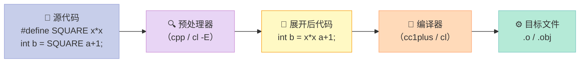
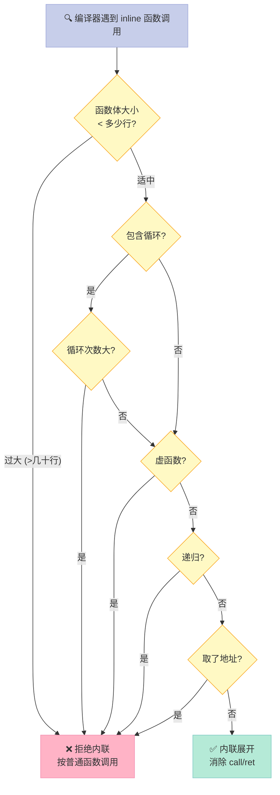
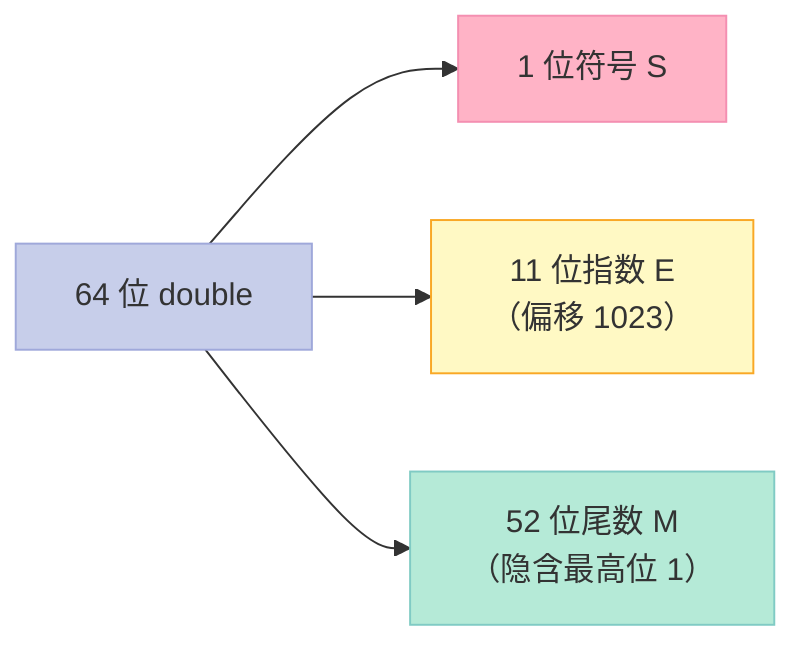
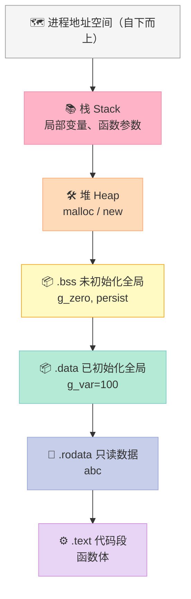
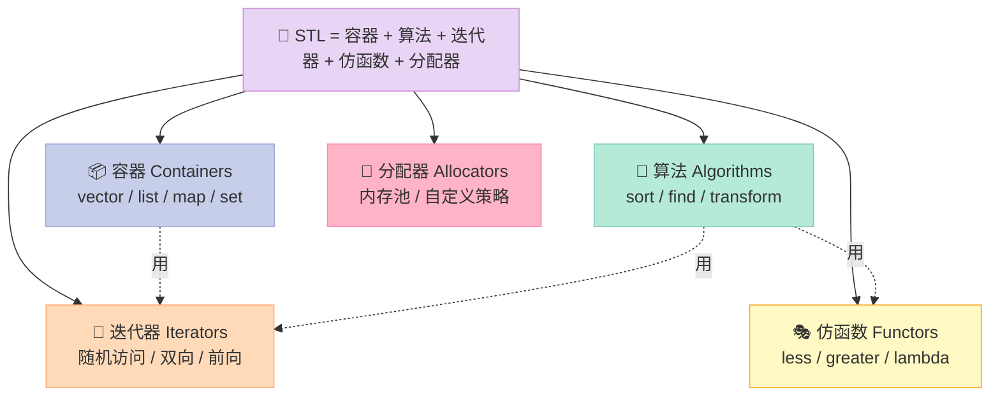
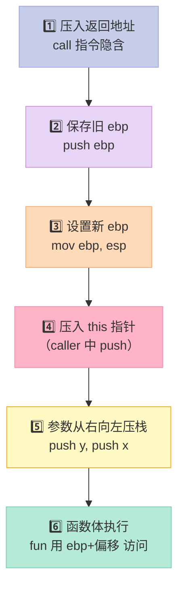
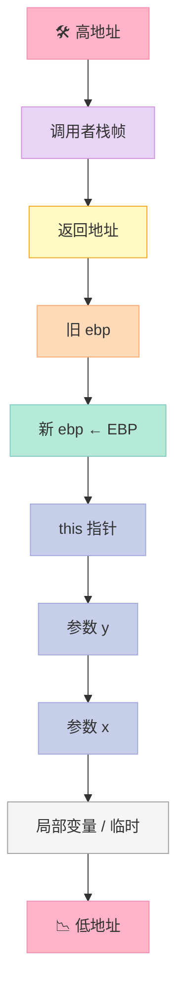
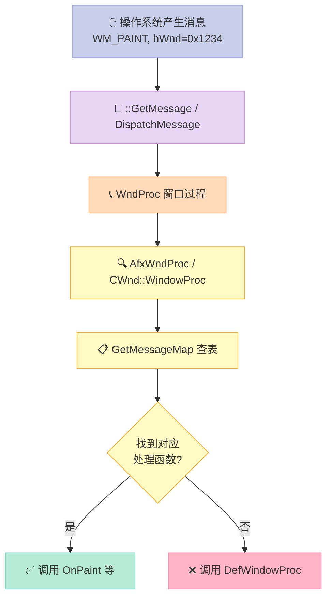

> 一行 `#define SQUARE(x) x*x` 在看似无害的外表下，藏着多少 bug？`inline` 真的比宏"高级"吗？空类为什么不是 0 字节？这一篇，我们把 C/C++ 里**最容易被忽略的预处理与类型细节**一次性讲透。

## 前言

面试中，宏（Macro）、`typedef`、`inline`、浮点数这一类问题看起来"很基础"，但越是基础就越能看出候选人有没有真的写过 C/C++。它们都是**语言层与编译器层之间的灰色地带**：

- **宏**：发生在**预处理阶段**（preprocessing），编译器看不到宏的痕迹
- **`typedef` / `using`**：发生在**编译阶段**（compilation），是真正的类型别名
- **`inline`**：发生在**编译阶段**，但对编译器只是"建议"
- **浮点数**：IEEE 754 标准决定了 `==` 几乎永远不可靠

这一篇是「C++ 面试题集锦」第 12 篇，覆盖了 14 道原书题目 + 7 个补充专题。读完本文，你将能：

- 看穿 `#define` 的 4 大副作用并写出**安全宏**
- 解释 `typedef` 与 C++11 `using` 的本质差异
- 说出 `inline` 函数的 5 条编译器决策规则
- 用 IEEE 754 解释 `0.1 + 0.2 != 0.3` 的来源
- 解释空类为何占 1 字节、`sizeof(空类)` 的全部情况
- 在并发场景下正确使用 `volatile`
- 看懂 MFC 消息映射宏的工作原理

---

## 一、从一个反常识的 bug 说起：`#define SQUARE(x) x*x` 为什么是错的？

我们先看一个看似正确的宏：

```cpp
#define SQUARE(x) x*x

int a = 3;
int b = SQUARE(a + 1);   // 期望 16，实际 7
```

展开后是：

```cpp
int b = a + 1 * a + 1;   // 1*a 后再加 a，等于 a + 4 = 7
```

**优先级灾难**。`*` 的优先级高于 `+`，整个表达式语义被悄悄改写。

把宏改成 "看似正确" 的版本：

```cpp
#define SQUARE(x) (x)*(x)

int b = SQUARE(a + 1);   // 19 = 4*4+3，OK
int c = 100 / SQUARE(2); // 期望 25，实际 100/(2)*(2) = 100
```

展开后是：

```cpp
int c = 100 / (2) * (2); // 50 * 2 = 100
```

**分母括号缺失**，优先级还是有问题。

再改进：

```cpp
#define SQUARE(x) ((x)*(x))

int c = 100 / SQUARE(2);  // 25，OK
int d = SQUARE(++a);      // a = 5，期望 25，实际 ((++a)*(++a)) = 6*6 = 36
```

**自增副作用**：`a` 被加了两次。

这就是宏的 4 大原罪：**无类型检查、无作用域、文本替换、副作用放大**。

### 1.1 宏的"罪状"清单

| 编号 | 坑 | 一句话说明 |
|------|------|------|
| 1 | 无类型检查 | 预处理阶段不查类型，能 `#define int ptr` |
| 2 | 优先级错乱 | 算符优先级悄悄改变表达式语义 |
| 3 | 副作用放大 | 参数被求值多次（`SQUARE(++a)`） |
| 4 | 调试困难 | 编译器看不到宏，调试器显示的是展开后的代码 |

### 1.2 一个"安全宏"的范本：`do { } while(0)`

如果你**不得不**写一个多语句宏，应该这样写：

```cpp
#define SAFE_FREE(p) do { free(p); p = NULL; } while(0)

char* buf = malloc(64);
if (buf) SAFE_FREE(buf);   // 展开后是一个完整的语句块

// 错误写法：
#define BUG_FREE(p) { free(p); p = NULL; }

if (buf)
    BUG_FREE(buf);
else
    puts("no buf");
// 展开后 else 找不到匹配的 if，编译失败
```

展开对比：

```cpp
// SAFE_FREE 展开
if (buf) do { free(p); p = NULL; } while(0);
else puts("no buf");

// BUG_FREE 展开（带分号）
if (buf) { free(p); p = NULL; };  // 多了一个分号
else puts("no buf");              // dangling else
```

`do { } while(0)` 既保证了**整体是一个表达式**，又允许末尾加分号，还能在 `if` 后安全使用。

---

## 二、`#define` 的 4 大坑：副作用、优先级、多行、token paste

这一节系统拆解宏的 4 类常见问题。

### 2.1 坑一：副作用（Side Effect）

```cpp
#define MAX(a, b) ((a) > (b) ? (a) : (b))

int x = 5, y = 10;
int z = MAX(x++, y++);
// 期望 z = 11，实际是 ((x++) > (y++) ? (x++) : (y++))
// y++ > x++?  先比较，y=11,x=6,比较时 y++返回10,x++返回5
// 5 > 10 为假，y++ 再执行一次，y=12
// z = 11, y = 12, x = 6
```

> **真实输出**：`z=11, x=6, y=12`。`y` 被自增了**两次**。

**修复**：C++ 永远用模板 + 内联函数代替：

```cpp
template <typename T>
inline T max_safe(T a, T b) { return a > b ? a : b; }

int x = 5, y = 10;
int z = max_safe(x++, y++);  // x=6, y=11, z=11，符合预期
```

### 2.2 坑二：优先级（Operator Precedence）

```cpp
#define DOUBLE(x) (x + x)

int a = 3, b = 4;
int c = DOUBLE(a & 0x0F);   // 期望 6
// 展开: (a & 0x0F + a & 0x0F)
// 按优先级: 0x0F + a = 0x12，再 & a = 0x02
// 实际是 2
```

**修复**：每个参数、整体都加括号：

```cpp
#define DOUBLE(x) ((x) + (x))
```

### 2.3 坑三：多行宏（Multi-line Macro）

```cpp
#define SWAP(a, b)  \
    int tmp = a;    \
    a = b;          \
    b = tmp;

// 错误用法
if (x < y) SWAP(x, y);   // 宏展开后会有 3 个独立的语句，if 只包住第 1 个
```

正确的多行宏：必须用 `do { } while(0)` 包住。

```cpp
#define SWAP(a, b) do {       \
    int tmp = (a);            \
    (a) = (b);                \
    (b) = tmp;                \
} while(0)
```

### 2.4 坑四：`#` 与 `##` 运算符（Stringizing & Token Pasting）

#### 2.4.1 `#`（字符串化）

把宏参数变成**带引号的字符串**：

```cpp
#define PRINT_INT(x) printf(#x " = %d\n", x)

int count = 42;
PRINT_INT(count);   // 展开: printf("count" " = %d\n", count)
                    // 输出: count = 42
```

常用于日志宏：

```cpp
#define LOG(level, msg) printf("[%s] " #msg "\n", level)
// LOG(ERROR, file not found);  -> printf("[%s] " "file not found" "\n", "ERROR")
```

#### 2.4.2 `##`（Token Paste）

把两个 token 粘成一个：

```cpp
#define CONCAT(a, b) a##b

int xy = 100;
printf("%d\n", CONCAT(x, y));   // 100
```

`##` 在代码生成、注册表、状态机里非常常见：

```cpp
#define REGISTER_HANDLER(id, fn) \
    void handler_##id() { fn(); }

REGISTER_HANDLER(click, on_click_event);  // 生成 handler_click()
REGISTER_HANDLER(key,   on_key_event);    // 生成 handler_key()
```

但 **`##` 的展开顺序是未指定的**，不同编译器行为不一致，慎用。

### 2.5 宏展开过程图



预处理是 C/C++ 编译流程的**第一关**，它只做"机械替换"，不做语义分析。

### 2.6 宏与函数的完整对比

| 维度 | 宏 (`#define`) | 普通函数 | `inline` 函数 |
|------|------|------|------|
| 发生阶段 | 预处理 | 编译/链接 | 编译 |
| 类型检查 | ❌ 无 | ✅ 有 | ✅ 有 |
| 调试可见 | ❌（看的是展开后代码） | ✅ | ✅ |
| 参数求值 | **多次**（副作用陷阱） | 1 次 | 1 次 |
| 代码体积 | 可能膨胀 | 不膨胀 | 可能膨胀（按调用点展开） |
| 作用域 | 无（C 风格全局） | 有 | 有 |
| 性能 | 无函数调用开销 | 有 call/ret | 无 call/ret（若真内联） |
| 可重载 | ❌ | ✅ | ✅ |
| 可取地址 | ❌ | ✅ | ✅ |
| 递归 | ❌ | ✅ | ❌（递归时不内联） |

> 一句话总结：**能用 `inline` / `template` 就别用宏**，宏只用于条件编译、字符串化、`##` 这类"语言无法表达"的场景。

---

## 三、`typedef` vs `using`（C++11）：类型别名的两种写法

### 3.1 `typedef`：C 时代的老兵

```cpp
typedef int Integer;                  // 简单别名
typedef int (*FuncPtr)(int, int);     // 函数指针
typedef struct { int x, y; } Point;   // 匿名 struct 别名
```

### 3.2 `using`：C++11 的现代写法

```cpp
using Integer = int;
using FuncPtr  = int(*)(int, int);
using Point    = struct { int x, y; };
```

两者在**简单场景**下完全等价。差异主要体现在**模板**上。

### 3.3 模板别名：typedef 的死穴

```cpp
template <typename T>
struct MyVec {
    typedef std::vector<T, MyAlloc<T>> type;
};

// 用法：typename MyVec<int>::type v;  // 累赘
```

C++11 的 `using` 解决了这个问题：

```cpp
template <typename T>
using MyVec = std::vector<T, MyAlloc<T>>;

MyVec<int> v;  // 简洁
```

### 3.4 `typedef` 与 `using` 对比表

| 维度 | `typedef` | `using` (C++11) |
|------|------|------|
| 出现年代 | C89 | C++11 |
| 模板别名 | ❌ 需包 struct + `::type` | ✅ 一行搞定 |
| 函数指针 | `typedef int (*F)(int);` | `using F = int(*)(int);` |
| 可读性 | 中（声明从左到右读） | 高（赋值语义，左是被声明名） |
| 与模板配合 | 笨拙 | 优雅 |
| 兼容性 | C/C++ 通用 | 仅 C++ |

### 3.5 实战：函数指针的两种写法

```cpp
// 用 typedef
typedef int (*CompareFn)(const void*, const void*);
int compare_int(const void* a, const void* b) { return *(int*)a - *(int*)b; }
CompareFn cmp = compare_int;
qsort(arr, n, sizeof(int), cmp);

// 用 using
using CompareFn = int (*)(const void*, const void*);
CompareFn cmp = compare_int;   // 一样用
```

> `using` 的可读性优势在**复杂类型**时尤其明显：

```cpp
// typedef: 从中间开始读
typedef int (*(*FuncPtrToArray)[10])(double);
// 读作: FuncPtrToArray 是 "指向 int(*[10])(double) 的指针"

// using: 左→右
using FuncPtrToArray = int (*(*)[10])(double);
```

---

## 四、`inline` 函数原理：编译器的"内联决策"

### 4.1 为什么需要 inline？

函数调用有开销：`call` 指令压栈 + `ret` 弹栈 + 寄存器保存。**短小函数**频繁调用时，开销占比可观。

`inline` 是给编译器的**建议**：把函数体直接展开到调用点，**消除 call/ret**。

### 4.2 inline 的 3 种形式

```cpp
// (1) 普通 inline：建议编译器内联，可被外部链接
inline int add(int a, int b) { return a + b; }

// (2) static inline：只在本翻译单元可见，强制内联倾向
static inline int sub(int a, int b) { return a - b; }

// (3) extern inline（C99 特性）：声明为外部定义，但实现可能在 .c 中
extern inline int mul(int a, int b);  // 不分配存储
```

C++ 里最常见的就是**普通 inline**，放在头文件里：

```cpp
// math_utils.h
inline int add(int a, int b) { return a + b; }
```

每个 `.cpp` 包含该头文件时，编译器**不报错"重复定义"**，因为 inline 函数遵循 ODR（One Definition Rule）的特殊版本：允许在多个翻译单元中定义，但所有定义必须相同。

### 4.3 编译器为什么不内联？5 大拒绝理由

| 理由 | 示例 | 原因 |
|------|------|------|
| 函数太大 | `inline void huge() { 1000 行 }` | 代码膨胀，缓存命中率下降 |
| 有循环 | `inline void loop() { for(int i=0;i<1000;i++) ... }` | 性能不一定提升 |
| 虚函数 | `inline virtual void f()` | 运行时才知调用哪个版本 |
| 递归 | `inline int fib(int n) { return n<2?n:fib(n-1)+fib(n-2); }` | 递归深度未知 |
| 取地址 | `void (*p)() = &add;` | 必须有函数实体地址 |

### 4.4 inline 内联决策图



### 4.5 验证 inline 真的被内联了

看汇编：

```bash
g++ -O2 -S test.cpp
# 或
g++ -O2 -c test.cpp && objdump -d test.o | grep add
```

```cpp
// test.cpp
#include <stdio.h>
inline int add(int a, int b) { return a + b; }

int main() {
    int x = add(3, 4);
    printf("x = %d\n", x);
    return 0;
}
```

`-O0` 时（无优化）：

```asm
call    _Z3addii   ; 调用 add
```

`-O2` 时（开了优化）：

```asm
lea     eax, [rdi+rsi]   ; 3+4 直接算出
```

内联生效后，**函数调用完全消失**。

### 4.6 `inline` vs `static inline` vs 模板

| 特性 | `inline` | `static inline` | 模板函数 |
|------|------|------|------|
| 链接性 | 外部（C++ 要求所有 TU 同一定义） | 内部（每个 TU 一份） | 外部（实例化时） |
| 头文件中 | ✅ 推荐 | ✅ 也可 | ✅ 必须 |
| 类型 | 固定 | 固定 | 任意 T |
| 调试符号 | 通常有 | 通常有 | 实例化时才有 |
| 适用场景 | 短小工具函数 | 文件局部辅助 | 通用算法 |

### 4.7 实战：用 inline 优化冒泡排序

普通版本：

```cpp
void bubble_sort(int* arr, int n) {
    for (int i = 0; i < n - 1; i++) {
        for (int j = 0; j < n - 1 - i; j++) {
            if (arr[j] > arr[j + 1]) {
                int t = arr[j];
                arr[j] = arr[j + 1];
                arr[j + 1] = t;
            }
        }
    }
}
```

调用 `bubble_sort` 一次就有 `O(n^2)` 次比较，每次比较又嵌套一层函数调用。优化思路：把**比较**和**交换**做成 inline：

```cpp
inline void swap_if_greater(int& a, int& b) {
    if (a > b) { int t = a; a = b; b = t; }
}

inline void bubble_sort_fast(int* arr, int n) {
    for (int i = 0; i < n - 1; i++)
        for (int j = 0; j < n - 1 - i; j++)
            swap_if_greater(arr[j], arr[j + 1]);  // 内联展开
}
```

`-O2` 下，编译器会把 `swap_if_greater` 直接展开为 `cmov` 指令，**消除 call 帧**。

---

## 五、浮点数：IEEE 754、精度丢失与比较

### 5.1 为什么 `0.1 + 0.2 != 0.3`？

```cpp
double a = 0.1, b = 0.2;
printf("%.17f\n", a + b);    // 0.30000000000000004
printf("%d\n",  a + b == 0.3); // 0
```

`0.1` 在二进制下是**无限循环小数**：`0.0001100110011001100...`。IEEE 754 把它截断到 52 位尾数，**再也无法精确表示**。

### 5.2 IEEE 754 双精度格式



数值的计算公式：

$$
(-1)^S \times 2^{E-1023} \times (1.M)
$$

### 5.3 三种浮点类型对比

| 类型 | 字节 | 符号位 | 指数位 | 尾数位 | 有效数字 | 范围（约） |
|------|------|------|------|------|------|------|
| `float` | 4 | 1 | 8 | 23 | 7 位 | ±3.4e+38 |
| `double` | 8 | 1 | 11 | 52 | 15-16 位 | ±1.8e+308 |
| `long double` (x86) | 16 | 1 | 15 | 64 | 19 位 | ±1.2e+4932 |

### 5.4 特殊值

| 形式 | 指数 | 尾数 | 值 |
|------|------|------|------|
| 零 | 0 | 0 | +0.0 / -0.0 |
| 次正规数 | 0 | 非 0 | 最小可表示的接近 0 的数 |
| 无穷 | 全 1 | 0 | +∞ / -∞ |
| NaN | 全 1 | 非 0 | Not a Number（0/0、√-1） |

### 5.5 浮点数比较的正确姿势

**绝对误差**（不推荐）：

```cpp
bool equal(double a, double b) {
    return fabs(a - b) < 1e-9;
}
```

**相对误差**（推荐）：

```cpp
bool nearly_equal(double a, double b, double rel_eps = 1e-9, double abs_eps = 1e-12) {
    double diff = fabs(a - b);
    if (diff < abs_eps) return true;                    // 处理 a,b 都接近 0
    return diff < rel_eps * fmax(fabs(a), fabs(b));    // 处理量级差异
}
```

> 来自 Google Test / Chromium 的 `NearlyEquals` 算法，同时考虑**绝对误差**和**相对误差**。

### 5.6 浮点数比较的 5 个反例

```cpp
// 反例 1：直接 ==
if (price == 0.1) { ... }   // 危险

// 反例 2：累加误差
double sum = 0;
for (int i = 0; i < 1000; i++) sum += 0.001;  // sum ≈ 1.0000000000000007

// 反例 3：循环终止条件
for (double x = 0; x != 1.0; x += 0.1) { ... }  // 死循环或早退

// 反例 4：货币计算
double money = 19.99;  // 实际是 19.989999999999998

// 反例 5：switch 的 case
switch (x) { case 0.1: ... }  // 0.1 的 case 永远不命中
```

> **货币必须用整数（cents）或定点数库**，如 `boost::multiprecision::cpp_dec_float_50`。

### 5.7 实战：Ulp（Unit of Last Place）比较

Ulp 是两个相邻浮点数之间的差，是 IEEE 754 下最精确的"距离度量"：

```cpp
#include <cmath>
#include <cstdint>

int64_t to_bits(double d) {
    int64_t bits;
    memcpy(&bits, &d, sizeof(bits));
    return bits;
}

bool ulp_equal(double a, double b, int ulp_tolerance = 4) {
    int64_t ba = to_bits(a), bb = to_bits(b);
    if ((ba < 0) != (bb < 0)) {           // 符号不同
        return a == b;                    // 只在都是 0 时相等
    }
    return std::abs(ba - bb) <= ulp_tolerance;
}
```

这是 Google Test 内部 `FloatEq` 的实现思路：允许 4 个 Ulp 内的差异。

---

## 六、空类大小：1 字节的来历与空基类优化 EBO

### 6.1 空类大小是多少？

```cpp
class Empty {};

std::cout << sizeof(Empty);   // GCC/Clang/MSVC 都是 1
```

**不是 0，是 1**。原因：C++ 标准要求**两个不同对象不能有相同地址**。如果大小是 0，`Empty e1, e2; &e1 == &e2` 就会成立。

### 6.2 sizeof 的所有情况

| 类型 | `sizeof` 结果 | 解释 |
|------|------|------|
| 空类 `Empty` | 1 | 占位，确保唯一地址 |
| 含一个 `int` 的类 | 4 | 成员变量大小 |
| 含 `int` + 1 字节 `char` | 8 | **内存对齐**到 4 字节倍数 |
| 含虚函数的类 | 8（64-bit） | `vptr` 指针 |
| 继承空类 | 0 / 1 | 涉及 EBO（见下） |
| 派生类含虚函数 | 8 | 基类 vptr + 派生 vptr（视编译器） |

### 6.3 实战：观察 sizeof

```cpp
#include <cstdio>

class Empty {};
class WithInt  { int x; };
class WithVC   { virtual void f() {} };
class WithAll  { int x; char c; };

int main() {
    printf("Empty    = %zu\n", sizeof(Empty));     // 1
    printf("WithInt  = %zu\n", sizeof(WithInt));   // 4
    printf("WithVC   = %zu\n", sizeof(WithVC));    // 8
    printf("WithAll  = %zu\n", sizeof(WithAll));   // 8（4 字节对齐，3+1 填充）
    return 0;
}
```

### 6.4 空基类优化 EBO（Empty Base Optimization）

当**空类作为基类**时，编译器可以优化为 0 字节：

```cpp
class Empty {};
struct Derived : Empty { int x; };

std::cout << sizeof(Derived);   // 4（而不是 5）
```

> C++ 标准允许但不强制 EBO。MSVC 不做 EBO，GCC/Clang 做。

EBO 在 STL 里大量使用，例如 `std::compressed_pair`：

```cpp
template <typename T1, typename T2>
class compressed_pair : private T1 {  // T1 可能是空类
    T2 second_;
};
// sizeof(compressed_pair<Empty, int>) == sizeof(int) == 4
```

### 6.5 静态成员变量不影响 sizeof

```cpp
class C {
    static int s;     // 不占对象空间
    int x;            // 占 4
};
sizeof(C) == 4;
```

### 6.6 成员函数不影响 sizeof

```cpp
class C {
    void f() {}      // 函数在代码段
    int x;           // 数据段
};
sizeof(C) == 4;
```

### 6.7 派生类的 sizeof 组成

```cpp
class Base  { int a; };                 // 4
class Mid   : Base  { int b; };         // 8（基类 4 + 派生 4）
class Top   : Mid   { int c; virtual void f(){}; }; // 16（vptr 8 + 数据 12 对齐到 16）
```

`sizeof` 计算规则：
1. 非静态成员变量大小
2. 内存对齐填充
3. 虚函数指针（如果有）
4. 继承自基类的数据成员

---

## 七、`volatile` 关键字：与编译器优化的"博弈"

### 7.1 问题的起源

```cpp
int flag = 0;

void wait() {
    while (flag == 0) { /* 死等 */ }
}

// 另一个线程 / 中断服务程序：
void isr() {
    flag = 1;
}
```

`gcc -O2` 下，编译器**会把 `flag` 缓存到寄存器**，因为循环里 `flag` 没被修改。所以即使 ISR 改了 `flag`，主循环也看不到。

**`volatile` 告诉编译器：每次访问都必须去内存读 / 写**，不要缓存到寄存器。

### 7.2 `volatile` 的 3 大使用场景

| 场景 | 原因 | 示例 |
|------|------|------|
| 中断服务程序与主循环共享 | 中断可能随时改值 | `volatile int tick = 0;` |
| 多线程共享标志位（**有限场景**） | 线程间需立即看到变化 | `volatile bool stop = false;` |
| 存储器映射的硬件寄存器 | 每次读写都有副作用 | `volatile uint32_t* GPIO = (volatile uint32_t*)0x40000000;` |

### 7.3 `volatile` 不等于线程同步

```cpp
volatile int counter = 0;

// 线程 A
for (int i = 0; i < 1000; i++) counter++;

// 线程 B
while (counter < 1000) { ... }
```

`volatile` **只保证可见性，不保证原子性**。`counter++` 是 3 条指令（读、加、写），并发下会丢更新。

**正确做法**用 `std::atomic`：

```cpp
#include <atomic>
std::atomic<int> counter(0);

// 线程 A
counter.fetch_add(1);   // 原子操作

// 线程 B
while (counter.load() < 1000) { ... }
```

### 7.4 `volatile` 与编译器优化

| 优化 | `volatile` 前 | `volatile` 后 |
|------|------|------|
| 寄存器缓存 | 循环内 `flag` 只读一次 | 每次循环都重新读内存 |
| 死代码消除 | `x = 1; x = 2;` 保留后者 | 两次写都保留 |
| 常量传播 | `x = 5; use(x)` 替换为 5 | `use(5)` 保持读内存 |

### 7.5 实战：内存映射寄存器

```cpp
// STM32 风格
#define GPIOA_ODR (*(volatile uint32_t *)0x40020014)

void led_on()  { GPIOA_ODR |= (1 << 5);  }   // BS5
void led_off() { GPIOA_ODR &= ~(1 << 5); }   // BR5
```

> 没有 `volatile`，编译器可能把"读-改-写"优化为只写，最终硬件电平错乱。

### 7.6 volatile 指针的两种写法

```cpp
volatile int* p1;       // 指针指向 volatile int（值可变，常见）
int* volatile p2;       // 指针本身是 volatile（指针变量不可缓存，罕见）
volatile int* volatile p3;  // 指针和值都 volatile
```

---

## 八、`cout` vs `printf`：缓冲区的本质区别

### 8.1 表面区别

| 维度 | `printf` | `cout` |
|------|------|------|
| 来源 | C 标准库 | C++ 标准库 |
| 类型检查 | 编译时格式串校验 | 编译时重载选择 |
| 缓冲 | **行缓冲**（`stdout`） | **全缓冲**（默认） |
| 扩展性 | 需格式串 | 操作符重载支持自定义类型 |
| 多线程安全 | C11 后可选 | C++98 以来由实现保证（多数安全） |

### 8.2 缓冲区的本质

`printf` 写到 `stdout`，`stdout` 默认是**行缓冲**（终端）或**全缓冲**（重定向到文件）。
`cout` 关联到 `stdout`，但**默认是全缓冲**。

```cpp
printf("a");
std::cout << "b";
// 此时可能什么都没输出，数据在缓冲区
```

### 8.3 强制刷新的 4 种方式

```cpp
// 方式 1：换行 + 行缓冲（仅 printf 在终端时有效）
printf("a\n");

// 方式 2：cout + endl = 输出换行 + 刷新
std::cout << "a" << std::endl;

// 方式 3：cout + flush
std::cout << "a" << std::flush;

// 方式 4：cout + \n（注意：不会自动刷新！与 printf 行为不同）
std::cout << "a\n";  // 数据可能仍在缓冲区
```

### 8.4 混用的潜在 bug

```cpp
printf("1");
std::cout << "2";
abort();   // 崩溃时缓冲区未刷新，输出丢失
```

调试崩溃问题时容易踩坑。**生产代码务必刷新**：

```cpp
printf("1\n");             // 显式换行
std::cout << "2" << std::endl;  // 显式刷新
```

### 8.5 cout 的运算符重载魔法

```cpp
std::cout << 42;        // operator<<(ostream&, int)
std::cout << "hi";      // operator<<(ostream&, const char*)
std::cout << vec;       // 自定义类型可以重载 operator<<
```

`<<` 本质是**重载函数调用**，类型由编译器在编译期决定。

---

## 九、隐式转换：4 大场景与消除方法

### 9.1 隐式转换的 4 大场景

| 场景 | 示例 | 风险 |
|------|------|------|
| 基本类型提升 | `char` → `int`，`int` → `double` | 精度丢失 |
| 子类到父类 | `Derived*` → `Base*` | 切片（值类型） |
| 单参数构造函数 | `string s = "hi";` | 意料外的隐式转换 |
| 转换运算符 | `operator bool()` | 隐式 bool 转换 |

### 9.2 转换的方向：小 → 大

```cpp
char c = 'A';      // 65
int i = c;         // 65，无损
double d = i;      // 65.0，无损
int j = d;         // 65，但 d = 65.7 时丢精度
```

### 9.3 消除隐式转换：`explicit` 关键字

```cpp
class String {
    char* data_;
public:
    String(int size);                   // 危险：可隐式调用
    explicit String(const char* s);     // 必须显式调用
};

void f(String s);

f(10);          // 编译通过，调用 String(10)，语义不清
f("hi");        // 编译失败，必须 f(String("hi"))
f(String("hi")); // OK
```

> **C++ 经验法则**：单参数构造函数**几乎都应该**加 `explicit`（C++11 之前是多参数构造不会被隐式调用）。

### 9.4 C++11 的统一转换运算符

```cpp
class Handle {
    HANDLE h_;
public:
    explicit operator bool() const {  // C++11 之前是 operator bool()
        return h_ != INVALID_HANDLE_VALUE;
    }
};

Handle h;
if (h) { ... }              // OK，bool 上下文允许
int x = h;                  // 错误
int y = (int)h;             // 错误，必须 static_cast<bool>(h)
```

`explicit operator bool` 解决了"无意的整数转换"问题。

### 9.5 4 种类型转换运算符

| 运算符 | 用途 | 安全性 |
|------|------|------|
| `static_cast` | 相关类型转换（数值、向上转型） | 中 |
| `const_cast` | 去掉 const / volatile | 低（破坏契约） |
| `reinterpret_cast` | 比特级重解释（指针 ↔ 整数） | 极低 |
| `dynamic_cast` | 多态类型的向下转型 | 高（运行时 RTTI） |

```cpp
double d = 3.14;
int i = static_cast<int>(d);                     // 3

const int* cp = &i;
int* p = const_cast<int*>(cp);                    // 去 const

uintptr_t addr = reinterpret_cast<uintptr_t>(p);  // 指针 → 整数

Base* bp = new Derived;
Derived* dp = dynamic_cast<Derived*>(bp);         // 运行时检查
```

---

## 十、局部/静态/全局变量：作用域、生命周期、内存分布

### 10.1 三种变量的核心区别

| 维度 | 局部变量 | 静态局部变量 | 全局变量 |
|------|------|------|------|
| 作用域 | 所在块 `{}` | 所在块 `{}` | 整个程序 |
| 生命周期 | 所在块 | 整个程序 | 整个程序 |
| 内存位置 | 栈 | 数据段（`.bss` / `.data`） | 数据段 |
| 默认初值 | 未定义 | 0 | 0 |
| 线程安全 | 各线程独立 | 共享（需同步） | 共享（需同步） |

### 10.2 实战：观察三者的差异

```cpp
#include <cstdio>

int g_var = 100;             // 全局，初始化在 .data
int g_zero;                  // 全局，零初始化在 .bss

void counter() {
    int local = 0;           // 局部，每次调用新建
    static int persist = 0;  // 静态局部，只初始化一次
    local++;
    persist++;
    printf("local=%d persist=%d\n", local, persist);
}

int main() {
    counter();   // local=1 persist=1
    counter();   // local=1 persist=2
    counter();   // local=1 persist=3
    return 0;
}
```

### 10.3 局部变量屏蔽全局变量

```cpp
int x = 100;     // 全局

void f() {
    int x = 5;   // 局部，屏蔽全局
    printf("%d\n", x);     // 5
    printf("%d\n", ::x);   // 100，用 :: 显式访问全局
}
```

### 10.4 全局变量的声明与定义

```cpp
// globals.h
extern int counter;   // 声明（不分配内存）

// main.cpp
#include "globals.h"
int counter = 0;      // 定义（分配内存）
```

> **`extern` 表示"声明"而非"定义"**，常用于头文件中。

### 10.5 静态全局变量 vs 普通全局变量

```cpp
// file1.cpp
static int file1_only = 100;  // 文件作用域，外部不可见
int visible_everywhere = 200; // 外部链接，其他文件可访问
```

用 `static` 修饰全局变量 = **内部链接**，仅本 `.cpp` 可见，**不污染全局命名空间**。

### 10.6 内存分布图



---

## 十一、C++ 标准演进：C++98 → C++23

### 11.1 标准与年份对照

| 标准 | 年份 | 主要特性 |
|------|------|------|
| C++98 | 1998 | STL 成型、模板、RTTI、异常 |
| C++03 | 2003 | 修订（无大特性） |
| C++11 | 2011 | auto、lambda、右值引用、move、constexpr、智能指针 |
| C++14 | 2014 | 泛型 lambda、二进制字面量、digit separator |
| C++17 | 2017 | if constexpr、structured binding、std::optional、filesystem |
| C++20 | 2020 | concepts、coroutine、ranges、modules、consteval |
| C++23 | 2023 | expected、deducing this、mdspan、flat_map |

### 11.2 实战：写一个跨标准的 hello

```cpp
// C++98
std::vector<int> v;
for (std::vector<int>::iterator it = v.begin(); it != v.end(); ++it) { ... }

// C++11
for (auto it = v.begin(); it != v.end(); ++it) { ... }

// C++17
for (auto& [key, value] : my_map) { ... }  // structured binding
```

### 11.3 标准库是什么？

C++ 标准库由两部分组成：

| 类别 | 内容 | 例子 |
|------|------|------|
| **标准函数库** | 通用独立函数，继承自 C | `printf`, `strlen`, `malloc` |
| **面向对象类库** | 类和相关函数 | `std::string`, `std::vector` |

更细分：

| 子库 | 内容 | 头文件 |
|------|------|------|
| I/O | 流、文件、字符串流 | `<iostream>`, `<fstream>`, `<sstream>` |
| 字符串 | string、string_view | `<string>` |
| 容器 | vector、map、unordered_map | `<vector>`, `<map>`, `<unordered_map>` |
| 算法 | sort、find、transform | `<algorithm>` |
| 数值 | complex、valarray、random | `<complex>`, `<random>` |
| 内存 | unique_ptr、shared_ptr、allocator | `<memory>` |
| 多线程 | thread、mutex、future | `<thread>`, `<mutex>`, `<future>` |
| 时间 | chrono | `<chrono>` |

### 11.4 STL 体系结构



> STL 的设计哲学：**容器与算法通过迭代器解耦**，仿函数提供策略，分配器管理内存。

---

## 十二、空类会默认添加哪些东西？

```cpp
class Empty {};
```

编译器**默默**为它生成 4 个特殊成员函数：

| 编译器生成的函数 | 签名 | 默认实现 |
|------|------|------|
| 默认构造函数 | `Empty();` | 空 |
| 拷贝构造函数 | `Empty(const Empty&);` | 逐成员拷贝 |
| 移动构造函数 (C++11) | `Empty(Empty&&);` | 逐成员 move |
| 拷贝赋值运算符 | `Empty& operator=(const Empty&);` | 逐成员赋值 |
| 移动赋值运算符 (C++11) | `Empty& operator=(Empty&&);` | 逐成员 move |
| 析构函数 | `~Empty();` | 空 |

### 12.1 实战：验证编译器生成了什么

```cpp
class Empty {};

int main() {
    Empty a;
    Empty b(a);       // 拷贝构造
    Empty c = a;      // 拷贝构造（初始化）
    b = a;            // 拷贝赋值
    Empty d(std::move(a));  // 移动构造 (C++11)
    return 0;
}
```

`sizeof(Empty)` 是 1，但**成员函数不占空间**——它们在代码段。

### 12.2 显式写出空类的 4 大函数（C++11 之前）

```cpp
class Empty {
public:
    Empty() {}                              // 默认构造
    Empty(const Empty&) {}                 // 拷贝构造
    ~Empty() {}                             // 析构
    Empty& operator=(const Empty&) {        // 拷贝赋值
        return *this;
    }
};
```

### 12.3 阻止自动生成：`= delete`

```cpp
class NonCopyable {
public:
    NonCopyable() = default;
    NonCopyable(const NonCopyable&) = delete;             // 禁止拷贝
    NonCopyable& operator=(const NonCopyable&) = delete;  // 禁止赋值
};

NonCopyable a, b;
NonCopyable c = a;   // 编译错误
```

`= delete` 比"声明为 private"更友好——**编译期报错信息更清晰**。

---

## 十三、静态函数能定义为虚函数吗？常函数呢？

### 13.1 静态成员函数 vs 虚函数

| 维度 | 静态成员函数 | 虚函数 |
|------|------|------|
| 是否有 `this` 指针 | ❌ | ✅ |
| 调用方式 | `Class::func()` | `obj->func()` |
| 能否 virtual | ❌ | ✅（本来就是） |
| 多态 | ❌ | ✅ |
| 内存 | 不占对象空间 | 占用 vptr + vtable |

**结论**：**静态函数不能是虚函数**。原因：虚函数依赖 `this->vptr` 找到 vtable，而静态函数没有 `this`。

```cpp
class Base {
public:
    static virtual void f();   // 编译错误
    virtual static void g();   // 编译错误
};
```

### 13.2 常函数 vs 虚函数

```cpp
class Base {
public:
    virtual void f() const;   // ✅ 合法
};
```

**常函数可以是虚函数**。`const` 修饰的是 `this` 指向的对象，虚函数表里依然有它的位置。

```cpp
class Base {
public:
    virtual void f() const { std::cout << "Base const\n"; }
};

class Derived : public Base {
public:
    void f() const override { std::cout << "Derived const\n"; }
};

Base* p = new Derived;
p->f();   // "Derived const"
```

派生类的常函数可以**覆盖**基类的常函数，**但不能与基类的非 const 虚函数互替**。

### 13.3 常函数 vs 同名非 const 函数

```cpp
class Text {
    std::string s_;
public:
    const char& operator[](size_t i) const  { return s_[i]; }     // 读
    char&       operator[](size_t i)        { return s_[i]; }     // 写
};
```

`const` 重载允许**只读 vs 可写**两个版本，是 STL 容器的常见模式。

---

## 十四、`this` 指针调用成员变量时，堆栈的变化

### 14.1 调用约定的 5 个步骤

以 `obj.fun(x, y)` 为例（x86 栈帧）：



### 14.2 栈帧结构图



### 14.3 反汇编示例

```cpp
class C {
    int x_;
public:
    void set(int v) { x_ = v; }
};
C obj;
obj.set(42);
```

```asm
push    42                    ; 参数 v 压栈
lea     rax, [rbp-16]         ; 取 obj 地址
mov     rdi, rax              ; this 指针传入 rdi（System V ABI）
call    C::set
```

> x86-64 System V ABI 下，`this` 用 `rdi` 传递，参数从 `rsi`、`rdx` 等开始。

### 14.4 this 指针的生命周期

| 时刻 | this 指向 |
|------|------|
| 构造函数执行前 | 已分配但未初始化的对象 |
| 构造函数体内 | 完全构造好的对象 |
| 析构函数体内 | 即将销毁的对象（成员未析构） |
| 析构函数执行后 | 已释放的内存（**不可用**） |

`delete this` 后再用 this 指针 = 未定义行为。

---

## 十五、`return a > b ? a : b;` 的 5 个隐藏细节

### 15.1 类型推导规则

```cpp
auto result = a > b ? a : b;
```

| `a` 类型 | `b` 类型 | `result` 类型 |
|------|------|------|
| `int` | `int` | `int` |
| `int` | `double` | `double`（普通算术转换） |
| `int` | `char` | `int` |
| `const char*` | `std::string` | `std::string`（必须可转换） |
| `Base*` | `Derived*` | `Base*`（指针转换） |

### 15.2 实战：三目运算符的类型陷阱

```cpp
int a = 5;
double b = 5.5;
auto x = a > b ? a : b;  // double，a 隐式转为 double

const char* s1 = "abc";
std::string s2 = "def";
auto s3 = true ? s1 : s2;   // 错误：const char* 与 string 无公共类型
auto s4 = true ? std::string(s1) : s2;  // 正确
```

### 15.3 三目运算符 vs if-else

```cpp
// 三目：表达式，可以作为右值
int m = (a > b) ? a : b;

// if-else：语句，不能直接作为右值
int m;
if (a > b) m = a;
else       m = b;
```

C++17 引入了 `if` 初始化语句，部分场景可以替代三目：

```cpp
if (auto m = max(a, b); m > 100) { ... }
```

### 15.4 模板版的 max

```cpp
template <typename T1, typename T2>
auto max_generic(T1 a, T2 b) -> decltype(a > b ? a : b) {
    return a > b ? a : b;
}

int main() {
    printf("%f\n", max_generic(5.5, 'a'));   // 102.500000
    printf("%d\n", max_generic(3, 4));       // 4
}
```

> C++14 之后可以省略尾置返回类型：`auto max_generic(T1 a, T2 b) { return a > b ? a : b; }`

### 15.5 三目运算符的求值顺序

```cpp
int x = f();  // 副作用
int y = g();
int m = x > y ? x : y;
```

C++17 之前，**三目运算符的求值顺序未指定**——`x` 和 `y` 谁先求值依赖于编译器。
C++17 之后，**类似函数调用，按顺序求值**（从左到右）。

---

## 十六、MFC 消息处理如何封装？（Windows 消息映射）

### 16.1 朴素的消息处理

最原始的 Win32 程序里，每个窗口类都需要 `switch-case`：

```cpp
LRESULT CALLBACK WndProc(HWND hWnd, UINT msg, WPARAM wParam, LPARAM lParam) {
    switch (msg) {
        case WM_CREATE:  /* ... */ break;
        case WM_PAINT:   /* ... */ break;
        case WM_CLOSE:   /* ... */ break;
        case WM_DESTROY: /* ... */ break;
    }
    return DefWindowProc(hWnd, msg, wParam, lParam);
}
```

问题：
- 业务代码和窗口类耦合
- 类多时代码冗长
- 难以扩展自定义消息

MFC 用**消息映射宏**解决了这个问题。

### 16.2 MFC 消息映射的 3 个核心宏

```cpp
class CMyWnd : public CWnd {
    DECLARE_MESSAGE_MAP()       // 1. 声明消息映射

public:
    afx_msg void OnPaint();     // 2. 消息处理函数声明
    afx_msg void OnClose();
    afx_msg int  OnCreate(LPCREATESTRUCT lpCreateStruct);

    DECLARE_DYNAMIC(CMyWnd)     // 支持运行时类型信息
};

// 源文件
BEGIN_MESSAGE_MAP(CMyWnd, CWnd) // 3. 消息映射表开始
    ON_WM_PAINT()
    ON_WM_CLOSE()
    ON_WM_CREATE()
END_MESSAGE_MAP()              // 消息映射表结束
```

### 16.3 宏展开后的真实结构

```cpp
// DECLARE_MESSAGE_MAP 展开
protected:
    static const AFX_MSGMAP* PASCAL GetThisMessageMap();
    virtual const AFX_MSGMAP* GetMessageMap() const;
    static const AFX_MSGMAP_ENTRY _messageEntries[];

// BEGIN_MESSAGE_MAP 展开
const AFX_MSGMAP* PASCAL CMyWnd::GetThisMessageMap() {
    return &CMyWnd::messageMap;
}
const AFX_MSGMAP* CMyWnd::GetMessageMap() const {
    return &CMyWnd::messageMap;
}
AFX_COMDAT const AFX_MSGMAP CMyWnd::messageMap = {
    &CWnd::messageMap,        // 父类的消息映射
    &CMyWnd::_messageEntries[0]
};
const AFX_MSGMAP_ENTRY CMyWnd::_messageEntries[] = {
    { WM_PAINT, 0, 0, 0, (AFX_PMSG)&OnPaint },
    { WM_CLOSE, 0, 0, 0, (AFX_PMSG)&OnClose },
    { WM_CREATE, 0, 0, 0, (AFX_PMSG)&OnCreate },
    { 0, 0, 0, 0, (AFX_PMSG)0 }   // 哨兵
};
```

### 16.4 消息分发流程



### 16.5 消息映射的本质：函数指针表

```cpp
struct AFX_MSGMAP_ENTRY {
    UINT   nMessage;     // 消息 ID
    UINT   nCode;        // 控制码
    UINT   nID;          // 控件 ID
    UINT   nLastID;      // 范围结束
    AFX_PMSG pfn;        // 消息处理函数指针
};

struct AFX_MSGMAP {
    const AFX_MSGMAP* pBaseMap;       // 父类消息映射
    const AFX_MSGMAP_ENTRY* lpEntries; // 本类消息条目
};
```

查找过程是**线性扫描**（消息表不大时够用），命中就调用对应函数指针，未命中就交给 `pBaseMap`（父类）的表。

### 16.6 自定义消息

```cpp
#define WM_MY_MSG (WM_USER + 100)

class CMyWnd : public CWnd {
    afx_msg LRESULT OnMyMsg(WPARAM w, LPARAM l);
    DECLARE_MESSAGE_MAP()
};

BEGIN_MESSAGE_MAP(CMyWnd, CWnd)
    ON_MESSAGE(WM_MY_MSG, &OnMyMsg)
END_MESSAGE_MAP()

LRESULT CMyWnd::OnMyMsg(WPARAM w, LPARAM l) {
    return 0;
}
```

### 16.7 现代替代品

| 时代 | 方案 |
|------|------|
| 1995 | MFC 消息映射宏 |
| 2000 | WTL / ATL 模板 |
| 2010 | Qt 信号槽（`connect`） |
| 2020 | C++20 信号库提案（未进标准） |

> 在跨平台 UI 框架（Qt、wxWidgets、Flutter）主导的今天，MFC 消息映射主要是**面试考点**和**遗留代码维护**用途。

---

## 十七、`#define` vs `const` vs `typedef` vs `inline` 终极对比

| 维度 | `#define` | `const` | `typedef` | `inline` |
|------|------|------|------|------|
| 本质 | 预处理文本替换 | 常量变量 | 类型别名 | 函数 |
| 阶段 | 预处理 | 编译 | 编译 | 编译 |
| 类型检查 | ❌ | ✅ | ✅ | ✅ |
| 作用域 | 无（文件级） | 有（块级） | 有 | 有 |
| 调试可见 | ❌ | ✅ | ✅ | ✅ |
| 可取地址 | ❌ | ✅ | — | ✅ |
| 占用空间 | 代码段 | 数据段 | — | 代码段（按调用点展开） |
| 可重载 | ❌ | ❌ | ❌ | ✅ |
| C++11 替代 | `inline` / `template` | — | `using` | — |
| 适用场景 | 条件编译、平台适配、字符串化 | 真正不可变的常量 | 跨平台类型别名 | 短小函数 |

> 一句话总结：**新代码一律用 `const` / `using` / `inline`**，宏留给"语言表达不了"的场景。

---

## 十八、实战：用 `inline` 重写 `MAX` / `MIN` 宏

### 18.1 不安全的宏版本

```cpp
#define MAX(a, b) ((a) > (b) ? (a) : (b))
#define MIN(a, b) ((a) < (b) ? (a) : (b))

// 问题
int x = 5, y = 10;
int z = MAX(x++, y++);   // y 增两次
```

### 18.2 安全的 inline 模板版本

```cpp
template <typename T>
inline const T& max_safe(const T& a, const T& b) {
    return a > b ? a : b;
}

template <typename T>
inline const T& min_safe(const T& a, const T& b) {
    return a < b ? a : b;
}

int x = 5, y = 10;
int z = max_safe(x++, y++);   // x=6, y=11, z=11
```

### 18.3 C++14 进一步简化（auto）

```cpp
template <typename T, typename U>
inline auto max_auto(T a, U b) { return a > b ? a : b; }

printf("%f\n", max_auto(5.5, 'a'));   // 102.5
```

### 18.4 异构类型比较

```cpp
// C++11：通用 lambda
auto max3 = [](auto a, auto b) { return a > b ? a : b; };

std::cout << max3(3, 4.5) << "\n";   // 4.5
std::cout << max3(std::string("a"), std::string("bb")) << "\n";  // "bb"
```

### 18.5 性能对比

| 方案 | 函数调用开销 | 编译器优化友好 | 类型安全 |
|------|------|------|------|
| `#define MAX(a,b) ...` | 0（已展开） | ⚠️ 难 | ❌ |
| `inline T max_safe(T a, T b)` | 0（常被内联） | ✅ 友好 | ✅ |
| 普通函数 `T max_fn(T a, T b)` | 有 call/ret | ✅ 友好 | ✅ |

---

## 十九、深度话题：宏的"超能力"

### 19.1 防止头文件重复包含

```cpp
// my_header.h
#ifndef MY_HEADER_H
#define MY_HEADER_H

// 头文件内容
void foo();
int bar();

#endif
```

或用 `#pragma once`（编译器扩展，GCC/Clang/MSVC 都支持）：

```cpp
// my_header.h
#pragma once
void foo();
int bar();
```

### 19.2 平台适配

```cpp
#ifdef _WIN32
    #define PATH_SEP '\\'
    #include <windows.h>
#elif defined(__linux__)
    #define PATH_SEP '/'
    #include <unistd.h>
#endif
```

### 19.3 调试开关

```cpp
#define DEBUG_LOG(fmt, ...) printf("[DEBUG] " fmt "\n", ##__VA_ARGS__)

DEBUG_LOG("count = %d", count);   // [DEBUG] count = 42
```

`##__VA_ARGS__` 处理"零参数"的特殊情况：

```cpp
DEBUG_LOG("hello");  // 展开为 printf("hello\n")
// 没有 ## 会是 printf("hello" , )，多余逗号
```

### 19.4 编译时断言：`static_assert`

C++11 之前用宏：

```cpp
#define COMPILE_TIME_ASSERT(expr) \
    typedef char dummy[(expr) ? 1 : -1]

struct Foo { int x; };
COMPILE_TIME_ASSERT(sizeof(Foo) == 4);   // OK
```

C++11 之后用 `static_assert`：

```cpp
static_assert(sizeof(Foo) == 4, "Foo must be 4 bytes");
```

> **现代 C++ 永远用 `static_assert`**，宏版本是历史包袱。

---

## 二十、易混淆点：5 个面试常考的"对比题"

### 20.1 `#define` vs `const`

| 问题 | `#define PI 3.14` | `const double PI = 3.14;` |
|------|------|------|
| 调试 | 看不到 PI | 可以看 |
| 类型 | 无 | double |
| 内存 | 多个 PI 副本 | 1 个 PI（取地址时） |
| 重定义 | `#undef` 后可重定义 | 不能重定义 |
| 防止重复包含 | ✅ | ❌（用头文件 guard） |

### 20.2 `typedef` vs `#define`

```cpp
#define INTPTR int*
typedef int* IntPtr;

INTPTR a, b;       // a 是 int*, b 是 int（宏展开）
IntPtr c, d;       // c, d 都是 int*（typedef 整体性）
```

### 20.3 `inline` vs 普通函数 vs 模板

| 维度 | inline | 普通函数 | 模板 |
|------|------|------|------|
| 类型 | 固定 | 固定 | 任意 |
| 文件位置 | 头文件 | 源文件 | 头文件 |
| 实例化 | 编译时 | 编译时 | 调用时 |
| 代码膨胀 | 可能 | 不会 | 可能 |

### 20.4 虚函数 vs 纯虚函数

| 维度 | 虚函数 | 纯虚函数 |
|------|------|------|
| 语法 | `virtual void f();` | `virtual void f() = 0;` |
| 实现 | 有默认实现 | 没有实现（接口） |
| 类能否实例化 | ✅ | ❌（抽象类） |
| 派生类必须实现 | ❌ | ✅（否则仍为抽象类） |

### 20.5 `nullptr` vs `NULL` vs `0`

| 写法 | 类型 | 适用 |
|------|------|------|
| `NULL` | 宏，可能是 `(void*)0` 或 `0` | C |
| `0` | `int` | C/C++（不推荐） |
| `nullptr` | `std::nullptr_t` | C++11+（推荐） |

```cpp
void f(int)   { puts("int"); }
void f(char*) { puts("ptr"); }

f(NULL);    // 调用 f(int)，多数情况
f(nullptr); // 明确调用 f(char*)
```

---

## 二十一、面试经典追问

### 21.1 Q：虚函数可以是 inline 吗？

**答**：可以，但不推荐。

```cpp
class Base {
public:
    virtual void f() { /* ... */ }   // 隐式 inline 倾向
};
```

虚函数本身**可以**内联，前提是：
- 编译器能静态确定对象的动态类型
- 例如 `Base b; b.f();` 时能内联

通过指针或引用调用时，**不会**内联（运行时才知道调哪个版本）。

### 21.2 Q：构造函数可以是 virtual 吗？

**答**：**不能**。

```cpp
class Base {
    virtual Base() {}   // 编译错误
};
```

原因：vptr 在构造函数中初始化。如果构造函数是 virtual，调用它需要 vptr，但 vptr 还没初始化——**先有鸡还是先有蛋**。

### 21.3 Q：析构函数可以是 virtual 吗？什么时候必须是？

**答**：可以，**且当类用作多态基类时必须是**。

```cpp
class Base {
public:
    virtual ~Base() = default;   // 必须 virtual
};

class Derived : public Base {
    int* data_;
public:
    Derived() : data_(new int[100]) {}
    ~Derived() { delete[] data_; }
};

Base* p = new Derived;
delete p;   // 如果 ~Base 不是 virtual，只调 Base::~Base，data_ 泄漏
```

### 21.4 Q：空类数组的大小？

```cpp
class Empty {};
Empty arr[10];
sizeof(arr);   // 10（每个 1 字节占位）
```

> 数组大小 = `元素大小 × 数量`。

### 21.5 Q：sizeof 在编译期还是运行期？

**答**：**编译期常量**。`sizeof` 是运算符，编译时已知。

```cpp
char buf[sizeof(int) * 1024];   // 合法，编译期常量
```

### 21.6 Q：析构函数能抛出异常吗？

**答**：**不应该**。

```cpp
class Bad {
    ~Bad() { throw 1; }
};
Bad b;
{
    // ...
}   // 析构时抛异常，std::terminate 被调用
```

> 析构期间栈展开若又遇到异常，C++ 直接 `std::terminate` 终止程序。

---

## 二十二、给 C++ 学习的建议

读完这一篇，你已经触及了 C++ 中**最容易被忽视的底层细节**。我的建议是：

1. **永远用 `inline` / `template` 代替宏**：除非需要 `#`、`##`、条件编译
2. **单参数构造函数加 `explicit`**：杜绝意外的类型转换
3. **浮点比较用相对误差**：参考 Google Test 的实现
4. **并发用 `std::atomic`，不要把 `volatile` 当同步原语**
5. **多态基类析构函数加 `virtual`**：避免内存泄漏
6. **理解 C++ 标准的演进**：面试时能说出"这是 C++11 的特性"会很加分

### 三个值得深入的方向

| 方向 | 推荐资源 |
|------|------|
| C++ 对象模型 | 《深度探索 C++ 对象模型》侯捷 |
| STL 源码 | 侯捷《STL 源码剖析》 |
| 现代 C++ | 《Effective Modern C++》Scott Meyers |

### 思考题

1. **`#include` 尖括号和双引号有什么区别？**编译器搜索路径如何？
2. **`#pragma once` 和 `#ifndef` 哪个更好？**为什么？
3. **`new` 关键字和 `operator new` 函数有什么区别？**
4. **为什么 `std::string` 的 `c_str()` 返回 `const char*` 而不是 `char*`？**
5. **用 `inline` 替代宏后，C++ 还能用 `__FILE__`、`__LINE__` 这些宏吗？**

---

## 系列导航

> 「C++ 面试题集锦」系列共 16 篇，本文是第 12 篇。点击下方链接查看同系列其他文章。

| 篇数 | 标题 | 链接 |
|------|------|------|
| 第 1 篇 | C++ 基础语法与面向对象 | [查看](#) |
| 第 2 篇 | 关键字专题：const / volatile / static | [查看](#) |
| 第 3 篇 | 内存管理：new / delete / 智能指针 | [查看](#) |
| 第 4 篇 | 继承与多态：虚函数、菱形继承、对象模型 | [查看](#) |
| 第 5 篇 | 模板与泛型编程 | [查看](#) |
| 第 6 篇 | STL 容器与算法 | [查看](#) |
| 第 7 篇 | C++11 新特性：右值引用、lambda、智能指针 | [查看](#) |
| 第 8 篇 | C++14/17 新特性：if constexpr、optional、filesystem | [查看](#) |
| 第 9 篇 | C++20/23 新特性：concepts、coroutine、ranges | [查看](#) |
| 第 10 篇 | 编译与链接：预处理、目标文件、静态库 | [查看](#) |
| 第 11 篇 | 内存模型与进程 / 线程 | [查看](#) |
| **第 12 篇** | **宏、typedef、inline、浮点数、空类细节** | **本文** |
| 第 13 篇 | 异常处理与 RAII | [查看](#) |
| 第 14 篇 | 操作系统相关：进程、线程、调度 | [查看](#) |
| 第 15 篇 | 网络编程：socket、epoll、reactor | [查看](#) |
| 第 16 篇 | 性能优化与调试技巧 | [查看](#) |

---

> 下一篇预告：**第 13 篇：异常处理与 RAII**——为什么现代 C++ 推荐用 RAII 代替 try-catch？`noexcept` 关键字的本质是什么？`std::expected` 如何替代异常？我们将深入 C++ 的错误处理哲学。
