> **一句话结论**：进程是资源分配的最小单位，线程是 CPU 调度的最小单位，协程是用户态调度的最小单位。理解 fork/exec、IPC、死锁四条件、用户态/内核态切换、五种 IO 模型、epoll LT/ET，是 C++ 后端面试的"硬通货"。

---

## 前言：为什么 Nginx 用多进程、Redis 用单线程、Node.js 用单进程多协程？

面试官如果抛出一个问题：**"为什么 Nginx 选多进程、Redis 选单线程、Node.js 选单进程多协程？"**

这三者的选择背后，是**对进程、线程、协程三种并发模型的取舍**。本质上，是在问：

- **进程切换**开销大，但**隔离性好**（一个崩溃不影响其他）
- **线程切换**开销中等，**共享内存**编程简单，但需要同步
- **协程切换**开销极小，**用户态调度**，但无法利用多核

读懂这一篇，你将掌握：

1. **进程生命周期**：`fork` + `execve` 做了什么、父子进程怎么通信
2. **7 种 IPC 方式**：管道 / FIFO / 消息队列 / 共享内存 / 信号量 / 信号 / Socket
3. **死锁四条件**与解决：互斥、持有并等待、不可剥夺、循环等待
4. **线程同步四件套**：mutex / rwlock / condvar / semaphore
5. **协程原理**：用户态线程、C++20 coroutines
6. **用户态/内核态切换**：系统调用、中断、CPU 上下文
7. **5 种 IO 模型**：阻塞、非阻塞、IO 复用、信号驱动、异步 IO
8. **epoll LT/ET** 详解
9. **零拷贝**：mmap、splice、sendfile

---

## 一、进程：程序的一次执行

### 1.1 什么是进程？

**进程（Process）** 是程序在一个数据集上的一次动态执行过程。三个关键点：

- **动态**：进程有生命周期，会创建、运行、消亡
- **独立**：每个进程有独立的虚拟地址空间
- **资源单位**：进程是操作系统**资源分配**的最小单位

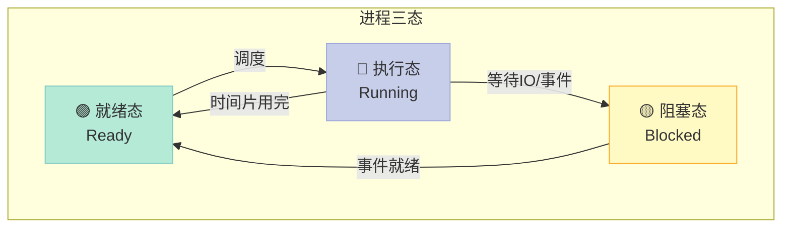

### 1.2 进程 vs 作业

| 维度 | 进程（Process） | 作业（Job） |
|------|----------------|------------|
| **定义** | 程序的一次动态执行 | 用户提交给系统的一个任务 |
| **静态/动态** | 动态 | 静态（提交时） |
| **数量关系** | 一个作业可包含多个进程 | 一个作业对应一个或多个进程 |
| **生命周期** | 创建到消亡 | 提交到完成 |
| **管理层次** | 操作系统调度单位 | 作业调度单位 |

### 1.3 进程的创建过程：`fork` + `execve`

进程创建主要分两步：**复制** + **替换**。

```c
#include <unistd.h>
#include <sys/wait.h>
#include <stdio.h>
#include <stdlib.h>

int main() {
    pid_t pid = fork();  // 第一步：复制父进程

    if (pid < 0) {
        // 失败：可能达到进程数限制或内存耗尽
        perror("fork failed");
        exit(1);
    } else if (pid == 0) {
        // 子进程：执行 ls 命令
        printf("[Child] PID=%d, PPID=%d\n", getpid(), getppid());
        execlp("/bin/ls", "ls", "-l", NULL);  // 第二步：替换为新程序
        perror("exec failed");
        exit(1);
    } else {
        // 父进程：等待子进程结束
        printf("[Parent] Child PID=%d\n", pid);
        int status;
        waitpid(pid, &status, 0);  // 阻塞等待子进程
        printf("[Parent] Child exited with %d\n", WEXITSTATUS(status));
    }
    return 0;
}
```

#### 关键函数说明

| 函数 | 作用 | 返回值 |
|------|------|--------|
| `fork()` | 复制父进程创建子进程 | 父：子 PID；子：0；错：-1 |
| `vfork()` | 与父进程共享地址空间，子先跑 | 同上 |
| `execve()` | 替换进程映像为新程序 | 成功不返回；失败返回-1 |
| `clone()` | Linux 通用进程创建（线程也是它） | 由 flags 控制共享度 |
| `wait()` / `waitpid()` | 父进程等待子进程结束 | 子 PID 或 -1 |

#### 关键数据结构

```c
// Linux 内核中的进程描述符 task_struct（简化）
struct task_struct {
    pid_t pid;                  // 进程 ID
    pid_t tgid;                 // 线程组 ID
    struct mm_struct *mm;       // 内存描述符（页表等）
    struct files_struct *files; // 打开的文件描述符表
    struct signal_struct *sig;  // 信号处理信息
    struct thread_struct thread; // CPU 上下文（寄存器、栈指针）
    struct cred *cred;          // 凭证（UID、GID）
    // ... 还有调度信息、父子关系、文件系统信息等
};
```

#### fork 的写时复制（COW）

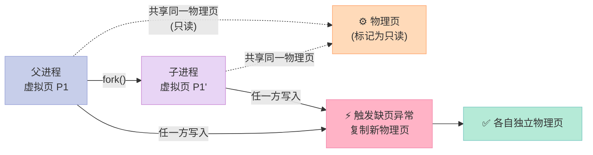

**核心思想**：`fork` 后父子进程**共享同一物理页**，都标记为只读；任一方写入时触发缺页异常，内核再分配新页。这样**只在真正需要时才复制**，极大提升了效率。

### 1.4 子进程和父进程怎么通信？

**三种主要方式**：

1. **管道（pipe）**：最常用，限于有亲缘关系的进程
2. **信号（signal）**：异步通知，不能传大量数据
3. **wait/waitpid**：父进程回收子进程资源

```c
#include <unistd.h>
#include <sys/wait.h>
#include <stdio.h>
#include <string.h>

int main() {
    int fd[2];
    pipe(fd);  // 创建管道：fd[0] 读端，fd[1] 写端

    pid_t pid = fork();
    if (pid == 0) {
        // 子进程：读
        close(fd[1]);  // 关闭写端
        char buf[128];
        int n = read(fd[0], buf, sizeof(buf));
        printf("[Child] received: %s\n", buf);
        close(fd[0]);
        return 0;
    } else {
        // 父进程：写
        close(fd[0]);  // 关闭读端
        const char *msg = "Hello from parent";
        write(fd[1], msg, strlen(msg));
        close(fd[1]);
        wait(NULL);  // 等待子进程
    }
    return 0;
}
```

### 1.5 孤儿进程 vs 僵尸进程 vs 守护进程

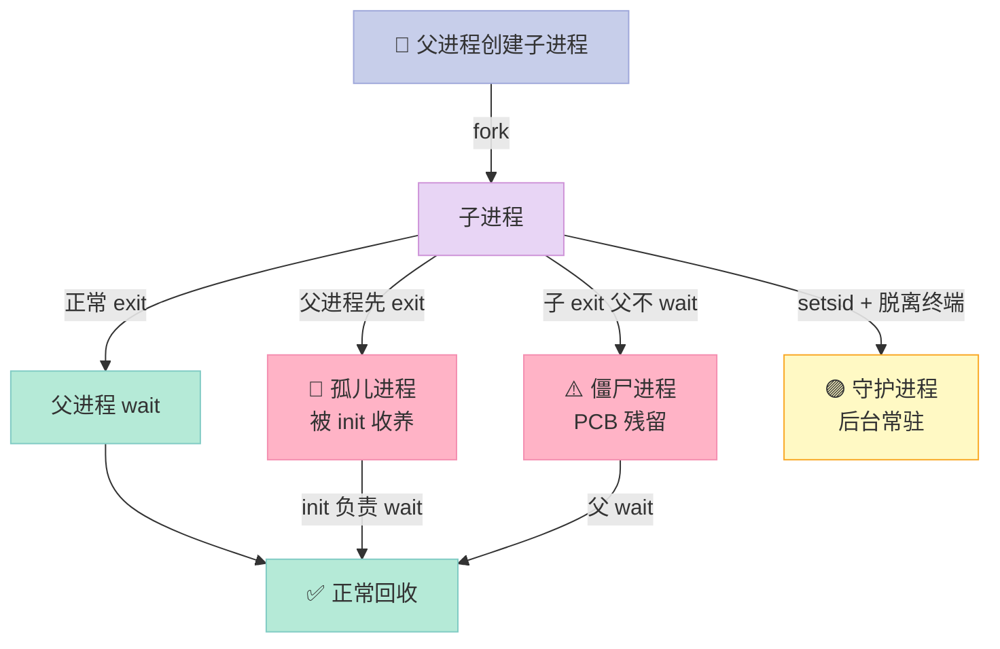

| 类型 | 定义 | 如何产生 | 如何避免 |
|------|------|----------|----------|
| **孤儿进程** | 父进程已退出，子进程被 init 收养 | 父进程先于子进程退出 | 父进程不应先于子进程退出；或用 `setsid` 创建新会话 |
| **僵尸进程** | 子进程已退出，父进程未 `wait` 回收 PCB | 子进程 exit 后，父进程没调 `wait` | 父进程必须 `wait` / `waitpid`；或捕获 `SIGCHLD` 信号 |
| **守护进程** | 脱离终端、长期运行的后台进程 | 主动 `setsid` + 二次 fork | 主动创建（见下节） |

### 1.6 守护进程的编写（标准 5 步）

```c
#include <unistd.h>
#include <sys/stat.h>
#include <stdlib.h>
#include <stdio.h>
#include <fcntl.h>

void daemonize() {
    // 1. 第一次 fork：创建子进程，父进程退出
    if (fork() > 0) exit(0);

    // 2. 创建新会话，脱离控制终端
    setsid();

    // 3. 第二次 fork：确保守护进程不是会话首进程（无法重新打开终端）
    if (fork() > 0) exit(0);

    // 4. 切换工作目录到根目录
    chdir("/");

    // 5. 关闭所有文件描述符，重定向标准 IO 到 /dev/null
    for (int i = 0; i < 3; i++) close(i);
    int fd = open("/dev/null", O_RDWR);
    dup2(fd, 0); dup2(fd, 1); dup2(fd, 2);

    // 守护进程逻辑
    while (1) {
        // do something, e.g. write to log file
        sleep(60);
    }
}

int main() {
    daemonize();
    return 0;
}
```

> **为什么两次 fork？** 第一次 fork 让进程脱离父进程，第二次 fork 让进程不再是会话首进程，**防止进程重新打开一个控制终端**。

---

## 二、进程间通信（IPC）7 种方式

### 2.1 7 种 IPC 全景图

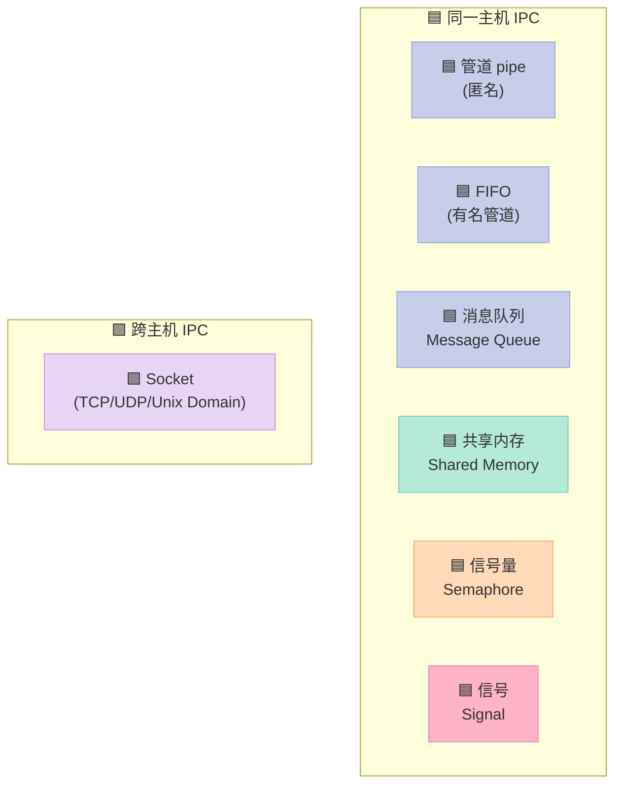

### 2.2 7 种 IPC 对比表

| IPC 方式 | 通信范围 | 传输数据量 | 速度 | 同步机制 | 生命周期 | 适用场景 |
|----------|----------|-----------|------|----------|----------|----------|
| **管道 pipe** | 亲缘进程 | 字节流 | 中 | 阻塞 | 进程结束 | shell 管道、父子通信 |
| **FIFO** | 任意进程 | 字节流 | 中 | 阻塞 | 文件系统 | 无亲缘进程通信 |
| **消息队列** | 任意进程 | 结构化消息 | 中 | 消息优先级 | 内核 | 消息传递、命令队列 |
| **共享内存** | 任意进程 | 任意大小 | **最快** | 需配合信号量 | 内核 | 高吞吐数据共享 |
| **信号量** | 任意进程 | 计数器 | 快 | PV 操作 | 内核 | 同步/互斥 |
| **信号** | 任意进程 | 整数 | 异步 | 无 | 内核 | 事件通知、异常处理 |
| **Socket** | 跨主机 | 字节流/数据报 | 慢 | 协议层 | 文件描述符 | 网络通信 |

### 2.3 共享内存：最快的 IPC

```c
// 进程 A：写入共享内存
#include <sys/shm.h>
#include <stdio.h>
#include <string.h>

int main() {
    key_t key = ftok("/tmp", 'A');  // 生成 key
    int shmid = shmget(key, 1024, IPC_CREAT | 0666);  // 创建/获取共享内存
    char *data = (char*)shmat(shmid, NULL, 0);  // 附加到进程地址空间
    strcpy(data, "Hello from A");
    shmdt(data);  // 分离
    return 0;
}

// 进程 B：读取共享内存
int main() {
    key_t key = ftok("/tmp", 'A');
    int shmid = shmget(key, 1024, 0666);
    char *data = (char*)shmat(shmid, NULL, 0);
    printf("Read: %s\n", data);
    shmdt(data);
    shmctl(shmid, IPC_RMID, NULL);  // 标记为销毁
    return 0;
}
```

### 2.4 信号：异步事件通知

```c
#include <signal.h>
#include <stdio.h>
#include <unistd.h>

void handler(int sig) {
    printf("Received signal %d\n", sig);
}

int main() {
    signal(SIGUSR1, handler);  // 注册信号处理函数
    pid_t pid = fork();

    if (pid == 0) {
        sleep(1);
        kill(getppid(), SIGUSR1);  // 子进程给父进程发信号
        return 0;
    } else {
        pause();  // 父进程挂起等待信号
        printf("Done\n");
    }
    return 0;
}
```

### 2.5 Unix Domain Socket：同主机最快的网络 IPC

```c
// server.c
#include <sys/socket.h>
#include <sys/un.h>
#include <stdio.h>
#include <string.h>

int main() {
    int fd = socket(AF_UNIX, SOCK_STREAM, 0);
    struct sockaddr_un addr = {AF_UNIX, "/tmp/my.sock"};
    unlink("/tmp/my.sock");
    bind(fd, (struct sockaddr*)&addr, sizeof(addr));
    listen(fd, 5);

    int cfd = accept(fd, NULL, NULL);
    char buf[128];
    read(cfd, buf, sizeof(buf));
    printf("Server got: %s\n", buf);
    return 0;
}
```

### 2.6 7 种 IPC 选型决策表

| 场景 | 推荐方式 | 理由 |
|------|----------|------|
| 父子进程传命令 | pipe | 简单、自动同步 |
| 进程池任务队列 | 消息队列 | 消息结构化、支持优先级 |
| 大数据共享（视频帧、内存数据库） | 共享内存 + 信号量 | 速度最快 |
| 配置变更通知 | 信号 | 异步、轻量 |
| 跨主机通信 | Socket | 唯一选择 |
| 多进程互斥访问资源 | 信号量 | 经典 PV |
| 同主机 RPC（低延迟） | Unix Domain Socket | 比 TCP 少一次协议栈 |

---

## 三、线程：CPU 调度的最小单位

### 3.1 线程 vs 进程

| 维度 | 进程 | 线程 |
|------|------|------|
| **资源分配** | 独立的地址空间 | 共享所属进程的地址空间 |
| **调度单位** | 资源分配单位 | CPU 调度单位 |
| **切换开销** | 大（切换页表、内核栈） | 小（共享页表） |
| **创建开销** | 大（复制资源） | 小（共享资源） |
| **隔离性** | 强（一个崩溃不影响其他） | 弱（线程崩溃 = 进程崩溃） |
| **通信** | 需 IPC | 直接共享变量 |

### 3.2 线程共享与独享资源

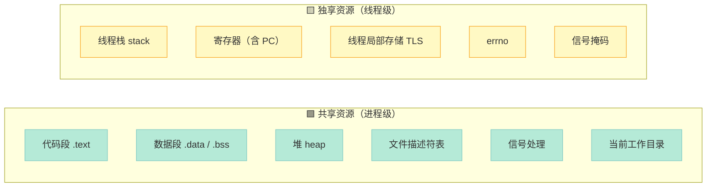

### 3.3 线程比进程的优势

| 优势 | 说明 | 量化参考 |
|------|------|----------|
| **创建快** | 不需要复制地址空间 | 线程 ~10μs，进程 ~1ms |
| **切换快** | 共享页表，TLB 不失效 | 线程 ~1μs，进程 ~10μs |
| **通信简单** | 直接共享变量 | 进程需 pipe/shm/socket |
| **资源占用少** | 不需要独立地址空间 | 线程栈 MB 级，进程 GB 级 |

### 3.4 多进程 vs 多线程 选型

| 维度 | 多进程 | 多线程 |
|------|--------|--------|
| **CPU 密集型** | ✅ 充分利用多核 | ✅ 充分利用多核 |
| **IO 密集型** | ⚠️ 切换开销大 | ✅ 优势明显 |
| **隔离性** | ✅ 强 | ⚠️ 一个崩全崩 |
| **内存占用** | ❌ 大 | ✅ 小 |
| **通信复杂度** | ❌ 需 IPC | ✅ 共享变量 |
| **典型应用** | Nginx、Chrome 渲染进程 | Redis（实际单线程）、Memcached |

### 3.5 pthread 基础示例

```c
#include <pthread.h>
#include <stdio.h>
#include <stdlib.h>

#define THREAD_NUM 4

void* worker(void* arg) {
    long id = (long)arg;
    printf("Thread %ld running\n", id);
    // do some work
    return (void*)(id * 2);
}

int main() {
    pthread_t threads[THREAD_NUM];
    for (long i = 0; i < THREAD_NUM; i++) {
        pthread_create(&threads[i], NULL, worker, (void*)i);
    }
    for (int i = 0; i < THREAD_NUM; i++) {
        void* ret;
        pthread_join(threads[i], &ret);
        printf("Thread %d returned %ld\n", i, (long)ret);
    }
    return 0;
}
```

---

## 四、死锁：四个必要条件

### 4.1 什么是死锁？

> **死锁（Deadlock）**：多个进程循环等待对方占有的资源而无限期僵持的局面。

经典例子：哲学家进餐问题。5 个哲学家围坐，5 根筷子，每人需要 2 根才能吃。如果每个人都先拿左手边的筷子，会发生**循环等待**，全部饿死。

### 4.2 死锁的四个必要条件

| 条件 | 英文 | 说明 | 打破方法 |
|------|------|------|----------|
| **互斥** | Mutual Exclusion | 资源一次只能被一个进程占用 | 用可共享资源（只读）替代 |
| **持有并等待** | Hold and Wait | 持有资源的同时请求新资源 | 一次性申请所有资源 |
| **不可剥夺** | No Preemption | 资源只能主动释放，不能抢 | 申请不到时释放已有资源 |
| **循环等待** | Circular Wait | 存在进程-资源的循环链 | 给资源编号，按序申请 |

> **核心结论**：**四个条件必须同时满足**才会死锁。打破任何一个即可避免。

### 4.3 死锁的解决策略

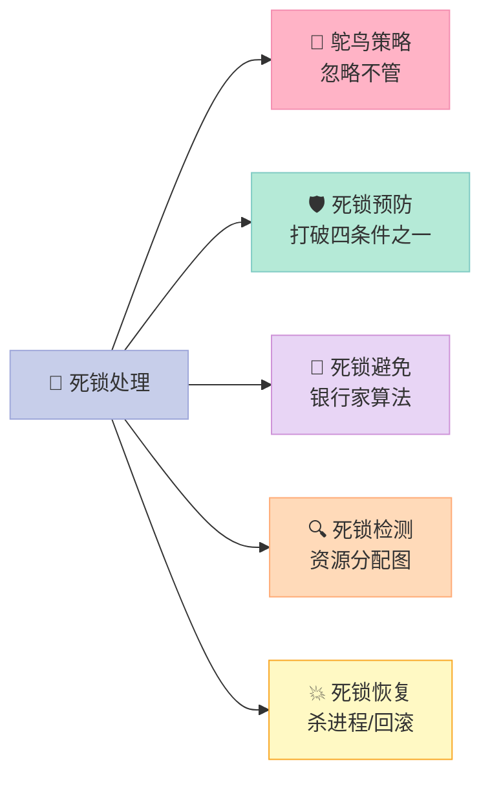

| 策略 | 思路 | 优缺点 |
|------|------|--------|
| **鸵鸟** | 假装死锁不会发生 | 简单但有风险（Linux/Windows 都用） |
| **预防** | 破坏四条件之一 | 限制大，可能降低资源利用率 |
| **避免** | 银行家算法，分配前检查安全状态 | 安全但开销大，限制资源申请数 |
| **检测+恢复** | 运行时检测，发现后杀进程 | 灵活但需要检测机制 |
| **资源有序分配** | 资源编号，按号递增申请 | 简单实用，工业界首选 |

### 4.4 死锁复现：经典转账场景

```c
#include <pthread.h>
#include <stdio.h>
#include <unistd.h>

pthread_mutex_t lockA = PTHREAD_MUTEX_INITIALIZER;
pthread_mutex_t lockB = PTHREAD_MUTEX_INITIALIZER;

void* thread1(void* arg) {
    pthread_mutex_lock(&lockA);
    printf("Thread 1: holding A, waiting B\n");
    sleep(1);  // 让 thread2 有机会拿 B
    pthread_mutex_lock(&lockB);  // 死锁点
    printf("Thread 1: got both\n");
    pthread_mutex_unlock(&lockB);
    pthread_mutex_unlock(&lockA);
    return NULL;
}

void* thread2(void* arg) {
    pthread_mutex_lock(&lockB);
    printf("Thread 2: holding B, waiting A\n");
    sleep(1);
    pthread_mutex_lock(&lockA);  // 死锁点
    printf("Thread 2: got both\n");
    pthread_mutex_unlock(&lockA);
    pthread_mutex_unlock(&lockB);
    return NULL;
}

int main() {
    pthread_t t1, t2;
    pthread_create(&t1, NULL, thread1, NULL);
    pthread_create(&t2, NULL, thread2, NULL);
    pthread_join(t1, NULL);
    pthread_join(t2, NULL);
    return 0;
}
```

**修复方法**：统一加锁顺序，永远先 lock A 再 lock B。

```c
// 修复：两个线程都按相同顺序加锁
void* thread1(void* arg) {
    pthread_mutex_lock(&lockA);
    pthread_mutex_lock(&lockB);
    // ... 业务逻辑
    pthread_mutex_unlock(&lockB);
    pthread_mutex_unlock(&lockA);
    return NULL;
}

void* thread2(void* arg) {
    pthread_mutex_lock(&lockA);  // 顺序一致！
    pthread_mutex_lock(&lockB);
    // ... 业务逻辑
    pthread_mutex_unlock(&lockB);
    pthread_mutex_unlock(&lockA);
    return NULL;
}
```

### 4.5 银行家算法核心思想

```c
// 简化版银行家算法
typedef struct {
    int available[M];                  // 可用资源
    int max[N][M];                     // 最大需求
    int allocation[N][M];              // 已分配
    int need[N][M];                    // 仍需
} BankerState;

int is_safe(BankerState* s) {
    int work[M];
    bool finish[N] = {false};
    memcpy(work, s->available, sizeof(work));

    // 找一个 need <= work 且未完成的进程
    for (int count = 0; count < N; count++) {
        bool found = false;
        for (int i = 0; i < N; i++) {
            if (!finish[i]) {
                bool can = true;
                for (int j = 0; j < M; j++)
                    if (s->need[i][j] > work[j]) { can = false; break; }
                if (can) {
                    for (int j = 0; j < M; j++) work[j] += s->allocation[i][j];
                    finish[i] = true;
                    found = true;
                }
            }
        }
        if (!found) return 0;  // 不安全
    }
    return 1;  // 安全
}
```

---

## 五、线程同步：四件套

### 5.1 线程同步 4 大原语

| 原语 | 头文件 | 用途 | 特性 |
|------|--------|------|------|
| **互斥锁 mutex** | `pthread_mutex.h` | 临界区互斥 | 加锁/解锁 |
| **读写锁 rwlock** | `pthread_rwlock.h` | 读多写少 | 读共享、写独占 |
| **条件变量 condvar** | `pthread.h` | 线程间等待唤醒 | 必须配合 mutex |
| **信号量 semaphore** | `semaphore.h` | 资源计数 | P/V 操作 |

### 5.2 互斥锁 mutex

```c
#include <pthread.h>

pthread_mutex_t mtx = PTHREAD_MUTEX_INITIALIZER;
int counter = 0;

void* increment(void* arg) {
    for (int i = 0; i < 100000; i++) {
        pthread_mutex_lock(&mtx);
        counter++;
        pthread_mutex_unlock(&mtx);
    }
    return NULL;
}
```

### 5.3 递归锁（可重入锁）

```c
// 递归锁：同一个线程可以多次加锁，不会死锁
pthread_mutex_t rec_mtx;
pthread_mutexattr_t attr;
pthread_mutexattr_init(&attr);
pthread_mutexattr_settype(&attr, PTHREAD_MUTEX_RECURSIVE);
pthread_mutex_init(&rec_mtx, &attr);

void recursive_func(int depth) {
    pthread_mutex_lock(&rec_mtx);
    if (depth > 0) recursive_func(depth - 1);  // 同一线程可重入
    pthread_mutex_unlock(&rec_mtx);
}
```

| 锁类型 | 同一线程多次加锁 | 典型应用 |
|--------|------------------|----------|
| **非递归锁** | ❌ 第二次加锁 = 死锁 | 简单互斥 |
| **递归锁** | ✅ 增加引用计数 | 递归函数、回调链 |

> **业界建议**：能用非递归就用非递归。递归锁说明设计上**职责不单一**，应当拆分函数。

### 5.4 读写锁

```c
#include <pthread.h>
pthread_rwlock_t rwlock = PTHREAD_RWLOCK_INITIALIZER;
int data = 0;

// 读线程
void* reader(void* arg) {
    pthread_rwlock_rdlock(&rwlock);
    printf("Read: %d\n", data);
    pthread_rwlock_unlock(&rwlock);
    return NULL;
}

// 写线程
void* writer(void* arg) {
    pthread_rwlock_wrlock(&rwlock);
    data++;
    pthread_rwlock_unlock(&rwlock);
    return NULL;
}
```

| 场景 | 推荐锁 | 理由 |
|------|--------|------|
| 写多读少 | mutex | 读写锁开销大 |
| 读多写少 | rwlock | 读可并发，吞吐高 |
| 配置热更新 | rwlock | 读取极频繁，更新少 |

### 5.5 条件变量（生产者-消费者）

```c
#include <pthread.h>
#include <stdio.h>
#include <stdlib.h>

#define BUFFER_SIZE 10

typedef struct {
    int buffer[BUFFER_SIZE];
    int count;  // 当前产品数
    pthread_mutex_t mtx;
    pthread_cond_t not_full;
    pthread_cond_t not_empty;
} ProdCons;

void init(ProdCons* pc) {
    pc->count = 0;
    pthread_mutex_init(&pc->mtx, NULL);
    pthread_cond_init(&pc->not_full, NULL);
    pthread_cond_init(&pc->not_empty, NULL);
}

void produce(ProdCons* pc, int item) {
    pthread_mutex_lock(&pc->mtx);
    while (pc->count == BUFFER_SIZE)              // 防止虚假唤醒
        pthread_cond_wait(&pc->not_full, &pc->mtx);
    pc->buffer[pc->count++] = item;
    pthread_cond_signal(&pc->not_empty);
    pthread_mutex_unlock(&pc->mtx);
}

int consume(ProdCons* pc) {
    pthread_mutex_lock(&pc->mtx);
    while (pc->count == 0)
        pthread_cond_wait(&pc->not_empty, &pc->mtx);
    int item = pc->buffer[--pc->count];
    pthread_cond_signal(&pc->not_full);
    pthread_mutex_unlock(&pc->mtx);
    return item;
}
```

> **关键点**：条件等待必须用 `while` 循环，不能用 `if`，因为存在**虚假唤醒**。

### 5.6 信号量（Semaphore）

```c
#include <semaphore.h>

sem_t sem;
sem_init(&sem, 0, 3);  // 初始值 3，最多 3 个并发

void* worker(void* arg) {
    sem_wait(&sem);     // P 操作，计数 -1
    // 访问资源
    printf("Working...\n");
    sleep(1);
    sem_post(&sem);     // V 操作，计数 +1
    return NULL;
}
```

### 5.7 线程安全三大实现策略

| 策略 | 思路 | 适用场景 | 缺点 |
|------|------|----------|------|
| **互斥同步** | 加锁串行化 | 写多读少、临界区短 | 性能损耗、死锁风险 |
| **非阻塞同步（CAS）** | 无锁编程 | 高并发热点 | 实现复杂、ABA 问题 |
| **线程本地存储** | 每个线程一份副本 | ThreadLocal 场景 | 副本间不一致 |

```c
// 1. 互斥同步（Synchronized / ReentrantLock）
std::mutex mtx;
std::lock_guard<std::mutex> lock(mtx);  // C++ RAII

// 2. 非阻塞同步（C++20 std::atomic）
std::atomic<int> counter{0};
counter.fetch_add(1, std::memory_order_relaxed);

// 3. 线程本地存储（thread_local）
thread_local int tls_counter = 0;  // 每个线程独立
```

### 5.8 自旋锁 vs 互斥锁

| 维度 | 自旋锁 | 互斥锁 |
|------|--------|--------|
| **等待方式** | 忙等待（CPU 旋转） | 阻塞（线程挂起） |
| **适用场景** | 临界区极短（< 几微秒） | 临界区较长 |
| **开销** | 占用 CPU | 上下文切换 |
| **中断上下文** | ✅ 可用 | ❌ 不可用 |

```c
// Linux 自旋锁
#include <linux/spinlock.h>
spinlock_t my_lock;
spin_lock(&my_lock);
// 临界区（极短）
spin_unlock(&my_lock);
```

---

## 六、协程：用户态线程

### 6.1 什么是协程？

> **协程（Coroutine）**：用户态的轻量级线程，调度由程序控制而非操作系统。

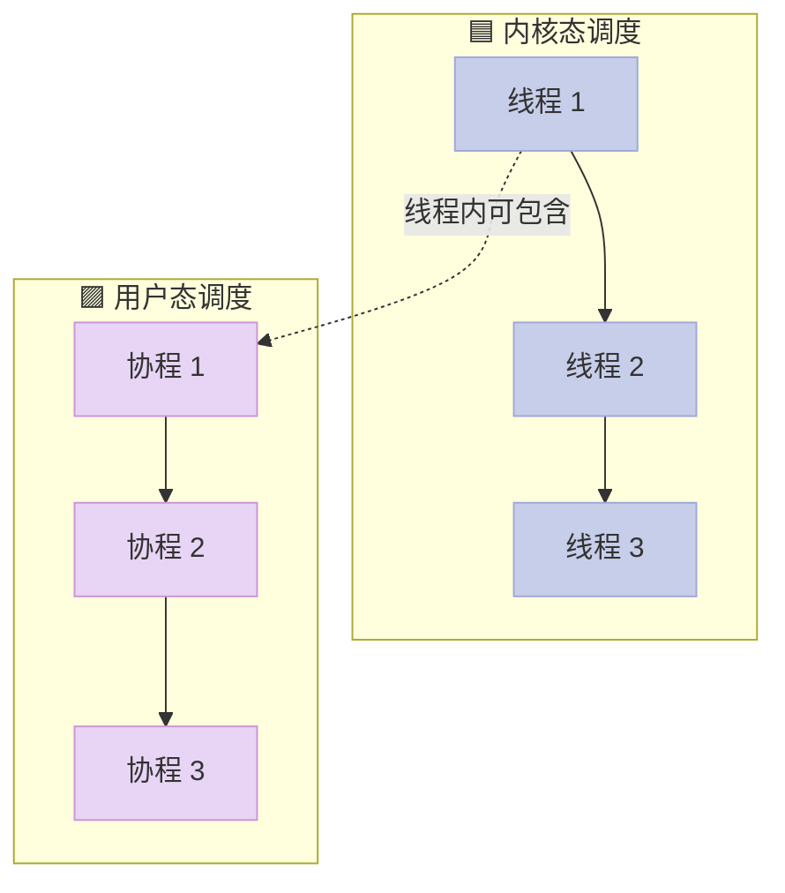

### 6.2 协程 vs 线程 vs 进程

| 维度 | 进程 | 线程 | 协程 |
|------|------|------|------|
| **调度方** | 内核 | 内核 | 用户程序 |
| **栈大小** | MB 级 | MB 级 | KB 级 |
| **切换开销** | ~10μs | ~1μs | ~100ns |
| **并行** | ✅ | ✅ | ❌ 单线程内 |
| **同步** | IPC | 锁 | yield/await |
| **典型应用** | Chrome | Redis | Go goroutine、Node.js |

### 6.3 C++20 协程

```cpp
#include <coroutine>
#include <iostream>
#include <optional>

// 简单的协程返回类型
struct Task {
    struct promise_type {
        Task get_return_object() { return {}; }
        std::suspend_never initial_suspend() { return {}; }
        std::suspend_never final_suspend() noexcept { return {}; }
        void return_void() {}
        void unhandled_exception() { std::terminate(); }
    };
};

// 协程函数：可暂停可恢复
Task counter(int n) {
    for (int i = 0; i < n; i++) {
        std::cout << "counter: " << i << std::endl;
        co_await std::suspend_always{};  // 暂停点
    }
}

int main() {
    auto t = counter(3);  // 此时挂起
    // 手动恢复需要 awaiter，这里只是演示结构
    return 0;
}
```

### 6.4 手写一个简易协程调度器（C 风格）

```c
#include <stdio.h>
#include <setjmp.h>
#include <stdlib.h>

#define STACK_SIZE (1024 * 1024)

typedef struct coroutine {
    jmp_buf env;          // 寄存器上下文
    void* stack;          // 独立栈
    void (*func)(void*);  // 协程函数
    void* arg;
    int done;
    struct coroutine* next;
} coroutine_t;

static coroutine_t* current = NULL;
static coroutine_t* main_co = NULL;

// 协程入口包装
static void coroutine_entry(coroutine_t* co) {
    co->func(co->arg);
    co->done = 1;
    longjmp(main_co->env, 1);  // 切回主协程
}

void coroutine_create(coroutine_t* co, void (*func)(void*), void* arg) {
    co->stack = malloc(STACK_SIZE);
    co->func = func;
    co->arg = arg;
    co->done = 0;
}

void coroutine_yield() {
    if (setjmp(current->env) == 0)
        longjmp(main_co->env, 1);
}

void coroutine_resume(coroutine_t* co) {
    if (!co->done) {
        current = co;
        if (setjmp(main_co->env) == 0)
            longjmp(co->env, 1);
        current = main_co;
    }
}

// 示例：两个协程交替执行
void task_a(void* arg) {
    for (int i = 0; i < 3; i++) {
        printf("A: %d\n", i);
        coroutine_yield();
    }
}

void task_b(void* arg) {
    for (int i = 0; i < 3; i++) {
        printf("B: %d\n", i);
        coroutine_yield();
    }
}

int main() {
    coroutine_t co_a, co_b, main_c;
    main_co = &main_c;
    coroutine_create(&co_a, task_a, NULL);
    coroutine_create(&co_b, task_b, NULL);

    // 设置协程栈
    // 省略：实际需用汇编切换栈指针

    for (int i = 0; i < 3; i++) {
        coroutine_resume(&co_a);
        coroutine_resume(&co_b);
    }
    return 0;
}
```

> **生产级协程库**：libco（微信）、boost.coroutine、libgo。

### 6.5 协程的 yield 关键字示意

```python
# Python 生成器（协程雏形）
def producer():
    for i in range(5):
        yield i  # 暂停，返回值给消费者

def consumer():
    for item in producer():
        print(f"Got: {item}")
```

---

## 七、用户态与内核态：CPU 的两个世界

### 7.1 为什么需要区分？

CPU 至少有**两个特权级**（x86 是 Ring 0~3）：

- **内核态（Ring 0）**：可以访问所有内存、执行特权指令（控制硬件、切换进程）
- **用户态（Ring 3）**：只能访问受限内存，不能直接操作硬件

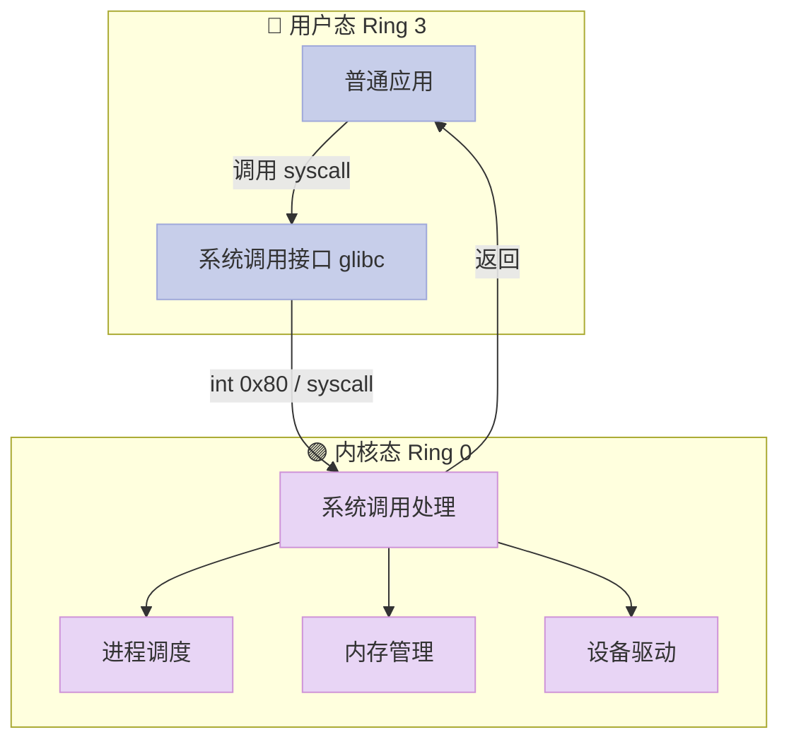

### 7.2 用户态 vs 内核态对比

| 维度 | 用户态 | 内核态 |
|------|--------|--------|
| **特权级** | Ring 3 | Ring 0 |
| **可访问内存** | 受限（用户空间 0~3GB） | 全部（4GB） |
| **可执行指令** | 普通指令 | 特权指令（I/O、CR 寄存器） |
| **CPU 抢占** | ✅ 可被抢占 | ❌ 不能被抢占（原子） |
| **运行主体** | 用户进程 | 内核代码、驱动 |
| **栈** | 用户栈 | 内核栈 |

### 7.3 用户态到内核态的切换原理

**3 种触发方式**：

1. **系统调用（主动）**：`read`、`write`、`fork` 等
2. **异常（被动）**：缺页、除零、非法内存访问
3. **中断（被动）**：硬件信号（IO 完成、时钟中断）

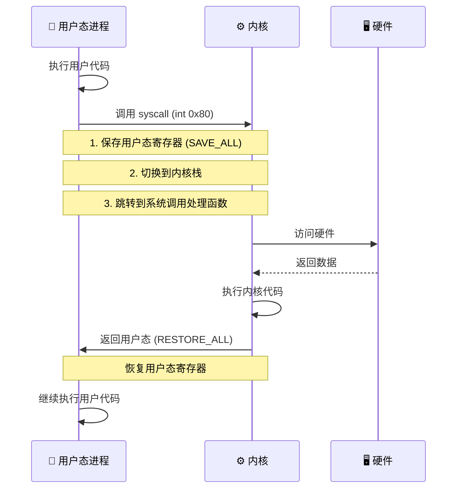

### 7.4 系统调用的完整过程

```c
// 1. 用户程序调用 glibc 包装函数
int fd = open("/etc/passwd", O_RDONLY);

// 2. glibc 内部：
//    mov eax, 2        ; 系统调用号 (SYS_open=2)
//    mov ebx, pathname ; 参数1
//    mov ecx, flags    ; 参数2
//    int 0x80          ; 触发软中断
//    ; 返回值在 eax

// 3. CPU 切换到内核态
//    - 保存用户态寄存器到内核栈
//    - 查系统调用表 sys_call_table[eax]
//    - 调用 sys_open()

// 4. 内核执行文件打开
//    sys_open() -> 路径查找 -> inode -> fd 分配

// 5. 返回
//    - 恢复用户态寄存器
//    - iret 指令返回用户态
//    - 用户态从 open() 调用处继续
```

### 7.5 函数调用 vs 系统调用

| 维度 | 函数调用 | 系统调用 |
|------|----------|----------|
| **运行空间** | 用户态 | 切换到内核态 |
| **实现机制** | 压栈 / 跳转 | 软中断（int 0x80）/ `syscall` 指令 |
| **性能** | 纳秒级 | 微秒级（上下文切换开销） |
| **可访问资源** | 仅用户态 | 全部内核资源 |
| **典型例子** | `strlen()`、`memcpy()` | `read()`、`fork()`、`ioctl()` |
| **是否可重入** | 大多数可重入 | 大多数可重入 |

### 7.6 中断的实现与作用

```c
// 中断的完整流程（伪代码）
void interrupt_handler(int irq) {
    // 1. 关中断（CPU 硬件自动）
    // 2. 保存断点（PC、PSW 等）→ 内核栈
    // 3. 跳转到中断向量表对应入口
    // 4. 保护现场：保存通用寄存器
    // 5. 设置屏蔽字（允许高优先级中断嵌套）
    // 6. 开中断
    // 7. 设备服务：实际处理中断（如读取网卡数据）
    // 8. 关中断、恢复屏蔽字
    // 9. 恢复现场
    // 10. 开中断、返回断点（iret）
}
```

| 中断类型 | 来源 | 例子 | 是否可屏蔽 |
|----------|------|------|-----------|
| **硬件中断** | 外设 | 键盘、网卡、磁盘 | 可屏蔽（可编程） |
| **软中断** | 软件指令 | `int 0x80`（系统调用） | 不可屏蔽 |
| **异常** | CPU 内部 | 缺页、除零 | 部分可屏蔽 |

---

## 八、虚拟内存：每个进程的"假"内存

### 8.1 虚拟内存是什么？

> **虚拟内存（Virtual Memory）**：一种内存管理技术，让程序以为自己拥有**完整连续**的大内存，实际可能部分在物理内存、部分在磁盘。

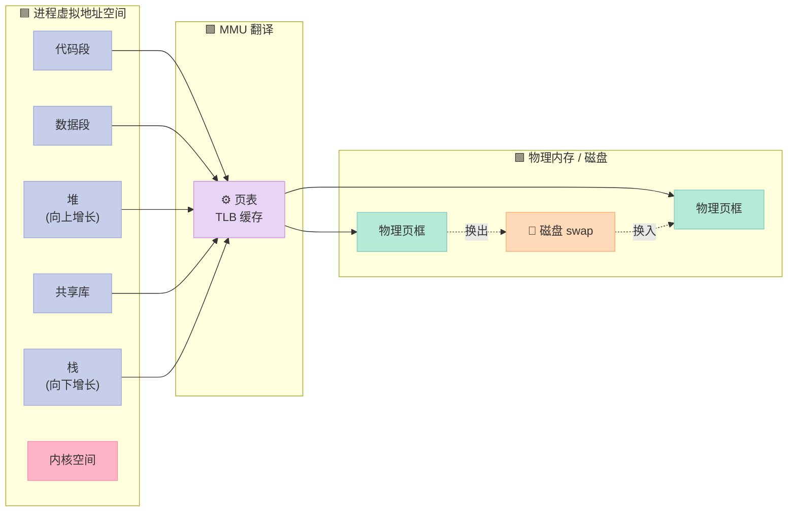

### 8.2 使用虚拟内存的优点

| 优点 | 说明 |
|------|------|
| **进程隔离** | 每个进程独立地址空间，互不干扰 |
| **扩展内存** | 程序可用内存 > 物理内存，靠磁盘 swap |
| **内存保护** | 页表项带权限位（R/W/X），防止越权访问 |
| **共享内存** | 多个进程的虚拟页映射到同一物理页 |
| **代码可重定位** | 编译时无需知道物理地址，链接器灵活 |
| **按需调页** | 程序启动只加载部分页，节省内存 |

### 8.3 虚拟地址空间布局（32 位 Linux）

```
0xFFFFFFFF ┌─────────────────┐
           │   内核空间       │ 1GB（用户不可访问）
0xC0000000 ├─────────────────┤
           │   栈 (stack)    │ ↓ 向下增长
           │       ↓         │
           │       ↑         │
           │   共享库        │
           │   堆 (heap)    │ ↑ 向上增长
           │   BSS           │
           │   数据段 .data  │
           │   代码段 .text  │
0x00000000 └─────────────────┘
```

### 8.4 缺页中断（Page Fault）

```c
// 访问未映射的虚拟页 → 触发缺页中断
// 流程：
// 1. CPU 在页表中查不到 PTE
// 2. 触发缺页异常 #PF
// 3. 内核 page fault handler 接管
// 4. 判断是次缺页（页在内存）还是主缺页（需从磁盘读）
// 5. 分配物理页框，从磁盘 swap 读入
// 6. 更新页表项
// 7. 恢复进程执行，重新执行触发缺页的指令
```

### 8.5 页 vs 段

| 维度 | 页（Page） | 段（Segment） |
|------|------------|--------------|
| **划分单位** | 固定大小（4KB） | 变长（按逻辑划分） |
| **管理方式** | 等分 | 不等分 |
| **碎片** | 内部碎片（最后一页浪费） | 外部碎片（段间空隙） |
| **共享** | 按页共享 | 按段共享 |
| **保护** | 页级保护 | 段级保护 |
| **代表系统** | 现代 OS（Linux/Windows） | 早期 x86 实模式 |

| 方案 | 思路 | 优点 | 缺点 |
|------|------|------|------|
| **分页** | 固定大小，等分 | 无外部碎片 | 有内部碎片 |
| **分段** | 按逻辑（代码/数据/堆/栈） | 程序员友好 | 外部碎片 |
| **段页式** | 先分段再分页 | 兼具两者优点 | 复杂度高 |

---

## 九、五种 IO 模型

### 9.1 IO 的两个阶段

任何一次网络 IO（以 `read` 为例）都分两步：

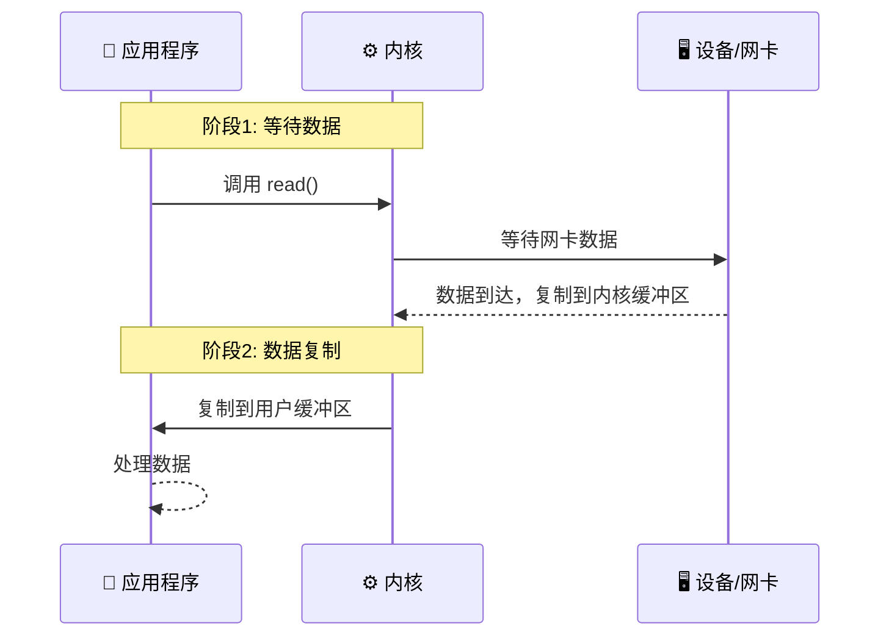

**关键点**：IO 模型的区别在于**这两个阶段如何处理**——是阻塞、非阻塞、还是异步通知。

### 9.2 五种 IO 模型对比

| 模型 | 阶段1 等待数据 | 阶段2 复制数据 | 编程复杂度 | 适用 |
|------|---------------|---------------|-----------|------|
| **阻塞 IO** | 阻塞 | 阻塞 | 简单 | 小并发 |
| **非阻塞 IO** | 轮询 | 阻塞 | 中等 | 罕见 |
| **IO 复用** | 阻塞（select/epoll） | 阻塞 | 中等 | 高并发服务器 |
| **信号驱动 IO** | 信号 | 阻塞 | 复杂 | 实时信号 |
| **异步 IO** | 不阻塞 | 不阻塞 | 复杂（AIO/proactor） | 高性能服务 |

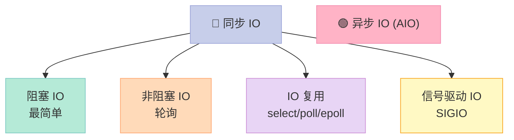

### 9.3 阻塞 IO（最简单）

```c
// 一请求一线程
int n = read(fd, buf, sizeof(buf));  // 阻塞直到有数据
printf("read %d bytes\n", n);
```

**特点**：调用后线程挂起，直到数据就绪并复制完成才返回。**简单但低效**。

### 9.4 非阻塞 IO（轮询）

```c
// 设置非阻塞
int flags = fcntl(fd, F_GETFL, 0);
fcntl(fd, F_SETFL, flags | O_NONBLOCK);

while (1) {
    int n = read(fd, buf, sizeof(buf));
    if (n > 0) {
        // 处理数据
        break;
    } else if (n < 0 && errno == EAGAIN) {
        // 暂时无数据，做点别的事
        usleep(1000);
    } else if (n == 0) {
        // 连接关闭
        break;
    }
}
```

**特点**：调用立即返回，没数据时返回 `EAGAIN`。**CPU 浪费严重**。

### 9.5 IO 复用（select/poll/epoll）

```c
// select 示例
fd_set readfds;
FD_ZERO(&readfds);
FD_SET(fd1, &readfds);
FD_SET(fd2, &readfds);

struct timeval tv = {5, 0};
int n = select(max_fd + 1, &readfds, NULL, NULL, &tv);
if (n > 0) {
    if (FD_ISSET(fd1, &readfds)) {
        // fd1 可读
        read(fd1, buf, sizeof(buf));
    }
    if (FD_ISSET(fd2, &readfds)) {
        // fd2 可读
        read(fd2, buf, sizeof(buf));
    }
}
```

**特点**：单线程可监听**大量 fd**，**就绪后**再调用阻塞 IO。**Nginx/Redis** 都用这个模型。

### 9.6 信号驱动 IO

```c
// 设置信号处理
signal(SIGIO, io_handler);
// 设置 fd 属主
fcntl(fd, F_SETOWN, getpid());
// 启用信号驱动 IO
fcntl(fd, F_SETFL, fcntl(fd, F_GETFL) | O_ASYNC);

void io_handler(int sig) {
    // 信号到达表示数据就绪
    int n = read(fd, buf, sizeof(buf));
    // ...
}
```

**特点**：内核在数据就绪时发 `SIGIO` 信号，应用主循环继续做别的事。**实时性较好但复杂**。

### 9.7 异步 IO（AIO）

```c
// Linux AIO
#include <libaio.h>

struct iocb cb;
struct iocb* cbs[1] = {&cb};
io_prep_pread(&cb, fd, buf, sizeof(buf), 0);
io_submit(ctx, 1, cbs);

// 干别的事
// ...

// 等待完成
struct io_event events[1];
int n = io_getevents(ctx, 1, 1, events, NULL);
```

**特点**：调用立即返回，**内核完成两个阶段后**通过回调通知。**真正异步**，但 Linux AIO 对网络 IO 支持有限。

### 9.8 异步 IO 的应用场景与缺点

| 项目 | 说明 |
|------|------|
| **优点** | 编程模型清晰（proactor），不阻塞主流程 |
| **缺点** | Linux AIO 对 socket 支持差；回调地狱；调试困难 |
| **应用场景** | 文件 IO 密集（数据库、消息队列）；Node.js libuv 用线程池模拟 AIO |
| **替代方案** | io_uring（Linux 5.1+）、线程池 + 阻塞 IO |

### 9.9 5 种 IO 模型选择的决策表

| 场景 | 推荐模型 | 原因 |
|------|----------|------|
| 小工具、命令行 | 阻塞 IO | 简单 |
| 单 fd 高吞吐 | epoll LT + 非阻塞 | 经典 Nginx 模型 |
| 极多 fd 中小吞吐 | epoll ET + 非阻塞 | Redised、Kafka |
| Windows 高性能 | IOCP（完成端口） | 真正异步 |
| Linux 现代方案 | io_uring | 内核级 AIO + IO 复用 |

---

## 十、IO 复用三剑客：select / poll / epoll

### 10.1 三者对比总表

| 维度 | select | poll | epoll |
|------|--------|------|-------|
| **最大 fd 数** | 1024（FD_SETSIZE） | 无限制 | 无限制（实际受系统限制） |
| **数据结构** |  bitmap | 链表 | 红黑树 + 就绪链表 |
| **fd 拷贝** | 每次调用全量拷贝 | 每次调用全量拷贝 | 一次注册，mmap 共享 |
| **时间复杂度** | O(n) 轮询 | O(n) 轮询 | O(1) 事件驱动 |
| **触发方式** | LT | LT | LT / ET |
| **跨平台** | ✅ 全平台 | ✅ Linux | ❌ 仅 Linux |
| **典型应用** | 旧代码 | 旧代码 | Nginx、Redis、Netty |

### 10.2 select 的实现

```c
#include <sys/select.h>

int main() {
    fd_set readfds;
    FD_ZERO(&readfds);
    FD_SET(0, &readfds);  // 监听 stdin

    struct timeval tv = {10, 0};  // 10s 超时
    int ret = select(1, &readfds, NULL, NULL, &tv);
    if (ret > 0 && FD_ISSET(0, &readfds)) {
        char buf[128];
        read(0, buf, sizeof(buf));
    }
    return 0;
}
```

**缺点**：每次调用都要把 fd 集合从用户态**全量拷贝**到内核态；返回后还要**遍历整个集合**找就绪的。

### 10.3 poll 的实现

```c
#include <poll.h>

struct pollfd fds[10];
fds[0].fd = 0;          // stdin
fds[0].events = POLLIN; // 关注可读

int ret = poll(fds, 1, 10000);  // 10s 超时
if (ret > 0 && (fds[0].revents & POLLIN)) {
    // 可读
}
```

**改进**：用链表替代 bitmap，**突破了 1024 限制**。但仍需**全量拷贝 + 轮询**。

### 10.4 epoll 的实现（推荐）

```c
#include <sys/epoll.h>

int main() {
    int epfd = epoll_create1(0);  // 创建 epoll 实例

    struct epoll_event ev;
    ev.events = EPOLLIN;  // 关注可读
    ev.data.fd = 0;       // stdin
    epoll_ctl(epfd, EPOLL_CTL_ADD, 0, &ev);

    struct epoll_event events[10];
    int n = epoll_wait(epfd, events, 10, -1);  // 阻塞等待
    for (int i = 0; i < n; i++) {
        if (events[i].data.fd == 0) {
            // stdin 可读
            char buf[128];
            read(0, buf, sizeof(buf));
        }
    }
    return 0;
}
```

### 10.5 epoll 三个核心函数

| 函数 | 作用 | 时间复杂度 |
|------|------|-----------|
| `epoll_create1(0)` | 创建 epoll 实例，返回 fd | O(1) |
| `epoll_ctl(epfd, op, fd, &ev)` | 注册/修改/删除 fd | O(log n) 红黑树 |
| `epoll_wait(epfd, events, max, timeout)` | 等待就绪事件 | O(1) 就绪事件数 |

### 10.6 epoll 高性能原理

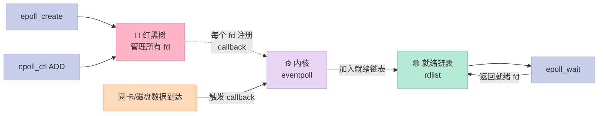

**核心优势**：

1. **红黑树管理 fd**：增删改 O(log n)
2. **callback 机制**：fd 就绪时**主动**加入就绪链表
3. **mmap 共享**：内核和用户空间共享就绪事件，**零拷贝**
4. **LT/ET 灵活**：可按需选择触发模式

### 10.7 epoll LT vs ET 详解

| 模式 | 触发时机 | 应用行为 | 适用 |
|------|----------|----------|------|
| **LT（Level Trigger）** | 只要 fd 就绪，每次 `epoll_wait` 都通知 | 可不立即处理 | ✅ 大多数场景 |
| **ET（Edge Trigger）** | 只在 fd 状态变化时通知一次 | **必须立即处理** | ✅ 高性能（Redis/Nginx） |

```c
// ET 模式必须搭配非阻塞 IO
ev.events = EPOLLIN | EPOLLET;  // ET 模式
fcntl(fd, F_SETFL, O_NONBLOCK); // 必须非阻塞

// 读循环：必须一次读完
while (1) {
    int n = read(fd, buf, sizeof(buf));
    if (n > 0) {
        // 处理数据
    } else if (n == 0) {
        // EOF
        break;
    } else {  // n < 0
        if (errno == EAGAIN || errno == EWOULDBLOCK) {
            // 暂时无数据可读，等下次通知
            break;
        } else {
            // 错误
            break;
        }
    }
}
```

### 10.8 LT vs ET 选择决策表

| 场景 | 选择 | 原因 |
|------|------|------|
| 业务复杂、不确定 | LT | 简单，不会丢事件 |
| 极致性能 | ET | 减少 epoll_wait 调用次数 |
| 大量短连接 | ET | 配合非阻塞，吞吐高 |
| 数据库、消息队列 | LT | 业务稳定优先 |

### 10.9 完整 epoll TCP server 示例

```c
#include <sys/socket.h>
#include <sys/epoll.h>
#include <netinet/in.h>
#include <stdio.h>
#include <string.h>
#include <unistd.h>

#define MAX_EVENTS 100
#define BUF_SIZE 1024

int main() {
    // 1. 创建监听 socket
    int listen_fd = socket(AF_INET, SOCK_STREAM, 0);
    struct sockaddr_in addr = {AF_INET, htons(8080), INADDR_ANY};
    bind(listen_fd, (struct sockaddr*)&addr, sizeof(addr));
    listen(listen_fd, 5);

    // 2. 创建 epoll
    int epfd = epoll_create1(0);
    struct epoll_event ev = {EPOLLIN, {.fd = listen_fd}};
    epoll_ctl(epfd, EPOLL_CTL_ADD, listen_fd, &ev);

    // 3. 事件循环
    struct epoll_event events[MAX_EVENTS];
    while (1) {
        int n = epoll_wait(epfd, events, MAX_EVENTS, -1);
        for (int i = 0; i < n; i++) {
            if (events[i].data.fd == listen_fd) {
                // 新连接
                int client_fd = accept(listen_fd, NULL, NULL);
                ev.events = EPOLLIN;  // 默认 LT
                ev.data.fd = client_fd;
                epoll_ctl(epfd, EPOLL_CTL_ADD, client_fd, &ev);
            } else {
                // 客户端数据
                int fd = events[i].data.fd;
                char buf[BUF_SIZE];
                int len = read(fd, buf, BUF_SIZE);
                if (len <= 0) {
                    close(fd);
                    epoll_ctl(epfd, EPOLL_CTL_DEL, fd, NULL);
                } else {
                    write(fd, buf, len);  // echo
                }
            }
        }
    }
    return 0;
}
```

### 10.10 三种 IO 复用函数的演进

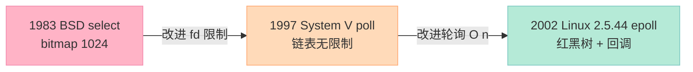

---

## 十一、零拷贝：减少 CPU 与内存的搬运

### 11.1 为什么需要零拷贝？

传统文件读取 + 发送需要 **4 次拷贝、4 次上下文切换**：

```
磁盘 → 内核缓冲区 → 用户缓冲区 → Socket 缓冲区 → 网卡
       拷贝1        拷贝2          拷贝3         拷贝4
```

**零拷贝**目标：**减少 CPU 参与的内存拷贝**。

### 11.2 三种零拷贝方式对比

| 方式 | 系统调用 | 拷贝次数 | 上下文切换 | 适用 |
|------|----------|----------|-----------|------|
| **传统 read+write** | read, write | 4 次 | 4 次 | 通用 |
| **mmap** | mmap, write | 3 次 | 4 次 | 大文件 |
| **sendfile** | sendfile | 2 次（甚至 1 次 DMA gather） | 2 次 | 网卡/文件传输 |
| **splice** | splice | 0 次 CPU 拷贝 | 2 次 | 管道/两 fd |

### 11.3 mmap 零拷贝

```c
#include <sys/mman.h>

int fd = open("file.txt", O_RDONLY);
struct stat st;
fstat(fd, &st);

// 把文件映射到用户空间
char* addr = mmap(NULL, st.st_size, PROT_READ, MAP_PRIVATE, fd, 0);

// 直接读写 addr，操作系统会按需触发缺页加载磁盘
write(STDOUT_FILENO, addr, st.st_size);

munmap(addr, st.st_size);
close(fd);
```

**原理**：用户态和内核态**共享同一物理页**，避免 `read` 时的一次内存拷贝。


### 11.4 sendfile 零拷贝（最常用）

```c
#include <sys/sendfile.h>

int in_fd = open("file.txt", O_RDONLY);
int out_fd = accept(server_fd, NULL, NULL);

off_t offset = 0;
size_t count = file_size;

// 内核直接 in_fd → out_fd，用户态零参与
sendfile(out_fd, in_fd, &offset, count);
```

**原理**：内核在页缓存内部直接完成"内核缓冲区 → Socket 缓冲区"的数据传递，**全程不经过用户态**。


> **高级版**：Linux 2.4+ 支持 DMA gather，**连内核→Socket 的 CPU 拷贝都省了**。

### 11.5 splice 零拷贝

```c
#include <fcntl.h>

int pipefd[2];
pipe(pipefd);

// in_fd → pipe → out_fd，全程不经过用户态
splice(in_fd, NULL, pipefd[1], NULL, count, 0);
splice(pipefd[0], NULL, out_fd, NULL, count, 0);
```

**原理**：通过**管道**在两个 fd 之间直接移动数据，**完全无 CPU 参与**。

### 11.6 零拷贝效果对比（以 1GB 文件为例）

| 方式 | 拷贝字节数 | 耗时 | CPU 占用 |
|------|-----------|------|----------|
| 传统 read+write | 4GB | 800ms | 80% |
| mmap + write | 3GB | 600ms | 60% |
| sendfile | 2GB | 400ms | 20% |
| splice | 1GB | 350ms | 5% |

> **Nginx** 的 `sendfile on;` 配置就是开启 sendfile 零拷贝。**Kafka** 用 `mmap` 做高性能日志读写。

---

## 十二、递归的原理与栈溢出

### 12.1 递归的底层实现

每次函数调用都会在**栈**上创建一个**栈帧**：

```c
// 递归求阶乘
int factorial(int n) {
    if (n <= 1) return 1;     // 递归终止条件
    return n * factorial(n-1); // 递归调用
}

// 调用 factorial(4) 的栈帧：
// ┌─────────────┐
// │ factorial(1) │ ← 栈顶，返回 1
// ├─────────────┤
// │ factorial(2) │ 调用 2 * 1
// ├─────────────┤
// │ factorial(3) │ 调用 3 * factorial(2)
// ├─────────────┤
// │ factorial(4) │ 调用 4 * factorial(3)
// └─────────────┘
```

### 12.2 递归的六大特性

| 特性 | 说明 |
|------|------|
| 1. 每级调用有独立变量 | 每次调用都在新栈帧上 |
| 2. 每级返回到调用点 | 栈帧弹出，回到上一级 |
| 3. 递归调用前的语句按顺序执行 | 5! 中 "print n" 会打印 5, 4, 3, 2, 1 |
| 4. 递归调用后的语句逆序执行 | 5! 中递归后 "print" 会打印 1, 2, 3, 4, 5 |
| 5. 函数代码不复制 | 同一份代码被多次执行 |
| 6. 必须有终止条件 | 否则无限递归爆栈 |

### 12.3 栈溢出的原因

- **栈空间有限**（默认 8MB ~ 16MB）
- **递归太深**：每次调用都占栈帧，深度超过限制就溢出
- **栈帧过大**：局部变量大数组

```c
// 危险：递归深度不可控
int fib(int n) {
    if (n <= 1) return n;
    return fib(n-1) + fib(n-2);  // 指数级调用！
}

fib(50);  // 可能栈溢出
```

### 12.4 解决栈溢出的 4 种方法

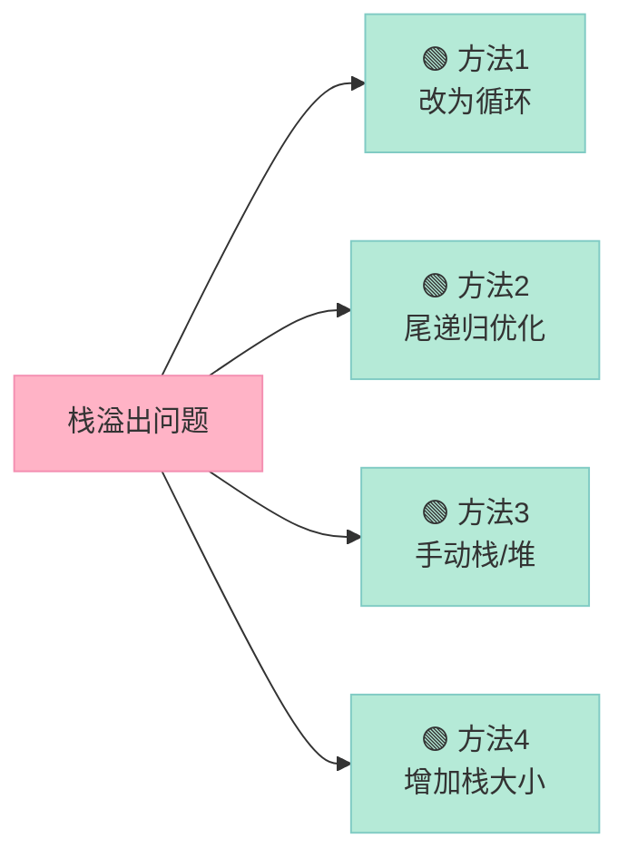

#### 方法 1：循环替代递归

```c
// 递归版
int factorial(int n) {
    if (n <= 1) return 1;
    return n * factorial(n-1);
}

// 循环版（无栈溢出风险）
int factorial_loop(int n) {
    int result = 1;
    for (int i = 2; i <= n; i++)
        result *= i;
    return result;
}
```

#### 方法 2：尾递归优化（编译器自动）

```c
// 尾递归：递归调用是最后一步操作
int factorial_tail(int n, int acc) {
    if (n <= 1) return acc;
    return factorial_tail(n - 1, n * acc);  // 编译器可优化为循环
}
// GCC 开启：-O2 即可
```

#### 方法 3：手动维护栈

```c
#include <vector>

int factorial_manual(int n) {
    std::vector<int> stack;
    for (int i = 2; i <= n; i++) stack.push_back(i);
    int result = 1;
    while (!stack.empty()) {
        result *= stack.back();
        stack.pop_back();
    }
    return result;
}
```

#### 方法 4：增加线程栈大小

```bash
# Linux 默认线程栈 8MB，可调整为 64MB
ulimit -s 65536
# pthread 创建时指定
pthread_attr_setstacksize(&attr, 64 * 1024 * 1024);
```

### 12.5 递归 vs 循环 选择决策表

| 维度 | 递归 | 循环 |
|------|------|------|
| **可读性** | ✅ 树、图、回溯清晰 | ⚠️ 复杂逻辑难懂 |
| **栈空间** | ❌ 深度大易溢出 | ✅ 固定 |
| **性能** | ❌ 函数调用开销 | ✅ 最优 |
| **适用** | 树/图遍历、分治、回溯 | 简单计数、迭代 |

---

## 十三、++i 是原子操作吗？

### 13.1 答案：不是

```c
i++ 在单线程中分三步：
mov eax, [i]   // 1. 读
add eax, 1     // 2. 加 1
mov [i], eax   // 3. 写

++i 也是三步，顺序略不同，但都需要读-改-写。
```

### 13.2 为什么不是原子的？

| 场景 | 原因 |
|------|------|
| **单核** | 线程切换可能发生在任意两步之间 |
| **多核** | 两个 CPU 同时读到旧值，各自 +1 写回，丢失一次递增 |

```c
// 多线程计数器（错误示范）
int counter = 0;
void* worker(void* arg) {
    for (int i = 0; i < 1000000; i++) counter++;  // ❌ 丢失更新
}
// 期望 1000000，实际可能 800000

// 正确做法：原子操作
#include <stdatomic.h>
atomic_int counter = 0;
void* worker(void* arg) {
    for (int i = 0; i < 1000000; i++)
        atomic_fetch_add(&counter, 1);  // ✅ 原子
}

// C++ 方式
std::atomic<int> counter{0};
counter.fetch_add(1, std::memory_order_relaxed);
```

### 13.3 原子操作与锁的取舍

| 维度 | 原子操作（CAS） | 互斥锁 |
|------|----------------|--------|
| **性能** | 高（无阻塞） | 中等（阻塞） |
| **复杂度** | 实现复杂（ABA） | 简单易用 |
| **临界区** | 极短（单变量） | 任意长度 |
| **适用** | 计数器、状态标志 | 复杂数据结构 |

---

## 十四、实战：实现一个简易协程

下面是一个**完整的、可编译运行**的用户态协程调度器，基于 `ucontext.h`（比 setjmp 更稳定）：

```c
// coroutine.c - 简易协程实现
#include <stdio.h>
#include <ucontext.h>
#include <stdlib.h>
#include <string.h>

#define STACK_SIZE (1024 * 1024)
#define MAX_COROUTINES 64

typedef struct {
    ucontext_t ctx;
    char stack[STACK_SIZE];
    int id;
    int finished;
} coroutine_t;

static coroutine_t cos[MAX_COROUTINES];
static int co_count = 0;
static int current = -1;
static ucontext_t main_ctx;

void coroutine_yield() {
    int me = current;
    current = -1;
    swapcontext(&cos[me].ctx, &main_ctx);
}

void coroutine_resume(int id) {
    if (cos[id].finished) return;
    current = id;
    swapcontext(&main_ctx, &cos[id].ctx);
    current = -1;
}

// 协程入口包装
static void co_entry(coroutine_t* co) {
    // 调用真正的协程函数（通过函数指针约定）
    // 这里简化为内置逻辑
    for (int i = 0; i < 3; i++) {
        printf("Coroutine %d: step %d\n", co->id, i);
        coroutine_yield();
    }
    co->finished = 1;
}

int coroutine_create(void (*func)(void*), void* arg) {
    if (co_count >= MAX_COROUTINES) return -1;
    int id = co_count++;
    cos[id].id = id;
    cos[id].finished = 0;

    getcontext(&cos[id].ctx);
    cos[id].ctx.uc_stack.ss_sp = cos[id].stack;
    cos[id].ctx.uc_stack.ss_size = STACK_SIZE;
    cos[id].ctx.uc_link = &main_ctx;
    makecontext(&cos[id].ctx, (void(*)())co_entry, 1, &cos[id]);
    return id;
}

int main() {
    // 创建两个协程
    coroutine_create(NULL, NULL);
    coroutine_create(NULL, NULL);

    // 调度器：轮流执行
    for (int round = 0; round < 3; round++) {
        coroutine_resume(0);
        coroutine_resume(1);
    }
    printf("All done\n");
    return 0;
}
```

编译运行：
```bash
gcc -o coroutine coroutine.c -lpthread
./coroutine
# 输出：
# Coroutine 0: step 0
# Coroutine 1: step 0
# Coroutine 0: step 1
# Coroutine 1: step 1
# Coroutine 0: step 2
# Coroutine 1: step 2
# All done
```

---

## 十五、实战：手写多进程 HTTP server

```c
// multi_proc_http.c
#include <stdio.h>
#include <stdlib.h>
#include <string.h>
#include <unistd.h>
#include <sys/socket.h>
#include <sys/wait.h>
#include <netinet/in.h>
#include <signal.h>

#define PORT 8080
#define BUF_SIZE 4096

// 处理 SIGCHLD 避免僵尸进程
void sigchld_handler(int sig) {
    while (waitpid(-1, NULL, WNOHANG) > 0);
}

// 简单的 HTTP 响应
void serve_client(int client_fd) {
    char buf[BUF_SIZE];
    int n = read(client_fd, buf, sizeof(buf) - 1);
    if (n <= 0) return;
    buf[n] = 0;

    // 构造 HTTP 响应
    const char* body = "<h1>Hello from worker</h1>";
    char response[BUF_SIZE];
    int len = snprintf(response, sizeof(response),
        "HTTP/1.1 200 OK\r\n"
        "Content-Type: text/html\r\n"
        "Content-Length: %zu\r\n"
        "Connection: close\r\n\r\n%s",
        strlen(body), body);

    write(client_fd, response, len);
    close(client_fd);
    exit(0);
}

int main() {
    signal(SIGCHLD, sigchld_handler);

    int server_fd = socket(AF_INET, SOCK_STREAM, 0);
    struct sockaddr_in addr = {
        .sin_family = AF_INET,
        .sin_port = htons(PORT),
        .sin_addr.s_addr = INADDR_ANY
    };

    int opt = 1;
    setsockopt(server_fd, SOL_SOCKET, SO_REUSEADDR, &opt, sizeof(opt));
    bind(server_fd, (struct sockaddr*)&addr, sizeof(addr));
    listen(server_fd, 128);

    printf("HTTP server on port %d\n", PORT);

    while (1) {
        struct sockaddr_in client_addr;
        socklen_t len = sizeof(client_addr);
        int client_fd = accept(server_fd, (struct sockaddr*)&client_addr, &len);

        pid_t pid = fork();
        if (pid == 0) {
            // 子进程处理请求
            close(server_fd);
            serve_client(client_fd);
        } else if (pid > 0) {
            // 父进程继续 accept
            close(client_fd);
        } else {
            perror("fork");
        }
    }
    return 0;
}
```

**测试**：
```bash
gcc -o http_server multi_proc_http.c
./http_server &
curl http://localhost:8080/
# 输出: <h1>Hello from worker</h1>
```

---

## 十六、缺页中断与页面置换

### 16.1 缺页中断流程

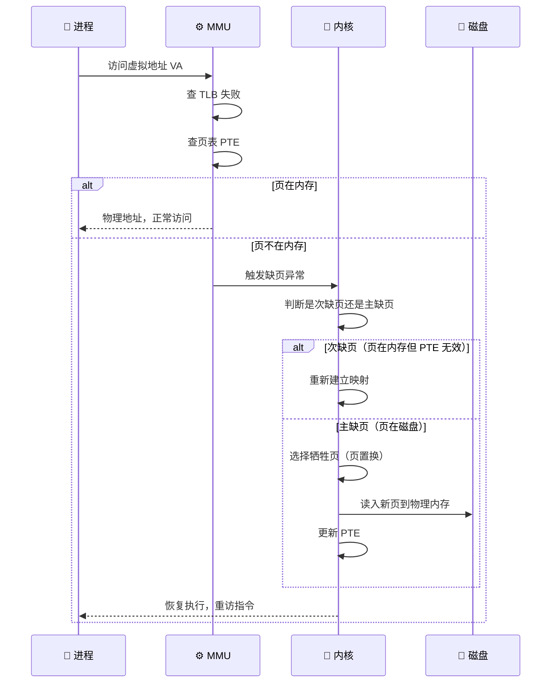

### 16.2 经典页面置换算法

| 算法 | 思路 | 优缺点 |
|------|------|--------|
| **FIFO** | 先进先出 | 简单但可能淘汰热点（Belady 异常） |
| **OPT** | 淘汰最久不用的（未来） | 最优但不可实现（理论参考） |
| **LRU** | 淘汰最久未使用 | 性能好但实现成本高 |
| **LFU** | 淘汰访问次数最少的 | 抗扫描攻击，热点稳定 |
| **Clock** | 循环扫描，使用位 = 0 则淘汰 | 近似 LRU，实用 |

### 16.3 LRU 的 3 种实现

```c
// 1. 时间戳
typedef struct {
    char key[64];
    int value;
    long timestamp;
} Entry;
Entry cache[CACHE_SIZE];
// 访问时更新 timestamp，淘汰 timestamp 最小

// 2. 链表
// 命中移到头部，满则淘汰尾部

// 3. HashMap + 双向链表（工业级）
// 命中：O(1) 移到头部
// 淘汰：O(1) 删除尾部
```

---

## 十七、思考题与行动建议

### 17.1 三道面试思考题

**思考题 1**：为什么 Chrome 浏览器一个 Tab 崩溃不会影响其他 Tab？

<details>
<summary>参考答案</summary>

Chrome 采用**多进程架构**：每个 Tab 独立一个渲染进程，进程间通过 IPC 通信。Tab 崩溃 = 渲染进程退出，不会影响浏览器主进程和其他 Tab。

这是**进程隔离**的典型应用。线程模型下，线程崩溃 = 进程崩溃，所有 Tab 一起完蛋。
</details>

**思考题 2**：Redis 是单线程的，但性能依然很强，为什么？

<details>
<summary>参考答案</summary>

1. **纯内存操作**：IO 速度天然快
2. **非阻塞 IO 多路复用**：epoll + 单线程，几十万 QPS
3. **避免线程切换开销**：无锁编程，无上下文切换
4. **数据结构高效**：跳表、压缩列表

但单线程意味着**不能用多核**。Redis 6.0 引入 IO 多线程（仅 IO 解析，命令执行还是单线程）做有限扩展。
</details>

**思考题 3**：协程相比线程，最大优势是什么？最大缺点是什么？

<details>
<summary>参考答案</summary>

**最大优势**：切换开销极小（用户态，~100ns vs 线程 ~1μs），可创建数十万个。

**最大缺点**：**无法利用多核**（单线程内调度）。需要配合线程或进程才能多核并行。

**Go 的方案**：M:N 调度（GPM 模型），将大量 goroutine 映射到少量 OS 线程，自动调度。
</details>

### 17.2 实战行动建议

| 你的角色 | 行动建议 |
|----------|----------|
| **后端开发** | 深入 epoll 源码 + Redis/Netty 实现，写一个 epoll echo server |
| **系统工程师** | 研读 Linux 内核 `eventpoll.c`，理解红黑树和就绪链表 |
| **面试准备** | 默写 7 种 IPC、5 种 IO 模型、死锁 4 条件、epoll LT/ET 区别 |
| **架构设计** | 用"进程-线程-协程"分层：进程做隔离，线程做并行，协程做高并发 |

### 17.3 进阶阅读路线


---

## 十八、面试题速查表

### 18.1 进程/线程/协程速查

| 题目 | 核心答案（一句话） |
|------|-------------------|
| 进程创建过程？ | `fork` 复制 PCB + `exec` 替换映像 |
| 子进程与父进程通信？ | pipe、signal、waitpid |
| 进程与作业区别？ | 进程是动态执行，作业是静态任务 |
| 死锁必要条件？ | 互斥、持有并等待、不可剥夺、循环等待 |
| IPC 方式？ | 管道/FIFO/消息队列/共享内存/信号量/信号/Socket |
| 线程同步方式？ | mutex、rwlock、condvar、semaphore |
| 页和段的区别？ | 页固定大小等分，段变长按逻辑 |
| 孤儿 vs 僵尸？ | 孤儿被 init 收养，僵尸是 exit 后未 wait |
| 守护进程？ | 脱离终端后台运行，二次 fork + setsid |
| 线程 vs 进程？ | 线程共享地址空间，进程独立 |
| 多进程 vs 多线程？ | 进程隔离强开销大，线程轻量易通信 |
| 协程？ | 用户态线程，调度由程序控制 |
| 递归锁？ | 同一线程可多次加锁，增加引用计数 |
| 用户态→内核态？ | 系统调用、异常、中断 |
| 中断实现？ | 保护现场→执行 handler→恢复现场 |
| 函数调用 vs 系统调用？ | 用户态 vs 切内核态 |
| 虚拟内存优点？ | 隔离、扩展、保护、共享 |
| 线程安全？ | 多个线程并发执行结果一致 |
| 5 种 IO 模型？ | 阻塞、非阻塞、IO 复用、信号驱动、异步 |
| 异步 IO 缺点？ | 编程复杂、Linux 对 socket 支持弱 |
| IO 复用原理？ | 一次等待多个 fd 就绪，避免单 fd 阻塞 |
| 零拷贝？ | mmap、sendfile、splice 减少 CPU 拷贝 |
| epoll LT vs ET？ | LT 多次通知，ET 只通知一次 |
| 递归原理？ | 每次调用压栈，栈帧保存状态 |
| 栈溢出？ | 改循环、尾递归、手动栈、增栈大小 |

### 18.2 7 种 IPC 速查

| 方式 | 关键字 |
|------|--------|
| 管道 | pipe()，亲缘，半双工 |
| FIFO | mkfifo，文件系统路径名 |
| 消息队列 | msgget/msgsnd/msgrcv，结构化消息 |
| 共享内存 | shmget/shmat，最快 |
| 信号量 | sem_init，PV 同步 |
| 信号 | kill/signal，异步通知 |
| Socket | socket/bind/listen，跨主机 |

### 18.3 5 种 IO 模型速查

| 模型 | 阶段1 | 阶段2 |
|------|-------|-------|
| 阻塞 | 阻塞 | 阻塞 |
| 非阻塞 | 轮询 | 阻塞 |
| IO 复用 | select/epoll 阻塞 | 阻塞 |
| 信号驱动 | 信号 | 阻塞 |
| 异步 | 都不阻塞 | 都不阻塞 |

### 18.4 死锁 4 条件速查

| 条件 | 一句话 | 打破方法 |
|------|--------|----------|
| 互斥 | 一资源一时刻一进程 | 共享只读 |
| 持有并等待 | 握着旧资源等新资源 | 一次性申请 |
| 不可剥夺 | 资源不能强抢 | 申请不到释放已有 |
| 循环等待 | 进程-资源形成环 | 资源编号按序申请 |

---

## 系列导航

本系列共 16 篇，覆盖 C++ 面试全栈知识点：

| 篇数 | 主题 | 链接 |
|------|------|------|
| 第 1 篇 | C++ 基础：指针、引用、const、static | [文章] |
| 第 2 篇 | 面向对象：封装、继承、多态、虚函数 | [文章] |
| 第 3 篇 | 模板与泛型：函数模板、类模板、SFINAE | [文章] |
| 第 4 篇 | STL 源码：vector、list、map、unordered_map | [文章] |
| 第 5 篇 | 内存管理：new/delete、malloc/free、智能指针 | [文章] |
| 第 6 篇 | 关键字：const、volatile、explicit、mutable | [文章] |
| 第 7 篇 | 类型转换：static_cast、dynamic_cast、reinterpret_cast | [文章] |
| 第 8 篇 | 异常处理：try/catch、noexcept、栈展开 | [文章] |
| 第 9 篇 | C++11/14/17 新特性：lambda、右值引用、智能指针 | [文章] |
| 第 10 篇 | C++20/23 新特性：concept、coroutine、module | [文章] |
| 第 11 篇 | 网络编程：TCP/IP、socket、HTTP 协议 | [文章] |
| 第 12 篇 | 设计模式：单例、工厂、观察者、策略 | [文章] |
| **第 13 篇** | **进程/线程/IO：fork、IPC、epoll、零拷贝** | **本篇** |
| 第 14 篇 | 数据库与存储：MySQL 索引、事务、Redis 数据结构 | [文章] |
| 第 15 篇 | 分布式基础：CAP、BASE、共识算法 | [文章] |
| 第 16 篇 | 系统设计：短链、Feed、秒杀、限流 | [文章] |

---

> **结尾金句**：并发编程的精髓不是"用多线程"，而是"**让正确的执行单元在正确的时机访问正确的资源**"。理解 fork/exec 的复制语义、epoll 的事件驱动、协程的用户态调度，你才真正掌握了 C++ 后端工程师的"九阳真经"。

如果本文对你有帮助，**点赞、在看、转发**三连是对我最大的鼓励。有任何问题，欢迎在评论区留言讨论！
