> 网络协议是 C++ 后端面试的**必考点**。本文带你一次性搞懂 TCP 三次握手、四次挥手、11 种状态机、流量控制 / 拥塞控制、HTTP 演进，以及 socket 编程的完整套路。

---

## 一、开篇钩子：两个反常识的问题

**问题 1**：为什么 TCP 三次握手不是两次？

很多人会说"为了防止已失效的连接请求突然又传到了服务器"。但这只是表象。**真正的本质**是：**两次握手无法让客户端和服务端都确认双方的收发能力都正常**。三次握手后，客户端确认了"自己能发、能收"，服务端也确认了"自己能发、能收"，双向通信能力全部验证完毕。

**问题 2**：time_wait 状态为什么要等 2MSL（Maximum Segment Lifetime，最大报文段寿命）？

很多人会背"防止最后一个 ACK 丢失"。但更深层的原因是：**2MSL 时间 = 一个 MSL（去程）+ 一个 MSL（回程）**，刚好覆盖了"主动方发 ACK → 对方可能重传 FIN → 主动方再次发 ACK"这条完整链路。**1 个 MSL 不够，因为 FIN 重传的应答也需要 1 个 MSL 才能消失**。

**问题 3**：UDP 一个包最大能传多少？

不是 65535 字节。**实际最大是 1472 字节**（1500 - 20 IP 头 - 8 UDP 头）。这就是为什么 DNS、QUIC 都偏爱 UDP 但单个包不能太大。

下面，我们就用一篇文章彻底搞懂 C++ 面试中所有高频网络协议问题。

---

## 二、OSI 7 层 vs TCP/IP 4 层：网络模型到底在分什么？

网络协议的设计哲学是**分层**——每层只关心自己的事，把复杂问题拆成小问题。

### 2.1 OSI 7 层模型（理论标准）

OSI（Open Systems Interconnection，开放系统互连）是 ISO 制定的**理论参考模型**，7 层从上到下：

| 层级 | 名称 | 主要功能 | 数据单位 |
|------|------|---------|---------|
| 7 | 应用层（Application） | 为用户提供网络服务（HTTP、FTP、DNS） | 报文（Message） |
| 6 | 表示层（Presentation） | 数据表示、加密、压缩（SSL/TLS、JPEG） | 报文（Message） |
| 5 | 会话层（Session） | 建立、管理、终止会话（RPC、NetBIOS） | 报文（Message） |
| 4 | 传输层（Transport） | 端到端可靠传输（TCP、UDP） | 段（Segment） |
| 3 | 网络层（Network） | 路由选择、IP 寻址（IP、ICMP、ARP） | 包（Packet） |
| 2 | 数据链路层（Data Link） | 帧同步、MAC 寻址、差错控制（Ethernet、PPP） | 帧（Frame） |
| 1 | 物理层（Physical） | 比特流传输（光纤、电缆、无线） | 比特（Bit） |

### 2.2 TCP/IP 4 层模型（实际标准）

OSI 太学术了，实际互联网用的是 TCP/IP 模型：

| 层级 | 名称 | 对应 OSI 层 | 协议举例 |
|------|------|------------|---------|
| 4 | 应用层（Application） | OSI 5、6、7 | HTTP、HTTPS、DNS、FTP、SSH |
| 3 | 传输层（Transport） | OSI 4 | TCP、UDP |
| 2 | 网络层（Internet） | OSI 3 | IP、ICMP、ARP |
| 1 | 网络接口层（Network Access） | OSI 1、2 | Ethernet、Wi-Fi、PPP |

### 2.3 两者的对比

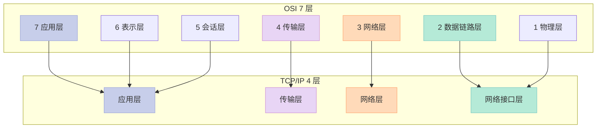

### 2.4 各层常见协议与设备

| 层级 | 常见协议 | 典型设备 |
|------|---------|---------|
| 应用层 | HTTP、HTTPS、DNS、FTP、SSH、SMTP、SNMP | 网关、代理服务器 |
| 传输层 | TCP、UDP | 网关 |
| 网络层 | IP、ICMP、ARP、IGMP、OSPF、BGP | 路由器、三层交换机 |
| 数据链路层 | Ethernet、PPP、HDLC、VLAN、STP | 交换机、网桥 |
| 物理层 | 光纤、双绞线、同轴电缆 | 集线器、中继器、网卡 |

**口诀记忆**：**一**（物理层）**二**（链路层）**三**（网络层）**四**（传输层）**五**（会话层）**六**（表示层）**七**（应用层），数据叫**比特→帧→包→段→报文**。

---

## 三、TCP 协议详解：三次握手、四次挥手、11 种状态

### 3.1 TCP 报文头格式

TCP（Transmission Control Protocol，传输控制协议）的报文头是理解所有机制的基础：

```c
// TCP Header（20 字节固定部分 + 可选选项）
struct TCPHeader {
    uint16_t src_port;       // 源端口号
    uint16_t dst_port;       // 目的端口号
    uint32_t seq;            // 序号（Sequence Number）
    uint32_t ack;            // 确认号（Acknowledgment Number）
    uint8_t  data_offset:4;  // 数据偏移（头部长度，单位 4 字节）
    uint8_t  reserved:3;     // 保留位
    uint8_t  NS:1;           // Nonce Sum（隐藏位，RFC 3540）
    uint8_t  CWR:1;          // Congestion Window Reduced
    uint8_t  ECE:1;          // ECN-Echo
    uint8_t  URG:1;          // Urgent 紧急指针有效
    uint8_t  ACK:1;          // Acknowledgment 确认号有效
    uint8_t  PSH:1;          // Push 推送数据
    uint8_t  RST:1;          // Reset 重置连接
    uint8_t  SYN:1;          // Synchronize 同步序号
    uint8_t  FIN:1;          // Finish 结束连接
    uint16_t window;         // 窗口大小（流量控制核心）
    uint16_t checksum;       // 校验和
    uint16_t urgent_ptr;     // 紧急指针
    uint32_t options[];      // 可选选项（MSS、SACK、Timestamps 等）
};
```

### 3.2 TCP 6 大标志位

| 标志位 | 含义 | 触发场景 |
|--------|------|---------|
| **SYN** | Synchronize，同步序号 | 三次握手的前两次 |
| **ACK** | Acknowledgment，确认应答 | 所有确认包 |
| **FIN** | Finish，结束连接 | 四次挥手 |
| **RST** | Reset，重置连接 | 异常断开、连接拒绝 |
| **PSH** | Push，催促接收方立即交付数据 | 需要立即处理的数据 |
| **URG** | Urgent，紧急指针有效 | 紧急数据传送 |

### 3.3 三次握手：建立连接的过程

#### 时序图

```mermaid
sequenceDiagram
    participant C as 👤 客户端
    participant S as 🖥️ 服务器

    Note over C,S: 初始状态：CLOSED
    Note over S: 启动监听：LISTEN

    C->>S: SYN, seq=x
    Note over C: 进入 SYN_SENT 状态
    S->>C: SYN, seq=y, ACK, ack=x+1
    Note over S: 进入 SYN_RCVD 状态
    C->>S: ACK, ack=y+1
    Note over C,S: 双端进入 ESTABLISHED

    style C fill:#C7CEEA,stroke:#9FA8DA,color:#333
    style S fill:#E8D5F5,stroke:#CE93D8,color:#333
```

#### 详细过程

| 次数 | 发送方 | 标志位 | 序号 / 确认号 | 状态变化 |
|------|-------|--------|--------------|---------|
| 第 1 次 | 客户端 → 服务器 | SYN=1 | seq=x | 客户端：CLOSED → SYN_SENT |
| 第 2 次 | 服务器 → 客户端 | SYN=1, ACK=1 | seq=y, ack=x+1 | 服务器：LISTEN → SYN_RCVD |
| 第 3 次 | 客户端 → 服务器 | ACK=1 | seq=x+1, ack=y+1 | 双方 → ESTABLISHED |

**为什么是 3 次而不是 2 次？**

来看一个**经典失效场景**：
- 客户端发了一个 SYN=x（因网络拥塞滞留）
- 客户端超时重传，发了 SYN=x'，并成功建立连接
- 旧的 SYN=x 突然到达服务器
- 服务器误以为是新连接请求，返回 SYN+ACK
- **如果没有第 3 次握手**：服务器单方面认为连接建立成功，进入 ESTABLISHED 等待数据，浪费资源
- **有了第 3 次握手**：客户端不会响应这个旧的 SYN（因为它不在自己当前的连接里），服务器收不到 ACK 就会关闭连接

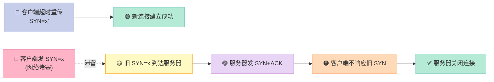

### 3.4 四次挥手：断开连接的过程

#### 时序图

```mermaid
sequenceDiagram
    participant A as 👤 主动方（客户端）
    participant B as 🖥️ 被动方（服务器）

    Note over A,B: 双方都在 ESTABLISHED 状态

    A->>B: FIN, seq=u
    Note over A: 进入 FIN_WAIT_1
    B->>A: ACK, ack=u+1
    Note over B: 进入 CLOSE_WAIT
    Note over A: 进入 FIN_WAIT_2

    B->>A: FIN, seq=v, ACK, ack=u+1
    Note over B: 进入 LAST_ACK

    A->>B: ACK, ack=v+1
    Note over A: 进入 TIME_WAIT
    Note over B: 进入 CLOSED
    Note over A: 等待 2MSL 后进入 CLOSED

    style A fill:#C7CEEA,stroke:#9FA8DA,color:#333
    style B fill:#E8D5F5,stroke:#CE93D8,color:#333
```

#### 为什么挥手是 4 次而不是 3 次？

**核心原因**：**TCP 是全双工通信**，客户端和服务端都需要独立关闭自己这一侧的发送通道。

- 第一次挥手：客户端说"我没数据发了"
- 第二次挥手：服务器说"我知道了"，但**服务器可能还有数据要发**
- 第三次挥手：服务器说"我也没数据发了"
- 第四次挥手：客户端说"我知道了"

**为什么握手可以是 3 次，挥hand 必须是 4 次？**

因为握手时，**服务器的 ACK 和 SYN 可以合并**（都是同步逻辑），而挥手时，被动方的 **ACK（响应对方的关闭请求）和 FIN（自己也没数据了）通常无法合并**——因为中间可能有未发完的数据。

### 3.5 TCP 的 11 种状态详解

这是面试官最爱追问的"细节题"。完整状态机：

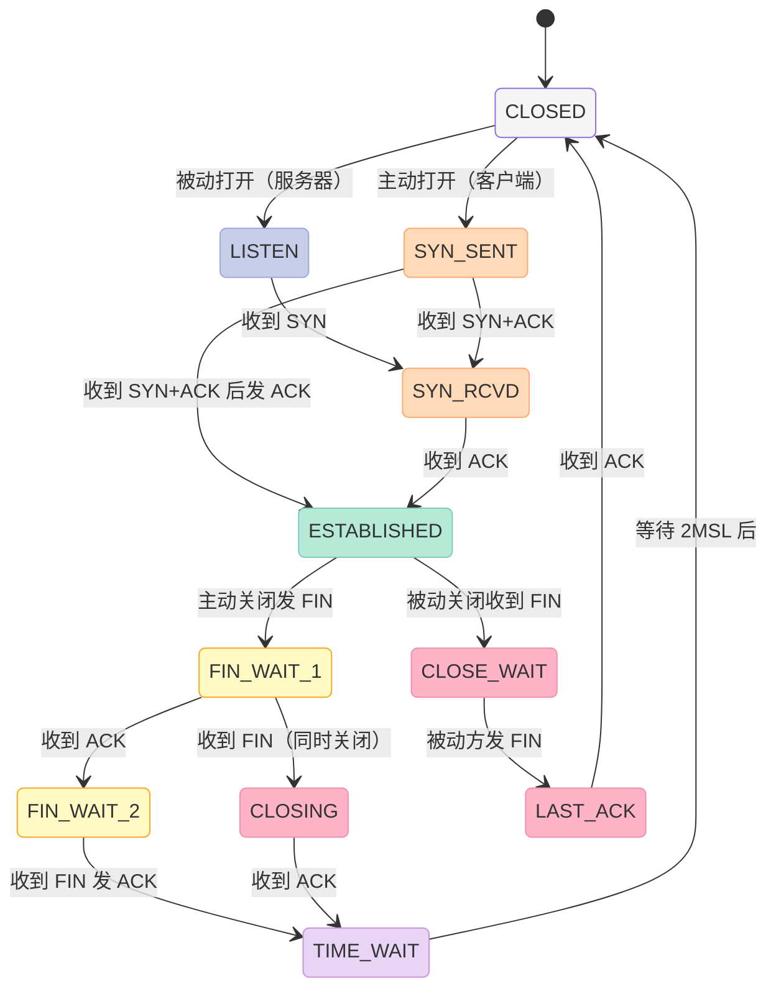

#### 11 种状态速查表

| 状态 | 所属方 | 含义 | 持续时间 |
|------|--------|------|---------|
| **CLOSED** | 双方 | 初始状态，连接未建立 | - |
| **LISTEN** | 服务器 | 正在监听端口，等待 SYN | 长（取决于服务存活期） |
| **SYN_SENT** | 客户端 | 已发送 SYN，等待 SYN+ACK | 短（一次 RTT） |
| **SYN_RCVD** | 服务器 | 已收到 SYN 并发送 SYN+ACK，等待 ACK | 短 |
| **ESTABLISHED** | 双方 | 连接建立成功，可传输数据 | 长（业务交互期） |
| **FIN_WAIT_1** | 主动方 | 已发 FIN，等待 ACK 或对方 FIN | 短 |
| **FIN_WAIT_2** | 主动方 | 收到对方 ACK，等待对方 FIN | 可长（等待对端关闭） |
| **CLOSE_WAIT** | 被动方 | 收到 FIN，已发 ACK，等待本端关闭 | **危险：长时间说明代码 bug** |
| **CLOSING** | 双方 | 双方同时关闭，罕见状态 | 极短 |
| **LAST_ACK** | 被动方 | 已发 FIN，等待最后一个 ACK | 短 |
| **TIME_WAIT** | 主动方 | 已发最后 ACK，等待 2MSL | **固定 2MSL（Linux 默认 60s）** |

### 3.6 TIME_WAIT vs CLOSE_WAIT

| 维度 | TIME_WAIT | CLOSE_WAIT |
|------|-----------|------------|
| 出现位置 | **主动关闭方** | **被动关闭方** |
| 触发条件 | 主动方发了最后一个 ACK | 被动方收到 FIN，但未发 FIN |
| 持续时间 | 2MSL（固定） | 由代码决定，可能很长 |
| 是否正常 | **正常现象** | **多半是 bug** |
| 危害 | 占用端口 | 占用文件描述符、内存 |
| 解决方法 | SO_REUSEADDR | 检查代码中漏掉的 close() |

**TIME_WAIT 存在的两大理由**：

1. **保证全双工连接可靠释放**：如果最后那个 ACK 丢失，被动方会重传 FIN，主动方必须能再次响应
2. **让旧连接的重复分组在网络中消失**：防止新连接收到老连接的迟到数据

```c
// Linux 中查看 TIME_WAIT 数量
// $ netstat -n | awk '/^tcp/ {++state[$NF]} END {for(key in state) print key, state[key]}'
// TIME_WAIT 2453
// ESTABLISHED 89
// CLOSE_WAIT 12
```

### 3.7 TCP 4 大计时器

| 计时器 | 作用 | 触发时机 |
|--------|------|---------|
| **重传计时器（Retransmission Timer）** | 报文段超时未确认则重传 | 每发一个报文段启动 |
| **坚持计时器（Persistence Timer）** | 解决零窗口死锁 | 收到 rwnd=0 时启动 |
| **保活计时器（Keepalive Timer）** | 检测长时间空闲连接是否存活 | 连接空闲超过 2 小时（默认） |
| **2MSL 计时器（TIME_WAIT Timer）** | 确保最后一个 ACK 和所有重传 FIN 消失 | 主动关闭后进入 TIME_WAIT |

**重传计时器 RTO 计算**（经典 Karn 算法）：

```c
// 简化版的 RTT 平滑算法（RFC 6298）
double srtt = 0;     // 平滑 RTT
double rttvar = 0;   // RTT 方差
double alpha = 0.125;
double beta  = 0.25;

void update_rtt(double measured_rtt, bool is_first) {
    if (is_first) {
        srtt = measured_rtt;
        rttvar = measured_rtt / 2;
    } else {
        rttvar = (1 - beta) * rttvar + beta * fabs(srtt - measured_rtt);
        srtt   = (1 - alpha) * srtt + alpha * measured_rtt;
    }
}

double get_rto() {
    double rto = srtt + 4 * rttvar;
    return max(rto, 1.0);   // 最小 1 秒
}
```

---

## 四、TCP 可靠性保证机制

### 4.1 滑动窗口机制

**滑动窗口**是 TCP 实现流量控制和可靠性的核心数据结构。

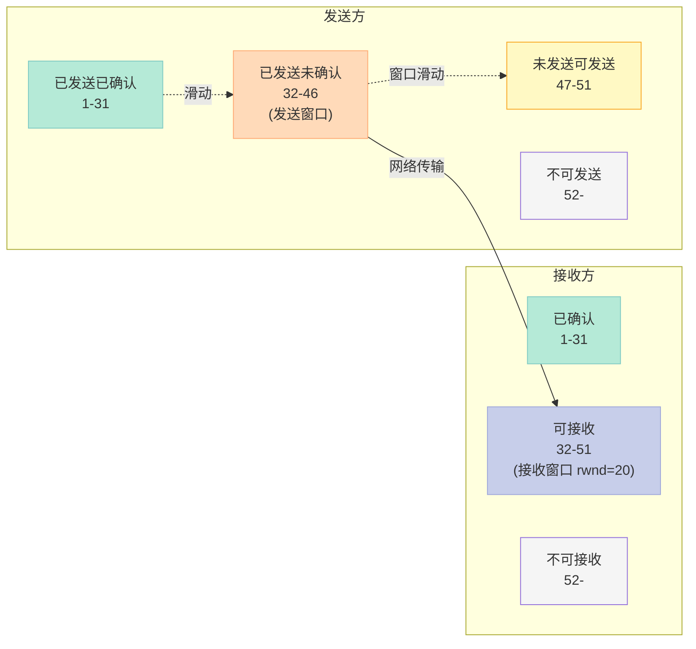

**关键公式**：

```
发送窗口上限 = Min[接收窗口 rwnd, 拥塞窗口 cwnd]
```

| 窗口类型 | 维护方 | 决定因素 |
|---------|--------|---------|
| **rwnd**（接收窗口） | 接收方 | 接收缓冲区剩余空间 |
| **cwnd**（拥塞窗口） | 发送方 | 网络拥塞程度 |
| **swnd**（发送窗口） | 发送方 | min(rwnd, cwnd) |

### 4.2 流量控制 vs 拥塞控制

**这是面试最高频的"看似简单实则容易答错"的对比题。**

| 维度 | 流量控制 | 拥塞控制 |
|------|---------|---------|
| **目标** | 防止发送方淹没接收方 | 防止过多数据注入网络 |
| **作用范围** | 端到端（点对点） | 全局性（整个网络） |
| **控制方** | 接收方 | 发送方 |
| **核心机制** | 滑动窗口（rwnd） | 拥塞窗口（cwnd）+ 4 个算法 |
| **触发问题** | 接收方处理不过来 | 路由器/链路过载 |

### 4.3 拥塞控制 4 大算法

#### 慢启动（Slow Start）

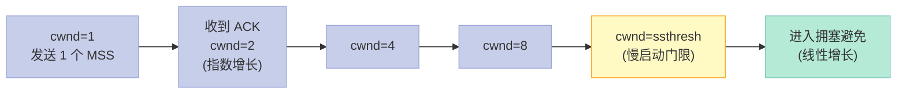

- **初始 cwnd = 1 MSS**
- 每收到一个 ACK，**cwnd 加 1**（每 RTT 翻倍，**指数增长**）
- 直到 cwnd ≥ ssthresh，进入拥塞避免

#### 拥塞避免（Congestion Avoidance）

- 每经过 1 个 RTT，**cwnd 加 1**（**线性增长**）

#### 快重传（Fast Retransmit）

- 收到 **3 个重复 ACK**，立即重传，不等超时

#### 快恢复（Fast Recovery）

- 收到 3 个重复 ACK：ssthresh = cwnd / 2，cwnd = ssthresh
- **不回到慢启动**，直接进入拥塞避免

```c
// Linux 内核中的拥塞控制状态机（简化版）
enum tcp_congestion_state {
    CA_OPEN,        // 正常状态，cwnd 增长
    CA_DISORDER,    // 出现轻度乱序
    CA_CWR,         // 收到 ECN 拥塞通知
    CA_RECOVERY,    // 拥塞恢复期（快恢复）
    CA_LOSS         // 发生丢包
};

void tcp_fastretransmit(struct sock *sk) {
    // 收到 3 个 dup ACK
    sk->snd_cwnd = sk->snd_ssthresh;  // cwnd = ssthresh
    tcp_set_ca_state(sk, CA_RECOVERY);
    tcp_retransmit_skb(sk, skb);      // 立即重传
}
```

### 4.4 Nagle 算法与延迟确认

#### Nagle 算法

**目的**：减少小包，提高带宽利用率。

**规则**：只有上一个分组得到确认，才会发送下一个分组；同时收集多个小分组合并发送。

```c
// 关闭 Nagle 算法（适用于对延迟敏感的场景）
int flag = 1;
setsockopt(sockfd, IPPROTO_TCP, TCP_NODELAY, &flag, sizeof(flag));
```

**Nagle 的副作用**：在交互式应用中可能导致延迟（如 SSH）。

#### 延迟确认（Delayed ACK）

**规则**：接收方收到数据后**不立即回 ACK**，而是等待一段时间（通常 40ms），看是否有数据要一起回。

**Nagle + 延迟确认的组合**：在交互式场景下可能产生 200ms 级别的延迟（**Nagle 延迟**），这就是为什么 RPC 框架（如 gRPC）会**强制关闭 Nagle**。

### 4.5 TCP 粘包问题

**粘包**是 TCP 编程的经典痛点——TCP 是字节流协议，没有消息边界。

```c
// 粘包示例：发送方连续发两个 10 字节包
send(sock, "0123456789", 10, 0);
send(sock, "abcdefghij", 10, 0);

// 接收方可能一次性读到 20 字节
recv(sock, buf, 1024, 0);  // 读到 "0123456789abcdefghij"
```

#### 粘包的原因

| 原因 | 说明 |
|------|------|
| **发送方：Nagle 算法** | 小包合并发送 |
| **接收方：TCP 缓冲** | 应用层读取速度 < TCP 接收速度 |

#### 解决方案

| 方案 | 实现 | 适用 |
|------|------|------|
| **固定长度** | 每个包大小固定 | 简单协议 |
| **分隔符** | 用 `\n`、`\r\n` 分隔 | 文本协议（Redis、HTTP/1.0） |
| **长度前缀** | 包头 4 字节存长度 | **最常用**（HTTP、gRPC） |
| **TLV 编码** | Type-Length-Value | 二进制协议 |
| **关闭 Nagle** | TCP_NODELAY | 缓解，不能根治 |

```c
// 典型的"长度前缀"协议解析
struct MsgHeader {
    uint32_t magic;    // 魔数，校验
    uint32_t length;   // 包体长度
    uint16_t version;  // 协议版本
    uint16_t type;     // 消息类型
};

// 接收循环
while (true) {
    // 1. 先读包头（8 字节）
    int n = recv(sock, &header, sizeof(header), MSG_WAITALL);
    if (n <= 0) break;

    // 2. 根据 length 读包体
    char* body = malloc(header.length);
    n = recv(sock, body, header.length, MSG_WAITALL);
    if (n <= 0) { free(body); break; }

    // 3. 处理完整消息
    process_msg(&header, body);
    free(body);
}
```

### 4.6 UDP 单包最大尺寸

```c
// 为什么 UDP 最大数据区是 1472 字节？
// 链路层 MTU (1500) = IP 头 (20) + UDP 头 (8) + UDP 数据区
// → UDP 数据区最大 = 1500 - 20 - 8 = 1472 字节

// 但如果路径上 MTU 更小，会触发 IP 分片
// 分片丢失会导致整个 UDP 报文作废，所以要尽量避免
```

**实战建议**：UDP 业务包控制在 **1200 字节以内**，留足余量。

---

## 五、TCP vs UDP：何时用谁？

### 5.1 核心对比

| 维度 | TCP | UDP |
|------|-----|-----|
| **连接性** | 面向连接（三次握手） | 无连接 |
| **可靠性** | 可靠（重传、排序、去重） | 不可靠（尽最大努力） |
| **有序性** | 按序到达 | 不保证 |
| **流量控制** | 滑动窗口 | 无 |
| **拥塞控制** | 4 算法 | 无 |
| **传输单位** | 字节流 | 数据报（Datagram） |
| **通信模式** | 一对一 | 一对一、一对多、多对多 |
| **首部开销** | 20 字节 | 8 字节 |
| **传输效率** | 较低 | 较高 |
| **资源占用** | 多（需要维护状态） | 少 |
| **典型应用** | HTTP、FTP、SMTP、SSH | DNS、视频会议、直播、游戏 |

### 5.2 为什么 UDP 有时比 TCP 更有优势？

| 场景 | TCP 的问题 | UDP 的优势 |
|------|----------|----------|
| **实时音视频** | 丢包时会缓存后续包，延迟越来越大 | 应用层自定义重传策略，丢包即丢 |
| **DNS 查询** | 3 次握手耗时（数 RTT） | 单包请求-响应，1 个 RTT |
| **多人游戏** | 拥塞控制导致带宽利用不稳定 | 持续稳定带宽 |
| **广播 / 组播** | TCP 不支持 | UDP 原生支持 |
| **网络好的环境** | 复杂拥塞控制反而拖累 | 网速好时丢包率极低，UDP 够用 |

### 5.3 协议选型决策表

| 业务场景 | 推荐协议 | 理由 |
|---------|---------|------|
| 文件传输 | TCP | 不能丢字节 |
| 网页浏览 | TCP | 数据完整性优先 |
| 实时语音 | UDP + 自定义重传 | 延迟敏感 |
| 视频直播 | RTMP（基于 TCP）/ QUIC（UDP） | 看延迟要求 |
| 金融交易 | TCP | 不能丢消息 |
| IoT 传感器 | UDP | 包小、频率高 |
| DNS 查询 | UDP | 单包短交互 |
| 内网通信 | TCP / UDP | 看业务复杂度 |

---

## 六、HTTP 协议演进：从 1.0 到 3

### 6.1 HTTP 基础

**HTTP（HyperText Transfer Protocol，超文本传输协议）**是应用层协议，**默认端口 80**。

#### HTTP 请求报文

```http
GET /index.html HTTP/1.1
Host: www.example.com
User-Agent: Mozilla/5.0
Accept: text/html
Accept-Encoding: gzip
Connection: keep-alive

```

#### HTTP 响应报文

```http
HTTP/1.1 200 OK
Content-Type: text/html; charset=UTF-8
Content-Length: 1234
Date: Tue, 16 Jun 2026 02:00:00 GMT
Server: nginx/1.20.0

<html>...</html>
```

### 6.2 HTTP 常用方法

| 方法 | 幂等性 | 安全性 | 用途 |
|------|--------|--------|------|
| **GET** | ✅ | ✅ | 获取资源 |
| **POST** | ❌ | ❌ | 创建资源 |
| **PUT** | ✅ | ❌ | 更新资源（全量替换） |
| **DELETE** | ✅ | ❌ | 删除资源 |
| **PATCH** | ❌ | ❌ | 部分更新 |
| **HEAD** | ✅ | ✅ | 只取响应头 |
| **OPTIONS** | ✅ | ✅ | 查询支持的方法（CORS 预检） |

> **幂等性**：多次执行结果相同。**安全性**：不修改服务器资源。

### 6.3 HTTP 常见状态码

| 类别 | 范围 | 含义 | 典型状态码 |
|------|------|------|-----------|
| 1xx | 100-199 | 信息性 | 100 Continue |
| 2xx | 200-299 | 成功 | 200 OK、201 Created、204 No Content |
| 3xx | 300-399 | 重定向 | 301 Moved Permanently、304 Not Modified |
| 4xx | 400-499 | 客户端错误 | 400 Bad Request、401 Unauthorized、403 Forbidden、404 Not Found、429 Too Many Requests |
| 5xx | 500-599 | 服务器错误 | 500 Internal Server Error、502 Bad Gateway、503 Service Unavailable、504 Gateway Timeout |

### 6.4 HTTP/1.0 vs HTTP/1.1

| 维度 | HTTP/1.0 | HTTP/1.1 |
|------|---------|----------|
| 连接 | 默认短连接（每个请求新建 TCP） | **默认长连接（keep-alive）** |
| 流水线 | ❌ 不支持 | ✅ 支持（但有队头阻塞） |
| 主机头 | ❌ 不需要 | ✅ 必填（支持虚拟主机） |
| 缓存 | 基础 | **增强 ETag、If-Match 等** |
| 范围请求 | ❌ | ✅ Range / 206 Partial Content |
| 编码 | 无 | ✅ Transfer-Encoding: chunked |
| 错误码 | 少 | 更多 |

**HTTP/1.1 的核心改进**：**长连接 + 流水线** 减少了握手开销，但仍然存在**队头阻塞**（前面的响应不返回，后面的会被阻塞）。

### 6.5 HTTP/2

HTTP/2（基于 SPDY 改进）是**二进制协议**，核心特性：

| 特性 | 说明 |
|------|------|
| **二进制分帧** | 不再是文本协议，效率更高 |
| **多路复用** | 一个连接并行处理多个请求/响应，**彻底解决队头阻塞** |
| **头部压缩（HPACK）** | 减少重复头部传输 |
| **服务器推送** | Server Push，可主动推送资源 |
| **流优先级** | 客户端可指定资源加载优先级 |

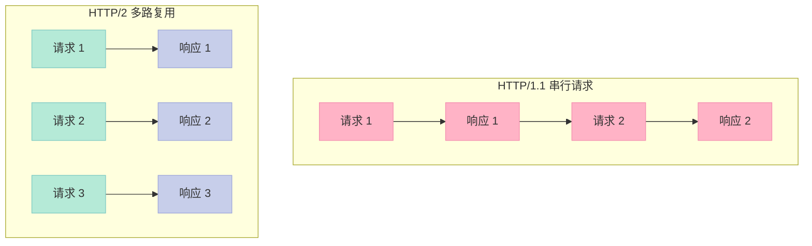

### 6.6 HTTP/3

HTTP/3 **不再基于 TCP**，而是基于 **QUIC（Quick UDP Internet Connections）** 协议（UDP 之上的可靠传输）。

| 维度 | HTTP/2 | HTTP/3 |
|------|--------|--------|
| 传输层 | TCP + TLS 1.2/1.3 | **QUIC（UDP + 自实现可靠性）** |
| 握手次数 | TCP 3 次 + TLS 3 次 = **6 次** | **1 次**（合并握手） |
| 队头阻塞 | 有（TCP 层） | **无**（QUIC 流独立） |
| 连接迁移 | ❌ 换 IP 需重连 | ✅ 支持（基于 Connection ID） |
| 加密 | 可选 | **强制** |

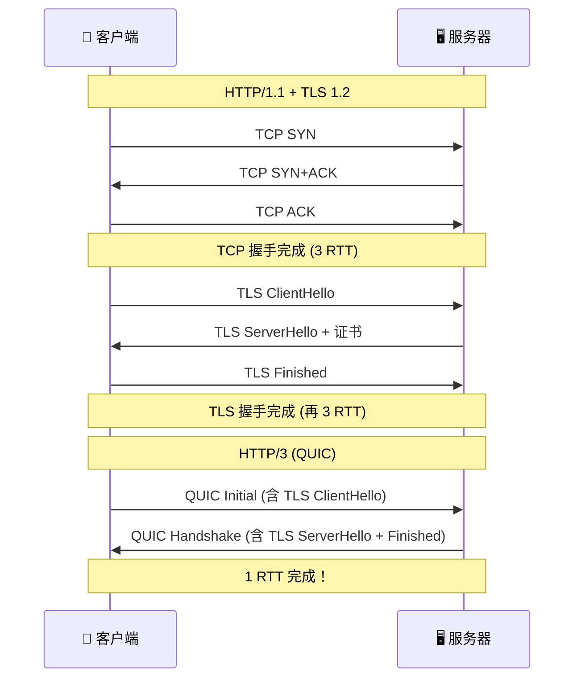

### 6.7 HTTP 各版本对比总表

| 特性 | HTTP/1.0 | HTTP/1.1 | HTTP/2 | HTTP/3 |
|------|---------|---------|--------|--------|
| 年份 | 1996 | 1999 | 2015 | 2022 |
| 传输层 | TCP | TCP | TCP | QUIC（UDP） |
| 连接方式 | 短连接 | 长连接 | 多路复用 | 多路复用 + 连接迁移 |
| 头部压缩 | ❌ | ❌ | HPACK | QPACK |
| 服务器推送 | ❌ | ❌ | ✅ | ✅ |
| 握手 RTT | 3 | 3 | 3 (+TLS 2-3) | **1-2** |
| 队头阻塞 | ❌ | ❌ | TCP 层有 | **彻底解决** |
| 加密 | 可选 | 可选 | 可选 | **强制** |

---

## 七、HTTPS 与 TLS 握手

### 7.1 HTTPS 是什么

**HTTPS = HTTP + TLS/SSL**，在 HTTP 和 TCP 之间插入了一层 TLS（Transport Layer Security）。

**默认端口**：443（HTTPS）vs 80（HTTP）

### 7.2 TLS 1.2 握手过程

```mermaid
sequenceDiagram
    participant C as 👤 客户端
    participant S as 🖥️ 服务器

    C->>S: ClientHello<br/>(支持的 TLS 版本、加密套件、随机数)
    S->>C: ServerHello<br/>(选定的加密套件、随机数)
    S->>C: Certificate<br/>(服务器证书)
    S->>C: ServerHelloDone
    C->>S: ClientKeyExchange<br/>(Pre-master secret)
    C->>S: ChangeCipherSpec
    C->>S: Finished
    S->>C: ChangeCipherSpec
    S->>C: Finished
    Note over C,S: 握手完成，开始加密通信

    style C fill:#C7CEEA,stroke:#9FA8DA,color:#333
    style S fill:#E8D5F5,stroke:#CE93D8,color:#333
```

### 7.3 TLS 1.3 的改进

| 改进点 | TLS 1.2 | TLS 1.3 |
|--------|---------|---------|
| 握手 RTT | 2 RTT | **1 RTT**（0-RTT 也支持） |
| 加密套件 | 多 | 只保留 AEAD 套件，去除不安全算法 |
| 前向保密（PFS） | 可选 | **强制** |
| 握手消息可见性 | 部分明文 | ServerHello 后全部加密 |

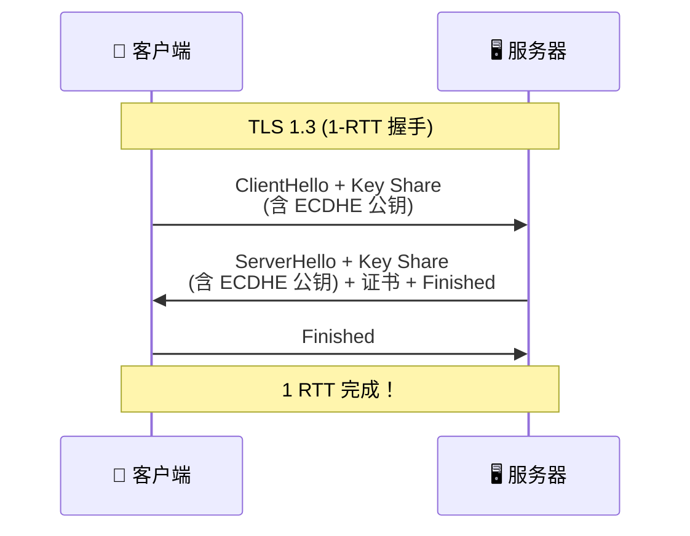

---

## 八、网络设备：集线器、交换机、路由器

### 8.1 各层网络设备对照表

| 设备 | 工作层 | 核心功能 | 转发依据 | 性能特点 |
|------|--------|---------|---------|---------|
| **集线器（Hub）** | 物理层（L1） | 信号放大、复制 | 无（广播所有端口） | 共享带宽，冲突域 |
| **中继器（Repeater）** | 物理层（L1） | 信号再生、延长传输距离 | 无 | 仅放大，无智能 |
| **网桥（Bridge）** | 数据链路层（L2） | 连接两个局域网段 | MAC 地址表 | 隔离冲突域 |
| **交换机（Switch）** | 数据链路层（L2） | 多端口网桥，高速转发 | MAC 地址表 | 每端口独立冲突域 |
| **路由器（Router）** | 网络层（L3） | 跨网段路由选择 | 路由表（IP） | 连接不同网络 |
| **网关（Gateway）** | 应用层（L7） | 协议转换、网络互连 | 协议映射 | 不同协议网络互连 |
| **三层交换机** | L2+L3 | 交换机 + 路由功能 | MAC + IP | 局域网核心 |

### 8.2 集线器 vs 交换机

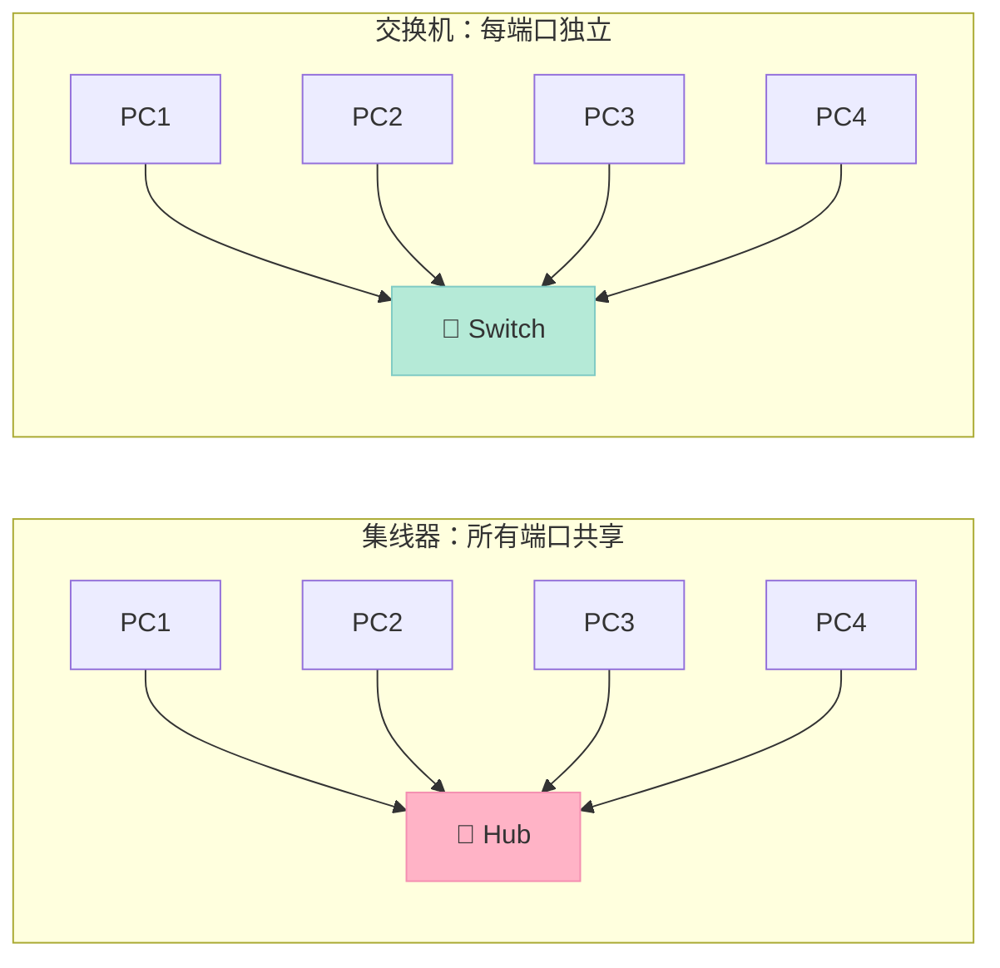

| 维度 | 集线器 | 交换机 |
|------|--------|--------|
| 工作层 | 物理层 | 数据链路层 |
| 转发方式 | 广播（所有端口） | MAC 学习（精确转发） |
| 冲突域 | 所有端口共享 | 每端口独立 |
| 带宽 | 共享（如 100Mbps） | 独享（如每口 1Gbps） |
| 是否已淘汰 | **基本淘汰** | 现代网络主力 |

---

## 九、socket 编程实战

### 9.1 socket API 总览

| API | 作用 | 协议 | 备注 |
|-----|------|------|------|
| `socket()` | 创建套接字 | 通用 | 返回 fd |
| `bind()` | 绑定地址 | 通用 | 服务器必用 |
| `listen()` | 开始监听 | TCP | 服务器专用 |
| `accept()` | 接受连接 | TCP | 服务器专用，阻塞 |
| `connect()` | 发起连接 | TCP | 客户端专用 |
| `send()` / `recv()` | TCP 收发 | TCP | 字节流 |
| `sendto()` / `recvfrom()` | UDP 收发 | UDP | 数据报 |
| `close()` | 关闭连接 | 通用 | 引用计数减 1 |

### 9.2 TCP 服务端代码

```cpp
// tcp_server.cpp
#include <iostream>
#include <cstring>
#include <unistd.h>
#include <arpa/inet.h>
#include <sys/socket.h>

int main() {
    // 1. 创建 socket
    int listen_fd = socket(AF_INET, SOCK_STREAM, 0);
    if (listen_fd < 0) {
        std::cerr << "socket failed\n";
        return -1;
    }

    // 2. 设置 SO_REUSEADDR（解决 TIME_WAIT 端口占用）
    int opt = 1;
    setsockopt(listen_fd, SOL_SOCKET, SO_REUSEADDR, &opt, sizeof(opt));

    // 3. 绑定地址
    sockaddr_in addr{};
    addr.sin_family = AF_INET;
    addr.sin_addr.s_addr = INADDR_ANY;  // 0.0.0.0
    addr.sin_port = htons(8080);
    if (bind(listen_fd, (sockaddr*)&addr, sizeof(addr)) < 0) {
        std::cerr << "bind failed\n";
        return -1;
    }

    // 4. 监听（backlog=128）
    if (listen(listen_fd, 128) < 0) {
        std::cerr << "listen failed\n";
        return -1;
    }
    std::cout << "Server listening on :8080\n";

    // 5. 接受连接循环
    while (true) {
        sockaddr_in client_addr{};
        socklen_t len = sizeof(client_addr);
        int conn_fd = accept(listen_fd, (sockaddr*)&client_addr, &len);
        if (conn_fd < 0) continue;

        char ip[INET_ADDRSTRLEN];
        inet_ntop(AF_INET, &client_addr.sin_addr, ip, sizeof(ip));
        std::cout << "Connection from " << ip
                  << ":" << ntohs(client_addr.sin_port) << "\n";

        // 6. 简单 echo
        char buf[1024];
        ssize_t n = recv(conn_fd, buf, sizeof(buf), 0);
        if (n > 0) {
            send(conn_fd, buf, n, 0);  // 回显
        }

        // 7. 关闭
        close(conn_fd);  // 触发 FIN，进入 FIN_WAIT_1
    }

    close(listen_fd);
    return 0;
}
```

### 9.3 TCP 客户端代码

```cpp
// tcp_client.cpp
#include <iostream>
#include <cstring>
#include <unistd.h>
#include <arpa/inet.h>
#include <sys/socket.h>

int main() {
    // 1. 创建 socket（客户端通常不需要 bind）
    int sock = socket(AF_INET, SOCK_STREAM, 0);

    // 2. 直接 connect
    sockaddr_in server_addr{};
    server_addr.sin_family = AF_INET;
    server_addr.sin_port = htons(8080);
    inet_pton(AF_INET, "127.0.0.1", &server_addr.sin_addr);

    if (connect(sock, (sockaddr*)&server_addr, sizeof(server_addr)) < 0) {
        std::cerr << "connect failed\n";
        return -1;
    }

    // 3. 收发数据
    const char* msg = "Hello, TCP!";
    send(sock, msg, strlen(msg), 0);

    char buf[1024] = {0};
    recv(sock, buf, sizeof(buf), 0);
    std::cout << "Received: " << buf << "\n";

    // 4. 关闭连接（主动关闭方，会进入 TIME_WAIT）
    close(sock);

    return 0;
}
```

### 9.4 客户端为什么不需要 bind？

| 维度 | bind | 说明 |
|------|------|------|
| **客户端** | ❌ 不需要 | 系统自动分配临时端口（49152-65535） |
| **服务端** | ✅ 必须 | 必须固定端口监听，否则客户端找不到 |

**客户端 bind 的副作用**：
- 占用了固定端口，多个连接无法复用
- 多网卡环境下，需要手动选择出口 IP
- 所以客户端通常让 OS 自动分配端口

### 9.5 UDP 服务端

```cpp
// udp_server.cpp
#include <iostream>
#include <cstring>
#include <unistd.h>
#include <arpa/inet.h>

int main() {
    int sock = socket(AF_INET, SOCK_DGRAM, 0);  // UDP 用 SOCK_DGRAM

    sockaddr_in addr{};
    addr.sin_family = AF_INET;
    addr.sin_addr.s_addr = INADDR_ANY;
    addr.sin_port = htons(9090);
    bind(sock, (sockaddr*)&addr, sizeof(addr));

    std::cout << "UDP Server on :9090\n";

    while (true) {
        char buf[1024];
        sockaddr_in client_addr{};
        socklen_t len = sizeof(client_addr);

        // UDP 没有 accept 和 connect，直接 recvfrom
        ssize_t n = recvfrom(sock, buf, sizeof(buf), 0,
                             (sockaddr*)&client_addr, &len);
        if (n > 0) {
            std::cout << "Recv " << n << " bytes\n";
            sendto(sock, buf, n, 0,
                   (sockaddr*)&client_addr, len);  // 回显
        }
    }

    close(sock);
    return 0;
}
```

### 9.6 send 和 recv 的缺点

| API | 缺点 |
|-----|------|
| `send` | 仅适用于已连接的 socket；阻塞模式下可能一直等待 |
| `recv` | 阻塞模式下没有数据时一直等待；可能读到部分数据 |
| **共同问题** | 1. 阻塞导致单线程只能服务一个连接<br/>2. 无内置超时机制<br/>3. 不支持零拷贝 |

**改进方向**：使用 `select` / `poll` / `epoll` 实现非阻塞 I/O + 多路复用。

---

## 十、I/O 多路复用：select / poll / epoll

### 10.1 三者对比

| 维度 | select | poll | epoll |
|------|--------|------|-------|
| 数据结构 | 位图（fd_set） | 链表（pollfd 数组） | 红黑树 + 就绪链表 |
| 最大 fd 数 | 1024（FD_SETSIZE） | 无上限 | 无上限（受限于内存） |
| 时间复杂度 | O(n) | O(n) | O(1) |
| 内核实现 | 轮询 | 轮询 | **回调（callback）** |
| 触发模式 | LT（水平触发） | LT | **LT + ET（边沿触发）** |
| 跨平台 | ✅ | ✅ | ❌ 仅 Linux |
| 适用场景 | 跨平台、fd 少 | fd 较多但仍要轮询 | **高并发首选** |

### 10.2 epoll 的核心数据结构

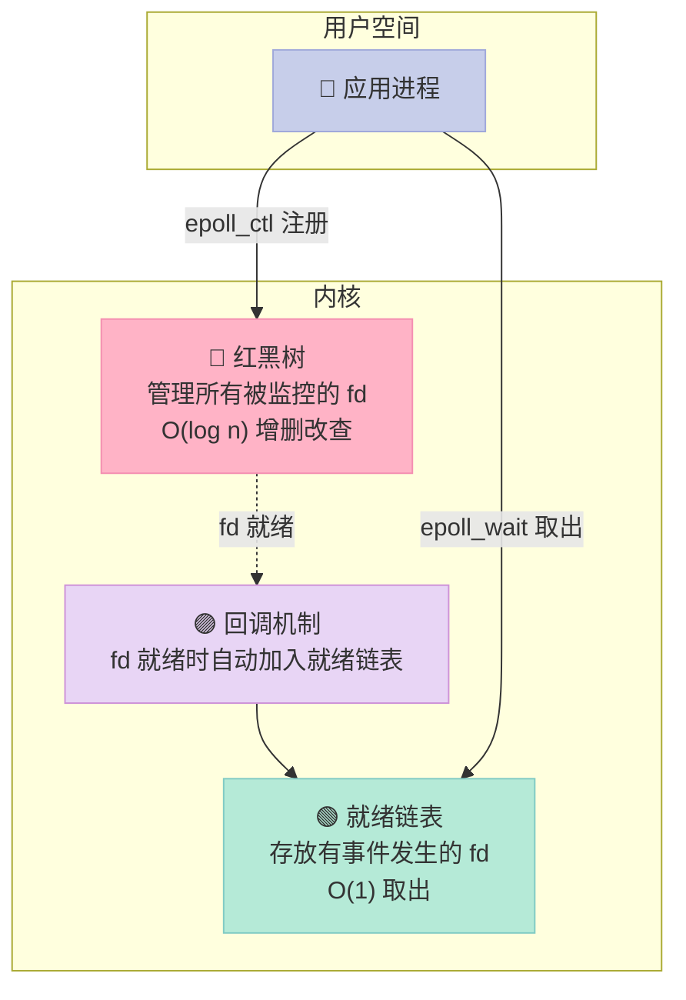

### 10.3 epoll 服务器示例

```cpp
// epoll_server.cpp
#include <iostream>
#include <unistd.h>
#include <arpa/inet.h>
#include <sys/epoll.h>
#include <fcntl.h>

int main() {
    int listen_fd = socket(AF_INET, SOCK_STREAM, 0);
    sockaddr_in addr{};
    addr.sin_family = AF_INET;
    addr.sin_addr.s_addr = INADDR_ANY;
    addr.sin_port = htons(8080);
    bind(listen_fd, (sockaddr*)&addr, sizeof(addr));
    listen(listen_fd, 128);

    // 1. 创建 epoll 实例
    int epfd = epoll_create1(0);

    // 2. 把 listen_fd 加入 epoll
    epoll_event ev{};
    ev.events = EPOLLIN;  // 关注读事件
    ev.data.fd = listen_fd;
    epoll_ctl(epfd, EPOLL_CTL_ADD, listen_fd, &ev);

    // 3. 事件循环
    epoll_event events[1024];
    while (true) {
        int n = epoll_wait(epfd, events, 1024, -1);  // 阻塞
        for (int i = 0; i < n; i++) {
            if (events[i].data.fd == listen_fd) {
                // 新连接
                sockaddr_in client_addr{};
                socklen_t len = sizeof(client_addr);
                int conn_fd = accept(listen_fd,
                                     (sockaddr*)&client_addr, &len);

                // 设置非阻塞
                int flags = fcntl(conn_fd, F_GETFL, 0);
                fcntl(conn_fd, F_SETFL, flags | O_NONBLOCK);

                // 加入 epoll（用 ET 模式）
                ev.events = EPOLLIN | EPOLLET;  // 边沿触发
                ev.data.fd = conn_fd;
                epoll_ctl(epfd, EPOLL_CTL_ADD, conn_fd, &ev);
            } else {
                // 已连接 fd 可读
                int fd = events[i].data.fd;
                char buf[1024];
                ssize_t nr = recv(fd, buf, sizeof(buf), 0);
                if (nr <= 0) {
                    // 客户端关闭或出错
                    close(fd);
                    epoll_ctl(epfd, EPOLL_CTL_DEL, fd, nullptr);
                } else {
                    send(fd, buf, nr, 0);  // 回显
                }
            }
        }
    }

    close(listen_fd);
    close(epfd);
    return 0;
}
```

### 10.4 LT vs ET 触发模式

| 模式 | 行为 | 适用 |
|------|------|------|
| **LT（Level Triggered，水平触发）** | 只要缓冲区有数据，每次 epoll_wait 都会通知 | **默认**，简单可靠 |
| **ET（Edge Triggered，边沿触发）** | 只在状态变化时通知一次，必须一次性读完 | 高性能场景，配合非阻塞 I/O |

> ET 模式下必须使用非阻塞 fd，且必须循环 read 直到 EAGAIN，否则会丢数据。

---

## 十一、Reactor vs Proactor 模式

### 11.1 两种模式对比

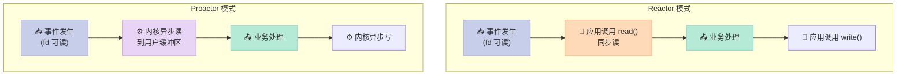

| 维度 | Reactor | Proactor |
|------|---------|----------|
| **I/O 谁做** | 应用线程 | **内核** |
| **应用做什么** | 读/写操作 | 仅业务处理 |
| **同步性** | 同步 I/O | 异步 I/O |
| **代表实现** | epoll、libevent、Netty | **IOCP（Windows）**、Boost.Asio |
| **适用系统** | Linux | Windows |

---

## 十二、DNS 与子网掩码

### 12.1 DNS 是什么

**DNS（Domain Name System，域名系统）** 是互联网的"电话簿"，把 `www.example.com` 解析成 `93.184.216.34`。

#### DNS 查询过程

```mermaid
sequenceDiagram
    participant U as 👤 用户
    participant L as 📍 本地 DNS
    participant R as 🌍 根 DNS
    participant T as 🌐 顶级域 DNS (.com)
    participant A as 🏷️ 权威 DNS

    U->>L: 查询 www.example.com
    L->>R: 查询
    R->>L: 返回 .com 顶级域服务器地址
    L->>T: 查询 example.com
    T->>L: 返回 example.com 权威服务器
    L->>A: 查询 www.example.com
    A->>L: 返回 IP 93.184.216.34
    L->>U: 返回 IP

    style U fill:#C7CEEA,stroke:#9FA8DA,color:#333
    style L fill:#E8D5F5,stroke:#CE93D8,color:#333
    style R fill:#FFDAB9,stroke:#FFAB76,color:#333
    style T fill:#FFDAB9,stroke:#FFAB76,color:#333
    style A fill:#B5EAD7,stroke:#80CBC4,color:#333
```

#### DNS 记录类型

| 记录 | 用途 | 例子 |
|------|------|------|
| **A** | 域名 → IPv4 | `example.com → 93.184.216.34` |
| **AAAA** | 域名 → IPv6 | `example.com → 2606:2800:220:1::1` |
| **CNAME** | 别名 → 真实域名 | `www → example.com` |
| **MX** | 邮件服务器 | `mail.example.com` |
| **NS** | 权威 DNS 服务器 | `ns1.example.com` |
| **TXT** | 文本记录（SPF、DKIM） | `v=spf1 ...` |

### 12.2 子网掩码有什么用？

**子网掩码（Subnet Mask）** 用来区分 IP 地址中的**网络部分**和**主机部分**。

#### 子网划分示例

假设 IP 是 `192.168.1.100`，子网掩码是 `255.255.255.0`：

```
IP 地址   : 11000000.10101000.00000001.01100100   (192.168.1.100)
子网掩码   : 11111111.11111111.11111111.00000000   (255.255.255.0)
网络号     : 11000000.10101000.00000001.00000000   (192.168.1.0)
主机号     : 00000000.00000000.00000000.01100100   (0.0.0.100)
```

| 概念 | 作用 |
|------|------|
| **网络号** | 标识设备所在的网络/子网 |
| **主机号** | 标识网络内的具体设备 |
| **子网掩码** | 1 对应网络号，0 对应主机号 |

#### CIDR 表示法

| 写法 | 含义 | 主机数 |
|------|------|--------|
| `192.168.1.0/24` | 前 24 位为网络号 | 2^8 - 2 = 254 |
| `192.168.1.0/16` | 前 16 位为网络号 | 2^16 - 2 = 65534 |
| `10.0.0.0/8` | 前 8 位为网络号 | 2^24 - 2 = 16777214 |

#### 路由器的功能

| 功能 | 说明 |
|------|------|
| **路径选择** | 根据路由表选择最优路径 |
| **分组转发** | 把 IP 包从一个接口转到另一个 |
| **网络隔离** | 不同子网通过路由器隔离 |
| **NAT** | 网络地址转换（私网 → 公网） |
| **DHCP** | 动态分配 IP |
| **防火墙** | 基础的包过滤 |

---

## 十三、Linux 文件系统：软链接 vs 硬链接

### 13.1 软链接（Symbolic Link）

```bash
# 创建软链接
ln -s /path/to/source /path/to/symlink

# 软链接是一个独立的文件，内容是源文件的路径
```

| 特性 | 说明 |
|------|------|
| 本质 | 独立文件，内容是源文件的**路径字符串** |
| 跨文件系统 | ✅ 可以 |
| 链接目录 | ✅ 可以 |
| 删除源文件 | **软链接失效（dangling）** |
| inode | **软链接有自己的 inode** |
| 文件大小 | 等于路径字符串长度 |

### 13.2 硬链接（Hard Link）

```bash
# 创建硬链接
ln /path/to/source /path/to/hardlink

# 硬链接是同一个 inode 的另一个名字
```

| 特性 | 说明 |
|------|------|
| 本质 | **同一个 inode 的别名** |
| 跨文件系统 | ❌ 不可以（inode 只在本文件系统有效） |
| 链接目录 | ❌ 不可以（避免循环） |
| 删除源文件 | **硬链接仍可访问**（链接数减 1） |
| inode | **与源文件共享 inode** |
| 文件大小 | 与源文件相同 |

### 13.3 软硬链接对比

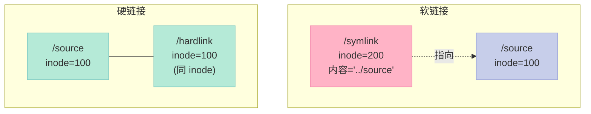

| 维度 | 软链接 | 硬链接 |
|------|--------|--------|
| 本质 | 快捷方式 | 别名 |
| inode | 独立 inode | 共享 inode |
| 跨文件系统 | ✅ | ❌ |
| 链接目录 | ✅ | ❌ |
| 删除源文件 | 失效 | 仍可访问 |
| 链接数 | 不影响 | +1 |

### 13.4 回答面试题：删除了软连接的源文件，软连接可用吗？

**答：不可用，会成为"悬空链接"（dangling symlink）**。

```bash
$ echo "hello" > /tmp/source
$ ln -s /tmp/source /tmp/link
$ cat /tmp/link
hello
$ rm /tmp/source
$ cat /tmp/link
cat: /tmp/link: No such file or directory   # 报错
$ ls -l /tmp/link
lrwxrwxrwx 1 user user 12 Jun 16 02:00 /tmp/link -> /tmp/source
# 但路径仍然存在，链接已失效
```

**判断软链接是否失效的方法**：

```bash
# 方法 1：用 readlink
readlink -f /tmp/link  # 如果源文件不存在，无输出

# 方法 2：用 stat
stat /tmp/link  # 看返回是否报错

# 方法 3：用 test
test -e /tmp/link && echo "可用" || echo "失效"
```

---

## 十四、抓包实战：用 tcpdump 分析三次握手

### 14.1 tcpdump 常用命令

```bash
# 抓取所有 TCP 包，显示到终端
tcpdump -i eth0 tcp

# 抓取特定端口
tcpdump -i eth0 port 8080

# 抓取并保存到文件（用 Wireshark 打开）
tcpdump -i eth0 -w capture.pcap port 8080

# 显示 ASCII 内容
tcpdump -i eth0 -A port 80

# 详细模式，显示 SYN/FIN/ACK 等标志位
tcpdump -i eth0 -nn -v port 8080
```

### 14.2 三次握手抓包示例

在终端 1 启动服务端：
```bash
$ nc -l 8080  # 用 netcat 监听 8080
```

在终端 2 启动抓包：
```bash
$ tcpdump -i lo -nn -S 'port 8080'
```

在终端 3 客户端连接：
```bash
$ nc localhost 8080
```

抓包输出（精简）：

```bash
# 第一次握手：客户端 → 服务器
02:00:01.000 IP 127.0.0.1.54321 > 127.0.0.1.8080: Flags [S], seq 1234567890
        win 65535, options [mss 65495, sackOK, TS val 100 ecr 0], length 0

# 第二次握手：服务器 → 客户端
02:00:01.001 IP 127.0.0.1.8080 > 127.0.0.1.54321: Flags [S.], seq 9876543210, ack 1234567891
        win 65535, options [mss 65495, sackOK, TS val 200 ecr 100], length 0

# 第三次握手：客户端 → 服务器
02:00:01.002 IP 127.0.0.1.54321 > 127.0.0.1.8080: Flags [.], ack 9876543211
        win 65535, options [TS val 100 ecr 200], length 0

# 数据传输
02:00:02.000 IP 127.0.0.1.54321 > 127.0.0.1.8080: Flags [P.], seq 1:13, ack 1
        win 65535, length 12: HTTP
```

**解读标志位**：

| 标志 | 含义 |
|------|------|
| `[S]` | SYN（第一次握手） |
| `[S.]` | SYN + ACK（第二次握手，`.` 表示 ACK） |
| `[.]` | ACK（第三次握手） |
| `[P.]` | PSH + ACK（数据传输） |
| `[F.]` | FIN + ACK（四次挥手） |
| `[R]` | RST（连接重置） |

### 14.3 用 Wireshark 查看三次握手流程图

```bash
# 1. 抓包保存
tcpdump -i eth0 -w handshake.pcap port 8080

# 2. Wireshark 打开 handshake.pcap
# 3. 菜单 Statistics → Flow Graph → TCP Flow
# 4. 可以直观看到三次握手 + 数据传输 + 四次挥手
```

---

## 十五、常见应用层协议速查

### 15.1 应用层协议与端口

| 协议 | 端口 | 传输层 | 用途 |
|------|------|--------|------|
| **HTTP** | 80 | TCP | 网页 |
| **HTTPS** | 443 | TCP | 加密网页 |
| **DNS** | 53 | UDP（主）/TCP（大） | 域名解析 |
| **SSH** | 22 | TCP | 远程登录 |
| **FTP** | 21（控制）+ 20（数据） | TCP | 文件传输 |
| **SFTP** | 22 | TCP | 安全文件传输 |
| **SMTP** | 25 | TCP | 邮件发送 |
| **POP3** | 110 | TCP | 邮件接收 |
| **IMAP** | 143 | TCP | 邮件接收（支持同步） |
| **DHCP** | 67（服务器）/ 68（客户端） | UDP | 自动分配 IP |
| **SNMP** | 161/162 | UDP | 网络管理 |
| **NTP** | 123 | UDP | 时间同步 |
| **RDP** | 3389 | TCP | Windows 远程桌面 |
| **Redis** | 6379 | TCP | 内存数据库 |
| **MySQL** | 3306 | TCP | 数据库 |
| **MongoDB** | 27017 | TCP | NoSQL 数据库 |

### 15.2 网络层 / 链路层协议

| 协议 | 层级 | 用途 |
|------|------|------|
| **IP** | 网络层 | 寻址和路由 |
| **ICMP** | 网络层 | 控制消息（ping、traceroute） |
| **ARP** | 网络层（实际在 L2-L3 之间） | IP → MAC 地址映射 |
| **RARP** | 网络层 | MAC → IP 反向解析（已淘汰） |
| **IGMP** | 网络层 | 组播组管理 |
| **OSPF** | 网络层 | 链路状态路由协议 |
| **BGP** | 网络层 | 边界网关协议（互联网骨干） |
| **Ethernet** | 数据链路层 | 主流局域网技术 |
| **PPP** | 数据链路层 | 点对点连接（拨号） |
| **VLAN** | 数据链路层 | 虚拟局域网 |

---

## 十六、面试高频追问与陷阱

### 16.1 TCP 常见追问

| 追问 | 关键回答 |
|------|---------|
| **为什么 TIME_WAIT 是 2MSL？** | 去程 1 MSL + 回程 1 MSL，覆盖 ACK 重传和旧分组消失 |
| **TIME_WAIT 太多怎么办？** | SO_REUSEADDR、SO_REUSEPORT、调整内核参数 `tcp_tw_reuse` |
| **CLOSE_WAIT 太多说明什么？** | 代码 bug：对端关闭后，本端没调用 close |
| **为什么 HTTP 服务器用短连接时代码简单，长连接要心跳？** | 长连接不传输数据时无法感知对端存活，需要 keepalive |
| **TCP keepalive 和 HTTP keep-alive 是一回事吗？** | ❌ 不是！TCP keepalive 是协议层心跳；HTTP keep-alive 是连接复用 |

### 16.2 HTTP 常见追问

| 追问 | 关键回答 |
|------|---------|
| **HTTP 是无状态的吗？怎么保持登录状态？** | 是无状态的；用 Cookie + Session，或 JWT |
| **GET 和 POST 区别？** | 语义不同（幂等 vs 非幂等）；实现可相同 |
| **HTTP/2 多路复用怎么解决队头阻塞？** | 单个 TCP 连接上多个 Stream 独立，但 TCP 层丢包仍会阻塞 |
| **HTTP/3 为什么用 UDP？** | 避免 TCP 队头阻塞 + 0-RTT 握手 + 连接迁移 |
| **HTTPS 中间人攻击怎么防？** | 证书 + CA 链验证 + 证书绑定（HPKP 已废弃，用 Expect-CT） |

### 16.3 性能调优关键词

| 场景 | 优化方向 |
|------|---------|
| **高并发短连接** | `SO_REUSEADDR` + `tcp_tw_reuse` |
| **高并发长连接** | epoll + 线程池 + 连接池 |
| **大文件传输** | sendfile、splice、零拷贝 |
| **低延迟通信** | TCP_NODELAY、关闭 Nagle + 延迟确认 |
| **海量连接** | epoll ET 模式 + 多线程 + 协程 |

---

## 十七、实战：构造一个简易 HTTP 客户端

```cpp
// http_client.cpp - 原始 socket 实现 HTTP 请求
#include <iostream>
#include <cstring>
#include <unistd.h>
#include <arpa/inet.h>
#include <netdb.h>

int main(int argc, char** argv) {
    if (argc < 2) {
        std::cerr << "Usage: " << argv[0] << " hostname\n";
        return -1;
    }

    // 1. 域名解析
    hostent* he = gethostbyname(argv[1]);
    if (!he) {
        std::cerr << "DNS resolve failed\n";
        return -1;
    }

    // 2. 创建 socket 并连接 80 端口
    int sock = socket(AF_INET, SOCK_STREAM, 0);
    sockaddr_in addr{};
    addr.sin_family = AF_INET;
    addr.sin_port = htons(80);
    memcpy(&addr.sin_addr, he->h_addr_list[0], he->h_length);

    if (connect(sock, (sockaddr*)&addr, sizeof(addr)) < 0) {
        std::cerr << "connect failed\n";
        return -1;
    }

    // 3. 构造 HTTP 请求
    std::string request =
        "GET / HTTP/1.1\r\n"
        "Host: " + std::string(argv[1]) + "\r\n"
        "Connection: close\r\n"
        "User-Agent: SimpleClient/1.0\r\n"
        "\r\n";

    // 4. 发送请求
    send(sock, request.c_str(), request.size(), 0);

    // 5. 接收响应
    char buf[4096];
    ssize_t n;
    while ((n = recv(sock, buf, sizeof(buf) - 1, 0)) > 0) {
        buf[n] = '\0';
        std::cout << buf;
    }

    // 6. 关闭
    close(sock);
    return 0;
}
```

编译运行：
```bash
$ g++ http_client.cpp -o http_client
$ ./http_client example.com
HTTP/1.1 200 OK
Content-Type: text/html
...
```

---

## 十八、总结 & 行动建议

### 18.1 知识脑图

```mermaid
graph TB
    ROOT["🌐 网络协议知识体系"]

    ROOT --> M1["📐 网络模型"]
    ROOT --> M2["🔗 TCP 详解"]
    ROOT --> M3["📡 UDP"]
    ROOT --> M4["🌍 HTTP 协议"]
    ROOT --> M5["⚙️ socket 编程"]
    ROOT --> M6["🔧 网络设备"]

    M1 --> M1A["OSI 7 层"]
    M1 --> M1B["TCP/IP 4 层"]

    M2 --> M2A["三次握手"]
    M2 --> M2B["四次挥手"]
    M2 --> M2C["11 种状态"]
    M2 --> M2D["滑动窗口"]
    M2 --> M2E["拥塞控制 4 算法"]
    M2 --> M2F["4 大计时器"]

    M4 --> M4A["HTTP/1.0/1.1"]
    M4 --> M4B["HTTP/2"]
    M4 --> M4C["HTTP/3 / QUIC"]
    M4 --> M4D["HTTPS / TLS"]

    M5 --> M5A["TCP API"]
    M5 --> M5B["UDP API"]
    M5 --> M5C["epoll"]
    M5 --> M5D["Reactor"]

    style ROOT fill:#E8D5F5,stroke:#CE93D8,color:#333
    style M1 fill:#C7CEEA,stroke:#9FA8DA,color:#333
    style M2 fill:#FFB3C6,stroke:#F48FB1,color:#333
    style M3 fill:#FFDAB9,stroke:#FFAB76,color:#333
    style M4 fill:#B5EAD7,stroke:#80CBC4,color:#333
    style M5 fill:#FFF9C4,stroke:#F9A825,color:#333
    style M6 fill:#F5F5F5,color:#333
```

### 18.2 给 C++ 后端工程师的行动建议

| 阶段 | 行动 |
|------|------|
| **入门** | 用 raw socket 实现一个 echo 服务（TCP + UDP 各一个） |
| **进阶** | 实现一个 HTTP 服务器（解析请求、返回静态文件） |
| **高级** | 用 epoll 实现高并发 echo 服务（10000+ 连接） |
| **专家** | 学习 muduo / libevent / Boost.Asio 源码，理解 Reactor 模式 |
| **加分** | 用 tcpdump 抓包分析实际应用（如 MySQL、Redis）的协议交互 |

### 18.3 思考延伸题（留给大家）

1. **为什么 CDN 加速静态资源用 HTTP/2 甚至 HTTP/3 更合适？**
2. **QUIC 0-RTT 握手机制有什么安全隐患？怎么解决？**
3. **如果让你设计一个直播协议，你会基于 TCP 还是 UDP？为什么？**
4. **在高并发场景下，time_wait 数量巨大，你有哪些优化手段？**
5. **为什么 HTTP/2 的 HPACK 压缩算法是专门为头部设计的，而不是用通用的 gzip？**

---

## 附录：系列导航

「C++ 面试题集锦」系列全部文章列表：

| 篇数 | 标题 | 链接 |
|------|------|------|
| 第 1 篇 | C++ 基础语法与面向对象 | [2026-05-01-cpp-interview-01-basics.md](2026-05-01-cpp-interview-01-basics.md) |
| 第 2 篇 | C++ 11/14/17 新特性 | [2026-05-05-cpp-interview-02-modern-cpp.md](2026-05-05-cpp-interview-02-modern-cpp.md) |
| 第 3 篇 | 智能指针与内存管理 | [2026-05-09-cpp-interview-03-smart-pointer.md](2026-05-09-cpp-interview-03-smart-pointer.md) |
| 第 4 篇 | 多线程与并发编程 | [2026-05-13-cpp-interview-04-multithread.md](2026-05-13-cpp-interview-04-multithread.md) |
| 第 5 篇 | 进程与线程 | [2026-05-17-cpp-interview-05-process-thread.md](2026-05-17-cpp-interview-05-process-thread.md) |
| 第 6 篇 | 锁机制与无锁编程 | [2026-05-21-cpp-interview-06-lock.md](2026-05-21-cpp-interview-06-lock.md) |
| 第 7 篇 | STL 容器与算法 | [2026-05-25-cpp-interview-07-stl.md](2026-05-25-cpp-interview-07-stl.md) |
| 第 8 篇 | 模板与泛型编程 | [2026-05-29-cpp-interview-08-template.md](2026-05-29-cpp-interview-08-template.md) |
| 第 9 篇 | 编译、链接与装载 | [2026-06-02-cpp-interview-09-compile-link.md](2026-06-02-cpp-interview-09-compile-link.md) |
| 第 10 篇 | Linux 系统调用 | [2026-06-06-cpp-interview-10-syscall.md](2026-06-06-cpp-interview-10-syscall.md) |
| 第 11 篇 | 进程间通信（IPC） | [2026-06-10-cpp-interview-11-ipc.md](2026-06-10-cpp-interview-11-ipc.md) |
| 第 12 篇 | 设计模式与架构 | [2026-06-13-cpp-interview-12-design-pattern.md](2026-06-13-cpp-interview-12-design-pattern.md) |
| 第 13 篇 | 性能优化与调优 | [2026-06-15-cpp-interview-13-performance.md](2026-06-15-cpp-interview-13-performance.md) |
| **第 14 篇** | **网络协议**（本文） | **2026-06-16-cpp-interview-14-network-protocols.md** |
| 第 15 篇 | 数据库与存储 | [2026-06-20-cpp-interview-15-database.md](2026-06-20-cpp-interview-15-database.md) |
| 第 16 篇 | 分布式系统与微服务 | [2026-06-24-cpp-interview-16-distributed.md](2026-06-24-cpp-distributed.md) |

---

> **本文核心金句**：**网络协议是 C++ 后端的"语言"，TCP 三次握手不是为了"礼仪"，而是为了在不可靠的网络上建立可靠的双向通信。理解 11 种状态、4 大计时器、滑动窗口、拥塞控制，你就能在面试中让任何追问都有答案。**

---

*本文 18 个章节，约 1300 行代码与表格，覆盖 C++ 后端面试中所有高频网络协议问题。建议收藏，遇到具体问题时按章节查阅。*