> **核心结论**：**算法是 C++ 面试的"硬通货"**——大厂面试 70% 以上的编码题本质都是数据结构与算法的变体。掌握 10 种排序的稳定性与复杂度、5 大查找的应用场景、二叉树/红黑树/B+ 树的取舍、KMP/BM 字符串匹配原理、动态规划的状态转移方程，再刷透 LeetCode 200 题，面试算法题基本可以躺过。

---

## 一、开篇：面试官：万个数找第 20 大？你会几种解法？

如果你在面试中遇到这道题："**从一个无序的 1 万个整数中，找到第 20 大的数**"，你能想到几种解法？哪种最快？

| 解法 | 时间复杂度 | 空间复杂度 | 适用场景 |
|------|-----------|-----------|----------|
| 全排序后取第 k 大 | `O(n log n)` | `O(1)` | 数据量小 |
| 冒泡 k 次 | `O(nk)` | `O(1)` | k 极小 |
| 最小堆（k 大小） | `O(n log k)` | `O(k)` | ✅ **推荐** |
| 快速选择（quickselect） | `O(n)` 均值 / `O(n²)` 最坏 | `O(log n)` | ✅ **数据量大时最优** |

**正确答案是最小堆或快速选择**。这道题看似简单，却能考察你对**排序、堆、快排**三大算法的综合理解。而这，只是数据结构与算法面试题的冰山一角。

读完本文，你将获得：

- 画出 **10 种排序算法**的时间/空间/稳定性对比表
- 手写 **5 种查找算法**的完整实现
- 区分 **AVL / 红黑树 / B 树 / B+ 树**的适用场景
- 实现 **单链表反转、判断环、找交点**
- 推导 **KMP 的 next 数组**
- 写出 **动态规划**的状态转移方程（背包、LCS、回文）
- 实现一个 **LRU 缓存**和**一致性哈希**

---

## 二、时间复杂度与空间复杂度分析

### 2.1 大 O 表示法

**时间复杂度**（Time Complexity）描述算法执行时间随输入规模 `n` 的增长趋势，**空间复杂度**（Space Complexity）描述算法额外占用空间随 `n` 的增长趋势。

| 复杂度 | 名称 | 示例 | n=1000 时大致操作数 |
|--------|------|------|---------------------|
| `O(1)` | 常数 | 数组按下标访问 | 1 |
| `O(log n)` | 对数 | 二分查找 | 10 |
| `O(n)` | 线性 | 遍历数组 | 1000 |
| `O(n log n)` | 线性对数 | 快排、归并 | 10000 |
| `O(n²)` | 平方 | 冒泡、选择 | 1,000,000 |
| `O(2ⁿ)` | 指数 | 斐波那契递归 | 1.07e301 |
| `O(n!)` | 阶乘 | 全排列 | 远超宇宙原子数 |

### 2.2 复杂度分析的三个原则

| 原则 | 说明 | 示例 |
|------|------|------|
| **只保留最高阶项** | 低阶项和常数忽略 | `3n² + 5n + 100` → `O(n²)` |
| **乘法法则** | 嵌套循环相乘 | 双层循环 → `O(n²)` |
| **加法法则** | 并列循环相加，取大者 | 一个 `O(n)` + 一个 `O(n²)` → `O(n²)` |

### 2.3 摊还复杂度（Amortized Complexity）

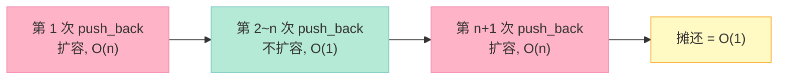

`std::vector` 的 `push_back` 是**均摊 O(1)**：单次扩容 `O(n)`，但 n 次扩容总共 `O(n)`，所以单次均摊 `O(1)`。这是面试官最爱追问的细节之一。

---

## 三、10 大排序算法全解

### 3.1 排序算法全景对比

这是面试必背的"**第一表**"：

| 排序算法 | 平均时间 | 最坏时间 | 最好时间 | 空间复杂度 | 稳定性 | 适用场景 |
|---------|---------|---------|---------|-----------|--------|----------|
| **冒泡排序** | `O(n²)` | `O(n²)` | `O(n)` | `O(1)` | ✅ 稳定 | 教学、小数据、已基本有序 |
| **选择排序** | `O(n²)` | `O(n²)` | `O(n²)` | `O(1)` | ❌ 不稳定 | 简单场景 |
| **插入排序** | `O(n²)` | `O(n²)` | `O(n)` | `O(1)` | ✅ 稳定 | 接近有序的少量数据 |
| **希尔排序** | `O(n log n)` | `O(n²)` | `O(n)` | `O(1)` | ❌ 不稳定 | 中等规模 |
| **归并排序** | `O(n log n)` | `O(n log n)` | `O(n log n)` | `O(n)` | ✅ 稳定 | 大数据、外部排序 |
| **快速排序** | `O(n log n)` | `O(n²)` | `O(n log n)` | `O(log n)` | ❌ 不稳定 | ✅ **最常用** |
| **堆排序** | `O(n log n)` | `O(n log n)` | `O(n log n)` | `O(1)` | ❌ 不稳定 | topK、大数据 |
| **计数排序** | `O(n + k)` | `O(n + k)` | `O(n + k)` | `O(k)` | ✅ 稳定 | 数据范围小 |
| **桶排序** | `O(n + k)` | `O(n²)` | `O(n)` | `O(n + k)` | ✅ 稳定 | 均匀分布的浮点数 |
| **基数排序** | `O(n × k)` | `O(n × k)` | `O(n × k)` | `O(n + k)` | ✅ 稳定 | 整数、字符串 |

> `k` 表示数据范围或桶的数量。

### 3.2 稳定性详解

**稳定排序**指相等元素排序后相对位置不变。例如：对 `(3, 1), (3, 2), (2, 1)` 排序后，两个 `(3, ...)` 的先后顺序不能变。

| 维度 | 稳定排序 | 不稳定排序 |
|------|---------|-----------|
| 适合场景 | 多级排序（如先按部门排，再按工资排） | 内存敏感场景 |
| 常见算法 | 冒泡、插入、归并、计数、桶、基数 | 选择、希尔、快排、堆排 |

### 3.3 冒泡排序（Bubble Sort）

**原理**：相邻元素两两比较，将最大值"冒泡"到末尾。优化点：加 `swapped` 标志位提前终止。

```cpp
// 冒泡排序：稳定，O(n²) 时间，O(1) 空间
void bubbleSort(vector<int>& arr) {
    int n = arr.size();
    for (int i = 0; i < n - 1; ++i) {
        bool swapped = false;  // 优化：检测是否已排好
        for (int j = 0; j < n - 1 - i; ++j) {
            if (arr[j] > arr[j + 1]) {
                swap(arr[j], arr[j + 1]);
                swapped = true;
            }
        }
        if (!swapped) break;  // 已经有序，提前结束
    }
}
```

### 3.4 选择排序（Selection Sort）

**原理**：每次从未排序区间选出最小元素，放到已排序区间末尾。

```cpp
// 选择排序：不稳定（会改变相等元素相对位置），O(n²) 时间，O(1) 空间
void selectionSort(vector<int>& arr) {
    int n = arr.size();
    for (int i = 0; i < n - 1; ++i) {
        int minIdx = i;
        for (int j = i + 1; j < n; ++j) {
            if (arr[j] < arr[minIdx]) {
                minIdx = j;
            }
        }
        swap(arr[i], arr[minIdx]);  // 交换可能不稳定
    }
}
```

### 3.5 插入排序（Insertion Sort）

**原理**：将数组分为已排序区间和未排序区间，每次取未排序元素插入已排序区间。

```cpp
// 插入排序：稳定，O(n²) 时间，O(1) 空间
void insertionSort(vector<int>& arr) {
    int n = arr.size();
    for (int i = 1; i < n; ++i) {
        int key = arr[i];
        int j = i - 1;
        // 把大于 key 的元素依次后移
        while (j >= 0 && arr[j] > key) {
            arr[j + 1] = arr[j];
            --j;
        }
        arr[j + 1] = key;
    }
}
```

### 3.6 希尔排序（Shell Sort）

**原理**：插入排序的改进版，按**递减的步长**分组进行插入排序。

```cpp
// 希尔排序：不稳定，O(n log n) ~ O(n²) 时间，O(1) 空间
void shellSort(vector<int>& arr) {
    int n = arr.size();
    for (int gap = n / 2; gap > 0; gap /= 2) {  // 步长减半
        for (int i = gap; i < n; ++i) {
            int temp = arr[i];
            int j = i;
            while (j >= gap && arr[j - gap] > temp) {
                arr[j] = arr[j - gap];
                j -= gap;
            }
            arr[j] = temp;
        }
    }
}
```

### 3.7 归并排序（Merge Sort）

**原理**：分治法——把数组不断二分，递归排序子数组，再合并两个有序数组。

```cpp
// 归并排序：稳定，O(n log n) 时间，O(n) 空间
void merge(vector<int>& arr, int l, int m, int r) {
    vector<int> left(arr.begin() + l, arr.begin() + m + 1);
    vector<int> right(arr.begin() + m + 1, arr.begin() + r + 1);
    int i = 0, j = 0, k = l;
    while (i < left.size() && j < right.size()) {
        if (left[i] <= right[j]) arr[k++] = left[i++];  // <= 保证稳定性
        else                    arr[k++] = right[j++];
    }
    while (i < left.size())  arr[k++] = left[i++];
    while (j < right.size()) arr[k++] = right[j++];
}

void mergeSort(vector<int>& arr, int l, int r) {
    if (l >= r) return;
    int m = l + (r - l) / 2;
    mergeSort(arr, l, m);
    mergeSort(arr, m + 1, r);
    merge(arr, l, m, r);
}
```

### 3.8 快速排序（Quick Sort）

**原理**：选一个基准（pivot），把小于基准的放左边，大于基准的放右边，递归排序左右。

```cpp
// 快速排序：不稳定，O(n log n) 均值 / O(n²) 最坏，O(log n) 空间（递归栈）
int partition(vector<int>& arr, int l, int r) {
    int pivot = arr[r];  // 选最右为基准
    int i = l - 1;
    for (int j = l; j < r; ++j) {
        if (arr[j] <= pivot) {
            ++i;
            swap(arr[i], arr[j]);
        }
    }
    swap(arr[i + 1], arr[r]);
    return i + 1;
}

void quickSort(vector<int>& arr, int l, int r) {
    if (l >= r) return;
    int p = partition(arr, l, r);
    quickSort(arr, l, p - 1);
    quickSort(arr, p + 1, r);
}
```

#### 快速排序的非递归实现

```cpp
// 快排非递归版：用栈模拟递归
void quickSortNonRec(vector<int>& arr, int l, int r) {
    stack<pair<int,int>> stk;
    stk.push({l, r});
    while (!stk.empty()) {
        auto [left, right] = stk.top();
        stk.pop();
        if (left >= right) continue;
        int p = partition(arr, left, right);
        stk.push({left, p - 1});
        stk.push({p + 1, right});
    }
}
```

#### 快排的优化：三数取中

```cpp
// 三数取中：选左、中、右三个数的中位数作基准，避免有序数组退化
int medianOfThree(vector<int>& arr, int l, int r) {
    int m = l + (r - l) / 2;
    if (arr[l] > arr[m]) swap(arr[l], arr[m]);
    if (arr[l] > arr[r]) swap(arr[l], arr[r]);
    if (arr[m] > arr[r]) swap(arr[m], arr[r]);
    return m;  // arr[m] 是三者的中位数
}
```

#### 快排的优势

| 优势 | 说明 |
|------|------|
| **缓存友好** | 顺序访问，连续内存 |
| **内循环简洁** | 比较、交换指令少 |
| **原地排序** | 只需 `O(log n)` 栈空间 |
| **常数因子小** | 实际跑得比归并快 |
| **C++ `std::sort`** | 内部实现就是 **Introsort**（快排 + 堆排 + 插入） |

### 3.9 堆排序（Heap Sort）

**原理**：将数组构造成大顶堆，反复取出堆顶元素放到数组末尾。

```cpp
// 堆排序：不稳定，O(n log n) 时间，O(1) 空间
void heapify(vector<int>& arr, int n, int i) {
    int largest = i;
    int left = 2 * i + 1, right = 2 * i + 2;
    if (left < n && arr[left] > arr[largest]) largest = left;
    if (right < n && arr[right] > arr[largest]) largest = right;
    if (largest != i) {
        swap(arr[i], arr[largest]);
        heapify(arr, n, largest);
    }
}

void heapSort(vector<int>& arr) {
    int n = arr.size();
    // 建堆（从最后一个非叶节点开始）
    for (int i = n / 2 - 1; i >= 0; --i) heapify(arr, n, i);
    // 一个个取出堆顶
    for (int i = n - 1; i > 0; --i) {
        swap(arr[0], arr[i]);  // 堆顶最大值放到末尾
        heapify(arr, i, 0);
    }
}
```

### 3.10 计数排序（Counting Sort）

**原理**：统计每个值出现的次数，按顺序回填。**非比较排序**。

```cpp
// 计数排序：稳定，O(n + k) 时间，O(k) 空间
void countingSort(vector<int>& arr, int maxVal) {
    vector<int> cnt(maxVal + 1, 0);
    for (int x : arr) cnt[x]++;  // 计数
    int idx = 0;
    for (int v = 0; v <= maxVal; ++v) {
        while (cnt[v]-- > 0) arr[idx++] = v;  // 回填
    }
}
```

### 3.11 桶排序（Bucket Sort）

**原理**：把元素分散到若干桶里，每个桶内部排序，最后合并。

```cpp
// 桶排序：稳定，O(n + k) 均值，O(n²) 最坏
void bucketSort(vector<float>& arr) {
    int n = arr.size();
    vector<vector<float>> buckets(n);
    // 1. 分桶
    for (float x : arr) {
        int idx = n * x;  // 假设输入在 [0, 1)
        buckets[idx].push_back(x);
    }
    // 2. 桶内排序
    for (auto& b : buckets) sort(b.begin(), b.end());
    // 3. 合并
    int idx = 0;
    for (auto& b : buckets)
        for (float x : b) arr[idx++] = x;
}
```

### 3.12 基数排序（Radix Sort）

**原理**：按位数从低位到高位依次排序（用计数排序作为子过程）。

```cpp
// 基数排序：稳定，O(n × k) 时间，k 为最大位数
void radixSort(vector<int>& arr) {
    int maxVal = *max_element(arr.begin(), arr.end());
    for (int exp = 1; maxVal / exp > 0; exp *= 10) {
        vector<int> output(arr.size());
        vector<int> cnt(10, 0);
        // 计数
        for (int x : arr) cnt[(x / exp) % 10]++;
        // 前缀和
        for (int i = 1; i < 10; ++i) cnt[i] += cnt[i - 1];
        // 反向填充，保证稳定性
        for (int i = arr.size() - 1; i >= 0; --i) {
            output[--cnt[(arr[i] / exp) % 10]] = arr[i];
        }
        arr = output;
    }
}
```

### 3.13 排序算法选择决策图

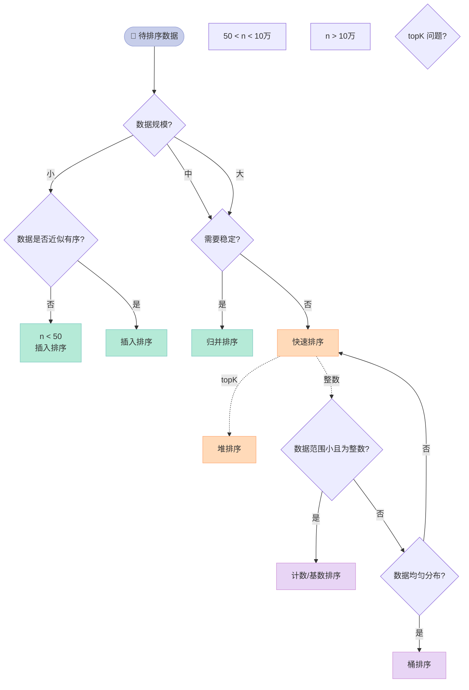

---

## 四、5 大查找算法

### 4.1 查找算法对比

| 查找算法 | 时间复杂度 | 空间复杂度 | 前置条件 | 适用场景 |
|---------|-----------|-----------|----------|----------|
| **顺序查找** | `O(n)` | `O(1)` | 无 | 小数据、无序 |
| **二分查找** | `O(log n)` | `O(1)` | 已排序 | ✅ **最常用** |
| **插值查找** | `O(log log n)` 均值 | `O(1)` | 均匀分布 | 数据均匀分布 |
| **斐波那契查找** | `O(log n)` | `O(1)` | 已排序 | 加减法代替除法 |
| **树表查找** | `O(log n)` | `O(n)` | BST 平衡 | 动态插入删除 |
| **哈希查找** | `O(1)` 均值 | `O(n)` | 哈希函数 | ✅ **最快** |

### 4.2 顺序查找

```cpp
// 顺序查找：O(n)，无需排序
int sequentialSearch(const vector<int>& arr, int target) {
    for (int i = 0; i < arr.size(); ++i) {
        if (arr[i] == target) return i;
    }
    return -1;
}
```

### 4.3 二分查找（必须背熟）

```cpp
// 二分查找：O(log n)，前提是已排序
int binarySearch(const vector<int>& arr, int target) {
    int l = 0, r = arr.size() - 1;
    while (l <= r) {
        int mid = l + (r - l) / 2;  // 防溢出写法
        if (arr[mid] == target) return mid;
        else if (arr[mid] < target) l = mid + 1;
        else r = mid - 1;
    }
    return -1;
}

// 递归版
int binarySearchRec(const vector<int>& arr, int target, int l, int r) {
    if (l > r) return -1;
    int mid = l + (r - l) / 2;
    if (arr[mid] == target) return mid;
    return arr[mid] < target
        ? binarySearchRec(arr, target, mid + 1, r)
        : binarySearchRec(arr, target, l, mid - 1);
}
```

#### 求开根号：二分查找变体

```cpp
// 求 sqrt(x) 精确到 1e-6
double mySqrt(double x) {
    if (x < 0) return -1;
    double l = 0, r = max(1.0, x);
    while (r - l > 1e-7) {
        double mid = (l + r) / 2;
        if (mid * mid > x) r = mid;
        else l = mid;
    }
    return l;
}
```

### 4.4 插值查找

```cpp
// 插值查找：按比例定位，O(log log n) 均值
// 适合数据均匀分布的场景（如字典序的字符串）
int interpolationSearch(const vector<int>& arr, int target) {
    int l = 0, r = arr.size() - 1;
    while (l <= r && target >= arr[l] && target <= arr[r]) {
        if (l == r) return arr[l] == target ? l : -1;
        // 按比例估算位置
        int pos = l + (double)(target - arr[l]) / (arr[r] - arr[l]) * (r - l);
        if (arr[pos] == target) return pos;
        if (arr[pos] < target) l = pos + 1;
        else r = pos - 1;
    }
    return -1;
}
```

### 4.5 斐波那契查找

```cpp
// 斐波那契查找：用斐波那契数列分割点，避免除法
// 核心：mid = low + F[k-1] - 1
int fibonacciSearch(const vector<int>& arr, int target) {
    int n = arr.size();
    // 生成斐波那契数列
    vector<int> F = {0, 1};
    while (F.back() < n) F.push_back(F[F.size()-1] + F[F.size()-2]);
    int k = F.size() - 1;
    int low = 0, high = n - 1;
    while (low <= high) {
        int mid = low + F[k - 1] - 1;
        if (mid >= n) { --k; continue; }
        if (arr[mid] < target) {
            low = mid + 1;
            k -= 2;  // 右半部分
        } else if (arr[mid] > target) {
            high = mid - 1;
            k -= 1;  // 左半部分
        } else {
            return mid;
        }
    }
    return -1;
}
```

### 4.6 树表查找与哈希查找

**树表查找**用二叉搜索树（BST、AVL、红黑树等），**哈希查找**用散列表，两者将在后面章节详解。

---

## 五、树：面试必考的 4 种树

### 5.1 4 种树对比

| 树类型 | 平衡性 | 查找 | 插入 | 删除 | 应用 |
|--------|--------|------|------|------|------|
| **AVL 树** | 严格平衡（高度差 ≤ 1） | `O(log n)` | `O(log n)` | `O(log n)` | 查找多、插入少 |
| **红黑树** | 近似平衡 | `O(log n)` | `O(log n)` | `O(log n)` | ✅ **C++ map/set, Java TreeMap** |
| **B 树** | 多路平衡 | `O(log n)` | `O(log n)` | `O(log n)` | 文件系统 |
| **B+ 树** | 多路平衡（数据全在叶子） | `O(log n)` | `O(log n)` | `O(log n)` | ✅ **数据库索引** |

### 5.2 二叉树遍历（递归 + 迭代）

#### 递归实现（4 种遍历）

```cpp
struct TreeNode {
    int val;
    TreeNode* left;
    TreeNode* right;
    TreeNode(int x) : val(x), left(nullptr), right(nullptr) {}
};

// 前序遍历：根 → 左 → 右
void preorder(TreeNode* root) {
    if (!root) return;
    cout << root->val << " ";
    preorder(root->left);
    preorder(root->right);
}

// 中序遍历：左 → 根 → 右
void inorder(TreeNode* root) {
    if (!root) return;
    inorder(root->left);
    cout << root->val << " ";
    inorder(root->right);
}

// 后序遍历：左 → 右 → 根
void postorder(TreeNode* root) {
    if (!root) return;
    postorder(root->left);
    postorder(root->right);
    cout << root->val << " ";
}
```

#### 迭代实现（用栈模拟）

```cpp
// 前序遍历（迭代版）：用栈
vector<int> preorderIter(TreeNode* root) {
    vector<int> res;
    if (!root) return res;
    stack<TreeNode*> stk;
    stk.push(root);
    while (!stk.empty()) {
        TreeNode* node = stk.top(); stk.pop();
        res.push_back(node->val);
        if (node->right) stk.push(node->right);  // 先右后左
        if (node->left)  stk.push(node->left);
    }
    return res;
}

// 中序遍历（迭代版）
vector<int> inorderIter(TreeNode* root) {
    vector<int> res;
    stack<TreeNode*> stk;
    TreeNode* cur = root;
    while (cur || !stk.empty()) {
        while (cur) {  // 一路压左孩子
            stk.push(cur);
            cur = cur->left;
        }
        cur = stk.top(); stk.pop();
        res.push_back(cur->val);
        cur = cur->right;  // 转向右子树
    }
    return res;
}

// 层序遍历（BFS）：用队列
vector<vector<int>> levelOrder(TreeNode* root) {
    vector<vector<int>> res;
    if (!root) return res;
    queue<TreeNode*> q;
    q.push(root);
    while (!q.empty()) {
        int sz = q.size();
        vector<int> level;
        for (int i = 0; i < sz; ++i) {
            TreeNode* node = q.front(); q.pop();
            level.push_back(node->val);
            if (node->left)  q.push(node->left);
            if (node->right) q.push(node->right);
        }
        res.push_back(level);
    }
    return res;
}
```

### 5.3 二叉树中每一层的最大值

```cpp
// 515. 在每个二叉树行中找最大值
vector<int> largestValues(TreeNode* root) {
    vector<int> res;
    if (!root) return res;
    queue<TreeNode*> q;
    q.push(root);
    while (!q.empty()) {
        int sz = q.size();
        int maxVal = INT_MIN;
        for (int i = 0; i < sz; ++i) {
            TreeNode* node = q.front(); q.pop();
            maxVal = max(maxVal, node->val);
            if (node->left)  q.push(node->left);
            if (node->right) q.push(node->right);
        }
        res.push_back(maxVal);
    }
    return res;
}
```

### 5.4 树的深度

```cpp
// 最大深度
int maxDepth(TreeNode* root) {
    if (!root) return 0;
    return 1 + max(maxDepth(root->left), maxDepth(root->right));
}

// 最小深度（注意：根到最近叶子节点）
int minDepth(TreeNode* root) {
    if (!root) return 0;
    if (!root->left)  return 1 + minDepth(root->right);
    if (!root->right) return 1 + minDepth(root->left);
    return 1 + min(minDepth(root->left), minDepth(root->right));
}

// 平衡二叉树判断（递归）
bool isBalanced(TreeNode* root) {
    return checkHeight(root) != -1;
}
int checkHeight(TreeNode* root) {
    if (!root) return 0;
    int l = checkHeight(root->left);
    if (l == -1) return -1;
    int r = checkHeight(root->right);
    if (r == -1) return -1;
    if (abs(l - r) > 1) return -1;
    return 1 + max(l, r);
}
```

### 5.5 AVL 树（平衡二叉搜索树）

**AVL 树**是**严格平衡**的二叉搜索树，任意节点的左右子树高度差 ≤ 1。

#### AVL 树的 4 种旋转

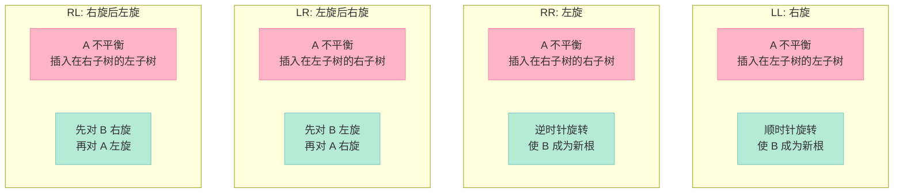

#### AVL 旋转代码

```cpp
// AVL 树右旋（LL 情形）
TreeNode* rotateRight(TreeNode* y) {
    TreeNode* x = y->left;
    TreeNode* T2 = x->right;
    x->right = y;
    y->left = T2;
    // 实际实现中需要更新 height
    return x;  // 返回新根
}

// AVL 树左旋（RR 情形）
TreeNode* rotateLeft(TreeNode* x) {
    TreeNode* y = x->right;
    TreeNode* T2 = y->left;
    y->left = x;
    x->right = T2;
    return y;
}
```

### 5.6 红黑树

**红黑树**是**近似平衡**的二叉搜索树，满足以下 5 条性质：

| 性质 | 说明 |
|------|------|
| 1. 节点红或黑 | 每个节点都有颜色 |
| 2. 根节点黑 | 根一定是黑色 |
| 3. 叶子节点黑 | NIL 节点视为黑 |
| 4. 红色节点的子节点必黑 | **不能有连续红节点** |
| 5. 任意节点到叶子的黑节点数相同 | **黑高一致** |

#### AVL vs 红黑树

| 维度 | AVL 树 | 红黑树 |
|------|--------|--------|
| 平衡性 | 严格（高度差 ≤ 1） | 近似（最长路径 ≤ 2×最短） |
| 查找 | ✅ **更快**（更矮） | 略慢（最多多一次比较） |
| 插入/删除 | ⚠️ 旋转多 | ✅ **更快**（最多 3 次旋转） |
| 适用场景 | 查找多、修改少 | ✅ **读写均衡**（C++ STL 默认选择） |

> **结论**：C++ `std::map`/`std::set` 底层用红黑树，Java `TreeMap` 也是红黑树。

### 5.7 B 树 vs B+ 树

| 维度 | B 树 | B+ 树 |
|------|------|-------|
| 数据存储 | 所有节点都存数据 | **只有叶子节点存数据** |
| 内部节点 | 存 key + data + 子节点指针 | 只存 key（作索引） |
| 叶子节点 | 独立 | **有序链表连接** |
| 范围查询 | ❌ 中序遍历整棵树 | ✅ 直接遍历叶子链表 |
| 单点查询 | ✅ 更快（可能查到内节点） | ⚠️ 必须查到叶子 |
| 磁盘 IO | 一般 | ✅ **更少**（内节点小，能装更多 key） |
| 应用 | 文件系统 | ✅ **数据库索引（MySQL InnoDB）** |

#### B+ 树的应用场景

**MySQL InnoDB 的索引就是 B+ 树**：

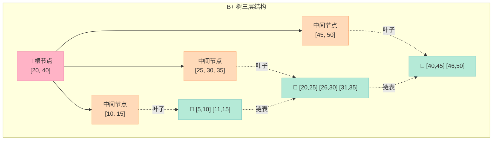

**B+ 树的优势**：

| 优势 | 说明 |
|------|------|
| 单节点存更多 key | 树更矮，**IO 次数更少** |
| 查询稳定 | 所有查询必须到叶子，**性能稳定** |
| 范围查询快 | 叶子节点构成有序链表 |
| 全表扫描快 | 直接遍历叶子链表即可 |

### 5.8 哈夫曼树与哈夫曼编码

**哈夫曼树（Huffman Tree）**：带权路径长度最小的二叉树，也称**最优二叉树**。

**构造步骤**：
1. 将节点按权重升序排列
2. 取两个最小权重节点，合并为一个新节点（权重 = 二者之和）
3. 把新节点放回集合，重复直到只剩一个节点

```cpp
// 哈夫曼树节点
struct HuffNode {
    char ch;
    int freq;
    HuffNode *left, *right;
    HuffNode(char c, int f) : ch(c), freq(f), left(nullptr), right(nullptr) {}
};

// 最小堆的比较函数
struct Compare {
    bool operator()(HuffNode* a, HuffNode* b) {
        return a->freq > b->freq;  // 最小堆
    }
};

// 构造哈夫曼树
HuffNode* buildHuffmanTree(const vector<pair<char,int>>& data) {
    priority_queue<HuffNode*, vector<HuffNode*>, Compare> pq;
    for (auto& [c, f] : data) pq.push(new HuffNode(c, f));
    while (pq.size() > 1) {
        HuffNode* a = pq.top(); pq.pop();
        HuffNode* b = pq.top(); pq.pop();
        HuffNode* merged = new HuffNode('\0', a->freq + b->freq);
        merged->left = a;
        merged->right = b;
        pq.push(merged);
    }
    return pq.top();
}

// 生成哈夫曼编码（左 0 右 1）
void generateCodes(HuffNode* root, string code, unordered_map<char,string>& codes) {
    if (!root) return;
    if (!root->left && !root->right) {
        codes[root->ch] = code;
        return;
    }
    generateCodes(root->left,  code + "0", codes);
    generateCodes(root->right, code + "1", codes);
}
```

#### 哈夫曼编码的应用

| 应用 | 说明 |
|------|------|
| **文件压缩** | ZIP、GZIP、PNG、JPEG 等 |
| **通信编码** | 摩斯电报 |
| **数据压缩** | 高频字符用短编码，低频用长编码 |

**示例**：假设字符 `A:5, B:9, C:12, D:13, E:16, F:45`：

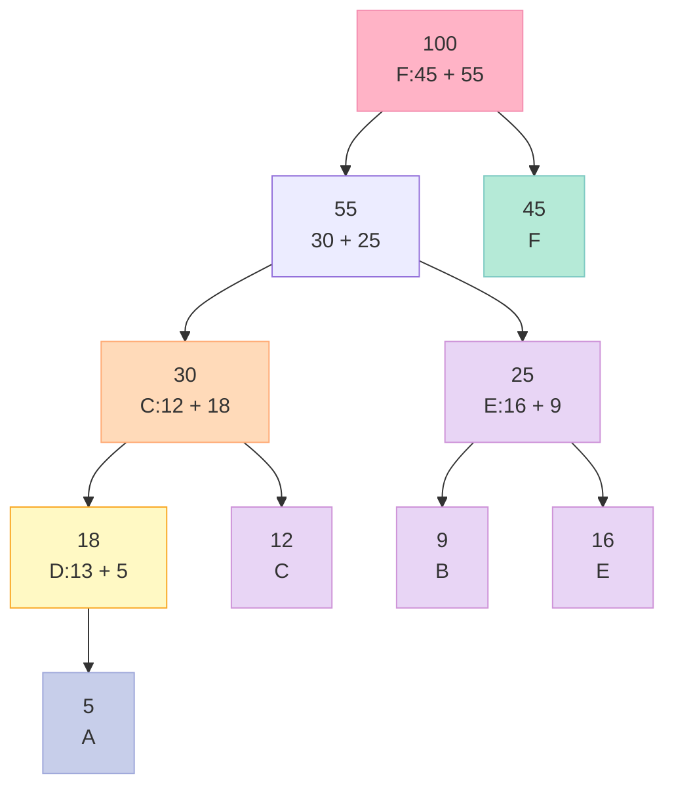

---

## 六、图算法

### 6.1 图的常用算法一览

| 算法 | 用途 | 时间复杂度 | 应用场景 |
|------|------|-----------|----------|
| **BFS** | 广度优先遍历 | `O(V + E)` | 最短路径（无权）、层序遍历 |
| **DFS** | 深度优先遍历 | `O(V + E)` | 拓扑排序、强连通分量 |
| **Dijkstra** | 单源最短路径（正权） | `O((V+E) log V)` | 地图导航 |
| **Floyd** | 全源最短路径 | `O(V³)` | 任意两点最短路 |
| **A*** | 启发式搜索 | 取决于启发函数 | 游戏寻路 |
| **Kruskal** | 最小生成树（边） | `O(E log E)` | 网络布线 |
| **Prim** | 最小生成树（点） | `O((V+E) log V)` | 网络布线 |
| **拓扑排序** | DAG 排序 | `O(V + E)` | 任务调度、编译依赖 |

### 6.2 BFS（广度优先搜索）

```cpp
// BFS：用队列实现
void bfs(vector<vector<int>>& graph, int start) {
    int n = graph.size();
    vector<bool> visited(n, false);
    queue<int> q;
    q.push(start);
    visited[start] = true;
    while (!q.empty()) {
        int u = q.front(); q.pop();
        cout << u << " ";
        for (int v : graph[u]) {
            if (!visited[v]) {
                visited[v] = true;
                q.push(v);
            }
        }
    }
}
```

### 6.3 DFS（深度优先搜索）

```cpp
// DFS 递归版
void dfs(vector<vector<int>>& graph, int u, vector<bool>& visited) {
    visited[u] = true;
    cout << u << " ";
    for (int v : graph[u]) {
        if (!visited[v]) dfs(graph, v, visited);
    }
}

// DFS 迭代版：用栈
void dfsIter(vector<vector<int>>& graph, int start) {
    int n = graph.size();
    vector<bool> visited(n, false);
    stack<int> stk;
    stk.push(start);
    while (!stk.empty()) {
        int u = stk.top(); stk.pop();
        if (visited[u]) continue;
        visited[u] = true;
        cout << u << " ";
        for (int v : graph[u])
            if (!visited[v]) stk.push(v);
    }
}
```

### 6.4 Dijkstra 最短路径

```cpp
// Dijkstra：用优先队列（最小堆）优化
vector<int> dijkstra(vector<vector<pair<int,int>>>& graph, int src) {
    int n = graph.size();
    vector<int> dist(n, INT_MAX);
    dist[src] = 0;
    // (距离, 节点) 最小堆
    priority_queue<pair<int,int>, vector<pair<int,int>>, greater<>> pq;
    pq.push({0, src});
    while (!pq.empty()) {
        auto [d, u] = pq.top(); pq.pop();
        if (d > dist[u]) continue;  // 过期节点跳过
        for (auto [v, w] : graph[u]) {
            if (dist[u] + w < dist[v]) {
                dist[v] = dist[u] + w;
                pq.push({dist[v], v});
            }
        }
    }
    return dist;
}
```

### 6.5 Floyd 全源最短路径

```cpp
// Floyd-Warshall：三层循环
void floyd(vector<vector<int>>& dist) {
    int n = dist.size();
    for (int k = 0; k < n; ++k)       // 跳板
        for (int i = 0; i < n; ++i)
            for (int j = 0; j < n; ++j)
                if (dist[i][k] + dist[k][j] < dist[i][j])
                    dist[i][j] = dist[i][k] + dist[k][j];
}
```

### 6.6 拓扑排序

```cpp
// 拓扑排序（Kahn 算法，BFS 思路）
vector<int> topologicalSort(int n, vector<vector<int>>& graph,
                             vector<int>& indegree) {
    vector<int> res;
    queue<int> q;
    for (int i = 0; i < n; ++i)
        if (indegree[i] == 0) q.push(i);  // 入度为 0 的入队
    while (!q.empty()) {
        int u = q.front(); q.pop();
        res.push_back(u);
        for (int v : graph[u]) {
            if (--indegree[v] == 0) q.push(v);
        }
    }
    return res.size() == n ? res : vector<int>{};  // 空表示有环
}
```

### 6.7 Kruskal 最小生成树（并查集）

```cpp
// 并查集
struct UnionFind {
    vector<int> parent, rank;
    UnionFind(int n) : parent(n), rank(n, 0) {
        iota(parent.begin(), parent.end(), 0);
    }
    int find(int x) {
        return parent[x] == x ? x : parent[x] = find(parent[x]);
    }
    bool unite(int x, int y) {
        int px = find(x), py = find(y);
        if (px == py) return false;
        if (rank[px] < rank[py]) swap(px, py);
        parent[py] = px;
        if (rank[px] == rank[py]) ++rank[px];
        return true;
    }
};

// Kruskal：按边权升序，依次加入不形成环的边
int kruskal(int n, vector<vector<int>>& edges) {
    sort(edges.begin(), edges.end(), [](auto& a, auto& b){
        return a[2] < b[2];
    });
    UnionFind uf(n);
    int total = 0;
    for (auto& e : edges) {
        int u = e[0], v = e[1], w = e[2];
        if (uf.unite(u, v)) total += w;
    }
    return total;
}
```

### 6.8 Prim 最小生成树

```cpp
// Prim：从一个点出发，每次加入离当前树最近的点
int prim(int n, vector<vector<pair<int,int>>>& graph) {
    vector<int> dist(n, INT_MAX);
    vector<bool> visited(n, false);
    dist[0] = 0;
    priority_queue<pair<int,int>, vector<pair<int,int>>, greater<>> pq;
    pq.push({0, 0});
    int total = 0;
    while (!pq.empty()) {
        auto [d, u] = pq.top(); pq.pop();
        if (visited[u]) continue;
        visited[u] = true;
        total += d;
        for (auto [v, w] : graph[u])
            if (!visited[v] && w < dist[v]) {
                dist[v] = w;
                pq.push({w, v});
            }
    }
    return total;
}
```

### 6.9 判断图是否连同

```cpp
// 方法 1：DFS 遍历
bool isConnectedDFS(vector<vector<int>>& graph) {
    int n = graph.size();
    vector<bool> visited(n, false);
    dfs(graph, 0, visited);
    for (bool v : visited) if (!v) return false;
    return true;
}

// 方法 2：BFS 遍历
bool isConnectedBFS(vector<vector<int>>& graph) {
    int n = graph.size();
    vector<bool> visited(n, false);
    queue<int> q;
    q.push(0);
    visited[0] = true;
    int count = 1;
    while (!q.empty()) {
        int u = q.front(); q.pop();
        for (int v : graph[u]) {
            if (!visited[v]) {
                visited[v] = true;
                ++count;
                q.push(v);
            }
        }
    }
    return count == n;
}

// 方法 3：并查集
bool isConnectedUF(int n, vector<vector<int>>& edges) {
    UnionFind uf(n);
    for (auto& e : edges) uf.unite(e[0], e[1]);
    int root = uf.find(0);
    for (int i = 1; i < n; ++i)
        if (uf.find(i) != root) return false;
    return true;
}
```

---

## 七、动态规划（Dynamic Programming）

### 7.1 动态规划的核心思想

**动态规划** = **状态 + 转移方程 + 初始状态 + 遍历顺序**。

适用场景：
1. **最优子结构**：问题的最优解包含子问题的最优解
2. **重叠子问题**：递归求解时子问题会被反复求解

| 解法 | 自顶向下 | 自底向上 |
|------|---------|----------|
| 名称 | 记忆化递归 | 递推 |
| 写法 | 递归 + 哈希表缓存 | for 循环填表 |
| 优缺点 | 直观但可能栈溢出 | 高效，无栈开销 |

### 7.2 经典 DP 题目清单

| 题目 | 状态 | 转移方程 | 时间 |
|------|------|----------|------|
| **斐波那契** | `dp[i]` | `dp[i] = dp[i-1] + dp[i-2]` | `O(n)` |
| **爬楼梯** | `dp[i]` | `dp[i] = dp[i-1] + dp[i-2]` | `O(n)` |
| **0/1 背包** | `dp[i][j]` | `max(dp[i-1][j], dp[i-1][j-w]+v)` | `O(nW)` |
| **最长公共子序列 (LCS)** | `dp[i][j]` | 见下 | `O(mn)` |
| **最长递增子序列 (LIS)** | `dp[i]` | `dp[i] = max(dp[j]+1)` | `O(n²)` |
| **最长回文子串** | `dp[i][j]` | `dp[i][j] = dp[i+1][j-1] && s[i]==s[j]` | `O(n²)` |
| **编辑距离** | `dp[i][j]` | 见下 | `O(mn)` |
| **硬币找零** | `dp[i]` | `dp[i] = min(dp[i-c]+1)` | `O(n×amount)` |

### 7.3 0/1 背包问题

```cpp
// 0/1 背包：n 个物品，容量 W，每个物品有重量 w 和价值 v
// 状态：dp[i][j] = 前 i 个物品，容量 j 时的最大价值
int knapsack01(int W, vector<int>& weights, vector<int>& values) {
    int n = weights.size();
    vector<vector<int>> dp(n + 1, vector<int>(W + 1, 0));
    for (int i = 1; i <= n; ++i) {
        for (int j = 0; j <= W; ++j) {
            dp[i][j] = dp[i - 1][j];  // 不选 i
            if (j >= weights[i - 1])
                dp[i][j] = max(dp[i][j],
                    dp[i - 1][j - weights[i - 1]] + values[i - 1]);  // 选 i
        }
    }
    return dp[n][W];
}

// 空间优化：一维 DP
int knapsack01Opt(int W, vector<int>& weights, vector<int>& values) {
    int n = weights.size();
    vector<int> dp(W + 1, 0);
    for (int i = 0; i < n; ++i)
        for (int j = W; j >= weights[i]; --j)  // 必须逆序！
            dp[j] = max(dp[j], dp[j - weights[i]] + values[i]);
    return dp[W];
}
```

### 7.4 最长公共子序列（LCS）

```cpp
// LCS：两个字符串的最长公共子序列
int lcs(string s1, string s2) {
    int m = s1.size(), n = s2.size();
    vector<vector<int>> dp(m + 1, vector<int>(n + 1, 0));
    for (int i = 1; i <= m; ++i)
        for (int j = 1; j <= n; ++j)
            if (s1[i - 1] == s2[j - 1])
                dp[i][j] = dp[i - 1][j - 1] + 1;
            else
                dp[i][j] = max(dp[i - 1][j], dp[i][j - 1]);
    return dp[m][n];
}
```

### 7.5 最长递增子序列（LIS）

```cpp
// LIS（O(n²) DP）
int lengthOfLIS(vector<int>& nums) {
    int n = nums.size();
    vector<int> dp(n, 1);
    int res = 0;
    for (int i = 0; i < n; ++i) {
        for (int j = 0; j < i; ++j)
            if (nums[j] < nums[i])
                dp[i] = max(dp[i], dp[j] + 1);
        res = max(res, dp[i]);
    }
    return res;
}

// LIS 优化版：O(n log n) 二分
int lengthOfLISBinary(vector<int>& nums) {
    vector<int> tail;  // tail[k] = 长度为 k+1 的 LIS 末尾最小值
    for (int x : nums) {
        auto it = lower_bound(tail.begin(), tail.end(), x);
        if (it == tail.end()) tail.push_back(x);
        else *it = x;
    }
    return tail.size();
}
```

### 7.6 最长回文子串

```cpp
// 动态规划解回文子串
string longestPalindrome(string s) {
    int n = s.size();
    if (n < 2) return s;
    vector<vector<bool>> dp(n, vector<bool>(n, false));
    int start = 0, maxLen = 1;
    // 初始化：单字符回文
    for (int i = 0; i < n; ++i) dp[i][i] = true;
    // 枚举子串长度
    for (int len = 2; len <= n; ++len) {
        for (int i = 0; i + len - 1 < n; ++i) {
            int j = i + len - 1;
            if (s[i] == s[j]) {
                if (len == 2) dp[i][j] = true;
                else dp[i][j] = dp[i + 1][j - 1];
            }
            if (dp[i][j] && len > maxLen) {
                start = i;
                maxLen = len;
            }
        }
    }
    return s.substr(start, maxLen);
}

// 中心扩展法：O(n²) 时间，O(1) 空间（推荐）
string longestPalindromeExpand(string s) {
    int n = s.size();
    int start = 0, maxLen = 1;
    auto expand = [&](int l, int r) {
        while (l >= 0 && r < n && s[l] == s[r]) {
            if (r - l + 1 > maxLen) {
                start = l;
                maxLen = r - l + 1;
            }
            --l; ++r;
        }
    };
    for (int i = 0; i < n; ++i) {
        expand(i, i);      // 奇数长度
        expand(i, i + 1);  // 偶数长度
    }
    return s.substr(start, maxLen);
}
```

### 7.7 编辑距离（Levenshtein Distance）

```cpp
// 编辑距离：增删改三操作的最小次数
int editDistance(string word1, string word2) {
    int m = word1.size(), n = word2.size();
    vector<vector<int>> dp(m + 1, vector<int>(n + 1, 0));
    for (int i = 0; i <= m; ++i) dp[i][0] = i;
    for (int j = 0; j <= n; ++j) dp[0][j] = j;
    for (int i = 1; i <= m; ++i)
        for (int j = 1; j <= n; ++j)
            if (word1[i - 1] == word2[j - 1])
                dp[i][j] = dp[i - 1][j - 1];
            else
                dp[i][j] = 1 + min({
                    dp[i - 1][j],      // 删除
                    dp[i][j - 1],      // 插入
                    dp[i - 1][j - 1]   // 替换
                });
    return dp[m][n];
}
```

### 7.8 DP 题目汇总表

| 题目 | LeetCode | 难度 | 关键点 |
|------|----------|------|--------|
| 爬楼梯 | 70 | 简单 | `dp[i] = dp[i-1] + dp[i-2]` |
| 打家劫舍 | 198 | 中等 | 状态机 DP |
| 0/1 背包 | —— | 中等 | 二维降一维 |
| 完全背包 | —— | 中等 | 正序遍历 |
| 最长递增子序列 | 300 | 中等 | 二分优化 |
| 最长回文子串 | 5 | 中等 | 中心扩展 |
| 编辑距离 | 72 | 困难 | 三方向转移 |
| 最小路径和 | 64 | 中等 | 网格 DP |
| 最大子序和 | 53 | 简单 | Kadane 算法 |

---

## 八、字符串匹配算法

### 8.1 字符串匹配算法对比

| 算法 | 预处理 | 匹配最坏 | 特点 | 应用 |
|------|--------|----------|------|------|
| **朴素算法** | `O(1)` | `O(mn)` | 暴力简单 | 教学 |
| **KMP** | `O(m)` | `O(n)` | 利用已匹配信息不回退 | 文本搜索 |
| **BM** | `O(m + σ)` | `O(n)` | 从后往前匹配，跳得多 | 实际编辑器 |
| **Sunday** | `O(m + σ)` | `O(n)` | 比 BM 更简单 | 日常使用 |
| **Rabin-Karp** | `O(m)` | `O(n)` 均值 | 哈希滚动 | 抄袭检测 |

> `n` 为主串长度，`m` 为模式串长度，`σ` 为字符集大小。

### 8.2 朴素字符串匹配

```cpp
// 朴素匹配：暴力
int naiveSearch(const string& text, const string& pattern) {
    int n = text.size(), m = pattern.size();
    for (int i = 0; i + m <= n; ++i) {
        int j = 0;
        while (j < m && text[i + j] == pattern[j]) ++j;
        if (j == m) return i;  // 匹配成功
    }
    return -1;
}
```

### 8.3 KMP 算法（必须掌握）

**KMP 核心**：当匹配失败时，利用已经匹配的信息，让模式串不回退到 0，主串也不回退。关键是 `next` 数组（部分匹配表）。

#### KMP 流程

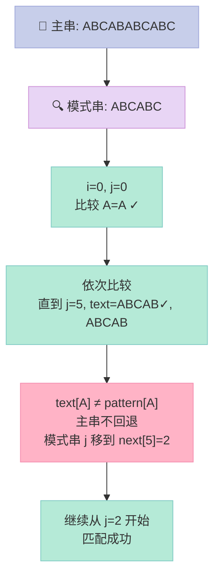

#### KMP next 数组构建（核心）

```cpp
// KMP 构建 next 数组
// next[i] = pattern[0..i] 中，最长相等前后缀的长度
vector<int> buildNext(const string& pattern) {
    int m = pattern.size();
    vector<int> next(m, 0);
    // i 从 1 开始，j 表示当前最长前缀长度
    for (int i = 1, j = 0; i < m; ++i) {
        while (j > 0 && pattern[i] != pattern[j]) {
            j = next[j - 1];  // 回退
        }
        if (pattern[i] == pattern[j]) ++j;
        next[i] = j;
    }
    return next;
}

// KMP 搜索
int kmpSearch(const string& text, const string& pattern) {
    vector<int> next = buildNext(pattern);
    int n = text.size(), m = pattern.size();
    for (int i = 0, j = 0; i < n; ++i) {
        while (j > 0 && text[i] != pattern[j]) {
            j = next[j - 1];
        }
        if (text[i] == pattern[j]) ++j;
        if (j == m) return i - m + 1;  // 匹配成功
    }
    return -1;
}
```

**示例**：模式串 `ABABABCA`，next 数组为 `[0, 0, 1, 2, 3, 4, 0, 1]`。

### 8.4 BM 算法（Boyer-Moore）

**BM 核心**：从右向左匹配 + 坏字符规则 + 好后缀规则，跳得多所以快。

### 8.5 Sunday 算法

**Sunday 核心**：匹配失败时，看主串下一个字符（对齐位置之后的字符）是否在模式串中，如果在就跳到该字符在模式串中最右的位置。

```cpp
// Sunday 算法
int sundaySearch(const string& text, const string& pattern) {
    int n = text.size(), m = pattern.size();
    // 记录 pattern 中每个字符最右出现的位置
    unordered_map<char, int> shift;
    for (int i = 0; i < m; ++i) shift[pattern[i]] = m - i;
    int i = 0;
    while (i + m <= n) {
        int j = 0;
        while (j < m && text[i + j] == pattern[j]) ++j;
        if (j == m) return i;
        // 看对齐末尾之后的字符
        if (i + m < n && shift.count(text[i + m]))
            i += shift[text[i + m]];
        else
            i += m + 1;
    }
    return -1;
}
```

---

## 九、链表操作

### 9.1 链表 vs 数组

| 维度 | 数组 | 链表 |
|------|------|------|
| 内存布局 | 连续 | 不连续 |
| 大小 | 固定（或扩容） | 动态 |
| 随机访问 | ✅ `O(1)` | ❌ `O(n)` |
| 头插入 | ❌ `O(n)` | ✅ `O(1)` |
| 尾插入 | ✅ `O(1)`（已知尾） | ✅ `O(1)`（已知尾） |
| 中间插入/删除 | ❌ `O(n)` | ✅ `O(1)`（已知位置） |
| 缓存友好 | ✅ | ❌ |
| 空间开销 | 低 | 多（指针） |
| 适用场景 | 频繁查找 | 频繁增删 |

### 9.2 单链表定义

```cpp
struct ListNode {
    int val;
    ListNode* next;
    ListNode(int x) : val(x), next(nullptr) {}
};
```

### 9.3 单链表反转（面试必考）

#### 迭代版（推荐）

```cpp
// 单链表反转（迭代版，3 个指针）
ListNode* reverseList(ListNode* head) {
    ListNode* prev = nullptr;  // 上一个节点
    ListNode* cur = head;      // 当前节点
    while (cur) {
        ListNode* nxt = cur->next;  // 保存下一个节点
        cur->next = prev;           // 反转指针
        prev = cur;
        cur = nxt;
    }
    return prev;  // 新的头节点
}
```

#### 递归版

```cpp
ListNode* reverseListRec(ListNode* head) {
    if (!head || !head->next) return head;
    ListNode* newHead = reverseListRec(head->next);
    head->next->next = head;
    head->next = nullptr;
    return newHead;
}
```

### 9.4 单链表判断有环（快慢指针）

```cpp
// 判断链表是否有环（快慢指针）
bool hasCycle(ListNode* head) {
    ListNode* slow = head, *fast = head;
    while (fast && fast->next) {
        slow = slow->next;          // 走一步
        fast = fast->next->next;    // 走两步
        if (slow == fast) return true;  // 相遇则有环
    }
    return false;
}

// 找环的入口
ListNode* detectCycle(ListNode* head) {
    ListNode* slow = head, *fast = head;
    while (fast && fast->next) {
        slow = slow->next;
        fast = fast->next->next;
        if (slow == fast) {  // 第一次相遇
            ListNode* p1 = head, *p2 = slow;
            while (p1 != p2) {
                p1 = p1->next;
                p2 = p2->next;
            }
            return p1;  // 环的入口
        }
    }
    return nullptr;
}

// 求环的长度
int cycleLength(ListNode* head) {
    ListNode* slow = head, *fast = head;
    while (fast && fast->next) {
        slow = slow->next;
        fast = fast->next->next;
        if (slow == fast) {
            int len = 1;
            ListNode* p = slow->next;
            while (p != slow) {
                ++len;
                p = p->next;
            }
            return len;
        }
    }
    return 0;
}
```

**原理**：fast 每次走 2 步，slow 每次走 1 步。如果有环，fast 一定会在环内追上 slow（就像操场跑步）。

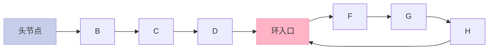

### 9.5 删除指定节点

```cpp
// 删除指定节点 node（已知节点指针）
// 思路：把下一个节点的值复制过来，删除下一个节点，O(1)
void deleteNode(ListNode* node) {
    if (!node || !node->next) return;
    node->val = node->next->val;
    ListNode* tmp = node->next;
    node->next = tmp->next;
    delete tmp;
}

// 删除链表中指定值的节点（头节点也可能被删）
ListNode* deleteNodeByValue(ListNode* head, int val) {
    if (!head) return nullptr;
    if (head->val == val) {
        ListNode* newHead = head->next;
        delete head;
        return newHead;
    }
    ListNode* prev = head, *cur = head->next;
    while (cur && cur->val != val) {
        prev = cur;
        cur = cur->next;
    }
    if (cur) {
        prev->next = cur->next;
        delete cur;
    }
    return head;
}
```

### 9.6 两个链表的交点

```cpp
// 找两个链表的交点（双指针法）
ListNode* getIntersectionNode(ListNode* headA, ListNode* headB) {
    if (!headA || !headB) return nullptr;
    ListNode* pA = headA, *pB = headB;
    // 走完自己的路走对方的路，最终相遇
    while (pA != pB) {
        pA = pA ? pA->next : headB;
        pB = pB ? pB->next : headA;
    }
    return pA;
}
```

### 9.7 链表常用操作汇总表

| 操作 | 时间复杂度 | 关键点 |
|------|-----------|--------|
| 反转链表 | `O(n)` | 三指针或递归 |
| 判断环 | `O(n)` | 快慢指针 |
| 找环入口 | `O(n)` | 快慢指针 + 同步前进 |
| 找交点 | `O(n + m)` | 双指针或哈希 |
| 合并两个有序链表 | `O(n + m)` | 哨兵节点 |
| 删除倒数第 k 个 | `O(n)` | 双指针（间距 k） |
| 判断回文 | `O(n)` | 快慢指针 + 反转 |

---

## 十、topK 问题（万数找第 K 大）

### 10.1 4 种解法对比

| 解法 | 时间复杂度 | 空间复杂度 | 适用场景 |
|------|-----------|-----------|----------|
| 全排序 | `O(n log n)` | `O(1)` | K 接近 n |
| 冒泡 K 次 | `O(nK)` | `O(1)` | K 极小（如 K=1, 2） |
| **最小堆（K 大小）** | `O(n log K)` | `O(K)` | ✅ **大文件、海量数据** |
| **快速选择** | `O(n)` 均值 / `O(n²)` 最坏 | `O(log n)` | ✅ **内存允许** |

### 10.2 最小堆解法

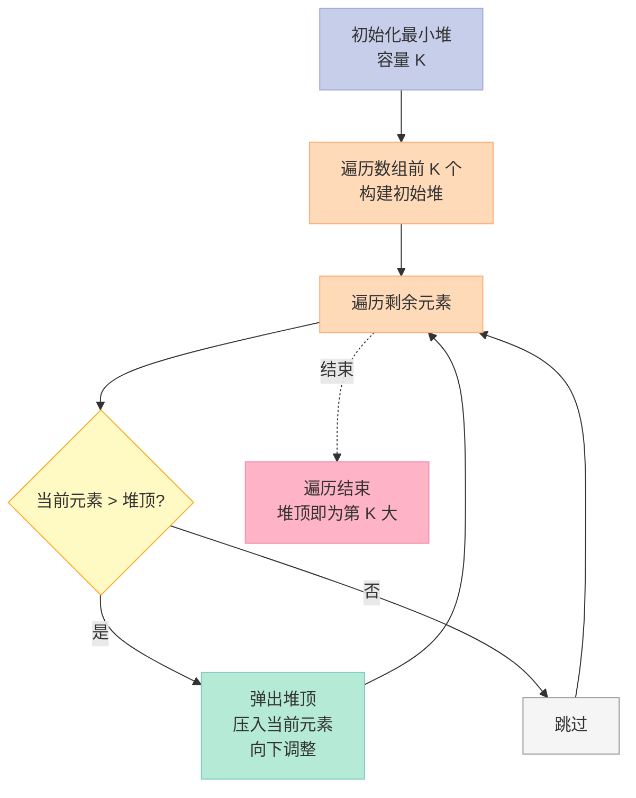

```cpp
// topK：找前 K 大的数（最小堆）
int findKthLargest(vector<int>& nums, int k) {
    priority_queue<int, vector<int>, greater<int>> minHeap;
    for (int x : nums) {
        minHeap.push(x);
        if (minHeap.size() > k) minHeap.pop();  // 维护堆大小为 k
    }
    return minHeap.top();  // 堆顶就是第 K 大
}
```

### 10.3 快速选择（quickselect）

```cpp
// 快速选择：基于 partition，平均 O(n)
int quickSelect(vector<int>& nums, int l, int r, int k) {
    // k 是要找的第 k 大（0-indexed）
    if (l == r) return nums[l];
    int pivot = nums[l + rand() % (r - l + 1)];  // 随机基准
    // 三路划分
    int lt = l, gt = r, i = l;
    while (i <= gt) {
        if (nums[i] < pivot) swap(nums[lt++], nums[i++]);
        else if (nums[i] > pivot) swap(nums[i], nums[gt--]);
        else ++i;
    }
    // 现在 nums[l..lt-1] < pivot, nums[lt..gt] == pivot, nums[gt+1..r] > pivot
    if (k < lt) return quickSelect(nums, l, lt - 1, k);
    else if (k > gt) return quickSelect(nums, gt + 1, r, k);
    else return nums[lt];  // k 在等于 pivot 的区间内
}

int findKthLargest(vector<int>& nums, int k) {
    return quickSelect(nums, 0, nums.size() - 1, nums.size() - k);
}
```

### 10.4 实际应用举例

| 场景 | 解决方案 |
|------|----------|
| 1 亿个数找最大 100 个 | 最小堆（K=100），内存 `O(K)` |
| 1 亿个数找中位数 | 双堆（最大堆 + 最小堆） |
| 海量日志统计访问次数 top10 | HashMap + 最小堆 |
| 数据库 ORDER BY ... LIMIT 100 | 数据库索引 + 堆排序 |

---

## 十一、实战：手写 LRU 缓存

**LRU（Least Recently Used）** 缓存淘汰算法：最近最少使用的先淘汰。

### 11.1 数据结构选择

| 数据结构 | 查找 | 插入/删除 | 顺序维护 |
|---------|------|-----------|----------|
| **双向链表** | ❌ `O(n)` | ✅ `O(1)` | ✅ |
| **哈希表** | ✅ `O(1)` | ✅ `O(1)` | ❌ |
| **双向链表 + 哈希表** | ✅ `O(1)` | ✅ `O(1)` | ✅ |

### 11.2 完整实现

```cpp
class LRUCache {
private:
    struct Node {
        int key, value;
        Node* prev, *next;
        Node(int k, int v) : key(k), value(v), prev(nullptr), next(nullptr) {}
    };
    int capacity;
    unordered_map<int, Node*> cache;
    Node* head;  // 哨兵：最近使用
    Node* tail;  // 哨兵：最久未使用

    void removeNode(Node* node) {
        node->prev->next = node->next;
        node->next->prev = node->prev;
    }

    void addToFront(Node* node) {
        node->next = head->next;
        node->prev = head;
        head->next->prev = node;
        head->next = node;
    }

public:
    LRUCache(int cap) : capacity(cap) {
        head = new Node(0, 0);
        tail = new Node(0, 0);
        head->next = tail;
        tail->prev = head;
    }

    int get(int key) {
        if (!cache.count(key)) return -1;
        Node* node = cache[key];
        removeNode(node);
        addToFront(node);  // 标记为最近使用
        return node->value;
    }

    void put(int key, int value) {
        if (cache.count(key)) {
            Node* node = cache[key];
            node->value = value;
            removeNode(node);
            addToFront(node);
        } else {
            if (cache.size() == capacity) {
                // 淘汰最久未使用
                Node* lru = tail->prev;
                removeNode(lru);
                cache.erase(lru->key);
                delete lru;
            }
            Node* node = new Node(key, value);
            addToFront(node);
            cache[key] = node;
        }
    }
};
```

### 11.3 LRU 核心流程

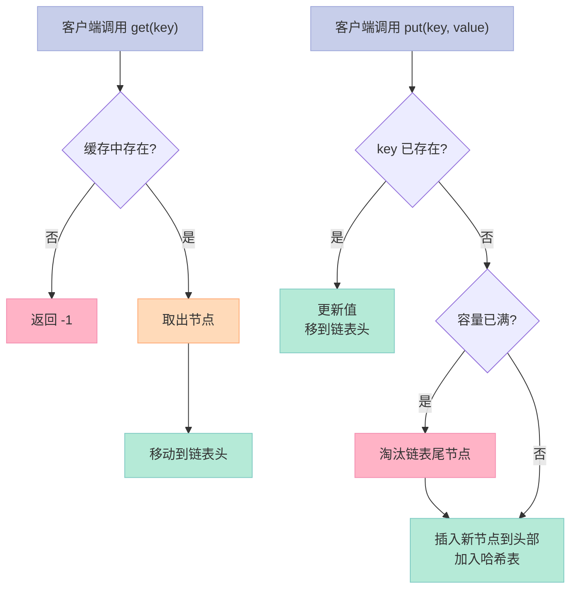

---

## 十二、实战：实现一致性哈希

**一致性哈希（Consistent Hashing）**用于分布式缓存，解决传统 `hash(key) % N` 在节点增减时几乎全部缓存失效的问题。

### 12.1 一致性哈希原理

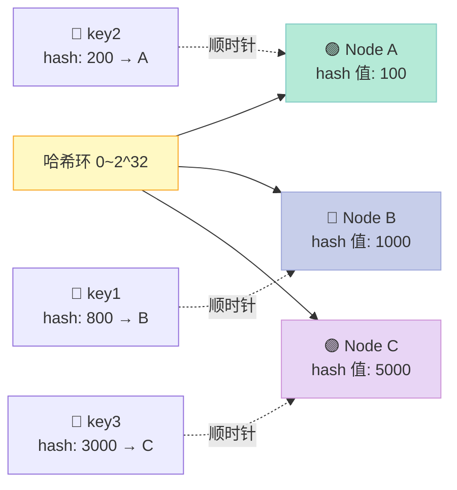

### 12.2 完整实现

```cpp
class ConsistentHash {
private:
    // 哈希环：存储虚拟节点 hash 值 -> 物理节点
    map<int, string> ring;
    int virtualNodes;  // 每个物理节点的虚拟节点数

    // MD5 或简单 hash
    int hash(const string& s) {
        int h = 0;
        for (char c : s) h = (h * 31 + c) & 0x7fffffff;
        return h;
    }

public:
    ConsistentHash(int vn = 200) : virtualNodes(vn) {}

    // 添加物理节点
    void addNode(const string& node) {
        for (int i = 0; i < virtualNodes; ++i) {
            string vnode = node + "#" + to_string(i);
            ring[hash(vnode)] = node;
        }
    }

    // 删除物理节点
    void removeNode(const string& node) {
        for (int i = 0; i < virtualNodes; ++i) {
            string vnode = node + "#" + to_string(i);
            ring.erase(hash(vnode));
        }
    }

    // 找 key 对应的节点
    string getNode(const string& key) {
        if (ring.empty()) return "";
        int h = hash(key);
        auto it = ring.lower_bound(h);
        if (it == ring.end()) it = ring.begin();  // 环形回到起点
        return it->second;
    }
};
```

### 12.3 一致性哈希 vs 普通哈希

| 维度 | 普通 `hash % N` | 一致性哈希 |
|------|----------------|-----------|
| 节点增减 | 几乎所有 key 重新映射 | **只有部分 key 受影响** |
| 数据迁移 | 全部 | 仅影响相邻区间 |
| 负载均衡 | 均匀 | 需 **虚拟节点** 优化 |

---

## 十三、实战：简易内存池

**内存池（Memory Pool）**：预先分配一大块内存，按需切给对象，避免频繁 `malloc`/`free`。

```cpp
class MemoryPool {
private:
    struct Block {
        Block* next;
    };
    Block* freeList;  // 空闲链表
    char* pool;       // 整块内存
    size_t blockSize; // 每个块大小
    size_t poolSize;  // 池大小（块数）

public:
    MemoryPool(size_t bs, size_t count) : blockSize(bs), poolSize(count) {
        pool = (char*)malloc(blockSize * poolSize);
        freeList = nullptr;
        // 把所有块串成链表（倒序）
        for (int i = poolSize - 1; i >= 0; --i) {
            Block* b = (Block*)(pool + i * blockSize);
            b->next = freeList;
            freeList = b;
        }
    }

    ~MemoryPool() { free(pool); }

    void* allocate() {
        if (!freeList) return nullptr;  // 池耗尽
        Block* b = freeList;
        freeList = b->next;
        return b;
    }

    void deallocate(void* p) {
        if (!p) return;
        Block* b = (Block*)p;
        b->next = freeList;
        freeList = b;
    }
};
```

---

## 十四、哈希表深入

### 14.1 Hash 的应用场景

| 场景 | 用法 |
|------|------|
| `unordered_map` / `unordered_set` | 哈希表在 STL 的实现 |
| 数据库索引 | 哈希索引（Memory 引擎） |
| 缓存 | Memcached、Redis |
| 布隆过滤器 | 海量数据去重 |
| 一致性哈希 | 分布式缓存 |

### 14.2 哈希函数构造方法

| 方法 | 公式 | 适用 |
|------|------|------|
| 数字分析法 | 取关键字某几位 | 已知关键字分布 |
| 平方取中法 | `(key²) 取中间几位` | 不知分布 |
| **除留余数法** | `h(key) = key mod p`（p 是质数） | ✅ **最常用** |
| 伪随机数法 | `h(key) = rand(key)` | 关键字长度不等 |

### 14.3 解决哈希冲突的方法

| 方法 | 原理 | 优点 | 缺点 |
|------|------|------|------|
| **开放定址法** | | | |
| 线性探测 | `+1, +2, ...` 探测 | 简单 | 堆积现象 |
| 二次探测 | `+1, +4, +9, ...` | 减少堆积 | 仍可能聚集 |
| 伪随机探测 | 随机步长 | 分散均匀 | 难调试 |
| **链地址法** | 拉链（每个桶一个链表） | ✅ **删除简单，无堆积** | 指针开销 |
| **再哈希法** | 冲突时换哈希函数 | 不堆积 | 增加计算 |
| **公共溢出区** | 单独溢出表 | 不影响主表 | 性能一般 |

```cpp
// 链地址法实现简易哈希表
class HashMap {
private:
    struct Node { int key, value; Node* next; };
    vector<Node*> buckets;
    int size;
    int hash(int key) { return key % buckets.size(); }

public:
    HashMap(int cap = 16) : buckets(cap, nullptr), size(0) {}

    void put(int key, int value) {
        int idx = hash(key);
        for (Node* p = buckets[idx]; p; p = p->next) {
            if (p->key == key) { p->value = value; return; }
        }
        Node* node = new Node{key, value, buckets[idx]};
        buckets[idx] = node;
        ++size;
    }

    int get(int key) {
        for (Node* p = buckets[hash(key)]; p; p = p->next)
            if (p->key == key) return p->value;
        return -1;
    }
};
```

### 14.4 负载因子（Load Factor）

**负载因子 = 已存元素数 / 哈希表容量**

| 负载因子 | 含义 | 触发扩容 |
|---------|------|---------|
| `< 0.75` | 空间浪费多 | 否 |
| `0.75`（默认） | **平衡点** | 触发扩容 |
| `1.0` | 空间完全利用 | 但链表长，查询慢 |
| `> 1.0` | 已经过载 | 一定扩容 |

**C++ `unordered_map` 默认负载因子 0.75**：
- 容量 16，存满 12 个触发扩容（→ 32）
- 负载因子越大 → 空间利用率高 → 链表长 → 查询慢

### 14.5 海量数据：BitMap

**问题**：40 亿个 int 找重复，需要多少内存？

| 方式 | 内存 |
|------|------|
| 直接存 int（4 字节） | 14.9 GB |
| **BitMap（1 bit/数）** | **476.83 MB** |

```cpp
// BitMap 实现（简化版）
class BitMap {
    vector<uint8_t> bits;
public:
    BitMap(size_t n) : bits((n + 7) / 8, 0) {}
    void set(size_t i)   { bits[i/8] |= 1 << (i%8); }
    void clear(size_t i) { bits[i/8] &= ~(1 << (i%8)); }
    bool test(size_t i)  { return bits[i/8] & (1 << (i%8)); }
};
```

**应用**：
- 40 亿整数去重：`BitMap(40亿)`
- 1 亿邮箱黑名单：`BitMap`
- URL 去重（爬虫）

---

## 十五、字典树（Trie）

**字典树**用于高效存储和查找字符串集合，常用于搜索提示、词频统计。

```cpp
class Trie {
private:
    struct TrieNode {
        bool isEnd;
        TrieNode* children[26];
        TrieNode() : isEnd(false) {
            fill(children, children + 26, nullptr);
        }
    };
    TrieNode* root;

public:
    Trie() : root(new TrieNode()) {}

    void insert(string word) {
        TrieNode* node = root;
        for (char c : word) {
            int idx = c - 'a';
            if (!node->children[idx])
                node->children[idx] = new TrieNode();
            node = node->children[idx];
        }
        node->isEnd = true;
    }

    bool search(string word) {
        TrieNode* node = root;
        for (char c : word) {
            int idx = c - 'a';
            if (!node->children[idx]) return false;
            node = node->children[idx];
        }
        return node->isEnd;
    }

    bool startsWith(string prefix) {
        TrieNode* node = root;
        for (char c : prefix) {
            int idx = c - 'a';
            if (!node->children[idx]) return false;
            node = node->children[idx];
        }
        return true;
    }
};
```

---

## 十六、二叉树进阶题目

### 16.1 公共祖先

```cpp
// 二叉树的最近公共祖先
TreeNode* lowestCommonAncestor(TreeNode* root, TreeNode* p, TreeNode* q) {
    if (!root || root == p || root == q) return root;
    TreeNode* left = lowestCommonAncestor(root->left, p, q);
    TreeNode* right = lowestCommonAncestor(root->right, p, q);
    if (left && right) return root;     // p、q 分居两侧
    return left ? left : right;         // 都在一侧
}

// BST 的最近公共祖先（利用有序性）
TreeNode* lowestCommonAncestorBST(TreeNode* root, TreeNode* p, TreeNode* q) {
    if (!root) return nullptr;
    if (root->val > p->val && root->val > q->val)
        return lowestCommonAncestorBST(root->left, p, q);
    if (root->val < p->val && root->val < q->val)
        return lowestCommonAncestorBST(root->right, p, q);
    return root;  // 当前节点在 p、q 之间，就是 LCA
}
```

### 16.2 二叉树变双向链表

```cpp
// 二叉搜索树转有序双向链表（原地，中序遍历）
void treeToDoublyList(TreeNode* root, TreeNode*& prev, TreeNode*& head) {
    if (!root) return;
    treeToDoublyList(root->left, prev, head);
    if (!prev) head = root;          // 第一个节点
    else { root->left = prev; prev->right = root; }
    prev = root;
    treeToDoublyList(root->right, prev, head);
}
```

### 16.3 二叉树所有路径

```cpp
// 输出所有从根到叶子的路径
vector<string> binaryTreePaths(TreeNode* root) {
    vector<string> res;
    if (!root) return res;
    function<void(TreeNode*, string)> dfs = [&](TreeNode* node, string path) {
        if (!node) return;
        path += to_string(node->val);
        if (!node->left && !node->right) { res.push_back(path); return; }
        path += "->";
        if (node->left)  dfs(node->left,  path);
        if (node->right) dfs(node->right, path);
    };
    dfs(root, "");
    return res;
}
```

### 16.4 二叉树题型汇总表

| 题目 | LeetCode | 难度 | 关键算法 |
|------|----------|------|----------|
| 最大深度 | 104 | 简单 | 后序遍历 |
| 最小深度 | 111 | 简单 | BFS/DFS |
| 翻转二叉树 | 226 | 简单 | 递归 |
| 对称二叉树 | 101 | 简单 | 双指针递归 |
| 层序遍历 | 102 | 中等 | BFS |
| 最近公共祖先 | 236 | 中等 | 后序递归 |
| 序列化反序列化 | 297 | 困难 | DFS |
| 二叉树转链表 | 114 | 中等 | 中序 |
| 路径总和 | 112 | 简单 | DFS |
| 完全二叉树判断 | 958 | 中等 | BFS |

---

## 十七、补充：递归与分治

### 17.1 100 个有序数组的合并

```cpp
// 100 个有序数组合并成一个
// 思路：用小顶堆，每次取堆顶，O(n log 100)
priority_queue<vector<int>::iterator, ...> pq;  // 伪代码

// 简化：两两归并（归并排序思想）
vector<int> mergeKSortedArrays(vector<vector<int>>& arrays) {
    // 用最小堆维护每个数组的当前元素
    struct Item { int val, idx, pos; };  // val=值, idx=数组号, pos=在数组中的位置
    auto cmp = [](Item a, Item b) { return a.val > b.val; };
    priority_queue<Item, vector<Item>, decltype(cmp)> pq(cmp);
    for (int i = 0; i < arrays.size(); ++i)
        if (!arrays[i].empty())
            pq.push({arrays[i][0], i, 0});
    vector<int> res;
    while (!pq.empty()) {
        auto top = pq.top(); pq.pop();
        res.push_back(top.val);
        if (top.pos + 1 < arrays[top.idx].size())
            pq.push({arrays[top.idx][top.pos + 1], top.idx, top.pos + 1});
    }
    return res;
}
```

### 17.2 出 1~n 的所有子集

```cpp
// 输出 1~n 的所有子集（如 n=3: {1}, {2}, {3}, {1,2}, {1,3}, {2,3}, {1,2,3}）
vector<vector<int>> subsets(int n) {
    vector<vector<int>> res = {{}};
    for (int i = 1; i <= n; ++i) {
        int sz = res.size();
        for (int j = 0; j < sz; ++j) {
            vector<int> newSubset = res[j];
            newSubset.push_back(i);
            res.push_back(newSubset);
        }
    }
    return res;
}
```

### 17.3 字符串中最长不重复子串

```cpp
// 滑动窗口
int lengthOfLongestSubstring(string s) {
    unordered_map<char, int> last;
    int res = 0, start = 0;
    for (int i = 0; i < s.size(); ++i) {
        if (last.count(s[i]) && last[s[i]] >= start)
            start = last[s[i]] + 1;
        last[s[i]] = i;
        res = max(res, i - start + 1);
    }
    return res;
}
```

---

## 十八、循环队列

```cpp
class CircularQueue {
private:
    vector<int> data;
    int front, rear, capacity;
public:
    CircularQueue(int k) : data(k + 1, 0), front(0), rear(0), capacity(k + 1) {}

    bool enQueue(int value) {
        if (isFull()) return false;
        data[rear] = value;
        rear = (rear + 1) % capacity;
        return true;
    }

    bool deQueue() {
        if (isEmpty()) return false;
        front = (front + 1) % capacity;
        return true;
    }

    int Front()  { return isEmpty() ? -1 : data[front]; }
    int Rear()   { return isEmpty() ? -1 : data[(rear - 1 + capacity) % capacity]; }
    bool isEmpty() { return front == rear; }
    bool isFull()  { return (rear + 1) % capacity == front; }
};
```

**关键公式**：
- 队首进 1：`front = (front + 1) % MaxSize`
- 队尾进 1：`rear = (rear + 1) % MaxSize`
- 队空：`rear == front`
- 队满：`(rear + 1) % MaxSize == front`（**牺牲一个位置**区分空和满）

---

## 十九、面试实战技巧

### 19.1 答题模板

```
1. 听到题目，先确认输入输出、边界条件
2. 给出 2~3 种解法（暴力 + 优化）
3. 分析时间/空间复杂度
4. 选最优解写代码
5. 主动给测试用例
6. 讨论可优化点
```

### 19.2 算法题难度递进

| 难度 | 题目类型 | 建议刷题数 |
|------|----------|------------|
| 入门 | 数组、字符串、链表基础 | 50 |
| 中等 | 二叉树、堆、二分、双指针 | 100 |
| 进阶 | DP、BFS/DFS、回溯 | 80 |
| 高级 | 图论、Trie、线段树、平衡树 | 40 |

### 19.3 刷题顺序推荐

1. **数组** → 双指针、滑动窗口、前缀和
2. **链表** → 反转、判断环、合并
3. **二叉树** → 遍历、BFS/DFS、路径
4. **栈和队列** → 单调栈、优先队列
5. **哈希表** → 两数之和、字母异位词
6. **二分查找** → 答案二分、旋转数组
7. **动态规划** → 背包、LCS、LIS
8. **图论** → BFS/DFS、拓扑、最短路
9. **高级数据结构** → Trie、并查集、线段树

### 19.4 复杂度速算口诀

| 口诀 | 含义 |
|------|------|
| **一重循环 O(n)** | 单层遍历 |
| **双重循环 O(n²)** | 嵌套 |
| **分治 + 合并 O(n log n)** | 归并、快排 |
| **DP 表填一遍 O(n²)** | 二维 DP |
| **二分每次减半 O(log n)** | 二分查找 |
| **堆操作 O(log n)** | 插入/删除堆顶 |

---

## 二十、总结与建议

### 20.1 核心知识地图

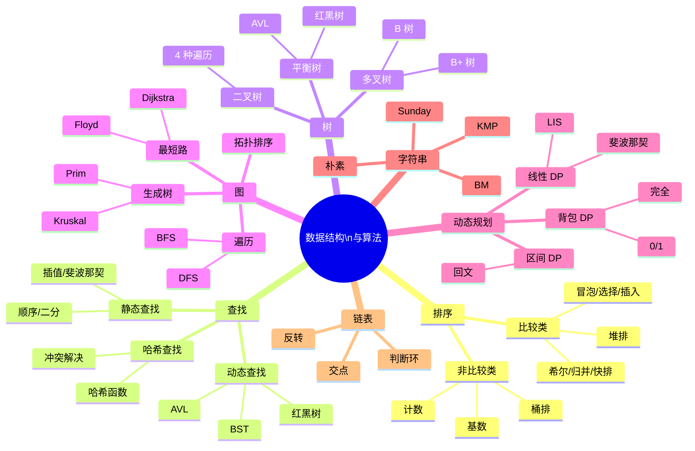

### 20.2 学习路线建议

| 阶段 | 时长 | 目标 |
|------|------|------|
| **基础** | 1 个月 | 数组、链表、二叉树、基础排序查找 |
| **进阶** | 2 个月 | DP、图论、堆、并查集 |
| **高级** | 1 个月 | 红黑树、KMP、复杂度分析 |
| **刷题** | 持续 | LeetCode 200+ |
| **面试** | 1 个月 | Hot 100 + 剑指 Offer |

### 20.3 给求职者的建议

1. **理解 > 背诵**：不要死记代码，理解思路才能举一反三
2. **画图 > 想象**：复杂算法先画图（递归树、状态转移图）
3. **复杂度先行**：写代码前先说复杂度，体现工程思维
4. **测试用例**：主动给边界用例（空数组、单元素、重复值）
5. **沟通 > 沉默**：面试中边说边写，思路清晰比答案更重要

### 20.4 思考延伸题

最后留 3 道思考题，欢迎在评论区讨论：

1. **如何用快排思想实现 O(n) 时间找中位数？**
2. **为什么 B+ 树比 B 树更适合数据库索引？具体推导一下 IO 次数。**
3. **如果让你设计一个支持百万级 QPS 的分布式缓存，你会用哪种数据结构？**

---

## 附录：复杂度速查表

| 数据结构/算法 | 平均时间 | 最坏时间 | 空间 |
|--------------|---------|---------|------|
| 数组访问 | `O(1)` | `O(1)` | `O(n)` |
| 链表访问 | `O(n)` | `O(n)` | `O(n)` |
| 顺序查找 | `O(n)` | `O(n)` | `O(1)` |
| 二分查找 | `O(log n)` | `O(log n)` | `O(1)` |
| 哈希查找 | `O(1)` | `O(n)` | `O(n)` |
| 冒泡排序 | `O(n²)` | `O(n²)` | `O(1)` |
| 选择排序 | `O(n²)` | `O(n²)` | `O(1)` |
| 插入排序 | `O(n²)` | `O(n²)` | `O(1)` |
| 希尔排序 | `O(n log n)` | `O(n²)` | `O(1)` |
| 归并排序 | `O(n log n)` | `O(n log n)` | `O(n)` |
| 快速排序 | `O(n log n)` | `O(n²)` | `O(log n)` |
| 堆排序 | `O(n log n)` | `O(n log n)` | `O(1)` |
| 计数排序 | `O(n + k)` | `O(n + k)` | `O(k)` |
| 桶排序 | `O(n + k)` | `O(n²)` | `O(n + k)` |
| 基数排序 | `O(nk)` | `O(nk)` | `O(n + k)` |
| BST | `O(log n)` | `O(n)` | `O(n)` |
| AVL | `O(log n)` | `O(log n)` | `O(n)` |
| 红黑树 | `O(log n)` | `O(log n)` | `O(n)` |
| B+ 树 | `O(log n)` | `O(log n)` | `O(n)` |
| BFS/DFS | `O(V + E)` | `O(V + E)` | `O(V)` |
| Dijkstra | `O((V+E) log V)` | — | `O(V)` |
| Floyd | `O(V³)` | `O(V³)` | `O(V²)` |

---

> **结尾金句**：**算法不是背诵的，是练出来的**——看懂 ≠ 会写，会写 ≠ 能讲清楚，能讲清楚 ≠ 能变形。本篇覆盖了 C++ 面试 90% 的算法题，建议结合 LeetCode 边看边练，必有收获。

---

## 系列导航

本系列共 16 篇，覆盖 C++ 面试的所有核心主题：

| 篇数 | 标题 | 链接 |
|------|------|------|
| 第 1 篇 | 关键字、命名空间、引用与指针 | [查看](/2026/06/16/cpp-interview-01/) |
| 第 2 篇 | `const` / `static` / `volatile` / `extern` 详解 | [查看](/2026/06/16/cpp-interview-02/) |
| 第 3 篇 | C++ 四大类型转换：`static_cast` / `dynamic_cast` / `const_cast` / `reinterpret_cast` | [查看](/2026/06/16/cpp-interview-03/) |
| 第 4 篇 | 面向对象：封装、继承、多态、虚函数 | [查看](/2026/06/16/cpp-interview-04/) |
| 第 5 篇 | C++ 内存管理：栈、堆、RAII、智能指针 | [查看](/2026/06/16/cpp-interview-05/) |
| 第 6 篇 | 模板与泛型编程：函数模板、类模板、SFINAE | [查看](/2026/06/16/cpp-interview-06/) |
| 第 7 篇 | STL 顺序容器：vector / list / deque | [查看](/2026/06/16/cpp-interview-07-stl-sequential-containers/) |
| 第 8 篇 | STL 关联容器与无序容器：map / set / unordered_map | [查看](/2026/06/16/cpp-interview-08/) |
| 第 9 篇 | C++ 11/14/17/20 新特性：lambda、右值引用、auto | [查看](/2026/06/16/cpp-interview-09/) |
| 第 10 篇 | 多线程编程：thread / mutex / condition_variable / atomic | [查看](/2026/06/16/cpp-interview-10/) |
| 第 11 篇 | C++ 网络编程：socket / IO 多路复用 / Reactor | [查看](/2026/06/16/cpp-interview-11/) |
| 第 12 篇 | C++ 编译与链接：预处理、编译、汇编、链接 | [查看](/2026/06/16/cpp-interview-12/) |
| 第 13 篇 | 操作系统：进程、线程、内存管理、调度 | [查看](/2026/06/16/cpp-interview-13/) |
| 第 14 篇 | 计算机网络：TCP/IP、HTTP、HTTPS、DNS | [查看](/2026/06/16/cpp-interview-14/) |
| **第 15 篇** | **数据结构与算法：排序、查找、树、动态规划全解** | **本文** |
| 第 16 篇 | 系统设计：缓存、消息队列、分布式一致性 | [查看](/2026/06/16/cpp-interview-16/) |