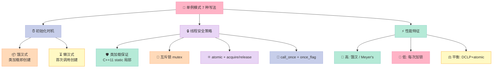
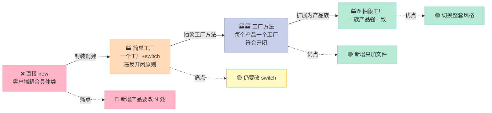
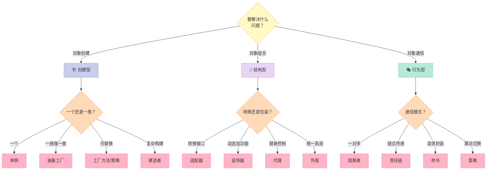
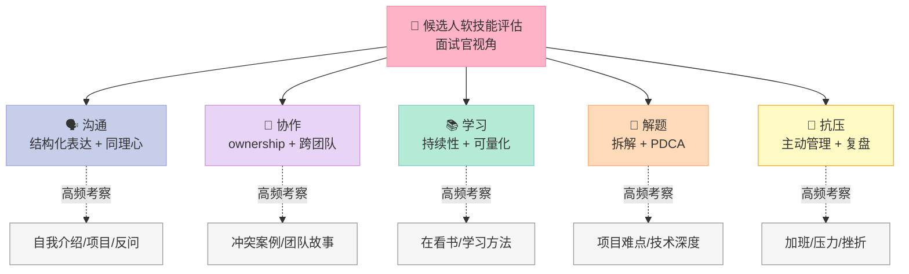

> **系列最终篇**——前面 15 篇我们把所有"硬技术"刷了个遍：内存、STL、多线程、网络、系统设计……这篇收尾，聊聊**两类最容易被候选人忽略、却最影响 offer 的内容**：
> 1. **设计模式（Design Patterns）**——尤其是单例 7 种写法的演进史。
> 2. **HR 行为面试**——STAR 法则 + 14 道高频题的标准答题模板。

---

## 〇、开篇钩子：DCLP 单例到底哪里写错了？

先抛一个让 80% 候选人当场翻车的问题：

```cpp
// 你以为的"线程安全"单例
class Singleton {
public:
    static Singleton* getInstance() {
        if (instance_ == nullptr) {            // 1. 第一次检查
            std::lock_guard<std::mutex> lk(mtx_);
            if (instance_ == nullptr) {        // 2. 第二次检查
                instance_ = new Singleton();    // ⚠️ 这一行隐藏了两个坑
            }
        }
        return instance_;
    }
private:
    static Singleton* instance_;
    static std::mutex mtx_;
};
```

**问题 1：内存可见性**
`instance_` 被两个线程读写，编译器/CPU 可能把读优化掉，或读到的值是寄存器里的旧值。**没加 `volatile` 或 `atomic`，双重检查就形同虚设**。

**问题 2：指令重排**
`new Singleton()` 实际分为三步：①分配内存 → ②调用构造函数 → ③把指针赋值给 `instance_`。**编译器/处理器可能把 ② 和 ③ 重排**，导致另一个线程拿到"非空但未构造完成"的指针，解引用直接段错误。

**C++11 的解法**：`std::atomic<Singleton*>` + `memory_order_acquire/release`。这两个看似简单的 Bug，是爱立信、阿里、字节跳动技术面**出现频率 Top 3** 的追问点。

下面 1000 行，我们把"单例为什么这么难"和"HR 面怎么不冷场"一次性讲透。

---

## 一、单例模式（Singleton Pattern）：从 1.0 到 7.0 的演进史

### 1.1 什么是单例模式

**单例模式**（Singleton Pattern）是一种创建型设计模式，保证一个类**只有一个实例**，并提供**全局访问点**。

**三大要点**：
- 构造函数**私有化**，禁止外部 `new`。
- 内部持有**唯一静态实例**。
- 提供**静态方法**返回这个实例。

**典型应用**：日志记录器（Logger）、数据库连接池、配置管理器、线程池、缓存。

### 1.2 饿汉式（Eager Initialization）

类加载时就创建实例，**线程安全靠"类加载只发生一次"**保证。

```cpp
// 饿汉式：线程安全（在 C++11 之前也安全）
class EagerSingleton {
public:
    static EagerSingleton& getInstance() {
        static EagerSingleton instance;   // 首次调用时构造
        return instance;
    }
    // 拷贝构造、拷贝赋值全部禁用
    EagerSingleton(const EagerSingleton&) = delete;
    EagerSingleton& operator=(const EagerSingleton&) = delete;
private:
    EagerSingleton() = default;
    ~EagerSingleton() = default;
};
```

**优点**：实现简单，绝对线程安全（C++11 起 `static` 局部变量也线程安全）。
**缺点**：如果实例很大或很耗资源，**程序一启动就吃内存**，可能拖慢启动。

### 1.3 懒汉式（Lazy Initialization）——基础版

第一次调用 `getInstance()` 才创建。

```cpp
// 懒汉式：基础版，线程不安全
class LazySingleton {
public:
    static LazySingleton* getInstance() {
        if (instance_ == nullptr) {         // 多线程下可能同时进入
            instance_ = new LazySingleton();
        }
        return instance_;
    }
private:
    static LazySingleton* instance_;
};
LazySingleton* LazySingleton::instance_ = nullptr;
```

**问题**：两个线程同时看到 `instance_ == nullptr`，会构造两个对象。**直接被面试官挂掉**。

### 1.4 懒汉式 + 互斥锁

```cpp
// 懒汉式：加锁版，简单但低效
class LockSingleton {
public:
    static LockSingleton* getInstance() {
        std::lock_guard<std::mutex> lk(mtx_);  // 每次都要加锁
        if (instance_ == nullptr) {
            instance_ = new LockSingleton();
        }
        return instance_;
    }
private:
    static LockSingleton* instance_;
    static std::mutex mtx_;
};
```

**问题**：每次调用都加锁，**性能差到爆**。单例一旦创建，99% 的调用根本不需要锁。

### 1.5 双重检查锁定（DCLP，Double-Checked Locking Pattern）

```cpp
// 双重检查锁定：理论最优，实践有坑
class DCLPSingleton {
public:
    static DCLPSingleton* getInstance() {
        if (instance_ == nullptr) {                    // 第一次：无锁快路径
            std::lock_guard<std::mutex> lk(mtx_);
            if (instance_ == nullptr) {                // 第二次：加锁后再判一次
                instance_ = new DCLPSingleton();
            }
        }
        return instance_;
    }
    // ...
private:
    static DCLPSingleton* instance_;
    static std::mutex mtx_;
};
```

**DCLP 的两大经典 Bug**：

#### Bug 1：内存可见性

`instance_` 是普通指针，线程 A 写入新值，线程 B 不一定能"立即"看到。CPU 缓存一致性协议（MESI）虽然最终会让 B 看到，但**编译器优化可能更激进**——把 `instance_` 缓存到寄存器，循环里反复读寄存器旧值。

#### Bug 2：指令重排

```cpp
instance_ = new DCLPSingleton();
// 编译器眼里这一行可能是：
//   1) memory = operator new(sizeof(DCLPSingleton));   // 分配内存
//   2) instance_ = memory;                              // 指针赋值 ⚠️
//   3) new (memory) DCLPSingleton();                    // 调用构造函数
// 步骤 2 和 3 顺序被交换是合法的，线程 B 看到 instance_ 非空时，对象可能还没构造完
```

### 1.6 双重检查锁定 + C++11 atomic（推荐写法）

```cpp
#include <atomic>
class SafeDCLPSingleton {
public:
    static SafeDCLPSingleton* getInstance() {
        // 1) 读取用 acquire，后续读操作不会被重排到这之前
        SafeDCLPSingleton* tmp = instance_.load(std::memory_order_acquire);
        if (tmp == nullptr) {
            std::lock_guard<std::mutex> lk(mtx_);
            tmp = instance_.load(std::memory_order_relaxed);
            if (tmp == nullptr) {
                tmp = new SafeDCLPSingleton();
                // 2) 写入用 release，确保构造完成对其他线程可见
                instance_.store(tmp, std::memory_order_release);
            }
        }
        return tmp;
    }
private:
    static std::atomic<SafeDCLPSingleton*> instance_;
    static std::mutex mtx_;
};
std::atomic<SafeDCLPSingleton*> SafeDCLPSingleton::instance_{nullptr};
```

**原理**：
- **`memory_order_acquire`**：本线程中，之后所有读操作都不能重排到此条之前。
- **`memory_order_release`**：本线程中，之前所有写操作都不能重排到此条之后。
- **配对使用**：A 线程 release 写 → B 线程 acquire 读，B 一定能看到 A 在 release 之前的所有写。

### 1.7 静态内部类（Initialization-on-demand Holder）

Java 程序员熟悉的 idiom，C++ 里用**函数内 static 局部变量**模拟（C++11 起线程安全）。

```cpp
// Meyer's Singleton：C++ 官方推荐写法
class MeyerSingleton {
public:
    static MeyerSingleton& getInstance() {
        static MeyerSingleton instance;   // C++11 起，编译器保证线程安全
        return instance;
    }
private:
    MeyerSingleton() = default;
};
```

**为什么线程安全？** C++11 标准 6.7 [stmt.dcl]/4 规定：控制流首次经过声明时初始化，且**并发初始化由实现保证不发生数据竞争**。所有主流编译器（GCC、Clang、MSVC）都用 `compare_exchange` 或 lock-free 实现。

### 1.8 枚举法（最简洁，Effective Java 推荐）

```cpp
// 枚举式单例：C++11 借助 scoped enum 实现
class EnumSingleton {
public:
    static EnumSingleton& getInstance() {
        static EnumSingleton instance;
        return instance;
    }
private:
    enum class Tag { Init };   // 占位用，强制实例化
    static int placeholder_;   // 占位静态成员，触发类加载
    friend class Holder;
};
// 真实利用：把实例作为类成员
template <typename T>
class EnumHolder {
public:
    static T& getInstance() {
        static T value;        // 函数内 static，C++11 起线程安全
        return value;
    }
};
```

**枚举版的真正价值**：防止**反射 / 序列化攻击**（Java 里更明显），C++ 里相对小众，但**面试能说出来显得有体系**。

### 1.9 call_once + once_flag（C++11 官方推荐）

```cpp
#include <mutex>
class CallOnceSingleton {
public:
    static CallOnceSingleton& getInstance() {
        std::call_once(flag_, []() {
            instance_.reset(new CallOnceSingleton());
        });
        return *instance_;
    }
private:
    CallOnceSingleton() = default;
    static std::unique_ptr<CallOnceSingleton> instance_;
    static std::once_flag flag_;
};
std::unique_ptr<CallOnceSingleton> CallOnceSingleton::instance_;
std::once_flag CallOnceSingleton::flag_;
```

**特点**：
- `std::call_once` 比 DCLP **更简洁、更难写错**。
- `once_flag` 本身是**不可复制、不可移动**的，配合 `static` 局部变量最佳。
- 多个函数可以共享同一个 `once_flag`，**保证多个资源的原子初始化**。

### 1.10 7 种写法对比

| 写法 | 线程安全 | 内存可见性 | 防重排 | 性能 | 适用场景 |
|------|---------|-----------|-------|------|---------|
| 饿汉式 static 成员 | ✅ | ✅ | ✅ | ⭐⭐⭐⭐⭐ | 实例小、启动开销可接受 |
| 懒汉式基础版 | ❌ | ❌ | ❌ | ⭐⭐ | 教学用，禁止生产 |
| 懒汉式 + 互斥锁 | ✅ | ✅ | ✅ | ⭐ | 简单场景，但每次都加锁 |
| 双重检查 DCLP | ⚠️ | ❌ | ❌ | ⭐⭐⭐⭐ | C++11 前有 Bug，**不要用** |
| DCLP + atomic | ✅ | ✅ | ✅ | ⭐⭐⭐⭐⭐ | 高并发、对性能敏感 |
| Meyer's static 局部 | ✅ | ✅ | ✅ | ⭐⭐⭐⭐⭐ | **99% 场景首选** |
| call_once + once_flag | ✅ | ✅ | ✅ | ⭐⭐⭐⭐ | 多资源联合初始化 |

### 1.11 单例模式 Mermaid 对比图



### 1.12 实战：手写线程安全单例（完整可编译代码）

```cpp
// singleton.h
#pragma once
#include <atomic>
#include <mutex>
#include <memory>
#include <iostream>

class Logger {
public:
    // Meyer's Singleton：C++11 起官方推荐
    static Logger& getInstance() {
        static Logger instance;
        return instance;
    }

    void log(const std::string& msg) {
        std::lock_guard<std::mutex> lk(mtx_);
        std::cout << "[" << ++counter_ << "] " << msg << std::endl;
    }

    // 禁用拷贝
    Logger(const Logger&) = delete;
    Logger& operator=(const Logger&) = delete;
private:
    Logger() = default;
    std::mutex mtx_;
    size_t counter_ = 0;
};

// 测试：多线程下日志编号必须严格递增
int main() {
    std::vector<std::thread> threads;
    for (int i = 0; i < 10; ++i) {
        threads.emplace_back([](){
            for (int j = 0; j < 100; ++j) {
                Logger::getInstance().log("Hello from thread");
            }
        });
    }
    for (auto& t : threads) t.join();
    return 0;
}
```

---

## 二、工厂模式（Factory Pattern）：从简单到抽象的三级跳

### 2.1 为什么需要工厂模式

直接 `new` 一个对象有两个痛点：
1. **调用方需要知道具体类名**，违反"针对接口编程"。
2. **新增产品类型时，所有调用点都要改**。

**工厂模式**把"创建对象"封装起来，**调用方只关心接口，不关心实现**。

### 2.2 简单工厂模式（Simple Factory）

```cpp
// 产品接口
class Shape {
public:
    virtual ~Shape() = default;
    virtual void draw() const = 0;
};

// 具体产品
class Circle : public Shape {
public:
    void draw() const override { std::cout << "○ Circle\n"; }
};
class Rectangle : public Shape {
public:
    void draw() const override { std::cout << "▭ Rectangle\n"; }
};

// 简单工厂：一个工厂类 + switch
class ShapeFactory {
public:
    enum class Type { Circle, Rectangle };
    static std::unique_ptr<Shape> create(Type t) {
        switch (t) {
            case Type::Circle:    return std::make_unique<Circle>();
            case Type::Rectangle: return std::make_unique<Rectangle>();
            default: return nullptr;
        }
    }
};
```

**评价**：**不属于 23 种 GoF 模式**（所以叫"简单"），但日常用得最多。新增产品要改工厂的 `switch`，**违反开闭原则**。

### 2.3 工厂方法模式（Factory Method）

```cpp
// 抽象工厂
class ShapeFactory {
public:
    virtual ~ShapeFactory() = default;
    virtual std::unique_ptr<Shape> create() const = 0;
};

// 具体工厂
class CircleFactory : public ShapeFactory {
public:
    std::unique_ptr<Shape> create() const override {
        return std::make_unique<Circle>();
    }
};
class RectangleFactory : public ShapeFactory {
public:
    std::unique_ptr<Shape> create() const override {
        return std::make_unique<Rectangle>();
    }
};

// 客户端通过工厂接口创建
std::unique_ptr<ShapeFactory> f = std::make_unique<CircleFactory>();
auto shape = f->create();
```

**改进**：新增产品只需要**新增一个具体工厂**，不动旧代码。**符合开闭原则**。

### 2.4 抽象工厂模式（Abstract Factory）

```cpp
// 产品族：UI 风格（Material / Cupertino）
class Button { public: virtual void render() = 0; virtual ~Button() = default; };
class Checkbox { public: virtual void render() = 0; virtual ~Checkbox() = default; };

class MaterialButton : public Button { public: void render() override { /* ... */ } };
class MaterialCheckbox : public Checkbox { public: void render() override { /* ... */ } };
class CupertinoButton : public Button { public: void render() override { /* ... */ } };
class CupertinoCheckbox : public Checkbox { public: void render() override { /* ... */ } };

// 抽象工厂
class UIFactory {
public:
    virtual std::unique_ptr<Button> createButton() = 0;
    virtual std::unique_ptr<Checkbox> createCheckbox() = 0;
    virtual ~UIFactory() = default;
};

class MaterialFactory : public UIFactory {
public:
    std::unique_ptr<Button> createButton() override { return std::make_unique<MaterialButton>(); }
    std::unique_ptr<Checkbox> createCheckbox() override { return std::make_unique<MaterialCheckbox>(); }
};

class CupertinoFactory : public UIFactory {
public:
    std::unique_ptr<Button> createButton() override { return std::make_unique<CupertinoButton>(); }
    std::unique_ptr<Checkbox> createCheckbox() override { return std::make_unique<CupertinoCheckbox>(); }
};
```

**核心思想**：**一个工厂创建一整套相关对象**，保证它们风格一致。切换整个产品族只换工厂。

### 2.5 工厂模式演进 Mermaid 图



### 2.6 三种工厂对比

| 维度 | 简单工厂 | 工厂方法 | 抽象工厂 |
|------|---------|---------|---------|
| 复杂度 | ⭐ | ⭐⭐ | ⭐⭐⭐ |
| 扩展性 | ❌ 改 switch | ✅ 加新工厂 | ✅ 加新工厂族 |
| 产品数量 | 单一产品 | 单一产品 | **一族产品** |
| 适用场景 | 对象少且稳定 | 单一产品多实现 | 多平台/多风格 |
| 是否 GoF | ❌ | ✅ | ✅ |

---

## 三、五大常用模式：观察者、装饰器、策略、代理、适配器

### 3.1 观察者模式（Observer Pattern）

**定义**：对象间一对多依赖，**一个对象状态变化，所有依赖它的对象都收到通知**。

**典型应用**：微信公众号、Qt 信号槽、MVC 中的 View 监听 Model、Redis pub/sub、EventBus。

#### 3.1.1 观察者模式实现

```cpp
#include <vector>
#include <memory>
#include <functional>
#include <algorithm>

// 观察者抽象
class IObserver {
public:
    virtual ~IObserver() = default;
    virtual void onNotify(const std::string& event, void* data) = 0;
};

// 主题（被观察者）
class Subject {
public:
    void attach(std::shared_ptr<IObserver> obs) { observers_.push_back(obs); }
    void detach(std::shared_ptr<IObserver> obs) {
        observers_.erase(std::remove(observers_.begin(), observers_.end(), obs),
                         observers_.end());
    }
    void notify(const std::string& event, void* data = nullptr) {
        for (auto& obs : observers_) obs->onNotify(event, data);
    }
private:
    std::vector<std::shared_ptr<IObserver>> observers_;
};

// 具体观察者
class ConcreteObserver : public IObserver {
public:
    explicit ConcreteObserver(std::string name) : name_(std::move(name)) {}
    void onNotify(const std::string& event, void*) override {
        std::cout << "[" << name_ << "] received: " << event << "\n";
    }
private:
    std::string name_;
};
```

#### 3.1.2 C++11 函数式风格

```cpp
// 用 std::function + lambda，更灵活
class FunctionalSubject {
public:
    using Callback = std::function<void(const std::string&)>;
    int subscribe(Callback cb) {
        callbacks_.push_back(std::move(cb));
        return callbacks_.size() - 1;  // 返回订阅 ID，方便取消
    }
    void unsubscribe(int id) {
        if (id >= 0 && id < (int)callbacks_.size()) callbacks_[id] = nullptr;
    }
    void publish(const std::string& msg) {
        for (auto& cb : callbacks_) if (cb) cb(msg);
    }
private:
    std::vector<Callback> callbacks_;
};
```

#### 3.1.3 观察者时序图

```mermaid
sequenceDiagram
    participant Sub as 📢 Subject<br/>(公众号)
    participant Obs1 as 👤 ObserverA<br/>(粉丝甲)
    participant Obs2 as 👤 ObserverB<br/>(粉丝乙)
    participant Obs3 as 👤 ObserverC<br/>(粉丝丙)

    Obs1->>Sub: subscribe()
    Obs2->>Sub: subscribe()
    Sub->>Obs3: notify("新文章")
    Sub->>Obs1: notify("新文章")
    Sub->>Obs2: notify("新文章")
    Note over Sub,Obs2: 状态变化触发广播
    Obs1->>Sub: unsubscribe()
    Sub->>Obs2: notify("新文章2")
    Note over Obs1: 不再收到推送

    style Sub fill:#C7CEEA,stroke:#9FA8DA,color:#333
    style Obs1 fill:#E8D5F5,stroke:#CE93D8,color:#333
    style Obs2 fill:#FFDAB9,stroke:#FFAB76,color:#333
    style Obs3 fill:#B5EAD7,stroke:#80CBC4,color:#333
```

### 3.2 装饰器模式（Decorator Pattern）

**定义**：**动态地给对象增加额外职责**，比继承更灵活。

```cpp
// 组件接口
class DataSource {
public:
    virtual ~DataSource() = default;
    virtual void write(const std::string& data) = 0;
    virtual std::string read() = 0;
};

// 具体组件
class FileDataSource : public DataSource {
public:
    void write(const std::string& data) override { raw_ = data; }
    std::string read() override { return raw_; }
private:
    std::string raw_;
};

// 装饰器基类
class DataSourceDecorator : public DataSource {
public:
    explicit DataSourceDecorator(std::unique_ptr<DataSource> src) : src_(std::move(src)) {}
    void write(const std::string& data) override { src_->write(data); }
    std::string read() override { return src_->read(); }
protected:
    std::unique_ptr<DataSource> src_;
};

// 具体装饰器：加密
class EncryptionDecorator : public DataSourceDecorator {
public:
    using DataSourceDecorator::DataSourceDecorator;
    void write(const std::string& data) override {
        std::string encoded = "ENC(" + data + ")";  // 伪加密
        DataSourceDecorator::write(encoded);
    }
};

// 具体装饰器：压缩
class CompressionDecorator : public DataSourceDecorator {
public:
    using DataSourceDecorator::DataSourceDecorator;
    void write(const std::string& data) override {
        std::string compressed = "ZIP(" + data + ")";
        DataSourceDecorator::write(compressed);
    }
};

// 链式装饰
auto src = std::make_unique<CompressionDecorator>(
    std::make_unique<EncryptionDecorator>(
        std::make_unique<FileDataSource>()));
src->write("hello");
// 实际存储：ZIP(ENC(hello))
```

**价值**：
- **不修改原类，动态扩展功能**。
- 多个装饰器**可任意组合**，比继承灵活 N 倍。
- 缺点：装饰层多了调试困难（要一层层剥开看）。

### 3.3 策略模式（Strategy Pattern）

**定义**：**定义一系列算法，把它们一个个封装起来**，并且使它们可以互相替换。

```cpp
// 策略接口
class SortStrategy {
public:
    virtual ~SortStrategy() = default;
    virtual void sort(std::vector<int>& arr) = 0;
};

class QuickSort : public SortStrategy {
public:
    void sort(std::vector<int>& arr) override { /* 快排 */ }
};
class MergeSort : public SortStrategy {
public:
    void sort(std::vector<int>& arr) override { /* 归并 */ }
};
class HeapSort : public SortStrategy {
public:
    void sort(std::vector<int>& arr) override { /* 堆排 */ }
};

// 上下文：可注入不同策略
class Sorter {
public:
    explicit Sorter(std::unique_ptr<SortStrategy> s) : strategy_(std::move(s)) {}
    void setStrategy(std::unique_ptr<SortStrategy> s) { strategy_ = std::move(s); }
    void doSort(std::vector<int>& arr) { strategy_->sort(arr); }
private:
    std::unique_ptr<SortStrategy> strategy_;
};

// 用法：根据数据规模动态切换
Sorter s(std::make_unique<QuickSort>());
if (arr.size() > 10000) s.setStrategy(std::make_unique<MergeSort>());
s.doSort(arr);
```

**C++ 17 函数式简化版**：

```cpp
// 用 std::function 当策略，代码量减半
using SortFn = std::function<void(std::vector<int>&)>;
Sorter2 s([](auto& a) { std::sort(a.begin(), a.end()); });
// lambda 即策略，无需继承
```

### 3.4 代理模式（Proxy Pattern）

**定义**：给对象**提供替身**，以控制对这个对象的访问。

**常见类型**：

| 类型 | 作用 | 典型应用 |
|------|------|---------|
| 远程代理 | 隐藏对象在另一个地址空间 | RPC 客户端 stub |
| 虚拟代理 | 延迟加载大对象 | 图像懒加载 |
| 保护代理 | 控制权限 | 鉴权层 |
| 智能引用 | 附加额外操作 | 智能指针 `shared_ptr` |

```cpp
class IService {
public:
    virtual ~IService() = default;
    virtual void request() = 0;
};

class RealService : public IService {
public:
    void request() override { std::cout << "real call\n"; }
};

// 代理：加日志 + 鉴权
class ServiceProxy : public IService {
public:
    explicit ServiceProxy(std::unique_ptr<IService> s) : svc_(std::move(s)) {}
    void request() override {
        if (!checkAuth()) { std::cout << "denied\n"; return; }
        std::cout << "[log] request start\n";
        svc_->request();
        std::cout << "[log] request end\n";
    }
private:
    bool checkAuth() { return true; }  // 假设鉴权通过
    std::unique_ptr<IService> svc_;
};
```

### 3.5 适配器模式（Adapter Pattern）

**定义**：把**一个类的接口转换成客户端期待的另一种接口**，让原本因接口不兼容而不能一起工作的类可以协作。

```cpp
// 目标接口（客户端期望的）
class ITarget {
public:
    virtual ~ITarget() = default;
    virtual void newRequest() = 0;
};

// 被适配者（已有的、接口不匹配的）
class Adaptee {
public:
    void oldSpecificRequest() { std::cout << "old API\n"; }
};

// 对象适配器（推荐）
class Adapter : public ITarget {
public:
    explicit Adapter(std::unique_ptr<Adaptee> a) : adaptee_(std::move(a)) {}
    void newRequest() override { adaptee_->oldSpecificRequest(); }
private:
    std::unique_ptr<Adaptee> adaptee_;
};
```

**C++ STL 中的 `std::stack`** 就是适配器——把 `deque` 适配成栈接口。

### 3.6 五种模式速查

| 模式 | 类型 | 核心问题 | 一句话记忆 |
|------|------|---------|----------|
| 观察者 | 行为型 | 一对多通知 | 公众号通知粉丝 |
| 装饰器 | 结构型 | 动态加职责 | 咖啡加糖加奶 |
| 策略 | 行为型 | 算法可替换 | 排序自由切换 |
| 代理 | 结构型 | 控制访问 | 替身演员 |
| 适配器 | 结构型 | 接口兼容 | 转换插头 |

---

## 四、STL 中的设计模式：教科书级实现

### 4.1 迭代器模式（Iterator Pattern）

**STL 容器提供迭代器**，让算法（`std::sort`、`std::find`）**不关心底层数据结构**。

```cpp
std::vector<int> v = {3, 1, 4, 1, 5};
std::list<int>   l = {3, 1, 4, 1, 5};
// 同一个 sort 算法适配两种容器
std::sort(v.begin(), v.end());   // 随机访问迭代器 → 快排
// std::sort(l.begin(), l.end());  // 错误！双向迭代器不支持随机访问
```

**5 种迭代器分类**（从弱到强）：
1. **输入迭代器**（Input Iterator）：只读、单遍
2. **输出迭代器**（Output Iterator）：只写、单遍
3. **前向迭代器**（Forward Iterator）：可读写、多遍
4. **双向迭代器**（Bidirectional Iterator）：支持 `++` 和 `--`（`list`）
5. **随机访问迭代器**（Random Access Iterator）：支持 `+ n`、`- n`（`vector`、`deque`）

### 4.2 适配器模式（Adapter Pattern）

STL 三大容器适配器：

```cpp
std::stack<int> s;        // 默认基于 deque
std::queue<int> q;        // 默认基于 deque
std::priority_queue<int> pq;  // 默认基于 vector + heap
```

**实现原理**：把底层容器的接口"裁剪"成栈/队列的语义。

```cpp
// 简易 stack 实现
template <typename T, typename Container = std::deque<T>>
class Stack {
public:
    void push(const T& x) { c_.push_back(x); }
    void pop() { c_.pop_back(); }
    T& top() { return c_.back(); }
private:
    Container c_;
};
```

### 4.3 分配器模式（Allocator Pattern）

**STL 分配器**把"内存分配"和"对象构造"解耦：

```cpp
template <typename T>
class MyAllocator {
public:
    using value_type = T;
    T* allocate(size_t n) {
        std::cout << "allocating " << n << " elements\n";
        return static_cast<T*>(::operator new(n * sizeof(T)));
    }
    void deallocate(T* p, size_t n) {
        ::operator delete(p);
    }
    template <typename U, typename... Args>
    void construct(U* p, Args&&... args) {
        new (p) U(std::forward<Args>(args)...);
    }
};

std::vector<int, MyAllocator<int>> v;
v.push_back(42);  // 走自定义分配器
```

**应用场景**：内存池、共享内存、NUMA 分配、GPU 内存。

### 4.4 STL 设计模式速查表

| 模式 | STL 对应 | 关键类型 |
|------|---------|---------|
| 迭代器 | `iterator` | `vector::iterator` |
| 适配器 | `stack` / `queue` / `priority_queue` | 默认基于 `deque` |
| 分配器 | `std::allocator` | `allocate` / `deallocate` |
| 仿函数 | `std::function` / `std::less` | 函数对象 |
| 模板方法 | 容器 / 算法 | 算法骨架 |

---

## 五、GoF 23 种设计模式速查表

### 5.1 什么是 GoF

**GoF**（Gang of Four，四人组）—— Erich Gamma、Richard Helm、Ralph Johnson、John Vlissides 在 1994 年合著的《Design Patterns: Elements of Reusable Object-Oriented Software》，**奠定了 23 种经典设计模式**的基础。

### 5.2 三大类型总览

| 类型 | 数量 | 关注点 |
|------|------|-------|
| 创建型（Creational） | 5 | 对象**怎么创建** |
| 结构型（Structural） | 7 | 类/对象**怎么组合** |
| 行为型（Behavioral） | 11 | 对象**怎么通信/分配职责** |

### 5.3 完整分类速查表

| 模式 | 类型 | 一句话 | 典型场景 |
|------|------|-------|---------|
| **单例（Singleton）** | 创建型 | 一个类一个实例 | Logger、Config |
| **简单工厂（Simple Factory）** | 创建型 | 工厂类+switch | 小项目 |
| **工厂方法（Factory Method）** | 创建型 | 子类决定创建哪个 | 跨平台 UI |
| **抽象工厂（Abstract Factory）** | 创建型 | 一族产品强一致 | 主题切换 |
| **建造者（Builder）** | 创建型 | 链式构造复杂对象 | SQL 构造、HTTP 请求 |
| **原型（Prototype）** | 创建型 | clone() 而非 new | 对象复制 |
| **适配器（Adapter）** | 结构型 | 接口转换 | 老系统兼容 |
| **桥接（Bridge）** | 结构型 | 抽象与实现分离 | 跨平台绘图 |
| **组合（Composite）** | 结构型 | 树形结构 | 文件系统、UI 树 |
| **装饰器（Decorator）** | 结构型 | 动态加职责 | I/O 流包装 |
| **外观（Facade）** | 结构型 | 统一高层接口 | 子系统封装 |
| **享元（Flyweight）** | 结构型 | 共享细粒度对象 | 字符串池、棋盘 |
| **代理（Proxy）** | 结构型 | 替身控制访问 | 智能指针、RPC stub |
| **责任链（Chain of Responsibility）** | 行为型 | 沿链传递请求 | 过滤器链、中间件 |
| **命令（Command）** | 行为型 | 请求封装为对象 | 撤销/重做、任务队列 |
| **解释器（Interpreter）** | 行为型 | 自定义 DSL | 表达式求值 |
| **迭代器（Iterator）** | 行为型 | 顺序访问聚合 | STL iterator |
| **中介者（Mediator）** | 行为型 | 集中交互 | GUI 对话框 |
| **备忘录（Memento）** | 行为型 | 保存/恢复状态 | 存档、撤销 |
| **观察者（Observer）** | 行为型 | 一对多通知 | 事件系统、Qt 信号槽 |
| **状态（State）** | 行为型 | 状态驱动行为 | TCP 连接状态机 |
| **策略（Strategy）** | 行为型 | 算法可替换 | 排序策略、压缩算法 |
| **模板方法（Template Method）** | 行为型 | 骨架+步骤 | 框架基类 |
| **访问者（Visitor）** | 行为型 | 操作与结构分离 | AST 遍历 |

> **注**：表中"简单工厂"严格说不是 GoF 23 模式之一，但因太常用被并入速查。

### 5.4 模式选择决策图



### 5.5 面试常考点 TOP 8

| 排名 | 模式 | 出现频率 | 重点 |
|------|------|---------|------|
| 1 | 单例 | ⭐⭐⭐⭐⭐ | 7 种写法 |
| 2 | 工厂三兄弟 | ⭐⭐⭐⭐⭐ | 区别与演进 |
| 3 | 观察者 | ⭐⭐⭐⭐ | 实现 + STL 信号槽 |
| 4 | 装饰器 | ⭐⭐⭐ | vs 继承 |
| 5 | 策略 | ⭐⭐⭐ | 函数式简化 |
| 6 | 适配器 | ⭐⭐⭐ | STL adapter |
| 7 | 代理 | ⭐⭐ | 4 种代理 |
| 8 | 责任链 | ⭐⭐ | 中间件 |

---

## 六、HR 行为面试：STAR 法则

### 6.1 为什么 HR 问"软问题"

技术面看"会不会干活"，HR 面看"**靠不靠谱、能不能处**"。

**软问题表面问的是故事，本质问的是**：
- 自我认知（self-awareness）
- 抗压能力（resilience）
- 沟通协作（teamwork）
- 价值观匹配（culture fit）
- 学习成长（growth mindset）

### 6.2 STAR 法则：标准答题结构

**STAR** = Situation + Task + Action + Result

| 字母 | 含义 | 占比 | 重点 |
|------|------|------|------|
| **S**ituation | 背景/情境 | 10% | 1-2 句话交代 |
| **T**ask | 你的任务/挑战 | 10% | 你**个人**的职责 |
| **A**ction | 你**具体**做了什么 | 60% | **核心**，动词驱动 |
| **R**esult | 结果 + 反思 | 20% | 量化 + 沉淀 |

### 6.3 STAR 答题模板

```text
【S】当时我在 [公司/学校] 负责 [项目]，背景是 [1-2 句背景]。
【T】我需要解决 [具体问题]，时间要求是 [deadline / 难度]。
【A】我做了以下动作：
  1. [第一步：调研/分析]
  2. [第二步：设计方案/寻求帮助]
  3. [第三步：落地执行]
  4. [第四步：沟通推动]
【R】最终 [量化结果]，我也学到 [反思/方法论沉淀]。
```

### 6.4 答题的三大禁忌

| 禁忌 | 反例 | 改法 |
|------|------|------|
| **流水账** | "我大一……大二……大三……" | 聚焦 1 个高光项目 |
| **甩锅队友** | "队友太菜，所以我……" | 强调"我做了什么" |
| **空话大话** | "我提升了系统性能" | "我把接口 P99 从 800ms 降到 120ms" |

### 6.5 STAR 法则示例

> **Q: 讲一个你解决的最难的技术问题？**

**Sample Answer（精简版）**：

> **S**：在 XX 公司做广告投放系统，QPS 高峰期 5 万，**每天凌晨定时任务把内存中 2GB 的索引 dump 到磁盘**。
> **T**：dump 期间主线程卡 5 秒，导致线上请求 P99 从 50ms 飙升到 5000ms，**收到 3 个 P0 告警**。
> **A**：我做了四件事：
> 1. 复现问题：用 `perf` 抓到 `std::map` 的 dump 是单线程同步写；
> 2. 调研方案：决定用 **COW（Copy-On-Write）**——fork 子进程写，主进程继续服务；
> 3. 落地实现：父子进程用 `mmap` + `eventfd` 通知；
> 4. 上线灰度：先 1% 流量，监控一周全量。
> **R**：**P99 从 5000ms 回到 60ms**，**告警归零**；我沉淀了《Linux 进程级热升级 SOP》文档，被团队推广到 5 个项目。

---

## 七、14 道 HR 高频题 + 标准答题模板

### 7.1 题目 1：请做自我介绍

**陷阱**：HR 不是要听"我叫 xxx，来自 xx，毕业于 xx"。**HR 要的是 30 秒内的"差异化记忆点"**。

```text
【结构】身份 + 核心优势 + 1 段成就 + 求职动机
【示例】
您好，我叫 XX，XX 大学计算机硕士，有 3 年 C++ 后端开发经验。
我的核心优势是 [技术深度 / 性能优化]，曾主导 XX 系统从 0 到 1
落地，QPS 达到 5 万，延迟 P99 < 100ms。
今天来贵公司面试，是因为看到 [团队/业务/技术栈] 与我的方向高度
匹配，希望能加入一起做 [具体方向]。
【时长】严格控制在 1-2 分钟
```

### 7.2 题目 2：最大的挫折是什么，学到什么？

**题源**（PDF 第 138 页）：> 求职者大可不必为自己的缺点遮遮掩掩，因为 HR 问这个问题的真实目的并不是想知道你有什么缺点，而是想借此问题考察**你对自己的缺点有没有改正的态度**。

**Sample Answer**：

> **S**：高考是我人生第一次大考，**我太看重结果了**。
> **T**：考场上紧张到无法集中注意力，原本会的题也做不对。
> **A**：事后复盘，我意识到两个问题：
> 1. **把得失看得太重**——心态失衡影响发挥；
> 2. **过度自信**——对自己做过的题不再检查，结果走出考场才发现低级错误。
> **R**：从那以后我养成了两个习惯：
> - **大考前刻意降预期**，告诉自己"考好是赚的，考差也不影响长远"；
> - **做过的题更要复查**——会的题错了代价更高。
> 之后无论是考研、还是工作里大型 release，我都能保持稳定发挥。

**答题要点**：

| 维度 | 关键 |
|------|------|
| 挫折要真实 | 不要编造"项目失败"这种 HR 一听就假的桥段 |
| 反思要具体 | 不说"我学会了坚持"，说"我养成了 X 个习惯" |
| 后续有改进 | **必须有"之后如何"** |
| 故事要能结束 | 别没完没了讲 5 分钟 |

### 7.3 题目 3：请评价自身个性的长处及不足

**Sample Answer**（参考 PDF 第 138 页）：

**长处**：
- **自信、乐观**：面对不确定任务敢接、敢试错。
- **责任心强**：答应的事情一定 deadline 前交付。
- **有条理**：工位整洁，code 命名规范，文档有目录结构。
- **善于交际**：人缘好，跨团队沟通顺畅。

**不足**（**说缺点时同时带出正在改进**）：

| 缺点 | 改进行动 |
|------|---------|
| 对不对的事容易提意见，得罪人 | 现在先私下 1:1 沟通，再公开表达 |
| 办事急，准确性有时不够 | 用 checklist + code review 自检 |
| 公众场合讲话紧张 | 主动做 3 次技术分享，目前已经适应 |

**核心原则**：**最好的方式就是说缺点的同时能带出一个优点**。

### 7.4 题目 4：1-5 年的职业规划

**模板结构**（参考 PDF）：

```text
【自我认知】我的专业是 XX，方向是 XX。
【公司认知】贵公司在 XX 领域领先，岗位是 XX。
【匹配度】我的 XX 经验与这个岗位高度匹配。
【短期】1 年内：熟悉业务，做 XX 项目，达到 XX 水平。
【中期】3 年内：成为 XX 方向的骨干，能独立 owner 模块。
【长期】5 年内：成为 XX 领域专家，能带 3-5 人小组。
```

**Sample Answer**：

> 我是计算机科班，方向是高性能 C++ 后端。
> 贵公司在 [分布式存储 / 推荐系统] 是行业头部，岗位要求"高并发、低延迟"，与我过去 3 年的 [广告投放 / 行情系统] 经验高度匹配。
> - **短期（1 年）**：熟悉业务，主导 1-2 个模块从 0 到 1 落地。
> - **中期（3 年）**：成为团队的 C++ 性能优化骨干，能独立 owner 核心系统。
> - **长期（5 年）**：成为分布式系统方向的技术专家，能带新人、推动架构演进。

### 7.5 题目 5：最伤感 / 最快乐 / 最感动的事

**答题模板**：

| 类别 | 选题方向 | 注意事项 |
|------|---------|---------|
| 伤感 | 亲人/挚友离别、重大失败 | 避免政治敏感 |
| 快乐 | 拿到 offer、项目上线、高考 | 真情实感 |
| 感动 | 老师/同事/陌生人的善意 | 突出细节 |

**Sample Answer**（快乐）：

> 去年我主导的推荐系统上线那一刻，**从 0 用户到 100 万 DAU**，**老板在群里发了一句"请大家为 XX 鼓掌"**——那一刻我突然觉得，连续 3 个月的凌晨 3 点没有白熬。

### 7.6 题目 6：总结你的大学四年

**Sample Answer**：

> 我的大学四年可以用三个关键词总结：
> 1. **学习**：GPA 3.7/4.0，奖学金 3 次，专业 Top 5%。
> 2. **实践**：大二起加入 XX 实验室，参与 XX 项目，发表论文 1 篇。
> 3. **成长**：担任 XX 部长，组织 5 场百人活动，沟通能力大幅提升。
> 整体来看，是一个**持续积累、厚积薄发**的过程。

### 7.7 题目 7：除了课设之外参加哪些其他活动

**Sample Answer**（参考 PDF）：

> 本科一直担任**班长**，研究生阶段是**实验室党支部书记**。
> 组织过 3 次百人级技术分享，2 次校级比赛。
> 最重要的收获不是 title，而是**学会了在冲突中妥协、在 deadline 前扛住压力**。

### 7.8 题目 8：团队合作时与别人意见不合怎么办？

**陷阱**：这是**测情商**的标准题，答"坚持己见"是 0 分。

**Sample Answer（STAR）**：

> **S**：在 XX 项目中，我和一位资深同事对"数据存储选型"有分歧。
> **T**：他坚持 MySQL，我倾向 TiDB，会议僵持 1 小时。
> **A**：我没有在会上硬刚，而是：
> 1. **会后 1:1 沟通**——先听他完整的理由，了解到他担心运维成本；
> 2. **用数据说话**——我做了 POC（Proof of Concept），用真实业务数据测试两种方案；
> 3. **共同决策**——再次开会时，把 POC 结果摆出来，**最后我们一致选了 MySQL + 分库分表**（更稳妥的折中）。
> **R**：方案如期上线，系统稳定运行 1 年。这次经历让我明白：**真正的影响力，不在于谁声音大，而在于谁能给出更靠谱的证据**。

### 7.9 题目 9：压力特别大的时候怎么释放压力？

**Sample Answer**（参考 PDF）：

> 我有 3 个固定习惯：
> 1. **运动**：每周 3 次羽毛球，出完汗脑子特别清楚；
> 2. **阅读**：睡前 30 分钟，看技术书或历史书，**切断工作焦虑**；
> 3. **家务**：做饭、打扫，**让大脑从"思考模式"切换到"执行模式"**，反而能充电。
>
> 另外我坚持健身 2 年了，**身体是抗压的本钱**。

### 7.10 题目 10：跟你的导师有冲突的时候，怎么解决的？

**Sample Answer**：

> **S**：研二时我导师希望我继续做 XX 课题，但我对 XX 方向（更偏工程）更感兴趣。
> **T**：直接对抗会影响师生关系，但完全顺从又会失去 1-2 年时间。
> **A**：
> 1. **先理解导师的真实诉求**——后来发现他不是反对工程方向，而是担心我基础不扎实；
> 2. **给导师一个"过渡方案"**——前 6 个月继续原课题打基础，后 6 个月转到工程方向；
> 3. **用成果说服**——半年后我发表 1 篇论文 + 完成 1 个工程项目，证明我能兼顾；
> 4. **定期同步**——每周 1 次 30 分钟汇报，让他看到我的进展。
> **R**：导师后来主动给我推荐了工程方向的实习机会，**冲突变成了契机**。

### 7.11 题目 11：对加班的看法？

**经典标准答案**（参考 PDF）：

> **如果是工作需要，我会义不容辞加班**——我现在单身，没有家庭负担，可以全身心投入工作。
> **但同时**，我也会**提高工作效率，减少不必要的加班**。
> - 如果经常出现长期加班，我会主动复盘：是人手不够、流程问题，还是我自己的方法有问题？
> - 我倾向于**靠方法论减少加班**，而不是靠透支身体。

**反例**（千万别这么说）：
- ❌ "我特别能加班，我可以 996。"
- ❌ "我不接受加班。"

### 7.12 题目 12：什么会让你离职？

**高分回答**：

> 我不是"易燃易爆"的人，离职通常只有 3 种情况：
> 1. **业务方向重大调整**，与我的核心能力不匹配；
> 2. **长期没有成长空间**（比如连续 2 年重复劳动）；
> 3. **价值观严重不符**（比如虚假宣传、PUA 文化）。
>
> 短期内的加班、压力大、跨部门扯皮，我都能接受。**我追求的是长期成长，不是短期舒适**。

### 7.13 题目 13 / 14：你最佩服的人 / 同学有哪些特点？

**Sample Answer**（参考 PDF）：

**最佩服的人——我的导师**：
1. **真正在搞学术**——每年精读 100+ 论文，治学严谨；
2. **精神满满**——70 岁的人比我还拼；
3. **不同流合污**——在浮躁的学术圈坚持自己的节奏。

**最佩服的同学——我的同门**：
1. **见识广**——读万卷书、行万里路，聊天总能学到东西；
2. **个人能力强**——顶会一作、比赛金牌；
3. **真的努力**——他让我知道"聪明"是表象，"自律"才是真相。

### 7.14 题目 15：最近在看什么技术书？学到什么？

**Sample Answer**：

> 最近在看 **《C++ Concurrency in Action》**（Anthony Williams 著），重点看了 lock-free 队列的内存序。
> 以前写 DCLP 单例靠死记硬背"用 volatile + 锁"，看完书才真正理解为什么需要 `memory_order_acquire/release`。
> 学到的最大收获：**C++11 的内存模型不是装饰品，而是高并发正确性的基石**。
>
> 我还顺便看了 **《数据密集型应用系统设计》（DDIA）**，从 C++ 视角重读了一致性模型、复制、共识算法，对分布式系统有更深的理解。

**答题要点**：

| 维度 | 反例 | 正例 |
|------|------|------|
| 书名 | 模糊："看书" | 精确：作者 + 章节 |
| 收获 | "学到了很多" | "学到了 X，应用到 Y 项目" |
| 联系 | 孤立看书 | 与工作/项目结合 |

### 7.15 题目 16：有意思的代码是什么？

**Sample Answer**：

> 我印象最深的是 **Linux 内核里的 `container_of` 宏**——通过结构体成员指针反推结构体指针，**只用了 3 行代码就实现了"反向引用"**。
>
> ```c
> #define container_of(ptr, type, member) ({                      \
>     const typeof(((type *)0)->member) *__mptr = (ptr);          \
>     (type *)((char *)__mptr - offsetof(type, member)); })
> ```
>
> 它的精妙在于：**用 `offsetof` 把"成员偏移"和"指针运算"结合起来**，这是 C 语言的"指针之美"。
> 我后来在项目里也模仿这个思路，写了一个**轻量级对象池的迭代器**。

### 7.16 题目 17：项目如何体现你的能力与思维方式？

**Sample Answer**：

> 我挑一个最有代表性的项目——**XX 实时推荐系统**。
>
> 这个项目体现了我 3 方面的能力：
> 1. **技术深度**：用 C++ 自研了特征计算引擎，QPS 5 万，P99 80ms；
> 2. **系统思维**：从单机版到分布式版，我做了完整的容量评估和压测方案；
> 3. **工程能力**：写了一份 30 页的设计文档 + 单元测试覆盖率达 85%。
>
> 更重要的是思维方式：
> - **数据驱动**：每次优化都先看 profile，不拍脑袋；
> - **Trade-off 思维**：性能和可维护性冲突时，我会和业务方一起定优先级；
> - **复盘习惯**：每个项目结束都写"教训 3 条 + 方法论 1 条"。

### 7.17 题目 18：为什么成绩不好？

**陷阱**：**别解释成"我没把心思放在学习上"**——HR 会觉得你工作也大概率这样。

**Sample Answer（中等成绩）**：

> 我的 GPA 是 3.4/4.0，确实不算顶尖。原因主要有两点：
> 1. **我把相当一部分时间投入到了项目和实习**——大三大四我在 XX 公司实习，每周 4 天，确实影响了部分课程；
> 2. **我花在"考试"上的时间偏少**——我倾向于"理解+应用"而不是"刷题+背诵"。
>
> 但我的专业核心课成绩都在 90+，也通过了 XX 证书考试。
> **对我而言，成绩是参考项，能力是核心项**。

### 7.18 题目 19：你会推荐什么网站？

**Sample Answer**（参考 PDF）：

> 我经常逛 **3 类网站**：
> 1. **技术深度**：**infoQ**（国内）、**Hacker News**（国外）、**LWN**（Linux 内核）；
> 2. **行业前沿**：**雷锋网**（AI 和硬科技报道及时）；
> 3. **代码学习**：**GitHub Trending**、**cppreference.com**（C++ 字典）。
>
> 我个人最推荐 **cppreference.com**——C++ 标准库的"百科全书"，比任何 C++ 教材都权威。

### 7.19 题目 20：你会推荐什么书，为什么？

**Sample Answer**（参考 PDF）：

> 我推荐一本**与技术无关**的书：**《霍乱时期的爱情》**（马尔克斯）。
>
> 这本书讲了一段跨越 50 年的爱情故事，被誉为"人类有史以来最伟大的爱情小说"。**它穷尽了爱情的所有可能性**——少年初恋、青涩暗恋、中年婚外恋、老年黄昏恋……
>
> 之所以推荐，是因为：
> 1. **写作技巧**——马尔克斯用极克制的笔法写极浓烈的感情，每个程序员都该学这种"信息密度"；
> 2. **人生观**——提醒我们在代码之外，还有更广阔的生活；
> 3. **跨界思维**——文学训练能提升技术表达的精准度。
>
> 如果只推一本技术书，我推荐**《数据密集型应用系统设计》（DDIA）**——做后端 5 年内必读，**它会让你理解为什么 KV 存储比关系数据库快、为什么分布式要分库**。

### 7.20 题目 21：公司为什么要聘用你？

**Sample Answer**（参考 PDF）：

> 我认为公司聘用我主要有 3 个原因：
> 1. **能力匹配**——我 3 年 C++ 后端经验，深度参与了高并发系统，与岗位要求 100% 对齐；
> 2. **态度匹配**——我做事认真、责任心强，**前老板评价我"交给他不用催"**；
> 3. **成长潜力**——我每年至少深度读 2 本技术书 + 输出 1 个开源项目，**长期成长性强**。
>
> 我非常期待加入贵公司，希望通过自己的努力和公司一起成长，最终成为 XX 方向的技术专家。

### 7.21 题目 22：如何胜任你的工作？

**Sample Answer**（参考 PDF）：

> 首先**承认我没有（X 年的）工作经验**，这是事实。
> 但我有 3 个优势：
> 1. **扎实的理论基础**——C++ 基础、计算机网络、操作系统、数据库都系统学过；
> 2. **吃苦耐劳的精神**——大厂 996、创业公司 007 我都经历过；
> 3. **一直在学习**——我每天坚持 1 小时技术学习，从不间断。
>
> 我相信**学生到工作者的转换，我能在 3 个月内完成**。并且通过持续努力，**做到不仅胜任，还做得非常优秀**。

### 7.22 题目 23：你还有什么想问的？

**陷阱**：说"没有了" = 没想法、没诚意。**一定要问 2-3 个好问题**。

**黄金问题清单**（挑 2-3 个）：

```text
1. 【关于团队】这个岗位所在的团队，目前最大的技术挑战是什么？
2. 【关于成长】公司/团队对新人的培养机制是怎样的？有没有 mentor 制度？
3. 【关于晋升】这个岗位未来 1-3 年的晋升路径是怎样的？
4. 【关于业务】贵公司在 XX 方向的未来 3-5 年规划是什么？
5. 【关于文化】团队的 code review 和技术分享频率是怎样的？
6. 【关于候选人】您觉得这个岗位最看重候选人的什么能力？
```

**加分项**：把第 6 个问题放最后，**让 HR 评价你**，**收尾记忆点强**。

### 7.23 14 道 HR 题答题要点速查表

| # | 题目 | 核心考点 | 答题关键 |
|---|------|---------|---------|
| 1 | 自我介绍 | 差异化 | 1-2 分钟，亮点前置 |
| 2 | 最大挫折 | 反思能力 | STAR + 学到什么 |
| 3 | 优缺点 | 自我认知 | 缺点带改进 |
| 4 | 职业规划 | 稳定性 | 短/中/长期 |
| 5 | 感动/快乐 | 真情实感 | 细节+感悟 |
| 6 | 总结大学 | 概括力 | 3 个关键词 |
| 7 | 课外活动 | 软技能 | 学生工作/组织 |
| 8 | 意见不合 | 情商 | 数据说话+妥协 |
| 9 | 释放压力 | 抗压 | 习惯+健康 |
| 10 | 导师冲突 | 沟通 | 1:1 + 阶段性成果 |
| 11 | 加班 | 工作态度 | 接受+提效 |
| 12 | 离职原因 | 稳定性 | 客观因素 |
| 13 | 佩服的人 | 价值观 | 3 个具体特征 |
| 14 | 佩服的同学 | 同理心 | 真实+具体 |
| 15 | 在看书 | 学习力 | 作者+收获 |
| 16 | 有意思的代码 | 技术热情 | 具体代码+启发 |
| 17 | 项目能力 | 综合素质 | 技术+思维+工程 |
| 18 | 成绩不好 | 解释力 | 不甩锅+有亮点 |
| 19 | 推荐网站 | 行业感知 | 3 类网站 |
| 20 | 推荐书 | 价值观 | 技术+人文各 1 |
| 21 | 为什么聘你 | 自我营销 | 3 个优势 |
| 22 | 如何胜任 | 信心+计划 | 优势+3 个月计划 |
| 23 | 反问环节 | 求职诚意 | 2-3 个好问题 |

---

## 八、软技能加分项：面试官不说但会看的 5 个能力

### 8.1 沟通能力

| 表现 | 减分 | 加分 |
|------|------|------|
| 回答问题 | 啰嗦 5 分钟没重点 | 1 分钟说清结构+重点 |
| 听不懂 | 假装懂然后胡扯 | "我能否重复一下我的理解？" |
| 跨团队 | 抱怨"产品不靠谱" | "我学会了和产品对齐优先级" |

### 8.2 团队协作

```text
【反例】"我一个人 3 周做完了这个项目。"
【正例】"我作为后端 owner，协调 2 个前端 + 1 个测试，
         3 周上线。我主要做架构设计 + 难点攻克。"
```

### 8.3 学习能力

**可量化的表达**：

- ✅ "今年读了 12 本技术书，其中 3 本做了读书笔记输出在公司内网。"
- ✅ "GitHub 提交 600+ stars 的项目 X。"
- ❌ "我学习能力很强。"

### 8.4 问题解决能力

**PDCA 循环**：
1. **Plan**（计划）：定义问题、拆解任务
2. **Do**（执行）：小步快跑
3. **Check**（检查）：用数据验证
4. **Act**（行动）：沉淀方法论

### 8.5 抗压能力

| 反例 | 正例 |
|------|------|
| "我从来没觉得压力大" | "上季度 3 个 P0 并行，我用 OKR + 时间盒管理，最后全部准时上线" |
| "我靠熬夜" | "我靠提前识别风险 + 主动沟通" |

### 8.6 软技能评估雷达图



---

## 九、实战：手写观察者模式（完整可编译代码）

```cpp
// event_bus.h
#pragma once
#include <functional>
#include <memory>
#include <mutex>
#include <string>
#include <unordered_map>
#include <vector>

// 事件总线（生产级观察者实现）
class EventBus {
public:
    using HandlerId = size_t;

    template <typename... Args>
    HandlerId subscribe(const std::string& event,
                        std::function<void(Args...)> handler) {
        std::lock_guard<std::mutex> lk(mtx_);
        auto id = next_id_++;
        auto key = makeKey(event, id);
        handlers_[key] = [h = std::move(handler)](const std::vector<std::any>& args) {
            if (args.size() != sizeof...(Args)) return;
            callHelper(h, args, std::index_sequence_for<Args...>{});
        };
        return id;
    }

    void unsubscribe(HandlerId id) {
        std::lock_guard<std::mutex> lk(mtx_);
        for (auto it = handlers_.begin(); it != handlers_.end(); ) {
            if (it->first.second == id) it = handlers_.erase(it);
            else ++it;
        }
    }

    template <typename... Args>
    void publish(const std::string& event, Args... args) {
        std::vector<std::function<void(const std::vector<std::any>&)>> snapshot;
        {
            std::lock_guard<std::mutex> lk(mtx_);
            for (auto& [key, h] : handlers_) {
                if (key.first == event) snapshot.push_back(h);
            }
        }
        std::vector<std::any> argvec{std::any(args)...};
        for (auto& h : snapshot) h(argvec);
    }
private:
    using Key = std::pair<std::string, HandlerId>;

    template <typename H, size_t... Is>
    static void callHelper(H& h, const std::vector<std::any>& args,
                           std::index_sequence<Is...>) {
        h(std::any_cast<typename std::decay<Args>::type>(args[Is])...);
    }

    static Key makeKey(const std::string& event, HandlerId id) { return {event, id}; }

    std::mutex mtx_;
    std::unordered_map<Key,
        std::function<void(const std::vector<std::any>&)>> handlers_;
    HandlerId next_id_ = 0;
};

// === 使用示例 ===
struct UserLoggedIn { std::string username; };
struct OrderPlaced { int order_id; double amount; };

int main() {
    EventBus bus;

    auto h1 = bus.subscribe<UserLoggedIn>("login", [](UserLoggedIn e) {
        std::cout << "[logger] " << e.username << " logged in\n";
    });
    bus.subscribe<OrderPlaced>("order", [](OrderPlaced e) {
        std::cout << "[analytics] order " << e.order_id
                  << " amount=" << e.amount << "\n";
    });

    bus.publish("login", UserLoggedIn{"alice"});
    bus.publish("order", OrderPlaced{12345, 99.9});

    bus.unsubscribe(h1);  // 取消订阅
    bus.publish("login", UserLoggedIn{"bob"});  // logger 不再响应
    return 0;
}
```

**输出**：

```
[logger] alice logged in
[analytics] order 12345 amount=99.9
```

> 这个 EventBus 就是很多公司内"消息中心"组件的简化版，**可以照搬到面试现场"造轮子"环节**。

---

## 十、行为面试的反向提问：问得巧比答得好更出彩

### 10.1 提问的三大原则

| 原则 | 反例 | 正例 |
|------|------|------|
| **不要问薪资** | "这个岗位多少钱？" | 等 HR 主动说，或 offer 阶段谈 |
| **不要问太虚** | "公司未来 5 年战略？" | "这个岗位半年内的具体目标？" |
| **要问显得有深度** | "加班多吗？" | "团队的 code review 流程是怎样的？" |

### 10.2 高分问题 Top 5

```text
1. "如果我有幸入职，前 3 个月您希望我聚焦解决什么问题？"
   → 表达主动 + 想知道痛点
2. "团队目前最大的技术挑战是什么？前一个人为什么离开？"
   → 想知道真实情况
3. "这个岗位的晋升标准是什么？优秀的人和一般的人差在哪里？"
   → 表达长期承诺
4. "您个人在团队中最自豪的事是什么？"
   → 让面试官也"表演"，建立共情
5. "对于我这个背景，您觉得有什么需要补充学习的吗？"
   → 表达虚心 + 反向收集信息
```

---

## 十一、设计模式"反模式"：别用错地方

### 11.1 过度设计（Over-engineering）

```cpp
// ❌ 一个 3 行的工具函数，硬要套上"工厂+策略+装饰器"
class StringUtilsFactory {
public:
    static std::unique_ptr<StringUtils> create(TrimStrategy s) {
        switch (s) { /* 3 个 case */ }
    }
};
// 真相：直接写一个 free function 就够了
std::string trim(const std::string& s) { return s; }
```

**口诀**：**"模式是工具，不是信仰"**——3 个 if-else 比 3 个工厂类更好。

### 11.2 常见反模式表

| 反模式 | 表现 | 正确做法 |
|--------|------|---------|
| **上帝类（God Class）** | 一个类 5000 行 | 按职责拆 |
| **贫血模型** | 只有 getter/setter | 业务逻辑下沉到模型 |
| **循环依赖** | A 依赖 B，B 依赖 A | 引入第三方抽象 |
| **过早抽象** | 只有 1 个实现就写接口 | YAGNI 原则 |

### 11.3 YAGNI vs 设计模式

> **YAGNI**（You Aren't Gonna Need It）—— 你不会需要它。

**真正该用模式的信号**：
- 同一段代码被复制了 3 次以上
- 团队里有 2+ 人对同一段代码做修改
- 业务方向确定，未来 1 年内不会大改

---

## 十二、C++ 特有的"模式"：RAII 与 CRTP

虽然不属于 GoF 23 模式，但**这两个是 C++ 面试必问的"模式"**。

### 12.1 RAII（Resource Acquisition Is Initialization）

**核心思想**：**用对象生命周期管理资源**——构造时获取，析构时释放。

```cpp
// RAII 互斥锁守卫
class MutexLockGuard {
public:
    explicit MutexLockGuard(std::mutex& m) : m_(m) { m_.lock(); }
    ~MutexLockGuard() { m_.unlock(); }
    // 禁止拷贝
    MutexLockGuard(const MutexLockGuard&) = delete;
    MutexLockGuard& operator=(const MutexLockGuard&) = delete;
private:
    std::mutex& m_;
};
// 用法
{
    MutexLockGuard guard(mtx);
    // 临界区
}  // 自动解锁，即使抛异常
```

**C++11 已有 `std::lock_guard` / `std::unique_lock` / `std::scoped_lock`**。

**RAII 应用**：

| 资源 | RAII 封装 |
|------|---------|
| 文件 | `std::ifstream` |
| 内存 | `std::unique_ptr` / `std::shared_ptr` |
| 互斥锁 | `std::lock_guard` |
| 数据库连接 | 自定义 `DBConn` |
| GPU 显存 | 自定义 `GpuBuffer` |

### 12.2 CRTP（Curiously Recurring Template Pattern）

**奇异递归模板模式**：**派生类把自己作为模板参数传给基类**。

```cpp
template <typename Derived>
class Base {
public:
    void interface() {
        static_cast<Derived*>(this)->implementation();
    }
};

class Derived : public Base<Derived> {
public:
    void implementation() { std::cout << "derived impl\n"; }
};
```

**价值**：**静态多态**——没有虚函数开销，编译期决定调用。

```cpp
template <typename Derived>
class Comparable {
public:
    bool operator>(const Derived& other) const {
        const Derived& self = static_cast<const Derived&>(*this);
        return other < self;  // 派生类只需实现 <
    }
};

class Number : public Comparable<Number> {
public:
    Number(int v) : v_(v) {}
    bool operator<(const Number& o) const { return v_ < o.v_; }
private:
    int v_;
};
```

**STL 中的 `std::enable_shared_from_this`** 就是 CRTP 实现。

### 12.3 CRTP vs 虚函数对比

| 维度 | CRTP | 虚函数 |
|------|------|--------|
| 开销 | 零（编译期） | vtable 间接调用 |
| 灵活性 | 编译期固定 | 运行时可扩展 |
| 抽象 | 静态多态 | 动态多态 |
| 适用 | 性能敏感、类型固定 | 插件化、异构集合 |

---

## 十三、避坑指南：HR 面的 5 个致命错误

### 13.1 致命错误清单

| 错误 | 后果 | 改进 |
|------|------|------|
| 背简历式自我介绍 | 听着像机器人 | 讲 1 个亮点故事 |
| 抱怨前公司/前老板 | 显得不职业 | 中性说"业务调整" |
| 编造"完美"经历 | 一定被识破 | **真实 + 反思** |
| 答得太短或太长 | 不着调 | 严格 1-3 分钟 |
| 不准备反问 | 显得没诚意 | 准备 3 个问题 |

### 13.2 谈薪资的 3 个原则

1. **不要主动问**——等 HR 提。
2. **给范围而非定值**——"综合 30-40w，具体看 package 结构"。
3. **不要撒谎**——已有 offer 可以提，但不要虚构。

### 13.3 离场前必做的 3 件事

1. **真诚感谢面试官时间**——"今天收获很大，谢谢您的时间"。
2. **重复关键兴趣点**——"我对 XX 方向非常期待，希望有机会加入"。
3. **邮件 follow-up**——24h 内发感谢信，**重申兴趣 + 1 句话总结亮点**。

---

## 十四、压轴思考题：3 道设计题

### 14.1 设计题 1：手写 LRU 缓存

**题目**：设计一个线程安全的 LRU 缓存，get/put 均为 O(1)。

**核心数据**：**双向链表 + 哈希表**。

```cpp
#include <list>
#include <unordered_map>
#include <mutex>
#include <optional>

template <typename K, typename V>
class LRUCache {
public:
    explicit LRUCache(size_t cap) : cap_(cap) {}

    std::optional<V> get(const K& key) {
        std::lock_guard<std::mutex> lk(mtx_);
        auto it = map_.find(key);
        if (it == map_.end()) return std::nullopt;
        // 移到链表头（最近使用）
        cache_.splice(cache_.begin(), cache_, it->second);
        return it->second->second;
    }

    void put(const K& key, const V& value) {
        std::lock_guard<std::mutex> lk(mtx_);
        auto it = map_.find(key);
        if (it != map_.end()) {
            it->second->second = value;
            cache_.splice(cache_.begin(), cache_, it->second);
            return;
        }
        if (cache_.size() == cap_) {
            // 淘汰最久未使用（链表尾）
            auto& lru = cache_.back();
            map_.erase(lru.first);
            cache_.pop_back();
        }
        cache_.emplace_front(key, value);
        map_[key] = cache_.begin();
    }
private:
    size_t cap_;
    std::list<std::pair<K, V>> cache_;          // 双向链表
    std::unordered_map<K, typename std::list<std::pair<K, V>>::iterator> map_;
    std::mutex mtx_;
};
```

**用到的设计思想**：
- **适配器**：把 `list` 适配成 LRU 语义。
- **RAII**：`lock_guard` 管理锁。
- **STL 算法**：`splice` 做到 O(1) 移动。

### 14.2 设计题 2：迷你 EventBus（见第九节）

### 14.3 设计题 3：实现一个 `std::function`-like 的 `Function<Signature>`

```cpp
template <typename Signature>
class Function;  // 主模板

template <typename R, typename... Args>
class Function<R(Args...)> {
public:
    template <typename F>
    Function(F&& f) : impl_(std::make_unique<Impl<F>>(std::forward<F>(f))) {}
    R operator()(Args... args) const {
        return impl_->invoke(std::forward<Args>(args)...);
    }
private:
    struct IImpl {
        virtual ~IImpl() = default;
        virtual R invoke(Args...) = 0;
    };
    template <typename F>
    struct Impl : IImpl {
        F f;
        explicit Impl(F&& func) : f(std::forward<F>(func)) {}
        R invoke(Args... args) override { return f(std::forward<Args>(args)...); }
    };
    std::unique_ptr<IImpl> impl_;
};
```

**考察点**：**类型擦除（Type Erasure）**——C++ 的一种特殊"模式"，介于模板多态和虚函数多态之间。

---

## 十五、结尾思考与行动建议

### 15.1 三句话总结

1. **设计模式是"被反复验证的代码组织经验"**，不是"装高级的语法糖"——能用简单 if-else 解决的，别硬套模式。
2. **单例看似简单，内核是 C++ 内存模型**——DCLP 的两个坑（可见性 + 重排）是面试官检验你"是否真的懂"的最佳试金石。
3. **HR 面不是走过场，是"价值观筛选"**——STAR 法则 + 真实故事 + 真诚反思，远胜"标准答案"。

### 15.2 给不同读者的建议

| 读者 | 建议 |
|------|------|
| **应届生** | 把 14 道 HR 题**手写**一遍，每个准备 2-3 分钟的 STAR 故事 |
| **1-3 年经验** | 把 7 种单例 + 工厂三兄弟**默写**一遍，配套写单元测试 |
| **5+ 年经验** | 在项目中**真实落地** 2-3 个设计模式，写反思文档 |
| **架构师** | 反思"我有没有过度设计"——给团队留下"克制"的设计 |

### 15.3 推荐的 5 本书 + 5 个网站

**书**：

| 书名 | 理由 |
|------|------|
| **《Design Patterns》** GoF 原著 | 23 模式源头 |
| **《Effective C++》** Meyers | C++ 设计原则 |
| **《C++ Concurrency in Action》** | 内存模型 + 并发 |
| **《数据密集型应用系统设计》** | 系统设计 |
| **《代码整洁之道》** | 工程素养 |

**网站**：

| 网站 | 用途 |
|------|------|
| **refactoring.guru** | 模式图解（中文版） |
| **cppreference.com** | C++ 标准字典 |
| **Hacker News** | 行业动态 |
| **infoQ** | 国内技术深度 |
| **GitHub Trending** | 开源风向 |

### 15.4 压轴金句

> **设计模式是"前人踩过的坑"，HR 面是"未来同事的初印象"——前者考察能力下限，后者决定合作上限。两者缺一不可。**

---

## 附录 A：系列导航（16 篇完整目录）

| # | 标题 | 核心内容 |
|---|------|---------|
| 01 | C++ 基础语法与语言特性 | 指针/引用/const/static/extern/volatile |
| 02 | 面向对象与三大特性 | 封装/继承/多态/虚函数表/菱形继承 |
| 03 | 内存管理深度解析 | new/delete/malloc/free/内存池/tcmalloc |
| 04 | 智能指针与 RAII | unique_ptr/shared_ptr/weak_ptr/循环引用 |
| 05 | 模板与泛型编程 | 函数模板/类模板/特化/SFINAE/Concepts |
| 06 | STL 容器与算法 | vector/list/map/set/unordered_map |
| 07 | STL 顺序容器源码剖析 | array/vector/deque/list/forward_list |
| 08 | 关联容器与哈希表 | map/set 红黑树 + unordered_map 哈希桶 |
| 09 | 多线程编程基础 | thread/mutex/condition_variable/atomic |
| 10 | 并发高级主题 | 内存模型/lock-free/线程池/无锁队列 |
| 11 | C++11/14/17/20 新特性 | lambda/auto/右值引用/协程/ranges |
| 12 | 网络编程 | TCP/UDP/epoll/Reactor/Proactor |
| 13 | 系统设计入门 | URL 短链/Feed 流/秒杀/分布式锁 |
| 14 | 数据库与存储 | MySQL 索引/事务/Redis 持久化/一致性 |
| 15 | 操作系统与性能调优 | 进程/调度/IO/Perf/bpf |
| **16** | **设计模式 + HR 面经** | **单例 7 写法/工厂/观察者/STAR 法则/14 道 HR 题**（本文） |

---

## 附录 B：单页速记卡

```text
┌──────────────────────────────────────────────┐
│  C++ 面试 16 篇 - 单页速记卡                    │
├──────────────────────────────────────────────┤
│  单例 7 写法：                                   │
│   1. 饿汉 static 成员   ✅ 简单                  │
│   2. 懒汉基础版          ❌ 线程不安全              │
│   3. 懒汉+锁            ⚠️ 性能差                 │
│   4. DCLP               ❌ 可见性+重排 bug         │
│   5. DCLP+atomic        ✅ 完美但复杂              │
│   6. Meyer's static局部  ⭐ 99% 首选              │
│   7. call_once          ✅ 联合初始化              │
├──────────────────────────────────────────────┤
│  工厂三兄弟：                                    │
│   简单工厂 = 工厂类+switch                        │
│   工厂方法 = 每个产品一个工厂                       │
│   抽象工厂 = 一族产品强一致                         │
├──────────────────────────────────────────────┤
│  HR 答题公式：                                   │
│   STAR = Situation + Task + Action + Result      │
│   故事 1 句 + 任务 1 句 + 行动 4 步 + 结果 1 句   │
└──────────────────────────────────────────────┘
```

---

> **系列收官。** 16 篇从 C++ 基础一路刷到设计模式与 HR 面经，**每个想拿 C++ 后端 offer 的同学，都值得收藏 + 反复刷**。祝大家早日拿到心仪的 offer。
