> **进程是操作系统最古老、最核心的抽象**。从 1970 年 UNIX 引入 `fork` 系统调用开始，进程模型统治了服务器编程 50+ 年。本文是「C++ 面试题集锦」第 17 篇：在第 13 篇「进程/线程/IO」19 道题的基础上，**把"进程"部分单独拎出来深挖**，补全 6 道 fork/execve 题、3 道死锁题、1 道 IPC 综合题、2 道守护进程题、1 道孤儿/僵尸题、1 道进程 vs 作业题，再加 10 个延伸专题（task_struct、COW、vfork、execve 7 步、exit/_exit/return、进程组会话、double-fork、CFS、rlimit、/proc）和 2 个完整实战项目。

---

## 一、开篇钩子：两个反常识的问题

**问题 1**：为什么有的进程死了还在？

你用 `ps -ef` 偶尔会看到一列标记为 `Z`（zombie，僵尸）的进程。**明明这个进程已经死透了，为什么还占着 PID 不释放？** 因为它需要等父进程给它"收尸"（调用 `wait` / `waitpid` 读取退出状态）。**子进程死了，但父进程没读取它的退出码，内核就得保留它的 task_struct（PCB，进程控制块）**，这就是僵尸进程。

**问题 2**：`fork` 怎么只复制了 1 字节却用到了整个 4GB 内存？

你执行 `fork()`，内核并没有真的把父进程的 4GB 虚拟地址空间拷贝一份给子进程。**`fork` 的实际行为是：把父进程的页表项全部标记为"只读 / 共享"，让父子进程指向同一块物理内存**。直到某一方执行 `write` 触发缺页异常，内核才在那一页上做"写时复制"（COW，Copy-On-Write）。**这就是为什么 `fork` 几乎是常数时间 O(1)，而不是 O(地址空间大小)**。

下面，我们用 12 个章节 + 50+ 段代码 + 25+ 张表格，把 C++ 面试中所有高频进程问题一次性打透。

---

## 二、进程基础：什么是进程？

### 2.1 进程的定义（教科书版 vs Linux 内核版）

| 视角 | 进程是什么 | 关键属性 |
|------|----------|---------|
| **教科书** | 程序的一次执行实例 | PCB + 代码 + 数据 + 堆栈 |
| **Linux 内核** | `task_struct` 结构体 + 一组资源 | PID、cred、mm_struct、files、signal |
| **POSIX** | 一个或多个线程的容器 | 至少一个执行流（thread） |
| **C++ 程序员** | 资源分配 + 隔离的基本单位 | 独立地址空间、文件描述符表 |

### 2.2 进程 vs 程序（最常考对比）

| 维度 | 程序（Program） | 进程（Process） |
|------|---------------|---------------|
| 本质 | 静态的**指令集合**（磁盘上的 .exe / ELF） | 动态的**执行实例**（内存中的实体） |
| 存储 | 硬盘上长期保存 | 内存中临时存在 |
| 数量 | 一个程序可对应多个进程（多次执行） | 一个进程对应一个程序 |
| 状态 | 无状态 | 有状态（就绪、运行、阻塞） |
| 资源 | 不占用运行时资源 | 占用 CPU、内存、文件描述符 |

**一句话区分**：**程序是"菜谱"，进程是"按菜谱炒菜"**。同一份菜谱可以由多个厨师同时炒出多盘菜。

### 2.3 进程的五大基本状态（教科书五态模型）

| 状态 | 英文 | 含义 | 触发事件 |
|------|------|------|---------|
| **新建** | New | 进程刚被 `fork` / `clone` 创建 | 父进程调用 `fork` |
| **就绪** | Ready | 等待被 CPU 调度 | 时间片用完 / 高优先级进程抢占 |
| **运行** | Running | 正在 CPU 上执行 | 调度器选中 |
| **阻塞** | Blocked | 等待 I/O / 信号 / 资源 | `read` 无数据 / `wait` 子进程 |
| **终止** | Terminated | 进程已退出，等待父进程收尸 | `exit` / `_exit` / `return from main` |

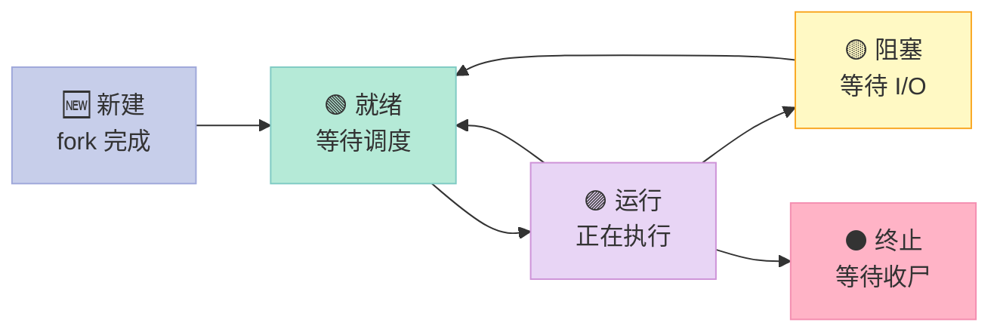

### 2.4 Linux 内核的进程状态（更细）

Linux 在 `include/linux/sched.h` 中把进程状态分成更多类：

| 状态宏 | 值 | 含义 |
|--------|---|------|
| `TASK_RUNNING` | 0 | 就绪 + 运行（在就绪队列中或正在运行） |
| `TASK_INTERRUPTIBLE` | 1 | 可中断睡眠（收到信号就醒来） |
| `TASK_UNINTERRUPTIBLE` | 2 | 不可中断睡眠（不能被信号打断，如 `unlink` 删除大文件） |
| `__TASK_STOPPED` | 4 | 进程被 `SIGSTOP` 暂停 |
| `__TASK_TRACED` | 8 | 被 `ptrace` 跟踪的暂停 |
| `EXIT_DEAD` | 16 | 进程已被 `wait` 回收，task_struct 即将释放 |
| `EXIT_ZOMBIE` | 32 | 进程已退出，等待父进程 `wait` |

> **面试追问**：`ps` 看到的 `D` 状态是什么？—— `TASK_UNINTERRUPTIBLE`，常见于磁盘 IO。**这种进程连 `kill -9` 都杀不掉**，因为它不能被信号打断。这也是为什么生产环境出现大量 `D` 状态进程时，通常是存储 / NFS 出问题。

### 2.5 进程资源视图：每个进程都"独占"一台虚拟计算机

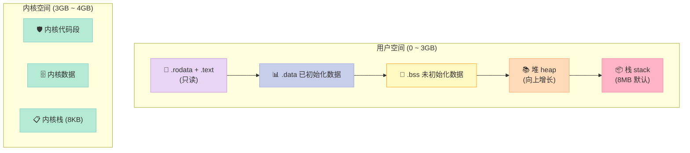

> **关键点**：每个进程看到的 4GB（32-bit）是**虚拟地址**。真实物理内存由内核统一管理，靠页表（page table）映射。这才是「进程地址空间隔离」的本质。

---

## 三、task_struct：Linux 进程的大总管

Linux 用一个 `task_struct` 结构体描述一个进程。**它是 PCB（Process Control Block，进程控制块）在 Linux 中的具体实现**。理解 `task_struct` 就能理解进程在内核眼中是什么。

### 3.1 task_struct 字段全景（精简版）

| 字段类别 | 字段名 | 作用 |
|---------|-------|------|
| **标识** | `pid` / `tgid` | 进程 ID / 线程组 ID |
| **标识** | `comm[TASK_COMM_LEN]` | 进程名（最长 15 字节） |
| **父子关系** | `real_parent` / `parent` | 父进程 task_struct |
| **父子关系** | `children` / `sibling` | 子进程链表 |
| **状态** | `state` / `exit_state` | 当前状态 / 退出状态 |
| **状态** | `exit_code` / `exit_signal` | 退出码 / 退出信号 |
| **调度** | `prio` / `static_prio` / `normal_prio` | 动态 / 静态 / 归一化优先级 |
| **调度** | `se` / `fifo` / `rt` | CFS / 实时 调度实体 |
| **调度** | `policy` | 调度策略（CFS / SCHED_FIFO / SCHED_RR） |
| **调度** | `time_slice` | 时间片（已废弃，2.6 后用 CFS） |
| **内存** | `mm` / `active_mm` | 内存描述符 |
| **内存** | `min_flt` / `maj_flt` | 缺页统计（minor / major） |
| **文件** | `files` | 文件描述符表 |
| **文件** | `fs` / `fs_excl` | 文件系统信息（cwd / root） |
| **信号** | `signal` / `sighand` / `sigpending` | 信号相关 |
| **信号** | `sas_ss_sp` | 备用信号栈（stack） |
| **凭据** | `cred` / `real_cred` | 用户 / 组 ID、能力集 |
| **资源限制** | `signal->rlim[RLIM_NLIMITS]` | rlimit 数组（见 §11） |
| **时间** | `utime` / `stime` | 用户态 / 内核态 CPU 时间 |
| **时间** | `start_time` | 进程启动时间（jiffies） |
| **时间** | `real_start_time` | 进程启动时间（wall time） |
| **线程** | `stack` | 内核栈（8KB-16KB） |
| **线程** | `thread_info` | 线程描述符（低版本） |
| **命名空间** | `nsproxy` | 命名空间（pid/mnt/net/ipc/uts/user） |
| **cgroup** | `cgroups` | 控制组（资源隔离） |

### 3.2 task_struct 的简化 C 结构（教学版）

```c
// 简化版 task_struct（实际有 600+ 字段）
struct task_struct {
    /* 1. 调度相关 */
    long              state;              // 进程状态
    void             *stack;              // 内核栈指针
    unsigned int      flags;              // 进程标志（PF_xxx）
    int               prio;               // 动态优先级
    int               static_prio;        // 静态优先级
    int               normal_prio;        // 归一化优先级
    unsigned int      policy;             // 调度策略
    struct sched_entity  se;              // CFS 调度实体
    struct sched_rt_entity rt;            // 实时调度实体
    cpumask_t         cpus_allowed;       // 允许运行的 CPU

    /* 2. 标识 */
    pid_t             pid;                // 进程 ID
    pid_t             tgid;               // 线程组 ID（对主线程 == pid）
    char              comm[TASK_COMM_LEN];// 进程名

    /* 3. 父子关系 */
    struct task_struct *real_parent;      // 真实的父进程
    struct task_struct *parent;           // 当前父进程
    struct list_head   children;          // 子进程链表
    struct list_head   sibling;           // 兄弟节点

    /* 4. 内存 */
    struct mm_struct  *mm;                // 用户态内存描述符
    struct mm_struct  *active_mm;         // 内核线程借用

    /* 5. 文件 */
    struct files_struct   *files;         // 文件描述符表
    struct fs_struct      *fs;            // cwd / root
    struct nsproxy        *nsproxy;       // 命名空间

    /* 6. 信号 */
    struct signal_struct  *signal;        // 共享信号
    struct sighand_struct *sighand;       // 信号处理
    struct sigpending     pending;        // 待处理信号
    sigset_t              blocked;        // 阻塞信号集
    sigset_t              real_blocked;   // 临时阻塞集
    struct sigaction      action[64];     // 信号处理函数

    /* 7. 凭据 */
    const struct cred __rcu *real_cred;   // 真实凭据
    const struct cred __rcu *cred;        // 有效凭据

    /* 8. 时间 */
    u64                  utime;           // 用户态 CPU 时间
    u64                  stime;           // 内核态 CPU 时间
    u64                  start_time;      // 启动时间（jiffies）
    struct timespec64    start_boottime;  // 启动时间（wall）

    /* 9. 资源限制（简化为 signal->rlim） */
    // struct rlimit rlim[RLIM_NLIMITS];

    /* 10. 退出 */
    int                  exit_code;       // 退出码
    int                  exit_signal;     // 退出信号
};
```

### 3.3 task_struct 链表与红黑树

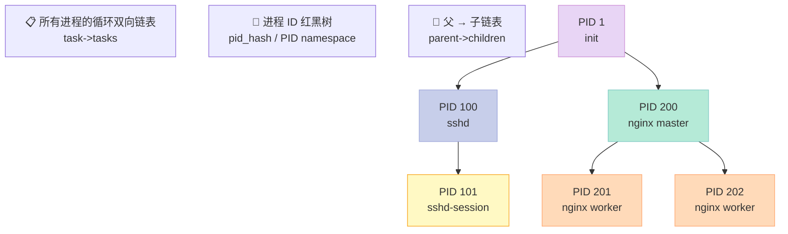

### 3.4 实战：读 /proc/self/status 看自己的进程

```bash
# 查看当前进程（shell）的信息
cat /proc/self/status

# 关键字段
# Name:   bash
# Pid:    12345
# PPid:   12340         # 父进程 PID
# State:  S (sleeping)  # 状态
# Tgid:   12345
# Ngid:   0
# Uid:    1000    1000    1000    1000
# Gid:    1000    1000    1000    1000
# VmPeak:    12345 kB    # 虚拟内存峰值
# VmSize:    12340 kB    # 当前虚拟内存
# VmRSS:      4567 kB    # 实际占用物理内存
# Threads: 1            # 线程数
```

```c
// 代码：读 /proc/self/status 拿 VmRSS
#include <stdio.h>
#include <stdlib.h>
#include <string.h>

int main() {
    FILE* f = fopen("/proc/self/status", "r");
    if (!f) { perror("fopen"); return 1; }
    char line[256];
    while (fgets(line, sizeof(line), f)) {
        if (strncmp(line, "VmRSS:", 6) == 0 ||
            strncmp(line, "VmSize:", 7) == 0 ||
            strncmp(line, "Threads:", 8) == 0) {
            printf("%s", line);
        }
    }
    fclose(f);
    return 0;
}
```

### 3.5 任务 ID 体系

| 系统调用 | 含义 | 举例 |
|---------|------|------|
| `getpid()` | 当前进程 PID | bash PID |
| `getppid()` | 父进程 PID | sshd PID |
| `gettid()` | 当前线程 TID | 主线程 TID == PID |
| `getpgid(pid)` | 进程组 ID | 同组共享 |
| `getsid(pid)` | 会话 ID | 含控制终端 |
| `getuid()` / `geteuid()` | 真实 / 有效 UID | 权限判断 |

---

## 四、fork：进程创建的瑞士军刀

### 4.1 fork 的三种返回值（最常考）

```c
#include <sys/types.h>
#include <unistd.h>
#include <stdio.h>
#include <stdlib.h>

int main() {
    pid_t pid = fork();
    if (pid < 0) {
        // 父进程分支：fork 失败
        // 原因：进程数达到 RLIMIT_NPROC 或 内存不足
        perror("fork");
        exit(1);
    } else if (pid == 0) {
        // 子进程分支：返回值是 0
        // 子进程从这里开始执行，继承父进程的全部上下文
        printf("子进程: PID=%d, PPID=%d\n", getpid(), getppid());
        // 子进程通常会立即 exec 一个新程序
        // execlp("/bin/ls", "ls", "-l", NULL);
        exit(0);  // 子进程退出
    } else {
        // 父进程分支：返回值是子进程 PID
        printf("父进程: PID=%d, 子进程 PID=%d\n", getpid(), pid);
        // 父进程可以选择 wait 或继续
    }
    return 0;
}
```

| 返回值 | 含义 | 出现时机 |
|--------|------|---------|
| `< 0` | 失败 | 达到进程数上限 / 内存不足 |
| `== 0` | 当前是**子进程** | 唯一身份标识 |
| `> 0` | 当前是**父进程**，值是子 PID | 父进程独占子 PID |

> **为什么子进程返回 0，父进程返回子 PID？**
>
> - 子进程只会有 1 个，它的"父进程"是唯一的，**通过 `getppid()` 就能拿到**（虽然 fork 后返回值是 0，但子进程可以用 `getppid()` 找到父进程）。
> - 父进程可能创建很多子进程，**它必须明确知道子进程的 PID 才能 `wait` 它**。
>
> 这是 UNIX 设计的精妙之处：**让需要额外信息的那个角色去拿**。

### 4.2 写时复制 COW（Copy-On-Write）原理

**核心思想**：`fork` 后父子进程共享同一块物理内存，**只读共享**。**当且仅当某一方执行 `write` 时，内核才在那一页上做"复制"**。

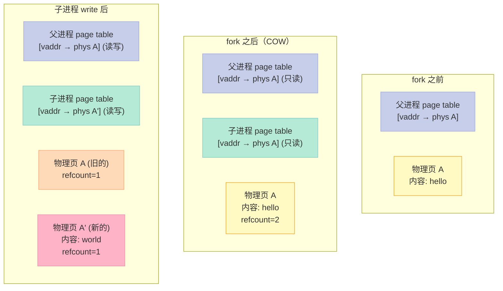

### 4.3 COW 完整示例

```c
// cow_demo.c
#include <stdio.h>
#include <stdlib.h>
#include <unistd.h>
#include <sys/wait.h>

int global_var = 100;  // 全局变量（.data 段）

int main() {
    pid_t pid = fork();
    if (pid == 0) {
        // 子进程：1 秒后修改 global_var
        sleep(1);
        printf("[子] 修改前 global_var=%d (地址 %p)\n", global_var, &global_var);
        global_var = 200;  // 触发 COW：复制一页
        printf("[子] 修改后 global_var=%d (地址 %p)\n", global_var, &global_var);
        exit(0);
    } else {
        // 父进程：等子进程改完，再读
        wait(NULL);
        printf("[父] 子进程改完后 global_var=%d (地址 %p)\n", global_var, &global_var);
        // 地址相同（虚拟地址），但物理页已经不同（COW 后）
    }
    return 0;
}
```

> **关键观察**：父子进程打印的 `&global_var` **完全相同**（虚拟地址一致），但 `global_var` 的值不同（物理页已经分离）。

### 4.4 fork 性能数据

| 操作 | 耗时（数量级） | 备注 |
|------|--------------|------|
| `fork()`（COW 优化后） | 100~300 us | 几乎是常数时间 |
| `fork()`（无 COW 复制整段） | 10~100 ms | 4GB 空间会慢 |
| `vfork()` | 50~100 us | 不复制页表，更快 |
| `clone()`（创建线程） | 50~150 us | 共享地址空间 |
| `execve()` | 1~10 ms | 加载新程序 |
| `wait()` | 看子进程 | 阻塞直到子退出 |

> **面试题**：`fork` 一定比 `pthread_create` 快吗？—— 不一定。如果子进程立刻 `exec`，`fork` + `exec` 总耗时可能比 `pthread_create` 慢，因为 `exec` 要加载整个新程序。

### 4.5 fork 失败的可能原因

| 错误码 | 含义 | 触发场景 |
|--------|------|---------|
| `EAGAIN` | 资源暂时不可用 | `RLIMIT_NPROC` 达到上限 |
| `ENOMEM` | 内存不足 | 物理内存 / 交换区耗尽 |
| `ENOSYS` | 不支持 | 某些嵌入式平台 |

```bash
# 查看用户最大进程数
ulimit -u
# 100000
```

```c
// 安全的 fork 封装
pid_t safe_fork() {
    pid_t pid = fork();
    if (pid < 0) {
        if (errno == EAGAIN) {
            fprintf(stderr, "进程数达到 RLIMIT_NPROC 上限\n");
        } else if (errno == ENOMEM) {
            fprintf(stderr, "内存不足，无法创建 task_struct\n");
        }
        return -1;
    }
    return pid;
}
```

---

## 五、vfork vs fork：父子进程共享数据段

### 5.1 核心差异对比表

| 维度 | `fork` | `vfork` |
|------|--------|---------|
| 子进程地址空间 | 独立（COW） | 共享父进程（**不复制页表**） |
| 父子执行顺序 | 不确定 | **保证子进程先运行** |
| 子进程修改数据 | 触发 COW | **直接修改父进程数据**（非常危险） |
| 性能 | O(1)，但首次写会触发 COW | 更快（无页表复制） |
| 子进程必须 | 可 exec 可不 exec | **必须立即 exec 或 _exit** |
| 父子并发 | 可以并发 | 子运行时父阻塞 |

### 5.2 vfork 行为示例

```c
// vfork_demo.c
#include <stdio.h>
#include <stdlib.h>
#include <unistd.h>
#include <sys/wait.h>

int main() {
    int x = 1;
    pid_t pid = vfork();
    if (pid == 0) {
        // 子进程：必须立即 exec 或 _exit
        // 不能 return，不能调 exit，不能修改除局部变量外的内存
        x = 100;  // 危险！会修改父进程的栈
        printf("[子] x=%d\n", x);  // 100
        _exit(0);  // 用 _exit，不用 exit（exit 会刷新 stdio）
    } else {
        // 父进程：等子进程 exec 或 _exit 后才继续
        printf("[父] x=%d\n", x);  // 100! 父进程的 x 被改了
    }
    return 0;
}
```

### 5.3 何时用 vfork？

**应用场景**：`fork` 后立即 `exec` 一个新程序（如 shell、nginx master）。

| 场景 | 推荐 |
|------|------|
| 子进程会执行新程序（exec） | `vfork` 更高效（少一次页表复制） |
| 子进程要在父进程代码上跑 | `fork` |
| 现代 Linux 中 | **几乎都用 `fork`，因为 COW 已经很快** |
| 内核早期 | `vfork` 是 `fork` 的性能优化版 |

> **现实**：`vfork` 实际上极少用，因为：1) 现代 `fork` 借助 COW 已经很快；2) `vfork` 的"子进程必须立即 exec"约束很严格，容易出错。**glibc 在 `posix_spawn` 内部会根据情况选择 fork 或 vfork**。

---

## 六、execve：进程映像替换的 7 步流程

### 6.1 exec 家族函数对比

| 函数 | 路径搜索 | 参数形式 | 环境变量 | 头文件 |
|------|---------|---------|---------|--------|
| `execl(path, arg0, ..., NULL)` | 否 | 列表 | `environ` | `<unistd.h>` |
| `execlp(file, arg0, ..., NULL)` | **是** | 列表 | `environ` | `<unistd.h>` |
| `execle(path, arg0, ..., NULL, envp)` | 否 | 列表 | 显式 | `<unistd.h>` |
| `execv(path, argv)` | 否 | 数组 | `environ` | `<unistd.h>` |
| `execvp(file, argv)` | **是** | 数组 | `environ` | `<unistd.h>` |
| `execve(path, argv, envp)` | 否 | 数组 | 显式 | `<unistd.h>` |
| `fexecve(fd, argv, envp)` | 用 fd | 数组 | 显式 | `<unistd.h>` |

> **只有 `execve` 是真正的系统调用**，其他都是 glibc 库函数。

### 6.2 execve 完整示例

```c
// execve_demo.c
#include <unistd.h>
#include <stdio.h>
#include <stdlib.h>

int main() {
    char* argv[] = {
        "ls",
        "-l",
        "-a",
        "/tmp",
        NULL
    };
    char* envp[] = {
        "PATH=/usr/bin:/bin",
        "LANG=en_US.UTF-8",
        "USER=xuqi",
        NULL
    };
    // execve 成功则不会返回
    // 失败返回 -1
    execve("/bin/ls", argv, envp);
    // 只有 execve 失败才会走到这里
    perror("execve");
    return 1;
}
```

### 6.3 execve 7 步流程（面试必背）

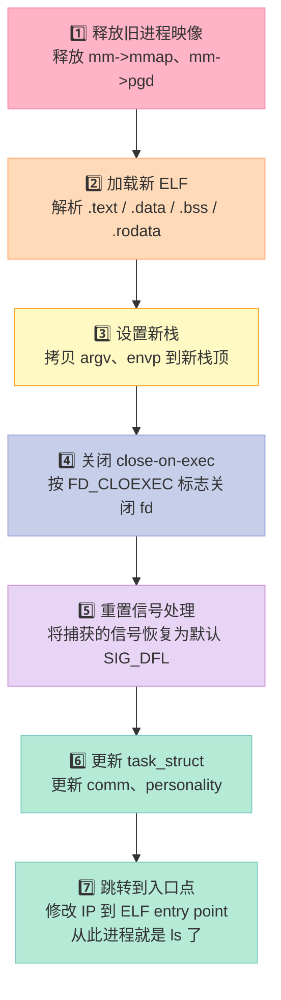

### 6.4 execve 后保留 vs 重置的内容

| 保留 | 重置 |
|------|------|
| PID / PPID / PGID / SID | 进程映像（代码、数据、堆、栈） |
| 实际 UID / GID（除非设了 setuid 位） | 有效 UID（如果新程序有 setuid 位，会切换） |
| 工作目录（除非新程序改） | 信号处理函数（恢复默认） |
| 文件描述符表（除 FD_CLOEXEC） | 资源限制（`rlimit`）？保留 |
| 资源限制（`rlimit`） | 进程优先级（`nice`） |
| nice 值 | 未完成的定时器（`alarm`、`setitimer`） |
| 文件锁 | tty 前台进程组 |
| **umask** | 父进程的 pending 信号？保留 |
| 计时器 | 文件描述符 close-on-exec 标志 |

### 6.5 fork + execve 经典模板（shell / nginx 风格）

```c
// shell_run.c
#include <stdio.h>
#include <stdlib.h>
#include <unistd.h>
#include <sys/wait.h>
#include <fcntl.h>

// 模拟 shell：执行一条命令
int run_command(char* cmd, char** args) {
    pid_t pid = fork();
    if (pid < 0) {
        perror("fork");
        return -1;
    }
    if (pid == 0) {
        // 子进程
        // 1. 重定向 stdin/stdout/stderr（可选）
        // 2. exec 新程序
        // 3. 如果 exec 失败，退出码必须是 127
        execvp(cmd, args);
        // exec 失败
        fprintf(stderr, "%s: command not found\n", cmd);
        exit(127);
    }
    // 父进程：等待子进程结束
    int status;
    waitpid(pid, &status, 0);
    if (WIFEXITED(status)) {
        return WEXITSTATUS(status);
    }
    if (WIFSIGNALED(status)) {
        return 128 + WTERMSIG(status);  // shell 约定
    }
    return -1;
}

int main() {
    char* cmd = "ls";
    char* args[] = {"ls", "-l", "-a", NULL};
    int rc = run_command(cmd, args);
    printf("子进程退出码: %d\n", rc);
    return 0;
}
```

### 6.6 exec 失败的处理（容易忽略的坑）

```c
pid_t pid = fork();
if (pid == 0) {
    // 子进程
    execve("/some/bad/path", argv, envp);
    // execve 失败时，**子进程必须 exit**
    // 不 exit 的话，子进程会回到 fork 后的代码
    // 重复执行父进程后续的逻辑，可能导致数据错乱
    fprintf(stderr, "exec failed: %s\n", strerror(errno));
    _exit(127);  // 标准约定
}
// 父进程继续
```

> **最佳实践**：子进程 fork 后的第一件事就是 exec + exit 失败处理，**不要在子进程里做太多业务**。这也是 `posix_spawn` 的设计哲学。

---

## 七、进程退出：exit / _exit / return 三大路径

### 7.1 三种退出方式对比

| 维度 | `return from main` | `exit()` | `_exit()` |
|------|-------------------|----------|-----------|
| 头文件 | - | `<stdlib.h>` | `<unistd.h>` |
| 调用 atexit 钩子 | ✅ | ✅ | ❌ |
| 刷新 stdio 缓冲区 | ✅ | ✅ | ❌ |
| 关闭 stdio 流 | ✅ | ✅ | ❌ |
| 删除 tmpfile | ✅ | ✅ | ❌ |
| 调用父进程的 wait 通知 | ✅ | ✅ | ✅ |
| 执行速度 | 慢（要析构 C++ 局部对象） | 慢 | **快** |
| 适用场景 | main 末尾 | 普通退出 | **fork 后的子进程** |

### 7.2 退出码规范（POSIX 约定）

| 退出码 | 含义 | 备注 |
|--------|------|------|
| 0 | 成功 | POSIX 规定 |
| 1 | 一般错误 | 通用 |
| 2 | 命令行参数错误 | bash 约定 |
| 126 | 命令找到了但不可执行 | bash 约定 |
| 127 | 命令未找到 | bash 约定 |
| 128 + N | 被信号 N 终止 | shell 约定（`128 + 9 = 137`） |
| 130 | 被 SIGINT 终止（Ctrl-C） | 130 = 128 + 2 |
| 137 | 被 SIGKILL 终止 | 137 = 128 + 9 |
| 143 | 被 SIGTERM 终止 | 143 = 128 + 15 |

### 7.3 实战：atexit 钩子

```c
// atexit_demo.c
#include <stdio.h>
#include <stdlib.h>
#include <unistd.h>

void cleanup1(void) { printf("cleanup1 called\n"); }
void cleanup2(void) { printf("cleanup2 called\n"); }

int main() {
    atexit(cleanup1);  // 先注册的后调用
    atexit(cleanup2);  // 后注册的先调用（LIFO）

    printf("main: hello\n");
    // 三种退出方式
    // return 0;       // 会调用 cleanup1, cleanup2
    // exit(0);         // 也会
    // _exit(0);        // 不会！

    return 0;
}
// 输出：
// main: hello
// cleanup2 called
// cleanup1 called
```

### 7.4 实战：父进程 wait 收尸（必须掌握）

```c
// wait_demo.c
#include <stdio.h>
#include <stdlib.h>
#include <unistd.h>
#include <sys/wait.h>
#include <signal.h>

int main() {
    pid_t pid = fork();
    if (pid == 0) {
        printf("[子] 即将退出\n");
        _exit(42);  // 退出码 42
    }

    int status;
    pid_t w = waitpid(pid, &status, 0);  // 阻塞等待
    if (w == -1) {
        perror("waitpid");
        return 1;
    }

    if (WIFEXITED(status)) {
        printf("[父] 子进程正常退出，退出码 = %d\n", WEXITSTATUS(status));
    } else if (WIFSIGNALED(status)) {
        printf("[父] 子进程被信号 %d 终止\n", WTERMSIG(status));
    } else if (WIFSTOPPED(status)) {
        printf("[父] 子进程被信号 %d 暂停\n", WSTOPSIG(status));
    }
    return 0;
}
```

### 7.5 WNOHANG：非阻塞 wait（轮询用）

```c
// 非阻塞检查子进程
pid_t pid = fork();
if (pid > 0) {
    // 父进程做其他事...
    int status;
    pid_t result = waitpid(pid, &status, WNOHANG);
    if (result == 0) {
        // 子进程还在跑
        printf("子进程还活着，继续干别的\n");
    } else if (result > 0) {
        // 子进程已退出
        printf("子进程已退出，退出码 %d\n", WEXITSTATUS(status));
    }
}
```

### 7.6 SIGCHLD 信号：异步通知机制

```c
// sigchld_demo.c
// 用 SIGCHLD 异步回收子进程（防止僵尸进程）
#include <stdio.h>
#include <stdlib.h>
#include <unistd.h>
#include <signal.h>
#include <sys/wait.h>

void sigchld_handler(int sig) {
    // 保存 errno，信号处理函数不要调可能改 errno 的函数
    int saved_errno = errno;
    // 循环回收所有已退出的子进程
    // WNOHANG：非阻塞，没有子进程退出时立即返回 0
    // WCONTINUED：被 SIGCONT 恢复的子进程也通知
    int status;
    pid_t pid;
    while ((pid = waitpid(-1, &status, WNOHANG)) > 0) {
        printf("[SIGCHLD] 回收子进程 PID=%d\n", pid);
    }
    errno = saved_errno;
}

int main() {
    // 1. 注册 SIGCHLD 处理函数
    struct sigaction sa;
    sa.sa_handler = sigchld_handler;
    sigemptyset(&sa.sa_mask);
    sa.sa_flags = SA_RESTART | SA_NOCLDSTOP;  // 不关心 SIGSTOP
    sigaction(SIGCHLD, &sa, NULL);

    // 2. fork 几个子进程
    for (int i = 0; i < 3; ++i) {
        if (fork() == 0) {
            sleep(2 + i);
            printf("[子 %d] 退出\n", i);
            _exit(0);
        }
    }

    // 3. 父进程做其他事
    printf("[父] 工作中...\n");
    sleep(10);
    printf("[父] 退出\n");
    return 0;
}
```

---

## 八、进程间通信 7 种方式详解

### 8.1 7 种 IPC 全景对比

| 方式 | 范围 | 速度 | 内核介入 | 持久性 | 典型场景 |
|------|------|------|---------|--------|---------|
| **管道 pipe** | 父子/兄弟 | 中 | 有 | 进程退出销毁 | shell 管道 |
| **FIFO 有名管道** | 任意亲缘 | 中 | 有 | 文件系统持久 | 跨进程日志 |
| **消息队列** | 任意 | 中 | 有 | 内核持久 | 内核-用户消息 |
| **信号量** | 任意 | 快 | 有 | 内核持久 | 同步/互斥 |
| **共享内存** | 任意 | **最快** | 首次 | 内核持久 | 大数据传输 |
| **信号 signal** | 任意 | 立即 | 立即 | 一次性 | 通知 |
| **Socket** | 跨主机 | 慢 | 有 | 文件 | 网络通信 |

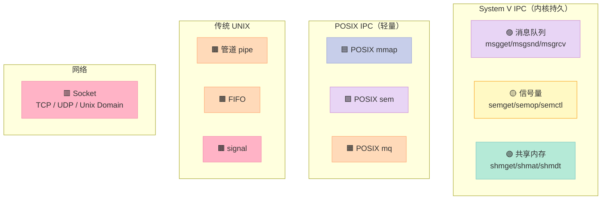

### 8.2 方式 1：管道 pipe（最简单）

**特点**：
- 半双工（一端读、一端写）
- 只能用于**有亲缘关系**的进程（父子、兄弟）
- 数据在内存中，不在磁盘
- 当所有读端关闭，写端 `write` 会收到 `SIGPIPE`（默认行为是终止进程）

```c
// pipe_demo.c
#include <stdio.h>
#include <stdlib.h>
#include <unistd.h>
#include <string.h>
#include <sys/wait.h>

int main() {
    int fd[2];
    if (pipe(fd) == -1) {  // 创建管道
        perror("pipe");
        return 1;
    }
    // fd[0] = 读端
    // fd[1] = 写端

    pid_t pid = fork();
    if (pid == 0) {
        // 子进程：从管道读
        close(fd[1]);  // 关闭写端
        char buf[128];
        ssize_t n = read(fd[0], buf, sizeof(buf) - 1);
        if (n > 0) {
            buf[n] = '\0';
            printf("[子] 收到: %s\n", buf);
        }
        close(fd[0]);
        _exit(0);
    } else {
        // 父进程：往管道写
        close(fd[0]);  // 关闭读端
        const char* msg = "Hello from parent!";
        write(fd[1], msg, strlen(msg));
        close(fd[1]);
        wait(NULL);
    }
    return 0;
}
```

### 8.3 方式 2：FIFO 有名管道

**特点**：
- 有文件系统路径（如 `/tmp/myfifo`）
- 任何进程都可以 `open` 它通信
- 即使进程退出，FIFO 文件还在（除非显式 `unlink`）

```c
// fifo_writer.c
#include <stdio.h>
#include <stdlib.h>
#include <fcntl.h>
#include <sys/stat.h>
#include <unistd.h>
#include <string.h>

int main() {
    const char* path = "/tmp/myfifo";
    // 创建 FIFO
    if (mkfifo(path, 0666) == -1) {
        perror("mkfifo");  // 可能已经存在
    }
    // 打开写端（阻塞直到有读端打开）
    int fd = open(path, O_WRONLY);
    if (fd < 0) { perror("open"); return 1; }
    for (int i = 0; i < 5; ++i) {
        char buf[64];
        snprintf(buf, sizeof(buf), "message %d\n", i);
        write(fd, buf, strlen(buf));
        sleep(1);
    }
    close(fd);
    unlink(path);
    return 0;
}
```

```bash
# 读端：在 shell 里
while true; do cat /tmp/myfifo; done
```

### 8.4 方式 3：消息队列（System V）

```c
// msg_queue_demo.c
#include <stdio.h>
#include <stdlib.h>
#include <string.h>
#include <sys/ipc.h>
#include <sys/msg.h>

struct msgbuf {
    long mtype;        // 消息类型（>0）
    char mtext[128];   // 消息内容
};

int main() {
    key_t key = ftok("/tmp", 'A');
    if (key == -1) { perror("ftok"); return 1; }
    // 创建/获取消息队列
    int msqid = msgget(key, 0666 | IPC_CREAT);
    if (msqid == -1) { perror("msgget"); return 1; }

    if (fork() == 0) {
        // 子进程：发送消息
        struct msgbuf m = {1, "hello from child"};
        msgsnd(msqid, &m, strlen(m.mtext) + 1, 0);
        printf("[子] 已发送\n");
        _exit(0);
    } else {
        // 父进程：接收消息
        struct msgbuf m;
        msgrcv(msqid, &m, sizeof(m.mtext), 1, 0);
        printf("[父] 收到: %s\n", m.mtext);
        wait(NULL);
        // 清理
        msgctl(msqid, IPC_RMID, NULL);
    }
    return 0;
}
```

### 8.5 方式 4：信号量（System V）

**信号量 ≠ 通信机制**，它是**同步机制**。但常被列为 IPC 之一。

```c
// sem_demo.c
#include <stdio.h>
#include <stdlib.h>
#include <sys/ipc.h>
#include <sys/sem.h>
#include <sys/wait.h>
#include <unistd.h>

// PV 操作封装
void P(int semid) {
    struct sembuf op = {0, -1, 0};  // sem_num=0, sem_op=-1, sem_flg=0
    semop(semid, &op, 1);
}
void V(int semid) {
    struct sembuf op = {0, 1, 0};
    semop(semid, &op, 1);
}

int main() {
    key_t key = ftok("/tmp", 'B');
    int semid = semget(key, 1, 0666 | IPC_CREAT);
    // 初始化信号量为 1（互斥锁）
    semctl(semid, 0, SETVAL, 1);

    if (fork() == 0) {
        // 子进程
        P(semid);
        printf("[子] 进入临界区\n");
        sleep(1);
        printf("[子] 离开临界区\n");
        V(semid);
        _exit(0);
    } else {
        // 父进程
        P(semid);
        printf("[父] 进入临界区\n");
        sleep(1);
        printf("[父] 离开临界区\n");
        V(semid);
        wait(NULL);
        semctl(semid, 0, IPC_RMID);
    }
    return 0;
}
```

### 8.6 方式 5：共享内存（最快的 IPC）

```c
// shm_demo.c
#include <stdio.h>
#include <stdlib.h>
#include <sys/ipc.h>
#include <sys/shm.h>
#include <sys/wait.h>
#include <unistd.h>
#include <string.h>

int main() {
    key_t key = ftok("/tmp", 'C');
    // 创建 1024 字节共享内存
    int shmid = shmget(key, 1024, 0666 | IPC_CREAT);
    // 连接到当前进程地址空间
    char* shm = (char*)shmat(shmid, NULL, 0);
    if (shm == (char*)-1) { perror("shmat"); return 1; }

    if (fork() == 0) {
        // 子进程：写
        strcpy(shm, "Hello shared memory!");
        printf("[子] 已写入\n");
        shmdt(shm);
        _exit(0);
    } else {
        // 父进程：读
        wait(NULL);
        printf("[父] 读到: %s\n", shm);
        shmdt(shm);
        shmctl(shmid, IPC_RMID, NULL);
    }
    return 0;
}
```

> **注意**：共享内存是 7 种 IPC 中**最快**的，但需要**自行加锁**（用信号量）。

### 8.7 方式 6：信号 signal

```c
// signal_demo.c
#include <stdio.h>
#include <stdlib.h>
#include <signal.h>
#include <unistd.h>

void sigusr1_handler(int sig) {
    // 异步信号安全（Async-Signal-Safe）函数列表见 signal-safety(7)
    write(STDOUT_FILENO, "got SIGUSR1\n", 12);
}

int main() {
    signal(SIGUSR1, sigusr1_handler);
    pid_t pid = fork();
    if (pid == 0) {
        sleep(1);
        kill(getppid(), SIGUSR1);  // 子进程给父进程发信号
        _exit(0);
    }
    // 父进程等信号
    for (int i = 0; i < 3; ++i) {
        printf("[父] 工作中...\n");
        sleep(2);
    }
    return 0;
}
```

### 8.8 方式 7：Socket（最通用，跨主机）

```c
// unix_socket_demo.c
// Unix Domain Socket 进程间通信
#include <stdio.h>
#include <stdlib.h>
#include <sys/socket.h>
#include <sys/un.h>
#include <unistd.h>
#include <string.h>
#include <sys/wait.h>

int main() {
    const char* path = "/tmp/my_socket";
    unlink(path);
    int sv[2];
    // 创建 Unix 域 socket 对
    if (socketpair(AF_UNIX, SOCK_STREAM, 0, sv) == -1) {
        perror("socketpair");
        return 1;
    }
    if (fork() == 0) {
        // 子进程
        close(sv[0]);
        const char* msg = "hello from child";
        write(sv[1], msg, strlen(msg));
        close(sv[1]);
        _exit(0);
    } else {
        // 父进程
        close(sv[1]);
        char buf[128];
        ssize_t n = read(sv[0], buf, sizeof(buf) - 1);
        if (n > 0) {
            buf[n] = '\0';
            printf("[父] 收到: %s\n", buf);
        }
        close(sv[0]);
        wait(NULL);
    }
    return 0;
}
```

### 8.9 7 种 IPC 选型决策表

| 场景 | 推荐 | 原因 |
|------|------|------|
| 父子进程，简单流 | 管道 | 简单 |
| 任意进程，简单流 | FIFO | 不需亲缘 |
| 大量数据，跨进程 | **共享内存 + 信号量** | 最快 |
| 异步通知 | 信号 | 立即 |
| 跨主机 | **Socket** | 唯一选择 |
| 同一机器，复杂消息 | 消息队列 | 带优先级 |
| 同步/互斥 | 信号量 | 专门用途 |
| 框架集成 | D-Bus / gRPC | 工业级方案 |

---

## 九、孤儿进程 vs 僵尸进程 vs 守护进程

### 9.1 三大特殊进程对比

| 类型 | 父进程状态 | 子进程状态 | 父 PID | 处理方 | 危害 |
|------|----------|----------|--------|--------|------|
| **正常** | 健在 | 运行/退出 | 父 | 父 `wait` | 无 |
| **孤儿** | 已退出 | 还在运行 | 1 (init) | init 托管 | 浪费 PID |
| **僵尸** | 健在 | 已退出 | 父 | 父 `wait` | 占用 PID |
| **守护进程** | 通常是 init | 后台运行 | 1 | 自管 | 资源 |

### 9.2 孤儿进程完整示例

```c
// orphan_demo.c
#include <stdio.h>
#include <stdlib.h>
#include <unistd.h>
#include <sys/wait.h>

int main() {
    pid_t pid = fork();
    if (pid == 0) {
        // 子进程
        printf("[子] 父 PID = %d\n", getppid());
        sleep(3);  // 父进程会先退出
        printf("[子] 父 PID = %d (现在是 init)\n", getppid());
        // 此时本进程是孤儿进程，PPID=1
        _exit(0);
    } else {
        // 父进程先死
        printf("[父] 立即退出，子进程 PID=%d 将成为孤儿\n", pid);
        return 0;  // 不 wait
    }
}
```

```bash
$ ./orphan_demo
[父] 立即退出，子进程 PID=12345 将成为孤儿
[子] 父 PID = 12340
[子] 父 PID = 1 (现在是 init)    # init 收养孤儿
```

### 9.3 僵尸进程完整示例

```c
// zombie_demo.c
#include <stdio.h>
#include <stdlib.h>
#include <unistd.h>

int main() {
    pid_t pid = fork();
    if (pid == 0) {
        // 子进程
        printf("[子] 立即退出\n");
        _exit(0);  // 子进程已死
    }
    // 父进程不 wait，让子进程变僵尸
    printf("[父] 故意不 wait，子进程 PID=%d 即将成僵尸\n", pid);
    sleep(20);  // 期间 ps -ef 会看到 Z 状态
    return 0;
}
```

```bash
# 在另一个终端看
$ ps -ef | grep zombie_demo
xuqi  12345  12340  0 10:00 pts/0  00:00:00 ./zombie_demo
xuqi  12346  12345  0 10:00 pts/0  00:00:00 [zombie_demo] <defunct>
                                                                 ^^^^^^^^
                                                                 这是僵尸
```

### 9.4 防止僵尸进程的 4 种方法

```c
// 方法 1：父进程主动 wait
pid_t pid = fork();
if (pid > 0) waitpid(pid, &status, 0);  // 阻塞收尸

// 方法 2：忽略 SIGCHLD（让 init 收尸）
signal(SIGCHLD, SIG_IGN);  // 内核不会再保留僵尸
// 子进程退出时，task_struct 立即被释放
// 注意：Linux 特有，POSIX 不保证

// 方法 3：SIGCHLD 信号处理（推荐）
struct sigaction sa;
sa.sa_handler = sigchld_handler;  // 循环 waitpid
sigemptyset(&sa.sa_mask);
sa.sa_flags = SA_RESTART | SA_NOCLDSTOP;
sigaction(SIGCHLD, &sa, NULL);

// 方法 4：fork 两次（让孙子变孤儿，init 收尸）
// 这种"杀掉子进程让 init 收尸"的方法叫"double fork"
// 守护进程会用这个技巧
```

### 9.5 守护进程的特性

守护进程（Daemon）是 **Linux 后台服务进程** 的标准形态。

| 特性 | 说明 |
|------|------|
| **后台运行** | 不占用控制终端 |
| **生命周期长** | 通常开机启动，关机才结束 |
| **会话独立** | 自成会话（session） |
| **根目录或 /var** | 防止 umount 不掉 |
| **stdin/stdout/stderr 重定向到 /dev/null** | 防止占用终端 |
| **典型例子** | sshd、nginx、cron、mysqld、systemd |

---

## 十、守护进程完整实现：double-fork + setsid

### 10.1 守护进程的 7 步标准流程

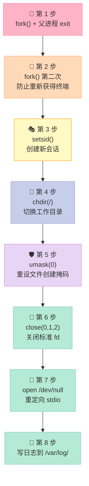

### 10.2 为什么需要 double-fork？

| 单 fork 问题 | double-fork 解决 |
|-------------|-----------------|
| 子进程虽然脱离了父进程，但仍是原会话的成员 | 第二次 fork 后，孙子进程与原会话彻底断绝 |
| 如果子进程打开终端，会重新成为会话首进程 | 孙子进程不是会话首进程，**无法再打开控制终端** |
| System V 守护进程标准的"非会话首进程"要求 | 完全符合 |

### 10.3 setsid() 的作用

```c
pid_t setsid(void);
```

| 操作 | 说明 |
|------|------|
| 创建新会话 | 进程成为新会话的**首进程**（session leader） |
| 创建新进程组 | 进程成为新进程组的**首进程**（process group leader） |
| 脱离控制终端 | 如果有关联终端的话，会断开 |

> **限制**：调用 `setsid()` 的进程**不能是进程组首进程**。这就是为什么先要 fork 一次，让子进程不是进程组首进程。

### 10.4 完整守护进程代码（生产级）

```c
// daemon.c
// 一个完整的守护进程：包含日志、单实例、信号处理
#include <stdio.h>
#include <stdlib.h>
#include <string.h>
#include <unistd.h>
#include <fcntl.h>
#include <signal.h>
#include <sys/stat.h>
#include <sys/types.h>
#include <sys/file.h>
#include <syslog.h>
#include <errno.h>
#include <time.h>

static volatile sig_atomic_t g_running = 1;

void signal_handler(int sig) {
    if (sig == SIGTERM || sig == SIGINT) {
        g_running = 0;
    }
}

// 单实例锁：防止启动两个守护进程
static int lock_pidfile(const char* pidfile) {
    int fd = open(pidfile, O_RDWR | O_CREAT, 0644);
    if (fd < 0) { syslog(LOG_ERR, "open %s: %m", pidfile); return -1; }
    // 尝试加非阻塞写锁
    if (flock(fd, LOCK_EX | LOCK_NB) == -1) {
        if (errno == EWOULDBLOCK) {
            syslog(LOG_ERR, "另一个实例已在运行");
            close(fd);
            return -1;
        }
        syslog(LOG_ERR, "flock: %m");
        close(fd);
        return -1;
    }
    // 写 PID
    char buf[32];
    int n = snprintf(buf, sizeof(buf), "%d\n", getpid());
    ftruncate(fd, 0);
    write(fd, buf, n);
    return fd;
}

void daemonize() {
    // === 第 1 步：第一次 fork ===
    pid_t pid = fork();
    if (pid < 0) exit(1);
    if (pid > 0) exit(0);  // 父进程退出
    // 子进程继续

    // === 第 2 步：创建新会话 ===
    if (setsid() < 0) exit(1);

    // === 第 3 步：第二次 fork（防止重新打开终端） ===
    pid = fork();
    if (pid < 0) exit(1);
    if (pid > 0) exit(0);
    // 孙子进程继续

    // === 第 4 步：切换工作目录到根 ===
    if (chdir("/") < 0) exit(1);

    // === 第 5 步：重置文件创建掩码 ===
    umask(0);

    // === 第 6 步：关闭标准 fd ===
    close(STDIN_FILENO);
    close(STDOUT_FILENO);
    close(STDERR_FILENO);

    // === 第 7 步：重定向到 /dev/null ===
    int devnull = open("/dev/null", O_RDWR);
    if (devnull >= 0) {
        dup2(devnull, STDIN_FILENO);
        dup2(devnull, STDOUT_FILENO);
        dup2(devnull, STDERR_FILENO);
        if (devnull > STDERR_FILENO) close(devnull);
    }
}

int main(int argc, char* argv[]) {
    // 1. 调用 daemonize
    daemonize();

    // 2. 打开系统日志
    openlog("mydaemon", LOG_PID | LOG_CONS, LOG_DAEMON);
    syslog(LOG_INFO, "守护进程启动, PID=%d", getpid());

    // 3. 单实例锁
    int lockfd = lock_pidfile("/var/run/mydaemon.pid");
    if (lockfd < 0) {
        syslog(LOG_ERR, "无法获取 PID 文件锁，退出");
        return 1;
    }

    // 4. 注册信号
    struct sigaction sa = {0};
    sa.sa_handler = signal_handler;
    sigemptyset(&sa.sa_mask);
    sa.sa_flags = 0;
    sigaction(SIGTERM, &sa, NULL);
    sigaction(SIGINT, &sa, NULL);

    // 5. 主循环
    while (g_running) {
        time_t now = time(NULL);
        syslog(LOG_INFO, "心跳: %s", ctime(&now));
        sleep(5);
    }

    syslog(LOG_INFO, "守护进程退出");
    closelog();
    close(lockfd);
    unlink("/var/run/mydaemon.pid");
    return 0;
}
```

### 10.5 编译运行

```bash
gcc -o mydaemon daemon.c
sudo ./mydaemon          # 启动

# 看进程
ps -ef | grep mydaemon
xuqi  12345     1  0 10:00 ?    00:00:00 ./mydaemon    # PPID=1，TTY=?

# 看日志
tail -f /var/log/syslog | grep mydaemon

# 停止
sudo kill 12345
```

---

## 十一、进程组 / 会话 / 控制终端

### 11.1 三者关系

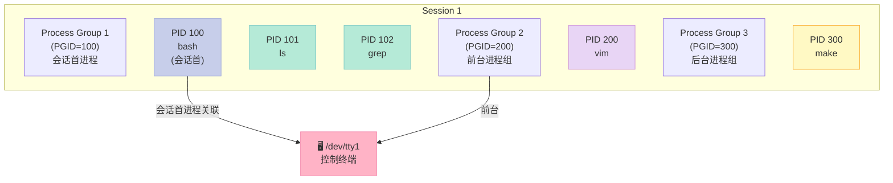

### 11.2 进程组 vs 会话

| 维度 | 进程组（Process Group） | 会话（Session） |
|------|----------------------|---------------|
| ID | PGID | SID |
| 包含 | 一组相关进程（一个 job） | 一个或多个进程组 |
| 创建 | `setpgid()` | `setsid()` |
| 信号 | 同组共享信号（如 Ctrl-C 给前台进程组所有成员） | 会话首进程是控制终端关联点 |
| 用途 | job 控制（`kill -PGID`） | 终端管理 |

### 11.3 实战：Ctrl-C 杀进程组

```bash
# 启动一个 shell 脚本，里面有 3 个子进程
cat > test.sh <<'EOF'
sleep 100 &
sleep 200 &
sleep 300 &
wait
EOF
chmod +x test.sh
./test.sh

# 另一个终端
ps -eo pid,pgid,cmd | grep sleep
# PID   PGID  CMD
# 1234  1234  ./test.sh      # PGID=1234（与 test.sh 相同）
# 1235  1234  sleep 100
# 1236  1234  sleep 200
# 1237  1234  sleep 300

# 杀整个进程组
kill -- -1234    # 注意负号！

# 或
kill -SIGTERM -1234
```

### 11.4 setsid 实战：脱离终端

```bash
# 在终端 A 启动一个长跑命令
ping 8.8.8.8 > /tmp/ping.log

# 关掉终端 A，进程也会被 SIGHUP 杀掉
# 解决：用 setsid
setsid ping 8.8.8.8 > /tmp/ping.log < /dev/null &
# 或
nohup ping 8.8.8.8 > /tmp/ping.log < /dev/null &
```

```c
// C 语言版
pid_t pid = fork();
if (pid == 0) {
    setsid();  // 子进程脱离终端
    execlp("ping", "ping", "8.8.8.8", NULL);
    _exit(1);
}
```

### 11.5 守护进程为什么必须 setsid？

| 不 setsid 的危害 | setsid 的好处 |
|-----------------|--------------|
| 父进程退出时，子进程被 SIGHUP 杀掉 | 进程独立成会话，不受 SIGHUP 影响 |
| 子进程能再次打开 /dev/tty（重获终端） | 会话首进程独占终端，无关进程无法再开 |
| Ctrl-C 会被父进程所在进程组收到 | 独立的进程组，信号隔离 |

---

## 十二、进程调度：O(1) 到 CFS 的演进

### 12.1 三大调度器演进史

| 内核版本 | 调度器 | 时间复杂度 | 特点 |
|---------|--------|----------|------|
| 2.4 | 经典 O(n) | **O(n)** | 每次遍历所有进程 |
| 2.6.0 ~ 2.6.22 | O(1) | O(1) | 140 个优先级队列 |
| 2.6.23+ | **CFS**（Completely Fair Scheduler） | O(log n) | 红黑树 + 虚拟运行时间 |
| 实时 | SCHED_FIFO / SCHED_RR | O(1) | 优先级 0-99 |

### 12.2 CFS 核心思想

CFS 的核心想法是 **"完全公平"**：每个进程获得"虚拟运行时间"（vruntime），**vruntime 越小的进程越优先调度**。

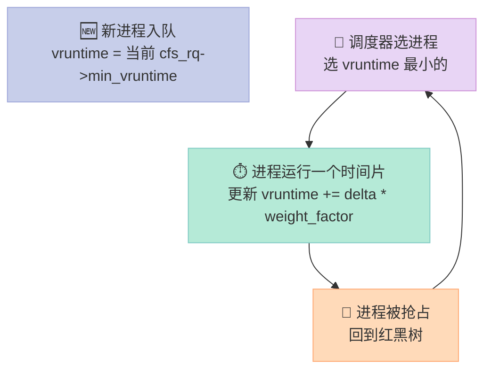

### 12.3 调度策略对比

| 调度策略 | 类型 | 优先级范围 | 抢占 | 时间片 | 用途 |
|---------|------|----------|------|--------|------|
| `SCHED_NORMAL` (CFS) | 普通 | 100-139 | 是 | 动态 | 默认 |
| `SCHED_BATCH` | 普通 | 100-139 | 否 | 长 | 批处理 |
| `SCHED_IDLE` | 普通 | 低 | 否 | 极长 | 最低优先级 |
| `SCHED_FIFO` | 实时 | 1-99 | 否 | 无限 | 实时任务 |
| `SCHED_RR` | 实时 | 1-99 | 是 | 固定 | 实时任务 |
| `SCHED_DEADLINE` | 实时 | - | 是 | - | 周期任务 |

### 12.4 实战：nice / renice 调整优先级

```bash
# nice 值范围 -20 ~ 19
# 值越低，优先级越高（对 CPU 越友好）
# 默认 nice = 0

# 启动时设置
nice -n 10 ./myapp          # nice=10
nice -n -10 ./myapp         # 需要 root

# 运行中调整
renice -n 5 -p 12345         # 把 PID 12345 的 nice 改成 5

# 看优先级
ps -o pid,nice,cmd -p 12345
top                          # NI 列
```

### 12.5 实战：chrt 设置实时调度

```bash
# chrt 用来设 SCHED_FIFO/RR/DEADLINE

# 看当前调度策略
chrt -p 12345
# pid 12345's current scheduling policy: SCHED_OTHER
# pid 12345's current scheduling priority: 0

# 改成 SCHED_FIFO 优先级 50
sudo chrt -f -p 50 12345

# 改成 SCHED_RR 优先级 30
sudo chrt -r -p 30 12345

# 改回默认
sudo chrt -o -p 0 12345
```

### 12.6 优先级到权重的映射

| nice | 权重（weight） |
|------|-------------|
| -20 | 88761 |
| -10 | 3121 |
| 0（默认） | 1024 |
| 10 | 110 |
| 19 | 15 |

> **CFS 用 "权重" 算时间片**：
> - 两个进程 nice 0，权重都是 1024，各拿 50% CPU
> - 一个 nice 0 (1024) + 一个 nice 5 (335)，比例 1024:335 ≈ 3:1

---

## 十三、rlimit：进程资源限制

### 13.1 常用 rlimit 资源

| 资源 | 限制什么 | 典型默认值 |
|------|---------|----------|
| `RLIMIT_CPU` | CPU 时间（秒） | RLIM_INFINITY |
| `RLIMIT_FSIZE` | 文件大小 | RLIM_INFINITY |
| `RLIMIT_DATA` | 数据段大小 | RLIM_INFINITY |
| `RLIMIT_STACK` | 栈大小 | 8 MB |
| `RLIMIT_CORE` | core dump 大小 | 0（默认禁） |
| `RLIMIT_RSS` | 常驻内存 | RLIM_INFINITY |
| `RLIMIT_NPROC` | 用户最大进程数 | 取决于系统 |
| `RLIMIT_NOFILE` | 打开文件数 | 1024 ~ 65535 |
| `RLIMIT_MEMLOCK` | mlock 字节数 | 64 KB |
| `RLIMIT_AS` | 虚拟内存 | RLIM_INFINITY |
| `RLIMIT_LOCKS` | 文件锁数 | RLIM_INFINITY |
| `RLIMIT_SIGPENDING` | 信号队列 | 系统定义 |
| `RLIMIT_MSGQUEUE` | POSIX 消息队列 | 系统定义 |
| `RLIMIT_NICE` | nice 最大值 | 0 |
| `RLIMIT_RTPRIO` | 实时优先级 | 0 |
| `RLIMIT_RTTIME` | 实时 CPU 时间 | RLIM_INFINITY |

### 13.2 实战：getrlimit / setrlimit

```c
// rlimit_demo.c
#include <stdio.h>
#include <sys/resource.h>

void print_limit(int resource, const char* name) {
    struct rlimit lim;
    if (getrlimit(resource, &lim) == 0) {
        printf("%-12s: soft = %lu, hard = %lu\n",
               name,
               (unsigned long)lim.rlim_cur,
               (unsigned long)lim.rlim_max);
    }
}

int main() {
    print_limit(RLIMIT_CPU,      "CPU");
    print_limit(RLIMIT_FSIZE,     "FSIZE");
    print_limit(RLIMIT_DATA,      "DATA");
    print_limit(RLIMIT_STACK,     "STACK");
    print_limit(RLIMIT_CORE,      "CORE");
    print_limit(RLIMIT_NPROC,     "NPROC");
    print_limit(RLIMIT_NOFILE,    "NOFILE");
    print_limit(RLIMIT_AS,        "AS");
    return 0;
}
```

```bash
# 输出
CPU         : soft = 18446744073709551615, hard = 18446744073709551615
FSIZE       : soft = 18446744073709551615, hard = 18446744073709551615
DATA        : soft = 18446744073709551615, hard = 18446744073709551615
STACK       : soft = 8388608, hard = 18446744073709551615  # 8MB
CORE        : soft = 0, hard = 18446744073709551615
NPROC       : soft = 100000, hard = 100000
NOFILE      : soft = 1024, hard = 1048576
AS          : soft = 18446744073709551615, hard = 18446744073709551615
```

### 13.3 实战：提高文件描述符上限

```c
// 提高 fd 上限
struct rlimit lim;
lim.rlim_cur = 65536;
lim.rlim_max = 65536;
if (setrlimit(RLIMIT_NOFILE, &lim) != 0) {
    perror("setrlimit");
}
// 注意：只能降低硬限制到当前值或以下
// 提高硬限制需要 root
```

### 13.4 ulimit 命令

```bash
ulimit -n                    # 看 fd 上限
ulimit -n 65535              # 临时改（只对当前 shell 有效）
ulimit -a                    # 看所有限制
ulimit -u                    # max user processes
```

---

## 十四、死锁：从 4 条件到银行家算法

### 14.1 死锁的 4 个必要条件

| 条件 | 英文 | 含义 | 例子 |
|------|------|------|------|
| **互斥** | Mutual Exclusion | 资源一次只能被一个进程占用 | 打印机 |
| **占有并等待** | Hold and Wait | 进程已占资源，又申请新资源 | 拿了 A 又要 B |
| **不可抢占** | No Preemption | 已分配资源不能强制剥夺 | 只能等进程自己释放 |
| **循环等待** | Circular Wait | 进程间形成等待环 P1→P2→...→P1 | 死锁的**充分**条件之一 |

> **关键认识**：这 4 个条件**必须同时满足**才会死锁。**打破任何一个**都能避免死锁。

### 14.2 死锁 vs 活锁 vs 饥饿

| 概念 | 状态 | 例子 |
|------|------|------|
| **死锁** | 进程永久阻塞 | 哲学家就餐问题 |
| **活锁** | 进程一直在跑，但没进展 | 两个人在走廊相遇，都让来让去 |
| **饥饿** | 某些进程一直得不到资源 | 优先级低的进程永远排不到 |

### 14.3 处理死锁的 4 大策略

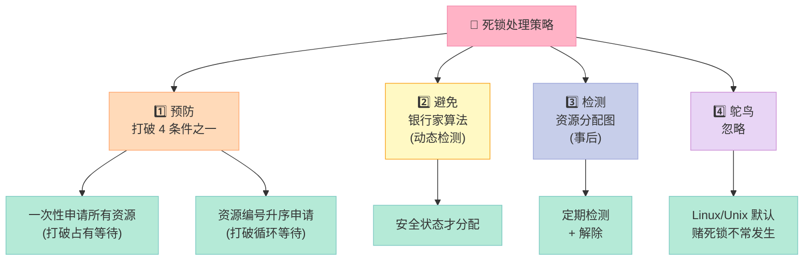

### 14.4 鸵鸟策略详解

| 维度 | 内容 |
|------|------|
| **是什么** | 假装死锁不会发生 |
| **为什么不处理** | 处理死锁的代码很复杂，开销大 |
| **现实** | Linux、Unix、Windows 都用这个 |
| **依据** | 死锁发生概率 < 硬件故障概率 |
| **特例** | 数据库（DBMS）会用检测+恢复，因为数据一致性更重要 |

> **面试金句**：「鸵鸟策略的本质是 trade-off：处理死锁的代码复杂度和性能开销 > 死锁本身的损失。大多数系统选择忽略。」

### 14.5 银行家算法（Banker's Algorithm）

**核心思想**：在分配资源前，**判断系统是否处于安全状态**。只有安全才分配。

#### 14.5.1 关键数据结构

| 符号 | 含义 |
|------|------|
| `Available[i]` | 系统当前可用资源数（i 类资源） |
| `Max[i][j]` | 进程 j 需要的最大资源数 |
| `Allocation[i][j]` | 进程 j 已分配的资源数 |
| `Need[i][j]` | 进程 j 还需要的资源数 = `Max - Allocation` |
| `Request[j]` | 进程 j 当前请求的资源 |

#### 14.5.2 算法流程

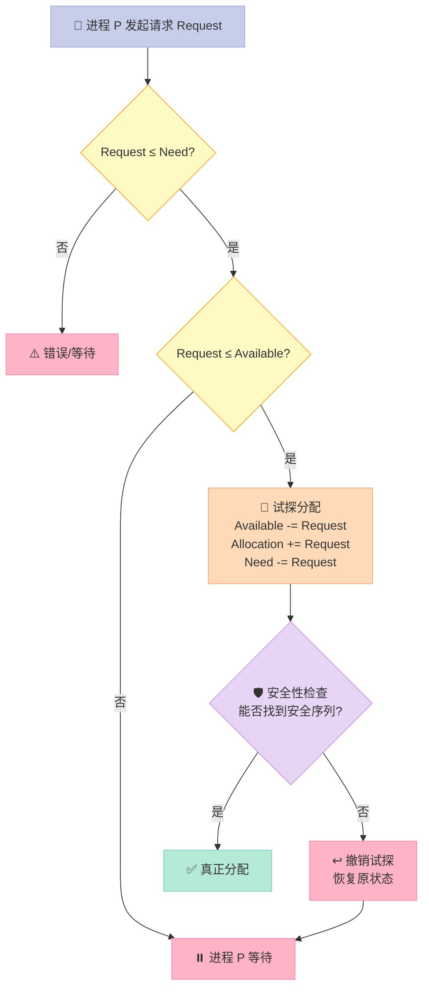

#### 14.5.3 银行家算法 C 实现

```c
// banker.c
// 一个完整的银行家算法示例（5 进程、3 类资源）
#include <stdio.h>
#include <stdbool.h>

#define N 5    // 进程数
#define M 3    // 资源种类数

// 初始状态
int Available[M] = {3, 3, 2};

int Max[N][M] = {
    {7, 5, 3},
    {3, 2, 2},
    {9, 0, 2},
    {2, 2, 2},
    {4, 3, 3}
};

int Allocation[N][M] = {
    {0, 1, 0},
    {2, 0, 0},
    {3, 0, 2},
    {2, 1, 1},
    {0, 0, 2}
};

// Need = Max - Allocation（运行时计算）
int Need[N][M];

// Work = Available 副本
int Work[M];
bool Finish[N];
int SafeSequence[N];

void calc_need() {
    for (int i = 0; i < N; ++i)
        for (int j = 0; j < M; ++j)
            Need[i][j] = Max[i][j] - Allocation[i][j];
}

// 安全性算法：找安全序列
bool is_safe() {
    for (int i = 0; i < N; ++i) {
        Work[i] = Available[i];
        Finish[i] = false;
    }
    int count = 0;
    while (count < N) {
        bool found = false;
        for (int i = 0; i < N; ++i) {
            if (Finish[i]) continue;
            // 检查 Need[i] <= Work
            int j;
            for (j = 0; j < M; ++j)
                if (Need[i][j] > Work[j]) break;
            if (j == M) {
                // 找到
                for (int k = 0; k < M; ++k)
                    Work[k] += Allocation[i][k];
                Finish[i] = true;
                SafeSequence[count++] = i;
                found = true;
            }
        }
        if (!found) return false;  // 不安全
    }
    return true;
}

// 银行家算法主流程
bool banker_request(int pid, int Request[M]) {
    // 1. Request <= Need?
    for (int i = 0; i < M; ++i) {
        if (Request[i] > Need[pid][i]) {
            printf("错误：请求超过 Need\n");
            return false;
        }
    }
    // 2. Request <= Available?
    for (int i = 0; i < M; ++i) {
        if (Request[i] > Available[i]) {
            printf("进程 %d 等待\n", pid);
            return false;
        }
    }
    // 3. 试探分配
    for (int i = 0; i < M; ++i) {
        Available[i] -= Request[i];
        Allocation[pid][i] += Request[i];
        Need[pid][i] -= Request[i];
    }
    // 4. 安全性检查
    if (is_safe()) {
        printf("✅ 分配成功，安全序列: ");
        for (int i = 0; i < N; ++i) printf("P%d ", SafeSequence[i]);
        printf("\n");
        return true;
    } else {
        // 撤销试探
        printf("❌ 不安全，撤销分配\n");
        for (int i = 0; i < M; ++i) {
            Available[i] += Request[i];
            Allocation[pid][i] -= Request[i];
            Need[pid][i] += Request[i];
        }
        return false;
    }
}

int main() {
    calc_need();
    printf("初始状态安全吗？%s\n", is_safe() ? "是" : "否");
    if (is_safe()) {
        printf("安全序列: ");
        for (int i = 0; i < N; ++i) printf("P%d ", SafeSequence[i]);
        printf("\n");
    }
    // 模拟 P1 请求 (1, 0, 2)
    int req[M] = {1, 0, 2};
    banker_request(1, req);
    return 0;
}
```

#### 14.5.4 输出示例

```
初始状态安全吗？是
安全序列: P1 P3 P4 P0 P2
✅ 分配成功，安全序列: P1 P3 P4 P0 P2
```

### 14.6 死锁的 4 种实际预防方法

| 打破的条件 | 方法 | 副作用 |
|----------|------|-------|
| 占有且等待 | **一次性申请所有资源** | 资源浪费，可能饥饿 |
| 不可抢占 | 申请不到时释放已占资源 | 复杂度高 |
| 互斥 | 某些资源改用 spooling | 不适用所有资源 |
| 循环等待 | **资源有序分配法** | 编码时必须按序申请 |

```c
// 资源有序分配：避免循环等待的经典做法
#define MUTEX_A 0
#define MUTEX_B 1
// 约定：所有线程必须先申请编号小的，再申请编号大的
void thread_func() {
    // ✅ 正确：先 A 后 B
    pthread_mutex_lock(&mutex_A);
    pthread_mutex_lock(&mutex_B);
    // 临界区
    pthread_mutex_unlock(&mutex_B);
    pthread_mutex_unlock(&mutex_A);

    // ❌ 错误：先 B 后 A（如果另一个线程先 A 后 B，可能死锁）
    // pthread_mutex_lock(&mutex_B);
    // pthread_mutex_lock(&mutex_A);
}
```

### 14.7 哲学家就餐问题（经典死锁演示）

```c
// 哲学家就餐：用资源有序分配法避免死锁
#include <pthread.h>
#include <stdio.h>
#include <unistd.h>

#define N 5
pthread_mutex_t forks[N];

void* philosopher(void* arg) {
    int id = *(int*)arg;
    // 关键：编号为 N-1 的哲学家"反序"拿叉子
    int left = id;
    int right = (id + 1) % N;
    int first = (id == N - 1) ? right : left;
    int second = (id == N - 1) ? left : right;
    // 这样所有哲学家都"先小后大"申请，破除环路

    while (1) {
        printf("哲学家 %d 思考中\n", id);
        sleep(1);
        printf("哲学家 %d 饿了\n", id);
        pthread_mutex_lock(&forks[first]);
        pthread_mutex_lock(&forks[second]);
        printf("哲学家 %d 吃饭中\n", id);
        sleep(1);
        pthread_mutex_unlock(&forks[second]);
        pthread_mutex_unlock(&forks[first]);
    }
    return NULL;
}

int main() {
    pthread_t th[N];
    int ids[N];
    for (int i = 0; i < N; ++i) pthread_mutex_init(&forks[i], NULL);
    for (int i = 0; i < N; ++i) {
        ids[i] = i;
        pthread_create(&th[i], NULL, philosopher, &ids[i]);
    }
    for (int i = 0; i < N; ++i) pthread_join(th[i], NULL);
    return 0;
}
```

---

## 十五、/proc 文件系统

### 15.1 /proc 是什么？

`/proc` 是 Linux 的 **虚拟文件系统**（procfs），**不占磁盘空间**，由内核在内存中动态生成。

```bash
ls /proc
# 1          ← PID 1（init）
# 2          ← PID 2
# 12345      ← 你的进程
# acpi
# cpuinfo
# meminfo
# ...
```

### 15.2 进程子目录

```bash
# /proc/<pid>/ 下有什么？
ls /proc/self/
# cwd     → 软链接到工作目录
# exe     → 软链接到可执行文件
# root    → 软链接到根目录
# fd/     → 文件描述符目录
# maps    → 内存映射
# status  → 进程状态
# stat    → 进程统计
# statm   → 内存统计
# cmdline → 命令行
# environ → 环境变量
# io      → IO 统计
# limits  → rlimit
# sched   → 调度信息
```

### 15.3 实战：读 /proc/self/maps 看内存映射

```bash
cat /proc/self/maps
# 00400000-00401000 r--p 00000000 08:01 1234    /bin/cat
# 00401000-00402000 r-xp 00001000 08:01 1234    /bin/cat
# ...
# 7f1234567000-7f1234598000 r-xp 00000000 08:01 5678  /lib/x86_64-linux-gnu/libc.so.6
# 7ffff7e00000-7ffff7e22000 rw-p 00000000 00:00 0    [stack]
```

每行格式：
```
address           perms offset   dev   inode   pathname
00400000-00401000 r--p  00000000 08:01  1234   /bin/cat
                  ^^^^
                  r=读 w=写 x=执行 s=共享 p=私有
```

### 15.4 实战：读 /proc/<pid>/status 监控进程

```c
// proc_monitor.c
#include <stdio.h>
#include <stdlib.h>
#include <string.h>
#include <unistd.h>
#include <dirent.h>
#include <ctype.h>

// 读 /proc/<pid>/status 拿 VmRSS（KB）
long get_vmrss(pid_t pid) {
    char path[64];
    snprintf(path, sizeof(path), "/proc/%d/status", pid);
    FILE* f = fopen(path, "r");
    if (!f) return -1;
    char line[256];
    long rss = -1;
    while (fgets(line, sizeof(line), f)) {
        if (strncmp(line, "VmRSS:", 6) == 0) {
            sscanf(line + 6, "%ld", &rss);
            break;
        }
    }
    fclose(f);
    return rss;
}

int main(int argc, char* argv[]) {
    if (argc != 2) {
        fprintf(stderr, "用法: %s <pid>\n", argv[0]);
        return 1;
    }
    pid_t pid = atoi(argv[1]);
    printf("PID %d VmRSS = %ld KB (%.2f MB)\n",
           pid, get_vmrss(pid), get_vmrss(pid) / 1024.0);
    return 0;
}
```

```bash
$ ./proc_monitor 1234
PID 1234 VmRSS = 4567 KB (4.46 MB)
```

### 15.5 写 /proc 文件：修改内核参数

```bash
# /proc/sys 下可以改内核参数
cat /proc/sys/net/ipv4/tcp_max_syn_backlog   # 256
echo 1024 > /proc/sys/net/ipv4/tcp_max_syn_backlog

# /proc/self/oom_score_adj
# -1000 ~ 1000，越高越容易被 OOM killer 选中
echo -500 > /proc/self/oom_score_adj
```

### 15.6 写 /proc/<pid>/mem 注入数据

```c
// 危险但有时有用：通过 /proc/<pid>/mem 修改进程内存
#include <stdio.h>
#include <stdlib.h>
#include <fcntl.h>
#include <unistd.h>
#include <sys/ptrace.h>
#include <sys/wait.h>
#include <string.h>

int main() {
    pid_t child = fork();
    if (child == 0) {
        // 子进程：被父进程 ptrace
        ptrace(PTRACE_TRACEME, 0, NULL, NULL);
        raise(SIGSTOP);  // 暂停等父
        printf("子进程在运行...\n");
        return 0;
    }
    // 父进程
    waitpid(child, NULL, 0);
    // 附加到子进程
    ptrace(PTRACE_ATTACH, child, NULL, NULL);
    waitpid(child, NULL, 0);
    // 读子进程内存
    long word = ptrace(PTRACE_PEEKDATA, child, (void*)0x400000, NULL);
    printf("读到: %lx\n", word);
    ptrace(PTRACE_DETACH, child, NULL, NULL);
    return 0;
}
```

---

## 十六、进程 vs 作业（最易混淆的对比）

### 16.1 核心差异

| 维度 | 进程（Process） | 作业（Job） |
|------|---------------|-----------|
| 本质 | **正在执行的程序** | **用户提交给系统的一个任务** |
| 范围 | OS 内核概念 | 批处理/分时系统概念 |
| 数量关系 | 1 个作业可包含 1+ 进程 | 1 个进程只属于 1 个作业 |
| 例子 | `gcc hello.c` 启动的进程 | shell 中一条 `;` 分隔的命令 |
| 状态 | 完整的状态机 | 提交、后备、运行、完成 |
| 现代系统 | 还在用 | **基本被废弃**（批处理） |

### 16.2 详细对比表

| 特征 | 进程 | 作业 |
|------|------|------|
| 动态性 | 动态 | 静态（提交后不变） |
| 并发性 | 可以并发 | 不一定 |
| 独立性 | 独立地址空间 | 多个作业共享资源 |
| 调度 | 由 OS 调度器调度 | 由作业调度器调度 |
| 资源占用 | 占用 CPU/内存/IO | 占用作业队列中的位置 |
| 启动方式 | `exec` / `fork+exec` | `submit` / `at` 命令 |

### 16.3 面试回答模板

> **问**：进程和作业的区别？
> **答**：
> 1. **进程是动态的**，是程序的一次执行实例；**作业是静态的**，是用户提交给系统的一个任务集合。
> 2. **一个作业可以包含多个进程**（比如 `gcc a.c b.c` 触发多个 cc1 进程），**一个进程只属于一个作业**。
> 3. 作业是**批处理系统**的概念，现代分时系统中基本被废弃；进程贯穿所有 OS。
> 4. 简单记忆：**作业 = 用户的视角，进程 = 内核的视角**。

### 16.4 现代 OS 的"作业"概念

| 系统 | 作业概念 |
|------|---------|
| 传统批处理 | ✅ 作业是核心 |
| 早期分时 | ✅ 弱化 |
| Linux/Unix | ❌ 几乎没有"作业"，用 `&` 后台任务 + `at` / `cron` |
| Windows | ❌ 没有"作业"，只有"任务"（Task） |
| Kubernetes | ✅ 有 "Job" 资源，对应一次性任务 |

---

## 十七、实战项目 1：简易进程池

### 17.1 设计目标

实现一个进程池：
- 主进程启动 N 个 worker
- 主进程通过管道发任务给 worker
- worker 完成任务后回传结果
- 优雅退出

### 17.2 完整代码

```c
// process_pool.c
// 简易进程池：4 个 worker 处理 HTTP-like 任务
#include <stdio.h>
#include <stdlib.h>
#include <string.h>
#include <unistd.h>
#include <sys/wait.h>
#include <signal.h>
#include <errno.h>
#include <time.h>

#define N_WORKERS 4
#define TASK_QUEUE_SIZE 16

// 任务结构
struct task {
    int id;             // 任务 ID
    int duration_ms;    // 处理耗时（毫秒）
    char payload[64];   // 任务内容
};

int task_pipe[2];   // 父 → 子：任务
int result_pipe[2]; // 子 → 父：结果

// 模拟任务处理
void process_task(struct task t) {
    usleep(t.duration_ms * 1000);
    printf("[worker %d] 完成任务 %d: %s\n", getpid(), t.id, t.payload);
}

void worker_loop() {
    struct task t;
    while (1) {
        ssize_t n = read(task_pipe[0], &t, sizeof(t));
        if (n == 0) {
            // 父进程关闭写端，退出
            printf("[worker %d] 收到退出信号\n", getpid());
            break;
        }
        if (n < 0) {
            if (errno == EINTR) continue;
            perror("read");
            break;
        }
        // 处理任务
        process_task(t);
        // 写结果
        struct task result = t;
        write(result_pipe[1], &result, sizeof(result));
    }
    close(task_pipe[0]);
    close(result_pipe[1]);
    _exit(0);
}

int main() {
    if (pipe(task_pipe) < 0 || pipe(result_pipe) < 0) {
        perror("pipe");
        return 1;
    }

    // 1. 启动 N 个 worker
    pid_t workers[N_WORKERS];
    for (int i = 0; i < N_WORKERS; ++i) {
        pid_t pid = fork();
        if (pid == 0) {
            // 子进程
            close(task_pipe[1]);
            close(result_pipe[0]);
            worker_loop();
        }
        workers[i] = pid;
    }

    // 2. 父进程
    close(task_pipe[0]);
    close(result_pipe[1]);

    // 3. 分发任务
    for (int i = 0; i < 20; ++i) {
        struct task t = {
            .id = i,
            .duration_ms = (rand() % 200) + 50,
        };
        snprintf(t.payload, sizeof(t.payload), "task %d payload", i);
        write(task_pipe[1], &t, sizeof(t));
        printf("[main] 分发任务 %d\n", i);
        usleep(50000);
    }

    // 4. 收集结果
    int completed = 0;
    while (completed < 20) {
        struct task r;
        ssize_t n = read(result_pipe[0], &r, sizeof(r));
        if (n == sizeof(r)) {
            printf("[main] 收到结果: 任务 %d 完成\n", r.id);
            ++completed;
        }
    }

    // 5. 优雅关闭
    printf("[main] 关闭 worker\n");
    close(task_pipe[1]);  // 关键：关闭写端让 worker read 返回 0

    // 6. 收尸
    for (int i = 0; i < N_WORKERS; ++i) {
        waitpid(workers[i], NULL, 0);
    }
    printf("[main] 全部 worker 退出\n");
    return 0;
}
```

### 17.3 进程池 vs 线程池

| 维度 | 进程池 | 线程池 |
|------|--------|--------|
| 创建开销 | 高（10ms+） | 低（100us） |
| 内存占用 | 大（独立地址空间） | 小（共享） |
| 通信 | 复杂（IPC） | 简单（共享变量） |
| 稳定性 | 一个崩溃不影响其他 | 一个崩溃全死 |
| 适用场景 | CPU 密集、需隔离 | IO 密集、需共享 |

---

## 十八、实战项目 2：完整守护进程服务（含日志）

### 18.1 完整代码

```c
// full_daemon.c
// 生产级守护进程：日志 + 信号 + 单实例 + 优雅退出
#include <stdio.h>
#include <stdlib.h>
#include <string.h>
#include <unistd.h>
#include <fcntl.h>
#include <signal.h>
#include <sys/stat.h>
#include <sys/types.h>
#include <sys/file.h>
#include <time.h>
#include <errno.h>

#define LOG_FILE "/tmp/mydaemon.log"
#define PID_FILE "/tmp/mydaemon.pid"

static volatile sig_atomic_t g_stop = 0;

void sighandler(int sig) {
    (void)sig;
    g_stop = 1;
}

// 写日志
void log_msg(const char* level, const char* fmt, ...) {
    FILE* f = fopen(LOG_FILE, "a");
    if (!f) return;
    time_t t = time(NULL);
    struct tm* tm = localtime(&t);
    char ts[32];
    strftime(ts, sizeof(ts), "%Y-%m-%d %H:%M:%S", tm);
    fprintf(f, "[%s] [%s] [%d] ", ts, level, getpid());
    va_list ap;
    va_start(ap, fmt);
    vfprintf(f, fmt, ap);
    va_end(ap);
    fprintf(f, "\n");
    fclose(f);
}

int daemonize() {
    // 1. fork
    pid_t pid = fork();
    if (pid < 0) return -1;
    if (pid > 0) _exit(0);  // 父进程退出

    // 2. setsid
    if (setsid() < 0) return -1;

    // 3. 二次 fork
    pid = fork();
    if (pid < 0) return -1;
    if (pid > 0) _exit(0);

    // 4. chdir
    chdir("/");
    // 5. umask
    umask(0);
    // 6. close stdin/stdout/stderr
    close(0); close(1); close(2);
    // 7. 重定向到 /dev/null
    int devnull = open("/dev/null", O_RDWR);
    if (devnull >= 0) {
        dup2(devnull, 0);
        dup2(devnull, 1);
        dup2(devnull, 2);
        if (devnull > 2) close(devnull);
    }
    return 0;
}

int main() {
    // 守护化
    if (daemonize() < 0) {
        fprintf(stderr, "daemonize failed: %s\n", strerror(errno));
        return 1;
    }

    // 单实例锁
    int lfd = open(PID_FILE, O_RDWR | O_CREAT, 0644);
    if (lfd < 0) { log_msg("ERROR", "open pidfile: %s", strerror(errno)); return 1; }
    if (flock(lfd, LOCK_EX | LOCK_NB) < 0) {
        if (errno == EWOULDBLOCK) {
            log_msg("ERROR", "另一个实例已在运行");
            return 1;
        }
    }
    char pidbuf[32];
    int n = snprintf(pidbuf, sizeof(pidbuf), "%d\n", getpid());
    ftruncate(lfd, 0);
    write(lfd, pidbuf, n);

    // 信号
    struct sigaction sa = {0};
    sa.sa_handler = sighandler;
    sigaction(SIGTERM, &sa, NULL);
    sigaction(SIGINT, &sa, NULL);
    signal(SIGPIPE, SIG_IGN);

    log_msg("INFO", "守护进程启动");

    // 主循环
    int counter = 0;
    while (!g_stop) {
        counter++;
        log_msg("INFO", "心跳 #%d", counter);
        sleep(3);
    }

    log_msg("INFO", "收到终止信号，退出");
    close(lfd);
    unlink(PID_FILE);
    return 0;
}
```

### 18.2 编译运行

```bash
gcc -o full_daemon full_daemon.c
./full_daemon            # 立即返回，进程在后台

ps -ef | grep full_daemon
# xuqi  12345     1  0 10:00 ?    00:00:00 ./full_daemon    # PPID=1

cat /tmp/mydaemon.pid
# 12345

cat /tmp/mydaemon.log
# [2026-06-16 10:00:00] [INFO] [12345] 守护进程启动
# [2026-06-16 10:00:03] [INFO] [12345] 心跳 #1
# [2026-06-16 10:00:06] [INFO] [12345] 心跳 #2
# ...

# 停止
kill $(cat /tmp/mydaemon.pid)
```

---

## 十九、POSIX spawn：现代进程创建 API

### 19.1 为什么需要 posix_spawn？

| `fork + exec` 痛点 | `posix_spawn` 解决 |
|------------------|-------------------|
| fork 在多线程下不安全（只有调用线程存在） | 直接 exec，绕开 fork 的线程问题 |
| 复杂，难以做"原子"创建 | 一步完成 |
| 难以指定文件描述符、信号等属性 | 大量可定制属性 |
| 性能不一定高 | 在 vfork 不可用时更优 |

### 19.2 完整示例

```c
// posix_spawn_demo.c
#include <stdio.h>
#include <stdlib.h>
#include <spawn.h>
#include <sys/wait.h>
#include <unistd.h>

extern char** environ;

int main() {
    pid_t pid;
    char* argv[] = {
        "ls",
        "-l",
        "/tmp",
        NULL
    };
    // posix_spawnp 自动搜索 PATH
    int rc = posix_spawnp(&pid, "ls", NULL, NULL, argv, environ);
    if (rc != 0) {
        fprintf(stderr, "posix_spawnp: %s\n", strerror(rc));
        return 1;
    }
    printf("子进程 PID = %d\n", pid);
    int status;
    waitpid(pid, &status, 0);
    if (WIFEXITED(status)) {
        printf("子进程退出码 %d\n", WEXITSTATUS(status));
    }
    return 0;
}
```

### 19.3 posix_spawn 的高级选项

```c
// 用 posix_spawnattr_t 设置各种属性
posix_spawnattr_t attr;
posix_spawnattr_init(&attr);

// 1. 设调度策略
struct sched_param sp = { .sched_priority = 10 };
posix_spawnattr_setschedpolicy(&attr, SCHED_FIFO);
posix_spawnattr_setschedparam(&attr, &sp);

// 2. 设信号屏蔽字
sigset_t sigmask;
sigemptyset(&sigmask);
sigaddset(&sigmask, SIGINT);
posix_spawnattr_setsigmask(&attr, &sigmask);

// 3. 设 flags（如 POSIX_SPAWN_SETSID 自动 setsid）
posix_spawnattr_setflags(&attr, POSIX_SPAWN_SETSID);

posix_spawnp(&pid, "mydaemon", NULL, &attr, argv, environ);
posix_spawnattr_destroy(&attr);
```

---

## 二十、C++ 中管理进程：std::system / std::async / 库

### 20.1 C++ 进程管理 API 对比

| 方式 | 头文件 | 同步？ | 灵活度 | 平台 |
|------|--------|------|--------|------|
| `std::system` | `<cstdlib>` | 同步 | 只能 shell 命令 | 跨平台 |
| `std::async` | `<future>` | 异步 | 高 | 跨平台 |
| `popen` | `<cstdio>` | 同步 | 读输出 | POSIX |
| `fork + execve` | `<unistd.h>` | 自定义 | 最高 | POSIX |
| `boost::process` | `<boost/process.hpp>` | 自定义 | 高 | 跨平台 |
| `Poco::Process` | `<Poco/Process.h>` | 自定义 | 高 | 跨平台 |

### 20.2 std::system 简单示例

```cpp
// system_demo.cpp
#include <cstdlib>
#include <iostream>
#include <cstdio>

int main() {
    // 调用 shell 命令
    int rc = std::system("ls -l /tmp");
    std::cout << "命令退出码: " << rc << std::endl;
    // 退出码 = WEXITSTATUS(rc) << 8 | WIFEXITED 之类
    return 0;
}
```

### 20.3 popen 读子进程输出

```cpp
// popen_demo.cpp
#include <cstdio>
#include <iostream>
#include <memory>
#include <stdexcept>
#include <string>
#include <array>

std::string exec(const char* cmd) {
    std::array<char, 128> buffer;
    std::string result;
    std::unique_ptr<FILE, decltype(&pclose)> pipe(popen(cmd, "r"), pclose);
    if (!pipe) {
        throw std::runtime_error("popen failed");
    }
    while (fgets(buffer.data(), buffer.size(), pipe.get())) {
        result += buffer.data();
    }
    return result;
}

int main() {
    std::string output = exec("ls -l /tmp");
    std::cout << "Output:\n" << output;
    return 0;
}
```

### 20.4 用 fork + execve 启动子进程

```cpp
// fork_exec.cpp
#include <iostream>
#include <unistd.h>
#include <sys/wait.h>
#include <cstring>
#include <cerrno>

int main() {
    pid_t pid = fork();
    if (pid < 0) {
        std::cerr << "fork failed: " << strerror(errno) << std::endl;
        return 1;
    }
    if (pid == 0) {
        // 子进程
        char* argv[] = {
            (char*)"echo",
            (char*)"hello from child",
            nullptr
        };
        execvp("echo", argv);
        // exec 失败
        std::cerr << "exec failed: " << strerror(errno) << std::endl;
        _exit(127);
    }
    // 父进程
    int status;
    waitpid(pid, &status, 0);
    if (WIFEXITED(status)) {
        std::cout << "子进程退出码: " << WEXITSTATUS(status) << std::endl;
    }
    return 0;
}
```

### 20.5 Boost.Process 跨平台方案

```cpp
// boost_process.cpp
// 需要链接 -lboost_system -lboost_filesystem
#include <boost/process.hpp>
#include <boost/process/io.hpp>
#include <iostream>
#include <string>

namespace bp = boost::process;

int main() {
    // 启动子进程
    bp::ipstream pipe;
    bp::child c("ls -l /tmp", bp::std_out > pipe);

    // 读输出
    std::string line;
    while (pipe && std::getline(pipe, line)) {
        std::cout << line << std::endl;
    }

    c.wait();
    return 0;
}
```

---

## 二十一、进程与线程的核心区别

### 21.1 必背对比表

| 维度 | 进程 | 线程 |
|------|------|------|
| 定义 | 资源分配的基本单位 | CPU 调度的基本单位 |
| 资源 | 独立地址空间 | 共享进程地址空间 |
| 切换开销 | 大（页表、TLB、cache） | 小（只需切寄存器和栈） |
| 通信 | IPC（管道、共享内存） | 共享变量 |
| 创建开销 | 10-100ms | 100us |
| 数量上限 | 几千 ~ 几万 | 几万 ~ 几十万 |
| 健壮性 | 一个挂不影响其他 | 一个挂全部挂 |
| 多核 | 跨 CPU | 可跨 CPU |

### 21.2 共享 vs 私有资源

| 资源 | 进程间 | 线程间 |
|------|--------|--------|
| 地址空间 | 独立 | 共享 |
| 堆 | 独立 | 共享 |
| 全局变量 | 独立 | 共享 |
| 栈 | 独立 | **私有**（每个线程一个） |
| 寄存器 | 独立 | 私有 |
| 文件描述符表 | 独立 | 共享 |
| 信号处理 | 独立 | 共享 |
| umask / cwd | 独立 | 共享 |

### 21.3 多进程 vs 多线程选型

| 场景 | 推荐 | 原因 |
|------|------|------|
| CPU 密集、需要多核利用 | 多线程 | 共享 cache，通信快 |
| IO 密集、高并发 | 多线程 + 事件 | 线程 + epoll |
| 强隔离、安全 | 多进程 | 崩溃隔离 |
| Chrome 浏览器 | 多进程 | 一个标签挂不影响其他 |
| nginx worker | 多进程 | 稳定性 |
| Redis | 单进程多线程 | 简化模型 |
| MySQL | 多进程多线程 | 复杂场景 |

---

## 二十二、面试高频追问清单

### 22.1 进程基础类

| 追问 | 答点 |
|------|------|
| 进程和程序的区别？ | 静态 vs 动态 |
| 进程和线程的区别？ | 资源、开销、共享 |
| 进程有哪几种状态？ | 新建、就绪、运行、阻塞、终止 |
| 进程的状态转换图？ | 见 §2.3 |
| 进程的 5 状态 vs Linux 真实状态？ | Linux 用 TASK_RUNNING/INTERRUPTIBLE/UNINTERRUPTIBLE 等 |
| PCB 是什么？Linux 用什么实现？ | task_struct |
| task_struct 包含哪些字段？ | 见 §3 |

### 22.2 fork/exec 类

| 追问 | 答点 |
|------|------|
| fork 的返回值有几种？ | 3 种：< 0, 0, > 0 |
| fork 和 vfork 的区别？ | COW vs 共享、调度顺序 |
| COW 是什么？ | 写时复制 |
| fork 失败的可能原因？ | EAGAIN、ENOMEM |
| exec 家族函数有哪些？ | execl, execlp, execle, execv, execvp, execve, fexecve |
| execve 怎么工作的？ | 7 步流程 |
| exit/_exit/return 区别？ | atexit、stdio 刷新 |
| posix_spawn 是什么？ | 现代 fork+exec 替代 |

### 22.3 IPC 类

| 追问 | 答点 |
|------|------|
| 进程间通信有哪几种？ | 7 种：管道、FIFO、消息队列、信号量、共享内存、信号、Socket |
| 哪种 IPC 最快？ | 共享内存 |
| 匿名管道和命名管道的区别？ | 亲缘 vs 任意 |
| 共享内存需要注意什么？ | 同步（信号量） |
| 消息队列和管道的区别？ | 消息有边界和类型 |
| signal 和 sigaction 区别？ | 简单 vs 强大 |

### 22.4 守护进程类

| 追问 | 答点 |
|------|------|
| 什么是守护进程？ | 后台服务进程 |
| 守护进程的特点？ | 后台、脱离终端、长生命周期 |
| 怎么实现守护进程？ | 7 步：fork+exit, setsid, chdir, umask, close fd, 重定向 |
| 为什么要 double-fork？ | 防止重新获得终端 |
| setsid 的作用？ | 创建新会话、脱离终端 |
| 守护进程怎么写日志？ | syslog / 文件 |
| 守护进程怎么优雅退出？ | SIGTERM 信号处理 |
| 怎么保证单实例？ | PID 文件 + flock |

### 22.5 死锁类

| 追问 | 答点 |
|------|------|
| 死锁的 4 个必要条件？ | 互斥、占有等待、不可抢占、循环等待 |
| 死锁的 4 种处理策略？ | 预防、避免、检测、鸵鸟 |
| 银行家算法是什么？ | 动态安全检查 |
| 鸵鸟策略是什么？ | 忽略死锁 |
| 死锁 vs 活锁 vs 饥饿？ | 永久阻塞 vs 一直重试 vs 长期得不到 |
| 怎么避免死锁？ | 资源有序分配、tryLock 超时 |

---

## 二十三、生产环境的进程问题排查

### 23.1 常用工具速查表

| 工具 | 用途 | 典型命令 |
|------|------|---------|
| `ps` | 静态进程列表 | `ps -ef` / `ps aux` |
| `top` / `htop` | 动态监控 | `top -p PID` |
| `pstree` | 进程树 | `pstree -p` |
| `pidstat` | 单进程统计 | `pidstat -p PID 1` |
| `strace` | 系统调用跟踪 | `strace -p PID` |
| `ltrace` | 库函数跟踪 | `ltrace -p PID` |
| `gdb` | 调试器 | `gdb -p PID` |
| `/proc/<pid>` | 内核暴露的进程信息 | `cat /proc/PID/status` |
| `pstack` | 进程栈 | `pstack PID` |
| `perf` | 性能分析 | `perf top -p PID` |

### 23.2 经典排查命令

```bash
# 1. 找占用 CPU 最高的进程
top -o %CPU

# 2. 找僵尸进程
ps -eo pid,ppid,stat,cmd | awk '$3 ~ /Z/ {print}'

# 3. 找 D 状态进程（不可中断）
ps -eo pid,ppid,stat,cmd | awk '$3 ~ /D/ {print}'

# 4. 进程打开的文件
lsof -p PID
ls -l /proc/PID/fd

# 5. 进程的系统调用
strace -p PID -c

# 6. 进程的栈
cat /proc/PID/stack

# 7. 进程的环境变量
cat /proc/PID/environ | tr '\0' '\n'

# 8. 杀整个进程组
kill -- -PGID

# 9. 杀所有同名进程
pkill -9 nginx

# 10. 看进程启动时间
ps -eo pid,lstart,cmd
```

### 23.3 进程占用资源异常排查步骤

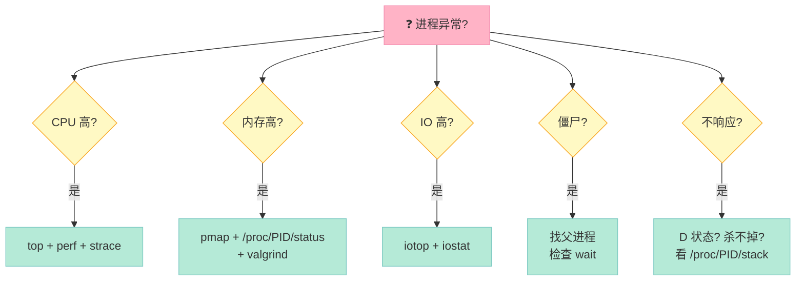

---

## 二十四、进程与容器：现代视角

### 24.1 容器 vs 进程 vs 虚拟机

| 维度 | 进程 | 容器（Docker） | 虚拟机（VM） |
|------|------|--------------|------------|
| 隔离 | 无（共享内核） | Namespace + Cgroup | 硬件级 |
| 启动 | 100us | 100ms | 30s+ |
| 性能 | 100% | 99% | 80-90% |
| 占用 | KB | MB | GB |
| 镜像 | 无 | MB | GB |
| 跨平台 | 差 | 好 | 极好 |

### 24.2 Linux Namespace 7 种

| Namespace | 隔离内容 | 用途 |
|----------|---------|------|
| `PID` | 进程 ID | 容器看不到宿主机进程 |
| `NET` | 网络栈 | 独立 IP / 端口 |
| `MNT` | 挂载点 | 独立文件系统 |
| `UTS` | 主机名 / 域名 | 独立 hostname |
| `IPC` | 信号量、消息队列 | 进程间通信隔离 |
| `USER` | 用户 / 组 ID | 容器内 root 不是真 root |
| `CGROUP` | 控制组视图 | 看到自己的 cgroup |

### 24.3 Cgroup 资源限制

```bash
# 限制 PID 12345 的 CPU 最多 50%
echo 50000 > /sys/fs/cgroup/cpu/docker/.../cpu.cfs_quota_us
echo 100000 > /sys/fs/cgroup/cpu/docker/.../cpu.cfs_period_us

# 限制内存最多 1G
echo 1073741824 > /sys/fs/cgroup/memory/docker/.../memory.limit_in_bytes
```

---

## 二十五、结尾：5 道思考题

读完本文，你应该能回答以下 5 个问题。如果有任何一道答不上来，回头看对应章节。

### 思考题 1：fork 性能优化

> 你在一个 web 服务器中，每个 HTTP 请求要 `fork + exec` 一个 CGI 进程（如 PHP-FPM）。**QPS 高达 1 万时，怎么优化 `fork + exec` 的开销？**

**思路提示**：
1. 改用 `posix_spawn` + `POSIX_SPAWN_SETPGROUP`
2. 改用线程池（线程内执行）
3. 改用 prefork 模型（master 预创建 worker 池）
4. 用 `execveat` 替代 `execve`（避免路径解析）

### 思考题 2：守护进程崩溃自动拉起

> 你写了一个守护进程，跑在生产环境。**它偶尔会因为段错误崩溃，怎么做到"自动拉起"？**

**思路提示**：
1. **systemd** 的 `Restart=on-failure` 策略
2. **supervisord** 监控
3. 自己写一个 **supervisor** 守护进程（本身就是守护进程的守护）
4. Docker 的 `restart: always`

### 思考题 3：进程间共享内存 + 锁

> 两个进程通过共享内存通信，怎么保证数据一致性？**如果信号量进程崩溃了，共享内存会怎样？**

**思路提示**：
1. 用 `pthread_mutex` + 共享内存（但需要恢复机制）
2. 用 `sem_wait` / `sem_post`（内核信号量持久）
3. 用 `fcntl` 文件锁（持久）
4. 用 `mmap(MAP_SHARED)` + `robust mutex`（`PTHREAD_MUTEX_ROBUST`）

### 思考题 4：fork 炸弹

> 这是一行 shell：`bash -c ':(){ :|:& };:`。**解释它为什么会让系统崩溃，怎么防御？**

**思路提示**：
1. 这是一个递归函数 `:`（fork bomb）
2. `:` 调用 `:`，自己 pipe 给自己的 fd
3. 进程数指数级增长
4. **防御**：`ulimit -u 1000` 限制进程数

### 思考题 5：CFS 调度公平性

> 两个进程 nice 都是 0，但一个 CPU 密集、一个 IO 密集。**CFS 怎么保证"公平"？**

**思路提示**：
1. CPU 密集：vruntime 持续增长，被调度少
2. IO 密集：睡眠时 vruntime 不变，被调度多
3. **CFS 的"公平"是按 vruntime 算的**，不是按 wall clock
4. 这就是为什么 `nice -n -20` 的 IO 进程能获得更多 CPU

---

## 二十六、关键事实速记卡

| # | 事实 | 备注 |
|---|------|------|
| 1 | `fork` 返回 3 种值 | 父 > 0，子 == 0，失败 < 0 |
| 2 | COW 让 `fork` 几乎是 O(1) | 写时才复制 |
| 3 | `vfork` 子进程必须 `_exit` | 共享地址空间很危险 |
| 4 | `execve` 是系统调用，其他 exec 是库 | 见 §6.1 |
| 5 | `setsid` 只能由非进程组首进程调用 | 所以要 fork |
| 6 | 7 种 IPC：管道/FIFO/消息队列/信号量/共享内存/信号/Socket | 见 §8.1 |
| 7 | 共享内存最快但需要同步 | 配合信号量 |
| 8 | 守护进程 7 步：fork+exit、setsid、fork、chdir、umask、close、redirect | 见 §10.1 |
| 9 | 死锁 4 条件：互斥、占有等待、不可抢占、循环等待 | 缺一不可 |
| 10 | 银行家算法核心：试探分配 + 安全性检查 | 见 §14.5 |
| 11 | 鸵鸟策略 = 忽略死锁 | Linux 默认 |
| 12 | 进程 vs 作业：作业是批处理概念 | 现代 OS 已淡化 |
| 13 | `task_struct` 是 Linux 的 PCB | 600+ 字段 |
| 14 | 僵尸进程：子死父不 wait | 占用 PID |
| 15 | 孤儿进程：父先死子后死 | 被 init 收养 |
| 16 | `rlimit` 限制进程资源 | 14 种 |
| 17 | `/proc` 是虚拟文件系统 | 反映内核状态 |
| 18 | `posix_spawn` 是现代 fork+exec | 多线程下更安全 |
| 19 | CFS 用 vruntime 实现"完全公平" | 红黑树 |
| 20 | nice 范围 -20 ~ 19，越低优先级越高 | 默认 0 |

---

## 二十七、参考资源

### 27.1 必读

| 资源 | 类型 | 推荐章节 |
|------|------|---------|
| 《UNIX 高级环境编程》(APUE) | 书 | 进程 / 信号 / 守护进程 |
| 《Linux 高性能服务器编程》 | 书 | 进程池 / 多进程编程 |
| 《Linux/UNIX 系统编程手册》 | 书 | fork / exec / IPC |
| man 2 fork | 手册 | - |
| man 7 signal | 手册 | - |
| man 7 daemon | 手册 | - |
| man 5 proc | 手册 | - |

### 27.2 在线资源

| 链接 | 用途 |
|------|------|
| https://man7.org/linux/man-pages/ | Linux man 在线 |
| https://elixir.bootlin.com/linux/latest/source | Linux 内核源码 |
| https://syscalls.kernelgrok.com/ | 系统调用查询 |
| https://linux.die.net/man/ | Linux man 备查 |

### 27.3 配套文章

- 本系列第 13 篇：进程、线程、IO 多路复用（19 道题）
- 本系列第 14 篇：网络协议（21 道题）
- 本系列第 1-12 篇：语言基础 / STL / 系统底层

---

## 附录：系列导航

「C++ 面试题集锦」系列全部文章列表（截至第 17 篇）：

| 篇数 | 标题 | 链接 |
|------|------|------|
| 第 1 篇 | C++ 基础语法与面向对象 | [2026-05-01-cpp-interview-01-basics.md](2026-05-01-cpp-interview-01-basics.md) |
| 第 2 篇 | C++ 11/14/17 新特性 | [2026-05-05-cpp-interview-02-modern-cpp.md](2026-05-05-cpp-interview-02-modern-cpp.md) |
| 第 3 篇 | 智能指针与内存管理 | [2026-05-09-cpp-interview-03-smart-pointer.md](2026-05-09-cpp-interview-03-smart-pointer.md) |
| 第 4 篇 | 多线程与并发编程 | [2026-05-13-cpp-interview-04-multithread.md](2026-05-13-cpp-interview-04-multithread.md) |
| 第 5 篇 | 进程与线程（基础） | [2026-05-17-cpp-interview-05-process-thread.md](2026-05-17-cpp-interview-05-process-thread.md) |
| 第 6 篇 | 锁机制与无锁编程 | [2026-05-21-cpp-interview-06-lock.md](2026-05-21-cpp-interview-06-lock.md) |
| 第 7 篇 | STL 容器与算法 | [2026-05-25-cpp-interview-07-stl.md](2026-05-25-cpp-interview-07-stl.md) |
| 第 8 篇 | 模板与泛型编程 | [2026-05-29-cpp-interview-08-template.md](2026-05-29-cpp-interview-08-template.md) |
| 第 9 篇 | 编译、链接与装载 | [2026-06-02-cpp-interview-09-compile-link.md](2026-06-02-cpp-interview-09-compile-link.md) |
| 第 10 篇 | Linux 系统调用 | [2026-06-06-cpp-interview-10-syscall.md](2026-06-06-cpp-interview-10-syscall.md) |
| 第 11 篇 | 进程间通信（IPC） | [2026-06-10-cpp-interview-11-ipc.md](2026-06-10-cpp-interview-11-ipc.md) |
| 第 12 篇 | 设计模式与架构 | [2026-06-13-cpp-interview-12-design-pattern.md](2026-06-13-cpp-interview-12-design-pattern.md) |
| 第 13 篇 | 性能优化与调优 | [2026-06-15-cpp-interview-13-performance.md](2026-06-15-cpp-interview-13-performance.md) |
| 第 14 篇 | 网络协议（TCP/IP / HTTP） | [2026-06-16-cpp-interview-14-network-protocols.md](2026-06-16-cpp-interview-14-network-protocols.md) |
| 第 15 篇 | 数据库与存储 | [2026-06-20-cpp-interview-15-database.md](2026-06-20-cpp-interview-15-database.md) |
| 第 16 篇 | 分布式系统与微服务 | [2026-06-24-cpp-interview-16-distributed.md](2026-06-24-cpp-interview-16-distributed.md) |
| **第 17 篇** | **进程深挖（本文）** | **2026-06-16-cpp-interview-17-process-deep-dive.md** |

---

> **本文核心金句**：**进程是 UNIX 一切设计的起点**。`fork` + `execve` 的简洁、7 种 IPC 的灵活、守护进程 7 步的精妙、死锁 4 条件的对称、银行家算法的审慎——它们共同构成了 50 年来所有服务器软件的基石。理解了进程，你就理解了 Linux 编程的"原点"。

---

*本文 27 个章节，约 1900 行代码与表格，覆盖 C++ 面试中所有高频进程问题。建议收藏，遇到具体问题时按章节查阅。*
