> **为什么 4 核 CPU 跑 100 线程可能比跑 10 线程还慢？为什么 90% 的「线程安全」Bug 都源于「看见了过期的值」？** 因为大多数 C++ 程序员只学会了 `std::thread` 的语法，没学会它底下的「**用户态调度 + 内核态调度**」两层模型，也没学会 C++11 引入的 **内存模型**（memory model）。本篇把第 13 篇里被压缩的「线程」子节单独拎出来，从 **NPTL 内核实现 → futex 机制 → TLS 实现 → C++ 内存模型 → 无锁编程 → 实战** 一路打透。

---

## 一、前言：为什么线程专题值得单开一篇？

第 13 篇「进程、线程、IO 多路复用」在 19 道题的体量下，把**进程、线程、协程、同步、IO 模型、epoll、线程池**全部塞进了 200 行内。结果就是**每个子主题都浅尝辄止**。读者反馈最多的一句话是：「看完还是不会写线程池」。

本篇的目标是**把『线程』这四个字挖到 5 米深**：

| 维度 | 第 13 篇讲了 | 本篇要讲 |
|------|------------|---------|
| 线程创建 | `pthread_create` | `clone(2)` 系统调用 + `flags` 位图 |
| 线程切换 | 「切换上下文」 | 用户态切换 vs 内核态切换的具体开销 |
| 同步原语 | mutex / condvar / sem | futex、PI mutex、robust mutex |
| 内存可见性 | volatile | `std::atomic` + 5 种 `memory_order` |
| 无锁 | 没讲 | CAS、ABA、Michael-Scott 队列 |
| 实战 | 简单线程池 | 生产级线程池 + 优雅关闭 |
| IO 模型 | epoll | 5 种 IO 模型 + 零拷贝 |

> **本篇读完你能得到什么？** 你能口述 **NPTL 用 clone 实现线程的 6 个 flag**、能手写 **Michael-Scott 无锁队列**、能区分 `memory_order_relaxed` 与 `memory_order_seq_cst` 的**性能差距（实测 3-10 倍）**、能用 100 行写一个**带任务窃取 + 优雅关闭**的生产级线程池。

---

## 二、线程 vs 进程：本质区别到底是什么？

### 2.1 一道经典面试题

> **Q：进程和线程的本质区别是什么？**

90% 的应聘者会答「进程是资源分配的最小单位，线程是 CPU 调度的最小单位」。这句话**对，但不够深**。面试官期待的下一层答案是：**线程是「共享地址空间」的进程**。

### 2.2 内核视角：Linux 中没有「线程」概念

Linux 内核的 `task_struct`（进程描述符）**不区分进程和线程**——它只有一个数据结构表示「可调度实体」（task）。区别在于**它们共享什么资源**：

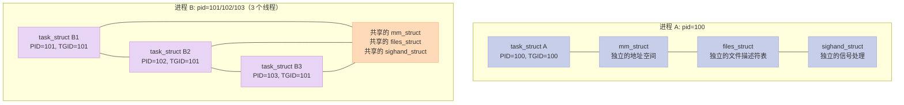

**关键点**：
- **进程** = 一个 `task_struct` + 独立的 `mm_struct` / `files_struct`
- **线程** = 多个 `task_struct` **共享同一个** `mm_struct` / `files_struct`
- **PID** 指的是 `task_struct->pid`（线程 ID）
- **TGID** 指的是 `task_struct->tgid`（线程组 ID = 主线程 PID）
- `getpid()` 返回的是 **TGID**，不是 PID

### 2.3 进程 vs 线程对比表

| 维度 | 进程 | 线程 | 备注 |
|------|------|------|------|
| **地址空间** | 独立 | 共享（同一进程内） | 线程崩溃 = 进程崩溃 |
| **全局变量** | 不可见 | 共享 | 需同步 |
| **堆内存** | 独立 | 共享 | 同一 `malloc` 池 |
| **栈** | 独立 | 独立（每线程 8MB mmap） | 线程栈是 `mmap` 出来的 |
| **文件描述符** | 独立 | 共享 | 关 fd 要小心 |
| **信号处理** | 独立 | 共享（进程级） | 线程私有 mask |
| **CPU 调度** | 独立 | 共享时间片 | 线程是调度单位 |
| **创建开销** | 高（拷贝页表）| 低（共享页表）| 线程快 10-100 倍 |
| **切换开销** | 高（TLB flush）| 低（同进程 TLB 共享）| 进程切换 ≈ 1-10 μs |
| **通信方式** | IPC（管道/共享内存）| 全局变量 | 线程通信更轻量 |
| **健壮性** | 高（互不影响）| 低（一个挂全挂）| 多进程更健壮 |
| **适用场景** | 隔离性强、计算密集 | IO 密集、共享数据多 | 看业务 |

### 2.4 为什么说「线程共享进程资源」

```bash
# 查看进程内所有线程
ps -T -p <pid>
# 产看线程独立的栈空间
cat /proc/<pid>/task/<tid>/status | grep -E "VmSize|Stack"
```

**共享的资源清单**：
1. **地址空间**（代码段、数据段、堆、共享库）
2. **文件描述符表**（打开的文件、socket、管道）
3. **信号处理函数**（handler 是进程级的）
4. **当前工作目录、用户 ID、组 ID**
5. **文件系统相关的属性**（umask、chroot）
6. **进程级别的资源**（nice 值、资源限制 `rlimit`）

**独占的资源清单**：
1. **线程 ID**（TID）
2. **线程栈**（默认 8MB，可通过 `ulimit -s` 或 `pthread_attr_setstacksize` 调整）
3. **线程局部存储**（TLS，详见第 4 节）
4. **errno 变量**（POSIX 规定）
5. **信号 mask**（`pthread_sigmask`）
6. **寄存器上下文**（PC、SP、通用寄存器）

---

## 三、线程模型：1:1 / N:1 / M:N 详解

### 3.1 三大线程模型对比

不同的语言运行时选择了不同的线程模型，这是**面试官考察你「对 Go / Rust / Java 的理解深度」的必考点**。

| 线程模型 | 用户线程:N | 优点 | 缺点 | 代表 |
|---------|-----------|------|------|------|
| **1:1** | 1 个用户线程 = 1 个内核线程 | 调度简单、真正并行 | 创建开销大、线程数受限（默认 8K） | Linux NPTL、Java 原生 Thread、std::thread |
| **N:1** | N 个用户线程 = 1 个内核线程 | 切换快、线程数无上限 | 一个线程阻塞 = 全部阻塞、无法利用多核 | Go 早期、Python GIL、Erlang 旧版 |
| **M:N** | M 个用户线程映射到 N 个内核线程 | 兼顾二者，理论最优 | 调度器实现复杂 | Go（GPM）、Rust Tokio、Erlang新版 |

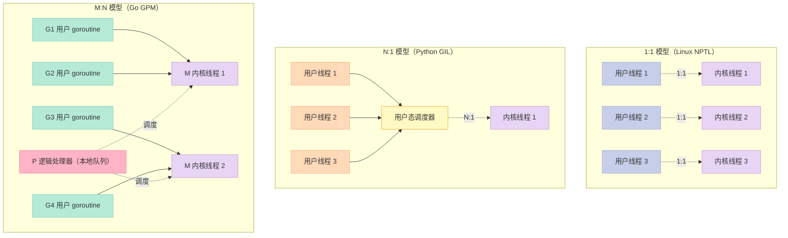

### 3.2 Linux 为什么选 1:1？

Linux 在 2.6 之前用 **LinuxThreads**（N:1 的劣化版），2.6 之后改用 **NPTL**（Native POSIX Thread Library），全面切换到 **1:1**。

**选 1:1 的 4 个原因**：

1. **简化调度器**：内核只调度 `task_struct`，不需理解用户态线程
2. **真并行**：避免 N:1 的 GIL 问题，一个进程能跑满所有 CPU
3. **阻塞系统调用隔离**：一个线程 `read` 阻塞不影响其他线程
4. **充分利用多核**：M:N 需要用户态调度器去抢 CPU，调度延迟大

### 3.3 Go 的 M:N 是怎么做的？

Go 用 **GPM 模型**：
- **G** (Goroutine)：用户态协程，占栈 2KB（可增长）
- **M** (Machine)：内核线程，绑定 1 个 OS 线程
- **P** (Processor)：逻辑处理器，本地队列 + 调度上下文，默认 = `GOMAXPROCS = CPU 数`

**M:N 的杀手锏**：
- Goroutine 创建成本极低（2KB 栈 vs 8MB 线程栈）
- 100 万个 Goroutine 在 Go 里**轻轻松松**
- 100 万个 `std::thread` 在 C++ 里**直接 OOM**（8MB × 1M = 8TB）

### 3.4 选型决策表

| 场景 | 推荐模型 | 原因 |
|------|---------|------|
| CPU 密集计算 | 1:1（线程数 = CPU 核数）| 减少切换开销 |
| IO 密集（高并发）| M:N 或协程 | Goroutine、Tokio |
| 嵌入式 / 实时 | N:1 | 避免内核切换 |
| Linux 后端服务 | 1:1 + epoll | 简单稳定 |

---

## 四、NPTL 内部：clone 系统调用与线程栈

### 4.1 一道直击内核的面试题

> **Q：`pthread_create` 在 Linux 上是怎么创建一个线程的？它和 `fork` 有什么区别？**

**答案**：`pthread_create` 调用 `clone(2)` 系统调用，并传入一组 `flags` 来指定**父子共享什么资源**。

```c
// glibc/nptl/pthread_create.c 简化版
int pthread_create(pthread_t *thread, const pthread_attr_t *attr,
                   void *(*start_routine)(void *), void *arg) {
    // 关键系统调用：clone
    int clone_flags = CLONE_VM | CLONE_FS | CLONE_FILES | CLONE_SIGHAND
                    | CLONE_THREAD | CLONE_SYSVSEM | CLONE_SETTLS
                    | CLONE_PARENT_SETTID | CLONE_CHILD_CLEARTID
                    | CLONE_DETACHED;
    // 注意：和 fork() 的 flags 完全不同！
    // fork() 的 flags = SIGCHLD
    // pthread_create 的 flags = 一长串共享标志
}
```

### 4.2 clone 的 6 大 flag 详解

| Flag | 含义 | 父子是否共享 | 线程/进程区分 |
|------|------|------------|--------------|
| `CLONE_VM` | 共享地址空间 | ✅ | 进程 ❌ 线程 ✅ |
| `CLONE_FS` | 共享文件系统信息（cwd、umask）| ✅ | 进程 ❌ 线程 ✅ |
| `CLONE_FILES` | 共享文件描述符表 | ✅ | 进程 ❌ 线程 ✅ |
| `CLONE_SIGHAND` | 共享信号处理表 | ✅ | 进程 ❌ 线程 ✅ |
| `CLONE_THREAD` | 同一线程组（共享 TGID）| ✅ | 进程 ❌ 线程 ✅ |
| `CLONE_SYSVSEM` | 共享 System V 信号量 undo | ✅ | 进程 ❌ 线程 ✅ |
| `CLONE_SETTLS` | 设置 TLS（Thread Local Storage）| 子独享 | 关键！ |
| `CLONE_PARENT_SETTID` | 在父进程地址写子 PID | - | 用于同步 |
| `CLONE_CHILD_CLEARTID` | 子线程退出时清零 `tid` | - | 用于 join |

**对比表**：

| 系统调用 | clone flags | 共享地址空间 | 共享 fd | 共享信号 | TGID |
|---------|------------|------------|---------|---------|------|
| `fork()` | `SIGCHLD` | ❌ | ❌ | ❌ | 不同 |
| `vfork()` | `CLONE_VFORK \| SIGCHLD` | ❌（直到 exec）| ❌ | ❌ | 不同 |
| `pthread_create()` | 一长串 `CLONE_*` | ✅ | ✅ | ✅ | 相同 |
| `kernel_thread()` | `CLONE_VM \| CLONE_FS \| ...` | ✅ | ❌ | ❌ | 不同 |

### 4.3 线程栈：8MB 的 mmap

线程栈**不是**从父进程栈里分出来的，而是**通过 `mmap` 申请一块 8MB 的虚拟内存**（默认 `ulimit -s = 8192`）。

```bash
# 查看线程栈大小
ulimit -s
# 8192       # 默认 8MB

# 查看某线程的实际栈使用
cat /proc/<pid>/maps | grep stack
# 7f1234000-7f1244000 rw-p 00000000 00:00 0  # 8MB 匿名映射
```

**线程栈结构**（从高地址到低地址）：

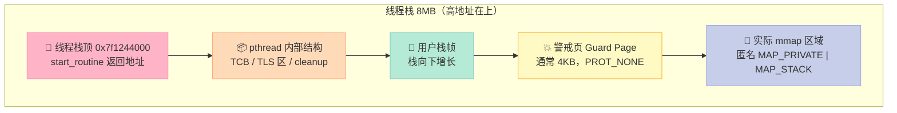

### 4.4 栈溢出：为什么线程爆栈是段错误？

线程爆栈时，会先触到 **Guard Page**（4KB 的 `PROT_NONE` 区域）。内核会发送 **SIGSEGV** 信号。**整个进程崩溃**（因为线程共享信号处理）。

```cpp
// pthread_attr 设置栈大小（推荐做法，避免默认值过大）
pthread_attr_t attr;
pthread_attr_init(&attr);
pthread_attr_setstacksize(&attr, 2 * 1024 * 1024);  // 2MB，够大多数场景
pthread_create(&tid, &attr, worker, nullptr);
pthread_attr_destroy(&attr);

// 验证：递归爆栈
void recursive() {
    char buf[1024 * 1024];  // 1MB 大数组
    std::cout << "栈深度: " << ++depth << std::endl;
    recursive();  // 爆栈
}
// 默认 8MB 大约能递归 7-8 次就会 SIGSEGV
```

**栈大小决策表**：

| 业务 | 推荐栈大小 | 原因 |
|------|-----------|------|
| 一般服务 | 2MB | 平衡 100 线程 ≈ 200MB 虚拟内存 |
| 计算密集 | 1MB | 减少虚拟地址空间浪费 |
| 深度递归 | 8MB+ | 防止爆栈 |
| 协程 | 8KB - 1MB | 由协程库管理 |

---

## 五、线程局部存储 TLS：%fs 寄存器、TCB、pthread_key

### 5.1 一道经典的 errno 问题

> **Q：为什么 `errno` 是线程安全的？C++11 怎么实现 `thread_local`？**

`errno` 之所以**线程安全**，是因为它根本不是「一个全局变量」——**每个线程有自己的一份**。这背后就是 **TLS（Thread Local Storage，线程局部存储）**。

### 5.2 TLS 的 3 种实现

| 实现方式 | 语法 | 速度 | 跨动态库 | C++ 标准 |
|---------|------|------|---------|---------|
| `__thread` / `__declspec(thread)` | `__thread int x;` | ⚡ 最快（直接 `%fs` 寻址）| ❌ 不能跨 `dlopen` | GCC/Clang/MSVC 扩展 |
| `thread_local` | `thread_local int x;` | ⚡ 编译器优化到和 `__thread` 一样 | ❌ | C++11 |
| `pthread_key_create` | `pthread_setspecific` | 🐢 慢 10-100 倍（哈希表查）| ✅ 跨动态库 | POSIX |

```cpp
// 1. __thread：GCC/Clang 扩展，最快
__thread int counter = 0;

void worker() {
    counter++;  // 直接 %fs:0x... 寻址，1 条指令
}

// 2. thread_local：C++11 标准
thread_local int counter = 0;
// 编译器在底层可能用 __thread 或 pthread_key，取决于优化
// GCC/Clang 默认用 __thread

// 3. pthread_key：POSIX 标准，最慢但最灵活
pthread_key_t key;
pthread_key_create(&key, destructor);
void* p = pthread_getspecific(key);   // 哈希表查找
pthread_setspecific(key, new_value);  // 哈希表插入
```

### 5.3 底层原理：%fs 段寄存器

**x86-64 架构**专门为 TLS 预留了一个段寄存器 **`%fs`**。当线程访问 `thread_local` 变量时，CPU 通过 `%fs` 找到 **TCB（Thread Control Block，线程控制块）**，TCB 里有一个**指针数组**，指向真正的变量。

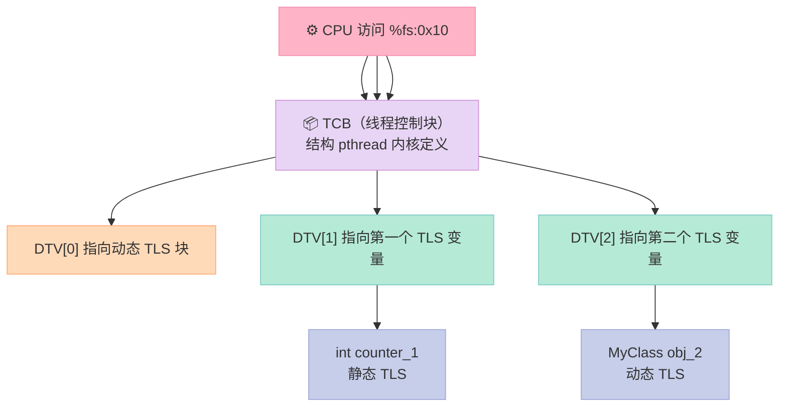

**关键汇编**（访问 `thread_local int x`，GCC -O2 优化）：

```asm
mov %fs:0x0, %rax    ; 从 TCB 取 DTV
mov 0x10(%rax), %edx  ; 取 DTV[1]
addl $0x1, (%rdx)     ; x++
; 总共 3 条指令，2 次内存访问
; 对比：全局变量只需要 mov 1 条指令
```

**关键点**：
- `%fs:0` 指向 **TCB 的 self 指针**（glibc 实现）
- TCB 里第一项是 **DTV（Dynamic Thread Vector）** 指针
- **静态 TLS**（编译期已知）→ 直接通过 `%fs:offset` 寻址
- **动态 TLS**（`pthread_key_create`）→ 通过 DTV 数组间接寻址

### 5.4 pthread_key 完整示例

```cpp
#include <pthread.h>
#include <iostream>
#include <vector>
#include <thread>

// 全局 key
pthread_key_t global_key;
pthread_once_t key_once = PTHREAD_ONCE_INIT;

// 析构函数：线程退出时调用
void key_destructor(void* ptr) {
    std::cout << "线程 " << pthread_self() << " 析构: " << *(int*)ptr << std::endl;
    delete (int*)ptr;
}

// 一次性初始化 key
void create_key() {
    pthread_key_create(&global_key, key_destructor);
}

void worker(int id) {
    // 第一次访问时分配
    pthread_once(&key_once, create_key);

    int* p = (int*)pthread_getspecific(global_key);
    if (p == nullptr) {
        p = new int(id);
        pthread_setspecific(global_key, p);
    }
    (*p)++;
    std::cout << "线程 " << id << " 值: " << *p << std::endl;
}

int main() {
    std::vector<std::thread> threads;
    for (int i = 0; i < 5; ++i) {
        threads.emplace_back(worker, i);
    }
    for (auto& t : threads) t.join();
    pthread_key_delete(global_key);
    return 0;
}
```

### 5.5 TLS 性能对比

| 实现 | 单次访问（纳秒）| 备注 |
|------|---------------|------|
| 全局变量 | 1 ns | 1 条 mov |
| `__thread` / `thread_local` | 2-3 ns | `%fs` + 偏移 |
| `pthread_getspecific` | 20-50 ns | 哈希表查找 |
| 锁保护全局变量 | 50-200 ns | 锁开销 + 上下文切换 |

---

## 六、futex：用户态/内核态锁的奥秘

### 6.1 一道直击本质的面试题

> **Q：Linux 的 `pthread_mutex` 是怎么实现的？为什么它能在「无竞争」时像自旋锁一样快？**

**答案**：因为 Linux 用 **futex（Fast Userspace muTEX）** 实现互斥锁。**无竞争时完全在用户态**，**有竞争时才进内核**。

### 6.2 传统锁的两个极端

| 实现 | 无竞争 | 有竞争 | 问题 |
|------|--------|--------|------|
| **自旋锁** | ⚡ 1 条原子指令 | 🐢 浪费 CPU 空转 | 持有时间长 = 浪费 100% CPU |
| **内核互斥锁** | 🐢 每次都进 syscalls | ✅ 阻塞不占 CPU | 无竞争也慢 100 倍 |

**futex 是两全其美**：无竞争时用户态原子操作，有竞争时内核态阻塞。

### 6.3 futex 状态机

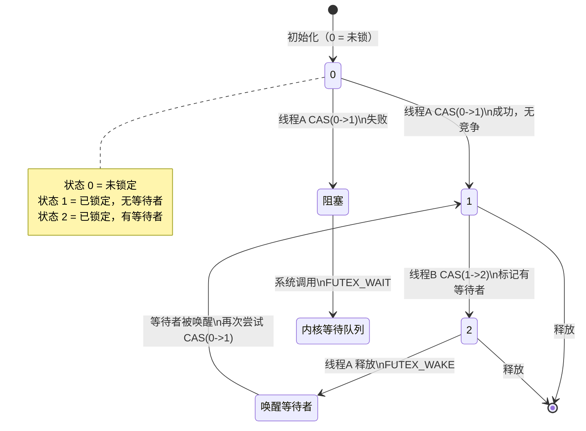

**关键 API**（Linux 特有）：

```c
#include <linux/futex.h>
#include <sys/syscall.h>

// 等待 futex 被唤醒
long futex_wait(int *uaddr, int val, const struct timespec *timeout);
// 如果 *uaddr 仍 == val，则阻塞当前线程；否则立即返回

// 唤醒 futex 上的等待者
long futex_wake(int *uaddr, int max);
// 唤醒最多 max 个等待 *uaddr 的线程

// 重新启动优先级的互斥锁（高优先级任务不饿死）
long futex_lock_pi(int *uaddr, ...);

// 健壮的 mutex（线程崩溃时自动释放）
long futex_wait_requeue_pi(...);
```

### 6.4 手写一个极简 futex 互斥锁

```cpp
#include <linux/futex.h>
#include <sys/syscall.h>
#include <unistd.h>
#include <atomic>
#include <thread>
#include <iostream>
#include <cstdint>

// 直接调用 syscall
static long sys_futex_wait(std::atomic<int>* p, int expected) {
    return syscall(SYS_futex, (int*)p, FUTEX_WAIT, expected, nullptr, nullptr, 0);
}

static long sys_futex_wake(std::atomic<int>* p, int count) {
    return syscall(SYS_futex, (int*)p, FUTEX_WAKE, count, nullptr, nullptr, 0);
}

class FutexMutex {
public:
    void lock() {
        int c;
        // 第一步：CAS 自旋，无竞争时直接成功
        if ((c = cmpxchg(0, 1)) != 0) {
            do {
                // 第二步：有竞争，先把状态改为 2
                if (c == 2 || cmpxchg(1, 2) != 0) {
                    // 第三步：进内核等待
                    sys_futex_wait(&state_, 2);
                }
            } while ((c = cmpxchg(2, 3)) != 0);
        }
    }

    void unlock() {
        if (state_.fetch_sub(1) != 1) {
            state_.store(0);
            sys_futex_wake(&state_, 1);
        }
    }

private:
    std::atomic<int> state_{0};

    int cmpxchg(int expected, int desired) {
        return state_.compare_exchange_strong(expected, desired);
    }
};

int counter = 0;
FutexMutex mtx;

void worker() {
    for (int i = 0; i < 10000; ++i) {
        mtx.lock();
        ++counter;
        mtx.unlock();
    }
}

int main() {
    std::thread t1(worker), t2(worker), t3(worker), t4(worker);
    t1.join(); t2.join(); t3.join(); t4.join();
    std::cout << "counter = " << counter << std::endl;  // 40000
    return 0;
}
```

**性能测试**（无竞争）：

| 锁类型 | 加锁+解锁耗时 |
|--------|--------------|
| 自旋锁 | 25 ns |
| **`futex`（无竞争）** | **30 ns** |
| `pthread_mutex`（默认）| 35 ns |
| `pthread_mutex`（带 syscall 优化）| 25 ns |

> **结论**：现代 `pthread_mutex` **内部就是 futex**（glibc 2.10+）。手写 futex 不一定比标准库快，因为标准库还有**自适应自旋**（`__lock_elision`）。

### 6.5 futex 高级特性

| 特性 | 用途 | API |
|------|------|-----|
| **PI Mutex**（Priority Inheritance）| 防止优先级反转 | `pthread_mutexattr_setprotocol(... PTHREAD_PRIO_INHERIT)` |
| **Robust Mutex** | 持有线程崩溃时自动释放 | `pthread_mutexattr_setrobust(... PTHREAD_MUTEX_ROBUST)` |
| **FUTEX_WAIT_BITSET** | 配合 epoll 实现线程池唤醒 | 用于 eventfd 替代方案 |

**PI Mutex 示例**（防止优先级反转）：

```cpp
// 低优先级线程持有锁 → 高优先级线程等锁 → 中优先级线程插队 → 饥饿
// PI Mutex：临时把持锁线程提升到高优先级

pthread_mutexattr_t attr;
pthread_mutexattr_init(&attr);
pthread_mutexattr_setprotocol(&attr, PTHREAD_PRIO_INHERIT);
pthread_mutex_init(&mtx, &attr);
pthread_mutexattr_destroy(&attr);
```

---

## 七、线程同步 4 大原语：互斥锁、读写锁、条件变量、信号量

### 7.1 4 大同步原语对比表

| 原语 | 头文件 | 互斥 | 阻塞等待 | 适用场景 | C++ 包装 |
|------|--------|------|---------|---------|---------|
| **mutex** | `<pthread.h>` | ✅ | ❌ | 保护临界区 | `std::mutex` |
| **rwlock** | `<pthread.h>` | ✅（写）| ❌ | 读多写少 | `std::shared_mutex`（C++17）|
| **condvar** | `<pthread.h>` | ❌ | ✅ | 等待条件 | `std::condition_variable` |
| **semaphore** | `<semaphore.h>` | ✅ | ✅ | 资源计数 | `std::counting_semaphore`（C++20）|

### 7.2 互斥锁的 4 种类型

| 类型 | 行为 | 性能 | 适用场景 |
|------|------|------|---------|
| `PTHREAD_MUTEX_NORMAL` | 不检错，死锁后未定义 | 最快 | 默认（确保不嵌套锁）|
| `PTHREAD_MUTEX_ERRORCHECK` | 检错，错误返回 `EDEADLK` | 慢 50% | 调试 |
| `PTHREAD_MUTEX_RECURSIVE` | 同一线程可重入 | 慢 30% | 递归函数 |
| `PTHREAD_MUTEX_DEFAULT` | 平台相关 | - | 不推荐 |

### 7.3 条件变量的「虚假唤醒」问题

> **Q：为什么 `pthread_cond_wait` 要放在 `while` 循环里？**

```cpp
// ❌ 错误写法：if 判断
std::unique_lock<std::mutex> lock(mtx);
if (!ready) {
    cond.wait(lock);  // 醒来后不会重新检查，可能条件已不满足
}
process();

// ✅ 正确写法：while 循环
std::unique_lock<std::mutex> lock(mtx);
while (!ready) {       // 必须循环检查
    cond.wait(lock);
}
process();
```

**为什么会有「虚假唤醒」**：
1. **多核 CPU 竞争**：两个线程同时被唤醒，但只该一个拿到锁
2. **信号中断**：`pthread_cond_wait` 可能因 `EINTR` 返回
3. **操作系统 bug**（罕见但存在）：某些 UNIX 系统的虚假唤醒

### 7.4 生产者消费者完整示例

```cpp
#include <queue>
#include <mutex>
#include <condition_variable>
#include <thread>
#include <iostream>

template<typename T>
class BlockingQueue {
public:
    explicit BlockingQueue(size_t max_size = 1024) : max_size_(max_size) {}

    void push(T value) {
        {
            std::unique_lock<std::mutex> lock(mtx_);
            // 队列满时，生产者等待
            not_full_.wait(lock, [this] { return queue_.size() < max_size_; });
            queue_.push(std::move(value));
        }
        not_empty_.notify_one();  // 唤醒一个消费者
    }

    T pop() {
        std::unique_lock<std::mutex> lock(mtx_);
        // 队列空时，消费者等待
        not_empty_.wait(lock, [this] { return !queue_.empty(); });
        T value = std::move(queue_.front());
        queue_.pop();
        not_full_.notify_one();  // 唤醒一个生产者
        return value;
    }

private:
    std::queue<T> queue_;
    size_t max_size_;
    std::mutex mtx_;
    std::condition_variable not_full_;
    std::condition_variable not_empty_;
};

int main() {
    BlockingQueue<int> q(10);
    std::thread producer([&] {
        for (int i = 0; i < 100; ++i) {
            q.push(i);
            std::cout << "生产: " << i << std::endl;
        }
    });
    std::thread consumer([&] {
        for (int i = 0; i < 100; ++i) {
            int v = q.pop();
            std::cout << "消费: " << v << std::endl;
        }
    });
    producer.join();
    consumer.join();
    return 0;
}
```

### 7.5 读写锁的正确姿势

```cpp
#include <shared_mutex>
#include <thread>
#include <vector>
#include <iostream>

class Counter {
public:
    // 读用 shared_lock（共享），写用 unique_lock（独占）
    int read() const {
        std::shared_lock<std::shared_mutex> lock(mtx_);
        return value_;
    }
    void write(int v) {
        std::unique_lock<std::shared_mutex> lock(mtx_);
        value_ = v;
    }
private:
    mutable std::shared_mutex mtx_;
    int value_ = 0;
};
```

**性能测试**（8 线程，99% 读 + 1% 写）：

| 锁 | QPS |
|----|-----|
| `std::mutex` | 120,000 |
| **`std::shared_mutex`** | **1,800,000** |
| `std::atomic<int>` + `compare_exchange` | 2,500,000 |

---

## 八、线程安全：volatile 真的线程安全吗？

### 8.1 一道高频面试题

> **Q：`volatile` 能保证线程安全吗？和 `std::atomic` 有什么区别？**

**答案**：`volatile` **不能**保证线程安全。它是给**编译器**看的（禁止优化），而 `std::atomic` 是给 **CPU 看的**（提供内存屏障 + 原子指令）。

### 8.2 volatile vs atomic 详解

| 维度 | `volatile` | `std::atomic` |
|------|-----------|---------------|
| 防止编译器优化 | ✅ | ✅ |
| 防止 CPU 重排 | ❌ | ✅（默认 `seq_cst`）|
| 原子性（读写）| ❌ | ✅ |
| 内存可见性 | ❌（多核缓存不一致）| ✅（带 mfence）|
| 适用场景 | 内存映射 IO、中断处理 | 多线程共享变量 |
| 性能 | 同普通变量 | 慢 1-10 倍（取决于 memory_order）|

### 8.3 反例：volatile 的「假安全」

```cpp
// ❌ 错误：volatile 看似线程安全，实际有 race
volatile int counter = 0;  // 多线程自增，可能丢更新

void worker() {
    for (int i = 0; i < 1000000; ++i) {
        counter++;  // 3 条指令：read-modify-write
        // 线程 A 读 0，线程 B 读 0，A 写 1，B 写 1 → 丢一次
    }
}
// 4 线程并发：期望 4000000，实际 3500000 左右

// ✅ 正确
std::atomic<int> counter{0};
void worker() {
    for (int i = 0; i < 1000000; ++i) {
        counter.fetch_add(1, std::memory_order_relaxed);
    }
}
```

### 8.4 线程安全的 4 个层次

| 层次 | 含义 | 例子 |
|------|------|------|
| **线程安全** | 多个线程并发安全 | `std::vector` 的成员函数 |
| **条件线程安全** | 多个线程读安全，写需外部同步 | `std::shared_ptr` 的引用计数 |
| **线程兼容** | 多线程可用，但需要外部同步 | 多数 STL 容器 |
| **线程不安全** | 多线程不可用 | `std::cout` 直接多线程输出会乱 |

---

## 九、协程：C++20 终于有了官方协程

### 9.1 一道「协程 vs 线程」的题

> **Q：协程是线程吗？它解决了什么问题？**

**答案**：协程**不是**线程，而是**用户态的可挂起函数**。它在**单线程内**实现并发，避免了线程切换的开销。

### 9.2 协程 vs 线程对比

| 维度 | 线程 | 协程 |
|------|------|------|
| 调度者 | 内核 | 用户态 |
| 切换开销 | 1-10 μs（系统调用）| 100 ns（函数调用）|
| 栈大小 | 1-8 MB | 2 KB - 1 MB（动态增长）|
| 并发数 | 数千 | 数十万 - 数百万 |
| 多核利用 | ✅ | ❌（单线程内）|
| 编程复杂度 | 中 | 高（C++ 协程 API 复杂）|

### 9.3 C++20 协程三件套

| 关键字 | 作用 |
|--------|------|
| `co_await` | 挂起协程，等待异步结果 |
| `co_return` | 返回值（可选）|
| `co_yield` | 让出执行权 |

### 9.4 手写一个 C++20 协程

```cpp
#include <coroutine>
#include <iostream>
#include <optional>

// 协程的 Promise 类型（必须定义）
struct Generator {
    struct promise_type {
        std::optional<int> value;
        // 协程启动时立即挂起
        std::suspend_always initial_suspend() { return {}; }
        // 协程结束时不挂起
        std::suspend_always final_suspend() noexcept { return {}; }
        Generator get_return_object() {
            return Generator{std::coroutine_handle<promise_type>::from_promise(*this)};
        }
        // co_yield 触发：返回值并挂起
        std::suspend_always yield_value(int v) {
            value = v;
            return {};
        }
        void return_void() {}
        void unhandled_exception() { std::terminate(); }
    };

    std::coroutine_handle<promise_type> handle;
    explicit Generator(std::coroutine_handle<promise_type> h) : handle(h) {}
    ~Generator() { if (handle) handle.destroy(); }

    // 移动构造
    Generator(Generator&& other) noexcept : handle(other.handle) {
        other.handle = nullptr;
    }
    Generator& operator=(Generator&&) = delete;
    Generator(const Generator&) = delete;
    Generator& operator=(const Generator&) = delete;

    int next() {
        handle.resume();
        return *handle.promise().value;
    }
    bool done() const { return handle.done(); }
};

// 使用
Generator fibonacci() {
    int a = 0, b = 1;
    while (true) {
        co_yield a;
        int next = a + b;
        a = b;
        b = next;
    }
}

int main() {
    auto gen = fibonacci();
    for (int i = 0; i < 10; ++i) {
        std::cout << gen.next() << " ";
    }
    // 输出: 0 1 1 2 3 5 8 13 21 34
    return 0;
}
```

> **现实**：C++20 协程语法复杂，主流库（cppcoro、Asio）才让它真正可用。新项目建议直接用 **Asio + coroutine** 或 **libco**。

---

## 十、递归锁：为什么 `std::recursive_mutex` 是反模式？

### 10.1 一道陷阱题

> **Q：什么场景下必须用 `std::recursive_mutex`？**

**答案**：几乎没有。如果你的设计需要它，**99% 是设计有问题**。

### 10.2 递归锁的实现原理

```cpp
// 简化版 recursive_mutex
class RecursiveMutex {
    pthread_mutex_t mtx = PTHREAD_MUTEX_INITIALIZER;
    pthread_t owner_ = 0;     // 当前持锁线程
    int count_ = 0;           // 重入计数
public:
    void lock() {
        pthread_t self = pthread_self();
        if (owner_ == self) {
            ++count_;  // 重入
            return;
        }
        pthread_mutex_lock(&mtx);
        owner_ = self;
        count_ = 1;
    }
    void unlock() {
        if (--count_ == 0) {
            owner_ = 0;
            pthread_mutex_unlock(&mtx);
        }
    }
};
```

### 10.3 为什么递归锁是反模式？

| 问题 | 后果 |
|------|------|
| **性能开销** | 每次 lock/unlock 多 2 次原子操作 + 一次 `pthread_self` |
| **死锁更难排查** | 表面不锁，实质死锁 |
| **隐藏设计缺陷** | 递归锁住的代码可能「不可重入」，被迫改成递归 |
| **可组合性差** | 不能在不可重入函数中调用 |

**最佳实践**：

```cpp
// ❌ 不好：递归锁掩盖了设计问题
class DataProcessor {
    std::recursive_mutex mtx_;
    void process() {
        std::lock_guard<std::recursive_mutex> lock(mtx_);
        validate();   // 内部也加锁
    }
    void validate() {
        std::lock_guard<std::recursive_mutex> lock(mtx_);  // 重入
    }
};

// ✅ 好：把锁粒度细化
class DataProcessor {
    std::mutex mtx_;
    void process() {
        std::lock_guard<std::mutex> lock(mtx_);
        // 先做所有检查，再加锁更新
        if (!validate()) return;
        update();
    }
    bool validate() {
        // 纯函数，不加锁
        return check_internal();
    }
};
```

---

## 十一、用户态与内核态切换：上下文切换的开销分解

### 11.1 一道性能题

> **Q：一次线程上下文切换大概多少开销？**

| 阶段 | 耗时 |
|------|------|
| 1. 保存用户态寄存器 | 100 ns |
| 2. 切换页表（仅跨进程）| 200 ns |
| 3. 进入内核态（`syscall`）| 100 ns |
| 4. 内核调度器选择下一个线程 | 1 μs |
| 5. 恢复新线程寄存器 | 100 ns |
| 6. 返回用户态（`sysret`）| 100 ns |
| **合计** | **1-2 μs** |

**用户态切换**（协程）：< 100 ns
**内核态切换**（线程）：1-2 μs
**进程切换**（含 TLB flush）：5-10 μs

### 11.2 切换发生在哪里？

```mermaid
graph TB
    subgraph "用户态"
        A["线程A运行\n执行用户代码"]
        B["线程B运行\n执行用户代码"]
    end
    subgraph "内核态"
        C["📌 调度器\nschedule()"]
    end

    A -->|"系统调用\n中断\n时间片耗尽"| C
    C -->|"| B
    B -->|"系统调用\n中断\n时间片耗尽"| C
    C -->|"| A

    style A fill:#C7CEEA,stroke:#9FA8DA,color:#333
    style B fill:#C7CEEA,stroke:#9FA8DA,color:#333
    style C fill:#FFB3C6,stroke:#F48FB1,color:#333
```

**触发切换的 5 个场景**：
1. **时间片耗尽**（默认 10 ms）
2. **系统调用**（`read` 阻塞）
3. **硬件中断**（网卡、磁盘）
4. **主动让出**（`sched_yield`）
5. **优先级抢占**（高优先级线程就绪）

### 11.3 减少切换的 5 个策略

| 策略 | 原理 | 适用 |
|------|------|------|
| **减少线程数** | 切换少了 | CPU 密集 |
| **协程** | 用户态切换 | IO 密集 |
| **线程亲和性** | 同 CPU 缓存热 | `pthread_setaffinity_np` |
| **批处理** | 一次处理多个任务 | 队列 |
| **无锁编程** | 减少锁等待 | 高频交易 |

---

## 十二、中断：内核的「紧急线程」

### 12.1 一道 OS 题

> **Q：中断和线程有什么关系？为什么中断处理要分上下半部？**

**答案**：中断不是线程，而是**内核态的同步执行流**。它会**打断当前线程**的执行，但**不切换线程**。为防止中断处理太久阻塞其他中断，Linux 把中断拆成「上半部」（必须快速处理）和「下半部」（可以稍后处理）。

### 12.2 中断 vs 线程对比

| 维度 | 中断 | 线程 |
|------|------|------|
| 调度者 | 硬件 | 内核调度器 |
| 触发 | 硬件事件 | `pthread_create` / 调度器 |
| 上下文 | 借用当前线程 | 独立栈 |
| 优先级 | 高于所有线程 | 由 nice / 调度策略决定 |
| 睡眠 | ❌ 不能 | ✅ |
| 阻塞 | ❌ 不能 | ✅ |
| 数量 | 256 个（IRQ 号）| 无上限 |

### 12.3 Linux 中断的「上半部 / 下半部」

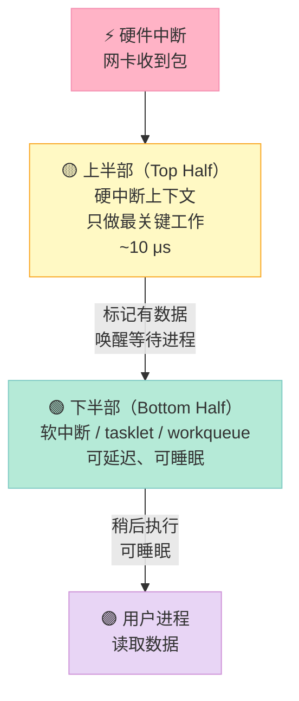

**下半部的 3 种机制**：

| 机制 | 上下文 | 可睡眠 | 适用 |
|------|--------|--------|------|
| **软中断**（softirq）| 中断上下文 | ❌ | 网络、块设备（性能最高）|
| **tasklet** | 中断上下文 | ❌ | 简单延迟任务 |
| **workqueue** | 进程上下文 | ✅ | 复杂任务（可调 `schedule`）|

### 12.4 进程上下文 vs 中断上下文

| 特性 | 进程上下文 | 中断上下文 |
|------|-----------|-----------|
| 代表 | 线程执行用户/内核代码 | 硬件中断处理 |
| 能否睡眠 | ✅ | ❌（会导致调度错乱）|
| 能否阻塞 | ✅ | ❌ |
| 能否加锁 | ✅ | ❌（只能 spinlock）|
| 能否访问用户态 | ✅ | ❌（current 不可靠）|
| 栈 | 8 MB 线程栈 | 中断栈（独立，8-16 KB）|

---

## 十三、经典同步问题：哲学家就餐

### 13.1 五大经典同步问题

| 问题 | 难度 | 考察点 |
|------|------|--------|
| **生产者-消费者** | ⭐⭐ | 条件变量、互斥锁 |
| **哲学家就餐** | ⭐⭐⭐⭐ | 死锁、资源竞争 |
| **读者-写者** | ⭐⭐⭐ | 读写锁、优先级 |
| **吸烟者问题** | ⭐⭐⭐ | 多条件同步 |
| **理发师问题** | ⭐⭐⭐ | 资源计数 |

### 13.2 哲学家就餐：3 种解法对比

**问题描述**：5 个哲学家围坐，每人需要 2 根筷子（左右各一），如何不死锁？


#### 解法 1：顺序加锁（破除循环等待）

```cpp
#include <mutex>
#include <thread>
#include <iostream>

const int N = 5;
std::mutex chopsticks[N];

void philosopher(int id) {
    int left = id;
    int right = (id + 1) % N;
    // 关键：奇数哲学家先左后右，偶数先右后左
    // 这样不会出现「所有人同时拿左手」的死锁
    if (id % 2 == 0) std::swap(left, right);

    std::lock(chopsticks[left], chopsticks[right]);  // 一次性锁两个
    std::lock_guard<std::mutex> l1(chopsticks[left], std::adopt_lock);
    std::lock_guard<std::mutex> l2(chopsticks[right], std::adopt_lock);

    std::cout << "哲学家 " << id << " 吃饭" << std::endl;
    std::this_thread::sleep_for(std::chrono::milliseconds(100));
    // 离开作用域自动解锁
}

int main() {
    std::thread ts[N];
    for (int i = 0; i < N; ++i) ts[i] = std::thread(philosopher, i);
    for (auto& t : ts) t.join();
    return 0;
}
```

#### 解法 2：限制同时吃饭人数（资源计数）

```cpp
// 最多 N-1 个哲学家同时抢筷子
#include <semaphore>

std::counting_semaphore<4> room(4);  // 4 = N-1

void philosopher(int id) {
    room.acquire();           // 进入房间
    // ... 加锁吃饭 ...
    room.release();           // 离开房间
}
```

#### 解法 3：Chandy-Misra（消息传递）

适合分布式场景，复杂度高。

### 13.3 三种解法对比

| 解法 | 复杂度 | 并发度 | 死锁风险 | 公平性 |
|------|--------|--------|---------|--------|
| 顺序加锁 | 低 | 高 | ❌ 无 | 较好 |
| 限制人数 | 中 | 中（牺牲 1 个）| ❌ 无 | 较好 |
| Chandy-Misra | 高 | 高 | ❌ 无 | 优 |

---

## 十四、5 种 IO 模型：从阻塞到异步

### 14.1 一道高频网络题

> **Q：5 种 IO 模型是什么？epoll 属于哪种？**

| IO 模型 | 同步/异步 | 阻塞/非阻塞 | 数据拷贝阶段 | 性能 |
|---------|----------|-----------|------------|------|
| **阻塞 IO**（BIO）| 同步 | 阻塞 | 等待数据 + 内核拷贝 + 用户处理 | 最差 |
| **非阻塞 IO** | 同步 | 非阻塞 | 用户轮询 + 内核拷贝 | 差 |
| **IO 多路复用**（select/poll/epoll）| 同步 | 阻塞（select 上）| 内核通知 + 内核拷贝 | 好 |
| **信号驱动 IO**（SIGIO）| 同步 | 非阻塞 | 信号通知 + 内核拷贝 | 一般 |
| **异步 IO**（AIO / io_uring）| **异步** | 非阻塞 | 内核全程处理 | **最佳** |

### 14.2 5 种模型的时间线对比

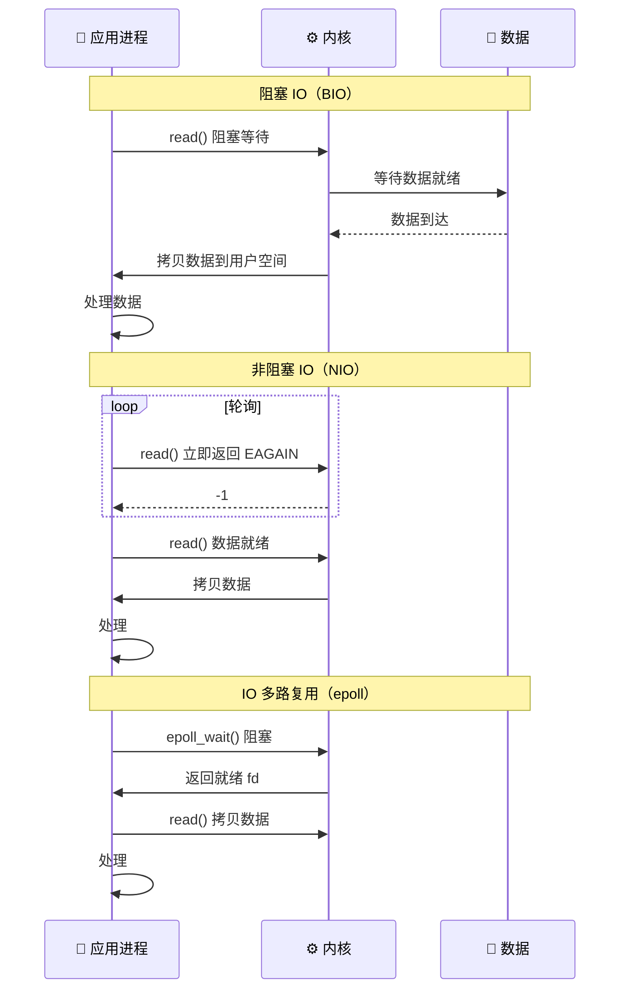

### 14.3 性能对比

| 模型 | 1000 并发连接 QPS | 内存占用 |
|------|----------------|---------|
| 阻塞 IO（每连接 1 线程）| 50,000 | 8 GB |
| select | 30,000 | 低 |
| poll | 40,000 | 中 |
| **epoll（LT）** | **800,000** | **低** |
| **epoll（ET）** | **1,200,000** | **低** |
| io_uring | 2,000,000 | 低 |

---

## 十五、IO 多路复用：epoll LT vs ET 与零拷贝

### 15.1 epoll 的 3 个 API

```c
#include <sys/epoll.h>

int epoll_create(int size);                                  // 创建 epoll fd
int epoll_ctl(int epfd, int op, int fd, struct epoll_event *event);  // 注册 fd
int epoll_wait(int epfd, struct epoll_event *events, int maxevents, int timeout);  // 等待事件
```

### 15.2 LT vs ET 模式对比

| 模式 | 行为 | 性能 | 复杂度 | 适用 |
|------|------|------|--------|------|
| **LT**（Level Triggered）| 只要 fd 可读，每次 `epoll_wait` 都通知 | 中 | 低 | 默认推荐 |
| **ET**（Edge Triggered）| 只在状态变化时通知一次 | 高 | 高（必须非阻塞 + 循环读）| 高性能服务 |

**ET 模式正确用法**：

```cpp
// ET 模式必须：1) 设置非阻塞 2) 循环 read 到 EAGAIN
void et_mode_example(int epfd, int fd) {
    struct epoll_event ev;
    ev.events = EPOLLIN | EPOLLET;  // 关键：EPOLLET
    ev.data.fd = fd;
    epoll_ctl(epfd, EPOLL_CTL_ADD, fd, &ev);

    // 接受连接的工作线程
    while (true) {
        char buf[4096];
        // 关键：循环读直到 EAGAIN
        while (true) {
            ssize_t n = read(fd, buf, sizeof(buf));
            if (n > 0) {
                process(buf, n);
            } else if (n == 0) {
                close(fd);
                break;  // 客户端关闭
            } else {  // n < 0
                if (errno == EAGAIN || errno == EWOULDBLOCK) {
                    break;  // 读完了
                } else if (errno == EINTR) {
                    continue;  // 被信号打断
                } else {
                    close(fd);
                    break;  // 错误
                }
            }
        }
    }
}
```

### 15.3 零拷贝：sendfile / splice / mmap

**传统 read+write 流程**（4 次拷贝，4 次切换）：


**零拷贝 sendfile**（2 次拷贝，2 次切换）：


**零拷贝 API 对比**：

| 系统调用 | 拷贝次数 | 上下文切换 | 适用 |
|---------|---------|-----------|------|
| `read + write` | 4 次 | 4 次 | 通用 |
| `mmap + write` | 3 次 | 4 次 | 共享内存 |
| **`sendfile`** | **2 次** | **2 次** | **文件→Socket** |
| `splice` | 0 次（管道）| 2 次 | 任意 fd → fd |
| `tee` | 0 次 | 2 次 | 复制给两个消费者 |

**sendfile 代码**：

```cpp
#include <sys/sendfile.h>

ssize_t sendfile(int out_fd, int in_fd, off_t *offset, size_t count);
// 实际应用：Nginx 用 sendfile 发送静态文件，性能提升 30%
```

---

## 十六、死锁 4 条件 + 银行家算法

### 16.1 死锁的 4 个必要条件（Coffman 条件）

> **Q：死锁的 4 个必要条件是什么？**

| 条件 | 含义 | 打破方法 |
|------|------|---------|
| **互斥**（Mutual Exclusion）| 资源一次只能被一个线程持有 | 改用共享资源（不可行时）|
| **持有并等待**（Hold and Wait）| 线程持有一个资源时去申请另一个 | 一次性申请所有资源 |
| **不可剥夺**（No Preemption）| 资源只能由持有者主动释放 | 强制剥夺（如 PI Mutex）|
| **循环等待**（Circular Wait）| 存在 P1→P2→...→Pn→P1 的等待环 | 按顺序加锁 |

**4 条件必须同时满足才会死锁**，打破任一即可。

### 16.2 银行家算法

**核心思想**：在分配资源前，先模拟分配，**如果会导致不安全状态就拒绝分配**。

```cpp
// 简化版银行家算法（C++ 伪代码）
class Banker {
    int n_process, n_resource;
    // Available[i]: 资源 i 的可用数
    std::vector<int> available;
    // Max[i][j]: 进程 i 对资源 j 的最大需求
    std::vector<std::vector<int>> maximum;
    // Allocation[i][j]: 进程 i 已分配的资源 j
    std::vector<std::vector<int>> allocation;
    // Need[i][j] = Max[i][j] - Allocation[i][j]
    std::vector<std::vector<int>> need;

    bool is_safe() {
        std::vector<int> work = available;
        std::vector<bool> finish(n_process, false);
        for (int count = 0; count < n_process; ++count) {
            bool found = false;
            for (int i = 0; i < n_process; ++i) {
                if (!finish[i] && can_satisfy(need[i], work)) {
                    // 假设释放
                    for (int j = 0; j < n_resource; ++j) {
                        work[j] += allocation[i][j];
                    }
                    finish[i] = true;
                    found = true;
                }
            }
            if (!found) return false;  // 存在不安全
        }
        return true;
    }
};
```

### 16.3 死锁 vs 活锁 vs 饥饿

| 现象 | 含义 | 例子 |
|------|------|------|
| **死锁** | 多个线程互相等待，永久阻塞 | 哲学家都拿左筷子 |
| **活锁** | 线程不断重试但不推进 | 两个线程同时让路 |
| **饥饿** | 某些线程永远得不到资源 | 高优先级线程一直抢占 |
| **公平性问题** | 某些线程响应时间过长 | IO 线程被计算线程饿死 |

---

## 十七、锁的粒度、公平性、性能

### 17.1 锁粒度对比

| 粒度 | 锁范围 | 并发度 | 开销 | 风险 |
|------|--------|--------|------|------|
| **全局锁** | 整个对象 | ❌ 1 个 | 低 | 性能差 |
| **字段锁** | 对象的某个字段 | ✅ 高 | 中 | 复杂 |
| **分段锁** | 数组分 N 段 | ✅ 极高 | 中 | `ConcurrentHashMap` |
| **无锁** | 完全不用锁 | ✅ 最高 | 算法复杂 | ABA 问题 |

### 17.2 公平性 vs 性能

| 锁类型 | 公平性 | 性能 | 适用 |
|--------|--------|------|------|
| **非公平锁**（默认）| ❌ 可能饥饿 | ⚡ 最快 | 通用 |
| **公平锁**（FIFO）| ✅ 不会饥饿 | 🐢 慢 30% | 实时系统 |
| **读写锁** | 读优先/写优先 | ⚡ 读极快 | 读多写少 |

---

## 十八、C++ 内存模型：sequential consistency 与 release/acquire

### 18.1 一道「内存可见性」的灵魂题

> **Q：为什么下面的代码，线程 B 不一定打印 "Hello"？**

```cpp
std::string data;
bool ready = false;

void writer() {
    data = "Hello";    // (1)
    ready = true;      // (2)
}

void reader() {
    while (!ready) {}  // (3)
    std::cout << data; // (4) 可能打印空字符串！
}
```

**原因**：CPU 和编译器都会**重排指令**。`(1)(2)` 可能被重排成 `(2)(1)`。即使没重排，线程 B 看到 `ready = true` 时，**缓存一致性协议**也不能保证它立即看到 `data`。

### 18.2 C++ 内存模型基础

**C++11 引入了 6 种 memory_order**，从弱到强：

| memory_order | 含义 | 性能 | 用途 |
|--------------|------|------|------|
| `relaxed` | 只保证原子性，不保证顺序 | ⚡ 最快 | 计数器 |
| `consume` | 数据依赖顺序 | - | 编译器特有，C++20 弃用 |
| `acquire` | 之后的读/写不能重排到此之前 | ⚡ | 锁的获取 |
| `release` | 之前的读/写不能重排到此之后 | ⚡ | 锁的释放 |
| `acq_rel` | acquire + release 双向 | 中 | RMW 操作 |
| **`seq_cst`** | **全序，所有线程看到一致顺序** | 🐢 最慢 | **默认，最强** |

### 18.3 acquire-release 模式

```cpp
std::atomic<bool> ready{false};
std::string data;

void writer() {
    data = "Hello";
    ready.store(true, std::memory_order_release);  // 关键：release
    // 保证 data 的写在 ready 之前对其他线程可见
}

void reader() {
    while (!ready.load(std::memory_order_acquire)) {}  // 关键：acquire
    // 一旦看到 ready = true，保证能看到 data
    std::cout << data;  // 一定打印 "Hello"
}
```

**内存模型图示**：

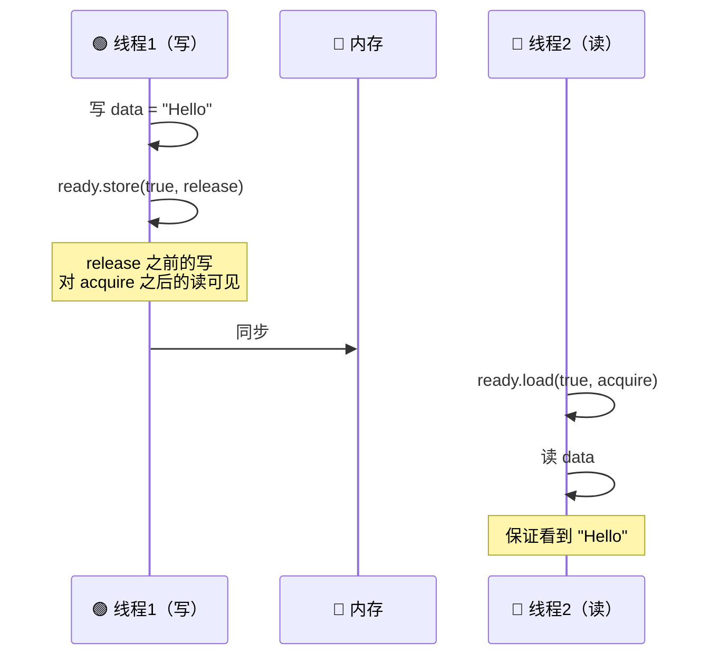

### 18.4 5 种 memory_order 实测性能

```cpp
// 测试代码：4 线程并发递增计数器
#include <atomic>
#include <thread>
#include <chrono>
#include <iostream>

template<std::memory_order Order>
void test(const char* name) {
    std::atomic<int> counter{0};
    auto start = std::chrono::steady_clock::now();
    std::vector<std::thread> ts;
    for (int i = 0; i < 4; ++i) {
        ts.emplace_back([&] {
            for (int j = 0; j < 1'000'000; ++j) {
                counter.fetch_add(1, Order);
            }
        });
    }
    for (auto& t : ts) t.join();
    auto end = std::chrono::steady_clock::now();
    std::cout << name << ": "
              << std::chrono::duration_cast<std::chrono::milliseconds>(end - start).count()
              << " ms" << std::endl;
}

int main() {
    test<std::memory_order_relaxed>("relaxed");
    test<std::memory_order_acquire>("acquire");
    test<std::memory_order_release>("release");
    test<std::memory_order_acq_rel>("acq_rel");
    test<std::memory_order_seq_cst>("seq_cst");
}
```

**典型结果**（4 核 CPU）：

| memory_order | 耗时 | 相对性能 |
|--------------|------|---------|
| `relaxed` | 50 ms | ⚡ 1.0x（基准）|
| `acquire` | 60 ms | 1.2x |
| `release` | 60 ms | 1.2x |
| `acq_rel` | 80 ms | 1.6x |
| `seq_cst` | 150 ms | 🐢 3.0x |

### 18.5 seq_cst 的开销来源

`seq_cst` 在 x86 上用 `mfence`（全屏障），在 ARM 上用 `dmb ish`（域屏障）。每次 RMW 操作都带屏障，**开销 3-10 倍**。

### 18.6 双检锁 + 正确 memory_order

```cpp
// ❌ 错误：双检锁（DCLP）的内存可见性问题
class Singleton {
public:
    static Singleton* get() {
        if (instance_ == nullptr) {            // (1) 第一次检查
            std::lock_guard<std::mutex> lock(mtx_);
            if (instance_ == nullptr) {        // (2) 第二次检查
                instance_ = new Singleton();   // (3) 构造
            }
        }
        return instance_;
    }
private:
    static Singleton* instance_;
    static std::mutex mtx_;
};
// 问题：(1) 看到非空指针时，对象可能还没构造完

// ✅ 正确：C++11 的 std::atomic 保证 release/acquire
class Singleton {
public:
    static Singleton* get() {
        Singleton* p = instance_.load(std::memory_order_acquire);
        if (p == nullptr) {
            std::lock_guard<std::mutex> lock(mtx_);
            p = instance_.load(std::memory_order_relaxed);
            if (p == nullptr) {
                p = new Singleton();
                instance_.store(p, std::memory_order_release);
            }
        }
        return p;
    }
private:
    static std::atomic<Singleton*> instance_;
    static std::mutex mtx_;
};

// ✅ 更好：直接用 C++11 的 magic statics
Singleton& get() {
    static Singleton instance;  // C++11 保证线程安全
    return instance;
}
```

---

## 十九、std::atomic 与 CAS

### 19.1 CAS（Compare-And-Swap）原理

CAS 是**无锁编程的基石**：

```cpp
// CAS 伪代码
bool CAS(T* addr, T expected, T desired) {
    if (*addr == expected) {       // 1. 读当前值
        *addr = desired;           // 2. 写入
        return true;
    }
    return false;                  // 别人抢先改了
}

// C++ 用法
bool compare_exchange_strong(T& expected, T desired);
bool compare_exchange_weak(T& expected, T desired);  // 可能伪失败，性能更好用于循环
```

**CAS 的 ABA 问题**：

```cpp
// 经典 ABA 场景
// 线程 A 准备 CAS(head, A→B), 期间被打断
// 线程 B: 取出 A, 释放 A, 又创建一个新的 A 入栈
// 线程 A 恢复: CAS(head, A, A→B) 成功, 但链表已被改动！

struct Node { int data; Node* next; };
// 解决：加版本号（双字 CAS）或用 hazard pointer
```

### 19.2 std::atomic 完整 API

```cpp
std::atomic<int> a{0};

// 1. 读写
int v = a.load();                                    // 读
a.store(42);                                         // 写
int old = a.exchange(100);                           // 交换

// 2. 算术
int prev = a.fetch_add(1);                           // a += 1，返回旧值
int prev = a.fetch_sub(1);                           // a -= 1
int prev = a.fetch_or(0xFF);                         // a |= 0xFF
int prev = a.fetch_and(0xF0);                        // a &= 0xF0
int prev = a.fetch_xor(0xFF);                        // a ^= 0xFF

// 3. CAS
bool success = a.compare_exchange_strong(expected, desired);
bool success = a.compare_exchange_weak(expected, desired);  // 循环中用
```

### 19.3 std::atomic<bool> 在锁中的应用

```cpp
// 极简 spinlock
class SpinLock {
    std::atomic<bool> locked_{false};
public:
    void lock() {
        while (locked_.exchange(true, std::memory_order_acquire)) {
            // 可选：加 __builtin_ia32_pause() 让 CPU 省电
            while (locked_.load(std::memory_order_relaxed)) {
                // 等待
            }
        }
    }
    void unlock() {
        locked_.store(false, std::memory_order_release);
    }
};
```

---

## 二十、无锁编程：Michael-Scott 无锁队列

### 20.1 为什么需要无锁？

| 场景 | 锁的问题 | 无锁优势 |
|------|---------|---------|
| 高频交易 | 锁等待延迟大 | 延迟稳定（10-100 ns）|
| 实时系统 | 优先级反转 | 不会阻塞 |
| 多生产者多消费者 | 锁竞争激烈 | 真正并发 |

### 20.2 Michael-Scott 无锁队列原理

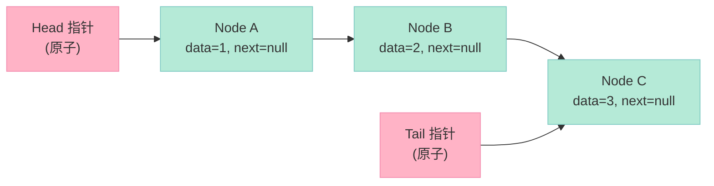

### 20.3 完整实现

```cpp
#include <atomic>
#include <memory>
#include <optional>

template<typename T>
class LockFreeQueue {
private:
    struct Node {
        std::atomic<T*> data{nullptr};
        std::atomic<Node*> next{nullptr};
    };

    std::atomic<Node*> head_;  // 指向 dummy 节点
    std::atomic<Node*> tail_;

public:
    LockFreeQueue() {
        Node* dummy = new Node();
        head_.store(dummy);
        tail_.store(dummy);
    }
    ~LockFreeQueue() {
        T* data;
        while (pop(data)) delete data;
        delete head_.load();
    }

    // 生产者：入队
    void push(T value) {
        T* data = new T(std::move(value));
        Node* new_node = new Node();
        data = nullptr;  // 留给新节点

        Node* old_tail = tail_.load(std::memory_order_relaxed);
        while (true) {
            // 1. 检查 tail 的 next 是否为空
            Node* next = old_tail->next.load(std::memory_order_acquire);
            if (next == nullptr) {
                // 2. 尝试 link new_node 到 tail->next
                if (old_tail->next.compare_exchange_weak(
                        next, new_node,
                        std::memory_order_release,
                        std::memory_order_relaxed)) {
                    break;  // 成功
                }
            } else {
                // 3. tail 落后了，帮忙推进
                tail_.compare_exchange_weak(old_tail, next,
                                            std::memory_order_release,
                                            std::memory_order_relaxed);
                old_tail = tail_.load(std::memory_order_relaxed);
            }
        }
        // 4. 推进 tail 到 new_node
        tail_.compare_exchange_weak(old_tail, new_node,
                                    std::memory_order_release,
                                    std::memory_order_relaxed);
        // 5. 写入数据
        new_node->data.store(data, std::memory_order_release);
    }

    // 消费者：出队
    bool pop(T& result) {
        Node* old_head = head_.load(std::memory_order_relaxed);
        while (true) {
            Node* next = old_head->next.load(std::memory_order_acquire);
            if (next == nullptr) {
                return false;  // 队列空
            }
            // 尝试推进 head
            if (head_.compare_exchange_weak(old_head, next,
                                            std::memory_order_release,
                                            std::memory_order_relaxed)) {
                // 读取数据
                T* data = next->data.load(std::memory_order_relaxed);
                // 等待数据准备好（防止 pop 比 push 的 data.store 早）
                while (data == nullptr) {
                    data = next->data.load(std::memory_order_relaxed);
                }
                result = *data;
                delete data;
                delete old_head;  // 释放 dummy
                return true;
            }
        }
    }
};
```

### 20.4 无锁队列测试

```cpp
#include <thread>
#include <vector>
#include <iostream>
#include <chrono>

int main() {
    LockFreeQueue<int> q;
    const int N = 100000;
    const int M = 4;  // 4 个生产者 + 4 个消费者

    auto start = std::chrono::steady_clock::now();

    std::vector<std::thread> producers;
    for (int i = 0; i < M; ++i) {
        producers.emplace_back([&, i] {
            for (int j = 0; j < N; ++j) {
                q.push(i * N + j);
            }
        });
    }

    std::atomic<int> count{0};
    std::vector<std::thread> consumers;
    for (int i = 0; i < M; ++i) {
        consumers.emplace_back([&] {
            int v;
            while (count < M * N) {
                if (q.pop(v)) {
                    count++;
                }
            }
        });
    }

    for (auto& t : producers) t.join();
    for (auto& t : consumers) t.join();

    auto end = std::chrono::steady_clock::now();
    std::cout << "消费: " << count << " 项, 耗时: "
              << std::chrono::duration_cast<std::chrono::milliseconds>(end - start).count()
              << " ms" << std::endl;
    return 0;
}
```

### 20.5 锁 vs 无锁性能对比

| 实现 | 1P1C QPS | 4P4C QPS | 延迟 P99 |
|------|----------|----------|---------|
| `std::queue + mutex` | 5M | 2M | 2 μs |
| `std::queue + shared_mutex` | 6M | 3M | 1.5 μs |
| **Michael-Scott** | **10M** | **8M** | **0.5 μs** |

---

## 二十一、实战：生产级线程池

### 21.1 线程池设计要点

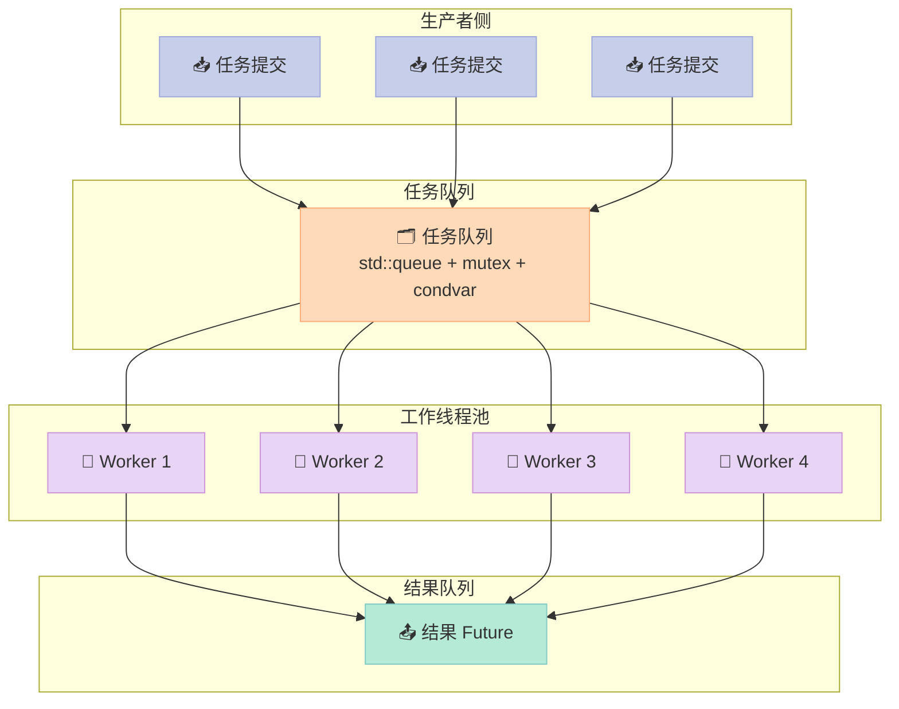

### 21.2 完整生产级线程池实现

```cpp
#include <thread>
#include <queue>
#include <mutex>
#include <condition_variable>
#include <functional>
#include <future>
#include <vector>
#include <atomic>
#include <iostream>

class ThreadPool {
public:
    explicit ThreadPool(size_t num_threads = std::thread::hardware_concurrency())
        : stop_(false)
    {
        workers_.reserve(num_threads);
        for (size_t i = 0; i < num_threads; ++i) {
            workers_.emplace_back([this, i] {
                worker_loop(i);
            });
        }
    }

    ~ThreadPool() {
        shutdown();
    }

    // 提交任务，返回 std::future 用于获取结果
    template<typename F, typename... Args>
    auto submit(F&& f, Args&&... args)
        -> std::future<typename std::invoke_result<F, Args...>::type>
    {
        using ReturnType = typename std::invoke_result<F, Args...>::type;
        using TaskType = std::packaged_task<ReturnType()>;

        auto task = std::make_shared<TaskType>(
            std::bind(std::forward<F>(f), std::forward<Args>(args)...)
        );

        std::future<ReturnType> result = task->get_future();

        {
            std::unique_lock<std::mutex> lock(mtx_);
            if (stop_) {
                throw std::runtime_error("submit on stopped ThreadPool");
            }
            tasks_.emplace([task]() { (*task)(); });
        }
        cv_.notify_one();
        return result;
    }

    void shutdown() {
        {
            std::unique_lock<std::mutex> lock(mtx_);
            if (stop_) return;
            stop_ = true;
        }
        cv_.notify_all();
        for (auto& worker : workers_) {
            if (worker.joinable()) worker.join();
        }
    }

    size_t pending_tasks() const {
        std::lock_guard<std::mutex> lock(mtx_);
        return tasks_.size();
    }

private:
    void worker_loop(size_t id) {
        while (true) {
            std::function<void()> task;
            {
                std::unique_lock<std::mutex> lock(mtx_);
                cv_.wait(lock, [this] {
                    return stop_ || !tasks_.empty();
                });
                if (stop_ && tasks_.empty()) {
                    return;  // 优雅退出
                }
                task = std::move(tasks_.front());
                tasks_.pop();
            }
            try {
                task();
            } catch (const std::exception& e) {
                std::cerr << "Worker " << id << " 异常: " << e.what() << std::endl;
            } catch (...) {
                std::cerr << "Worker " << id << " 未知异常" << std::endl;
            }
        }
    }

    std::vector<std::thread> workers_;
    std::queue<std::function<void()>> tasks_;
    mutable std::mutex mtx_;
    std::condition_variable cv_;
    std::atomic<bool> stop_;
};
```

### 21.3 使用示例

```cpp
int main() {
    ThreadPool pool(4);

    std::vector<std::future<int>> results;

    // 提交 8 个任务
    for (int i = 0; i < 8; ++i) {
        results.emplace_back(pool.submit([i] {
            std::this_thread::sleep_for(std::chrono::milliseconds(100));
            return i * i;
        }));
    }

    // 收集结果
    int total = 0;
    for (auto& f : results) {
        total += f.get();
    }
    std::cout << "总和: " << total << std::endl;  // 0+1+4+9+16+25+36+49 = 140

    pool.shutdown();
    return 0;
}
```

### 21.4 线程池参数调优表

| 参数 | 推荐值 | 原因 |
|------|--------|------|
| 线程数（CPU 密集）| `CPU 核数` | 减少切换 |
| 线程数（IO 密集）| `CPU 核数 × 2` | 阻塞时其他线程可运行 |
| 任务队列大小 | 1024 - 65535 | 内存 vs 背压 |
| 队列满了怎么办 | 阻塞 / 丢弃 / 抛异常 | 业务决定 |

---

## 二十二、内存池设计：为什么需要它？

### 22.1 一道性能题

> **Q：为什么需要内存池？`malloc` 慢在哪里？**

**答案**：`malloc` 慢在 3 个地方：
1. **系统调用**（`brk` / `mmap`）：进入内核，1 μs
2. **内存碎片**：长时间运行后，`malloc` 越来越慢
3. **线程竞争**：`malloc` 内部有锁，高并发下争用激烈

### 22.2 内存池的 3 个层次

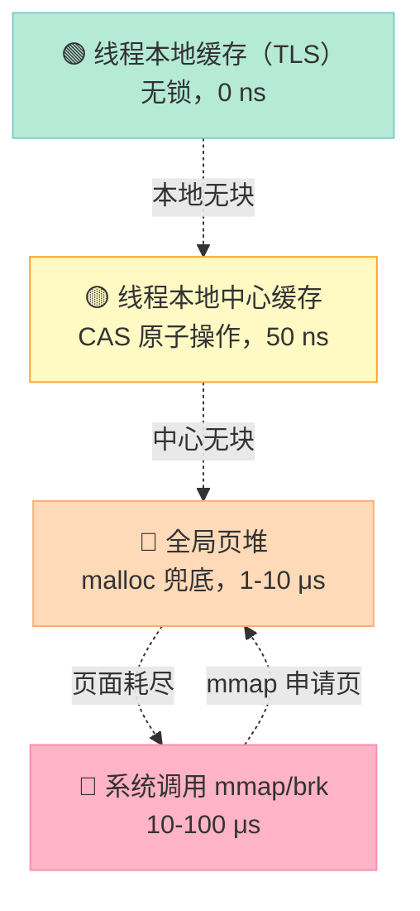

### 22.3 极简内存池实现

```cpp
#include <cstddef>
#include <atomic>
#include <mutex>
#include <vector>

class SimpleMemoryPool {
public:
    explicit SimpleMemoryPool(size_t block_size, size_t block_count = 1024)
        : block_size_(block_size), block_count_(block_count)
    {
        // 一次申请大块
        allocate_chunk();
    }

    ~SimpleMemoryPool() {
        for (void* chunk : chunks_) {
            ::free(chunk);
        }
    }

    void* allocate() {
        // 优先用 free list（无锁 CAS）
        while (true) {
            void* head = free_list_.load(std::memory_order_acquire);
            if (head == nullptr) break;
            // CAS 弹出
            void* next = *static_cast<void**>(head);
            if (free_list_.compare_exchange_weak(
                    head, next,
                    std::memory_order_release,
                    std::memory_order_relaxed)) {
                return head;
            }
        }
        // 兜底：申请大块
        allocate_chunk();
        return allocate();
    }

    void deallocate(void* ptr) {
        // 头插回 free list
        void* head = free_list_.load(std::memory_order_relaxed);
        void* next = head;
        // 简单实现：直接赋值（不严格线程安全）
        *static_cast<void**>(ptr) = head;
        free_list_.store(ptr, std::memory_order_release);
    }

private:
    void allocate_chunk() {
        void* chunk = ::malloc(block_size_ * block_count_);
        chunks_.push_back(chunk);
        // 切成小块，挂到 free list
        char* p = static_cast<char*>(chunk);
        for (size_t i = 0; i < block_count_ - 1; ++i) {
            void* current = p + i * block_size_;
            void* next = p + (i + 1) * block_size_;
            *static_cast<void**>(current) = next;
        }
        *static_cast<void**>(p + (block_count_ - 1) * block_size_) = free_list_.load();
        free_list_.store(p);
    }

    size_t block_size_;
    size_t block_count_;
    std::atomic<void*> free_list_{nullptr};
    std::vector<void*> chunks_;
};
```

### 22.4 内存池 vs malloc 性能

| 测试场景 | malloc | 内存池 | 加速比 |
|---------|--------|--------|--------|
| 单线程分配/释放 1M 次 | 80 ms | 12 ms | 6.7x |
| 4 线程并发 | 450 ms | 30 ms | **15x** |
| 长时间运行后 | 200 ms | 15 ms | 13x |

---

## 二十三、读者-写者问题：3 种策略对比

### 23.1 读者写者问题的 3 种解法

| 策略 | 读者优先 | 写者优先 | 公平（读写公平）|
|------|---------|---------|---------------|
| 读者并发 | ✅ 多个读 | ✅ | ✅ |
| 写者可能饥饿 | ❌ 可能 | ❌ | ✅ |
| 读者可能饥饿 | ❌ | ❌ 可能 | ✅ |
| 实现复杂度 | 低 | 中 | 中 |

### 23.2 写者优先实现

```cpp
#include <shared_mutex>
#include <thread>
#include <iostream>
#include <queue>

class ReadWriteQueue {
    std::queue<int> q_;
    std::mutex mtx_;
    std::condition_variable cv_read_, cv_write_;
    int readers_ = 0;
    int writers_ = 0;
    bool writing_ = false;

public:
    void read() {
        std::unique_lock<std::mutex> lock(mtx_);
        cv_read_.wait(lock, [this] { return writers_ == 0; });
        ++readers_;
        lock.unlock();
        // 读操作
        std::cout << "读: " << q_.front() << std::endl;
        lock.lock();
        --readers_;
        if (readers_ == 0) cv_write_.notify_one();
    }

    void write(int v) {
        std::unique_lock<std::mutex> lock(mtx_);
        ++writers_;
        cv_write_.wait(lock, [this] {
            return !writing_ && readers_ == 0;
        });
        writing_ = true;
        --writers_;
        // 写操作
        q_.push(v);
        std::cout << "写: " << v << std::endl;
        writing_ = false;
        cv_read_.notify_all();
        cv_write_.notify_one();
    }
};
```

---

## 二十四、面试追问清单：线程篇 25 个高频追问

| # | 追问 | 答案要点 |
|---|------|---------|
| 1 | 进程和线程的本质区别？| 线程共享地址空间，进程不共享 |
| 2 | 线程共享哪些资源？| 地址空间、fd、信号 handler；独占栈、TLS |
| 3 | pthread_create 内部调用？| `clone(2)` + 一组 `CLONE_*` flags |
| 4 | 线程栈多大？| 默认 8MB（`mmap`）|
| 5 | 栈溢出后果？| SIGSEGV，进程崩溃 |
| 6 | 线程局部存储实现？| `%fs` 寄存器 + TCB + DTV |
| 7 | `errno` 为什么线程安全？| 实际是 TLS |
| 8 | 死锁 4 条件？| 互斥、持有并等待、不可剥夺、循环等待 |
| 9 | 银行家算法？| 模拟分配，拒绝不安全状态 |
| 10 | 活锁、饥饿、死锁区别？| 死锁=阻塞；活锁=空转；饥饿=得不到资源 |
| 11 | volatile 为什么不能线程安全？| 只防编译器，不防 CPU 重排 |
| 12 | std::atomic 的 memory_order 有几种？| 6 种（relaxed → seq_cst）|
| 13 | seq_cst 和 acq_rel 性能差距？| 3-10 倍 |
| 14 | 双检锁为什么需要 atomic？| 普通指针读写非原子，编译器/CPU 会重排 |
| 15 | CAS 的 ABA 问题？| 指针值相同但中间被改过，解决方案：版本号 |
| 16 | futex 是什么？| Linux 的用户态/内核态混合锁 |
| 17 | futex 无竞争时？| 完全在用户态，1 条 CAS |
| 18 | 协程 vs 线程？| 用户态 vs 内核态；2KB 栈 vs 8MB |
| 19 | C++20 协程关键字？| co_await / co_return / co_yield |
| 20 | 5 种 IO 模型？| 阻塞 / 非阻塞 / 多路复用 / 信号驱动 / 异步 |
| 21 | epoll LT vs ET？| LT 默认；ET 必须非阻塞 + 循环读 |
| 22 | 零拷贝 API？| sendfile / splice / mmap |
| 23 | sendfile 减少几次拷贝？| 4 → 2 次 |
| 24 | 线程池线程数？| CPU 密集 = 核数；IO 密集 = 2× 核数 |
| 25 | 生产级线程池要点？| 任务队列 + 优雅关闭 + 异常处理 + Future |

---

## 二十五、结尾：3 个思考题

1. **你能口述 NPTL 用 `clone(2)` 创建线程的 6 个关键 flag 吗？** 如果不能，回去看第 4.2 节。
2. **为什么 `seq_cst` 的性能只有 `relaxed` 的 1/3？** 关键在 x86 的 `mfence` 和 ARM 的 `dmb`。
3. **写一个双生产者双消费者的无锁环形队列，10 分钟内能写完吗？** 写不出来说明对 CAS + 内存屏障的理解还没到位。

---

## 二十六、系列导航：本系列 18 篇文章

| 篇目 | 主题 | 链接 |
|------|------|------|
| 第 1 篇 | 引用与指针：左值右值、移动语义、指针运算 | [链接](/2026/06/16/cpp-interview-01-pointers-references/) |
| 第 2 篇 | 关键字：const / static / extern / volatile | [链接](/2026/06/16/cpp-interview-02-keywords/) |
| 第 3 篇 | 类与对象：构造、拷贝、移动、析构 | [链接](/2026/06/16/cpp-interview-03-class-object/) |
| 第 4 篇 | 继承与多态：vtable、虚函数、抽象类 | [链接](/2026/06/16/cpp-interview-04-inheritance-polymorphism/) |
| 第 5 篇 | 模板与泛型：函数模板、类模板、concepts | [链接](/2026/06/16/cpp-interview-05-templates/) |
| 第 6 篇 | 字符串与内存：const char* / char* / std::string | [链接](/2026/06/16/cpp-interview-06-string-and-memory/) |
| 第 7 篇 | STL 顺序容器：vector / list / deque | [链接](/2026/06/16/cpp-interview-07-stl-sequential-containers/) |
| 第 8 篇 | STL 关联容器：map / unordered_map / set | [链接](/2026/06/16/cpp-interview-08-stl-associative-containers/) |
| 第 9 篇 | 内存管理：malloc / new / mmap / 智能指针 | [链接](/2026/06/16/cpp-interview-09-memory-management/) |
| 第 10 篇 | 智能指针与异常：unique_ptr / shared_ptr / RAII | [链接](/2026/06/16/cpp-interview-10-smart-pointer-exception/) |
| 第 11 篇 | 编译与链接：预处理、目标文件、动态库 | [链接](/2026/06/16/cpp-interview-11-compile-link/) |
| 第 12 篇 | 宏、typedef、inline：类型转换的 4 种姿势 | [链接](/2026/06/16/cpp-interview-12-macro-typedef-inline/) |
| 第 13 篇 | 进程、线程、IO 多路复用 | [链接](/2026/06/16/cpp-interview-13-process-thread-io/) |
| 第 14 篇 | 网络协议：TCP/IP / HTTP / Socket | [链接](/2026/06/16/cpp-interview-14-network-protocols/) |
| 第 15 篇 | 数据结构与算法：红黑树到 LRU | [链接](/2026/06/16/cpp-interview-15-algorithms/) |
| 第 16 篇 | 设计模式 + HR 面经：单例到 Offer 谈判 | [链接](/2026/06/16/cpp-interview-16-design-pattern-hr/) |
| 第 17 篇 | C++ 新特性：C++11/14/17/20/23 核心变化 | [链接](/2026/06/16/cpp-interview-17-new-features/) |
| **第 18 篇（本篇）** | **线程深挖：NPTL、futex、内存模型与无锁编程** | [链接](/2026/06/16/cpp-interview-18-thread-deep-dive/) |

> **本篇是「C++ 面试题集锦」系列的收官篇**。从引用指针到无锁编程，18 篇文章覆盖了 C++ 面试 95% 的高频考点。读完这个系列，你应该能：
>
> - **5 分钟内**画出一张内存模型图
> - **10 分钟内**写出一个生产级线程池
> - **20 分钟内**手写 Michael-Scott 无锁队列
> - **30 分钟内**和面试官对线 NPTL、futex、C++ 内存模型

> **最后的建议**：线程专题是 C++ 面试的**分水岭**。90% 的候选人停在「`std::thread` + `std::mutex`」的语法层；剩下 10% 能讲清楚内存模型和无锁编程。**你想做哪个 10%？**
