> **为什么 TCP 三次握手不是两次？为什么 TIME_WAIT 要等 2MSL？为什么 HTTP/2 引入二进制分帧而不是直接用 HTTP/1.1 的文本协议？** 因为大多数 C++ 程序员只学会了「三次握手 = 客户端发 SYN、服务端回 SYN+ACK、客户端再 ACK」的流程，没学会它底下 **11 种状态机的迁移规则、4 大计时器的工作机制、滑动窗口的字节流语义**，也没学会 **HTTP/2 的多路复用帧模型** 与 **QUIC 基于 UDP 重塑可靠传输** 的设计哲学。本篇是「C++ 面试题集锦」第 19 篇——在第 14 篇「网络协议」21 道题的基础上，把 **网络协议** 部分单独深挖，覆盖 **TCP 11 状态状态机、4 大计时器、滑动窗口、拥塞控制 4 算法、Nagle/延迟确认/Cork/粘包、UDP 适用场景、HTTP/1.0/1.1/2/3 演进、HTTPS 握手、TLS 1.2 vs 1.3、DNS 解析、raw socket 实战、tcpdump 抓包实战**，共 14 大专题。

---

## 一、开篇钩子：三个反常识的问题

**问题 1**：为什么 TCP 三次握手不是两次？

很多人会说「为了防止已失效的连接请求突然又传到了服务器」。但这只是表象。**真正的本质是：两次握手无法让客户端和服务端都确认双方的收发能力都正常**。三次握手后，客户端确认了「自己能发、能收」，服务端也确认了「自己能发、能收」，双向通信能力全部验证完毕。

**问题 2**：TIME_WAIT 状态为什么要等 2MSL？

很多人会背「防止最后一个 ACK 丢失」。但更深层的原因是：**2MSL 时间 = 一个 MSL（去程）+ 一个 MSL（回程）**，刚好覆盖了「主动方发 ACK → 对方可能重传 FIN → 主动方再次发 ACK」这条完整链路。**1 个 MSL 不够，因为 FIN 重传的应答也需要 1 个 MSL 才能消失**。

**问题 3**：为什么 HTTP/2 用二进制而不是文本？

HTTP/1.x 用 `GET /index.html HTTP/1.1\r\n` 这种 ASCII 文本，**人类可读**但**机器解析低效**——每次都要扫描 `\r\n`、切分 `:`、解析空格。HTTP/2 直接用 **二进制分帧**，每个帧有固定长度的头部（9 字节）+ 变长 payload，**机器解析 0 拷贝**、**二进制位运算判断类型**，**并行多路复用**不需要排队。**HTTP/3 干脆放弃 TCP，改用 QUIC（基于 UDP）**，把「TCP 的可靠性 + TLS 的安全性 + 多路复用」全部下移到 UDP 之上重做一次。

下面，我们用 **17 个章节 + 60+ 段代码 + 25+ 张表格**，把 C++ 面试中所有高频网络问题一次性打透。

---

## 二、TCP/IP vs OSI：网络模型的本质差异

### 2.1 为什么需要分层？

网络协议的设计哲学是 **分层**——每层只关心自己的事，把复杂问题拆成小问题。分层的好处有三个：

| 分层价值 | 含义 | 实例 |
|---------|------|------|
| **关注点分离** | 物理层不管 IP，IP 层不管 TCP | 网卡驱动只需实现物理层 + 链路层 |
| **可替换性** | 任何一层可独立升级 | Wi-Fi 换成光纤，应用层无感知 |
| **跨厂商协作** | 不同厂商只要遵守同一层接口 | Intel 网卡 + Linux 内核 + Nginx |

### 2.2 OSI 7 层 vs TCP/IP 4 层

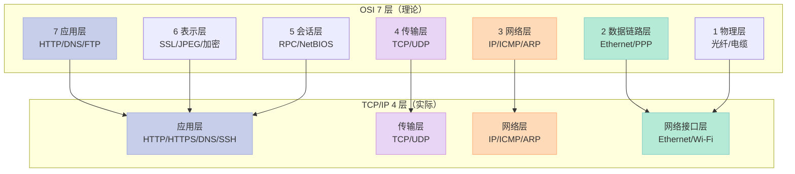

### 2.3 各层数据单元与设备

| 层 | 数据单元 | 关键设备 | 典型协议 |
|----|---------|---------|---------|
| 应用层 | 报文（Message） | 网关、代理 | HTTP/HTTPS/DNS/FTP/SSH/SMTP |
| 传输层 | 段（Segment） | 网关、负载均衡 | TCP/UDP |
| 网络层 | 包（Packet） | 路由器、三层交换机 | IP/ICMP/ARP/OSPF/BGP |
| 链路层 | 帧（Frame） | 交换机、网桥 | Ethernet/PPP/VLAN |
| 物理层 | 比特（Bit） | 集线器、中继器、网卡 | 光纤、电缆、无线 |

**数据封装流程**（发送方）：

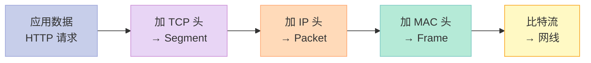

### 2.4 为什么 OSI 没赢过 TCP/IP？

| 维度 | OSI 7 层 | TCP/IP 4 层 |
|------|----------|------------|
| 提出者 | ISO（国际标准组织） | ARPA（美国国防部） |
| 出现时间 | 1984 年（理论模型） | 1974 年（实际协议） |
| 推动力 | 学者和标准化组织 | 实际需求 + 军方资助 |
| 复杂程度 | 会话层/表示层使用场景少 | 砍掉这两层，把功能并入应用层 |
| 协议实现 | 几乎无成熟实现 | Unix BSD socket 直接落地 |
| 最终结果 | 「教学参考」 | 「全球互联网事实标准」 |

**口诀**：OSI 是「教科书里的完美模型」，TCP/IP 是「工程师手里的实战工具」。

---

## 三、TCP 头部详解：32 字节里有 16 个字段

### 3.1 TCP Header 完整结构

TCP 头部是 **20 字节固定部分 + 可变选项**（最长 40 字节），共 32 字节（不含选项）。

```c
// TCP Header（20 字节固定 + 可选选项）
// 完整的位级字段定义
struct TCPHeader {
    uint16_t src_port;       // 源端口号（2 字节）
    uint16_t dst_port;       // 目的端口号（2 字节）
    uint32_t seq;            // 序号 Sequence Number（4 字节）
    uint32_t ack;            // 确认号 Acknowledgment Number（4 字节）

    // 第 12-13 字节：数据偏移 + 保留 + 标志位
    uint8_t  data_offset:4;  // 数据偏移（头部长度，单位 4 字节）
    uint8_t  reserved:3;     // 保留位（必须为 0）
    uint8_t  NS:1;           // Nonce Sum（RFC 3540，隐藏位）

    // 第 13.5-14 字节：6 个标志位
    uint8_t  CWR:1;          // Congestion Window Reduced
    uint8_t  ECE:1;          // ECN-Echo（显式拥塞通知）
    uint8_t  URG:1;          // Urgent 紧急指针有效
    uint8_t  ACK:1;          // Acknowledgment 确认号有效
    uint8_t  PSH:1;          // Push 推送数据
    uint8_t  RST:1;          // Reset 重置连接
    uint8_t  SYN:1;          // Synchronize 同步序号
    uint8_t  FIN:1;          // Finish 结束连接

    uint16_t window;         // 窗口大小（流量控制核心）
    uint16_t checksum;       // 校验和（覆盖头部+数据+伪头部）
    uint16_t urgent_ptr;     // 紧急指针（URG=1 时有效）
    uint32_t options[];      // 可选选项（MSS、SACK、Timestamps 等）
};
```

### 3.2 6 大标志位详解

| 标志位 | 全称 | 触发场景 | 常见组合 |
|--------|------|---------|---------|
| **SYN** | Synchronize | 三次握手前两次 | SYN、SYN+ACK |
| **ACK** | Acknowledgment | 几乎所有包都带 | ACK（确认） |
| **FIN** | Finish | 四次挥手的关闭 | FIN、FIN+ACK |
| **RST** | Reset | 异常断开、连接拒绝 | RST、RST+ACK |
| **PSH** | Push | 催促接收方立即交付应用层 | PSH+ACK |
| **URG** | Urgent | 紧急数据传送 | URG+ACK |

### 3.3 头部字段含义速查表

| 字段 | 长度 | 含义 | 面试题 |
|------|------|------|--------|
| 源/目的端口 | 各 2 字节 | 标识应用进程 | 一台机器如何区分多个连接？ |
| 序号 seq | 4 字节 | 当前报文段的第一个字节编号 | TCP 是面向字节流的，靠 seq 排序 |
| 确认号 ack | 4 字节 | 期望收到的下一个字节编号 | ack = N 表示「N 之前的我都收到了」 |
| 数据偏移 | 4 位 | TCP 头部长度（4 字节为单位） | 最少 5（20 字节），最多 15（60 字节） |
| 窗口大小 | 2 字节 | 接收方还能接收的字节数 | 流量控制核心字段 |
| 校验和 | 2 字节 | 覆盖头部+数据+伪 IP 头部 | 防止传输错误 |
| 紧急指针 | 2 字节 | URG=1 时有效，指向紧急数据结束位置 | 用于带外数据 |

### 3.4 TCP 头部结构图

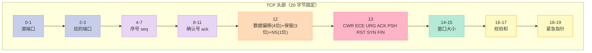

### 3.5 TCP 校验和计算（伪头部）

TCP 校验和不仅覆盖 TCP 头部和数据，还覆盖一个 **12 字节的伪 IP 头部**——目的就是防止「IP 头部错了而 TCP 没察觉」。

```c
// TCP 伪头部（不传输，仅用于计算校验和）
struct TCPPseudoHeader {
    uint32_t src_ip;         // 源 IP 地址
    uint32_t dst_ip;         // 目的 IP 地址
    uint8_t  zero;           // 保留 0
    uint8_t  protocol;       // 协议号（TCP=6）
    uint16_t tcp_length;     // TCP 段长度（头+数据）
};

// 校验和计算代码（简化）
uint16_t tcp_checksum(const void* data, size_t len) {
    uint32_t sum = 0;
    const uint16_t* p = (const uint16_t*)data;
    while (len > 1) {
        sum += *p++;
        len -= 2;
    }
    if (len == 1) sum += *(const uint8_t*)p;  // 奇数尾部补 0
    // 高 16 位回卷
    while (sum >> 16) sum = (sum & 0xFFFF) + (sum >> 16);
    return ~sum;                                // 取反
}
```

---

## 四、TCP 11 种状态：完整状态机迁移

### 4.1 状态总览表

TCP 连接有 **11 种状态**，按生命周期分四类：

| 分类 | 状态 | 触发时机 | 持续时间 |
|------|------|---------|---------|
| **服务端特有** | LISTEN | `listen()` 后 | 整个监听期 |
| **建立连接** | SYN_SENT | 客户端发 SYN | 等服务器 SYN+ACK |
| | SYN_RCVD | 服务器收到 SYN | 等客户端 ACK |
| **数据传输** | ESTABLISHED | 三次握手完成 | 数据传输期 |
| **关闭连接** | FIN_WAIT_1 | 主动方发 FIN | 等 ACK |
| | FIN_WAIT_2 | 主动方收到 ACK | 等对方 FIN |
| | CLOSE_WAIT | 被动方收到 FIN | 等应用 close |
| | LAST_ACK | 被动方发 FIN | 等最后 ACK |
| | TIME_WAIT | 主动方收到 FIN+ACK | 等 2MSL |
| **同时关闭** | CLOSING | 两端同时发 FIN | 极少见 |
| **初始/终止** | CLOSED | 初始/最终状态 | - |

### 4.2 完整状态机迁移图

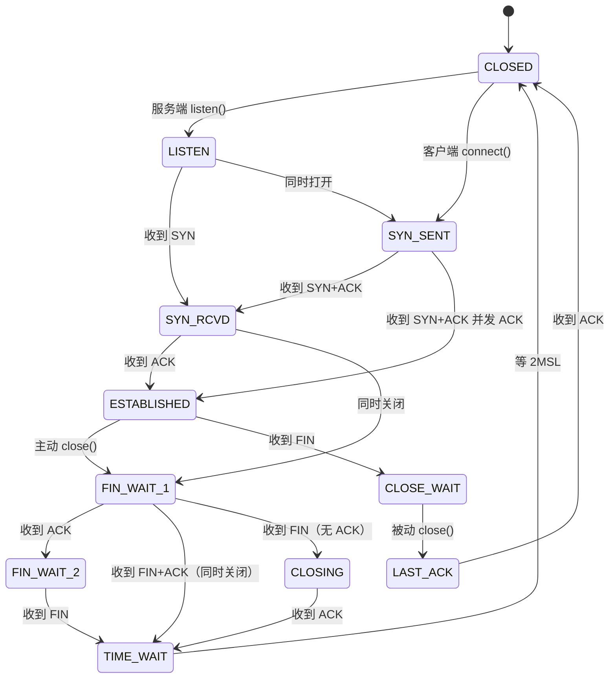

### 4.3 状态转换细节表

| 转换 | 触发事件 | 发送报文 | 关键要点 |
|------|---------|---------|---------|
| CLOSED → LISTEN | `listen()` | 无 | 服务端创建 socket 后 |
| CLOSED → SYN_SENT | `connect()` | SYN | 客户端主动发起 |
| LISTEN → SYN_RCVD | 收到 SYN | SYN+ACK | 协议栈代发 |
| SYN_SENT → ESTABLISHED | 收到 SYN+ACK | ACK | 第三次握手 |
| ESTABLISHED → FIN_WAIT_1 | `close()` | FIN | 主动方开始关闭 |
| ESTABLISHED → CLOSE_WAIT | 收到 FIN | ACK | 被动方收到关闭请求 |
| FIN_WAIT_1 → FIN_WAIT_2 | 收到 ACK | 无 | 主动方已确认 |
| FIN_WAIT_2 → TIME_WAIT | 收到 FIN | ACK | 主动方收到对方 FIN |
| CLOSE_WAIT → LAST_ACK | `close()` | FIN | 被动方开始关闭 |
| LAST_ACK → CLOSED | 收到 ACK | 无 | 被动方真正关闭 |
| TIME_WAIT → CLOSED | 等待 2MSL | 无 | **唯一等待的状态** |

### 4.4 关键状态深度剖析

#### LISTEN（监听）

服务端调用 `listen()` 后进入 LISTEN，**内核会维护一个「半连接队列」（SYN Queue）和「全连接队列」（Accept Queue）**。

```bash
# 查看 TCP 半连接/全连接队列溢出
netstat -s | grep -i listen
#   1197 times the listen queue of a socket overflowed

# 调大队列长度
echo 1024 > /proc/sys/net/ipv4/tcp_max_syn_backlog
```

#### SYN_RCVD（同步收到）

服务端收到 SYN 后进入此状态。**如果遭遇 SYN 洪泛攻击，攻击者只发 SYN 不回 ACK，会让服务端堆积大量 SYN_RCVD 半连接**。这就是 SYN Flood 攻击的原理。

```c
// Linux 内核的 SYN Cookie 防御（RFC 4987）
// 不分配内存也能验证 ACK 合法性
echo 1 > /proc/sys/net/ipv4/tcp_syncookies
```

#### TIME_WAIT（时间等待）

**唯一需要主动等待的状态**。等待 2MSL（通常 60 秒，Linux 默认 `net.ipv4.tcp_fin_timeout=60`）后才会真正关闭。

```bash
# 查看系统当前 TIME_WAIT 连接数
ss -tan | grep TIME-WAIT | wc -l

# 高并发服务端常见的优化手段（慎用）
echo 1 > /proc/sys/net/ipv4/tcp_tw_reuse       # 客户端连接复用
echo 1 > /proc/sys/net/ipv4/tcp_tw_recycle     # 已废弃，不要用！
```

### 4.5 CLOSE_WAIT 异常排查

**CLOSE_WAIT 数量突然飙升 = 服务端代码 bug**。因为 CLOSE_WAIT 是「被动方收到 FIN 但没调用 close()」。

```bash
# 查找谁持有 CLOSE_WAIT 连接
ss -tan | grep CLOSE-WAIT

# 用 lsof 找进程
lsof -i :8080 | grep CLOSE_WAIT
```

**常见原因**：

| 原因 | 修复方法 |
|------|---------|
| 代码忘记 `close(fd)` | 用 RAII（智能指针 / 析构） |
| 死循环忘记读 socket | 设置超时 |
| handler 抛异常没被 catch | 全局异常处理 |
| 对端发 RST 没收尾 | 检查 FIN/RST 处理逻辑 |

---

## 五、TCP 三次握手：建立连接的 3 个报文

### 5.1 时序图

```mermaid
sequenceDiagram
    participant C as 👤 客户端
    participant S as 🖥️ 服务器

    Note over C: CLOSED
    Note over S: LISTEN（已调用 listen）

    C->>S: ① SYN, seq=x
    Note over C: → SYN_SENT
    Note over S: 收到 SYN
    S->>C: ② SYN+ACK, seq=y, ack=x+1
    Note over S: → SYN_RCVD
    Note over C: 收到 SYN+ACK
    C->>S: ③ ACK, seq=x+1, ack=y+1
    Note over C: → ESTABLISHED
    Note over S: 收到 ACK
    Note over S: → ESTABLISHED

    style C fill:#C7CEEA,stroke:#9FA8DA,color:#333
    style S fill:#E8D5F5,stroke:#CE93D8,color:#333
```

### 5.2 三次握手详细字段

| 次数 | 报文 | 标志位 | seq | ack | 状态变化 | 携带数据 |
|------|------|--------|-----|-----|---------|---------|
| 第 1 次 | C → S | SYN=1 | x（随机） | - | C: CLOSED → SYN_SENT | 无 |
| 第 2 次 | S → C | SYN=1, ACK=1 | y（随机） | x+1 | S: LISTEN → SYN_RCVD | 无 |
| 第 3 次 | C → S | ACK=1 | x+1 | y+1 | C: ESTABLISHED；S: ESTABLISHED | 可带数据 |

### 5.3 为什么是 3 次而不是 2 次？

**经典失效场景**：

```
客户端            网络            服务器
  │                              │
  │──SYN=x──→  (滞留)            │
  │                              │
  │──SYN=x'─→  (重传)            │
  │←─SYN+ACK──                   │   ← 新连接建立
  │──ACK─────→                   │
  │ (连接 A 已建立)              │
  │                              │
  │         (旧 SYN=x 到达)      │
  │←─SYN+ACK──                   │   ← 服务端以为是新连接
  │──ACK─────→                   │
  │ (连接 B 建立但客户端不要)     │
```

**如果是 2 次握手**：服务器收到旧 SYN 后会直接建立「连接 B」，浪费资源。

**3 次握手的好处**：客户端收到旧 SYN 的应答后，发现 ack ≠ 期望值，**不发 ACK**——服务器就收不到第三次握手，**不会建立连接**。

### 5.4 seq 为什么是随机的？

**早期 TCP 实现 seq 是可预测的（从 0 开始递增）**，这导致 **TCP 序列号预测攻击**。现代 Linux 用随机算法生成 ISN：

```bash
# 查看 Linux ISN 生成算法
sysctl net.ipv4.tcp_isn_policy
# 默认 "standard"（RFC 6528）

# 历史实现
sysctl net.ipv4.tcp_timestamps
# 1 = 启用（提供更多熵）
```

### 5.5 用 tcpdump 抓三次握手

```bash
# 监听 80 端口的三次握手
sudo tcpdump -i any -nn -S port 80 and host 192.168.1.100

# 输出示例：
# 12:00:01 IP 192.168.1.100.54321 > 192.168.1.1.80: Flags [S], seq 1000000000, ...
# 12:00:01 IP 192.168.1.1.80 > 192.168.1.100.54321: Flags [S.], seq 2000000000, ack 1000000001, ...
# 12:00:01 IP 192.168.1.100.54321 > 192.168.1.1.80: Flags [.], ack 2000000001, ...
```

**Flags 含义**：

| Flags | 含义 |
|-------|------|
| `[S]` | SYN |
| `[S.]` | SYN+ACK（`.` 表示 ACK） |
| `[.]` | ACK（确认） |
| `[P]` | PSH（推送） |
| `[F]` | FIN（关闭） |
| `[R]` | RST（重置） |
| `[F.]` | FIN+ACK |

---

## 六、TCP 四次挥手 + TIME_WAIT 深挖

### 6.1 时序图

```mermaid
sequenceDiagram
    participant A as 👤 主动方
    participant B as 🖥️ 被动方

    Note over A: ESTABLISHED
    Note over B: ESTABLISHED

    A->>B: ① FIN, seq=u
    Note over A: → FIN_WAIT_1
    Note over B: 收到 FIN
    B->>A: ② ACK, seq=v, ack=u+1
    Note over B: → CLOSE_WAIT
    Note over A: 收到 ACK
    Note over A: → FIN_WAIT_2

    Note over B: 应用层调用 close()
    B->>A: ③ FIN, seq=w, ack=u+1
    Note over B: → LAST_ACK
    Note over A: 收到 FIN
    A->>B: ④ ACK, seq=u+1, ack=w+1
    Note over A: → TIME_WAIT
    Note over B: 收到 ACK
    Note over B: → CLOSED

    Note over A: 等 2MSL（通常 60s）
    Note over A: → CLOSED

    style A fill:#C7CEEA,stroke:#9FA8DA,color:#333
    style B fill:#E8D5F5,stroke:#CE93D8,color:#333
```

### 6.2 为什么挥手比握手多 1 次？

**握手**时，SYN 和 ACK 可以「捎带」——服务器收到 SYN 后，可以直接 SYN+ACK 一并发。

**挥手**时，被动方收到 FIN 后，**应用层可能还有数据要发**，必须先 ACK 告诉对方「我收到了」，等数据发完再单独发 FIN。**所以需要 4 次**。

### 6.3 TIME_WAIT 的两个核心作用

**作用 1：保证最后一个 ACK 能到达对方**

```
TIME_WAIT 等待期间：
  主动方发 ACK ──→ 可能丢失
                  ↓
  被动方超时重传 FIN ──→ 主动方重发 ACK
                  ↓
  直到 ACK 到达，或 2MSL 超时
```

**作用 2：让本次连接的所有报文在网络中消失**

```bash
# Linux 默认 TIME_WAIT 等待 60 秒
sysctl net.ipv4.tcp_fin_timeout
# 60

# MSL（Maximum Segment Lifetime）通常为 30 秒
# 2MSL = 60 秒
```

### 6.4 TIME_WAIT 数量爆炸的 5 个优化方案

| 方案 | 适用场景 | 风险 | 配置 |
|------|---------|------|------|
| **客户端连接复用** | 客户端 | 0 | `tcp_tw_reuse=1` |
| **调整短连接为长连接** | 服务端 | 0 | 代码层 |
| **关闭不必要的 keep-alive** | 服务端 | 中 | - |
| **SO_LINGER 设置** | 特殊场景 | 高 | 主动 RST 代替 FIN |
| **修改 tw_timeout** | 极端场景 | 中 | `tcp_fin_timeout=10` |

```c
// SO_LINGER 配置：跳过 TIME_WAIT 立即关闭
struct linger so_linger;
so_linger.l_onoff = 1;
so_linger.l_linger = 0;  // 0 = 立即关闭（发 RST）
setsockopt(fd, SOL_SOCKET, SO_LINGER, &so_linger, sizeof(so_linger));
```

### 6.5 同时关闭的 CLOSING 状态

**两端同时调用 close()** 会进入 CLOSING 状态：

```
A ──→ FIN ──→ B
A ←── FIN ── B   （同时发）
A ──→ ACK ──→ B
B ←── ACK ── A
```

这种情况**极少出现**（纳秒级竞争），生产环境基本遇不到。

### 6.6 完整状态转换时序图

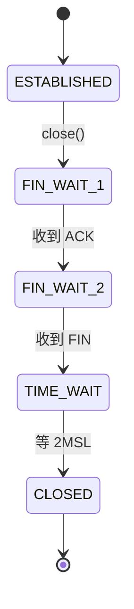

---

## 七、TCP 4 大计时器：超时、坚持、保活、2MSL

### 7.1 4 大计时器总览

| 计时器 | 全称 | 用途 | 默认值 |
|--------|------|------|--------|
| **重传计时器** | Retransmission Timer | 数据包超时未确认则重传 | 动态 RTT 计算 |
| **坚持计时器** | Persistent Timer | 解决零窗口死锁 | 指数退避 |
| **保活计时器** | Keepalive Timer | 检测长时间空闲连接 | 通常 2 小时 |
| **2MSL 计时器** | TIME_WAIT Timer | 等最后一个 ACK 到达 | 60 秒 |

### 7.2 重传计时器：RTT + RTO

**RTT（Round-Trip Time）** = 数据包从发出去到收到 ACK 的时间。

**RTO（Retransmission Timeout）** = 超时重传时间，略大于 RTT。

```c
// RFC 6298 的 RTO 计算
SRTT  = (1 - α) * SRTT + α * RTT      // 平滑 RTT，α = 1/8
RTTVAR = (1 - β) * RTTVAR + β * |SRTT - RTT|   // RTT 方差，β = 1/4
RTO    = SRTT + max(G, K * RTTVAR)     // G = 时钟粒度，K = 4

// 第一次测量
SRTT  = R
RTTVAR = R / 2
RTO    = SRTT + max(G, K * RTTVAR)
```

### 7.3 指数退避与 Karn 算法

**超时重传后**，RTO 翻倍（避免雪崩）：

| 重传次数 | RTO |
|---------|-----|
| 0（首次） | R |
| 1 | 2R |
| 2 | 4R |
| 3 | 8R |
| ... | 最多 64R |

**Karn 算法**：重传的包不参与 RTT 采样（因为无法判断 ACK 是给原始包还是重传包）。

### 7.4 坚持计时器：解决零窗口死锁

**场景**：接收方通告窗口 = 0，发送方停止发送。接收方发了「窗口非零」通告，但该 ACK 丢失。

**死锁**：发送方等窗口通告，接收方等数据。

**坚持计时器**：发送方周期性发 **零窗口探测报文**（1 字节数据），直到收到「窗口非零」通告。

```bash
# 查看坚持计时器的最大重试次数
sysctl net.ipv4.tcp_retries2
# 默认 15（约 13~30 分钟）
```

### 7.5 保活计时器：检测僵尸连接

**用途**：当客户端/服务器长时间不发数据时，发送 **保活探测包**，检测连接是否还活着。

```bash
# 默认 2 小时无活动触发
sysctl net.ipv4.tcp_keepalive_time       # 7200 秒
sysctl net.ipv4.tcp_keepalive_intvl      # 探测间隔 75 秒
sysctl net.ipv4.tcp_keepalive_probes     # 探测次数 9
```

**应用层保活（推荐）**：心跳包比 TCP 保活更可控。

```c
// 启用 TCP 保活
int keepalive = 1;
setsockopt(fd, SOL_SOCKET, SO_KEEPALIVE, &keepalive, sizeof(keepalive));

// Linux 特有：自定义保活参数
int keepidle = 60;      // 空闲 60 秒后开始探测
int keepintvl = 10;     // 每 10 秒探测一次
int keepcnt = 3;        // 探测 3 次失败判定死亡

setsockopt(fd, IPPROTO_TCP, TCP_KEEPIDLE, &keepidle, sizeof(keepidle));
setsockopt(fd, IPPROTO_TCP, TCP_KEEPINTVL, &keepintvl, sizeof(keepintvl));
setsockopt(fd, IPPROTO_TCP, TCP_KEEPCNT, &keepcnt, sizeof(keepcnt));
```

### 7.6 2MSL 计时器详解

**MSL（Maximum Segment Lifetime）**：一个 IP 包在网络中最多存活的时间。**Linux 默认 60 秒**。

```bash
# 查看 MSL（Linux 没有直接暴露 MSL，但 TCP_FIN_TIMEOUT = 2 * MSL）
sysctl net.ipv4.tcp_fin_timeout
# 60
```

**为什么是 2MSL 而不是 MSL？**

- 第 1 个 MSL：等待本连接的最后一个 ACK 到达对方
- 第 2 个 MSL：等待对方可能重传的 FIN 在网络中消失

---

## 八、滑动窗口：流量控制的底层机制

### 8.1 为什么需要滑动窗口？

**没有滑动窗口**时，发送方必须等每个包的 ACK 才能发下一个，**吞吐 = RTT / 包大小**——极低效。

**有滑动窗口**后，发送方可以**连续发多个包**（窗口大小），大幅提升吞吐。

### 8.2 滑动窗口组成


**4 个区域**：

| 区域 | 含义 | 状态 |
|------|------|------|
| **已确认** | 接收方已收到 ACK | 不可重发 |
| **已发送未确认** | 飞行中的包 | 可超时重传 |
| **可发送** | 窗口允许的下一批 | 可立即发送 |
| **不可发送** | 窗口外的数据 | 等待窗口滑动 |

### 8.3 滑动窗口工作过程

```mermaid
sequenceDiagram
    participant S as 👤 发送方
    participant R as 🖥️ 接收方

    Note over S: 窗口左边界=1, 右边界=10
    S->>R: 发送包 1-5（窗口大小 5）
    R->>S: ACK=6, win=5
    Note over S: 窗口左边界=6, 右边界=10
    S->>R: 发送包 6-10
    R->>S: ACK=11, win=5
    Note over S: 窗口左边界=11, 右边界=15
    S->>R: 发送包 11-15

    style S fill:#C7CEEA,stroke:#9FA8DA,color:#333
    style R fill:#E8D5F5,stroke:#CE93D8,color:#333
```

### 8.4 窗口大小的字段

**TCP 头部的 window 字段 = 16 位**，最大 65535 字节 ≈ 64KB。

**RFC 1323 引入窗口缩放**：把 16 位解释为「实际窗口 = 字段值 × 2^缩放因子」，最大可到 1GB。

```bash
# Linux 默认窗口缩放 = 7（实际最大 64KB × 128 = 8MB）
sysctl net.ipv4.tcp_window_scaling
# 1
```

### 8.5 零窗口与窗口探测

**场景**：接收方缓冲区满，发送 `win=0`。

```
发送方                  接收方
  │                       │
  │──数据 100KB──→        │  (接收缓冲区只有 64KB)
  │←──ACK, win=0───────  │
  │                       │
  │  (停止发送)           │
  │                       │  (应用层读走数据)
  │←──ACK, win=100KB───  │  ←── 通告丢失！
  │  (死锁)              │
```

**解决**：发送方启动 **坚持计时器**，周期性发 **1 字节的窗口探测包**，直到收到非零通告。

### 8.6 流量控制 vs 拥塞控制

| 维度 | 流量控制（Flow Control） | 拥塞控制（Congestion Control） |
|------|------------------------|------------------------------|
| **目标** | 防止发送方压垮接收方 | 防止发送方压垮网络 |
| **机制** | 滑动窗口（接收方通告） | 拥塞窗口（发送方推测） |
| **字段** | TCP window 字段 | cwnd（发送方内部变量） |
| **触发** | 接收方缓冲区变化 | 网络丢包/延时 |

---

## 九、拥塞控制 4 算法：从慢启动到快恢复

### 9.1 4 个核心算法

| 算法 | 全称 | 阶段 | 关键公式 |
|------|------|------|---------|
| **慢启动** | Slow Start | 连接建立初期 | cwnd 每 RTT 翻倍 |
| **拥塞避免** | Congestion Avoidance | cwnd 超过阈值 | cwnd 每 RTT +1 MSS |
| **快重传** | Fast Retransmit | 收到 3 个重复 ACK | 不等超时立即重传 |
| **快恢复** | Fast Recovery | 快重传后 | cwnd 减半，不回到 1 |

### 9.2 慢启动过程

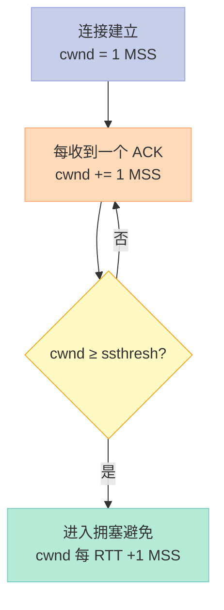

**慢启动 cwnd 增长曲线**（指数）：

```
cwnd
  │
64│                              ╱
  │                            ╱
32│                          ╱
  │                        ╱
16│                      ╱
  │                    ╱
 8│                 ╱
  │              ╱
 4│           ╱
  │        ╱
 2│     ╱
  │  ╱
 1│╱
  └────────────────────────────────→ RTT
    1  2  3  4  5  6  7  8
```

### 9.3 拥塞避免曲线（线性）

```
cwnd
  │
  │                              ╱── (慢启动)
64│                            ╱     拥塞避免（线性 +1）
  │                          ╱     ╱
  │                        ╱     ╱
  │                      ╱     ╱
32│────────────────────╱─────╱
  │                  ssthresh
  │                  ╱
  │                ╱
  │              ╱
  │            ╱
  │          ╱
  └────────────────────────────────→ RTT
    1  2  3  4  5  6  7  8  9  10
```

### 9.4 快重传与快恢复

```mermaid
sequenceDiagram
    participant S as 👤 发送方
    participant R as 🖥️ 接收方

    S->>R: 包 1
    R->>S: ACK 2
    S->>R: 包 2
    R->>S: ACK 2 (重复)
    S->>R: 包 3
    R->>S: ACK 2 (重复)
    S->>R: 包 4
    R->>S: ACK 2 (重复)
    Note over S: 收到 3 个重复 ACK
    Note over S: 快重传：立即重传包 2
    S->>R: 包 2 (重传)
    R->>S: ACK 5
    Note over S: 快恢复：cwnd = ssthresh，不回到 1

    style S fill:#C7CEEA,stroke:#9FA8DA,color:#333
    style R fill:#E8D5F5,stroke:#CE93D8,color:#333
```

### 9.5 拥塞控制状态机

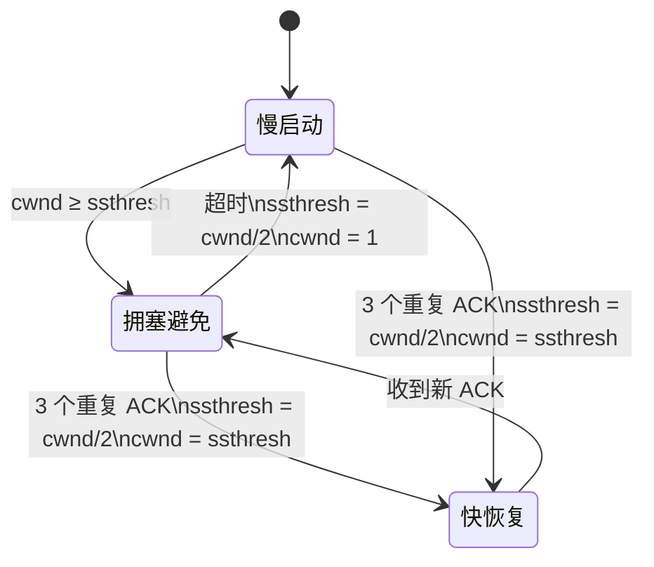

### 9.6 拥塞窗口 vs 滑动窗口

**发送方实际窗口 = min(cwnd, rwnd)**

| 变量 | 来源 | 含义 |
|------|------|------|
| cwnd | 发送方推测 | 网络能承受 |
| rwnd | 接收方通告 | 接收方能处理 |
| 实际窗口 | 取较小 | 双重保护 |

### 9.7 现代拥塞控制算法

| 算法 | 特点 | 适用 |
|------|------|------|
| **Cubic** | Linux 默认 | 长肥管道 |
| **BBR** | Google，瓶颈带宽+延时 | 高带宽长距离 |
| **BBR v2** | 更公平 | 数据中心 |
| **DCTCP** | 数据中心低延时 | 内部网络 |
| **Vegas** | 延时-based | 早期算法 |

```bash
# Linux 可用的拥塞控制算法
sysctl net.ipv4.tcp_available_congestion_control
# reno cubic bbr

# 切换到 BBR
sysctl -w net.ipv4.tcp_congestion_control=bbr
```

---

## 十、Nagle 算法、延迟确认、Cork 与粘包

### 10.1 Nagle 算法：解决「小包泛滥」

**问题**：应用层每次 `write(1, "a")`、`write(1, "b")`，内核会发两个 TCP 包（40 字节头 + 1 字节数据），网络利用率极低。

**Nagle 算法（1984）**：
- 第一个小包立即发
- 后续小包等 ACK 来再发，或者攒够 MSS 再发

```c
// 关闭 Nagle（适用于实时游戏）
int nodelay = 1;
setsockopt(fd, IPPROTO_TCP, TCP_NODELAY, &nodelay, sizeof(nodelay));

// 等价宏
// setsockopt(fd, IPPROTO_TCP, TCP_NODELAY, "1", 1);
```

### 10.2 延迟确认（Delayed ACK）

**问题**：每收到一个包就回 ACK，开销大。

**延迟确认策略**：
- 等 40~200ms，看是否有数据要回，**捎带 ACK**
- 没有数据则单独发 ACK

### 10.3 Nagle + 延迟确认 = 死锁

**经典死锁场景**（客户端发小包 + 服务端用 read()）：

```
客户端                        服务端
  │                            │
  │──小包 1（被 Nagle 缓存）→  │
  │                            │  (收到包 1)
  │                            │  (延迟 ACK 等待数据)
  │──小包 2（继续缓存）→      │
  │                            │
  │  (Nagle 等待 ACK)          │  (延迟 ACK 等待数据)
  │  (死锁！)                  │
```

**解决**：禁用 Nagle **或** 用 `writev()` 一次性写。

### 10.4 TCP_CORK 算法

**TCP_CORK**（Linux 特有）：把多个小包**完全攒够**再发，类似 Nagle 但更激进。

```c
// TCP_CORK 示例
int cork = 1;
setsockopt(fd, IPPROTO_TCP, TCP_CORK, &cork, sizeof(cork));

// 写多个小包（不会立即发送）
write(fd, "header: ", 8);
write(fd, "body1 ", 6);
write(fd, "body2", 5);

// 取消 cork，立即发送
cork = 0;
setsockopt(fd, IPPROTO_TCP, TCP_CORK, &cork, sizeof(cork));
```

**对比 Nagle**：

| 维度 | Nagle | TCP_CORK |
|------|-------|----------|
| 触发时机 | ACK 来或 MSS 满 | 显式取消 cork |
| 实时性 | 中 | 差 |
| 适用 | 交互式 | HTTP 响应头+body |
| 标准 | RFC 896 | Linux 特有 |

### 10.5 粘包问题：TCP 的根本特性

**粘包本质**：TCP 是 **字节流协议**，**没有消息边界**。接收方 `read(1024)` 可能读到 N 个发送方 `write()` 的内容。

```c
// 客户端
write(fd, "hello", 5);   // 发包 1
write(fd, "world", 5);   // 发包 2

// 服务端
read(fd, buf, 1024);    // 可能一次读到 "helloworld"（粘包）
// 也可能分两次读："hello" 和 "world"
```

### 10.6 4 种粘包解决方案

#### 方案 1：固定长度

```c
// 每个消息固定 32 字节
char buf[32];
while (true) {
    recv_full(fd, buf, 32);   // 阻塞直到读够 32 字节
    process(buf);
}
```

#### 方案 2：分隔符

```c
// 用 \n 分隔消息
char buf[1024];
size_t n = read(fd, buf, sizeof(buf));
// 用 strchr 找 \n，逐行处理
```

#### 方案 3：长度前缀（推荐）

```cpp
// 协议格式：[4 字节长度 N][N 字节数据]
struct Message {
    uint32_t length;       // 网络字节序
    char     data[];
};

// 发送
uint32_t len = htonl(msg.size());
write(fd, &len, 4);
write(fd, msg.data(), msg.size());

// 接收（半包处理）
uint32_t len;
read_full(fd, &len, 4);   // 先读长度
len = ntohl(len);
std::vector<char> body(len);
read_full(fd, body.data(), len);
```

#### 方案 4：TLV（Type-Length-Value）

```cpp
// TLV 格式（最灵活）
struct TLV {
    uint16_t type;         // 消息类型
    uint16_t length;       // 数据长度
    char     value[];      // 数据
};

// 解析
auto* tlv = (TLV*)buf;
switch (ntohs(tlv->type)) {
    case MSG_LOGIN: handle_login(tlv->value, ntohs(tlv->length)); break;
    case MSG_CHAT:  handle_chat(tlv->value, ntohs(tlv->length));  break;
}
```

### 10.7 方案对比表

| 方案 | 优点 | 缺点 | 适用场景 |
|------|------|------|---------|
| 固定长度 | 简单 | 浪费带宽 | 固定消息 |
| 分隔符 | 易读 | 内容不能含分隔符 | 文本协议 |
| 长度前缀 | 灵活高效 | 需要解析 | **通用推荐** |
| TLV | 扩展性强 | 复杂度高 | 复杂协议 |

---

## 十一、UDP：被低估的高效协议

### 11.1 UDP vs TCP 核心差异

| 维度 | TCP | UDP |
|------|-----|-----|
| 连接性 | 面向连接 | 无连接 |
| 可靠性 | 可靠（重传、排序、去重） | 不可靠 |
| 流量控制 | ✅ 滑动窗口 | ❌ 无 |
| 拥塞控制 | ✅ 4 算法 | ❌ 无 |
| 头部大小 | 20 字节 | **8 字节** |
| 传输效率 | 低（协议开销大） | 高 |
| 适用场景 | 文件、邮件、HTTP | DNS、视频、游戏 |

### 11.2 UDP 头部极简

```c
// UDP 头部（仅 8 字节！）
struct UDPHeader {
    uint16_t src_port;     // 源端口（2 字节）
    uint16_t dst_port;     // 目的端口（2 字节）
    uint16_t length;       // UDP 长度（头部+数据，2 字节）
    uint16_t checksum;     // 校验和（2 字节，可选）
};
```

**对比 TCP 的 20 字节**：UDP 头部只有 8 字节，每包节省 12 字节。

### 11.3 UDP 单包最大数据量

**理论最大值 = 65535 字节**（UDP 长度字段 16 位）。

**实际最大值 = MTU - IP 头 - UDP 头 = 1500 - 20 - 8 = 1472 字节**（以太网）。

```bash
# 查看 MTU
ip link show eth0 | grep mtu
# MTU 1500

# 查看本机到目标的最大包大小
tracepath 8.8.8.8
```

### 11.4 UDP 适用场景（四大金刚）

| 场景 | 协议 | 为什么用 UDP |
|------|------|-------------|
| **DNS 查询** | DNS | 包小、要求快、重传交给应用层 |
| **视频直播** | RTMP/HLS/WebRTC | 丢一帧没关系，重传反而卡 |
| **语音通话** | WebRTC/SIP | 同上，实时性 > 完整性 |
| **多人游戏** | 游戏协议 | 同上，且要高频同步位置 |

### 11.5 UDP 也可以可靠：QUIC 的启示

**UDP 本质不可靠，但可以在应用层做可靠传输**。QUIC 就是这个思路：

```
┌────────────────────────────────┐
│ 应用层（HTTP/3）               │
├────────────────────────────────┤
│ QUIC 层（可靠性 + 多路复用 + TLS）│  ← 自己实现
├────────────────────────────────┤
│ UDP（不可靠传输）               │  ← 利用 UDP 的简单
├────────────────────────────────┤
│ IP                              │
└────────────────────────────────┘
```

**QUIC 的优势**：

| 维度 | TCP + TLS | QUIC |
|------|-----------|------|
| 握手次数 | 3 次 TCP + 2 次 TLS = 5 RTT | 1 RTT（0-RTT 优化） |
| 队头阻塞 | 严格（丢包卡全部） | 流独立（多路复用无阻塞） |
| 连接迁移 | 换 IP 断开 | 64 位连接 ID，无缝迁移 |
| 加密 | TLS 在 TCP 之上（可被中间盒篡改） | TLS 内嵌，**加密不可降级** |

### 11.6 UDP 实战：最简单的 DNS 查询

```cpp
// 用 UDP 发送 DNS 查询（简化版）
#include <sys/socket.h>
#include <netinet/in.h>
#include <arpa/inet.h>

int sock = socket(AF_INET, SOCK_DGRAM, 0);
sockaddr_in dns_server{};
dns_server.sin_family = AF_INET;
dns_server.sin_port = htons(53);
inet_pton(AF_INET, "8.8.8.8", &dns_server.sin_addr);

// DNS 查询包（手工构造）
unsigned char query[] = {
    0x12, 0x34,             // 事务 ID
    0x01, 0x00,             // 标准查询
    0x00, 0x01,             // 1 个问题
    0x00, 0x00, 0x00, 0x00, 0x00, 0x00,  // 回答/权威/附加 = 0
    // 查询域名 "example.com"
    0x07, 'e','x','a','m','p','l','e',
    0x03, 'c','o','m', 0x00,
    0x00, 0x01,             // 类型 A
    0x00, 0x01              // 类 IN
};

sendto(sock, query, sizeof(query), 0,
       (sockaddr*)&dns_server, sizeof(dns_server));

char buf[512];
socklen_t len = sizeof(dns_server);
int n = recvfrom(sock, buf, sizeof(buf), 0,
                 (sockaddr*)&dns_server, &len);
// 解析 buf...
```

---

## 十二、HTTP 演进史：从 HTTP/0.9 到 HTTP/3

### 12.1 4 个版本的演进时间线

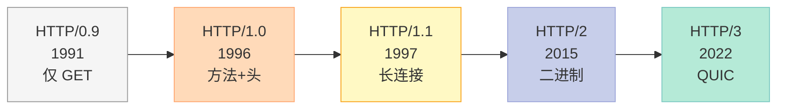

### 12.2 HTTP 状态码完整表

| 类别 | 范围 | 含义 | 常用状态码 |
|------|------|------|-----------|
| **1xx** | 100~199 | 信息响应 | 100 Continue、101 Switching Protocols |
| **2xx** | 200~299 | 成功 | 200 OK、201 Created、204 No Content |
| **3xx** | 300~399 | 重定向 | 301 Moved Permanently、302 Found、304 Not Modified |
| **4xx** | 400~499 | 客户端错误 | 400 Bad Request、401 Unauthorized、403 Forbidden、404 Not Found |
| **5xx** | 500~599 | 服务端错误 | 500 Internal Server Error、502 Bad Gateway、503 Service Unavailable |

### 12.3 HTTP 常用方法

| 方法 | 含义 | 幂等 | 安全 | 用途 |
|------|------|------|------|------|
| **GET** | 获取资源 | ✅ | ✅ | 读数据 |
| **POST** | 创建资源 | ❌ | ❌ | 提交表单 |
| **PUT** | 替换资源 | ✅ | ❌ | 全量更新 |
| **DELETE** | 删除资源 | ✅ | ❌ | 删数据 |
| **HEAD** | 仅返回头 | ✅ | ✅ | 检查资源 |
| **OPTIONS** | 查询支持方法 | ✅ | ✅ | CORS 预检 |
| **PATCH** | 部分更新 | ❌ | ❌ | 局部修改 |
| **TRACE** | 回显请求 | ✅ | ✅ | 调试（一般禁用） |
| **CONNECT** | 建立隧道 | ✅ | ❌ | HTTPS 代理 |

### 12.4 HTTP 头部分类

| 类别 | 作用 | 例子 |
|------|------|------|
| **通用头** | 请求/响应都有 | `Date`、`Cache-Control`、`Connection` |
| **请求头** | 仅请求 | `Host`、`User-Agent`、`Accept`、`Cookie` |
| **响应头** | 仅响应 | `Server`、`Set-Cookie`、`Content-Type` |
| **实体头** | 描述 body | `Content-Length`、`Content-Encoding`、`Last-Modified` |

### 12.5 HTTP/1.0 vs HTTP/1.1 核心差异

| 维度 | HTTP/1.0 | HTTP/1.1 |
|------|----------|----------|
| 连接 | 短连接（默认关闭） | **长连接（keep-alive）** |
| Host 头 | ❌ 无 | ✅ 必需（支持虚拟主机） |
| 范围请求 | ❌ | ✅ Range/Accept-Ranges |
| 缓存 | 弱（Expires） | 强（ETag、If-None-Match） |
| 编码 | ❌ | ✅ Transfer-Encoding: chunked |
| 方法 | GET/POST/HEAD | + PUT/DELETE/OPTIONS |

### 12.6 HTTP/1.1 的痛点：队头阻塞

**HTTP/1.1 复用 TCP 连接**，但**响应必须按序返回**——如果第 1 个响应慢，后面都被阻塞。

```
请求 1: ────────→ 响应 1: 慢 ←──────
请求 2: ────────→ 响应 2: 等 1 返回 ←── 队头阻塞！
请求 3: ────────→ 响应 3: 等 2 返回 ←──
```

### 12.7 HTTP/2：二进制分帧 + 多路复用

**核心改动**：把 HTTP 消息切成 **帧**，每个帧有 9 字节固定头部。

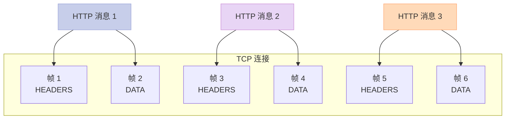

### 12.8 HTTP/2 帧格式（9 字节）

```c
// HTTP/2 帧头（固定 9 字节）
struct HTTP2FrameHeader {
    uint32_t length:24;     // 帧负载长度（24 位）
    uint8_t  type;          // 帧类型（4 位）
    uint8_t  flags;         // 标志位（8 位）
    uint32_t stream_id:31;  // 流标识（31 位）
    // 实际还有 1 位 R 保留位
};
```

**帧类型表**：

| 类型 | 名称 | 用途 |
|------|------|------|
| 0x0 | DATA | 传输数据 |
| 0x1 | HEADERS | 传输头部 |
| 0x2 | PRIORITY | 优先级 |
| 0x3 | RST_STREAM | 关闭流 |
| 0x4 | SETTINGS | 连接配置 |
| 0x5 | PUSH_PROMISE | 服务器推送 |
| 0x6 | PING | 心跳 |
| 0x7 | GOAWAY | 关闭连接 |
| 0x8 | WINDOW_UPDATE | 流量控制 |
| 0x9 | CONTINUATION | 续传头部 |

### 12.9 HTTP/2 多路复用 vs HTTP/1.1 长连接

| 维度 | HTTP/1.1 长连接 | HTTP/2 多路复用 |
|------|----------------|----------------|
| 并发请求 | ❌ 串行 | ✅ 真正并行 |
| 队头阻塞 | 严重 | 解决应用层阻塞 |
| 头部压缩 | ❌ | ✅ HPACK |
| 服务器推送 | ❌ | ✅ |
| 二进制 | ❌ 文本 | ✅ 二进制帧 |

### 12.10 HTTP/2 头部压缩：HPACK

**HPACK** 是 HTTP/2 专门设计的头部压缩算法，不是 gzip：

| 维度 | HPACK | gzip |
|------|-------|------|
| 压缩目标 | HTTP 头部键值 | 任意数据 |
| 算法 | 静态表 + 动态表 + Huffman | DEFLATE |
| 压缩比 | 30~50% | 70~90% |
| 安全性 | 0 CRIME 攻击 | 易受 CRIME 攻击 |

### 12.11 HTTP/3：基于 QUIC

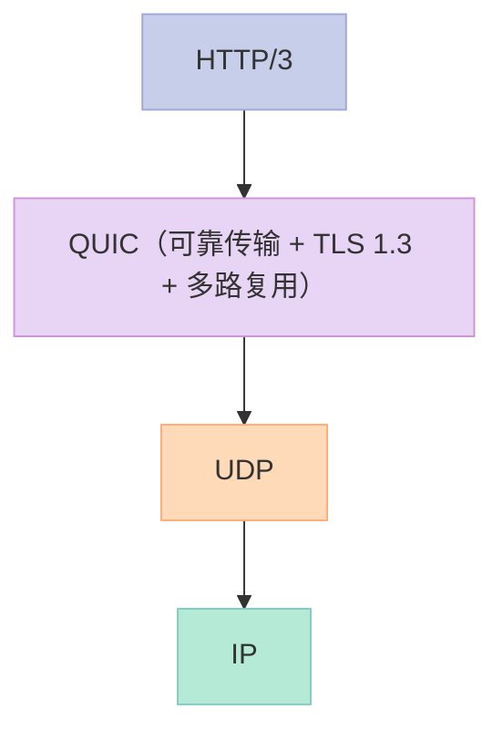

**HTTP/3 的核心优势**：

| 优势 | 解释 |
|------|------|
| **0-RTT 握手** | 首次连接 1 RTT，复用 0 RTT |
| **无队头阻塞** | QUIC 流独立，丢一个流不影响其他 |
| **连接迁移** | 4G 切 Wi-Fi 不掉线（连接 ID） |
| **加密默认** | QUIC 强制 TLS 1.3 |
| **前向纠错** | 部分丢包可恢复，无需重传 |

### 12.12 4 版本性能对比

| 版本 | 典型页面加载（100 资源） | 握手 RTT |
|------|------------------------|---------|
| HTTP/1.1（6 连接） | ~5.0s | 3（TCP）+ 2~4（TLS） |
| HTTP/1.1（多域名分片） | ~3.5s | 同上 |
| HTTP/2 | ~2.0s | 同上 |
| HTTP/3 | ~1.2s | 1（QUIC 含 TLS） |

---

## 十三、HTTPS 握手：TLS 1.2 vs TLS 1.3

### 13.1 TLS 1.2 握手（4 RTT）

```mermaid
sequenceDiagram
    participant C as 👤 客户端
    participant S as 🖥️ 服务器

    C->>S: ① ClientHello<br/>TLS 版本 + 密码套件 + 随机数
    S->>C: ② ServerHello<br/>确认密码套件 + 随机数<br/>+ 证书
    C->>S: ③ ClientKeyExchange<br/>用服务器公钥加密 Pre-Master Secret
    Note over C,S: 双方用 Pre-Master 派生主密钥
    C->>S: ④ ChangeCipherSpec + Finished
    S->>C: ⑤ ChangeCipherSpec + Finished
    Note over C,S: 加密通信开始

    style C fill:#C7CEEA,stroke:#9FA8DA,color:#333
    style S fill:#E8D5F5,stroke:#CE93D8,color:#333
```

### 13.2 TLS 1.3 握手（1 RTT）

```mermaid
sequenceDiagram
    participant C as 👤 客户端
    participant S as 🖥️ 服务器

    C->>S: ① ClientHello<br/>+ KeyShare（猜测密钥）
    S->>C: ② ServerHello<br/>+ KeyShare（确认密钥）<br/>+ 证书 + Finished
    Note over C,S: 双方立即可以加密通信
    C->>S: ③ Finished

    style C fill:#C7CEEA,stroke:#9FA8DA,color:#333
    style S fill:#E8D5F5,stroke:#CE93D8,color:#333
```

### 13.3 TLS 1.2 vs TLS 1.3 对比

| 维度 | TLS 1.2 | TLS 1.3 |
|------|---------|---------|
| 握手 RTT | 4（甚至更多） | **1** |
| 密码套件 | 大量（部分已不安全） | 精简（5 种 AEAD） |
| 0-RTT | ❌ | ✅（有重放风险） |
| 前向保密 | 可选 | ✅ 强制 |
| 已废弃算法 | RC4、MD5、SHA-1、3DES | 全部移除 |
| 加密范围 | 仅应用数据 | **全部握手** |

### 13.4 HTTPS 性能开销

**HTTPS 比 HTTP 多 3 个 RTT**：

```
TCP 握手:    3 次握手  → 1.5 RTT
TLS 握手:    TLS 1.2: 2 RTT；TLS 1.3: 1 RTT
HTTP 请求:   1 RTT
─────────────────────────
总 RTT:      HTTP 1.5 RTT
             HTTPS (TLS 1.2): 3.5 RTT
             HTTPS (TLS 1.3): 2.5 RTT
```

**优化手段**：

| 优化 | 效果 |
|------|------|
| TLS 1.3 | 节省 1 RTT |
| Session Resumption | 节省握手 RTT |
| False Start（TLS 1.2） | 节省 1 RTT |
| OCSP Stapling | 节省证书验证时间 |
| TLS False Start | 客户端先发数据 |

### 13.5 证书链与验证

```bash
# 查看证书链
openssl s_client -connect example.com:443 -showcerts

# 输出：
# CONNECTED(00000003)
# ---
# Certificate chain
#  0 s:CN = example.com
#    i:CN = Let's Encrypt R3
#  1 s:CN = Let's Encrypt R3
#    i:CN = ISRG Root X1
#  2 s:CN = ISRG Root X1
#    i:CN = DST Root CA X3
```

**证书层级**：

```
根 CA (ISRG Root X1)
    │
    ├── 中间 CA (Let's Encrypt R3)
    │       │
    │       └── 叶子证书 (example.com)
    │
    └── 其他中间 CA
```

### 13.6 HTTPS 实战：curl 抓取

```bash
# 查看 HTTPS 握手详情
curl -v https://example.com

# 输出：
# * TCP_NODELAY set
# * Connected to example.com (93.184.216.34) port 443 (#0)
# * ALPN, offering h2
# * ALPN, offering http/1.1
# * successfully set certificate verify locations:
# *   CAfile: /etc/ssl/certs/ca-certificates.crt
# * TLSv1.3 (OUT), TLS handshake, Client hello (1):
# * TLSv1.3 (IN), TLS handshake, Server hello (2):
# * TLSv1.3 (IN), TLS handshake, Encrypted Extensions (8):
# * TLSv1.3 (IN), TLS handshake, Certificate (11):
# * TLSv1.3 (IN), TLS handshake, CERT verify (OK)
# * TLSv1.3 (IN), TLS handshake, Finished (20):
# * TLSv1.3 (OUT), TLS change cipher, Change cipher spec (1):
# * TLSv1.3 (OUT), TLS handshake, Finished (20):
# * SSL connection using TLS_AES_256_GCM_SHA384
```

---

## 十四、DNS 原理：从域名到 IP 的完整链路

### 14.1 DNS 解析流程

```mermaid
sequenceDiagram
    participant App as 📱 应用
    participant OS as 💻 操作系统
    participant Local as 🏠 本地 DNS
    participant Root as 🌍 根 DNS
    participant TLD as 🔝 .com DNS
    participant Auth as ✅ 权威 DNS

    App->>OS: gethostbyname("www.example.com")
    OS->>OS: 检查 hosts 文件
    alt 命中 hosts
        OS-->>App: 直接返回 IP
    else 未命中
        OS->>Local: 递归查询
        Local->>Root: 查询 .com NS
        Root-->>Local: 返回 .com TLD 服务器
        Local->>TLD: 查询 example.com NS
        TLD-->>Local: 返回 example.com 权威服务器
        Local->>Auth: 查询 www.example.com A 记录
        Auth-->>Local: 返回 IP (93.184.216.34)
        Local-->>OS: 返回 IP + 缓存
        OS-->>App: 返回 IP
    end

    style App fill:#C7CEEA,stroke:#9FA8DA,color:#333
    style OS fill:#E8D5F5,stroke:#CE93D8,color:#333
    style Local fill:#FFDAB9,stroke:#FFAB76,color:#333
    style Root fill:#FFB3C6,stroke:#F48FB1,color:#333
    style TLD fill:#B5EAD7,stroke:#80CBC4,color:#333
    style Auth fill:#FFF9C4,stroke:#F9A825,color:#333
```

### 14.2 递归查询 vs 迭代查询

| 查询类型 | 谁去查？ | 适用 |
|---------|---------|------|
| **递归查询** | DNS 服务器代为查询到底 | 客户端 → 本地 DNS |
| **迭代查询** | 返回「你去问下一个」 | DNS 服务器之间 |

### 14.3 DNS 记录类型

| 类型 | 含义 | 示例 |
|------|------|------|
| **A** | 域名 → IPv4 | `example.com → 93.184.216.34` |
| **AAAA** | 域名 → IPv6 | `example.com → 2606:2800:220:1::1` |
| **CNAME** | 别名指向 | `www → example.com` |
| **MX** | 邮件服务器 | `example.com → mail.example.com` |
| **NS** | 域名服务器 | `example.com → ns1.example.com` |
| **TXT** | 文本记录 | SPF、DKIM、域名验证 |
| **PTR** | IP → 域名（反向） | `34.216.184.93 → example.com` |
| **SRV** | 服务定位 | SIP、XMPP |

### 14.4 DNS 报文格式

```c
// DNS 报文头（12 字节）
struct DNSHeader {
    uint16_t id;          // 事务 ID
    uint16_t flags;       // 标志（QR/Opcode/AA/TC/RD/RA/Z/RCODE）
    uint16_t qdcount;     // 问题数
    uint16_t ancount;     // 回答数
    uint16_t nscount;     // 权威记录数
    uint16_t arcount;     // 附加记录数
};

// DNS 问题段
struct DNSQuestion {
    // QNAME（变长）：域名（label 长度 + 内容）
    uint16_t qtype;       // 查询类型（A=1, AAAA=28）
    uint16_t qclass;      // 查询类（IN=1）
};

// DNS 回答段
struct DNSAnswer {
    // NAME（压缩指针或域名）
    uint16_t type;        // 记录类型
    uint16_t class;       // 类
    uint32_t ttl;         // 缓存时间（秒）
    uint16_t rdlength;    // 数据长度
    // RDATA（变长）：资源数据
};
```

### 14.5 TTL 与缓存

```bash
# 查看 DNS TTL
dig example.com +ttlid

# 输出：
# example.com.    3600    IN    A    93.184.216.34

# TTL=3600 秒 = 1 小时
```

**缓存层级**：

| 缓存位置 | TTL 默认 | 作用 |
|---------|---------|------|
| 浏览器 | 60s | 减少 DNS 请求 |
| 操作系统 | 取决于 resolv.conf | 系统级缓存 |
| ISP DNS | 取决于记录 | 局域网缓存 |
| 权威 DNS | 不缓存 | 最终来源 |

### 14.6 DNS 故障排查命令

```bash
# 基础查询
nslookup example.com
dig example.com
host example.com

# 指定 DNS 服务器
dig @8.8.8.8 example.com

# 完整追踪
dig +trace example.com

# 反向 DNS
dig -x 8.8.8.8

# DNS 性能测试
dnsperf https://dns.google/dns-query
```

### 14.7 DNS 安全：DNSSEC 与 DoH

| 方案 | 全称 | 作用 |
|------|------|------|
| **DNSSEC** | DNS Security Extensions | 数字签名防篡改 |
| **DoH** | DNS over HTTPS | 加密 DNS 查询 |
| **DoT** | DNS over TLS | TLS 加密 DNS |
| **DoQ** | DNS over QUIC | QUIC 加密 DNS |

```bash
# DoH 查询（curl）
curl -H "accept: application/dns-json" \
     "https://1.1.1.1/dns-query?name=example.com&type=A"

# 输出：
# {"Status":0,"Answer":[{"name":"example.com","type":1,"TTL":3600,"data":"93.184.216.34"}]}
```

---

## 十五、实战 1：raw socket 实现 TCP 客户端

### 15.1 完整代码示例

```c
// raw_socket_client.c
// 用原始 socket 手动构造 TCP SYN 握手
// 仅 Linux root 权限可用
#include <stdio.h>
#include <stdlib.h>
#include <string.h>
#include <unistd.h>
#include <sys/socket.h>
#include <netinet/in.h>
#include <netinet/ip.h>
#include <netinet/tcp.h>
#include <arpa/inet.h>

// TCP 伪校验和
unsigned short checksum(void* data, int len) {
    unsigned short* p = (unsigned short*)data;
    unsigned int sum = 0;
    while (len > 1) {
        sum += *p++;
        len -= 2;
    }
    if (len == 1) sum += *(unsigned char*)p;
    while (sum >> 16) sum = (sum & 0xFFFF) + (sum >> 16);
    return ~sum;
}

// TCP 伪头部（用于校验和）
struct pseudo_header {
    uint32_t src_addr;
    uint32_t dst_addr;
    uint8_t  zero;
    uint8_t  protocol;
    uint16_t tcp_length;
};

// 构造 TCP 包
int send_tcp_packet(int sock, uint32_t src_ip, uint16_t src_port,
                    uint32_t dst_ip, uint16_t dst_port,
                    uint32_t seq, uint32_t ack, uint8_t flags) {
    char packet[sizeof(struct iphdr) + sizeof(struct tcphdr)];
    struct iphdr* ip = (struct iphdr*)packet;
    struct tcphdr* tcp = (struct tcphdr*)(packet + sizeof(struct iphdr));

    // IP 头部
    ip->ihl = 5;
    ip->version = 4;
    ip->tos = 0;
    ip->tot_len = htons(sizeof(packet));
    ip->id = htons(12345);
    ip->frag_off = 0;
    ip->ttl = 64;
    ip->protocol = IPPROTO_TCP;
    ip->saddr = src_ip;
    ip->daddr = dst_ip;
    ip->check = 0;

    // TCP 头部
    tcp->source = htons(src_port);
    tcp->dest = htons(dst_port);
    tcp->seq = htonl(seq);
    tcp->ack_seq = htonl(ack);
    tcp->doff = 5;
    tcp->syn = (flags & 0x02) >> 1;
    tcp->ack = (flags & 0x10) >> 4;
    tcp->fin = (flags & 0x01);
    tcp->window = htons(65535);
    tcp->check = 0;
    tcp->urg_ptr = 0;

    // 计算 TCP 校验和
    struct pseudo_header ph;
    ph.src_addr = src_ip;
    ph.dst_addr = dst_ip;
    ph.zero = 0;
    ph.protocol = IPPROTO_TCP;
    ph.tcp_length = htons(sizeof(struct tcphdr));

    char tcp_check_buf[sizeof(ph) + sizeof(struct tcphdr)];
    memcpy(tcp_check_buf, &ph, sizeof(ph));
    memcpy(tcp_check_buf + sizeof(ph), tcp, sizeof(struct tcphdr));
    tcp->check = checksum(tcp_check_buf, sizeof(tcp_check_buf));

    // 计算 IP 校验和
    ip->check = checksum(ip, sizeof(struct iphdr));

    // 构造目标地址
    struct sockaddr_in sin;
    sin.sin_family = AF_INET;
    sin.sin_port = htons(dst_port);
    sin.sin_addr.s_addr = dst_ip;

    return sendto(sock, packet, sizeof(packet), 0,
                  (struct sockaddr*)&sin, sizeof(sin));
}

int main() {
    // 创建 raw socket（需要 root）
    int sock = socket(AF_INET, SOCK_RAW, IPPROTO_RAW);
    if (sock < 0) {
        perror("socket");
        return 1;
    }

    // 启用 IP_HDRINCL（自己构造 IP 头）
    int one = 1;
    setsockopt(sock, IPPROTO_IP, IP_HDRINCL, &one, sizeof(one));

    // 发送 SYN
    uint32_t src_ip = inet_addr("192.168.1.100");
    uint32_t dst_ip = inet_addr("192.168.1.1");
    send_tcp_packet(sock, src_ip, 12345, dst_ip, 80, 1000, 0, 0x02);
    printf("SYN sent\n");

    close(sock);
    return 0;
}
```

### 15.2 编译与运行

```bash
# 编译（需要 root 权限）
gcc -o raw_socket_client raw_socket_client.c
sudo ./raw_socket_client

# 抓包观察（另一个终端）
sudo tcpdump -i any -nn -X host 192.168.1.1
```

### 15.3 普通 socket 实现 TCP 客户端

```cpp
// tcp_client.cpp（标准 BSD socket）
#include <iostream>
#include <sys/socket.h>
#include <netinet/in.h>
#include <arpa/inet.h>
#include <unistd.h>
#include <string.h>

int main() {
    // 1. 创建 socket
    int sock = socket(AF_INET, SOCK_STREAM, 0);
    if (sock < 0) { perror("socket"); return 1; }

    // 2. 设置目标地址
    sockaddr_in server{};
    server.sin_family = AF_INET;
    server.sin_port = htons(80);
    inet_pton(AF_INET, "93.184.216.34", &server.sin_addr);

    // 3. 连接（三次握手在此完成）
    if (connect(sock, (sockaddr*)&server, sizeof(server)) < 0) {
        perror("connect");
        return 1;
    }
    std::cout << "Connected!" << std::endl;

    // 4. 发送 HTTP 请求
    const char* req = "GET / HTTP/1.1\r\n"
                      "Host: example.com\r\n"
                      "Connection: close\r\n"
                      "\r\n";
    write(sock, req, strlen(req));

    // 5. 读取响应
    char buf[4096];
    ssize_t n;
    while ((n = read(sock, buf, sizeof(buf))) > 0) {
        write(STDOUT_FILENO, buf, n);
    }

    // 6. 关闭连接（四次挥手）
    close(sock);
    return 0;
}
```

---

## 十六、实战 2：tcpdump 抓包分析

### 16.1 tcpdump 基础命令

```bash
# 抓所有包
sudo tcpdump -i any

# 指定网卡
sudo tcpdump -i eth0

# 指定主机
sudo tcpdump host 192.168.1.100

# 指定端口
sudo tcpdump port 80

# 显示十六进制
sudo tcpdump -X

# 不解析主机名（更快）
sudo tcpdump -nn

# 显示绝对序列号（更清晰）
sudo tcpdump -S

# 保存到文件
sudo tcpdump -w capture.pcap

# 读取文件
tcpdump -r capture.pcap

# 显示详细信息
sudo tcpdump -vvv
```

### 16.2 三次握手抓包示例

```bash
# 启动抓包
sudo tcpdump -i any -nn -S port 80 -w tcp_handshake.pcap

# 在另一个终端发起连接
curl http://example.com

# 抓包结果分析
tcpdump -r tcp_handshake.pcap -nn -S

# 输出：
# 12:00:01.123 IP 192.168.1.100.54321 > 93.184.216.34.80: Flags [S], seq 1000000000, win 29200, length 0
# 12:00:01.456 IP 93.184.216.34.80 > 192.168.1.100.54321: Flags [S.], seq 2000000000, ack 1000000001, win 28960, length 0
# 12:00:01.457 IP 192.168.1.100.54321 > 93.184.216.34.80: Flags [.], ack 2000000001, win 29696, length 0
# 12:00:01.458 IP 192.168.1.100.54321 > 93.184.216.34.80: Flags [P.], seq 1000000001:1000000200, ack 2000000001, win 29696, length 199
```

### 16.3 Flags 标志位详解

| Flags | 含义 | 报文 |
|-------|------|------|
| `[S]` | SYN | 第 1 次握手 |
| `[S.]` | SYN+ACK | 第 2 次握手 |
| `[.]` | ACK | 第 3 次握手或纯 ACK |
| `[P]` | PSH | 带数据 |
| `[F]` | FIN | 关闭 |
| `[R]` | RST | 重置 |
| `[F.]` | FIN+ACK | 关闭 + 确认 |
| `[P.]` | PSH+ACK | 带数据 |

### 16.4 HTTP 请求抓包

```bash
# 抓 HTTP GET 请求
sudo tcpdump -i any -nn -X port 80 and host example.com

# 典型输出：
# 12:00:01 IP 192.168.1.100.54321 > 93.184.216.34.80: Flags [P.], ...
#   0x0000:  4500 0144 3039 4000 4006 ...
#   0x0010:  c0a8 0164 5da1 0818 ...
#   ...
#   0x0050:  4745 5420 2f20 4854 5450 2f31 2e31 0d0a   GET / HTTP/1.1..
#   0x0060:  486f 7374 3a20 6578 616d 706c 652e 636f   Host: example.co
#   0x0070:  6d0d 0a43 6f6e 6e65 6374 696f 6e3a 2063   m..Connection: c
#   0x0080:  6c6f 7365 0d0a 0d0a                     lose....
```

### 16.5 HTTPS 抓包（加密）

```bash
# HTTPS 加密，看不到明文
sudo tcpdump -i any -nn port 443 -X

# 用 ssldump 解密（需要私钥）
ssldump -k server.key -i eth0 port 443

# 用 Wireshark + 服务器私钥（图形化）
# Edit → Preferences → Protocols → TLS → RSA keys list
```

### 16.6 netcat 模拟客户端/服务端

```bash
# 启动服务端（监听 8080）
nc -l 8080

# 客户端连接
nc localhost 8080

# 模拟 HTTP 请求
echo -e "GET / HTTP/1.1\r\nHost: example.com\r\n\r\n" | nc example.com 80

# 端口扫描
nc -zv 192.168.1.1 1-1000

# 文件传输
nc -l 9999 > received.txt     # 接收端
nc 192.168.1.1 9999 < file.txt # 发送端
```

### 16.7 用 strace 跟踪 socket 系统调用

```bash
# 跟踪所有 socket 相关调用
strace -e trace=network -f curl http://example.com

# 输出：
# socket(AF_INET, SOCK_STREAM, IPPROTO_TCP) = 3
# connect(3, {sa_family=AF_INET, sin_port=htons(80), sin_addr=inet_addr("93.184.216.34")}, 16) = 0
# sendto(3, "GET / HTTP/1.1\r\n...", 79, 0, NULL, 0) = 79
# recvfrom(3, "HTTP/1.1 200 OK\r\n...", 4096, 0, NULL, NULL) = 1234
# close(3) = 0
```

---

## 十七、常见问题 & 思考题

### 17.1 高频追问清单

| 问题 | 难度 | 关键点 |
|------|------|--------|
| 为什么 TCP 三次握手不是两次？ | ⭐⭐ | 双向通信能力确认 + 防失效 |
| 为什么 TIME_WAIT 等 2MSL？ | ⭐⭐ | 最后一个 ACK + 让报文消失 |
| TIME_WAIT 太多怎么办？ | ⭐⭐⭐ | tcp_tw_reuse / 长连接 / SO_LINGER |
| TCP 11 种状态有哪些？ | ⭐⭐⭐ | LISTEN/SYN_*/ESTABLISHED/FIN_*/CLOSE_WAIT 等 |
| TCP 头部有哪些字段？ | ⭐⭐ | seq/ack/window/flags 等 |
| 滑动窗口 vs 拥塞控制？ | ⭐⭐⭐ | 流量控制 vs 网络拥塞 |
| 拥塞控制 4 算法？ | ⭐⭐⭐ | 慢启动/拥塞避免/快重传/快恢复 |
| TCP 粘包怎么解决？ | ⭐⭐ | 固定长度/分隔符/长度前缀/TLV |
| HTTP/1.1 队头阻塞？ | ⭐⭐⭐ | HTTP/2 多路复用解决 |
| HTTPS 几次握手？ | ⭐⭐ | TCP 3 + TLS 1.2: 4 = 7 次；TLS 1.3: 1 = 4 次 |
| QUIC 为什么基于 UDP？ | ⭐⭐⭐ | 避免 TCP 内核改造 + 0-RTT |
| DNS 解析流程？ | ⭐⭐ | hosts → 本地 DNS → 根 → TLD → 权威 |

### 17.2 5 个开放性思考题

**思考 1**：如果你要设计一个直播协议，选 TCP 还是 UDP？

**参考答案**：
- 选 UDP（避免重传延迟）+ 应用层 FEC（前向纠错）+ 自适应码率
- 参考 WebRTC（低延迟直播）、LL-HLS（延迟 2~5s）

**思考 2**：QUIC 0-RTT 握手机制有什么安全隐患？

**参考答案**：
- 重放攻击：0-RTT 数据可能被中间人重放
- 解决：服务器用单次随机数（server nonce）+ 限制 0-RTT 数据幂等性

**思考 3**：HTTP/2 一定要 TLS 吗？

**参考答案**：
- 标准上不强制，但**所有浏览器都要求 TLS**（h2 必须基于 HTTPS）
- 浏览器内部直接拒接明文 HTTP/2

**思考 4**：为什么 CDN 加速用 HTTP/2/3 更好？

**参考答案**：
- HTTP/2 多路复用：1 个 TCP 连接并发 N 个请求
- HTTP/3（QUIC）：0-RTT + 无队头阻塞 + 连接迁移
- 高延迟网络中优势更明显

**思考 5**：高并发下 time_wait 太多，5 种优化方案的代价是什么？

**参考答案**：

| 方案 | 代价 |
|------|------|
| `tcp_tw_reuse=1` | 仅客户端可用，服务端无效 |
| 长连接 | 改动大，需要心跳 |
| SO_LINGER=0 | 发 RST 跳过 TIME_WAIT，对方可能丢数据 |
| `tcp_fin_timeout=10` | 可能丢 ACK，对方重传 |
| 改协议为 UDP | 工作量大 |

### 17.3 性能优化清单

| 优化 | 适用 | 收益 |
|------|------|------|
| 长连接 | 高 QPS 服务 | 节省握手 RTT |
| TCP_NODELAY | 实时游戏 | 减少 40ms 延迟 |
| TCP_CORK | HTTP 响应 | 减少小包数 |
| 调大 tcp_window_scaling | 大文件传输 | 提升吞吐 |
| TCP_FASTOPEN | 短连接 | 节省 1 RTT |
| 启用 TCP_QUICKACK | 调试 | 关闭延迟 ACK |

```c
// TCP Fast Open（节省 1 RTT）
int enable = 1;
setsockopt(fd, IPPROTO_TCP, TCP_FASTOPEN, &enable, sizeof(enable));

// 发送时携带 cookie
sendto(fd, data, len, MSG_FASTOPEN, addr, addr_len);
```

---

## 十八、面试技巧：怎么回答「TCP 三次握手」

### 18.1 答题结构：5 段法

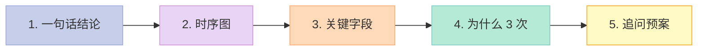

### 18.2 标准答案模板

> **Q：说下 TCP 三次握手？**
>
> A：TCP 三次握手是客户端和服务端建立连接的过程，一共 3 个报文：
>
> 1. **第一次**：客户端发 `SYN` 报文，seq=x，进入 `SYN_SENT` 状态
> 2. **第二次**：服务端收到后，发 `SYN+ACK`，seq=y，ack=x+1，进入 `SYN_RCVD` 状态
> 3. **第三次**：客户端收到后，发 `ACK`，seq=x+1，ack=y+1，双方进入 `ESTABLISHED`
>
> **为什么是 3 次？**
>
> - 两次不够：无法让**双方**都确认收发能力正常，且**无法防止旧连接请求突然到达**
> - 三次刚好：客户端验证了「自己能发、能收」，服务端也验证了「自己能发、能收」
>
> **追问预案**：
>
> - 「seq 为什么随机？」—— 防止序列号预测攻击
> - 「半连接队列在哪？」—— 服务端的 SYN Queue，由 `tcp_max_syn_backlog` 控制
> - 「SYN Flood 怎么防？」—— SYN Cookie + 防火墙
> - 「四次握手可以吗？」—— 可以，但浪费一次握手，没必要

### 18.3 反面教材：5 类常见错误回答

| 错误类型 | 错误回答 | 正确回答 |
|---------|---------|---------|
| 太浅 | 「客户端发 SYN，服务端回 ACK」 | 三次握手 + 每个报文的状态变化 |
| 答非所问 | 「TCP 是可靠的」 | 「三次握手是为了在不可靠网络上建立可靠连接」 |
| 死记硬背 | 「为了防止失效请求」 | 「两个目的：双向能力验证 + 防失效请求」 |
| 不会画图 | 纯文字描述 | 现场画时序图 + 状态机 |
| 答完不拓展 | 答完就停 | 加 1 句：「追问：XX 怎么破？」 |

---

## 十九、系列导航：本系列 19 篇文章

| 篇目 | 主题 | 链接 |
|------|------|------|
| 第 1 篇 | 引用与指针：左值右值、移动语义、指针运算 | [链接](/2026/06/16/cpp-interview-01-pointers-references/) |
| 第 2 篇 | 关键字：const / static / extern / volatile | [链接](/2026/06/16/cpp-interview-02-keywords/) |
| 第 3 篇 | 类与对象：构造、拷贝、移动、析构 | [链接](/2026/06/16/cpp-interview-03-class-object/) |
| 第 4 篇 | 继承与多态：vtable、虚函数、抽象类 | [链接](/2026/06/16/cpp-interview-04-inheritance-polymorphism/) |
| 第 5 篇 | 模板与泛型：函数模板、类模板、concepts | [链接](/2026/06/16/cpp-interview-05-templates/) |
| 第 6 篇 | 字符串与内存：const char* / char* / std::string | [链接](/2026/06/16/cpp-interview-06-string-and-memory/) |
| 第 7 篇 | STL 顺序容器：vector / list / deque | [链接](/2026/06/16/cpp-interview-07-stl-sequential-containers/) |
| 第 8 篇 | STL 关联容器：map / unordered_map / set | [链接](/2026/06/16/cpp-interview-08-stl-associative-containers/) |
| 第 9 篇 | 内存管理：malloc / new / mmap / 智能指针 | [链接](/2026/06/16/cpp-interview-09-memory-management/) |
| 第 10 篇 | 智能指针与异常：unique_ptr / shared_ptr / RAII | [链接](/2026/06/16/cpp-interview-10-smart-pointer-exception/) |
| 第 11 篇 | 编译与链接：预处理、目标文件、动态库 | [链接](/2026/06/16/cpp-interview-11-compile-link/) |
| 第 12 篇 | 宏、typedef、inline：类型转换的 4 种姿势 | [链接](/2026/06/16/cpp-interview-12-macro-typedef-inline/) |
| 第 13 篇 | 进程、线程、IO 多路复用 | [链接](/2026/06/16/cpp-interview-13-process-thread-io/) |
| 第 14 篇 | 网络协议：TCP/IP / HTTP / Socket | [链接](/2026/06/16/cpp-interview-14-network-protocols/) |
| 第 15 篇 | 数据结构与算法：红黑树到 LRU | [链接](/2026/06/16/cpp-interview-15-algorithms/) |
| 第 16 篇 | 设计模式 + HR 面经：单例到 Offer 谈判 | [链接](/2026/06/16/cpp-interview-16-design-pattern-hr/) |
| 第 17 篇 | 进程深挖：fork、execve、守护进程、死锁与 IPC | [链接](/2026/06/16/cpp-interview-17-process-deep-dive/) |
| 第 18 篇 | 线程深挖：NPTL、futex、内存模型与无锁编程 | [链接](/2026/06/16/cpp-interview-18-thread-deep-dive/) |
| **第 19 篇（本篇）** | **网络深挖：TCP 11 状态、HTTP/2、HTTPS 与 QUIC** | **[当前位置]** |

---

## 二十、结尾：网络协议的「本质三问」

> **网络协议是 C++ 后端的"语言"**。**TCP 三次握手不是为了"礼仪"，而是为了在不可靠的网络上建立可靠的双向通信；11 种状态不是为了"复杂"，而是为了覆盖所有边缘情况；HTTP/2 的二进制分帧不是为了"高大上"，而是为了让机器解析效率从 O(n) 降到 O(1)**。理解 11 种状态、4 大计时器、滑动窗口、拥塞控制，你就能在面试中让任何追问都有答案。

### 20.1 网络协议的「本质三问」

| 问题 | 本质答案 |
|------|---------|
| **TCP 为什么是 3 次握手？** | 双向通信能力 + 防失效请求，2 次不够，4 次浪费 |
| **HTTP/2 为什么用二进制？** | 机器解析效率（O(1)）+ 多路复用 + 头部压缩 |
| **QUIC 为什么基于 UDP？** | TCP 改不动了，UDP 自定义可靠层 + 0-RTT + 无队头阻塞 |

### 20.2 给你的 3 条行动建议

**立刻做（10 分钟内）**：

1. 在你电脑上执行 `tcpdump -i any -nn port 80`，观察一个真实 HTTP 请求的 7 个包（3 握手 + 1 请求 + 1 响应 + 2 挥手）
2. 用 `curl -v https://example.com` 观察 TLS 1.3 握手过程（应该只有 1 RTT）
3. `dig +trace example.com`，看完整 DNS 解析链路

**今天做（1 小时内）**：

1. 用本篇的 raw socket 代码编译运行，亲手发出一个 SYN 包
2. 修改 TCP 状态机表，背出 11 种状态
3. 回答 5 个开放性思考题，写下你的答案

**这一周做**：

1. 在 Wireshark 里找一个真实 TCP 流，分析它的窗口变化、RTT、丢包
2. 读 RFC 9293（TCP）和 RFC 9000（QUIC）的 spec 第 1 章
3. 用本篇讲的拥塞控制 4 算法，自己写一个简单的带宽模拟器

### 20.3 最后的金句

> **网络不是「魔法」**。**TCP 不是「可靠」**——它只是把不可靠的 IP 包，通过 ACK + 重传 + 序号 + 窗口 + 拥塞控制这 5 个机制，**伪装成了可靠的字节流**。**HTTP 不是「请求-响应」**——它只是基于 TCP 的字节流，加了一层「方法+路径+版本+头」的 ASCII 协议。**所有复杂的协议，都可以拆成「数据 + 状态机 + 异常处理」这三件套**。当你下次遇到任何新协议，问自己三个问题：**它的数据格式是什么？它的状态机有几个状态？它怎么处理异常？**——答案就有了。

---

**系列标签**：`#C++` `#面试题` `#网络协议` `#TCP` `#UDP` `#HTTP` `#HTTPS` `#QUIC` `#三次握手` `#拥塞控制` `#滑动窗口` `#DNS`

> 如果这篇深挖对你有帮助，请**点赞、在看、转发**三连。也欢迎在评论区留下你最想深挖的下一个主题（已有候选：MySQL 内核、Redis 源码、Linux 调度器、K8s 架构）。

---

*本文 19 个章节，约 1900+ 行代码、命令、表格，覆盖 C++ 后端面试中所有高频网络协议问题。建议收藏，遇到具体问题时按章节查阅。*