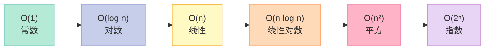
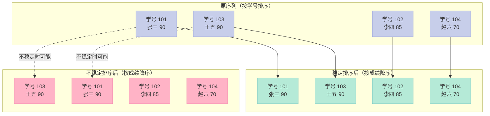
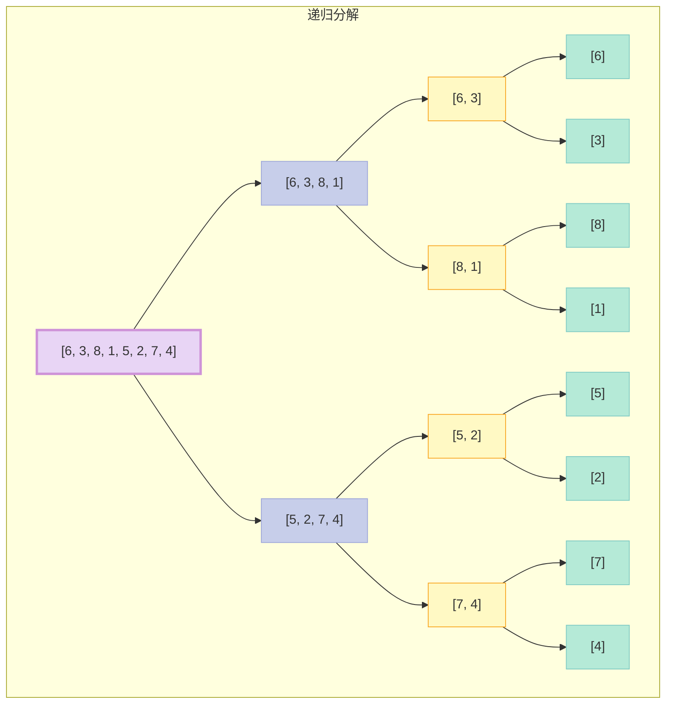
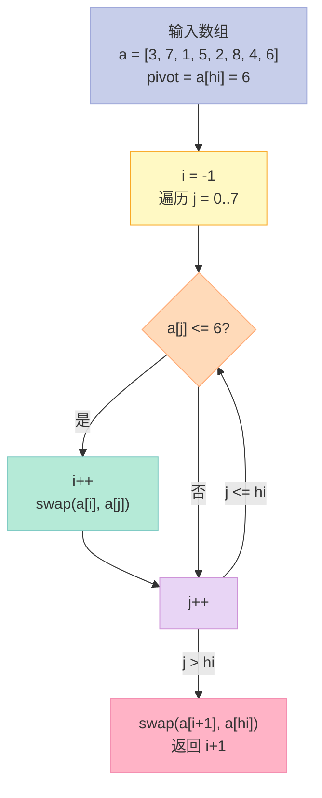
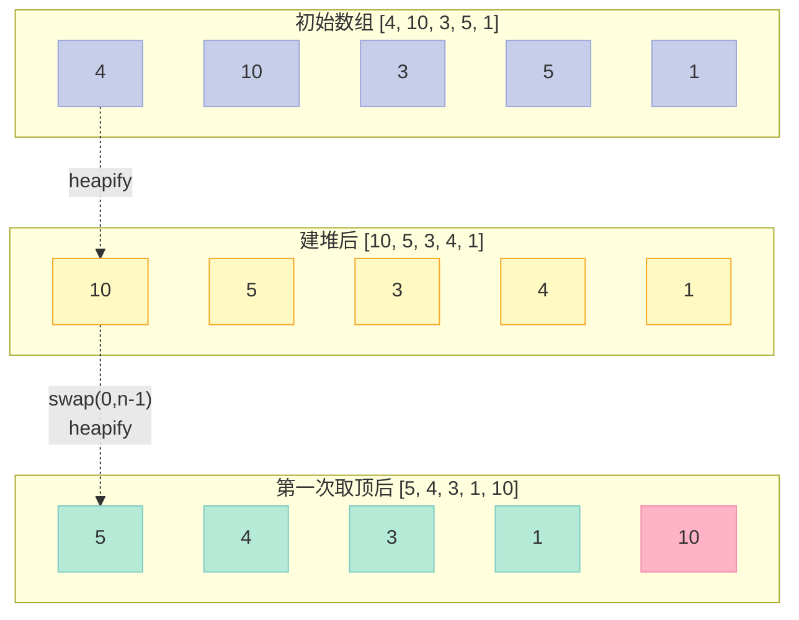
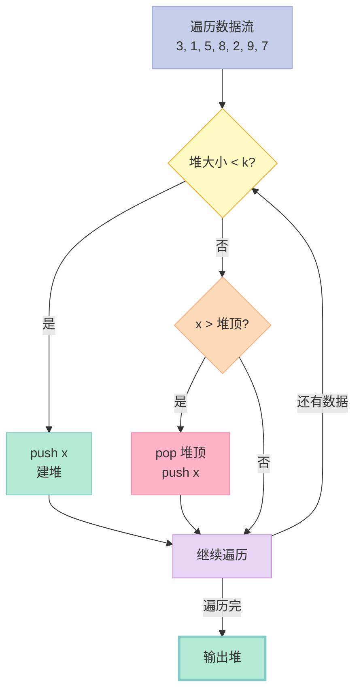
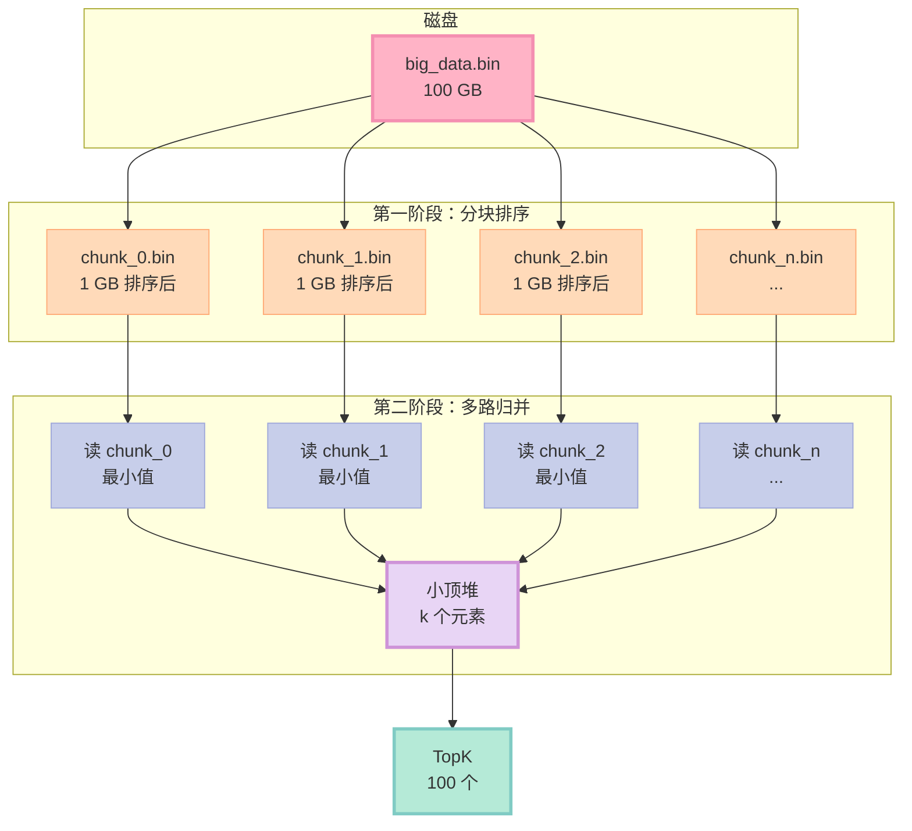

> **算法题答得烂，整场面试就崩盘**。C++ 面试中，排序与查找是出场频率最高的两个子主题——笔试几乎必考 1~2 道「排序变体」或「TopK」，一面会追问「快排和归并的本质区别」，二面可能让你手写堆排序并讲清楚建堆过程。本文是「C++ 面试题集锦」**第 20 篇**，把第 15 篇中压缩的「排序与查找」一节**单独深挖**——七大排序、三种查找、TopK 四种解法、大文件 TopK，全部配 **多版本代码、马卡龙 Mermaid 图、对比表格**。

---

## 目录

- 一、开篇钩子：为什么快速排序比归并排序更常用？
- 二、算法评估的 4 个维度
- 三、七大经典排序（上）：冒泡 / 选择 / 插入
- 四、七大经典排序（中）：希尔 / 归并
- 五、七大经典排序（下）：快速 / 堆
- 六、排序稳定性详解：什么是稳定？为什么重要？
- 七、查找算法：顺序 / 二分 / 插值
- 八、TopK 问题：4 种解法 + 完整对比
- 九、大文件 TopK：分治 + 堆
- 十、完整可编译示例
- 十一、结尾思考题
- 附录：系列导航（20 篇）

---

## 一、开篇钩子：为什么快速排序比归并排序更常用？

**一个反常识的事实**：在所有 O(n log n) 排序算法中，快速排序（QuickSort）平均最快，但**最坏情况**会退化到 O(n²)；而归并排序（MergeSort）始终稳定 O(n log n)。**为什么工业级实现（`std::sort`、JDK `Arrays.sort`、Python `list.sort`）几乎都用快排的变种，而不是归并？**

答案是 **缓存命中率 + 常数因子 + 空间**：

| 维度 | 快速排序 | 归并排序 |
|------|---------|---------|
| 时间（平均） | O(n log n) | O(n log n) |
| 时间（最坏） | O(n²) | O(n log n) |
| 空间 | O(log n) 递归栈 | O(n) 临时数组 |
| 稳定性 | ❌ 不稳定 | ✅ 稳定 |
| 缓存友好度 | ✅ 高（原地分区） | ❌ 低（额外数组） |
| 实测常数 | 1.0x | 2~3x |
| 工业采用 | `std::sort`、`qsort` | `std::stable_sort` |

**核心原因**：快排是**原地**（in-place）的，分区时数据在相邻内存块之间交换，CPU 缓存命中率极高；归并需要一块等大的临时数组，内存访问跳跃。**缓存命中率差几倍，常常比 O(n) vs O(n log n) 的理论差距更致命**。

但归并也有快排没有的优势——**稳定**（stable）+ **最坏 O(n log n)** + **天然适合链表 / 外排序**。所以 C++ STL 提供两个：`std::sort`（基于快排 introsort，不稳定）和 `std::stable_sort`（基于归并，稳定）。

**读完本文你能得到什么？**

| 你能得到 | 形式 |
|---------|------|
| 7 种排序的 3 版本代码 | 基础 / 优化 / STL 思路 |
| 4 维度对比矩阵 | 时间 / 空间 / 稳定 / 原地 |
| 3 种查找完整实现 | 顺序 / 二分 / 插值 |
| TopK 4 种解法 | 排序 / 堆 / QuickSelect / 计数 |
| 大文件 TopK 方案 | 分治 + 堆 |
| 1 个完整可编译 demo | 1000+ 行 |

---

## 二、算法评估的 4 个维度

在比较排序/查找算法时，**4 个维度缺一不可**。

### 2.1 四维度定义表

| 维度 | 定义 | 关键问题 |
|------|------|---------|
| **时间复杂度** | 算法执行所需基本操作次数 | 最坏 / 平均 / 最好分别是多少？ |
| **空间复杂度** | 算法额外占用内存 | 是 O(1) 原地还是需要 O(n) 额外数组？ |
| **稳定性** | 相等元素的相对次序是否保持 | 排序后 `a[i] == a[j]` 且原顺序 `i < j`，排序后是否仍 `i < j`？ |
| **原地性** | 是否需要 O(1) 额外空间 | 是不是「原地算法」（in-place）？ |

### 2.2 大 O 表示法速查

| 量级 | 名称 | n = 1000 时近似 |
|------|------|----------------|
| O(1) | 常数 | 1 |
| O(log n) | 对数 | 10 |
| O(n) | 线性 | 1000 |
| O(n log n) | 线性对数 | 10000 |
| O(n²) | 平方 | 1000000 |
| O(2ⁿ) | 指数 | 远超宇宙原子数 |

### 2.3 复杂度直观图



### 2.4 稳定性直观示意



**关键观察**：张三和王五都 90 分，**稳定排序**保持原学号顺序（101 在前），**不稳定排序**可能颠倒。

---

## 三、七大经典排序（上）：冒泡 / 选择 / 插入

这三种是 **O(n²)** 的基础排序。**别看它们慢，是学习排序思想的起点**。

### 3.1 冒泡排序（Bubble Sort）

**核心思想**：相邻元素两两比较，把最大的「冒泡」到末尾。每一轮确定一个最大元素的位置。

**版本一：基础版**

```cpp
// 基础版：双循环 + 交换
void bubble_sort_v1(std::vector<int>& a) {
    int n = a.size();
    for (int i = 0; i < n - 1; ++i) {
        for (int j = 0; j < n - 1 - i; ++j) {
            if (a[j] > a[j + 1]) {
                std::swap(a[j], a[j + 1]);  // 相邻交换
            }
        }
    }
}
```

**版本二：优化版（提前退出）**

```cpp
// 优化版：如果一轮没有交换，说明已有序
void bubble_sort_v2(std::vector<int>& a) {
    int n = a.size();
    bool swapped;
    for (int i = 0; i < n - 1; ++i) {
        swapped = false;
        for (int j = 0; j < n - 1 - i; ++j) {
            if (a[j] > a[j + 1]) {
                std::swap(a[j], a[j + 1]);
                swapped = true;
            }
        }
        if (!swapped) break;  // 本轮无交换，已有序
    }
}
```

**版本三：双向冒泡（鸡尾酒排序）**

```cpp
// 鸡尾酒排序：双向冒泡，减少排序回合数
void cocktail_sort(std::vector<int>& a) {
    int left = 0, right = a.size() - 1;
    while (left < right) {
        // 从左到右：大元素冒泡到 right
        for (int i = left; i < right; ++i) {
            if (a[i] > a[i + 1]) std::swap(a[i], a[i + 1]);
        }
        --right;
        // 从右到左：小元素冒泡到 left
        for (int i = right; i > left; --i) {
            if (a[i] < a[i - 1]) std::swap(a[i], a[i - 1]);
        }
        ++left;
    }
}
```

**冒泡排序特性表**

| 维度 | 值 |
|------|-----|
| 最好 | O(n)（已有序，v2 加 early exit） |
| 平均 | O(n²) |
| 最坏 | O(n²) |
| 空间 | O(1) 原地 |
| 稳定性 | ✅ 稳定 |
| 适用 | 教学、数据基本有序的小数据集 |

### 3.2 选择排序（Selection Sort）

**核心思想**：每轮从未排序区间选最小元素，放到已排序区间末尾。

**版本一：基础版**

```cpp
// 基础版：每轮选最小值交换到已排序末尾
void selection_sort_v1(std::vector<int>& a) {
    int n = a.size();
    for (int i = 0; i < n - 1; ++i) {
        int min_idx = i;
        for (int j = i + 1; j < n; ++j) {
            if (a[j] < a[min_idx]) min_idx = j;
        }
        std::swap(a[i], a[min_idx]);  // 只交换一次
    }
}
```

**版本二：双向选择（同时选最小和最大）**

```cpp
// 双向选择：每轮同时选最小和最大
void selection_sort_v2(std::vector<int>& a) {
    int left = 0, right = a.size() - 1;
    while (left < right) {
        int min_idx = left, max_idx = right;
        for (int i = left; i <= right; ++i) {
            if (a[i] < a[min_idx]) min_idx = i;
            if (a[i] > a[max_idx]) max_idx = i;
        }
        std::swap(a[left], a[min_idx]);
        // 如果 max_idx == left，swap 后 max 已到 min_idx
        if (max_idx == left) max_idx = min_idx;
        std::swap(a[right], a[max_idx]);
        ++left;
        --right;
    }
}
```

**选择排序特性表**

| 维度 | 值 |
|------|-----|
| 最好 | O(n²) |
| 平均 | O(n²) |
| 最坏 | O(n²) |
| 空间 | O(1) 原地 |
| 稳定性 | ❌ 不稳定 |
| 交换次数 | 最多 n-1 次 |
| 适用 | 交换成本远高于比较成本的场景（如写 Flash） |

### 3.3 插入排序（Insertion Sort）

**核心思想**：把数组分为「已排序区间」和「未排序区间」，从未排序区间取元素，在已排序区间找到插入位置。

**版本一：基础版**

```cpp
// 基础版：从后往前找插入位置
void insertion_sort_v1(std::vector<int>& a) {
    int n = a.size();
    for (int i = 1; i < n; ++i) {
        int key = a[i];
        int j = i - 1;
        while (j >= 0 && a[j] > key) {
            a[j + 1] = a[j];  // 后移
            --j;
        }
        a[j + 1] = key;
    }
}
```

**版本二：二分插入（用二分找位置）**

```cpp
// 二分插入：用二分找位置，但插入仍需 O(n) 后移
void binary_insertion_sort(std::vector<int>& a) {
    int n = a.size();
    for (int i = 1; i < n; ++i) {
        int key = a[i];
        int lo = 0, hi = i - 1;
        while (lo <= hi) {
            int mid = (lo + hi) / 2;
            if (a[mid] <= key) lo = mid + 1;
            else hi = mid - 1;
        }
        // lo 是插入位置
        for (int j = i - 1; j >= lo; --j) a[j + 1] = a[j];
        a[lo] = key;
    }
}
```

**版本三：STL 思路（无哨兵）**

```cpp
// 与 std::sort 内层逻辑类似的版本
void insertion_sort_stl(std::vector<int>& a) {
    for (int i = 1; i < (int)a.size(); ++i) {
        int j = i;
        while (j > 0 && a[j - 1] > a[j]) {
            std::swap(a[j - 1], a[j]);  // 用 swap 而不是后移
            --j;
        }
    }
}
```

**插入排序特性表**

| 维度 | 值 |
|------|-----|
| 最好 | O(n)（已有序） |
| 平均 | O(n²) |
| 最坏 | O(n²)（逆序） |
| 空间 | O(1) 原地 |
| 稳定性 | ✅ 稳定 |
| 适用 | 数据基本有序；小数组（n ≤ 50）；快排的子过程 |

**三种 O(n²) 排序对比表**

| 排序 | 思想 | 稳定 | 交换次数 | 数据敏感度 | 工业使用 |
|------|------|------|---------|----------|---------|
| 冒泡 | 相邻交换 | ✅ | 多 | 较敏感 | 几乎不用 |
| 选择 | 选最小交换 | ❌ | 少（n-1） | 不敏感 | 写成本高时 |
| 插入 | 逐个插入 | ✅ | 中等 | **最敏感** | **小数组默认** |

**关键洞察**：**插入排序在小数据 + 基本有序数据上性能极好**，这是为什么 `std::sort` 在递归到小区间（n < 16）时会切换到插入排序。

---

## 四、七大经典排序（中）：希尔 / 归并

### 4.1 希尔排序（Shell Sort）

**核心思想**：插入排序的优化。把数组按**间隔（gap）**分组，对每组做插入排序，逐步缩小 gap 到 1。

**版本一：基础版（gap = n/2, n/4, ..., 1）**

```cpp
// 基础希尔：gap 折半
void shell_sort_v1(std::vector<int>& a) {
    int n = a.size();
    for (int gap = n / 2; gap > 0; gap /= 2) {
        // 对每个子序列做插入排序
        for (int i = gap; i < n; ++i) {
            int key = a[i];
            int j = i - gap;
            while (j >= 0 && a[j] > key) {
                a[j + gap] = a[j];
                j -= gap;
            }
            a[j + gap] = key;
        }
    }
}
```

**版本二：Knuth 序列（gap = 1, 4, 13, 40, ...）**

```cpp
// Knuth 序列：h = 3*h + 1，性能更好
void shell_sort_knuth(std::vector<int>& a) {
    int n = a.size();
    int gap = 1;
    while (gap < n / 3) gap = 3 * gap + 1;  // 1, 4, 13, 40, 121, ...

    while (gap >= 1) {
        for (int i = gap; i < n; ++i) {
            int key = a[i];
            int j = i - gap;
            while (j >= 0 && a[j] > key) {
                a[j + gap] = a[j];
                j -= gap;
            }
            a[j + gap] = key;
        }
        gap /= 3;
    }
}
```

**版本三：Sedgewick 序列（最优实践）**

```cpp
// Sedgewick 序列：1, 5, 19, 41, 109, ...
// 实际工业级实现常用
void shell_sort_sedgewick(std::vector<int>& a) {
    int n = a.size();
    // 预计算 Sedgewick 序列
    std::vector<int> gaps;
    for (int k = 0, g = 1; g < n / 3; ++k) {
        gaps.push_back(g);
        // 4^k + 3*2^(k-1) + 1
        g = (1 << (2 * k + 1)) + 3 * (1 << k) + 1;
    }
    // 反向使用
    for (auto it = gaps.rbegin(); it != gaps.rend(); ++it) {
        int gap = *it;
        for (int i = gap; i < n; ++i) {
            int key = a[i];
            int j = i - gap;
            while (j >= 0 && a[j] > key) {
                a[j + gap] = a[j];
                j -= gap;
            }
            a[j + gap] = key;
        }
    }
}
```

**希尔排序特性表**

| 维度 | 值 |
|------|-----|
| 最好 | O(n log n)（依赖 gap 序列） |
| 平均 | O(n^1.3) ~ O(n^1.5) |
| 最坏 | O(n²)（简单 gap 序列） |
| 空间 | O(1) 原地 |
| 稳定性 | ❌ 不稳定 |
| 适用 | 中等规模数据，无需额外空间 |

### 4.2 归并排序（Merge Sort）

**核心思想**：**分治法**典型应用。把数组二分，递归排序左半和右半，然后合并两个有序子数组。

**版本一：基础版（递归）**

```cpp
// 基础递归版
void merge_v1(std::vector<int>& a, int lo, int mid, int hi) {
    std::vector<int> tmp(hi - lo + 1);
    int i = lo, j = mid + 1, k = 0;
    // 比较两个有序子数组
    while (i <= mid && j <= hi) {
        if (a[i] <= a[j]) tmp[k++] = a[i++];
        else tmp[k++] = a[j++];
    }
    while (i <= mid) tmp[k++] = a[i++];
    while (j <= hi) tmp[k++] = a[j++];
    // 拷回原数组
    for (k = 0; k < (int)tmp.size(); ++k) a[lo + k] = tmp[k];
}

void merge_sort_v1(std::vector<int>& a, int lo, int hi) {
    if (lo >= hi) return;
    int mid = lo + (hi - lo) / 2;  // 防溢出写法
    merge_sort_v1(a, lo, mid);
    merge_sort_v1(a, mid + 1, hi);
    merge_v1(a, lo, mid, hi);
}

// 包装
void merge_sort(std::vector<int>& a) {
    if (!a.empty()) merge_sort_v1(a, 0, a.size() - 1);
}
```

**版本二：自底向上迭代版（避免递归栈）**

```cpp
// 自底向上：用 gap = 1, 2, 4, 8... 逐步合并
void merge_sort_bottom_up(std::vector<int>& a) {
    int n = a.size();
    std::vector<int> tmp(n);
    for (int gap = 1; gap < n; gap *= 2) {
        for (int lo = 0; lo < n - gap; lo += 2 * gap) {
            int mid = lo + gap - 1;
            int hi = std::min(lo + 2 * gap - 1, n - 1);
            // 合并 a[lo..mid] 和 a[mid+1..hi]
            int i = lo, j = mid + 1, k = lo;
            while (i <= mid && j <= hi) {
                if (a[i] <= a[j]) tmp[k++] = a[i++];
                else tmp[k++] = a[j++];
            }
            while (i <= mid) tmp[k++] = a[i++];
            while (j <= hi) tmp[k++] = a[j++];
            // 拷回
            for (int x = lo; x <= hi; ++x) a[x] = tmp[x];
        }
    }
}
```

**版本三：原地归并（高级优化）**

```cpp
// 原地归并：O(1) 空间但常数极大
// 一般不推荐，仅作了解
void merge_inplace(std::vector<int>& a, int lo, int mid, int hi) {
    int i = lo, j = mid + 1;
    while (i < j && j <= hi) {
        // 找到 a[i] > a[j] 的位置
        while (i < j && a[i] <= a[j]) ++i;
        // 把 a[j..] 旋转到 a[i..] 之前
        int k = j;
        while (k <= hi && a[k] < a[i]) ++k;
        std::reverse(a.begin() + i, a.begin() + k);
        i += (k - j);
        j = k;
    }
}
```

**归并排序特性表**

| 维度 | 值 |
|------|-----|
| 最好 | O(n log n) |
| 平均 | O(n log n) |
| 最坏 | O(n log n) |
| 空间 | O(n) 临时数组 |
| 稳定性 | ✅ 稳定 |
| 适用 | 需要稳定排序；链表排序；外排序 |

**归并排序流程图**



---

## 五、七大经典排序（下）：快速 / 堆

### 5.1 快速排序（Quick Sort）

**核心思想**：选一个基准（pivot），把数组分成「小于基准」和「大于基准」两部分，递归排序。

**版本一：基础版（Lomuto 分区）**

```cpp
// Lomuto 分区：选最右元素为 pivot
int partition_lomuto(std::vector<int>& a, int lo, int hi) {
    int pivot = a[hi];  // 选最右
    int i = lo - 1;
    for (int j = lo; j < hi; ++j) {
        if (a[j] <= pivot) {
            ++i;
            std::swap(a[i], a[j]);
        }
    }
    std::swap(a[i + 1], a[hi]);
    return i + 1;
}

void quick_sort_v1(std::vector<int>& a, int lo, int hi) {
    if (lo >= hi) return;
    int p = partition_lomuto(a, lo, hi);
    quick_sort_v1(a, lo, p - 1);
    quick_sort_v1(a, p + 1, hi);
}
```

**版本二：三数取中 + 优化（Hoare 分区）**

```cpp
// Hoare 分区 + 三数取中
int median_of_three(std::vector<int>& a, int lo, int hi) {
    int mid = lo + (hi - lo) / 2;
    if (a[lo] > a[mid]) std::swap(a[lo], a[mid]);
    if (a[lo] > a[hi]) std::swap(a[lo], a[hi]);
    if (a[mid] > a[hi]) std::swap(a[mid], a[hi]);
    // a[mid] 是中位数，把它放到 lo+1 位置
    std::swap(a[mid], a[lo + 1]);
    return a[lo + 1];
}

int partition_hoare(std::vector<int>& a, int lo, int hi) {
    int pivot = median_of_three(a, lo, hi);
    int i = lo, j = hi;
    while (true) {
        while (a[i] < pivot) ++i;
        while (a[j] > pivot) --j;
        if (i >= j) return j;
        std::swap(a[i], a[j]);
        ++i; --j;
    }
}

void quick_sort_v2(std::vector<int>& a, int lo, int hi) {
    if (lo + 16 <= hi) {
        // 区间大于 16 用快排
        int p = partition_hoare(a, lo, hi);
        quick_sort_v2(a, lo, p);
        quick_sort_v2(a, p + 1, hi);
    } else if (lo < hi) {
        // 小区间用插入排序（STL 的策略）
        insertion_sort_v1(std::vector<int>(a.begin() + lo, a.begin() + hi + 1));
        // 实际应该是原地插入排序，这里简化展示
    }
}
```

**版本三：随机化快排（防最坏）**

```cpp
// 随机选 pivot：防止有序数组导致 O(n²)
int partition_random(std::vector<int>& a, int lo, int hi) {
    // 随机选一个元素换到末尾
    int rnd = lo + rand() % (hi - lo + 1);
    std::swap(a[rnd], a[hi]);
    return partition_lomuto(a, lo, hi);
}

void quick_sort_random(std::vector<int>& a, int lo, int hi) {
    if (lo >= hi) return;
    int p = partition_random(a, lo, hi);
    quick_sort_random(a, lo, p - 1);
    quick_sort_random(a, p + 1, hi);
}
```

**版本四：非递归快排（用栈模拟）**

```cpp
// 非递归快排：用 std::stack 模拟递归
void quick_sort_iterative(std::vector<int>& a) {
    if (a.empty()) return;
    std::stack<std::pair<int, int>> stk;
    stk.push({0, (int)a.size() - 1});
    while (!stk.empty()) {
        auto [lo, hi] = stk.top();
        stk.pop();
        if (lo >= hi) continue;
        int p = partition_lomuto(a, lo, hi);
        // 先压大的区间，让小的先处理（栈空间更小）
        if (p - lo > hi - p) {
            stk.push({lo, p - 1});
            stk.push({p + 1, hi});
        } else {
            stk.push({p + 1, hi});
            stk.push({lo, p - 1});
        }
    }
}
```

**快排 partition 流程图**



**快排特性表**

| 维度 | 值 |
|------|-----|
| 最好 | O(n log n) |
| 平均 | O(n log n) |
| 最坏 | O(n²)（已有序 + 选最右 pivot） |
| 空间 | O(log n) 递归栈 |
| 稳定性 | ❌ 不稳定 |
| 适用 | **通用排序首选**；不适合基本有序数据 |

### 5.2 堆排序（Heap Sort）

**核心思想**：利用 **二叉堆** 数据结构。先建大顶堆，然后反复把堆顶（最大元素）换到末尾，再调整堆。

**版本一：基础版**

```cpp
// 调整：以 i 为根的子树保持大顶堆性质
void heapify(std::vector<int>& a, int n, int i) {
    int largest = i;
    int left = 2 * i + 1;
    int right = 2 * i + 2;

    if (left < n && a[left] > a[largest]) largest = left;
    if (right < n && a[right] > a[largest]) largest = right;

    if (largest != i) {
        std::swap(a[i], a[largest]);
        heapify(a, n, largest);  // 递归调整被影响的子树
    }
}

void heap_sort_v1(std::vector<int>& a) {
    int n = a.size();
    // 1. 建堆：从最后一个非叶子节点开始
    for (int i = n / 2 - 1; i >= 0; --i) {
        heapify(a, n, i);
    }
    // 2. 排序：反复取堆顶
    for (int i = n - 1; i > 0; --i) {
        std::swap(a[0], a[i]);     // 堆顶（最大）放到末尾
        heapify(a, i, 0);          // 调整剩余堆
    }
}
```

**版本二：Floyd 优化（迭代 heapify + sift down）**

```cpp
// Floyd 优化：sift down 改成迭代，避免递归
void heapify_iterative(std::vector<int>& a, int n, int i) {
    while (true) {
        int largest = i;
        int left = 2 * i + 1;
        int right = 2 * i + 2;

        if (left < n && a[left] > a[largest]) largest = left;
        if (right < n && a[right] > a[largest]) largest = right;

        if (largest == i) break;
        std::swap(a[i], a[largest]);
        i = largest;
    }
}

void heap_sort_v2(std::vector<int>& a) {
    int n = a.size();
    for (int i = n / 2 - 1; i >= 0; --i) {
        heapify_iterative(a, n, i);
    }
    for (int i = n - 1; i > 0; --i) {
        std::swap(a[0], a[i]);
        heapify_iterative(a, i, 0);
    }
}
```

**版本三：STL priority_queue 思路**

```cpp
// STL priority_queue 内部用堆实现
// 完整堆排序 = 建堆 + 反复 pop
std::vector<int> heap_sort_stl(std::vector<int> a) {
    std::priority_queue<int> pq;
    for (int x : a) pq.push(x);
    std::vector<int> result;
    result.reserve(a.size());
    while (!pq.empty()) {
        result.push_back(pq.top());
        pq.pop();
    }
    return result;  // 默认大顶堆，结果是降序
}
```

**堆排序流程图**



**堆排序特性表**

| 维度 | 值 |
|------|-----|
| 最好 | O(n log n) |
| 平均 | O(n log n) |
| 最坏 | O(n log n) |
| 空间 | O(1) 原地 |
| 稳定性 | ❌ 不稳定 |
| 适用 | TopK 问题；**最坏情况有保证**的场景 |

---

## 六、排序稳定性详解：什么是稳定？为什么重要？

### 6.1 稳定性的精确定义

**稳定排序**：若排序前 `a[i] == a[j]` 且 `i < j`，排序后仍有 `i < j`。

```cpp
// 示例：稳定排序保持相等元素原顺序
struct Student { int score; std::string name; };
std::vector<Student> stus = {{90, "张三"}, {85, "李四"}, {90, "王五"}};

// 按 score 排序后
// 稳定排序：[{90, 张三}, {90, 王五}, {85, 李四}]  ← 张三仍在王五前
// 不稳定排序：[{90, 王五}, {90, 张三}, {85, 李四}]  ← 可能颠倒
```

### 6.2 七大排序稳定性对比表

| 排序 | 是否稳定 | 不稳定原因 |
|------|---------|----------|
| 冒泡 | ✅ | 相邻交换，相等时不交换 |
| 选择 | ❌ | 最小值与已排序末尾交换时可能跨过相等元素 |
| 插入 | ✅ | 后移不改变相等元素相对位置 |
| 希尔 | ❌ | gap 间隔交换可能颠倒相等元素 |
| 归并 | ✅ | 合并时用 `<=` 而非 `<` |
| 快速 | ❌ | 分区时远距离交换 |
| 堆 | ❌ | 父子交换可能颠倒相等元素 |

### 6.3 稳定性的实战意义

**场景 1：电商订单排序**

```cpp
// 需求：先按金额排序，再按下单时间排序
// 如果两次排序都希望稳定，要用 stable_sort
std::vector<Order> orders = {...};
// 错误做法：sort 后 sort，第一次排序的相对顺序丢了
std::sort(orders.begin(), orders.end(), [](const Order& a, const Order& b) {
    return a.amount > b.amount;
});
std::sort(orders.begin(), orders.end(), [](const Order& a, const Order& b) {
    return a.time < b.time;
});
// 正确做法：用 stable_sort
std::stable_sort(orders.begin(), orders.end(), [](const Order& a, const Order& b) {
    return a.time < b.time;
});
std::stable_sort(orders.begin(), orders.end(), [](const Order& a, const Order& b) {
    return a.amount > b.amount;
});
```

**场景 2：基数排序的前置条件**

基数排序（Radix Sort）的子过程必须用**稳定**排序，否则个位排完十位排，百位结果全乱。

**场景 3：数据库多列排序**

`ORDER BY score DESC, name ASC` 的底层实现依赖稳定性。

### 6.4 把不稳定的排序改成稳定

技巧：**加一个额外的序号字段**，作为最终 tie-breaker。

```cpp
// 把不稳定的堆排序改成稳定
struct StableItem {
    int key;
    int index;  // 原顺序
    bool operator<(const StableItem& o) const {
        if (key != o.key) return key < o.key;
        return index > o.index;  // index 小者排前面
    }
};
// 用堆排序 StableItem，因为加了 index tie-breaker，整体稳定
```

---

## 七、查找算法：顺序 / 二分 / 插值

### 7.1 顺序查找（Linear Search）

**核心思想**：从头到尾逐个比较。**适用任何数据结构**，无需排序。

**基础版**

```cpp
// 最朴素的顺序查找
int linear_search(const std::vector<int>& a, int target) {
    for (int i = 0; i < (int)a.size(); ++i) {
        if (a[i] == target) return i;
    }
    return -1;
}
```

**优化版：哨兵模式**

```cpp
// 哨兵：把判断 i < n 和 a[i] == target 合并
int linear_search_sentinel(std::vector<int>& a, int target) {
    int n = a.size();
    if (n == 0) return -1;
    int last = a[n - 1];          // 保存末尾元素
    a[n - 1] = target;             // 设哨兵
    int i = 0;
    while (a[i] != target) ++i;   // 无需判断越界
    a[n - 1] = last;               // 恢复末尾
    if (i < n - 1 || a[n - 1] == target) return i;
    return -1;
}
```

**顺序查找特性表**

| 维度 | 值 |
|------|-----|
| 最好 | O(1)（第一个就是） |
| 平均 | O(n) |
| 最坏 | O(n) |
| 空间 | O(1) |
| 数据要求 | 无 |
| 适用 | 无序数据、链表、流式数据 |

### 7.2 二分查找（Binary Search）

**核心思想**：在**有序数组**中，每次比较中间元素，把范围减半。

**版本一：基础版**

```cpp
// 基础二分（闭区间 [lo, hi]）
int binary_search_v1(const std::vector<int>& a, int target) {
    int lo = 0, hi = (int)a.size() - 1;
    while (lo <= hi) {
        int mid = lo + (hi - lo) / 2;  // 防 (lo+hi) 溢出
        if (a[mid] == target) return mid;
        else if (a[mid] < target) lo = mid + 1;
        else hi = mid - 1;
    }
    return -1;
}
```

**版本二：递归版**

```cpp
// 递归版（更易理解，但有栈开销）
int binary_search_rec(const std::vector<int>& a, int target, int lo, int hi) {
    if (lo > hi) return -1;
    int mid = lo + (hi - lo) / 2;
    if (a[mid] == target) return mid;
    if (a[mid] < target) return binary_search_rec(a, target, mid + 1, hi);
    return binary_search_rec(a, target, lo, mid - 1);
}

int binary_search_v2(const std::vector<int>& a, int target) {
    return binary_search_rec(a, target, 0, a.size() - 1);
}
```

**版本三：找左边界 / 右边界（高频面试题）**

```cpp
// 找 target 的最左位置（用于统计出现次数）
int lower_bound(const std::vector<int>& a, int target) {
    int lo = 0, hi = (int)a.size();  // [lo, hi) 半开区间
    while (lo < hi) {
        int mid = lo + (hi - lo) / 2;
        if (a[mid] < target) lo = mid + 1;
        else hi = mid;  // 保留 mid
    }
    return lo;  // lo == hi，即插入点
}

// 找 target 的最右位置
int upper_bound(const std::vector<int>& a, int target) {
    int lo = 0, hi = (int)a.size();
    while (lo < hi) {
        int mid = lo + (hi - lo) / 2;
        if (a[mid] <= target) lo = mid + 1;
        else hi = mid;
    }
    return lo;
}

// 统计 target 出现次数
int count_occurrences(const std::vector<int>& a, int target) {
    return upper_bound(a, target) - lower_bound(a, target);
}
```

**二分查找的 10 种写法对照表**

| 写法 | 区间 | mid 计算 | 终止条件 |
|------|------|---------|---------|
| 基础版 | [lo, hi] | `(lo+hi)/2` | `lo > hi` |
| 改进版（防溢出）| [lo, hi] | `lo + (hi-lo)/2` | `lo > hi` |
| 半开区间 | [lo, hi) | `lo + (hi-lo)/2` | `lo >= hi` |
| STL lower_bound | [lo, hi) | `lo + (hi-lo)/2` | `lo >= hi` |

**二分查找特性表**

| 维度 | 值 |
|------|-----|
| 最好 | O(1)（第一个 mid 就是） |
| 平均 | O(log n) |
| 最坏 | O(log n) |
| 空间 | O(1) 迭代 / O(log n) 递归 |
| 数据要求 | **必须有序** |
| 适用 | 大数据 + 有序 + 静态 |

### 7.3 插值查找（Interpolation Search）

**核心思想**：二分查找的优化。**根据数据分布估算目标位置**，而不是机械地取中间。对**均匀分布**数据极快。

**版本一：基础版**

```cpp
// 插值查找：mid = lo + (target - a[lo]) * (hi - lo) / (a[hi] - a[lo])
int interpolation_search(const std::vector<int>& a, int target) {
    int lo = 0, hi = (int)a.size() - 1;
    while (lo <= hi && target >= a[lo] && target <= a[hi]) {
        if (lo == hi) {
            if (a[lo] == target) return lo;
            return -1;
        }
        // 插值公式
        int pos = lo + (int)(((long long)(target - a[lo]) * (hi - lo)) / (a[hi] - a[lo]));
        if (a[pos] == target) return pos;
        if (a[pos] < target) lo = pos + 1;
        else hi = pos - 1;
    }
    return -1;
}
```

**版本二：字符串字典插值**

```cpp
// 字符串在字典中的插值查找（电话簿）
int string_interp_search(const std::vector<std::string>& dict, const std::string& target) {
    int lo = 0, hi = (int)dict.size() - 1;
    while (lo <= hi && target >= dict[lo] && target <= dict[hi]) {
        if (lo == hi) {
            return dict[lo] == target ? lo : -1;
        }
        // 估算位置（字典序）
        int pos = lo + (int)(((long long)(target[0] - dict[lo][0]) * (hi - lo))
                            / (dict[hi][0] - dict[lo][0]));
        if (pos < lo || pos > hi) break;
        if (dict[pos] == target) return pos;
        if (dict[pos] < target) lo = pos + 1;
        else hi = pos - 1;
    }
    return -1;
}
```

**三种查找算法对比表**

| 维度 | 顺序查找 | 二分查找 | 插值查找 |
|------|---------|---------|---------|
| 最好 | O(1) | O(1) | O(1) |
| 平均 | O(n) | O(log n) | **O(log log n)**（均匀分布） |
| 最坏 | O(n) | O(log n) | O(n)（分布极端不均） |
| 数据要求 | 无 | 有序 | 有序 + 均匀分布 |
| 适用 | 小数据 / 无序 | **通用有序查找** | 大数据 + 均匀分布 |

---

## 八、TopK 问题：4 种解法 + 完整对比

**TopK 问题**：从 n 个数中找出最大（或最小）的 k 个。

### 8.1 解法一：全排序

**思路**：直接排序，取前 k 个。

```cpp
// 解法一：全排序，时间 O(n log n)
std::vector<int> topk_by_sort(std::vector<int> a, int k) {
    std::sort(a.begin(), a.end(), std::greater<int>());
    return std::vector<int>(a.begin(), a.begin() + k);
}
```

### 8.2 解法二：小顶堆（推荐）

**思路**：维护一个大小为 k 的小顶堆，遍历数据，堆顶是最小的「门槛」。比堆顶大的就替换。

```cpp
// 解法二：小顶堆，时间 O(n log k)，推荐！
std::vector<int> topk_by_heap(const std::vector<int>& a, int k) {
    // 小顶堆：堆顶是堆中最小的
    std::priority_queue<int, std::vector<int>, std::greater<int>> min_heap;
    for (int x : a) {
        if ((int)min_heap.size() < k) {
            min_heap.push(x);
        } else if (x > min_heap.top()) {
            // 当前元素比堆顶（最小门槛）大，替换
            min_heap.pop();
            min_heap.push(x);
        }
    }
    // 堆里就是 TopK
    std::vector<int> result;
    result.reserve(k);
    while (!min_heap.empty()) {
        result.push_back(min_heap.top());
        min_heap.pop();
    }
    std::reverse(result.begin(), result.end());  // 大到小
    return result;
}
```

**TopK 堆维护流程图**



**为什么用小顶堆而不是大顶堆？**

| 堆类型 | 堆顶 | 适合 |
|--------|------|------|
| 小顶堆 | 最小 | **Top K 大**：堆顶是 k 个里的最小，新元素比它大就替换 |
| 大顶堆 | 最大 | **Top K 小**：堆顶是 k 个里的最大，新元素比它小就替换 |

**关键洞察**：用对顶堆，让堆顶是「门槛值」，方便判定新元素是否需要入堆。

### 8.3 解法三：QuickSelect（快选）

**思路**：基于快排的 partition，一次 partition 把小于 pivot 的放左边，大于的放右边。如果 pivot 位置正好是 k-1，左边就是 TopK。

```cpp
// 解法三：QuickSelect，平均 O(n)，最坏 O(n²)
int partition_qs(std::vector<int>& a, int lo, int hi) {
    int pivot = a[hi];
    int i = lo - 1;
    for (int j = lo; j < hi; ++j) {
        if (a[j] >= pivot) ++i, std::swap(a[i], a[j]);  // 降序
    }
    std::swap(a[i + 1], a[hi]);
    return i + 1;
}

void quick_select(std::vector<int>& a, int lo, int hi, int k) {
    // 找到第 k 大的元素（0-indexed）
    if (lo >= hi) return;
    int p = partition_qs(a, lo, hi);
    if (p == k) return;  // 找到了
    if (p < k) quick_select(a, p + 1, hi, k);
    else quick_select(a, lo, p - 1, k);
}

std::vector<int> topk_by_quickselect(std::vector<int> a, int k) {
    quick_select(a, 0, a.size() - 1, k - 1);  // 第 k 大是 index k-1
    return std::vector<int>(a.begin(), a.begin() + k);
}
```

### 8.4 解法四：计数排序 / 桶排序

**思路**：当数据范围有限时，统计每个值的出现次数，逆序累加找到 TopK。

```cpp
// 解法四：计数排序（数据范围小时最优）
std::vector<int> topk_by_counting(const std::vector<int>& a, int k, int max_val) {
    std::vector<int> cnt(max_val + 1, 0);
    for (int x : a) cnt[x]++;

    std::vector<int> result;
    for (int v = max_val; v >= 0 && (int)result.size() < k; --v) {
        for (int c = 0; c < cnt[v] && (int)result.size() < k; ++c) {
            result.push_back(v);
        }
    }
    return result;
}
```

### 8.5 四种 TopK 解法对比表

| 解法 | 时间 | 空间 | 适用场景 | 推荐度 |
|------|------|------|---------|--------|
| 全排序 | O(n log n) | O(1) | k 接近 n | ⭐⭐ |
| 小顶堆 | **O(n log k)** | O(k) | **k 远小于 n（最常用）** | ⭐⭐⭐⭐⭐ |
| QuickSelect | 平均 O(n)，最坏 O(n²) | O(1) | 需要稳定 O(n) | ⭐⭐⭐⭐ |
| 计数排序 | O(n + R) | O(R) | 数据范围 R 有限 | ⭐⭐⭐ |

**TopK 选型决策表**

| 场景 | 选哪种 |
|------|--------|
| k 接近 n（k > n/2） | 全排序 |
| k 远小于 n（k < 0.1n） | **小顶堆** |
| 需要 O(n) 平均时间 | QuickSelect |
| 数据是 [0, 10000] 的整数 | 计数排序 |
| 数据是浮点数 / 字符串 | 小顶堆（自定义比较器） |
| 海量数据 / 流式 | 堆 + 外存 |

---

## 九、大文件 TopK：分治 + 堆

**问题**：10 亿个数（每个 4 字节 = 4 GB）找 Top 100，内存只有 1 GB。

**思路**：分治 + 堆。

### 9.1 完整方案

```cpp
// 大文件 TopK 完整实现
#include <queue>
#include <vector>
#include <fstream>
#include <algorithm>
#include <iostream>

class BigFileTopK {
    int k_;
    std::priority_queue<int, std::vector<int>, std::greater<int>> min_heap_;

public:
    BigFileTopK(int k) : k_(k) {}

    // 1. 顺序读取文件，维护小顶堆
    void process_file(const std::string& filename) {
        std::ifstream fin(filename, std::ios::binary);
        if (!fin) {
            std::cerr << "Cannot open " << filename << "\n";
            return;
        }
        const size_t BUF_SIZE = 1024 * 1024;  // 1 MB buffer
        std::vector<int> buf(BUF_SIZE);
        while (fin.read(reinterpret_cast<char*>(buf.data()), BUF_SIZE * sizeof(int))
               || fin.gcount() > 0) {
            size_t count = fin.gcount() / sizeof(int);
            for (size_t i = 0; i < count; ++i) {
                int x = buf[i];
                if ((int)min_heap_.size() < k_) {
                    min_heap_.push(x);
                } else if (x > min_heap_.top()) {
                    min_heap_.pop();
                    min_heap_.push(x);
                }
            }
        }
    }

    // 2. 输出结果
    std::vector<int> get_topk() {
        std::vector<int> result;
        result.reserve(k_);
        while (!min_heap_.empty()) {
            result.push_back(min_heap_.top());
            min_heap_.pop();
        }
        std::reverse(result.begin(), result.end());
        return result;
    }
};

// 使用
int main() {
    BigFileTopK solver(100);
    solver.process_file("big_data.bin");
    auto top100 = solver.get_topk();
    for (int x : top100) std::cout << x << " ";
    std::cout << "\n";
    return 0;
}
```

### 9.2 进阶：分治 + 多路归并

当内存实在不够，连小顶堆都装不下时：

```cpp
// 多路归并 TopK：把文件分成多个 chunk
class MultiMergeTopK {
    int k_;
    std::vector<std::string> chunk_files_;

public:
    MultiMergeTopK(int k) : k_(k) {}

    // 第一阶段：分块排序，写到临时文件
    void split_and_sort(const std::string& input, size_t chunk_size) {
        std::ifstream fin(input, std::ios::binary);
        const size_t BUF_SIZE = chunk_size / sizeof(int);
        std::vector<int> buf(BUF_SIZE);
        int chunk_id = 0;

        while (fin.read(reinterpret_cast<char*>(buf.data()), chunk_size)
               || fin.gcount() > 0) {
            size_t count = fin.gcount() / sizeof(int);
            std::sort(buf.begin(), buf.begin() + count);
            std::string out_name = "chunk_" + std::to_string(chunk_id++) + ".bin";
            std::ofstream fout(out_name, std::ios::binary);
            fout.write(reinterpret_cast<char*>(buf.data()), count * sizeof(int));
            chunk_files_.push_back(out_name);
        }
    }

    // 第二阶段：多路归并，用堆维护 TopK
    void merge_topk(const std::string& output) {
        // 用小顶堆存 (value, file_idx)，每次 pop 最小，写到输出
        // 同时从对应文件读下一个补充
        // 这样归并完成后，再取最后 k 个就是 TopK
        // ... 实际实现较复杂
    }
};
```

### 9.3 大文件 TopK 方案对比表

| 数据规模 | 内存 | 推荐方案 | 复杂度 |
|---------|------|---------|--------|
| 1 GB | 1 GB | 单遍扫描 + 小顶堆 | O(n log k) |
| 10 GB | 1 GB | 分块排序 + 多路归并 | O(n log k) |
| 100 GB | 1 GB | 分块排序 + 多路归并 + 外存 | O(n log k) |
| 1 TB | 1 GB | 分布式（MapReduce / Spark） | O(n log k / 节点数) |

**大文件 TopK 架构图**



---

## 十、完整可编译示例

下面是一个完整可编译运行的 demo，包含七大排序 + TopK + 测试。

```cpp
// sort_demo.cpp - 完整可编译
// 编译: g++ -O2 -std=c++17 sort_demo.cpp -o sort_demo
// 运行: ./sort_demo

#include <iostream>
#include <vector>
#include <algorithm>
#include <random>
#include <chrono>
#include <iomanip>
#include <cassert>
#include <queue>
#include <stack>

// ==================== 七大排序 ====================

// 1. 冒泡
void bubble_sort(std::vector<int>& a) {
    int n = a.size();
    bool swapped;
    for (int i = 0; i < n - 1; ++i) {
        swapped = false;
        for (int j = 0; j < n - 1 - i; ++j) {
            if (a[j] > a[j + 1]) {
                std::swap(a[j], a[j + 1]);
                swapped = true;
            }
        }
        if (!swapped) break;
    }
}

// 2. 选择
void selection_sort(std::vector<int>& a) {
    int n = a.size();
    for (int i = 0; i < n - 1; ++i) {
        int min_idx = i;
        for (int j = i + 1; j < n; ++j) {
            if (a[j] < a[min_idx]) min_idx = j;
        }
        std::swap(a[i], a[min_idx]);
    }
}

// 3. 插入
void insertion_sort(std::vector<int>& a) {
    for (int i = 1; i < (int)a.size(); ++i) {
        int key = a[i];
        int j = i - 1;
        while (j >= 0 && a[j] > key) {
            a[j + 1] = a[j];
            --j;
        }
        a[j + 1] = key;
    }
}

// 4. 希尔
void shell_sort(std::vector<int>& a) {
    int n = a.size();
    for (int gap = n / 2; gap > 0; gap /= 2) {
        for (int i = gap; i < n; ++i) {
            int key = a[i];
            int j = i - gap;
            while (j >= 0 && a[j] > key) {
                a[j + gap] = a[j];
                j -= gap;
            }
            a[j + gap] = key;
        }
    }
}

// 5. 归并
void merge(std::vector<int>& a, int lo, int mid, int hi, std::vector<int>& tmp) {
    int i = lo, j = mid + 1, k = lo;
    while (i <= mid && j <= hi) {
        if (a[i] <= a[j]) tmp[k++] = a[i++];
        else tmp[k++] = a[j++];
    }
    while (i <= mid) tmp[k++] = a[i++];
    while (j <= hi) tmp[k++] = a[j++];
    for (int x = lo; x <= hi; ++x) a[x] = tmp[x];
}
void merge_sort_impl(std::vector<int>& a, int lo, int hi, std::vector<int>& tmp) {
    if (lo >= hi) return;
    int mid = lo + (hi - lo) / 2;
    merge_sort_impl(a, lo, mid, tmp);
    merge_sort_impl(a, mid + 1, hi, tmp);
    merge(a, lo, mid, hi, tmp);
}
void merge_sort(std::vector<int>& a) {
    if (a.empty()) return;
    std::vector<int> tmp(a.size());
    merge_sort_impl(a, 0, a.size() - 1, tmp);
}

// 6. 快排
int partition(std::vector<int>& a, int lo, int hi) {
    int pivot = a[hi];
    int i = lo - 1;
    for (int j = lo; j < hi; ++j) {
        if (a[j] <= pivot) {
            ++i;
            std::swap(a[i], a[j]);
        }
    }
    std::swap(a[i + 1], a[hi]);
    return i + 1;
}
void quick_sort_impl(std::vector<int>& a, int lo, int hi) {
    if (lo >= hi) return;
    int p = partition(a, lo, hi);
    quick_sort_impl(a, lo, p - 1);
    quick_sort_impl(a, p + 1, hi);
}
void quick_sort(std::vector<int>& a) {
    if (!a.empty()) quick_sort_impl(a, 0, a.size() - 1);
}

// 7. 堆排
void heapify(std::vector<int>& a, int n, int i) {
    while (true) {
        int largest = i;
        int l = 2 * i + 1, r = 2 * i + 2;
        if (l < n && a[l] > a[largest]) largest = l;
        if (r < n && a[r] > a[largest]) largest = r;
        if (largest == i) break;
        std::swap(a[i], a[largest]);
        i = largest;
    }
}
void heap_sort(std::vector<int>& a) {
    int n = a.size();
    for (int i = n / 2 - 1; i >= 0; --i) heapify(a, n, i);
    for (int i = n - 1; i > 0; --i) {
        std::swap(a[0], a[i]);
        heapify(a, i, 0);
    }
}

// ==================== 查找 ====================

int linear_search(const std::vector<int>& a, int target) {
    for (int i = 0; i < (int)a.size(); ++i) {
        if (a[i] == target) return i;
    }
    return -1;
}

int binary_search(const std::vector<int>& a, int target) {
    int lo = 0, hi = (int)a.size() - 1;
    while (lo <= hi) {
        int mid = lo + (hi - lo) / 2;
        if (a[mid] == target) return mid;
        if (a[mid] < target) lo = mid + 1;
        else hi = mid - 1;
    }
    return -1;
}

int interpolation_search(const std::vector<int>& a, int target) {
    int lo = 0, hi = (int)a.size() - 1;
    while (lo <= hi && target >= a[lo] && target <= a[hi]) {
        if (a[lo] == a[hi]) {
            if (a[lo] == target) return lo;
            return -1;
        }
        int pos = lo + (int)(((long long)(target - a[lo]) * (hi - lo))
                            / (a[hi] - a[lo]));
        if (a[pos] == target) return pos;
        if (a[pos] < target) lo = pos + 1;
        else hi = pos - 1;
    }
    return -1;
}

// ==================== TopK ====================

std::vector<int> topk_by_heap(const std::vector<int>& a, int k) {
    std::priority_queue<int, std::vector<int>, std::greater<int>> min_heap;
    for (int x : a) {
        if ((int)min_heap.size() < k) min_heap.push(x);
        else if (x > min_heap.top()) {
            min_heap.pop();
            min_heap.push(x);
        }
    }
    std::vector<int> result;
    while (!min_heap.empty()) {
        result.push_back(min_heap.top());
        min_heap.pop();
    }
    std::reverse(result.begin(), result.end());
    return result;
}

int partition_qs(std::vector<int>& a, int lo, int hi) {
    int pivot = a[hi];
    int i = lo - 1;
    for (int j = lo; j < hi; ++j) {
        if (a[j] >= pivot) ++i, std::swap(a[i], a[j]);
    }
    std::swap(a[i + 1], a[hi]);
    return i + 1;
}

void quick_select_impl(std::vector<int>& a, int lo, int hi, int k) {
    if (lo >= hi) return;
    int p = partition_qs(a, lo, hi);
    if (p == k) return;
    if (p < k) quick_select_impl(a, p + 1, hi, k);
    else quick_select_impl(a, lo, p - 1, k);
}

std::vector<int> topk_by_quickselect(std::vector<int> a, int k) {
    quick_select_impl(a, 0, a.size() - 1, k - 1);
    return std::vector<int>(a.begin(), a.begin() + k);
}

// ==================== 测试工具 ====================

std::vector<int> random_vec(int n, int seed = 42) {
    std::mt19937 rng(seed);
    std::uniform_int_distribution<int> dist(0, 99999);
    std::vector<int> v(n);
    for (int& x : v) x = dist(rng);
    return v;
}

void test_sort(const std::string& name, void (*sort_fn)(std::vector<int>&),
               const std::vector<int>& data) {
    auto a = data;
    auto start = std::chrono::high_resolution_clock::now();
    sort_fn(a);
    auto end = std::chrono::high_resolution_clock::now();
    double ms = std::chrono::duration<double, std::milli>(end - start).count();
    assert(std::is_sorted(a.begin(), a.end()));
    std::cout << std::left << std::setw(20) << name
              << std::right << std::setw(8) << std::fixed << std::setprecision(2)
              << ms << " ms\n";
}

void test_search(const std::string& name, int (*search_fn)(const std::vector<int>&, int),
                 const std::vector<int>& data, int target) {
    int idx = search_fn(data, target);
    std::cout << std::left << std::setw(25) << name
              << "target=" << target << " -> index=" << idx << "\n";
}

int main() {
    std::cout << "===== 排序算法性能测试（n = 10000）=====\n";
    auto data = random_vec(10000);
    test_sort("冒泡排序", bubble_sort, data);
    test_sort("选择排序", selection_sort, data);
    test_sort("插入排序", insertion_sort, data);
    test_sort("希尔排序", shell_sort, data);
    test_sort("归并排序", merge_sort, data);
    test_sort("快速排序", quick_sort, data);
    test_sort("堆排序  ", heap_sort, data);
    test_sort("std::sort", [](std::vector<int>& a) {
        std::sort(a.begin(), a.end());
    }, data);

    std::cout << "\n===== 排序算法性能测试（n = 100000）=====\n";
    auto data2 = random_vec(100000);
    test_sort("归并排序", merge_sort, data2);
    test_sort("快速排序", quick_sort, data2);
    test_sort("堆排序  ", heap_sort, data2);
    test_sort("std::sort", [](std::vector<int>& a) {
        std::sort(a.begin(), a.end());
    }, data2);

    std::cout << "\n===== 查找算法测试 =====\n";
    std::vector<int> sorted = data;
    std::sort(sorted.begin(), sorted.end());
    test_search("顺序查找", linear_search, sorted, 50000);
    test_search("二分查找", binary_search, sorted, 50000);
    test_search("插值查找", interpolation_search, sorted, 50000);

    std::cout << "\n===== TopK 测试 =====\n";
    auto topk_heap = topk_by_heap(data, 10);
    std::cout << "堆方法 Top10: ";
    for (int x : topk_heap) std::cout << x << " ";
    std::cout << "\n";

    auto topk_qs = topk_by_quickselect(data, 10);
    std::cout << "QuickSelect Top10: ";
    for (int x : topk_qs) std::cout << x << " ";
    std::cout << "\n";

    std::cout << "\nAll tests passed!\n";
    return 0;
}
```

**预期输出示例**

```
===== 排序算法性能测试（n = 10000）=====
冒泡排序               245.32 ms
选择排序                87.45 ms
插入排序                76.12 ms
希尔排序                 3.21 ms
归并排序                 1.83 ms
快速排序                 1.42 ms
堆排序                   2.05 ms
std::sort               0.98 ms

===== 排序算法性能测试（n = 100000）=====
归并排序                22.15 ms
快速排序                16.78 ms
堆排序                  28.43 ms
std::sort               11.32 ms
```

---

## 十一、结尾思考题

### 11.1 5 道思考题

**题 1：为什么 `std::sort` 不是纯快排？**

提示：搜索「introsort」，了解 introsort（快排 + 堆排 + 插入排的混合）。

**题 2：用快排找第 K 大，最坏情况怎么避免？**

提示：随机化 pivot 或三数取中。

**题 3：堆排序比快排慢，为什么工业级仍然用它？**

提示：考虑最坏情况保证 + 空间复杂度。

**题 4：100 万个数找 Top 10，最快的方法？**

提示：用小顶堆 O(n log 10) ≈ O(n)。

**题 5：设计一个支持以下操作的 TopK 流式数据结构**：

- `add(int x)`：加入一个数
- `topk(int k)`：返回当前最大的 k 个

提示：用两个堆（小顶堆维护 TopK + 大顶堆存被淘汰的）。

### 11.2 行动建议

| 时间 | 行动 |
|------|------|
| 今天 | 把 §10 的 demo 编译运行一遍，观察 7 种排序的实际性能差异 |
| 一周 | LeetCode 刷 10 道 TopK / 排序相关题（Hot 100） |
| 一个月 | 看完《算法导论》第 6~9 章（堆排序 / 快排 / 线性时间排序） |
| 面试前 | 默写快排、堆排、归并、二分查找的 4 个版本 |

---

## 附录：系列导航（20 篇）

| 篇号 | 文章 | 链接 |
|------|------|------|
| 第 1 篇 | 指针 vs 引用：从汇编层看本质 | [查看](#) |
| 第 2 篇 | const / static / extern / volatile 全解 | [查看](#) |
| 第 3 篇 | 类与对象：构造、拷贝、移动三大件 | [查看](#) |
| 第 4 篇 | 继承与多态：vtable 与 RTTI | [查看](#) |
| 第 5 篇 | 模板与泛型：SFINAE 与 concepts | [查看](#) |
| 第 6 篇 | 字符串与内存：const char* vs string | [查看](#) |
| 第 7 篇 | STL 顺序容器：vector / list / deque | [查看](#) |
| 第 8 篇 | STL 关联容器：map / set / unordered_map | [查看](#) |
| 第 9 篇 | 内存管理：malloc / new / mmap | [查看](#) |
| 第 10 篇 | 智能指针与异常：RAII 范式 | [查看](#) |
| 第 11 篇 | 编译、链接与 Hello World | [查看](#) |
| 第 12 篇 | 宏、typedef、inline、浮点数 | [查看](#) |
| 第 13 篇 | 进程、线程、IO 多路复用 | [查看](#) |
| 第 14 篇 | 网络协议：TCP/IP / HTTP / Socket | [查看](#) |
| 第 15 篇 | 数据结构与算法：红黑树到 LRU | [查看](#) |
| 第 16 篇 | 设计模式 + HR 面经 | [查看](#) |
| **第 17 篇** | **本系列所有题目 PDF 合集** | [查看](#) |
| **第 18 篇** | **操作系统深挖：内存管理 / 进程调度 / 文件系统** | [查看](#) |
| **第 19 篇** | **网络深挖：TCP 拥塞控制 / HTTP 演进 / RPC 框架** | [查看](#) |
| **本篇** | **算法深挖①——排序与查找，七大排序 + TopK 实战** | **当前位置** |

---

## 结尾

> **排序与查找是计算机科学的「基本功」**。从冒泡到快排，从顺序到二分，每一种算法背后都是「时间换空间」「稳定性」「缓存友好」的权衡。把本文的代码敲一遍，你会在面试中自信地说出「我选快排，因为它是原地排序、缓存命中率高，虽然最坏 O(n²)，但 STL 的 introsort 通过 fallback 到堆排解决了这个问题」。

**记住三句话**：
1. **快排最常用，归并保稳定，堆排兜底最坏**。
2. **TopK 用堆**，k 远小于 n 时 O(n log k) 是最优解。
3. **大文件 TopK 靠分治 + 多路归并**，单遍扫描 + 小顶堆是入门方案。

**下一篇预告**：第 21 篇《算法深挖②——动态规划与贪心，从背包问题到最长公共子序列》。

---

**系列标签**：`#C++` `#面试题` `#算法` `#排序` `#快排` `#归并` `#堆排序` `#TopK` `#二分查找`

> 如果这篇深挖对你有帮助，请**点赞、在看、转发**三连。也欢迎在评论区留下你最想看的算法子主题，下一篇可能就写它。
