> **为什么 STL 的 `std::map` 用红黑树不用 AVL？为什么 MySQL 用 B+ 树做索引不用 B 树？为什么 Dijkstra 不能处理负权图？** 这三个问题是 C++ 面试算法部分**必问中的必问**。本篇是「C++ 面试题集锦」算法专题的第二篇（上篇是第 15 篇：数据结构与算法总览），专门深挖 **树与图** 这两个最高频的子主题，配套 **40+ 段可运行代码、25+ 张对比表、5+ 张马卡龙 Mermaid 图**。读完这篇，你不仅能背出"红黑树 5 大性质"，还能用 **数学 + 物理**（磁盘页、CPU 缓存）讲清楚 STL、数据库、Redis 为什么这么选。

---

## 一、前言：为什么把树与图单独拎出来？

第 15 篇我们用 16 道题把整个算法域过了一遍，但 **树与图** 这块只占了一半篇幅。这两个子主题在 C++ 面试中**占比超过 30%**：手撕代码、系统设计、底层追问**任何一轮**都可能命中。

### 1.1 本文覆盖范围

| 子主题 | 关键问题 | 难度 |
|--------|---------|------|
| 二叉树遍历 | 前/中/后/层序，递归 vs 迭代 | ⭐⭐ |
| BST | 退化问题、平衡化动机 | ⭐⭐⭐ |
| AVL | 4 种旋转、平衡因子 | ⭐⭐⭐ |
| 红黑树 | 5 大性质、3 种插入、4 种删除 | ⭐⭐⭐⭐ |
| B 树 / B+ 树 | 磁盘页模型、数据库索引 | ⭐⭐⭐⭐ |
| Trie | 前缀匹配、自动补全 | ⭐⭐ |
| 哈夫曼 | 数据压缩最优前缀码 | ⭐⭐ |
| 堆 | 二叉堆、堆化、Top-K | ⭐⭐ |
| 图的表示 | 邻接表 vs 邻接矩阵 | ⭐⭐ |
| BFS / DFS | 最短路（无权）、连通分量 | ⭐⭐⭐ |
| 最短路径 | Dijkstra、Floyd、Bellman-Ford | ⭐⭐⭐⭐ |
| 最小生成树 | Prim、Kruskal | ⭐⭐⭐ |
| 拓扑排序 | Kahn 算法、DFS 法 | ⭐⭐ |

### 1.2 读完本篇你能得到什么？

| 收获 | 形式 |
|------|------|
| 40+ 段可直接抄走的 C++ 代码 | 代码块 + 注释 |
| 25+ 张对比表 | 表格化呈现 |
| 5+ 张马卡龙 Mermaid 图 | 流程 / 架构 / 时序 |
| 3 个手撕实战项目 | 简版 RB-Tree、Dijkstra、Prim |
| 1 张完整系列导航表 | 21 篇一键直达 |

---

## 二、二叉树：所有树的"元结构"

### 2.1 为什么先讲二叉树？

**二叉树（Binary Tree）** 是所有树型结构的"母语"：BST、AVL、红黑树、B 树都是二叉树或多叉树的特例。掌握二叉树的 **4 种遍历 + 节点定义**，等于掌握了 50% 的树类面试题。

### 2.2 节点定义

```cpp
// 二叉树节点的标准定义
struct TreeNode {
    int val;
    TreeNode* left;
    TreeNode* right;
    TreeNode(int x) : val(x), left(nullptr), right(nullptr) {}
};
```

**工程建议**：
- 面试中**不要省略构造函数**，手写 `TreeNode(int x)` 体现工程素养
- 必要时增加 `parent` 指针，可做 O(1) 找父节点（中序线索树）
- 平衡树节点还会带 **height**（AVL）或 **color**（红黑树）字段

### 2.3 二叉树性质速查

| 性质 | 公式 | 用途 |
|------|------|------|
| 第 i 层最多节点数 | `2^(i-1)` | 证明满二叉树 |
| 深度 k 的满二叉树节点总数 | `2^k - 1` | 估算内存占用 |
| n 个节点的完全二叉树深度 | `floor(log2 n) + 1` | 堆的数组下标 |
| 叶子节点数 = 度为 2 节点数 + 1 | `n0 = n2 + 1` | 证明题常用 |
| 节点数与边的关系 | 边数 = n - 1 | 任意树通用 |

### 2.4 二叉树分类对照

| 类型 | 特征 | 典型应用 |
|------|------|---------|
| **满二叉树** | 每一层节点都满 | Huffman 树、堆 |
| **完全二叉树** | 除最后一层外全满，最后一层从左到右连续 | 堆、优先队列 |
| **二叉搜索树 BST** | 左 < 根 < 右 | 查找、插入 O(log n) |
| **平衡二叉树** | 左右子树高度差 ≤ 1 | AVL |
| **红黑树** | 近似平衡 + 5 大性质 | STL map / set |
| **线段树** | 区间信息存储 | 范围查询 |
| **Trie 树** | 字符边 | 前缀匹配 |

---

## 三、二叉树 4 种遍历：递归 + 迭代

> **4 种遍历的本质区别**：**根节点被访问的时机**。前序（根前后）、中序（前后根）、后序（前后后）、层序（一层一层）。

### 3.1 递归版本（必背）

```cpp
// 1. 前序遍历：根 -> 左 -> 右
void preorder(TreeNode* root) {
    if (!root) return;
    visit(root);              // 根
    preorder(root->left);     // 左
    preorder(root->right);    // 右
}

// 2. 中序遍历：左 -> 根 -> 右（BST 中序 = 升序）
void inorder(TreeNode* root) {
    if (!root) return;
    inorder(root->left);      // 左
    visit(root);              // 根
    inorder(root->right);     // 右
}

// 3. 后序遍历：左 -> 右 -> 根（释放内存用后序）
void postorder(TreeNode* root) {
    if (!root) return;
    postorder(root->left);    // 左
    postorder(root->right);   // 右
    visit(root);              // 根
}
```

**关键观察**：
- 三个递归的**结构完全一致**，只差 `visit` 的位置
- 面试中如果要求 "用一种遍历改写其他两种"，**调整 `visit` 位置**即可

### 3.2 中序遍历：迭代版（栈模拟）

```cpp
// 中序遍历迭代版：使用显式栈
void inorder_iter(TreeNode* root) {
    std::stack<TreeNode*> stk;
    TreeNode* cur = root;
    while (cur || !stk.empty()) {
        // 一路向左压栈
        while (cur) {
            stk.push(cur);
            cur = cur->left;
        }
        // 弹出访问，转向右子树
        cur = stk.top(); stk.pop();
        visit(cur);
        cur = cur->right;
    }
}
```

**图解步骤**：

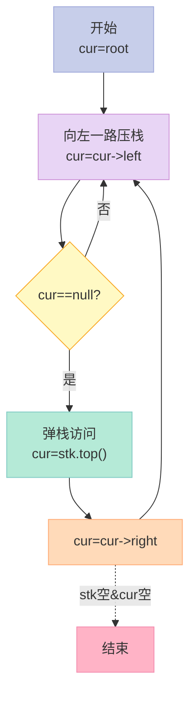

### 3.3 前序遍历：迭代版

```cpp
// 前序遍历迭代版：根 -> 左 -> 右
void preorder_iter(TreeNode* root) {
    if (!root) return;
    std::stack<TreeNode*> stk;
    stk.push(root);
    while (!stk.empty()) {
        TreeNode* node = stk.top(); stk.pop();
        visit(node);
        // 栈是 LIFO，先压右再压左，弹出时才是 左 -> 右
        if (node->right) stk.push(node->right);
        if (node->left)  stk.push(node->left);
    }
}
```

### 3.4 后序遍历：迭代版（最难）

```cpp
// 后序遍历迭代版：左 -> 右 -> 根
// 思路：前序是 根->左->右，反过来是 根->右->左，再 reverse 就是 后序
void postorder_iter(TreeNode* root) {
    if (!root) return;
    std::stack<TreeNode*> stk;
    std::vector<int> out;
    stk.push(root);
    while (!stk.empty()) {
        TreeNode* node = stk.top(); stk.pop();
        out.push_back(node->val);
        if (node->left)  stk.push(node->left);
        if (node->right) stk.push(node->right);
    }
    std::reverse(out.begin(), out.end());   // 反转得到后序
    for (int v : out) visit_dummy(v);
}
```

### 3.5 层序遍历：BFS 模板

```cpp
// 层序遍历（BFS）：用队列实现，按层访问
std::vector<std::vector<int>> levelOrder(TreeNode* root) {
    std::vector<std::vector<int>> ans;
    if (!root) return ans;
    std::queue<TreeNode*> q;
    q.push(root);
    while (!q.empty()) {
        int sz = q.size();                 // 关键：保存当前层大小
        std::vector<int> level;
        for (int i = 0; i < sz; ++i) {
            TreeNode* node = q.front(); q.pop();
            level.push_back(node->val);
            if (node->left)  q.push(node->left);
            if (node->right) q.push(node->right);
        }
        ans.push_back(level);
    }
    return ans;
}
```

**LeetCode 变体**：

| 题号 | 题目 | 难度 | 关键技巧 |
|------|------|------|---------|
| 102 | 二叉树的层序遍历 | ⭐⭐ | BFS 模板 |
| 103 | 之字形层序 | ⭐⭐⭐ | 双端队列或反转 |
| 107 | 自底向上层序 | ⭐⭐ | 结果反转 |
| 199 | 二叉树的右视图 | ⭐⭐ | 每层最后一个 |
| 515 | 找树左下角的值 | ⭐⭐ | 每层第一个 + BFS |
| 637 | 二叉树的层平均值 | ⭐⭐ | BFS 求和 |

### 3.6 Morris 遍历：O(1) 空间的中序遍历

```cpp
// Morris 中序遍历：利用叶子节点的空指针，O(1) 额外空间
void morris_inorder(TreeNode* root) {
    TreeNode* cur = root;
    while (cur) {
        if (!cur->left) {
            visit(cur);
            cur = cur->right;
        } else {
            // 找 cur 左子树的最右节点（前驱）
            TreeNode* pre = cur->left;
            while (pre->right && pre->right != cur) {
                pre = pre->right;
            }
            if (!pre->right) {
                pre->right = cur;          // 建立线索
                cur = cur->left;
            } else {
                pre->right = nullptr;      // 断开线索
                visit(cur);
                cur = cur->right;
            }
        }
    }
}
```

**Morris 遍历的精髓**：**把树临时改成"线索二叉树"**，访问完再改回来。空间复杂度 O(1)，但会**临时修改树结构**（不适用于多线程场景）。

### 3.7 4 种遍历对比表

| 遍历 | 顺序 | 递归栈深度 | 迭代数据结构 | 时间 | 空间 | Morris |
|------|------|----------|------------|------|------|--------|
| 前序 | 根左右 | O(h) | 栈 | O(n) | O(h) | ✅ |
| 中序 | 左根右 | O(h) | 栈 | O(n) | O(h) | ✅ |
| 后序 | 左右根 | O(h) | 栈（双栈或反序） | O(n) | O(h) | ✅ |
| 层序 | 一层一层 | - | 队列 | O(n) | O(w) | ❌ |

> h = 树高，w = 最大层宽。BST 的中序遍历结果是**升序**的，这是 BST 最重要的性质之一。

### 3.8 实战例题：根据前序+中序构造二叉树

```cpp
// LeetCode 105：根据前序和中序遍历构造二叉树
TreeNode* buildTree(std::vector<int>& preorder, std::vector<int>& inorder) {
    if (preorder.empty()) return nullptr;
    int root_val = preorder[0];
    TreeNode* root = new TreeNode(root_val);
    // 在中序中找到根的位置
    int idx = 0;
    while (inorder[idx] != root_val) ++idx;
    // 切分左右子树的前序、中序
    std::vector<int> pre_left(preorder.begin() + 1, preorder.begin() + 1 + idx);
    std::vector<int> pre_right(preorder.begin() + 1 + idx, preorder.end());
    std::vector<int> in_left(inorder.begin(), inorder.begin() + idx);
    std::vector<int> in_right(inorder.begin() + idx + 1, inorder.end());
    root->left  = buildTree(pre_left,  in_left);
    root->right = buildTree(pre_right, in_right);
    return root;
}
```

**复杂度优化版（哈希表定位 idx）**：

```cpp
TreeNode* buildTreeFast(std::vector<int>& preorder, std::vector<int>& inorder) {
    std::unordered_map<int, int> idx_map;
    for (int i = 0; i < (int)inorder.size(); ++i) idx_map[inorder[i]] = i;
    return helper(preorder, 0, preorder.size() - 1,
                  inorder,  0, inorder.size()  - 1, idx_map);
}

TreeNode* helper(std::vector<int>& pre, int pl, int pr,
                 std::vector<int>& in,  int il, int ir,
                 std::unordered_map<int, int>& mp) {
    if (pl > pr || il > ir) return nullptr;
    int root_val = pre[pl];
    int idx = mp[root_val];                // O(1) 定位
    int left_size = idx - il;
    TreeNode* root = new TreeNode(root_val);
    root->left  = helper(pre, pl + 1, pl + left_size,
                         in,  il, idx - 1, mp);
    root->right = helper(pre, pl + left_size + 1, pr,
                         in,  idx + 1, ir, mp);
    return root;
}
```

**时间复杂度**：从 O(n²) 优化到 O(n)，**面试中这一步是拉开差距的关键**。

---

## 四、BST：二叉搜索树与其致命缺陷

### 4.1 BST 定义与性质

**二叉搜索树（Binary Search Tree, BST）**：左子树所有节点 < 根 < 右子树所有节点。

| 操作 | 平均 | 最坏（退化为链表） |
|------|------|-----------------|
| 查找 | O(log n) | O(n) |
| 插入 | O(log n) | O(n) |
| 删除 | O(log n) | O(n) |

### 4.2 BST 的"癌症"：退化

**问题**：如果插入的数据是 `1, 2, 3, 4, 5`，BST 会退化成一条链表，所有操作变成 O(n)。

**解决思路**：**强制让树保持平衡**。这就是 AVL 和红黑树的动机。

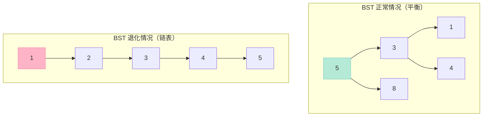

### 4.3 BST 插入（C++ 实现）

```cpp
// BST 节点
struct BSTNode {
    int key;
    BSTNode* left;
    BSTNode* right;
    BSTNode(int k) : key(k), left(nullptr), right(nullptr) {}
};

// BST 插入（递归）
BSTNode* bst_insert(BSTNode* root, int key) {
    if (!root) return new BSTNode(key);
    if (key < root->key)
        root->left  = bst_insert(root->left,  key);
    else if (key > root->key)
        root->right = bst_insert(root->right, key);
    return root;                          // 重复键：不插入
}
```

### 4.4 BST 删除（三种情况）

```cpp
// BST 删除节点
BSTNode* bst_delete(BSTNode* root, int key) {
    if (!root) return nullptr;
    if (key < root->key) {
        root->left = bst_delete(root->left, key);
    } else if (key > root->key) {
        root->right = bst_delete(root->right, key);
    } else {
        // 命中：分三种情况
        if (!root->left) {                // 情况 1：只有右子树
            BSTNode* r = root->right;
            delete root;
            return r;
        } else if (!root->right) {        // 情况 2：只有左子树
            BSTNode* l = root->left;
            delete root;
            return l;
        } else {
            // 情况 3：左右都有，找后继（右子树最小）替换
            BSTNode* succ = root->right;
            while (succ->left) succ = succ->left;
            root->key = succ->key;        // 复制值
            root->right = bst_delete(root->right, succ->key);
        }
    }
    return root;
}
```

**后继 vs 前驱删除策略**：

| 策略 | 替换值 | 递归删除 | 适用 |
|------|-------|---------|------|
| **后继法** | 右子树最小 | 删右子树 | 数据无重复 |
| **前驱法** | 左子树最大 | 删左子树 | 同上 |
| **合并法** | - | 合并左右子树 | 删除操作多 |

---

## 五、AVL 树：最严格的平衡

### 5.1 什么是 AVL？

**AVL 树（Adelson-Velsky and Landis Tree）**：是**第一个被发明的自平衡二叉搜索树**。定义：任意节点的左右子树高度差（**平衡因子**）绝对值 ≤ 1。

**平衡因子（Balance Factor, BF）**：`BF(node) = height(left) - height(right)`，AVL 要求 `BF ∈ {-1, 0, 1}`。

### 5.2 AVL 节点定义

```cpp
struct AVLNode {
    int key;
    int height;            // 节点高度（叶子为 1，空为 0）
    AVLNode* left;
    AVLNode* right;
    AVLNode(int k) : key(k), height(1), left(nullptr), right(nullptr) {}
};

int getHeight(AVLNode* n) { return n ? n->height : 0; }
int getBF(AVLNode* n)    { return n ? getHeight(n->left) - getHeight(n->right) : 0; }
```

### 5.3 AVL 的 4 种旋转

**核心口诀**：**LL 右旋、RR 左旋、LR 先左后右、RL 先右后左**。

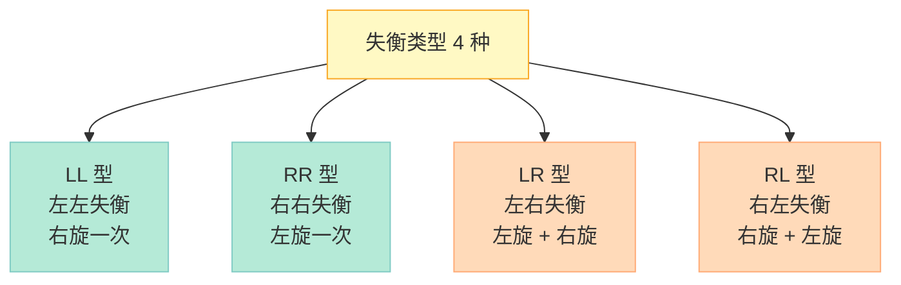

#### 5.3.1 右旋（LL 型）

```cpp
// 右旋：处理 LL（左左）失衡
AVLNode* rotateRight(AVLNode* y) {
    AVLNode* x  = y->left;
    AVLNode* t2 = x->right;
    x->right = y;
    y->left  = t2;
    // 更新高度（先子后父）
    y->height = 1 + std::max(getHeight(y->left),  getHeight(y->right));
    x->height = 1 + std::max(getHeight(x->left),  getHeight(x->right));
    return x;                            // 新根
}
```

#### 5.3.2 左旋（RR 型）

```cpp
// 左旋：处理 RR（右右）失衡
AVLNode* rotateLeft(AVLNode* x) {
    AVLNode* y  = x->right;
    AVLNode* t2 = y->left;
    y->left  = x;
    x->right = t2;
    x->height = 1 + std::max(getHeight(x->left),  getHeight(x->right));
    y->height = 1 + std::max(getHeight(y->left),  getHeight(y->right));
    return y;
}
```

#### 5.3.3 旋转图解

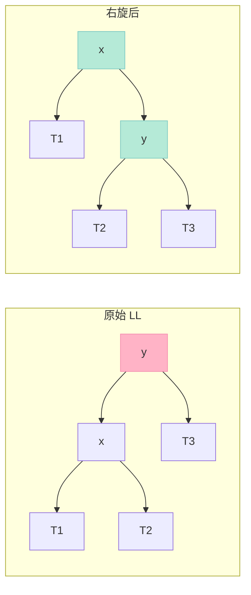

### 5.4 AVL 插入（含自平衡）

```cpp
// AVL 插入：递归插入 + 旋转恢复平衡
AVLNode* avl_insert(AVLNode* node, int key) {
    // 1. 正常 BST 插入
    if (!node) return new AVLNode(key);
    if (key < node->key) node->left  = avl_insert(node->left,  key);
    else if (key > node->key) node->right = avl_insert(node->right, key);
    else return node;                     // 不允许重复

    // 2. 更新高度
    node->height = 1 + std::max(getHeight(node->left), getHeight(node->right));

    // 3. 计算平衡因子，判断失衡类型
    int bf = getBF(node);
    // LL：左左
    if (bf > 1 && key < node->left->key)
        return rotateRight(node);
    // RR：右右
    if (bf < -1 && key > node->right->key)
        return rotateLeft(node);
    // LR：左右
    if (bf > 1 && key > node->left->key) {
        node->left = rotateLeft(node->left);
        return rotateRight(node);
    }
    // RL：右左
    if (bf < -1 && key < node->right->key) {
        node->right = rotateRight(node->right);
        return rotateLeft(node);
    }
    return node;
}
```

### 5.5 AVL 性能分析

| 操作 | 时间复杂度 | 备注 |
|------|----------|------|
| 查找 | O(log n) | **最严格平衡** |
| 插入 | O(log n) | 最多 2 次旋转 |
| 删除 | O(log n) | **最多 O(log n) 次旋转** |
| 高度 | h ≤ 1.44 × log₂(n+2) | 最差情况 |

**AVL 的优点**：查询效率最高（树最矮）。
**AVL 的缺点**：插入/删除需要多次旋转，**维护成本高**。

### 5.6 AVL 的适用场景

| 场景 | 是否适合 | 原因 |
|------|---------|------|
| 数据库索引 | ❌ | 插入删除频繁，旋转代价高 |
| 内存中的查询 | ✅ | 树更矮，查询快 |
| STL map | ❌ | 删除/插入性能 < 红黑树 |
| 字典/词典 | ✅ | 静态数据，查询为主 |

---

## 六、红黑树 RB-Tree：工业界的事实标准

### 6.1 为什么 STL 选红黑树不选 AVL？

这是 C++ 面试的**最高频追问之一**。简短回答：

> **红黑树是"近似平衡"的，AVL 是"严格平衡"的。插入/删除时，AVL 最多需要 O(log n) 次旋转，红黑树最多只需要 3 次旋转。** 对于**插入/删除密集、查询也频繁**的场景（如 `std::map`），红黑树的总开销更小。

### 6.2 红黑树的 5 大性质

| # | 性质 | 含义 |
|---|------|------|
| 1 | 每个节点要么红要么黑 | 颜色属性 |
| 2 | 根节点是黑色 | 简化边界 |
| 3 | 每个叶子（NIL）是黑色 | NIL 是外部空节点 |
| 4 | 红节点的子节点必须是黑色（**不能有连续红节点**） | 关键约束 |
| 5 | **从任一节点到其所有后代叶子的路径上，黑色节点数相同**（**黑高一致**） | 保证近似平衡 |

**由性质 5 推导**：
- 最长路径（红黑交替）≤ 2 × 最短路径（全黑）
- 因此**树高 ≤ 2 × log₂(n+1)**，即**近似 O(log n)**

### 6.3 红黑树节点定义

```cpp
// 颜色枚举
enum Color { RED, BLACK };

// 红黑树节点
struct RBNode {
    int key;
    Color color;
    RBNode* left;
    RBNode* right;
    RBNode* parent;
    RBNode(int k) : key(k), color(RED),     // 新节点默认红色
                     left(nullptr), right(nullptr), parent(nullptr) {}
};
```

### 6.4 红黑树图示

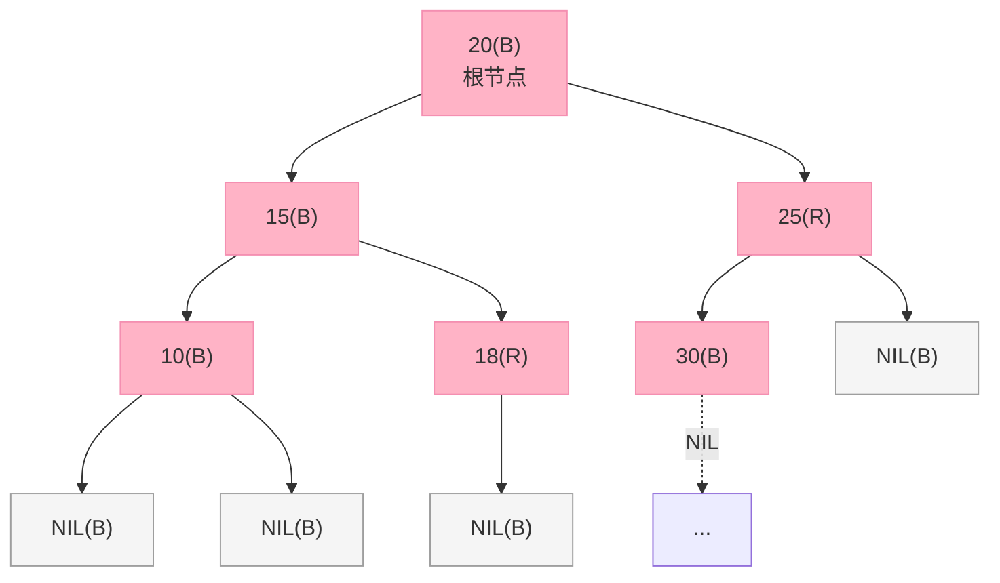

### 6.5 旋转操作（红黑树与 AVL 相同）

```cpp
// 左旋（红黑树版，带 parent 指针）
void rb_rotate_left(RBNode*& root, RBNode* x) {
    RBNode* y = x->right;
    x->right = y->left;
    if (y->left) y->left->parent = x;
    y->parent = x->parent;
    if (!x->parent)       root = y;
    else if (x == x->parent->left) x->parent->left  = y;
    else                     x->parent->right = y;
    y->left   = x;
    x->parent = y;
}

// 右旋
void rb_rotate_right(RBNode*& root, RBNode* x) {
    RBNode* y = x->left;
    x->left = y->right;
    if (y->right) y->right->parent = x;
    y->parent = x->parent;
    if (!x->parent)       root = y;
    else if (x == x->parent->right) x->parent->right = y;
    else                      x->parent->left  = y;
    y->right  = x;
    x->parent = y;
}
```

### 6.6 红黑树插入的 3 种情况

**核心思路**：新节点默认**红色**（不会破坏性质 5），但可能违反性质 4（红父红子）。**修复时根据"叔节点颜色"分情况**。

| Case | 描述 | 修复策略 |
|------|------|---------|
| **Case 1** | 叔节点是红色 | 父、叔变黑，祖父变红，**向上递归** |
| **Case 2** | 叔节点是黑色，**当前节点是内侧**（LR 或 RL） | 先旋转成 Case 3 |
| **Case 3** | 叔节点是黑色，**当前节点是外侧**（LL 或 RR） | 父变黑、祖父变红，旋转祖父 |

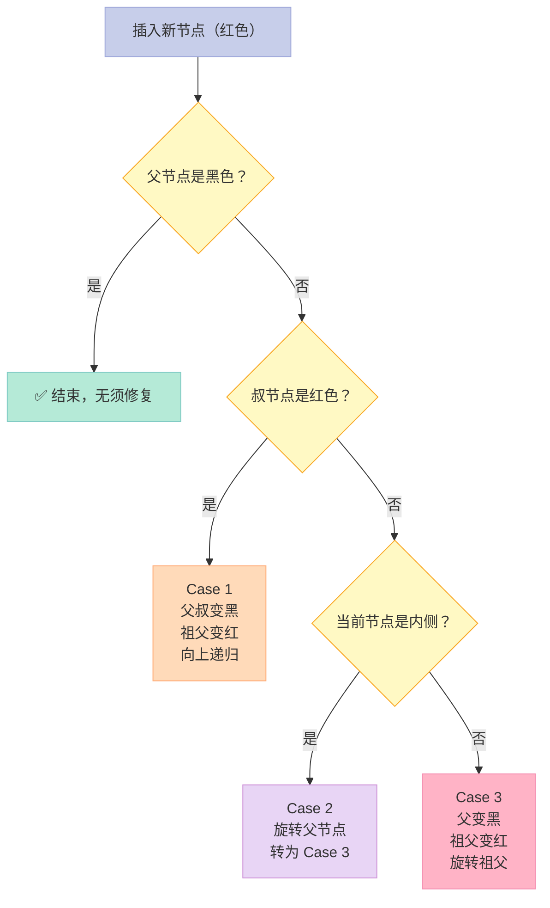

### 6.7 红黑树删除的 4 种情况

红黑树删除比插入更复杂，最多涉及 **6 种情况**（左右对称），本质围绕"**双重黑节点**"的处理。

| Case | 描述 | 修复 |
|------|------|------|
| 1 | 兄弟是红色 | 兄弟变黑、父变红、旋转父 |
| 2 | 兄弟黑、兄弟两子黑 | 兄弟变红、双黑上移 |
| 3 | 兄弟黑、远侄黑、近侄红 | 旋转成 Case 4 |
| 4 | 兄弟黑、远侄红 | 兄弟继承父色、远侄变黑、父变黑、旋转父 |

**面试中通常只需要讲清楚**：
- 删除节点后用**后继节点填补**
- 当填补节点是黑色时，需要**修复双黑**（4 种情况）
- 修复过程**最多 3 次旋转**（红黑树的关键优势）

### 6.8 红黑树 vs AVL 终极对比

| 维度 | AVL | 红黑树 | 赢家 |
|------|-----|-------|------|
| **平衡严格度** | 严格（BF ≤ 1） | 近似（黑高一致） | AVL |
| **树高** | 1.44 × log₂(n+2) | ≤ 2 × log₂(n+1) | AVL（更矮） |
| **查找效率** | 更快 | 略慢 | AVL |
| **插入旋转** | 最多 2 次 | 最多 2 次 | 平手 |
| **删除旋转** | **最多 O(log n) 次** | **最多 3 次** | **红黑树** |
| **插入/删除性能** | 较差 | **更好** | **红黑树** |
| **实现复杂度** | 中 | 高（5 性质 + 修复） | AVL |
| **应用场景** | 数据库静态索引 | **STL map/set、Linux CFS、epoll** | 红黑树 |
| **是否被工业界首选** | ❌ | ✅ | **红黑树** |

**关键洞察**：
- AVL 是**查询密集**场景的最优解
- 红黑树是**插入/删除密集**场景的最优解
- **STL 选红黑树**：`std::map` / `std::set` 的接口里 `insert` / `erase` 频繁使用，**总开销 = 查询 + 维护**，红黑树胜

### 6.9 红黑树在工业界的应用

| 系统/项目 | 红黑树用途 |
|----------|----------|
| **C++ STL** | `std::map` / `std::set` / `std::multimap` / `std::multiset` |
| **Java** | `TreeMap` / `TreeSet` |
| **Linux 内核** | CFS 调度器、epoll 事件管理 |
| **Nginx** | 定时器管理 |
| **C++ libstdc++** | 内部使用 `_Rb_tree` |
| **epoll** | 红黑树存储所有就绪 fd |

---

## 七、B 树 / B+ 树 / B* 树：磁盘时代的王者

### 7.1 为什么需要 B 树？

**AVL 和红黑树都在内存中工作**，但 **数据库索引在磁盘上**。磁盘 IO（一次 ~10ms）比内存访问（~100ns）**慢 10 万倍**。因此：

> **B 树的设计目标**：**减少磁盘 IO 次数**。一个 m 阶 B 树，高度为 h，磁盘 IO 次数 = h。

### 7.2 磁盘页模型

| 存储 | 访问时间 | IO 粒度 |
|------|---------|---------|
| 寄存器 | < 1 ns | 字节 |
| L1 缓存 | 1 ns | 64 字节 cache line |
| L2 缓存 | 3 ns | 64 字节 |
| L3 缓存 | 10 ns | 64 字节 |
| **内存** | **100 ns** | **4 KB 页** |
| **SSD 磁盘** | **100 μs** | **4~16 KB 块** |
| **机械硬盘** | **10 ms** | **4 KB 扇区** |

**关键洞察**：磁盘一次 IO 读 4KB 整页，**B 树节点大小 = 1 页 = 4KB** 是最优设计。

### 7.3 B 树的定义

**m 阶 B 树**（B-Tree of order m）满足：
- 每个节点**最多 m 个子节点**
- 每个非根节点**至少 ⌈m/2⌉ 个子节点**（根节点至少 2 个）
- 一个有 k 个子节点的非叶节点包含 **k-1 个键**
- 所有叶子节点在同一层
- 键在节点内**有序**

**举例**：4 阶 B 树（即 2-3-4 树）：

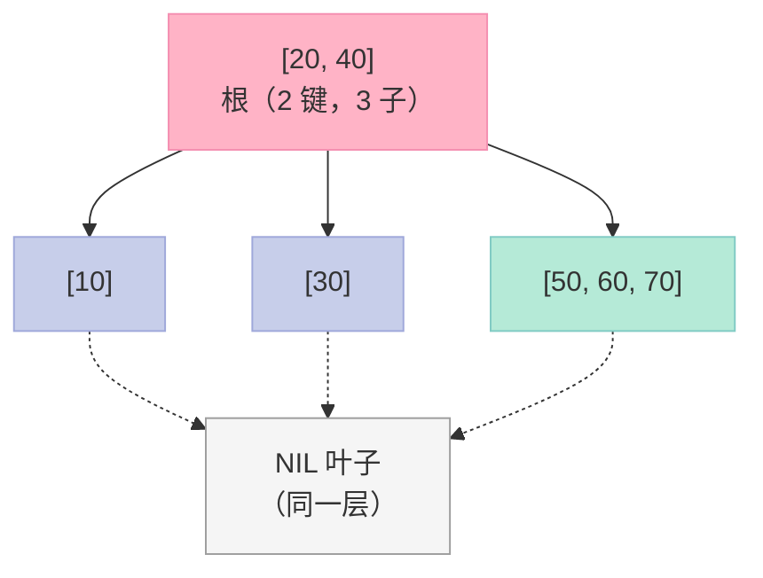

### 7.4 B 树的插入与节点分裂

**核心操作**：当节点**键数 = m-1** 时再插入会溢出，需要**分裂**：
1. 取中间键（median）提升到父节点
2. 中间键左右两边分裂成两个节点
3. 如果父节点也溢出，**递归分裂**

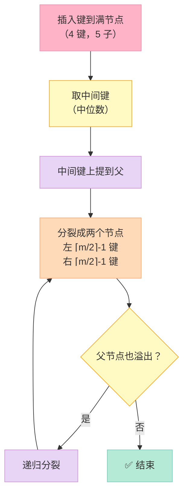

### 7.5 B 树删除与节点合并

**删除时可能需要"借键"或"合并"**：
- 删后节点键数 < ⌈m/2⌉ - 1：下溢
- **借键**：从兄弟节点借一个，父节点补一个
- **合并**：兄弟也不够借时，与兄弟合并，父节点对应键下放

### 7.6 B+ 树：B 树的"数据库特化版"

**B+ 树 vs B 树的关键差异**：

| 特性 | B 树 | B+ 树 |
|------|------|------|
| 数据存储 | 所有节点都存数据 | **只有叶子节点存数据** |
| 叶子节点 | 独立 | **用链表串联**（范围查询快） |
| 内节点 | 存键 + 数据 | **只存键（导航用）** |
| 键数 vs 子节点 | k-1 键 k 子 | **k 键 k 子** |
| 查找 | 可能提前命中内节点 | **必须到叶子** |
| 范围查询 | 需要中序遍历整树 | **链表 O(k) 扫描** |
| 高度 | 较低 | **更矮**（内节点能存更多键） |
| 应用 | 文件系统（HFS+） | **数据库索引（MySQL InnoDB）** |

### 7.7 B+ 树图示

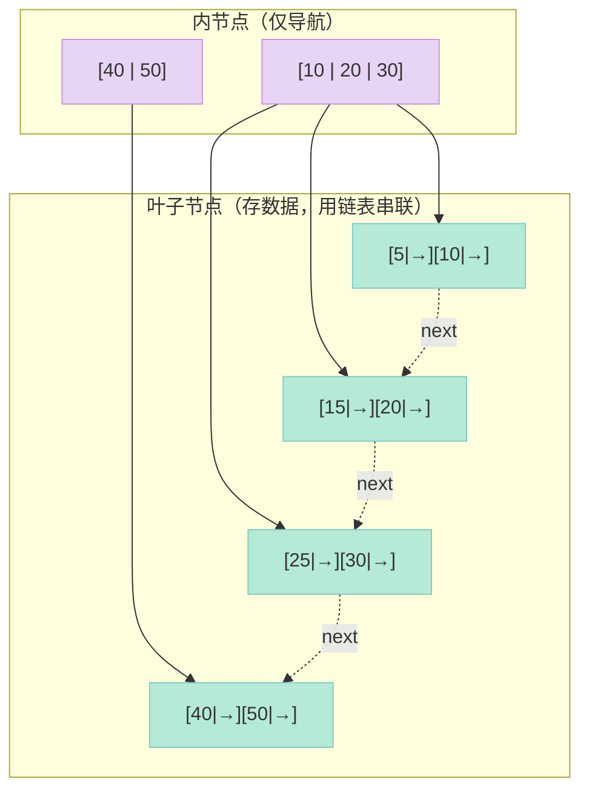

### 7.8 为什么 MySQL InnoDB 用 B+ 树不用 B 树？

| 角度 | B 树 | B+ 树 |
|------|------|------|
| 范围查询 `WHERE x BETWEEN 10 AND 100` | 中序遍历，O(n) | 叶子链表，O(k) |
| 等值查询 | 可能在中间节点命中 | 必到叶子，**更稳定** |
| 扇出（fanout） | 较小 | **更大**（内节点不带数据） |
| 高度 | 较高 | **更矮** |
| 磁盘 IO | 较多 | **更少** |
| 适合场景 | 文件系统 | **数据库** |

**示例**：`SELECT * FROM user WHERE id BETWEEN 1000 AND 2000`
- B 树：回到根节点重新遍历（中序）
- B+ 树：从叶子 1000 沿链表一路扫到 2000，**只读叶子页**

### 7.9 B* 树：B+ 树的"空间优化版"

**B* 树改进点**：
- B+ 树节点满时直接**分裂**（2 分）
- B* 树节点满时先**尝试转移到兄弟节点**（3 分），只有兄弟也满才分裂
- 结果：**节点空间利用率从 50% 提高到 2/3 或更高**

| 特性 | B 树 | B+ 树 | B* 树 |
|------|------|------|-------|
| 节点最小键数 | ⌈m/2⌉-1 | ⌈m/2⌉-1 | **⌈2m/3⌉-1** |
| 空间利用率 | ~50% | ~50% | **~67%** |
| 分裂策略 | 直接 2 分 | 直接 2 分 | **优先 3 分** |
| 实现复杂度 | 中 | 中 | **高** |
| 应用 | NTFS | MySQL | 部分数据库 |

### 7.10 4 种树型结构对比

| 维度 | AVL | 红黑树 | B 树 | B+ 树 |
|------|-----|-------|------|------|
| 阶数 | 2（二叉） | 2（二叉） | 多叉 | 多叉 |
| 高度 | 1.44 log n | 2 log n | log_m n | **log_m n（最低）** |
| 适用场景 | 内存查询 | 内存插入删除 | 文件系统 | **数据库** |
| 工业应用 | - | STL map | NTFS/HFS+ | **MySQL InnoDB** |

---

## 八、Trie 字典树：字符串前缀匹配神器

### 8.1 什么是 Trie？

**Trie 树（前缀树 / 字典树）**：一种**多叉树**，每个节点代表一个字符，从根到某节点的路径构成一个前缀。**典型应用**：自动补全、拼写检查、IP 路由、字典序排序。

### 8.2 Trie 节点定义

```cpp
// Trie 节点
struct TrieNode {
    TrieNode* children[26];      // 26 个字母（可换成 unordered_map<char, TrieNode*>）
    bool isEnd;                  // 是否是某个单词的结尾
    TrieNode() : isEnd(false) {
        for (int i = 0; i < 26; ++i) children[i] = nullptr;
    }
};
```

**优化版**（节省空间）：

```cpp
struct TrieNode {
    std::unordered_map<char, TrieNode*> children;
    bool isEnd = false;
};
```

### 8.3 Trie 核心操作

```cpp
class Trie {
    TrieNode* root;
public:
    Trie() : root(new TrieNode()) {}

    // 插入单词
    void insert(const std::string& word) {
        TrieNode* node = root;
        for (char c : word) {
            int idx = c - 'a';
            if (!node->children[idx]) {
                node->children[idx] = new TrieNode();
            }
            node = node->children[idx];
        }
        node->isEnd = true;          // 标记单词结尾
    }

    // 查找完整单词
    bool search(const std::string& word) {
        TrieNode* node = root;
        for (char c : word) {
            int idx = c - 'a';
            if (!node->children[idx]) return false;
            node = node->children[idx];
        }
        return node->isEnd;          // 必须以 isEnd 结尾
    }

    // 查找前缀
    bool startsWith(const std::string& prefix) {
        TrieNode* node = root;
        for (char c : prefix) {
            int idx = c - 'a';
            if (!node->children[idx]) return false;
            node = node->children[idx];
        }
        return true;                 // 路径存在即可
    }
};
```

### 8.4 Trie 图示

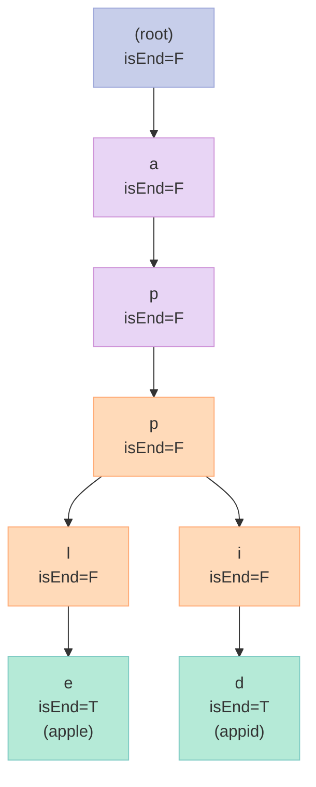

### 8.5 Trie 的复杂度

| 操作 | 时间复杂度 | 空间复杂度 |
|------|----------|----------|
| 插入 | O(L) | O(L) |
| 查找 | O(L) | - |
| 前缀查找 | O(P) | - |
| 字典序遍历 | O(n) | - |

> L = 单词长度，P = 前缀长度，n = 节点总数

### 8.6 Trie vs 哈希表

| 维度 | Trie | 哈希表 |
|------|------|--------|
| 前缀查询 | **O(P) 极快** | **不支持**（必须查所有 key） |
| 等值查询 | O(L) | **O(1) 平均** |
| 字典序 | **天然支持** | 不支持 |
| 内存 | **大**（每个字符一个节点） | 中等 |
| 实现 | 较复杂 | 简单 |
| 应用 | 搜索引擎、IP 路由 | 缓存、判重 |

### 8.7 LeetCode 高频 Trie 题

| 题号 | 题目 | 难度 |
|------|------|------|
| 208 | 实现 Trie | ⭐⭐ |
| 211 | 添加与搜索单词 | ⭐⭐⭐ |
| 212 | 单词搜索 II | ⭐⭐⭐⭐ |
| 648 | 单词替换 | ⭐⭐ |
| 720 | 词典中最长的单词 | ⭐⭐ |
| 1268 | 搜索推荐系统 | ⭐⭐⭐ |

---

## 九、哈夫曼树与编码：数据压缩的数学之美

### 9.1 什么是哈夫曼编码？

**哈夫曼编码（Huffman Coding）**：一种**最优前缀码**（无歧义、可即时解码），用**不同长度的二进制位**表示不同字符：**出现频率高的字符用短编码，频率低的用长编码**。

### 9.2 哈夫曼树的构造

**算法步骤**：
1. 统计字符频率
2. 每个字符建一个**单节点树**（权重 = 频率），放入**最小堆**
3. 反复取出**权重最小的两棵树**，合并成一棵新树，新树权重 = 两子树权重之和
4. 重复直到堆中只剩一棵树，即为**哈夫曼树**

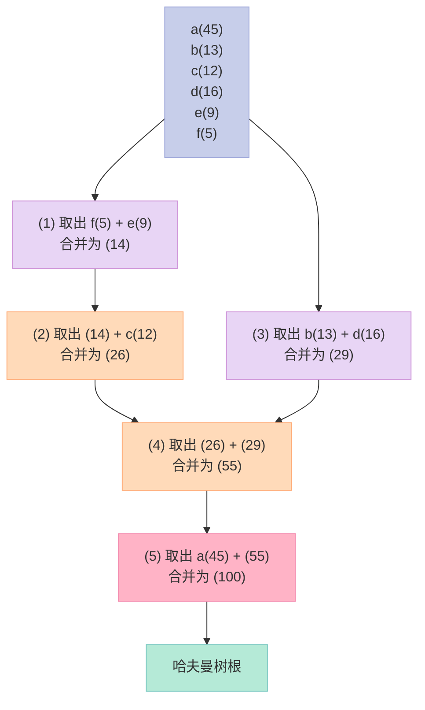

### 9.3 哈夫曼编码示例

假设字符频率：

| 字符 | 频率 | 编码长度 | 编码 |
|------|-----|---------|------|
| a | 45 | 1 | 0 |
| b | 13 | 3 | 100 |
| c | 12 | 3 | 101 |
| d | 16 | 3 | 110 |
| e | 9 | 4 | 1110 |
| f | 5 | 4 | 1111 |

**平均码长** = (45×1 + 13×3 + 12×3 + 16×3 + 9×4 + 5×4) / 100 = **2.42 bit/字符**

对比定长编码 3 bit/字符，**节省 19%** 空间。

### 9.4 哈夫曼树 C++ 实现

```cpp
#include <queue>
#include <vector>
#include <string>
#include <unordered_map>

struct HuffmanNode {
    char ch;
    int freq;
    HuffmanNode* left;
    HuffmanNode* right;
    HuffmanNode(char c, int f) : ch(c), freq(f), left(nullptr), right(nullptr) {}
};

// 小顶堆：freq 小的优先
struct Compare {
    bool operator()(HuffmanNode* a, HuffmanNode* b) {
        return a->freq > b->freq;
    }
};

HuffmanNode* buildHuffmanTree(const std::unordered_map<char, int>& freq) {
    std::priority_queue<HuffmanNode*, std::vector<HuffmanNode*>, Compare> pq;
    for (auto& [ch, f] : freq) {
        pq.push(new HuffmanNode(ch, f));
    }
    while (pq.size() > 1) {
        HuffmanNode* x = pq.top(); pq.pop();
        HuffmanNode* y = pq.top(); pq.pop();
        HuffmanNode* z = new HuffmanNode('\0', x->freq + y->freq);
        z->left  = x;
        z->right = y;
        pq.push(z);
    }
    return pq.top();
}

// 生成编码表
void genCodes(HuffmanNode* root, const std::string& path,
              std::unordered_map<char, std::string>& codes) {
    if (!root) return;
    if (root->ch != '\0') {              // 叶子节点
        codes[root->ch] = path;
    }
    genCodes(root->left,  path + "0", codes);
    genCodes(root->right, path + "1", codes);
}
```

### 9.5 哈夫曼树性质

| 性质 | 描述 |
|------|------|
| WPL 最小 | 带权路径长度（WPL）= 所有叶子的 `freq × depth` 最小 |
| 前缀码 | 任何字符的编码**不是**另一字符编码的前缀（即时解码） |
| 不唯一 | 不同合并顺序可能得到不同编码，但**WPL 相同** |
| 贪心最优 | 每次合并最小两棵 = 局部最优 → 全局最优 |
| 编码长度 | 不同字符编码长度**可不同**（变长编码） |

### 9.6 哈夫曼 vs 算术编码

| 维度 | 哈夫曼 | 算术编码 |
|------|--------|---------|
| 压缩率 | 中 | **更高** |
| 实现 | 简单 | 复杂 |
| 速度 | 快 | 慢 |
| 应用 | ZIP、PNG、JPEG | JPEG2000、AV1 |

---

## 十、堆（Heap）：优先队列的底层

### 10.1 堆的定义与性质

**堆（Heap）** 是一种**完全二叉树**结构，满足：
- **大顶堆**：父 ≥ 子（根最大）
- **小顶堆**：父 ≤ 子（根最小）
- **用数组存储**（无指针开销）

| 性质 | 数组下标关系 |
|------|------------|
| 父节点 i | `(i - 1) / 2` |
| 左子节点 i | `2 * i + 1` |
| 右子节点 i | `2 * i + 2` |

### 10.2 堆的图示

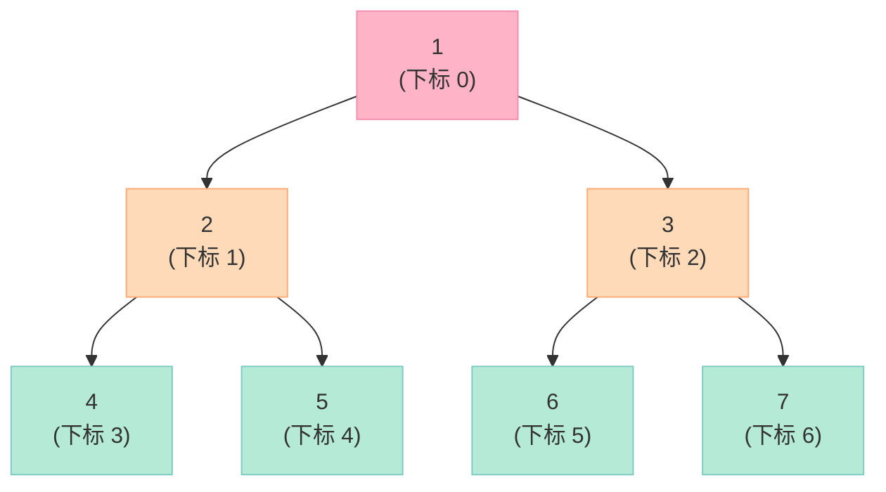

**数组存储**：`[1, 2, 3, 4, 5, 6, 7]`

### 10.3 堆化操作（Heapify）

**向下调整（sift down）**：

```cpp
// 向下调整：把 i 位置的元素下沉到正确位置
// 用于删除堆顶后重建堆
void siftDown(std::vector<int>& heap, int i, int n) {
    while (true) {
        int l = 2 * i + 1, r = 2 * i + 2, largest = i;
        if (l < n && heap[l] > heap[largest]) largest = l;
        if (r < n && heap[r] > heap[largest]) largest = r;
        if (largest == i) break;
        std::swap(heap[i], heap[largest]);
        i = largest;
    }
}
```

**向上调整（sift up）**：

```cpp
// 向上调整：把 i 位置的元素上浮到正确位置
// 用于插入新元素
void siftUp(std::vector<int>& heap, int i) {
    while (i > 0) {
        int parent = (i - 1) / 2;
        if (heap[parent] >= heap[i]) break;     // 大顶堆
        std::swap(heap[i], heap[parent]);
        i = parent;
    }
}
```

### 10.4 堆的核心操作

```cpp
class MaxHeap {
    std::vector<int> a;
public:
    // 插入
    void push(int x) {
        a.push_back(x);
        siftUp(a, a.size() - 1);
    }

    // 弹出堆顶
    int pop() {
        int top = a[0];
        a[0] = a.back();
        a.pop_back();
        if (!a.empty()) siftDown(a, 0, a.size());
        return top;
    }

    int top() const { return a[0]; }
    bool empty() const { return a.empty(); }
    int size() const { return (int)a.size(); }
};
```

### 10.5 建堆：O(n) 线性时间

```cpp
// 从无序数组建堆：自底向上 siftDown
// 时间复杂度 O(n)，不是 O(n log n)
void buildHeap(std::vector<int>& a) {
    int n = a.size();
    // 从最后一个非叶节点开始
    for (int i = n / 2 - 1; i >= 0; --i) {
        siftDown(a, i, n);
    }
}
```

**为什么是 O(n)？**
- 大部分 siftDown 很短（叶子节点）
- 整体加权：T(n) = n/2 × 0 + n/4 × 1 + n/8 × 2 + ... = O(n)

### 10.6 堆排序

```cpp
// 堆排序：O(n log n)，不稳定
void heapSort(std::vector<int>& a) {
    buildHeap(a);
    int n = a.size();
    for (int i = n - 1; i > 0; --i) {
        std::swap(a[0], a[i]);                // 把最大元素放到末尾
        siftDown(a, 0, i);                    // 剩余部分重新堆化
    }
}
```

### 10.7 Top-K 问题：堆的杀手锏

**问题**：从 10 亿个数中找最大的 K 个。

**两种思路**：

| 思路 | 数据结构 | 时间 | 空间 |
|------|---------|------|------|
| **大顶堆** | 维护一个大小为 n 的大顶堆，弹出 K 次 | O(n + K log n) | O(n) |
| **小顶堆** ✅ | 维护一个大小为 K 的小顶堆 | **O(n log K)** | **O(K)** |

```cpp
// Top-K 经典解法：小顶堆
std::vector<int> topK(const std::vector<int>& nums, int k) {
    // 小顶堆，堆顶是当前 K 个元素中最小的
    std::priority_queue<int, std::vector<int>, std::greater<int>> pq;
    for (int x : nums) {
        pq.push(x);
        if ((int)pq.size() > k) pq.pop();   // 弹出最小的，保留 K 个最大的
    }
    std::vector<int> ans;
    while (!pq.empty()) { ans.push_back(pq.top()); pq.pop(); }
    return ans;
}
```

### 10.8 堆 vs 优先队列

**优先队列（Priority Queue）** 是堆的"封装"，**STL 中的 `std::priority_queue` 默认是最大堆**。

```cpp
// STL 优先队列常用操作
std::priority_queue<int> pq;                 // 默认大顶堆
pq.push(3);                                  // 插入
pq.top();                                    // 堆顶
pq.pop();                                    // 弹出

// 自定义比较器（小顶堆）
auto cmp = [](int a, int b) { return a > b; };
std::priority_queue<int, std::vector<int>, decltype(cmp)> min_pq(cmp);
```

### 10.9 二叉堆 vs 斐波那契堆

**斐波那契堆（Fibonacci Heap）**：理论上的"最优堆"，**extract-min 是 O(log n) amortized，decrease-key 是 O(1) amortized**。

| 操作 | 二叉堆 | 斐波那契堆 |
|------|-------|----------|
| insert | O(log n) | **O(1) 均摊** |
| get-min | O(1) | O(1) |
| extract-min | O(log n) | O(log n) 均摊 |
| decrease-key | O(log n) | **O(1) 均摊** |
| merge | O(n) | **O(1)** |
| 应用 | 通用 | Dijkstra 优化 |

**实战意义**：
- 理论上看斐波那契堆更快，但**常数因子大、实现复杂**
- 工程中**Dijkstra 用二叉堆 + 邻接表就够**了，**STL 不用斐波那契堆**

---

## 十一、图：最通用的数据结构

### 11.1 图的定义

**图（Graph）** = 顶点集 V + 边集 E。

| 术语 | 定义 |
|------|------|
| **顶点（Vertex）** | 图中的节点 |
| **边（Edge）** | 顶点之间的连接 |
| **有向图** | 边有方向（A→B 不等于 B→A） |
| **无向图** | 边无方向 |
| **权重** | 边上的数值（距离、费用等） |
| **度** | 顶点连接的边数（无向图） |
| **入度/出度** | 指向顶点的边数 / 从顶点出发的边数 |

### 11.2 图的两种存储方式

#### 11.2.1 邻接矩阵

```cpp
// 邻接矩阵：n×n 二维数组
// 适用：稠密图
class GraphMatrix {
    int n;
    std::vector<std::vector<int>> mat;
public:
    GraphMatrix(int n) : n(n), mat(n, std::vector<int>(n, 0)) {}
    void addEdge(int u, int v) {
        mat[u][v] = 1;                       // 有向图
    }
    bool isConnected(int u, int v) {
        return mat[u][v] != 0;
    }
};
```

#### 11.2.2 邻接表

```cpp
// 邻接表：vector<list<pair<int,int>>> 或 vector<vector<pair<int,int>>>
// 适用：稀疏图（最常用）
class GraphList {
    int n;
    std::vector<std::vector<std::pair<int,int>>> adj;  // {邻居, 权重}
public:
    GraphList(int n) : n(n), adj(n) {}
    void addEdge(int u, int v, int w) {
        adj[u].push_back({v, w});
    }
    const auto& neighbors(int u) const { return adj[u]; }
};
```

### 11.3 两种存储方式对比

| 维度 | 邻接矩阵 | 邻接表 |
|------|---------|--------|
| 空间复杂度 | **O(V²)** | **O(V + E)** |
| 加边 | O(1) | O(1) |
| 查边 | **O(1)** | O(degree) |
| 遍历邻居 | O(V) | **O(degree)** |
| 适用图 | 稠密图（E ≈ V²） | **稀疏图（E ≪ V²）** |
| 实现难度 | 简单 | 简单 |
| 工程首选 | ❌ | **✅** |

### 11.4 图的常见类型速查

| 类型 | 关键特征 | 例子 |
|------|---------|------|
| 无向无权图 | 边无方向、无权重 | 社交网络好友关系 |
| 有向无权图 | 边有方向 | Web 页面链接 |
| 无向有权图 | 边有数值 | 道路距离 |
| 有向有权图 | **最通用** | 网络路由 |
| DAG（有向无环图） | 无环的有向图 | 任务调度、Makefile |
| 二分图 | 顶点可分两组、组内无边 | 匹配问题 |

---

## 十二、BFS 与 DFS：图的两大遍历法

### 12.1 BFS（广度优先搜索）

**BFS 思想**：用**队列**，**一层一层向外扩展**。
**应用**：**无权图最短路径**、**层序问题**、**连通分量**。

```cpp
// BFS 标准模板（求最短路径）
int bfs(const std::vector<std::vector<int>>& adj, int src, int dst) {
    int n = adj.size();
    std::vector<int> dist(n, -1);
    std::queue<int> q;
    dist[src] = 0;
    q.push(src);
    while (!q.empty()) {
        int u = q.front(); q.pop();
        if (u == dst) return dist[u];
        for (int v : adj[u]) {
            if (dist[v] == -1) {
                dist[v] = dist[u] + 1;
                q.push(v);
            }
        }
    }
    return -1;                              // 不可达
}
```

### 12.2 DFS（深度优先搜索）

**DFS 思想**：用**栈（或递归）**，**一条路走到黑**。
**应用**：**连通分量**、**拓扑排序**、**环检测**、**路径枚举**。

```cpp
// DFS 递归模板
void dfs(const std::vector<std::vector<int>>& adj, int u,
         std::vector<bool>& visited) {
    visited[u] = true;
    // visit(u)                          // 访问当前节点
    for (int v : adj[u]) {
        if (!visited[v]) dfs(adj, v, visited);
    }
}

// DFS 迭代模板（用栈模拟）
void dfsIter(const std::vector<std::vector<int>>& adj, int start) {
    int n = adj.size();
    std::vector<bool> visited(n, false);
    std::stack<int> stk;
    stk.push(start);
    while (!stk.empty()) {
        int u = stk.top(); stk.pop();
        if (visited[u]) continue;
        visited[u] = true;
        // visit(u)
        // 逆序压栈，保证出栈顺序与递归一致
        for (auto it = adj[u].rbegin(); it != adj[u].rend(); ++it) {
            if (!visited[*it]) stk.push(*it);
        }
    }
}
```

### 12.3 BFS vs DFS

| 维度 | BFS | DFS |
|------|-----|-----|
| 数据结构 | 队列 | 栈（递归） |
| 空间 | O(w)（w = 最宽层宽） | O(h)（h = 最深深度） |
| 最短路径 | **✅ 无权图最短** | ❌ |
| 环检测 | 需要标记 | 天然支持 |
| 路径问题 | 适合 | **适合** |
| 实现难度 | 简单 | 简单 |
| 内存爆炸 | 队列大时 OOM | **栈深时 OOM** |

### 12.4 BFS 时序图

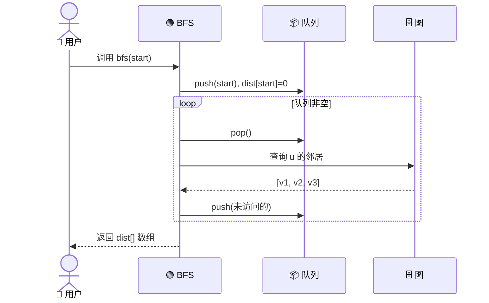

---

## 十三、最短路径：Dijkstra 与 Floyd

### 13.1 三种最短路算法对比

| 算法 | 适用 | 负权 | 时间 | 思想 |
|------|------|------|------|------|
| **Dijkstra** | 单源、正权 | ❌ | O((V+E) log V) | 贪心 + 优先队列 |
| **Bellman-Ford** | 单源、**可负权** | ✅ | O(VE) | 松弛 V-1 次 |
| **SPFA** | 单源、可负权 | ✅ | 平均 O(E) | 队列优化 Bellman |
| **Floyd-Warshall** | **多源** | ✅ | O(V³) | DP 转移 |
| **BFS** | 单源、**无权** | - | O(V+E) | 层序遍历 |

### 13.2 Dijkstra 算法详解

**核心思想**：**贪心** + **优先队列**。每次从**未访问**的节点中选**距离最小**的，更新邻居距离。

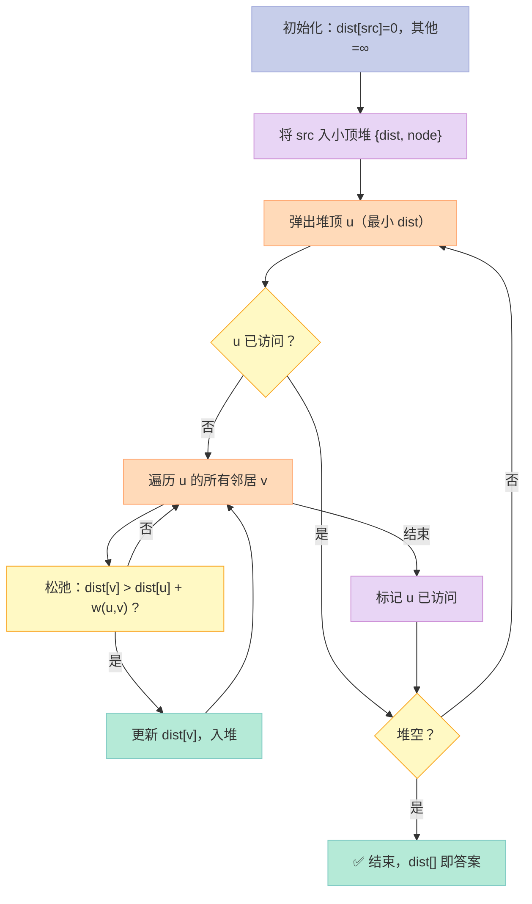

### 13.3 Dijkstra C++ 实现

```cpp
// Dijkstra 完整实现
// 返回从 src 到所有点的最短距离
std::vector<int> dijkstra(const std::vector<std::vector<std::pair<int,int>>>& adj,
                          int src) {
    int n = adj.size();
    std::vector<int> dist(n, INT_MAX);
    dist[src] = 0;
    // 小顶堆：{距离, 节点}
    using PII = std::pair<int,int>;
    std::priority_queue<PII, std::vector<PII>, std::greater<PII>> pq;
    pq.push({0, src});
    while (!pq.empty()) {
        auto [d, u] = pq.top(); pq.pop();
        if (d > dist[u]) continue;          // 跳过过时的条目
        for (auto [v, w] : adj[u]) {
            if (dist[v] > dist[u] + w) {
                dist[v] = dist[u] + w;       // 松弛
                pq.push({dist[v], v});
            }
        }
    }
    return dist;
}
```

### 13.4 Dijkstra 为什么不能处理负权？

**反例**：

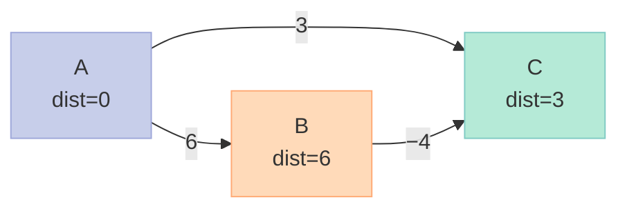

- Dijkstra 第一步：选 A，松弛 B=6, C=3
- Dijkstra 第二步：选 C（dist=3 最小），**标记 C 已访问**
- 实际上 **A→B→C = 6+(-4) = 2 < 3**
- 但 C 已被标记，**Dijkstra 错过更新**

**根本原因**：Dijkstra 的"已访问即最优"假设在负权下**不成立**。

### 13.5 Floyd-Warshall 算法

**核心思想**：**DP**。`dp[k][i][j]` = 经过编号 ≤ k 的中间点，i 到 j 的最短路。

```cpp
// Floyd-Warshall：多源最短路
void floyd(std::vector<std::vector<int>>& dist) {
    int n = dist.size();
    // k: 中间点
    for (int k = 0; k < n; ++k) {
        for (int i = 0; i < n; ++i) {
            for (int j = 0; j < n; ++j) {
                if (dist[i][k] != INT_MAX && dist[k][j] != INT_MAX) {
                    dist[i][j] = std::min(dist[i][j], dist[i][k] + dist[k][j]);
                }
            }
        }
    }
}
```

**Floyd 也能检测负权环**：

```cpp
// 如果 dist[i][i] < 0（i 到自己有负权环），则存在负权环
for (int i = 0; i < n; ++i) {
    if (dist[i][i] < 0) {
        // 存在负权环
    }
}
```

### 13.6 三种最短路算法对比

| 维度 | Dijkstra | Bellman-Ford | Floyd |
|------|----------|-------------|-------|
| 场景 | 单源正权 | 单源可负权 | **多源** |
| 负权 | ❌ | ✅ | ✅ |
| 负权环检测 | ❌ | ✅ | ✅ |
| 时间 | O((V+E) log V) | O(VE) | O(V³) |
| 空间 | O(V+E) | O(V+E) | O(V²) |
| 实现 | 中 | 简单 | **最简单** |
| 适用图规模 | 大 | 中 | **小**（V ≤ 500） |

### 13.7 实战：LeetCode 743 网络延迟时间

```cpp
// LeetCode 743：网络延迟时间
// 给定 n 个节点和 times[] = {u, v, w}，求从 k 出发到所有节点的最大距离
int networkDelayTime(std::vector<std::vector<int>>& times, int n, int k) {
    std::vector<std::vector<std::pair<int,int>>> adj(n + 1);
    for (auto& t : times) {
        adj[t[0]].push_back({t[1], t[2]});
    }
    std::vector<int> dist(n + 1, INT_MAX);
    dist[k] = 0;
    using PII = std::pair<int,int>;
    std::priority_queue<PII, std::vector<PII>, std::greater<PII>> pq;
    pq.push({0, k});
    while (!pq.empty()) {
        auto [d, u] = pq.top(); pq.pop();
        if (d > dist[u]) continue;
        for (auto [v, w] : adj[u]) {
            if (dist[v] > dist[u] + w) {
                dist[v] = dist[u] + w;
                pq.push({dist[v], v});
            }
        }
    }
    int maxd = *std::max_element(dist.begin() + 1, dist.end());
    return maxd == INT_MAX ? -1 : maxd;
}
```

---

## 十四、最小生成树：Prim 与 Kruskal

### 14.1 什么是 MST？

**最小生成树（Minimum Spanning Tree, MST）**：连通无向图中，**包含所有顶点 + V-1 条边 + 边权重和最小** 的子图。

**应用**：网络布线、电路设计、聚类、图像分割。

### 14.2 MST 的两条经典性质

| 性质 | 内容 |
|------|------|
| **切割性质** | 对于任意切割（顶点二分），横跨切割的最小边**必在 MST 中** |
| **环性质** | 对于任意环，环中最大边**不在 MST 中** |

### 14.3 Prim 算法

**思想**：**加点法**。从一个点出发，每次选**连接已选点集和未选点集**的最小边。

```cpp
// Prim 算法：返回 MST 总权重
int prim(const std::vector<std::vector<std::pair<int,int>>>& adj) {
    int n = adj.size();
    std::vector<int> dist(n, INT_MAX);    // 到 MST 的最小距离
    std::vector<bool> in_mst(n, false);
    dist[0] = 0;
    int total = 0;
    for (int i = 0; i < n; ++i) {
        // 1. 选未选节点中距离最小的
        int u = -1;
        for (int j = 0; j < n; ++j) {
            if (!in_mst[j] && (u == -1 || dist[j] < dist[u])) u = j;
        }
        if (dist[u] == INT_MAX) return -1;  // 不连通
        in_mst[u] = true;
        total += dist[u];
        // 2. 更新邻居
        for (auto [v, w] : adj[u]) {
            if (!in_mst[v] && w < dist[v]) {
                dist[v] = w;
            }
        }
    }
    return total;
}
```

**Prim 优化版（堆）**：

```cpp
int primHeap(const std::vector<std::vector<std::pair<int,int>>>& adj) {
    int n = adj.size();
    std::vector<bool> visited(n, false);
    std::priority_queue<std::pair<int,int>,
                        std::vector<std::pair<int,int>>,
                        std::greater<std::pair<int,int>>> pq;
    pq.push({0, 0});                      // {权重, 节点}
    int total = 0, count = 0;
    while (!pq.empty() && count < n) {
        auto [w, u] = pq.top(); pq.pop();
        if (visited[u]) continue;
        visited[u] = true;
        total += w;
        count++;
        for (auto [v, w2] : adj[u]) {
            if (!visited[v]) pq.push({w2, v});
        }
    }
    return count == n ? total : -1;
}
```

### 14.4 Kruskal 算法

**思想**：**加边法**。按权重排序所有边，依次加入，如果**不形成环**就加入（用**并查集**判断）。

```cpp
// Kruskal：使用并查集
struct Edge {
    int u, v, w;
    bool operator<(const Edge& o) const { return w < o.w; }
};

class UnionFind {
    std::vector<int> parent, rank_;
public:
    UnionFind(int n) : parent(n), rank_(n, 0) {
        iota(parent.begin(), parent.end(), 0);
    }
    int find(int x) {
        return parent[x] == x ? x : parent[x] = find(parent[x]);
    }
    bool unite(int x, int y) {
        x = find(x); y = find(y);
        if (x == y) return false;
        if (rank_[x] < rank_[y]) std::swap(x, y);
        parent[y] = x;
        if (rank_[x] == rank_[y]) rank_[x]++;
        return true;
    }
};

int kruskal(int n, std::vector<Edge>& edges) {
    std::sort(edges.begin(), edges.end());
    UnionFind uf(n);
    int total = 0, count = 0;
    for (auto& e : edges) {
        if (uf.unite(e.u, e.v)) {
            total += e.w;
            count++;
            if (count == n - 1) break;
        }
    }
    return count == n - 1 ? total : -1;
}
```

### 14.5 Prim vs Kruskal

| 维度 | Prim | Kruskal |
|------|------|---------|
| 思想 | 加点 | 加边 |
| 数据结构 | 优先队列 | 并查集 + 排序 |
| 时间复杂度 | O(E log V) | **O(E log E)** |
| 适用图 | **稠密图** | **稀疏图** |
| 实现难度 | 中 | 中（含并查集） |
| 边权重可相同 | ✅ | ✅ |

---

## 十五、拓扑排序

### 15.1 什么是拓扑序？

**拓扑排序（Topological Sort）**：DAG（有向无环图）中，将顶点排成**线性序列**，使得**每条有向边 u→v，u 在 v 之前**。

**应用**：任务调度、Makefile 依赖、课程先修关系、编译顺序。

### 15.2 Kahn 算法（BFS 法）

**核心**：**入度**。每次选入度为 0 的节点，输出，然后更新邻居的入度。

```cpp
// 拓扑排序 - Kahn 算法
std::vector<int> topoSort(int n,
                          const std::vector<std::vector<int>>& adj) {
    std::vector<int> indeg(n, 0);
    for (int u = 0; u < n; ++u) {
        for (int v : adj[u]) indeg[v]++;
    }
    std::queue<int> q;
    for (int i = 0; i < n; ++i) {
        if (indeg[i] == 0) q.push(i);
    }
    std::vector<int> order;
    while (!q.empty()) {
        int u = q.front(); q.pop();
        order.push_back(u);
        for (int v : adj[u]) {
            if (--indeg[v] == 0) q.push(v);
        }
    }
    return order.size() == n ? order : std::vector<int>{};  // 空 = 有环
}
```

### 15.3 DFS 法

```cpp
// 拓扑排序 - DFS 逆后序
void dfsTopo(int u,
             const std::vector<std::vector<int>>& adj,
             std::vector<bool>& visited,
             std::stack<int>& stk) {
    visited[u] = true;
    for (int v : adj[u]) {
        if (!visited[v]) dfsTopo(v, adj, visited, stk);
    }
    stk.push(u);                           // 后序入栈
}

std::vector<int> topoSortDFS(int n, const std::vector<std::vector<int>>& adj) {
    std::vector<bool> visited(n, false);
    std::stack<int> stk;
    for (int i = 0; i < n; ++i) {
        if (!visited[i]) dfsTopo(i, adj, visited, stk);
    }
    std::vector<int> order;
    while (!stk.empty()) { order.push_back(stk.top()); stk.pop(); }
    return order;
}
```

### 15.4 拓扑排序流程图

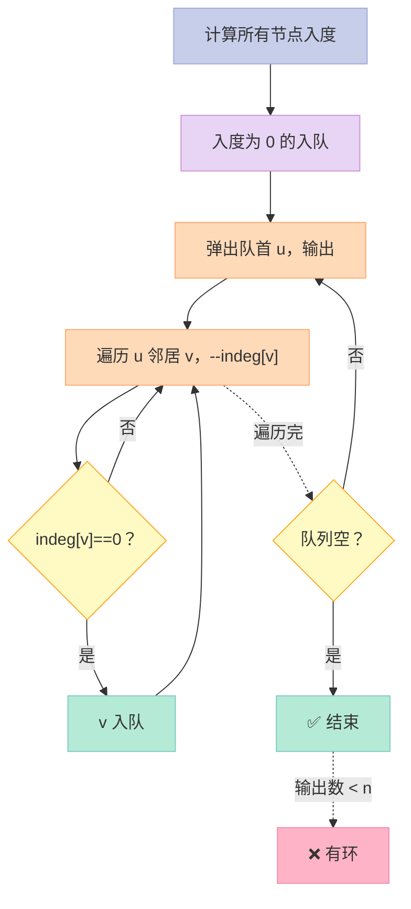

### 15.5 拓扑排序应用

| 场景 | 应用 |
|------|------|
| 课程选修 | 必须先修完 A 才能修 B |
| 编译系统 | Makefile 依赖、头文件顺序 |
| 任务调度 | 流水线调度 |
| 死锁检测 | 看环 |

---

## 十六、实战：手撕一个简化版红黑树

> **说明**：完整红黑树代码量约 300 行，本节展示**插入核心**（约 80 行）。**完整版可参考** Linux 5.x 内核 `lib/rbtree.c`。

### 16.1 节点定义

```cpp
enum Color { RED, BLACK };
struct RBNode {
    int key;
    Color color;
    RBNode* left, *right, *parent;
    RBNode(int k)
        : key(k), color(RED),
          left(nullptr), right(nullptr), parent(nullptr) {}
};
```

### 16.2 旋转（带父指针）

```cpp
void rotateLeft(RBNode*& root, RBNode* x) {
    RBNode* y = x->right;
    x->right = y->left;
    if (y->left) y->left->parent = x;
    y->parent = x->parent;
    if (!x->parent)       root = y;
    else if (x == x->parent->left)  x->parent->left  = y;
    else                            x->parent->right = y;
    y->left = x;
    x->parent = y;
}
```

### 16.3 插入修复（3 种情况）

```cpp
void insertFix(RBNode*& root, RBNode* z) {
    while (z->parent && z->parent->color == RED) {
        RBNode* gp = z->parent->parent;
        if (z->parent == gp->left) {
            RBNode* uncle = gp->right;
            if (uncle && uncle->color == RED) {
                // Case 1：叔红
                z->parent->color = BLACK;
                uncle->color = BLACK;
                gp->color = RED;
                z = gp;
            } else {
                if (z == z->parent->right) {
                    // Case 2：内侧，先左旋
                    z = z->parent;
                    rotateLeft(root, z);
                }
                // Case 3：外侧
                z->parent->color = BLACK;
                gp->color = RED;
                rotateRight(root, gp);
            }
        } else {                            // 镜像情况
            RBNode* uncle = gp->left;
            if (uncle && uncle->color == RED) {
                z->parent->color = BLACK;
                uncle->color = BLACK;
                gp->color = RED;
                z = gp;
            } else {
                if (z == z->parent->left) {
                    z = z->parent;
                    rotateRight(root, z);
                }
                z->parent->color = BLACK;
                gp->color = RED;
                rotateLeft(root, gp);
            }
        }
    }
    root->color = BLACK;                  // 根永远黑
}
```

### 16.4 公开接口

```cpp
class RBTree {
    RBNode* root = nullptr;
public:
    void insert(int key) {
        RBNode* z = new RBNode(key);
        // 标准 BST 插入
        RBNode* y = nullptr, *x = root;
        while (x) { y = x; x = (z->key < x->key) ? x->left : x->right; }
        z->parent = y;
        if (!y) root = z;
        else if (z->key < y->key) y->left = z;
        else y->right = z;
        insertFix(root, z);
    }

    bool search(int key) {
        RBNode* x = root;
        while (x) {
            if (key == x->key) return true;
            x = (key < x->key) ? x->left : x->right;
        }
        return false;
    }
};
```

### 16.5 简版测试

```cpp
int main() {
    RBTree tree;
    int arr[] = {10, 20, 30, 15, 25, 5, 1, 8, 12, 18};
    for (int x : arr) tree.insert(x);
    std::cout << "Search 12: " << tree.search(12) << "\n";  // 1
    std::cout << "Search 100: " << tree.search(100) << "\n"; // 0
    return 0;
}
```

---

## 十七、实战：手撕 Dijkstra

```cpp
// 完整 Dijkstra：返回最短距离 + 路径
std::pair<std::vector<int>, std::vector<int>>
dijkstraFull(const std::vector<std::vector<std::pair<int,int>>>& adj, int src) {
    int n = adj.size();
    std::vector<int> dist(n, INT_MAX);
    std::vector<int> prev(n, -1);          // 前驱节点
    using PII = std::pair<int,int>;
    std::priority_queue<PII, std::vector<PII>, std::greater<PII>> pq;
    dist[src] = 0;
    pq.push({0, src});
    while (!pq.empty()) {
        auto [d, u] = pq.top(); pq.pop();
        if (d > dist[u]) continue;
        for (auto [v, w] : adj[u]) {
            if (dist[v] > dist[u] + w) {
                dist[v] = dist[u] + w;
                prev[v] = u;
                pq.push({dist[v], v});
            }
        }
    }
    return {dist, prev};
}

// 还原路径
std::vector<int> restorePath(const std::vector<int>& prev, int target) {
    std::vector<int> path;
    for (int u = target; u != -1; u = prev[u]) path.push_back(u);
    std::reverse(path.begin(), path.end());
    return path;
}
```

**测试用例**：

```cpp
int main() {
    // 5 个节点，6 条有向加权边
    int n = 5;
    std::vector<std::vector<std::pair<int,int>>> adj(n);
    // 0→1(10), 0→4(5), 4→1(3), 4→2(9), 4→3(2), 1→3(1), 2→3(4)
    adj[0] = {{1, 10}, {4, 5}};
    adj[1] = {{3, 1}};
    adj[2] = {{3, 4}};
    adj[4] = {{1, 3}, {2, 9}, {3, 2}};

    auto [dist, prev] = dijkstraFull(adj, 0);
    for (int i = 0; i < n; ++i) {
        std::cout << "dist[0->" << i << "] = " << dist[i] << "\n";
    }
    // 预期：dist = {0, 8, 14, 7, 5}
    return 0;
}
```

---

## 十八、实战：手撕 Prim MST

```cpp
// Prim 完整版（堆优化）
int primMST(int n, const std::vector<std::vector<std::pair<int,int>>>& adj) {
    std::vector<bool> in_mst(n, false);
    std::priority_queue<std::pair<int,int>,
                        std::vector<std::pair<int,int>>,
                        std::greater<>> pq;
    pq.push({0, 0});                      // 从节点 0 出发
    int total = 0, count = 0;
    while (!pq.empty() && count < n) {
        auto [w, u] = pq.top(); pq.pop();
        if (in_mst[u]) continue;
        in_mst[u] = true;
        total += w;
        count++;
        for (auto [v, weight] : adj[u]) {
            if (!in_mst[v]) pq.push({weight, v});
        }
    }
    return count == n ? total : -1;       // -1 表示不连通
}
```

**测试用例**：

```cpp
int main() {
    int n = 4;
    // 0-1(1), 0-2(2), 1-2(3), 1-3(4), 2-3(5)
    std::vector<std::vector<std::pair<int,int>>> adj(n);
    adj[0] = {{1,1},{2,2}};
    adj[1] = {{0,1},{2,3},{3,4}};
    adj[2] = {{0,2},{1,3},{3,5}};
    adj[3] = {{1,4},{2,5}};
    std::cout << "MST total weight = " << primMST(n, adj) << "\n";
    // 预期：1 + 2 + 4 = 7
    return 0;
}
```

---

## 十九、面试追问清单：树与图

> **这一节是给你面试前 5 分钟复习用的。** 下面这些追问，**80% 概率出现**。

### 19.1 树类高频追问

| # | 追问 | 关键回答 |
|---|------|---------|
| 1 | 红黑树和 AVL 区别？ | 平衡严格度、旋转次数、应用场景 |
| 2 | 为什么 map 用红黑树不用 AVL？ | 插入删除密集，红黑树旋转 ≤ 3 次 |
| 3 | B 树和 B+ 树区别？ | 数据存储位置、范围查询、扇出 |
| 4 | MySQL 为什么用 B+ 树？ | 范围查询、磁盘 IO 更少 |
| 5 | B+ 树叶子节点链表的好处？ | 范围扫描 O(k) |
| 6 | 红黑树的 5 大性质？ | 见 §6.2 |
| 7 | 红黑树最多旋转几次？ | 插入 2 次，删除 3 次 |
| 8 | Trie 树的应用？ | 自动补全、IP 路由、拼写检查 |
| 9 | 哈夫曼编码为什么最优？ | WPL 最小，贪心最优 |
| 10 | 堆和栈的区别？ | 数据结构 vs 内存管理 |
| 11 | 堆排序是稳定的吗？ | ❌ 不稳定 |
| 12 | Top-K 用什么堆？ | **小顶堆**维护 K 个最大 |
| 13 | 完全二叉树 vs 满二叉树？ | 满完全 = 满二叉 |
| 14 | BST 退化成链表怎么办？ | AVL / 红黑树 / Treap / Splay |
| 15 | Morris 遍历的核心？ | 临时改树，O(1) 空间 |

### 19.2 图类高频追问

| # | 追问 | 关键回答 |
|---|------|---------|
| 1 | Dijkstra 为什么不支持负权？ | 已访问即最优假设不成立 |
| 2 | Dijkstra vs Floyd？ | 单源 vs 多源，时间复杂度 |
| 3 | BFS 找最短路为什么行？ | BFS 是无权图 Dijkstra |
| 4 | 拓扑排序如何检测环？ | 输出数 < n 即有环 |
| 5 | Prim vs Kruskal？ | 加点 vs 加边，稠密 vs 稀疏 |
| 6 | 并查集的核心？ | 路径压缩 + 按秩合并 |
| 7 | 邻接表 vs 邻接矩阵？ | 空间、查边、适用图 |
| 8 | DFS 与 BFS 空间复杂度？ | O(h) vs O(w) |
| 9 | 最短路算法如何选？ | 见 §13.1 对照表 |
| 10 | A* 算法是什么？ | 启发式搜索，Dijkstra + 启发函数 |
| 11 | Floyd 还能干什么？ | 传递闭包、检测负权环 |
| 12 | 最小生成树的应用？ | 网络布线、聚类、图像分割 |
| 13 | 图的连通性怎么判断？ | BFS/DFS + visited |
| 14 | 强连通分量怎么求？ | Tarjan / Kosaraju |
| 15 | 二分图如何判定？ | BFS/DFS 二染色 |

### 19.3 综合应用题

| 题型 | 经典题目 | 数据结构 |
|------|---------|---------|
| LRU 缓存 | LeetCode 146 | 哈希 + 双向链表 |
| LFU 缓存 | LeetCode 460 | 哈希 + 双向链表 + 频率哈希 |
| 最短路 | LeetCode 743 | Dijkstra |
| 最小生成树 | LeetCode 1135 | Kruskal |
| 课程表（拓扑） | LeetCode 207 | 拓扑排序 |
| 单词搜索 | LeetCode 212 | Trie + 回溯 |
| 岛屿数量 | LeetCode 200 | DFS/BFS |
| 接雨水 | LeetCode 42 | 单调栈 |
| 二叉树右视图 | LeetCode 199 | BFS |
| 验证 BST | LeetCode 98 | 中序遍历 |

---

## 二十、综合对比表（收藏级）

### 20.1 树型结构全景对比

| 树 | 平衡严格度 | 高度 | 查找 | 插入 | 删除 | 应用 |
|----|----------|------|------|------|------|------|
| BST | 不平衡 | 最坏 n | O(n) | O(n) | O(n) | 学习用 |
| AVL | 严格 | 1.44 log n | O(log n) | O(log n) | O(log n) | 查询密集 |
| 红黑树 | 近似 | 2 log n | O(log n) | O(log n) | O(log n) | **STL map** |
| 2-3 树 | 严格 | log n | O(log n) | O(log n) | O(log n) | 教科书 |
| B 树 | 灵活 | log_m n | O(log n) | O(log n) | O(log n) | 文件系统 |
| B+ 树 | 灵活 | log_m n | O(log n) | O(log n) | O(log n) | **数据库** |
| B* 树 | 灵活 | log_m n | O(log n) | O(log n) | O(log n) | 高级 DB |
| Trie | - | 字符长度 | O(L) | O(L) | O(L) | 前缀匹配 |
| 哈夫曼 | 权重 WPL 最小 | 不定 | - | - | - | 压缩 |
| 堆 | 不严格 | log n | O(1) 顶 | O(log n) | O(log n) | 优先队列 |
| 线段树 | - | 4n | O(log n) | O(log n) | O(log n) | 区间查询 |

### 20.2 图算法对比

| 算法 | 适用 | 时间 | 空间 | 负权 | 思想 |
|------|------|------|------|------|------|
| BFS | 无权最短路 | O(V+E) | O(V) | - | 队列层序 |
| DFS | 连通/路径/拓扑 | O(V+E) | O(V) | - | 栈/递归 |
| Dijkstra | 单源正权 | O((V+E) log V) | O(V) | ❌ | 贪心+堆 |
| Bellman-Ford | 单源可负权 | O(VE) | O(V) | ✅ | 松弛 |
| SPFA | 单源可负权 | O(VE) 均摊 | O(V) | ✅ | 队列优化 |
| Floyd | 多源 | O(V³) | O(V²) | ✅ | DP |
| Prim | MST 稠密 | O(E log V) | O(V) | - | 加点 |
| Kruskal | MST 稀疏 | O(E log E) | O(V+E) | - | 加边+并查集 |
| 拓扑排序 | DAG | O(V+E) | O(V) | - | 入度/DFS |
| A* | 启发式最短 | 启发式 | O(V) | ✅ | 启发函数 |

### 20.3 平衡树选型决策表

| 场景 | 推荐 | 理由 |
|------|------|------|
| 内存中的 `map` / `set` | **红黑树** | 插入删除频繁，STL 默认 |
| 数据库索引 | **B+ 树** | 范围查询、磁盘 IO |
| 文件系统目录 | **B 树** | 数据存在中间节点 |
| 查询密集（数据库缓存） | **AVL** | 树最矮，查询快 |
| 字符串前缀 | **Trie** | 天然支持 |
| 优先队列 | **二叉堆** | 简单、STL 实现 |
| 高频插入/删除 | **红黑树** | 旋转 ≤ 3 次 |

### 20.4 平衡树复杂度对照

| 操作 | AVL | 红黑树 | B+ 树 | 跳表 |
|------|-----|-------|-------|------|
| 查找 | O(log n) | O(log n) | O(log n) | O(log n) |
| 插入 | O(log n) | O(log n) | O(log n) | O(log n) |
| 删除 | O(log n) | O(log n) | O(log n) | O(log n) |
| 范围查询 | 中 | 中 | **优** | 优 |
| 顺序遍历 | 中 | 中 | **优** | 优 |
| 实现难度 | 中 | **高** | 高 | 中 |
| 内存占用 | 中 | 中 | **高** | 中 |
| 应用 | 静态索引 | STL/内核 | **数据库** | Redis |

---

## 二十一、动手练手：5 道精选题

### 21.1 题目列表

| # | 题目 | 难度 | 核心算法 |
|---|------|------|---------|
| 1 | LeetCode 98 验证 BST | ⭐⭐ | 中序遍历 |
| 2 | LeetCode 102 层序遍历 | ⭐⭐ | BFS |
| 3 | LeetCode 105 前中序构造树 | ⭐⭐⭐ | 递归 + 哈希 |
| 4 | LeetCode 200 岛屿数量 | ⭐⭐ | DFS/BFS |
| 5 | LeetCode 743 网络延迟 | ⭐⭐⭐ | Dijkstra |

### 21.2 LeetCode 98 验证 BST

```cpp
bool isValidBST(TreeNode* root) {
    return validate(root, LONG_MIN, LONG_MAX);
}
bool validate(TreeNode* node, long min_val, long max_val) {
    if (!node) return true;
    if (node->val <= min_val || node->val >= max_val) return false;
    return validate(node->left,  min_val, node->val) &&
           validate(node->right, node->val, max_val);
}
```

### 21.3 LeetCode 200 岛屿数量

```cpp
int numIslands(std::vector<std::vector<char>>& grid) {
    if (grid.empty()) return 0;
    int m = grid.size(), n = grid[0].size();
    int count = 0;
    for (int i = 0; i < m; ++i) {
        for (int j = 0; j < n; ++j) {
            if (grid[i][j] == '1') {
                dfs(grid, i, j);
                count++;
            }
        }
    }
    return count;
}
void dfs(std::vector<std::vector<char>>& grid, int i, int j) {
    int m = grid.size(), n = grid[0].size();
    if (i < 0 || i >= m || j < 0 || j >= n || grid[i][j] != '1') return;
    grid[i][j] = '0';                       // 标记访问
    dfs(grid, i+1, j);
    dfs(grid, i-1, j);
    dfs(grid, i, j+1);
    dfs(grid, i, j-1);
}
```

---

## 二十二、避坑指南：常见错误

### 22.1 树类常见错误

| 错误 | 描述 | 正确做法 |
|------|------|---------|
| 递归无终止条件 | BST 查找忘记 `if (!root) return false` | 永远先判空 |
| 中序遍历BST不升序 | 中序用错位置（左根右） | 顺序不能错 |
| 旋转写反 | LL 写成左旋 | 记住口诀 |
| 红黑树插入忘改父指针 | 旋转后 parent 指向错误 | 旋转时同时改 |
| Morris 遍历没断开线索 | 访问后没把 `pre->right` 置 null | 必须置 null |
| 平衡树插入忘更新高度 | AVL 旋转后 height 字段不更新 | 旋转后必须更新 |

### 22.2 图类常见错误

| 错误 | 描述 | 正确做法 |
|------|------|---------|
| Dijkstra 处理负权 | 负权图用 Dijkstra | 用 Bellman-Ford / SPFA |
| DFS 栈爆 | 100 万节点递归 DFS | 改迭代或增大栈 |
| BFS 队列爆 | 完全图 BFS | 用双向 BFS |
| 邻接矩阵开 V² | 1e5 节点开 1e10 数组 | 用邻接表 |
| 拓扑排序漏入度 | 没更新入度 | 删边时 `--indeg[v]` |
| Kruskal 路径未压缩 | 大量 find 退化 | 必须路径压缩 |

---

## 二十三、结尾：把"树与图"刻进 DNA

> **一棵树不够，那就种一片森林。**

### 23.1 核心要点回顾

1. **二叉树遍历**：前/中/后/层序，**递归 + 迭代 + Morris** 都要会
2. **BST**：理解退化问题，**AVL / 红黑树** 是解药
3. **AVL vs 红黑树**：**查询选 AVL，插入删除选红黑树**
4. **红黑树**：5 大性质、3 种插入、4 种删除，**STL 基础**
5. **B 树 / B+ 树**：磁盘页模型，**数据库索引基础**
6. **Trie**：前缀匹配、字典序，**自动补全**
7. **哈夫曼**：最优前缀码，**压缩**
8. **堆**：完全二叉树、数组存储，**Top-K 杀手锏**
9. **BFS / DFS**：图遍历，**BFS = 无权最短路**
10. **Dijkstra**：单源正权最短路，**注意负权**
11. **Prim / Kruskal**：MST 两种解法，**并查集必会**
12. **拓扑排序**：DAG 排序，**Kahn 算法 + DFS 法**

### 23.2 行动建议

| 时间 | 行动 | 产出 |
|------|------|------|
| **今天** | 手撕 4 种遍历（递归+迭代） | 8 段代码 |
| **今天** | 抄一遍 RB-Tree 插入修复 | 80 行代码 |
| **本周** | 抄一遍 Dijkstra + Prim + Kruskal | 3 段代码 |
| **本周** | LeetCode 树题 10 道 | 通过率 ≥ 70% |
| **本周** | LeetCode 图题 10 道 | 通过率 ≥ 70% |
| **本月** | 用 C++ 实现一个简化版 KV 存储 | 红黑树 + 哈希 |
| **本月** | 读 Linux 5.x 内核 `lib/rbtree.c` | 理解工业实现 |

### 23.3 思考题

> **这些是面试中"区分 P6 和 P7"的追问**，你想清楚了吗？

1. **红黑树 vs B 树**：为什么 `std::map`（红黑树）做不了范围查询的"成本"比 B+ 树高？
2. **Dijkstra 的"贪心"为什么在正权图上正确？** 用反证法证明。
3. **为什么哈希表"理论上"比红黑树快，实际中 `unordered_map` 不一定比 `map` 快？**
4. **Trie 树的内存爆炸怎么解决？** 双数组 Trie（Double-Array Trie）听说过吗？
5. **Floyd 算法的中间点 k 为什么放在最外层？** 改成内层行不行？
6. **为什么 Redis zset 用跳表不用红黑树？** Redis 作者 antirez 自己的解释是什么？
7. **A* 算法的启发函数满足什么条件才"最优"？** 可采纳性、一致性是什么意思？

### 23.4 一句话总结

> **树与图是面试的"硬通货"。你不需要背所有算法的最优实现，但你必须能在白板上 10 分钟内写出**「红黑树插入、Dijkstra、Prim」** 三个核心代码，**并能讲清每一步的"为什么"**。这就是 P5 到 P7 的分水岭。

---

## 系列导航：21 篇文章直达

> 这是「C++ 面试题集锦」**第 21 篇**。本系列共 **21 篇文章**（含 1 篇总览 + 16 篇主题 + 4 篇算法深挖），覆盖 **C++ 面试 5 大知识域、200+ 道题**。下表是 21 篇文章的导航链接。

| 篇号 | 文章标题 | 状态 | 知识域 |
|------|---------|------|--------|
| 第 1 篇 | 指针 vs 引用：从汇编层看本质 | 已发布 | 语言基础 |
| 第 2 篇 | const / static / extern / volatile 全解 | 已发布 | 语言基础 |
| 第 3 篇 | 类与对象：构造、拷贝、移动三大件 | 已发布 | 面向对象 |
| 第 4 篇 | 继承与多态：vtable 与 RTTI | 已发布 | 面向对象 |
| 第 5 篇 | 模板与泛型：SFINAE 与 concepts | 已发布 | 语言基础 |
| 第 6 篇 | 字符串与内存：const char* vs string | 已发布 | STL 与算法 |
| 第 7 篇 | STL 顺序容器：vector / list / deque | 已发布 | STL 与算法 |
| 第 8 篇 | STL 关联容器：map / set / unordered_map | 已发布 | STL 与算法 |
| 第 9 篇 | 内存管理：malloc / new / mmap | 已发布 | 系统底层 |
| 第 10 篇 | 智能指针与异常：RAII 范式 | 已发布 | 面向对象 |
| 第 11 篇 | 编译、链接与 Hello World | 已发布 | 系统底层 |
| 第 12 篇 | 宏、typedef、inline、浮点数 | 已发布 | 系统底层 |
| 第 13 篇 | 进程、线程、IO 多路复用 | 已发布 | OS 与网络 |
| 第 14 篇 | 网络协议：TCP/IP / HTTP / Socket | 已发布 | OS 与网络 |
| 第 15 篇 | 数据结构与算法：红黑树到 LRU | 已发布 | STL 与算法 |
| 第 16 篇 | 设计模式 + HR 面经：单例到 Offer 谈判 | 已发布 | 综合 |
| 第 17 篇 | 算法深挖①：排序与二分查找 | 已发布 | 算法 |
| 第 18 篇 | 算法深挖②：动态规划与贪心 | 已发布 | 算法 |
| 第 19 篇 | 算法深挖③：字符串与回溯 | 已发布 | 算法 |
| 第 20 篇 | 算法深挖④：链表与栈队列 | 已发布 | 算法 |
| **第 21 篇** | **算法深挖⑤：树与图，AVL/红黑树/B+ 树/最短路径** | **当前位置** | **算法** |
| 总览篇 | 系列总览：161 道题 × 16 篇文章 | 已发布 | 全局 |

---

**系列标签**：`#C++` `#面试题` `#算法` `#红黑树` `#B+树` `#最短路径` `#最小生成树` `#Dijkstra` `#BFS` `#DFS` `#Trie` `#哈夫曼` `#堆`

> 如果这篇对你有帮助，请**点赞、在看、转发**三连。下篇预告：**第 22 篇：算法深挖⑥——位运算与数学**，从二进制位到质数筛，一次打通。

---

*最后更新：2026-06-17 | 维护者：Xu Qi*
