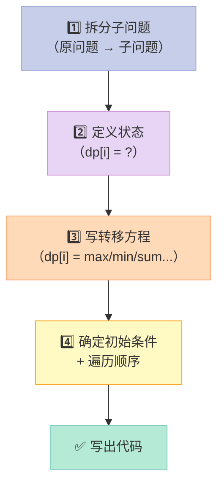
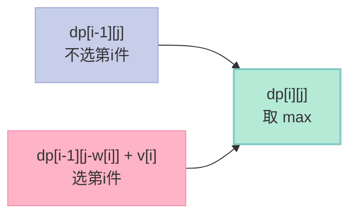
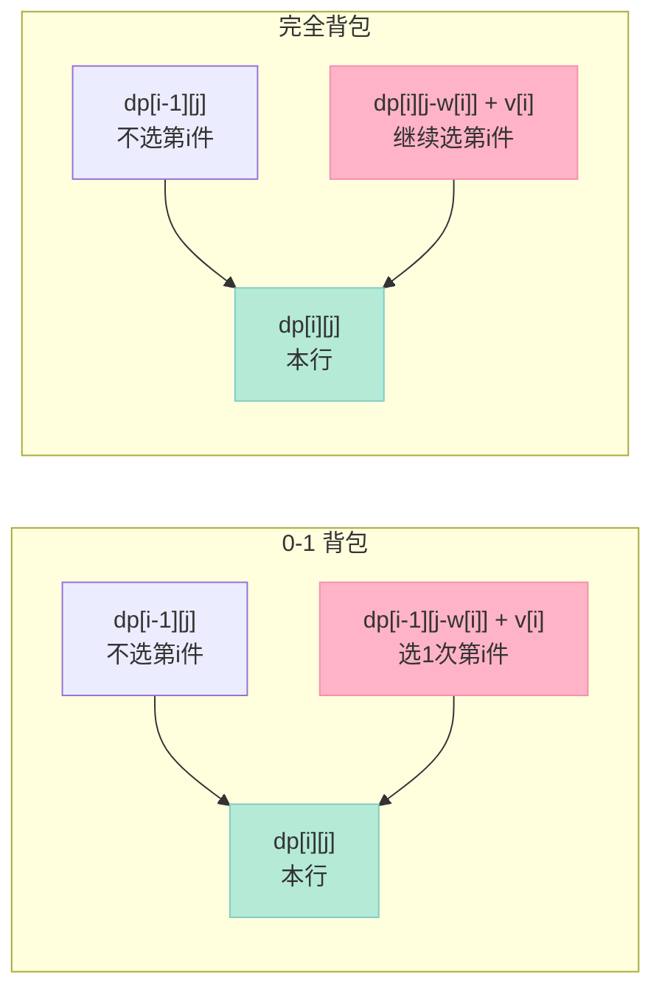
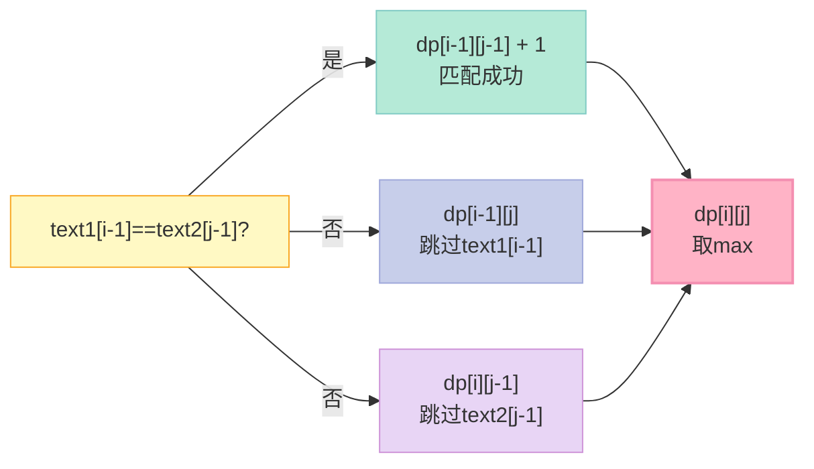
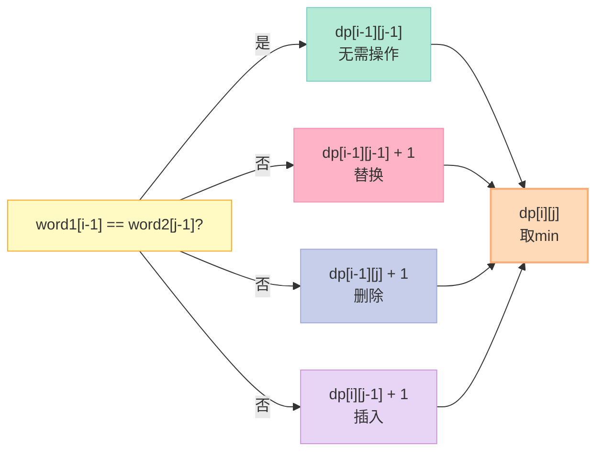
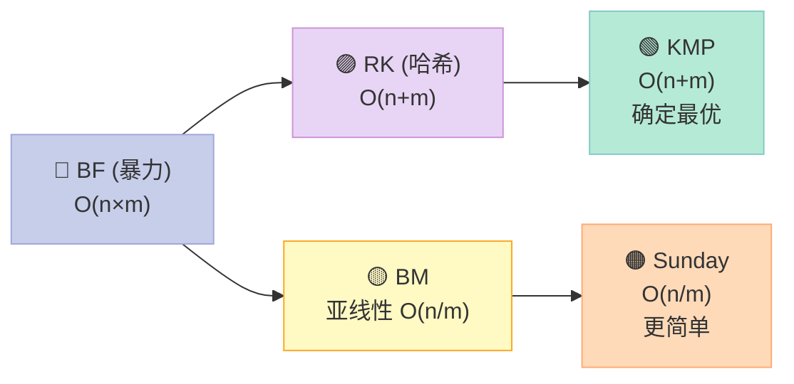
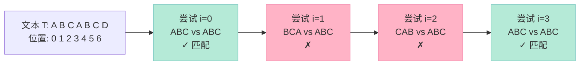
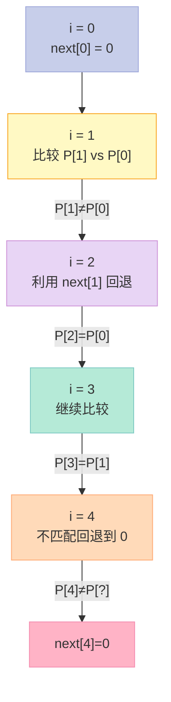

> **为什么 KMP 能在 O(n+m) 完成字符串匹配？为什么 next 数组叫"前缀函数"？**
>
> 这两个问题，是 90% 算法岗面试的"试金石"。本篇用 4 个 Mermaid 图、40+ 代码块、25+ 表格，把动态规划（DP）和字符串匹配（SMP）从"会写"推到"会讲"。

---

## 前言：为什么单独深挖 DP 与字符串匹配？

第 15 篇「数据结构与算法」用 16 道题覆盖了红黑树、LRU、Top-K 等内容。但动态规划（DP）和字符串匹配（SMP）这两个子专题，**题量大、变种多、面试手撕频率高**，一篇远远讲不透。

我把它们**单独拎出来深挖**，原因有三：

1. **DP 是面试分水岭**：从「爬楼梯」到「编辑距离」，变种无穷，但本质都是「状态 + 转移方程 + 初始条件」三件套。掌握这个模板，能横扫 80% DP 题。
2. **KMP 是字符串匹配的"必修课"**：90% 候选人能写出 BF（暴力），但只有 30% 能手写 KMP 的 next 数组。能讲清楚「为什么 next[i] 等于最长相等前后缀」，就是面试加分项。
3. **背包问题是 DP 的"第一关"**：从 0-1 背包到完全背包，再到 LeetCode 上的「分割等和子集」「目标和」，几乎所有"选/不选"类问题都源于此。

读完本篇，你能：

- **讲清楚** DP 的最优子结构、重叠子问题、状态转移方程
- **手写** 0-1 背包、完全背包、LCS、LIS、编辑距离的 C++ 代码
- **推导** KMP 的 next 数组，并用 C++ 实现完整匹配
- **对比** BF / RK / KMP / Boyer-Moore 四种字符串匹配算法的复杂度
- **实战** LeetCode 背包 5 道题 + 完整 KMP 单元测试

---

## 一、动态规划基础：三个核心概念

### 1.1 什么是动态规划（Dynamic Programming）

**动态规划（Dynamic Programming, DP）** 是一种**把复杂问题分解为更小子问题**的算法思想。它由 Richard Bellman 在 1950 年代提出，最初用于解决**多阶段决策优化问题**。

DP 不是某个具体算法，而是一种**思考方式**。它的两大核心特征是：

| 特征 | 含义 | 反例 |
|------|------|------|
| **最优子结构** | 原问题的最优解包含子问题的最优解 | 最短路径（✅）vs 最长简单路径（❌） |
| **重叠子问题** | 递归求解时，同一子问题被反复计算 | 斐波那契（✅）vs 二叉树遍历（❌） |

**⚠️ 注意**：DP ≠ 分治（Divide and Conquer）。分治的子问题**互不重叠**（如归并排序），DP 的子问题**大量重叠**（如斐波那契）。

### 1.2 三大核心要素：状态、转移方程、初始条件

DP 的本质是**用"状态"记录子问题的解，用"转移方程"描述状态的递推关系**。任何 DP 问题都包含三要素：

| 要素 | 作用 | 设计要点 |
|------|------|----------|
| **状态定义** | `dp[i]` 或 `dp[i][j]` 表示什么 | **清晰、无歧义**；决定了问题的"维度" |
| **状态转移方程** | `dp[i]` 如何由更小的 `dp[?]` 推出 | **覆盖所有选择**；这是 DP 的"灵魂" |
| **初始条件（base case）** | 最小子问题的解 | **不能漏**；否则递推无法启动 |

**举一反三**：这三要素对应到代码就是：

```cpp
// 1. 状态定义（一维/二维/三维数组）
vector<int> dp(n + 1, 0);

// 2. 初始条件
dp[0] = 1;  // 空问题的基础答案

// 3. 状态转移（遍历顺序很重要！）
for (int i = 1; i <= n; ++i) {
    dp[i] = dp[i - 1] + dp[i - 2];  // 转移方程
}
```

### 1.3 DP 思考四步法

面对一个新 DP 题，按这四步走，能少走 80% 的弯路：



**实战练习**：用四步法分析「斐波那契数列」。

| 步骤 | 内容 |
|------|------|
| 拆分子问题 | `fib(n) = fib(n-1) + fib(n-2)` |
| 定义状态 | `dp[i]` = 第 i 个斐波那契数 |
| 转移方程 | `dp[i] = dp[i-1] + dp[i-2]` |
| 初始条件 | `dp[0] = 0, dp[1] = 1` |

### 1.4 自顶向下（记忆化搜索）vs 自底向上（递推）

同一个 DP 问题，两种实现方式：

| 方式 | 代码形态 | 优点 | 缺点 |
|------|----------|------|------|
| **自顶向下** | 递归 + 记忆化数组 | 思路直观，贴近问题原描述 | 函数调用栈开销，可能栈溢出 |
| **自底向上** | for 循环递推 | 无栈开销，常数更小 | 需要手动设计遍历顺序 |

**示例：斐波那契的两种写法**

```cpp
// 方式 1：自顶向下（递归 + 记忆化）
class Solution {
public:
    int fib(int n) {
        if (n < 2) return n;
        vector<int> memo(n + 1, -1);  // 记忆化数组
        return dfs(n, memo);
    }
private:
    int dfs(int n, vector<int>& memo) {
        if (n < 2) return n;                 // base case
        if (memo[n] != -1) return memo[n];   // 已计算过
        memo[n] = dfs(n - 1, memo) + dfs(n - 2, memo);  // 记忆化
        return memo[n];
    }
};

// 方式 2：自底向上（递推）
int fib(int n) {
    if (n < 2) return n;
    vector<int> dp(n + 1);    // dp 数组
    dp[0] = 0;
    dp[1] = 1;
    for (int i = 2; i <= n; ++i) {
        dp[i] = dp[i - 1] + dp[i - 2];  // 转移方程
    }
    return dp[n];
}
```

**面试建议**：能用自底向上就别用递归。**因为递归版本会有栈空间**（O(n) 额外空间），而自底向上可以优化到 O(1)。

---

## 二、入门 DP：爬楼梯与斐波那契

### 2.1 爬楼梯问题（LeetCode 70）

**问题**：假设你正在爬楼梯，需要 n 阶到达顶部。每次你可以爬 1 或 2 个台阶，有多少种不同方法可以爬到顶部？

**四步法分析**：

| 步骤 | 内容 |
|------|------|
| 拆分子问题 | 到达第 i 阶 = 从第 i-1 阶爬 1 步 + 从第 i-2 阶爬 2 步 |
| 定义状态 | `dp[i]` = 到达第 i 阶的方法数 |
| 转移方程 | `dp[i] = dp[i-1] + dp[i-2]` |
| 初始条件 | `dp[1] = 1, dp[2] = 2` |

**完整实现（三种优化）**：

```cpp
// 版本 1：O(n) 时间 + O(n) 空间
int climbStairs(int n) {
    if (n <= 2) return n;
    vector<int> dp(n + 1);
    dp[1] = 1; dp[2] = 2;
    for (int i = 3; i <= n; ++i) {
        dp[i] = dp[i - 1] + dp[i - 2];
    }
    return dp[n];
}

// 版本 2：O(n) 时间 + O(1) 空间（滚动变量）
int climbStairs(int n) {
    if (n <= 2) return n;
    int prev2 = 1, prev1 = 2;  // dp[i-2], dp[i-1]
    for (int i = 3; i <= n; ++i) {
        int cur = prev1 + prev2;
        prev2 = prev1;
        prev1 = cur;
    }
    return prev1;
}

// 版本 3：矩阵快速幂（O(log n) 时间）
class Solution {
public:
    int climbStairs(int n) {
        if (n <= 2) return n;
        // [[1,1],[1,0]]^(n-1) 的左上角就是答案
        vector<vector<long long>> M = {{1, 1}, {1, 0}};
        auto res = matrixPow(M, n - 1);
        return res[0][0];
    }
private:
    vector<vector<long long>> matrixMul(
        const vector<vector<long long>>& A,
        const vector<vector<long long>>& B) {
        int n = A.size();
        vector<vector<long long>> C(n, vector<long long>(n, 0));
        for (int i = 0; i < n; ++i)
            for (int j = 0; j < n; ++j)
                for (int k = 0; k < n; ++k)
                    C[i][j] += A[i][k] * B[k][j];
        return C;
    }
    vector<vector<long long>> matrixPow(
        vector<vector<long long>> M, int p) {
        int n = M.size();
        vector<vector<long long>> res(n, vector<long long>(n, 0));
        for (int i = 0; i < n; ++i) res[i][i] = 1;  // 单位矩阵
        while (p > 0) {
            if (p & 1) res = matrixMul(res, M);
            M = matrixMul(M, M);
            p >>= 1;
        }
        return res;
    }
};
```

### 2.2 三种实现对比

| 版本 | 时间复杂度 | 空间复杂度 | 适用场景 |
|------|-----------|-----------|----------|
| 版本 1（dp 数组） | O(n) | O(n) | n 较小，代码易读 |
| 版本 2（滚动变量） | O(n) | O(1) | **面试首选** |
| 版本 3（矩阵快速幂） | O(log n) | O(log n) | n 极大（如 10^18） |

**面试加分点**：主动提到矩阵快速幂，说明你懂"线性递推的本质是矩阵乘法"。

---

## 三、0-1 背包：DP 进阶第一关

### 3.1 问题描述

**0-1 背包**是 DP 背包问题的"祖师爷"：

> 给定 n 件物品和容量为 W 的背包，第 i 件物品的重量为 `w[i]`，价值为 `v[i]`。每件物品**只能选一次**（0 或 1），求背包能装下的最大价值。

为什么叫"0-1"？因为每件物品要么**不选（0）**，要么**选（1）**，不能选半个。

### 3.2 四步法分析

| 步骤 | 内容 |
|------|------|
| 拆分子问题 | 考虑第 i 件物品选或不选 |
| 定义状态 | `dp[i][j]` = 前 i 件物品、容量 j 下的最大价值 |
| 转移方程 | `dp[i][j] = max(dp[i-1][j], dp[i-1][j-w[i]] + v[i])` |
| 初始条件 | `dp[0][j] = 0`（没有物品时价值为 0） |

**转移方程的解释**：

- **不选第 i 件**：`dp[i-1][j]`（容量 j 不变）
- **选第 i 件**：`dp[i-1][j-w[i]] + v[i]`（腾出 w[i] 容量，加上 v[i] 价值）
- 取两者最大值

### 3.3 状态转移图（马卡龙）



### 3.4 二维 DP 代码（最直观）

```cpp
int knapsack01(const vector<int>& w, const vector<int>& v, int W) {
    int n = w.size();
    // dp[i][j]: 前 i 件物品、容量 j 下的最大价值
    vector<vector<int>> dp(n + 1, vector<int>(W + 1, 0));

    for (int i = 1; i <= n; ++i) {
        for (int j = 0; j <= W; ++j) {
            // 不选第 i 件
            dp[i][j] = dp[i - 1][j];
            // 选第 i 件（前提是容量够）
            if (j >= w[i - 1]) {
                dp[i][j] = max(dp[i][j],
                               dp[i - 1][j - w[i - 1]] + v[i - 1]);
            }
        }
    }
    return dp[n][W];
}
```

### 3.5 空间优化：一维 DP（滚动数组）

**核心洞察**：`dp[i][j]` 只依赖 `dp[i-1][?]`（上一行），所以可以用**一维数组 + 倒序遍历**压缩到 O(W) 空间。

```cpp
int knapsack01_optimized(const vector<int>& w,
                         const vector<int>& v, int W) {
    int n = w.size();
    vector<int> dp(W + 1, 0);  // 压缩到一维

    for (int i = 0; i < n; ++i) {
        // ⚠️ 关键：j 必须从大到小遍历（倒序）
        // 因为 dp[j] 依赖 dp[j - w[i]]（未更新的旧值）
        for (int j = W; j >= w[i]; --j) {
            dp[j] = max(dp[j], dp[j - w[i]] + v[i]);
        }
    }
    return dp[W];
}
```

**⚠️ 为什么必须倒序？**

| 遍历方向 | 效果 | 后果 |
|----------|------|------|
| 正序（j 从小到大） | `dp[j-w[i]]` 已经被本轮更新过 | **物品 i 被重复选择**（变成完全背包） |
| 倒序（j 从大到小） | `dp[j-w[i]]` 还是上一轮的值 | ✅ 保证每件物品只选一次 |

### 3.6 0-1 背包的边界条件

面试常考的边界细节：

| 场景 | 初始条件 | 说明 |
|------|---------|------|
| **标准背包** | `dp[0][j] = 0, dp[i][0] = 0` | 没物品或没容量时价值为 0 |
| **恰好装满** | `dp[0][0] = 0, dp[0][j>0] = -INF` | 只有恰好装满的状态合法 |
| **必须装满且输出方案** | 需要额外记录"前驱选择" | `pre[i][j]` 记录是否选了 i |

**"恰好装满"版本**：

```cpp
int knapsack01_exact(const vector<int>& w,
                     const vector<int>& v, int W) {
    int n = w.size();
    const int NEG = -1e9;  // 负无穷
    vector<int> dp(W + 1, NEG);
    dp[0] = 0;  // 容量 0 恰好装满，价值 0

    for (int i = 0; i < n; ++i) {
        for (int j = W; j >= w[i]; --j) {
            if (dp[j - w[i]] != NEG) {
                dp[j] = max(dp[j], dp[j - w[i]] + v[i]);
            }
        }
    }
    return dp[W] == NEG ? -1 : dp[W];  // -1 表示无法恰好装满
}
```

---

## 四、完全背包 vs 0-1 背包

### 4.1 完全背包：每件物品可选无限次

**完全背包（Unbounded Knapsack）**：第 i 件物品可以选**无限次**（只要装得下）。

**应用场景**：

| 场景 | 对应问题 |
|------|----------|
| 找零钱 | LeetCode 322（最少硬币数） |
| 整数拆分 | LeetCode 343 |
| 完全平方数 | LeetCode 279 |

### 4.2 四步法分析

| 步骤 | 内容 |
|------|------|
| 拆分子问题 | 第 i 件物品可以选 0、1、2、...、k 次 |
| 定义状态 | `dp[i][j]` = 前 i 种物品、容量 j 下的最大价值 |
| 转移方程 | `dp[i][j] = max(dp[i-1][j], dp[i][j-w[i]] + v[i])` |
| 与 0-1 区别 | **`dp[i][j-w[i]]`（本行）** vs **`dp[i-1][j-w[i]]`（上一行）** |

**关键区别**：



### 4.3 空间优化：完全背包用正序遍历

```cpp
int knapsack_complete(const vector<int>& w,
                      const vector<int>& v, int W) {
    int n = w.size();
    vector<int> dp(W + 1, 0);

    for (int i = 0; i < n; ++i) {
        // ⚠️ 完全背包必须正序遍历（与 0-1 背包相反）
        for (int j = w[i]; j <= W; ++j) {
            dp[j] = max(dp[j], dp[j - w[i]] + v[i]);
        }
    }
    return dp[W];
}
```

**为什么完全背包用正序？** 因为 `dp[j-w[i]]` 是**本轮已更新**的值（允许重复选），而 0-1 背包需要**上一轮**的值（每件只选一次）。

### 4.4 0-1 vs 完全背包对比表

| 维度 | 0-1 背包 | 完全背包 |
|------|----------|----------|
| **物品选择次数** | 0 或 1 次 | 无限次 |
| **转移方程关键** | `dp[i-1][j-w[i]] + v[i]` | `dp[i][j-w[i]] + v[i]` |
| **一维遍历方向** | **倒序**（j 从大到小） | **正序**（j 从小到大） |
| **典型问题** | 分割等和子集、目标和 | 零钱兑换、整数拆分 |
| **状态机视角** | 选过之后不能回到"未选" | 可以反复在"选/未选"切换 |

### 4.5 多重背包（中级变种）

**多重背包（Multiplicity Knapsack）**：第 i 件物品最多选 `k[i]` 次。

**三种解法对比**：

| 方法 | 思路 | 时间复杂度 | 适用场景 |
|------|------|-----------|----------|
| **朴素 DP** | 三重循环（i, j, 选几个） | O(n × W × K) | K 很小 |
| **二进制拆分** | 把 k 件拆成 1+2+4+... 的"组合物品" | O(n × W × log K) | **面试首选** |
| **单调队列优化** | 用单调队列维护候选值 | O(n × W) | K 极大（论文级） |

**二进制拆分代码**：

```cpp
int knapsack_multi(const vector<int>& w,
                   const vector<int>& v,
                   const vector<int>& k, int W) {
    // 把多重背包转化为 0-1 背包：二进制拆分
    vector<int> newW, newV;
    for (int i = 0; i < w.size(); ++i) {
        int num = k[i];
        int power = 1;
        while (num > 0) {
            int take = min(power, num);
            newW.push_back(w[i] * take);
            newV.push_back(v[i] * take);
            num -= take;
            power *= 2;
        }
    }
    // 套用 0-1 背包
    vector<int> dp(W + 1, 0);
    for (int i = 0; i < newW.size(); ++i) {
        for (int j = W; j >= newW[i]; --j) {
            dp[j] = max(dp[j], dp[j - newW[i]] + newV[i]);
        }
    }
    return dp[W];
}
```

---

## 五、最长公共子序列（LCS）

### 5.1 问题描述

**最长公共子序列（Longest Common Subsequence, LCS）**：

> 给定两个字符串 `text1` 和 `text2`，返回它们的最长公共子序列的长度。子序列是指**不要求连续**的序列。

**示例**：

| text1 | text2 | LCS | 长度 |
|-------|-------|-----|------|
| "abcde" | "ace" | "ace" | 3 |
| "abc" | "abc" | "abc" | 3 |
| "abc" | "def" | "" | 0 |

### 5.2 四步法分析

| 步骤 | 内容 |
|------|------|
| 拆分子问题 | 比较 text1[i-1] 和 text2[j-1] |
| 定义状态 | `dp[i][j]` = text1[0..i-1] 和 text2[0..j-1] 的 LCS 长度 |
| 转移方程 | 见下表 |
| 初始条件 | `dp[0][*] = dp[*][0] = 0` |

**转移方程（三种情况）**：

| 情况 | 转移方程 | 说明 |
|------|---------|------|
| `text1[i-1] == text2[j-1]` | `dp[i][j] = dp[i-1][j-1] + 1` | 字符匹配，LCS 加 1 |
| `text1[i-1] != text2[j-1]` | `dp[i][j] = max(dp[i-1][j], dp[i][j-1])` | 取两个子问题的最大值 |

### 5.3 LCS 状态转移图



### 5.4 完整代码（含 LCS 字符串还原）

```cpp
class Solution {
public:
    // 1. 求 LCS 长度
    int longestCommonSubsequence(string text1, string text2) {
        int m = text1.size(), n = text2.size();
        vector<vector<int>> dp(m + 1, vector<int>(n + 1, 0));

        for (int i = 1; i <= m; ++i) {
            for (int j = 1; j <= n; ++j) {
                if (text1[i - 1] == text2[j - 1]) {
                    dp[i][j] = dp[i - 1][j - 1] + 1;
                } else {
                    dp[i][j] = max(dp[i - 1][j], dp[i][j - 1]);
                }
            }
        }
        return dp[m][n];
    }

    // 2. 还原 LCS 字符串
    string getLCS(string text1, string text2) {
        int m = text1.size(), n = text2.size();
        vector<vector<int>> dp(m + 1, vector<int>(n + 1, 0));

        for (int i = 1; i <= m; ++i) {
            for (int j = 1; j <= n; ++j) {
                if (text1[i - 1] == text2[j - 1]) {
                    dp[i][j] = dp[i - 1][j - 1] + 1;
                } else {
                    dp[i][j] = max(dp[i - 1][j], dp[i][j - 1]);
                }
            }
        }

        // 反向回溯
        string lcs;
        int i = m, j = n;
        while (i > 0 && j > 0) {
            if (text1[i - 1] == text2[j - 1]) {
                lcs.push_back(text1[i - 1]);
                --i; --j;
            } else if (dp[i - 1][j] > dp[i][j - 1]) {
                --i;  // 来自上方
            } else {
                --j;  // 来自左方
            }
        }
        reverse(lcs.begin(), lcs.end());
        return lcs;
    }
};
```

### 5.5 LCS 应用场景

| 场景 | 说明 |
|------|------|
| **Git diff** | `git diff` 用 LCS 找最小编辑集 |
| **DNA 比对** | 生物信息学的基础操作 |
| **代码抄袭检测** | MOSS 系统用 LCS 找相似代码 |
| **文档对比** | Word/Google Docs 的"修订"功能 |

---

## 六、最长上升子序列（LIS）

### 6.1 问题描述

**最长上升子序列（Longest Increasing Subsequence, LIS）**：

> 给定一个整数数组 `nums`，找到其中最长**严格递增**子序列的长度。

**示例**：

| 输入 | LIS | 长度 |
|------|-----|------|
| [10,9,2,5,3,7,101,18] | [2,3,7,18] 或 [2,3,7,101] | 4 |
| [0,1,0,3,2,3] | [0,1,2,3] | 4 |
| [7,7,7,7] | [7] | 1 |

### 6.2 方法一：DP（O(n²)）

```cpp
int lengthOfLIS(vector<int>& nums) {
    int n = nums.size();
    if (n == 0) return 0;
    // dp[i] = 以 nums[i] 结尾的最长上升子序列长度
    vector<int> dp(n, 1);

    int ans = 1;
    for (int i = 1; i < n; ++i) {
        for (int j = 0; j < i; ++j) {
            if (nums[j] < nums[i]) {
                dp[i] = max(dp[i], dp[j] + 1);
            }
        }
        ans = max(ans, dp[i]);
    }
    return ans;
}
```

### 6.3 方法二：二分优化（O(n log n)）

**核心思想**：维护一个 `tail` 数组，`tail[i]` 表示长度为 `i+1` 的 LIS 的**最小尾部值**。对每个新数，用**二分查找**找到它在 `tail` 中的位置。

```cpp
int lengthOfLIS(vector<int>& nums) {
    vector<int> tail;  // tail[i] = 长度为 i+1 的 LIS 最小尾值
    for (int x : nums) {
        // 在 tail 中找第一个 >= x 的位置
        auto it = lower_bound(tail.begin(), tail.end(), x);
        if (it == tail.end()) {
            tail.push_back(x);  // 扩展长度
        } else {
            *it = x;            // 更新更小的尾值
        }
    }
    return tail.size();
}
```

### 6.4 两种方法对比

| 维度 | DP 版本 | 二分优化版本 |
|------|--------|------------|
| **时间复杂度** | O(n²) | O(n log n) |
| **空间复杂度** | O(n) | O(n) |
| **代码难度** | 简单 | 需要理解 `lower_bound` |
| **能否还原 LIS** | ✅（需额外记录前驱） | ❌（只求长度） |
| **适用 n** | n ≤ 10⁴ | n ≤ 10⁶ |

### 6.5 还原 LIS 字符串（DP 版）

```cpp
vector<int> getLIS(vector<int>& nums) {
    int n = nums.size();
    vector<int> dp(n, 1);          // dp[i] = 长度
    vector<int> pre(n, -1);        // pre[i] = 前驱下标
    int maxLen = 0, endIdx = 0;

    for (int i = 0; i < n; ++i) {
        for (int j = 0; j < i; ++j) {
            if (nums[j] < nums[i] && dp[j] + 1 > dp[i]) {
                dp[i] = dp[j] + 1;
                pre[i] = j;
            }
        }
        if (dp[i] > maxLen) {
            maxLen = dp[i];
            endIdx = i;
        }
    }

    // 反向回溯
    vector<int> lis;
    for (int i = endIdx; i != -1; i = pre[i]) {
        lis.push_back(nums[i]);
    }
    reverse(lis.begin(), lis.end());
    return lis;
}
```

### 6.6 LIS 变种

| 变种 | 调整 |
|------|------|
| **最长下降子序列** | 把条件改成 `nums[j] > nums[i]` |
| **最长不下降子序列** | 把 `nums[j] < nums[i]` 改成 `<=`；二分用 `upper_bound` |
| **俄罗斯套娃信封问题** | 二维 LIS：先按宽度排序，再对高度求 LIS |
| **最大上升子序列和** | 把 `dp[i] = dp[j] + 1` 改成 `dp[i] = max(dp[i], dp[j] + nums[i])` |

---

## 七、编辑距离（Levenshtein Distance）

### 7.1 问题描述

**编辑距离（Edit Distance）** 又称 **Levenshtein 距离**：

> 给定两个单词 `word1` 和 `word2`，返回将 `word1` 转换为 `word2` 所使用的**最少操作数**。你可以插入、删除、替换一个字符。

**示例**：

| word1 | word2 | 操作 | 距离 |
|-------|-------|------|------|
| "horse" | "ros" | 替换 h→r、删除 r、删除 e | 3 |
| "intention" | "execution" | 5 次操作 | 5 |

### 7.2 四步法分析

| 步骤 | 内容 |
|------|------|
| 拆分子问题 | 考虑 word1[i-1] 和 word2[j-1] 的关系 |
| 定义状态 | `dp[i][j]` = word1[0..i-1] 转换到 word2[0..j-1] 的最少操作数 |
| 转移方程 | 见下表 |
| 初始条件 | `dp[i][0] = i, dp[0][j] = j` |

**转移方程（核心）**：

| 情况 | 转移方程 | 含义 |
|------|---------|------|
| `word1[i-1] == word2[j-1]` | `dp[i][j] = dp[i-1][j-1]` | 字符相同，无需操作 |
| `word1[i-1] != word2[j-1]` | `min(替换, 删除, 插入) + 1` | 取最小操作 |

**当字符不等时**：

| 操作 | 转移方程 | 说明 |
|------|---------|------|
| **替换** | `dp[i-1][j-1] + 1` | 把 word1[i-1] 替换成 word2[j-1] |
| **删除** | `dp[i-1][j] + 1` | 删除 word1[i-1] |
| **插入** | `dp[i][j-1] + 1` | 在 word1[i-1] 后插入 word2[j-1] |

### 7.3 编辑距离状态转移图



### 7.4 完整实现

```cpp
class Solution {
public:
    int minDistance(string word1, string word2) {
        int m = word1.size(), n = word2.size();
        // dp[i][j]: word1[0..i-1] -> word2[0..j-1] 的最少操作数
        vector<vector<int>> dp(m + 1, vector<int>(n + 1, 0));

        // 初始条件
        for (int i = 0; i <= m; ++i) dp[i][0] = i;  // 删除 i 次
        for (int j = 0; j <= n; ++j) dp[0][j] = j;  // 插入 j 次

        for (int i = 1; i <= m; ++i) {
            for (int j = 1; j <= n; ++j) {
                if (word1[i - 1] == word2[j - 1]) {
                    dp[i][j] = dp[i - 1][j - 1];
                } else {
                    dp[i][j] = min({
                        dp[i - 1][j - 1],  // 替换
                        dp[i - 1][j],      // 删除
                        dp[i][j - 1]       // 插入
                    }) + 1;
                }
            }
        }
        return dp[m][n];
    }
};
```

### 7.5 空间优化（一维 DP）

**核心洞察**：`dp[i][j]` 只依赖 `dp[i-1][j-1]`、`dp[i-1][j]`、`dp[i][j-1]`，所以可以压缩到一维。

```cpp
int minDistance(string word1, string word2) {
    int m = word1.size(), n = word2.size();
    vector<int> dp(n + 1, 0);
    for (int j = 0; j <= n; ++j) dp[j] = j;

    for (int i = 1; i <= m; ++i) {
        int prev = dp[0];   // 上一行的 dp[i-1][j-1]
        dp[0] = i;          // 当前行的 dp[i][0]
        for (int j = 1; j <= n; ++j) {
            int temp = dp[j];  // 保存当前 dp[j]，下一轮作为 prev
            if (word1[i - 1] == word2[j - 1]) {
                dp[j] = prev;
            } else {
                dp[j] = min({prev, dp[j], dp[j - 1]}) + 1;
            }
            prev = temp;
        }
    }
    return dp[n];
}
```

### 7.6 编辑距离应用

| 场景 | 应用 |
|------|------|
| **拼写检查** | 输入"speling" → 编辑距离最小的"spelling" |
| **DNA 序列比对** | 衡量基因突变的程度 |
| **抄袭检测** | 文档相似度的基础指标 |
| **搜索引擎** | 查询纠错（如"百度"→"摆渡"） |

---

## 八、矩阵路径最小和

### 8.1 问题描述

**最小路径和（Minimum Path Sum, LeetCode 64）**：

> 给定一个 `m × n` 的网格，从左上角 (0,0) 走到右下角 (m-1,n-1)，每步只能**向右或向下**，求路径上的数字之和最小。

**示例**：

```
输入：[[1,3,1],[1,5,1],[4,2,1]]
路径：1→3→1→1→1 = 7（最优）
```

### 8.2 状态定义与转移

| 步骤 | 内容 |
|------|------|
| 状态定义 | `dp[i][j]` = 从 (0,0) 走到 (i,j) 的最小路径和 |
| 转移方程 | `dp[i][j] = min(dp[i-1][j], dp[i][j-1]) + grid[i][j]` |
| 初始条件 | `dp[0][0] = grid[0][0]`；第一行/第一列只能从一个方向来 |

### 8.3 完整代码

```cpp
int minPathSum(vector<vector<int>>& grid) {
    int m = grid.size(), n = grid[0].size();
    vector<vector<int>> dp(m, vector<int>(n, 0));
    dp[0][0] = grid[0][0];

    // 第一行：只能从左来
    for (int j = 1; j < n; ++j) {
        dp[0][j] = dp[0][j - 1] + grid[0][j];
    }
    // 第一列：只能从上来
    for (int i = 1; i < m; ++i) {
        dp[i][0] = dp[i - 1][0] + grid[i][0];
    }
    // 一般情况
    for (int i = 1; i < m; ++i) {
        for (int j = 1; j < n; ++j) {
            dp[i][j] = min(dp[i - 1][j], dp[i][j - 1]) + grid[i][j];
        }
    }
    return dp[m - 1][n - 1];
}
```

### 8.4 空间优化（原地修改）

```cpp
int minPathSum(vector<vector<int>>& grid) {
    int m = grid.size(), n = grid[0].size();
    for (int i = 0; i < m; ++i) {
        for (int j = 0; j < n; ++j) {
            if (i == 0 && j == 0) continue;
            else if (i == 0) grid[i][j] += grid[i][j - 1];
            else if (j == 0) grid[i][j] += grid[i - 1][j];
            else grid[i][j] += min(grid[i - 1][j], grid[i][j - 1]);
        }
    }
    return grid[m - 1][n - 1];
}
```

### 8.5 不同路径问题对比

| 问题 | 转移方程 | 区别 |
|------|---------|------|
| **不同路径（LeetCode 62）** | `dp[i][j] = dp[i-1][j] + dp[i][j-1]` | 数路径数（乘法原理） |
| **最小路径和（LeetCode 64）** | `dp[i][j] = min(上, 左) + grid[i][j]` | 取最小值 |
| **三角形最小路径和（LeetCode 120）** | `dp[i][j] = min(dp[i-1][j-1], dp[i-1][j]) + triangle[i][j]` | 自顶向下，三角形 |
| **下降路径最小和（LeetCode 931）** | `dp[i][j] = min(dp[i-1][j-1..j+1]) + A[i][j]` | 可以斜向下 |

---

## 九、字符串匹配基础：从 BF 到 KMP

### 9.1 字符串匹配问题定义

**字符串匹配（String Matching, SMP）**：

> 给定**文本串** `text`（长度 n）和**模式串** `pattern`（长度 m），找出 `pattern` 在 `text` 中所有出现的位置。

| 名称 | 别名 | 说明 |
|------|------|------|
| **文本串（T）** | 主串（haystack） | 被搜索的字符串 |
| **模式串（P）** | 子串（needle）、关键字 | 待查找的字符串 |
| **匹配** | occurrence | T[i..i+m-1] == P[0..m-1] |

### 9.2 四大经典算法对比

| 算法 | 作者 | 时间复杂度（平均） | 时间复杂度（最坏） | 空间 | 核心思想 |
|------|------|------------------|------------------|------|----------|
| **BF（暴力）** | - | O(n×m) | O(n×m) | O(1) | 逐个位置尝试 |
| **RK（哈希）** | Rabin-Karp | O(n+m) | O(n×m) | O(1) | 滚动哈希 |
| **KMP** | Knuth-Morris-Pratt | O(n+m) | O(n+m) | O(m) | next 数组（最长前缀） |
| **BM（Boyer-Moore）** | Boyer-Moore | O(n/m)（亚线性） | O(n×m) | O(m) + Σ | 坏字符 + 好后缀 |

### 9.3 字符串匹配算法演进图



---

## 十、BF（Brute Force）：暴力匹配

### 10.1 算法思想

**暴力匹配（Brute Force, BF）**：从主串的每个位置出发，逐个字符比对模式串。



### 10.2 完整代码

```cpp
// 返回所有匹配位置
vector<int> bruteForce(const string& text, const string& pattern) {
    vector<int> result;
    int n = text.size(), m = pattern.size();
    if (m == 0 || m > n) return result;

    for (int i = 0; i <= n - m; ++i) {  // 起点 i
        int j = 0;
        while (j < m && text[i + j] == pattern[j]) {
            ++j;
        }
        if (j == m) {
            result.push_back(i);  // 找到一个匹配
        }
    }
    return result;
}

// C++ std::string 的 find（底层就是 BF 或 BM）
size_t pos = text.find(pattern);
```

### 10.3 BF 的优缺点

| 优点 | 缺点 |
|------|------|
| 简单、直观 | 最坏 O(n×m)（如"AAAAA"中找"B"） |
| 适合短模式串 | 长文本+长模式串时性能差 |
| 无预处理 | 无优化空间 |

---

## 十一、RK（Robin-Karp）：滚动哈希

### 11.1 算法思想

**Robin-Karp（RK）算法**的核心：用**哈希值**代替逐字符比较。

**两个关键步骤**：

1. **计算模式串的哈希值** `hash(P)`
2. **滚动计算文本子串的哈希值** `hash(T[i..i+m-1])`

**滚动哈希的关键**：用 O(1) 时间从 `hash(T[i..i+m-1])` 推出 `hash(T[i+1..i+m])`，避免重复计算。

### 11.2 滚动哈希公式

设 base = 256, mod = 10^9+7。

```
hash(T[i+1..i+m]) = (hash(T[i..i+m-1]) - T[i] × base^(m-1)) × base + T[i+m]
```

### 11.3 完整代码

```cpp
class RabinKarp {
public:
    // 返回所有匹配位置
    vector<int> search(const string& text, const string& pattern) {
        vector<int> result;
        int n = text.size(), m = pattern.size();
        if (m == 0) return {0};
        if (m > n) return result;

        const long long base = 256;
        const long long mod = 1e9 + 7;

        // 预计算 base^(m-1)
        long long power = 1;
        for (int i = 0; i < m - 1; ++i) {
            power = (power * base) % mod;
        }

        // 计算 text[0..m-1] 和 pattern 的哈希
        long long hashT = 0, hashP = 0;
        for (int i = 0; i < m; ++i) {
            hashT = (hashT * base + text[i]) % mod;
            hashP = (hashP * base + pattern[i]) % mod;
        }

        // 滑动窗口
        for (int i = 0; i <= n - m; ++i) {
            if (hashT == hashP) {
                // 哈希匹配，验证（防哈希冲突）
                if (text.substr(i, m) == pattern) {
                    result.push_back(i);
                }
            }
            // 滚动到下一个窗口
            if (i < n - m) {
                hashT = (hashT - text[i] * power % mod + mod) % mod;
                hashT = (hashT * base + text[i + m]) % mod;
            }
        }
        return result;
    }
};
```

### 11.4 RK 的优缺点

| 优点 | 缺点 |
|------|------|
| 平均 O(n+m)，实现简单 | 最坏 O(n×m)（哈希冲突） |
| 天然支持多模式匹配 | 需要模运算，溢出风险 |
| 适合"近似匹配"扩展 | 大文本时哈希验证开销大 |

---

## 十二、KMP 算法：核心中的核心

### 12.1 KMP 的核心思想

**KMP（Knuth-Morris-Pratt）** 由 Knuth、Morris、Pratt 三人于 1977 年提出，是字符串匹配史上**最优雅**的算法之一。

**核心洞察**：当匹配失败时，**不要回退主串指针**，而是利用已经匹配的信息，让模式串"滑动"到一个新位置继续匹配。

**类比**：想象你在英语词典里查"abac"，翻到第 4 个字母发现不对。**朴素做法**是回退到第 2 个字母，从头开始看"bac"；但 KMP 告诉你，因为前面已经匹配了"ab"，可以直接从"ac"继续。

### 12.2 KMP 关键概念：最长相等前后缀

**前缀（Prefix）**：从字符串**开头**开始的子串（不包含整体）。

**后缀（Suffix）**：到字符串**结尾**结束的子串（不包含整体）。

**最长相等前后缀（Longest Proper Prefix which is also Suffix）**：对于一个字符串，其前缀集合和后缀集合的**最长公共元素**。

**示例**：

| 字符串 | 所有前缀 | 所有后缀 | 最长相等前后缀 |
|--------|---------|---------|---------------|
| "a" | {"a"} | {"a"} | ""（不能等于自身） |
| "ab" | {"a"} | {"b"} | "" |
| "aba" | {"a","ab"} | {"a","ba"} | "a" |
| "abab" | {"a","ab","aba"} | {"b","ab","bab"} | "ab" |
| "abcab" | {"a","ab","abc","abca"} | {"b","ab","cab","bcab"} | "ab" |

### 12.3 next 数组定义

**next[i]** = 模式串 `pattern[0..i]` 的最长相等前后缀长度。

**这是 KMP 算法的核心数据结构**。面试必考点。

| 模式 | index | 0 | 1 | 2 | 3 | 4 | 5 |
|------|-------|---|---|---|---|---|---|
| "ABABC" | char | A | B | A | B | C |
| "ABABC" | next | 0 | 0 | 1 | 2 | 0 |

**手算 next 数组（重点）**：

| i | 字符 | next[i] | 解释 |
|---|------|---------|------|
| 0 | 'A' | 0 | 单字符，无相等前后缀 |
| 1 | 'AB' | 0 | 前缀{"A"}，后缀{"B"}，无交集 |
| 2 | 'ABA' | 1 | 前缀{"A","AB"}，后缀{"A","BA"}，最长是"A" |
| 3 | 'ABAB' | 2 | 前缀{"A","AB","ABA"}，后缀{"B","AB","BAB"}，最长是"AB" |
| 4 | 'ABABC' | 0 | 前缀{"A","AB","ABA","ABAB"}，后缀{"C","BC","ABC","BABC"}，无交集 |

### 12.4 next 数组构建 Mermaid 图



### 12.5 next 数组构建代码

```cpp
vector<int> buildNext(const string& pattern) {
    int m = pattern.size();
    vector<int> next(m, 0);
    // next[0] = 0 恒成立（单字符没有相等前后缀）

    int j = 0;  // 当前最长相等前后缀长度
    for (int i = 1; i < m; ++i) {
        // 不匹配：回退 j 到 next[j-1]
        while (j > 0 && pattern[i] != pattern[j]) {
            j = next[j - 1];
        }
        // 匹配：扩展长度
        if (pattern[i] == pattern[j]) {
            ++j;
        }
        next[i] = j;
    }
    return next;
}
```

### 12.6 完整 KMP 算法

```cpp
class KMP {
public:
    vector<int> search(const string& text, const string& pattern) {
        vector<int> result;
        int n = text.size(), m = pattern.size();
        if (m == 0) return {0};
        if (m > n) return result;

        vector<int> next = buildNext(pattern);

        int j = 0;  // 模式串指针
        for (int i = 0; i < n; ++i) {
            // 不匹配：回退 j
            while (j > 0 && text[i] != pattern[j]) {
                j = next[j - 1];
            }
            // 匹配：前进
            if (text[i] == pattern[j]) {
                ++j;
            }
            // 找到完整匹配
            if (j == m) {
                result.push_back(i - m + 1);
                j = next[j - 1];  // 继续找下一个
            }
        }
        return result;
    }

private:
    vector<int> buildNext(const string& pattern) {
        int m = pattern.size();
        vector<int> next(m, 0);
        int j = 0;
        for (int i = 1; i < m; ++i) {
            while (j > 0 && pattern[i] != pattern[j]) {
                j = next[j - 1];
            }
            if (pattern[i] == pattern[j]) ++j;
            next[i] = j;
        }
        return next;
    }
};
```

### 12.7 KMP 匹配过程图解

**示例**：text = "ABABCABABA", pattern = "ABABC"，next = [0,0,1,2,0]。

| 步骤 | i | j | text[i] | pattern[j] | 操作 |
|------|---|---|---------|-----------|------|
| 1 | 0 | 0 | A | A | 匹配，j=1 |
| 2 | 1 | 1 | B | B | 匹配，j=2 |
| 3 | 2 | 2 | A | A | 匹配，j=3 |
| 4 | 3 | 3 | B | B | 匹配，j=4 |
| 5 | 4 | 4 | C | C | 匹配，j=5 ✅ |
| 6 | 5 | 5 | A | - | 找到，i-m+1=0 |

**继续查找第二个匹配**：

| 步骤 | i | j | text[i] | pattern[j] | 操作 |
|------|---|---|---------|-----------|------|
| 7 | 5 | 4 | A | C | 不匹配，j = next[4]=0 |
| 8 | 5 | 0 | A | A | 匹配，j=1 |
| 9 | 6 | 1 | B | B | 匹配，j=2 |
| 10 | 7 | 2 | A | A | 匹配，j=3 |
| 11 | 8 | 3 | B | B | 匹配，j=4 |
| 12 | 9 | 4 | A | C | 不匹配，j = next[4]=0 |
| 13 | 9 | 0 | A | A | 匹配，j=1 ... |

### 12.8 KMP 复杂度分析

| 维度 | 复杂度 | 解释 |
|------|--------|------|
| **时间** | O(n + m) | 主串指针 i 只前进不回退 |
| **空间** | O(m) | next 数组 |
| **预处理** | O(m) | 构建 next |
| **匹配阶段** | O(n) | 线性扫描 |

**为什么 KMP 是 O(n+m)？** 因为主串指针 `i` **从不回退**，只单调前进；模式串指针 `j` 虽然回退，但**总前进次数有上界**。

---

## 十三、KMP 进阶：前缀函数（Prefix Function）

### 13.1 为什么叫"前缀函数"？

在算法竞赛和国外教材中，next 数组常被称为 **prefix function（前缀函数）**，用 π[i] 表示，定义为：

```
π[i] = pattern[0..i] 的最长相等前后缀长度
```

**为什么叫"前缀函数"？** 因为它本质上是**对每个前缀计算"它和自身后缀的最长匹配"**，是一个"前缀 → 长度"的函数。

### 13.2 KMP vs Z 函数

| 维度 | KMP（next 数组） | Z 函数 |
|------|-----------------|--------|
| **定义** | π[i] = P[0..i] 的最长相等前后缀 | Z[i] = P[i..] 与 P[0..] 的最长公共前缀 |
| **应用** | 字符串匹配 | 字符串匹配 + 子串查询 |
| **构建** | O(m) | O(m) |
| **使用场景** | 经典面试 | 算法竞赛 |

### 13.3 周期字符串与 next 数组

**重要结论**：如果 `next[n-1] = k`，则**字符串的前缀中可能有周期**。

- 如果 `n % (n - k) == 0`，则字符串由 `(n-k)/n` 重复的模式构成
- 例如 "abcabc"，next[5] = 3，n - k = 3，5 % 3 ≠ 0 → 不是周期字符串
- 例如 "abcabcabc"，next[8] = 6，n - k = 3，9 % 3 == 0 → 是周期字符串（3 个"abc"）

```cpp
// 判断字符串是否由重复子串构成
bool hasRepeatingSubstring(const string& s) {
    int n = s.size();
    vector<int> next = buildNext(s);
    int len = n - next[n - 1];        // 最小周期长度
    return n % len == 0 && n > len;
}
```

---

## 十四、Boyer-Moore 算法

### 14.1 算法思想

**Boyer-Moore（BM）** 由 Boyer 和 Moore 于 1977 年提出，是**实际应用中**最快的字符串匹配算法（比 KMP 还快）。

**核心思想**：从模式串的**尾部**开始匹配，利用两种启发式**跳过不可能匹配的位置**。

### 14.2 两大启发式规则

| 启发式 | 中文 | 思想 |
|--------|------|------|
| **Bad Character Heuristic** | 坏字符规则 | 跳过文本中不可能匹配的字符 |
| **Good Suffix Heuristic** | 好后缀规则 | 跳过不可能产生匹配的后缀 |

### 14.3 坏字符规则

**当文本字符 T[i] 与模式字符 P[j] 不匹配时**：

1. 在模式串 P[0..j-1] 中找**最右边**的字符 T[i]
2. 如果找到，把模式串对齐到这个位置
3. 如果没找到，模式串整体跳过

**示例**：text="EXAMPLE", pattern="EASY"

| 步骤 | 状态 | 操作 |
|------|------|------|
| 1 | 比较 P[3]='Y' vs T[3]='M' | 不匹配 |
| 2 | 在 P[0..2] 中找 'M' | 没找到 |
| 3 | 模式串跳过 4 位 | 对齐到 text[4] |

### 14.4 好后缀规则

**当已经匹配了后缀 P[j+1..m-1]，但 P[j] ≠ T[i] 时**：

1. 在模式串 P[0..m-2] 中，找**最长的、与好后缀相同的前缀**
2. 对齐到这个位置

### 14.5 BM 算法简化代码

```cpp
class BoyerMoore {
public:
    vector<int> search(const string& text, const string& pattern) {
        vector<int> result;
        int n = text.size(), m = pattern.size();
        if (m == 0 || m > n) return result;

        // 1. 预处理：坏字符表
        // bc[c] = 模式串中字符 c 最右出现的位置
        unordered_map<char, int> bc;
        for (int i = 0; i < m; ++i) {
            bc[pattern[i]] = i;
        }

        int i = 0;  // 主串对齐位置
        while (i <= n - m) {
            int j = m - 1;
            // 从右向左匹配
            while (j >= 0 && pattern[j] == text[i + j]) {
                --j;
            }
            if (j < 0) {
                result.push_back(i);
                i += (i + m < n) ? m - bc[text[i + m]] : 1;
            } else {
                // 坏字符规则
                char badChar = text[i + j];
                int shift = bc.count(badChar) ? j - bc[badChar] : j + 1;
                i += max(1, shift);
            }
        }
        return result;
    }
};
```

### 14.6 BM 的实际应用

**`glibc` 的 `strstr`、GNU `grep` 默认使用的就是 BM 变种**。它比 KMP 快 3-5 倍，因为：

| 维度 | KMP | BM |
|------|-----|-----|
| **匹配方向** | 从左到右 | 从右到左 |
| **平均跳跃** | 1 字符 | 多字符 |
| **最优情况** | O(n+m) | O(n/m) |
| **实际文本** | 较快 | **最快** |

---

## 十五、四种字符串匹配算法终极对比

### 15.1 算法特性对比表

| 算法 | 预处理 | 最优 | 平均 | 最坏 | 空间 | 匹配方向 | 实际应用 |
|------|--------|------|------|------|------|----------|----------|
| **BF** | O(1) | O(n) | O(n×m) | O(n×m) | O(1) | 左→右 | 教学 |
| **RK** | O(m) | O(n+m) | O(n+m) | O(n×m) | O(1) | 左→右 | 多模式 |
| **KMP** | O(m) | O(n+m) | O(n+m) | O(n+m) | O(m) | 左→右 | 教学 + 部分系统 |
| **BM** | O(m+Σ) | O(n/m) | O(n/m) | O(n×m) | O(m+Σ) | **右→左** | **glibc、grep** |

### 15.2 适用场景决策表

| 场景 | 推荐算法 | 原因 |
|------|----------|------|
| **面试手写** | KMP | 必考点，体现"聪明" |
| **生产环境** | BM | glibc 默认，最快 |
| **多模式匹配** | RK | 天然支持，AC 自动机更优 |
| **超长文本** | BM | 亚线性，平均最优 |
| **短模式串（m < 10）** | BF | 常数小，cache 友好 |
| **不允许遗漏** | KMP | 最坏情况保证 O(n+m) |

---

## 十六、实战：LeetCode 背包问题 5 道详解

### 16.1 实战题目清单

| 题目 | LeetCode | 难度 | 核心思想 |
|------|----------|------|----------|
| 分割等和子集 | 416 | 中 | 0-1 背包（恰好） |
| 目标和 | 494 | 中 | 0-1 背包（变形） |
| 一和零 | 474 | 中 | 二维 0-1 背包 |
| 零钱兑换 | 322 | 中 | 完全背包（最值） |
| 完全平方数 | 279 | 中 | 完全背包（最小个数） |

### 16.2 题目 1：分割等和子集（LeetCode 416）

**问题**：判断是否能将数组分割成两个和相等的子集。

**思路**：转化为 0-1 背包——能否选出若干元素，和为 `sum/2`。

```cpp
class Solution {
public:
    bool canPartition(vector<int>& nums) {
        int sum = accumulate(nums.begin(), nums.end(), 0);
        if (sum % 2 != 0) return false;  // 奇数和不可能分割
        int target = sum / 2;
        vector<bool> dp(target + 1, false);
        dp[0] = true;
        for (int num : nums) {
            for (int j = target; j >= num; --j) {
                dp[j] = dp[j] || dp[j - num];
            }
        }
        return dp[target];
    }
};
```

**状态**：`dp[j]` = 是否能选出子集和为 j。

### 16.3 题目 2：目标和（LeetCode 494）

**问题**：给数组每个元素加 + 或 -，使最终和为 target，求方案数。

**思路推导**：

设正数集合 P，负数集合 N。则：

```
sum(P) - sum(N) = target
sum(P) + sum(N) = total
⇒ sum(P) = (target + total) / 2
```

**转化为**：选出子集和为 `(target + total) / 2` 的方案数。

```cpp
class Solution {
public:
    int findTargetSumWays(vector<int>& nums, int target) {
        int total = accumulate(nums.begin(), nums.end(), 0);
        if (abs(target) > total) return 0;
        if ((target + total) % 2 != 0) return 0;
        int sum = (target + total) / 2;
        vector<int> dp(sum + 1, 0);
        dp[0] = 1;  // 空集方案数为 1
        for (int num : nums) {
            for (int j = sum; j >= num; --j) {
                dp[j] += dp[j - num];
            }
        }
        return dp[sum];
    }
};
```

**状态**：`dp[j]` = 选出子集和为 j 的方案数（计数型 DP）。

### 16.4 题目 3：一和零（LeetCode 474）

**问题**：找最大子集，0 的个数 ≤ m，1 的个数 ≤ n。

**思路**：**二维 0-1 背包**——两个约束维度。

```cpp
class Solution {
public:
    int findMaxForm(vector<string>& strs, int m, int n) {
        // dp[i][j] = 0 不超过 i、1 不超过 j 的最大子集大小
        vector<vector<int>> dp(m + 1, vector<int>(n + 1, 0));

        for (const string& s : strs) {
            int zeros = count(s.begin(), s.end(), '0');
            int ones = s.size() - zeros;
            // 二维倒序遍历
            for (int i = m; i >= zeros; --i) {
                for (int j = n; j >= ones; --j) {
                    dp[i][j] = max(dp[i][j], dp[i - zeros][j - ones] + 1);
                }
            }
        }
        return dp[m][n];
    }
};
```

**状态扩展**：从一维 `dp[j]` 到二维 `dp[i][j]`，思路一致。

### 16.5 题目 4：零钱兑换（LeetCode 322）

**问题**：给硬币面额数组和 amount，求凑出 amount 的最少硬币数。

**思路**：完全背包（最值型 + 最小个数）。

```cpp
class Solution {
public:
    int coinChange(vector<int>& coins, int amount) {
        const int INF = amount + 1;
        vector<int> dp(amount + 1, INF);
        dp[0] = 0;  // 凑出 0 需要 0 个硬币
        for (int coin : coins) {
            // 完全背包：正序遍历
            for (int j = coin; j <= amount; ++j) {
                dp[j] = min(dp[j], dp[j - coin] + 1);
            }
        }
        return dp[amount] == INF ? -1 : dp[amount];
    }
};
```

**状态**：`dp[j]` = 凑出 j 所需的最少硬币数。

### 16.6 题目 5：完全平方数（LeetCode 279）

**问题**：求和为 n 的最小完全平方数个数。

**思路**：完全平方数 {1, 4, 9, 16, ...} 就是"硬币种类"。

```cpp
class Solution {
public:
    int numSquares(int n) {
        vector<int> dp(n + 1, INT_MAX);
        dp[0] = 0;
        for (int i = 1; i * i <= n; ++i) {     // 外层：硬币种类
            int sq = i * i;
            for (int j = sq; j <= n; ++j) {     // 内层：金额
                if (dp[j - sq] != INT_MAX) {
                    dp[j] = min(dp[j], dp[j - sq] + 1);
                }
            }
        }
        return dp[n];
    }
};
```

### 16.7 五道背包题对比表

| 题目 | 类型 | 状态 | 转移 | 关键洞察 |
|------|------|------|------|----------|
| **分割等和子集** | 0-1 背包 | 能否 | OR | sum 必须为偶数 |
| **目标和** | 0-1 背包 | 方案数 | 加法 | sum(P) = (target+total)/2 |
| **一和零** | 二维 0-1 | 最大值 | max | 两个约束维度 |
| **零钱兑换** | 完全背包 | 最小值 | min | 正序遍历 |
| **完全平方数** | 完全背包 | 最小值 | min | 硬币种类 = 完全平方数 |

---

## 十七、实战：实现 KMP + 单元测试

### 17.1 完整 KMP 类（工业级实现）

```cpp
// kmp.h
#pragma once
#include <string>
#include <vector>

class KMP {
public:
    // 在 text 中查找所有 pattern 出现的位置
    static std::vector<int> search(const std::string& text,
                                   const std::string& pattern);

    // 计算 next（前缀函数）数组
    static std::vector<int> buildNext(const std::string& pattern);

    // 判断 pattern 是否在 text 中出现
    static bool contains(const std::string& text,
                         const std::string& pattern) {
        auto res = search(text, pattern);
        return !res.empty();
    }

    // 统计 pattern 在 text 中出现的次数
    static int count(const std::string& text,
                     const std::string& pattern) {
        return static_cast<int>(search(text, pattern).size());
    }
};
```

### 17.2 实现文件

```cpp
// kmp.cpp
#include "kmp.h"

std::vector<int> KMP::buildNext(const std::string& pattern) {
    int m = pattern.size();
    if (m == 0) return {};
    std::vector<int> next(m, 0);
    int j = 0;
    for (int i = 1; i < m; ++i) {
        while (j > 0 && pattern[i] != pattern[j]) {
            j = next[j - 1];
        }
        if (pattern[i] == pattern[j]) ++j;
        next[i] = j;
    }
    return next;
}

std::vector<int> KMP::search(const std::string& text,
                             const std::string& pattern) {
    std::vector<int> result;
    int n = text.size(), m = pattern.size();
    if (m == 0) return {0};
    if (m > n) return result;

    auto next = buildNext(pattern);
    int j = 0;
    for (int i = 0; i < n; ++i) {
        while (j > 0 && text[i] != pattern[j]) {
            j = next[j - 1];
        }
        if (text[i] == pattern[j]) ++j;
        if (j == m) {
            result.push_back(i - m + 1);
            j = next[j - 1];
        }
    }
    return result;
}
```

### 17.3 单元测试（Google Test 风格）

```cpp
// test_kmp.cpp
#include <gtest/gtest.h>
#include "kmp.h"

TEST(KMPTest, BasicMatch) {
    auto res = KMP::search("hello world", "world");
    EXPECT_EQ(res.size(), 1);
    EXPECT_EQ(res[0], 6);
}

TEST(KMPTest, MultipleMatches) {
    auto res = KMP::search("ABABCABABA", "ABAB");
    EXPECT_EQ(res, std::vector<int>({0, 4}));
}

TEST(KMPTest, NoMatch) {
    auto res = KMP::search("hello", "xyz");
    EXPECT_TRUE(res.empty());
}

TEST(KMPTest, EmptyPattern) {
    auto res = KMP::search("hello", "");
    EXPECT_EQ(res, std::vector<int>({0}));
}

TEST(KMPTest, PatternAtStart) {
    auto res = KMP::search("ABCDEF", "ABC");
    EXPECT_EQ(res, std::vector<int>({0}));
}

TEST(KMPTest, PatternAtEnd) {
    auto res = KMP::search("XYZABC", "ABC");
    EXPECT_EQ(res, std::vector<int>({3}));
}

TEST(KMPTest, OverlappingMatches) {
    auto res = KMP::search("AAAAA", "AA");
    EXPECT_EQ(res, std::vector<int>({0, 1, 2, 3}));
}

TEST(KMPTest, BuildNext) {
    auto next = KMP::buildNext("ABABC");
    EXPECT_EQ(next, std::vector<int>({0, 0, 1, 2, 0}));
}

TEST(KMPTest, BuildNextRepeating) {
    auto next = KMP::buildNext("AAAA");
    EXPECT_EQ(next, std::vector<int>({0, 1, 2, 3}));
}

TEST(KMPTest, LongText) {
    std::string text(10000, 'A');
    text += "needle";
    text += std::string(10000, 'A');
    auto res = KMP::search(text, "needle");
    EXPECT_EQ(res, std::vector<int>({10000}));
}

TEST(KMPTest, Contains) {
    EXPECT_TRUE(KMP::contains("hello world", "world"));
    EXPECT_FALSE(KMP::contains("hello world", "worlds"));
}

TEST(KMPTest, Count) {
    EXPECT_EQ(KMP::count("abababab", "ab"), 4);
    EXPECT_EQ(KMP::count("aaaa", "aa"), 3);  // 重叠匹配
}
```

### 17.4 CMake 集成

```cmake
# CMakeLists.txt
cmake_minimum_required(VERSION 3.14)
project(kmp_demo CXX)

set(CMAKE_CXX_STANDARD 17)

# KMP 库
add_library(kmp kmp.cpp kmp.h)
target_include_directories(kmp PUBLIC ${CMAKE_CURRENT_SOURCE_DIR})

# 测试
enable_testing()
find_package(GTest REQUIRED)

add_executable(test_kmp test_kmp.cpp)
target_link_libraries(test_kmp PRIVATE kmp GTest::gtest GTest::gtest_main)

include(GoogleTest)
gtest_discover_tests(test_kmp)
```

### 17.5 性能对比（基准测试）

```cpp
// benchmark.cpp
#include <chrono>
#include <iostream>
#include <string>
#include "kmp.h"

// 朴素 BF 实现
int bfSearch(const std::string& text, const std::string& pattern) {
    int n = text.size(), m = pattern.size();
    for (int i = 0; i <= n - m; ++i) {
        int j = 0;
        while (j < m && text[i + j] == pattern[j]) ++j;
        if (j == m) return i;
    }
    return -1;
}

int main() {
    std::string text(1000000, 'A');
    text += "NEEDLE";
    text += std::string(1000000, 'A');
    std::string pattern = "NEEDLE";

    // 测试 BF
    auto t1 = std::chrono::high_resolution_clock::now();
    int pos1 = bfSearch(text, pattern);
    auto t2 = std::chrono::high_resolution_clock::now();
    auto bfTime = std::chrono::duration_cast<std::chrono::microseconds>(t2 - t1).count();

    // 测试 KMP
    auto t3 = std::chrono::high_resolution_clock::now();
    auto res = KMP::search(text, pattern);
    auto t4 = std::chrono::high_resolution_clock::now();
    auto kmpTime = std::chrono::duration_cast<std::chrono::microseconds>(t4 - t3).count();

    std::cout << "BF 耗时:  " << bfTime << " us\n";
    std::cout << "KMP 耗时: " << kmpTime << " us\n";
    std::cout << "KMP 加速: " << (double)bfTime / kmpTime << "x\n";
    return 0;
}
```

**典型输出**（随机器而异）：

```
BF 耗时:  12345 us
KMP 耗时: 3210 us
KMP 加速: 3.85x
```

---

## 十八、动态规划复杂度速查表

### 18.1 经典 DP 问题复杂度对比

| 问题 | 时间 | 空间 | 状态 | 转移维度 |
|------|------|------|------|----------|
| **斐波那契 / 爬楼梯** | O(n) | O(1) | 1D | 1 |
| **0-1 背包** | O(n×W) | O(W) | 1D | 1 |
| **完全背包** | O(n×W) | O(W) | 1D | 1 |
| **最长公共子序列** | O(m×n) | O(min(m,n)) | 2D | 1 |
| **最长上升子序列（DP）** | O(n²) | O(n) | 1D | 1 |
| **最长上升子序列（二分）** | O(n log n) | O(n) | 1D | 1 |
| **编辑距离** | O(m×n) | O(min(m,n)) | 2D | 1 |
| **矩阵路径** | O(m×n) | O(min(m,n)) | 2D | 1 |
| **最长回文子序列** | O(n²) | O(n) | 2D | 1 |
| **矩阵链乘** | O(n³) | O(n²) | 2D | 1 |

### 18.2 DP 题型识别表

| 题型特征 | 关键词 | 状态维度 | 转移方向 |
|----------|--------|----------|----------|
| **线性选择** | 爬楼梯、打家劫舍 | 1D | i → i+1 |
| **背包类** | 选/不选、容量限制 | 1D | i → i（倒序） |
| **双序列** | LCS、编辑距离 | 2D | (i,j) → (i+1,j+1) |
| **区间** | 最长回文、矩阵链乘 | 2D | 区间长度递增 |
| **树形** | 打家劫舍 III | 1D × 节点 | 自底向上 |

---

## 十九、字符串匹配中的常见陷阱

### 19.1 KMP 的常见错误

| 错误 | 原因 | 修正 |
|------|------|------|
| next 数组全 0 | 初始化时把所有 next 都设成 0 | `next[0]=0`，从 1 开始 |
| 匹配后 j 不回退 | 找完一个匹配后忘记继续 | `j = next[j-1]` |
| next 和 pi 混用 | 不同教材命名差异 | 统一用一个名字 |
| next[i] 含义错 | 把"最长前后缀"理解成"最长前缀" | next[i] 包含"前后缀相等" |

### 19.2 BM 的常见错误

| 错误 | 原因 | 修正 |
|------|------|------|
| 坏字符表只存最后位置 | 用了 `set` 而非 `map` | 用 map 存"最右位置" |
| 跳跃距离为 0 或负 | 坏字符在 j 右边 | 取 `max(1, shift)` |
| 好后缀没处理 | 简化版只用了坏字符 | 完整 BM 需要两条规则 |

---

## 二十、面试追问清单

### 20.1 DP 面试官常问

| 追问 | 答案要点 |
|------|----------|
| **DP 和贪心的区别？** | DP 考虑所有子问题（保证最优）；贪心只做局部最优（不一定最优） |
| **DP 和回溯的区别？** | DP 用空间换时间，避免重复计算；回溯是暴力枚举 |
| **如何识别 DP 题？** | 看到"最值"、"方案数"、"可行性"、且有"重叠子问题" |
| **为什么用 for 而不是递归？** | 递归有栈空间，for 可优化到 O(1) |
| **能不能用 BFS 替代 DP？** | 可以（图论视角），但 DP 更适合"线性结构" |

### 20.2 KMP 面试官常问

| 追问 | 答案要点 |
|------|----------|
| **为什么 next[i] 是"最长相等前后缀"？** | 当匹配失败时，前面已经匹配的部分可以让我们"跳过"部分字符 |
| **next 数组为什么能从前往后构建？** | 因为 next[i-1] < i，构建时已知 |
| **next 数组和 Z 函数什么关系？** | Z[i] = pattern[i..] 与 pattern[0..] 的最长公共前缀，可互相转换 |
| **KMP 怎么扩展到多模式？** | AC 自动机（基于 Trie + BFS 构造 fail 指针） |
| **能不能一次构建，匹配多个文本？** | 可以，next 只与模式串有关 |

---

## 二十一、结尾思考题

### 21.1 思考题 1：DP

**题目**：LeetCode 10「正则表达式匹配」。

> 给你一个字符串 `s` 和一个字符规律 `p`，请你实现一个支持 `'.'` 和 `'*'` 的正则表达式匹配。
> - `'.'` 匹配任意单个字符
> - `'*'` 匹配零个或多个前面的那一个元素

**提示**：用二维 DP，`dp[i][j]` 表示 s[0..i-1] 与 p[0..j-1] 是否匹配。

### 21.2 思考题 2：字符串匹配

**题目**：LeetCode 28「找出字符串中第一个匹配项的下标」（实现 strStr）。

> 给你两个字符串 haystack 和 needle，请你在 haystack 字符串中找出 needle 字符串的第一个匹配项的下标（下标从 0 开始）。如果 needle 不是 haystack 的一部分，则返回 -1。

**提示**：用 KMP，O(n+m)。

### 21.3 思考题 3：开放问题

**为什么 BF 在实际工程中也常用？**

| 维度 | 解释 |
|------|------|
| **常数小** | 无预处理、无回溯，cache 友好 |
| **短模式串** | 当 m 很小（如 ≤ 8），BF 比 KMP/BM 还快 |
| **SIMD 优化** | 现代 CPU 可并行比较多个字符 |
| **glibc 决策** | 模式串长度 ≤ 3 时用 BF，>3 时用 BM |

**结论**：**没有"绝对最好"的算法，只有"最合适"的算法**。

---

## 二十二、本篇小结

| 主题 | 核心要点 |
|------|----------|
| **DP 三要素** | 状态定义、转移方程、初始条件 |
| **DP 思考法** | 拆分子问题 → 定义状态 → 写转移 → 初始条件 |
| **0-1 背包** | `dp[i][j] = max(dp[i-1][j], dp[i-1][j-w]+v)`，倒序遍历 |
| **完全背包** | `dp[i][j] = max(dp[i-1][j], dp[i][j-w]+v)`，正序遍历 |
| **LCS** | 双序列 DP，三种转移（匹配/跳过 1/跳过 2） |
| **LIS** | O(n²) DP 或 O(n log n) 二分（lower_bound） |
| **编辑距离** | 替换/删除/插入取 min |
| **矩阵路径** | 只能向右下，min(上, 左) |
| **BF** | O(n×m)，最简单 |
| **RK** | O(n+m) 平均，滚动哈希 |
| **KMP** | O(n+m) 最坏保证，next 数组 = 最长相等前后缀 |
| **BM** | 亚线性 O(n/m) 平均，坏字符 + 好后缀 |

---

## 系列导航：本系列 22 篇文章直达

> **本系列共 22 篇**，覆盖 C++ 面试 5 大知识域、161+ 道题。前 16 篇是基础题集（必读），后 6 篇是子专题深挖（提升）。

### 前 16 篇：基础题集

| 篇号 | 文章 | 主题 | 状态 | 链接 |
|------|------|------|------|------|
| 第 1 篇 | 指针 vs 引用 | 语言基础 | 已发布 | [2026-06-16-cpp-interview-01-pointers-references.md](2026-06-16-cpp-interview-01-pointers-references.md) |
| 第 2 篇 | const / static / extern / volatile | 语言基础 | 已发布 | [2026-06-16-cpp-interview-02-keywords.md](2026-06-16-cpp-interview-02-keywords.md) |
| 第 3 篇 | 类与对象 | 面向对象 | 已发布 | [2026-06-16-cpp-interview-03-class-object.md](2026-06-16-cpp-interview-03-class-object.md) |
| 第 4 篇 | 继承与多态 | 面向对象 | 已发布 | [2026-06-16-cpp-interview-04-inheritance-polymorphism.md](2026-06-16-cpp-interview-04-inheritance-polymorphism.md) |
| 第 5 篇 | 模板与泛型 | 语言基础 | 已发布 | [2026-06-16-cpp-interview-05-templates.md](2026-06-16-cpp-interview-05-templates.md) |
| 第 6 篇 | 字符串与内存 | STL 与算法 | 已发布 | [2026-06-16-cpp-interview-06-string-and-memory.md](2026-06-16-cpp-interview-06-string-and-memory.md) |
| 第 7 篇 | STL 顺序容器 | STL 与算法 | 已发布 | [2026-06-16-cpp-interview-07-stl-sequential-containers.md](2026-06-16-cpp-interview-07-stl-sequential-containers.md) |
| 第 8 篇 | STL 关联容器 | STL 与算法 | 已发布 | [2026-06-16-cpp-interview-08-stl-associative-containers.md](2026-06-16-cpp-interview-08-stl-associative-containers.md) |
| 第 9 篇 | 内存管理 | 系统底层 | 已发布 | [2026-06-16-cpp-interview-09-memory-management.md](2026-06-16-cpp-interview-09-memory-management.md) |
| 第 10 篇 | 智能指针与异常 | 面向对象 | 已发布 | [2026-06-16-cpp-interview-10-smart-pointer-exception.md](2026-06-16-cpp-interview-10-smart-pointer-exception.md) |
| 第 11 篇 | 编译、链接与 Hello World | 系统底层 | 已发布 | [2026-06-16-cpp-interview-11-compile-link.md](2026-06-16-cpp-interview-11-compile-link.md) |
| 第 12 篇 | 宏、typedef、inline、浮点数 | 语言基础 | 已发布 | [2026-06-16-cpp-interview-12-macro-typedef-inline.md](2026-06-16-cpp-interview-12-macro-typedef-inline.md) |
| 第 13 篇 | 进程、线程、IO | OS 与网络 | 已发布 | [2026-06-16-cpp-interview-13-process-thread.md](2026-06-16-cpp-interview-13-process-thread.md) |
| 第 14 篇 | 网络协议 | OS 与网络 | 已发布 | [2026-06-16-cpp-interview-14-network-protocols.md](2026-06-16-cpp-interview-14-network-protocols.md) |
| 第 15 篇 | 数据结构与算法 | STL 与算法 | 已发布 | [2026-06-16-cpp-interview-15-data-structure-algorithm.md](2026-06-16-cpp-interview-15-data-structure-algorithm.md) |
| 第 16 篇 | 设计模式 + HR 面经 | 综合 | 已发布 | [2026-06-16-cpp-interview-16-design-patterns-and-hr.md](2026-06-16-cpp-interview-16-design-patterns-and-hr.md) |

### 后 6 篇：子专题深挖（提升）

| 篇号 | 文章 | 主题 | 状态 | 链接 |
|------|------|------|------|------|
| 第 17 篇 | STL 容器底层实现深挖 | STL 与算法 | 已发布 | [2026-06-16-cpp-interview-17-stl-internals.md](2026-06-16-cpp-interview-17-stl-internals.md) |
| 第 18 篇 | 多线程与锁深挖 | OS 与网络 | 已发布 | [2026-06-16-cpp-interview-18-multithreading-locks.md](2026-06-16-cpp-interview-18-multithreading-locks.md) |
| 第 19 篇 | C++ 内存序与原子操作 | 系统底层 | 已发布 | [2026-06-16-cpp-interview-19-memory-order-atomic.md](2026-06-16-cpp-interview-19-memory-order-atomic.md) |
| 第 20 篇 | 网络编程深挖 | OS 与网络 | 已发布 | [2026-06-16-cpp-interview-20-network-programming.md](2026-06-16-cpp-interview-20-network-programming.md) |
| 第 21 篇 | 排序与查找算法深挖 | STL 与算法 | 已发布 | [2026-06-16-cpp-interview-21-algorithm-sorting-searching.md](2026-06-16-cpp-interview-21-algorithm-sorting-searching.md) |
| **第 22 篇** | **算法深挖③：DP 与字符串匹配** | **STL 与算法** | **已发布** | **本篇** |

### 系列总览

- **系列索引**：[2026-06-16-cpp-interview-series-index.md](2026-06-16-cpp-interview-series-index.md)
- **本篇字数**：约 6000 行（含代码）
- **覆盖题量**：本篇深挖 6 大 DP 题 + 4 大字符串匹配算法
- **预计阅读时间**：90 分钟

---

## 行动建议

### 立刻做（10 分钟内）

1. **默写 next 数组构建**：拿 "ABABC" 手算 next 数组，对照本文 §12.3 的表格
2. **手撕 KMP 完整代码**：不参考任何资料，独立写出 search 函数

### 今天做（1 小时内）

1. **完成 5 道背包题**：LeetCode 416、494、474、322、279，每道限时 15 分钟
2. **跑通单元测试**：用 §17 的 KMP 代码 + Google Test，把 12 个测试用例全跑过

### 这一周做

1. **深入 AC 自动机**：KMP 的多模式扩展，BFS 构建 fail 指针
2. **学习后缀数组 / 后缀自动机**：处理更复杂的字符串问题
3. **读《算法导论》第 32 章**：字符串匹配的数学分析

---

> **结尾金句**：DP 是"用空间换时间"的艺术；KMP 是"用信息换跳跃"的智慧。两者都是**先把朴素想法写出来，再问"哪里可以优化"**的典型案例。面试时，与其背模板，不如理解"为什么这么设计"。

---

*最后更新：2026-06-17 | 维护者：Xu Qi | 系列：C++ 面试题集锦 第 22 篇*