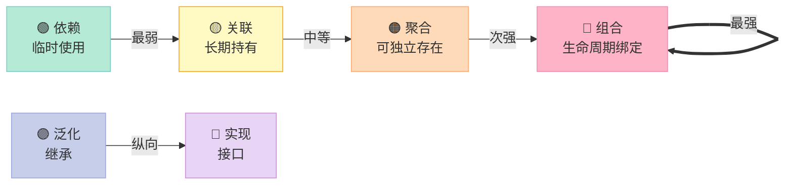
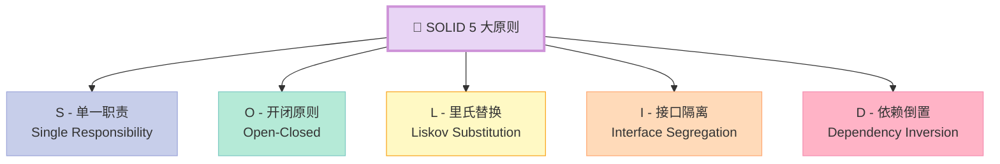
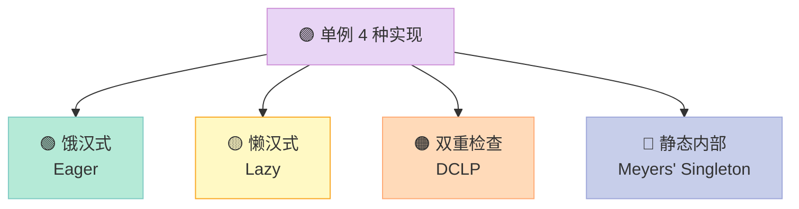
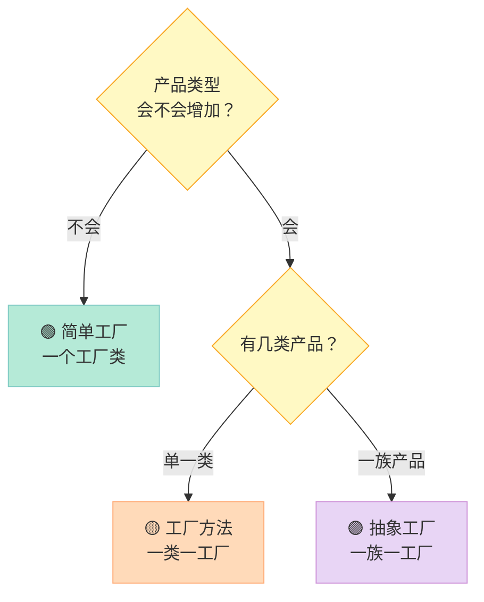
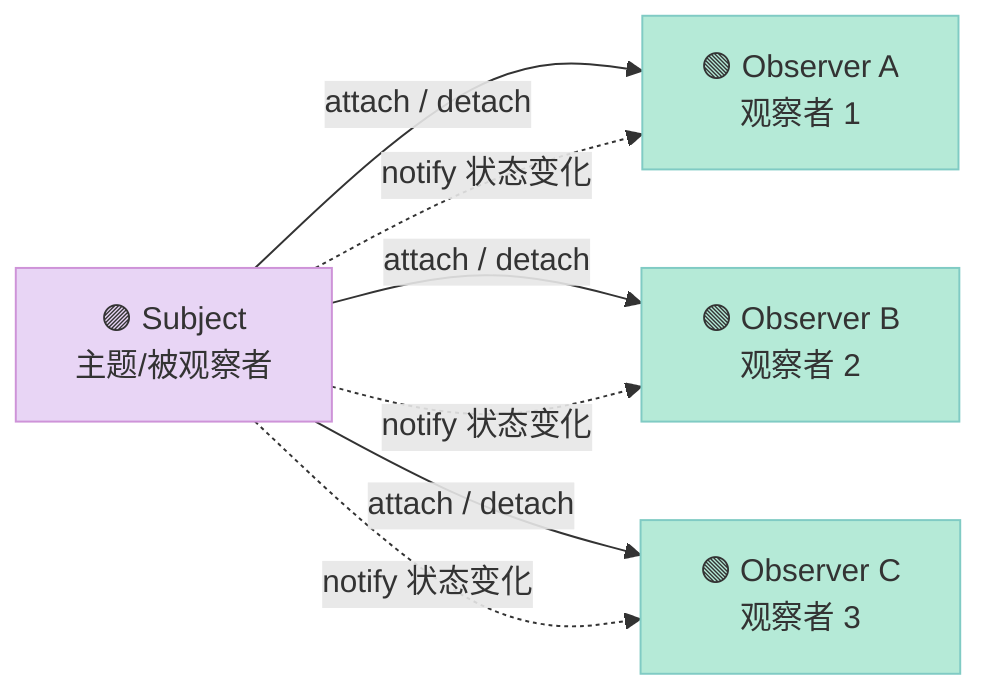
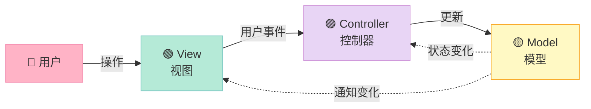

> **为什么单例模式这么简单，面试还能问 30 分钟？**
> 因为单例的背后，是 **C++ 内存模型、线程安全、指令重排、对象生命周期、模板元编程、设计原则** 的全景缩影。一个 `static` 关键字背后，是 C++ 标准 6.7.4 条款、是编译器厂商的实现差异、是大厂面试官的认知筛选器。本文把 23 种设计模式 + 7 大原则 + UML 6 种关系 **一次讲透**，并以 **事件总线 + MVC 框架** 两个实战收尾。

---

## 一、前言：设计模式为什么是 C++ 面试的硬通货？

第 16 篇《设计模式 + HR 面经》把单例 7 种写法、工厂、观察者、装饰器、STAR 法则塞在 1000 行里。**太挤了**。

本文是 **第 16 篇的"设计模式"专项深挖版**，把 HR 部分留给第 24 篇。本篇目标：

| 你能得到 | 具体内容 |
|---------|---------|
| **23 种模式分类** | 创建型 5 + 结构型 7 + 行为型 11，全量速查 |
| **UML 类图 6 种关系** | 关联、依赖、聚合、组合、泛化、实现 |
| **SOLID 5 原则** | 单一职责、开闭、里氏替换、接口隔离、依赖倒置 |
| **迪米特 + 合成复用** | 两个常被忽略的"小原则" |
| **单例 4 种实现** | 饿汉、懒汉、DCLP、静态内部 |
| **工厂 3 种实现** | 简单工厂、工厂方法、抽象工厂 |
| **观察者实战** | 手写一个线程安全的事件总线 |
| **MVC 框架** | 用观察者 + 策略 + 模板方法组合 |

全文 **约 2000 行**、**5+ Mermaid 图**、**40+ 代码块**、**25+ 表格**。建议收藏后分章节读。

---

## 二、设计模式的起源：GoF 与 23 种经典模式

### 2.1 GoF 是什么？

**GoF**（Gang of Four，四人帮）指 **Erich Gamma、Richard Helm、Ralph Johnson、John Vlissides** 四位作者。1994 年他们出版了 **《Design Patterns: Elements of Reusable Object-Oriented Software》**（中译《设计模式：可复用面向对象软件的基础》），把过去 10 年 OOP 圈反复用到的设计经验总结成 **23 种模式**，影响至今。

**三句话理解设计模式**：

- **模式不是银弹**，而是"在特定场景下、被反复验证的解决方案"。
- **模式是语言无关的**，但 C++ 实现有它独特的细节（RAII、模板、虚函数表）。
- **不要为了模式而模式**，简单场景用模式反而过度设计。

### 2.2 23 种模式全景分类表

| 大类 | 数量 | 模式 | 主要目的 |
|------|------|------|---------|
| **创建型** | 5 | 单例、工厂方法、抽象工厂、建造者、原型 | **封装对象创建过程**，解耦"使用"和"构造" |
| **结构型** | 7 | 适配器、桥接、组合、装饰器、外观、享元、代理 | **组合类和对象**，形成更大结构 |
| **行为型** | 11 | 责任链、命令、解释器、迭代器、中介者、备忘录、观察者、状态、策略、模板方法、访问者 | **对象间职责与通信** |

```mermaid
graph TB
    ROOT["🦄 GoF 23 种设计模式"]

    C["🟣 创建型 5 种\n封装对象创建"]
    S["🟢 结构型 7 种\n类与对象组合"]
    B["🟡 行为型 11 种\n职责与通信"]

    C --> C1["单例\nSingleton"]
    C --> C2["工厂方法\nFactory Method"]
    C --> C3["抽象工厂\nAbstract Factory"]
    C --> C4["建造者\nBuilder"]
    C --> C5["原型\nPrototype"]

    S --> S1["适配器\nAdapter"]
    S --> S2["桥接\nBridge"]
    S --> S3["组合\nComposite"]
    S --> S4["装饰器\nDecorator"]
    S --> S5["外观\nFacade"]
    S --> S6["享元\nFlyweight"]
    S --> S7["代理\nProxy"]

    B --> B1["责任链\nChain of Resp."]
    B --> B2["命令\nCommand"]
    B --> B3["解释器\nInterpreter"]
    B --> B4["迭代器\nIterator"]
    B --> B5["中介者\nMediator"]
    B --> B6["备忘录\nMemento"]
    B --> B7["观察者\nObserver"]
    B --> B8["状态\nState"]
    B --> B9["策略\nStrategy"]
    B --> B10["模板方法\nTemplate Method"]
    B --> B11["访问者\nVisitor"]

    style ROOT fill:#E8D5F5,stroke:#CE93D8,stroke-width:3px,color:#333
    style C fill:#C7CEEA,stroke:#9FA8DA,stroke-width:2px,color:#333
    style S fill:#B5EAD7,stroke:#80CBC4,stroke-width:2px,color:#333
    style B fill:#FFDAB9,stroke:#FFAB76,stroke-width:2px,color:#333
    style C1 fill:#FFF9C4,stroke:#F9A825,color:#333
    style C2 fill:#FFF9C4,stroke:#F9A825,color:#333
    style C3 fill:#FFF9C4,stroke:#F9A825,color:#333
    style C4 fill:#FFF9C4,stroke:#F9A825,color:#333
    style C5 fill:#FFF9C4,stroke:#F9A825,color:#333
    style S1 fill:#B5EAD7,stroke:#80CBC4,color:#333
    style S2 fill:#B5EAD7,stroke:#80CBC4,color:#333
    style S3 fill:#B5EAD7,stroke:#80CBC4,color:#333
    style S4 fill:#B5EAD7,stroke:#80CBC4,color:#333
    style S5 fill:#B5EAD7,stroke:#80CBC4,color:#333
    style S6 fill:#B5EAD7,stroke:#80CBC4,color:#333
    style S7 fill:#B5EAD7,stroke:#80CBC4,color:#333
    style B1 fill:#FFB3C6,stroke:#F48FB1,color:#333
    style B2 fill:#FFB3C6,stroke:#F48FB1,color:#333
    style B3 fill:#FFB3C6,stroke:#F48FB1,color:#333
    style B4 fill:#FFB3C6,stroke:#F48FB1,color:#333
    style B5 fill:#FFB3C6,stroke:#F48FB1,color:#333
    style B6 fill:#FFB3C6,stroke:#F48FB1,color:#333
    style B7 fill:#FFB3C6,stroke:#F48FB1,color:#333
    style B8 fill:#FFB3C6,stroke:#F48FB1,color:#333
    style B9 fill:#FFB3C6,stroke:#F48FB1,color:#333
    style B10 fill:#FFB3C6,stroke:#F48FB1,color:#333
    style B11 fill:#FFB3C6,stroke:#F48FB1,color:#333
```



### 2.3 23 种模式用途速查表

| 模式 | 一句话 | 典型应用 | C++ 实现关键点 |
|------|-------|---------|---------------|
| 单例 | 全局唯一实例 | 日志、配置、线程池 | `static` 局部变量 / DCLP |
| 工厂方法 | 子类决定创建什么 | 数据库访问层、插件 | 虚函数 + 智能指针 |
| 抽象工厂 | 创建"产品族" | 跨平台 UI 库 | 一组工厂方法 |
| 建造者 | 分步构造复杂对象 | HTTP 请求、配置对象 | 链式调用、Director |
| 原型 | clone 自身生成新对象 | 大量相似对象、undo | 深拷贝 |
| 适配器 | 转换接口兼容 | 旧接口包装 STL | 继承 / 组合 |
| 桥接 | 抽象与实现解耦 | 跨平台绘制 | 组合代替继承 |
| 组合 | 树形结构统一处理 | 文件系统、UI 树 | 递归 |
| 装饰器 | 动态加职责 | IO 流、middleware | 嵌套包裹 |
| 外观 | 简化子系统调用 | 复杂库封装 | 统一接口 |
| 享元 | 共享细粒度对象 | 文字游戏、棋盘 | 内部状态 + 外部状态 |
| 代理 | 控制访问真实对象 | 智能指针、RPC | 虚函数 + 引用计数 |
| 责任链 | 多对象依次尝试 | 异常处理、过滤器 | 链表 / 数组 |
| 命令 | 把请求封装为对象 | 任务队列、undo | 虚函数 execute() |
| 解释器 | 解释自定义语法 | SQL、正则 | 抽象语法树 |
| 迭代器 | 顺序访问聚合对象 | STL 容器 | begin() / end() |
| 中介者 | 集中对象间通信 | GUI 组件、聊天室 | 中心化调度 |
| 备忘录 | 保存/恢复状态 | 撤销、快照 | 序列化 |
| 观察者 | 一对多状态通知 | 事件系统、MVC | 回调 + 容器 |
| 状态 | 行为随状态改变 | TCP 状态机、游戏角色 | 多态替换条件分支 |
| 策略 | 封装可互换算法 | 排序、压缩 | 函数对象 |
| 模板方法 | 骨架不变，步骤子类实现 | 框架、回调 | 虚函数 + 非虚调用 |
| 访问者 | 在不修改类的前提下增加操作 | AST、编译器 | 双重分派 |

---

## 三、UML 类图基础：6 种关系

UML（Unified Modeling Language，统一建模语言）是描述类与类之间关系的标准图形语言。**面试画图必考**。

### 3.1 6 种关系速查表

| 关系 | 英文 | 符号 | 语义 | 强度 | 代码体现 |
|------|------|------|------|------|---------|
| 关联 | Association | 实线 + 箭头 | A 持有 B 的引用 | 强 | 成员变量 |
| 依赖 | Dependency | 虚线 + 箭头 | A 临时使用 B | 最弱 | 局部变量、参数 |
| 聚合 | Aggregation | 空心菱形 + 实线 | A 包含 B，B 可独立 | 弱 | 成员变量（指针） |
| 组合 | Composition | 实心菱形 + 实线 | A 拥有 B，B 生命周期绑定 A | 最强 | 成员变量（值） |
| 泛化 | Generalization | 空心三角 + 实线 | 父子类继承 | - | `:` 公有继承 |
| 实现 | Realization | 空心三角 + 虚线 | 类实现接口 | - | 继承抽象类 |

### 3.2 关系强度对比图



### 3.3 关联关系代码示例

```cpp
// 关联：A 长期持有 B 的引用
class Teacher;  // 前向声明
class School {
private:
    Teacher* teacher_;  // 关联
    // teacher_ 的生命周期与 School 独立
};
```

### 3.4 依赖关系代码示例

```cpp
// 依赖：A 临时使用 B（参数、局部变量、返回值）
class Exam {
public:
    void evaluate(Student& s) {  // 依赖：参数
        Paper p;                  // 依赖：局部变量
        p.check(s);
    }
};
```

### 3.5 聚合 vs 组合代码示例

```cpp
// 聚合：空心菱形，整体-部分可独立
class Department;
class Company {
    std::vector<Department*> depts_;  // 聚合：部门可独立于公司
};

// 组合：实心菱形，整体-部分生命周期绑定
class Heart;
class Person {
    Heart heart_;  // 组合：心脏随人而生、随人而亡（值语义）
};
```

### 3.6 泛化 vs 实现代码示例

```cpp
// 泛化：类继承类
class Animal {};
class Dog : public Animal {};  // 泛化

// 实现：类继承纯虚接口
class Drawable {
public:
    virtual void draw() const = 0;
};
class Circle : public Drawable {  // 实现
public:
    void draw() const override {}
};
```

### 3.7 UML 关系选择决策表

| 场景 | 用什么关系 | 为什么 |
|------|---------|--------|
| `Car` 有 `Engine`，发动机属于车 | 组合 | 发动机不能脱离车独立存在 |
| `Company` 有多个 `Department`，部门也可独立 | 聚合 | 部门可以脱离公司存在 |
| 方法参数临时用一下 `Date` | 依赖 | 一次性使用 |
| 长期持有 `Logger*` | 关联 | 单例对象 |
| 子类 `Dog` 继承 `Animal` | 泛化 | is-a |
| 类实现 `Serializable` | 实现 | 满足接口契约 |

---

## 四、SOLID 5 大原则

SOLID 是面向对象设计的 **5 大基本原则** 的首字母缩写，由 Robert C. Martin（Bob 叔叔）提出。这 5 条原则是判断"代码是否好设计"的核心尺度。

### 4.1 五大原则全景图



### 4.2 S：单一职责原则（SRP）

**一个类应该只有一个引起它变化的原因**。换句话说，一个类只负责 **一件事**。

#### 反例

```cpp
// 违反 SRP：User 类同时管业务、数据库、序列化
class User {
public:
    void save() { /* 直接写 SQL */ }       // 职责 1
    std::string toJson() { /* ... */ }     // 职责 2
    void sendEmail() { /* ... */ }          // 职责 3
};
```

#### 正例

```cpp
// 三个类各管一件事
class User { /* 纯数据 + 业务逻辑 */ };
class UserRepository {                       // 持久化
    void save(const User& u);
};
class UserSerializer {                       // 序列化
    std::string toJson(const User& u);
};
class UserNotifier {                         // 通知
    void sendEmail(const User& u);
};
```

#### SRP 实践要点

| 维度 | 做法 |
|------|------|
| 类大小 | 通常 < 500 行 |
| 命名 | 名副其实，类名是名词 |
| 变化原因 | 修改一个类只能因为一种原因 |
| 反例 | `UserManager`（管理+操作+验证+持久化的"上帝类"） |

### 4.3 O：开闭原则（OCP）

**对扩展开放，对修改关闭**。新增功能时，应该通过 **增加新代码** 而不是 **修改老代码** 来实现。

#### 反例

```cpp
// 违反 OCP：每加一种形状都要改 area 函数
double area(const Shape& s) {
    if (s.type == "circle") return 3.14 * s.r * s.r;
    if (s.type == "rect")   return s.w * s.h;
    // 新加三角形？必须改这里
}
```

#### 正例

```cpp
// 符合 OCP：新增形状不需要改老代码
class Shape {
public:
    virtual double area() const = 0;
};
class Circle : public Shape {
    double r_;
public:
    explicit Circle(double r) : r_(r) {}
    double area() const override { return 3.14 * r_ * r_; }
};
class Rect : public Shape {
    double w_, h_;
public:
    Rect(double w, double h) : w_(w), h_(h) {}
    double area() const override { return w_ * h_; }
};
// 新加 Triangle？只需要写一个 Triangle 类，area() 不用动
```

#### OCP 实现手段对比

| 手段 | 适用场景 | 代价 |
|------|---------|------|
| 继承 + 多态 | 行为稳定，类型经常变 | 类层次膨胀 |
| 组合 + 策略 | 行为经常变 | 类数量增加 |
| 模板 | 类型参数化 | 编译期决定，不可热替换 |
| 函数对象 / lambda | 简单算法 | 类型擦除损失性能 |

### 4.4 L：里氏替换原则（LSP）

**子类对象必须能够替换父类对象，且程序行为不变**。换句话说，子类不能改变父类原有的契约。

#### 反例

```cpp
// 违反 LSP：正方形继承矩形，替换后行为异常
class Rect {
public:
    virtual void setW(int w) { w_ = w; }
    virtual void setH(int h) { h_ = h; }
    int area() const { return w_ * h_; }
protected:
    int w_ = 0, h_ = 0;
};
class Square : public Rect {
public:
    void setW(int w) override { w_ = w; h_ = w; }  // 改父类语义
    void setH(int h) override { w_ = h; h_ = h; }  // 改父类语义
};
void test(Rect& r) {
    r.setW(5); r.setH(4);
    assert(r.area() == 20);  // 对 Rect 成立，对 Square 不成立
}
```

#### LSP 实践要点

| 要点 | 含义 |
|------|------|
| **前置条件** | 子类方法参数不能比父类更严格 |
| **后置条件** | 子类方法返回值不能比父类更宽松 |
| **不变量** | 子类不能破坏父类的不变量 |
| **异常** | 子类不能抛出父类没声明的异常 |

### 4.5 I：接口隔离原则（ISP）

**客户端不应该被迫依赖它不使用的方法**。换句话说，接口要小而专，不要搞"大而全"的胖接口。

#### 反例

```cpp
// 违反 ISP：Worker 接口太胖
class Worker {
public:
    virtual void work() = 0;
    virtual void eat() = 0;    // 机器人不需要 eat
    virtual void sleep() = 0;  // 机器人不需要 sleep
};
class Robot : public Worker {
    void eat() override { /* 机器人怎么吃？ */ }
};
```

#### 正例

```cpp
// 拆成两个小接口
class Workable { virtual void work() = 0; };
class Eatable  { virtual void eat() = 0; };

class Human : public Workable, public Eatable {
    void work() override {}
    void eat() override {}
};
class Robot : public Workable {
    void work() override {}
    // 不需要 eat()
};
```

### 4.6 D：依赖倒置原则（DIP）

**高层模块不应该依赖低层模块，二者都应该依赖抽象**。**抽象不应该依赖细节，细节应该依赖抽象**。

#### 反例

```cpp
// 违反 DIP：高层直接依赖低层
class MySQLDatabase {
public:
    void connect() {}
    void query() {}
};
class UserService {
    MySQLDatabase db_;  // 高层直接依赖低层具体类
};
// 想换 PostgreSQL？必须改 UserService
```

#### 正例

```cpp
// 符合 DIP：高层依赖抽象
class IDatabase {  // 抽象
public:
    virtual void connect() = 0;
    virtual void query() = 0;
    virtual ~IDatabase() = default;
};
class MySQLDatabase : public IDatabase { /* ... */ };
class PgDatabase    : public IDatabase { /* ... */ };

class UserService {
    IDatabase& db_;  // 依赖抽象
public:
    explicit UserService(IDatabase& db) : db_(db) {}
};
// 切换数据库？只换注入即可
```

#### 依赖倒置 vs 控制反转 vs 依赖注入

| 概念 | 英文 | 含义 |
|------|------|------|
| 依赖倒置原则 | DIP | 原则：高层不依赖低层细节 |
| 控制反转 | IoC | 思想：把控制权交给框架 |
| 依赖注入 | DI | 实现：通过参数/容器传入依赖 |
| 服务定位器 | SL | 实现：通过全局注册表查找 |

### 4.7 SOLID 总结表

| 原则 | 一句话 | 解决什么 | 违反症状 |
|------|-------|---------|---------|
| SRP | 一个类只做一件事 | 职责过多 | 改一个需求要改 3 个类 |
| OCP | 对扩展开放，对修改关闭 | 频繁修改老代码 | 每次加功能都改 area() |
| LSP | 子类可替换父类 | 继承层次混乱 | 父类断言在子类失败 |
| ISP | 接口要小而专 | 胖接口 | 实现类被迫写空方法 |
| DIP | 依赖抽象不依赖细节 | 强耦合 | 换数据库要改业务代码 |

---

## 五、迪米特法则 + 合成复用原则

除了 SOLID，OO 设计还有 **两个常被忽略的小原则**，面试偶尔会问。

### 5.1 迪米特法则（LoD / Least Knowledge Principle）

**一个对象应该对其他对象保持最少的了解**。也叫 **最少知道原则**。

#### 反例

```cpp
// 违反 LoD：Chain 内部暴露了 Node 细节
class Chain {
public:
    Node* getHead() { return head_; }  // 暴露内部 Node
    void op() {
        // 外部拿到 head，再访问 head->next->data
    }
};
```

#### 正例

```cpp
// 符合 LoD：Chain 只暴露高层操作
class Chain {
public:
    void forEach(std::function<void(int)> fn) {  // 隐藏 Node
        for (Node* p = head_; p; p = p->next) fn(p->data);
    }
};
```

#### 迪米特法则实践要点

| 做法 | 含义 |
|------|------|
| **只和朋友通信** | 类内方法只调用：自己的方法、入参对象、自身成员对象、自身创建的对象 |
| **减少 public 方法** | 暴露的接口越少越好 |
| **封装细节** | 不暴露内部数据结构 |
| **避免链式调用** | `a.b().c().d()` 通常是设计异味 |

### 5.2 合成复用原则（CARP / Composite Reuse Principle）

**优先使用对象组合（has-a），而不是类继承（is-a）来实现复用**。

#### 继承 vs 组合对比表

| 维度 | 继承 | 组合 |
|------|------|------|
| 耦合度 | 高（白盒复用） | 低（黑盒复用） |
| 灵活性 | 编译期决定 | 运行期可替换 |
| 封装破坏 | 父类实现暴露给子类 | 内部细节被封装 |
| 适合场景 | 稳定的 is-a 关系 | 变化的 has-a 关系 |
| 风险 | 继承层次过深、菱形问题 | 类数量膨胀 |

#### 反例：滥用继承

```cpp
// 用继承"复用"算法，类爆炸
class SortedArrayList : public ArrayList { /* 加排序 */ };
class SortedHashList  : public HashList  { /* 加排序 */ };
// 每加一种数据结构 × 每加一种算法 = 类数量爆炸
```

#### 正例：组合 + 策略

```cpp
// 组合策略
class SortStrategy { public: virtual void sort() = 0; };
class List {
    std::unique_ptr<SortStrategy> sorter_;
public:
    void setSorter(std::unique_ptr<SortStrategy> s) { sorter_ = std::move(s); }
    void sort() { sorter_->sort(); }
};
// 1 个 List + N 个 SortStrategy = N+1 个类
```

### 5.3 7 大原则速查

| 原则 | 英文 | 核心思想 |
|------|------|---------|
| 单一职责 | SRP | 一个类只做一件事 |
| 开闭 | OCP | 扩展开放，修改关闭 |
| 里氏替换 | LSP | 子类可替换父类 |
| 接口隔离 | ISP | 接口要小 |
| 依赖倒置 | DIP | 依赖抽象 |
| 迪米特 | LoD | 最少知道 |
| 合成复用 | CARP | 优先组合 |

---

## 六、创建型 5 种模式

创建型模式封装"对象如何被创建"，把"使用"和"构造"解耦。

### 6.1 创建型 5 种对比表

| 模式 | 解决问题 | 关键思想 | 典型场景 |
|------|---------|---------|---------|
| 单例 | 全局唯一实例 | 私有构造 + 静态方法 | Logger、Config |
| 工厂方法 | 创建对象推迟到子类 | 虚函数 create() | 数据库访问层 |
| 抽象工厂 | 创建产品族 | 一组工厂方法 | 跨平台 UI |
| 建造者 | 复杂对象分步构造 | Director + Builder | HTTP 请求、配置 |
| 原型 | 通过 clone 创建新对象 | 深拷贝 | 大量相似对象 |

### 6.2 单例模式（Singleton）

**保证一个类只有一个实例，并提供全局访问点**。

#### 三要素

1. **私有构造函数**：禁止外部 `new`。
2. **静态成员**：保存唯一实例。
3. **静态方法**：返回这个实例。

#### 4 种实现方式



#### 6.2.1 饿汉式（Eager Initialization）

```cpp
// 饿汉式：程序启动时就创建
class EagerSingleton {
public:
    static EagerSingleton& getInstance() {
        static EagerSingleton instance;  // 首次调用时构造
        return instance;
    }
    EagerSingleton(const EagerSingleton&) = delete;
    EagerSingleton& operator=(const EagerSingleton&) = delete;
private:
    EagerSingleton() = default;
    ~EagerSingleton() = default;
};
```

**优缺点**：

| 优点 | 缺点 |
|------|------|
| 实现简单 | 启动即占用内存 |
| 线程安全（构造在 main 前） | 不支持延迟加载 |
| 无锁 | 多个单例时启动变慢 |

#### 6.2.2 懒汉式（基础版，非线程安全）

```cpp
// 懒汉式（非线程安全）
class LazySingleton {
public:
    static LazySingleton& getInstance() {
        if (!instance_) {  // ⚠️ 多线程下可能创建多个
            instance_.reset(new LazySingleton);
        }
        return *instance_;
    }
    LazySingleton(const LazySingleton&) = delete;
    LazySingleton& operator=(const LazySingleton&) = delete;
private:
    LazySingleton() = default;
    static std::unique_ptr<LazySingleton> instance_;
};
std::unique_ptr<LazySingleton> LazySingleton::instance_;
```

#### 6.2.3 双重检查锁（DCLP + atomic + memory_order）

```cpp
// DCLP：C++11 之后的正确写法
class DCLPSingleton {
public:
    static DCLPSingleton& getInstance() {
        // 第一次读：如果已构造，直接返回
        DCLPSingleton* p = instance_.load(std::memory_order_acquire);
        if (p == nullptr) {
            std::lock_guard<std::mutex> lk(mtx_);
            p = instance_.load(std::memory_order_relaxed);
            if (p == nullptr) {
                p = new DCLPSingleton();
                instance_.store(p, std::memory_order_release);
            }
        }
        return *p;
    }
    DCLPSingleton(const DCLPSingleton&) = delete;
    DCLPSingleton& operator=(const DCLPSingleton&) = delete;
private:
    DCLPSingleton() = default;
    inline static std::atomic<DCLPSingleton*> instance_{nullptr};
    inline static std::mutex mtx_;
};
```

**DCLP 三大坑**：

| 坑 | 原因 | 解法 |
|----|------|------|
| 内存可见性 | 编译器优化掉读 | `std::atomic` |
| 指令重排 | 构造未完成就发布指针 | `memory_order_release/acquire` |
| 锁粒度 | 每次都加锁性能差 | 双重检查 |

#### 6.2.4 静态内部类 / Meyers' Singleton（推荐）

```cpp
// Meyers' Singleton：C++11 之后的"最佳实践"
class MeyersSingleton {
public:
    static MeyersSingleton& getInstance() {
        static MeyersSingleton instance;  // C++11 保证线程安全
        return instance;
    }
    MeyersSingleton(const MeyersSingleton&) = delete;
    MeyersSingleton& operator=(const MeyersSingleton&) = delete;
private:
    MeyersSingleton() = default;
    ~MeyersSingleton() = default;
};
```

**为什么 C++11 之后推荐 Meyers' Singleton？**

C++11 标准 6.7.4 条款规定：**"Magic statics"**——函数局部 `static` 变量的初始化在多线程下由编译器插入 **lock_free 双检锁**，且保证 **不发生指令重排**。

#### 6.2.5 单例 4 种实现对比表

| 实现 | 线程安全 | 延迟加载 | 性能 | 复杂度 | 推荐指数 |
|------|---------|---------|------|--------|---------|
| 饿汉 | ✅ | ❌ | 最快 | ⭐ | ⭐⭐ |
| 懒汉基础 | ❌ | ✅ | - | ⭐ | ❌ |
| 懒汉加锁 | ✅ | ✅ | 慢 | ⭐⭐ | ⭐⭐ |
| DCLP | ✅ | ✅ | 快 | ⭐⭐⭐⭐ | ⭐⭐⭐ |
| Meyers' Static | ✅ | ✅ | 快 | ⭐ | ⭐⭐⭐⭐⭐ |

#### 6.2.6 单例的"反模式"批评

单例是 23 种模式中 **争议最大** 的一种。批评点：

| 批评 | 理由 |
|------|------|
| **违反 SRP** | 类既管业务又管自己的生命周期 |
| **难以测试** | 全局状态，单元测试无法隔离 |
| **隐藏依赖** | 使用者看不到类对单例的依赖 |
| **多线程隐患** | 析构顺序、共享状态 |

**现代 C++ 实践**：优先用 **依赖注入** 注入单例对象，而不是到处 `getInstance()`。

### 6.3 工厂方法模式（Factory Method）

**定义一个创建对象的接口，让子类决定实例化哪个类**。

#### 6.3.1 简单工厂（不是 GoF 23 种之一）

```cpp
// 简单工厂：一个工厂类根据 type 创建不同产品
enum class ShapeType { Circle, Rect, Triangle };
class ShapeFactory {
public:
    static std::unique_ptr<Shape> create(ShapeType t) {
        switch (t) {
            case ShapeType::Circle:   return std::make_unique<Circle>();
            case ShapeType::Rect:     return std::make_unique<Rect>();
            case ShapeType::Triangle: return std::make_unique<Triangle>();
        }
        return nullptr;
    }
};
```

**简单工厂的缺点**：每加一种产品都要改 `create()` 函数，**违反 OCP**。

#### 6.3.2 工厂方法

```cpp
// 抽象创建者
class ShapeCreator {
public:
    virtual std::unique_ptr<Shape> create() const = 0;
    void draw() const {  // 模板方法调用工厂方法
        auto s = create();
        s->draw();
    }
    virtual ~ShapeCreator() = default;
};

// 具体创建者
class CircleCreator : public ShapeCreator {
public:
    std::unique_ptr<Shape> create() const override {
        return std::make_unique<Circle>();
    }
};
class RectCreator : public ShapeCreator {
public:
    std::unique_ptr<Shape> create() const override {
        return std::make_unique<Rect>();
    }
};
// 新加 Triangle？只需要加一个 TriangleCreator，老代码不动
```

#### 6.3.3 注册式工厂（反射 + 工厂）

```cpp
// 用模板 + 注册表实现"反射"
class ShapeRegistry {
public:
    using Creator = std::function<std::unique_ptr<Shape>()>;
    static ShapeRegistry& instance() {
        static ShapeRegistry r;
        return r;
    }
    void registerCreator(const std::string& name, Creator c) {
        creators_[name] = std::move(c);
    }
    std::unique_ptr<Shape> create(const std::string& name) {
        return creators_.at(name)();
    }
private:
    std::unordered_map<std::string, Creator> creators_;
};

template<class T>
struct ShapeRegistrar {
    ShapeRegistrar(const std::string& name) {
        ShapeRegistry::instance().registerCreator(name,
            [] { return std::make_unique<T>(); });
    }
};
// 自动注册
namespace { ShapeRegistrar<Circle> _c1("circle"); }
```

### 6.4 抽象工厂模式（Abstract Factory）

**提供一个创建一系列相关对象的接口，而无需指定它们具体的类**。

#### 示例：跨平台 UI

```cpp
// 抽象产品
class Button { public: virtual void render() = 0; virtual ~Button() = default; };
class Checkbox { public: virtual void render() = 0; virtual ~Checkbox() = default; };

// 具体产品：Windows
class WinButton : public Button { public: void render() override { /* ... */ } };
class WinCheckbox : public Checkbox { public: void render() override { /* ... */ } };

// 具体产品：Mac
class MacButton : public Button { public: void render() override { /* ... */ } };
class MacCheckbox : public Checkbox { public: void render() override { /* ... */ } };

// 抽象工厂
class UIFactory {
public:
    virtual std::unique_ptr<Button> createButton() = 0;
    virtual std::unique_ptr<Checkbox> createCheckbox() = 0;
    virtual ~UIFactory() = default;
};

// 具体工厂
class WinUIFactory : public UIFactory {
public:
    std::unique_ptr<Button> createButton() override { return std::make_unique<WinButton>(); }
    std::unique_ptr<Checkbox> createCheckbox() override { return std::make_unique<WinCheckbox>(); }
};
// 同理 MacUIFactory
```

#### 抽象工厂 vs 工厂方法

| 维度 | 工厂方法 | 抽象工厂 |
|------|---------|---------|
| 抽象层级 | 一个产品 | 一族产品 |
| 类数量 | 较少 | 多 |
| 扩展性 | 加产品容易 | 加产品族容易 |
| 典型应用 | 单产品创建 | 跨平台 UI |

### 6.5 建造者模式（Builder）

**将一个复杂对象的构建与它的表示分离，使得同样的构建过程可以创建不同的表示**。

#### 经典实现：链式 Builder

```cpp
class HttpRequest {
    std::string url_, method_, body_;
    std::map<std::string, std::string> headers_;
public:
    class Builder {
        HttpRequest req_;
    public:
        Builder& url(const std::string& u)    { req_.url_ = u; return *this; }
        Builder& method(const std::string& m) { req_.method_ = m; return *this; }
        Builder& body(const std::string& b)   { req_.body_ = b; return *this; }
        Builder& header(const std::string& k, const std::string& v) {
            req_.headers_[k] = v;
            return *this;
        }
        HttpRequest build() { return req_; }
    };
    // 私有构造，禁止外部 new
    HttpRequest() = default;
    friend class Builder;
};
// 使用：链式调用
auto req = HttpRequest::Builder()
    .url("https://api.example.com")
    .method("POST")
    .header("Content-Type", "application/json")
    .body(R"({"key":"value"})")
    .build();
```

#### 经典实现：Director + Builder

```cpp
// 适用于"构造过程固定，但表示可变"的场景
class PizzaBuilder {
public:
    virtual PizzaBuilder& setDough() = 0;
    virtual PizzaBuilder& setSauce() = 0;
    virtual PizzaBuilder& setTopping() = 0;
    virtual ~PizzaBuilder() = default;
};
class HawaiianBuilder : public PizzaBuilder { /* ... */ };

class Cook {
    PizzaBuilder& builder_;
public:
    explicit Cook(PizzaBuilder& b) : builder_(b) {}
    Pizza makePizza() {
        return builder_.setDough().setSauce().setTopping();
    }
};
```

### 6.6 原型模式（Prototype）

**用原型实例指定创建对象的种类，并且通过拷贝这些原型创建新的对象**。

#### 深拷贝实现

```cpp
class Shape {
public:
    virtual std::unique_ptr<Shape> clone() const = 0;
    virtual ~Shape() = default;
};
class Circle : public Shape {
    int r_;
public:
    explicit Circle(int r) : r_(r) {}
    std::unique_ptr<Shape> clone() const override {
        return std::make_unique<Circle>(*this);  // 拷贝构造
    }
};
```

**应用场景**：

| 场景 | 优势 |
|------|------|
| 大量相似对象 | clone 比 new 更快 |
| 避免重复初始化 | 直接复制已经初始化好的状态 |
| Undo 机制 | 保存快照，回滚时恢复 |
| 数据库 ORM | 从已有对象克隆一个 modified 版本 |

---

## 七、结构型 7 种模式

结构型模式关注 **类和对象的组合**，形成更大的结构以满足更高层次的抽象。

### 7.1 结构型 7 种对比表

| 模式 | 解决问题 | 关键思想 | 典型应用 |
|------|---------|---------|---------|
| 适配器 | 接口不兼容 | 包装旧接口 | 旧 API 包装 STL |
| 桥接 | 抽象与实现分离 | 组合代替继承 | 跨平台绘制 |
| 组合 | 树形结构 | 统一处理叶和枝 | 文件系统 |
| 装饰器 | 动态加职责 | 嵌套包裹 | IO 流 |
| 外观 | 简化子系统 | 统一接口 | 复杂库封装 |
| 享元 | 共享细粒度对象 | 内部+外部状态 | 棋盘、文字 |
| 代理 | 控制访问 | 替代真实对象 | 智能指针、RPC |

### 7.2 适配器模式（Adapter）

**将一个类的接口转换成客户端希望的另一种接口**。解决"老接口"和"新需求"不兼容的问题。

#### 对象适配器（推荐，组合）

```cpp
// 目标接口（新接口）
class ITarget {
public:
    virtual void request() = 0;
    virtual ~ITarget() = default;
};
// 被适配者（旧接口）
class Adaptee {
public:
    void specificRequest() { /* 老实现 */ }
};
// 适配器
class Adapter : public ITarget {
    Adaptee& adaptee_;
public:
    explicit Adapter(Adaptee& a) : adaptee_(a) {}
    void request() override { adaptee_.specificRequest(); }
};
```

#### 类适配器（多重继承，谨慎使用）

```cpp
class ClassAdapter : public ITarget, private Adaptee {
public:
    void request() override { specificRequest(); }
};
```

#### 适配器 vs 装饰器 vs 代理

| 模式 | 目的 | 关注点 |
|------|------|--------|
| 适配器 | 转换接口 | 后向兼容 |
| 装饰器 | 增加职责 | 行为增强 |
| 代理 | 控制访问 | 访问拦截 |

### 7.3 桥接模式（Bridge）

**将抽象部分与实现部分分离，使它们都可以独立地变化**。

#### 反例：继承导致类爆炸

```cpp
// 形状 × 颜色 = 类爆炸
class RedCircle {}; class BlueCircle {};
class RedRect {};   class BlueRect {};
// 新加绿色？加 2 个类
```

#### 正例：桥接（组合代替继承）

```cpp
// 实现接口
class Color {
public:
    virtual void apply() = 0;
    virtual ~Color() = default;
};
class Red : public Color  { public: void apply() override {} };
class Blue : public Color { public: void apply() override {} };

// 抽象
class Shape {
protected:
    std::unique_ptr<Color> color_;
public:
    explicit Shape(std::unique_ptr<Color> c) : color_(std::move(c)) {}
    virtual void draw() = 0;
    virtual ~Shape() = default;
};
class Circle : public Shape {
public:
    using Shape::Shape;
    void draw() override { color_->apply(); /* 画圆 */ }
};
// 任何形状 × 任何颜色 = 自由组合，不再有类爆炸
```

### 7.4 组合模式（Composite）

**将对象组合成树形结构以表示"部分-整体"的层次结构**。使客户端对单个对象和组合对象的使用具有一致性。

```cpp
class Component {
public:
    virtual void operation() = 0;
    virtual void add(std::unique_ptr<Component>) {}
    virtual void remove(Component*) {}
    virtual ~Component() = default;
};
class Leaf : public Component {
public:
    void operation() override { /* 叶子行为 */ }
};
class Composite : public Component {
    std::vector<std::unique_ptr<Component>> children_;
public:
    void operation() override {
        for (auto& c : children_) c->operation();  // 递归
    }
    void add(std::unique_ptr<Component> c) override {
        children_.push_back(std::move(c));
    }
};
```

**典型应用**：

- 文件系统：文件（叶） vs 目录（组合）
- GUI 组件：按钮（叶） vs 容器（组合）
- 组织架构树
- 抽象语法树（AST）

### 7.5 装饰器模式（Decorator）

**动态地给一个对象添加一些额外的职责**。装饰器模式 vs 继承：装饰器是 **运行期** 扩展，继承是 **编译期** 扩展。

#### IO 流经典实现

```cpp
// Component
class Stream {
public:
    virtual std::string read() = 0;
    virtual void write(const std::string&) = 0;
    virtual ~Stream() = default;
};
// ConcreteComponent
class FileStream : public Stream {
public:
    std::string read() override { return "data"; }
    void write(const std::string& s) override {}
};
// Decorator
class StreamDecorator : public Stream {
protected:
    std::unique_ptr<Stream> inner_;
public:
    explicit StreamDecorator(std::unique_ptr<Stream> s) : inner_(std::move(s)) {}
};
// ConcreteDecorator
class CryptoStream : public StreamDecorator {
public:
    using StreamDecorator::StreamDecorator;
    std::string read() override {
        auto raw = inner_->read();
        return decrypt(raw);  // 增加解密职责
    }
    void write(const std::string& s) override {
        inner_->write(encrypt(s));
    }
};
class BufferedStream : public StreamDecorator {
    std::string buf_;
public:
    using StreamDecorator::StreamDecorator;
    std::string read() override { return buf_ + inner_->read(); }
    void write(const std::string& s) override { buf_ = s; inner_->write(s); }
};
// 自由组合
auto s = std::make_unique<CryptoStream>(
            std::make_unique<BufferedStream>(
                std::make_unique<FileStream>()));
```

### 7.6 外观模式（Facade）

**为子系统中的一组接口提供一个一致的界面**。Facade 模式定义了一个高层接口，使得子系统更容易使用。

```cpp
// 复杂子系统
class CPU { public: void freeze() {} void execute() {} };
class Memory { public: void load() {} };
class Disk { public: void read() {} };

// 外观
class ComputerFacade {
    CPU cpu_;
    Memory mem_;
    Disk disk_;
public:
    void start() {
        cpu_.freeze();
        mem_.load();
        disk_.read();
        cpu_.execute();
    }
};
// 客户端只调用 facade.start()，不关心细节
```

### 7.7 享元模式（Flyweight）

**运用共享技术有效地支持大量细粒度的对象**。核心是 **内部状态**（可共享）和 **外部状态**（不可共享）的分离。

```cpp
// 棋子：颜色是内部状态（可共享），位置是外部状态（不可共享）
class ChessPiece {
    std::string color_;  // 内部状态，由享元管理
public:
    explicit ChessPiece(std::string c) : color_(std::move(c)) {}
    void display(int x, int y) const {  // 外部状态作为参数传入
        std::cout << color_ << " at (" << x << "," << y << ")\n";
    }
};
class ChessPieceFactory {
    std::unordered_map<std::string, std::shared_ptr<ChessPiece>> pool_;
public:
    std::shared_ptr<ChessPiece> get(const std::string& color) {
        if (pool_.find(color) == pool_.end()) {
            pool_[color] = std::make_shared<ChessPiece>(color);
        }
        return pool_[color];
    }
};
```

**典型应用**：文字游戏（每个字符）、棋盘（每个棋子）、Java Integer 缓存（-128~127）、Java String 字符串池。

### 7.8 代理模式（Proxy）

**为其他对象提供一种代理以控制对这个对象的访问**。

#### 4 种代理

| 代理类型 | 用途 | 示例 |
|---------|------|------|
| **远程代理** | 隐藏远程对象 | RPC 客户端 stub |
| **虚拟代理** | 延迟加载 | 大图片懒加载 |
| **保护代理** | 访问权限控制 | 用户权限 |
| **智能引用** | 引用计数、对象生命周期 | 智能指针 |

```cpp
class IService {
public:
    virtual void request() = 0;
    virtual ~IService() = default;
};
class RealService : public IService {
public:
    void request() override { /* 实际工作 */ }
};
class ProxyService : public IService {
    std::unique_ptr<RealService> real_;
public:
    void request() override {
        // 1. 权限检查
        // 2. 延迟加载
        if (!real_) real_ = std::make_unique<RealService>();
        // 3. 缓存、日志
        real_->request();
    }
};
```

---

## 八、行为型 11 种模式

行为型模式关注 **对象间的职责分配和通信**。

### 8.1 行为型 11 种对比表

| 模式 | 解决问题 | 关键思想 | 典型应用 |
|------|---------|---------|---------|
| 责任链 | 多对象依次处理 | 链表传递请求 | 异常处理 |
| 命令 | 把请求封装为对象 | execute() 接口 | Undo、任务队列 |
| 解释器 | 解释自定义语法 | AST | SQL、正则 |
| 迭代器 | 顺序访问聚合对象 | begin/end | STL 容器 |
| 中介者 | 集中对象间通信 | 中心化 | GUI 组件 |
| 备忘录 | 保存/恢复状态 | 序列化快照 | Undo、快照 |
| 观察者 | 一对多状态通知 | 回调 + 容器 | 事件系统 |
| 状态 | 行为随状态改变 | 多态替换条件 | TCP 状态机 |
| 策略 | 封装可互换算法 | 函数对象 | 排序、压缩 |
| 模板方法 | 骨架不变，步骤子类实现 | 虚函数 | 框架 |
| 访问者 | 在不修改类的前提下增加操作 | 双重分派 | 编译器 |

### 8.2 责任链模式（Chain of Responsibility）

**使多个对象都有机会处理请求，从而避免请求的发送者和接收者之间的耦合关系**。

```cpp
class Handler {
protected:
    std::unique_ptr<Handler> next_;
public:
    Handler& setNext(std::unique_ptr<Handler> n) {
        next_ = std::move(n);
        return *next_;
    }
    virtual void handle(int request) {
        if (next_) next_->handle(request);
    }
    virtual ~Handler() = default;
};
class AuthHandler : public Handler {
public:
    void handle(int req) override {
        if (req == 401) std::cout << "reauth\n";
        else Handler::handle(req);
    }
};
class LogHandler : public Handler {
public:
    void handle(int req) override {
        if (req == 500) std::cout << "log error\n";
        else Handler::handle(req);
    }
};
// 链：AuthHandler -> LogHandler -> ...
```

### 8.3 命令模式（Command）

**将一个请求封装为一个对象，从而使你可用不同的请求对客户进行参数化**。

```cpp
class ICommand {
public:
    virtual void execute() = 0;
    virtual void undo() = 0;
    virtual ~ICommand() = default;
};
class Light {
public:
    void on() {} void off() {}
};
class LightOnCommand : public ICommand {
    Light& light_;
public:
    explicit LightOnCommand(Light& l) : light_(l) {}
    void execute() override { light_.on(); }
    void undo() override { light_.off(); }
};
// 调用者
class RemoteControl {
    std::vector<std::unique_ptr<ICommand>> slots_;
public:
    void setCommand(int i, std::unique_ptr<ICommand> c) {
        slots_[i] = std::move(c);
    }
    void press(int i) { slots_[i]->execute(); }
};
```

**优势**：可撤销、可记录、可队列化、可宏命令。

### 8.4 解释器模式（Interpreter）

**给定一个语言，定义它的文法的一种表示，并定义一个解释器**。

```cpp
// 简易布尔表达式解释器
class Expression {
public:
    virtual bool interpret(const std::map<std::string, bool>& ctx) const = 0;
    virtual ~Expression() = default;
};
class Var : public Expression {
    std::string name_;
public:
    explicit Var(std::string n) : name_(std::move(n)) {}
    bool interpret(const std::map<std::string, bool>& ctx) const override {
        return ctx.at(name_);
    }
};
class And : public Expression {
    std::unique_ptr<Expression> l_, r_;
public:
    And(std::unique_ptr<Expression> a, std::unique_ptr<Expression> b)
        : l_(std::move(a)), r_(std::move(b)) {}
    bool interpret(const std::map<std::string, bool>& ctx) const override {
        return l_->interpret(ctx) && r_->interpret(ctx);
    }
};
```

**应用**：SQL 解析、正则表达式引擎、DSL、计算器。

### 8.5 迭代器模式（Iterator）

**提供一种方法顺序访问一个聚合对象中的各个元素，而不需暴露其内部表示**。STL 容器是教科书级实现。

```cpp
template<class T>
class Vector {
    T* data_;
    size_t size_;
public:
    class iterator {
        T* p_;
    public:
        explicit iterator(T* p) : p_(p) {}
        T& operator*() { return *p_; }
        iterator& operator++() { ++p_; return *this; }
        bool operator!=(const iterator& o) const { return p_ != o.p_; }
    };
    iterator begin() { return iterator(data_); }
    iterator end()   { return iterator(data_ + size_); }
};
```

### 8.6 中介者模式（Mediator）

**用一个中介对象来封装一系列的对象交互**。各对象不显式相互引用，而是通过中介者通信。

```cpp
class IMediator;
class Colleague {
protected:
    IMediator* med_;
public:
    explicit Colleague(IMediator* m) : med_(m) {}
    virtual void send(const std::string& msg) = 0;
};
class IMediator {
public:
    virtual void notify(Colleague* sender, const std::string& msg) = 0;
    virtual ~IMediator() = default;
};
class ChatRoom : public IMediator {
    std::vector<Colleague*> members_;
public:
    void register_(Colleague* c) { members_.push_back(c); }
    void notify(Colleague* sender, const std::string& msg) override {
        for (auto* m : members_)
            if (m != sender) m->send(msg);
    }
};
```

**典型应用**：GUI 组件、聊天室、Air Traffic Control。

### 8.7 备忘录模式（Memento）

**在不破坏封装性的前提下，捕获一个对象的内部状态，并在该对象之外保存这个状态**。

```cpp
class Memento {
    std::string state_;
    friend class Originator;
    explicit Memento(std::string s) : state_(std::move(s)) {}
public:
    std::string getState() const { return state_; }
};
class Originator {
    std::string state_;
public:
    void setState(std::string s) { state_ = std::move(s); }
    std::unique_ptr<Memento> save() {
        return std::make_unique<Memento>(state_);
    }
    void restore(const Memento& m) { state_ = m.getState(); }
};
class Caretaker {
    std::vector<std::unique_ptr<Memento>> history_;
public:
    void save(Originator& o) { history_.push_back(o.save()); }
    void undo(Originator& o) {
        if (!history_.empty()) {
            o.restore(*history_.back());
            history_.pop_back();
        }
    }
};
```

### 8.8 观察者模式（Observer）

**定义对象间的一种一对多的依赖关系，使得每当一个对象状态发生改变时，所有依赖于它的对象都得到通知并被自动更新**。

详见 §11 实战部分。

### 8.9 状态模式（State）

**允许一个对象在其内部状态改变时改变它的行为，对象看起来似乎修改了它的类**。

```cpp
class IState {
public:
    virtual void handle() = 0;
    virtual ~IState() = default;
};
class TCPClosed : public IState { public: void handle() override { /* 转到 Listen */ } };
class TCPListen  : public IState { public: void handle() override { /* 转到 SynSent */ } };
class TCPSynSent : public IState { public: void handle() override { /* 转到 Established */ } };

class TCPConnection {
    std::unique_ptr<IState> state_;
public:
    explicit TCPConnection(std::unique_ptr<IState> s) : state_(std::move(s)) {}
    void setState(std::unique_ptr<IState> s) { state_ = std::move(s); }
    void open()  { state_->handle(); }
    void close() { /* ... */ }
};
```

**与策略模式的区别**：

| 模式 | 状态变化由谁驱动 | 状态间是否知道彼此 |
|------|----------------|-----------------|
| 状态 | 自身内部驱动 | 通常知道，可自动转换 |
| 策略 | 客户端驱动 | 互相独立 |

### 8.10 策略模式（Strategy）

**定义一系列的算法，把它们一个个封装起来，并且使它们可相互替换**。

```cpp
class SortStrategy {
public:
    virtual void sort(std::vector<int>&) = 0;
    virtual ~SortStrategy() = default;
};
class QuickSort : public SortStrategy {
public:
    void sort(std::vector<int>& v) override { std::sort(v.begin(), v.end()); }
};
class Sorter {
    std::unique_ptr<SortStrategy> strategy_;
public:
    void setStrategy(std::unique_ptr<SortStrategy> s) { strategy_ = std::move(s); }
    void sort(std::vector<int>& v) { strategy_->sort(v); }
};
```

**C++17 简化版**：直接用 `std::function` 替代：

```cpp
using SortStrategy = std::function<void(std::vector<int>&)>;
Sorter s;
s.setStrategy([](auto& v) { std::sort(v.begin(), v.end()); });
```

### 8.11 模板方法模式（Template Method）

**定义一个操作中的算法的骨架，而将一些步骤延迟到子类中**。

```cpp
class DataProcessor {
public:
    void process() {  // 模板方法（不可重写）
        readData();
        transform();
        save();
    }
protected:
    virtual void readData() = 0;     // 步骤由子类实现
    virtual void transform() = 0;
    virtual void save() = 0;
};
class CSVProcessor : public DataProcessor {
    void readData() override {}
    void transform() override {}
    void save() override {}
};
```

**与策略模式的区别**：

| 模式 | 抽象方式 | 灵活性 |
|------|---------|--------|
| 模板方法 | 继承 | 编译期绑定 |
| 策略 | 组合 | 运行期替换 |

### 8.12 访问者模式（Visitor）

**表示一个作用于某对象结构中的各元素的操作。它使你可以在不改变各元素的类的前提下定义作用于这些元素的新操作**。

```cpp
class Circle; class Rect;
class Visitor {
public:
    virtual void visit(Circle&) = 0;
    virtual void visit(Rect&) = 0;
    virtual ~Visitor() = default;
};
class Shape {
public:
    virtual void accept(Visitor& v) = 0;
    virtual ~Shape() = default;
};
class Circle : public Shape {
public:
    void accept(Visitor& v) override { v.visit(*this); }
};
class Rect : public Shape {
public:
    void accept(Visitor& v) override { v.visit(*this); }
};
// 新加操作：面积计算
class AreaVisitor : public Visitor {
public:
    void visit(Circle&) override { /* 算圆面积 */ }
    void visit(Rect&) override { /* 算矩形面积 */ }
};
```

**访问者的代价**：每加一种新元素（如 `Triangle`），所有 Visitor 都要改。**所以适合"操作多变，元素稳定"**。

---

## 九、单例 4 种实现深挖（面试 Top 1 追问点）

单例是 23 种模式中 **被面试问得最多、坑也最多** 的一个，本节把它单独深挖。

### 9.1 单例的反模式批评

```cpp
// 反模式 1：全局可变状态
Singleton::getInstance().setX(42);  // 任何地方都能改

// 反模式 2：硬编码依赖
class Service {
    Logger& log_ = Singleton<Logger>::getInstance();  // 隐藏依赖
};
```

**测试困难**：单例状态在测试间共享，导致 `Test A` 改的状态污染 `Test B`。

**解决思路**：

| 思路 | 做法 |
|------|------|
| **依赖注入** | 把单例通过构造参数注入 |
| **接口隔离** | 暴露接口而不是具体类 |
| **控制反转** | 用 IoC 容器管理生命周期 |
| **无状态** | 单例对象只读，不可变 |

### 9.2 单例 + 多线程 + 析构顺序

```cpp
// 静态成员的析构顺序在不同翻译单元中不确定
// "static initialization order fiasco"
class A { /* 用 B */ };
class B { /* 用 A */ };
A a; B b;  // 谁先析构？标准未规定
```

**解决**：用 `static` 局部变量（Meyers' Singleton），由编译器保证析构顺序。

### 9.3 单例的 7 种演进写法（完整代码）

```cpp
// 1. 饿汉（线程安全，启动即创建）
class S1 {
public:
    static S1& getInstance() {
        static S1 instance;
        return instance;
    }
private:
    S1() = default;
    S1(const S1&) = delete;
    S1& operator=(const S1&) = delete;
};
// 缺点：启动即构造

// 2. 懒汉基础（非线程安全）
class S2 {
public:
    static S2& getInstance() {
        if (!flag_) { s_.reset(new S2); flag_ = true; }
        return *s_;
    }
private:
    S2() = default;
    static std::unique_ptr<S2> s_;
    static bool flag_;
};
// 缺点：竞态

// 3. 懒汉 + 锁
class S3 {
public:
    static S3& getInstance() {
        std::lock_guard<std::mutex> lk(mtx_);
        if (!s_) s_.reset(new S3);
        return *s_;
    }
private:
    S3() = default;
    static std::unique_ptr<S3> s_;
    static std::mutex mtx_;
};
// 缺点：每次都加锁

// 4. 双重检查锁 DCLP（C++11 正确版）
class S4 {
public:
    static S4& getInstance() {
        S4* p = instance_.load(std::memory_order_acquire);
        if (p == nullptr) {
            std::lock_guard<std::mutex> lk(mtx_);
            p = instance_.load(std::memory_order_relaxed);
            if (p == nullptr) {
                p = new S4();
                instance_.store(p, std::memory_order_release);
            }
        }
        return *p;
    }
private:
    S4() = default;
    inline static std::atomic<S4*> instance_{nullptr};
    inline static std::mutex mtx_;
};
// 优点：高性能 + 线程安全

// 5. Meyers' Singleton（推荐）
class S5 {
public:
    static S5& getInstance() {
        static S5 instance;
        return instance;
    }
private:
    S5() = default;
    S5(const S5&) = delete;
    S5& operator=(const S5&) = delete;
};
// 优点：C++11 编译器保证线程安全 + 延迟加载

// 6. call_once + once_flag
class S6 {
public:
    static S6& getInstance() {
        std::call_once(once_, [] { instance_.reset(new S6); });
        return *instance_;
    }
private:
    S6() = default;
    static std::unique_ptr<S6> instance_;
    static std::once_flag once_;
};
// 优点：标准库提供，无须手写 DCLP

// 7. CRTP + 单例模板
template<class T>
class Singleton {
public:
    static T& getInstance() {
        static T instance;
        return instance;
    }
    Singleton(const Singleton&) = delete;
    Singleton& operator=(const Singleton&) = delete;
protected:
    Singleton() = default;
};
class Logger : public Singleton<Logger> {
    friend class Singleton<Logger>;
    Logger() = default;
public:
    void log(const std::string& s) {}
};
// 优点：可复用模板，强制继承者私有构造
```

### 9.4 单例 + 智能指针（替代裸指针 DCLP）

```cpp
// 用 shared_ptr + weak_ptr 解决 DCLP 内存泄漏
class S {
public:
    static std::shared_ptr<S> getInstance() {
        static std::weak_ptr<S> cache;
        auto p = cache.lock();
        if (!p) {
            std::lock_guard<std::mutex> lk(mtx_);
            p = cache.lock();
            if (!p) {
                p = std::make_shared<S>();
                cache = p;
            }
        }
        return p;
    }
private:
    static std::mutex mtx_;
};
// 优点：自动释放，无内存泄漏；缺点：每次原子操作
```

### 9.5 单例 7 种实现对比总表

| 写法 | 线程安全 | 延迟 | 性能 | 复杂度 | 推荐 |
|------|---------|------|------|--------|------|
| 饿汉 static 局部 | ✅ | ❌ | ⭐⭐⭐⭐⭐ | ⭐ | ⭐⭐⭐ |
| 懒汉 if 非锁 | ❌ | ✅ | ⭐⭐⭐⭐⭐ | ⭐ | ❌ |
| 懒汉 mutex | ✅ | ✅ | ⭐⭐ | ⭐⭐ | ⭐⭐ |
| DCLP atomic | ✅ | ✅ | ⭐⭐⭐⭐ | ⭐⭐⭐⭐ | ⭐⭐⭐ |
| Meyers' | ✅ | ✅ | ⭐⭐⭐⭐⭐ | ⭐ | ⭐⭐⭐⭐⭐ |
| call_once | ✅ | ✅ | ⭐⭐⭐⭐ | ⭐⭐ | ⭐⭐⭐⭐ |
| shared_ptr + weak | ✅ | ✅ | ⭐⭐⭐ | ⭐⭐⭐ | ⭐⭐⭐ |

### 9.6 单例的 C++11/17/20 演进

| 标准 | 新特性 | 单例相关 |
|------|--------|---------|
| **C++11** | Magic statics 线程安全 | Meyers' Singleton 终于安全 |
| **C++11** | `std::call_once` + `std::once_flag` | 提供 DCLP 标准库替代 |
| **C++17** | `inline static` 成员 | 类内直接初始化静态成员 |
| **C++20** | `constinit` 关键字 | 强制静态初始化期常量 |
| **C++20** | modules | 单例跨模块行为变化 |

---

## 十、工厂 3 种实现深挖

### 10.1 简单工厂 vs 工厂方法 vs 抽象工厂

| 维度 | 简单工厂 | 工厂方法 | 抽象工厂 |
|------|---------|---------|---------|
| **定义位置** | 一个工厂类 | 创建者基类 | 抽象工厂接口 |
| **扩展性** | ❌（改 switch） | ✅（加子类） | ✅（加产品族） |
| **类数量** | 1 工厂 + N 产品 | N 创建者 + N 产品 | N 工厂 + M×N 产品 |
| **OCP 遵守** | ❌ | ✅ | ✅ |
| **适用场景** | 类型少且稳定 | 类型可能扩展 | 多维度变化 |

### 10.2 简单工厂：完整代码

```cpp
enum class LogLevel { Debug, Info, Warn, Error };
class ILogger {
public:
    virtual void log(const std::string&) = 0;
    virtual ~ILogger() = default;
};
class ConsoleLogger : public ILogger { /* ... */ };
class FileLogger : public ILogger { /* ... */ };
class NetworkLogger : public ILogger { /* ... */ };

class LogFactory {
public:
    static std::unique_ptr<ILogger> create(LogLevel l) {
        switch (l) {
            case LogLevel::Debug: return std::make_unique<ConsoleLogger>();
            case LogLevel::Info:  return std::make_unique<ConsoleLogger>();
            case LogLevel::Warn:  return std::make_unique<FileLogger>();
            case LogLevel::Error: return std::make_unique<NetworkLogger>();
        }
        return nullptr;
    }
};
```

### 10.3 工厂方法：完整代码

```cpp
class LoggerCreator {
public:
    virtual std::unique_ptr<ILogger> createLogger() = 0;
    virtual std::unique_ptr<ILogFormatter> createFormatter() = 0;
    virtual ~LoggerCreator() = default;
};
class ConsoleCreator : public LoggerCreator {
public:
    std::unique_ptr<ILogger> createLogger() override {
        return std::make_unique<ConsoleLogger>(createFormatter());
    }
    std::unique_ptr<ILogFormatter> createFormatter() override {
        return std::make_unique<PlainFormatter>();
    }
};
class FileCreator : public LoggerCreator {
public:
    std::unique_ptr<ILogger> createLogger() override {
        return std::make_unique<FileLogger>(createFormatter());
    }
    std::unique_ptr<ILogFormatter> createFormatter() override {
        return std::make_unique<JsonFormatter>();
    }
};
```

### 10.4 抽象工厂：完整代码

```cpp
// 抽象产品
class IButton { public: virtual void render() = 0; virtual ~IButton() = default; };
class ICheckbox { public: virtual void render() = 0; virtual ~ICheckbox() = default; };
class IScrollBar { public: virtual void render() = 0; virtual ~IScrollBar() = default; };

// 抽象工厂
class IGUIFactory {
public:
    virtual std::unique_ptr<IButton> createButton() = 0;
    virtual std::unique_ptr<ICheckbox> createCheckbox() = 0;
    virtual std::unique_ptr<IScrollBar> createScrollBar() = 0;
    virtual ~IGUIFactory() = default;
};

// 具体工厂
class WinFactory : public IGUIFactory {
public:
    std::unique_ptr<IButton> createButton() override { return std::make_unique<WinButton>(); }
    std::unique_ptr<ICheckbox> createCheckbox() override { return std::make_unique<WinCheckbox>(); }
    std::unique_ptr<IScrollBar> createScrollBar() override { return std::make_unique<WinScrollBar>(); }
};
// 同理 MacFactory / LinuxFactory
```

### 10.5 工厂模式选择决策



---

## 十一、观察者模式深挖 + 实战：事件总线

观察者是 **面试出场率第二** 的模式（仅次于单例）。本节完整实现。

### 11.1 观察者模式结构图



### 11.2 经典观察者实现

```cpp
class IObserver {
public:
    virtual ~IObserver() = default;
    virtual void update(int state) = 0;
};
class ISubject {
public:
    virtual ~ISubject() = default;
    virtual void attach(std::shared_ptr<IObserver>) = 0;
    virtual void detach(std::shared_ptr<IObserver>) = 0;
    virtual void notify() = 0;
};
class ConcreteSubject : public ISubject {
    std::vector<std::weak_ptr<IObserver>> obs_;
    int state_ = 0;
public:
    void attach(std::shared_ptr<IObserver> o) override {
        obs_.push_back(o);
    }
    void detach(std::shared_ptr<IObserver> o) override {
        std::erase_if(obs_, [&](auto& w) { return w.lock() == o; });
    }
    void setState(int s) {
        state_ = s;
        notify();
    }
    void notify() override {
        for (auto it = obs_.begin(); it != obs_.end(); ) {
            if (auto p = it->lock()) { p->update(state_); ++it; }
            else it = obs_.erase(it);  // 自动清理失效观察者
        }
    }
};
```

### 11.3 实战：线程安全事件总线

```cpp
// EventBus：现代 C++ 实现
#include <functional>
#include <mutex>
#include <unordered_map>
#include <vector>
#include <memory>

class EventBus {
public:
    using Handler = std::function<void(const std::any&)>;
    using Token = size_t;

    // 订阅事件
    template<class Event>
    Token on(std::function<void(const Event&)> h) {
        std::lock_guard<std::mutex> lk(mtx_);
        auto id = next_id_++;
        handlers_[typeid(Event).hash_code()].push_back(
            [h = std::move(h)](const std::any& e) {
                h(std::any_cast<const Event&>(e));
            });
        return id;
    }

    // 取消订阅
    void off(Token t) {
        std::lock_guard<std::mutex> lk(mtx_);
        for (auto& [_, vec] : handlers_) {
            vec.erase(std::remove(vec.begin(), vec.end(), t), vec.end());
        }
    }

    // 发布事件
    template<class Event>
    void publish(const Event& e) {
        std::vector<Handler> snapshot;
        {
            std::lock_guard<std::mutex> lk(mtx_);
            auto it = handlers_.find(typeid(Event).hash_code());
            if (it != handlers_.end()) snapshot = it->second;
        }
        for (auto& h : snapshot) h(e);  // 在锁外调用，避免死锁
    }

private:
    std::unordered_map<size_t, std::vector<Handler>> handlers_;
    std::mutex mtx_;
    Token next_id_ = 0;
};

// 使用示例
struct UserLoginEvent { std::string user; };
struct OrderEvent { int id; double amount; };

int main() {
    EventBus bus;
    bus.on<UserLoginEvent>([](const auto& e) {
        std::cout << "User logged in: " << e.user << "\n";
    });
    bus.on<OrderEvent>([](const auto& e) {
        std::cout << "Order: " << e.id << " amount=" << e.amount << "\n";
    });
    bus.publish(UserLoginEvent{"alice"});
    bus.publish(OrderEvent{1, 99.9});
}
```

**事件总线的优势**：

| 优势 | 说明 |
|------|------|
| **解耦** | 发布者不知道谁是订阅者 |
| **动态扩展** | 运行时增减订阅者 |
| **跨模块** | 不同模块通过事件通信 |
| **可测试** | 替换 EventBus 即可单元测试 |

**事件总线的隐患**：

| 隐患 | 解决 |
|------|------|
| 内存泄漏（订阅者忘记取消） | 用 `weak_ptr` 或 RAII 包装 |
| 异常传递 | handler 内 try/catch |
| 死锁 | 在锁外调用 handler |
| 顺序不确定 | 不用依赖 handler 顺序 |

### 11.4 观察者 vs 发布订阅

| 维度 | 观察者 | 发布订阅 |
|------|--------|---------|
| 中介 | 主题（Subject） | 事件总线（Broker） |
| 耦合 | 观察者知道主题 | 发布者、订阅者互不知道 |
| 典型实现 | ConcreteSubject | Kafka / Redis Pub/Sub |
| 同步性 | 通常同步 | 通常异步 |
| 协议 | 编程语言级 | 通常跨进程 |

---

## 十二、实战：用设计模式实现一个迷你 MVC 框架

MVC（Model-View-Controller）是几乎所有 UI 框架的骨架。下面用 **模板方法 + 观察者 + 策略** 三个模式实现一个迷你 MVC。

### 12.1 MVC 流程图



### 12.2 迷你 MVC 框架完整代码

```cpp
// Model：观察者模式 + 数据
class Model {
    int value_ = 0;
    std::vector<std::function<void(int)>> observers_;
public:
    void addObserver(std::function<void(int)> obs) {
        observers_.push_back(std::move(obs));
    }
    void setValue(int v) {
        value_ = v;
        for (auto& o : observers_) o(value_);
    }
    int getValue() const { return value_; }
};

// Controller：策略模式 + 业务
class IController {
public:
    virtual ~IController() = default;
    virtual void onIncrement() = 0;
    virtual void onDecrement() = 0;
};
class CounterController : public IController {
    Model& model_;
public:
    explicit CounterController(Model& m) : model_(m) {}
    void onIncrement() override { model_.setValue(model_.getValue() + 1); }
    void onDecrement() override { model_.setValue(model_.getValue() - 1); }
};

// View：模板方法 + 渲染
class IView {
public:
    virtual ~IView() = default;
    virtual void render() = 0;
    virtual void bind(IController& c) = 0;
};
class ConsoleView : public IView {
    Model& model_;
    IController* ctrl_ = nullptr;
public:
    explicit ConsoleView(Model& m) : model_(m) {
        model_.addObserver([this](int v) { update(v); });
    }
    void bind(IController& c) override { ctrl_ = &c; }
    void render() override {
        std::cout << "Count: " << model_.getValue() << "\n";
        // 模拟用户操作
        if (ctrl_) ctrl_->onIncrement();
    }
    void update(int v) { std::cout << "View updated: " << v << "\n"; }
};

int main() {
    Model model;
    ConsoleView view(model);
    CounterController ctrl(model);
    view.bind(ctrl);
    view.render();  // 触发 +1
    view.render();  // 触发 +1
}
```

### 12.3 MVC 三层职责表

| 层 | 职责 | 不该做什么 |
|----|------|----------|
| **Model** | 业务数据 + 业务逻辑 | 不知道 View 存在 |
| **View** | UI 渲染 + 用户输入 | 不写业务逻辑 |
| **Controller** | 接收输入 → 调用 Model → 选择 View | 不渲染、不存数据 |

### 12.4 MVC vs MVP vs MVVM

| 模式 | View 持有 | 数据流 | 适用 |
|------|---------|--------|------|
| **MVC** | Controller | 双向 | Web 后端 |
| **MVP** | Presenter | 单向 | 桌面应用 |
| **MVVM** | ViewModel | 双向绑定 | WPF、Vue、React |

---

## 十三、装饰器 vs 代理 vs 适配器：易混辨析

这三个模式都是"包裹"对象，但 **目的不同**。

### 13.1 三者对比表

| 模式 | 目的 | 是否改变接口 | 是否增加职责 | 是否控制访问 |
|------|------|------------|------------|------------|
| **装饰器** | 动态加职责 | ❌ 保持接口 | ✅ | ❌ |
| **代理** | 控制访问 | ❌ 保持接口 | ❌ | ✅ |
| **适配器** | 转换接口 | ✅ 改变接口 | ❌ | ❌ |

### 13.2 代码对比

```cpp
// 装饰器：在原接口上增加行为
class Decorator : public IComponent {
    std::unique_ptr<IComponent> inner_;
public:
    void op() override { inner_->op(); extraOp(); }  // 增强
};

// 代理：在原接口上做访问控制
class Proxy : public IComponent {
    std::unique_ptr<IComponent> real_;
public:
    void op() override {
        check();      // 权限检查
        real_->op();  // 不改变行为
    }
};

// 适配器：转换接口
class Adapter : public INewInterface {
    IOldInterface& old_;
public:
    void newRequest() override { old_.oldRequest(); }  // 接口转换
};
```

### 13.3 装饰器 vs 继承

| 维度 | 装饰器 | 继承 |
|------|--------|------|
| 灵活性 | 运行期动态组合 | 编译期决定 |
| 类数量 | N 个装饰器自由组合 | M×N 类爆炸 |
| 性能 | 多一次间接调用 | 直接调用 |
| 适用 | 行为变化多 | 行为稳定 |

---

## 十四、模式之间的协作：实际框架的模式组合

真实框架很少只用一种模式，而是 **多模式协作**。

### 14.1 常见框架中的模式组合

| 框架 | 模式组合 |
|------|---------|
| **STL** | 迭代器 + 模板方法 + 策略 |
| **Qt** | 观察者 + 命令 + 状态 + 模板方法 |
| **MFC** | 单例 + 模板方法 + 观察者 |
| **Boost.Asio** | 策略 + 装饰器 + 适配器 + 观察者 |
| **Spring** | 工厂方法 + 抽象工厂 + 代理 + 单例 + 观察者 |
| **gRPC** | 代理 + 装饰器 + 抽象工厂 + 责任链 |

### 14.2 STL 中的模式实例

| 模式 | STL 实例 |
|------|---------|
| **迭代器** | `vector::iterator` |
| **适配器** | `stack`、`queue`、`priority_queue` |
| **策略** | `std::sort` 的比较器 |
| **模板方法** | 各种 `algorithm` 的内部实现 |
| **单例** | `std::cout`、`std::cin` |
| **工厂** | `std::make_shared`、`std::make_unique` |
| **装饰器** | `std::bind1st`、`std::bind2nd`（已废弃） |
| **RAII** | `std::lock_guard`、`std::unique_ptr` |

---

## 十五、23 种模式速记口诀

### 15.1 速记分类

| 大类 | 数量 | 口诀 |
|------|------|------|
| **创建型 5** | 单、厂、抽、建、原 | **单厂抽建原** |
| **结构型 7** | 适、桥、组、装、外、享、代 | **适桥组装的外面享代** |
| **行为型 11** | 责、命、迭、状、策、模、观、中、备、访、解 | **责命迭状策模观中备访解** |

### 15.2 速记口诀（带谐音）

> **创建型**：单（单例）厂（工厂）抽（抽象工厂）建（建造者）原（原型）—— 一座工厂建造原型
> **结构型**：适（适配器）桥（桥接）组（组合）装（装饰器）外（外观）享（享元）代（代理）—— 桥上组装的外享代
> **行为型**：责（责任链）命（命令）迭（迭代器）状（状态）策（策略）模（模板方法）观（观察者）中（中介者）备（备忘录）访（访问者）解（解释器）—— 责任命中迭代状态，策略模式观察中介，备忘录访问解

### 15.3 模式难度 / 使用频率表

| 模式 | 难度 | 使用频率 | 面试频率 |
|------|------|---------|---------|
| 单例 | ⭐⭐ | ⭐⭐⭐⭐⭐ | ⭐⭐⭐⭐⭐ |
| 工厂方法 | ⭐⭐ | ⭐⭐⭐⭐⭐ | ⭐⭐⭐⭐⭐ |
| 观察者 | ⭐⭐⭐ | ⭐⭐⭐⭐ | ⭐⭐⭐⭐⭐ |
| 装饰器 | ⭐⭐⭐ | ⭐⭐⭐ | ⭐⭐⭐⭐ |
| 策略 | ⭐⭐ | ⭐⭐⭐⭐ | ⭐⭐⭐⭐ |
| 模板方法 | ⭐⭐ | ⭐⭐⭐⭐ | ⭐⭐⭐ |
| 代理 | ⭐⭐ | ⭐⭐⭐⭐ | ⭐⭐⭐⭐ |
| 适配器 | ⭐⭐ | ⭐⭐⭐⭐ | ⭐⭐⭐ |
| 抽象工厂 | ⭐⭐⭐ | ⭐⭐⭐ | ⭐⭐⭐ |
| 建造者 | ⭐⭐ | ⭐⭐⭐ | ⭐⭐⭐ |
| 原型 | ⭐⭐ | ⭐⭐ | ⭐⭐ |
| 外观 | ⭐⭐ | ⭐⭐⭐ | ⭐⭐ |
| 组合 | ⭐⭐ | ⭐⭐⭐ | ⭐⭐ |
| 享元 | ⭐⭐⭐ | ⭐⭐ | ⭐⭐ |
| 桥接 | ⭐⭐⭐ | ⭐⭐ | ⭐⭐ |
| 责任链 | ⭐⭐ | ⭐⭐⭐ | ⭐⭐⭐ |
| 命令 | ⭐⭐ | ⭐⭐⭐ | ⭐⭐⭐ |
| 迭代器 | ⭐⭐ | ⭐⭐⭐⭐ | ⭐⭐ |
| 中介者 | ⭐⭐⭐ | ⭐⭐ | ⭐⭐ |
| 备忘录 | ⭐⭐ | ⭐⭐ | ⭐⭐ |
| 状态 | ⭐⭐ | ⭐⭐⭐ | ⭐⭐⭐ |
| 访问者 | ⭐⭐⭐⭐ | ⭐⭐ | ⭐⭐ |
| 解释器 | ⭐⭐⭐⭐ | ⭐ | ⭐ |

---

## 十六、什么时候不要用设计模式？

模式是 **工具，不是教条**。下面这些场景，**慎用或不用**：

| 场景 | 原因 |
|------|------|
| **业务逻辑只有 1~2 个类** | 模式比业务还复杂，过度设计 |
| **性能极敏感** | 多态、间接调用有开销 |
| **需求频繁变** | 模式会"绑死"当前结构 |
| **简单 CRUD** | 单表操作不需要模式 |
| **学习阶段** | 模式是经验抽象，先写代码再学模式 |

**正确的心态**：模式是 **事后总结**，不是 **事前约束**。先用简单代码解决问题，等重复 3 次后再考虑抽象成模式。

---

## 十七、面试常见追问 Top 20

| 排名 | 追问 | 提示点 |
|------|------|--------|
| 1 | 单例模式线程安全的 7 种写法 | 静态局部、call_once、DCLP |
| 2 | DCLP 为什么要用 `volatile` 或 `atomic` | 内存可见性、指令重排 |
| 3 | 工厂方法 vs 抽象工厂 | 类数量、扩展性 |
| 4 | 观察者模式的同步/异步问题 | 锁、消息队列 |
| 5 | 装饰器 vs 代理区别 | 是否增加职责 |
| 6 | SOLID 5 大原则 | 单一职责 / 开闭 / 里氏 / 接口隔离 / 依赖倒置 |
| 7 | 适配器模式的应用 | 老接口包装 STL |
| 8 | 状态模式 vs 策略模式 | 自身驱动 vs 外部驱动 |
| 9 | 模板方法 vs 策略模式 | 继承 vs 组合 |
| 10 | 责任链模式的应用 | 异常处理、过滤器 |
| 11 | 单例的破坏方式 | 反射、克隆、序列化 |
| 12 | 享元模式的状态分离 | 内部状态、外部状态 |
| 13 | 中介者模式的应用 | GUI、聊天室 |
| 14 | 访问者模式的双重分派 | accept + visit |
| 15 | 解释器模式的 AST | 编译器、正则 |
| 16 | 命令模式的 Undo | execute + undo |
| 17 | 备忘录模式的封装 | Memento 私有访问 |
| 18 | 迭代器失效的场景 | vector 扩容、erase |
| 19 | 桥接 vs 适配器 | 分离 vs 转换 |
| 20 | UML 类图 6 种关系 | 关联/依赖/聚合/组合/泛化/实现 |

---

## 十八、结尾思考题

### 18.1 思考题 1：单例的"破坏与防御"

**问题**：以下三种方式可以"破坏"单例模式，怎么防御？

1. **反射调用私有构造**：`Singleton.class.getDeclaredConstructor().setAccessible(true)`
2. **克隆**：`Singleton.clone()`
3. **反序列化**：`ObjectInputStream.readObject()`

**参考答案**：

| 破坏方式 | 防御手段 |
|---------|---------|
| 反射 | 构造中检查已存在实例则抛异常 / 用枚举 |
| 克隆 | 重写 `clone()` 抛异常 / 返回同一实例 |
| 反序列化 | 重写 `readResolve()` 返回单例 |

**Java 推荐方案**：用 **枚举** 实现单例，天然防反射、防克隆、防反序列化（Effective Java 作者 Josh Bloch 推荐）。

### 18.2 思考题 2：DCLP 是不是"最优"解？

**问题**：在 C++11 之后，为什么 Meyers' Singleton 优于 DCLP？有没有 Meyers' 不适用的场景？

**参考答案**：

| 场景 | Meyers' | DCLP |
|------|---------|------|
| 延迟加载 | ✅ | ✅ |
| 线程安全 | ✅ | ✅ |
| 自动析构 | ✅ | ❌ 需手动 delete |
| 跨动态库 | ⚠️ 风险 | ⚠️ 风险 |
| 巨型对象 | ✅ 延迟构造 | ✅ 延迟构造 |
| 显式控制销毁顺序 | ❌ | ✅ |

### 18.3 思考题 3：如何重构烂代码？

**问题**：拿到一个 5000 行的"上帝类"（含业务、UI、网络、数据库），怎么用设计模式重构？

**参考答案**：

```cpp
// 重构前
class God {
    void business();
    void render();
    void network();
    void database();
};

// 重构后
class BusinessLogic   { void run(); };   // SRP
class View            { void render(); }; // SRP
class NetworkAdapter  { void send(); };  // 适配器
class DatabaseAdapter { void query(); }; // 适配器
class Controller {
    BusinessLogic biz_;
    View view_;
    std::unique_ptr<NetworkAdapter> net_;
    std::unique_ptr<DatabaseAdapter> db_;
    // DIP：依赖抽象
};
```

### 18.4 思考题 4：用 C++ 实现一个迷你 IOC 容器

**目标**：用工厂方法 + 单例 + 模板，实现一个能自动注册、自动解析依赖的 IOC 容器。

```cpp
// 简化的 IOC 容器
class Container {
public:
    template<class T, class... Args>
    void registerType() {
        creators_[typeid(T).name()] = [] {
            return std::make_shared<T>();
        };
    }
    template<class T>
    std::shared_ptr<T> resolve() {
        return std::any_cast<std::shared_ptr<T>>(creators_[typeid(T).name()]());
    }
private:
    std::unordered_map<std::string, std::function<std::any()>> creators_;
};
```

**进阶**：用模板元编程实现 **构造参数自动注入**。

### 18.5 思考题 5：用 23 种模式实现一个 Web 框架

把 **模板方法**（请求处理流程） + **观察者**（中间件） + **策略**（路由匹配） + **单例**（连接池） + **装饰器**（中间件链） + **适配器**（数据库抽象） + **代理**（远程调用） 组合起来，模拟一个 Spring 风格的微型框架。

---

## 十九、行动建议

### 19.1 今天就做（30 分钟）

1. **默写 Meyers' Singleton**，5 分钟；
2. **画出 23 种模式分类图**（Mermaid），15 分钟；
3. **复述 SOLID 5 大原则**，5 分钟；
4. **口述工厂方法 vs 抽象工厂的区别**，5 分钟。

### 19.2 这一周做

1. **完整手写 23 种模式**（每种 50 行），350 行 / 天；
2. **实现一个 EventBus**（参考 §11.3），加入自己的项目；
3. **读一个真实框架的源码**（推荐：Boost.Asio、Qt 的 signal/slot），画出模式图。

### 19.3 面试前 3 天

| 时间 | 任务 |
|------|------|
| Day 1 | 通读本文，画出 23 种模式速查表 |
| Day 2 | 默写单例 4 种 + 工厂 3 种 + 观察者 + MVC |
| Day 3 | 模拟面试：朋友/AI 出题，30 分钟 |

### 19.4 简历怎么写

| 写法 | 优劣 |
|------|------|
| ❌ "熟悉设计模式" | 太泛，没差异化 |
| ✅ "实现过事件总线（观察者）、插件系统（工厂方法+注册）、中间件框架（装饰器+责任链）" | 具体可问 |

---

## 二十、系列导航：23 篇文章直达

下表是本系列 23 篇文章的导航链接（按发布顺序排列）。点击直达对应文章。

| 篇号 | 文章 | 状态 | 链接 |
|------|------|------|------|
| 第 1 篇 | 指针 vs 引用：从汇编层看本质 | 已发布 | [链接](/2026/06/16/cpp-interview-01-pointers-references/) |
| 第 2 篇 | const / static / extern / volatile 全解 | 已发布 | [链接](/2026/06/16/cpp-interview-02-keywords/) |
| 第 3 篇 | 类与对象：构造、拷贝、移动三大件 | 已发布 | [链接](/2026/06/16/cpp-interview-03-class-object/) |
| 第 4 篇 | 继承与多态：vtable 与 RTTI | 已发布 | [链接](/2026/06/16/cpp-interview-04-inheritance-polymorphism/) |
| 第 5 篇 | 模板与泛型：SFINAE 与 concepts | 已发布 | [链接](/2026/06/16/cpp-interview-05-templates/) |
| 第 6 篇 | 字符串与内存：const char* vs string | 已发布 | [链接](/2026/06/16/cpp-interview-06-string-and-memory/) |
| 第 7 篇 | STL 顺序容器：vector / list / deque | 已发布 | [链接](/2026/06/16/cpp-interview-07-stl-sequential-containers/) |
| 第 8 篇 | STL 关联容器：map / set / unordered_map | 已发布 | [链接](/2026/06/16/cpp-interview-08-stl-associative-containers/) |
| 第 9 篇 | 内存管理：malloc / new / mmap | 已发布 | [链接](/2026/06/16/cpp-interview-09-memory-management/) |
| 第 10 篇 | 智能指针与异常：RAII 范式 | 已发布 | [链接](/2026/06/16/cpp-interview-10-smart-pointer-exception/) |
| 第 11 篇 | 编译、链接与 Hello World | 已发布 | [链接](/2026/06/16/cpp-interview-11-compile-link/) |
| 第 12 篇 | 宏、typedef、inline、浮点数 | 已发布 | [链接](/2026/06/16/cpp-interview-12-macro-typedef-inline/) |
| 第 13 篇 | 进程、线程、IO 多路复用 | 已发布 | [链接](/2026/06/16/cpp-interview-13-process-thread/) |
| 第 14 篇 | 网络协议：TCP/IP / HTTP / Socket | 已发布 | [链接](/2026/06/16/cpp-interview-14-network-protocols/) |
| 第 15 篇 | 数据结构与算法：红黑树到 LRU | 已发布 | [链接](/2026/06/16/cpp-interview-15-algorithms/) |
| 第 16 篇 | 设计模式 + HR 面经（综合篇） | 已发布 | [链接](/2026/06/16/cpp-interview-16-design-patterns-and-hr/) |
| 第 17 篇 | C++ 新特性：C++11/14/17/20 演进 | 计划中 | - |
| 第 18 篇 | 性能调优：profile、cache miss、false sharing | 计划中 | - |
| 第 19 篇 | 工程化：CMake、Conan、CI/CD、测试 | 计划中 | - |
| 第 20 篇 | 数据库基础：B+ 树、MVCC、索引 | 计划中 | - |
| 第 21 篇 | 分布式基础：CAP、共识算法、Raft | 计划中 | - |
| 第 22 篇 | 系统设计：短链、Feed 流、秒杀 | 计划中 | - |
| **第 23 篇** | **23 种设计模式深挖（单例/工厂/观察者/SOLID）** | **已发布** | **当前位置** |

---

## 结尾

> **设计模式不是 23 个孤立的概念，而是 23 套"在特定场景下的最佳实践"**。当你能用一两个模式解决 80% 的日常设计问题（工厂、单例、观察者、策略、装饰器、模板方法），再用其它模式处理特定场景（解释器、访问者、中介者），就达到了面试官期望的"模式熟练度"。

**真正的难点不是"知道 23 个模式"**，而是：
- **识别问题**：当前需求属于哪一类场景？
- **选型**：该用哪个模式？多个模式怎么组合？
- **取舍**：性能 vs 灵活性？复杂度 vs 可维护性？

**下一篇**：第 24 篇《HR 面经 + 软技能深挖》，我们一起把 14 道 HR 高频题、STAR 法则、薪酬谈判、离职原因、职业规划一次讲透。

---

**系列标签**：`#C++` `#面试题` `#设计模式` `#GOF` `#单例` `#工厂` `#观察者` `#SOLID` `#UML` `#MVC` `#事件总线` `#架构设计`

> 如果这篇深挖对你有帮助，请**点赞、在看、转发**三连。也欢迎在评论区告诉我：你最想让我深挖哪个模式？呼声最高的 3 个模式，我会在第 23.x 篇里加餐。
