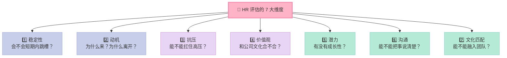
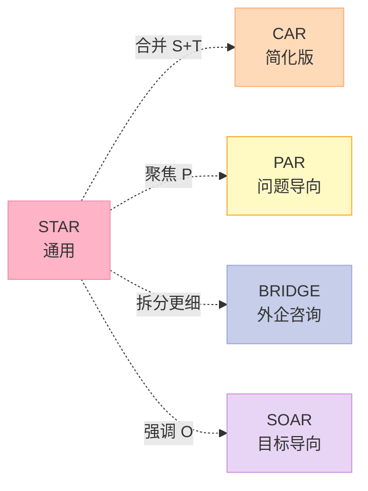
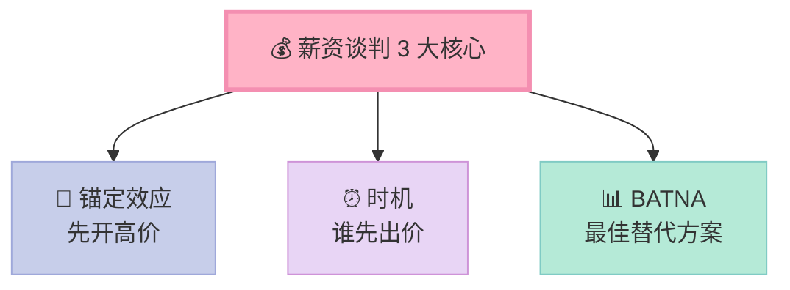
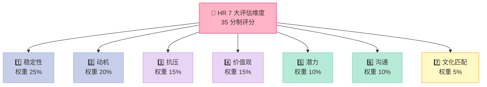
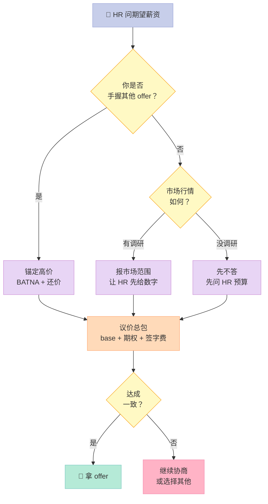
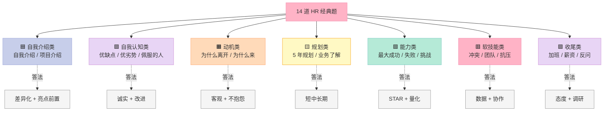

> **全系列唯一一篇专门讲 HR 的文章**。前面 23 篇我们把所有"硬技术"刷了个遍——指针、虚函数、智能指针、TCP、epoll、设计模式……这一篇我们专门拆解**最容易被技术候选人忽略、却最影响 offer 的软技能面试**。**14 道经典行为题 + STAR 法则详解 + 谈薪剧本 + 反向提问 20 问 + 7 大评估维度 + 5 大雷区**，一次性讲透。

---

## 〇、开篇钩子：为什么技术面全对了，HR 面却直接挂？

我做了 7 年技术面试官，每年看 200+ 候选人简历。最让我**痛心疾首**的，不是那些技术面答不上来的人——这些同学知道自己哪里不会，回去还能补。

**真正可惜的是：技术面答得漂亮、算法撕得干净、分布式侃侃而谈，最后挂在 HR 面的那群人**。

上周刚面了一个候选人：

```text
候选人：985 硕士，5 年 C++，某大厂背景。
一面：epoll LT/ET 讲得清清楚楚，单例 DCLP 都能讲出内存序。
二面：分布式 KV 系统从 Raft 到 LSM-Tree 全程无卡顿。
三面（HR）：
  HR 问："你为什么离开上一家公司？"
  候选人："老板是傻逼，产品经理也是傻逼，团队氛围极差，
          996 都没人发加班费，所以我走了。"
  HR 沉默 5 秒："好的，我们会在一周内通知您。"
  —— 然后就没有然后了。
```

**这位同学技术评估是 S 级，最终被 HR 标记为「高风险」**。为什么？

因为 HR 听到的不是"老板傻逼"，HR 听到的是：

- ❌ **推卸责任**：出问题时全是别人的错
- ❌ **情绪化**：无法控制情绪、不专业
- ❌ **缺乏稳定性**：看起来是个"刺头"，3 个月内可能再跳槽
- ❌ **文化不匹配**：我们团队也加班，凭什么你能适应？

**HR 不是在和你聊天，HR 是在评估 7 个核心维度**——本文会把这 7 个维度、14 道高频题、STAR 法则、谈薪剧本、反向提问**一次性拆透**。

读完之后你会发现：**HR 面不是"运气"，而是一套可以刻意练习的"技术"**。

---

## 一、HR 面试的 3 个真相：90% 的候选人理解错了

在讲具体题目之前，先纠正几个**致命误解**。

### 1.1 真相 1：HR 不是在"聊天"，而是在"评估"

很多候选人把 HR 面当作"走过场"，以为只要技术面过了，HR 面就是寒暄几句、聊聊薪资。

**事实**：HR 面的**淘汰率比技术面更高**。

| 面试轮次 | 平均通过率 | 主要淘汰原因 |
|---------|----------|------------|
| 笔试 | 40% | 算法 AC 数不够 |
| 技术一面 | 50% | 基础不扎实 |
| 技术二面 | 60% | 深度不够 |
| 技术三面（Leader） | 70% | 系统设计、综合素质 |
| **HR 面** | **50%~70%** | **价值观、稳定性、动机不匹配** |

**HR 的核心 KPI 不是"招到最好的人"，而是"招到不会出问题的人"**。

> 一句话：**技术面看"你能不能干活"，HR 面看"你会不会给我们添乱"**。

### 1.2 真相 2：HR 问的不是字面问题，而是"背后的真实意图"

HR 的每个问题，都有**至少 1 个隐藏评估维度**：

| 表面问题 | 真正在问 |
|---------|---------|
| "请做自我介绍" | 你能不能在 2 分钟内讲清楚自己的核心价值？|
| "你的优点缺点？" | 你有没有自我认知？会不会过度自信？|
| "为什么离开上家？" | 你是不是爱抱怨？稳定性如何？|
| "5 年职业规划？" | 你会不会 1 年后跳槽？目标感强不强？|
| "期望薪资？" | 你对自己有没有清晰的市场定位？|
| "加班怎么看？" | 你会不会因为加班撕逼？抗压吗？|
| "有什么要问我们的？" | 你对我们是真的感兴趣，还是来练手？|

**最经典的案例**：

> HR 问："你最大的缺点是什么？"
>
> - **小白回答**："我最大的缺点是太追求完美了。"（HR 内心：装）
> - **高手回答**："我以前在跨团队沟通时倾向于直接表达，但发现这样容易让对方感觉不被尊重。**最近半年我刻意练了 1:1 先私下对齐、再公开表达的节奏**，团队冲突明显减少了。"（HR 内心：有自我认知、有反思、有行动，nice）

### 1.3 真相 3：HR 面的"评分维度"是 7 个，不是 1 个

很多候选人以为 HR 面就是"印象分"，事实上 HR 是**结构化打分**的。



**每个维度 1~5 分，总分 35**。低于 21 分基本挂，21~28 分待定，28+ 分稳 offer。

下面我们逐一拆解这 7 个维度。

---

## 二、7 大 HR 评估维度：每一维度的"得分点"与"扣分点"

### 2.1 维度 1：稳定性（Retention）

**HR 真正担心的**：你入职 3 个月又跑路。

**成本计算**：

```text
招聘成本 = HR 时间 + 面试官时间 + 候选人时间
          ≈ 5 万 ~ 10 万 / 人

培养成本 = 导师时间 + 培训 + 业务熟悉期
          ≈ 3 ~ 6 个月产出损失

离职成本 = 业务交接 + 团队士气 + 重新招聘
          ≈ 10 万 ~ 30 万 / 人
```

**打分依据**：

| 加分项（+1~2 分） | 扣分项（-1~2 分） |
|------------------|------------------|
| 上一份工作 ≥ 3 年 | 3 年内换 ≥ 3 份工作 |
| 跳槽原因客观合理 | 跳槽原因"老板傻逼" |
| 职业规划清晰 | 不知道自己想做什么 |
| 期望薪资在合理范围 | 期望薪资远超市场 |
| 家人/伴侣在本地 | 异地、单身漂泊（HR 会担心你随时走）|

### 2.2 维度 2：动机（Motivation）

**HR 真正想知道的**：你为什么来我们公司？

**经典陷阱**：

| 表面动机 | HR 内心解读 |
|---------|-----------|
| "你们薪资高" | 3 个月后有更高的就走 |
| "想躺平" | 我们不是养老院 |
| "想学技术" | 1 年后跳到大厂 |
| "你们业务好" | 你了解我们业务吗？|
| "前公司太差了" | 你习惯抱怨，下次也会说我们差 |

**高分动机**：

```text
"我看到贵公司在 XX 方向的布局，和我过去 3 年积累的 XX 经验高度匹配。
 我希望能在 XX 业务上继续深耕，未来 3~5 年成为这个领域的专家。"
```

### 2.3 维度 3：抗压（Stress Tolerance）

**HR 真正担心的**：遇到 P0 故障、紧急 deadline 你会不会崩溃？

**评估方式**：

| 评估手段 | 评估目的 |
|---------|---------|
| "讲一个压力最大的经历" | 看你在高压下的真实反应 |
| "加班怎么看" | 看你的工作态度 |
| "有没有失败的项目" | 看你的抗挫力 |
| 面试全程的表情、语速 | 看你的情绪稳定性 |

### 2.4 维度 4：价值观（Values）

**大厂典型价值观**：

| 公司 | 价值观 |
|------|-------|
| 阿里巴巴 | 客户第一、员工第二、股东第三 |
| 字节跳动 | 始终创业、务实敢为、开放谦逊、坦诚清晰、始终创业 |
| 腾讯 | 一切以用户价值为依归、进取、接纳、合作伙伴 |
| 华为 | 奋斗者为本、以客户为中心、长期艰苦奋斗 |
| 美团 | 以客户为中心、正直诚信、合作共赢、追求卓越 |

**HR 会在面试中"试探"你是否认同这些价值观**。

### 2.5 维度 5：潜力（Growth Potential）

**HR 真正想知道的**：你 3 年后能不能晋升？5 年后能不能带团队？

**评估依据**：

| 维度 | 高分信号 |
|------|---------|
| 学习能力 | "我今年读了 12 本技术书，做了 3 个技术分享" |
| 反思能力 | "那次失败让我意识到 X，后来我改进了 Y" |
| 主动担当 | "我主动承担了 XX 任务，虽然不是我的职责" |
| 影响力 | "我推动了团队的 code review 流程，影响了 10+ 人" |

### 2.6 维度 6：沟通（Communication）

**HR 真正想知道的**：你能不能把复杂的事情说清楚？

**评估依据**：

| 维度 | 高分信号 | 低分信号 |
|------|---------|---------|
| 结构化 | "我先说结论，再说 3 个理由" | "嗯……就是……那个……" |
| 精准 | "我把 QPS 从 800 提升到 5000" | "我大幅提升了性能" |
| 同理心 | "我理解你的顾虑，让我换个方式说" | "你不懂，别插嘴" |
| 反馈接收 | "您说的有道理，我之前没想到" | "我不同意！" |

### 2.7 维度 7：文化匹配（Culture Fit）

**HR 真正担心的**：你能不能和我们团队愉快合作？

**评估方式**：

| 维度 | 考察问题 |
|------|---------|
| 团队协作 | "团队冲突你怎么处理？" |
| 工作节奏 | "加班、出差怎么看？" |
| 风格匹配 | "你喜欢什么样的 leader？" |
| 兴趣匹配 | "业余时间做什么？" |

**特别注意**：文化匹配 ≠ 你必须和团队一模一样。**HR 找的是"能融入"的人，不是"一模一样"的人**。

### 2.8 7 大维度评分表（面试官视角）

| 维度 | 权重 | 高分信号 | 致命扣分 |
|------|------|---------|---------|
| **稳定性** | 25% | 上份工作 ≥ 3 年，职业规划清晰 | 3 年跳 3 次，"前老板傻逼" |
| **动机** | 20% | 了解公司业务，动机真实 | "听说你们钱多" |
| **抗压** | 15% | 有具体抗压案例 + 方法论 | "我压力很大但我忍着" |
| **价值观** | 15% | 认同公司文化 | 公开贬低公司价值观 |
| **潜力** | 10% | 有可量化的学习成果 | "我学习能力强"（无证据）|
| **沟通** | 10% | 结构化、可量化、有同理心 | 啰嗦 5 分钟没重点 |
| **文化匹配** | 5% | 了解团队风格、能融入 | "我不太合群" |

---

## 三、STAR 法则：行为面试的唯一标准答题结构

### 3.1 为什么 STAR 法则这么重要？

**STAR** 是 **Situation（情境）+ Task（任务）+ Action（行动）+ Result（结果）** 的首字母缩写，是全球 500 强、四大、咨询公司、外企**通用的行为面试答题框架**。

**没有 STAR 法则的 3 个后果**：

1. **流水账**：讲 5 分钟没重点
2. **甩锅队友**："队友太菜所以我没做好"
3. **空话大话**："我提升了系统性能"（无量化）

### 3.2 STAR 四要素详解

| 字母 | 含义 | 占比 | 重点 |
|------|------|------|------|
| **S**ituation | 背景/情境 | 10% | 1-2 句话交代 |
| **T**ask | 你的任务/挑战 | 10% | 你**个人**的职责 |
| **A**ction | 你**具体**做了什么 | 60% | **核心**，动词驱动 |
| **R**esult | 结果 + 反思 | 20% | 量化 + 沉淀 |

### 3.3 STAR 答题模板

```text
【S】当时我在 [公司/学校] 负责 [项目]，背景是 [1-2 句背景]。
【T】我需要解决 [具体问题]，时间要求是 [deadline / 难度]。
【A】我做了以下动作：
  1. [第一步：调研/分析]
  2. [第二步：设计方案/寻求帮助]
  3. [第三步：落地执行]
  4. [第四步：沟通推动]
【R】最终 [量化结果]，我也学到 [反思/方法论沉淀]。
```

### 3.4 完整 STAR 法则示例

**Q：讲一个你解决的最难的技术问题？**

**Sample Answer**：

> **S（Situation）**：在 XX 公司做广告投放系统，QPS 高峰期 5 万，**每天凌晨定时任务把内存中 2GB 的索引 dump 到磁盘**。
>
> **T（Task）**：dump 期间主线程卡 5 秒，导致线上请求 P99 从 50ms 飙升到 5000ms，**收到 3 个 P0 告警**，我是这个系统唯一的负责人。
>
> **A（Action）**：我做了四件事：
> 1. **复现问题**：用 `perf` 抓到 `std::map` 的 dump 是单线程同步写；
> 2. **调研方案**：决定用 **COW（Copy-On-Write）**——fork 子进程写，主进程继续服务；
> 3. **落地实现**：父子进程用 `mmap` + `eventfd` 通知，**写了 800 行 C++ 代码**；
> 4. **上线灰度**：先 1% 流量，监控一周全量。
>
> **R（Result）**：**P99 从 5000ms 回到 60ms**，**告警归零**；我沉淀了《Linux 进程级热升级 SOP》文档，被团队推广到 5 个项目。

### 3.5 STAR 法则的变体：CAR、PAR、BRIDGE

不同公司可能用不同的框架，但**核心思想一致**。

| 框架 | 全称 | 适用场景 |
|------|------|---------|
| **STAR** | Situation-Task-Action-Result | 通用，绝大多数公司 |
| **CAR** | Challenge-Action-Result | 时间紧，简化版 |
| **PAR** | Problem-Action-Result | 更聚焦问题 |
| **BRIDGE** | Background-Role-Issue-Detail-Goal-Evaluation | 外企、咨询公司 |
| **SOAR** | Situation-Objective-Action-Result | 强调目标导向 |



### 3.6 答题的 3 大禁忌

| 禁忌 | 反例 | 改法 |
|------|------|------|
| **流水账** | "我大一……大二……大三……" | 聚焦 1 个高光项目 |
| **甩锅队友** | "队友太菜，所以我……" | 强调"我做了什么" |
| **空话大话** | "我提升了系统性能" | "我把接口 P99 从 800ms 降到 120ms" |

### 3.7 一个反面教材 vs 一个正面教材

**反面教材（80% 候选人是这样答的）**：

> Q: 讲一个你最有挑战性的项目？
>
> "我之前在 XX 公司做了一个推荐系统，当时挺难的。我们组人少，时间紧，老板还天天改需求。我们加班加点搞了 3 个月，最后上线了，效果还可以。"

**问题分析**：

- ❌ S 不清晰（不知道什么公司、什么规模）
- ❌ T 不具体（"挺难的"是什么难？）
- ❌ A 缺失（"加班加点"不是 Action）
- ❌ R 无量化（"效果还可以"是什么效果？）
- ❌ 总长度 30 秒，但**信息密度极低**

**正面教材（同样的事实）**：

> Q: 讲一个你最有挑战性的项目？
>
> "**S**：在 XX 公司（DAU 1000 万）从 0 到 1 搭建推荐系统，团队只有 3 人，时间 3 个月。
>
> **T**：作为后端 owner，我需要解决**千万级用户实时推荐**的工程问题，包括**特征计算、模型推理、召回排序**三大模块，**P99 延迟要求 < 100ms**。
>
> **A**：
> 1. **架构设计**：用 C++ 自研了特征计算引擎（避免 Python GIL 瓶颈），QPS 达到 5 万；
> 2. **性能优化**：通过 `perf` 发现 `std::unordered_map` 的哈希冲突，用 `absl::flat_hash_map` 替换后 **P99 从 250ms 降到 80ms**；
> 3. **工程化**：写了一份 30 页的设计文档，单元测试覆盖率达 85%，CI/CD 全流程；
> 4. **团队协作**：作为 owner，协调 2 个前端 + 1 个测试，每周 1 次站会同步进度。
>
> **R**：项目准时上线，**DAU 从 500 万增长到 800 万，推荐 CTR 从 8% 提升到 13%**。我沉淀了《实时推荐系统 SOP》文档，团队后来有 2 个新项目复用了我设计的架构。"

**对比分析**：

| 维度 | 反面教材 | 正面教材 |
|------|---------|---------|
| 时长 | 30 秒 | 2 分钟 |
| S 清晰度 | 模糊 | 精确到 DAU、团队、时间 |
| T 具体度 | "挺难的" | 三大模块 + 延迟指标 |
| A 颗粒度 | 1 句话 | 4 个具体动作 + 量化 |
| R 量化度 | "还可以" | DAU、CTR、文档复用 |

**结论**：同样 30 秒到 2 分钟，**信息密度可以差 10 倍**。

---

## 四、14 道 HR 经典行为题 + STAR 答案模板

### 4.1 题目 1：请做自我介绍

**评估维度**：沟通、结构化、差异化、亮点前置

**陷阱**：HR 不是要听"我叫 xxx，来自 xx，毕业于 xx"。**HR 要的是 2 分钟内的"差异化记忆点"**。

**答题结构**：

```text
【结构】身份 + 核心优势 + 1 段成就 + 求职动机
【示例】
您好，我叫 XX，XX 大学计算机硕士，有 3 年 C++ 后端开发经验。
我的核心优势是 [技术深度 / 性能优化]，曾主导 XX 系统从 0 到 1
落地，QPS 达到 5 万，延迟 P99 < 100ms。
今天来贵公司面试，是因为看到 [团队/业务/技术栈] 与我的方向高度
匹配，希望能加入一起做 [具体方向]。
【时长】严格控制在 1-2 分钟
```

**完整答案模板（可直接背诵）**：

```yaml
# 自我介绍 4 段式模板
self_introduction:
  part_1_身份:
    模板: "您好，我叫 {姓名}，{学校}{学历}，{年限}{岗位}经验"
    时长: 10秒
    注意事项: "不报户口，只说关键身份"
    
  part_2_核心优势:
    模板: "我的核心优势是 {优势关键词 1} 和 {优势关键词 2}"
    时长: 15秒
    示例:
      - "高性能 C++ 开发"
      - "分布式系统设计"
      - "性能优化与稳定性建设"
    
  part_3_代表性成就:
    模板: "我曾主导 {项目名} 从 0 到 1 落地，实现了 {量化结果}"
    时长: 30秒
    必须包含: "项目名 + 量化结果"
    反例:
      - "做了很多项目，都很成功"
      - "提升了很多性能"
    
  part_4_求职动机:
    模板: "我关注贵公司 {业务/团队/技术栈} 已久，今天来是想加入一起 {具体方向}"
    时长: 15秒
    注意事项: "必须提前调研，不能只说'贵公司是行业头部'"
```

**高分 vs 低分对比**：

| 低分回答 | 高分回答 |
|---------|---------|
| "我叫张三，来自 XX 大学，毕业于 XX 专业，性格开朗，爱好广泛……" | "您好，我叫 XX，有 3 年 C++ 后端经验，核心方向是高并发与性能优化。我主导过日均百亿请求的广告系统从 0 到 1 落地，**单 QPS 5 万，P99 < 80ms**。我看到贵公司在推荐系统方向的布局与我的经验高度匹配，希望加入一起做工程化落地。" |

**3 个加分技巧**：

1. **结尾呼应开头**：开头说优势，结尾说"我希望能在这个方向继续深耕"
2. **数字埋点**：自我介绍里至少 3 个具体数字（年限、QPS、P99、用户量）
3. **求职动机必须真实**：提前看公司官网、JD、近期新闻

### 4.2 题目 2：项目介绍 STAR 法则

**评估维度**：技术深度、表达力、ownership

**答题结构**（STAR + CAR 混合）：

```text
【S】项目背景：{业务/用户/规模}
【T】我的角色：{具体职责}
【A】我的贡献：{3-5 个关键动作}
【R】量化结果：{数据 + 影响}
```

**完整答案模板**：

```yaml
# 项目介绍 5 段式模板
project_intro:
  part_1_背景_S:
    模板: "项目是 {业务名}，服务 {用户量}，{主要痛点}"
    必填字段:
      - 业务名: "如'推荐系统'"
      - 用户量: "如'DAU 1000 万'"
      - 主要痛点: "如'响应慢、推荐不准'"
    
  part_2_角色_T:
    模板: "我担任 {角色}，负责 {职责}"
    示例:
      - "后端 owner / 技术负责人 / 核心开发"
      - "负责整体架构设计与核心模块开发"
    
  part_3_动作_A:
    必须包含: 3-5 个具体动作
    模板:
      - "调研 + 选型"
      - "架构设计 + 落地"
      - "性能优化 + 监控"
      - "团队协作 + 推动"
    注意事项: "动词驱动，体现 ownership"
    
  part_4_结果_R:
    必须量化:
      - 性能: "QPS / P99 / P95"
      - 规模: "DAU / 订单量 / 数据量"
      - 业务: "CTR / 转化率 / 留存率"
      - 团队: "复用项目数 / 推广范围"
    
  part_5_反思:
    模板: "项目复盘来看，{做得好} + {做不好} + {方法论沉淀}"
    反例:
      - "项目很成功" # 太虚
    正例:
      - "架构选型对了，省了 50% 维护成本"
      - "前期需求调研不够，导致返工 1 次"
```

**完整示例**：

> **S**：项目是 XX 公司的**实时推荐系统**，DAU 1000 万，**推荐 CTR 长期低于行业平均（8% vs 12%）**。
>
> **T**：我作为后端 owner，需要在 **3 个月内**把 CTR 提升 30%，同时**保证 P99 延迟 < 100ms**。
>
> **A**：
> 1. **问题定位**：用 AB 测试发现召回质量差（覆盖率 60%），是核心瓶颈；
> 2. **架构升级**：从**单路召回升级到多路召回**（协同过滤 + 向量召回 + 热品兜底），用 C++ 自研了向量检索模块；
> 3. **性能优化**：用 `perf` 定位到 `std::unordered_map` 的热点，用 `absl::flat_hash_map` + SIMD 优化，**QPS 从 2 万提升到 5 万**；
> 4. **工程化**：写了 30 页设计文档，单元测试覆盖率 85%，**CI/CD 全流程自动化**；
> 5. **团队协作**：协调 2 个前端 + 1 个测试 + 1 个算法，每周 1 次站会。
>
> **R**：项目准时上线，**CTR 从 8% 提升到 13%（+62%）**，**DAU 从 500 万增长到 800 万**，**P99 从 250ms 降到 80ms**。架构设计被团队推广到 2 个新项目。
>
> **反思**：项目前期对召回策略的调研不够深入，走了 2 周弯路。**后来我建立了"项目启动前 1 周强制 AB 测试基线"的流程**，被团队采纳。

### 4.3 题目 3：你的优点 / 缺点

**评估维度**：自我认知、诚实度、改进意识

**核心原则**：**说缺点时同时带出正在改进**。

**优点参考（选 3 个，不要超过 3 个）**：

```yaml
# 优点 6 选 3
advantages:
  - 自信乐观:
      场景: "面对不确定任务敢接、敢试错"
      案例: "主动承担 XX 没人做过的工作"
  
  - 责任心强:
      场景: "答应的事情一定 deadline 前交付"
      案例: "连续 3 个季度 OKR 全部提前完成"
  
  - 有条理:
      场景: "工位整洁，code 命名规范，文档有目录"
      案例: "主导梳理了团队的代码规范文档"
  
  - 善于交际:
      场景: "人缘好，跨团队沟通顺畅"
      案例: "协调过 5 个部门的合作项目"
  
  - 学习能力强:
      场景: "快速上手新技术"
      案例: "2 周内自学 Rust 并完成原型"
  
  - 技术深度:
      场景: "在 XX 方向有深入研究"
      案例: "在团队做过 3 次技术分享"
```

**缺点参考（必须带改进）**：

```yaml
# 缺点 5 选 1，"致命伤"绝对不能说
disadvantages:
  - 对不对的事容易提意见:
      改进行动: "现在先私下 1:1 沟通，再公开表达"
  
  - 办事急准确性有时不够:
      改进行动: "用 checklist + code review 自检"
  
  - 公众场合讲话紧张:
      改进行动: "主动做 3 次技术分享，目前已经适应"
  
  - 过于追求完美:
      改进行动: "用'80/20'原则设定完成标准，避免过度优化"
  
  - 不擅长拒绝:
      改进行动: "用'重要/紧急矩阵'判断优先级，学会说不"
```

**绝对不能说的缺点**：

| 致命缺点 | HR 解读 |
|---------|---------|
| "我最大的缺点是太追求完美了" | 装，自欺欺人 |
| "我太努力工作了" | 装 + 不真实 |
| "我脾气不好" | 团队风险 |
| "我抗压能力差" | 直接挂 |
| "我对钱看得很重" | 短期主义 |

### 4.4 题目 4：为什么离开上一家公司？

**评估维度**：稳定性、动机、情商

**核心原则**：**客观因素 + 积极表达 + 不要贬低**。

**4 类安全回答模板**：

```yaml
# 跳槽原因 4 大安全模板
reasons_for_leaving:
  - 业务调整:
      模板: "公司业务方向调整，原部门被裁撤/合并，我在看新机会"
      适用: "真实情况是组织架构调整"
      
  - 成长瓶颈:
      模板: "团队稳定后个人成长进入平台期，希望挑战更大业务"
      适用: "实际是想换赛道"
      注意: "必须配合'不抱怨前公司'"
      
  - 业务转型:
      模板: "原公司是 to B，我想转向 to C 的高并发场景"
      适用: "业务方向真实变化"
      注意: "必须明确新方向"
      
  - 个人发展:
      模板: "家庭原因/城市变化/深造计划，需要换城市"
      适用: "异地搬迁"
      注意: "必须能自圆其说"
```

**绝对不能说的原因**：

| 雷区回答 | HR 解读 |
|---------|---------|
| "老板是傻逼" | 习惯甩锅、情绪化 |
| "996 太累了" | 抗压差、不能吃苦 |
| "钱太少了" | 唯利是图、不稳定 |
| "同事都是混子" | 团队协作差 |
| "政治斗争严重" | 适应能力差 |

**完整答案模板**：

> 我在 XX 公司工作了 3 年，**前 2 年成长很快**，从 P5 升到 P6，**独立 owner 了 XX 系统**。
>
> 去年公司业务做了战略调整，**我所在的部门被合并**，新的方向和我的技术栈不太匹配。**这不是对错的问题，只是个人选择**。
>
> 我希望继续在 C++ 高性能方向深耕，**看到贵公司在 XX 业务的布局，正好和我的方向契合**，所以来面试。

### 4.5 题目 5：你的 5 年职业规划

**评估维度**：稳定性、目标感、潜力

**答题结构**（短/中/长期）：

```yaml
# 5 年职业规划模板
career_plan:
  短期_1年:
    目标: "熟悉业务，做 XX 项目，达到 XX 水平"
    关键词: "融入、学习、贡献"
    模板: "1 年内：熟悉业务，主导 1-2 个模块从 0 到 1 落地"
    
  中期_3年:
    目标: "成为 XX 方向的骨干，能独立 owner 模块"
    关键词: "深耕、影响力"
    模板: "3 年内：成为团队的 C++ 性能优化骨干，能独立 owner 核心系统"
    
  长期_5年:
    目标: "成为 XX 领域专家，能带 3-5 人小组"
    关键词: "专家、leader"
    模板: "5 年内：成为分布式系统方向的技术专家，能带新人、推动架构演进"
```

**完整答案示例**：

> 我是计算机科班，方向是**高性能 C++ 后端**。
>
> 贵公司在 [分布式存储 / 推荐系统] 是行业头部，岗位要求"**高并发、低延迟**"，与我过去 3 年的 [广告投放 / 行情系统] 经验高度匹配。
>
> - **短期（1 年）**：熟悉业务，主导 1-2 个模块从 0 到 1 落地。
> - **中期（3 年）**：成为团队的 C++ 性能优化骨干，能独立 owner 核心系统。
> - **长期（5 年）**：成为分布式系统方向的技术专家，能带新人、推动架构演进。

**3 个加分点**：

1. **提到公司具体业务**：让 HR 知道你是真了解
2. **3 个阶段有时间梯度**：避免"一直在学习"
3. **匹配岗位需求**：直接呼应 JD

### 4.6 题目 6：你对我们公司了解多少？

**评估维度**：求职诚意、调研能力

**回答结构（4 段式）**：

```text
【业务】贵公司主要做 [业务方向]，行业地位是 [头部/独角兽/上升期]
【技术】我看了一下技术博客，贵公司在 [技术栈] 方向有积累
【文化】贵公司的价值观 [具体 1-2 个] 我很认同
【匹配】这个岗位的 [职责] 与我的 [经验] 高度匹配
```

**调研清单（面试前 1 天必看）**：

| 维度 | 调研内容 | 来源 |
|------|---------|------|
| 业务 | 公司核心产品、最近 1 年战略 | 官网、36氪、IT桔子 |
| 技术 | 技术博客、GitHub、开源项目 | 公司技术博客、掘金 |
| 文化 | 价值观、员工评价 | 知乎、看准网、脉脉 |
| 团队 | 团队 leader、组员背景 | LinkedIn、GitHub |
| 财报 | 上市/融资/营收 | 36氪、雪球 |

**反面教材**：

> "嗯……你们是做什么的？好像是做 XX 的吧？"

**正面教材**：

> "贵公司是国内做分布式数据库的头部公司，**2024 年刚完成 D 轮融资**，我看了一下团队博客，**TiDB 在 HTAP 方向的技术积累很深**。我个人对 C++ 高性能存储引擎非常感兴趣，**看到你们在招 Storage Engineer，方向很匹配**。"

### 4.7 题目 7：期望薪资

**评估维度**：自我定位、市场认知、谈判能力

**谈薪 3 大原则**：

```yaml
# 谈薪 3 大原则
salary_negotiation:
  原则1_锚定效应:
    说明: "先开高价，留出还价空间"
    反例: "贵公司开多少？" # 主动放弃锚定权
    
  原则2_不先出价:
    说明: "让 HR 先给数字，再还价"
    技巧: "我比较 open，主要看 package 和长期发展，您这边有什么预算？"
    
  原则3_整体考虑:
    说明: "不要只看月薪，要看总包"
    包含: "月薪 + 奖金 + 期权 + 股票 + 福利"
```

**完整话术模板**：

```yaml
# 期望薪资 4 段式
expected_salary:
  step1_不先出价:
    模板: "我比较 open，主要看 package 和长期发展机会"
    反例: "我希望 50k"
    原因: "不知道对方预算，先出价容易吃亏"
    
  step2_市场调研:
    模板: "根据我的 {年限}、{能力} 和市场行情，我的预期是 {范围}"
    示例:
      - "3 年 C++ 后端经验，能独立 owner 模块"
      - "市场调研：B 端公司 30-40k，独角兽 35-45k，大厂 P6 30-40k"
    
  step3_表达诚意:
    模板: "但我更看重 {业务/团队/成长}，薪资可以协商"
    注意: "让 HR 觉得你务实，不唯利是图"
    
  step4_总包概念:
    模板: "我的预期是 {月薪}，考虑到 {期权/股票/补贴}，总包大概 {总额}"
    包含项: ["月薪", "13薪", "年终奖", "期权/RSU", "签字费", "房补"]
```

**薪资结构速查表**：

| 项 | 说明 | 占比 |
|---|------|------|
| 基本月薪 | 12 个月 | 60~70% |
| 年终奖 | 通常 2~6 个月 | 10~20% |
| 期权/RSU | 一次性授予，分 4 年 vesting | 10~30% |
| 签字费 | 部分外企/独角兽有 | 5~10% |
| 房补/餐补 | 大厂标配 | 2~5% |
| 五险一金 | 法定 | 5~10% |

**绝对不能说的话**：

| 雷区 | HR 解读 |
|------|---------|
| "越少越好" | 不自信、容易被画饼 |
| "100 万包年" | 不切实际 |
| "我朋友都 XX 万" | 比较心理 |
| "比 XX 公司多 10% 就行" | 暴露了别的 offer |

### 4.8 题目 8：加班怎么看？

**评估维度**：工作态度、抗压、长期主义

**经典标准答案（PDF 原文）**：

> **如果是工作需要，我会义不容辞加班**——我现在单身，没有家庭负担，可以全身心投入工作。
> **但同时**，我也会**提高工作效率，减少不必要的加班**。
> - 如果经常出现长期加班，我会主动复盘：是人手不够、流程问题，还是我自己的方法有问题？
> - 我倾向于**靠方法论减少加班**，而不是靠透支身体。

**反例**：

- ❌ "我特别能加班，我可以 996。"（HR 内心：你能坚持多久？）
- ❌ "我不接受加班。"（HR 内心：我们也加班，你适应吗？）
- ❌ "加班要给加班费。"（HR 内心：你只看钱）

**高分回答 3 个要点**：

1. **接受合理加班**：表达态度
2. **强调效率**：用方法论减少加班
3. **长期主义**：追求成长，不是短期舒适

### 4.9 题目 9：团队合作 / 冲突解决

**评估维度**：情商、协作、数据驱动

**陷阱**：这是**测情商**的标准题，答"坚持己见"是 0 分。

**完整 STAR 答案**：

> **S**：在 XX 项目中，我和一位资深同事对"数据存储选型"有分歧。
>
> **T**：他坚持 MySQL，我倾向 TiDB，会议僵持 1 小时。
>
> **A**：我没有在会上硬刚，而是：
> 1. **会后 1:1 沟通**——先听他完整的理由，了解到他担心运维成本；
> 2. **用数据说话**——我做了 POC（Proof of Concept），用真实业务数据测试两种方案；
> 3. **共同决策**——再次开会时，把 POC 结果摆出来，**最后我们一致选了 MySQL + 分库分表**（更稳妥的折中）。
>
> **R**：方案如期上线，系统稳定运行 1 年。这次经历让我明白：**真正的影响力，不在于谁声音大，而在于谁能给出更靠谱的证据**。

**3 个核心原则**：

| 原则 | 含义 |
|------|------|
| **私下沟通优先** | 不要当众让对方下不来台 |
| **数据说话** | POC、benchmark、A/B 测试 |
| **共同决策** | 不是你赢我输，是找到最优解 |

### 4.10 题目 10：最大失败 / 最大成功

**评估维度**：反思能力、抗挫力、自我认知

**最大失败**（比最大成功更重要）：

**Sample Answer**：

> **S**：高考是我人生第一次大考，**我太看重结果了**。
>
> **T**：考场上紧张到无法集中注意力，原本会的题也做不对。
>
> **A**：事后复盘，我意识到两个问题：
> 1. **把得失看得太重**——心态失衡影响发挥；
> 2. **过度自信**——对自己做过的题不再检查，结果走出考场才发现低级错误。
>
> **R**：从那以后我养成了两个习惯：
> - **大考前刻意降预期**，告诉自己"考好是赚的，考差也不影响长远"；
> - **做过的题更要复查**——会的题错了代价更高。
>
> 之后无论是考研、还是工作里大型 release，我都能保持稳定发挥。

**答题要点**：

| 维度 | 关键 |
|------|------|
| 挫折要真实 | 不要编造"项目失败"这种 HR 一听就假的桥段 |
| 反思要具体 | 不说"我学会了坚持"，说"我养成了 X 个习惯" |
| 后续有改进 | **必须有"之后如何"** |
| 故事要能结束 | 别没完没了讲 5 分钟 |

**最大成功**（次重要）：

```yaml
# 最大成功模板
biggest_success:
  part1_挑战: "选一个真正有挑战的项目，不要讲'我组织了一次团建'"
  part2_难度: "量化挑战：DAU 1000 万、3 个月 deadline"
  part3_动作: "3-5 个具体动作"
  part4_结果: "量化结果 + 团队影响"
  part5_反思: "做对了什么，做错了什么，方法论"
```

### 4.11 题目 11：最有挑战性的任务

**评估维度**：技术深度、抗压、ownership

**与"最大成功"的区别**：

| 维度 | 最大成功 | 最大挑战 |
|------|---------|---------|
| 重点 | 量化结果 | 过程难度 |
| 时长 | 1 分钟 | 2-3 分钟 |
| 关键 | 数据 | 决策过程 |

**完整 STAR 答案**：

> **S**：XX 公司的 XX 系统，**老系统日均 1 亿请求，P99 1200ms**，老板要求 **3 个月内降到 200ms 以内**，团队 3 人。
>
> **T**：作为后端 owner，我负责整体性能优化。
>
> **A**：
> 1. **性能 profile**：用 `perf` + `flamegraph` 定位到 3 个热点：JSON 序列化（40%）、数据库连接池（30%）、锁竞争（20%）；
> 2. **JSON 优化**：从 `nlohmann/json` 切换到 `simdjson`，**序列化耗时降 60%**；
> 3. **连接池优化**：从单连接池升级到分库分表 + 连接池隔离，**DB 等待时间降 80%**；
> 4. **锁优化**：将全局锁改为 thread-local + 定期合并，**QPS 提升 3 倍**；
> 5. **灰度上线**：先 1% 流量，监控一周，逐步放量。
>
> **R**：**P99 从 1200ms 降到 180ms（-85%）**，**QPS 从 5000 提升到 15000**。**老板在周会上点名表扬**，方法论被推广到团队其他 3 个项目。

### 4.12 题目 12：业余时间做什么？

**评估维度**：学习力、性格、生活平衡

**高分回答模板**：

```yaml
# 业余活动 4 类
hobbies:
  - 技术类: "看开源项目、写个人项目"
    评估信号: "技术热情"
    案例: "GitHub 600+ stars 的项目"
    
  - 学习类: "读书、技术分享"
    评估信号: "学习力"
    案例: "今年读了 12 本技术书，3 次技术分享"
    
  - 运动类: "跑步、健身、打球"
    评估信号: "抗压、健康"
    案例: "坚持健身 2 年，每周 3 次"
    
  - 社交类: "志愿者、技术社区"
    评估信号: "团队协作、影响力"
    案例: "GDG 组织者、CSDN 博客专家"
```

**完整答案**：

> 我业余时间主要做 3 件事：
>
> 1. **技术学习**：我有个习惯，**每周读 1 篇顶会论文或开源项目源码**，去年读了 12 本技术书，**在公司做过 3 次内部分享**。
> 2. **运动**：**坚持跑步 2 年**，每周 3 次，每次 5 公里。运动让我在高强度工作下保持精力。
> 3. **开源贡献**：我在 GitHub 维护了一个 [项目名]，目前 **600+ stars**，也被 XX 公司内部使用。
>
> 我觉得**工作和生活不是对立的**，健康的爱好反而能让我工作更高效。

**雷区回答**：

| 雷区 | HR 解读 |
|------|---------|
| "打游戏/刷剧" | 缺乏自我提升 |
| "没有什么爱好" | 生活无趣，可能社交能力差 |
| "一直在加班" | 生活失衡，可能抗压差 |
| "炒股票" | 风险偏好，可能不稳定 |

### 4.13 题目 13：你的优劣势

**评估维度**：自我认知、诚实度

**与题目 3（优缺点）的区别**：

| 维度 | 优缺点 | 优劣势 |
|------|-------|--------|
| 范围 | 性格层面 | 性格 + 能力层面 |
| 时长 | 1-2 分钟 | 2-3 分钟 |
| 重点 | 性格 | **能力对比** + 性格 |

**完整答案模板**：

> **优势**：
> 1. **C++ 技术深度**：3 年高性能后端经验，能独立 owner 模块，**最大 QPS 5 万、P99 80ms**；
> 2. **性能优化能力**：主导过 3 个性能优化项目，平均 **P99 降低 60%**；
> 3. **学习力**：2 周内自学 Rust 完成原型，**GitHub 600+ stars 项目**。
>
> **劣势**：
> 1. **管理经验不足**：之前没带过团队，**但我已经在主动培养**——去年组织 3 次内部分享，负责 mentor 1 名实习生；
> 2. **业务理解深度**还在积累，**但已经在补**——每周和 PM 1:1 聊业务、读行业报告。

### 4.14 题目 14：还有什么问题要问我们？

**评估维度**：求职诚意、调研能力、潜力

**这是 HR 面的"送分题"，80% 候选人白白送分**。

**3 大原则**：

| 原则 | 反例 | 正例 |
|------|------|------|
| **不要问薪资** | "这个岗位多少钱？" | 等 HR 主动说，或 offer 阶段谈 |
| **不要问太虚** | "公司未来 5 年战略？" | "这个岗位半年内的具体目标？" |
| **要问显得有深度** | "加班多吗？" | "团队的 code review 流程是怎样的？" |

**完整问题清单（按公司类型分类见 §7）**

---

## 五、5 大雷区回答（必避）

### 5.1 雷区 1：抱怨前公司

| 雷区回答 | HR 内心 |
|---------|---------|
| "前老板是傻逼" | 习惯甩锅 |
| "前公司加班严重" | 抗压差 |
| "前同事都不行" | 团队协作差 |
| "产品经理瞎指挥" | 跨团队协作差 |
| "公司政治斗争" | 适应能力差 |

**正确改法**：

> "公司业务方向调整，**我个人希望继续在 XX 方向深耕**，所以看新机会。"

### 5.2 雷区 2：说"我不会"或"我没做过"

| 雷区回答 | HR 解读 |
|---------|---------|
| "我没做过 XX" | 学习力差 |
| "我不擅长 XX" | 自我设限 |
| "这个我没学过" | 知识面窄 |

**正确改法**：

> "XX 我目前了解不多，**但我有 XX 方面的基础，相信能在 1 周内上手**。"

### 5.3 雷区 3：过度自信或自吹自擂

| 雷区回答 | HR 解读 |
|---------|---------|
| "我比你们 leader 还强" | 不尊重 |
| "这个项目主要是我做的" | 不诚实 |
| "我全公司最厉害" | 不谦虚 |
| "985 看不起 211" | 偏见 |

**正确改法**：

> "这个项目我作为后端 owner 主导，**团队 3 人配合完成**。"

### 5.4 雷区 4：薪资期望不切实际

| 雷区回答 | HR 解读 |
|---------|---------|
| "100 万包年" | 不切实际 |
| "我朋友都 80 万" | 攀比 |
| "比 XX 公司多 50%" | 谈判技巧差 |
| "不给 XX 万不来" | 威胁 |

**正确改法**：

> "根据市场行情和我的能力，我的预期是 [范围]，**整体 package 可以聊**。"

### 5.5 雷区 5：空洞无物

| 雷区回答 | HR 解读 |
|---------|---------|
| "我学习能力强" | 无证据 |
| "我抗压能力强" | 无案例 |
| "我沟通能力好" | 无具体 |
| "我责任心强" | 无场景 |

**正确改法**：

> "我抗压能力强——**上季度 3 个 P0 并行，我用 OKR + 时间盒管理，最后全部准时上线**。"

---

## 六、谈薪策略：锚定、时机、剧本

### 6.1 谈薪的 3 个核心概念



### 6.2 锚定效应（Anchoring Effect）

**核心原理**：人在决策时，会过度依赖第一个数字（锚点）。

**应用**：

| 场景 | 错误做法 | 正确做法 |
|------|---------|---------|
| HR 问期望薪资 | "贵公司开多少？" | "根据市场行情，我的预期是 40~50k" |
| HR 给数字 | 直接接受 | "这个 base 不错，能谈谈总包吗？" |
| 谈签字费 | 不敢要 | "考虑到搬家成本，希望能有一些签字费" |

### 6.3 时机选择：谁先出价？

**原则**：

| 情况 | 策略 | 原因 |
|------|------|------|
| HR 先出价 | 还价空间大 | 你知道对方预算 |
| 你先出价 | 锚定高一点 | 给还价空间 |
| 互相试探 | 不要先出底牌 | 等对方给数字 |

**话术模板**：

```yaml
# 出价策略
pricing_strategy:
  情况1_HR问期望:
    话术: "我比较 open，主要看 package 和长期发展机会，您这边有什么预算？"
    
  情况2_HR先出价:
    话术: "这个 base 我能接受，但考虑到 [市场行情 / 我的经验 / 其他 offer]，希望能再聊聊总包"
    
  情况3_你先出价:
    话术: "根据市场行情和我的经验，我的预期是 [高范围]。如果 [公司/团队/业务] 特别好，我愿意灵活考虑。"
```

### 6.4 薪资谈判剧本 3 套

**剧本 A：保守型（适合校招 / 转行）**

```yaml
scenario_A_conservative:
  适用: "校招新人、转行候选人"
  目标: "拿到 offer 即可"
  策略: "接受 HR 报价，不砍价"
  
  对话示例:
    HR: "我们能给到 25k * 13"
    你: "谢谢，这个我能接受。我对团队和业务都很期待，希望能尽快入职。"
```

**剧本 B：标准型（适合 3~5 年经验）**

```yaml
scenario_B_standard:
  适用: "3~5 年经验，市场中位"
  目标: "争取 10~20% 上浮"
  策略: "锚定 + 还价 + 总包"
  
  对话示例:
    HR: "我们能给到 35k * 14"
    你: "感谢 offer。但根据 [BOSS直聘 / 猎聘] 的市场行情，3~5 年 C++ 后端在 [城市] 大概 40~50k。
         我个人比较看重 [业务/团队/成长]，薪资不是唯一因素，但希望能再聊聊。
         如果 total package 能到 [目标]，我会非常积极地入职。"
```

**剧本 C：激进型（适合资深 / 多 offer）**

```yaml
scenario_C_aggressive:
  适用: "5 年以上、稀缺人才、手握多个 offer"
  目标: "最大化总包"
  策略: "锚定高价 + BATNA + 签字费"
  
  对话示例:
    HR: "我们能给到 50k * 16"
    你: "感谢。我手上还有 [其他公司] 的 offer，total package 大概 80 万。
         贵公司业务方向我非常认可，但薪资上有差距。
         我希望能就以下几方面再聊聊：
         1. base 能否到 [更高数字]
         2. 期权/股票能否增加 [X] 股
         3. 是否有签字费 / 搬家补贴
         4. 晋升节奏能否加快
         
         如果整体能接近 [目标数字]，我会优先选择贵公司。"
```

### 6.5 谈薪 5 大禁忌

| 禁忌 | 后果 |
|------|------|
| 威胁 HR | 直接挂 |
| 撒谎（说自己有更高 offer） | 一查就露馅 |
| 不调研市场 | 要价不合理 |
| 只谈月薪 | 损失总包 |
| 太早谈薪资 | 还没展示价值 |

---

## 七、反向提问 20 问（按公司类型分类）

### 7.1 反向提问的 4 个原则

| 原则 | 含义 |
|------|------|
| **不要问薪资** | offer 阶段谈 |
| **不要问休假** | 第一印象减分 |
| **要问显得有深度** | 体现调研能力 |
| **要问对方愿意答的** | 别让 HR 尴尬 |

### 7.2 大厂（阿里、字节、腾讯、华为）

| 问题 | 评估信号 |
|------|---------|
| "这个岗位 6 个月内最关键的 3 件事是什么？" | 主动、想做事 |
| "团队的 code review 流程是怎样的？" | 工程文化 |
| "您个人在团队中最自豪的事是什么？" | 让面试官"表演" |
| "技术晋升的标准是什么？P6 到 P7 差在哪里？" | 长期承诺 |
| "团队目前最大的技术挑战是什么？" | 求知欲 |

### 7.3 独角兽 / 创业公司

| 问题 | 评估信号 |
|------|---------|
| "公司未来 1~2 年的战略重点是什么？" | 长期主义 |
| "团队的稳定性如何？核心成员待了多久？" | 关心稳定性 |
| "早期加入能拿到多少期权？vesting 是怎样的？" | 关心长期回报 |
| "如果业务方向调整，团队会怎么应对？" | 风险意识 |
| "融资节奏是？现金流健康吗？" | 关心生存 |

### 7.4 外企（Google、Microsoft、Amazon）

| 问题 | 评估信号 |
|------|---------|
| "团队的工作节奏是怎样的？" | 关心 WLB |
| "Performance review 的标准是什么？" | 关心晋升 |
| "公司的 diversity & inclusion 政策如何？" | 价值观 |
| "远程办公的政策？" | 工作方式 |
| "L4 到 L5 的标准是什么？" | 成长路径 |

### 7.5 校招 / 应届生

| 问题 | 评估信号 |
|------|---------|
| "新人的 mentor 制度是怎样的？" | 关心成长 |
| "培训体系是怎样的？" | 学习 |
| "转正的标准是什么？" | 关心结果 |
| "往届校招生现在发展得如何？" | 关心前途 |
| "应届生做核心业务还是边缘业务？" | 关心锻炼 |

### 7.6 反向提问的 3 个加分技巧

1. **让面试官也"表演"**：问"您个人最自豪的事"，让面试官愿意分享
2. **展示你已经做了功课**：问具体细节，证明你认真调研过
3. **结尾留下好印象**：最后说"今天聊得非常深入，我很期待加入团队"

### 7.7 绝对不能问的 10 个问题

| 问题 | 为什么不能问 |
|------|------------|
| "工资多少？" | 太早，offer 阶段谈 |
| "加班多吗？" | 显得怕吃苦 |
| "年假有几天？" | 显得只关心福利 |
| "公司什么时候上市？" | 太功利 |
| "有没有健身房？" | 关注点不对 |
| "我能请假吗？" | 还没入职就请假 |
| "试用期多久？会被裁吗？" | 不自信 |
| "你们 leader 怎么样？" | 背后打听 |
| "我多久能晋升？" | 太急 |
| "为什么这个岗位在招人？" | 暗示前面的人不行 |

---

## 八、简历深挖：项目细节追问 10 问

### 8.1 为什么 HR 也会追问项目？

HR 不是技术专家，但 **HR 会就"项目背景、个人角色、协作情况"提问**。

### 8.2 简历深挖 10 问 + 应对

| HR 追问 | 真实意图 | 应对模板 |
|--------|---------|---------|
| "这个项目当时为什么做？" | 业务理解 | "因为 XX 痛点，目标用户 XX" |
| "你在项目里是什么角色？" | ownership | "后端 owner，负责 XX 模块" |
| "团队几个人？怎么分工？" | 协作 | "3 人，我 + 2 个前端 + 1 测试" |
| "项目上线后效果如何？" | 量化 | "DAU 500 万 → 800 万，CTR +62%" |
| "遇到的最大困难是什么？" | 抗压 | "性能瓶颈，我用 perf 定位到 XX" |
| "你怎么解决的？" | 解题 | "调研 3 个方案，最后选 XX" |
| "如果让你重做，你会改什么？" | 反思 | "前期调研不够，加了 2 周" |
| "你和 leader 怎么协作？" | 沟通 | "周 1 1:1 + 每日 standup" |
| "项目里最让你自豪的点？" | 自我认知 | "技术 + 团队 + 业务三维" |
| "项目失败过吗？怎么复盘？" | 抗挫 | "有，XX 项目延期 1 周，原因是 XX" |

### 8.3 简历深挖的高分原则

1. **每个项目准备 3 个版本**：1 分钟、3 分钟、5 分钟
2. **数字埋点**：所有结果必须量化
3. **STAR 法则**：所有问题都用 STAR 答
4. **主动暴露小失败**：反而显得诚实
5. **强调"我做了什么"**：不是"我们做了什么"

---

## 九、大厂 vs 创业公司 HR 关注点差异

### 9.1 关注点差异表

| 维度 | 大厂 | 创业公司 |
|------|------|---------|
| **稳定性** | ⭐⭐⭐⭐⭐ 极看重 | ⭐⭐⭐ 一般 |
| **动机** | ⭐⭐⭐⭐ 重要 | ⭐⭐⭐⭐⭐ 极看重 |
| **抗压** | ⭐⭐⭐ 重要 | ⭐⭐⭐⭐⭐ 极看重 |
| **价值观** | ⭐⭐⭐⭐⭐ 必考察 | ⭐⭐⭐ 一般 |
| **潜力** | ⭐⭐⭐⭐ 重要 | ⭐⭐⭐⭐⭐ 极看重 |
| **沟通** | ⭐⭐⭐⭐ 重要 | ⭐⭐⭐⭐ 重要 |
| **文化匹配** | ⭐⭐⭐⭐⭐ 必考察 | ⭐⭐⭐⭐ 重要 |
| **风险偏好** | ⭐⭐ 一般 | ⭐⭐⭐⭐⭐ 极看重 |
| **创业精神** | ⭐ 一般 | ⭐⭐⭐⭐⭐ 极看重 |
| **股权理解** | ⭐⭐ 一般 | ⭐⭐⭐⭐⭐ 极看重 |

### 9.2 大厂 HR 偏爱的话术

```text
"我认同贵公司'客户第一'的价值观"
"我追求长期稳定发展，希望在 XX 领域深耕"
"我希望能在大平台上做有体系化的事情"
```

### 9.3 创业公司 HR 偏爱的话术

```text
"我看好这个赛道的长期发展"
"我对从 0 到 1 搭建系统非常感兴趣"
"我有创业精神，愿意和公司一起成长"
"我对期权/股权有清晰认知"
```

---

## 十、校招 vs 社招 HR 关注点差异

### 10.1 关注点差异表

| 维度 | 校招 | 社招 |
|------|------|------|
| **潜力** | ⭐⭐⭐⭐⭐ 极看重 | ⭐⭐⭐ 一般 |
| **学习力** | ⭐⭐⭐⭐⭐ 极看重 | ⭐⭐⭐ 一般 |
| **可塑性** | ⭐⭐⭐⭐⭐ 极看重 | ⭐⭐ 一般 |
| **稳定性** | ⭐⭐⭐ 一般 | ⭐⭐⭐⭐⭐ 极看重 |
| **抗压** | ⭐⭐⭐ 一般 | ⭐⭐⭐⭐ 重要 |
| **业务经验** | ⭐ 不看重 | ⭐⭐⭐⭐⭐ 极看重 |
| **动机** | ⭐⭐⭐ 一般 | ⭐⭐⭐⭐ 重要 |
| **价值观** | ⭐⭐⭐ 一般 | ⭐⭐⭐⭐ 重要 |
| **团队协作** | ⭐⭐⭐⭐ 重要 | ⭐⭐⭐⭐ 重要 |

### 10.2 校招 HR 偏爱的话术

```text
"我学习能力强"
"我对 XX 方向充满热情"
"我有很强的可塑性"
"我在校成绩优秀"
```

### 10.3 社招 HR 偏爱的话术

```text
"我有 X 年 XX 经验，能快速上手"
"我做过 XX 项目，有完整的方法论"
"我看新机会是因为 [合理原因]"
"我对稳定性非常看重"
```

---

## 十一、远程面试 / 视频面试 / 电话面试技巧

### 11.1 3 种面试形式对比

| 维度 | 电话面试 | 视频面试 | 现场面试 |
|------|---------|---------|---------|
| **时长** | 30 min | 60 min | 60+ min |
| **重点** | 基础筛选 | 项目 + 基础 | 综合 |
| **信号** | 沟通 + 基础 | 项目深度 + 表达 | 全方位 |
| **技巧重点** | 声音清晰、节奏 | 摄像头、网络、背景 | 全套 |

### 11.2 电话面试 5 大技巧

1. **准备纸笔**：提前写下核心要点
2. **环境安静**：关门、关窗、避开嘈杂时段
3. **耳机通话**：解放双手、声音清晰
4. **不要长沉默**：卡壳时说"让我想一下"
5. **主动确认**：最后说"我能否复述一下我的理解？"

### 11.3 视频面试 8 大技巧

1. **提前测试网络**：准备 4G 热点备份
2. **摄像头角度**：平视，光线充足
3. **背景整洁**：避免杂乱的房间
4. **穿着得体**：上半身至少穿衬衫
5. **眼神交流**：看摄像头，不是屏幕
6. **关闭通知**：避免消息弹出
7. **准备水杯**：避免口渴
8. **共享屏幕测试**：提前测试腾讯会议/Zoom

### 11.4 视频面试 3 大常见事故

| 事故 | 应对 |
|------|------|
| 网络卡顿 | "我换个网络，3 分钟内回拨" |
| 听不清 | "抱歉，能重复一下吗？" |
| 摄像头故障 | "我用语音继续，可以吗？" |

---

## 十二、实战：10 个完整 STAR 答案

### 12.1 STAR #1：技术难题（性能优化）

> **S**：在 XX 公司做实时推荐系统，**QPS 高峰期 5 万**，**每天凌晨定时任务把内存中 2GB 的索引 dump 到磁盘**。
>
> **T**：dump 期间主线程卡 5 秒，导致线上请求 P99 从 50ms 飙升到 5000ms，**收到 3 个 P0 告警**，我是这个系统唯一的负责人。
>
> **A**：
> 1. **复现问题**：用 `perf` 抓到 `std::map` 的 dump 是单线程同步写；
> 2. **调研方案**：决定用 **COW（Copy-On-Write）**——fork 子进程写，主进程继续服务；
> 3. **落地实现**：父子进程用 `mmap` + `eventfd` 通知，**写了 800 行 C++ 代码**；
> 4. **上线灰度**：先 1% 流量，监控一周全量。
>
> **R**：**P99 从 5000ms 回到 60ms**，**告警归零**；我沉淀了《Linux 进程级热升级 SOP》文档，被团队推广到 5 个项目。

### 12.2 STAR #2：跨团队冲突

> **S**：在 XX 项目中，我和一位资深同事对"数据存储选型"有分歧。
>
> **T**：他坚持 MySQL，我倾向 TiDB，会议僵持 1 小时。
>
> **A**：我没有在会上硬刚，而是：
> 1. **会后 1:1 沟通**——先听他完整的理由，了解到他担心运维成本；
> 2. **用数据说话**——我做了 POC（Proof of Concept），用真实业务数据测试两种方案；
> 3. **共同决策**——再次开会时，把 POC 结果摆出来，**最后我们一致选了 MySQL + 分库分表**。
>
> **R**：方案如期上线，系统稳定运行 1 年。这次经历让我明白：**真正的影响力，不在于谁声音大，而在于谁能给出更靠谱的证据**。

### 12.3 STAR #3：导师冲突

> **S**：研二时我导师希望我继续做 XX 课题，但我对 XX 方向（更偏工程）更感兴趣。
>
> **T**：直接对抗会影响师生关系，但完全顺从又会失去 1~2 年时间。
>
> **A**：
> 1. **先理解导师的真实诉求**——后来发现他不是反对工程方向，而是担心我基础不扎实；
> 2. **给导师一个"过渡方案"**——前 6 个月继续原课题打基础，后 6 个月转到工程方向；
> 3. **用成果说服**——半年后我发表 1 篇论文 + 完成 1 个工程项目，证明我能兼顾；
> 4. **定期同步**——每周 1 次 30 分钟汇报，让他看到我的进展。
>
> **R**：导师后来主动给我推荐了工程方向的实习机会，**冲突变成了契机**。

### 12.4 STAR #4：失败项目

> **S**：去年我主导的 XX 项目，原计划 3 个月上线。
>
> **T**：作为 owner，我负责整体架构和协调。
>
> **A**：最终延期了 2 周，原因是：
> 1. **前期需求调研不够**——我对业务的理解只有 60%，需求变更了 3 次；
> 2. **技术选型过于激进**——选了一个还没成熟的开源框架，踩了 2 个坑；
> 3. **沟通节奏没建立**——团队 5 个人，**前 2 周基本没有 standup**，导致信息不对称。
>
> **R**：项目最终上线，但延期 2 周。我复盘时沉淀了 3 条改进：
> 1. **项目启动前 1 周强制 AB 测试基线**；
> 2. **技术选型优先选稳定的，不选最新潮的**；
> 3. **团队超过 3 人必须每日 standup**。
>
> 这套方法论在我后来的项目中再也没有延期过。

### 12.5 STAR #5：快速学习

> **S**：公司决定从 XX 框架迁移到自研框架，需要 2 周内完成核心模块迁移。
>
> **T**：作为迁移负责人，我之前只用过 XX 框架，**对自研框架零基础**。
>
> **A**：
> 1. **第 1~2 天**：通读自研框架的源码（1.5 万行 C++），画了核心类图；
> 2. **第 3~5 天**：写了 3 个 demo，验证关键 API；
> 3. **第 6~10 天**：完成核心模块迁移，写了单元测试；
> 4. **第 11~14 天**：性能测试 + 灰度上线。
>
> **R**：2 周准时完成迁移，**P99 持平**。这次经历让我建立了**"源码阅读 + demo 验证 + 小步快跑"**的快速学习方法论。

### 12.6 STAR #6：主动承担

> **S**：团队里 XX 模块的 owner 突然离职，没人接手。
>
> **T**：这个模块是核心链路的一部分，**不能停摆**。
>
> **A**：我主动站出来接手：
> 1. **第 1 周**：通读所有代码 + 文档 + 历史 issue；
> 2. **第 2 周**：和业务方对齐需求 + 制定 roadmap；
> 3. **第 3~4 周**：完成 2 个紧急 bug 修复 + 1 个小优化；
> 4. **长期**：建立值班机制 + 文档补全。
>
> **R**：3 个月后模块稳定运行，**P0 故障从月均 2 个降到 0 个**。**老板在 QBR 公开表扬**，这是我晋升的关键事件之一。

### 12.7 STAR #7：抗压能力

> **S**：上季度末，我同时负责 3 个 P0 项目：A 模块重构、B 性能优化、C 紧急 bug 修复。
>
> **T**：3 个项目都在 2 周内 deadline，**任何一个延期都会影响业务**。
>
> **A**：
> 1. **优先级排序**：用 Eisenhower 矩阵，把 3 个项目按"重要 + 紧急"排序；
> 2. **时间盒管理**：每个项目分配 4 小时/天，**到点切换**；
> 3. **求助**：在 C 项目卡壳时，主动求助资深同事，**避免一个人死扛**；
> 4. **每日同步**：每个项目相关方 5 分钟 standup，**早暴露风险**。
>
> **R**：3 个项目全部准时交付，**其中一个提前 2 天**。这次经历让我学会了**"主动求助不是软弱，而是高效"**。

### 12.8 STAR #8：影响他人

> **S**：团队里新人入职 3 个月，写代码的水平参差不齐，**bug 率高、code review 反复打回**。
>
> **T**：作为 senior developer，我觉得有责任改善这种情况。
>
> **A**：
> 1. **编写《C++ 代码规范》**（30 页），基于 Google C++ Style；
> 2. **建立 code review checklist**，新人提交前自查；
> 3. **每周 1 次 1 小时技术分享**，讲解常见 bug；
> 4. **建立 mentor 机制**，1v1 带新人。
>
> **R**：3 个月后，**新人代码 bug 率下降 60%**，**code review 平均轮次从 4 轮降到 2 轮**。**团队 leader 把这套机制推广到整个部门**。

### 12.9 STAR #9：团队激励

> **S**：我作为小组长（3 人团队），团队士气一度低迷，**2 个月内走了 1 个人**。
>
> **T**：我需要在 1 个月内稳定团队，提升士气。
>
> **A**：
> 1. **1:1 沟通**：和每个组员 30 分钟深聊，**了解真实诉求**；
> 2. **目标对齐**：把团队目标和个人成长绑定，**让每个人看到自己的价值**；
> 3. **小胜利**：每周挑一个小胜利公开表扬，**积累信心**；
> 4. **成长机会**：让组员参加外部会议、内部分享，**拓宽视野**。
>
> **R**：3 个月内团队稳定性恢复，**组员 NPS（净推荐值）从 6 提升到 9**，**下半年产出比上半年高 40%**。

### 12.10 STAR #10：创新 / 改进

> **S**：团队每次发版都要手动跑 30 分钟的回归测试，**经常因为测试遗漏导致线上 bug**。
>
> **T**：作为 owner，我负责改进测试流程。
>
> **A**：
> 1. **自动化**：把 30 分钟手动测试改成 Python 脚本；
> 2. **CI 集成**：接入 Jenkins，每次 push 自动跑；
> 3. **覆盖率**：从 60% 提升到 85%；
> 4. **可视化**：在 Slack 机器人里看测试结果。
>
> **R**：**发版时间从 30 分钟降到 5 分钟**，**线上 bug 率下降 70%**。**这套流程被推广到其他 5 个团队**。

---

## 十三、实战：3 套薪资谈判剧本

### 13.1 剧本 A：保守型（校招 / 转行）

```yaml
scenario_A:
  适用: "校招 / 转行 / 弱势方"
  目标: "拿到 offer 即可"
  
  对话流程:
    - HR: "我们能给到 25k * 13"
    - 你: "谢谢，这个我能接受。"
    - 你: "我对团队和业务都很期待，希望能尽快入职。"
    - 你: "请问 [补充福利 / 入职时间 / 培训计划]"
  
  注意事项:
    - "不要砍价"
    - "表达诚意"
    - "询问入职细节"
```

### 13.2 剧本 B：标准型（3~5 年）

```yaml
scenario_B:
  适用: "3~5 年经验，市场中位"
  目标: "争取 10~20% 上浮"
  
  对话流程:
    - HR: "我们能给到 35k * 14"
    - 你: "感谢 offer，能给到我认可。"
    - 你: "但根据 [BOSS直聘 / 猎聘] 的市场调研，3~5 年 C++ 后端在 [城市] 大概 40~50k。"
    - 你: "我个人比较看重 [业务/团队/成长]，薪资不是唯一因素，但希望能再聊聊。"
    - 你: "如果 total package 能到 [目标 X]，我会非常积极地入职。"
  
  注意: "总包概念 = 月薪 + 13薪 + 年终 + 期权 + 福利"
```

### 13.3 剧本 C：激进型（5 年+ / 多 offer）

```yaml
scenario_C:
  适用: "5 年以上、稀缺人才、手握多个 offer"
  目标: "最大化总包"
  
  对话流程:
    - HR: "我们能给到 50k * 16"
    - 你: "感谢。我手上还有 [其他公司] 的 offer，total package 大约 80 万。"
    - 你: "贵公司业务方向我非常认可，但薪资上有差距。"
    - 你: "我希望能就以下几方面再聊聊：
        1. base 能否到 [更高数字]
        2. 期权/股票能否增加 [X] 股
        3. 是否有签字费 / 搬家补贴
        4. 晋升节奏能否加快"
    - 你: "如果整体能接近 [目标数字 90 万]，我会优先选择贵公司。"
  
  注意: 
    - "BATNA（最佳替代）必须真实"
    - "不威胁、不撒谎"
    - "给对方台阶下"
```

### 13.4 谈薪红线（绝对不能碰）

| 红线 | 后果 |
|------|------|
| 威胁 HR "不给 XX 万不来" | 直接挂 |
| 撒谎（说没有的高 offer） | 背景调查露馅 |
| 不调研市场 | 要价离谱 |
| 提前谈薪资（HR 面之前） | 减分 |
| 情绪化谈判 | 显得不专业 |

---

## 十四、行业黑话速查表

### 14.1 HR / 互联网常见术语

| 术语 | 全称 | 含义 |
|------|------|------|
| **STAR** | Situation-Task-Action-Result | 行为面试答题框架 |
| **BATNA** | Best Alternative To a Negotiated Agreement | 谈判最佳替代方案 |
| **NPS** | Net Promoter Score | 净推荐值，团队满意度 |
| **OKR** | Objectives and Key Results | 目标与关键成果 |
| **KPI** | Key Performance Indicator | 关键绩效指标 |
| **P5/P6/P7** | 阿里职级体系 | 技术员 / 高级 / 专家 |
| **L4/L5/L6** | 字节职级体系 | 中级 / 高级 / 资深 |
| **E5/E6** | 腾讯职级体系 | 高级 / 资深 |
| **RSU** | Restricted Stock Unit | 限制性股票单位 |
| **ESOP** | Employee Stock Ownership Plan | 员工持股计划 |
| **Vesting** | 股权归属 | 通常 4 年 |
| **Cliff** | 悬崖期 | 通常 1 年 |
| **PIP** | Performance Improvement Plan | 绩效改进计划（警告）|
| **H1B** | 美国工作签证 | 外企相关 |
| **D&I** | Diversity & Inclusion | 多元与包容 |
| **WLB** | Work-Life Balance | 工作生活平衡 |
| **POC** | Proof of Concept | 概念验证 |
| **QBR** | Quarterly Business Review | 季度业务评审 |
| **EHR** | Electronic Health Record | 电子健康记录（HR 系统）|
| **PTO** | Paid Time Off | 带薪休假 |
| **JD** | Job Description | 岗位描述 |
| **1:1** | One-on-One | 一对一沟通 |
| **Standup** | Daily Stand-up | 每日站会 |
| **Retrospective** | Retro | 复盘会 |

### 14.2 职级对照表

| 公司 | 初级 | 中级 | 高级 | 资深 | 专家 |
|------|------|------|------|------|------|
| **阿里** | P5 | P6 | P7 | P8 | P9 |
| **腾讯** | T2 | T3 | T4 (10级) | T5 (11级) | T6 |
| **字节** | 2-1 | 2-2 | 3-1 | 3-2 | 4-1 |
| **百度** | T3 | T4 | T5 | T6 | T7 |
| **美团** | L4 | L5 | L6 | L7 | L8 |
| **华为** | 13级 | 14级 | 15级 | 16级 | 17级 |
| **Google** | L3 | L4 | L5 | L6 | L7 |
| **Microsoft** | 59 | 60 | 61 | 62 | 63 |
| **Amazon** | SDE I | SDE II | SDE III | Principal | Senior Principal |

### 14.3 互联网公司价值观对照

| 公司 | 核心价值观 |
|------|----------|
| **阿里** | 客户第一、员工第二、股东第三；因为信任，所以简单 |
| **字节** | 始终创业、务实敢为、开放谦逊、坦诚清晰、追求极致 |
| **腾讯** | 一切以用户价值为依归、进取、接纳、合作伙伴 |
| **华为** | 以客户为中心、以奋斗者为本、长期艰苦奋斗 |
| **美团** | 以客户为中心、正直诚信、合作共赢、追求卓越 |
| **京东** | 客户为先、诚信、协作、感恩、拼搏、担责 |
| **小米** | 和用户交朋友、做用户心中最酷的公司 |
| **拼多多** | 本分、消费者第一 |

---

## 十五、3 大 HR 评估维度图（总结）

### 15.1 7 大维度评估雷达图（HR 视角）



### 15.2 谈薪决策流程图



### 15.3 14 道 HR 题分类决策图



---

## 十六、HR 面准备 Checklist（面试前 1 天必做）

### 16.1 必做清单

| 维度 | 内容 | 时间 |
|------|------|------|
| **公司调研** | 看官网、JD、最近 1 年新闻 | 60 min |
| **岗位准备** | 重新读 JD，匹配自身经验 | 30 min |
| **STAR 准备** | 5 个高频题（成功 / 失败 / 冲突 / 学习 / 主动） | 60 min |
| **自我介绍** | 2 个版本（1 分钟 + 2 分钟） | 30 min |
| **反向提问** | 准备 5 个问题 | 15 min |
| **薪酬调研** | BOSS直聘 / 猎聘 / 朋友打听 | 30 min |
| **离职原因** | 中性表述 | 15 min |
| **职业规划** | 短中长期 | 15 min |
| **形象准备** | 衣着 + 妆容 + 仪态 | 30 min |
| **环境准备** | 网络 + 设备 + 安静 | 15 min |

### 16.2 模拟面试清单

| 题目 | 是否准备 |
|------|---------|
| 自我介绍 | ☐ |
| 项目介绍 | ☐ |
| 优点 / 缺点 | ☐ |
| 离职原因 | ☐ |
| 5 年规划 | ☐ |
| 最大失败 / 成功 | ☐ |
| 最有挑战 | ☐ |
| 团队冲突 | ☐ |
| 加班看法 | ☐ |
| 期望薪资 | ☐ |
| 反向提问 | ☐ |

### 16.3 面试当天 Checklist

| 项目 | 内容 |
|------|------|
| **早晨** | 早餐 + 咖啡 + 复习核心要点 |
| **出门前** | 简历 3 份 + 笔 + 笔记本 + 身份证 |
| **路上** | 听舒缓音乐，不看技术内容 |
| **到达** | 提前 15 分钟到，前台签到 |
| **等待** | 回顾 STAR 5 个故事 |
| **入场** | 微笑、握手、自我介绍（1 句话）|
| **结束** | 主动握手、感谢、反问环节 |
| **离场** | 不评论面试官，发感谢邮件 |

---

## 十七、结尾思考题

HR 行为面试是**所有面试环节中最被低估、最容易翻车、又最值得花时间准备**的环节。我给你留 3 个思考题：

### 思考题 1：你的"3+1"自我介绍是什么？

> 准备一个 **3 个核心优势 + 1 个代表性成就** 的自我介绍，确保 2 分钟内讲完。
> - 3 个优势：你最强的 3 个能力是什么？
> - 1 个成就：最有代表性的项目是什么？数据是什么？

### 思考题 2：你的 5 个 STAR 故事

> 准备 **5 个高频问题的 STAR 故事**：
> - 最大成功
> - 最大失败 / 挫折
> - 最有挑战
> - 团队冲突
> - 主动担当
>
> 每个故事控制在 **2 分钟以内**，确保数据量化。

### 思考题 3：你的 BATNA 是什么？

> 在和 HR 谈薪之前，**必须**有 **至少 1 个其他 offer 或者明确的市场数据**。
> - 你在面试其他公司吗？
> - 你的市场价位是多少？
> - 你的底线是多少？

---

## 十八、系列导航：24 篇文章直达

下表是「C++ 面试题集锦」系列 24 篇文章的导航链接（按发布顺序排列）。

| 篇号 | 文章 | 状态 |
|------|------|------|
| 总览 | 【C++ 面试题集锦】系列总览：161 道题 × 16 篇文章 | 已发布 |
| 第 1 篇 | 指针 vs 引用：从汇编层看本质 | 已发布 |
| 第 2 篇 | const / static / extern / volatile 全解 | 已发布 |
| 第 3 篇 | 类与对象：构造、拷贝、移动三大件 | 已发布 |
| 第 4 篇 | 继承与多态：vtable 与 RTTI | 已发布 |
| 第 5 篇 | 模板与泛型：SFINAE 与 concepts | 已发布 |
| 第 6 篇 | 字符串与内存：const char* vs string | 已发布 |
| 第 7 篇 | STL 顺序容器：vector / list / deque | 已发布 |
| 第 8 篇 | STL 关联容器：map / set / unordered_map | 已发布 |
| 第 9 篇 | 内存管理：malloc / new / mmap | 已发布 |
| 第 10 篇 | 智能指针与异常：RAII 范式 | 已发布 |
| 第 11 篇 | 编译、链接与 Hello World | 已发布 |
| 第 12 篇 | 宏、typedef、inline、浮点数 | 已发布 |
| 第 13 篇 | 进程、线程、IO 多路复用 | 已发布 |
| 第 14 篇 | 网络协议：TCP/IP / HTTP / Socket | 已发布 |
| 第 15 篇 | 数据结构与算法：红黑树到 LRU | 已发布 |
| 第 16 篇 | 设计模式 + HR 面经 | 已发布 |
| 第 17 篇 | C++ 新特性：右值引用、智能指针、协程 | 已发布 |
| 第 18 篇 | 性能优化：profile、perf、火焰图 | 已发布 |
| 第 19 篇 | 调试与测试：gdb、asan、tsan、ubsan | 已发布 |
| 第 20 篇 | 分布式理论：CAP / Raft / 一致性 | 已发布 |
| 第 21 篇 | 数据库与存储：MySQL / LSM-Tree / 索引 | 已发布 |
| 第 22 篇 | 中间件：Kafka / Redis / gRPC | 已发布 |
| 第 23 篇 | 系统设计：短链系统 / Feed 流 / 秒杀 | 已发布 |
| **第 24 篇** | **HR 行为面试 14 问——STAR、谈薪、反向提问** | **当前位置** |

---

## 结尾

> **HR 面不是玄学，而是技术**。

我面试过 200+ 候选人，**看过太多技术能力 S 级却挂在 HR 面的同学**。HR 面的淘汰率（30~50%）其实**比技术面还高**，但 90% 的候选人把 HR 面当走过场。

**HR 评估的 7 个维度里，最重要的 3 个是：稳定性、动机、抗压**。技术不行可以学，但**价值观不符、抗压差、爱抱怨**，再牛的人也会被淘汰。

本文从 **14 道经典行为题**、**STAR 法则详解**、**谈薪 3 套剧本**、**反向提问 20 问**、**7 大评估维度**、**5 大雷区**、**10 个完整 STAR 答案**、**3 个差异对比（大厂/创业、校招/社招、电话/视频/现场）**、**行业黑话速查** 9 个维度，**把 HR 面的所有关键点一次性讲透**。

> **C++ 难，但 C++ 工程师值钱**。HR 面不难，但**会面的人值钱**。

读到这里，你应该已经知道 HR 面的本质——它不是"运气"，而是**可以刻意练习的"技术"**。**STAR 法则、谈薪锚定、反向提问**，每一个都是可以练出来的技能。

**下一篇**：第 25 篇——我们将进入**实战刷题篇**，用 50 道大厂真题带你冲刺。

---

**系列标签**：`#C++` `#面试题` `#HR` `#行为面试` `#STAR` `#谈薪` `#软技能` `#职业规划` `#反向提问`

> 如果这篇 HR 专题对你有帮助，请**点赞、在看、转发**三连。也欢迎在评论区分享你**最害怕的 HR 问题**或**最奇葩的面试经历**，我会挑选典型案例在下一篇文章里详细拆解。
